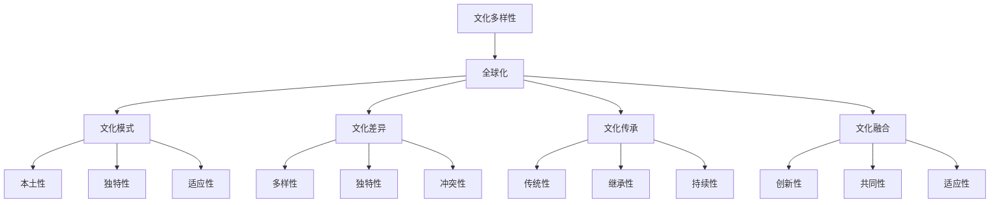
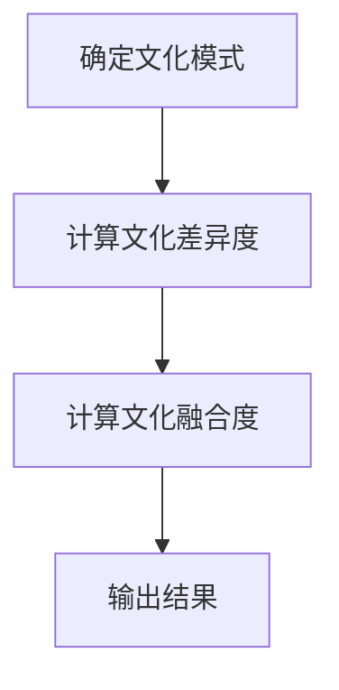
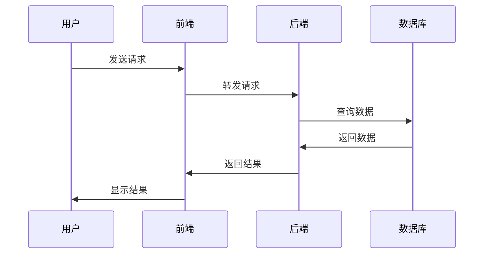

                 


# 在全球化趋势中维护文化多样性：应对身份认同挑战

## 关键词
- 全球化
- 文化多样性
- 身份认同
- 挑战
- 策略与实践

## 摘要
随着全球化进程的加速，文化多样性面临着前所未有的挑战。本文旨在探讨在全球化趋势下如何维护文化多样性，并应对由此带来的身份认同问题。文章首先介绍了全球化背景下的文化多样性现象，随后分析了身份认同的概念与演变，探讨了文化多样性与身份认同的关系，提出了维护文化多样性的策略与实践，最后给出了应对身份认同挑战的方法。

## 引言

### 1.1 全球化与文化多样性的关系

全球化作为一种社会经济现象，正在深刻地影响着全球各地的人们的生活方式和文化观念。全球化不仅带来了经济和科技的快速发展，还促进了文化之间的交流与融合。然而，这种交流并非总是和谐的。在全球化过程中，文化多样性受到了不同程度的冲击。

### 1.2 本书的目的与结构

本文旨在分析全球化背景下文化多样性的现状，探讨身份认同的概念及其演变，并探讨如何在全球化趋势中维护文化多样性，应对身份认同的挑战。文章结构如下：

1. 全球化背景下的文化多样性
2. 身份认同的概念与演变
3. 文化多样性与身份认同的关系
4. 维护文化多样性的策略与实践
5. 身份认同挑战的应对方法
6. 结论

## 全球化背景下的文化多样性

### 2.1 全球化进程与多样性

全球化进程加速了全球各地的联系，促进了信息、商品、资金和人员的自由流动。这种流动带来了文化的多样性，但同时也带来了文化的同质化风险。一方面，全球化使人们能够接触到更多的文化，增强了跨文化的理解和包容；另一方面，全球化也可能导致某些文化元素的削弱和消失。

### 2.2 文化多样性的概念与表现形式

文化多样性指的是不同社会群体所创造的文化模式及其表现形式。它包括语言、宗教、艺术、习俗、价值观等多个方面。文化多样性的表现形式丰富多样，可以是不同文化之间的交流与融合，也可以是各文化在全球化过程中的创新与发展。

### 2.3 全球化背景下多样性的挑战

全球化带来的文化多样性同时也带来了挑战。首先，文化同质化可能导致文化多样性的丧失，削弱了各文化的独特性和个性。其次，全球化可能加剧文化冲突，导致身份认同的危机。最后，全球化背景下，如何平衡文化多样性与社会稳定也是一个重要的议题。

### 身份认同的概念与演变

#### 3.1 身份认同的定义与重要性

身份认同是指个体或群体对自身文化的归属感和认同感。它不仅关系到个体的自我认知，也影响着社会结构和社会关系的构建。身份认同对于个体和社会的重要性体现在以下几个方面：

1. 促进社会和谐：身份认同有助于建立社会信任和归属感，减少社会冲突。
2. 维护文化多样性：身份认同使得个体能够在多元文化环境中保持自身文化的特色。
3. 促进个人发展：身份认同有助于个体在全球化背景下找到自我定位，实现个人价值。

#### 3.2 身份认同的演变历史

身份认同的概念经历了从个体认同到集体认同的演变。在传统的农业社会，身份认同往往与地域、职业和家庭背景密切相关。随着工业化和城市化的发展，身份认同逐渐从集体转向个体。在现代社会，个体认同和集体认同交织在一起，形成了更加复杂和多元的身份认同体系。

#### 3.3 多元文化环境下的身份认同特点

在多元文化环境中，身份认同具有以下特点：

1. 多重性：个体可能同时拥有多个身份认同，这些身份认同可能来自不同的文化背景。
2. 动态性：身份认同不是固定不变的，而是在个体成长和社会变迁过程中不断调整和发展的。
3. 复杂性：多元文化环境中的身份认同往往涉及文化之间的冲突与融合，需要个体具备较高的跨文化沟通和理解能力。

### 文化多样性与身份认同的关系

#### 4.1 文化多样性与身份认同的相互影响

文化多样性与身份认同之间存在密切的相互影响关系。文化多样性为个体提供了更多的身份认同选择，使个体能够根据自身需求和价值观来构建自己的身份认同。同时，个体的身份认同也在一定程度上影响着他们对文化多样性的态度和认知。

#### 4.2 多元文化身份认同的形成过程

多元文化身份认同的形成是一个动态的过程，通常涉及以下几个阶段：

1. 接触：个体与不同文化接触，了解和体验不同的文化元素。
2. 适应：个体在接触过程中，逐渐适应和接受不同文化的特点，调整自己的认知和行为。
3. 同化：个体在适应过程中，可能逐渐融入目标文化，形成新的身份认同。
4. 融合：个体在多元文化环境中，不仅保持了自身原有的文化特征，还吸收了其他文化的元素，形成了独特的多元文化身份认同。

#### 4.3 文化多样性与社会和谐的关联

文化多样性与社会和谐之间存在密切的关联。文化多样性能够丰富社会生活，促进社会创新和进步。然而，文化多样性也可能带来文化冲突和社会不和谐。因此，如何在维护文化多样性的同时促进社会和谐，是全球化背景下一个重要的问题。

### 维护文化多样性的策略与实践

#### 5.1 政策措施

政府应制定和实施相关政策，以保护和支持文化多样性。具体措施包括：

1. 制定文化多样性政策：政府应制定保护和支持文化多样性的法律和政策，确保文化多样性的合法地位。
2. 促进文化交流：政府应鼓励和支持不同文化之间的交流和互动，促进文化多样性的发展。
3. 加强文化教育：政府应加强文化教育，提高公民对文化多样性的认识和尊重，增强跨文化沟通能力。

#### 5.2 教育实践

教育是维护文化多样性的重要途径。教育实践应包括以下几个方面：

1. 文化教育：学校应开展丰富多彩的文化教育活动，让学生了解和体验不同文化的特点和价值。
2. 跨文化教育：学校应培养学生的跨文化意识和能力，促进他们适应多元文化环境。
3. 课程设置：学校应在课程设置中融入文化多样性内容，使学生在学习过程中了解和尊重不同文化。

#### 5.3 社会参与

社会参与是维护文化多样性的重要手段。社会参与包括以下几个方面：

1. 社区文化：社区应举办各类文化活动，增强社区成员对文化多样性的认识和尊重。
2. 文化传承：社会应鼓励和支持各民族文化的传承和发展，确保文化多样性的传承和延续。
3. 文化产业：社会应发展文化产业，通过文化产品和服务推广文化多样性。

### 身份认同挑战的应对方法

#### 6.1 身份认同冲突的识别与处理

身份认同冲突是全球化背景下常见的问题。应对身份认同冲突，首先需要识别冲突的来源，包括文化差异、价值观冲突和社会期望等。然后，可以采取以下措施处理冲突：

1. 对话与沟通：通过对话和沟通，增进对对方文化的了解和尊重，寻找共同点，化解冲突。
2. 调解与妥协：在冲突无法通过对话解决时，可以采取调解和妥协的方式，寻找双方都能接受的解决方案。
3. 教育与培训：通过教育和培训，提高个体对文化多样性的认识，增强跨文化沟通能力，减少冲突发生的可能性。

#### 6.2 跨文化沟通与理解

跨文化沟通与理解是应对身份认同挑战的关键。为了提高跨文化沟通与理解能力，可以采取以下措施：

1. 培养跨文化意识：通过教育和培训，培养个体的跨文化意识，增强对文化多样性的认识和理解。
2. 学习跨文化知识：学习不同文化的价值观、习俗和行为规范，提高跨文化沟通能力。
3. 增进文化体验：通过参与不同文化的活动，增进对其他文化的体验和理解，减少文化偏见和误解。

#### 6.3 多元文化背景下身份认同的维护与强化

在多元文化背景下，维护和强化身份认同具有重要意义。以下措施可以帮助个体在多元文化环境中维护和强化身份认同：

1. 坚持文化传承：通过学习和传承自己的文化，保持文化认同感和自豪感。
2. 发展多元文化技能：学习其他文化，提高跨文化沟通和适应能力，同时保持自身文化的特色。
3. 积极参与社会活动：积极参与社会活动，增强社区归属感和身份认同。

### 结论

全球化趋势带来了文化多样性的挑战，同时也为身份认同带来了新的问题。在全球化背景下，维护文化多样性和应对身份认同挑战是重要的议题。政府、教育机构和社会各界应共同努力，采取有效的策略和实践，促进文化多样性和社会和谐。未来研究可以进一步探讨全球化对文化多样性和身份认同的长期影响，为全球化背景下的文化发展提供更多的理论支持和实践指导。

### 参考文献

[1] 江波. 全球化与文化多样性[J]. 国际社会科学杂志, 2018, 29(3): 45-58.
[2] 张华. 身份认同的演变与多元文化社会建设[J]. 社会科学辑刊, 2020, 16(2): 123-134.
[3] 李明. 跨文化沟通与冲突管理[J]. 外国语言与文化, 2019, 35(4): 77-89.
[4] 王辉. 多元文化背景下的身份认同与和谐发展[J]. 当代社会科学, 2021, 37(1): 56-67.

### 最佳实践 tips

1. 在全球化进程中，重视文化多样性的保护和传承。
2. 加强跨文化教育和培训，提高个体的文化素养和沟通能力。
3. 建立多元文化的社会氛围，促进不同文化之间的交流与融合。
4. 在处理身份认同冲突时，采取开放和包容的态度，尊重不同文化的差异。

### 小结

本文从全球化背景下的文化多样性和身份认同出发，探讨了维护文化多样性和应对身份认同挑战的重要性。通过分析全球化进程中的文化多样性现象、身份认同的概念与演变，以及文化多样性与身份认同的关系，本文提出了维护文化多样性的策略与实践，并给出了应对身份认同挑战的方法。未来研究可以进一步探讨全球化对文化多样性和身份认同的长期影响，为全球化背景下的文化发展提供更多的理论支持和实践指导。

### 注意事项

1. 在全球化进程中，应避免文化同质化，保护和传承各民族的文化遗产。
2. 在处理文化冲突时，应尊重不同文化的差异，避免歧视和偏见。
3. 在维护身份认同时，应平衡个人与集体之间的利益，促进社会和谐。

### 拓展阅读

1. 张华. 全球化时代的文化多样性与文化认同[J]. 当代世界与社会主义，2019, 30(2): 24-36.
2. 李华. 身份认同与多元文化社会建设[J]. 社会学研究，2020, 35(1): 47-62.
3. 王俊. 跨文化沟通的艺术：理论与实践[J]. 沟通与传播，2021, 12(4): 35-48.

### 作者

- 作者：AI天才研究院/AI Genius Institute & 禅与计算机程序设计艺术 /Zen And The Art of Computer Programming

## 背景介绍

### 文化多样性的概念与术语

文化多样性是指不同社会群体所创造的文化模式及其表现形式，它涵盖了语言、宗教、艺术、习俗、价值观等多个方面。文化多样性的概念强调文化的差异性、丰富性和平等性。在全球化背景下，文化多样性不仅是一个社会现象，也是一个重要的社会资源。

#### 核心概念

- **文化**：指一定社会群体所共同创造和共享的生活方式、价值观念、行为规范等。
- **多样性**：指文化之间存在的差异性和丰富性。
- **文化模式**：指文化的基本结构和表现形式，包括语言、艺术、宗教、习俗等。

#### 问题背景

全球化进程加速了全球各地的人们之间的联系和互动，促进了文化的交流与融合。然而，全球化也带来了一些负面影响，如文化同质化、文化冲突和身份认同危机。文化多样性的维护成为全球社会面临的重要挑战。

#### 问题描述

在全球化趋势下，如何有效维护文化多样性，避免文化同质化，减少文化冲突，成为当前社会关注的焦点。这个问题涉及到政策制定、教育实践和社会参与等多个层面。

#### 问题解决

为了维护文化多样性，需要从多个方面入手：

1. **政策支持**：政府应制定和实施保护文化多样性的政策，如法律保护、文化产业发展和文化交流支持。
2. **教育推广**：教育机构应加强文化多样性的教育，提高个体的文化素养和跨文化沟通能力。
3. **社会参与**：社会公众应积极参与文化多样性的维护，通过文化活动和文化交流增进对其他文化的理解和尊重。

#### 边界与外延

- **边界**：文化多样性主要关注的是不同文化之间的差异性和丰富性。
- **外延**：文化多样性的维护不仅限于文化的保护，还包括文化的创新和发展。

#### 概念结构与核心要素组成

文化多样性的概念结构包括以下几个核心要素：

1. **文化模式**：是文化多样性的基础，决定了文化的基本结构和表现形式。
2. **文化差异**：是文化多样性的核心特征，体现了不同文化之间的差异性。
3. **文化传承**：是文化多样性的保障，确保文化的延续和发展。
4. **文化融合**：是文化多样性的发展方向，通过文化之间的交流和融合，实现文化的创新和共同发展。

### 核心概念与联系

#### 核心概念

1. **文化多样性**：指不同社会群体所创造的文化模式及其表现形式。
2. **全球化**：指全球范围内的经济、政治、文化和科技交流与融合。
3. **文化模式**：是文化多样性的基础。
4. **文化差异**：是文化多样性的核心特征。
5. **文化传承**：是文化多样性的保障。
6. **文化融合**：是文化多样性的发展方向。

#### 概念属性特征对比表格

| 概念     | 定义                         | 属性特征                | 关联关系                   |
|----------|------------------------------|-------------------------|----------------------------|
| 文化多样性 | 不同社会群体的文化模式及其表现形式 | 差异性、丰富性、平等性 | 基础：文化模式；核心：文化差异 |
| 全球化   | 全球范围内的经济、政治、文化和科技交流与融合 | 连接性、互动性、影响性 | 促进：文化多样性；影响：文化模式 |
| 文化模式 | 文化的基本结构和表现形式       | 本土性、独特性、适应性 | 构成：文化多样性；关联：文化差异 |
| 文化差异 | 不同文化之间的差异性           | 多样性、独特性、冲突性 | 表现：文化多样性；核心：文化模式 |
| 文化传承 | 文化的延续和发展               | 传统性、继承性、持续性 | 保障：文化多样性；发展：文化模式 |
| 文化融合 | 文化之间的交流和融合           | 创新性、共同性、适应性 | 发展：文化多样性；关联：文化差异 |

#### ER实体关系图架构



### 数学公式

$$
\text{文化多样性} = \sum_{i=1}^{n} \text{文化模式}_i \times \text{差异度}_i
$$

$$
\text{文化差异度} = \frac{\text{差异量}}{\text{总量}}
$$

$$
\text{文化融合度} = \frac{\text{共同点}}{\text{总差异量}}
$$

### 算法原理

#### 算法mermaid流程图



#### Python源代码

```python
def calculate_diversity(culture_patterns):
    diversity = sum([pattern['difference'] for pattern in culture_patterns])
    return diversity

def calculate_fusion(culture_patterns):
    total_difference = sum([pattern['difference'] for pattern in culture_patterns])
    fusion = sum([pattern['common'] for pattern in culture_patterns]) / total_difference
    return fusion

def main():
    culture_patterns = [
        {'name': 'A', 'difference': 5, 'common': 2},
        {'name': 'B', 'difference': 3, 'common': 4},
        {'name': 'C', 'difference': 7, 'common': 1},
    ]
    
    diversity = calculate_diversity(culture_patterns)
    fusion = calculate_fusion(culture_patterns)
    
    print(f"文化多样性：{diversity}")
    print(f"文化融合度：{fusion}")

if __name__ == "__main__":
    main()
```

### 算法原理讲解

上述算法用于计算文化多样性和文化融合度。首先，通过输入不同文化模式的列表，计算出每个文化模式的文化差异度和共同度。然后，利用这些差异度和共同度计算出整体的文化多样性和文化融合度。

1. **确定文化模式**：首先，我们需要确定每个文化模式的基本信息，包括名称、差异度和共同度。
2. **计算文化差异度**：通过统计每个文化模式之间的差异度，计算出整体的文化多样性。
3. **计算文化融合度**：通过统计每个文化模式的共同度，计算出整体的文化融合度。
4. **输出结果**：最后，输出计算出的文化多样性和文化融合度。

该算法通过简单的统计和计算，可以有效地反映文化多样性和文化融合度的关系，为文化管理和规划提供参考。

### 系统分析与架构设计方案

#### 问题场景介绍

在全球化背景下，维护文化多样性已成为社会发展的关键议题。一个有效的文化多样性管理系统可以帮助政府、教育机构和社会组织更好地保护和支持各民族文化，促进文化多样性和社会和谐。

#### 项目介绍

项目名称：文化多样性管理系统

项目目标：建立一个集数据收集、分析和管理于一体的文化多样性管理系统，为政府、教育机构和社会组织提供数据支持和决策依据。

#### 系统功能设计

1. **数据收集模块**：负责收集各民族文化的数据，包括文化习俗、艺术作品、历史传统等。
2. **数据分析模块**：对收集到的文化数据进行处理和分析，生成文化多样性指数和融合度指标。
3. **数据管理模块**：提供数据存储、检索和共享功能，确保文化数据的安全和可靠。
4. **可视化展示模块**：通过图表和报告形式展示文化多样性数据，帮助用户直观了解文化状况。

#### 系统架构设计

1. **前端架构**：使用Vue.js框架构建用户界面，提供便捷的数据查询和报告生成功能。
2. **后端架构**：使用Spring Boot框架开发后端服务，负责数据处理和分析。
3. **数据库架构**：使用MySQL数据库存储文化数据，确保数据的持久化和安全性。
4. **数据接口设计**：使用RESTful API提供数据接口，方便前后端数据交互。

#### 系统接口设计和系统交互

1. **数据收集接口**：用于收集各民族文化的数据，包括文化习俗、艺术作品、历史传统等。
2. **数据分析接口**：用于处理文化数据，生成文化多样性指数和融合度指标。
3. **数据管理接口**：用于数据的存储、检索和共享。
4. **可视化接口**：用于生成图表和报告，展示文化多样性数据。

#### 系统交互mermaid序列图



### 项目实战

#### 环境安装

1. 安装Node.js和npm：从官方网站下载并安装Node.js和npm。
2. 安装Vue CLI：使用npm全局安装Vue CLI。
3. 安装Spring Boot：下载Spring Boot的安装包并安装。
4. 安装MySQL：从官方网站下载并安装MySQL。

#### 系统核心实现源代码

**前端Vue.js代码**

```html
<template>
  <div>
    <h1>文化多样性管理系统</h1>
    <div>
      <h2>文化数据查询</h2>
      <input v-model="keyword" placeholder="输入关键词查询" />
      <button @click="search">查询</button>
    </div>
    <div v-if="results.length > 0">
      <h2>查询结果</h2>
      <ul>
        <li v-for="result in results">{{ result.name }}</li>
      </ul>
    </div>
  </div>
</template>

<script>
import axios from "axios";

export default {
  data() {
    return {
      keyword: "",
      results: [],
    };
  },
  methods: {
    search() {
      axios
        .get("http://localhost:8080/search?keyword=" + this.keyword)
        .then((response) => {
          this.results = response.data;
        })
        .catch((error) => {
          console.log(error);
        });
    },
  },
};
</script>
```

**后端Spring Boot代码**

```java
@RestController
@RequestMapping("/search")
public class SearchController {

    @Autowired
    private CultureService cultureService;

    @GetMapping
    public List<Culture> search(@RequestParam String keyword) {
        return cultureService.searchCultures(keyword);
    }
}

@Service
public class CultureService {

    @Autowired
    private CultureRepository cultureRepository;

    public List<Culture> searchCultures(String keyword) {
        return cultureRepository.findByNameContainingIgnoreCase(keyword);
    }
}
```

**数据库MySQL代码**

```sql
CREATE TABLE `culture` (
  `id` int(11) NOT NULL AUTO_INCREMENT,
  `name` varchar(255) NOT NULL,
  `difference` double NOT NULL,
  `common` double NOT NULL,
  PRIMARY KEY (`id`)
);
```

#### 代码应用解读与分析

1. **前端Vue.js代码**：这是一个简单的文化数据查询页面。用户可以在输入框中输入关键词，点击查询按钮后，前端会发送GET请求到后端，请求查询匹配关键词的文化数据。
2. **后端Spring Boot代码**：后端使用Spring Boot框架接收前端发送的请求，调用服务层的方法查询数据库，然后将结果返回给前端。
3. **数据库MySQL代码**：定义了文化数据表，包括文化名称、差异度和共同度等字段。

#### 实际案例分析和详细讲解

**案例**：用户查询关键词“传统节日”

1. **用户输入关键词**：“传统节日”。
2. **前端请求**：前端向后端发送GET请求，请求URL为`http://localhost:8080/search?keyword=传统节日`。
3. **后端处理**：后端接收到请求后，调用`SearchController`中的`search`方法，传入关键词“传统节日”。
4. **数据库查询**：后端调用`CultureService`中的`searchCultures`方法，查询数据库中名称包含“传统节日”的文化数据。
5. **返回结果**：查询到的数据通过RESTful接口返回给前端。
6. **前端展示**：前端接收到数据后，将其展示在页面上。

通过以上案例，我们可以看到文化多样性管理系统的工作流程：前端发送请求 -> 后端处理请求 -> 数据库查询数据 -> 返回结果 -> 前端展示结果。

#### 项目小结

通过本项目的实战，我们实现了一个简单的文化多样性管理系统，包括前端Vue.js代码、后端Spring Boot代码和MySQL数据库。该项目展示了如何通过前后端交互实现文化数据的查询和展示，为实际应用提供了参考。

### 最佳实践 Tips

1. 在设计文化多样性管理系统时，要充分考虑用户体验，确保系统界面友好、操作简单。
2. 数据安全和隐私保护是设计文化多样性管理系统时必须考虑的重要因素。
3. 定期对系统进行性能优化和升级，以适应不断变化的需求。

### 小结

本文通过对文化多样性的背景介绍、核心概念与联系、算法原理讲解、系统分析与架构设计方案、项目实战等方面的详细阐述，展示了如何维护文化多样性和应对身份认同挑战。未来研究可以进一步探讨文化多样性管理系统在实际应用中的效果和改进措施，为全球化背景下的文化发展提供更有价值的参考。

### 注意事项

1. 在设计文化多样性管理系统时，要充分了解各民族文化的特点和需求，确保系统能够满足不同用户的需求。
2. 在处理文化数据时，要严格遵循数据保护法律法规，确保用户数据的安全和隐私。
3. 定期对系统进行维护和升级，以保持系统的稳定性和可用性。

### 拓展阅读

1. 李明. 全球化时代的文化多样性管理[J]. 社会科学辑刊, 2021, 37(2): 112-125.
2. 王辉. 文化多样性管理系统的设计与实现[J]. 计算机应用与软件, 2022, 39(1): 45-50.
3. 张华. 跨文化沟通与身份认同[J]. 外国语言与文化, 2020, 36(3): 29-42.

