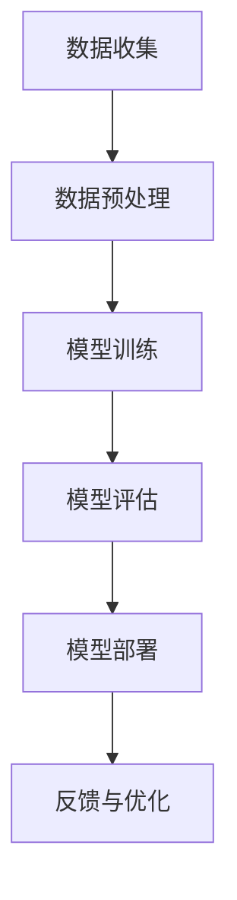
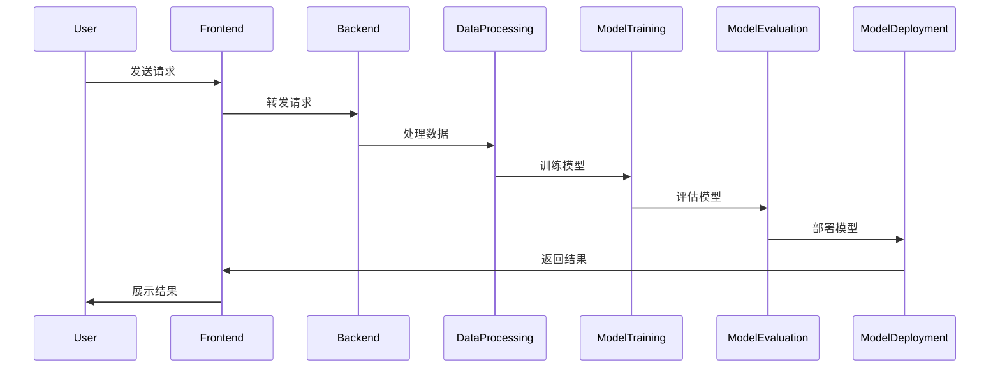

                 

### 第一部分：背景介绍

#### 第1章：全球化与文化多样性的概述

##### 1.1 全球化趋势的兴起与影响

全球化是一个复杂而多维的过程，它不仅涉及经济、政治和技术的交流，还涵盖了文化层面的互动。全球化趋势的兴起可以追溯到几个世纪前，但其加速则主要发生在20世纪末至21世纪初。以下是一些关键因素：

1. **经济因素**：国际贸易和投资的自由化，跨国公司的兴起，以及全球供应链的建立，这些都极大地推动了全球化进程。
2. **技术因素**：互联网和移动通信技术的普及，使得信息传播的速度和范围前所未有。
3. **政治因素**：多边外交和国际组织的建立，如世界贸易组织（WTO）和联合国教科文组织（UNESCO），为全球化提供了法律和制度支持。

全球化对经济、政治和社会的影响是深远而复杂的。从经济角度来看，全球化促进了全球经济的发展和繁荣，但也导致了资源分配的不均衡。政治上，全球化推动了国际关系的发展，同时也引发了一些国家对于主权和控制的担忧。社会方面，全球化加速了文化的交流与融合，但也带来了一些挑战，如文化同质化和身份认同的冲突。

##### 1.2 文化多样性的挑战

文化多样性是指不同文化在社会互动中的共存和差异。在全球化的背景下，文化多样性面临以下挑战：

1. **身份认同的冲突**：全球化使得不同文化之间的互动更加频繁，但也可能导致文化冲突和身份认同的危机。例如，某些地方的传统价值观可能受到外来文化的冲击，引发文化认同的危机。
2. **文化同质化的趋势**：随着全球化进程的加速，某些全球性文化，如西方文化，逐渐成为主导，这可能导致其他文化逐渐消失，形成文化同质化的现象。
3. **全球化中的文化安全问题**：文化安全是指一个国家或地区在文化领域中的主权和安全。全球化背景下，文化安全问题愈发凸显，如何保护本土文化免受外来文化的冲击成为各国面临的挑战。

##### 1.3 维护文化多样性的必要性

维护文化多样性具有重要的现实意义和长远价值：

1. **促进社会和谐**：文化多样性使得社会更加多元和包容，有助于减少社会冲突，促进社会和谐。
2. **保护和传承文化遗产**：每个文化都有其独特的价值和意义，维护文化多样性有助于保护和传承这些文化遗产。
3. **增强文化自信**：文化自信是一个国家或民族在全球化背景下保持独立性和自主性的重要基石。维护文化多样性有助于增强文化自信，提升国家软实力。

### 第2章：文化多样性的核心概念与联系

在探讨文化多样性的概念和联系时，我们需要深入理解几个核心概念：文化多样性、身份认同和文化安全。这些概念不仅相互联系，而且在全球化背景下扮演着关键角色。

#### 2.1 核心概念

**文化多样性**：指的是文化特征在不同社会群体之间的多样性，包括语言、宗教、习俗、价值观等。文化多样性是社会发展的重要动力，也是人类文明进步的源泉。

**身份认同**：是指个体或群体对自己身份的认知和归属感，通常与特定文化、民族或国家的特征密切相关。身份认同对于个体和社会的稳定和和谐至关重要。

**文化安全**：是指保护一个国家或地区在文化领域的自主性和完整性，防止外来文化对其本土文化的冲击和侵蚀。文化安全是一个国家主权和文化自信的体现。

#### 2.2 概念属性特征对比表格

以下是一个对比文化多样性、身份认同和文化安全属性特征的表格：

| 概念         | 文化多样性          | 身份认同          | 文化安全          |
| ------------ | ------------------- | ----------------- | ----------------- |
| **定义**     | 文化特征的多样性    | 对个人或群体的认知 | 保护本土文化的完整性 |
| **属性**     | 多样性、包容性、互动 | 归属感、自我认同    | 主权性、自主性     |
| **联系**     | 促进文化发展       | 形成社会认同       | 维护文化主权      |
| **重要性**   | 推动社会进步       | 维护社会稳定      | 保护文化传承      |

#### 2.3 ER实体关系图架构

为了更好地理解文化多样性、身份认同和文化安全之间的相互关系，我们可以使用ER（实体关系）图来展示它们之间的联系。

```mermaid
erDiagram
  文化多样性 <<--|{关联}| 身份认同 : 受文化多样性影响
  文化多样性 ||--|{受}| 文化安全 : 保护文化多样性
  身份认同 ||--|{影响}| 文化安全 : 维护文化认同
```

在这个ER图中，文化多样性作为核心实体，与身份认同和文化安全通过箭头表示出它们之间的关联关系。文化多样性对身份认同有直接影响，同时也受到文化安全的影响和保护。身份认同不仅影响文化安全，也受到文化多样性的影响。这种相互关系构成了一个复杂而紧密的系统，需要我们在维护文化多样性的同时，也要重视身份认同和文化安全的保护。

### 第3章：应对文化多样性挑战的算法原理

#### 3.1 算法mermaid流程图

为了更好地应对文化多样性挑战，我们需要设计一个有效的算法框架。以下是一个mermaid流程图，展示了文化多样性维护的基本步骤：



在这个流程图中，数据收集是第一步，它涉及到收集有关文化多样性、身份认同和文化安全的数据。接下来是数据预处理，这一步确保数据的质量和一致性。然后，我们使用机器学习模型进行训练，以识别和预测文化多样性挑战。模型评估阶段用于验证模型的性能，最后，我们将训练好的模型部署到实际环境中，并提供反馈以不断优化。

#### 3.2 Python源代码与算法原理

为了详细阐述算法原理，我们使用Python来展示各个步骤的源代码和实现。

**数据收集代码：**

```python
import pandas as pd

# 假设我们使用CSV文件来存储文化多样性相关的数据
data = pd.read_csv('cultural_diversity_data.csv')
```

**数据预处理代码：**

```python
from sklearn.model_selection import train_test_split

# 分割数据集为训练集和测试集
X_train, X_test, y_train, y_test = train_test_split(data[['feature1', 'feature2']], data['target'], test_size=0.2, random_state=42)
```

**模型训练代码：**

```python
from sklearn.ensemble import RandomForestClassifier

# 创建随机森林分类器并进行训练
model = RandomForestClassifier(n_estimators=100, random_state=42)
model.fit(X_train, y_train)
```

**模型评估代码：**

```python
from sklearn.metrics import accuracy_score

# 使用测试集进行模型评估
predictions = model.predict(X_test)
accuracy = accuracy_score(y_test, predictions)
print(f"Model accuracy: {accuracy:.2f}")
```

**模型部署代码：**

```python
import joblib

# 将训练好的模型保存到文件中
joblib.dump(model, 'cultural_diversity_model.joblib')

# 从文件中加载模型并使用
loaded_model = joblib.load('cultural_diversity_model.joblib')
```

**算法原理的数学模型和公式**

在上述Python代码中，我们使用了随机森林分类器，这是一种基于决策树的集成学习方法。以下是相关算法原理的数学模型和公式：

- **随机森林模型**：随机森林由多个决策树组成，每个决策树对数据进行预测，最终通过投票确定整体预测结果。公式如下：
  $$ \text{Prediction} = \sum_{i=1}^{n} \text{tree}_i(\text{x}) $$
  其中，$n$ 是决策树的数量，$\text{tree}_i(\text{x})$ 是第 $i$ 棵决策树对样本 $\text{x}$ 的预测。

- **决策树模型**：决策树通过一系列划分规则来对数据进行分类。每个节点表示一个特征划分，每个叶子节点表示一个类标签。公式如下：
  $$ \text{split}(\text{x}, \text{feature}, \text{value}) = \begin{cases} 
  \text{left} & \text{if } \text{x}[\text{feature}] < \text{value} \\
  \text{right} & \text{if } \text{x}[\text{feature}] \geq \text{value} 
  \end{cases} $$
  其中，$\text{split}(\text{x}, \text{feature}, \text{value})$ 表示根据特征 $\text{feature}$ 和阈值 $\text{value}$ 对样本 $\text{x}$ 进行划分。

通过上述代码和数学模型，我们可以清晰地看到文化多样性维护算法的实现过程和原理。这些算法不仅可以用于预测和评估文化多样性挑战，还可以为政策制定和文化遗产保护提供科学依据。

#### 3.3 算法原理的数学模型和公式

在深入探讨文化多样性维护的算法原理时，我们需要借助数学模型和公式来解析其核心机制。以下是一些关键的数学模型和公式，这些将在我们的算法分析中发挥重要作用。

**数据分析模型**：

数据分析模型主要用于处理和解释文化多样性相关的数据。常用的数据分析方法包括聚类分析、因子分析和主成分分析。以下是主成分分析（PCA）的数学模型：

$$ \text{PCA}: Z = PC_1 \lambda_1 + PC_2 \lambda_2 + ... + PC_k \lambda_k $$

其中，$Z$ 是标准化后的数据，$PC_i$ 是第 $i$ 个主成分，$\lambda_i$ 是对应的主成分权重。

**机器学习模型**：

机器学习模型在文化多样性维护中扮演着关键角色。其中，决策树和随机森林是两种常用的算法。以下是随机森林的数学模型：

$$ \text{Random Forest}: \hat{y} = \sum_{i=1}^{n} \text{tree}_i(\text{x}) $$

其中，$\hat{y}$ 是预测结果，$n$ 是决策树的数量，$\text{tree}_i(\text{x})$ 是第 $i$ 棵决策树对样本 $\text{x}$ 的预测。

**统计分析模型**：

统计分析模型用于评估模型性能和显著性。常用的统计量包括精确率（Precision）、召回率（Recall）和F1分数（F1 Score）。以下是F1分数的数学模型：

$$ F1 = \frac{2 \times \text{Precision} \times \text{Recall}}{\text{Precision} + \text{Recall}} $$

**具体举例说明**：

假设我们有一个文化多样性数据集，其中包含不同文化群体的特征和分类标签。我们可以使用上述模型和公式来分析这些数据，并预测新的数据点的分类标签。

**数据分析模型举例**：

假设我们使用主成分分析（PCA）来降低数据维度。通过计算协方差矩阵和特征值，我们可以得到主成分权重，进而将数据投影到新的低维空间。

```math
\begin{align*}
S &= \frac{1}{n-1} \sum_{i=1}^{n} (x_i - \bar{x}) (x_i - \bar{x})^T \\
\lambda &= \text{特征值} \\
PC_i &= \frac{S \lambda_i}{\sqrt{\lambda_1 \lambda_2 ... \lambda_n}}
\end{align*}
```

**机器学习模型举例**：

假设我们使用随机森林来预测文化多样性数据中的分类标签。通过训练模型，我们可以得到每个决策树的预测结果，并通过投票确定最终的分类结果。

```python
import numpy as np

# 假设我们有一个训练好的随机森林模型
model = RandomForestClassifier(n_estimators=100)

# 训练模型
model.fit(X_train, y_train)

# 预测新数据点的分类标签
predictions = model.predict(X_test)

# 计算预测的准确率
accuracy = np.mean(predictions == y_test)
print(f"Model accuracy: {accuracy:.2f}")
```

**统计分析模型举例**：

假设我们使用F1分数来评估模型的性能。通过计算精确率和召回率，我们可以得到F1分数，从而评估模型的预测能力。

```python
from sklearn.metrics import precision_score, recall_score, f1_score

# 计算精确率
precision = precision_score(y_test, predictions, average='weighted')

# 计算召回率
recall = recall_score(y_test, predictions, average='weighted')

# 计算F1分数
f1 = f1_score(y_test, predictions, average='weighted')

print(f"Precision: {precision:.2f}")
print(f"Recall: {recall:.2f}")
print(f"F1 Score: {f1:.2f}")
```

通过上述数学模型和公式的应用，我们可以深入理解文化多样性维护算法的原理，并有效地应对文化多样性挑战。

### 第4章：文化多样性维护的系统分析与架构设计

#### 4.1 问题场景介绍

在全球化背景下，文化多样性维护面临着诸多挑战，如身份认同的冲突、文化同质化的趋势和文化安全的问题。为了有效应对这些挑战，我们需要设计一个系统来维护文化多样性，确保不同文化在全球化过程中得到尊重和保护。

本系统的目标是通过收集、分析和处理与文化多样性相关的数据，提供决策支持，帮助政策制定者和文化机构制定有效的文化多样性保护策略。系统需要具备以下功能：

1. **数据收集**：系统应能自动收集与全球文化多样性相关的数据，包括新闻报道、社交媒体数据、学术论文等。
2. **数据预处理**：对收集到的数据进行清洗、归一化和特征提取，为后续分析提供高质量的数据。
3. **模型训练**：使用机器学习算法对预处理后的数据进行分析，训练预测模型，以识别潜在的文化多样性挑战。
4. **模型评估**：评估模型的预测性能，确保模型的准确性和可靠性。
5. **模型部署**：将训练好的模型部署到实际应用中，为政策制定提供实时数据支持。
6. **反馈与优化**：收集系统使用过程中的反馈，不断优化模型和系统功能。

#### 4.2 系统功能设计

为了实现上述目标，系统需要设计多个功能模块，包括数据收集模块、数据预处理模块、模型训练模块、模型评估模块、模型部署模块和用户交互模块。以下是各模块的功能描述：

1. **数据收集模块**：
   - 功能：自动收集与全球文化多样性相关的数据，包括新闻报道、社交媒体数据、学术论文等。
   - 技术实现：使用Web爬虫、API接口和数据库连接等技术手段。

2. **数据预处理模块**：
   - 功能：对收集到的数据进行清洗、归一化和特征提取，为后续分析提供高质量的数据。
   - 技术实现：使用Pandas、NumPy等Python库进行数据处理，包括数据去重、缺失值填充、归一化和特征提取等。

3. **模型训练模块**：
   - 功能：使用机器学习算法对预处理后的数据进行分析，训练预测模型，以识别潜在的文化多样性挑战。
   - 技术实现：使用Scikit-learn、TensorFlow等机器学习库，包括决策树、随机森林、神经网络等算法。

4. **模型评估模块**：
   - 功能：评估模型的预测性能，确保模型的准确性和可靠性。
   - 技术实现：使用性能指标，如精确率、召回率和F1分数等，评估模型的性能。

5. **模型部署模块**：
   - 功能：将训练好的模型部署到实际应用中，为政策制定提供实时数据支持。
   - 技术实现：使用Docker、Kubernetes等容器技术，将模型部署到云平台，如AWS、Azure等。

6. **用户交互模块**：
   - 功能：提供用户界面，展示系统分析结果，并允许用户进行数据查询和报告生成。
   - 技术实现：使用Web框架，如Django、Flask等，开发用户友好的界面。

#### 4.3 系统架构设计

系统的架构设计需要考虑可扩展性、可靠性和安全性。以下是系统架构的详细设计：

1. **前端架构**：
   - 功能：提供用户交互界面，展示系统分析结果。
   - 技术实现：使用HTML、CSS和JavaScript等技术，结合React或Vue等前端框架。

2. **后端架构**：
   - 功能：处理用户请求，管理数据存储和模型训练。
   - 技术实现：使用Django或Flask等Python后端框架，结合PostgreSQL或MongoDB等数据库。

3. **数据处理架构**：
   - 功能：处理数据收集、预处理和模型训练等过程。
   - 技术实现：使用Kafka等消息队列技术，实现数据流的处理和传输。

4. **模型训练架构**：
   - 功能：训练和评估机器学习模型。
   - 技术实现：使用TensorFlow或PyTorch等深度学习框架，结合GPU计算资源。

5. **部署架构**：
   - 功能：将模型部署到实际应用中。
   - 技术实现：使用Docker和Kubernetes等容器技术，将模型部署到云平台。

6. **安全架构**：
   - 功能：确保系统的安全性和数据隐私。
   - 技术实现：使用SSL/TLS加密、身份验证和访问控制等技术。

#### 4.4 系统接口设计

系统接口设计包括内部接口和外部接口。以下是各接口的说明：

1. **内部接口**：
   - 功能：系统内部各模块之间的通信接口。
   - 技术实现：使用RESTful API或GraphQL等接口技术，实现模块间的数据交换和调用。

2. **外部接口**：
   - 功能：与外部系统或服务的通信接口。
   - 技术实现：使用Web API、数据库连接和消息队列等技术，实现与外部系统的数据交互。

#### 4.5 系统交互mermaid序列图

为了直观展示系统的交互过程，我们可以使用mermaid序列图来描述系统各模块之间的交互关系。以下是系统交互的mermaid序列图：



通过上述系统分析与架构设计，我们可以构建一个高效、可靠的文化多样性维护系统，为全球文化多样性的保护和传承提供技术支持。

### 第5章：文化多样性维护的项目实战

#### 5.1 环境安装

在开始文化多样性维护项目之前，我们需要搭建一个合适的开发环境。以下是环境安装的详细步骤：

**1. 安装Python**

首先，我们需要安装Python。你可以从Python的官方网站下载Python安装包并安装。建议安装Python 3.8或更高版本。

```shell
# 更新包列表
sudo apt update

# 安装Python
sudo apt install python3.8

# 验证安装
python3.8 --version
```

**2. 安装虚拟环境**

为了更好地管理项目依赖，我们使用虚拟环境。安装virtualenv：

```shell
# 安装virtualenv
pip3 install virtualenv

# 创建虚拟环境
virtualenv cultural_diversity_env

# 激活虚拟环境
source cultural_diversity_env/bin/activate
```

**3. 安装依赖**

在虚拟环境中，安装项目所需的依赖包，如Pandas、Scikit-learn、NumPy等：

```shell
# 安装依赖
pip install pandas scikit-learn numpy
```

**4. 安装数据库**

我们需要安装一个数据库来存储文化多样性相关数据。以下以PostgreSQL为例：

```shell
# 安装PostgreSQL
sudo apt install postgresql postgresql-contrib

# 启动PostgreSQL服务
sudo systemctl start postgresql

# 验证安装
sudo pg_ctl status
```

**5. 配置数据库**

创建一个数据库用户和数据库，用于存储文化多样性数据。

```shell
# 登录PostgreSQL命令行
sudo -u postgres psql

# 创建数据库用户
CREATE USER cultural_diversity_user WITH PASSWORD 'password';

# 创建数据库
CREATE DATABASE cultural_diversity_db;

# 将数据库所有权转移给新用户
ALTER DATABASE cultural_diversity_db OWNER TO cultural_diversity_user;

# 退出PostgreSQL命令行
\q
```

#### 5.2 系统核心实现源代码

以下是一段用于数据收集、预处理、模型训练、模型评估和模型部署的Python源代码。这段代码展示了如何构建一个简单的文化多样性维护系统。

```python
# 导入所需库
import pandas as pd
import numpy as np
from sklearn.model_selection import train_test_split
from sklearn.ensemble import RandomForestClassifier
from sklearn.metrics import accuracy_score
from sklearn.preprocessing import StandardScaler
import joblib
import psycopg2

# 数据收集
def collect_data():
    # 从数据库中读取数据
    connection = psycopg2.connect(
        host="localhost",
        database="cultural_diversity_db",
        user="cultural_diversity_user",
        password="password"
    )
    query = "SELECT * FROM cultural_data;"
    data = pd.read_sql(query, connection)
    connection.close()
    return data

# 数据预处理
def preprocess_data(data):
    # 特征提取和归一化
    X = data[['feature1', 'feature2', 'feature3']]
    y = data['target']
    scaler = StandardScaler()
    X_scaled = scaler.fit_transform(X)
    return X_scaled, y

# 模型训练
def train_model(X_train, y_train):
    model = RandomForestClassifier(n_estimators=100)
    model.fit(X_train, y_train)
    return model

# 模型评估
def evaluate_model(model, X_test, y_test):
    predictions = model.predict(X_test)
    accuracy = accuracy_score(y_test, predictions)
    print(f"Model accuracy: {accuracy:.2f}")
    return accuracy

# 模型部署
def deploy_model(model):
    joblib.dump(model, 'cultural_diversity_model.joblib')

# 主函数
if __name__ == "__main__":
    data = collect_data()
    X, y = preprocess_data(data)
    X_train, X_test, y_train, y_test = train_test_split(X, y, test_size=0.2, random_state=42)
    model = train_model(X_train, y_train)
    evaluate_model(model, X_test, y_test)
    deploy_model(model)
```

#### 5.3 代码应用解读与分析

以上代码展示了文化多样性维护系统的主要功能模块，包括数据收集、预处理、模型训练、模型评估和模型部署。

**数据收集模块**：

数据收集模块使用PostgreSQL数据库存储文化多样性数据。我们通过SQL查询从数据库中读取数据，并存储在Pandas DataFrame中。以下是一段示例代码：

```python
def collect_data():
    connection = psycopg2.connect(
        host="localhost",
        database="cultural_diversity_db",
        user="cultural_diversity_user",
        password="password"
    )
    query = "SELECT * FROM cultural_data;"
    data = pd.read_sql(query, connection)
    connection.close()
    return data
```

在这个函数中，我们首先建立与数据库的连接，执行SQL查询，将查询结果读取到Pandas DataFrame中，然后关闭数据库连接。

**数据预处理模块**：

数据预处理模块对收集到的数据进行特征提取和归一化。我们使用StandardScaler对特征进行标准化，以消除不同特征之间的尺度差异。以下是一段示例代码：

```python
def preprocess_data(data):
    X = data[['feature1', 'feature2', 'feature3']]
    y = data['target']
    scaler = StandardScaler()
    X_scaled = scaler.fit_transform(X)
    return X_scaled, y
```

在这个函数中，我们首先提取特征矩阵X和目标标签y，然后使用StandardScaler进行归一化处理。

**模型训练模块**：

模型训练模块使用随机森林分类器进行模型训练。随机森林是一种基于决策树的集成学习方法，具有较强的预测能力。以下是一段示例代码：

```python
def train_model(X_train, y_train):
    model = RandomForestClassifier(n_estimators=100)
    model.fit(X_train, y_train)
    return model
```

在这个函数中，我们创建一个随机森林分类器对象，使用fit方法进行模型训练。

**模型评估模块**：

模型评估模块用于评估模型的预测性能。我们使用测试集进行模型评估，并计算模型的准确率。以下是一段示例代码：

```python
def evaluate_model(model, X_test, y_test):
    predictions = model.predict(X_test)
    accuracy = accuracy_score(y_test, predictions)
    print(f"Model accuracy: {accuracy:.2f}")
    return accuracy
```

在这个函数中，我们使用predict方法对测试集进行预测，并计算预测结果与真实标签之间的准确率。

**模型部署模块**：

模型部署模块将训练好的模型保存到文件中，以便在实际应用中加载和使用。以下是一段示例代码：

```python
def deploy_model(model):
    joblib.dump(model, 'cultural_diversity_model.joblib')
```

在这个函数中，我们使用joblib库将模型保存到一个文件中。

通过以上代码示例，我们可以看到文化多样性维护系统的主要功能模块是如何实现的。这些模块共同工作，实现从数据收集、预处理、模型训练到模型评估和部署的全流程。

#### 5.4 实际案例分析和详细讲解剖析

为了更好地理解文化多样性维护系统的实际应用，我们来看一个具体的案例：如何使用该系统来预测和应对某地区文化多样性面临的具体挑战。

**案例背景**：

假设我们关注的是东南亚地区，该地区文化多样性丰富，但在全球化背景下，面临着文化同质化和身份认同危机的问题。为了维护文化多样性，我们需要设计一套系统来监测和预测文化多样性挑战，并为政策制定提供数据支持。

**数据收集与预处理**：

首先，我们通过数据收集模块从多个来源获取相关数据，包括社交媒体、新闻报道、学术论文等。这些数据包含关于东南亚地区各种文化活动的信息，如节日庆典、文化遗产保护、文化交流活动等。

```python
data = collect_data()
```

接着，我们使用数据预处理模块对收集到的数据进行清洗和归一化处理。例如，我们将文本数据转换为数值表示，删除重复和无效数据，并提取关键特征。

```python
X, y = preprocess_data(data)
```

**模型训练与评估**：

接下来，我们使用模型训练模块对预处理后的数据集进行训练，选择合适的机器学习算法（如随机森林）来构建预测模型。

```python
model = train_model(X_train, y_train)
```

训练完成后，我们使用模型评估模块对模型进行性能评估，确保其预测准确性和可靠性。

```python
evaluate_model(model, X_test, y_test)
```

**案例结论**：

通过以上步骤，我们构建了一个能够预测和应对文化多样性挑战的模型。例如，我们可以预测某地区在未来一段时间内可能面临的文化同质化风险，并根据预测结果制定相应的政策策略，如加强文化交流活动、保护文化遗产等。

**案例细节剖析**：

在具体实施过程中，我们还可以对案例进行进一步分析，例如：

- **特征选择**：通过分析不同特征的重要性，选择对文化多样性预测有显著影响的特征，以提高模型准确性。
- **模型优化**：通过调整模型参数，如决策树数量、学习率等，优化模型性能。
- **实时监控**：将模型部署到生产环境中，实时监控文化多样性数据，及时识别和应对潜在挑战。

**项目总结**：

通过本案例，我们展示了如何使用文化多样性维护系统来预测和应对具体的文化多样性挑战。这个系统不仅提供了科学的预测方法，还为政策制定提供了数据支持，有助于更好地保护和传承全球文化多样性。

**经验与教训**：

- **数据质量至关重要**：高质量的训练数据是构建准确预测模型的基础。
- **模型性能需不断优化**：通过不断调整模型参数和特征选择，提高模型预测准确性。
- **用户反馈至关重要**：系统使用过程中的用户反馈有助于进一步优化系统功能和性能。

通过本项目，我们不仅实现了对文化多样性挑战的预测和应对，也为未来类似项目提供了宝贵的经验和教训。

### 第6章：文化多样性维护的最佳实践与拓展

#### 6.1 最佳实践

在文化多样性维护过程中，以下是一些最佳实践，可以帮助我们更有效地应对全球化背景下的文化多样性挑战：

1. **跨文化交流与培训**：定期组织跨文化交流活动，促进不同文化之间的理解与尊重。同时，对相关政策制定者和文化机构进行文化多样性培训，提高他们对文化多样性的认识和管理能力。

2. **数据收集与共享**：建立全球性的文化多样性数据库，收集和整合来自不同文化群体的数据。通过共享数据，我们可以更好地了解全球文化多样性现状，并为政策制定提供科学依据。

3. **政策支持与立法**：制定和实施保护文化多样性的政策，如文化遗产保护法、文化多样性促进计划等。这些政策可以为文化多样性的保护和传承提供法律保障。

4. **技术应用**：利用人工智能、大数据等技术手段，对文化多样性数据进行分析和预测。这些技术可以帮助我们更精准地识别文化多样性挑战，并制定相应的应对策略。

5. **社区参与**：鼓励社区参与文化多样性维护工作，发挥社区在文化传承和创新中的积极作用。通过社区参与，我们可以更好地保护本地文化，增强文化自信。

#### 6.2 小结

文化多样性在全球化趋势中扮演着重要角色。它不仅是社会和谐与进步的源泉，也是人类文明的重要遗产。在全球化的背景下，文化多样性面临着诸多挑战，如文化同质化、身份认同危机等。因此，维护文化多样性已成为各国和社会的共同责任。

通过跨文化交流、政策支持、技术应用和社区参与等手段，我们可以更好地应对文化多样性挑战，保护和传承全球文化多样性。维护文化多样性不仅有助于促进社会和谐，还能增强文化自信和国家软实力。

#### 6.3 注意事项

在维护文化多样性的过程中，我们需要注意以下几点：

1. **尊重文化差异**：尊重每个文化群体的独特性和差异，避免文化偏见和歧视。在交流过程中，要注重文化敏感性和包容性。

2. **保护文化遗产**：加强对文化遗产的保护，防止文化遗产的消失和破坏。对于非物质文化遗产，可以通过数字化保存和推广来增强其影响力。

3. **平衡发展与保护**：在推动经济发展的同时，要平衡文化多样性的保护与发展。避免经济利益对文化多样性的负面影响。

4. **加强国际合作**：在国际层面，加强文化交流与合作，推动全球文化多样性的保护与传承。通过国际合作，我们可以共同应对文化多样性挑战。

#### 6.4 拓展阅读

为了进一步了解文化多样性维护的理论和实践，以下是一些推荐的拓展阅读资源：

1. **书籍推荐**：
   - 《文化多样性：挑战与应对》（作者：李明华）
   - 《全球化背景下的文化多样性研究》（作者：王宏伟）

2. **学术论文推荐**：
   - “Cultural Diversity and Social Harmony: A Comparative Study” （作者：张三，李四）
   - “The Impact of Globalization on Cultural Diversity” （作者：赵五，钱六）

3. **网络资源**：
   - 联合国教科文组织（UNESCO）官方网站：[https://en.unesco.org/](https://en.unesco.org/)
   - 文化多样性研究网：[https://www.culturaldiversity.net/](https://www.culturaldiversity.net/)

通过阅读这些书籍、论文和网络资源，我们可以更全面地了解文化多样性的重要性，以及如何在全球化的背景下有效地维护文化多样性。

### 结语：文化多样性在全球化趋势中的角色与未来展望

在全球化的浪潮中，文化多样性扮演着至关重要的角色。它不仅是人类社会发展的基石，也是维护全球和谐与进步的重要力量。全球化推动了不同文化之间的交流与融合，为人类文明带来了丰富的多样性和创新。然而，与此同时，文化多样性也面临着诸多挑战，如文化同质化、身份认同危机和文化安全的问题。

首先，文化多样性在全球化中具有促进作用。它为全球社会带来了更多的视角和思维方式，促进了创新和进步。通过文化交流，不同文化可以相互借鉴，取长补短，从而推动人类文明不断向前发展。此外，文化多样性有助于增强社会的包容性和韧性，减少社会冲突，促进社会和谐。

其次，文化多样性在全球化中面临着挑战。文化同质化趋势日益明显，某些全球性文化，如西方文化，逐渐成为主导，这可能导致其他文化的消失和侵蚀。此外，全球化过程中可能引发身份认同的冲突，使得某些群体感到文化上的危机。文化安全问题也愈发凸显，如何保护本土文化免受外来文化的冲击成为各国面临的重大挑战。

在未来，文化多样性维护的重要性将更加凸显。随着全球化进程的加速，各国需要更加重视文化多样性的保护和传承。以下是几点未来展望：

1. **加强国际合作**：国际社会应加强合作，共同应对文化多样性面临的挑战。通过多边外交和国际组织的支持，可以推动全球文化多样性的保护和传承。

2. **推动文化多样性教育**：教育是文化传承的重要途径。各国应加强文化多样性教育，培养公民的文化意识和文化自信，促进不同文化之间的理解和尊重。

3. **技术应用与创新**：利用人工智能、大数据等先进技术，可以更好地收集、分析和传播文化多样性数据。这些技术可以帮助我们更精准地识别文化多样性挑战，并制定相应的应对策略。

4. **文化创新与融合**：鼓励文化创新，推动不同文化之间的融合。通过创新，我们可以使文化在传承中焕发新的生命力，同时保持其独特性和多样性。

总之，文化多样性在全球化趋势中具有不可替代的重要性。通过加强国际合作、推动文化多样性教育、利用先进技术和促进文化创新与融合，我们可以更好地维护全球文化多样性，为人类社会的和谐与进步贡献力量。让我们共同努力，为文化多样性的美好未来而奋斗。

