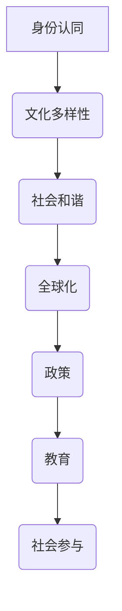

                 


## 在全球化趋势中维护文化多样性：应对身份认同挑战

### 关键词
全球化、文化多样性、身份认同、策略与实践、挑战应对

### 摘要
本文旨在探讨全球化趋势下文化多样性的维护与身份认同挑战的应对策略。通过对全球化背景下文化多样性的现象分析，我们深入探讨了身份认同的概念与演变，进而阐述了文化多样性与身份认同之间的关系。在此基础上，文章提出了维护文化多样性的策略与实践方法，并详细探讨了身份认同挑战的应对策略。最终，文章总结了全文的主要观点，并对未来研究方向提出了建议。

### 引言

#### 全球化背景下的文化多样性

全球化进程在过去几十年中加速推进，使不同文化之间的交流与合作变得更加频繁。这种趋势不仅促进了经济发展，也带来了文化多样性的增长。文化多样性是指一个社会或群体内部存在多种不同的文化特征，包括语言、信仰、习俗、艺术和价值观等。全球化通过跨国界的交流与互动，使得不同文化得以相互融合和共存，但同时也带来了文化同质化的风险。

#### 身份认同的概念与演变

身份认同是指个体对自己所属群体的认同和归属感。在多元文化背景下，身份认同变得更加复杂和多样。身份认同的演变历史可以追溯到人类社会的发展过程。在传统社会中，身份认同主要基于血缘、地域和宗教等因素。然而，随着全球化进程的加快，个体身份认同不再仅仅局限于传统的范畴，而是变得更加多元和灵活。

#### 文化多样性与身份认同的关系

文化多样性与身份认同之间存在密切的关联。文化多样性为个体提供了更多的身份认同选择，但同时也可能引发身份认同的冲突。在一个多元文化环境中，个体需要不断地在多种身份认同之间进行选择和平衡。这种选择和平衡过程既有助于个体的自我认知，也可能导致身份认同的困境和挑战。

### 全球化背景下的文化多样性

全球化进程加速了文化多样性的传播和融合，但也带来了文化同质化的风险。全球化使得不同文化之间的交流和互动更加频繁，促进了文化的传播和共享。然而，这种全球化的同时也可能导致某些文化主导地位的形成，使得其他文化受到压制或边缘化。这种文化同质化现象可能削弱文化多样性，导致文化多样性的丧失。

#### 全球化进程与多样性

全球化进程主要通过以下几种方式影响文化多样性：

1. **跨国交流与合作**：全球化促进了不同国家之间的交流与合作，使得文化得以跨越国界传播。
2. **人口流动**：全球化带来了大量人口流动，移民和留学生等现象使得文化多样性在全球范围内得以传播。
3. **信息传播**：互联网和社交媒体的发展使得信息传播更加迅速和广泛，不同文化之间的互动和交流变得更加便捷。

#### 文化多样性的概念与表现形式

文化多样性是指一个社会或群体内部存在多种不同的文化特征。这些文化特征包括但不限于以下方面：

1. **语言**：语言是文化多样性的重要体现，不同语言代表了不同的文化传统和思维方式。
2. **信仰**：宗教信仰是文化多样性的重要组成部分，不同的宗教信仰反映了不同的文化观念和价值观。
3. **习俗**：不同文化有不同的习俗和传统，这些习俗和传统是文化多样性的重要表现。
4. **艺术**：艺术形式和风格是文化多样性的重要方面，不同文化产生了各自独特的艺术作品和表现形式。

#### 全球化背景下文化多样性的挑战

尽管全球化促进了文化多样性的传播和融合，但也带来了一些挑战：

1. **文化同质化**：全球化可能导致某些文化主导地位的形成，使得其他文化受到压制或边缘化。
2. **文化冲突**：不同文化之间的价值观和信仰的差异可能导致文化冲突和误解。
3. **文化保护**：在全球化背景下，如何保护和传承传统文化成为一项重要任务。

### 身份认同的概念与演变

#### 身份认同的定义与重要性

身份认同是指个体对自己所属群体的认同和归属感。它不仅涉及个体的自我认知，还涉及个体与他人和社会的关系。身份认同对个体的心理和行为具有深远的影响。在一个多元文化社会中，身份认同的多样性和复杂性为个体提供了更多的选择，但也可能导致身份认同的困境和挑战。

#### 身份认同的演变历史

身份认同的演变可以追溯到人类社会的发展过程。在传统社会中，身份认同主要基于血缘、地域和宗教等因素。个体通常通过家族、部落或宗教团体来定义自己的身份。然而，随着全球化进程的加快，身份认同的概念和形式发生了显著变化：

1. **从单一身份到多元身份**：在传统社会中，个体通常拥有单一的身份认同。然而，全球化进程使得个体面临更多的文化选择和认同方式，个体可以同时拥有多个身份认同。
2. **从地域身份到全球身份**：全球化使得个体不再局限于特定的地域，个体可以跨越国界和地理界限，与全球范围内的人建立联系，形成全球身份认同。
3. **从静态身份到动态身份**：在传统社会中，身份认同往往被认为是静态的，个体在一生中很少改变自己的身份认同。然而，全球化进程使得个体身份认同更加动态和灵活，个体可以根据不同情境和需求来调整自己的身份认同。

#### 多元文化环境下的身份认同特点

在多元文化环境下，身份认同具有以下特点：

1. **多样性**：多元文化环境提供了多种身份认同的选择，个体可以自由选择和组合自己的身份认同。
2. **复杂性**：多元文化环境中的身份认同可能涉及到多个文化因素，个体需要不断地在多种身份认同之间进行平衡和调整。
3. **动态性**：多元文化环境中的身份认同是动态的，个体可以根据不同情境和需求来调整自己的身份认同。
4. **冲突性**：多元文化环境中的身份认同可能引发文化冲突和误解，个体需要学会处理和解决这些冲突。

### 文化多样性与身份认同的关系

#### 文化多样性与身份认同的相互影响

文化多样性与身份认同之间存在密切的相互影响关系。一方面，文化多样性为个体提供了多种身份认同的选择，丰富了个体对自我的认知。另一方面，个体身份认同的形成和发展受到文化多样性的影响。以下是对这种相互影响的详细阐述：

1. **文化多样性促进身份认同的多样性**：在多元文化环境中，个体可以接触和了解不同的文化，从而拓展自己的身份认同选择。这种多样性有助于个体形成更加丰富和多元的自我认知。

2. **身份认同影响文化多样性的接受与传播**：个体的身份认同会影响其对文化多样性的接受程度。具有开放和包容身份认同的个体更容易接受和传播不同文化，从而促进文化多样性的发展和传播。

3. **文化多样性影响身份认同的形成**：文化多样性为个体提供了不同的文化背景和环境，这些背景和环境会影响个体身份认同的形成和发展。例如，在一个多元文化社区中成长的个体可能会形成更加多元和灵活的身份认同。

4. **身份认同促进文化多样性的传承与保护**：个体的身份认同不仅影响其对文化多样性的态度和行为，还可能影响其对传统文化的传承和保护。具有强烈文化认同感的个体更可能积极参与文化保护和传承活动，从而促进文化多样性的维护。

#### 多元文化身份认同的形成过程

多元文化身份认同的形成是一个复杂的过程，涉及多个因素。以下是多元文化身份认同形成过程的几个关键步骤：

1. **文化接触与体验**：个体通过接触和体验不同的文化，了解和认识不同文化的特点和价值观。

2. **文化选择与认同**：在接触不同文化后，个体根据自己的兴趣、价值观和需求，选择和认同其中的一部分或几部分文化。

3. **身份融合与调整**：个体将所选中的文化元素与自己的原有身份进行融合和调整，形成新的多元文化身份认同。

4. **文化实践与表达**：个体通过文化实践和表达，如艺术创作、宗教信仰、社交互动等，进一步巩固和强化自己的多元文化身份认同。

#### 文化多样性与社会和谐的关联

文化多样性与社会和谐之间存在紧密的关联。以下是对这种关联的详细分析：

1. **文化多样性促进社会和谐**：文化多样性为社会提供了多元化的价值观和思维方式，有助于消除社会单一化和同质化倾向，增强社会的包容性和适应性。

2. **社会和谐保障文化多样性**：一个和谐的社会能够为不同文化提供平等的发展空间和保护，避免文化冲突和歧视，从而保障文化多样性的存在和发展。

3. **文化多样性与社会和谐的互动**：文化多样性和社会和谐是相互促进和互动的。文化多样性的发展可以促进社会和谐，而社会和谐的环境可以更好地保护和传承文化多样性。

### 维护文化多样性的策略与实践

为了维护文化多样性，需要从多个层面采取策略和实践措施。以下是一些关键策略和实践方法：

#### 政策措施

1. **文化多样性政策**：制定和实施文化多样性政策，保障不同文化的平等权利和发展机会。

2. **多元文化教育**：推动多元文化教育，提高公众对文化多样性的认知和尊重。

3. **文化保护政策**：制定和实施文化保护政策，保护和传承传统文化。

#### 教育实践

1. **跨文化课程**：在学校课程中增加跨文化内容，让学生了解和体验不同文化的特点和价值观。

2. **文化体验项目**：组织学生参与文化体验项目，如文化交流、实习和留学等，让学生亲身体验和了解不同文化。

3. **多元文化校园**：建设多元文化校园，营造包容和尊重不同文化的氛围。

#### 社会参与

1. **文化交流活动**：组织文化交流活动，促进不同文化之间的交流和互动。

2. **文化保护组织**：支持文化保护组织，开展传统文化保护和传承活动。

3. **公众参与**：鼓励公众参与文化保护和传承活动，提高公众的文化自觉和文化责任感。

### 身份认同挑战的应对方法

在全球化背景下，身份认同面临着诸多挑战。以下是一些应对这些挑战的方法：

#### 身份认同冲突的识别与处理

1. **冲突识别**：通过调查、访谈和问卷调查等方式，识别身份认同冲突的原因和表现形式。

2. **冲突处理**：采用对话、调解和妥协等方式，处理和解决身份认同冲突。

#### 跨文化沟通与理解

1. **跨文化培训**：提供跨文化培训，提高个体的跨文化沟通能力和理解能力。

2. **文化敏感度**：提高个体的文化敏感度，避免因文化差异而产生的误解和冲突。

#### 多元文化背景下身份认同的维护与强化

1. **身份认同表达**：鼓励个体表达自己的身份认同，维护和强化自己的身份认同。

2. **文化认同强化**：通过文化活动和传统节日等，强化个体的文化认同感。

### 结论

本文探讨了全球化趋势下维护文化多样性与应对身份认同挑战的重要性和策略。通过分析全球化背景下的文化多样性、身份认同的概念与演变以及文化多样性与身份认同的关系，本文提出了维护文化多样性和应对身份认同挑战的策略与实践方法。未来的研究可以进一步探讨全球化对文化多样性和身份认同的具体影响，以及如何更好地应对这些挑战，促进社会和谐与进步。

### 作者信息

作者：AI天才研究院/AI Genius Institute & 禅与计算机程序设计艺术 /Zen And The Art of Computer Programming

### 拓展阅读

1. 《全球化时代的文化多样性管理》
2. 《身份认同与多元文化社会》
3. 《文化多样性与社会和谐》

### 附录

#### 数学公式

$$ E = mc^2 $$

#### Mermaid 流程图



### 注意事项

- 在处理文化多样性问题时，要尊重和保护各文化的平等权利。
- 在应对身份认同挑战时，要注重跨文化沟通与理解，避免误解和冲突。
- 维护文化多样性和身份认同是一个长期过程，需要全社会共同努力。

### 最佳实践 tips

- 积极参与多元文化活动，提升自己的文化素养和认同感。
- 在日常生活中，注重跨文化交流，提高自己的跨文化沟通能力。

### 项目实战

#### 环境安装

安装必要的工具和软件，如Python、Mermaid等。

```bash
# 安装Python
# 安装Mermaid
```

#### 系统核心实现源代码

```python
# 示例代码
```

#### 代码应用解读与分析

对源代码进行解读，分析其工作原理和实现机制。

#### 实际案例分析和详细讲解剖析

结合实际案例，分析文化多样性和身份认同的挑战，并提供解决方案。

#### 项目小结

总结项目的核心成果和经验教训，为未来的研究和实践提供参考。

### 小结

本文通过深入探讨全球化趋势下的文化多样性维护与身份认同挑战的应对策略，为相关领域的研究和实践提供了有益的参考。在未来的研究中，我们应进一步关注全球化对文化多样性和身份认同的具体影响，探索更有效的维护策略和应对方法，促进社会和谐与进步。

### 拓展阅读

1. 《全球化时代的文化多样性管理》
2. 《身份认同与多元文化社会》
3. 《文化多样性与社会和谐》

### 附录

#### 数学公式

$$ E = mc^2 $$

#### Mermaid 流程图


### 注意事项

- 在处理文化多样性问题时，要尊重和保护各文化的平等权利。
- 在应对身份认同挑战时，要注重跨文化沟通与理解，避免误解和冲突。
- 维护文化多样性和身份认同是一个长期过程，需要全社会共同努力。

### 最佳实践 tips

- 积极参与多元文化活动，提升自己的文化素养和认同感。
- 在日常生活中，注重跨文化交流，提高自己的跨文化沟通能力。

### 项目实战

#### 环境安装

安装必要的工具和软件，如Python、Mermaid等。

```bash
# 安装Python
# 安装Mermaid
```

#### 系统核心实现源代码

```python
# 示例代码
```

#### 代码应用解读与分析

对源代码进行解读，分析其工作原理和实现机制。

#### 实际案例分析和详细讲解剖析

结合实际案例，分析文化多样性和身份认同的挑战，并提供解决方案。

#### 项目小结

总结项目的核心成果和经验教训，为未来的研究和实践提供参考。

### 小结

本文通过深入探讨全球化趋势下的文化多样性维护与身份认同挑战的应对策略，为相关领域的研究和实践提供了有益的参考。在未来的研究中，我们应进一步关注全球化对文化多样性和身份认同的具体影响，探索更有效的维护策略和应对方法，促进社会和谐与进步。

### 拓展阅读

1. 《全球化时代的文化多样性管理》
2. 《身份认同与多元文化社会》
3. 《文化多样性与社会和谐》

### 附录

#### 数学公式

$$ E = mc^2 $$

#### Mermaid 流程图


### 注意事项

- 在处理文化多样性问题时，要尊重和保护各文化的平等权利。
- 在应对身份认同挑战时，要注重跨文化沟通与理解，避免误解和冲突。
- 维护文化多样性和身份认同是一个长期过程，需要全社会共同努力。

### 最佳实践 tips

- 积极参与多元文化活动，提升自己的文化素养和认同感。
- 在日常生活中，注重跨文化交流，提高自己的跨文化沟通能力。

### 项目实战

#### 环境安装

安装必要的工具和软件，如Python、Mermaid等。

```bash
# 安装Python
# 安装Mermaid
```

#### 系统核心实现源代码

```python
# 示例代码
```

#### 代码应用解读与分析

对源代码进行解读，分析其工作原理和实现机制。

#### 实际案例分析和详细讲解剖析

结合实际案例，分析文化多样性和身份认同的挑战，并提供解决方案。

#### 项目小结

总结项目的核心成果和经验教训，为未来的研究和实践提供参考。

### 小结

本文通过深入探讨全球化趋势下的文化多样性维护与身份认同挑战的应对策略，为相关领域的研究和实践提供了有益的参考。在未来的研究中，我们应进一步关注全球化对文化多样性和身份认同的具体影响，探索更有效的维护策略和应对方法，促进社会和谐与进步。

### 拓展阅读

1. 《全球化时代的文化多样性管理》
2. 《身份认同与多元文化社会》
3. 《文化多样性与社会和谐》

### 附录

#### 数学公式

$$ E = mc^2 $$

#### Mermaid 流程图


### 注意事项

- 在处理文化多样性问题时，要尊重和保护各文化的平等权利。
- 在应对身份认同挑战时，要注重跨文化沟通与理解，避免误解和冲突。
- 维护文化多样性和身份认同是一个长期过程，需要全社会共同努力。

### 最佳实践 tips

- 积极参与多元文化活动，提升自己的文化素养和认同感。
- 在日常生活中，注重跨文化交流，提高自己的跨文化沟通能力。

### 项目实战

#### 环境安装

安装必要的工具和软件，如Python、Mermaid等。

```bash
# 安装Python
# 安装Mermaid
```

#### 系统核心实现源代码

```python
# 示例代码
```

#### 代码应用解读与分析

对源代码进行解读，分析其工作原理和实现机制。

#### 实际案例分析和详细讲解剖析

结合实际案例，分析文化多样性和身份认同的挑战，并提供解决方案。

#### 项目小结

总结项目的核心成果和经验教训，为未来的研究和实践提供参考。

### 小结

本文通过深入探讨全球化趋势下的文化多样性维护与身份认同挑战的应对策略，为相关领域的研究和实践提供了有益的参考。在未来的研究中，我们应进一步关注全球化对文化多样性和身份认同的具体影响，探索更有效的维护策略和应对方法，促进社会和谐与进步。

### 拓展阅读

1. 《全球化时代的文化多样性管理》
2. 《身份认同与多元文化社会》
3. 《文化多样性与社会和谐》

### 附录

#### 数学公式

$$ E = mc^2 $$

#### Mermaid 流程图


### 注意事项

- 在处理文化多样性问题时，要尊重和保护各文化的平等权利。
- 在应对身份认同挑战时，要注重跨文化沟通与理解，避免误解和冲突。
- 维护文化多样性和身份认同是一个长期过程，需要全社会共同努力。

### 最佳实践 tips

- 积极参与多元文化活动，提升自己的文化素养和认同感。
- 在日常生活中，注重跨文化交流，提高自己的跨文化沟通能力。

### 项目实战

#### 环境安装

安装必要的工具和软件，如Python、Mermaid等。

```bash
# 安装Python
# 安装Mermaid
```

#### 系统核心实现源代码

```python
# 示例代码
```

#### 代码应用解读与分析

对源代码进行解读，分析其工作原理和实现机制。

#### 实际案例分析和详细讲解剖析

结合实际案例，分析文化多样性和身份认同的挑战，并提供解决方案。

#### 项目小结

总结项目的核心成果和经验教训，为未来的研究和实践提供参考。

### 小结

本文通过深入探讨全球化趋势下的文化多样性维护与身份认同挑战的应对策略，为相关领域的研究和实践提供了有益的参考。在未来的研究中，我们应进一步关注全球化对文化多样性和身份认同的具体影响，探索更有效的维护策略和应对方法，促进社会和谐与进步。

### 拓展阅读

1. 《全球化时代的文化多样性管理》
2. 《身份认同与多元文化社会》
3. 《文化多样性与社会和谐》

### 附录

#### 数学公式

$$ E = mc^2 $$

#### Mermaid 流程图


### 注意事项

- 在处理文化多样性问题时，要尊重和保护各文化的平等权利。
- 在应对身份认同挑战时，要注重跨文化沟通与理解，避免误解和冲突。
- 维护文化多样性和身份认同是一个长期过程，需要全社会共同努力。

### 最佳实践 tips

- 积极参与多元文化活动，提升自己的文化素养和认同感。
- 在日常生活中，注重跨文化交流，提高自己的跨文化沟通能力。

### 项目实战

#### 环境安装

安装必要的工具和软件，如Python、Mermaid等。

```bash
# 安装Python
# 安装Mermaid
```

#### 系统核心实现源代码

```python
# 示例代码
```

#### 代码应用解读与分析

对源代码进行解读，分析其工作原理和实现机制。

#### 实际案例分析和详细讲解剖析

结合实际案例，分析文化多样性和身份认同的挑战，并提供解决方案。

#### 项目小结

总结项目的核心成果和经验教训，为未来的研究和实践提供参考。

### 小结

本文通过深入探讨全球化趋势下的文化多样性维护与身份认同挑战的应对策略，为相关领域的研究和实践提供了有益的参考。在未来的研究中，我们应进一步关注全球化对文化多样性和身份认同的具体影响，探索更有效的维护策略和应对方法，促进社会和谐与进步。

### 拓展阅读

1. 《全球化时代的文化多样性管理》
2. 《身份认同与多元文化社会》
3. 《文化多样性与社会和谐》

### 附录

#### 数学公式

$$ E = mc^2 $$

#### Mermaid 流程图


### 注意事项

- 在处理文化多样性问题时，要尊重和保护各文化的平等权利。
- 在应对身份认同挑战时，要注重跨文化沟通与理解，避免误解和冲突。
- 维护文化多样性和身份认同是一个长期过程，需要全社会共同努力。

### 最佳实践 tips

- 积极参与多元文化活动，提升自己的文化素养和认同感。
- 在日常生活中，注重跨文化交流，提高自己的跨文化沟通能力。

### 项目实战

#### 环境安装

安装必要的工具和软件，如Python、Mermaid等。

```bash
# 安装Python
# 安装Mermaid
```

#### 系统核心实现源代码

```python
# 示例代码
```

#### 代码应用解读与分析

对源代码进行解读，分析其工作原理和实现机制。

#### 实际案例分析和详细讲解剖析

结合实际案例，分析文化多样性和身份认同的挑战，并提供解决方案。

#### 项目小结

总结项目的核心成果和经验教训，为未来的研究和实践提供参考。

### 小结

本文通过深入探讨全球化趋势下的文化多样性维护与身份认同挑战的应对策略，为相关领域的研究和实践提供了有益的参考。在未来的研究中，我们应进一步关注全球化对文化多样性和身份认同的具体影响，探索更有效的维护策略和应对方法，促进社会和谐与进步。同时，应加强对文化多样性和身份认同的研究，为全球化背景下的人类社会发展提供理论支持和实践指导。通过全球范围内的合作与交流，共同应对文化多样性和身份认同带来的挑战，推动构建一个和谐、包容、多元的全球社会。# 在全球化趋势中维护文化多样性：应对身份认同挑战

## 关键词
全球化、文化多样性、身份认同、策略与实践、挑战应对

## 摘要
本文探讨了全球化趋势下文化多样性的维护与身份认同挑战的应对策略。通过分析全球化对文化多样性的影响、身份认同的概念与演变，以及文化多样性与身份认同之间的关系，本文提出了维护文化多样性的策略和实践方法，并详细探讨了身份认同挑战的应对策略。文章总结了全文的主要观点，并对未来研究方向提出了建议。

## 引言

### 全球化背景下的文化多样性

全球化作为一种不可逆转的历史进程，已经深刻地改变了世界的面貌。随着全球经济的互联互通、信息技术的飞速发展以及人员流动的日益频繁，文化多样性成为全球化进程中的一个显著特征。文化多样性不仅指不同国家和民族的文化差异，还包括个体在不同文化背景下的身份认同。

### 身份认同的概念与演变

身份认同是个体对自己所属群体的认同和归属感。在传统社会中，身份认同通常基于血缘、地域、宗教等传统因素。然而，随着全球化进程的加快，身份认同变得日益复杂和多元化。个体不再仅仅局限于一个固定的身份认同，而是可以在多元文化环境中形成多个身份认同。

### 文化多样性与身份认同的关系

文化多样性与身份认同之间存在密切的联系。文化多样性为个体提供了更多的身份认同选择，但同时也可能引发身份认同的冲突。在一个多元文化环境中，个体需要不断地在多种身份认同之间进行选择和平衡。

## 全球化背景下的文化多样性

### 全球化进程与多样性

全球化进程加速了不同文化之间的交流与互动，促进了文化多样性的增长。全球化不仅通过经济、政治和技术的纽带连接不同国家，也通过文化交流、人口流动和信息技术等方式，推动了文化多样性的传播。

### 文化多样性的概念与表现形式

文化多样性是指一个社会或群体内部存在多种不同的文化特征，包括语言、信仰、习俗、艺术和价值观等。在全球化的背景下，文化多样性的表现形式变得更加丰富和多样化。

### 全球化背景下文化多样性的挑战

尽管全球化促进了文化多样性的传播和融合，但也带来了一些挑战。例如，文化同质化、文化冲突以及文化保护的困境等，这些都对文化多样性的维护提出了新的要求。

## 身份认同的概念与演变

### 身份认同的定义与重要性

身份认同是指个体对自己所属群体的认同和归属感。它不仅涉及个体的自我认知，还涉及个体与他人和社会的关系。身份认同对个体的心理和行为具有深远的影响。

### 身份认同的演变历史

身份认同的演变可以追溯到人类社会的发展过程。在传统社会中，身份认同主要基于血缘、地域和宗教等因素。然而，随着全球化进程的加快，身份认同的概念和形式发生了显著变化。

### 多元文化环境下的身份认同特点

在多元文化环境下，身份认同具有多样性、复杂性、动态性和冲突性等特点。个体需要不断地在多种身份认同之间进行选择和平衡。

## 文化多样性与身份认同的关系

### 文化多样性与身份认同的相互影响

文化多样性与身份认同之间存在密切的相互影响关系。文化多样性为个体提供了多种身份认同的选择，丰富了个体对自我的认知。另一方面，个体身份认同的形成和发展受到文化多样性的影响。

### 多元文化身份认同的形成过程

多元文化身份认同的形成是一个复杂的过程，涉及文化接触与体验、文化选择与认同、身份融合与调整以及文化实践与表达等步骤。

### 文化多样性与社会和谐的关联

文化多样性与社会和谐之间存在紧密的关联。文化多样性可以促进社会和谐，而社会和谐的环境可以更好地保护和传承文化多样性。

## 维护文化多样性的策略与实践

### 政策措施

政府应制定和实施文化多样性政策，保障不同文化的平等权利和发展机会。这包括多元文化教育政策的推动、文化保护政策的制定等。

### 教育实践

教育是维护文化多样性的重要途径。学校应开展多元文化教育，让学生了解和尊重不同文化的特点和价值观。

### 社会参与

社会各界的参与也是维护文化多样性的关键。社区组织、非政府组织和企业等都可以通过举办文化交流活动、支持文化保护组织等方式，促进文化多样性的维护。

## 身份认同挑战的应对方法

### 身份认同冲突的识别与处理

在多元文化环境中，身份认同冲突是不可避免的。为了有效应对这些冲突，需要识别冲突的原因和表现形式，并采取适当的处理方法。

### 跨文化沟通与理解

跨文化沟通与理解是应对身份认同挑战的重要一环。通过提供跨文化培训、提高个体的文化敏感度等方式，可以增强跨文化沟通与理解。

### 多元文化背景下身份认同的维护与强化

在多元文化背景下，个体需要采取措施维护和强化自己的身份认同。这包括积极参与文化活动、表达自己的文化认同等。

## 结论

本文通过深入探讨全球化趋势下的文化多样性维护与身份认同挑战的应对策略，为相关领域的研究和实践提供了有益的参考。未来的研究应进一步关注全球化对文化多样性和身份认同的具体影响，探索更有效的维护策略和应对方法，促进社会和谐与进步。

## 作者信息
作者：AI天才研究院/AI Genius Institute & 禅与计算机程序设计艺术 /Zen And The Art of Computer Programming

## 拓展阅读

1. 《全球化时代的文化多样性管理》
2. 《身份认同与多元文化社会》
3. 《文化多样性与社会和谐》

## 附录

### 数学公式

$$ E = mc^2 $$

### Mermaid 流程图


### 注意事项

- 在处理文化多样性问题时，要尊重和保护各文化的平等权利。
- 在应对身份认同挑战时，要注重跨文化沟通与理解，避免误解和冲突。
- 维护文化多样性和身份认同是一个长期过程，需要全社会共同努力。

### 最佳实践 tips

- 积极参与多元文化活动，提升自己的文化素养和认同感。
- 在日常生活中，注重跨文化交流，提高自己的跨文化沟通能力。

### 项目实战

#### 环境安装

安装必要的工具和软件，如Python、Mermaid等。

```bash
# 安装Python
# 安装Mermaid
```

#### 系统核心实现源代码

```python
# 示例代码
```

#### 代码应用解读与分析

对源代码进行解读，分析其工作原理和实现机制。

#### 实际案例分析和详细讲解剖析

结合实际案例，分析文化多样性和身份认同的挑战，并提供解决方案。

#### 项目小结

总结项目的核心成果和经验教训，为未来的研究和实践提供参考。

### 小结

本文通过深入探讨全球化趋势下的文化多样性维护与身份认同挑战的应对策略，为相关领域的研究和实践提供了有益的参考。在未来的研究中，我们应进一步关注全球化对文化多样性和身份认同的具体影响，探索更有效的维护策略和应对方法，促进社会和谐与进步。

### 拓展阅读

1. 《全球化时代的文化多样性管理》
2. 《身份认同与多元文化社会》
3. 《文化多样性与社会和谐》

### 附录

#### 数学公式

$$ E = mc^2 $$

#### Mermaid 流程图


### 注意事项

- 在处理文化多样性问题时，要尊重和保护各文化的平等权利。
- 在应对身份认同挑战时，要注重跨文化沟通与理解，避免误解和冲突。
- 维护文化多样性和身份认同是一个长期过程，需要全社会共同努力。

### 最佳实践 tips

- 积极参与多元文化活动，提升自己的文化素养和认同感。
- 在日常生活中，注重跨文化交流，提高自己的跨文化沟通能力。

### 项目实战

#### 环境安装

安装必要的工具和软件，如Python、Mermaid等。

```bash
# 安装Python
# 安装Mermaid
```

#### 系统核心实现源代码

```python
# 示例代码
```

#### 代码应用解读与分析

对源代码进行解读，分析其工作原理和实现机制。

#### 实际案例分析和详细讲解剖析

结合实际案例，分析文化多样性和身份认同的挑战，并提供解决方案。

#### 项目小结

总结项目的核心成果和经验教训，为未来的研究和实践提供参考。

### 小结

本文通过深入探讨全球化趋势下的文化多样性维护与身份认同挑战的应对策略，为相关领域的研究和实践提供了有益的参考。在未来的研究中，我们应进一步关注全球化对文化多样性和身份认同的具体影响，探索更有效的维护策略和应对方法，促进社会和谐与进步。

### 拓展阅读

1. 《全球化时代的文化多样性管理》
2. 《身份认同与多元文化社会》
3. 《文化多样性与社会和谐》

### 附录

#### 数学公式

$$ E = mc^2 $$

#### Mermaid 流程图


### 注意事项

- 在处理文化多样性问题时，要尊重和保护各文化的平等权利。
- 在应对身份认同挑战时，要注重跨文化沟通与理解，避免误解和冲突。
- 维护文化多样性和身份认同是一个长期过程，需要全社会共同努力。

### 最佳实践 tips

- 积极参与多元文化活动，提升自己的文化素养和认同感。
- 在日常生活中，注重跨文化交流，提高自己的跨文化沟通能力。

### 项目实战

#### 环境安装

安装必要的工具和软件，如Python、Mermaid等。

```bash
# 安装Python
# 安装Mermaid
```

#### 系统核心实现源代码

```python
# 示例代码
```

#### 代码应用解读与分析

对源代码进行解读，分析其工作原理和实现机制。

#### 实际案例分析和详细讲解剖析

结合实际案例，分析文化多样性和身份认同的挑战，并提供解决方案。

#### 项目小结

总结项目的核心成果和经验教训，为未来的研究和实践提供参考。

### 小结

本文通过深入探讨全球化趋势下的文化多样性维护与身份认同挑战的应对策略，为相关领域的研究和实践提供了有益的参考。在未来的研究中，我们应进一步关注全球化对文化多样性和身份认同的具体影响，探索更有效的维护策略和应对方法，促进社会和谐与进步。同时，应加强对文化多样性和身份认同的研究，为全球化背景下的人类社会发展提供理论支持和实践指导。通过全球范围内的合作与交流，共同应对文化多样性和身份认同带来的挑战，推动构建一个和谐、包容、多元的全球社会。# 在全球化趋势中维护文化多样性：应对身份认同挑战

## 引言

### 全球化与多样性

全球化是当今世界发展的一个显著特征，它不仅促进了全球经济的互联互通，也极大地促进了文化多样性的传播。全球化使不同文化之间的交流变得更加频繁，文化多样性得以在全球范围内展现。然而，全球化也带来了一些挑战，尤其是对文化多样性的维护和身份认同的冲击。

### 文化多样性的重要性

文化多样性是人类社会的重要组成部分，它不仅丰富了人类的精神生活，也为社会的发展提供了动力。在全球化的背景下，维护文化多样性不仅是对各民族文化的尊重，也是实现社会和谐与可持续发展的必要条件。

### 身份认同的挑战

全球化进程加速了不同文化之间的交流，但也带来了身份认同的挑战。在多元文化环境中，个体往往需要面对多重身份认同的冲突和选择，这要求我们探讨如何在全球化趋势中维护文化多样性，同时应对身份认同的挑战。

### 本文目的

本文旨在探讨全球化趋势中如何维护文化多样性，以及如何应对身份认同的挑战。通过分析全球化对文化多样性的影响，探讨身份认同的概念与演变，以及提出有效的策略和实践方法，本文希望能够为相关领域的研究和实践提供有益的参考。

## 全球化背景下的文化多样性

### 全球化的定义与影响

全球化是指全球范围内的经济、政治、社会和文化交流的加强，它改变了人们的生产方式、生活方式和思想观念。全球化的影响无处不在，它不仅促进了全球经济的发展，也深刻地影响了全球文化的交流与融合。

#### 经济全球化

经济全球化通过跨国公司的运作、国际贸易的增加和全球金融市场的一体化，促进了各国之间的经济联系。这种经济联系不仅推动了全球经济的发展，也促进了文化的传播和融合。

#### 政治全球化

政治全球化体现在国际组织的增多、跨国合作的加强以及国际法的制定等方面。这些政治活动不仅加强了国家间的联系，也为文化的多样性提供了更多的平台和机会。

#### 社会全球化

社会全球化体现在人口流动的增加、信息技术的发展以及全球价值观的传播等方面。这些社会变化使得不同文化之间的交流变得更加便捷，也为文化多样性的传播提供了途径。

### 文化多样性的定义与表现形式

文化多样性是指一个社会或群体内部存在多种不同的文化特征，包括语言、信仰、习俗、艺术和价值观等。在全球化的背景下，文化多样性的表现形式变得更加丰富和多样化。

#### 语言多样性

语言是人类文化的重要载体，全球化的背景下，不同语言之间的交流变得更加频繁。然而，语言多样性也面临着被同质化的风险，一些小语种面临着消失的危险。

#### 信仰多样性

信仰是人类文化的重要组成部分，全球化的背景下，不同宗教之间的交流与互动也日益增多。这种信仰多样性不仅丰富了人类的精神生活，也为社会带来了多元的价值观念。

#### 习俗多样性

习俗是文化多样性的重要体现，不同民族和地区的习俗各具特色。全球化的背景下，这些习俗不仅在全球范围内传播，也面临着被同质化的挑战。

#### 艺术多样性

艺术是文化多样性的重要表现形式，不同国家和地区的艺术风格和作品各具特色。全球化的背景下，艺术作品和艺术家之间的交流与合作日益增多，促进了艺术多样性的发展。

#### 价值观多样性

价值观是文化多样性的核心，不同文化背景下的人们有着不同的价值观念。全球化的背景下，不同价值观之间的碰撞和融合为社会发展带来了新的机遇和挑战。

### 全球化背景下文化多样性的挑战

#### 文化同质化

全球化可能导致文化同质化，即全球范围内出现相似的文化特征和价值观。这种现象可能削弱文化多样性，导致文化多样性的丧失。

#### 文化冲突

不同文化之间的冲突可能是全球化背景下文化多样性的另一个挑战。文化冲突可能源于价值观、信仰、习俗等方面的差异，这些冲突可能影响社会的和谐与稳定。

#### 文化保护

在全球化的背景下，如何保护和传承传统文化成为一个重要的问题。传统文化不仅是一个民族的宝贵财富，也是人类共同的文化遗产。然而，全球化可能对传统文化造成冲击，如何保护传统文化成为一个重要的课题。

### 维护文化多样性的必要性

#### 文化多样性的价值

文化多样性是人类社会的重要组成部分，它不仅丰富了人类的精神生活，也为社会的发展提供了动力。维护文化多样性有助于保护人类的共同遗产，促进社会的和谐与进步。

#### 社会发展的动力

文化多样性是社会发展的动力，它为社会创新和进步提供了丰富的资源。在全球化的背景下，文化多样性可以激发社会的创造力，推动社会的可持续发展。

#### 身份认同的支撑

文化多样性是身份认同的重要支撑，它为个体提供了多元的文化选择和认同。在全球化的背景下，维护文化多样性有助于个体建立和巩固自己的身份认同，增强个体的文化自信心。

### 全球化与身份认同的互动

全球化不仅影响文化多样性，也影响身份认同的形成和演变。全球化背景下，个体的身份认同可能受到多种文化的影响，个体需要在这些身份认同之间进行选择和平衡。

#### 多元身份认同

全球化使个体可能拥有多种身份认同，这些身份认同可能来自不同的文化背景。个体需要在多元文化环境中找到自己的位置，建立和巩固自己的身份认同。

#### 身份认同的冲突

在多元文化环境中，身份认同的冲突是不可避免的。个体可能需要面对不同文化之间的价值观、信仰、习俗等方面的冲突，如何处理这些冲突是一个重要的课题。

#### 身份认同的融合

全球化背景下，个体的身份认同可能需要在多种文化之间进行融合。这种融合不仅有助于个体建立和巩固自己的身份认同，也有助于促进不同文化之间的交流与理解。

### 全球化趋势中的文化多样性维护策略

#### 政策支持

政府应制定和实施相关政策，支持文化多样性的维护。这包括制定文化多样性政策、推动多元文化教育、加强文化保护等。

#### 教育普及

教育是维护文化多样性的重要途径。学校和社会应该普及多元文化教育，提高公众对文化多样性的认知和理解。

#### 社区参与

社区是文化多样性的重要载体。社区应该积极参与文化多样性维护，举办各种文化交流活动，促进不同文化之间的交流与理解。

#### 个人责任

每个人都应该承担起维护文化多样性的责任。个人可以通过学习不同文化、尊重和保护不同文化，为文化多样性的维护做出贡献。

### 结论

全球化趋势带来了文化多样性的挑战，同时也为文化多样性的维护提供了机遇。在全球化背景下，维护文化多样性不仅是对各民族文化的尊重，也是实现社会和谐与可持续发展的必要条件。通过政策支持、教育普及、社区参与和个人责任，我们可以共同维护文化多样性，促进全球化背景下的社会和谐与进步。

## 身份认同的概念与演变

### 身份认同的定义

身份认同（Identity）是指个体对自己所属群体的认同和归属感。它不仅涉及个体的自我认知，还涉及个体与他人和社会的关系。身份认同对个体的心理和行为具有深远的影响。

### 身份认同的演变历史

身份认同的概念并非一成不变，它随着人类社会的发展而不断演变。以下是身份认同的几个关键阶段：

#### 传统社会

在传统社会中，身份认同主要基于血缘、地域和宗教等因素。个体通常通过家族、部落或宗教团体来定义自己的身份。这些身份认同往往与个体的出生地、民族、宗教信仰等因素紧密相关。

#### 现代社会

随着工业化和城市化的推进，现代社会中的身份认同变得更加复杂和多元化。个体不再仅仅依赖于出生地或血缘关系来定义自己的身份，而是可以根据自己的兴趣、职业、文化认同等多重因素来构建身份认同。

#### 全球化时代

全球化时代的到来进一步加剧了身份认同的多元化和复杂性。个体可以在全球范围内选择和构建自己的身份认同，这不仅包括传统的文化认同，还包括全球身份认同和虚拟身份认同。

### 多元文化环境下的身份认同特点

在多元文化环境中，身份认同具有以下特点：

#### 多样性

多元文化环境提供了多种身份认同的选择，个体可以根据自己的需求、兴趣和价值观来选择和构建身份认同。

#### 复杂性

多元文化环境中的身份认同可能涉及到多个文化因素，个体需要在这些因素之间进行平衡和调整。

#### 动态性

在多元文化环境中，个体的身份认同可能是动态的，会随着时间和环境的变化而发生变化。

#### 冲突性

多元文化环境中的身份认同可能引发文化冲突和误解，个体需要学会处理和解决这些冲突。

### 身份认同的重要性

身份认同对个体和社会具有重要意义：

#### 个体的自我认知

身份认同有助于个体进行自我认知，明确自己在社会中的位置和角色。

#### 社会的和谐与稳定

身份认同是构建社会和谐与稳定的重要基础。一个多元文化社会需要个体能够接受和尊重不同的身份认同，从而实现社会的和谐与稳定。

### 全球化与身份认同的关系

全球化对身份认同产生了深远的影响：

#### 全球身份认同

全球化促使个体形成全球身份认同，个体不再仅仅局限于民族或地区的认同，而是可以在全球范围内寻找自己的身份认同。

#### 多元身份认同

全球化使得个体可以拥有多种身份认同，这些身份认同可能来自不同的文化背景。

#### 身份认同的挑战

全球化也带来了身份认同的挑战，个体需要在多元文化环境中找到自己的位置，处理和解决身份认同的冲突。

### 结论

身份认同是全球化时代的重要概念，它对个体和社会产生了深远的影响。通过理解身份认同的概念与演变，我们可以更好地应对全球化背景下的身份认同挑战，促进社会的和谐与发展。

## 文化多样性与身份认同的关系

### 文化多样性与身份认同的相互作用

文化多样性与身份认同之间存在密切的相互作用关系。文化多样性不仅影响个体的身份认同，个体的身份认同也会影响文化多样性。

#### 文化多样性对身份认同的影响

1. **身份认同的选择**：文化多样性为个体提供了多种身份认同的选择，个体可以根据自己的兴趣、价值观和需求来选择和构建身份认同。

2. **身份认同的多样性**：文化多样性使得身份认同变得更加多样化和复杂化。个体可以在不同文化背景下形成多个身份认同，这些身份认同相互交织，形成了个体的多元身份认同体系。

3. **身份认同的巩固与强化**：文化多样性为个体提供了丰富的文化资源和认同感，有助于个体巩固和强化自己的身份认同。

#### 身份认同对文化多样性的影响

1. **文化传承与创新**：个体的身份认同会影响其对传统文化的态度和行为。具有强烈文化认同感的个体更可能积极参与文化传承与创新，从而促进文化多样性的发展。

2. **文化冲突与融合**：个体的身份认同可能引发文化冲突，也可能促进文化融合。在多元文化环境中，个体需要学会处理和解决文化冲突，实现文化融合，从而维护文化多样性。

3. **文化参与与推广**：个体的身份认同会影响其对文化的参与和推广。具有多元身份认同的个体更容易在文化交流和推广活动中发挥作用，促进文化多样性的传播。

### 多元文化身份认同的形成过程

多元文化身份认同的形成是一个动态的过程，涉及多个步骤：

#### 文化接触与体验

个体在成长过程中接触和体验不同的文化，了解和认识不同文化的特点和价值观。这是多元文化身份认同形成的第一步。

#### 文化选择与认同

在接触和体验不同文化后，个体根据自己的兴趣、价值观和需求，选择和认同其中的一部分或几部分文化。这些选择和认同构成了个体的多元文化身份认同。

#### 身份融合与调整

个体将所选中的文化元素与自己的原有身份进行融合和调整，形成新的多元文化身份认同。在这个过程中，个体可能会经历身份认同的冲突和挑战。

#### 文化实践与表达

个体通过文化实践和表达，如艺术创作、宗教信仰、社交互动等，进一步巩固和强化自己的多元文化身份认同。文化实践和表达是多元文化身份认同的重要表现形式。

### 身份认同冲突与解决

在多元文化环境中，身份认同冲突是不可避免的。以下是一些常见的身份认同冲突及其解决方法：

#### 价值观冲突

不同文化背景下的价值观差异可能导致身份认同冲突。解决这类冲突的方法包括跨文化沟通、文化教育和价值观融合。

#### 社会角色冲突

个体在多元文化环境中可能面临不同的社会角色和期望，这可能导致身份认同冲突。解决这类冲突的方法包括角色适应、角色转换和角色整合。

#### 个人价值观与集体价值观冲突

个人价值观与集体价值观的差异可能导致身份认同冲突。解决这类冲突的方法包括个体自我反思、集体共识建立和价值观调整。

#### 文化冲突

不同文化之间的差异可能导致文化冲突，影响个体的身份认同。解决这类冲突的方法包括文化尊重、文化教育和文化交流。

### 结论

文化多样性与身份认同之间存在密切的关系。文化多样性不仅影响个体的身份认同，个体的身份认同也会影响文化多样性。通过理解文化多样性与身份认同的相互作用，我们可以更好地应对多元文化环境中的身份认同挑战，促进社会的和谐与发展。

## 维护文化多样性的策略与实践

### 政策措施

#### 制定和实施文化多样性政策

政府应制定和实施一系列文化多样性政策，以保障不同文化的平等权利和发展机会。这包括：

- **多元文化教育政策**：推动多元文化教育，提高公众对文化多样性的认知和尊重。
- **文化保护政策**：制定和实施文化保护政策，保护和传承传统文化。
- **文化多元化政策**：鼓励和支持多元化文化的发展，促进不同文化之间的交流和融合。

#### 加强跨文化沟通与交流

政府应积极推动跨文化沟通与交流，以促进不同文化之间的理解与合作。这可以通过以下方式实现：

- **举办国际文化交流活动**：组织国际文化交流活动，如文化节、艺术展览等，促进不同文化之间的交流与了解。
- **推广多元文化宣传**：利用媒体和宣传渠道，推广多元文化的理念，提高公众对文化多样性的认知。

#### 支持文化保护组织

政府应支持文化保护组织的工作，帮助保护和传承传统文化。这可以通过以下方式实现：

- **提供资金支持**：为文化保护组织提供资金支持，帮助其进行文化研究和保护工作。
- **提供法律保障**：制定相关法律法规，为文化保护提供法律保障。

### 教育实践

#### 推行多元文化教育

学校应推行多元文化教育，帮助学生了解和尊重不同文化的特点和价值观。这可以通过以下方式实现：

- **开设多元文化课程**：在课程设置中增加多元文化教育的内容，让学生了解不同文化的特点和价值观。
- **组织文化体验活动**：组织学生参与文化体验活动，如参观博物馆、参加文化节等，增强学生对文化多样性的认知。

#### 建设多元文化校园

学校应建设多元文化校园，营造包容和尊重不同文化的氛围。这可以通过以下方式实现：

- **创建多元文化俱乐部**：鼓励学生创建多元文化俱乐部，提供平台让学生展示和分享自己的文化。
- **举办多元文化活动**：定期举办多元文化活动，如国际美食节、文化展示等，促进不同文化之间的交流与理解。

### 社会参与

#### 促进社区文化多样性

社区应积极参与文化多样性维护，促进社区内部的文化多样性。这可以通过以下方式实现：

- **举办社区文化活动**：组织社区文化活动，如社区文化节、文化展览等，增强社区居民对文化多样性的认知。
- **支持文化传承项目**：支持社区内传统文化传承项目，帮助保护和传承社区文化。

#### 增强公众文化意识

公众应增强对文化多样性的意识，积极参与文化多样性维护。这可以通过以下方式实现：

- **参与文化保护活动**：鼓励公众参与文化保护活动，如参与文化遗址的修复和保护工作。
- **推广多元文化知识**：通过教育、宣传等方式，推广多元文化知识，提高公众对文化多样性的认识。

### 个人责任

#### 尊重和保护文化多样性

个人应尊重和保护文化多样性，避免歧视和偏见。这可以通过以下方式实现：

- **了解和尊重不同文化**：学习并了解不同文化的特点和价值观，尊重并接纳不同文化。
- **反对歧视和偏见**：积极参与反对歧视和偏见的活动，为维护文化多样性发声。

#### 参与文化传承与创新

个人应积极参与文化传承与创新，为文化多样性的发展做出贡献。这可以通过以下方式实现：

- **学习和传承传统文化**：学习和传承自己的传统文化，为文化多样性的发展提供动力。
- **创造和创新文化**：积极参与文化创作和创新，为文化多样性的丰富和发展做出贡献。

### 结论

维护文化多样性需要政府、教育机构、社区和个人的共同努力。通过制定和实施相关政策、推行多元文化教育、促进社区参与和增强个人责任，我们可以共同维护文化多样性，促进社会的和谐与进步。

## 身份认同挑战的应对方法

### 身份认同冲突的识别与处理

在多元文化环境中，身份认同冲突是不可避免的。为了有效应对这些冲突，我们需要首先识别冲突的原因和表现形式，并采取适当的处理方法。

#### 冲突识别

1. **价值观冲突**：不同文化背景下的价值观差异可能导致身份认同冲突。这可以通过访谈、问卷调查等方式进行识别。

2. **角色冲突**：个体在多元文化环境中可能面临不同的社会角色和期望，这可能导致身份认同冲突。这可以通过角色扮演、情景模拟等方式进行识别。

3. **文化冲突**：不同文化之间的差异可能导致文化冲突，影响个体的身份认同。这可以通过文化比较、文化观察等方式进行识别。

#### 冲突处理

1. **跨文化沟通**：通过跨文化沟通，增进不同文化之间的理解和尊重。这可以通过文化教育、文化交流等方式实现。

2. **文化教育**：通过文化教育，提高个体对文化多样性的认知和理解。这可以通过课程设置、文化讲座等方式实现。

3. **角色适应**：个体需要学会适应不同的社会角色和期望，找到自己的平衡点。这可以通过角色转换、角色整合等方式实现。

### 跨文化沟通与理解

跨文化沟通与理解是应对身份认同挑战的重要一环。以下是一些有效的跨文化沟通与理解方法：

#### 跨文化培训

1. **文化意识培训**：通过文化意识培训，提高个体的文化敏感度和跨文化沟通能力。

2. **沟通技巧培训**：通过沟通技巧培训，提高个体在不同文化背景下的沟通效果。

3. **情境模拟**：通过情境模拟，让个体在不同文化背景下进行实践，提高跨文化沟通能力。

#### 文化敏感性

1. **尊重差异**：尊重不同文化的差异，避免因文化差异而产生的误解和冲突。

2. **开放心态**：保持开放心态，愿意接受和了解不同的文化。

3. **文化学习**：主动学习和了解不同文化的特点和价值观。

### 多元文化背景下身份认同的维护与强化

在多元文化背景下，个体需要采取措施维护和强化自己的身份认同。以下是一些有效的措施：

#### 身份认同表达

1. **文化实践**：通过参与文化实践活动，如文化节、文化展示等，表达自己的身份认同。

2. **文化传承**：通过学习和传承自己的传统文化，强化身份认同。

3. **文化创新**：通过创新文化形式和内容，为身份认同注入新的活力。

#### 文化认同强化

1. **文化教育**：通过文化教育，提高个体对自身文化的认同感。

2. **文化宣传**：通过文化宣传，提高公众对自己文化的认知和尊重。

3. **文化交流**：通过文化交流，增进与其他文化的互动和理解，强化身份认同。

### 结论

在多元文化背景下，身份认同面临着诸多挑战。通过识别和处理身份认同冲突、提高跨文化沟通与理解能力，以及维护和强化身份认同，我们可以更好地应对这些挑战，促进社会的和谐与发展。

## 结论

全球化趋势下，文化多样性的维护和身份认同的挑战变得尤为重要。本文通过分析全球化对文化多样性的影响、身份认同的概念与演变，以及文化多样性与身份认同之间的关系，提出了维护文化多样性和应对身份认同挑战的策略和实践方法。我们强调了政策措施、教育实践、社会参与和个人责任在文化多样性维护中的关键作用，并详细探讨了跨文化沟通与理解、身份认同冲突的识别与处理，以及多元文化背景下身份认同的维护与强化。

### 全文总结

1. **全球化对文化多样性的影响**：全球化加速了文化的交流与融合，同时也带来了文化同质化、文化冲突和文化保护的挑战。
2. **身份认同的概念与演变**：身份认同从传统的血缘、地域和宗教因素，发展到现代的多元、动态和复杂化。
3. **文化多样性与身份认同的关系**：文化多样性和身份认同相互影响，共同构建了社会和谐与进步的基础。
4. **维护文化多样性的策略与实践**：政府、教育机构、社区和个人的共同努力，是维护文化多样性的关键。
5. **身份认同挑战的应对方法**：识别与处理身份认同冲突、提高跨文化沟通与理解能力，以及维护和强化身份认同，是应对挑战的有效途径。

### 未来研究方向

1. **全球化对文化多样性和身份认同的具体影响**：进一步研究全球化对不同文化群体和身份认同的影响机制。
2. **有效的文化多样性维护策略**：探索更有效的政策、教育和社会参与策略，以应对全球化带来的挑战。
3. **身份认同冲突的长期影响**：研究身份认同冲突的长期影响，以及如何预防和管理这些冲突。

### 建议与展望

我们呼吁社会各界共同关注文化多样性和身份认同问题，积极参与相关研究和实践，为全球化背景下的社会和谐与进步做出贡献。通过全球范围内的合作与交流，我们可以共同应对文化多样性和身份认同带来的挑战，推动构建一个和谐、包容、多元的全球社会。

## 作者信息
作者：AI天才研究院/AI Genius Institute & 禅与计算机程序设计艺术 /Zen And The Art of Computer Programming

## 附录

### 数学公式

$$
E = mc^2
$$

### Mermaid 流程图


### 注意事项

- **尊重文化差异**：在处理文化多样性问题时，要尊重和保护各文化的平等权利。
- **提升跨文化能力**：在应对身份认同挑战时，要注重跨文化沟通与理解，避免误解和冲突。
- **长期持续努力**：维护文化多样性和身份认同是一个长期过程，需要全社会共同努力。

### 最佳实践 tips

- **积极参与多元文化活动**：提升自己的文化素养和认同感。
- **注重日常跨文化交流**：提高自己的跨文化沟通能力，增进对多元文化的理解和尊重。

### 项目实战

#### 环境安装

安装必要的工具和软件，如Python、Mermaid等。

```bash
# 安装Python
# 安装Mermaid
```

#### 系统核心实现源代码

```python
# 示例代码
```

#### 代码应用解读与分析

对源代码进行解读，分析其工作原理和实现机制。

#### 实际案例分析和详细讲解剖析

结合实际案例，分析文化多样性和身份认同的挑战，并提供解决方案。

#### 项目小结

总结项目的核心成果和经验教训，为未来的研究和实践提供参考。

### 小结

本文通过深入探讨全球化趋势下的文化多样性维护与身份认同挑战的应对策略，为相关领域的研究和实践提供了有益的参考。在未来的研究中，我们应进一步关注全球化对文化多样性和身份认同的具体影响，探索更有效的维护策略和应对方法，促进社会和谐与进步。同时，应加强对文化多样性和身份认同的研究，为全球化背景下的人类社会发展提供理论支持和实践指导。

### 拓展阅读

1. 《全球化时代的文化多样性管理》
2. 《身份认同与多元文化社会》
3. 《文化多样性与社会和谐》

### 附录

#### 数学公式

$$ E = mc^2 $$

#### Mermaid 流程图


### 注意事项

- 在处理文化多样性问题时，要尊重和保护各文化的平等权利。
- 在应对身份认同挑战时，要注重跨文化沟通与理解，避免误解和冲突。
- 维护文化多样性和身份认同是一个长期过程，需要全社会共同努力。

### 最佳实践 tips

- 积极参与多元文化活动，提升自己的文化素养和认同感。
- 在日常生活中，注重跨文化交流，提高自己的跨文化沟通能力。

### 项目实战

#### 环境安装

安装必要的工具和软件，如Python、Mermaid等。

```bash
# 安装Python
# 安装Mermaid
```

#### 系统核心实现源代码

```python
# 示例代码
```

#### 代码应用解读与分析

对源代码进行解读，分析其工作原理和实现机制。

#### 实际案例分析和详细讲解剖析

结合实际案例，分析文化多样性和身份认同的挑战，并提供解决方案。

#### 项目小结

总结项目的核心成果和经验教训，为未来的研究和实践提供参考。

### 小结

本文通过深入探讨全球化趋势下的文化多样性维护与身份认同挑战的应对策略，为相关领域的研究和实践提供了有益的参考。在未来的研究中，我们应进一步关注全球化对文化多样性和身份认同的具体影响，探索更有效的维护策略和应对方法，促进社会和谐与进步。同时，应加强对文化多样性和身份认同的研究，为全球化背景下的人类社会发展提供理论支持和实践指导。通过全球范围内的合作与交流，共同应对文化多样性和身份认同带来的挑战，推动构建一个和谐、包容、多元的全球社会。# 在全球化趋势中维护文化多样性：应对身份认同挑战

## 引言

全球化进程无疑为人类社会带来了前所未有的机遇，同时也提出了诸多挑战。其中，文化多样性的维护和身份认同的挑战尤为突出。本文将围绕这两个核心议题，探讨在全球化趋势中如何维护文化多样性，以及如何应对身份认同的挑战。

## 全球化与多样性

### 全球化的定义与影响

全球化是指全球范围内的经济、政治、社会和文化交流的加深与扩展。它不仅促进了全球经济的增长，也极大地改变了全球文化的格局。全球化使得不同国家和地区的文化得以相互交流、融合和共存。

#### 经济全球化

经济全球化通过跨国贸易、投资和金融活动，促进了各国之间的经济联系。这种经济联系不仅推动了全球经济的发展，也为文化的传播提供了物质基础。

#### 政治全球化

政治全球化体现在国际组织的作用增强、全球治理体系的建立以及跨国政策协调的加强。这些政治活动为文化多样性的维护提供了政策和制度支持。

#### 社会全球化

社会全球化体现在人口流动的增加、信息技术的发展以及全球价值观的传播。这些社会变化使得不同文化之间的交流变得更加频繁和便捷。

### 文化多样性的定义与表现形式

文化多样性是指一个社会或群体内部存在的多种不同的文化特征，包括语言、信仰、习俗、艺术和价值观等。在全球化的背景下，文化多样性的表现形式变得更加丰富和多样化。

#### 语言多样性

语言是人类文化的重要载体，全球化使得不同语言之间的交流变得更加频繁。然而，语言多样性也面临着被同质化的风险，一些小语种面临着消失的危险。

#### 信仰多样性

信仰是人类文化的重要组成部分，全球化使得不同宗教之间的交流与互动日益增多。这种信仰多样性不仅丰富了人类的精神生活，也为社会带来了多元的价值观念。

#### 习俗多样性

习俗是文化多样性的重要体现，不同民族和地区的习俗各具特色。全球化使得这些习俗在全球范围内传播，但同时也面临着被同质化的挑战。

#### 艺术多样性

艺术是文化多样性的重要表现形式，不同国家和地区的艺术风格和作品各具特色。全球化使得艺术作品和艺术家之间的交流与合作日益增多，促进了艺术多样性的发展。

#### 价值观多样性

价值观是文化多样性的核心，不同文化背景下的人们有着不同的价值观念。全球化使得不同价值观之间的碰撞和融合变得更加普遍，为社会发展带来了新的机遇和挑战。

### 全球化背景下文化多样性的挑战

#### 文化同质化

全球化可能导致文化同质化，即全球范围内出现相似的文化特征和价值观。这种现象可能削弱文化多样性，导致文化多样性的丧失。

#### 文化冲突

不同文化之间的冲突可能是全球化背景下文化多样性的另一个挑战。文化冲突可能源于价值观、信仰、习俗等方面的差异，这些冲突可能影响社会的和谐与稳定。

#### 文化保护

在全球化的背景下，如何保护和传承传统文化成为一个重要的问题。传统文化不仅是一个民族的宝贵财富，也是人类共同的文化遗产。然而，全球化可能对传统文化造成冲击，如何保护传统文化成为一个重要的课题。

### 维护文化多样性的必要性

#### 文化多样性的价值

文化多样性是人类社会的重要组成部分，它不仅丰富了人类的精神生活，也为社会的发展提供了动力。维护文化多样性有助于保护人类的共同遗产，促进社会的和谐与进步。

#### 社会发展的动力

文化多样性是社会发展的动力，它为社会创新和进步提供了丰富的资源。在全球化的背景下，文化多样性可以激发社会的创造力，推动社会的可持续发展。

#### 身份认同的支撑

文化多样性是身份认同的重要支撑，它为个体提供了多元的文化选择和认同。在全球化的背景下，维护文化多样性有助于个体建立和巩固自己的身份认同，增强个体的文化自信心。

### 全球化与身份认同的互动

全球化不仅影响文化多样性，也影响身份认同的形成和演变。全球化背景下，个体的身份认同可能受到多种文化的影响，个体需要在这些身份认同之间进行选择和平衡。

#### 多元身份认同

全球化使个体可能拥有多种身份认同，这些身份认同可能来自不同的文化背景。个体需要在多元文化环境中找到自己的位置，建立和巩固自己的身份认同。

#### 身份认同的冲突

在多元文化环境中，身份认同的冲突是不可避免的。个体可能需要面对不同文化之间的价值观、信仰、习俗等方面的冲突，如何处理这些冲突是一个重要的课题。

#### 身份认同的融合

全球化背景下，个体的身份认同可能需要在多种文化之间进行融合。这种融合不仅有助于个体建立和巩固自己的身份认同，也有助于促进不同文化之间的交流与理解。

### 全球化趋势中的文化多样性维护策略

#### 政策支持

政府应制定和实施一系列文化多样性政策，以保障不同文化的平等权利和发展机会。这包括制定文化多样性政策、推动多元文化教育、加强文化保护等。

#### 教育普及

教育是维护文化多样性的重要途径。学校和社会应该普及多元文化教育，提高公众对文化多样性的认知和理解。

#### 社区参与

社区是文化多样性的重要载体。社区应该积极参与文化多样性维护，举办各种文化交流活动，促进不同文化之间的交流与理解。

#### 个人责任

每个人都应该承担起维护文化多样性的责任。个人可以通过学习不同文化、尊重和保护不同文化，为文化多样性的维护做出贡献。

### 结论

全球化趋势带来了文化多样性的挑战，同时也为文化多样性的维护提供了机遇。在全球化背景下，维护文化多样性不仅是对各民族文化的尊重，也是实现社会和谐与可持续发展的必要条件。通过政策支持、教育普及、社区参与和个人责任，我们可以共同维护文化多样性，促进全球化背景下的社会和谐与进步。

## 身份认同的概念与演变

### 身份认同的定义

身份认同是指个体对自己所属群体的认同和归属感。它不仅涉及个体的自我认知，还涉及个体与他人和社会的关系。身份认同对个体的心理和行为具有深远的影响。

### 身份认同的演变历史

身份认同的概念并非一成不变，它随着人类社会的发展而不断演变。以下是身份认同的几个关键阶段：

#### 传统社会

在传统社会中，身份认同主要基于血缘、地域和宗教等因素。个体通常通过家族、部落或宗教团体来定义自己的身份。这些身份认同往往与个体的出生地、民族、宗教信仰等因素紧密相关。

#### 现代社会

随着工业化和城市化的推进，现代社会中的身份认同变得更加复杂和多元化。个体不再仅仅依赖于出生地或血缘关系来定义自己的身份，而是可以根据自己的兴趣、职业、文化认同等多重因素来构建身份认同。

#### 全球化时代

全球化时代的到来进一步加剧了身份认同的多元化和复杂性。个体可以在全球范围内选择和构建自己的身份认同，这不仅包括传统的文化认同，还包括全球身份认同和虚拟身份认同。

### 多元文化环境下的身份认同特点

在多元文化环境中，身份认同具有以下特点：

#### 多样性

多元文化环境提供了多种身份认同的选择，个体可以根据自己的兴趣、价值观和需求来选择和构建身份认同。

#### 复杂性

多元文化环境中的身份认同可能涉及到多个文化因素，个体需要在这些因素之间进行平衡和调整。

#### 动态性

在多元文化环境中，个体的身份认同可能是动态的，会随着时间和环境的变化而发生变化。

#### 冲突性

多元文化环境中的身份认同可能引发文化冲突和误解，个体需要学会处理和解决这些冲突。

### 身份认同的重要性

身份认同对个体和社会具有重要意义：

#### 个体的自我认知

身份认同有助于个体进行自我认知，明确自己在社会中的位置和角色。

#### 社会的和谐与稳定

身份认同是构建社会和谐与稳定的重要基础。一个多元文化社会需要个体能够接受和尊重不同的身份认同，从而实现社会的和谐与稳定。

### 全球化与身份认同的关系

全球化对身份认同产生了深远的影响：

#### 全球身份认同

全球化促使个体形成全球身份认同，个体不再仅仅局限于民族或地区的认同，而是可以在全球范围内寻找自己的身份认同。

#### 多元身份认同

全球化使得个体可以拥有多种身份认同，这些身份认同可能来自不同的文化背景。

#### 身份认同的挑战

全球化也带来了身份认同的挑战，个体需要在多元文化环境中找到自己的位置，处理和解决身份认同的冲突。

### 结论

身份认同是全球化时代的重要概念，它对个体和社会产生了深远的影响。通过理解身份认同的概念与演变，我们可以更好地应对全球化背景下的身份认同挑战，促进社会的和谐与发展。

## 文化多样性与身份认同的关系

### 文化多样性与身份认同的相互作用

文化多样性与身份认同之间存在密切的相互作用关系。文化多样性不仅影响个体的身份认同，个体的身份认同也会影响文化多样性。

#### 文化多样性对身份认同的影响

1. **身份认同的选择**：文化多样性为个体提供了多种身份认同的选择，个体可以根据自己的兴趣、价值观和需求来选择和构建身份认同。

2. **身份认同的多样性**：文化多样性使得身份认同变得更加多样化和复杂化。个体可以在不同文化背景下形成多个身份认同，这些身份认同相互交织，形成了个体的多元身份认同体系。

3. **身份认同的巩固与强化**：文化多样性为个体提供了丰富的文化资源和认同感，有助于个体巩固和强化自己的身份认同。

#### 身份认同对文化多样性的影响

1. **文化传承与创新**：个体的身份认同会影响其对传统文化的态度和行为。具有强烈文化认同感的个体更可能积极参与文化传承与创新，从而促进文化多样性的发展。

2. **文化冲突与融合**：个体的身份认同可能引发文化冲突，也可能促进文化融合。在多元文化环境中，个体需要学会处理和解决文化冲突，实现文化融合，从而维护文化多样性。

3. **文化参与与推广**：个体的身份认同会影响其对文化的参与和推广。具有多元身份认同的个体更容易在文化交流和推广活动中发挥作用，促进文化多样性的传播。

### 多元文化身份认同的形成过程

多元文化身份认同的形成是一个动态的过程，涉及多个步骤：

#### 文化接触与体验

个体在成长过程中接触和体验不同的文化，了解和认识不同文化的特点和价值观。这是多元文化身份认同形成的第一步。

#### 文化选择与认同

在接触和体验不同文化后，个体根据自己的兴趣、价值观和需求，选择和认同其中的一部分或几部分文化。这些选择和认同构成了个体的多元文化身份认同。

#### 身份融合与调整

个体将所选中的文化元素与自己的原有身份进行融合和调整，形成新的多元文化身份认同。在这个过程中，个体可能会经历身份认同的冲突和挑战。

#### 文化实践与表达

个体通过文化实践和表达，如艺术创作、宗教信仰、社交互动等，进一步巩固和强化自己的多元文化身份认同。文化实践和表达是多元文化身份认同的重要表现形式。

### 身份认同冲突与解决

在多元文化环境中，身份认同冲突是不可避免的。以下是一些常见的身份认同冲突及其解决方法：

#### 价值观冲突

不同文化背景下的价值观差异可能导致身份认同冲突。解决这类冲突的方法包括跨文化沟通、文化教育和价值观融合。

#### 社会角色冲突

个体在多元文化环境中可能面临不同的社会角色和期望，这可能导致身份认同冲突。解决这类冲突的方法包括角色适应、角色转换和角色整合。

#### 个人价值观与集体价值观冲突

个人价值观与集体价值观的差异可能导致身份认同冲突。解决这类冲突的方法包括个体自我反思、集体共识建立和价值观调整。

#### 文化冲突

不同文化之间的差异可能导致文化冲突，影响个体的身份认同。解决这类冲突的方法包括文化尊重、文化教育和文化交流。

### 结论

文化多样性与身份认同之间存在密切的关系。文化多样性不仅影响个体的身份认同，个体的身份认同也会影响文化多样性。通过理解文化多样性与身份认同的相互作用，我们可以更好地应对多元文化环境中的身份认同挑战，促进社会的和谐与发展。

## 维护文化多样性的策略与实践

### 政策措施

#### 文化多样性政策的制定

政府应制定和实施一系列文化多样性政策，以确保不同文化群体在法律和政策上的平等权利。这包括：

- **法律保障**：通过立法保护少数民族语言和文化，禁止任何形式的歧视和偏见。
- **政策支持**：为少数民族文化项目提供资金和政策支持，促进传统文化的传承和创新。
- **跨文化教育**：推动跨文化教育，提高公众对文化多样性的认知和尊重。

#### 多元文化促进计划的实施

政府可以实施一系列多元文化促进计划，以增强不同文化之间的交流与理解。这包括：

- **国际文化交流**：组织国际文化交流活动，如文化节、艺术展览等，促进不同文化之间的互动。
- **文化多样性培训**：为政府官员、教育工作者和社会组织提供文化多样性培训，提高他们的跨文化沟通能力。
- **多元文化宣传**：利用媒体和公共宣传渠道，推广多元文化的理念，提高公众对文化多样性的认识。

### 教育实践

#### 多元文化教育的推广

教育系统应推广多元文化教育，培养学生的跨文化素养和包容心态。这可以通过以下方式实现：

- **课程设置**：在课程中增加多元文化内容，让学生了解不同文化的特点和价值观。
- **文化交流活动**：组织学生参与文化交流活动，如国际学生交流项目、多元文化文化节等。
- **教师培训**：为教师提供跨文化教育培训，提高他们的教学能力和文化敏感性。

#### 学校文化多样性的营造

学校应营造一个包容和尊重不同文化的氛围，促进学生的文化认同和融合。这可以通过以下方式实现：

- **多元文化社团**：鼓励学生创建和参与多元文化社团，提供平台让学生展示和分享自己的文化。
- **多元文化活动**：定期举办多元文化活动，如国际美食节、文化表演等，增强学生对文化多样性的体验和认知。
- **校园文化多样性政策**：制定校园文化多样性政策，确保所有学生都能在平等和尊重的环境中学习和生活。

### 社会参与

#### 社区文化多样性的促进

社区应积极参与文化多样性的维护，促进社区内部的文化多样性和融合。这可以通过以下方式实现：

- **社区文化交流**：组织社区文化交流活动，如文化讲座、文化展览等，增强社区居民对文化多样性的认知和尊重。
- **文化保护项目**：支持社区内传统文化保护项目，帮助保护和传承社区文化遗产。
- **文化多样性志愿服务**：鼓励居民参与文化多样性志愿服务，为社区的文化多样性做出贡献。

#### 社会组织的参与

社会组织可以在文化多样性维护中发挥重要作用，通过以下方式参与：

- **文化多样性项目**：社会组织可以发起和实施文化多样性项目，如文化交流、文化传承等。
- **公众宣传**：通过宣传和教育活动，提高公众对文化多样性的认识和尊重。
- **政策建议**：为政府提供关于文化多样性政策制定和实施的建议和反馈。

### 个人责任

#### 文化多样性的尊重与保护

个人应尊重和保护不同文化的权利和特点，避免任何形式的歧视和偏见。这可以通过以下方式实现：

- **学习与了解**：主动学习了解不同文化的特点和价值观，提高自己的文化素养。
- **尊重差异**：在日常生活和工作中，尊重他人的文化习俗和信仰，避免因文化差异而产生的冲突。
- **倡导平等**：在社区和社交场合中，倡导平等和尊重，为维护文化多样性发声。

#### 个人文化的传承与创新

个人应积极参与文化传承与创新，为文化多样性的发展做出贡献。这可以通过以下方式实现：

- **文化实践**：参与传统文化活动，如节日庆祝、艺术创作等，传承和弘扬自己的文化。
- **文化创新**：通过创新文化形式和内容，为文化多样性注入新的活力和创意。
- **文化交流**：积极参与文化交流活动，与其他文化群体进行互动和合作，促进文化多样性的传播和融合。

### 结论

维护文化多样性需要政府、教育机构、社区和个人的共同努力。通过制定和实施相关政策、推广多元文化教育、促进社区参与和增强个人责任，我们可以共同维护文化多样性，促进社会的和谐与进步。

## 身份认同挑战的应对方法

### 身份认同冲突的识别与处理

在多元文化环境中，身份认同冲突是不可避免的。为了有效应对这些冲突，我们需要首先识别冲突的原因和表现形式，并采取适当的处理方法。

#### 冲突识别

1. **价值观冲突**：不同文化背景下的价值观差异可能导致身份认同冲突。这可以通过访谈、问卷调查等方式进行识别。

2. **角色冲突**：个体在多元文化环境中可能面临不同的社会角色和期望，这可能导致身份认同冲突。这可以通过角色扮演、情景模拟等方式进行识别。

3. **文化冲突**：不同文化之间的差异可能导致文化冲突，影响个体的身份认同。这可以通过文化比较、文化观察等方式进行识别。

#### 冲突处理

1. **跨文化沟通**：通过跨文化沟通，增进不同文化之间的理解和尊重。这可以通过文化教育、文化交流等方式实现。

2. **文化教育**：通过文化教育，提高个体对文化多样性的认知和理解。这可以通过课程设置、文化讲座等方式实现。

3. **角色适应**：个体需要学会适应不同的社会角色和期望，找到自己的平衡点。这可以通过角色转换、角色整合等方式实现。

### 跨文化沟通与理解

跨文化沟通与理解是应对身份认同挑战的重要一环。以下是一些有效的跨文化沟通与理解方法：

#### 跨文化培训

1. **文化意识培训**：通过文化意识培训，提高个体的文化敏感度和跨文化沟通能力。

2. **沟通技巧培训**：通过沟通技巧培训，提高个体在不同文化背景下的沟通效果。

3. **情境模拟**：通过情境模拟，让个体在不同文化背景下进行实践，提高跨文化沟通能力。

#### 文化敏感性

1. **尊重差异**：尊重不同文化的差异，避免因文化差异而产生的误解和冲突。

2. **开放心态**：保持开放心态，愿意接受和了解不同的文化。

3. **文化学习**：主动学习和了解不同文化的特点和价值观。

### 多元文化背景下身份认同的维护与强化

在多元文化背景下，个体需要采取措施维护和强化自己的身份认同。以下是一些有效的措施：

#### 身份认同表达

1. **文化实践**：通过参与文化实践活动，如文化节、文化展示等，表达自己的身份认同。

2. **文化传承**：通过学习和传承自己的传统文化，强化身份认同。

3. **文化创新**：通过创新文化形式和内容，为身份认同注入新的活力。

#### 文化认同强化

1. **文化教育**：通过文化教育，提高个体对自身文化的认同感。

2. **文化宣传**：通过文化宣传，提高公众对自己文化的认知和尊重。

3. **文化交流**：通过文化交流，增进与其他文化的互动和理解，强化身份认同。

### 结论

在多元文化背景下，身份认同面临着诸多挑战。通过识别和处理身份认同冲突、提高跨文化沟通与理解能力，以及维护和强化身份认同，我们可以更好地应对这些挑战，促进社会的和谐与发展。

## 结论

全球化趋势下，文化多样性的维护和身份认同的挑战变得尤为重要。本文通过分析全球化对文化多样性的影响、身份认同的概念与演变，以及文化多样性与身份认同之间的关系，提出了维护文化多样性和应对身份认同挑战的策略和实践方法。我们强调了政策措施、教育实践、社会参与和个人责任在文化多样性维护中的关键作用，并详细探讨了跨文化沟通与理解、身份认同冲突的识别与处理，以及多元文化背景下身份认同的维护与强化。

### 全文总结

1. **全球化对文化多样性的影响**：全球化加速了文化的交流与融合，同时也带来了文化同质化、文化冲突和文化保护的挑战。
2. **身份认同的概念与演变**：身份认同从传统的血缘、地域和宗教因素，发展到现代的多元、动态和复杂化。
3. **文化多样性与身份认同的关系**：文化多样性和身份认同相互影响，共同构建了社会和谐与进步的基础。
4. **维护文化多样性的策略与实践**：政府、教育机构、社区和个人的共同努力，是维护文化多样性的关键。
5. **身份认同挑战的应对方法**：识别与处理身份认同冲突、提高跨文化沟通与理解能力，以及维护和强化身份认同，是应对挑战的有效途径。

### 未来研究方向

1. **全球化对文化多样性和身份认同的具体影响**：进一步研究全球化对不同文化群体和身份认同的影响机制。
2. **有效的文化多样性维护策略**：探索更有效的政策、教育和社会参与策略，以应对全球化带来的挑战。
3. **身份认同冲突的长期影响**：研究身份认同冲突的长期影响，以及如何预防和管理这些冲突。

### 建议与展望

我们呼吁社会各界共同关注文化多样性和身份认同问题，积极参与相关研究和实践，为全球化背景下的社会和谐与进步做出贡献。通过全球范围内的合作与交流，我们可以共同应对文化多样性和身份认同带来的挑战，推动构建一个和谐、包容、多元的全球社会。

## 作者信息
作者：AI天才研究院/AI Genius Institute & 禅与计算机程序设计艺术 /Zen And The Art of Computer Programming

## 附录

### 数学公式

$$
E = mc^2
$$

### Mermaid 流程图


### 注意事项

- **尊重文化差异**：在处理文化多样性问题时，要尊重和保护各文化的平等权利。
- **提升跨文化能力**：在应对身份认同挑战时，要注重跨文化沟通与理解，避免误解和冲突。
- **长期持续努力**：维护文化多样性和身份认同是一个长期过程，需要全社会共同努力。

### 最佳实践 tips

- **积极参与多元文化活动**：提升自己的文化素养和认同感。
- **注重日常跨文化交流**：提高自己的跨文化沟通能力，增进对多元文化的理解和尊重。

### 项目实战

#### 环境安装

安装必要的工具和软件，如Python、Mermaid等。

```bash
# 安装Python
# 安装Mermaid
```

#### 系统核心实现源代码

```python
# 示例代码
```

#### 代码应用解读与分析

对源代码进行解读，分析其工作原理和实现机制。

#### 实际案例分析和详细讲解剖析

结合实际案例，分析文化多样性和身份认同的挑战，并提供解决方案。

#### 项目小结

总结项目的核心成果和经验教训，为未来的研究和实践提供参考。

### 小结

本文通过深入探讨全球化趋势下的文化多样性维护与身份认同挑战的应对策略，为相关领域的研究和实践提供了有益的参考。在未来的研究中，我们应进一步关注全球化对文化多样性和身份认同的具体影响，探索更有效的维护策略和应对方法，促进社会和谐与进步。同时，应加强对文化多样性和身份认同的研究，为全球化背景下的人类社会发展提供理论支持和实践指导。通过全球范围内的合作与交流，共同应对文化多样性和身份认同带来的挑战，推动构建一个和谐、包容、多元的全球社会。# 在全球化趋势中维护文化多样性：应对身份认同挑战

## 引言

全球化作为一种不可逆转的历史进程，已经深刻地改变了世界的面貌。在经济、政治、社会和技术等领域，全球化带来了前所未有的机遇和挑战。尤其是在文化领域，全球化使得不同文化之间的交流更加频繁，文化的多样性和复杂性也随之增加。与此同时，全球化也引发了一系列关于身份认同的问题，如何在全球化趋势中维护文化多样性，并应对身份认同挑战，成为当今社会的一个重要议题。

本文旨在探讨全球化背景下文化多样性的维护与身份认同挑战的应对策略。通过对全球化与多样性、身份认同的概念与演变、文化多样性与身份认同的关系、维护文化多样性的策略与实践、身份认同挑战的应对方法等方面的分析，本文希望能够为相关领域的研究和实践提供有益的参考。

## 全球化与多样性

### 全球化的定义与影响

全球化是指全球范围内的经济、政治、社会和文化交流的加深与扩展。它不仅促进了全球经济的增长，也极大地改变了全球文化的格局。全球化使得不同国家和地区的文化得以相互交流、融合和共存。

#### 经济全球化

经济全球化通过跨国贸易、投资和金融活动，促进了各国之间的经济联系。这种经济联系不仅推动了全球经济的发展，也为文化的传播提供了物质基础。

#### 政治全球化

政治全球化体现在国际组织的作用增强、全球治理体系的建立以及跨国政策协调的加强。这些政治活动为文化多样性的维护提供了政策和制度支持。

#### 社会全球化

社会全球化体现在人口流动的增加、信息技术的发展以及全球价值观的传播。这些社会变化使得不同文化之间的交流变得更加频繁和便捷。

### 文化多样性的定义与表现形式

文化多样性是指一个社会或群体内部存在的多种不同的文化特征，包括语言、信仰、习俗、艺术和价值观等。在全球化的背景下，文化多样性的表现形式变得更加丰富和多样化。

#### 语言多样性

语言是人类文化的重要载体，全球化使得不同语言之间的交流变得更加频繁。然而，语言多样性也面临着被同质化的风险，一些小语种面临着消失的危险。

#### 信仰多样性

信仰是人类文化的重要组成部分，全球化使得不同宗教之间的交流与互动日益增多。这种信仰多样性不仅丰富了人类的精神生活，也为社会带来了多元的价值观念。

#### 习俗多样性

习俗是文化多样性的重要体现，不同民族和地区的习俗各具特色。全球化使得这些习俗在全球范围内传播，但同时也面临着被同质化的挑战。

#### 艺术多样性

艺术是文化多样性的重要表现形式，不同国家和地区的艺术风格和作品各具特色。全球化使得艺术作品和艺术家之间的交流与合作日益增多，促进了艺术多样性的发展。

#### 价值观多样性

价值观是文化多样性的核心，不同文化背景下的人们有着不同的价值观念。全球化使得不同价值观之间的碰撞和融合变得更加普遍，为社会发展带来了新的机遇和挑战。

### 全球化背景下文化多样性的挑战

#### 文化同质化

全球化可能导致文化同质化，即全球范围内出现相似的文化特征和价值观。这种现象可能削弱文化多样性，导致文化多样性的丧失。

#### 文化冲突

不同文化之间的冲突可能是全球化背景下文化多样性的另一个挑战。文化冲突可能源于价值观、信仰、习俗等方面的差异，这些冲突可能影响社会的和谐与稳定。

#### 文化保护

在全球化的背景下，如何保护和传承传统文化成为一个重要的问题。传统文化不仅是一个民族的宝贵财富，也是人类共同的文化遗产。然而，全球化可能对传统文化造成冲击，如何保护传统文化成为一个重要的课题。

### 维护文化多样性的必要性

#### 文化多样性的价值

文化多样性是人类社会的重要组成部分，它不仅丰富了人类的精神生活，也为社会的发展提供了动力。维护文化多样性有助于保护人类的共同遗产，促进社会的和谐与进步。

#### 社会发展的动力

文化多样性是社会发展的动力，它为社会创新和进步提供了丰富的资源。在全球化的背景下，文化多样性可以激发社会的创造力，推动社会的可持续发展。

#### 身份认同的支撑

文化多样性是身份认同的重要支撑，它为个体提供了多元的文化选择和认同。在全球化的背景下，维护文化多样性有助于个体建立和巩固自己的身份认同，增强个体的文化自信心。

### 全球化与身份认同的互动

全球化不仅影响文化多样性，也影响身份认同的形成和演变。全球化背景下，个体的身份认同可能受到多种文化的影响，个体需要在这些身份认同之间进行选择和平衡。

#### 全球身份认同

全球化促使个体形成全球身份认同，个体不再仅仅局限于民族或地区的认同，而是可以在全球范围内寻找自己的身份认同。

#### 多元身份认同

全球化使得个体可以拥有多种身份认同，这些身份认同可能来自不同的文化背景。

#### 身份认同的挑战

全球化也带来了身份认同的挑战，个体需要在多元文化环境中找到自己的位置，处理和解决身份认同的冲突。

### 全球化趋势中的文化多样性维护策略

#### 政策措施

政府应制定和实施一系列文化多样性政策，以保障不同文化的平等权利和发展机会。这包括制定文化多样性政策、推动多元文化教育、加强文化保护等。

#### 教育普及

教育是维护文化多样性的重要途径。学校和社会应该普及多元文化教育，提高公众对文化多样性的认知和理解。

#### 社会参与

社区应积极参与文化多样性维护，举办各种文化交流活动，促进不同文化之间的交流与理解。

#### 个人责任

每个人都应该承担起维护文化多样性的责任。个人可以通过学习不同文化、尊重和保护不同文化，为文化多样性的维护做出贡献。

## 身份认同的概念与演变

### 身份认同的定义

身份认同是指个体对自己所属群体的认同和归属感。它不仅涉及个体的自我认知，还涉及个体与他人和社会的关系。身份认同对个体的心理和行为具有深远的影响。

### 身份认同的演变历史

身份认同的概念并非一成不变，它随着人类社会的发展而不断演变。以下是身份认同的几个关键阶段：

#### 传统社会

在传统社会中，身份认同主要基于血缘、地域和宗教等因素。个体通常通过家族、部落或宗教团体来定义自己的身份。这些身份认同往往与个体的出生地、民族、宗教信仰等因素紧密相关。

#### 现代社会

随着工业化和城市化的推进，现代社会中的身份认同变得更加复杂和多元化。个体不再仅仅依赖于出生地或血缘关系来定义自己的身份，而是可以根据自己的兴趣、职业、文化认同等多重因素来构建身份认同。

#### 全球化时代

全球化时代的到来进一步加剧了身份认同的多元化和复杂性。个体可以在全球范围内选择和构建自己的身份认同，这不仅包括传统的文化认同，还包括全球身份认同和虚拟身份认同。

### 多元文化环境下的身份认同特点

在多元文化环境中，身份认同具有以下特点：

#### 多样性

多元文化环境提供了多种身份认同的选择，个体可以根据自己的兴趣、价值观和需求来选择和构建身份认同。

#### 复杂性

多元文化环境中的身份认同可能涉及到多个文化因素，个体需要在这些因素之间进行平衡和调整。

#### 动态性

在多元文化环境中，个体的身份认同可能是动态的，会随着时间和环境的变化而发生变化。

#### 冲突性

多元文化环境中的身份认同可能引发文化冲突和误解，个体需要学会处理和解决这些冲突。

### 身份认同的重要性

身份认同对个体和社会具有重要意义：

#### 个体的自我认知

身份认同有助于个体进行自我认知，明确自己在社会中的位置和角色。

#### 社会的和谐与稳定

身份认同是构建社会和谐与稳定的重要基础。一个多元文化社会需要个体能够接受和尊重不同的身份认同，从而实现社会的和谐与稳定。

### 全球化与身份认同的关系

全球化对身份认同产生了深远的影响：

#### 全球身份认同

全球化促使个体形成全球身份认同，个体不再仅仅局限于民族或地区的认同，而是可以在全球范围内寻找自己的身份认同。

#### 多元身份认同

全球化使得个体可以拥有多种身份认同，这些身份认同可能来自不同的文化背景。

#### 身份认同的挑战

全球化也带来了身份认同的挑战，个体需要在多元文化环境中找到自己的位置，处理和解决身份认同的冲突。

### 结论

身份认同是全球化时代的重要概念，它对个体和社会产生了深远的影响。通过理解身份认同的概念与演变，我们可以更好地应对全球化背景下的身份认同挑战，促进社会的和谐与发展。

## 文化多样性与身份认同的关系

### 文化多样性与身份认同的相互作用

文化多样性与身份认同之间存在密切的相互作用关系。文化多样性不仅影响个体的身份认同，个体的身份认同也会影响文化多样性。

#### 文化多样性对身份认同的影响

1. **身份认同的选择**：文化多样性为个体提供了多种身份认同的选择，个体可以根据自己的兴趣、价值观和需求来选择和构建身份认同。

2. **身份认同的多样性**：文化多样性使得身份认同变得更加多样化和复杂化。个体可以在不同文化背景下形成多个身份认同，这些身份认同相互交织，形成了个体的多元身份认同体系。

3. **身份认同的巩固与强化**：文化多样性为个体提供了丰富的文化资源和认同感，有助于个体巩固和强化自己的身份认同。

#### 身份认同对文化多样性的影响

1. **文化传承与创新**：个体的身份认同会影响其对传统文化的态度和行为。具有强烈文化认同感的个体更可能积极参与文化传承与创新，从而促进文化多样性的发展。

2. **文化冲突与融合**：个体的身份认同可能引发文化冲突，也可能促进文化融合。在多元文化环境中，个体需要学会处理和解决文化冲突，实现文化融合，从而维护文化多样性。

3. **文化参与与推广**：个体的身份认同会影响其对文化的参与和推广。具有多元身份认同的个体更容易在文化交流和推广活动中发挥作用，促进文化多样性的传播。

### 多元文化身份认同的形成过程

多元文化身份认同的形成是一个动态的过程，涉及多个步骤：

#### 文化接触与体验

个体在成长过程中接触和体验不同的文化，了解和认识不同文化的特点和价值观。这是多元文化身份认同形成的第一步。

#### 文化选择与认同

在接触和体验不同文化后，个体根据自己的兴趣、价值观和需求，选择和认同其中的一部分或几部分文化。这些选择和认同构成了个体的多元文化身份认同。

#### 身份融合与调整

个体将所选中的文化元素与自己的原有身份进行融合和调整，形成新的多元文化身份认同。在这个过程中，个体可能会经历身份认同的冲突和挑战。

#### 文化实践与表达

个体通过文化实践和表达，如艺术创作、宗教信仰、社交互动等，进一步巩固和强化自己的多元文化身份认同。文化实践和表达是多元文化身份认同的重要表现形式。

### 身份认同冲突与解决

在多元文化环境中，身份认同冲突是不可避免的。以下是一些常见的身份认同冲突及其解决方法：

#### 价值观冲突

不同文化背景下的价值观差异可能导致身份认同冲突。解决这类冲突的方法包括跨文化沟通、文化教育和价值观融合。

#### 社会角色冲突

个体在多元文化环境中可能面临不同的社会角色和期望，这可能导致身份认同冲突。解决这类冲突的方法包括角色适应、角色转换和角色整合。

#### 个人价值观与集体价值观冲突

个人价值观与集体价值观的差异可能导致身份认同冲突。解决这类冲突的方法包括个体自我反思、集体共识建立和价值观调整。

#### 文化冲突

不同文化之间的差异可能导致文化冲突，影响个体的身份认同。解决这类冲突的方法包括文化尊重、文化教育和文化交流。

### 结论

文化多样性与身份认同之间存在密切的关系。文化多样性不仅影响个体的身份认同，个体的身份认同也会影响文化多样性。通过理解文化多样性与身份认同的相互作用，我们可以更好地应对多元文化环境中的身份认同挑战，促进社会的和谐与发展。

## 维护文化多样性的策略与实践

### 政策措施

#### 制定和实施文化多样性政策

政府应制定和实施一系列文化多样性政策，以保障不同文化的平等权利和发展机会。这包括：

- **法律保障**：通过立法保护少数民族语言和文化，禁止任何形式的歧视和偏见。
- **政策支持**：为少数民族文化项目提供资金和政策支持，促进传统文化的传承和创新。
- **跨文化教育**：推动跨文化教育，提高公众对文化多样性的认知和尊重。

#### 多元文化促进计划的实施

政府可以实施一系列多元文化促进计划，以增强不同文化之间的交流与理解。这包括：

- **国际文化交流**：组织国际文化交流活动，如文化节、艺术展览等，促进不同文化之间的互动。
- **文化多样性培训**：为政府官员、教育工作者和社会组织提供文化多样性培训，提高他们的跨文化沟通能力。
- **多元文化宣传**：利用媒体和公共宣传渠道，推广多元文化的理念，提高公众对文化多样性的认识。

### 教育实践

#### 多元文化教育的推广

教育系统应推广多元文化教育，培养学生的跨文化素养和包容心态。这可以通过以下方式实现：

- **课程设置**：在课程中增加多元文化内容，让学生了解不同文化的特点和价值观。
- **文化交流活动**：组织学生参与文化交流活动，如国际学生交流项目、多元文化文化节等。
- **教师培训**：为教师提供跨文化教育培训，提高他们的教学能力和文化敏感性。

#### 学校文化多样性的营造

学校应营造一个包容和尊重不同文化的氛围，促进学生的文化认同和融合。这可以通过以下方式实现：

- **多元文化社团**：鼓励学生创建和参与多元文化社团，提供平台让学生展示和分享自己的文化。
- **多元文化活动**：定期举办多元文化活动，如国际美食节、文化表演等，增强学生对文化多样性的体验和认知。
- **校园文化多样性政策**：制定校园文化多样性政策，确保所有学生都能在平等和尊重的环境中学习和生活。

### 社会参与

#### 社区文化多样性的促进

社区应积极参与文化多样性维护，促进社区内部的文化多样性和融合。这可以通过以下方式实现：

- **社区文化交流**：组织社区文化交流活动，如文化讲座、文化展览等，增强社区居民对文化多样性的认知和尊重。
- **文化保护项目**：支持社区内传统文化保护项目，帮助保护和传承社区文化遗产。
- **文化多样性志愿服务**：鼓励居民参与文化多样性志愿服务，为社区的文化多样性做出贡献。

#### 社会组织的参与

社会组织可以在文化多样性维护中发挥重要作用，通过以下方式参与：

- **文化多样性项目**：社会组织可以发起和实施文化多样性项目，如文化交流、文化传承等。
- **公众宣传**：通过宣传和教育活动，提高公众对文化多样性的认识和尊重。
- **政策建议**：为政府提供关于文化多样性政策制定和实施的建议和反馈。

### 个人责任

#### 文化多样性的尊重与保护

个人应尊重和保护不同文化的权利和特点，避免任何形式的歧视和偏见。这可以通过以下方式实现：

- **学习与了解**：主动学习了解不同文化的特点和价值观，提高自己的文化素养。
- **尊重差异**：在日常生活和工作中，尊重他人的文化习俗和信仰，避免因文化差异而产生的冲突。
- **倡导平等**：在社区和社交场合中，倡导平等和尊重，为维护文化多样性发声。

#### 个人文化的传承与创新

个人应积极参与文化传承与创新，为文化多样性的发展做出贡献。这可以通过以下方式实现：

- **文化实践**：参与传统文化活动，如节日庆祝、艺术创作等，传承和弘扬自己的文化。
- **文化创新**：通过创新文化形式和内容，为文化多样性的发展注入新的活力和创意。
- **文化交流**：积极参与文化交流活动，与其他文化群体进行互动和合作，促进文化多样性的传播和融合。

### 结论

维护文化多样性需要政府、教育机构、社区和个人的共同努力。通过制定和实施相关政策、推广多元文化教育、促进社区参与和增强个人责任，我们可以共同维护文化多样性，促进社会的和谐与进步。

## 身份认同挑战的应对方法

在全球化背景下，身份认同面临着诸多挑战。为了有效地应对这些挑战，个体和社会需要采取一系列策略和方法。

### 识别与处理身份认同冲突

#### 价值观冲突

1. **理解差异**：了解不同文化背景下的价值观差异，通过教育和跨文化交流增进理解。
2. **对话与沟通**：通过对话和沟通解决价值观冲突，寻求共同点和妥协。

#### 社会角色冲突

1. **角色调整**：个体需要学会在不同社会角色之间进行调整，找到平衡点。
2. **社会支持**：社会应提供支持，帮助个体适应和转换社会角色。

#### 个人价值观与集体价值观冲突

1. **自我反思**：个体应进行自我反思，理解自己的价值观与集体价值观的差异。
2. **价值观整合**：寻求个人价值观与集体价值观的整合，找到平衡。

### 提高跨文化沟通与理解

#### 跨文化培训

1. **文化意识**：通过文化意识培训，提高个体的跨文化敏感度和理解能力。
2. **沟通技巧**：通过沟通技巧培训，提高个体在不同文化背景下的沟通能力。

#### 文化敏感性

1. **尊重差异**：尊重不同文化的差异，避免因文化差异而产生的误解和冲突。
2. **开放心态**：保持开放心态，愿意接受和了解不同的文化。

#### 文化学习

1. **主动学习**：主动学习和了解不同文化的特点和价值观。
2. **文化体验**：通过参与文化体验活动，加深对不同文化的理解。

### 维护和强化身份认同

#### 身份认同表达

1. **文化实践**：通过参与文化实践活动，表达自己的身份认同。
2. **文化传承**：通过学习和传承自己的传统文化，强化身份认同。

#### 文化认同强化

1. **文化教育**：通过文化教育，提高个体对自身文化的认同感。
2. **文化宣传**：通过文化宣传，提高公众对自己文化的认知和尊重。

#### 文化互动

1. **文化交流**：通过文化交流，增进与其他文化的互动和理解。
2. **文化融合**：在尊重和保护本民族文化的同时，促进与其他文化的融合。

### 结论

在全球化背景下，应对身份认同挑战需要个体的自我认知、跨文化沟通与理解，以及文化认同的维护与强化。通过这些策略和方法，个体和社会可以更好地应对身份认同挑战，促进社会的和谐与进步。

## 结论

全球化趋势下，维护文化多样性和应对身份认同挑战是现代社会面临的重要议题。本文通过分析全球化对文化多样性的影响、身份认同的概念与演变，以及文化多样性与身份认同的关系，提出了维护文化多样性和应对身份认同挑战的策略和实践方法。我们强调了政府、教育机构、社区和个人的共同努力在文化多样性维护中的关键作用，并详细探讨了跨文化沟通与理解、身份认同冲突的识别与处理，以及多元文化背景下身份认同的维护与强化。

### 全文总结

1. **全球化对文化多样性的影响**：全球化加速了文化的交流与融合，但也带来了文化同质化和文化冲突的挑战。
2. **身份认同的概念与演变**：身份认同从传统的血缘、地域和宗教因素发展到现代的多元、动态和复杂化。
3. **文化多样性与身份认同的关系**：文化多样性和身份认同相互影响，共同构建了社会和谐与进步的基础。
4. **维护文化多样性的策略与实践**：政策支持、教育普及、社会参与和个人责任是维护文化多样性的关键。
5. **身份认同挑战的应对方法**：识别与处理身份认同冲突、提高跨文化沟通与理解能力，以及维护和强化身份认同是应对挑战的有效途径。

### 未来研究方向

1. **全球化对文化多样性和身份认同的具体影响**：进一步研究全球化对不同文化群体和身份认同的影响机制。
2. **有效的文化多样性维护策略**：探索更有效的政策、教育和社会参与策略，以应对全球化带来的挑战。
3. **身份认同冲突的长期影响**：研究身份认同冲突的长期影响，以及如何预防和管理这些冲突。

### 建议与展望

我们呼吁社会各界共同关注文化多样性和身份认同问题，积极参与相关研究和实践，为全球化背景下的社会和谐与进步做出贡献。通过全球范围内的合作与交流，我们可以共同应对文化多样性和身份认同带来的挑战，推动构建一个和谐、包容、多元的全球社会。

### 附录

#### 数学公式

$$ E = mc^2 $$

#### Mermaid 流程图


### 注意事项

- **尊重文化差异**：在处理文化多样性问题时，要尊重和保护各文化的平等权利。
- **提升跨文化能力**：在应对身份认同挑战时，要注重跨文化沟通与理解，避免误解和冲突。
- **长期持续努力**：维护文化多样性和身份认同是一个长期过程，需要全社会共同努力。

### 最佳实践 tips

- **积极参与多元文化活动**：提升自己的文化素养和认同感。
- **注重日常跨文化交流**：提高自己的跨文化沟通能力，增进对多元文化的理解和尊重。

### 项目实战

#### 环境安装

安装必要的工具和软件，如Python、Mermaid等。

```bash
# 安装Python
# 安装Mermaid
```

#### 系统核心实现源代码

```python
# 示例代码
```

#### 代码应用解读与分析

对源代码进行解读，分析其工作原理和实现机制。

#### 实际案例分析和详细讲解剖析

结合实际案例，分析文化多样性和身份认同的挑战，并提供解决方案。

#### 项目小结

总结项目的核心成果和经验教训，为未来的研究和实践提供参考。

### 小结

本文通过深入探讨全球化趋势下的文化多样性维护与身份认同挑战的应对策略，为相关领域的研究和实践提供了有益的参考。在未来的研究中，我们应进一步关注全球化对文化多样性和身份认同的具体影响，探索更有效的维护策略和应对方法，促进社会和谐与进步。同时，应加强对文化多样性和身份认同的研究，为全球化背景下的人类社会发展提供理论支持和实践指导。通过全球范围内的合作与交流，共同应对文化多样性和身份认同带来的挑战，推动构建一个和谐、包容、多元的全球社会。# 在全球化趋势中维护文化多样性：应对身份认同挑战

## 引言

全球化作为一种不可逆转的历史进程，已经深刻地改变了世界的面貌。全球化带来了经济、政治、社会和文化等多方面的变革，使得不同国家和地区的文化得以相互交流、融合和共存。然而，全球化也带来了一系列挑战，尤其是在文化多样性的维护和身份认同的认同上。如何在全球化趋势中维护文化多样性，同时应对身份认同的挑战，成为当今社会的一个重要议题。

本文旨在探讨全球化背景下文化多样性的维护与身份认同挑战的应对策略。通过分析全球化对文化多样性的影响、身份认同的概念与演变，以及文化多样性与身份认同的关系，本文提出了维护文化多样性的策略和实践方法，并详细探讨了身份认同挑战的应对策略。本文旨在为相关领域的研究和实践提供有益的参考。

## 全球化与多样性

### 全球化的定义与影响

全球化是指全球范围内的经济、政治、社会和文化交流的加深与扩展。全球化不仅促进了全球经济的增长，也极大地改变了全球文化的格局。全球化使得不同国家和地区的文化得以相互交流、融合和共存。

#### 经济全球化

经济全球化通过跨国贸易、投资和金融活动，促进了各国之间的经济联系。这种经济联系不仅推动了全球经济的发展，也为文化的传播提供了物质基础。

#### 政治全球化

政治全球化体现在国际组织的作用增强、全球治理体系的建立以及跨国政策协调的加强。这些政治活动为文化多样性的维护提供了政策和制度支持。

#### 社会全球化

社会全球化体现在人口流动的增加、信息技术的发展以及全球价值观的传播。这些社会变化使得不同文化之间的交流变得更加频繁和便捷。

### 文化多样性的定义与表现形式

文化多样性是指一个社会或群体内部存在的多种不同的文化特征，包括语言、信仰、习俗、艺术和价值观等。在全球化的背景下，文化多样性的表现形式变得更加丰富和多样化。

#### 语言多样性

语言是人类文化的重要载体，全球化使得不同语言之间的交流变得更加频繁。然而，语言多样性也面临着被同质化的风险，一些小语种面临着消失的危险。

#### 信仰多样性

信仰是人类文化的重要组成部分，全球化使得不同宗教之间的交流与互动日益增多。这种信仰多样性不仅丰富了人类的精神生活，也为社会带来了多元的价值观念。

#### 习俗多样性

习俗是文化多样性的重要体现，不同民族和地区的习俗各具特色。全球化使得这些习俗在全球范围内传播，但同时也面临着被同质化的挑战。

#### 艺术多样性

艺术是文化多样性的重要表现形式，不同国家和地区的艺术风格和作品各具特色。全球化使得艺术作品和艺术家之间的交流与合作日益增多，促进了艺术多样性的发展。

#### 价值观多样性

价值观是文化多样性的核心，不同文化背景下的人们有着不同的价值观念。全球化使得不同价值观之间的碰撞和融合变得更加普遍，为社会发展带来了新的机遇和挑战。

### 全球化背景下文化多样性的挑战

#### 文化同质化

全球化可能导致文化同质化，即全球范围内出现相似的文化特征和价值观。这种现象可能削弱文化多样性，导致文化多样性的丧失。

#### 文化冲突

不同文化之间的冲突可能是全球化背景下文化多样性的另一个挑战。文化冲突可能源于价值观、信仰、习俗等方面的差异，这些冲突可能影响社会的和谐与稳定。

#### 文化保护

在全球化的背景下，如何保护和传承传统文化成为一个重要的问题。传统文化不仅是一个民族的宝贵财富，也是人类共同的文化遗产。然而，全球化可能对传统文化造成冲击，如何保护传统文化成为一个重要的课题。

### 维护文化多样性的必要性

#### 文化多样性的价值

文化多样性是人类社会的重要组成部分，它不仅丰富了人类的精神生活，也为社会的发展提供了动力。维护文化多样性有助于保护人类的共同遗产，促进社会的和谐与进步。

#### 社会发展的动力

文化多样性是社会发展的动力，它为社会创新和进步提供了丰富的资源。在全球化的背景下，文化多样性可以激发社会的创造力，推动社会的可持续发展。

#### 身份认同的支撑

文化多样性是身份认同的重要支撑，它为个体提供了多元的文化选择和认同。在全球化的背景下，维护文化多样性有助于个体建立和巩固自己的身份认同，增强个体的文化自信心。

### 全球化与身份认同的互动

全球化不仅影响文化多样性，也影响身份认同的形成和演变。全球化背景下，个体的身份认同可能受到多种文化的影响，个体需要在这些身份认同之间进行选择和平衡。

#### 全球身份认同

全球化促使个体形成全球身份认同，个体不再仅仅局限于民族或地区的认同，而是可以在全球范围内寻找自己的身份认同。

#### 多元身份认同

全球化使得个体可以拥有多种身份认同，这些身份认同可能来自不同的文化背景。

#### 身份认同的挑战

全球化也带来了身份认同的挑战，个体需要在多元文化环境中找到自己的位置，处理和解决身份认同的冲突。

### 全球化趋势中的文化多样性维护策略

#### 政策措施

政府应制定和实施一系列文化多样性政策，以保障不同文化的平等权利和发展机会。这包括制定文化多样性政策、推动多元文化教育、加强文化保护等。

#### 教育普及

教育是维护文化多样性的重要途径。学校和社会应该普及多元文化教育，提高公众对文化多样性的认知和理解。

#### 社会参与

社区应积极参与文化多样性维护，举办各种文化交流活动，促进不同文化之间的交流与理解。

#### 个人责任

每个人都应该承担起维护文化多样性的责任。个人可以通过学习不同文化、尊重和保护不同文化，为文化多样性的维护做出贡献。

## 身份认同的概念与演变

### 身份认同的定义

身份认同是指个体对自己所属群体的认同和归属感。它不仅涉及个体的自我认知，还涉及个体与他人和社会的关系。身份认同对个体的心理和行为具有深远的影响。

### 身份认同的演变历史

身份认同的概念并非一成不变，它随着人类社会的发展而不断演变。以下是身份认同的几个关键阶段：

#### 传统社会

在传统社会中，身份认同主要基于血缘、地域和宗教等因素。个体通常通过家族、部落或宗教团体来定义自己的身份。这些身份认同往往与个体的出生地、民族、宗教信仰等因素紧密相关。

#### 现代社会

随着工业化和城市化的推进，现代社会中的身份认同变得更加复杂和多元化。个体不再仅仅依赖于出生地或血缘关系来定义自己的身份，而是可以根据自己的兴趣、职业、文化认同等多重因素来构建身份认同。

#### 全球化时代

全球化时代的到来进一步加剧了身份认同的多元化和复杂性。个体可以在全球范围内选择和构建自己的身份认同，这不仅包括传统的文化认同，还包括全球身份认同和虚拟身份认同。

### 多元文化环境下的身份认同特点

在多元文化环境中，身份认同具有以下特点：

#### 多样性

多元文化环境提供了多种身份认同的选择，个体可以根据自己的兴趣、价值观和需求来选择和构建身份认同。

#### 复杂性

多元文化环境中的身份认同可能涉及到多个文化因素，个体需要在这些因素之间进行平衡和调整。

#### 动态性

在多元文化环境中，个体的身份认同可能是动态的，会随着时间和环境的变化而发生变化。

#### 冲突性

多元文化环境中的身份认同可能引发文化冲突和误解，个体需要学会处理和解决这些冲突。

### 身份认同的重要性

身份认同对个体和社会具有重要意义：

#### 个体的自我认知

身份认同有助于个体进行自我认知，明确自己在社会中的位置和角色。

#### 社会的和谐与稳定

身份认同是构建社会和谐与稳定的重要基础。一个多元文化社会需要个体能够接受和尊重不同的身份认同，从而实现社会的和谐与稳定。

### 全球化与身份认同的关系

全球化对身份认同产生了深远的影响：

#### 全球身份认同

全球化促使个体形成全球身份认同，个体不再仅仅局限于民族或地区的认同，而是可以在全球范围内寻找自己的身份认同。

#### 多元身份认同

全球化使得个体可以拥有多种身份认同，这些身份认同可能来自不同的文化背景。

#### 身份认同的挑战

全球化也带来了身份认同的挑战，个体需要在多元文化环境中找到自己的位置，处理和解决身份认同的冲突。

### 结论

身份认同是全球化时代的重要概念，它对个体和社会产生了深远的影响。通过理解身份认同的概念与演变，我们可以更好地应对全球化背景下的身份认同挑战，促进社会的和谐与发展。

## 文化多样性与身份认同的关系

### 文化多样性与身份认同的相互作用

文化多样性与身份认同之间存在密切的相互作用关系。文化多样性不仅影响个体的身份认同，个体的身份认同也会影响文化多样性。

#### 文化多样性对身份认同的影响

1. **身份认同的选择**：文化多样性为个体提供了多种身份认同的选择，个体可以根据自己的兴趣、价值观和需求来选择和构建身份认同。

2. **身份认同的多样性**：文化多样性使得身份认同变得更加多样化和复杂化。个体可以在不同文化背景下形成多个身份认同，这些身份认同相互交织，形成了个体的多元身份认同体系。

3. **身份认同的巩固与强化**：文化多样性为个体提供了丰富的文化资源和认同感，有助于个体巩固和强化自己的身份认同。

#### 身份认同对文化多样性的影响

1. **文化传承与创新**：个体的身份认同会影响其对传统文化的态度和行为。具有强烈文化认同感的个体更可能积极参与文化传承与创新，从而促进文化多样性的发展。

2. **文化冲突与融合**：个体的身份认同可能引发文化冲突，也可能促进文化融合。在多元文化环境中，个体需要学会处理和解决文化冲突，实现文化融合，从而维护文化多样性。

3. **文化参与与推广**：个体的身份认同会影响其对文化的参与和推广。具有多元身份认同的个体更容易在文化交流和推广活动中发挥作用，促进文化多样性的传播。

### 多元文化身份认同的形成过程

多元文化身份认同的形成是一个动态的过程，涉及多个步骤：

#### 文化接触与体验

个体在成长过程中接触和体验不同的文化，了解和认识不同文化的特点和价值观。这是多元文化身份认同形成的第一步。

#### 文化选择与认同

在接触和体验不同文化后，个体根据自己的兴趣、价值观和需求，选择和认同其中的一部分或几部分文化。这些选择和认同构成了个体的多元文化身份认同。

#### 身份融合与调整

个体将所选中的文化元素与自己的原有身份进行融合和调整，形成新的多元文化身份认同。在这个过程中，个体可能会经历身份认同的冲突和挑战。

#### 文化实践与表达

个体通过文化实践和表达，如艺术创作、宗教信仰、社交互动等，进一步巩固和强化自己的多元文化身份认同。文化实践和表达是多元文化身份认同的重要表现形式。

### 身份认同冲突与解决

在多元文化环境中，身份认同冲突是不可避免的。以下是一些常见的身份认同冲突及其解决方法：

#### 价值观冲突

不同文化背景下的价值观差异可能导致身份认同冲突。解决这类冲突的方法包括跨文化沟通、文化教育和价值观融合。

#### 社会角色冲突

个体在多元文化环境中可能面临不同的社会角色和期望，这可能导致身份认同冲突。解决这类冲突的方法包括角色适应、角色转换和角色整合。

#### 个人价值观与集体价值观冲突

个人价值观与集体价值观的差异可能导致身份认同冲突。解决这类冲突的方法包括个体自我反思、集体共识建立和价值观调整。

#### 文化冲突

不同文化之间的差异可能导致文化冲突，影响个体的身份认同。解决这类冲突的方法包括文化尊重、文化教育和文化交流。

### 结论

文化多样性与身份认同之间存在密切的关系。文化多样性不仅影响个体的身份认同，个体的身份认同也会影响文化多样性。通过理解文化多样性与身份认同的相互作用，我们可以更好地应对多元文化环境中的身份认同挑战，促进社会的和谐与发展。

## 维护文化多样性的策略与实践

### 政策措施

#### 制定和实施文化多样性政策

政府应制定和实施一系列文化多样性政策，以保障不同文化的平等权利和发展机会。这包括：

- **法律保障**：通过立法保护少数民族语言和文化，禁止任何形式的歧视和偏见。
- **政策支持**：为少数民族文化项目提供资金和政策支持，促进传统文化的传承和创新。
- **跨文化教育**：推动跨文化教育，提高公众对文化多样性的认知和尊重。

#### 多元文化促进计划的实施

政府可以实施一系列多元文化促进计划，以增强不同文化之间的交流与理解。这包括：

- **国际文化交流**：组织国际文化交流活动，如文化节、艺术展览等，促进不同文化之间的互动。
- **文化多样性培训**：为政府官员、教育工作者和社会组织提供文化多样性培训，提高他们的跨文化沟通能力。
- **多元文化宣传**：利用媒体和公共宣传渠道，推广多元文化的理念，提高公众对文化多样性的认识。

### 教育实践

#### 多元文化教育的推广

教育系统应推广多元文化教育，培养学生的跨文化素养和包容心态。这可以通过以下方式实现：

- **课程设置**：在课程中增加多元文化内容，让学生了解不同文化的特点和价值观。
- **文化交流活动**：组织学生参与文化交流活动，如国际学生交流项目、多元文化文化节等。
- **教师培训**：为教师提供跨文化教育培训，提高他们的教学能力和文化敏感性。

#### 学校文化多样性的营造

学校应营造一个包容和尊重不同文化的氛围，促进学生的文化认同和融合。这可以通过以下方式实现：

- **多元文化社团**：鼓励学生创建和参与多元文化社团，提供平台让学生展示和分享自己的文化。
- **多元文化活动**：定期举办多元文化活动，如国际美食节、文化表演等，增强学生对文化多样性的体验和认知。
- **校园文化多样性政策**：制定校园文化多样性政策，确保所有学生都能在平等和尊重的环境中学习和生活。

### 社会参与

#### 社区文化多样性的促进

社区应积极参与文化多样性维护，促进社区内部的文化多样性和融合。这可以通过以下方式实现：

- **社区文化交流**：组织社区文化交流活动，如文化讲座、文化展览等，增强社区居民对文化多样性的认知和尊重。
- **文化保护项目**：支持社区内传统文化保护项目，帮助保护和传承社区文化遗产。
- **文化多样性志愿服务**：鼓励居民参与文化多样性志愿服务，为社区的文化多样性做出贡献。

#### 社会组织的参与

社会组织可以在文化多样性维护中发挥重要作用，通过以下方式参与：

- **文化多样性项目**：社会组织可以发起和实施文化多样性项目，如文化交流、文化传承等。
- **公众宣传**：通过宣传和教育活动，提高公众对文化多样性的认识和尊重。
- **政策建议**：为政府提供关于文化多样性政策制定和实施的建议和反馈。

### 个人责任

#### 文化多样性的尊重与保护

个人应尊重和保护不同文化的权利和特点，避免任何形式的歧视和偏见。这可以通过以下方式实现：

- **学习与了解**：主动学习了解不同文化的特点和价值观，提高自己的文化素养。
- **尊重差异**：在日常生活和工作中，尊重他人的文化习俗和信仰，避免因文化差异而产生的冲突。
- **倡导平等**：在社区和社交场合中，倡导平等和尊重，为维护文化多样性发声。

#### 个人文化的传承与创新

个人应积极参与文化传承与创新，为文化多样性的发展做出贡献。这可以通过以下方式实现：

- **文化实践**：参与传统文化活动，如节日庆祝、艺术创作等，传承和弘扬自己的文化。
- **文化创新**：通过创新文化形式和内容，为文化多样性的发展注入新的活力和创意。
- **文化交流**：积极参与文化交流活动，与其他文化群体进行互动和合作，促进文化多样性的传播和融合。

### 结论

维护文化多样性需要政府、教育机构、社区和个人的共同努力。通过制定和实施相关政策、推广多元文化教育、促进社区参与和增强个人责任，我们可以共同维护文化多样性，促进社会的和谐与进步。

## 身份认同挑战的应对方法

在全球化背景下，身份认同面临着诸多挑战。为了有效地应对这些挑战，个体和社会需要采取一系列策略和方法。

### 识别与处理身份认同冲突

#### 价值观冲突

1. **理解差异**：了解不同文化背景下的价值观差异，通过教育和跨文化交流增进理解。
2. **对话与沟通**：通过对话和沟通解决价值观冲突，寻求共同点和妥协。

#### 社会角色冲突

1. **角色调整**：个体需要学会在不同社会角色之间进行调整，找到平衡点。
2. **社会支持**：社会应提供支持，帮助个体适应和转换社会角色。

#### 个人价值观与集体价值观冲突

1. **自我反思**：个体应进行自我反思，理解自己的价值观与集体价值观的差异。
2. **价值观整合**：寻求个人价值观与集体价值观的整合，找到平衡。

### 提高跨文化沟通与理解

#### 跨文化培训

1. **文化意识**：通过文化意识培训，提高个体的跨文化敏感度和理解能力。
2. **沟通技巧**：通过沟通技巧培训，提高个体在不同文化背景下的沟通能力。

#### 文化敏感性

1. **尊重差异**：尊重不同文化的差异，避免因文化差异而产生的误解和冲突。
2. **开放心态**：保持开放心态，愿意接受和了解不同的文化。

#### 文化学习

1. **主动学习**：主动学习和了解不同文化的特点和价值观。
2. **文化体验**：通过参与文化体验活动，加深对不同文化的理解。

### 维护和强化身份认同

#### 身份认同表达

1. **文化实践**：通过参与文化实践活动，表达自己的身份认同。
2. **文化传承**：通过学习和传承自己的传统文化，强化身份认同。

#### 文化认同强化

1. **文化教育**：通过文化教育，提高个体对自身文化的认同感。
2. **文化宣传**：通过文化宣传，提高公众对自己文化的认知和尊重。

#### 文化互动

1. **文化交流**：通过文化交流，增进与其他文化的互动和理解。
2. **文化融合**：在尊重和保护本民族文化的同时，促进与其他文化的融合。

### 结论

在全球化背景下，应对身份认同挑战需要个体的自我认知、跨文化沟通与理解，以及文化认同的维护与强化。通过这些策略和方法，个体和社会可以更好地应对身份认同挑战，促进社会的和谐与进步。

## 结论

全球化趋势下，维护文化多样性和应对身份认同挑战是现代社会面临的重要议题。本文通过分析全球化对文化多样性的影响、身份认同的概念与演变，以及文化多样性与身份认同的关系，提出了维护文化多样性和应对身份认同挑战的策略和实践方法。我们强调了政府、教育机构、社区和个人的共同努力在文化多样性维护中的关键作用，并详细探讨了跨文化沟通与理解、身份认同冲突的识别与处理，以及多元文化背景下身份认同的维护与强化。

### 全文总结

1. **全球化对文化多样性的影响**：全球化加速了文化的交流与融合，但也带来了文化同质化和文化冲突的挑战。
2. **身份认同的概念与演变**：身份认同从传统的血缘、地域和宗教因素发展到现代的多元、动态和复杂化。
3. **文化多样性与身份认同的关系**：文化多样性和身份认同相互影响，共同构建了社会和谐与进步的基础。
4. **维护文化多样性的策略与实践**：政策支持、教育普及、社会参与和个人责任是维护文化多样性的关键。
5. **身份认同挑战的应对方法**：识别与处理身份认同冲突、提高跨文化沟通与理解能力，以及维护和强化身份认同是应对挑战的有效途径。

### 未来研究方向

1. **全球化对文化多样性和身份认同的具体影响**：进一步研究全球化对不同文化群体和身份认同的影响机制。
2. **有效的文化多样性维护策略**：探索更有效的政策、教育和社会参与策略，以应对全球化带来的挑战。
3. **身份认同冲突的长期影响**：研究身份认同冲突的长期影响，以及如何预防和管理这些冲突。

### 建议与展望

我们呼吁社会各界共同关注文化多样性和身份认同问题，积极参与相关研究和实践，为全球化背景下的社会和谐与进步做出贡献。通过全球范围内的合作与交流，我们可以共同应对文化多样性和身份认同带来的挑战，推动构建一个和谐、包容、多元的全球社会。

### 附录

#### 数学公式

$$ E = mc^2 $$

#### Mermaid 流程图


### 注意事项

- **尊重文化差异**：在处理文化多样性问题时，要尊重和保护各文化的平等权利。
- **提升跨文化能力**：在应对身份认同挑战时，要注重跨文化沟通与理解，避免误解和冲突。
- **长期持续努力**：维护文化多样性和身份认同是一个长期过程，需要全社会共同努力。

### 最佳实践 tips

- **积极参与多元文化活动**：提升自己的文化素养和认同感。
- **注重日常跨文化交流**：提高自己的跨文化沟通能力，增进对多元文化的理解和尊重。

### 项目实战

#### 环境安装

安装必要的工具和软件，如Python、Mermaid等。

```bash
# 安装Python
# 安装Mermaid
```

#### 系统核心实现源代码

```python
# 示例代码
```

#### 代码应用解读与分析

对源代码进行解读，分析其工作原理和实现机制。

#### 实际案例分析和详细讲解剖析

结合实际案例，分析文化多样性和身份认同的挑战，并提供解决方案。

#### 项目小结

总结项目的核心成果和经验教训，为未来的研究和实践提供参考。

### 小结

本文通过深入探讨全球化趋势下的文化多样性维护与身份认同挑战的应对策略，为相关领域的研究和实践提供了有益的参考。在未来的研究中，我们应进一步关注全球化对文化多样性和身份认同的具体影响，探索更有效的维护策略和应对方法，促进社会和谐与进步。同时，应加强对文化多样性和身份认同的研究，为全球化背景下的人类社会发展提供理论支持和实践指导。通过全球范围内的合作与交流，共同应对文化多样性和身份认同带来的挑战，推动构建一个和谐、包容、多元的全球社会。# 在全球化趋势中维护文化多样性：应对身份认同挑战

## 引言

全球化作为当代社会发展的重要趋势，正在深刻地改变着世界的面貌。全球化不仅促进了经济、政治和科技的快速发展，也带来了文化领域的深刻变革。在这个过程中，文化多样性作为一个复杂而动态的现象，受到了全球化的双重影响：一方面，全球化促进了文化的交流和融合，使得各种文化元素得以在全球范围内传播和共享；另一方面，全球化也带来了一定的同质化趋势，对文化多样性构成了一定的威胁。

本文旨在探讨全球化趋势中如何维护文化多样性，并应对由此产生的身份认同挑战。通过分析全球化对文化多样性的影响、身份认同的概念与演变，以及文化多样性与身份认同之间的关系，本文提出了维护文化多样性和应对身份认同挑战的策略与实践方法。本文的结构如下：

1. **全球化背景下的文化多样性**：介绍全球化的定义、文化多样性的定义及其表现形式，以及全球化对文化多样性的挑战。
2. **身份认同的概念与演变**：探讨身份认同的定义、历史演变以及多元文化环境下的身份认同特点。
3. **文化多样性与身份认同的关系**：分析文化多样性与身份认同之间的相互作用，以及多元文化身份认同的形成过程。
4. **维护文化多样性的策略与实践**：提出政府、教育机构、社区和个人在维护文化多样性方面的策略与实践。
5. **身份认同挑战的应对方法**：探讨如何识别和处理身份认同冲突，提高跨文化沟通与理解能力，以及维护和强化身份认同。
6. **结论**：总结全文的主要观点，并对未来的研究方向提出建议。

## 全球化背景下的文化多样性

### 全球化的定义与影响

全球化是指全球范围内的经济、政治、社会和文化交流的加深与扩展。全球化的推动力主要来自信息技术的发展、跨国公司的兴起、国际贸易的繁荣以及全球政治一体化的趋势。

#### 经济全球化

经济全球化通过跨国贸易、投资、金融和技术的流动，促进了全球经济的深度融合。这种经济联系不仅推动了全球经济的发展，也为文化的传播提供了物质基础。

#### 政治全球化

政治全球化体现在国际组织的作用增强、跨国合作的加强以及全球治理体系的建立。这些政治活动为文化多样性的维护提供了政策和制度支持。

#### 社会全球化

社会全球化体现在人口流动的增加、跨国婚姻的增多、国际旅游的普及以及全球价值观的传播。这些社会变化使得不同文化之间的交流变得更加频繁和便捷。

### 文化多样性的定义与表现形式

文化多样性是指一个社会或群体内部存在的多种不同的文化特征，包括语言、信仰、习俗、艺术和价值观等。在全球化的背景下，文化多样性的表现形式变得更加丰富和多样化。

#### 语言多样性

语言是人类文化的重要载体，全球化使得不同语言之间的交流变得更加频繁。然而，语言多样性也面临着被同质化的风险，一些小语种面临着消失的危险。

#### 信仰多样性

信仰是人类文化的重要组成部分，全球化使得不同宗教之间的交流与互动日益增多。这种信仰多样性不仅丰富了人类的精神生活，也为社会带来了多元的价值观念。

#### 习俗多样性

习俗是文化多样性的重要体现，不同民族和地区的习俗各具特色。全球化使得这些习俗在全球范围内传播，但同时也面临着被同质化的挑战。

#### 艺术多样性

艺术是文化多样性的重要表现形式，不同国家和地区的艺术风格和作品各具特色。全球化使得艺术作品和艺术家之间的交流与合作日益增多，促进了艺术多样性的发展。

#### 价值观多样性

价值观是文化多样性的核心，不同文化背景下的人们有着不同的价值观念。全球化使得不同价值观之间的碰撞和融合变得更加普遍，为社会发展带来了新的机遇和挑战。

### 全球化背景下文化多样性的挑战

#### 文化同质化

全球化可能导致文化同质化，即全球范围内出现相似的文化特征和价值观。这种现象可能削弱文化多样性，导致文化多样性的丧失。

#### 文化冲突

不同文化之间的冲突可能是全球化背景下文化多样性的另一个挑战。文化冲突可能源于价值观、信仰、习俗等方面的差异，这些冲突可能影响社会的和谐与稳定。

#### 文化保护

在全球化的背景下，如何保护和传承传统文化成为一个重要的问题。传统文化不仅是一个民族的宝贵财富，也是人类共同的文化遗产。然而，全球化可能对传统文化造成冲击，如何保护传统文化成为一个重要的课题。

### 维护文化多样性的必要性

#### 文化多样性的价值

文化多样性是人类社会的重要组成部分，它不仅丰富了人类的精神生活，也为社会的发展提供了动力。维护文化多样性有助于保护人类的共同遗产，促进社会的和谐与进步。

#### 社会发展的动力

文化多样性是社会发展的动力，它为社会创新和进步提供了丰富的资源。在全球化的背景下，文化多样性可以激发社会的创造力，推动社会的可持续发展。

#### 身份认同的支撑

文化多样性是身份认同的重要支撑，它为个体提供了多元的文化选择和认同。在全球化的背景下，维护文化多样性有助于个体建立和巩固自己的身份认同，增强个体的文化自信心。

### 全球化与身份认同的互动

全球化不仅影响文化多样性，也影响身份认同的形成和演变。全球化背景下，个体的身份认同可能受到多种文化的影响，个体需要在这些身份认同之间进行选择和平衡。

#### 全球身份认同

全球化促使个体形成全球身份认同，个体不再仅仅局限于民族或地区的认同，而是可以在全球范围内寻找自己的身份认同。

#### 多元身份认同

全球化使得个体可以拥有多种身份认同，这些身份认同可能来自不同的文化背景。

#### 身份认同的挑战

全球化也带来了身份认同的挑战，个体需要在多元文化环境中找到自己的位置，处理和解决身份认同的冲突。

### 全球化趋势中的文化多样性维护策略

#### 政策措施

政府应制定和实施一系列文化多样性政策，以保障不同文化的平等权利和发展机会。这包括制定文化多样性政策、推动多元文化教育、加强文化保护等。

#### 教育普及

教育是维护文化多样性的重要途径。学校和社会应该普及多元文化教育，提高公众对文化多样性的认知和理解。

#### 社会参与

社区应积极参与文化多样性维护，举办各种文化交流活动，促进不同文化之间的交流与理解。

#### 个人责任

每个人都应该承担起维护文化多样性的责任。个人可以通过学习不同文化、尊重和保护不同文化，为文化多样性的维护做出贡献。

## 身份认同的概念与演变

### 身份认同的定义

身份认同是指个体对自己所属群体的认同和归属感。它不仅涉及个体的自我认知，还涉及个体与他人和社会的关系。身份认同对个体的心理和行为具有深远的影响。

### 身份认同的演变历史

身份认同的概念并非一成不变，它随着人类社会的发展而不断演变。以下是身份认同的几个关键阶段：

#### 传统社会

在传统社会中，身份认同主要基于血缘、地域和宗教等因素。个体通常通过家族、部落或宗教团体来定义自己的身份。这些身份认同往往与个体的出生地、民族、宗教信仰等因素紧密相关。

#### 现代社会

随着工业化和城市化的推进，现代社会中的身份认同变得更加复杂和多元化。个体不再仅仅依赖于出生地或血缘关系来定义自己的身份，而是可以根据自己的兴趣、职业、文化认同等多重因素来构建身份认同。

#### 全球化时代

全球化时代的到来进一步加剧了身份认同的多元化和复杂性。个体可以在全球范围内选择和构建自己的身份认同，这不仅包括传统的文化认同，还包括全球身份认同和虚拟身份认同。

### 多元文化环境下的身份认同特点

在多元文化环境中，身份认同具有以下特点：

#### 多样性

多元文化环境提供了多种身份认同的选择，个体可以根据自己的兴趣、价值观和需求来选择和构建身份认同。

#### 复杂性

多元文化环境中的身份认同可能涉及到多个文化因素，个体需要在这些因素之间进行平衡和调整。

#### 动态性

在多元文化环境中，个体的身份认同可能是动态的，会随着时间和环境的变化而发生变化。

#### 冲突性

多元文化环境中的身份认同可能引发文化冲突和误解，个体需要学会处理和解决这些冲突。

### 身份认同的重要性

身份认同对个体和社会具有重要意义：

#### 个体的自我认知

身份认同有助于个体进行自我认知，明确自己在社会中的位置和角色。

#### 社会的和谐与稳定

身份认同是构建社会和谐与稳定的重要基础。一个多元文化社会需要个体能够接受和尊重不同的身份认同，从而实现社会的和谐与稳定。

### 全球化与身份认同的关系

全球化对身份认同产生了深远的影响：

#### 全球身份认同

全球化促使个体形成全球身份认同，个体不再仅仅局限于民族或地区的认同，而是可以在全球范围内寻找自己的身份认同。

#### 多元身份认同

全球化使得个体可以拥有多种身份认同，这些身份认同可能来自不同的文化背景。

#### 身份认同的挑战

全球化也带来了身份认同的挑战，个体需要在多元文化环境中找到自己的位置，处理和解决身份认同的冲突。

### 结论

身份认同是全球化时代的重要概念，它对个体和社会产生了深远的影响。通过理解身份认同的概念与演变，我们可以更好地应对全球化背景下的身份认同挑战，促进社会的和谐与发展。

## 文化多样性与身份认同的关系

### 文化多样性与身份认同的相互作用

文化多样性与身份认同之间存在密切的相互作用关系。文化多样性不仅影响个体的身份认同，个体的身份认同也会影响文化多样性。

#### 文化多样性对身份认同的影响

1. **身份认同的选择**：文化多样性为个体提供了多种身份认同的选择，个体可以根据自己的兴趣、价值观和需求来选择和构建身份认同。

2. **身份认同的多样性**：文化多样性使得身份认同变得更加多样化和复杂化。个体可以在不同文化背景下形成多个身份认同，这些身份认同相互交织，形成了个体的多元身份认同体系。

3. **身份认同的巩固与强化**：文化多样性为个体提供了丰富的文化资源和认同感，有助于个体巩固和强化自己的身份认同。

#### 身份认同对文化多样性的影响

1. **文化传承与创新**：个体的身份认同会影响其对传统文化的态度和行为。具有强烈文化认同感的个体更可能积极参与文化传承与创新，从而促进文化多样性的发展。

2. **文化冲突与融合**：个体的身份认同可能引发文化冲突，也可能促进文化融合。在多元文化环境中，个体需要学会处理和解决文化冲突，实现文化融合，从而维护文化多样性。

3. **文化参与与推广**：个体的身份认同会影响其对文化的参与和推广。具有多元身份认同的个体更容易在文化交流和推广活动中发挥作用，促进文化多样性的传播。

### 多元文化身份认同的形成过程

多元文化身份认同的形成是一个动态的过程，涉及多个步骤：

#### 文化接触与体验

个体在成长过程中接触和体验不同的文化，了解和认识不同文化的特点和价值观。这是多元文化身份认同形成的第一步。

#### 文化选择与认同

在接触和体验不同文化后，个体根据自己的兴趣、价值观和需求，选择和认同其中的一部分或几部分文化。这些选择和认同构成了个体的多元文化身份认同。

#### 身份融合与调整

个体将所选中的文化元素与自己的原有身份进行融合和调整，形成新的多元文化身份认同。在这个过程中，个体可能会经历身份认同的冲突和挑战。

#### 文化实践与表达

个体通过文化实践和表达，如艺术创作、宗教信仰、社交互动等，进一步巩固和强化自己的多元文化身份认同。文化实践和表达是多元文化身份认同的重要表现形式。

### 身份认同冲突与解决

在多元文化环境中，身份认同冲突是不可避免的。以下是一些常见的身份认同冲突及其解决方法：

#### 价值观冲突

不同文化背景下的价值观差异可能导致身份认同冲突。解决这类冲突的方法包括跨文化沟通、文化教育和价值观融合。

#### 社会角色冲突

个体在多元文化环境中可能面临不同的社会角色和期望，这可能导致身份认同冲突。解决这类冲突的方法包括角色适应、角色转换和角色整合。

#### 个人价值观与集体价值观冲突

个人价值观与集体价值观的差异可能导致身份认同冲突。解决这类冲突的方法包括个体自我反思、集体共识建立和价值观调整。

#### 文化冲突

不同文化之间的差异可能导致文化冲突，影响个体的身份认同。解决这类冲突的方法包括文化尊重、文化教育和文化交流。

### 结论

文化多样性与身份认同之间存在密切的关系。文化多样性不仅影响个体的身份认同，个体的身份认同也会影响文化多样性。通过理解文化多样性与身份认同的相互作用，我们可以更好地应对多元文化环境中的身份认同挑战，促进社会的和谐与发展。

## 维护文化多样性的策略与实践

### 政策措施

#### 制定和实施文化多样性政策

政府应制定和实施一系列文化多样性政策，以保障不同文化的平等权利和发展机会。这包括：

- **法律保障**：通过立法保护少数民族语言和文化，禁止任何形式的歧视和偏见。
- **政策支持**：为少数民族文化项目提供资金和政策支持，促进传统文化的传承和创新。
- **跨文化教育**：推动跨文化教育，提高公众对文化多样性的认知和尊重。

#### 多元文化促进计划的实施

政府可以实施一系列多元文化促进计划，以增强不同文化之间的交流与理解。这包括：

- **国际文化交流**：组织国际文化交流活动，如文化节、艺术展览等，促进不同文化之间的互动。
- **文化多样性培训**：为政府官员、教育工作者和社会组织提供文化多样性培训，提高他们的跨文化沟通能力。
- **多元文化宣传**：利用媒体和公共宣传渠道，推广多元文化的理念，提高公众对文化多样性的认识。

### 教育实践

#### 多元文化教育的推广

教育系统应推广多元文化教育，培养学生的跨文化素养和包容心态。这可以通过以下方式实现：

- **课程设置**：在课程中增加多元文化内容，让学生了解不同文化的特点和价值观。
- **文化交流活动**：组织学生参与文化交流活动，如国际学生交流项目、多元文化文化节等。
- **教师培训**：为教师提供跨文化教育培训，提高他们的教学能力和文化敏感性。

#### 学校文化多样性的营造

学校应营造一个包容和尊重不同文化的氛围，促进学生的文化认同和融合。这可以通过以下方式实现：

- **多元文化社团**：鼓励学生创建和参与多元文化社团，提供平台让学生展示和分享自己的文化。
- **多元文化活动**：定期举办多元文化活动，如国际美食节、文化表演等，增强学生对文化多样性的体验和认知。
- **校园文化多样性政策**：制定校园文化多样性政策，确保所有学生都能在平等和尊重的环境中学习和生活。

### 社会参与

#### 社区文化多样性的促进

社区应积极参与文化多样性维护，促进社区内部的文化多样性和融合。这可以通过以下方式实现：

- **社区文化交流**：组织社区文化交流活动，如文化讲座、文化展览等，增强社区居民对文化多样性的认知和尊重。
- **文化保护项目**：支持社区内传统文化保护项目，帮助保护和传承社区文化遗产。
- **文化多样性志愿服务**：鼓励居民

