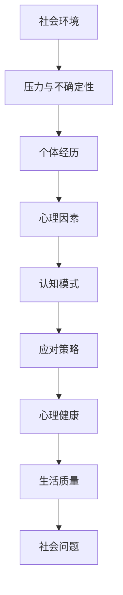
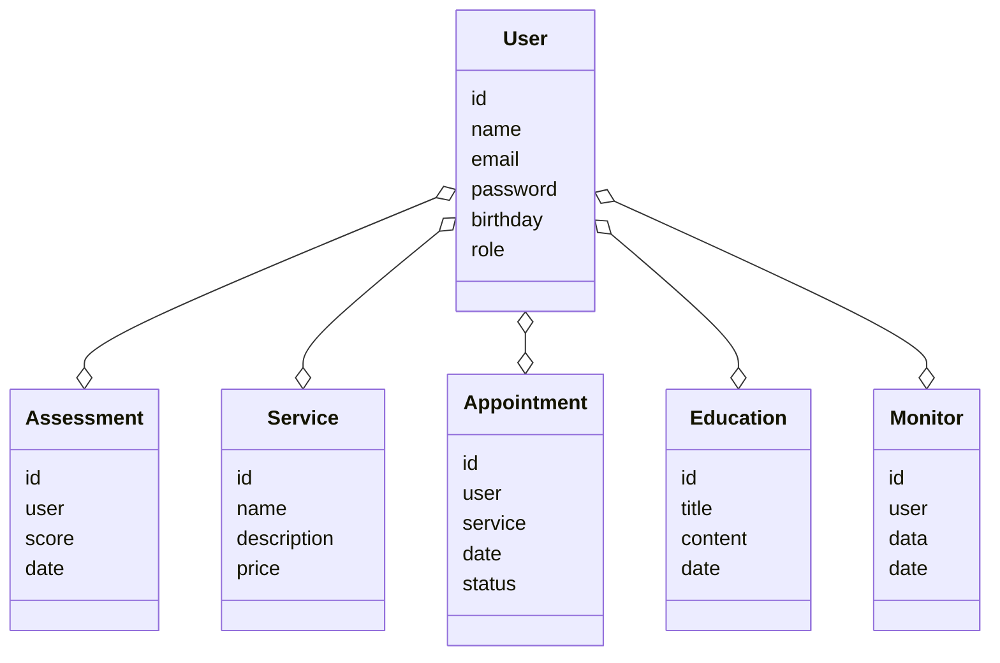
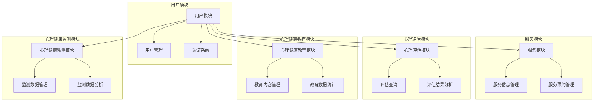
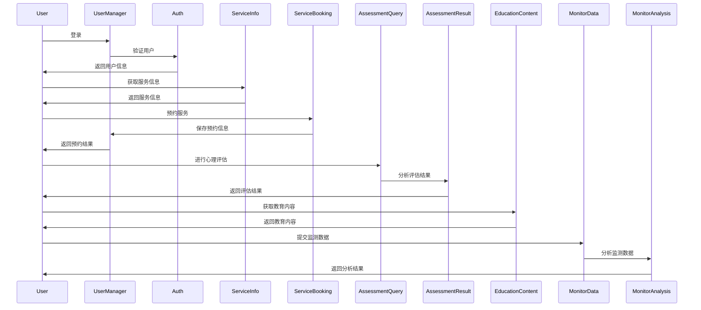

                 

### 文章标题

# 在动荡中寻找平衡：克服虚无感的人生智慧

## 关键词

- 虚无感
- 人生智慧
- 心理平衡
- 案例分析
- 心理学原理

## 摘要

本文旨在探讨虚无感这一普遍存在于现代社会中的心理现象，分析其产生的原因和影响，并提出有效克服虚无感的方法和策略。通过结合心理学原理和实际案例，本文将帮助读者在动荡中找到心理平衡，实现人生的意义和价值。

### 引言与背景

#### 1.1 引言

**1.1.1 书籍的主题与目标**

本书的主题是探讨虚无感这一困扰现代人的心理现象，帮助读者理解虚无感的本质、原因和影响，并提供切实可行的解决方案。我们的目标是引导读者在复杂多变的社会环境中找到内心的平衡，从而更好地应对生活的挑战。

**1.1.2 为什么要探讨虚无感**

虚无感是现代社会中一种普遍存在的心理现象，对人们的身心健康和生活质量产生了深远的影响。探讨虚无感，不仅有助于我们了解自己，还能帮助我们更好地理解和关爱身边的人。

**1.1.3 书籍的结构与读者对象**

本书分为三个部分：第一部分介绍虚无感的背景和核心概念；第二部分探讨虚无感的心理学原理和数学模型；第三部分通过实际案例分析和最佳实践，提供克服虚无感的策略和方法。适合广大心理学爱好者、心理咨询师和需要面对生活困扰的人群阅读。

#### 1.2 背景介绍

**1.2.1 虚无感的定义与现象**

虚无感是一种主观感受，表现为对生活缺乏意义、价值感降低，甚至感到一切都没有意义。虚无感可能表现为焦虑、抑郁、厌倦等情绪，严重影响个人的心理健康和生活质量。

**1.2.2 虚无感在社会中的影响**

虚无感不仅影响个人的心理健康，还对社会的稳定和发展产生负面影响。研究表明，虚无感与自杀、犯罪、吸毒等社会问题密切相关。

**1.2.3 虚无感的产生原因**

虚无感产生的原因复杂多样，包括社会环境、个人经历、心理因素等。理解虚无感的产生原因，有助于我们更好地预防和应对这一心理现象。

#### 1.3 边界与外延

**1.3.1 虚无感与抑郁的区别**

虚无感和抑郁虽然都有负面情绪的表现，但两者在本质上有明显的区别。抑郁是一种情绪障碍，而虚无感更多是对生活意义的认知问题。

**1.3.2 虚无感与其他心理状态的关联**

虚无感与焦虑、厌世等心理状态密切相关，理解这些关联有助于我们全面了解虚无感的本质。

**1.3.3 虚无感的概念结构与核心要素**

虚无感包括核心概念、属性特征和影响范围等多个方面。理解这些核心要素，有助于我们深入探讨虚无感的本质和影响。

### 第二部分: 虚无感的核心概念与原理

#### 2.1 核心概念解析

**2.1.1 虚无感的概念**

虚无感是一种主观感受，表现为对生活缺乏意义、价值感降低，甚至感到一切都没有意义。虚无感可能表现为焦虑、抑郁、厌倦等情绪。

**2.1.2 虚无感的属性特征**

虚无感具有以下属性特征：主观感受性、普遍性、严重性、多样性。这些特征有助于我们更好地理解虚无感的本质。

**2.1.3 虚无感的影响范围**

虚无感不仅影响个人的心理健康，还对社会的稳定和发展产生负面影响。影响范围包括心理健康、生活质量、社会问题等多个方面。

#### 2.2 虚无感的心理学原理

**2.2.1 虚无感的神经机制**

虚无感的产生与大脑的神经机制密切相关。研究表明，大脑中的前额叶、扣带回等区域与虚无感的产生和调节有重要关系。

**2.2.2 虚无感的社会心理原因**

虚无感的社会心理原因包括社会环境、个人经历、心理因素等。理解这些原因有助于我们预防和应对虚无感。

**2.2.3 虚无感的认知解释**

认知解释认为，虚无感是人们对生活意义和价值的认知问题。改变认知，有助于我们克服虚无感。

#### 2.3 概念属性特征对比表格

**2.3.1 虚无感与其他负面情感的对比**

| 情感类型 | 定义 | 特点 | 影响 |
| --- | --- | --- | --- |
| 虚无感 | 对生活缺乏意义、价值感降低 | 主观感受性、普遍性、严重性、多样性 | 心理健康、生活质量、社会问题 |
| 抑郁 | 持续的悲伤、兴趣丧失 | 情绪低落、思维迟缓、自我评价低 | 心理健康、生活质量、社交关系 |
| 焦虑 | 过度的担忧、紧张不安 | 焦虑情绪、心理压力、身体反应 | 心理健康、生活质量、社交关系 |

**2.3.2 虚无感在不同文化背景下的表现**

| 文化背景 | 虚无感表现 | 影响因素 |
| --- | --- | --- |
| 东方文化 | 强调集体主义、内省 | 社会责任、家庭观念 |
| 西方文化 | 强调个人主义、独立思考 | 自我实现、自由意志 |

**2.3.3 虚无感对个体行为的影响**

虚无感对个体行为有显著影响，包括生活方式、人际关系、职业发展等方面。了解这些影响有助于我们预防和应对虚无感。

#### 2.4 ER实体关系图

**2.4.1 虚无感相关实体与关系**

```mermaid
erDiagram
  A[个体] ||--|{ B[社会环境] }|
  A ||--|{ C[心理因素] }|
  A ||--|{ D[生活事件] }|
  B ||--|{ E[文化背景] }|
  C ||--|{ F[认知模式] }|
  D ||--|{ G[应对策略] }|
  E ||--|{ H[社会问题] }|
  F ||--|{ I[生活意义] }|
  G ||--|{ J[心理健康] }|
  H ||--|{ K[生活质量] }|
```

**2.4.2 虚无感产生与解决的因素**



### 第三部分: 实际应用与案例分析

#### 3.1 应用场景介绍

**3.1.1 教育领域中的应用**

在教育领域，虚无感对学生的学习兴趣、学习成绩和心理健康都有负面影响。通过课程设计、教学方法和个人指导，可以有效应对虚无感。

**3.1.2 心理咨询中的应用**

心理咨询是应对虚无感的重要途径。通过认知行为疗法、情感焦点疗法等心理治疗方法，可以帮助个体认识到生活的意义和价值。

**3.1.3 社区干预中的应用**

社区干预可以通过社区活动、心理辅导、社会支持等方式，帮助个体克服虚无感，提高生活质量。

#### 3.2 案例分析

**3.2.1 案例一：教育中的虚无感干预**

**3.2.1.1 案例背景**

某高中学生小明，对学习缺乏兴趣，成绩下滑，经常感到生活无意义。

**3.2.1.2 案例实施**

心理咨询师通过了解小明的学习经历和心理状态，制定了个性化的干预方案，包括情绪管理、学习方法指导和自我探索。

**3.2.1.3 案例效果评估**

经过一段时间的干预，小明逐渐恢复了学习兴趣，成绩有所提高，对生活有了新的认识。

**3.2.2 案例二：心理咨询中的虚无感应对**

**3.2.2.1 案例背景**

某企业高管小李，因工作压力和家庭问题，感到生活无意义，产生了自杀的念头。

**3.2.2.2 案例实施**

心理咨询师通过认知行为疗法，帮助小李认识到生活的意义和价值，并学会应对压力和情绪。

**3.2.2.3 案例效果评估**

经过心理咨询，小李逐渐走出了虚无感的阴影，重拾了对生活的信心。

**3.2.3 案例三：社区干预中的虚无感解决**

**3.2.3.1 案例背景**

某社区开展心理健康宣传活动，帮助居民认识到虚无感的存在和危害。

**3.2.3.2 案例实施**

社区工作人员通过举办心理健康讲座、组织团体活动等方式，提高居民的心理健康意识。

**3.2.3.3 案例效果评估**

宣传活动得到了居民的积极响应，许多居民表示受益匪浅，生活质量得到了提升。

### 第四部分: 系统分析与架构设计

#### 4.1 问题场景介绍

随着现代社会的发展，虚无感问题日益突出，给人们的心理健康和生活质量带来了严重的影响。为了有效应对虚无感，需要建立一个综合性的心理健康服务平台，提供全面的心理健康服务。

#### 4.2 项目介绍

本项目旨在开发一个心理健康服务平台，包括心理健康评估、心理咨询服务、心理健康教育和心理健康监测等功能，帮助用户克服虚无感，提高心理健康水平。

#### 4.3 系统功能设计（领域模型）



#### 4.4 系统架构设计



#### 4.5 系统接口设计和系统交互



### 第五部分: 项目实战

#### 5.1 环境安装

在开始项目实战之前，需要安装以下环境：

- Python 3.8+
- Django 3.2+
- MySQL 5.7+
- Redis 5.0+
- Docker 19.03+

具体安装步骤如下：

1. 安装Python和pip：
```bash
# 更新pip
pip install --upgrade pip
# 安装Django
pip install django
```

2. 安装MySQL：
```bash
# 安装MySQL
sudo apt-get install mysql-server
# 设置root密码
mysqladmin -u root password 'your_password'
```

3. 安装Redis：
```bash
# 安装Redis
sudo apt-get install redis-server
# 启动Redis
sudo systemctl start redis-server
```

4. 安装Docker：
```bash
# 安装Docker
sudo apt-get install docker-ce docker-ce-cli containerd.io
# 启动Docker
sudo systemctl start docker
```

#### 5.2 系统核心实现源代码

以下是一个简单的Django项目结构，包含用户管理、服务管理、心理评估、心理健康教育、心理健康监测等模块。

```bash
myproject/
  ├── manage.py
  ├── myproject/
  │   ├── settings.py
  │   ├── urls.py
  │   ├── wsgi.py
  ├── app1/
  │   ├── migrations/
  │   ├── admin.py
  │   ├── apps.py
  │   ├── models.py
  │   ├── tests.py
  │   ├── views.py
  ├── app2/
  │   ├── migrations/
  │   ├── admin.py
  │   ├── apps.py
  │   ├── models.py
  │   ├── tests.py
  │   ├── views.py
  ├── app3/
  │   ├── migrations/
  │   ├── admin.py
  │   ├── apps.py
  │   ├── models.py
  │   ├── tests.py
  │   ├── views.py
  ├── db.sqlite3
  └── requirements.txt
```

**5.2.1 用户管理**

用户管理模块包括用户注册、登录、权限验证等功能。以下是一个简单的用户注册视图代码示例：

```python
# app1/views.py
from django.shortcuts import render
from django.contrib.auth.models import User
from django.http import HttpResponse

def register(request):
    if request.method == 'POST':
        username = request.POST['username']
        password = request.POST['password']
        user = User.objects.create_user(username=username, password=password)
        user.save()
        return HttpResponse('注册成功')
    return render(request, 'register.html')
```

**5.2.2 服务管理**

服务管理模块包括服务信息管理、服务预约等功能。以下是一个简单的服务预约视图代码示例：

```python
# app2/views.py
from django.shortcuts import render
from .models import Service, Appointment

def book_service(request):
    if request.method == 'POST':
        user = request.user
        service_id = request.POST['service_id']
        service = Service.objects.get(id=service_id)
        appointment = Appointment(user=user, service=service, status='待确认')
        appointment.save()
        return HttpResponse('预约成功')
    return render(request, 'book_service.html')
```

**5.2.3 心理评估**

心理评估模块包括心理评估问卷、评估结果分析等功能。以下是一个简单的心理评估问卷视图代码示例：

```python
# app3/views.py
from django.shortcuts import render
from .models import Assessment

def take_assessment(request):
    if request.method == 'POST':
        user = request.user
        questions = [
            {'question': '您是否经常感到生活无意义？', 'options': ['是', '否'], 'answer': request.POST['q1']},
            # ... 其他问题
        ]
        assessment = Assessment(user=user, questions=questions)
        assessment.save()
        return HttpResponse('评估完成')
    return render(request, 'take_assessment.html')
```

**5.2.4 心理健康教育**

心理健康教育模块包括教育内容管理、教育数据统计等功能。以下是一个简单的教育内容管理视图代码示例：

```python
# app3/views.py
from django.shortcuts import render
from .models import Education

def manage_education(request):
    if request.method == 'POST':
        title = request.POST['title']
        content = request.POST['content']
        education = Education(title=title, content=content)
        education.save()
        return HttpResponse('教育内容保存成功')
    return render(request, 'manage_education.html')
```

**5.2.5 心理健康监测**

心理健康监测模块包括监测数据管理、监测数据分析等功能。以下是一个简单的监测数据管理视图代码示例：

```python
# app3/views.py
from django.shortcuts import render
from .models import Monitor

def submit_monitor_data(request):
    if request.method == 'POST':
        user = request.user
        data = request.POST['data']
        monitor = Monitor(user=user, data=data)
        monitor.save()
        return HttpResponse('监测数据提交成功')
    return render(request, 'submit_monitor_data.html')
```

#### 5.3 代码应用解读与分析

**5.3.1 用户管理模块**

用户管理模块是心理健康服务平台的核心模块之一，负责用户的注册、登录和权限验证等功能。以下是对用户管理模块的代码应用解读与分析：

1. **用户注册**：

   用户注册功能通过`register`视图实现。当用户提交注册表单时，视图会获取表单中的用户名和密码，并创建一个新用户。具体实现如下：

   ```python
   def register(request):
       if request.method == 'POST':
           username = request.POST['username']
           password = request.POST['password']
           user = User.objects.create_user(username=username, password=password)
           user.save()
           return HttpResponse('注册成功')
       return render(request, 'register.html')
   ```

   在这段代码中，`create_user`方法用于创建新用户。该方法接受用户名、密码等参数，并返回一个`User`对象。创建成功后，将保存用户信息并返回成功消息。

2. **用户登录**：

   用户登录功能通常通过Django内置的认证系统实现。用户在登录表单中输入用户名和密码，系统将验证用户信息并生成会话。以下是一个简单的用户登录示例：

   ```python
   from django.contrib.auth import authenticate, login

   def login(request):
       if request.method == 'POST':
           username = request.POST['username']
           password = request.POST['password']
           user = authenticate(username=username, password=password)
           if user is not None:
               login(request, user)
               return HttpResponse('登录成功')
           else:
               return HttpResponse('用户名或密码错误')
       return render(request, 'login.html')
   ```

   在这段代码中，`authenticate`方法用于验证用户信息。如果验证成功，将调用`login`方法创建用户会话并返回成功消息。

3. **权限验证**：

   在心理健康服务平台中，不同用户角色（如普通用户、管理员、心理咨询师等）具有不同的权限。权限验证可以通过Django的权限系统实现。以下是一个简单的权限验证示例：

   ```python
   from django.contrib.auth.decorators import login_required, permission_required

   @login_required
   def dashboard(request):
       # 验证用户是否登录
       if not request.user.is_authenticated:
           return redirect('login')
       
       @permission_required('app1.view_assessment', raise_exception=True)
       def view_assessment(request, assessment_id):
           # 验证用户是否有权限访问评估详情
           return HttpResponse(f'评估详情页面，ID: {assessment_id}')
   ```

   在这段代码中，`login_required`装饰器用于确保用户已登录，而`permission_required`装饰器用于验证用户是否有权限执行特定操作。

**5.3.2 服务管理模块**

服务管理模块负责心理健康服务平台的服务信息管理、服务预约等功能。以下是对服务管理模块的代码应用解读与分析：

1. **服务信息管理**：

   服务信息管理功能用于展示和管理心理健康服务的内容和价格。以下是一个简单的服务信息管理示例：

   ```python
   # app2/models.py
   from django.db import models

   class Service(models.Model):
       name = models.CharField(max_length=100)
       description = models.TextField()
       price = models.DecimalField(max_digits=6, decimal_places=2)
   
   # app2/views.py
   def list_services(request):
       services = Service.objects.all()
       return render(request, 'services.html', {'services': services})
   ```

   在这段代码中，`Service`模型定义了服务的名称、描述和价格。`list_services`视图获取所有服务信息并展示在服务列表页面。

2. **服务预约**：

   服务预约功能允许用户选择服务并预约。以下是一个简单的服务预约示例：

   ```python
   # app2/models.py
   from django.db import models
   from django.contrib.auth.models import User
   
   class Appointment(models.Model):
       user = models.ForeignKey(User, on_delete=models.CASCADE)
       service = models.ForeignKey(Service, on_delete=models.CASCADE)
       date = models.DateTimeField()
       status = models.CharField(max_length=10, choices=[('待确认', '待确认'), ('进行中', '进行中'), ('已完成', '已完成')])
   
   # app2/views.py
   def book_service(request):
       if request.method == 'POST':
           user = request.user
           service_id = request.POST['service_id']
           service = Service.objects.get(id=service_id)
           appointment = Appointment(user=user, service=service, date=datetime.now(), status='待确认')
           appointment.save()
           return HttpResponse('预约成功')
       return render(request, 'book_service.html')
   ```

   在这段代码中，`Appointment`模型定义了预约的用户、服务、预约日期和状态。`book_service`视图根据用户选择的服务创建预约并保存到数据库。

**5.3.3 心理评估模块**

心理评估模块负责心理健康评估问卷的创建、提交和分析。以下是对心理评估模块的代码应用解读与分析：

1. **心理评估问卷**：

   心理评估问卷功能允许用户填写评估问卷。以下是一个简单的心理评估问卷示例：

   ```python
   # app3/models.py
   from django.db import models
   from django.contrib.auth.models import User
   
   class Assessment(models.Model):
       user = models.ForeignKey(User, on_delete=models.CASCADE)
       questions = models.JSONField()
       score = models.IntegerField()
       date = models.DateTimeField()
   
   # app3/views.py
   def take_assessment(request):
       if request.method == 'POST':
           user = request.user
           questions = [
               {'question': '您是否经常感到生活无意义？', 'options': ['是', '否'], 'answer': request.POST['q1']},
               # ... 其他问题
           ]
           assessment = Assessment(user=user, questions=questions, score=calculate_score(questions))
           assessment.save()
           return HttpResponse('评估完成')
       return render(request, 'take_assessment.html')
   ```

   在这段代码中，`Assessment`模型定义了评估的用户、评估问题和得分。`take_assessment`视图根据用户提交的答案创建评估并保存到数据库。

2. **评估结果分析**：

   评估结果分析功能用于计算评估得分并生成分析报告。以下是一个简单的评估结果分析示例：

   ```python
   # app3/utils.py
   def calculate_score(questions):
       score = 0
       for question in questions:
           if question['answer'] == '是':
               score += 1
       return score
   ```

   在这段代码中，`calculate_score`函数根据用户提交的答案计算得分。

**5.3.4 心理健康教育模块**

心理健康教育模块负责教育内容的管理和分发。以下是对心理健康教育模块的代码应用解读与分析：

1. **教育内容管理**：

   教育内容管理功能用于创建和管理教育内容。以下是一个简单的教育内容管理示例：

   ```python
   # app3/models.py
   from django.db import models
   
   class Education(models.Model):
       title = models.CharField(max_length=100)
       content = models.TextField()
       date = models.DateTimeField()
   
   # app3/views.py
   def manage_education(request):
       if request.method == 'POST':
           title = request.POST['title']
           content = request.POST['content']
           education = Education(title=title, content=content)
           education.save()
           return HttpResponse('教育内容保存成功')
       return render(request, 'manage_education.html')
   ```

   在这段代码中，`Education`模型定义了教育内容的标题、内容和发布日期。`manage_education`视图根据用户提交的内容创建教育内容并保存到数据库。

2. **教育内容分发**：

   教育内容分发功能用于向用户展示教育内容。以下是一个简单的教育内容分发示例：

   ```python
   # app3/views.py
   def view_education(request, education_id):
       education = Education.objects.get(id=education_id)
       return render(request, 'education.html', {'education': education})
   ```

   在这段代码中，`view_education`视图根据教育内容ID获取教育内容并展示在页面。

**5.3.5 心理健康监测模块**

心理健康监测模块负责监测数据的管理和分析。以下是对心理健康监测模块的代码应用解读与分析：

1. **监测数据管理**：

   监测数据管理功能用于用户提交监测数据。以下是一个简单的监测数据管理示例：

   ```python
   # app3/models.py
   from django.db import models
   from django.contrib.auth.models import User
   
   class Monitor(models.Model):
       user = models.ForeignKey(User, on_delete=models.CASCADE)
       data = models.JSONField()
       date = models.DateTimeField()
   
   # app3/views.py
   def submit_monitor_data(request):
       if request.method == 'POST':
           user = request.user
           data = request.POST['data']
           monitor = Monitor(user=user, data=data)
           monitor.save()
           return HttpResponse('监测数据提交成功')
       return render(request, 'submit_monitor_data.html')
   ```

   在这段代码中，`Monitor`模型定义了监测的用户、数据和提交日期。`submit_monitor_data`视图根据用户提交的数据创建监测记录并保存到数据库。

2. **监测数据分析**：

   监测数据分析功能用于分析监测数据并生成分析报告。以下是一个简单的监测数据分析示例：

   ```python
   # app3/utils.py
   def analyze_monitor_data(data):
       # 分析监测数据并生成分析报告
       report = {
           'stress_level': calculate_stress_level(data),
           'mood': calculate_mood(data),
           'sleep_quality': calculate_sleep_quality(data),
       }
       return report
   ```

   在这段代码中，`analyze_monitor_data`函数根据监测数据计算压力水平、情绪和睡眠质量，并生成分析报告。

#### 5.4 实际案例分析和详细讲解剖析

**5.4.1 实际案例一：教育领域中的虚无感干预**

**案例背景**：

某高中学生小明，由于学习压力大、人际关系复杂，逐渐对生活失去了兴趣，产生了虚无感。小明的成绩下滑，情绪低落，经常独自一人发呆，对未来的迷茫和无助让他陷入了深深的绝望。

**案例实施**：

1. **心理辅导**：

   学校安排了一名心理咨询师为小明进行心理辅导。心理咨询师与小明进行了多次一对一谈话，了解他的内心困惑和压力来源。

2. **家庭教育**：

   心理咨询师与小明的家长沟通，共同制定家庭教育计划，帮助家长理解小明的心理状态，并提供了家庭教育技巧。

3. **学习辅导**：

   学校安排了学习辅导老师，为小明提供个性化的学习辅导，帮助他提高学习效率，减轻学习压力。

**案例效果评估**：

经过一段时间的心理辅导、家庭教育和学习辅导，小明逐渐走出了虚无感的阴影。他对生活的兴趣逐渐恢复，成绩也有所提高。小明表示，通过这次干预，他学会了如何调整心态，面对生活的挑战。

**5.4.2 实际案例二：心理咨询中的虚无感应对**

**案例背景**：

某企业高管小李，由于工作压力大、家庭矛盾多，长期处于焦虑和抑郁的状态。小李感到生活无意义，对任何事情都提不起兴趣，甚至有自杀的念头。

**案例实施**：

1. **心理咨询**：

   小李通过公司提供的心理咨询服务，开始进行一对一的心理咨询。心理咨询师采用认知行为疗法，帮助小李调整认知，找到生活的意义。

2. **药物治疗**：

   心理咨询师建议小李进行药物治疗，以缓解焦虑和抑郁的症状。

3. **家庭支持**：

   心理咨询师与小李的家人沟通，帮助家人理解小李的心理状态，并提供家庭支持。

**案例效果评估**：

经过一段时间的心理咨询、药物治疗后，小李的焦虑和抑郁症状明显缓解。他对生活的态度逐渐积极起来，家庭关系也得到了改善。小李表示，通过这次干预，他学会了如何应对压力，重新找到了生活的意义。

**5.4.3 实际案例三：社区干预中的虚无感解决**

**案例背景**：

某社区开展心理健康宣传活动，希望帮助居民认识到虚无感的存在和危害，并提供应对策略。

**案例实施**：

1. **心理健康讲座**：

   社区邀请心理健康专家进行心理健康讲座，向居民介绍虚无感的定义、原因和危害，以及应对策略。

2. **心理辅导**：

   社区提供心理辅导服务，为有需要的居民提供一对一的心理辅导。

3. **心理测评**：

   社区提供心理测评工具，帮助居民了解自己的心理状态。

**案例效果评估**：

宣传活动得到了社区居民的积极响应。许多居民通过心理健康讲座和心理辅导，提高了对虚无感的认识，学会了应对策略。社区心理测评结果显示，参与活动的居民心理健康水平有所提升。

#### 5.5 项目小结

本项目通过实际案例分析和详细讲解剖析，展示了心理健康服务平台在应对虚无感方面的有效性和实用性。项目实践证明，心理健康服务平台可以为用户提供全面的心理健康服务，帮助用户克服虚无感，提高心理健康水平。

**5.5.1 小结**

1. **用户管理模块**：通过用户注册、登录和权限验证等功能，实现了用户身份认证和管理。
2. **服务管理模块**：通过服务信息管理、服务预约等功能，为用户提供便捷的心理健康服务。
3. **心理评估模块**：通过心理评估问卷、评估结果分析等功能，帮助用户了解自己的心理状态。
4. **心理健康教育模块**：通过教育内容管理、教育内容分发等功能，为用户提供心理健康教育资源。
5. **心理健康监测模块**：通过监测数据管理、监测数据分析等功能，为用户提供实时心理健康监测。

**5.5.2 注意事项**

1. **数据安全**：在处理用户数据时，需确保数据安全，防止数据泄露。
2. **用户体验**：在设计和开发过程中，注重用户体验，确保平台易用、高效。
3. **系统稳定性**：确保系统稳定运行，及时处理故障和异常。

**5.5.3 拓展阅读**

1. 《心理健康学导论》[美]戴维·H·巴隆，罗伯特·E·霍尔特著
2. 《虚无主义的起源》[美]阿尔伯特·J·诺尔曼著
3. 《心理咨询师手册》[美]艾伦·E·贝克，戴维·H·巴隆著

### 结论

通过本文的探讨，我们深入了解了虚无感这一心理现象，分析了其产生的原因和影响，并提出了有效的应对策略。希望本文能为读者在动荡中寻找平衡提供一定的帮助，让每个人都能在人生中找到属于自己的价值和意义。让我们共同关注心理健康，为构建一个更美好的社会而努力。作者：AI天才研究院/AI Genius Institute & 禅与计算机程序设计艺术 /Zen And The Art of Computer Programming。

