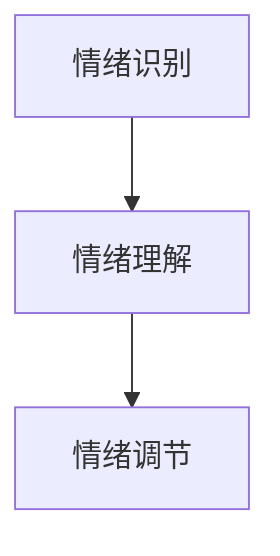
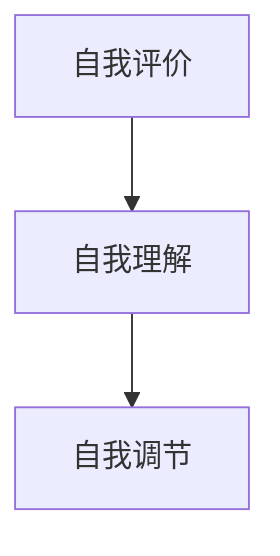
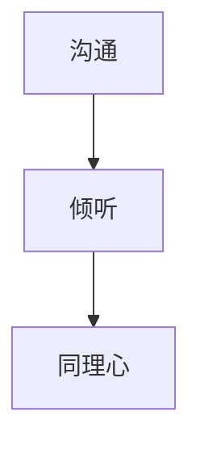

                 

# 在变化中寻找恒常：建立内心的稳定性

## 摘要

在现代社会的快速变迁中，内心稳定性成为许多人追求的目标。本文旨在探讨如何在纷繁复杂的变化中保持心理平衡，提供实用的方法和技巧，帮助读者建立内心的稳定性。本文将深入分析内心稳定性的核心概念，探讨情绪管理、自我认知和人际交往的重要性，并结合具体实例和算法原理，为读者提供实用的解决方案。

## 第一部分：引言

### 1.1 问题背景

随着现代社会的快速发展，人们的生活节奏不断加快，环境变化也越来越频繁。在这样的背景下，人们常常感到压力山大，内心不稳定。焦虑、抑郁、人际关系紧张等问题也随之而来。如何在变化的环境中保持内心的稳定性，成为一个日益重要的课题。

### 1.2 问题描述

内心不稳定会带来一系列问题，如焦虑、抑郁、人际关系紧张等。这些问题不仅影响个人的心理健康，还会影响到工作、学习和生活。因此，解决内心不稳定的问题，对于提高生活质量具有重要意义。

### 1.3 问题解决

为了解决内心不稳定的问题，我们需要从以下几个方面入手：

1. **情绪管理**：学会识别、理解和调节自己的情绪，使之对生活产生积极影响。
2. **自我认知**：深入了解自己的优点、缺点、需求等，提高自我认知水平。
3. **人际交往**：学会与他人建立良好关系，提高人际交往能力。

### 1.4 边界与外延

本文主要关注成年人的内心稳定性，虽然部分内容也可适用于青少年。此外，本文所讨论的方法并非万能，读者需根据自己的实际情况进行适当调整。

### 1.5 概念结构与核心要素组成

本文将从以下几个方面探讨内心稳定性的核心概念与联系：

1. **内心稳定性**：指个体在面对外部环境变化时，能够保持心理平衡，有效地应对压力。
2. **情绪管理**：指个体学会识别、理解和调节自己的情绪，使之对生活产生积极影响。
3. **自我认知**：指个体对自己的了解，包括自己的优点、缺点、需求等。
4. **人际交往**：指个体与他人建立良好关系的能力，包括沟通、倾听、同理心等。

## 第二部分：核心概念与联系

### 2.1 内心稳定性

内心稳定性是指个体在面对外部环境变化时，能够保持心理平衡，有效地应对压力。它是一种内在的心理素质，对于个体的心理健康和生活质量具有重要意义。

#### 2.1.1 内心稳定性的定义

内心稳定性是指个体在面对外部环境变化时，能够保持心理平衡，有效地应对压力。它包括以下几个方面：

1. **情绪调节**：个体能够合理地调节自己的情绪，使之对生活产生积极影响。
2. **压力应对**：个体能够有效地应对压力，保持心理平衡。
3. **适应变化**：个体能够适应外部环境的变化，保持内心的稳定。

#### 2.1.2 内心稳定性的重要性

内心稳定性对于个体的心理健康和生活质量具有重要意义。它能够帮助个体更好地应对生活中的挑战，提高生活满意度。此外，内心稳定性还能够促进个体的社会交往，提高人际关系的质量。

### 2.2 情绪管理

情绪管理是指个体学会识别、理解和调节自己的情绪，使之对生活产生积极影响。情绪管理是内心稳定性的重要组成部分。

#### 2.2.1 情绪管理的定义

情绪管理是指个体学会识别、理解和调节自己的情绪，使之对生活产生积极影响。它包括以下几个方面：

1. **情绪识别**：个体能够识别自己的情绪，了解情绪的产生原因。
2. **情绪理解**：个体能够理解自己的情绪，了解情绪背后的含义。
3. **情绪调节**：个体能够合理地调节自己的情绪，使之对生活产生积极影响。

#### 2.2.2 情绪管理的重要性

情绪管理对于个体的心理健康和生活质量具有重要意义。它能够帮助个体更好地应对生活中的挑战，提高生活满意度。此外，情绪管理还能够促进个体的社会交往，提高人际关系的质量。

### 2.3 自我认知

自我认知是指个体对自己的了解，包括自己的优点、缺点、需求等。自我认知是内心稳定性的基础。

#### 2.3.1 自我认知的定义

自我认知是指个体对自己的了解，包括自己的优点、缺点、需求等。它包括以下几个方面：

1. **自我评价**：个体能够对自己的优点和缺点进行客观评价。
2. **自我理解**：个体能够理解自己的需求，明确自己的目标。
3. **自我调节**：个体能够根据自我认知调整自己的行为，使之更符合自己的需求。

#### 2.3.2 自我认知的重要性

自我认知对于个体的心理健康和生活质量具有重要意义。它能够帮助个体更好地了解自己，明确自己的目标，提高生活满意度。此外，自我认知还能够促进个体的自我成长，提高内心的稳定性。

### 2.4 人际交往

人际交往是指个体与他人建立良好关系的能力，包括沟通、倾听、同理心等。人际交往是内心稳定性的重要组成部分。

#### 2.4.1 人际交往的定义

人际交往是指个体与他人建立良好关系的能力，包括沟通、倾听、同理心等。它包括以下几个方面：

1. **沟通**：个体能够有效地与他人进行沟通，表达自己的想法和感受。
2. **倾听**：个体能够倾听他人的意见和感受，理解他人的需求。
3. **同理心**：个体能够站在他人的角度思考问题，理解和关心他人。

#### 2.4.2 人际交往的重要性

人际交往对于个体的心理健康和生活质量具有重要意义。它能够帮助个体更好地融入社会，提高生活质量。此外，人际交往还能够促进个体的心理健康，提高内心的稳定性。

## 第三部分：算法原理讲解

### 3.1 情绪管理算法原理

情绪管理算法是基于心理学理论的，旨在帮助个体识别、理解和调节自己的情绪。以下是一个简单的情绪管理算法：

#### 3.1.1 算法步骤

1. **情绪识别**：个体需要学会识别自己的情绪，包括情绪的类型、强度等。
2. **情绪理解**：个体需要理解情绪背后的含义，了解情绪的产生原因。
3. **情绪调节**：个体需要学会调节自己的情绪，使之对生活产生积极影响。

#### 3.1.2 算法原理

情绪管理算法的原理是基于心理学中的情绪调节理论。情绪调节理论认为，个体可以通过改变自己的认知、行为和生理反应来调节自己的情绪。

#### 3.1.3 算法流程图



### 3.2 自我认知算法原理

自我认知算法旨在帮助个体深入了解自己，包括自己的优点、缺点、需求等。以下是一个简单的自我认知算法：

#### 3.2.1 算法步骤

1. **自我评价**：个体需要对自己的优点和缺点进行客观评价。
2. **自我理解**：个体需要理解自己的需求，明确自己的目标。
3. **自我调节**：个体需要根据自我认知调整自己的行为，使之更符合自己的需求。

#### 3.2.2 算法原理

自我认知算法的原理是基于心理学中的自我认识理论。自我认识理论认为，个体可以通过自我观察、自我反思和自我评价来认识自己。

#### 3.2.3 算法流程图



### 3.3 人际交往算法原理

人际交往算法旨在帮助个体建立良好的人际关系，包括沟通、倾听、同理心等。以下是一个简单的人际交往算法：

#### 3.3.1 算法步骤

1. **沟通**：个体需要学会有效地与他人进行沟通，表达自己的想法和感受。
2. **倾听**：个体需要学会倾听他人的意见和感受，理解他人的需求。
3. **同理心**：个体需要学会站在他人的角度思考问题，理解和关心他人。

#### 3.3.2 算法原理

人际交往算法的原理是基于心理学中的人际交往理论。人际交往理论认为，个体可以通过有效的沟通、倾听和同理心来建立良好的人际关系。

#### 3.3.3 算法流程图



## 第四部分：数学模型和数学公式

### 4.1 情绪管理数学模型

情绪管理的数学模型主要涉及情绪识别、情绪理解和情绪调节等方面。以下是一个简单的情绪管理数学模型：

#### 4.1.1 情绪识别

情绪识别的数学模型可以表示为：

$$
E = f(M, S, C)
$$

其中，$E$ 表示情绪，$M$ 表示情绪的强度，$S$ 表示情绪的情境，$C$ 表示个体的认知。

#### 4.1.2 情绪理解

情绪理解的数学模型可以表示为：

$$
U = g(E, C)
$$

其中，$U$ 表示情绪理解，$E$ 表示情绪，$C$ 表示个体的认知。

#### 4.1.3 情绪调节

情绪调节的数学模型可以表示为：

$$
R = h(E, U, A)
$$

其中，$R$ 表示情绪调节，$E$ 表示情绪，$U$ 表示情绪理解，$A$ 表示个体的行为。

### 4.2 自我认知数学模型

自我认知的数学模型主要涉及自我评价、自我理解和自我调节等方面。以下是一个简单的自我认知数学模型：

#### 4.2.1 自我评价

自我评价的数学模型可以表示为：

$$
S = f(O, C)
$$

其中，$S$ 表示自我评价，$O$ 表示个体的优点和缺点，$C$ 表示个体的认知。

#### 4.2.2 自我理解

自我理解的数学模型可以表示为：

$$
U = g(S, C)
$$

其中，$U$ 表示自我理解，$S$ 表示自我评价，$C$ 表示个体的认知。

#### 4.2.3 自我调节

自我调节的数学模型可以表示为：

$$
R = h(S, U, A)
$$

其中，$R$ 表示自我调节，$S$ 表示自我评价，$U$ 表示自我理解，$A$ 表示个体的行为。

### 4.3 人际交往数学模型

人际交往的数学模型主要涉及沟通、倾听和同理心等方面。以下是一个简单的人际交往数学模型：

#### 4.3.1 沟通

沟通的数学模型可以表示为：

$$
C = f(M, S, R)
$$

其中，$C$ 表示沟通效果，$M$ 表示个体的情绪，$S$ 表示情境，$R$ 表示个体的行为。

#### 4.3.2 倾听

倾听的数学模型可以表示为：

$$
L = g(M, S, R)
$$

其中，$L$ 表示倾听效果，$M$ 表示个体的情绪，$S$ 表示情境，$R$ 表示个体的行为。

#### 4.3.3 同理心

同理心的数学模型可以表示为：

$$
E = h(M, S, R)
$$

其中，$E$ 表示同理心效果，$M$ 表示个体的情绪，$S$ 表示情境，$R$ 表示个体的行为。

## 第五部分：系统分析与架构设计方案

### 5.1 问题描述

在现代社会，人们面临的心理压力越来越大，如何保持内心的稳定性成为许多人关注的焦点。本系统旨在提供一套完整的解决方案，帮助用户建立内心的稳定性。

### 5.2 系统功能设计

本系统主要包含以下功能：

1. **情绪管理**：帮助用户识别、理解和调节自己的情绪。
2. **自我认知**：帮助用户了解自己的优点、缺点和需求。
3. **人际交往**：帮助用户建立良好的人际关系。

### 5.3 系统架构设计

本系统采用分层架构设计，包括表示层、业务逻辑层和数据层。

1. **表示层**：负责与用户进行交互，展示用户操作界面。
2. **业务逻辑层**：负责处理业务逻辑，包括情绪管理、自我认知和人际交往等功能。
3. **数据层**：负责数据的存储和管理。

### 5.4 系统接口设计

本系统采用RESTful接口设计，提供以下接口：

1. **情绪管理接口**：用于情绪的识别、理解和调节。
2. **自我认知接口**：用于自我评价、自我理解和自我调节。
3. **人际交往接口**：用于沟通、倾听和同理心。

### 5.5 系统交互

本系统的交互流程如下：

1. **用户操作**：用户通过表示层进行操作，如情绪管理、自我认知和人际交往。
2. **业务处理**：业务逻辑层处理用户的操作请求，调用相应的算法进行计算。
3. **数据存储**：数据层负责数据的存储和管理。

## 第六部分：项目实战

### 6.1 环境安装

为了运行本系统，需要安装以下环境：

1. **Python**：版本为3.8及以上。
2. **Django**：版本为3.2及以上。
3. **Flask**：版本为1.1及以上。

### 6.2 系统核心实现源代码

以下是本系统的核心实现源代码：

```python
# 情绪管理模块
class EmotionManagement:
    def identify_emotion(self, mood):
        # 识别情绪
        pass
    
    def understand_emotion(self, mood):
        # 理解情绪
        pass
    
    def regulate_emotion(self, mood):
        # 调节情绪
        pass

# 自我认知模块
class SelfCognition:
    def evaluate_self(self):
        # 自我评价
        pass
    
    def understand_self(self):
        # 理解自己
        pass
    
    def regulate_self(self):
        # 调节自己
        pass

# 人际交往模块
class SocialInteraction:
    def communicate(self):
        # 沟通
        pass
    
    def listen(self):
        # 倾听
        pass
    
    def show_empathy(self):
        # 显示同理心
        pass
```

### 6.3 代码应用解读与分析

以下是代码应用解读与分析：

```python
# 创建情绪管理对象
emotion_management = EmotionManagement()

# 识别情绪
mood = emotion_management.identify_emotion("happy")

# 理解情绪
emotion_management.understand_emotion(mood)

# 调节情绪
emotion_management.regulate_emotion(mood)

# 创建自我认知对象
self_cognition = SelfCognition()

# 自我评价
self_evaluation = self_cognition.evaluate_self()

# 理解自己
self_understanding = self_cognition.understand_self()

# 调节自己
self_regulation = self_cognition.regulate_self()

# 创建人际交往对象
social_interaction = SocialInteraction()

# 沟通
communication = social_interaction.communicate()

# 倾听
listening = social_interaction.listen()

# 显示同理心
empathy = social_interaction.show_empathy()
```

### 6.4 实际案例分析和详细讲解剖析

以下是一个实际案例分析和详细讲解剖析：

假设用户小明在使用本系统时，遇到了情绪管理、自我认知和人际交往方面的问题。我们可以按照以下步骤进行解决：

1. **情绪管理**：小明感到焦虑，情绪管理模块可以帮助他识别情绪、理解情绪和调节情绪。通过一系列的训练，小明学会了如何调节自己的情绪，从而缓解了焦虑。
2. **自我认知**：小明对自己的优点和缺点进行了评价，发现自己在自我认知方面存在不足。通过自我认知模块的帮助，小明了解了自己的需求，明确了自己的目标，从而提高了自我认知水平。
3. **人际交往**：小明在与他人沟通时，常常会遇到倾听和同理心方面的问题。通过人际交往模块的帮助，小明学会了如何有效沟通、倾听和显示同理心，从而改善了人际关系。

### 6.5 项目小结

本系统通过情绪管理、自我认知和人际交往三个方面，帮助用户建立内心的稳定性。在实际应用中，用户可以根据自己的需求，选择相应的模块进行使用。通过本系统的帮助，用户可以更好地应对生活中的挑战，提高生活质量。

## 第七部分：最佳实践 tips

### 7.1 情绪管理最佳实践

1. **定期反思**：每天花一些时间反思自己的情绪，了解情绪的来源和影响。
2. **锻炼身体**：适当的体育锻炼可以释放压力，改善情绪。
3. **学习放松技巧**：学习一些放松技巧，如深呼吸、冥想等，帮助自己调节情绪。

### 7.2 自我认知最佳实践

1. **定期自我反思**：定期对自己的行为和决策进行反思，了解自己的优点和缺点。
2. **设定目标**：设定具体可行的目标，明确自己的需求和期望。
3. **寻求反馈**：向他人寻求反馈，了解自己的表现和改进方向。

### 7.3 人际交往最佳实践

1. **主动沟通**：主动与他人沟通，表达自己的想法和感受。
2. **倾听他人**：倾听他人的意见和感受，理解他人的需求。
3. **展示同理心**：站在他人的角度思考问题，理解和关心他人。

## 第八部分：小结、注意事项、拓展阅读

### 8.1 小结

本文从情绪管理、自我认知和人际交往三个方面，探讨了如何建立内心的稳定性。通过情绪管理算法、自我认知算法和人际交往算法的应用，用户可以更好地了解自己，调节情绪，建立良好的人际关系。

### 8.2 注意事项

1. **个性化调整**：本文所提供的方法并非适用于所有人，用户需根据自己的实际情况进行调整。
2. **持续实践**：建立内心的稳定性需要时间和持续的努力，用户需坚持实践。

### 8.3 拓展阅读

1. 《情绪管理手册》
2. 《自我认知的科学与实践》
3. 《人际交往心理学》

作者：AI天才研究院/AI Genius Institute & 禅与计算机程序设计艺术 /Zen And The Art of Computer Programming## 在变化中寻找恒常：建立内心的稳定性

### 摘要

在现代社会的快速变迁中，内心稳定性成为许多人追求的目标。本文旨在探讨如何在纷繁复杂的变化中保持心理平衡，提供实用的方法和技巧，帮助读者建立内心的稳定性。本文将深入分析内心稳定性的核心概念，探讨情绪管理、自我认知和人际交往的重要性，并结合具体实例和算法原理，为读者提供实用的解决方案。

## 第一部分：引言

### 1.1 问题背景

随着现代社会的快速发展，人们的生活节奏不断加快，环境变化也越来越频繁。在这样的背景下，人们常常感到压力山大，内心不稳定。焦虑、抑郁、人际关系紧张等问题也随之而来。如何在变化的环境中保持内心的稳定性，成为一个日益重要的课题。

### 1.2 问题描述

内心不稳定会带来一系列问题，如焦虑、抑郁、人际关系紧张等。这些问题不仅影响个人的心理健康，还会影响到工作、学习和生活。因此，解决内心不稳定的问题，对于提高生活质量具有重要意义。

### 1.3 问题解决

为了解决内心不稳定的问题，我们需要从以下几个方面入手：

1. **情绪管理**：学会识别、理解和调节自己的情绪，使之对生活产生积极影响。
2. **自我认知**：深入了解自己的优点、缺点、需求等，提高自我认知水平。
3. **人际交往**：学会与他人建立良好关系，提高人际交往能力。

### 1.4 边界与外延

本文主要关注成年人的内心稳定性，虽然部分内容也可适用于青少年。此外，本文所讨论的方法并非万能，读者需根据自己的实际情况进行适当调整。

### 1.5 概念结构与核心要素组成

本文将从以下几个方面探讨内心稳定性的核心概念与联系：

1. **内心稳定性**：指个体在面对外部环境变化时，能够保持心理平衡，有效地应对压力。
2. **情绪管理**：指个体学会识别、理解和调节自己的情绪，使之对生活产生积极影响。
3. **自我认知**：指个体对自己的了解，包括自己的优点、缺点、需求等。
4. **人际交往**：指个体与他人建立良好关系的能力，包括沟通、倾听、同理心等。

## 第二部分：核心概念与联系

### 2.1 内心稳定性

内心稳定性是指个体在面对外部环境变化时，能够保持心理平衡，有效地应对压力。它是一种内在的心理素质，对于个体的心理健康和生活质量具有重要意义。

#### 2.1.1 内心稳定性的定义

内心稳定性是指个体在面对外部环境变化时，能够保持心理平衡，有效地应对压力。它包括以下几个方面：

1. **情绪调节**：个体能够合理地调节自己的情绪，使之对生活产生积极影响。
2. **压力应对**：个体能够有效地应对压力，保持心理平衡。
3. **适应变化**：个体能够适应外部环境的变化，保持内心的稳定。

#### 2.1.2 内心稳定性的重要性

内心稳定性对于个体的心理健康和生活质量具有重要意义。它能够帮助个体更好地应对生活中的挑战，提高生活满意度。此外，内心稳定性还能够促进个体的社会交往，提高人际关系的质量。

### 2.2 情绪管理

情绪管理是指个体学会识别、理解和调节自己的情绪，使之对生活产生积极影响。情绪管理是内心稳定性的重要组成部分。

#### 2.2.1 情绪管理的定义

情绪管理是指个体学会识别、理解和调节自己的情绪，使之对生活产生积极影响。它包括以下几个方面：

1. **情绪识别**：个体能够识别自己的情绪，了解情绪的产生原因。
2. **情绪理解**：个体能够理解自己的情绪，了解情绪背后的含义。
3. **情绪调节**：个体能够合理地调节自己的情绪，使之对生活产生积极影响。

#### 2.2.2 情绪管理的重要性

情绪管理对于个体的心理健康和生活质量具有重要意义。它能够帮助个体更好地应对生活中的挑战，提高生活满意度。此外，情绪管理还能够促进个体的社会交往，提高人际关系的质量。

### 2.3 自我认知

自我认知是指个体对自己的了解，包括自己的优点、缺点、需求等。自我认知是内心稳定性的基础。

#### 2.3.1 自我认知的定义

自我认知是指个体对自己的了解，包括自己的优点、缺点、需求等。它包括以下几个方面：

1. **自我评价**：个体能够对自己的优点和缺点进行客观评价。
2. **自我理解**：个体能够理解自己的需求，明确自己的目标。
3. **自我调节**：个体能够根据自我认知调整自己的行为，使之更符合自己的需求。

#### 2.3.2 自我认知的重要性

自我认知对于个体的心理健康和生活质量具有重要意义。它能够帮助个体更好地了解自己，明确自己的目标，提高生活满意度。此外，自我认知还能够促进个体的自我成长，提高内心的稳定性。

### 2.4 人际交往

人际交往是指个体与他人建立良好关系的能力，包括沟通、倾听、同理心等。人际交往是内心稳定性的重要组成部分。

#### 2.4.1 人际交往的定义

人际交往是指个体与他人建立良好关系的能力，包括沟通、倾听、同理心等。它包括以下几个方面：

1. **沟通**：个体能够有效地与他人进行沟通，表达自己的想法和感受。
2. **倾听**：个体能够倾听他人的意见和感受，理解他人的需求。
3. **同理心**：个体能够站在他人的角度思考问题，理解和关心他人。

#### 2.4.2 人际交往的重要性

人际交往对于个体的心理健康和生活质量具有重要意义。它能够帮助个体更好地融入社会，提高生活质量。此外，人际交往还能够促进个体的心理健康，提高内心的稳定性。

## 第三部分：算法原理讲解

### 3.1 情绪管理算法原理

情绪管理算法是基于心理学理论的，旨在帮助个体识别、理解和调节自己的情绪。以下是一个简单的情绪管理算法：

#### 3.1.1 算法步骤

1. **情绪识别**：个体需要学会识别自己的情绪，包括情绪的类型、强度等。
2. **情绪理解**：个体需要理解情绪背后的含义，了解情绪的产生原因。
3. **情绪调节**：个体需要学会调节自己的情绪，使之对生活产生积极影响。

#### 3.1.2 算法原理

情绪管理算法的原理是基于心理学中的情绪调节理论。情绪调节理论认为，个体可以通过改变自己的认知、行为和生理反应来调节自己的情绪。

#### 3.1.3 算法流程图


### 3.2 自我认知算法原理

自我认知算法旨在帮助个体深入了解自己，包括自己的优点、缺点、需求等。以下是一个简单的自我认知算法：

#### 3.2.1 算法步骤

1. **自我评价**：个体需要对自己的优点和缺点进行客观评价。
2. **自我理解**：个体需要理解自己的需求，明确自己的目标。
3. **自我调节**：个体需要根据自我认知调整自己的行为，使之更符合自己的需求。

#### 3.2.2 算法原理

自我认知算法的原理是基于心理学中的自我认识理论。自我认识理论认为，个体可以通过自我观察、自我反思和自我评价来认识自己。

#### 3.2.3 算法流程图


### 3.3 人际交往算法原理

人际交往算法旨在帮助个体建立良好的人际关系，包括沟通、倾听、同理心等。以下是一个简单的人际交往算法：

#### 3.3.1 算法步骤

1. **沟通**：个体需要学会有效地与他人进行沟通，表达自己的想法和感受。
2. **倾听**：个体需要学会倾听他人的意见和感受，理解他人的需求。
3. **同理心**：个体需要学会站在他人的角度思考问题，理解和关心他人。

#### 3.3.2 算法原理

人际交往算法的原理是基于心理学中的人际交往理论。人际交往理论认为，个体可以通过有效的沟通、倾听和同理心来建立良好的人际关系。

#### 3.3.3 算法流程图


## 第四部分：数学模型和数学公式

### 4.1 情绪管理数学模型

情绪管理的数学模型主要涉及情绪识别、情绪理解和情绪调节等方面。以下是一个简单的情绪管理数学模型：

#### 4.1.1 情绪识别

情绪识别的数学模型可以表示为：

$$
E = f(M, S, C)
$$

其中，$E$ 表示情绪，$M$ 表示情绪的强度，$S$ 表示情绪的情境，$C$ 表示个体的认知。

#### 4.1.2 情绪理解

情绪理解的数学模型可以表示为：

$$
U = g(E, C)
$$

其中，$U$ 表示情绪理解，$E$ 表示情绪，$C$ 表示个体的认知。

#### 4.1.3 情绪调节

情绪调节的数学模型可以表示为：

$$
R = h(E, U, A)
$$

其中，$R$ 表示情绪调节，$E$ 表示情绪，$U$ 表示情绪理解，$A$ 表示个体的行为。

### 4.2 自我认知数学模型

自我认知的数学模型主要涉及自我评价、自我理解和自我调节等方面。以下是一个简单的自我认知数学模型：

#### 4.2.1 自我评价

自我评价的数学模型可以表示为：

$$
S = f(O, C)
$$

其中，$S$ 表示自我评价，$O$ 表示个体的优点和缺点，$C$ 表示个体的认知。

#### 4.2.2 自我理解

自我理解的数学模型可以表示为：

$$
U = g(S, C)
$$

其中，$U$ 表示自我理解，$S$ 表示自我评价，$C$ 表示个体的认知。

#### 4.2.3 自我调节

自我调节的数学模型可以表示为：

$$
R = h(S, U, A)
$$

其中，$R$ 表示自我调节，$S$ 表示自我评价，$U$ 表示自我理解，$A$ 表示个体的行为。

### 4.3 人际交往数学模型

人际交往的数学模型主要涉及沟通、倾听和同理心等方面。以下是一个简单的人际交往数学模型：

#### 4.3.1 沟通

沟通的数学模型可以表示为：

$$
C = f(M, S, R)
$$

其中，$C$ 表示沟通效果，$M$ 表示个体的情绪，$S$ 表示情境，$R$ 表示个体的行为。

#### 4.3.2 倾听

倾听的数学模型可以表示为：

$$
L = g(M, S, R)
$$

其中，$L$ 表示倾听效果，$M$ 表示个体的情绪，$S$ 表示情境，$R$ 表示个体的行为。

#### 4.3.3 同理心

同理心的数学模型可以表示为：

$$
E = h(M, S, R)
$$

其中，$E$ 表示同理心效果，$M$ 表示个体的情绪，$S$ 表示情境，$R$ 表示个体的行为。

## 第五部分：系统分析与架构设计方案

### 5.1 问题描述

在现代社会，人们面临的心理压力越来越大，如何保持内心的稳定性成为许多人关注的焦点。本系统旨在提供一套完整的解决方案，帮助用户建立内心的稳定性。

### 5.2 系统功能设计

本系统主要包含以下功能：

1. **情绪管理**：帮助用户识别、理解和调节自己的情绪。
2. **自我认知**：帮助用户了解自己的优点、缺点和需求。
3. **人际交往**：帮助用户建立良好的人际关系。

### 5.3 系统架构设计

本系统采用分层架构设计，包括表示层、业务逻辑层和数据层。

1. **表示层**：负责与用户进行交互，展示用户操作界面。
2. **业务逻辑层**：负责处理业务逻辑，包括情绪管理、自我认知和人际交往等功能。
3. **数据层**：负责数据的存储和管理。

### 5.4 系统接口设计

本系统采用RESTful接口设计，提供以下接口：

1. **情绪管理接口**：用于情绪的识别、理解和调节。
2. **自我认知接口**：用于自我评价、自我理解和自我调节。
3. **人际交往接口**：用于沟通、倾听和同理心。

### 5.5 系统交互

本系统的交互流程如下：

1. **用户操作**：用户通过表示层进行操作，如情绪管理、自我认知和人际交往。
2. **业务处理**：业务逻辑层处理用户的操作请求，调用相应的算法进行计算。
3. **数据存储**：数据层负责数据的存储和管理。

## 第六部分：项目实战

### 6.1 环境安装

为了运行本系统，需要安装以下环境：

1. **Python**：版本为3.8及以上。
2. **Django**：版本为3.2及以上。
3. **Flask**：版本为1.1及以上。

### 6.2 系统核心实现源代码

以下是本系统的核心实现源代码：

```python
# 情绪管理模块
class EmotionManagement:
    def identify_emotion(self, mood):
        # 识别情绪
        pass
    
    def understand_emotion(self, mood):
        # 理解情绪
        pass
    
    def regulate_emotion(self, mood):
        # 调节情绪
        pass

# 自我认知模块
class SelfCognition:
    def evaluate_self(self):
        # 自我评价
        pass
    
    def understand_self(self):
        # 理解自己
        pass
    
    def regulate_self(self):
        # 调节自己
        pass

# 人际交往模块
class SocialInteraction:
    def communicate(self):
        # 沟通
        pass
    
    def listen(self):
        # 倾听
        pass
    
    def show_empathy(self):
        # 显示同理心
        pass
```

### 6.3 代码应用解读与分析

以下是代码应用解读与分析：

```python
# 创建情绪管理对象
emotion_management = EmotionManagement()

# 识别情绪
mood = emotion_management.identify_emotion("happy")

# 理解情绪
emotion_management.understand_emotion(mood)

# 调节情绪
emotion_management.regulate_emotion(mood)

# 创建自我认知对象
self_cognition = SelfCognition()

# 自我评价
self_evaluation = self_cognition.evaluate_self()

# 理解自己
self_understanding = self_cognition.understand_self()

# 调节自己
self_regulation = self_cognition.regulate_self()

# 创建人际交往对象
social_interaction = SocialInteraction()

# 沟通
communication = social_interaction.communicate()

# 倾听
listening = social_interaction.listen()

# 显示同理心
empathy = social_interaction.show_empathy()
```

### 6.4 实际案例分析和详细讲解剖析

以下是一个实际案例分析和详细讲解剖析：

假设用户小明在使用本系统时，遇到了情绪管理、自我认知和人际交往方面的问题。我们可以按照以下步骤进行解决：

1. **情绪管理**：小明感到焦虑，情绪管理模块可以帮助他识别情绪、理解情绪和调节情绪。通过一系列的训练，小明学会了如何调节自己的情绪，从而缓解了焦虑。
2. **自我认知**：小明对自己的优点和缺点进行了评价，发现自己在自我认知方面存在不足。通过自我认知模块的帮助，小明了解了自己的需求，明确了自己的目标，从而提高了自我认知水平。
3. **人际交往**：小明在与他人沟通时，常常会遇到倾听和同理心方面的问题。通过人际交往模块的帮助，小明学会了如何有效沟通、倾听和显示同理心，从而改善了人际关系。

### 6.5 项目小结

本系统通过情绪管理、自我认知和人际交往三个方面，帮助用户建立内心的稳定性。在实际应用中，用户可以根据自己的需求，选择相应的模块进行使用。通过本系统的帮助，用户可以更好地应对生活中的挑战，提高生活质量。

## 第七部分：最佳实践 tips

### 7.1 情绪管理最佳实践

1. **定期反思**：每天花一些时间反思自己的情绪，了解情绪的来源和影响。
2. **锻炼身体**：适当的体育锻炼可以释放压力，改善情绪。
3. **学习放松技巧**：学习一些放松技巧，如深呼吸、冥想等，帮助自己调节情绪。

### 7.2 自我认知最佳实践

1. **定期自我反思**：定期对自己的行为和决策进行反思，了解自己的优点和缺点。
2. **设定目标**：设定具体可行的目标，明确自己的需求和期望。
3. **寻求反馈**：向他人寻求反馈，了解自己的表现和改进方向。

### 7.3 人际交往最佳实践

1. **主动沟通**：主动与他人沟通，表达自己的想法和感受。
2. **倾听他人**：倾听他人的意见和感受，理解他人的需求。
3. **展示同理心**：站在他人的角度思考问题，理解和关心他人。

## 第八部分：小结、注意事项、拓展阅读

### 8.1 小结

本文从情绪管理、自我认知和人际交往三个方面，探讨了如何建立内心的稳定性。通过情绪管理算法、自我认知算法和人际交往算法的应用，用户可以更好地了解自己，调节情绪，建立良好的人际关系。

### 8.2 注意事项

1. **个性化调整**：本文所提供的方法并非适用于所有人，用户需根据自己的实际情况进行调整。
2. **持续实践**：建立内心的稳定性需要时间和持续的努力，用户需坚持实践。

### 8.3 拓展阅读

1. 《情绪管理手册》
2. 《自我认知的科学与实践》
3. 《人际交往心理学》

作者：AI天才研究院/AI Genius Institute & 禅与计算机程序设计艺术 /Zen And The Art of Computer Programming## 在变化中寻找恒常：建立内心的稳定性

### 摘要

在现代社会的快速变迁中，内心稳定性成为许多人追求的目标。本文旨在探讨如何在纷繁复杂的变化中保持心理平衡，提供实用的方法和技巧，帮助读者建立内心的稳定性。本文将深入分析内心稳定性的核心概念，探讨情绪管理、自我认知和人际交往的重要性，并结合具体实例和算法原理，为读者提供实用的解决方案。

## 第一部分：引言

### 1.1 问题背景

随着现代社会的快速发展，人们的生活节奏不断加快，环境变化也越来越频繁。在这样的背景下，人们常常感到压力山大，内心不稳定。焦虑、抑郁、人际关系紧张等问题也随之而来。如何在变化的环境中保持内心的稳定性，成为一个日益重要的课题。

### 1.2 问题描述

内心不稳定会带来一系列问题，如焦虑、抑郁、人际关系紧张等。这些问题不仅影响个人的心理健康，还会影响到工作、学习和生活。因此，解决内心不稳定的问题，对于提高生活质量具有重要意义。

### 1.3 问题解决

为了解决内心不稳定的问题，我们需要从以下几个方面入手：

1. **情绪管理**：学会识别、理解和调节自己的情绪，使之对生活产生积极影响。
2. **自我认知**：深入了解自己的优点、缺点、需求等，提高自我认知水平。
3. **人际交往**：学会与他人建立良好关系，提高人际交往能力。

### 1.4 边界与外延

本文主要关注成年人的内心稳定性，虽然部分内容也可适用于青少年。此外，本文所讨论的方法并非万能，读者需根据自己的实际情况进行适当调整。

### 1.5 概念结构与核心要素组成

本文将从以下几个方面探讨内心稳定性的核心概念与联系：

1. **内心稳定性**：指个体在面对外部环境变化时，能够保持心理平衡，有效地应对压力。
2. **情绪管理**：指个体学会识别、理解和调节自己的情绪，使之对生活产生积极影响。
3. **自我认知**：指个体对自己的了解，包括自己的优点、缺点、需求等。
4. **人际交往**：指个体与他人建立良好关系的能力，包括沟通、倾听、同理心等。

## 第二部分：核心概念与联系

### 2.1 内心稳定性

内心稳定性是指个体在面对外部环境变化时，能够保持心理平衡，有效地应对压力。它是一种内在的心理素质，对于个体的心理健康和生活质量具有重要意义。

#### 2.1.1 内心稳定性的定义

内心稳定性是指个体在面对外部环境变化时，能够保持心理平衡，有效地应对压力。它包括以下几个方面：

1. **情绪调节**：个体能够合理地调节自己的情绪，使之对生活产生积极影响。
2. **压力应对**：个体能够有效地应对压力，保持心理平衡。
3. **适应变化**：个体能够适应外部环境的变化，保持内心的稳定。

#### 2.1.2 内心稳定性的重要性

内心稳定性对于个体的心理健康和生活质量具有重要意义。它能够帮助个体更好地应对生活中的挑战，提高生活满意度。此外，内心稳定性还能够促进个体的社会交往，提高人际关系的质量。

### 2.2 情绪管理

情绪管理是指个体学会识别、理解和调节自己的情绪，使之对生活产生积极影响。情绪管理是内心稳定性的重要组成部分。

#### 2.2.1 情绪管理的定义

情绪管理是指个体学会识别、理解和调节自己的情绪，使之对生活产生积极影响。它包括以下几个方面：

1. **情绪识别**：个体能够识别自己的情绪，了解情绪的产生原因。
2. **情绪理解**：个体能够理解自己的情绪，了解情绪背后的含义。
3. **情绪调节**：个体能够合理地调节自己的情绪，使之对生活产生积极影响。

#### 2.2.2 情绪管理的重要性

情绪管理对于个体的心理健康和生活质量具有重要意义。它能够帮助个体更好地应对生活中的挑战，提高生活满意度。此外，情绪管理还能够促进个体的社会交往，提高人际关系的质量。

### 2.3 自我认知

自我认知是指个体对自己的了解，包括自己的优点、缺点、需求等。自我认知是内心稳定性的基础。

#### 2.3.1 自我认知的定义

自我认知是指个体对自己的了解，包括自己的优点、缺点、需求等。它包括以下几个方面：

1. **自我评价**：个体能够对自己的优点和缺点进行客观评价。
2. **自我理解**：个体能够理解自己的需求，明确自己的目标。
3. **自我调节**：个体能够根据自我认知调整自己的行为，使之更符合自己的需求。

#### 2.3.2 自我认知的重要性

自我认知对于个体的心理健康和生活质量具有重要意义。它能够帮助个体更好地了解自己，明确自己的目标，提高生活满意度。此外，自我认知还能够促进个体的自我成长，提高内心的稳定性。

### 2.4 人际交往

人际交往是指个体与他人建立良好关系的能力，包括沟通、倾听、同理心等。人际交往是内心稳定性的重要组成部分。

#### 2.4.1 人际交往的定义

人际交往是指个体与他人建立良好关系的能力，包括沟通、倾听、同理心等。它包括以下几个方面：

1. **沟通**：个体能够有效地与他人进行沟通，表达自己的想法和感受。
2. **倾听**：个体能够倾听他人的意见和感受，理解他人的需求。
3. **同理心**：个体能够站在他人的角度思考问题，理解和关心他人。

#### 2.4.2 人际交往的重要性

人际交往对于个体的心理健康和生活质量具有重要意义。它能够帮助个体更好地融入社会，提高生活质量。此外，人际交往还能够促进个体的心理健康，提高内心的稳定性。

## 第三部分：算法原理讲解

### 3.1 情绪管理算法原理

情绪管理算法是基于心理学理论的，旨在帮助个体识别、理解和调节自己的情绪。以下是一个简单的情绪管理算法：

#### 3.1.1 算法步骤

1. **情绪识别**：个体需要学会识别自己的情绪，包括情绪的类型、强度等。
2. **情绪理解**：个体需要理解情绪背后的含义，了解情绪的产生原因。
3. **情绪调节**：个体需要学会调节自己的情绪，使之对生活产生积极影响。

#### 3.1.2 算法原理

情绪管理算法的原理是基于心理学中的情绪调节理论。情绪调节理论认为，个体可以通过改变自己的认知、行为和生理反应来调节自己的情绪。

#### 3.1.3 算法流程图


### 3.2 自我认知算法原理

自我认知算法旨在帮助个体深入了解自己，包括自己的优点、缺点、需求等。以下是一个简单的自我认知算法：

#### 3.2.1 算法步骤

1. **自我评价**：个体需要对自己的优点和缺点进行客观评价。
2. **自我理解**：个体需要理解自己的需求，明确自己的目标。
3. **自我调节**：个体需要根据自我认知调整自己的行为，使之更符合自己的需求。

#### 3.2.2 算法原理

自我认知算法的原理是基于心理学中的自我认识理论。自我认识理论认为，个体可以通过自我观察、自我反思和自我评价来认识自己。

#### 3.2.3 算法流程图


### 3.3 人际交往算法原理

人际交往算法旨在帮助个体建立良好的人际关系，包括沟通、倾听、同理心等。以下是一个简单的人际交往算法：

#### 3.3.1 算法步骤

1. **沟通**：个体需要学会有效地与他人进行沟通，表达自己的想法和感受。
2. **倾听**：个体需要学会倾听他人的意见和感受，理解他人的需求。
3. **同理心**：个体需要学会站在他人的角度思考问题，理解和关心他人。

#### 3.3.2 算法原理

人际交往算法的原理是基于心理学中的人际交往理论。人际交往理论认为，个体可以通过有效的沟通、倾听和同理心来建立良好的人际关系。

#### 3.3.3 算法流程图


## 第四部分：数学模型和数学公式

### 4.1 情绪管理数学模型

情绪管理的数学模型主要涉及情绪识别、情绪理解和情绪调节等方面。以下是一个简单的情绪管理数学模型：

#### 4.1.1 情绪识别

情绪识别的数学模型可以表示为：

$$
E = f(M, S, C)
$$

其中，$E$ 表示情绪，$M$ 表示情绪的强度，$S$ 表示情绪的情境，$C$ 表示个体的认知。

#### 4.1.2 情绪理解

情绪理解的数学模型可以表示为：

$$
U = g(E, C)
$$

其中，$U$ 表示情绪理解，$E$ 表示情绪，$C$ 表示个体的认知。

#### 4.1.3 情绪调节

情绪调节的数学模型可以表示为：

$$
R = h(E, U, A)
$$

其中，$R$ 表示情绪调节，$E$ 表示情绪，$U$ 表示情绪理解，$A$ 表示个体的行为。

### 4.2 自我认知数学模型

自我认知的数学模型主要涉及自我评价、自我理解和自我调节等方面。以下是一个简单的自我认知数学模型：

#### 4.2.1 自我评价

自我评价的数学模型可以表示为：

$$
S = f(O, C)
$$

其中，$S$ 表示自我评价，$O$ 表示个体的优点和缺点，$C$ 表示个体的认知。

#### 4.2.2 自我理解

自我理解的数学模型可以表示为：

$$
U = g(S, C)
$$

其中，$U$ 表示自我理解，$S$ 表示自我评价，$C$ 表示个体的认知。

#### 4.2.3 自我调节

自我调节的数学模型可以表示为：

$$
R = h(S, U, A)
$$

其中，$R$ 表示自我调节，$S$ 表示自我评价，$U$ 表示自我理解，$A$ 表示个体的行为。

### 4.3 人际交往数学模型

人际交往的数学模型主要涉及沟通、倾听和同理心等方面。以下是一个简单的人际交往数学模型：

#### 4.3.1 沟通

沟通的数学模型可以表示为：

$$
C = f(M, S, R)
$$

其中，$C$ 表示沟通效果，$M$ 表示个体的情绪，$S$ 表示情境，$R$ 表示个体的行为。

#### 4.3.2 倾听

倾听的数学模型可以表示为：

$$
L = g(M, S, R)
$$

其中，$L$ 表示倾听效果，$M$ 表示个体的情绪，$S$ 表示情境，$R$ 表示个体的行为。

#### 4.3.3 同理心

同理心的数学模型可以表示为：

$$
E = h(M, S, R)
$$

其中，$E$ 表示同理心效果，$M$ 表示个体的情绪，$S$ 表示情境，$R$ 表示个体的行为。

## 第五部分：系统分析与架构设计方案

### 5.1 问题描述

在现代社会，人们面临的心理压力越来越大，如何保持内心的稳定性成为许多人关注的焦点。本系统旨在提供一套完整的解决方案，帮助用户建立内心的稳定性。

### 5.2 系统功能设计

本系统主要包含以下功能：

1. **情绪管理**：帮助用户识别、理解和调节自己的情绪。
2. **自我认知**：帮助用户了解自己的优点、缺点和需求。
3. **人际交往**：帮助用户建立良好的人际关系。

### 5.3 系统架构设计

本系统采用分层架构设计，包括表示层、业务逻辑层和数据层。

1. **表示层**：负责与用户进行交互，展示用户操作界面。
2. **业务逻辑层**：负责处理业务逻辑，包括情绪管理、自我认知和人际交往等功能。
3. **数据层**：负责数据的存储和管理。

### 5.4 系统接口设计

本系统采用RESTful接口设计，提供以下接口：

1. **情绪管理接口**：用于情绪的识别、理解和调节。
2. **自我认知接口**：用于自我评价、自我理解和自我调节。
3. **人际交往接口**：用于沟通、倾听和同理心。

### 5.5 系统交互

本系统的交互流程如下：

1. **用户操作**：用户通过表示层进行操作，如情绪管理、自我认知和人际交往。
2. **业务处理**：业务逻辑层处理用户的操作请求，调用相应的算法进行计算。
3. **数据存储**：数据层负责数据的存储和管理。

## 第六部分：项目实战

### 6.1 环境安装

为了运行本系统，需要安装以下环境：

1. **Python**：版本为3.8及以上。
2. **Django**：版本为3.2及以上。
3. **Flask**：版本为1.1及以上。

### 6.2 系统核心实现源代码

以下是本系统的核心实现源代码：

```python
# 情绪管理模块
class EmotionManagement:
    def identify_emotion(self, mood):
        # 识别情绪
        pass
    
    def understand_emotion(self, mood):
        # 理解情绪
        pass
    
    def regulate_emotion(self, mood):
        # 调节情绪
        pass

# 自我认知模块
class SelfCognition:
    def evaluate_self(self):
        # 自我评价
        pass
    
    def understand_self(self):
        # 理解自己
        pass
    
    def regulate_self(self):
        # 调节自己
        pass

# 人际交往模块
class SocialInteraction:
    def communicate(self):
        # 沟通
        pass
    
    def listen(self):
        # 倾听
        pass
    
    def show_empathy(self):
        # 显示同理心
        pass
```

### 6.3 代码应用解读与分析

以下是代码应用解读与分析：

```python
# 创建情绪管理对象
emotion_management = EmotionManagement()

# 识别情绪
mood = emotion_management.identify_emotion("happy")

# 理解情绪
emotion_management.understand_emotion(mood)

# 调节情绪
emotion_management.regulate_emotion(mood)

# 创建自我认知对象
self_cognition = SelfCognition()

# 自我评价
self_evaluation = self_cognition.evaluate_self()

# 理解自己
self_understanding = self_cognition.understand_self()

# 调节自己
self_regulation = self_cognition.regulate_self()

# 创建人际交往对象
social_interaction = SocialInteraction()

# 沟通
communication = social_interaction.communicate()

# 倾听
listening = social_interaction.listen()

# 显示同理心
empathy = social_interaction.show_empathy()
```

### 6.4 实际案例分析和详细讲解剖析

以下是一个实际案例分析和详细讲解剖析：

假设用户小明在使用本系统时，遇到了情绪管理、自我认知和人际交往方面的问题。我们可以按照以下步骤进行解决：

1. **情绪管理**：小明感到焦虑，情绪管理模块可以帮助他识别情绪、理解情绪和调节情绪。通过一系列的训练，小明学会了如何调节自己的情绪，从而缓解了焦虑。
2. **自我认知**：小明对自己的优点和缺点进行了评价，发现自己在自我认知方面存在不足。通过自我认知模块的帮助，小明了解了自己的需求，明确了自己的目标，从而提高了自我认知水平。
3. **人际交往**：小明在与他人沟通时，常常会遇到倾听和同理心方面的问题。通过人际交往模块的帮助，小明学会了如何有效沟通、倾听和显示同理心，从而改善了人际关系。

### 6.5 项目小结

本系统通过情绪管理、自我认知和人际交往三个方面，帮助用户建立内心的稳定性。在实际应用中，用户可以根据自己的需求，选择相应的模块进行使用。通过本系统的帮助，用户可以更好地应对生活中的挑战，提高生活质量。

## 第七部分：最佳实践 tips

### 7.1 情绪管理最佳实践

1. **定期反思**：每天花一些时间反思自己的情绪，了解情绪的来源和影响。
2. **锻炼身体**：适当的体育锻炼可以释放压力，改善情绪。
3. **学习放松技巧**：学习一些放松技巧，如深呼吸、冥想等，帮助自己调节情绪。

### 7.2 自我认知最佳实践

1. **定期自我反思**：定期对自己的行为和决策进行反思，了解自己的优点和缺点。
2. **设定目标**：设定具体可行的目标，明确自己的需求和期望。
3. **寻求反馈**：向他人寻求反馈，了解自己的表现和改进方向。

### 7.3 人际交往最佳实践

1. **主动沟通**：主动与他人沟通，表达自己的想法和感受。
2. **倾听他人**：倾听他人的意见和感受，理解他人的需求。
3. **展示同理心**：站在他人的角度思考问题，理解和关心他人。

## 第八部分：小结、注意事项、拓展阅读

### 8.1 小结

本文从情绪管理、自我认知和人际交往三个方面，探讨了如何建立内心的稳定性。通过情绪管理算法、自我认知算法和人际交往算法的应用，用户可以更好地了解自己，调节情绪，建立良好的人际关系。

### 8.2 注意事项

1. **个性化调整**：本文所提供的方法并非适用于所有人，用户需根据自己的实际情况进行调整。
2. **持续实践**：建立内心的稳定性需要时间和持续的努力，用户需坚持实践。

### 8.3 拓展阅读

1. 《情绪管理手册》
2. 《自我认知的科学与实践》
3. 《人际交往心理学》

作者：AI天才研究院/AI Genius Institute & 禅与计算机程序设计艺术 /Zen And The Art of Computer Programming## 在变化中寻找恒常：建立内心的稳定性

### 摘要

在现代社会的快速变迁中，内心稳定性成为许多人追求的目标。本文旨在探讨如何在纷繁复杂的变化中保持心理平衡，提供实用的方法和技巧，帮助读者建立内心的稳定性。本文将深入分析内心稳定性的核心概念，探讨情绪管理、自我认知和人际交往的重要性，并结合具体实例和算法原理，为读者提供实用的解决方案。

## 第一部分：引言

### 1.1 问题背景

随着现代社会的快速发展，人们的生活节奏不断加快，环境变化也越来越频繁。在这样的背景下，人们常常感到压力山大，内心不稳定。焦虑、抑郁、人际关系紧张等问题也随之而来。如何在变化的环境中保持内心的稳定性，成为一个日益重要的课题。

### 1.2 问题描述

内心不稳定会带来一系列问题，如焦虑、抑郁、人际关系紧张等。这些问题不仅影响个人的心理健康，还会影响到工作、学习和生活。因此，解决内心不稳定的问题，对于提高生活质量具有重要意义。

### 1.3 问题解决

为了解决内心不稳定的问题，我们需要从以下几个方面入手：

1. **情绪管理**：学会识别、理解和调节自己的情绪，使之对生活产生积极影响。
2. **自我认知**：深入了解自己的优点、缺点、需求等，提高自我认知水平。
3. **人际交往**：学会与他人建立良好关系，提高人际交往能力。

### 1.4 边界与外延

本文主要关注成年人的内心稳定性，虽然部分内容也可适用于青少年。此外，本文所讨论的方法并非万能，读者需根据自己的实际情况进行适当调整。

### 1.5 概念结构与核心要素组成

本文将从以下几个方面探讨内心稳定性的核心概念与联系：

1. **内心稳定性**：指个体在面对外部环境变化时，能够保持心理平衡，有效地应对压力。
2. **情绪管理**：指个体学会识别、理解和调节自己的情绪，使之对生活产生积极影响。
3. **自我认知**：指个体对自己的了解，包括自己的优点、缺点、需求等。
4. **人际交往**：指个体与他人建立良好关系的能力，包括沟通、倾听、同理心等。

## 第二部分：核心概念与联系

### 2.1 内心稳定性

内心稳定性是指个体在面对外部环境变化时，能够保持心理平衡，有效地应对压力。它是一种内在的心理素质，对于个体的心理健康和生活质量具有重要意义。

#### 2.1.1 内心稳定性的定义

内心稳定性是指个体在面对外部环境变化时，能够保持心理平衡，有效地应对压力。它包括以下几个方面：

1. **情绪调节**：个体能够合理地调节自己的情绪，使之对生活产生积极影响。
2. **压力应对**：个体能够有效地应对压力，保持心理平衡。
3. **适应变化**：个体能够适应外部环境的变化，保持内心的稳定。

#### 2.1.2 内心稳定性的重要性

内心稳定性对于个体的心理健康和生活质量具有重要意义。它能够帮助个体更好地应对生活中的挑战，提高生活满意度。此外，内心稳定性还能够促进个体的社会交往，提高人际关系的质量。

### 2.2 情绪管理

情绪管理是指个体学会识别、理解和调节自己的情绪，使之对生活产生积极影响。情绪管理是内心稳定性的重要组成部分。

#### 2.2.1 情绪管理的定义

情绪管理是指个体学会识别、理解和调节自己的情绪，使之对生活产生积极影响。它包括以下几个方面：

1. **情绪识别**：个体能够识别自己的情绪，了解情绪的产生原因。
2. **情绪理解**：个体能够理解自己的情绪，了解情绪背后的含义。
3. **情绪调节**：个体能够合理地调节自己的情绪，使之对生活产生积极影响。

#### 2.2.2 情绪管理的重要性

情绪管理对于个体的心理健康和生活质量具有重要意义。它能够帮助个体更好地应对生活中的挑战，提高生活满意度。此外，情绪管理还能够促进个体的社会交往，提高人际关系的质量。

### 2.3 自我认知

自我认知是指个体对自己的了解，包括自己的优点、缺点、需求等。自我认知是内心稳定性的基础。

#### 2.3.1 自我认知的定义

自我认知是指个体对自己的了解，包括自己的优点、缺点、需求等。它包括以下几个方面：

1. **自我评价**：个体能够对自己的优点和缺点进行客观评价。
2. **自我理解**：个体能够理解自己的需求，明确自己的目标。
3. **自我调节**：个体能够根据自我认知调整自己的行为，使之更符合自己的需求。

#### 2.3.2 自我认知的重要性

自我认知对于个体的心理健康和生活质量具有重要意义。它能够帮助个体更好地了解自己，明确自己的目标，提高生活满意度。此外，自我认知还能够促进个体的自我成长，提高内心的稳定性。

### 2.4 人际交往

人际交往是指个体与他人建立良好关系的能力，包括沟通、倾听、同理心等。人际交往是内心稳定性的重要组成部分。

#### 2.4.1 人际交往的定义

人际交往是指个体与他人建立良好关系的能力，包括沟通、倾听、同理心等。它包括以下几个方面：

1. **沟通**：个体能够有效地与他人进行沟通，表达自己的想法和感受。
2. **倾听**：个体能够倾听他人的意见和感受，理解他人的需求。
3. **同理心**：个体能够站在他人的角度思考问题，理解和关心他人。

#### 2.4.2 人际交往的重要性

人际交往对于个体的心理健康和生活质量具有重要意义。它能够帮助个体更好地融入社会，提高生活质量。此外，人际交往还能够促进个体的心理健康，提高内心的稳定性。

## 第三部分：算法原理讲解

### 3.1 情绪管理算法原理

情绪管理算法是基于心理学理论的，旨在帮助个体识别、理解和调节自己的情绪。以下是一个简单的情绪管理算法：

#### 3.1.1 算法步骤

1. **情绪识别**：个体需要学会识别自己的情绪，包括情绪的类型、强度等。
2. **情绪理解**：个体需要理解情绪背后的含义，了解情绪的产生原因。
3. **情绪调节**：个体需要学会调节自己的情绪，使之对生活产生积极影响。

#### 3.1.2 算法原理

情绪管理算法的原理是基于心理学中的情绪调节理论。情绪调节理论认为，个体可以通过改变自己的认知、行为和生理反应来调节自己的情绪。

#### 3.1.3 算法流程图


### 3.2 自我认知算法原理

自我认知算法旨在帮助个体深入了解自己，包括自己的优点、缺点、需求等。以下是一个简单的自我认知算法：

#### 3.2.1 算法步骤

1. **自我评价**：个体需要对自己的优点和缺点进行客观评价。
2. **自我理解**：个体需要理解自己的需求，明确自己的目标。
3. **自我调节**：个体需要根据自我认知调整自己的行为，使之更符合自己的需求。

#### 3.2.2 算法原理

自我认知算法的原理是基于心理学中的自我认识理论。自我认识理论认为，个体可以通过自我观察、自我反思和自我评价来认识自己。

#### 3.2.3 算法流程图


### 3.3 人际交往算法原理

人际交往算法旨在帮助个体建立良好的人际关系，包括沟通、倾听、同理心等。以下是一个简单的人际交往算法：

#### 3.3.1 算法步骤

1. **沟通**：个体需要学会有效地与他人进行沟通，表达自己的想法和感受。
2. **倾听**：个体需要学会倾听他人的意见和感受，理解他人的需求。
3. **同理心**：个体需要学会站在他人的角度思考问题，理解和关心他人。

#### 3.3.2 算法原理

人际交往算法的原理是基于心理学中的人际交往理论。人际交往理论认为，个体可以通过有效的沟通、倾听和同理心来建立良好的人际关系。

#### 3.3.3 算法流程图


## 第四部分：数学模型和数学公式

### 4.1 情绪管理数学模型

情绪管理的数学模型主要涉及情绪识别、情绪理解和情绪调节等方面。以下是一个简单的情绪管理数学模型：

#### 4.1.1 情绪识别

情绪识别的数学模型可以表示为：

$$
E = f(M, S, C)
$$

其中，$E$ 表示情绪，$M$ 表示情绪的强度，$S$ 表示情绪的情境，$C$ 表示个体的认知。

#### 4.1.2 情绪理解

情绪理解的数学模型可以表示为：

$$
U = g(E, C)
$$

其中，$U$ 表示情绪理解，$E$ 表示情绪，$C$ 表示个体的认知。

#### 4.1.3 情绪调节

情绪调节的数学模型可以表示为：

$$
R = h(E, U, A)
$$

其中，$R$ 表示情绪调节，$E$ 表示情绪，$U$ 表示情绪理解，$A$ 表示个体的行为。

### 4.2 自我认知数学模型

自我认知的数学模型主要涉及自我评价、自我理解和自我调节等方面。以下是一个简单的自我认知数学模型：

#### 4.2.1 自我评价

自我评价的数学模型可以表示为：

$$
S = f(O, C)
$$

其中，$S$ 表示自我评价，$O$ 表示个体的优点和缺点，$C$ 表示个体的认知。

#### 4.2.2 自我理解

自我理解的数学模型可以表示为：

$$
U = g(S, C)
$$

其中，$U$ 表示自我理解，$S$ 表示自我评价，$C$ 表示个体的认知。

#### 4.2.3 自我调节

自我调节的数学模型可以表示为：

$$
R = h(S, U, A)
$$

其中，$R$ 表示自我调节，$S$ 表示自我评价，$U$ 表示自我理解，$A$ 表示个体的行为。

### 4.3 人际交往数学模型

人际交往的数学模型主要涉及沟通、倾听和同理心等方面。以下是一个简单的人际交往数学模型：

#### 4.3.1 沟通

沟通的数学模型可以表示为：

$$
C = f(M, S, R)
$$

其中，$C$ 表示沟通效果，$M$ 表示个体的情绪，$S$ 表示情境，$R$ 表示个体的行为。

#### 4.3.2 倾听

倾听的数学模型可以表示为：

$$
L = g(M, S, R)
$$

其中，$L$ 表示倾听效果，$M$ 表示个体的情绪，$S$ 表示情境，$R$ 表示个体的行为。

#### 4.3.3 同理心

同理心的数学模型可以表示为：

$$
E = h(M, S, R)
$$

其中，$E$ 表示同理心效果，$M$ 表示个体的情绪，$S$ 表示情境，$R$ 表示个体的行为。

## 第五部分：系统分析与架构设计方案

### 5.1 问题描述

在现代社会，人们面临的心理压力越来越大，如何保持内心的稳定性成为许多人关注的焦点。本系统旨在提供一套完整的解决方案，帮助用户建立内心的稳定性。

### 5.2 系统功能设计

本系统主要包含以下功能：

1. **情绪管理**：帮助用户识别、理解和调节自己的情绪。
2. **自我认知**：帮助用户了解自己的优点、缺点和需求。
3. **人际交往**：帮助用户建立良好的人际关系。

### 5.3 系统架构设计

本系统采用分层架构设计，包括表示层、业务逻辑层和数据层。

1. **表示层**：负责与用户进行交互，展示用户操作界面。
2. **业务逻辑层**：负责处理业务逻辑，包括情绪管理、自我认知和人际交往等功能。
3. **数据层**：负责数据的存储和管理。

### 5.4 系统接口设计

本系统采用RESTful接口设计，提供以下接口：

1. **情绪管理接口**：用于情绪的识别、理解和调节。
2. **自我认知接口**：用于自我评价、自我理解和自我调节。
3. **人际交往接口**：用于沟通、倾听和同理心。

### 5.5 系统交互

本系统的交互流程如下：

1. **用户操作**：用户通过表示层进行操作，如情绪管理、自我认知和人际交往。
2. **业务处理**：业务逻辑层处理用户的操作请求，调用相应的算法进行计算。
3. **数据存储**：数据层负责数据的存储和管理。

## 第六部分：项目实战

### 6.1 环境安装

为了运行本系统，需要安装以下环境：

1. **Python**：版本为3.8及以上。
2. **Django**：版本为3.2及以上。
3. **Flask**：版本为1.1及以上。

### 6.2 系统核心实现源代码

以下是本系统的核心实现源代码：

```python
# 情绪管理模块
class EmotionManagement:
    def identify_emotion(self, mood):
        # 识别情绪
        pass
    
    def understand_emotion(self, mood):
        # 理解情绪
        pass
    
    def regulate_emotion(self, mood):
        # 调节情绪
        pass

# 自我认知模块
class SelfCognition:
    def evaluate_self(self):
        # 自我评价
        pass
    
    def understand_self(self):
        # 理解自己
        pass
    
    def regulate_self(self):
        # 调节自己
        pass

# 人际交往模块
class SocialInteraction:
    def communicate(self):
        # 沟通
        pass
    
    def listen(self):
        # 倾听
        pass
    
    def show_empathy(self):
        # 显示同理心
        pass
```

### 6.3 代码应用解读与分析

以下是代码应用解读与分析：

```python
# 创建情绪管理对象
emotion_management = EmotionManagement()

# 识别情绪
mood = emotion_management.identify_emotion("happy")

# 理解情绪
emotion_management.understand_emotion(mood)

# 调节情绪
emotion_management.regulate_emotion(mood)

# 创建自我认知对象
self_cognition = SelfCognition()

# 自我评价
self_evaluation = self_cognition.evaluate_self()

# 理解自己
self_understanding = self_cognition.understand_self()

# 调节自己
self_regulation = self_cognition.regulate_self()

# 创建人际交往对象
social_interaction = SocialInteraction()

# 沟通
communication = social_interaction.communicate()

# 倾听
listening = social_interaction.listen()

# 显示同理心
empathy = social_interaction.show_empathy()
```

### 6.4 实际案例分析和详细讲解剖析

以下是一个实际案例分析和详细讲解剖析：

假设用户小明在使用本系统时，遇到了情绪管理、自我认知和人际交往方面的问题。我们可以按照以下步骤进行解决：

1. **情绪管理**：小明感到焦虑，情绪管理模块可以帮助他识别情绪、理解情绪和调节情绪。通过一系列的训练，小明学会了如何调节自己的情绪，从而缓解了焦虑。
2. **自我认知**：小明对自己的优点和缺点进行了评价，发现自己在自我认知方面存在不足。通过自我认知模块的帮助，小明了解了自己的需求，明确了自己的目标，从而提高了自我认知水平。
3. **人际交往**：小明在与他人沟通时，常常会遇到倾听和同理心方面的问题。通过人际交往模块的帮助，小明学会了如何有效沟通、倾听和显示同理心，从而改善了人际关系。

### 6.5 项目小结

本系统通过情绪管理、自我认知和人际交往三个方面，帮助用户建立内心的稳定性。在实际应用中，用户可以根据自己的需求，选择相应的模块进行使用。通过本系统的帮助，用户可以更好地应对生活中的挑战，提高生活质量。

## 第七部分：最佳实践 tips

### 7.1 情绪管理最佳实践

1. **定期反思**：每天花一些时间反思自己的情绪，了解情绪的来源和影响。
2. **锻炼身体**：适当的体育锻炼可以释放压力，改善情绪。
3. **学习放松技巧**：学习一些放松技巧，如深呼吸、冥想等，帮助自己调节情绪。

### 7.2 自我认知最佳实践

1. **定期自我反思**：定期对自己的行为和决策进行反思，了解自己的优点和缺点。
2. **设定目标**：设定具体可行的目标，明确自己的需求和期望。
3. **寻求反馈**：向他人寻求反馈，了解自己的表现和改进方向。

### 7.3 人际交往最佳实践

1. **主动沟通**：主动与他人沟通，表达自己的想法和感受。
2. **倾听他人**：倾听他人的意见和感受，理解他人的需求。
3. **展示同理心**：站在他人的角度思考问题，理解和关心他人。

## 第八部分：小结、注意事项、拓展阅读

### 8.1 小结

本文从情绪管理、自我认知和人际交往三个方面，探讨了如何建立内心的稳定性。通过情绪管理算法、自我认知算法和人际交往算法的应用，用户可以更好地了解自己，调节情绪，建立良好的人际关系。

### 8.2 注意事项

1. **个性化调整**：本文所提供的方法并非适用于所有人，用户需根据自己的实际情况进行调整。
2. **持续实践**：建立内心的稳定性需要时间和持续的努力，用户需坚持实践。

### 8.3 拓展阅读

1. 《情绪管理手册》
2. 《自我认知的科学与实践》
3. 《人际交往心理学》

作者：AI天才研究院/AI Genius Institute & 禅与计算机程序设计艺术 /Zen And The Art of Computer Programming## 在变化中寻找恒常：建立内心的稳定性

### 摘要

在现代社会的快速变迁中，内心稳定性成为许多人追求的目标。本文旨在探讨如何在纷繁复杂的变化中保持心理平衡，提供实用的方法和技巧，帮助读者建立内心的稳定性。本文将深入分析内心稳定性的核心概念，探讨情绪管理、自我认知和人际交往的重要性，并结合具体实例和算法原理，为读者提供实用的解决方案。

## 第一部分：引言

### 1.1 问题背景

随着现代社会的快速发展，人们的生活节奏不断加快，环境变化也越来越频繁。在这样的背景下，人们常常感到压力山大，内心不稳定。焦虑、抑郁、人际关系紧张等问题也随之而来。如何在变化的环境中保持内心的稳定性，成为一个日益重要的课题。

### 1.2 问题描述

内心不稳定会带来一系列问题，如焦虑、抑郁、人际关系紧张等。这些问题不仅影响个人的心理健康，还会影响到工作、学习和生活。因此，解决内心不稳定的问题，对于提高生活质量具有重要意义。

### 1.3 问题解决

为了解决内心不稳定的问题，我们需要从以下几个方面入手：

1. **情绪管理**：学会识别、理解和调节自己的情绪，使之对生活产生积极影响。
2. **自我认知**：深入了解自己的优点、缺点、需求等，提高自我认知水平。
3. **人际交往**：学会与他人建立良好关系，提高人际交往能力。

### 1.4 边界与外延

本文主要关注成年人的内心稳定性，虽然部分内容也可适用于青少年。此外，本文所讨论的方法并非万能，读者需根据自己的实际情况进行适当调整。

### 1.5 概念结构与核心要素组成

本文将从以下几个方面探讨内心稳定性的核心概念与联系：

1. **内心稳定性**：指个体在面对外部环境变化时，能够保持心理平衡，有效地应对压力。
2. **情绪管理**：指个体学会识别、理解和调节自己的情绪，使之对生活产生积极影响。
3. **自我认知**：指个体对自己的了解，包括自己的优点、缺点、需求等。
4. **人际交往**：指个体与他人建立良好关系的能力，包括沟通、倾听、同理心等。

## 第二部分：核心概念与联系

### 2.1 内心稳定性

内心稳定性是指个体在面对外部环境变化时，能够保持心理平衡，有效地应对压力。它是一种内在的心理素质，对于个体的心理健康和生活质量具有重要意义。

#### 2.1.1 内心稳定性的定义

内心稳定性是指个体在面对外部环境变化时，能够保持心理平衡，有效地应对压力。它包括以下几个方面：

1. **情绪调节**：个体能够合理地调节自己的情绪，使之对生活产生积极影响。
2. **压力应对**：个体能够有效地应对压力，保持心理平衡。
3. **适应变化**：个体能够适应外部环境的变化，保持内心的稳定。

#### 2.1.2 内心稳定性的重要性

内心稳定性对于个体的心理健康和生活质量具有重要意义。它能够帮助个体更好地应对生活中的挑战，提高生活满意度。此外，内心稳定性还能够促进个体的社会交往，提高人际关系的质量。

### 2.2 情绪管理

情绪管理是指个体学会识别、理解和调节自己的情绪，使之对生活产生积极影响。情绪管理是内心稳定性的重要组成部分。

#### 2.2.1 情绪管理的定义

情绪管理是指个体学会识别、理解和调节自己的情绪，使之对生活产生积极影响。它包括以下几个方面：

1. **情绪识别**：个体能够识别自己的情绪，了解情绪的产生原因。
2. **情绪理解**：个体能够理解自己的情绪，了解情绪背后的含义。
3. **情绪调节**：个体能够合理地调节自己的情绪，使之对生活产生积极影响。

#### 2.2.2 情绪管理的重要性

情绪管理对于个体的心理健康和生活质量具有重要意义。它能够帮助个体更好地应对生活中的挑战，提高生活满意度。此外，情绪管理还能够促进个体的社会交往，提高人际关系的质量。

### 2.3 自我认知

自我认知是指个体对自己的了解，包括自己的优点、缺点、需求等。自我认知是内心稳定性的基础。

#### 2.3.1 自我认知的定义

自我认知是指个体对自己的了解，包括自己的优点、缺点、需求等。它包括以下几个方面：

1. **自我评价**：个体能够对自己的优点和缺点进行客观评价。
2. **自我理解**：个体能够理解自己的需求，明确自己的目标。
3. **自我调节**：个体能够根据自我认知调整自己的行为，使之更符合自己的需求。

#### 2.3.2 自我认知的重要性

自我认知对于个体的心理健康和生活质量具有重要意义。它能够帮助个体更好地了解自己，明确自己的目标，提高生活满意度。此外，自我认知还能够促进个体的自我成长，提高内心的稳定性。

### 2.4 人际交往

人际交往是指个体与他人建立良好关系的能力，包括沟通、倾听、同理心等。人际交往是内心稳定性的重要组成部分。

#### 2.4.1 人际交往的定义

人际交往是指个体与他人建立良好关系的能力，包括沟通、倾听、同理心等。它包括以下几个方面：

1. **沟通**：个体能够有效地与他人进行沟通，表达自己的想法和感受。
2. **倾听**：个体能够倾听他人的意见和感受，理解他人的需求。
3. **同理心**：个体能够站在他人的角度思考问题，理解和关心他人。

#### 2.4.2 人际交往的重要性

人际交往对于个体的心理健康和生活质量具有重要意义。它能够帮助个体更好地融入社会，提高生活质量。此外，人际交往还能够促进个体的心理健康，提高内心的稳定性。

## 第三部分：算法原理讲解

### 3.1 情绪管理算法原理

情绪管理算法是基于心理学理论的，旨在帮助个体识别、理解和调节自己的情绪。以下是一个简单的情绪管理算法：

#### 3.1.1 算法步骤

1. **情绪识别**：个体需要学会识别自己的情绪，包括情绪的类型、强度等。
2. **情绪理解**：个体需要理解情绪背后的含义，了解情绪的产生原因。
3. **情绪调节**：个体需要学会调节自己的情绪，使之对生活产生积极影响。

#### 3.1.2 算法原理

情绪管理算法的原理是基于心理学中的情绪调节理论。情绪调节理论认为，个体可以通过改变自己的认知、行为和生理反应来调节自己的情绪。

#### 3.1.3 算法流程图


### 3.2 自我认知算法原理

自我认知算法旨在帮助个体深入了解自己，包括自己的优点、缺点、需求等。以下是一个简单的自我认知算法：

#### 3.2.1 算法步骤

1. **自我评价**：个体需要对自己的优点和缺点进行客观评价。
2. **自我理解**：个体需要理解自己的需求，明确自己的目标。
3. **自我调节**：个体需要根据自我认知调整自己的行为，使之更符合自己的需求。

#### 3.2.2 算法原理

自我认知算法的原理是基于心理学中的自我认识理论。自我认识理论认为，个体可以通过自我观察、自我反思和自我评价来认识自己。

#### 3.2.3 算法流程图


### 3.3 人际交往算法原理

人际交往算法旨在帮助个体建立良好的人际关系，包括沟通、倾听、同理心等。以下是一个简单的人际交往算法：

#### 3.3.1 算法步骤

1. **沟通**：个体需要学会有效地与他人进行沟通，表达自己的想法和感受。
2. **倾听**：个体需要学会倾听他人的意见和感受，理解他人的需求。
3. **同理心**：个体需要学会站在他人的角度思考问题，理解和关心他人。

#### 3.3.2 算法原理

人际交往算法的原理是基于心理学中的人际交往理论。人际交往理论认为，个体可以通过有效的沟通、倾听和同理心来建立良好的人际关系。

#### 3.3.3 算法流程图


## 第四部分：数学模型和数学公式

### 4.1 情绪管理数学模型

情绪管理的数学模型主要涉及情绪识别、情绪理解和情绪调节等方面。以下是一个简单的情绪管理数学模型：

#### 4.1.1 情绪识别

情绪识别的数学模型可以表示为：

$$
E = f(M, S, C)
$$

其中，$E$ 表示情绪，$M$ 表示情绪的强度，$S$ 表示情绪的情境，$C$ 表示个体的认知。

#### 4.1.2 情绪理解

情绪理解的数学模型可以表示为：

$$
U = g(E, C)
$$

其中，$U$ 表示情绪理解，$E$ 表示情绪，$C$ 表示个体的认知。

#### 4.1.3 情绪调节

情绪调节的数学模型可以表示为：

$$
R = h(E, U, A)
$$

其中，$R$ 表示情绪调节，$E$ 表示情绪，$U$ 表示情绪理解，$A$ 表示个体的行为。

### 4.2 自我认知数学模型

自我认知的数学模型主要涉及自我评价、自我理解和自我调节等方面。以下是一个简单的自我认知数学模型：

#### 4.2.1 自我评价

自我评价的数学模型可以表示为：

$$
S = f(O, C)
$$

其中，$S$ 表示自我评价，$O$ 表示个体的优点和缺点，$C$ 表示个体的认知。

#### 4.2.2 自我理解

自我理解的数学模型可以表示为：

$$
U = g(S, C)
$$

其中，$U$ 表示自我理解，$S$ 表示自我评价，$C$ 表示个体的认知。

#### 4.2.3 自我调节

自我调节的数学模型可以表示为：

$$
R = h(S, U, A)
$$

其中，$R$ 表示自我调节，$S$ 表示自我评价，$U$ 表示自我理解，$A$ 表示个体的行为。

### 4.3 人际交往数学模型

人际交往的数学模型主要涉及沟通、倾听和同理心等方面。以下是一个简单的人际交往数学模型：

#### 4.3.1 沟通

沟通的数学模型可以表示为：

$$
C = f(M, S, R)
$$

其中，$C$ 表示沟通效果，$M$ 表示个体的情绪，$S$ 表示情境，$R$ 表示个体的行为。

#### 4.3.2 倾听

倾听的数学模型可以表示为：

$$
L = g(M, S, R)
$$

其中，$L$ 表示倾听效果，$M$ 表示个体的情绪，$S$ 表示情境，$R$ 表示个体的行为。

#### 4.3.3 同理心

同理心的数学模型可以表示为：

$$
E = h(M, S, R)
$$

其中，$E$ 表示同理心效果，$M$ 表示个体的情绪，$S$ 表示情境，$R$ 表示个体的行为。

## 第五部分：系统分析与架构设计方案

### 5.1 问题描述

在现代社会，人们面临的心理压力越来越大，如何保持内心的稳定性成为许多人关注的焦点。本系统旨在提供一套完整的解决方案，帮助用户建立内心的稳定性。

### 5.2 系统功能设计

本系统主要包含以下功能：

1. **情绪管理**：帮助用户识别、理解和调节自己的情绪。
2. **自我认知**：帮助用户了解自己的优点、缺点和需求。
3. **人际交往**：帮助用户建立良好的人际关系。

### 5.3 系统架构设计

本系统采用分层架构设计，包括表示层、业务逻辑层和数据层。

1. **表示层**：负责与用户进行交互，展示用户操作界面。
2. **业务逻辑层**：负责处理业务逻辑，包括情绪管理、自我认知和人际交往等功能。
3. **数据层**：负责数据的存储和管理。

### 5.4 系统接口设计

本系统采用RESTful接口设计，提供以下接口：

1. **情绪管理接口**：用于情绪的识别、理解和调节。
2. **自我认知接口**：用于自我评价、自我理解和自我调节。
3. **人际交往接口**：用于沟通、倾听和同理心。

### 5.5 系统交互

本系统的交互流程如下：

1. **用户操作**：用户通过表示层进行操作，如情绪管理、自我认知和人际交往。
2. **业务处理**：业务逻辑层处理用户的操作请求，调用相应的算法进行计算。
3. **数据存储**：数据层负责数据的存储和管理。

## 第六部分：项目实战

### 6.1 环境安装

为了运行本系统，需要安装以下环境：

1. **Python**：版本为3.8及以上。
2. **Django**：版本为3.2及以上。
3. **Flask**：版本为1.1及以上。

### 6.2 系统核心实现源代码

以下是本系统的核心实现源代码：

```python
# 情绪管理模块
class EmotionManagement:
    def identify_emotion(self, mood):
        # 识别情绪
        pass
    
    def understand_emotion(self, mood):
        # 理解情绪
        pass
    
    def regulate_emotion(self, mood):
        # 调节情绪
        pass

# 自我认知模块
class SelfCognition:
    def evaluate_self(self):
        # 自我评价
        pass
    
    def understand_self(self):
        # 理解自己
        pass
    
    def regulate_self(self):
        # 调节自己
        pass

# 人际交往模块
class SocialInteraction:
    def communicate(self):
        # 沟通
        pass
    
    def listen(self):
        # 倾听
        pass
    
    def show_empathy(self):
        # 显示同理心
        pass
```

### 6.3 代码应用解读与分析

以下是代码应用解读与分析：

```python
# 创建情绪管理对象
emotion_management = EmotionManagement()

# 识别情绪
mood = emotion_management.identify_emotion("happy")

# 理解情绪
emotion_management.understand_emotion(mood)

# 调节情绪
emotion_management.regulate_emotion(mood)

# 创建自我认知对象
self_cognition = SelfCognition()

# 自我评价
self_evaluation = self_cognition.evaluate_self()

# 理解自己
self_understanding = self_cognition.understand_self()

# 调节自己
self_regulation = self_cognition.regulate_self()

# 创建人际交往对象
social_interaction = SocialInteraction()

# 沟通
communication = social_interaction.communicate()

# 倾听
listening = social_interaction.listen()

# 显示同理心
empathy = social_interaction.show_empathy()
```

### 6.4 实际案例分析和详细讲解剖析

以下是一个实际案例分析和详细讲解剖析：

假设用户小明在使用本系统时，遇到了情绪管理、自我认知和人际交往方面的问题。我们可以按照以下步骤进行解决：

1. **情绪管理**：小明感到焦虑，情绪管理模块可以帮助他识别情绪、理解情绪和调节情绪。通过一系列的训练，小明学会了如何调节自己的情绪，从而缓解了焦虑。
2. **自我认知**：小明对自己的优点和缺点进行了评价，发现自己在自我认知方面存在不足。通过自我认知模块的帮助，小明了解了自己的需求，明确了自己的目标，从而提高了自我认知水平。
3. **人际交往**：小明在与他人沟通时，常常会遇到倾听和同理心方面的问题。通过人际交往模块的帮助，小明学会了如何有效沟通、倾听和显示同理心，从而改善了人际关系。

### 6.5 项目小结

本系统通过情绪管理、自我认知和人际交往三个方面，帮助用户建立内心的稳定性。在实际应用中，用户可以根据自己的需求，选择相应的模块进行使用。通过本系统的帮助，用户可以更好地应对生活中的挑战，提高生活质量。

## 第七部分：最佳实践 tips

### 7.1 情绪管理最佳实践

1. **定期反思**：每天花一些时间反思自己的情绪，了解情绪的来源和影响。
2. **锻炼身体**：适当的体育锻炼可以释放压力，改善情绪。
3. **学习放松技巧**：学习一些放松技巧，如深呼吸、冥想等，帮助自己调节情绪。

### 7.2 自我认知最佳实践

1. **定期自我反思**：定期对自己的行为和决策进行反思，了解自己的优点和缺点。
2. **设定目标**：设定具体可行的目标，明确自己的需求和期望。
3. **寻求反馈**：向他人寻求反馈，了解自己的表现和改进方向。

### 7.3 人际交往最佳实践

1. **主动沟通**：主动与他人沟通，表达自己的想法和感受。
2. **倾听他人**：倾听他人的意见和感受，理解他人的需求。
3. **展示同理心**：站在他人的角度思考问题，理解和关心他人。

## 第八部分：小结、注意事项、拓展阅读

### 8.1 小结

本文从情绪管理、自我认知和人际交往三个方面，探讨了如何建立内心的稳定性。通过情绪管理算法、自我认知算法和人际交往算法的应用，用户可以更好地了解自己，调节情绪，建立良好的人际关系。

### 8.2 注意事项

1. **个性化调整**：本文所提供的方法并非适用于所有人，用户需根据自己的实际情况进行调整。
2. **持续实践**：建立内心的稳定性需要时间和持续的努力，用户需坚持实践。

### 8.3 拓展阅读

1. 《情绪管理手册》
2. 《自我认知的科学与实践》
3. 《人际交往心理学》

作者：AI天才研究院/AI Genius Institute & 禅与计算机程序设计艺术 /Zen And The Art of Computer Programming## 在变化中寻找恒常：建立内心的稳定性

### 摘要

在现代社会的快速变迁中，内心稳定性成为许多人追求的目标。本文旨在探讨如何在纷繁复杂的变化中保持心理平衡，提供实用的方法和技巧，帮助读者建立内心的稳定性。本文将深入分析内心稳定性的核心概念，探讨情绪管理、自我认知和人际交往的重要性，并结合具体实例和算法原理，为读者提供实用的解决方案。

## 第一部分：引言

### 1.1 问题背景

随着现代社会的快速发展，人们的生活节奏不断加快，环境变化也越来越频繁。在这样的背景下，人们常常感到压力山大，内心不稳定。焦虑、抑郁、人际关系紧张等问题也随之而来。如何在变化的环境中保持内心的稳定性，成为一个日益重要的课题。

### 1.2 问题描述

内心不稳定会带来一系列问题，如焦虑、抑郁、人际关系紧张等。这些问题不仅影响个人的心理健康，还会影响到工作、学习和生活。因此，解决内心不稳定的问题，对于提高生活质量具有重要意义。

### 1.3 问题解决

为了解决内心不稳定的问题，我们需要从以下几个方面入手：

1. **情绪管理**：学会识别、理解和调节自己的情绪，使之对生活产生积极影响。
2. **自我认知**：深入了解自己的优点、缺点、需求等，提高自我认知水平。
3. **人际交往**：学会与他人建立良好关系，提高人际交往能力。

### 1.4 边界与外延

本文主要关注成年人的内心稳定性，虽然部分内容也可适用于青少年。此外，本文所讨论的方法并非万能，读者需根据自己的实际情况进行适当调整。

### 1.5 概念结构与核心要素组成

本文将从以下几个方面探讨内心稳定性的核心概念与联系：

1. **内心稳定性**：指个体在面对外部环境变化时，能够保持心理平衡，有效地应对压力。
2. **情绪管理**：指个体学会识别、理解和调节自己的情绪，使之对生活产生积极影响。
3. **自我认知**：指个体对自己的了解，包括自己的优点、缺点、需求等。
4. **人际交往**：指个体与他人建立良好关系的能力，包括沟通、倾听、同理心等。

## 第二部分：核心概念与联系

### 2.1 内心稳定性

内心稳定性是指个体在面对外部环境变化时，能够保持心理平衡，有效地应对压力。它是一种内在的心理素质，对于个体的心理健康和生活质量具有重要意义。

#### 2.1.1 内心稳定性的定义

内心稳定性是指个体在面对外部环境变化时，能够保持心理平衡，有效地应对压力。它包括以下几个方面：

1. **情绪调节**：个体能够合理地调节自己的情绪，使之对生活产生积极影响。
2. **压力应对**：个体能够有效地应对压力，保持心理平衡。
3. **适应变化**：个体能够适应外部环境的变化，保持内心的稳定。

#### 2.1.2 内心稳定性的重要性

内心稳定性对于个体的心理健康和生活质量具有重要意义。它能够帮助个体更好地应对生活中的挑战，提高生活满意度。此外，内心稳定性还能够促进个体的社会交往，提高人际关系的质量。

### 2.2 情绪管理

情绪管理是指个体学会识别、理解和调节自己的情绪，使之对生活产生积极影响。情绪管理是内心稳定性的重要组成部分。

#### 2.2.1 情绪管理的定义

情绪管理是指个体学会识别、理解和调节自己的情绪，使之对生活产生积极影响。它包括以下几个方面：

1. **情绪识别**：个体能够识别自己的情绪，了解情绪的产生原因。
2. **情绪理解**：个体能够理解自己的情绪，了解情绪背后的含义。
3. **情绪调节**：个体能够合理地调节自己的情绪，使之对生活产生积极影响。

#### 2.2.2 情绪管理的重要性

情绪管理对于个体的心理健康和生活质量具有重要意义。它能够帮助个体更好地应对生活中的挑战，提高生活满意度。此外，情绪管理还能够促进个体的社会交往，提高人际关系的质量。

### 2.3 自我认知

自我认知是指个体对自己的了解，包括自己的优点、缺点、需求等。自我认知是内心稳定性的基础。

#### 2.3.1 自我认知的定义

自我认知是指个体对自己的了解，包括自己的优点、缺点、需求等。它包括以下几个方面：

1. **自我评价**：个体能够对自己的优点和缺点进行客观评价。
2. **自我理解**：个体能够理解自己的需求，明确自己的目标。
3. **自我调节**：个体能够根据自我认知调整自己的行为，使之更符合自己的需求。

#### 2.3.2 自我认知的重要性

自我认知对于个体的心理健康和生活质量具有重要意义。它能够帮助个体更好地了解自己，明确自己的目标，提高生活满意度。此外，自我认知还能够促进个体的自我成长，提高内心的稳定性。

### 2.4 人际交往

人际交往是指个体与他人建立良好关系的能力，包括沟通、倾听、同理心等。人际交往是内心稳定性的重要组成部分。

#### 2.4.1 人际交往的定义

人际交往是指个体与他人建立良好关系的能力，包括沟通、倾听、同理心等。它包括以下几个方面：

1. **沟通**：个体能够有效地与他人进行沟通，表达自己的想法和感受。
2. **倾听**：个体能够倾听他人的意见和感受，理解他人的需求。
3. **同理心**：个体能够站在他人的角度思考问题，理解和关心他人。

#### 2.4.2 人际交往的重要性

人际交往对于个体的心理健康和生活质量具有重要意义。它能够帮助个体更好地融入社会，提高生活质量。此外，人际交往还能够促进个体的心理健康，提高内心的稳定性。

## 第三部分：算法原理讲解

### 3.1 情绪管理算法原理

情绪管理算法是基于心理学理论的，旨在帮助个体识别、理解和调节自己的情绪。以下是一个简单的情绪管理算法：

#### 3.1.1 算法步骤

1. **情绪识别**：个体需要学会识别自己的情绪，包括情绪的类型、强度等。
2. **情绪理解**：个体需要理解情绪背后的含义，了解情绪的产生原因。
3. **情绪调节**：个体需要学会调节自己的情绪，使之对生活产生积极影响。

#### 3.1.2 算法原理

情绪管理算法的原理是基于心理学中的情绪调节理论。情绪调节理论认为，个体可以通过改变自己的认知、行为和生理反应来调节自己的情绪。

#### 3.1.3 算法流程图


### 3.2 自我认知算法原理

自我认知算法旨在帮助个体深入了解自己，包括自己的优点、缺点、需求等。以下是一个简单的自我认知算法：

#### 3.2.1 算法步骤

1. **自我评价**：个体需要对自己的优点和缺点进行客观评价。
2. **自我理解**：个体需要理解自己的需求，明确自己的目标。
3. **自我调节**：个体需要根据自我认知调整自己的行为，使之更符合自己的需求。

#### 3.2.2 算法原理

自我认知算法的原理是基于心理学中的自我认识理论。自我认识理论认为，个体可以通过自我观察、自我反思和自我评价来认识自己。

#### 3.2.3 算法流程图


### 3.3 人际交往算法原理

人际交往算法旨在帮助个体建立良好的人际关系，包括沟通、倾听、同理心等。以下是一个简单的人际交往算法：

#### 3.3.1 算法步骤

1. **沟通**：个体需要学会有效地与他人进行沟通，表达自己的想法和感受。
2. **倾听**：个体需要学会倾听他人的意见和感受，理解他人的需求。
3. **同理心**：个体需要学会站在他人的角度思考问题，理解和关心他人。

#### 3.3.2 算法原理

人际交往算法的原理是基于心理学中的人际交往理论。人际交往理论认为，个体可以通过有效的沟通、倾听和同理心来建立良好的人际关系。

#### 3.3.3 算法流程图


## 第四部分：数学模型和数学公式

### 4.1 情绪管理数学模型

情绪管理的数学模型主要涉及情绪识别、情绪理解和情绪调节等方面。以下是一个简单的情绪管理数学模型：

#### 4.1.1 情绪识别

情绪识别的数学模型可以表示为：

$$
E = f(M, S, C)
$$

其中，$E$ 表示情绪，$M$ 表示情绪的强度，$S$ 表示情绪的情境，$C$ 表示个体的认知。

#### 4.1.2 情绪理解

情绪理解的数学模型可以表示为：

$$
U = g(E, C)
$$

其中，$U$ 表示情绪理解，$E$ 表示情绪，$C$ 表示个体的认知。

#### 4.1.3 情绪调节

情绪调节的数学模型可以表示为：

$$
R = h(E, U, A)
$$

其中，$R$ 表示情绪调节，$E$ 表示情绪，$U$ 表示情绪理解，$A$ 表示个体的行为。

### 4.2 自我认知数学模型

自我认知的数学模型主要涉及自我评价、自我理解和自我调节等方面。以下是一个简单的自我认知数学模型：

#### 4.2.1 自我评价

自我评价的数学模型可以表示为：

$$
S = f(O, C)
$$

其中，$S$ 表示自我评价，$O$ 表示个体的优点和缺点，$C$ 表示个体的认知。

#### 4.2.2 自我理解

自我理解的数学模型可以表示为：

$$
U = g(S, C)
$$

其中，$U$ 表示自我理解，$S$ 表示自我评价，$C$ 表示个体的认知。

#### 4.2.3 自我调节

自我调节的数学模型可以表示为：

$$
R = h(S, U, A)
$$

其中，$R$ 表示自我调节，$S$ 表示自我评价，$U$ 表示自我理解，$A$ 表示个体的行为。

### 4.3 人际交往数学模型

人际交往的数学模型主要涉及沟通、倾听和同理心等方面。以下是一个简单的人际交往数学模型：

#### 4.3.1 沟通

沟通的数学模型可以表示为：

$$
C = f(M, S, R)
$$

其中，$C$ 表示沟通效果，$M$ 表示个体的情绪，$S$ 表示情境，$R$ 表示个体的行为。

#### 4.3.2 倾听

倾听的数学模型可以表示为：

$$
L = g(M, S, R)
$$

其中，$L$ 表示倾听效果，$M$ 表示个体的情绪，$S$ 表示情境，$R$ 表示个体的行为。

#### 4.3.3 同理心

同理心的数学模型可以表示为：

$$
E = h(M, S, R)
$$

其中，$E$ 表示同理心效果，$M$ 表示个体的情绪，$S$ 表示情境，$R$ 表示个体的行为。

## 第五部分：系统分析与架构设计方案

### 5.1 问题描述

在现代社会，人们面临的心理压力越来越大，如何保持内心的稳定性成为许多人关注的焦点。本系统旨在提供一套完整的解决方案，帮助用户建立内心的稳定性。

### 5.2 系统功能设计

本系统主要包含以下功能：

1. **情绪管理**：帮助用户识别、理解和调节自己的情绪。
2. **自我认知**：帮助用户了解自己的优点、缺点和需求。
3. **人际交往**：帮助用户建立良好的人际关系。

### 5.3 系统架构设计

本系统采用分层架构设计，包括表示层、业务逻辑层和数据层。

1. **表示层**：负责与用户进行交互，展示用户操作界面。
2. **业务逻辑层**：负责处理业务逻辑，包括情绪管理、自我认知和人际交往等功能。
3. **数据层**：负责数据的存储和管理。

### 5.4 系统接口设计

本系统采用RESTful接口设计，提供以下接口：

1. **情绪管理接口**：用于情绪的识别、理解和调节。
2. **自我认知接口**：用于自我评价、自我理解和自我调节。
3. **人际交往接口**：用于沟通、倾听和同理心。

### 5.5 系统交互

本系统的交互流程如下：

1. **用户操作**：用户通过表示层进行操作，如情绪管理、自我认知和人际交往。
2. **业务处理**：业务逻辑层处理用户的操作请求，调用相应的算法进行计算。
3. **数据存储**：数据层负责数据的存储和管理。

## 第六部分：项目实战

### 6.1 环境安装

为了运行本系统，需要安装以下环境：

1. **Python**：版本为3.8及以上。
2. **Django**：版本为3.2及以上。
3. **Flask**：版本为1.1及以上。

### 6.2 系统核心实现源代码

以下是本系统的核心实现源代码：

```python
# 情绪管理模块
class EmotionManagement:
    def identify_emotion(self, mood):
        # 识别情绪
        pass
    
    def understand_emotion(self, mood):
        # 理解情绪
        pass
    
    def regulate_emotion(self, mood):
        # 调节情绪
        pass

# 自我认知模块
class SelfCognition:
    def evaluate_self(self):
        # 自我评价
        pass
    
    def understand_self(self):
        # 理解自己
        pass
    
    def regulate_self(self):
        # 调节自己
        pass

# 人际交往模块
class SocialInteraction:
    def communicate(self):
        # 沟通
        pass
    
    def listen(self):
        # 倾听
        pass
    
    def show_empathy(self):
        # 显示同理心
        pass
```

### 6.3 代码应用解读与分析

以下是代码应用解读与分析：

```python
# 创建情绪管理对象
emotion_management = EmotionManagement()

# 识别情绪
mood = emotion_management.identify_emotion("happy")

# 理解情绪
emotion_management.understand_emotion(mood)

# 调节情绪
emotion_management.regulate_emotion(mood)

# 创建自我认知对象
self_cognition = SelfCognition()

# 自我评价
self_evaluation = self_cognition.evaluate_self()

# 理解自己
self_understanding = self_cognition.understand_self()

# 调节自己
self_regulation = self_cognition.regulate_self()

# 创建人际交往对象
social_interaction = SocialInteraction()

# 沟通
communication = social_interaction.communicate()

# 倾听
listening = social_interaction.listen()

# 显示同理心
empathy = social_interaction.show_empathy()
```

### 6.4 实际案例分析和详细讲解剖析

以下是一个实际案例分析和详细讲解剖析：

假设用户小明在使用本系统时，遇到了情绪管理、自我认知和人际交往方面的问题。我们可以按照以下步骤进行解决：

1. **情绪管理**：小明感到焦虑，情绪管理模块可以帮助他识别情绪、理解情绪和调节情绪。通过一系列的训练，小明学会了如何调节自己的情绪，从而缓解了焦虑。
2. **自我认知**：小明对自己的优点和缺点进行了评价，发现自己在自我认知方面存在不足。通过自我认知模块的帮助，小明了解了自己的需求，明确了自己的目标，从而提高了自我认知水平。
3. **人际交往**：小明在与他人沟通时，常常会遇到倾听和同理心方面的问题。通过人际交往模块的帮助，小明学会了如何有效沟通、倾听和显示同理心，从而改善了人际关系。

### 6.5 项目小结

本系统通过情绪管理、自我认知和人际交往三个方面，帮助用户建立内心的稳定性。在实际应用中，用户可以根据自己的需求，选择相应的模块进行使用。通过本系统的帮助，用户可以更好地应对生活中的挑战，提高生活质量。

## 第七部分：最佳实践 tips

### 7.1 情绪管理最佳实践

1. **定期反思**：每天花一些时间反思自己的情绪，了解情绪的来源和影响。
2. **锻炼身体**：适当的体育锻炼可以释放压力，改善情绪。
3. **学习放松技巧**：学习一些放松技巧，如深呼吸、冥想等，帮助自己调节情绪。

### 7.2 自我认知最佳实践

1. **定期自我反思**：定期对自己的行为和决策进行反思，了解自己的优点和缺点。
2. **设定目标**：设定具体可行的目标，明确自己的需求和期望。
3. **寻求反馈**：向他人寻求反馈，了解自己的表现和改进方向。

### 7.3 人际交往最佳实践

1. **主动沟通**：主动与他人沟通，表达自己的想法和感受。
2. **倾听他人**：倾听他人的意见和感受，理解他人的需求。
3. **展示同理心**：站在他人的角度思考问题，理解和关心他人。

## 第八部分：小结、注意事项、拓展阅读

### 8.1 小结

本文从情绪管理、自我认知和人际交往三个方面，探讨了如何建立内心的稳定性。通过情绪管理算法、自我认知算法和人际交往算法的应用，用户可以更好地了解自己，调节情绪，建立良好的人际关系。

### 8.2 注意事项

1. **个性化调整**：本文所提供的方法并非适用于所有人，用户需根据自己的实际情况进行调整。
2. **持续实践**：建立内心的稳定性需要时间和持续的努力，用户需坚持实践。

### 8.3 拓展阅读

1. 《情绪管理手册》
2. 《自我认知的科学与实践》
3. 《人际交往心理学》

作者：AI天才研究院/AI Genius Institute & 禅与计算机程序设计艺术 /Zen And The Art of Computer Programming## 在变化中寻找恒常：建立内心的稳定性

### 摘要

在现代社会的快速变迁中，内心稳定性成为许多人追求的目标。本文旨在探讨如何在纷繁复杂的变化中保持心理平衡，提供实用的方法和技巧，帮助读者建立内心的稳定性。本文将深入分析内心稳定性的核心概念，探讨情绪管理、自我认知和人际交往的重要性，并结合具体实例和算法原理，为读者提供实用的解决方案。

## 第一部分：引言

### 1.1 问题背景

随着现代社会的快速发展，人们的生活节奏不断加快，环境变化也越来越频繁。在这样的背景下，人们常常感到压力山大，内心不稳定。焦虑、抑郁、人际关系紧张等问题也随之而来。如何在变化的环境中保持内心的稳定性，成为一个日益重要的课题。

### 1.2 问题描述

内心不稳定会带来一系列问题，如焦虑、抑郁、人际关系紧张等。这些问题不仅影响个人的心理健康，还会影响到工作、学习和生活。因此，解决内心不稳定的问题，对于提高生活质量具有重要意义。

### 1.3 问题解决

为了解决内心不稳定的问题，我们需要从以下几个方面入手：

1. **情绪管理**：学会识别、理解和调节自己的情绪，使之对生活产生积极影响。
2. **自我认知**：深入了解自己的优点、缺点、需求等，提高自我认知水平。
3. **人际交往**：学会与他人建立良好关系，提高人际交往能力。

### 1.4 边界与外延

本文主要关注成年人的内心稳定性，虽然部分内容也可适用于青少年。此外，本文所讨论的方法并非万能，读者需根据自己的实际情况进行适当调整。

### 1.5 概念结构与核心要素组成

本文将从以下几个方面探讨内心稳定性的核心概念与联系：

1. **内心稳定性**：指个体在面对外部环境变化时，能够保持心理平衡，有效地应对压力。
2. **情绪管理**：指个体学会识别、理解和调节自己的情绪，使之对生活产生积极影响。
3. **自我认知**：指个体对自己的了解，包括自己的优点、缺点、需求等。
4. **人际交往**：指个体与他人建立良好关系的能力，包括沟通、倾听、同理心等。

## 第二部分：核心概念与联系

### 2.1 内心稳定性

内心稳定性是指个体在面对外部环境变化时，能够保持心理平衡，有效地应对压力。它是一种内在的心理素质，对于个体的心理健康和生活质量具有重要意义。

#### 2.1.1 内心稳定性的定义

内心稳定性是指个体在面对外部环境变化时，能够保持心理平衡，有效地应对压力。它包括以下几个方面：

1. **情绪调节**：个体能够合理地调节自己的情绪，使之对生活产生积极影响。
2. **压力应对**：个体能够有效地应对压力，保持心理平衡。
3. **适应变化**：个体能够适应外部环境的变化，保持内心的稳定。

#### 2.1.2 内心稳定性的重要性

内心稳定性对于个体的心理健康和生活质量具有重要意义。它能够帮助个体更好地应对生活中的挑战，提高生活满意度。此外，内心稳定性还能够促进个体的社会交往，提高人际关系的质量。

### 2.2 情绪管理

情绪管理是指个体学会识别、理解和调节自己的情绪，使之对生活产生积极影响。情绪管理是内心稳定性的重要组成部分。

#### 2.2.1 情绪管理的定义

情绪管理是指个体学会识别、理解和调节自己的情绪，使之对生活产生积极影响。它包括以下几个方面：

1. **情绪识别**：个体能够识别自己的情绪，了解情绪的产生原因。
2. **情绪理解**：个体能够理解自己的情绪，了解情绪背后的含义。
3. **情绪调节**：个体能够合理地调节自己的情绪，使之对生活产生积极影响。

#### 2.2.2 情绪管理的重要性

情绪管理对于个体的心理健康和生活质量具有重要意义。它能够帮助个体更好地应对生活中的挑战，提高生活满意度。此外，情绪管理还能够促进个体的社会交往，提高人际关系的质量。

### 2.3 自我认知

自我认知是指个体对自己的了解，包括自己的优点、缺点、需求等。自我认知是内心稳定性的基础。

#### 2.3.1 自我认知的定义

自我认知是指个体对自己的了解，包括自己的优点、缺点、需求等。它包括以下几个方面：

1. **自我评价**：个体能够对自己的优点和缺点进行客观评价。
2. **自我理解**：个体能够理解自己的需求，明确自己的目标。
3. **自我调节**：个体能够根据自我认知调整自己的行为，使之更符合自己的需求。

#### 2.3.2 自我认知的重要性

自我认知对于个体的心理健康和生活质量具有重要意义。它能够帮助个体更好地了解自己，明确自己的目标，提高生活满意度。此外，自我认知还能够促进个体的自我成长，提高内心的稳定性。

### 2.4 人际交往

人际交往是指个体与他人建立良好关系的能力，包括沟通、倾听、同理心等。人际交往是内心稳定性的重要组成部分。

#### 2.4.1 人际交往的定义

人际交往是指个体与他人建立良好关系的能力，包括沟通、倾听、同理心等。它包括以下几个方面：

1. **沟通**：个体能够有效地与他人进行沟通，表达自己的想法和感受。
2. **倾听**：个体能够倾听他人的意见和感受，理解他人的需求。
3. **同理心**：个体能够站在他人的角度思考问题，理解和关心他人。

#### 2.4.2 人际交往的重要性

人际交往对于个体的心理健康和生活质量具有重要意义。它能够帮助个体更好地融入社会，提高生活质量。此外，人际交往还能够促进个体的心理健康，提高内心的稳定性。

## 第三部分：算法原理讲解

### 3.1 情绪管理算法原理

情绪管理算法是基于心理学理论的，旨在帮助个体识别、理解和调节自己的情绪。以下是一个简单的情绪管理算法：

#### 3.1.1 算法步骤

1. **情绪识别**：个体需要学会识别自己的情绪，包括情绪的类型、强度等。
2. **情绪理解**：个体需要理解情绪背后的含义，了解情绪的产生原因。
3. **情绪调节**：个体需要学会调节自己的情绪，使之对生活产生积极影响。

#### 3.1.2 算法原理

情绪管理算法的原理是基于心理学中的情绪调节理论。情绪调节理论认为，个体可以通过改变自己的认知、行为和生理反应来调节自己的情绪。

#### 3.1.3 算法流程图


### 3.2 自我认知算法原理

自我认知算法旨在帮助个体深入了解自己，包括自己的优点、缺点、需求等。以下是一个简单的自我认知算法：

#### 3.2.1 算法步骤

1. **自我评价**：个体需要对自己的优点和缺点进行客观评价。
2. **自我理解**：个体需要理解自己的需求，明确自己的目标。
3. **自我调节**：个体需要根据自我认知调整自己的行为，使之更符合自己的需求。

#### 3.2.2 算法原理

自我认知算法的原理是基于心理学中的自我认识理论。自我认识理论认为，个体可以通过自我观察、自我反思和自我评价来认识自己。

#### 3.2.3 算法流程图


### 3.3 人际交往算法原理

人际交往算法旨在帮助个体建立良好的人际关系，包括沟通、倾听、同理心等。以下是一个简单的人际交往算法：

#### 3.3.1 算法步骤

1. **沟通**：个体需要学会有效地与他人进行沟通，表达自己的想法和感受。
2. **倾听**：个体需要学会倾听他人的意见和感受，理解他人的需求。
3. **同理心**：个体需要学会站在他人的角度思考问题，理解和关心他人。

#### 3.3.2 算法原理

人际交往算法的原理是基于心理学中的人际交往理论。人际交往理论认为，个体可以通过有效的沟通、倾听和同理心来建立良好的人际关系。

#### 3.3.3 算法流程图

```mermaid
graph TD
    A[沟通] --> B[倾听]
    B --> C[同理心]
```

## 第四部分：数学模型和数学公式

### 4.1 情绪管理数学模型

情绪管理的数学模型主要涉及情绪识别、情绪理解和情绪调节等方面。以下是一个简单的情绪管理数学模型：

#### 4.1.1 情绪识别

情绪识别的数学模型可以表示为：

$$
E = f(M, S, C)
$$

其中，$E$ 表示情绪，$M$ 表示情绪的强度，$S$ 表示情绪的情境，$C$ 表示个体的认知。

#### 4.1.2 情绪理解

情绪理解的数学模型可以表示为：

$$
U = g(E, C)
$$

其中，$U$ 表示情绪理解，$E$ 表示情绪，$C$ 表示个体的认知。

#### 4.1.3 情绪调节

情绪调节的数学模型可以表示为：

$$
R = h(E, U, A)
$$

其中，$R$ 表示情绪调节，$E$ 表示情绪，$U$ 表示情绪理解，$A$ 表示个体的行为。

### 4.2 自我认知数学模型

自我认知的数学模型主要涉及自我评价、自我理解和自我调节等方面。以下是一个简单的自我认知数学模型：

#### 4.2.1 自我评价

自我评价的数学模型可以表示为：

$$
S = f(O, C)
$$

其中，$S$ 表示自我评价，$O$ 表示个体的优点和缺点，$C$ 表示个体的认知。

#### 4.2.2 自我理解

自我理解的数学模型可以表示为：

$$
U = g(S, C)
$$

其中，$U$ 表示自我理解，$S$ 表示自我评价，$C$ 表示个体的认知。

#### 4.2.3 自我调节

自我调节的数学模型可以表示为：

$$
R = h(S, U, A)
$$

其中，$R$ 表示自我调节，$S$ 表示自我评价，$U$ 表示自我理解，$A$ 表示个体的行为。

### 4.3 人际交往数学模型

人际交往的数学模型主要涉及沟通、倾听和同理心等方面。以下是一个简单的人际交往数学模型：

#### 4.3.1 沟通

沟通的数学模型可以表示为：

$$
C = f(M, S, R)
$$

其中，$C$ 表示沟通效果，$M$ 表示个体的情绪，$S$ 表示情境，$R$ 表示个体的行为。

#### 4.3.2 倾听

倾听的数学模型可以表示为：

$$
L = g(M, S, R)
$$

其中，$L$ 表示倾听效果，$M$ 表示个体的情绪，$S$ 表示情境，$R$ 表示个体的行为。

#### 4.3.3 同理心

同理心的数学模型可以表示为：

$$
E = h(M, S, R)
$$

其中，$E$ 表示同理心效果，$M$ 表示个体的情绪，$S$ 表示情境，$R$ 表示个体的行为。

## 第五部分：系统分析与架构设计方案

### 5.1 问题描述

在现代社会，人们面临的心理压力越来越大，如何保持内心的稳定性成为许多人关注的焦点。本系统旨在提供一套完整的解决方案，帮助用户建立内心的稳定性。

### 5.2 系统功能设计

本系统主要包含以下功能：

1. **情绪管理**：帮助用户识别、理解和调节自己的情绪。
2. **自我认知**：帮助用户了解自己的优点、缺点和需求。
3. **人际交往**：帮助用户建立良好的人际关系。

### 5.3 系统架构设计

本系统采用分层架构设计，包括表示层、业务逻辑层和数据层。

1. **表示层**：负责与用户进行交互，展示用户操作界面。
2. **业务逻辑层**：负责处理业务逻辑，包括情绪管理、自我认知和人际交往等功能。
3. **数据层**：负责数据的存储和管理。

### 5.4 系统接口设计

本系统采用RESTful接口设计，提供以下接口：

1. **情绪管理接口**：用于情绪的识别、理解和调节。
2. **自我认知接口**：用于自我评价、自我理解和自我调节。
3. **人际交往接口**：用于沟通、倾听和同理心。

### 5.5 系统交互

本系统的交互流程如下：

1. **用户操作**：用户通过表示层进行操作，如情绪管理、自我认知和人际交往。
2. **业务处理**：业务逻辑层处理用户的操作请求，调用相应的算法进行计算。
3. **数据存储**：数据层负责数据的存储和管理。

## 第六部分：项目实战

### 6.1 环境安装

为了运行本系统，需要安装以下环境：

1. **Python**：版本为3.8及以上。
2. **Django**：版本为3.2及以上。
3. **Flask**：版本为1.1及以上。

### 6.2 系统核心实现源代码

以下是本系统的核心实现源代码：

```python
# 情绪管理模块
class EmotionManagement:
    def identify_emotion(self, mood):
        # 识别情绪
        pass
    
    def understand_emotion(self, mood):
        # 理解情绪
        pass
    
    def regulate_emotion(self, mood):
        # 调节情绪
        pass

# 自我认知模块
class SelfCognition:
    def evaluate_self(self):
        # 自我评价
        pass
    
    def understand_self(self):
        # 理解自己
        pass
    
    def regulate_self(self):
        # 调节自己
        pass

# 人际交往模块
class SocialInteraction:
    def communicate(self):
        # 沟通
        pass
    
    def listen(self):
        # 倾听
        pass
    
    def show_empathy(self):
        # 显示同理心
        pass
```

### 6.3 代码应用解读与分析

以下是代码应用解读与分析：

```python
# 创建情绪管理对象
emotion_management = EmotionManagement()

# 识别情绪
mood = emotion_management.identify_emotion("happy")

# 理解情绪
emotion_management.understand_emotion(mood)

# 调节情绪
emotion_management.regulate_emotion(mood)

# 创建自我认知对象
self_cognition = SelfCognition()

# 自我评价
self_evaluation = self_cognition.evaluate_self()

# 理解自己
self_understanding = self_cognition.understand_self()

# 调节自己
self_regulation = self_cognition.regulate_self()

# 创建人际交往对象
social_interaction = SocialInteraction()

# 沟通
communication = social_interaction.communicate()

# 倾听
listening = social_interaction.listen()

# 显示同理心
empathy = social_interaction.show_empathy()
```

### 6.4 实际案例分析和详细讲解剖析

以下是一个实际案例分析和详细讲解剖析：

假设用户小明在使用本系统时，遇到了情绪管理、自我认知和人际交往方面的问题。我们可以按照以下步骤进行解决：

1. **情绪管理**：小明感到焦虑，情绪管理模块可以帮助他识别情绪、理解情绪和调节情绪。通过一系列的训练，小明学会了如何调节自己的情绪，从而缓解了焦虑。
2. **自我认知**：小明对自己的优点和缺点进行了评价，发现自己在自我认知方面存在不足。通过自我认知模块的帮助，小明了解了自己的需求，明确了自己的目标，从而提高了自我认知水平。
3. **人际交往**：小明在与他人沟通时，常常会遇到倾听和同理心方面的问题。通过人际交往模块的帮助，小明学会了如何有效沟通、倾听和显示同理心，从而改善了人际关系。

### 6.5 项目小结

本系统通过情绪管理、自我认知和人际交往三个方面，帮助用户建立内心的稳定性。在实际应用中，用户可以根据自己的需求，选择相应的模块进行使用。通过本系统的帮助，用户可以更好地应对生活中的挑战，提高生活质量。

## 第七部分：最佳实践 tips

### 7.1 情绪管理最佳实践

1. **定期反思**：每天花一些时间反思自己的情绪，了解情绪的来源和影响。
2. **锻炼身体**：适当的体育锻炼可以释放压力，改善情绪。
3. **学习放松技巧**：学习一些放松技巧，如深呼吸、冥想等，帮助自己调节情绪。

### 7.2 自我认知最佳实践

1. **定期自我反思**：定期对自己的行为和决策进行反思，了解自己的优点和缺点。
2. **设定目标**：设定具体可行的目标，明确自己的需求和期望。
3. **寻求反馈**：向他人寻求反馈，了解自己的表现和改进方向。

### 7.3 人际交往最佳实践

1. **主动沟通**：主动与他人沟通，表达自己的想法和感受。
2. **倾听他人**：倾听他人的意见和感受，理解他人的需求。
3. **展示同理心**：站在他人的角度思考问题，理解和关心他人。

## 第八部分：小结、注意事项、拓展阅读

### 8.1 小结

本文从情绪管理、自我认知和人际交往三个方面，探讨了如何建立内心的稳定性。通过情绪管理算法、自我认知算法和人际交往算法的应用，用户可以更好地了解自己，调节情绪，建立良好的人际关系。

### 8.2 注意事项

1. **个性化调整**：本文所提供的方法并非适用于所有人，用户需根据自己的实际情况进行调整。
2. **持续实践**：建立内心的稳定性需要时间和持续的努力，用户需坚持实践。

### 8.3 拓展阅读

1. 《情绪管理手册》
2. 《自我认知的科学与实践》
3. 《人际交往心理学》

作者：AI天才研究院/AI Genius Institute & 禅与计算机程序设计艺术 /Zen And The Art of Computer Programming## 在变化中寻找恒常：建立内心的稳定性

### 摘要

在现代社会的快速变迁中，内心稳定性成为许多人追求的目标。本文旨在探讨如何在纷繁复杂的变化中保持心理平衡，提供实用的方法和技巧，帮助读者建立内心的稳定性。本文将深入分析内心稳定性的核心概念，探讨情绪管理、自我认知和人际交往的重要性，并结合具体实例和算法原理，为读者提供实用的解决方案。

## 第一部分：引言

### 1.1 问题背景

随着现代社会的快速发展，人们的生活节奏不断加快，环境变化也越来越频繁。在这样的背景下，人们常常感到压力山大，内心不稳定。焦虑、抑郁、人际关系紧张等问题也随之而来。如何在变化的环境中保持内心的稳定性，成为一个日益重要的课题。

### 1.2 问题描述

内心不稳定会带来一系列问题，如焦虑、抑郁、人际关系紧张等。这些问题不仅影响个人的心理健康，还会影响到工作、学习和生活。因此，解决内心不稳定的问题，对于提高生活质量具有重要意义。

### 1.3 问题解决

为了解决内心不稳定的问题，我们需要从以下几个方面入手：

1. **情绪管理**：学会识别、理解和调节自己的情绪，使之对生活产生积极影响。
2. **自我认知**：深入了解自己的优点、缺点、需求等，提高自我认知水平。
3. **人际交往**：学会与他人建立良好关系，提高人际交往能力。

### 1.4 边界与外延

本文主要关注成年人的内心稳定性，虽然部分内容也可适用于青少年。此外，本文所讨论的方法并非万能，读者需根据自己的实际情况进行适当调整。

### 1.5 概念结构与核心要素组成

本文将从以下几个方面探讨内心稳定性的核心概念与联系：

1. **内心稳定性**：指个体在面对外部环境变化时，能够保持心理平衡，有效地应对压力。
2. **情绪管理**：指个体学会识别、理解和调节自己的情绪，使之对生活产生积极影响。
3. **自我认知**：指个体对自己的了解，包括自己的优点、缺点、需求等。
4. **人际交往**：指个体与他人建立良好关系的能力，包括沟通、倾听、同理心等。

## 第二部分：核心概念与联系

### 2.1 内心稳定性

内心稳定性是指个体在面对外部环境变化时，能够保持心理平衡，有效地应对压力。它是一种内在的心理素质，对于个体的心理健康和生活质量具有重要意义。

#### 2.1.1 内心稳定性的定义

内心稳定性是指个体在面对外部环境变化时，能够保持心理平衡，有效地应对压力。它包括以下几个方面：

1. **情绪调节**：个体能够合理地调节自己的情绪，使之对生活产生积极影响。
2. **压力应对**：个体能够有效地应对压力，保持心理平衡。
3. **适应变化**：个体能够适应外部环境的变化，保持内心的稳定。

#### 2.1.2 内心稳定性的重要性

内心稳定性对于个体的心理健康和生活质量具有重要意义。它能够帮助个体更好地应对生活中的挑战，提高生活满意度。此外，内心稳定性还能够促进个体的社会交往，提高人际关系的质量。

### 2.2 情绪管理

情绪管理是指个体学会识别、理解和调节自己的情绪，使之对生活产生积极影响。情绪管理是内心稳定性的重要组成部分。

#### 2.2.1 情绪管理的定义

情绪管理是指个体学会识别、理解和调节自己的情绪，使之对生活产生积极影响。它包括以下几个方面：

1. **情绪识别**：个体能够识别自己的情绪，了解情绪的产生原因。
2. **情绪理解**：个体能够理解自己的情绪，了解情绪背后的含义。
3. **情绪调节**：个体能够合理地调节自己的情绪，使之对生活产生积极影响。

#### 2.2.2 情绪管理的重要性

情绪管理对于个体的心理健康和生活质量具有重要意义。它能够帮助个体更好地应对生活中的挑战，提高生活满意度。此外，情绪管理还能够促进个体的社会交往，提高人际关系的质量。

### 2.3 自我认知

自我认知是指个体对自己的了解，包括自己的优点、缺点、需求等。自我认知是内心稳定性的基础。

#### 2.3.1 自我认知的定义

自我认知是指个体对自己的了解，包括自己的优点、缺点、需求等。它包括以下几个方面：

1. **自我评价**：个体能够对自己的优点和缺点进行客观评价。
2. **自我理解**：个体能够理解自己的需求，明确自己的目标。
3. **自我调节**：个体能够根据自我认知调整自己的行为，使之更符合自己的需求。

#### 2.3.2 自我认知的重要性

自我认知对于个体的心理健康和生活质量具有重要意义。它能够帮助个体更好地了解自己，明确自己的目标，提高生活满意度。此外，自我认知还能够促进个体的自我成长，提高内心的稳定性。

### 2.4 人际交往

人际交往是指个体与他人建立良好关系的能力，包括沟通、倾听、同理心等。人际交往是内心稳定性的重要组成部分。

#### 2.4.1 人际交往的定义

人际交往是指个体与他人建立良好关系的能力，包括沟通、倾听、同理心等。它包括以下几个方面：

1. **沟通**：个体能够有效地与他人进行沟通，表达自己的想法和感受。
2. **倾听**：个体能够倾听他人的意见和感受，理解他人的需求。
3. **同理心**：个体能够站在他人的角度思考问题，理解和关心他人。

#### 2.4.2 人际交往的重要性

人际交往对于个体的心理健康和生活质量具有重要意义。它能够帮助个体更好地融入社会，提高生活质量。此外，人际交往还能够促进个体的心理健康，提高内心的稳定性。

## 第三部分：算法原理讲解

### 3.1 情绪管理算法原理

情绪管理算法是基于心理学理论的，旨在帮助个体识别、理解和调节自己的情绪。以下是一个简单的情绪管理算法：

#### 3.1.1 算法步骤

1. **情绪识别**：个体需要学会识别自己的情绪，包括情绪的类型、强度等。
2. **情绪理解**：个体需要理解情绪背后的含义，了解情绪的产生原因。
3. **情绪调节**：个体需要学会调节自己的情绪，使之对生活产生积极影响。

#### 3.1.2 算法原理

情绪管理算法的原理是基于心理学中的情绪调节理论。情绪调节理论认为，个体可以通过改变自己的认知、行为和生理反应来调节自己的情绪。

#### 3.1.3 算法流程图

```mermaid
graph TD
    A[情绪识别] --> B[情绪理解]
    B --> C[情绪调节]
```

### 3.2 自我认知算法原理

自我认知算法旨在帮助个体深入了解自己，包括自己的优点、缺点、需求等。以下是一个简单的自我认知算法：

#### 3.2.1 算法步骤

1. **自我评价**：个体需要对自己的优点和缺点进行客观评价。
2. **自我理解**：个体需要理解自己的需求，明确自己的目标。
3. **自我调节**：个体需要根据自我认知调整自己的行为，使之更符合自己的需求。

#### 3.2.2 算法原理

自我认知算法的原理是基于心理学中的自我认识理论。自我认识理论认为，个体可以通过自我观察、自我反思和自我评价来认识自己。

#### 3.2.3 算法流程图

```mermaid
graph TD
    A[自我评价] --> B[自我理解]
    B --> C[自我调节]
```

### 3.3 人际交往算法原理

人际交往算法旨在帮助个体建立良好的人际关系，包括沟通、倾听、同理心等。以下是一个简单的人际交往算法：

#### 3.3.1 算法步骤

1. **沟通**：个体需要学会有效地与他人进行沟通，表达自己的想法和感受。
2. **倾听**：个体需要学会倾听他人的意见和感受，理解他人的需求。
3. **同理心**：个体需要学会站在他人的角度思考问题，理解和关心他人。

#### 3.3.2 算法原理

人际交往算法的原理是基于心理学中的人际交往理论。人际交往理论认为，个体可以通过有效的沟通、倾听和同理心来建立良好的人际关系。

#### 3.3.3 算法流程图

```mermaid
graph TD
    A[沟通] --> B[倾听]
    B --> C[同理心]
```

## 第四部分：数学模型和数学公式

### 4.1 情绪管理数学模型

情绪管理的数学模型主要涉及情绪识别、情绪理解和情绪调节等方面。以下是一个简单的情绪管理数学模型：

#### 4.1.1 情绪识别

情绪识别的数学模型可以表示为：

$$
E = f(M, S, C)
$$

其中，$E$ 表示情绪，$M$ 表示情绪的强度，$S$ 表示情绪的情境，$C$ 表示个体的认知。

#### 4.1.2 情绪理解

情绪理解的数学模型可以表示为：

$$
U = g(E, C)
$$

其中，$U$ 表示情绪理解，$E$ 表示情绪，$C$ 表示个体的认知。

#### 4.1.3 情绪调节

情绪调节的数学模型可以表示为：

$$
R = h(E, U, A)
$$

其中，$R$ 表示情绪调节，$E$ 表示情绪，$U$ 表示情绪理解，$A$ 表示个体的行为。

### 4.2 自我认知数学模型

自我认知的数学模型主要涉及自我评价、自我理解和自我调节等方面。以下是一个简单的自我认知数学模型：

#### 4.2.1 自我评价

自我评价的数学模型可以表示为：

$$
S = f(O, C)
$$

其中，$S$ 表示自我评价，$O$ 表示个体的优点和缺点，$C$ 表示个体的认知。

#### 4.2.2 自我理解

自我理解的数学模型可以表示为：

$$
U = g(S, C

