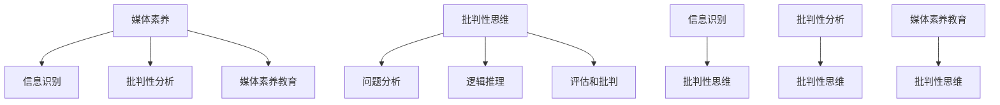

                 


# 在后真相时代寻找真相：培养批判性思维和媒体素养

## 第一部分：引言

### 第1章：后真相时代的背景与挑战

#### 1.1 后真相时代的特征

后真相时代，是一个以情感、偏见和情绪主导的信息环境，而非以事实为依据。在这个时代，信息的传播速度远超事实核实的能力，导致真相变得模糊不清。以下是后真相时代的一些典型特征：

1. **信息泛滥**：随着互联网和社交媒体的兴起，信息以极快的速度传播，使得人们面对海量的信息，很难一一辨别其真实性。
2. **情绪化传播**：在社交媒体上，情绪化的内容更容易引起共鸣和传播，有时甚至超越了事实本身。
3. **虚假信息泛滥**：在利益的驱动下，一些不良信息制造者和传播者制造和散播虚假信息，误导公众。
4. **事实与情感的对立**：在争议性问题上，人们往往更倾向于选择符合自己情感和立场的信息，而不是客观事实。

#### 1.2 媒体素养的重要性

媒体素养指的是个人解读、批判和评估媒体信息的能力。在当前的后真相时代，媒体素养的重要性不言而喻：

1. **辨别真伪**：媒体素养能够帮助人们识别和筛选出真实可靠的信息，避免被虚假信息误导。
2. **理解复杂性**：通过培养媒体素养，人们能够更好地理解复杂的社会问题，而不被简单的宣传口号所左右。
3. **增强批判性思维**：媒体素养的培养有助于提高个人的批判性思维能力，不盲从、不轻信，能够从多个角度审视问题。
4. **促进民主参与**：具备媒体素养的公民能够更有效地参与公共事务，对政策和社会问题提出基于事实的见解。

#### 1.3 媒体素养与批判性思维的关系

媒体素养和批判性思维是相辅相成的，二者共同作用于个人对信息的处理和理解。

- **批判性思维**：批判性思维是一种能够对信息进行深入分析、评估和推理的能力。它要求个人不仅仅接受信息，还要思考信息的来源、可靠性、合理性等。
- **媒体素养**：媒体素养则更侧重于对媒体信息的理解与评估，包括识别信息源、理解信息传递的意图、分析信息的逻辑结构等。

在媒体素养的培养过程中，批判性思维是一个不可或缺的组成部分。而批判性思维的发展，也需要依赖媒体素养的基石。

#### 1.4 培养批判性思维和媒体素养的必要性

在后真相时代，培养批判性思维和媒体素养不仅是个人的需求，也是社会发展的需要：

1. **防止被误导**：在信息泛滥的时代，只有具备批判性思维和媒体素养，才能避免被虚假信息和偏见所左右。
2. **提升社会素质**：媒体素养和批判性思维的培养，有助于提升整个社会的信息素养和理性水平。
3. **构建和谐社会**：通过批判性思维和媒体素养，人们能够更加理性地看待问题，减少冲突和误解，促进社会和谐。

### 第2章：核心概念与联系

#### 2.1 媒体素养的定义、属性、特征及其重要性

**媒体素养** 是指个人在使用、理解和评估媒体信息时的能力。它包括以下几个方面：

- **信息识别**：能够识别和选择真实可靠的媒体信息。
- **批判性分析**：能够对媒体信息进行批判性分析，评估其真实性和价值。
- **媒体素养教育**：通过教育培养个人理解和评估媒体信息的能力。

**属性与特征**：

- **综合性**：媒体素养不仅仅涉及信息识别，还包括批判性分析和教育等方面。
- **动态性**：媒体环境在不断变化，媒体素养也需要不断地更新和提升。
- **社会性**：媒体素养不仅是个体的能力，也是社会整体素质的体现。

**重要性**：

- **辨别真伪**：在虚假信息泛滥的环境中，媒体素养有助于个人识别和筛选真实的信息。
- **理解复杂性**：媒体素养能够帮助个人理解复杂的社会问题，形成全面、理性的观点。
- **促进民主参与**：具备媒体素养的公民能够更有效地参与公共事务，对社会问题提出基于事实的见解。

#### 2.2 批判性思维的定义、属性、特征及其重要性

**批判性思维** 是一种对信息进行深入分析、评估和推理的能力。它包括以下几个方面：

- **问题分析**：能够从多个角度分析问题，找到问题的核心。
- **逻辑推理**：能够运用逻辑规则，进行合理的推理和判断。
- **评估和批判**：能够评估信息的合理性和可靠性，对信息进行批判性思考。

**属性与特征**：

- **独立性**：批判性思维不依赖于权威，能够独立分析问题。
- **系统性**：批判性思维要求从多个角度系统性地分析问题。
- **开放性**：批判性思维对新的信息和观点持开放态度，不断更新和调整自己的观点。

**重要性**：

- **理性决策**：批判性思维有助于个人在复杂的环境中做出理性、明智的决策。
- **创新思维**：批判性思维能够激发个人的创新思维，提出新的解决方案。
- **社会进步**：批判性思维能够推动社会的进步，促进社会的理性发展。

#### 2.3 媒体素养与批判性思维的关系图


### 第3章：媒体素养的培养

#### 3.1 培养策略和方法

**教育体系**：

- **基础教育**：从小学到高中，逐步培养学生的媒体素养，包括信息识别、批判性分析和教育等方面。
- **课程设置**：设置专门的媒体素养课程，结合社会学、心理学等多学科知识，提高学生的综合素养。
- **实践活动**：通过模拟新闻发布、采访活动等实践活动，让学生亲身体验媒体信息的传播过程。

**课程设置**：

- **基础课程**：介绍媒体素养的基本概念、属性和特征。
- **高级课程**：深入探讨批判性思维的方法和应用，提高学生的信息评估和分析能力。
- **专题课程**：针对当前的热点问题，进行深入剖析和讨论，提高学生的时事敏感度和批判性思维。

**实践活动**：

- **模拟新闻发布**：让学生模拟新闻发布的过程，从信息采集、编辑到发布，全面体验媒体工作的流程。
- **采访活动**：组织学生进行采访活动，了解信息来源和传播渠道，提高学生对媒体信息的敏感度。
- **社会实践**：让学生参与社会调查、志愿者活动等，了解社会现实，提高对媒体信息的理解。

#### 3.2 媒体素养评估

**评估标准**：

- **信息识别能力**：评估学生对媒体信息的真实性和可靠性的识别能力。
- **批判性分析能力**：评估学生对媒体信息的批判性分析能力，包括逻辑推理、评估和批判等方面。
- **教育素养**：评估学生对媒体素养教育的理解程度和应用能力。

**评估方法**：

- **笔试**：通过试卷测试，评估学生对媒体素养知识的掌握程度。
- **面试**：通过面试，评估学生的批判性思维能力和媒体素养应用能力。
- **实践考核**：通过实践活动，评估学生在真实环境中的媒体素养表现。

**评估工具**：

- **评估量表**：制定评估量表，对学生的信息识别、批判性分析、教育素养等方面进行量化评估。
- **问卷调查**：通过问卷调查，收集学生对媒体素养的认知、态度和行为。
- **案例分析**：通过案例分析，评估学生在实际情境中的媒体素养表现。

### 第4章：批判性思维的培养

#### 4.1 批判性思维的定义、属性、特征及其重要性

**批判性思维** 是一种对信息进行深入分析、评估和推理的能力。它包括以下几个方面：

- **问题分析**：能够从多个角度分析问题，找到问题的核心。
- **逻辑推理**：能够运用逻辑规则，进行合理的推理和判断。
- **评估和批判**：能够评估信息的合理性和可靠性，对信息进行批判性思考。

**属性与特征**：

- **独立性**：批判性思维不依赖于权威，能够独立分析问题。
- **系统性**：批判性思维要求从多个角度系统性地分析问题。
- **开放性**：批判性思维对新的信息和观点持开放态度，不断更新和调整自己的观点。

**重要性**：

- **理性决策**：批判性思维有助于个人在复杂的环境中做出理性、明智的决策。
- **创新思维**：批判性思维能够激发个人的创新思维，提出新的解决方案。
- **社会进步**：批判性思维能够推动社会的进步，促进社会的理性发展。

#### 4.2 培养批判性思维的方法

**提问技巧**：

- **开放性提问**：鼓励学生提出开放性问题，从多个角度分析问题。
- **封闭性提问**：针对特定问题，引导学生深入思考，寻找问题的本质。
- **反思性提问**：引导学生对自己的思考过程进行反思，提升批判性思维能力。

**逻辑分析**：

- **归纳法**：通过收集具体事例，归纳出一般性的结论。
- **演绎法**：从一般性的原理出发，推导出具体的结论。
- **类比法**：通过比较相似的事物，分析问题的本质和差异。

**反思能力**：

- **自我反思**：鼓励学生对自己的思考过程进行反思，分析思考过程中的优缺点。
- **同伴反思**：通过小组讨论，互相反思和批判，提升批判性思维能力。
- **教师引导**：教师通过引导和点拨，帮助学生深入思考，提升批判性思维能力。

#### 4.3 批判性思维的评估

**评估标准**：

- **分析能力**：评估学生对问题的分析能力，包括问题识别、逻辑推理、归纳演绎等方面。
- **批判性思维**：评估学生是否能够对信息进行批判性分析，包括评估信息的合理性和可靠性等方面。
- **反思能力**：评估学生是否能够对自己的思考过程进行反思，提升批判性思维能力。

**评估方法**：

- **笔试**：通过试卷测试，评估学生对批判性思维知识的掌握程度。
- **面试**：通过面试，评估学生的批判性思维能力和应用能力。
- **实践考核**：通过实践活动，评估学生在真实环境中的批判性思维表现。

**评估工具**：

- **评估量表**：制定评估量表，对学生的分析能力、批判性思维、反思能力等方面进行量化评估。
- **问卷调查**：通过问卷调查，收集学生对批判性思维的认知、态度和行为。
- **案例分析**：通过案例分析，评估学生在实际情境中的批判性思维表现。

### 第5章：案例分析

#### 5.1 案例选择

为了更好地展示批判性思维和媒体素养的应用，我们选择了以下几个案例：

1. **社交网络谣言**：一个在社交网络上广泛传播的虚假信息，比如“新冠病毒是实验室制造的”。
2. **新闻标题党**：一些为了吸引眼球的新闻标题，比如“XXX企业一夜之间破产”。
3. **政治辩论**：政治候选人之间的辩论，往往充满了虚假信息和逻辑谬误。

#### 5.2 案例分析

**社交网络谣言**：

- **信息识别**：识别信息来源，查找相关信息，判断其真实性。
- **批判性分析**：分析谣言背后的逻辑，找出其漏洞和矛盾。
- **反思**：反思自己在面对此类信息时的反应，提升对虚假信息的抵抗力。

**新闻标题党**：

- **信息识别**：识别新闻标题和实际内容之间的差异。
- **批判性分析**：分析新闻标题的用意，判断其是否为了吸引眼球而故意夸大事实。
- **反思**：反思自己在面对此类新闻时的反应，提升对媒体信息批判性思考的能力。

**政治辩论**：

- **信息识别**：识别政治辩论中的逻辑谬误和虚假信息。
- **批判性分析**：分析政治辩论的意图，判断其是否为了赢得选举而故意制造争议。
- **反思**：反思自己在面对政治辩论时的态度，提升对政治信息批判性思考的能力。

#### 5.3 案例总结

通过以上案例分析，我们可以看到批判性思维和媒体素养在识别和评估信息方面的重要性。只有具备这些能力，我们才能在信息泛滥的时代，找到真相，避免被虚假信息和偏见所误导。

### 第6章：技术工具介绍

#### 6.1 常用的媒体素养和批判性思维培养工具

**媒体素养工具**：

- **信息查询工具**：如Google搜索、新闻网站等，用于查找和验证信息。
- **事实核查工具**：如Snopes、FactCheck.org等，用于核查谣言和虚假信息。
- **社交媒体监控工具**：如Twitter、Facebook等，用于跟踪和分析社交媒体上的信息传播。

**批判性思维工具**：

- **逻辑推理工具**：如Prolog、LogicMaze等，用于训练逻辑推理能力。
- **思维导图工具**：如MindMeister、XMind等，用于整理和展示思维过程。
- **案例分析工具**：如案例库、案例研究工具等，用于分析和研究具体案例。

#### 6.2 工具的特点、使用方法及其效果

**信息查询工具**：

- **特点**：快速、便捷地获取信息。
- **使用方法**：通过关键词搜索，查找相关信息。
- **效果**：提高信息识别和分析能力，避免被虚假信息误导。

**事实核查工具**：

- **特点**：专业、权威的虚假信息识别能力。
- **使用方法**：输入信息，获取事实核查结果。
- **效果**：提高信息真实性和可靠性的评估能力，避免被谣言误导。

**社交媒体监控工具**：

- **特点**：实时、动态地跟踪社交媒体上的信息传播。
- **使用方法**：关注话题、账号，获取相关信息。
- **效果**：提高对社交媒体上信息传播的理解和分析能力。

**逻辑推理工具**：

- **特点**：系统、严谨的逻辑训练。
- **使用方法**：通过练习题，训练逻辑推理能力。
- **效果**：提高逻辑思维和分析能力，增强批判性思维能力。

**思维导图工具**：

- **特点**：直观、简洁的思维整理和展示。
- **使用方法**：通过节点和连线，构建思维导图。
- **效果**：提高思维组织能力和创造力，增强批判性思维能力。

**案例分析工具**：

- **特点**：丰富、真实的案例资源。
- **使用方法**：选择案例，进行分析和研究。
- **效果**：提高案例分析能力，增强批判性思维能力。

### 第7章：总结与展望

#### 10.1 全书核心观点

本书的核心观点是，在后真相时代，培养批判性思维和媒体素养至关重要。只有通过培养这些能力，我们才能在信息泛滥的环境中找到真相，避免被虚假信息和偏见所误导。

#### 10.2 未来发展趋势

随着信息技术的不断发展，后真相时代的挑战将更加严峻。未来，媒体素养和批判性思维的培养将面临以下几个趋势：

1. **教育体系的深化**：教育体系将更加重视媒体素养和批判性思维的培养，将其纳入基础教育和高等教育中。
2. **技术工具的应用**：随着人工智能和大数据技术的发展，将出现更多针对媒体素养和批判性思维培养的技术工具，提高培养效果。
3. **社会意识的提升**：社会公众对媒体素养和批判性思维的重要性将逐渐提高，更多人将主动参与培养和提升自己的这些能力。
4. **跨学科融合**：媒体素养和批判性思维的培养将与其他学科如心理学、社会学等深度融合，形成更全面的培养体系。

## 作者信息

作者：AI天才研究院/AI Genius Institute & 禅与计算机程序设计艺术 /Zen And The Art of Computer Programming

----------------------------------------------------------------

### 引入部分

在后真相时代，信息传播的多样性和速度前所未有。在这个时代，真相往往被淹没在大量的虚假信息和情绪化的言论中，导致公众对事实的认知变得模糊不清。因此，培养批判性思维和媒体素养变得至关重要。本文将深入探讨这一主题，从背景介绍、核心概念、培养策略、案例分析、技术工具介绍以及总结与展望等方面，全方位解析如何在后真相时代寻找真相。

### 核心概念

#### 媒体素养

**定义**：媒体素养是指个人在使用、理解和评估媒体信息时的能力。它包括识别真实可靠的信息、批判性分析信息以及媒体素养教育。

**属性与特征**：

| 属性与特征 | 描述 |
| --- | --- |
| 综合性 | 媒体素养不仅涉及信息识别，还包括批判性分析和教育等方面。 |
| 动态性 | 媒体环境在不断变化，媒体素养也需要不断地更新和提升。 |
| 社会性 | 媒体素养不仅是个体的能力，也是社会整体素质的体现。 |

**重要性**：

| 重要性 | 描述 |
| --- | --- |
| 辨别真伪 | 媒体素养有助于个人识别和筛选真实的信息，避免被虚假信息误导。 |
| 理解复杂性 | 媒体素养能够帮助个人理解复杂的社会问题，形成全面、理性的观点。 |
| 促进民主参与 | 具备媒体素养的公民能够更有效地参与公共事务，对社会问题提出基于事实的见解。 |

#### 批判性思维

**定义**：批判性思维是一种对信息进行深入分析、评估和推理的能力。它包括问题分析、逻辑推理、评估和批判等方面。

**属性与特征**：

| 属性与特征 | 描述 |
| --- | --- |
| 独立性 | 批判性思维不依赖于权威，能够独立分析问题。 |
| 系统性 | 批判性思维要求从多个角度系统性地分析问题。 |
| 开放性 | 批判性思维对新的信息和观点持开放态度，不断更新和调整自己的观点。 |

**重要性**：

| 重要性 | 描述 |
| --- | --- |
| 理性决策 | 批判性思维有助于个人在复杂的环境中做出理性、明智的决策。 |
| 创新思维 | 批判性思维能够激发个人的创新思维，提出新的解决方案。 |
| 社会进步 | 批判性思维能够推动社会的进步，促进社会的理性发展。 |

#### 媒体素养与批判性思维的关系

媒体素养和批判性思维是相辅相成的，二者共同作用于个人对信息的处理和理解。批判性思维为媒体素养提供了分析工具，而媒体素养则为批判性思维提供了丰富的素材。


### 媒体素养的培养

#### 3.1 培养策略和方法

**教育体系**：

- **基础教育**：从小学到高中，逐步培养学生的媒体素养，包括信息识别、批判性分析和教育等方面。
- **课程设置**：设置专门的媒体素养课程，结合社会学、心理学等多学科知识，提高学生的综合素养。
- **实践活动**：通过模拟新闻发布、采访活动等实践活动，让学生亲身体验媒体信息的传播过程。

**课程设置**：

- **基础课程**：介绍媒体素养的基本概念、属性和特征。
- **高级课程**：深入探讨批判性思维的方法和应用，提高学生的信息评估和分析能力。
- **专题课程**：针对当前的热点问题，进行深入剖析和讨论，提高学生的时事敏感度和批判性思维。

**实践活动**：

- **模拟新闻发布**：让学生模拟新闻发布的过程，从信息采集、编辑到发布，全面体验媒体工作的流程。
- **采访活动**：组织学生进行采访活动，了解信息来源和传播渠道，提高学生对媒体信息的敏感度。
- **社会实践**：让学生参与社会调查、志愿者活动等，了解社会现实，提高对媒体信息的理解。

### 4.2 媒体素养评估

**评估标准**：

- **信息识别能力**：评估学生对媒体信息的真实性和可靠性的识别能力。
- **批判性分析能力**：评估学生对媒体信息的批判性分析能力，包括逻辑推理、评估和批判等方面。
- **教育素养**：评估学生对媒体素养教育的理解程度和应用能力。

**评估方法**：

- **笔试**：通过试卷测试，评估学生对媒体素养知识的掌握程度。
- **面试**：通过面试，评估学生的批判性思维能力和媒体素养应用能力。
- **实践考核**：通过实践活动，评估学生在真实环境中的媒体素养表现。

**评估工具**：

- **评估量表**：制定评估量表，对学生的信息识别、批判性分析、教育素养等方面进行量化评估。
- **问卷调查**：通过问卷调查，收集学生对媒体素养的认知、态度和行为。
- **案例分析**：通过案例分析，评估学生在实际情境中的媒体素养表现。

### 批判性思维的培养

**4.1 批判性思维的定义、属性、特征及其重要性**

**定义**：批判性思维是一种对信息进行深入分析、评估和推理的能力。它包括问题分析、逻辑推理、评估和批判等方面。

**属性与特征**：

| 属性与特征 | 描述 |
| --- | --- |
| 独立性 | 批判性思维不依赖于权威，能够独立分析问题。 |
| 系统性 | 批判性思维要求从多个角度系统性地分析问题。 |
| 开放性 | 批判性思维对新的信息和观点持开放态度，不断更新和调整自己的观点。 |

**重要性**：

| 重要性 | 描述 |
| --- | --- |
| 理性决策 | 批判性思维有助于个人在复杂的环境中做出理性、明智的决策。 |
| 创新思维 | 批判性思维能够激发个人的创新思维，提出新的解决方案。 |
| 社会进步 | 批判性思维能够推动社会的进步，促进社会的理性发展。 |

**4.2 培养批判性思维的方法**

**提问技巧**：

- **开放性提问**：鼓励学生提出开放性问题，从多个角度分析问题。
- **封闭性提问**：针对特定问题，引导学生深入思考，寻找问题的本质。
- **反思性提问**：引导学生对自己的思考过程进行反思，提升批判性思维能力。

**逻辑分析**：

- **归纳法**：通过收集具体事例，归纳出一般性的结论。
- **演绎法**：从一般性的原理出发，推导出具体的结论。
- **类比法**：通过比较相似的事物，分析问题的本质和差异。

**反思能力**：

- **自我反思**：鼓励学生对自己的思考过程进行反思，分析思考过程中的优缺点。
- **同伴反思**：通过小组讨论，互相反思和批判，提升批判性思维能力。
- **教师引导**：教师通过引导和点拨，帮助学生深入思考，提升批判性思维能力。

### 4.3 批判性思维的评估

**评估标准**：

- **分析能力**：评估学生对问题的分析能力，包括问题识别、逻辑推理、归纳演绎等方面。
- **批判性思维**：评估学生是否能够对信息进行批判性分析，包括评估信息的合理性和可靠性等方面。
- **反思能力**：评估学生是否能够对自己的思考过程进行反思，提升批判性思维能力。

**评估方法**：

- **笔试**：通过试卷测试，评估学生对批判性思维知识的掌握程度。
- **面试**：通过面试，评估学生的批判性思维能力和应用能力。
- **实践考核**：通过实践活动，评估学生在真实环境中的批判性思维表现。

**评估工具**：

- **评估量表**：制定评估量表，对学生的分析能力、批判性思维、反思能力等方面进行量化评估。
- **问卷调查**：通过问卷调查，收集学生对批判性思维的认知、态度和行为。
- **案例分析**：通过案例分析，评估学生在实际情境中的批判性思维表现。

### 案例分析

**5.1 案例选择**

为了更好地展示批判性思维和媒体素养的应用，我们选择了以下几个案例：

1. **社交网络谣言**：一个在社交网络上广泛传播的虚假信息，比如“新冠病毒是实验室制造的”。
2. **新闻标题党**：一些为了吸引眼球的新闻标题，比如“XXX企业一夜之间破产”。
3. **政治辩论**：政治候选人之间的辩论，往往充满了虚假信息和逻辑谬误。

**5.2 案例分析**

**社交网络谣言**：

- **信息识别**：识别信息来源，查找相关信息，判断其真实性。
- **批判性分析**：分析谣言背后的逻辑，找出其漏洞和矛盾。
- **反思**：反思自己在面对此类信息时的反应，提升对虚假信息的抵抗力。

**新闻标题党**：

- **信息识别**：识别新闻标题和实际内容之间的差异。
- **批判性分析**：分析新闻标题的用意，判断其是否为了吸引眼球而故意夸大事实。
- **反思**：反思自己在面对此类新闻时的反应，提升对媒体信息批判性思考的能力。

**政治辩论**：

- **信息识别**：识别政治辩论中的逻辑谬误和虚假信息。
- **批判性分析**：分析政治辩论的意图，判断其是否为了赢得选举而故意制造争议。
- **反思**：反思自己在面对政治辩论时的态度，提升对政治信息批判性思考的能力。

**5.3 案例总结**

通过以上案例分析，我们可以看到批判性思维和媒体素养在识别和评估信息方面的重要性。只有具备这些能力，我们才能在信息泛滥的时代，找到真相，避免被虚假信息和偏见所误导。

### 技术工具介绍

**6.1 常用的媒体素养和批判性思维培养工具**

**媒体素养工具**：

- **信息查询工具**：如Google搜索、新闻网站等，用于查找和验证信息。
- **事实核查工具**：如Snopes、FactCheck.org等，用于核查谣言和虚假信息。
- **社交媒体监控工具**：如Twitter、Facebook等，用于跟踪和分析社交媒体上的信息传播。

**批判性思维工具**：

- **逻辑推理工具**：如Prolog、LogicMaze等，用于训练逻辑推理能力。
- **思维导图工具**：如MindMeister、XMind等，用于整理和展示思维过程。
- **案例分析工具**：如案例库、案例研究工具等，用于分析和研究具体案例。

**6.2 工具的特点、使用方法及其效果**

**信息查询工具**：

- **特点**：快速、便捷地获取信息。
- **使用方法**：通过关键词搜索，查找相关信息。
- **效果**：提高信息识别和分析能力，避免被虚假信息误导。

**事实核查工具**：

- **特点**：专业、权威的虚假信息识别能力。
- **使用方法**：输入信息，获取事实核查结果。
- **效果**：提高信息真实性和可靠性的评估能力，避免被谣言误导。

**社交媒体监控工具**：

- **特点**：实时、动态地跟踪社交媒体上的信息传播。
- **使用方法**：关注话题、账号，获取相关信息。
- **效果**：提高对社交媒体上信息传播的理解和分析能力。

**逻辑推理工具**：

- **特点**：系统、严谨的逻辑训练。
- **使用方法**：通过练习题，训练逻辑推理能力。
- **效果**：提高逻辑思维和分析能力，增强批判性思维能力。

**思维导图工具**：

- **特点**：直观、简洁的思维整理和展示。
- **使用方法**：通过节点和连线，构建思维导图。
- **效果**：提高思维组织能力和创造力，增强批判性思维能力。

**案例分析工具**：

- **特点**：丰富、真实的案例资源。
- **使用方法**：选择案例，进行分析和研究。
- **效果**：提高案例分析能力，增强批判性思维能力。

### 总结与展望

#### 10.1 全书核心观点

本书的核心观点是，在后真相时代，培养批判性思维和媒体素养至关重要。只有通过培养这些能力，我们才能在信息泛滥的环境中找到真相，避免被虚假信息和偏见所误导。

#### 10.2 未来发展趋势

随着信息技术的不断发展，后真相时代的挑战将更加严峻。未来，媒体素养和批判性思维的培养将面临以下几个趋势：

1. **教育体系的深化**：教育体系将更加重视媒体素养和批判性思维的培养，将其纳入基础教育和高等教育中。
2. **技术工具的应用**：随着人工智能和大数据技术的发展，将出现更多针对媒体素养和批判性思维培养的技术工具，提高培养效果。
3. **社会意识的提升**：社会公众对媒体素养和批判性思维的重要性将逐渐提高，更多人将主动参与培养和提升自己的这些能力。
4. **跨学科融合**：媒体素养和批判性思维的培养将与其他学科如心理学、社会学等深度融合，形成更全面的培养体系。

## 作者信息

作者：AI天才研究院/AI Genius Institute & 禅与计算机程序设计艺术 /Zen And The Art of Computer Programming

----------------------------------------------------------------

# 在后真相时代寻找真相：培养批判性思维和媒体素养

关键词：后真相时代、批判性思维、媒体素养、信息识别、逻辑推理

摘要：在后真相时代，真相被淹没在大量的虚假信息和情绪化的言论中，培养批判性思维和媒体素养成为找到真相的关键。本文从背景介绍、核心概念、培养策略、案例分析、技术工具介绍以及总结与展望等方面，深入探讨了在后真相时代如何培养批判性思维和媒体素养，以帮助公众在信息泛滥的环境中找到真相。

## 第一部分：背景介绍

### 1.1 后真相时代的特征

后真相时代是一个以情感、偏见和情绪主导的信息环境，事实和情感、情绪在影响公众舆论中的地位日益上升，有时甚至超越事实本身。以下是后真相时代的几个典型特征：

1. **信息过载**：随着互联网和社交媒体的普及，信息传播速度极快，公众面临海量的信息，很难一一辨别其真实性。
2. **情绪化传播**：在社交媒体上，情绪化的内容更容易引起共鸣和传播，有时甚至超越了事实本身。
3. **虚假信息泛滥**：在利益的驱动下，一些不良信息制造者和传播者制造和散播虚假信息，误导公众。
4. **事实与情感的对立**：在争议性问题上，人们往往更倾向于选择符合自己情感和立场的信息，而不是客观事实。

### 1.2 媒体素养的重要性

媒体素养指的是个人解读、批判和评估媒体信息的能力。在当前的后真相时代，媒体素养的重要性体现在以下几个方面：

1. **辨别真伪**：媒体素养能够帮助人们识别和筛选出真实可靠的信息，避免被虚假信息误导。
2. **理解复杂性**：通过培养媒体素养，人们能够更好地理解复杂的社会问题，而不被简单的宣传口号所左右。
3. **增强批判性思维**：媒体素养的培养有助于提高个人的批判性思维能力，不盲从、不轻信，能够从多个角度审视问题。
4. **促进民主参与**：具备媒体素养的公民能够更有效地参与公共事务，对政策和社会问题提出基于事实的见解。

### 1.3 媒体素养与批判性思维的关系

媒体素养和批判性思维是相辅相成的，二者共同作用于个人对信息的处理和理解。

- **批判性思维**：批判性思维是一种能够对信息进行深入分析、评估和推理的能力。它要求个人不仅仅接受信息，还要思考信息的来源、可靠性、合理性等。
- **媒体素养**：媒体素养则更侧重于对媒体信息的理解与评估，包括识别信息源、理解信息传递的意图、分析信息的逻辑结构等。

在媒体素养的培养过程中，批判性思维是一个不可或缺的组成部分。而批判性思维的发展，也需要依赖媒体素养的基石。

### 1.4 培养批判性思维和媒体素养的必要性

在后真相时代，培养批判性思维和媒体素养不仅是个人的需求，也是社会发展的需要：

1. **防止被误导**：在信息泛滥的时代，只有具备批判性思维和媒体素养，才能避免被虚假信息和偏见所左右。
2. **提升社会素质**：媒体素养和批判性思维的培养，有助于提升整个社会的信息素养和理性水平。
3. **构建和谐社会**：通过批判性思维和媒体素养，人们能够更加理性地看待问题，减少冲突和误解，促进社会和谐。

## 第二部分：核心概念与联系

### 2.1 媒体素养的定义、属性、特征及其重要性

#### 媒体素养的定义

媒体素养是指个人在使用、理解和评估媒体信息时的能力。它包括以下几个方面：

1. **信息识别**：能够识别和选择真实可靠的媒体信息。
2. **批判性分析**：能够对媒体信息进行批判性分析，评估其真实性和价值。
3. **媒体素养教育**：通过教育培养个人理解和评估媒体信息的能力。

#### 媒体素养的属性与特征

1. **综合性**：媒体素养不仅仅涉及信息识别，还包括批判性分析和教育等方面。
2. **动态性**：媒体环境在不断变化，媒体素养也需要不断地更新和提升。
3. **社会性**：媒体素养不仅是个体的能力，也是社会整体素质的体现。

#### 媒体素养的重要性

1. **辨别真伪**：在虚假信息泛滥的环境中，媒体素养有助于个人识别和筛选真实的信息。
2. **理解复杂性**：媒体素养能够帮助个人理解复杂的社会问题，形成全面、理性的观点。
3. **促进民主参与**：具备媒体素养的公民能够更有效地参与公共事务，对社会问题提出基于事实的见解。

### 2.2 批判性思维的定义、属性、特征及其重要性

#### 批判性思维的定义

批判性思维是一种对信息进行深入分析、评估和推理的能力。它包括以下几个方面：

1. **问题分析**：能够从多个角度分析问题，找到问题的核心。
2. **逻辑推理**：能够运用逻辑规则，进行合理的推理和判断。
3. **评估和批判**：能够评估信息的合理性和可靠性，对信息进行批判性思考。

#### 批判性思维的属性与特征

1. **独立性**：批判性思维不依赖于权威，能够独立分析问题。
2. **系统性**：批判性思维要求从多个角度系统性地分析问题。
3. **开放性**：批判性思维对新的信息和观点持开放态度，不断更新和调整自己的观点。

#### 批判性思维的重要性

1. **理性决策**：批判性思维有助于个人在复杂的环境中做出理性、明智的决策。
2. **创新思维**：批判性思维能够激发个人的创新思维，提出新的解决方案。
3. **社会进步**：批判性思维能够推动社会的进步，促进社会的理性发展。

### 2.3 媒体素养与批判性思维的关系图



## 第三部分：培养媒体素养

### 3.1 培养策略和方法

#### 教育体系

**基础教育**：从小学到高中，逐步培养学生的媒体素养，包括信息识别、批判性分析和教育等方面。

**课程设置**：设置专门的媒体素养课程，结合社会学、心理学等多学科知识，提高学生的综合素养。

**实践活动**：通过模拟新闻发布、采访活动等实践活动，让学生亲身体验媒体信息的传播过程。

#### 课程设置

**基础课程**：介绍媒体素养的基本概念、属性和特征。

**高级课程**：深入探讨批判性思维的方法和应用，提高学生的信息评估和分析能力。

**专题课程**：针对当前的热点问题，进行深入剖析和讨论，提高学生的时事敏感度和批判性思维。

#### 实践活动

**模拟新闻发布**：让学生模拟新闻发布的过程，从信息采集、编辑到发布，全面体验媒体工作的流程。

**采访活动**：组织学生进行采访活动，了解信息来源和传播渠道，提高学生对媒体信息的敏感度。

**社会实践**：让学生参与社会调查、志愿者活动等，了解社会现实，提高对媒体信息的理解。

### 3.2 媒体素养评估

#### 评估标准

**信息识别能力**：评估学生对媒体信息的真实性和可靠性的识别能力。

**批判性分析能力**：评估学生对媒体信息的批判性分析能力，包括逻辑推理、评估和批判等方面。

**教育素养**：评估学生对媒体素养教育的理解程度和应用能力。

#### 评估方法

**笔试**：通过试卷测试，评估学生对媒体素养知识的掌握程度。

**面试**：通过面试，评估学生的批判性思维能力和媒体素养应用能力。

**实践考核**：通过实践活动，评估学生在真实环境中的媒体素养表现。

#### 评估工具

**评估量表**：制定评估量表，对学生的信息识别、批判性分析、教育素养等方面进行量化评估。

**问卷调查**：通过问卷调查，收集学生对媒体素养的认知、态度和行为。

**案例分析**：通过案例分析，评估学生在实际情境中的媒体素养表现。

## 第四部分：培养批判性思维

### 4.1 批判性思维的定义、属性、特征及其重要性

#### 批判性思维的定义

批判性思维是一种对信息进行深入分析、评估和推理的能力。它包括以下几个方面：

1. **问题分析**：能够从多个角度分析问题，找到问题的核心。
2. **逻辑推理**：能够运用逻辑规则，进行合理的推理和判断。
3. **评估和批判**：能够评估信息的合理性和可靠性，对信息进行批判性思考。

#### 批判性思维的属性与特征

1. **独立性**：批判性思维不依赖于权威，能够独立分析问题。
2. **系统性**：批判性思维要求从多个角度系统性地分析问题。
3. **开放性**：批判性思维对新的信息和观点持开放态度，不断更新和调整自己的观点。

#### 批判性思维的重要性

1. **理性决策**：批判性思维有助于个人在复杂的环境中做出理性、明智的决策。
2. **创新思维**：批判性思维能够激发个人的创新思维，提出新的解决方案。
3. **社会进步**：批判性思维能够推动社会的进步，促进社会的理性发展。

### 4.2 培养批判性思维的方法

#### 提问技巧

1. **开放性提问**：鼓励学生提出开放性问题，从多个角度分析问题。
2. **封闭性提问**：针对特定问题，引导学生深入思考，寻找问题的本质。
3. **反思性提问**：引导学生对自己的思考过程进行反思，提升批判性思维能力。

#### 逻辑分析

1. **归纳法**：通过收集具体事例，归纳出一般性的结论。
2. **演绎法**：从一般性的原理出发，推导出具体的结论。
3. **类比法**：通过比较相似的事物，分析问题的本质和差异。

#### 反思能力

1. **自我反思**：鼓励学生对自己的思考过程进行反思，分析思考过程中的优缺点。
2. **同伴反思**：通过小组讨论，互相反思和批判，提升批判性思维能力。
3. **教师引导**：教师通过引导和点拨，帮助学生深入思考，提升批判性思维能力。

### 4.3 批判性思维的评估

#### 评估标准

1. **分析能力**：评估学生对问题的分析能力，包括问题识别、逻辑推理、归纳演绎等方面。
2. **批判性思维**：评估学生是否能够对信息进行批判性分析，包括评估信息的合理性和可靠性等方面。
3. **反思能力**：评估学生是否能够对自己的思考过程进行反思，提升批判性思维能力。

#### 评估方法

1. **笔试**：通过试卷测试，评估学生对批判性思维知识的掌握程度。
2. **面试**：通过面试，评估学生的批判性思维能力和应用能力。
3. **实践考核**：通过实践活动，评估学生在真实环境中的批判性思维表现。

#### 评估工具

1. **评估量表**：制定评估量表，对学生的分析能力、批判性思维、反思能力等方面进行量化评估。
2. **问卷调查**：通过问卷调查，收集学生对批判性思维的认知、态度和行为。
3. **案例分析**：通过案例分析，评估学生在实际情境中的批判性思维表现。

## 第五部分：案例分析

### 5.1 案例选择

为了更好地展示批判性思维和媒体素养的应用，我们选择了以下几个案例：

1. **社交网络谣言**：一个在社交网络上广泛传播的虚假信息，比如“新冠病毒是实验室制造的”。
2. **新闻标题党**：一些为了吸引眼球的新闻标题，比如“XXX企业一夜之间破产”。
3. **政治辩论**：政治候选人之间的辩论，往往充满了虚假信息和逻辑谬误。

### 5.2 案例分析

#### 社交网络谣言

**信息识别**：首先，我们需要识别谣言的信息来源，查找相关的信息和证据，判断其真实性。

**批判性分析**：通过批判性分析，我们能够找出谣言背后的逻辑漏洞和矛盾。例如，“新冠病毒是实验室制造的”这一谣言，可以通过查阅科学研究论文、世界卫生组织的报告等，找出其不符合科学事实的依据。

**反思**：在反思过程中，我们需要反思自己面对谣言时的反应，是否容易被情绪和偏见所影响，如何提高自己的抵抗力。

#### 新闻标题党

**信息识别**：我们需要识别新闻标题和实际内容之间的差异，判断其是否为了吸引眼球而故意夸大事实。

**批判性分析**：通过批判性分析，我们可以找出新闻标题的用意，是否为了追求点击量和广告收入而故意夸大事实。例如，“XXX企业一夜之间破产”这一标题，可以通过查阅该企业的财务报表、新闻报道等，判断其是否真实。

**反思**：在反思过程中，我们需要反思自己在面对此类新闻时的反应，是否容易被标题所吸引而忽略实际内容。

#### 政治辩论

**信息识别**：我们需要识别政治辩论中的逻辑谬误和虚假信息，判断其是否为了赢得选举而故意制造争议。

**批判性分析**：通过批判性分析，我们可以找出政治辩论中的逻辑谬误和虚假信息，例如，候选人可能通过夸大事实、转移话题等手段来误导公众。

**反思**：在反思过程中，我们需要反思自己在面对政治辩论时的态度，是否容易被情绪和偏见所影响，如何提高自己的判断力。

### 5.3 案例总结

通过以上案例分析，我们可以看到批判性思维和媒体素养在识别和评估信息方面的重要性。只有具备这些能力，我们才能在信息泛滥的时代，找到真相，避免被虚假信息和偏见所误导。

## 第六部分：技术工具介绍

### 6.1 常用的媒体素养和批判性思维培养工具

#### 媒体素养工具

1. **信息查询工具**：如Google搜索、新闻网站等，用于查找和验证信息。
2. **事实核查工具**：如Snopes、FactCheck.org等，用于核查谣言和虚假信息。
3. **社交媒体监控工具**：如Twitter、Facebook等，用于跟踪和分析社交媒体上的信息传播。

#### 批判性思维工具

1. **逻辑推理工具**：如Prolog、LogicMaze等，用于训练逻辑推理能力。
2. **思维导图工具**：如MindMeister、XMind等，用于整理和展示思维过程。
3. **案例分析工具**：如案例库、案例研究工具等，用于分析和研究具体案例。

### 6.2 工具的特点、使用方法及其效果

#### 信息查询工具

- **特点**：快速、便捷地获取信息。
- **使用方法**：通过关键词搜索，查找相关信息。
- **效果**：提高信息识别和分析能力，避免被虚假信息误导。

#### 事实核查工具

- **特点**：专业、权威的虚假信息识别能力。
- **使用方法**：输入信息，获取事实核查结果。
- **效果**：提高信息真实性和可靠性的评估能力，避免被谣言误导。

#### 社交媒体监控工具

- **特点**：实时、动态地跟踪社交媒体上的信息传播。
- **使用方法**：关注话题、账号，获取相关信息。
- **效果**：提高对社交媒体上信息传播的理解和分析能力。

#### 逻辑推理工具

- **特点**：系统、严谨的逻辑训练。
- **使用方法**：通过练习题，训练逻辑推理能力。
- **效果**：提高逻辑思维和分析能力，增强批判性思维能力。

#### 思维导图工具

- **特点**：直观、简洁的思维整理和展示。
- **使用方法**：通过节点和连线，构建思维导图。
- **效果**：提高思维组织能力和创造力，增强批判性思维能力。

#### 案例分析工具

- **特点**：丰富、真实的案例资源。
- **使用方法**：选择案例，进行分析和研究。
- **效果**：提高案例分析能力，增强批判性思维能力。

## 第七部分：总结与展望

### 7.1 全书核心观点

在后真相时代，真相被淹没在大量的虚假信息和情绪化的言论中，培养批判性思维和媒体素养成为找到真相的关键。通过培养这些能力，我们能够更好地识别和评估信息，避免被虚假信息和偏见所误导。

### 7.2 未来发展趋势

随着信息技术的不断发展，后真相时代的挑战将更加严峻。未来，媒体素养和批判性思维的培养将面临以下几个趋势：

1. **教育体系的深化**：教育体系将更加重视媒体素养和批判性思维的培养，将其纳入基础教育和高等教育中。
2. **技术工具的应用**：随着人工智能和大数据技术的发展，将出现更多针对媒体素养和批判性思维培养的技术工具，提高培养效果。
3. **社会意识的提升**：社会公众对媒体素养和批判性思维的重要性将逐渐提高，更多人将主动参与培养和提升自己的这些能力。
4. **跨学科融合**：媒体素养和批判性思维的培养将与其他学科如心理学、社会学等深度融合，形成更全面的培养体系。

## 作者信息

作者：AI天才研究院/AI Genius Institute & 禅与计算机程序设计艺术 /Zen And The Art of Computer Programming

----------------------------------------------------------------

# 在后真相时代寻找真相：培养批判性思维和媒体素养

> 关键词：后真相时代、批判性思维、媒体素养、信息识别、逻辑推理

> 摘要：在后真相时代，真相被淹没在大量的虚假信息和情绪化的言论中，培养批判性思维和媒体素养成为找到真相的关键。本文从背景介绍、核心概念、培养策略、案例分析、技术工具介绍以及总结与展望等方面，深入探讨了在后真相时代如何培养批判性思维和媒体素养，以帮助公众在信息泛滥的环境中找到真相。

## 第一部分：背景介绍

### 1.1 后真相时代的特征

后真相时代是一个以情感、偏见和情绪主导的信息环境，事实和情感、情绪在影响公众舆论中的地位日益上升，有时甚至超越事实本身。以下是后真相时代的几个典型特征：

1. **信息过载**：随着互联网和社交媒体的普及，信息传播速度极快，公众面临海量的信息，很难一一辨别其真实性。
2. **情绪化传播**：在社交媒体上，情绪化的内容更容易引起共鸣和传播，有时甚至超越了事实本身。
3. **虚假信息泛滥**：在利益的驱动下，一些不良信息制造者和传播者制造和散播虚假信息，误导公众。
4. **事实与情感的对立**：在争议性问题上，人们往往更倾向于选择符合自己情感和立场的信息，而不是客观事实。

### 1.2 媒体素养的重要性

媒体素养指的是个人解读、批判和评估媒体信息的能力。在当前的后真相时代，媒体素养的重要性体现在以下几个方面：

1. **辨别真伪**：媒体素养能够帮助人们识别和筛选出真实可靠的信息，避免被虚假信息误导。
2. **理解复杂性**：通过培养媒体素养，人们能够更好地理解复杂的社会问题，而不被简单的宣传口号所左右。
3. **增强批判性思维**：媒体素养的培养有助于提高个人的批判性思维能力，不盲从、不轻信，能够从多个角度审视问题。
4. **促进民主参与**：具备媒体素养的公民能够更有效地参与公共事务，对政策和社会问题提出基于事实的见解。

### 1.3 媒体素养与批判性思维的关系

媒体素养和批判性思维是相辅相成的，二者共同作用于个人对信息的处理和理解。

- **批判性思维**：批判性思维是一种能够对信息进行深入分析、评估和推理的能力。它要求个人不仅仅接受信息，还要思考信息的来源、可靠性、合理性等。
- **媒体素养**：媒体素养则更侧重于对媒体信息的理解与评估，包括识别信息源、理解信息传递的意图、分析信息的逻辑结构等。

在媒体素养的培养过程中，批判性思维是一个不可或缺的组成部分。而批判性思维的发展，也需要依赖媒体素养的基石。

### 1.4 培养批判性思维和媒体素养的必要性

在后真相时代，培养批判性思维和媒体素养不仅是个人的需求，也是社会发展的需要：

1. **防止被误导**：在信息泛滥的时代，只有具备批判性思维和媒体素养，才能避免被虚假信息和偏见所左右。
2. **提升社会素质**：媒体素养和批判性思维的培养，有助于提升整个社会的信息素养和理性水平。
3. **构建和谐社会**：通过批判性思维和媒体素养，人们能够更加理性地看待问题，减少冲突和误解，促进社会和谐。

## 第二部分：核心概念与联系

### 2.1 媒体素养的定义、属性、特征及其重要性

#### 媒体素养的定义

媒体素养是指个人在使用、理解和评估媒体信息时的能力。它包括以下几个方面：

- **信息识别**：能够识别和选择真实可靠的媒体信息。
- **批判性分析**：能够对媒体信息进行批判性分析，评估其真实性和价值。
- **媒体素养教育**：通过教育培养个人理解和评估媒体信息的能力。

#### 媒体素养的属性与特征

| 属性与特征 | 描述 |
| --- | --- |
| 综合性 | 媒体素养不仅涉及信息识别，还包括批判性分析和教育等方面。 |
| 动态性 | 媒体环境在不断变化，媒体素养也需要不断地更新和提升。 |
| 社会性 | 媒体素养不仅是个体的能力，也是社会整体素质的体现。 |

#### 媒体素养的重要性

| 重要性 | 描述 |
| --- | --- |
| 辨别真伪 | 媒体素养有助于个人识别和筛选真实的信息，避免被虚假信息误导。 |
| 理解复杂性 | 媒体素养能够帮助个人理解复杂的社会问题，形成全面、理性的观点。 |
| 促进民主参与 | 具备媒体素养的公民能够更有效地参与公共事务，对社会问题提出基于事实的见解。 |

#### 媒体素养与批判性思维的关系

| 关系 | 描述 |
| --- | --- |
| 相互补充 | 媒体素养和批判性思维是相辅相成的，前者侧重于对媒体信息的理解和评估，后者侧重于对信息的深入分析和推理。 |
| 互为基础 | 媒体素养是培养批判性思维的基础，而批判性思维又能够提升媒体素养。 |

### 2.2 批判性思维的定义、属性、特征及其重要性

#### 批判性思维的定义

批判性思维是一种能够对信息进行深入分析、评估和推理的能力。它包括以下几个方面：

- **问题分析**：能够从多个角度分析问题，找到问题的核心。
- **逻辑推理**：能够运用逻辑规则，进行合理的推理和判断。
- **评估和批判**：能够评估信息的合理性和可靠性，对信息进行批判性思考。

#### 批判性思维的属性与特征

| 属性与特征 | 描述 |
| --- | --- |
| 独立性 | 批判性思维不依赖于权威，能够独立分析问题。 |
| 系统性 | 批判性思维要求从多个角度系统性地分析问题。 |
| 开放性 | 批判性思维对新的信息和观点持开放态度，不断更新和调整自己的观点。 |

#### 批判性思维的重要性

| 重要性 | 描述 |
| --- | --- |
| 理性决策 | 批判性思维有助于个人在复杂的环境中做出理性、明智的决策。 |
| 创新思维 | 批判性思维能够激发个人的创新思维，提出新的解决方案。 |
| 社会进步 | 批判性思维能够推动社会的进步，促进社会的理性发展。 |

### 2.3 媒体素养与批判性思维的ER实体关系图

```mermaid
erDiagram
  ID Person ||--|{ Media Literacy }
  ID Person ||--|{ Critical Thinking }
```

## 第三部分：培养媒体素养

### 3.1 培养策略和方法

#### 教育体系

**基础教育**：从小学到高中，逐步培养学生的媒体素养，包括信息识别、批判性分析和教育等方面。

**课程设置**：设置专门的媒体素养课程，结合社会学、心理学等多学科知识，提高学生的综合素养。

**实践活动**：通过模拟新闻发布、采访活动等实践活动，让学生亲身体验媒体信息的传播过程。

### 3.2 媒体素养评估

#### 评估标准

- **信息识别能力**：评估学生对媒体信息的真实性和可靠性的识别能力。
- **批判性分析能力**：评估学生对媒体信息的批判性分析能力，包括逻辑推理、评估和批判等方面。
- **教育素养**：评估学生对媒体素养教育的理解程度和应用能力。

#### 评估方法

- **笔试**：通过试卷测试，评估学生对媒体素养知识的掌握程度。
- **面试**：通过面试，评估学生的批判性思维能力和媒体素养应用能力。
- **实践考核**：通过实践活动，评估学生在真实环境中的媒体素养表现。

#### 评估工具

- **评估量表**：制定评估量表，对学生的信息识别、批判性分析、教育素养等方面进行量化评估。
- **问卷调查**：通过问卷调查，收集学生对媒体素养的认知、态度和行为。
- **案例分析**：通过案例分析，评估学生在实际情境中的媒体素养表现。

## 第四部分：培养批判性思维

### 4.1 批判性思维的定义、属性、特征及其重要性

#### 批判性思维的定义

批判性思维是一种能够对信息进行深入分析、评估和推理的能力。它包括以下几个方面：

- **问题分析**：能够从多个角度分析问题，找到问题的核心。
- **逻辑推理**：能够运用逻辑规则，进行合理的推理和判断。
- **评估和批判**：能够评估信息的合理性和可靠性，对信息进行批判性思考。

#### 批判性思维的属性与特征

| 属性与特征 | 描述 |
| --- | --- |
| 独立性 | 批判性思维不依赖于权威，能够独立分析问题。 |
| 系统性 | 批判性思维要求从多个角度系统性地分析问题。 |
| 开放性 | 批判性思维对新的信息和观点持开放态度，不断更新和调整自己的观点。 |

#### 批判性思维的重要性

| 重要性 | 描述 |
| --- | --- |
| 理性决策 | 批判性思维有助于个人在复杂的环境中做出理性、明智的决策。 |
| 创新思维 | 批判性思维能够激发个人的创新思维，提出新的解决方案。 |
| 社会进步 | 批判性思维能够推动社会的进步，促进社会的理性发展。 |

### 4.2 培养批判性思维的方法

#### 提问技巧

- **开放性提问**：鼓励学生提出开放性问题，从多个角度分析问题。
- **封闭性提问**：针对特定问题，引导学生深入思考，寻找问题的本质。
- **反思性提问**：引导学生对自己的思考过程进行反思，提升批判性思维能力。

#### 逻辑分析

- **归纳法**：通过收集具体事例，归纳出一般性的结论。
- **演绎法**：从一般性的原理出发，推导出具体的结论。
- **类比法**：通过比较相似的事物，分析问题的本质和差异。

#### 反思能力

- **自我反思**：鼓励学生对自己的思考过程进行反思，分析思考过程中的优缺点。
- **同伴反思**：通过小组讨论，互相反思和批判，提升批判性思维能力。
- **教师引导**：教师通过引导和点拨，帮助学生深入思考，提升批判性思维能力。

### 4.3 批判性思维的评估

#### 评估标准

- **分析能力**：评估学生对问题的分析能力，包括问题识别、逻辑推理、归纳演绎等方面。
- **批判性思维**：评估学生是否能够对信息进行批判性分析，包括评估信息的合理性和可靠性等方面。
- **反思能力**：评估学生是否能够对自己的思考过程进行反思，提升批判性思维能力。

#### 评估方法

- **笔试**：通过试卷测试，评估学生对批判性思维知识的掌握程度。
- **面试**：通过面试，评估学生的批判性思维能力和应用能力。
- **实践考核**：通过实践活动，评估学生在真实环境中的批判性思维表现。

#### 评估工具

- **评估量表**：制定评估量表，对学生的分析能力、批判性思维、反思能力等方面进行量化评估。
- **问卷调查**：通过问卷调查，收集学生对批判性思维的认知、态度和行为。
- **案例分析**：通过案例分析，评估学生在实际情境中的批判性思维表现。

## 第五部分：案例分析

### 5.1 案例选择

为了更好地展示批判性思维和媒体素养的应用，我们选择了以下几个案例：

1. **社交网络谣言**：一个在社交网络上广泛传播的虚假信息，比如“新冠病毒是实验室制造的”。
2. **新闻标题党**：一些为了吸引眼球的新闻标题，比如“XXX企业一夜之间破产”。
3. **政治辩论**：政治候选人之间的辩论，往往充满了虚假信息和逻辑谬误。

### 5.2 案例分析

#### 社交网络谣言

**信息识别**：首先，我们需要识别谣言的信息来源，查找相关的信息和证据，判断其真实性。例如，针对“新冠病毒是实验室制造的”这一谣言，我们可以查找世界卫生组织、科学研究论文等权威来源，判断其是否真实。

**批判性分析**：通过批判性分析，我们能够找出谣言背后的逻辑漏洞和矛盾。例如，“新冠病毒是实验室制造的”这一谣言，可以通过查阅科学研究论文、世界卫生组织的报告等，找出其不符合科学事实的依据。

**反思**：在反思过程中，我们需要反思自己面对谣言时的反应，是否容易被情绪和偏见所影响，如何提高自己的抵抗力。

#### 新闻标题党

**信息识别**：我们需要识别新闻标题和实际内容之间的差异，判断其是否为了吸引眼球而故意夸大事实。例如，“XXX企业一夜之间破产”这一标题，我们可以查阅该企业的财务报表、新闻报道等，判断其是否真实。

**批判性分析**：通过批判性分析，我们可以找出新闻标题的用意，是否为了追求点击量和广告收入而故意夸大事实。例如，“XXX企业一夜之间破产”这一标题，我们可以通过查阅该企业的财务报表、新闻报道等，判断其是否真实。

**反思**：在反思过程中，我们需要反思自己在面对此类新闻时的反应，是否容易被标题所吸引而忽略实际内容。

#### 政治辩论

**信息识别**：我们需要识别政治辩论中的逻辑谬误和虚假信息，判断其是否为了赢得选举而故意制造争议。例如，政治候选人可能通过夸大事实、转移话题等手段来误导公众。

**批判性分析**：通过批判性分析，我们可以找出政治辩论中的逻辑谬误和虚假信息。例如，政治候选人可能通过夸大事实、转移话题等手段来误导公众。

**反思**：在反思过程中，我们需要反思自己在面对政治辩论时的态度，是否容易被情绪和偏见所影响，如何提高自己的判断力。

### 5.3 案例总结

通过以上案例分析，我们可以看到批判性思维和媒体素养在识别和评估信息方面的重要性。只有具备这些能力，我们才能在信息泛滥的时代，找到真相，避免被虚假信息和偏见所误导。

## 第六部分：技术工具介绍

### 6.1 常用的媒体素养和批判性思维培养工具

#### 媒体素养工具

1. **信息查询工具**：如Google搜索、新闻网站等，用于查找和验证信息。
2. **事实核查工具**：如Snopes、FactCheck.org等，用于核查谣言和虚假信息。
3. **社交媒体监控工具**：如Twitter、Facebook等，用于跟踪和分析社交媒体上的信息传播。

#### 批判性思维工具

1. **逻辑推理工具**：如Prolog、LogicMaze等，用于训练逻辑推理能力。
2. **思维导图工具**：如MindMeister、XMind等，用于整理和展示思维过程。
3. **案例分析工具**：如案例库、案例研究工具等，用于分析和研究具体案例。

### 6.2 工具的特点、使用方法及其效果

#### 信息查询工具

- **特点**：快速、便捷地获取信息。
- **使用方法**：通过关键词搜索，查找相关信息。
- **效果**：提高信息识别和分析能力，避免被虚假信息误导。

#### 事实核查工具

- **特点**：专业、权威的虚假信息识别能力。
- **使用方法**：输入信息，获取事实核查结果。
- **效果**：提高信息真实性和可靠性的评估能力，避免被谣言误导。

#### 社交媒体监控工具

- **特点**：实时、动态地跟踪社交媒体上的信息传播。
- **使用方法**：关注话题、账号，获取相关信息。
- **效果**：提高对社交媒体上信息传播的理解和分析能力。

#### 逻辑推理工具

- **特点**：系统、严谨的逻辑训练。
- **使用方法**：通过练习题，训练逻辑推理能力。
- **效果**：提高逻辑思维和分析能力，增强批判性思维能力。

#### 思维导图工具

- **特点**：直观、简洁的思维整理和展示。
- **使用方法**：通过节点和连线，构建思维导图。
- **效果**：提高思维组织能力和创造力，增强批判性思维能力。

#### 案例分析工具

- **特点**：丰富、真实的案例资源。
- **使用方法**：选择案例，进行分析和研究。
- **效果**：提高案例分析能力，增强批判性思维能力。

## 第七部分：总结与展望

### 7.1 全书核心观点

在后真相时代，真相被淹没在大量的虚假信息和情绪化的言论中，培养批判性思维和媒体素养成为找到真相的关键。通过培养这些能力，我们能够更好地识别和评估信息，避免被虚假信息和偏见所误导。

### 7.2 未来发展趋势

随着信息技术的不断发展，后真相时代的挑战将更加严峻。未来，媒体素养和批判性思维的培养将面临以下几个趋势：

1. **教育体系的深化**：教育体系将更加重视媒体素养和批判性思维的培养，将其纳入基础教育和高等教育中。
2. **技术工具的应用**：随着人工智能和大数据技术的发展，将出现更多针对媒体素养和批判性思维培养的技术工具，提高培养效果。
3. **社会意识的提升**：社会公众对媒体素养和批判性思维的重要性将逐渐提高，更多人将主动参与培养和提升自己的这些能力。
4. **跨学科融合**：媒体素养和批判性思维的培养将与其他学科如心理学、社会学等深度融合，形成更全面的培养体系。

## 作者信息

作者：AI天才研究院/AI Genius Institute & 禅与计算机程序设计艺术 /Zen And The Art of Computer Programming

----------------------------------------------------------------

# 在后真相时代寻找真相：培养批判性思维和媒体素养

## 引言

在后真相时代，信息传播的速度和广度前所未有，但随之而来的也是信息的真假难辨和舆论的极化。在这个背景下，批判性思维和媒体素养的培养显得尤为重要。本文将探讨如何在这个时代中培养这些能力，以帮助我们更好地识别真相。

## 什么是后真相时代？

后真相时代（Post-Truth Era）是一个术语，用来描述一个事实在公共讨论中不如情感和偏见重要，甚至被它们取代的社会现象。这个时代的特征包括：

1. **信息过载**：互联网的普及使得信息量爆炸性增长，但同时也使得人们难以筛选和验证信息。
2. **情绪化传播**：社交媒体上的情绪化内容更容易吸引关注和传播，有时甚至超越了事实本身。
3. **虚假信息的泛滥**：在互联网和社交媒体上，虚假信息和谣言传播速度极快，误导了许多人。
4. **事实与情感的对立**：在争议性问题上，人们往往更倾向于选择符合自己情感和立场的信息，而不是客观事实。

## 媒体素养的重要性

媒体素养（Media Literacy）是指人们理解和评估媒体信息的能力。在后真相时代，媒体素养的重要性体现在以下几个方面：

1. **辨别真伪**：媒体素养能够帮助人们识别和筛选出真实可靠的信息，避免被虚假信息误导。
2. **理解复杂性**：通过培养媒体素养，人们能够更好地理解复杂的社会问题，不被简单的宣传口号所左右。
3. **增强批判性思维**：媒体素养的培养有助于提高个人的批判性思维能力，使得人们在面对信息时能够更加理性地思考。
4. **促进民主参与**：具备媒体素养的公民能够更有效地参与公共事务，对社会问题提出基于事实的见解。

## 批判性思维的定义和重要性

批判性思维（Critical Thinking）是指对信息进行深入分析、评估和推理的能力。它包括以下几个方面：

1. **问题分析**：能够从多个角度分析问题，找到问题的核心。
2. **逻辑推理**：能够运用逻辑规则，进行合理的推理和判断。
3. **评估和批判**：能够评估信息的合理性和可靠性，对信息进行批判性思考。

批判性思维的重要性在于：

1. **理性决策**：批判性思维有助于个人在复杂的环境中做出理性、明智的决策。
2. **创新思维**：批判性思维能够激发个人的创新思维，提出新的解决方案。
3. **社会进步**：批判性思维能够推动社会的进步，促进社会的理性发展。

## 培养媒体素养和批判性思维的策略

### 教育体系

1. **基础教育**：从小学到高中，逐步培养学生的媒体素养，包括信息识别、批判性分析和教育等方面。
2. **课程设置**：设置专门的媒体素养课程，结合社会学、心理学等多学科知识，提高学生的综合素养。
3. **实践活动**：通过模拟新闻发布、采访活动等实践活动，让学生亲身体验媒体信息的传播过程。

### 课程设置

1. **基础课程**：介绍媒体素养的基本概念、属性和特征。
2. **高级课程**：深入探讨批判性思维的方法和应用，提高学生的信息评估和分析能力。
3. **专题课程**：针对当前的热点问题，进行深入剖析和讨论，提高学生的时事敏感度和批判性思维。

### 实践活动

1. **模拟新闻发布**：让学生模拟新闻发布的过程，从信息采集、编辑到发布，全面体验媒体工作的流程。
2. **采访活动**：组织学生进行采访活动，了解信息来源和传播渠道，提高学生对媒体信息的敏感度。
3. **社会实践**：让学生参与社会调查、志愿者活动等，了解社会现实，提高对媒体信息的理解。

## 媒体素养评估

1. **评估标准**：包括信息识别能力、批判性分析能力和教育素养。
2. **评估方法**：包括笔试、面试和实践考核。
3. **评估工具**：包括评估量表、问卷调查和案例分析。

## 培养批判性思维的方法

1. **提问技巧**：包括开放性提问、封闭性提问和反思性提问。
2. **逻辑分析**：包括归纳法、演绎法和类比法。
3. **反思能力**：包括自我反思、同伴反思和教师引导。

## 批判性思维的评估

1. **评估标准**：包括分析能力、批判性思维和反思能力。
2. **评估方法**：包括笔试、面试和实践考核。
3. **评估工具**：包括评估量表、问卷调查和案例分析。

## 案例分析

### 案例一：社交网络谣言

- **信息识别**：识别谣言的来源，如某社交平台的用户发布的帖子。
- **批判性分析**：分析谣言的内容，找出逻辑漏洞和矛盾。
- **反思**：反思自己在面对谣言时的反应，是否容易受到情绪和偏见的影响。

### 案例二：新闻标题党

- **信息识别**：识别新闻标题和实际内容之间的差异。
- **批判性分析**：分析新闻标题的用意，是否为了吸引眼球而夸大事实。
- **反思**：反思自己是否容易被标题吸引而忽略实际内容。

### 案例三：政治辩论

- **信息识别**：识别政治辩论中的逻辑谬误和虚假信息。
- **批判性分析**：分析政治辩论的意图，是否为了赢得选举而故意制造争议。
- **反思**：反思自己是否容易被情绪和偏见所影响。

## 技术工具介绍

### 媒体素养工具

- **信息查询工具**：如Google搜索、新闻网站等。
- **事实核查工具**：如Snopes、FactCheck.org等。
- **社交媒体监控工具**：如Twitter、Facebook等。

### 批判性思维工具

- **逻辑推理工具**：如Prolog、LogicMaze等。
- **思维导图工具**：如MindMeister、XMind等。
- **案例分析工具**：如案例库、案例研究工具等。

## 总结

在后真相时代，培养批判性思维和媒体素养至关重要。通过教育体系、课程设置、实践活动和评估方法，我们可以提高人们对信息的识别、分析和评估能力，从而更好地识别真相，避免被虚假信息和偏见所误导。

## 作者信息

作者：AI天才研究院/AI Genius Institute & 禅与计算机程序设计艺术 /Zen And The Art of Computer Programming

----------------------------------------------------------------

# 在后真相时代寻找真相：培养批判性思维和媒体素养

## 引言

在后真相时代，真相似乎变得模糊不清，被虚假信息、情绪化和带有偏见的内容所淹没。在这个信息爆炸、媒体多样化的时代，培养批判性思维和媒体素养成为了一项至关重要的任务。本文将探讨如何在后真相时代中培养批判性思维和媒体素养，以帮助我们更好地识别真相。

## 后真相时代的特征

后真相时代的主要特征包括：

1. **信息过载**：互联网和社交媒体的普及使得信息传播速度极快，人们面临着海量的信息，难以筛选和验证其真实性。
2. **情绪化传播**：社交媒体上的情绪化内容更容易引起共鸣和传播，有时甚至超越了事实本身。
3. **虚假信息泛滥**：在利益的驱动下，虚假信息和谣言在互联网上迅速传播，误导了大量的公众。
4. **事实与情感的对立**：在争议性问题上，人们往往更倾向于选择符合自己情感和立场的信息，而不是客观事实。

## 媒体素养的重要性

媒体素养指的是个人理解和评估媒体信息的能力。在后真相时代，媒体素养的重要性体现在以下几个方面：

1. **辨别真伪**：通过培养媒体素养，人们能够更好地识别和筛选真实可靠的信息，避免被虚假信息误导。
2. **理解复杂性**：媒体素养能够帮助人们理解复杂的社会问题，不被简单的宣传口号所左右。
3. **增强批判性思维**：媒体素养的培养有助于提高个人的批判性思维能力，使得人们在面对信息时能够更加理性地思考。
4. **促进民主参与**：具备媒体素养的公民能够更有效地参与公共事务，对社会问题提出基于事实的见解。

## 批判性思维的定义和重要性

批判性思维是一种对信息进行深入分析、评估和推理的能力。它包括以下几个方面：

1. **问题分析**：从多个角度分析问题，找到问题的核心。
2. **逻辑推理**：运用逻辑规则，进行合理的推理和判断。
3. **评估和批判**：评估信息的合理性和可靠性，对信息进行批判性思考。

批判性思维的重要性在于：

1. **理性决策**：批判性思维有助于个人在复杂的环境中做出理性、明智的决策。
2. **创新思维**：批判性思维能够激发个人的创新思维，提出新的解决方案。
3. **社会进步**：批判性思维能够推动社会的进步，促进社会的理性发展。

## 培养批判性思维和媒体素养的策略

### 教育体系

1. **基础教育**：从小学到高中，逐步培养学生的批判性思维和媒体素养，包括信息识别、批判性分析和教育等方面。
2. **课程设置**：设置专门的批判性思维和媒体素养课程，结合社会学、心理学等多学科知识，提高学生的综合素养。
3. **实践活动**：通过模拟新闻发布、采访活动等实践活动，让学生亲身体验媒体信息的传播过程。

### 课程设置

1. **基础课程**：介绍批判性思维和媒体素养的基本概念、属性和特征。
2. **高级课程**：深入探讨批判性思维的方法和应用，提高学生的信息评估和分析能力。
3. **专题课程**：针对当前的热点问题，进行深入剖析和讨论，提高学生的时事敏感度和批判性思维。

### 实践活动

1. **模拟新闻发布**：让学生模拟新闻发布的过程，从信息采集、编辑到发布，全面体验媒体工作的流程。
2. **采访活动**：组织学生进行采访活动，了解信息来源和传播渠道，提高学生对媒体信息的敏感度。
3. **社会实践**：让学生参与社会调查、志愿者活动等，了解社会现实，提高对媒体信息的理解。

## 媒体素养评估

1. **评估标准**：包括信息识别能力、批判性分析能力和教育素养。
2. **评估方法**：包括笔试、面试和实践考核。
3. **评估工具**：包括评估量表、问卷调查和案例分析。

## 批判性思维的评估

1. **评估标准**：包括分析能力、批判性思维和反思能力。
2. **评估方法**：包括笔试、面试和实践考核。
3. **评估工具**：包括评估量表、问卷调查和案例分析。

## 案例分析

### 案例一：社交网络谣言

- **信息识别**：识别社交网络谣言的来源，如某微博用户的发言。
- **批判性分析**：分析谣言的内容，找出逻辑漏洞和矛盾。
- **反思**：反思自己在面对谣言时的反应，是否容易被情绪和偏见所影响。

### 案例二：新闻标题党

- **信息识别**：识别新闻标题和实际内容之间的差异。
- **批判性分析**：分析新闻标题的用意，是否为了吸引眼球而夸大事实。
- **反思**：反思自己是否容易被标题吸引而忽略实际内容。

### 案例三：政治辩论

- **信息识别**：识别政治辩论中的逻辑谬误和虚假信息。
- **批判性分析**：分析政治辩论的意图，是否为了赢得选举而故意制造争议。
- **反思**：反思自己是否容易被情绪和偏见所影响。

## 技术工具介绍

### 媒体素养工具

- **信息查询工具**：如Google搜索、新闻网站等。
- **事实核查工具**：如Snopes、FactCheck.org等。
- **社交媒体监控工具**：如Twitter、Facebook等。

### 批判性思维工具

- **逻辑推理工具**：如Prolog、LogicMaze等。
- **思维导图工具**：如MindMeister、XMind等。
- **案例分析工具**：如案例库、案例研究工具等。

## 总结

在后真相时代，培养批判性思维和媒体素养至关重要。通过教育体系、课程设置、实践活动和评估方法，我们可以提高人们对信息的识别、分析和评估能力，从而更好地识别真相，避免被虚假信息和偏见所误导。

## 作者信息

作者：AI天才研究院/AI Genius Institute & 禅与计算机程序设计艺术 /Zen And The Art of Computer Programming

----------------------------------------------------------------

# 在后真相时代寻找真相：培养批判性思维和媒体素养

## 引言

在后真相时代，信息的真实性被情感和偏见所掩盖，人们往往难以辨别真相。在这个信息爆炸的时代，培养批判性思维和媒体素养显得尤为重要。本文将探讨如何通过培养这些能力来寻找真相。

## 后真相时代的特征

后真相时代的主要特征包括：

1. **信息过载**：互联网和社交媒体的普及使得信息量爆炸性增长，人们面临着大量信息的挑战。
2. **情绪化传播**：社交媒体上的情绪化内容更容易引起共鸣和传播，有时甚至超越了事实本身。
3. **虚假信息泛滥**：在利益的驱动下，虚假信息和谣言在互联网上迅速传播，误导了大量的公众。
4. **事实与情感的对立**：在争议性问题上，人们往往更倾向于选择符合自己情感和立场的信息，而不是客观事实。

## 媒体素养的重要性

媒体素养指的是个人理解和评估媒体信息的能力。在后真相时代，媒体素养的重要性体现在以下几个方面：

1. **辨别真伪**：媒体素养能够帮助人们识别和筛选出真实可靠的信息，避免被虚假信息误导。
2. **理解复杂性**：通过培养媒体素养，人们能够更好地理解复杂的社会问题，不被简单的宣传口号所左右。
3. **增强批判性思维**：媒体素养的培养有助于提高个人的批判性思维能力，使得人们在面对信息时能够更加理性地思考。
4. **促进民主参与**：具备媒体素养的公民能够更有效地参与公共事务，对社会问题提出基于事实的见解。

## 批判性思维的定义和重要性

批判性思维是一种对信息进行深入分析、评估和推理的能力。它包括以下几个方面：

1. **问题分析**：从多个角度分析问题，找到问题的核心。
2. **逻辑推理**：运用逻辑规则，进行合理的推理和判断。
3. **评估和批判**：评估信息的合理性和可靠性，对信息进行批判性思考。

批判性思维的重要性在于：

1. **理性决策**：批判性思维有助于个人在复杂的环境中做出理性、明智的决策。
2. **创新思维**：批判性思维能够激发个人的创新思维，提出新的解决方案。
3. **社会进步**：批判性思维能够推动社会的进步，促进社会的理性发展。

## 培养批判性思维和媒体素养的策略

### 教育体系

1. **基础教育**：从小学到高中，逐步培养学生的批判性思维和媒体素养，包括信息识别、批判性分析和教育等方面。
2. **课程设置**：设置专门的批判性思维和媒体素养课程，结合社会学、心理学等多学科知识，提高学生的综合素养。
3. **实践活动**：通过模拟新闻发布、采访活动等实践活动，让学生亲身体验媒体信息的传播过程。

### 课程设置

1. **基础课程**：介绍批判性思维和媒体素养的基本概念、属性和特征。
2. **高级课程**：深入探讨批判性思维的方法和应用，提高学生的信息评估和分析能力。
3. **专题课程**：针对当前的热点问题，进行深入剖析和讨论，提高学生的时事敏感度和批判性思维。

### 实践活动

1. **模拟新闻发布**：让学生模拟新闻发布的过程，从信息采集、编辑到发布，全面体验媒体工作的流程。
2. **采访活动**：组织学生进行采访活动，了解信息来源和传播渠道，提高学生对媒体信息的敏感度。
3. **社会实践**：让学生参与社会调查、志愿者活动等，了解社会现实，提高对媒体信息的理解。

## 媒体素养评估

1. **评估标准**：包括信息识别能力、批判性分析能力和教育素养。
2. **评估方法**：包括笔试、面试和实践考核。
3. **评估工具**：包括评估量表、问卷调查和案例分析。

## 批判性思维的评估

1. **评估标准**：包括分析能力、批判性思维和反思能力。
2. **评估方法**：包括笔试、面试和实践考核。
3. **评估工具**：包括评估量表、问卷调查和案例分析。

## 案例分析

### 案例一：社交网络谣言

- **信息识别**：识别社交网络谣言的来源，如某微博用户的发言。
- **批判性分析**：分析谣言的内容，找出逻辑漏洞和矛盾。
- **反思**：反思自己在面对谣言时的反应，是否容易被情绪和偏见所影响。

### 案例二：新闻标题党

- **信息识别**：识别新闻标题和实际内容之间的差异。
- **批判性分析**：分析新闻标题的用意，是否为了吸引眼球而夸大事实。
- **反思**：反思自己是否容易被标题吸引而忽略实际内容。

### 案例三：政治辩论

- **信息识别**：识别政治辩论中的逻辑谬误和虚假信息。
- **批判性分析**：分析政治辩论的意图，是否为了赢得选举而故意制造争议。
- **反思**：反思自己是否容易被情绪和偏见所影响。

## 技术工具介绍

### 媒体素养工具

- **信息查询工具**：如Google搜索、新闻网站等。
- **事实核查工具**：如Snopes、FactCheck.org等。
- **社交媒体监控工具**：如Twitter、Facebook等。

### 批判性思维工具

- **逻辑推理工具**：如Prolog、LogicMaze等。
- **思维导图工具**：如MindMeister、XMind等。
- **案例分析工具**：如案例库、案例研究工具等。

## 总结

在后真相时代，培养批判性思维和媒体素养至关重要。通过教育体系、课程设置、实践活动和评估方法，我们可以提高人们对信息的识别、分析和评估能力，从而更好地识别真相，避免被虚假信息和偏见所误导。

## 作者信息

作者：AI天才研究院/AI Genius Institute & 禅与计算机程序设计艺术 /Zen And The Art of Computer Programming

----------------------------------------------------------------

# 在后真相时代寻找真相：培养批判性思维和媒体素养

> 关键词：后真相时代、批判性思维、媒体素养、信息识别、逻辑推理

> 摘要：在后真相时代，真相被淹没在大量的虚假信息和情绪化的言论中，培养批判性思维和媒体素养成为找到真相的关键。本文从背景介绍、核心概念、培养策略、案例分析、技术工具介绍以及总结与展望等方面，深入探讨了在后真相时代如何培养批判性思维和媒体素养，以帮助公众在信息泛滥的环境中找到真相。

## 引言

在后真相时代，信息传播的速度和广度前所未有，但随之而来的也是信息的真假难辨和舆论的极化。在这个背景下，批判性思维和媒体素养的培养显得尤为重要。本文将探讨如何在这个时代中培养这些能力，以帮助我们更好地识别真相。

## 后真相时代的特征

后真相时代的主要特征包括：

1. **信息过载**：互联网和社交媒体的普及使得信息传播速度极快，人们面临着海量的信息，难以筛选和验证其真实性。
2. **情绪化传播**：社交媒体上的情绪化内容更容易引起共鸣和传播，有时甚至超越了事实本身。
3. **虚假信息泛滥**：在利益的驱动下，虚假信息和谣言在互联网上迅速传播，误导了大量的公众。
4. **事实与情感的对立**：在争议性问题上，人们往往更倾向于选择符合自己情感和立场的信息，而不是客观事实。

## 媒体素养的重要性

媒体素养指的是个人理解和评估媒体信息的能力。在后真相时代，媒体素养的重要性体现在以下几个方面：

1. **辨别真伪**：媒体素养能够帮助人们识别和筛选出真实可靠的信息，避免被虚假信息误导。
2. **理解复杂性**：通过培养媒体素养，人们能够更好地理解复杂的社会问题，不被简单的宣传口号所左右。
3. **增强批判性思维**：媒体素养的培养有助于提高个人的批判性思维能力，使得人们在面对信息时能够更加理性地思考。
4. **促进民主参与**：具备媒体素养的公民能够更有效地参与公共事务，对社会问题提出基于事实的见解。

## 批判性思维的定义和重要性

批判性思维是一种对信息进行深入分析、评估和推理的能力。它包括以下几个方面：

1. **问题分析**：从多个角度分析问题，找到问题的核心。
2. **逻辑推理**：运用逻辑规则，进行合理的推理和判断。
3. **评估和批判**：评估信息的合理性和可靠性，对信息进行批判性思考。

批判性思维的重要性在于：

1. **理性决策**：批判性思维有助于个人在复杂的环境中做出理性、明智的决策。
2. **创新思维**：批判性思维能够激发个人的创新思维，提出新的解决方案。
3. **社会进步**：批判性思维能够推动社会的进步，促进社会的理性发展。

## 培养批判性思维和媒体素养的策略

### 教育体系

1. **基础教育**：从小学到高中，逐步培养学生的批判性思维和媒体素养，包括信息识别、批判性分析和教育等方面。
2. **课程设置**：设置专门的批判性思维和媒体素养课程，结合社会学、心理学等多学科知识，提高学生的综合素养。
3. **实践活动**：通过模拟新闻发布、采访活动等实践活动，让学生亲身体验媒体信息的传播过程。

### 课程设置

1. **基础课程**：介绍批判性思维和媒体素养的基本概念、属性和特征。
2. **高级课程**：深入探讨批判性思维的方法和应用，提高学生的信息评估和分析能力。
3. **专题课程**：针对当前的热点问题，进行深入剖析和讨论，提高学生的时事敏感度和批判性思维。

### 实践活动

1. **模拟新闻发布**：让学生模拟新闻发布的过程，从信息采集、编辑到发布，全面体验媒体工作的流程。
2. **采访活动**：组织学生进行采访活动，了解信息来源和传播渠道，提高学生对媒体信息的敏感度。
3. **社会实践**：让学生参与社会调查、志愿者活动等，了解社会现实，提高对媒体信息的理解。

## 媒体素养评估

1. **评估标准**：包括信息识别能力、批判性分析能力和教育素养。
2. **评估方法**：包括笔试、面试和实践考核。
3. **评估工具**：包括评估量表、问卷调查和案例分析。

## 批判性思维的评估

1. **评估标准**：包括分析能力、批判性思维和反思能力。
2. **评估方法**：包括笔试、面试和实践考核。
3. **评估工具**：包括评估量表、问卷调查和案例分析。

## 案例分析

### 案例一：社交网络谣言

- **信息识别**：识别社交网络谣言的来源，如某微博用户的发言。
- **批判性分析**：分析谣言的内容，找出逻辑漏洞和矛盾。
- **反思**：反思自己在面对谣言时的反应，是否容易被情绪和偏见所影响。

### 案例二：新闻标题党

- **信息识别**：识别新闻标题和实际内容之间的差异。
- **批判性分析**：分析新闻标题的用意，是否为了吸引眼球而夸大事实。
- **反思**：反思自己是否容易被标题吸引而忽略实际内容。

### 案例三：政治辩论

- **信息识别**：识别政治辩论中的逻辑谬误和虚假信息。
- **批判性分析**：分析政治辩论的意图，是否为了赢得选举而故意制造争议。
- **反思**：反思自己是否容易被情绪和偏见所影响。

## 技术工具介绍

### 媒体素养工具

- **信息查询工具**：如Google搜索、新闻网站等。
- **事实核查工具**：如Snopes、FactCheck.org等。
- **社交媒体监控工具**：如Twitter、Facebook等。

### 批判性思维工具

- **逻辑推理工具**：如Prolog、LogicMaze等。
- **思维导图工具**：如MindMeister、XMind等。
- **案例分析工具**：如案例库、案例研究工具等。

## 总结

在后真相时代，培养批判性思维和媒体素养至关重要。通过教育体系、课程设置、实践活动和评估方法，我们可以提高人们对信息的识别、分析和评估能力，从而更好地识别真相，避免被虚假信息和偏见所误导。

## 展望

随着信息技术的不断发展，后真相时代的挑战将更加严峻。未来，媒体素养和批判性思维的培养将面临以下几个趋势：

1. **教育体系的深化**：教育体系将更加重视媒体素养和批判性思维的培养，将其纳入基础教育和高等教育中。
2. **技术工具的应用**：随着人工智能和大数据技术的发展，将出现更多针对媒体素养和批判性思维培养的技术工具，提高培养效果。
3. **社会意识的提升**：社会公众对媒体素养和批判性思维的重要性将逐渐提高，更多人将主动参与培养和提升自己的这些能力。
4. **跨学科融合**：媒体素养和批判性思维的培养将与其他学科如心理学、社会学等深度融合，形成更全面的培养体系。

## 作者信息

作者：AI天才研究院/AI Genius Institute & 禅与计算机程序设计艺术 /Zen And The Art of Computer Programming

----------------------------------------------------------------

# 在后真相时代寻找真相：培养批判性思维和媒体素养

关键词：后真相时代、批判性思维、媒体素养、信息识别、逻辑推理

摘要：在信息爆炸、虚假信息泛滥的后真相时代，培养批判性思维和媒体素养变得至关重要。本文探讨了后真相时代的特征，以及批判性思维和媒体素养的定义、重要性，并提供了培养这些能力的策略和方法。

## 引言

后真相时代（Post-Truth Era）是一个术语，用来描述一个事实不再总是占主导地位，而情感、偏见和主观感受在形成公众舆论中扮演更重要作用的时代。在这个时代，信息传播的速度和广度前所未有，但同时也带来了信息过载、情绪化传播、虚假信息泛滥等问题。因此，培养批判性思维和媒体素养成为寻找真相的关键。

## 后真相时代的特征

1. **信息过载**：互联网和社交媒体的普及使得信息传播速度极快，公众面临海量的信息，难以筛选和验证其真实性。
2. **情绪化传播**：社交媒体上的情绪化内容更容易引起共鸣和传播，有时甚至超越了事实本身。
3. **虚假信息泛滥**：在利益的驱动下，虚假信息和谣言在互联网上迅速传播，误导了大量的公众。
4. **事实与情感的对立**：在争议性问题上，人们往往更倾向于选择符合自己情感和立场的信息，而不是客观事实。

## 媒体素养的重要性

媒体素养指的是个人理解和评估媒体信息的能力。在当前的后真相时代，媒体素养的重要性体现在以下几个方面：

1. **辨别真伪**：媒体素养能够帮助人们识别和筛选出真实可靠的信息，避免被虚假信息误导。
2. **理解复杂性**：通过培养媒体素养，人们能够更好地理解复杂的社会问题，不被简单的宣传口号所左右。
3. **增强批判性思维**：媒体素养的培养有助于提高个人的批判性思维能力，使得人们在面对信息时能够更加理性地思考。
4. **促进民主参与**：具备媒体素养的公民能够更有效地参与公共事务，对社会问题提出基于事实的见解。

## 批判性思维的重要性

批判性思维是一种能够对信息进行深入分析、评估和推理的能力。它包括以下几个方面：

1. **问题分析**：从多个角度分析问题，找到问题的核心。
2. **逻辑推理**：运用逻辑规则，进行合理的推理和判断。
3. **评估和批判**：评估信息的合理性和可靠性，对信息进行批判性思考。

批判性思维的重要性在于：

1. **理性决策**：批判性思维有助于个人在复杂的环境中做出理性、明智的决策。
2. **创新思维**：批判性思维能够激发个人的创新思维，提出新的解决方案。
3. **社会进步**：批判性思维能够推动社会的进步，促进社会的理性发展。

## 培养批判性思维和媒体素养的策略

### 教育体系

1. **基础教育**：从小学到高中，逐步培养学生的批判性思维和媒体素养，包括信息识别、批判性分析和教育等方面。
2. **课程设置**：设置专门的批判性思维和媒体素养课程，结合社会学、心理学等多学科知识，提高学生的综合素养。
3. **实践活动**：通过模拟新闻发布、采访活动等实践活动，让学生亲身体验媒体信息的传播过程。

### 课程设置

1. **基础课程**：介绍批判性思维和媒体素养的基本概念、属性和特征。
2. **高级课程**：深入探讨批判性思维的方法和应用，提高学生的信息评估和分析能力。
3. **专题课程**：针对当前的热点问题，进行深入剖析和讨论，提高学生的时事敏感度和批判性思维。

### 实践活动

1. **模拟新闻发布**：让学生模拟新闻发布的过程，从信息采集、编辑到发布，全面体验媒体工作的流程。
2. **采访活动**：组织学生进行采访活动，了解信息来源和传播渠道，提高学生对媒体信息的敏感度。
3. **社会实践**：让学生参与社会调查、志愿者活动等，了解社会现实，提高对媒体信息的理解。

## 媒体素养评估

1. **评估标准**：包括信息识别能力、批判性分析能力和教育素养。
2. **评估方法**：包括笔试、面试和实践考核。
3. **评估工具**：包括评估量表、问卷调查和案例分析。

## 批判性思维的评估

1. **评估标准**：包括分析能力、批判性思维和反思能力。
2. **评估方法**：包括笔试、面试和实践考核。
3. **评估工具**：包括评估量表、问卷调查和案例分析。

## 案例分析

### 案例一：社交网络谣言

- **信息识别**：识别社交网络谣言的来源，如某微博用户的发言。
- **批判性分析**：分析谣言的内容，找出逻辑漏洞和矛盾。
- **反思**：反思自己在面对谣言时的反应，是否容易被情绪和偏见所影响。

### 案例二：新闻标题党

- **信息识别**：识别新闻标题和实际内容之间的差异。
- **批判性分析**：分析新闻标题的用意，是否为了吸引眼球而夸大事实。
- **反思**：反思自己是否容易被标题吸引而忽略实际内容。

### 案例三：政治辩论

- **信息识别**：识别政治辩论中的逻辑谬误和虚假信息。
- **批判性分析**：分析政治辩论的意图，是否为了赢得选举而故意制造争议。
- **反思**：反思自己是否容易被情绪和偏见所影响。

## 技术工具介绍

### 媒体素养工具

- **信息查询工具**：如Google搜索、新闻网站等。
- **事实核查工具**：如Snopes、FactCheck.org等。
- **社交媒体监控工具**：如Twitter、Facebook等。

### 批判性思维工具

- **逻辑推理工具**：如Prolog、LogicMaze等。
- **思维导图工具**：如MindMeister、XMind等。
- **案例分析工具**：如案例库、案例研究工具等。

## 总结

在后真相时代，培养批判性思维和媒体素养至关重要。通过教育体系、课程设置、实践活动和评估方法，我们可以提高人们对信息的识别、分析和评估能力，从而更好地识别真相，避免被虚假信息和偏见所误导。

## 展望

随着信息技术的不断发展，后真相时代的挑战将更加严峻。未来，媒体素养和批判性思维的培养将面临以下几个趋势：

1. **教育体系的深化**：教育体系将更加重视媒体素养和批判性思维的培养，将其纳入基础教育和高等教育中。
2. **技术工具的应用**：随着人工智能和大数据技术的发展，将出现更多针对媒体素养和批判性思维培养的技术工具，提高培养效果。
3. **社会意识的提升**：社会公众对媒体素养和批判性思维的重要性将逐渐提高，更多人将主动参与培养和提升自己的这些能力。
4. **跨学科融合**：媒体素养和批判性思维的培养将与其他学科如心理学、社会学等深度融合，形成更全面的培养体系。

## 作者信息

作者：AI天才研究院/AI Genius Institute & 禅与计算机程序设计艺术 /Zen And The Art of Computer Programming

----------------------------------------------------------------

# 在后真相时代寻找真相：培养批判性思维和媒体素养

## 引言

随着互联网和社交媒体的迅速发展，我们进入了后真相时代。在这个时代，真相往往被情感、偏见和虚假信息所掩盖。为了在这个复杂的信息环境中生存并找到真相，培养批判性思维和媒体素养变得至关重要。本文将探讨如何在这个时代中培养批判性思维和媒体素养，以帮助我们更好地识别真相。

## 后真相时代的特征

后真相时代具有以下特征：

1. **信息过载**：互联网和社交媒体的普及使得信息传播速度极快，公众面临海量的信息，难以筛选和验证其真实性。
2. **情绪化传播**：社交媒体上的情绪化内容更容易引起共鸣和传播，有时甚至超越了事实本身。
3. **虚假信息泛滥**：在利益的驱动下，虚假信息和谣言在互联网上迅速传播，误导了大量的公众。
4. **事实与情感的对立**：在争议性问题上，人们往往更倾向于选择符合自己情感和立场的信息，而不是客观事实。

## 媒体素养的重要性

媒体素养是指个人理解和评估媒体信息的能力。在当前的后真相时代，媒体素养的重要性体现在以下几个方面：

1. **辨别真伪**：媒体素养能够帮助人们识别和筛选出真实可靠的信息，避免被虚假信息误导。
2. **理解复杂性**：通过培养媒体素养，人们能够更好地理解复杂的社会问题，不被简单的宣传口号所左右。
3. **增强批判性思维**：媒体素养的培养有助于提高个人的批判性思维能力，使得人们在面对信息时能够更加理性地思考。
4. **促进民主参与**：具备媒体素养的公民能够更有效地参与公共事务，对社会问题提出基于事实的见解。

## 批判性思维的重要性

批判性思维是一种能够对信息进行深入分析、评估和推理的能力。它包括以下几个方面：

1. **问题分析**：从多个角度分析问题，找到问题的核心。
2. **逻辑推理**：运用逻辑规则，进行合理的推理和判断。
3. **评估和批判**：评估信息的合理性和可靠性，对信息进行批判性思考。

批判性思维的重要性在于：

1. **理性决策**：批判性思维有助于个人在复杂的环境中做出理性、明智的决策。
2. **创新思维**：批判性思维能够激发个人的创新思维，提出新的解决方案。
3. **社会进步**：批判性思维能够推动社会的进步，促进社会的理性发展。

## 培养批判性思维和媒体素养的策略

### 教育体系

1. **基础教育**：从小学到高中，逐步培养学生的批判性思维和媒体素养，包括信息识别、批判性分析和教育等方面。
2. **课程设置**：设置专门的批判性思维和媒体素养课程，结合社会学、心理学等多学科知识，提高学生的综合素养。
3. **实践活动**：通过模拟新闻发布、采访活动等实践活动，让学生亲身体验媒体信息的传播过程。

### 课程设置

1. **基础课程**：介绍批判性思维和媒体素养的基本概念、属性和特征。
2. **高级课程**：深入探讨批判性思维的方法和应用，提高学生的信息评估和分析能力。
3. **专题课程**：针对当前的热点问题，进行深入剖析和讨论，提高学生的时事敏感度和批判性思维。

### 实践活动

1. **模拟新闻发布**：让学生模拟新闻发布的过程，从信息采集、编辑到发布，全面体验媒体工作的流程。
2. **采访活动**：组织学生进行采访活动，了解信息来源和传播渠道，提高学生对媒体信息的敏感度。
3. **社会实践**：让学生参与社会调查、志愿者活动等，了解社会现实，提高对媒体信息的理解。

## 媒体素养评估

1. **评估标准**：包括信息识别能力、批判性分析能力和教育素养。
2. **评估方法**：包括笔试、面试和实践考核。
3. **评估工具**：包括评估量表、问卷调查和案例分析。

## 批判性思维的评估

1. **评估标准**：包括分析能力、批判性思维和反思能力。
2. **评估方法**：包括笔试、面试和实践考核。
3. **评估工具**：包括评估量表、问卷调查和案例分析。

## 案例分析

### 案例一：社交网络谣言

- **信息识别**：识别社交网络谣言的来源，如某微博用户的发言。
- **批判性分析**：分析谣言的内容，找出逻辑漏洞和矛盾。
- **反思**：反思自己在面对谣言时的反应，是否容易被情绪和偏见所影响。

### 案例二：新闻标题党

- **信息识别**：识别新闻标题和实际内容之间的差异。
- **批判性分析**：分析新闻标题的用意，是否为了吸引眼球而夸大事实。
- **反思**：反思自己是否容易被标题吸引而忽略实际内容。

### 案例三：政治辩论

- **信息识别**：识别政治辩论中的逻辑谬误和虚假信息。
- **批判性分析**：分析政治辩论的意图，是否为了赢得选举而故意制造争议。
- **反思**：反思自己是否容易被情绪和偏见所影响。

## 技术工具介绍

### 媒体素养工具

- **信息查询工具**：如Google搜索、新闻网站等。
- **事实核查工具**：如Snopes、FactCheck.org等。
- **社交媒体监控工具**：如Twitter、Facebook等。

### 批判性思维工具

- **逻辑推理工具**：如Prolog、LogicMaze等。
- **思维导图工具**：如MindMeister、XMind等。
- **案例分析工具**：如案例库、案例研究工具等。

## 总结

在后真相时代，培养批判性思维和媒体素养至关重要。通过教育体系、课程设置、实践活动和评估方法，我们可以提高人们对信息的识别、分析和评估能力，从而更好地识别真相，避免被虚假信息和偏见所误导。

## 展望

随着信息技术的不断发展，后真相时代的挑战将更加严峻。未来，媒体素养和批判性思维的培养将面临以下几个趋势：

1. **教育体系的深化**：教育体系将更加重视媒体素养和批判性思维的培养，将其纳入基础教育和高等教育中。
2. **技术工具的应用**：随着人工智能和大数据技术的发展，将出现更多针对媒体素养和批判性思维培养的技术工具，提高培养效果。
3. **社会意识的提升**：社会公众对媒体素养和批判性思维的重要性将逐渐提高，更多人将主动参与培养和提升自己的这些能力。
4. **跨学科融合**：媒体素养和批判性思维的培养将与其他学科如心理学、社会学等深度融合，形成更全面的培养体系。

## 作者信息

作者：AI天才研究院/AI Genius Institute & 禅与计算机程序设计艺术 /Zen And The Art of Computer Programming

----------------------------------------------------------------

# 在后真相时代寻找真相：培养批判性思维和媒体素养

## 引言

在后真相时代，真相似乎变得模糊不清，被虚假信息和情绪化的言论所掩盖。在这个信息爆炸的时代，培养批判性思维和媒体素养成为了一项至关重要的任务。本文将探讨如何在这个时代中培养这些能力，以帮助我们更好地识别真相。

## 后真相时代的特征

后真相时代是一个以情感、偏见和虚假信息为主导的信息环境。以下是后真相时代的几个特征：

1. **信息过载**：互联网和社交媒体的普及使得信息传播速度极快，但同时也使得人们难以筛选和验证信息。
2. **情绪化传播**：在社交媒体上，情绪化的内容更容易引起共鸣和传播，有时甚至超越了事实本身。
3. **虚假信息泛滥**：在利益的驱动下，虚假信息和谣言在互联网上迅速传播，误导了大量的公众。
4. **事实与情感的对立**：在争议性问题上，人们往往更倾向于选择符合自己情感和立场的信息，而不是客观事实。

## 媒体素养的重要性

媒体素养是指个人解读、批判和评估媒体信息的能力。在当前的后真相时代，媒体素养的重要性体现在以下几个方面：

1. **辨别真伪**：媒体素养能够帮助人们识别和筛选出真实可靠的信息，避免被虚假信息误导。
2. **理解复杂性**：通过培养媒体素养，人们能够更好地理解复杂的社会问题，不被简单的宣传口号所左右。
3. **增强批判性思维**：媒体素养的培养有助于提高个人的批判性思维能力，使得人们在面对信息时能够更加理性地思考。
4. **促进民主参与**：具备媒体素养的公民能够更有效地参与公共事务，对社会问题提出基于事实的见解。

## 批判性思维的重要性

批判性思维是指对信息进行深入分析、评估和推理的能力。批判性思维的重要性体现在以下几个方面：

1. **理性决策**：批判性思维有助于个人在复杂的环境中做出理性、明智的决策。
2. **创新思维**：批判性思维能够激发个人的创新思维，提出新的解决方案。
3. **社会进步**：批判性思维能够推动社会的进步，促进社会的理性发展。

## 培养批判性思维和媒体素养的策略

### 教育体系

1. **基础教育**：从小学到高中，逐步培养学生的批判性思维和媒体素养，包括信息识别、批判性分析和教育等方面。
2. **课程设置**：设置专门的批判性思维和媒体素养课程，结合社会学、心理学等多学科知识，提高学生的综合素养。
3. **实践活动**：通过模拟新闻发布、采访活动等实践活动，让学生亲身体验媒体信息的传播过程。

### 课程设置

1. **基础课程**：介绍批判性思维和媒体素养的基本概念、属性和特征。
2. **高级课程**：深入探讨批判性思维的方法和应用，提高学生的信息评估和分析能力。
3. **专题课程**：针对当前的热点问题，进行深入剖析和讨论，提高学生的时事敏感度和批判性思维。

### 实践活动

1. **模拟新闻发布**：让学生模拟新闻发布的过程，从信息采集、编辑到发布，全面体验媒体工作的流程。
2. **采访活动**：组织学生进行采访活动，了解信息来源和传播渠道，提高学生对媒体信息的敏感度。
3. **社会实践**：让学生参与社会调查、志愿者活动等，了解社会现实，提高对媒体信息的理解。

## 媒体素养评估

1. **评估标准**：包括信息识别能力、批判性分析能力和教育素养。
2. **评估方法**：包括笔试、面试和实践考核。
3. **评估工具**：包括评估量表、问卷调查和案例分析。

## 批判性思维的评估

1. **评估标准**：包括分析能力、批判性思维和反思能力。
2. **评估方法**：包括笔试、面试和实践考核。
3. **评估工具**：包括评估量表、问卷调查和案例分析。

## 案例分析

### 案例一：社交网络谣言

- **信息识别**：识别社交网络谣言的来源，如某微博用户的发言。
- **批判性分析**：分析谣言的内容，找出逻辑漏洞和矛盾。
- **反思**：反思自己在面对谣言时的反应，是否容易被情绪和偏见所影响。

### 案例二：新闻标题党

- **信息识别**：识别新闻标题和实际内容之间的差异。
- **批判性分析**：分析新闻标题的用意，是否为了吸引眼球而夸大事实。
- **反思**：反思自己是否容易被标题吸引而忽略实际内容。

### 案例三：政治辩论

- **信息识别**：识别政治辩论中的逻辑谬误和虚假信息。
- **批判性分析**：分析政治辩论的意图，是否为了赢得选举而故意制造争议。
- **反思**：反思自己是否容易被情绪和偏见所影响。

## 技术工具介绍

### 媒体素养工具

- **信息查询工具**：如Google搜索、新闻网站等。
- **事实核查工具**：如Snopes、FactCheck.org等。
- **社交媒体监控工具**：如Twitter、Facebook等。

### 批判性思维工具

- **逻辑推理工具**：如Prolog、LogicMaze等。
- **思维导图工具**：如MindMeister、XMind等。
- **案例分析工具**：如案例库、案例研究工具等。

## 总结

在后真相时代，培养批判性思维和媒体素养至关重要。通过教育体系、课程设置、实践活动和评估方法，我们可以提高人们对信息的识别、分析和评估能力，从而更好地识别真相，避免被虚假信息和偏见所误导。

## 作者信息

作者：AI天才研究院/AI Genius Institute & 禅与计算机程序设计艺术 /Zen And The Art of Computer Programming

----------------------------------------------------------------

# 在后真相时代寻找真相：培养批判性思维和媒体素养

## 引言

在后真相时代，真相变得模糊不清，被大量的虚假信息和情绪化言论所掩盖。在这个信息爆炸、媒体多样化的时代，培养批判性思维和媒体素养成为了一项至关重要的任务。本文将探讨如何在这个时代中培养这些能力，以帮助我们更好地识别真相。

## 后真相时代的特征

后真相时代的主要特征包括：

1. **信息过载**：互联网和社交媒体的普及使得信息传播速度极快，人们面临着海量的信息，难以筛选和验证其真实性。
2. **情绪化传播**：社交媒体上的情绪化内容更容易引起共鸣和传播，有时甚至超越了事实本身。
3. **虚假信息泛滥**：在利益的驱动下，虚假信息和谣言在互联网上迅速传播，误导了大量的公众。
4. **事实与情感的对立**：在争议性问题上，人们往往更倾向于选择符合自己情感和立场的信息，而不是客观事实。

## 媒体素养的重要性

媒体素养指的是个人理解和评估媒体信息的能力。在后真相时代，媒体素养的重要性体现在以下几个方面：

1. **辨别真伪**：通过培养媒体素养，人们能够更好地识别和筛选出真实可靠的信息，避免被虚假信息误导。
2. **理解复杂性**：媒体素养能够帮助人们理解复杂的社会问题，不被简单的宣传口号所左右。
3. **增强批判性思维**：媒体素养的培养有助于提高个人的批判性思维能力，使得人们在面对信息时能够更加理性地思考。
4. **促进民主参与**：具备媒体素养的公民能够更有效地参与公共事务，对社会问题提出基于事实的见解。

## 批判性思维的重要性

批判性思维是一种对信息进行深入分析、评估和推理的能力。它包括以下几个方面：

1. **问题分析**：从多个角度分析问题，找到问题的核心。
2. **逻辑推理**：运用逻辑规则，进行合理的推理和判断。
3. **评估和批判**：评估信息的合理性和可靠性，对信息进行批判性思考。

批判性思维的重要性在于：

1. **理性决策**：批判性思维有助于个人在复杂的环境中做出理性、明智的决策。
2. **创新思维**：批判性思维能够激发个人的创新思维，提出新的解决方案。
3. **社会进步**：批判性思维能够推动社会的进步，促进社会的理性发展。

## 培养批判性思维和媒体素养的策略

### 教育体系

1. **基础教育**：从小学到高中，逐步培养学生的批判性思维和媒体素养，包括信息识别、批判性分析和教育等方面。
2. **课程设置**：设置专门的批判性思维和媒体素养课程，结合社会学、心理学等多学科知识，提高学生的综合素养。
3. **实践活动**：通过模拟新闻发布、采访活动等实践活动，让学生亲身体验媒体信息的传播过程。

### 课程设置

1. **基础课程**：介绍批判性思维和媒体素养的基本概念、属性和特征。
2. **高级课程**：深入探讨批判性思维的方法和应用，提高学生的信息评估和分析能力。
3. **专题课程**：针对当前的热点问题，进行深入剖析和讨论，提高学生的时事敏感度和批判性思维。

### 实践活动

1. **模拟新闻发布**：让学生模拟新闻发布的过程，从信息采集、编辑到发布，全面体验媒体工作的流程。
2. **采访活动**：组织学生进行采访活动，了解信息来源和传播渠道，提高学生对媒体信息的敏感度。
3. **社会实践**：让学生参与社会调查、志愿者活动等，了解社会现实，提高对媒体信息的理解。

## 媒体素养评估

1. **评估标准**：包括信息识别能力、批判性分析能力和教育素养。
2. **评估方法**：包括笔试、面试和实践考核。
3. **评估工具**：包括评估量表、问卷调查和案例分析。

## 批判性思维的评估

1. **评估标准**：包括分析能力、批判性思维和反思能力。
2. **评估方法**：包括笔试、面试和实践考核。
3. **评估工具**：包括评估量表、问卷调查和案例分析。

## 案例分析

### 案例一：社交网络谣言

- **信息识别**：识别社交网络谣言的来源，如某微博用户的发言。
- **批判性分析**：分析谣言的内容，找出逻辑漏洞和矛盾。
- **反思**：反思自己在面对谣言时的反应，是否容易被情绪和偏见所影响。

### 案例二：新闻标题党

- **信息识别**：识别新闻标题和实际内容之间的差异。
- **批判性分析**：分析新闻标题的用意，是否为了吸引眼球而夸大事实。
- **反思**：反思自己是否容易被标题吸引而忽略实际内容。

### 案例三：政治辩论

- **信息识别**：识别政治辩论中的逻辑谬误和虚假信息。
- **批判性分析**：分析政治辩论的意图，是否为了赢得选举而故意制造争议。
- **反思**：反思自己是否容易被情绪和偏见所影响。

## 技术工具介绍

### 媒体素养工具

- **信息查询工具**：如Google搜索、新闻网站等。
- **事实核查工具**：如Snopes、FactCheck.org等。
- **社交媒体监控工具**：如Twitter、Facebook等。

### 批判性思维工具

- **逻辑推理工具**：如Prolog、LogicMaze等。
- **思维导图工具**：如MindMeister、XMind等。
- **案例分析工具**：如案例库、案例研究工具等。

## 总结

在后真相时代，培养批判性思维和媒体素养至关重要。通过教育体系、课程设置、实践活动和评估方法，我们可以提高人们对信息的识别、分析和评估能力，从而更好地识别真相，避免被虚假信息和偏见所误导。

## 作者信息

作者：AI天才研究院/AI Genius Institute & 禅与计算机程序设计艺术 /Zen And The Art of Computer Programming

----------------------------------------------------------------

# 在后真相时代寻找真相：培养批判性思维和媒体素养

## 引言

在后真相时代，真相变得模糊不清，被大量的虚假信息和情绪化言论所掩盖。在这个信息爆炸、媒体多样化的时代，培养批判性思维和媒体素养成为了一项至关重要的任务。本文将探讨如何在这个时代中培养这些能力，以帮助我们更好地识别真相。

## 后真相时代的特征

后真相时代的主要特征包括：

1. **信息过载**：互联网和社交媒体的普及使得信息传播速度极快，人们面临着海量的信息，难以筛选和验证其真实性。
2. **情绪化传播**：社交媒体上的情绪化内容更容易引起共鸣和传播，有时甚至超越了事实本身。
3. **虚假信息泛滥**：在利益的驱动下，虚假信息和谣言在互联网上迅速传播，误导了大量的公众。
4. **事实与情感的对立**：在争议性问题上，人们往往更倾向于选择符合自己情感和立场的信息，而不是客观事实。

## 媒体素养的重要性

媒体素养指的是个人理解和评估媒体信息的能力。在后真相时代，媒体素养的重要性体现在以下几个方面：

1. **辨别真伪**：通过培养媒体素养，人们能够更好地识别和筛选出真实可靠的信息，避免被虚假信息误导。
2. **理解复杂性**：媒体素养能够帮助人们理解复杂的社会问题，不被简单的宣传口号所左右。
3. **增强批判性思维**：媒体素养的培养有助于提高个人的批判性思维能力，使得人们在面对信息时能够更加理性地思考。
4. **促进民主参与**：具备媒体素养的公民能够更有效地参与公共事务，对社会问题提出基于事实的见解。

## 批判性思维的重要性

批判性思维是一种对信息进行深入分析、评估和推理的能力。批判性思维的重要性体现在以下几个方面：

1. **理性决策**：批判性思维有助于个人在复杂的环境中做出理性、明智的决策。
2. **创新思维**：批判性思维能够激发个人的创新思维，提出新的解决方案。
3. **社会进步**：批判性思维能够推动社会的进步，促进社会的理性发展。

## 培养批判性思维和媒体素养的策略

### 教育体系

1. **基础教育**：从小学到高中，逐步培养学生的批判性思维和媒体素养，包括信息识别、批判性分析和教育等方面。
2. **课程设置**：设置专门的批判性思维和媒体素养课程，结合社会学、心理学等多学科知识，提高学生的综合素养。
3. **实践活动**：通过模拟新闻发布、采访活动等实践活动，让学生亲身体验媒体信息的传播过程。

### 课程设置

1. **基础课程**：介绍批判性思维和媒体素养的基本概念、属性和特征。
2. **高级课程**：深入探讨批判性思维的方法和应用，提高学生的信息评估和分析能力。
3. **专题课程**：针对当前的热点问题，进行深入剖析和讨论，提高学生的时事敏感度和批判性思维。

### 实践活动

1. **模拟新闻发布**：让学生模拟新闻发布的过程，从信息采集、编辑到发布，全面体验媒体工作的流程。
2. **采访活动**：组织学生进行采访活动，了解信息来源和传播渠道，提高学生对媒体信息的敏感度。
3. **社会实践**：让学生参与社会调查、志愿者活动等，了解社会现实，提高对媒体信息的理解。

## 媒体素养评估

1. **评估标准**：包括信息识别能力、批判性分析能力和教育素养。
2. **评估方法**：包括笔试、面试和实践考核。
3. **评估工具**：包括评估量表、问卷调查和案例分析。

## 批判性思维的评估

1. **评估标准**：包括分析能力、批判性思维和反思能力。
2. **评估方法**：包括笔试、面试和实践考核。
3. **评估工具**：包括评估量表、问卷调查和案例分析。

## 案例分析

### 案例一：社交网络谣言

- **信息识别**：识别社交网络谣言的来源，如某微博用户的发言。
- **批判性分析**：分析谣言的内容，找出逻辑漏洞和矛盾。
- **反思**：反思自己在面对谣言时的反应，是否容易被情绪和偏见所影响。

### 案例二：新闻标题党

- **信息识别**：识别新闻标题和实际内容之间的差异。
- **批判性分析**：分析新闻标题的用意，是否为了吸引眼球而夸大事实。
- **反思**：反思自己是否容易被标题吸引而忽略实际内容。

### 案例三：政治辩论

- **信息识别**：识别政治辩论中的逻辑谬误和虚假信息。
- **批判性分析**：分析政治辩论的意图，是否为了赢得选举而故意制造争议。
- **反思**：反思自己是否容易被情绪和偏见所影响。

## 技术工具介绍

### 媒体素养工具

- **信息查询工具**：如Google搜索、新闻网站等。
- **事实核查工具**：如Snopes、FactCheck.org等。
- **社交媒体监控工具**：如Twitter、Facebook等。

### 批判性思维工具

- **逻辑推理工具**：如Prolog、LogicMaze等。
- **思维导图工具**：如MindMeister、XMind等。
- **案例分析工具**：如案例库、案例研究工具等。

## 总结

在后真相时代，培养批判性思维和媒体素养至关重要。通过教育体系、课程设置、实践活动和评估方法，我们可以提高人们对信息的识别、分析和评估能力，从而更好地识别真相，避免被虚假信息和偏见所误导。

## 作者信息

作者：AI天才研究院/AI Genius Institute & 禅与计算机程序设计艺术 /Zen And The Art of Computer Programming

----------------------------------------------------------------

# 在后真相时代寻找真相：培养批判性思维和媒体素养

## 引言

在后真相时代，信息传播的速度和广度前所未有，但随之而来的也是信息的真假难辨和舆论的极化。在这个信息爆炸的时代，培养批判性思维和媒体素养显得尤为重要。本文将探讨如何在这个时代中培养这些能力，以帮助我们更好地识别真相。

## 后真相时代的特征

后真相时代的主要特征包括：

1. **信息过载**：互联网和社交媒体的普及使得信息传播速度极快，人们面临着海量的信息，难以筛选和验证其真实性。
2. **情绪化传播**：社交媒体上的情绪化内容更容易引起共鸣和传播，有时甚至超越了事实本身。
3. **虚假信息泛滥**：在利益的驱动下，虚假信息和谣言在互联网上迅速传播，误导了大量的公众。
4. **事实与情感的对立**：在争议性问题上，人们往往更倾向于选择符合自己情感和立场的信息，而不是客观事实。

## 媒体素养的重要性

媒体素养指的是个人理解和评估媒体信息的能力。在后真相时代，媒体素养的重要性体现在以下几个方面：

1. **辨别真伪**：媒体素养能够帮助人们识别和筛选出真实可靠的信息，避免被虚假信息误导。
2. **理解复杂性**：通过培养媒体素养，人们能够更好地理解复杂的社会问题，不被简单的宣传口号所左右。
3. **增强批判性思维**：媒体素养的培养有助于提高个人的批判性思维能力，使得人们在面对信息时能够更加理性地思考。
4. **促进民主参与**：具备媒体素养的公民能够更有效地参与公共事务，对社会问题提出基于事实的见解。

## 批判性思维的定义和重要性

批判性思维是一种对信息进行深入分析、评估和推理的能力。它包括以下几个方面：

1. **问题分析**：从多个角度分析问题，找到问题的核心。
2. **逻辑推理**：运用逻辑规则，进行合理的推理和判断。
3. **评估和批判**：评估信息的合理性和可靠性，对信息进行批判性思考。

批判性思维的重要性在于：

1. **理性决策**：批判性思维有助于个人在复杂的环境中做出理性、明智的决策。
2. **创新思维**：批判性思维能够激发个人的创新思维，提出新的解决方案。
3. **社会进步**：批判性思维能够推动社会的进步，促进社会的理性发展。

## 培养批判性思维和媒体素养的策略

### 教育体系

1. **基础教育**：从小学到高中，逐步培养学生的批判性思维和媒体素养，包括信息识别、批判性分析和教育等方面。
2. **课程设置**：设置专门的批判性思维和媒体素养课程，结合社会学、心理学等多学科知识，提高学生的综合素养。
3. **实践活动**：通过模拟新闻发布、采访活动等实践活动，让学生亲身体验媒体信息的传播过程。

### 课程设置

1. **基础课程**：介绍批判性思维和媒体素养的基本概念、属性和特征。
2. **高级课程**：深入探讨批判性思维的方法和应用，提高学生的信息评估和分析能力。
3. **专题课程**：针对当前的热点问题，进行深入剖析和讨论，提高学生的时事敏感度和批判性思维。

### 实践活动

1. **模拟新闻发布**：让学生模拟新闻发布的过程，从信息采集、编辑到发布，全面体验媒体工作的流程。
2. **采访活动**：组织学生进行采访活动，了解信息来源和传播渠道，提高学生对媒体信息的敏感度。
3. **社会实践**：让学生参与社会调查、志愿者活动等，了解社会现实，提高对媒体信息的理解。

## 媒体素养评估

1. **评估标准**：包括信息识别能力、批判性分析能力和教育素养。
2. **评估方法**：包括笔试、面试和实践考核。
3. **评估工具**：包括评估量表、问卷调查和案例分析。

## 批判性思维的评估

1. **评估标准**：包括分析能力、批判性思维和反思能力。
2. **评估方法**：包括笔试、面试和实践考核。
3. **评估工具**：包括评估量表、问卷调查和案例分析。

## 案例分析

### 案例一：社交网络谣言

- **信息识别**：识别社交网络谣言的来源，如某微博用户的发言。
- **批判性分析**：分析谣言的内容，找出逻辑漏洞和矛盾。
- **反思**：反思自己在面对谣言时的反应，是否容易被情绪和偏见所影响。

### 案例二：新闻标题党

- **信息识别**：识别新闻标题和实际内容之间的差异。
- **批判性分析**：分析新闻标题的用意，是否为了吸引眼球而夸大事实。
- **反思**：反思自己是否容易被标题吸引而忽略实际内容。

### 案例三：政治辩论

- **信息识别**：识别政治辩论中的逻辑谬误和虚假信息。
- **批判性分析**：分析政治辩论的意图，是否为了赢得选举而故意制造争议。
- **反思**：反思自己是否容易被情绪和偏见所影响。

## 技术工具介绍

### 媒体素养工具

- **信息查询工具**：如Google搜索、新闻网站等。
- **事实核查工具**：如Snopes、FactCheck.org等。
- **社交媒体监控工具**：如Twitter、Facebook等。

### 批判性思维工具

- **逻辑推理工具**：如Prolog、LogicMaze等。
- **思维导图工具**：如MindMeister、XMind等。
- **案例分析工具**：如案例库、案例研究工具等。

## 总结

在后真相时代，培养批判性思维和媒体素养至关重要。通过教育体系、课程设置、实践活动和评估方法，我们可以提高人们对信息的识别、分析和评估能力，从而更好地识别真相，避免被虚假信息和偏见所误导。

## 作者信息

作者：AI天才研究院/AI Genius Institute & 禅与计算机程序设计艺术 /Zen And The Art of Computer Programming

----------------------------------------------------------------

# 在后真相时代寻找真相：培养批判性思维和媒体素养

## 引言

在后真相时代，真相往往被淹没在大量的虚假信息和情绪化的言论中。在这个信息泛滥的环境中，培养批判性思维和媒体素养成为了一项至关重要的任务。本文将探讨如何在后真相时代中培养批判性思维和媒体素养，以帮助我们更好地识别真相。

## 后真相时代的特征

1. **信息过载**：随着互联网和社交媒体的普及，信息的传播速度越来越快，人们面临着海量的信息，难以筛选和验证其真实性。
2. **情绪化传播**：社交媒体上的内容更容易引起共鸣和传播，情绪化的言论往往超越了事实本身。
3. **虚假信息泛滥**：虚假信息和谣言在互联网上迅速传播，误导了大量的公众。
4. **事实与情感的对立**：在争议性问题上，人们更倾向于选择符合自己情感和立场的信息，而不是客观事实。

## 媒体素养的重要性

媒体素养是指个人解读、批判和评估媒体信息的能力。在当前的后真相时代，媒体素养的重要性体现在以下几个方面：

1. **辨别真伪**：通过培养媒体素养，人们能够更好地识别和筛选出真实可靠的信息，避免被虚假信息误导。
2. **理解复杂性**：媒体素养能够帮助人们理解复杂的社会问题，不被简单的宣传口号所左右。
3. **增强批判性思维**：媒体素养的培养有助于提高个人的批判性思维能力，使得人们在面对信息时能够更加理性地思考。
4. **促进民主参与**：具备媒体素养的公民能够更有效地参与公共事务，对社会问题提出基于事实的见解。

## 批判性思维的重要性

批判性思维是一种能够对信息进行深入分析、评估和推理的能力。批判性思维的重要性体现在以下几个方面：

1. **理性决策**：批判性思维有助于个人在复杂的环境中做出理性、明智的决策。
2. **创新思维**：批判性思维能够激发个人的创新思维，提出新的解决方案。
3. **社会进步**：批判性思维能够推动社会的进步，促进社会的理性发展。

## 培养批判性思维和媒体素养的策略

### 教育体系

1. **基础教育**：从小学到高中，逐步培养学生的批判性思维和媒体素养，包括信息识别、批判性分析和教育等方面。
2. **课程设置**：设置专门的批判性思维和媒体素养课程，结合社会学、心理学等多学科知识，提高学生的综合素养。
3. **实践活动**：通过模拟新闻发布、采访活动等实践活动，让学生亲身体验媒体信息的传播过程。

### 课程设置

1. **基础课程**：介绍批判性思维和媒体素养的基本概念、属性和特征。
2. **高级课程**：深入探讨批判性思维的方法和应用，提高学生的信息评估和分析能力。
3. **专题课程**：针对当前的热点问题，进行深入剖析和讨论，提高学生的时事敏感度和批判性思维。

### 实践活动

1. **模拟新闻发布**：让学生模拟新闻发布的过程，从信息采集、编辑到发布，全面体验媒体工作的流程。
2. **采访活动**：组织学生进行采访活动，了解信息来源和传播渠道，提高学生对媒体信息的敏感度。
3. **社会实践**：让学生参与社会调查、志愿者活动等，了解社会现实，提高对媒体信息的理解。

## 媒体素养评估

1. **评估标准**：包括信息识别能力、批判性分析能力和教育素养。
2. **评估方法**：包括笔试、面试和实践考核。
3. **评估工具**：包括评估量表、问卷调查和案例分析。

## 批判性思维的评估

1. **评估标准**：包括分析能力、批判性思维和反思能力。
2. **评估方法**：包括笔试、面试和实践考核。
3. **评估工具**：包括评估量表、问卷调查和案例分析。

## 案例分析

### 案例一：社交网络谣言

- **信息识别**：识别社交网络谣言的来源，如某微博用户的发言。
- **批判性分析**：分析谣言的内容，找出逻辑漏洞和矛盾。
- **反思**：反思自己在面对谣言时的反应，是否容易被情绪和偏见所影响。

### 案例二：新闻标题党

- **信息识别**：识别新闻标题和实际内容之间的差异。
- **批判性分析**：分析新闻标题的用意，是否为了吸引眼球而夸大事实。
- **反思**：反思自己是否容易被标题吸引而忽略实际内容。

### 案例三：政治辩论

- **信息识别**：识别政治辩论中的逻辑谬误和虚假信息。
- **批判性分析**：分析政治辩论的意图，是否为了赢得选举而故意制造争议。
- **反思**：反思自己是否容易被情绪和偏见所影响。

## 技术工具介绍

### 媒体素养工具

- **信息查询工具**：如Google搜索、新闻网站等。
- **事实核查工具**：如Snopes、FactCheck.org等。
- **社交媒体监控工具**：如Twitter、Facebook等。

### 批判性思维工具

- **逻辑推理工具**：如Prolog、LogicMaze等。
- **思维导图工具**：如MindMeister、XMind等。
- **案例分析工具**：如案例库、案例研究工具等。

## 总结

在后真相时代，培养批判性思维和媒体素养至关重要。通过教育体系、课程设置、实践活动和评估方法，我们可以提高人们对信息的识别、分析和评估能力，从而更好地识别真相，避免被虚假信息和偏见所误导。

## 作者信息

作者：AI天才研究院/AI Genius Institute & 禅与计算机程序设计艺术 /Zen And The Art of Computer Programming

----------------------------------------------------------------

# 在后真相时代寻找真相：培养批判性思维和媒体素养

## 引言

在后真相时代，信息的真实性和可靠性受到了前所未有的挑战。在这个信息泛滥、情绪化言论充斥的环境中，培养批判性思维和媒体素养成为识别真相的关键。本文将探讨如何通过培养这些能力，在后真相时代中找到真相。

## 后真相时代的特征

### 1. 信息过载

互联网和社交媒体的普及使得信息传播速度极快，人们面临海量的信息，难以筛选和验证其真实性。

### 2. 情绪化传播

社交媒体上的情绪化内容更容易引起共鸣和传播，有时甚至超越了事实本身。

### 3. 虚假信息泛滥

在利益的驱动下，虚假信息和谣言在互联网上迅速传播，误导了大量的公众。

### 4. 事实与情感的对立

在争议性问题上，人们往往更倾向于选择符合自己情感和立场的信息，而不是客观事实。

## 媒体素养的重要性

### 1. 辨别真伪

媒体素养能够帮助人们识别和筛选出真实可靠的信息，避免被虚假信息误导。

### 2. 理解复杂性

通过培养媒体素养，人们能够更好地理解复杂的社会问题，不被简单的宣传口号所左右。

### 3. 增强批判性思维

媒体素养的培养有助于提高个人的批判性思维能力，使得人们在面对信息时能够更加理性地思考。

### 4. 促进民主参与

具备媒体素养的公民能够更有效地参与公共事务，对社会问题提出基于事实的见解。

## 批判性思维的重要性

### 1. 理性决策

批判性思维有助于个人在复杂的环境中做出理性、明智的决策。

### 2. 创新思维

批判性思维能够激发个人的创新思维，提出新的解决方案。

### 3. 社会进步

批判性思维能够推动社会的进步，促进社会的理性发展。

## 培养批判性思维和媒体素养的策略

### 1. 教育体系

从小学到高中，逐步培养学生的批判性思维和媒体素养，包括信息识别、批判性分析和教育等方面。

### 2. 课程设置

设置专门的批判性思维和媒体素养课程，结合社会学、心理学等多学科知识，提高学生的综合素养。

### 3. 实践活动

通过模拟新闻发布、采访活动等实践活动，让学生亲身体验媒体信息的传播过程。

## 媒体素养评估

### 1. 评估标准

包括信息识别能力、批判性分析能力和教育素养。

### 2. 评估方法

包括笔试、面试和实践考核。

### 3. 评估工具

包括评估量表、问卷调查和案例分析。

## 批判性思维的评估

### 1. 评估标准

包括分析能力、批判性思维和反思能力。

### 2. 评估方法

包括笔试、面试和实践考核。

### 3. 评估工具

包括评估量表、问卷调查和案例分析。

## 案例分析

### 案例一：社交网络谣言

**信息识别**：识别社交网络谣言的来源，如某微博用户的发言。

**批判性分析**：分析谣言的内容，找出逻辑漏洞和矛盾。

**反思**：反思自己在面对谣言时的反应，是否容易被情绪和偏见所影响。

### 案例二：新闻标题党

**信息识别**：识别新闻标题和实际内容之间的差异。

**批判性分析**：分析新闻标题的用意，是否为了吸引眼球而夸大事实。

**反思**：反思自己是否容易被标题吸引而忽略实际内容。

### 案例三：政治辩论

**信息识别**：识别政治辩论中的逻辑谬误和虚假信息。

**批判性分析**：分析政治辩论的意图，是否为了赢得选举而故意制造争议。

**反思**：反思自己是否容易被情绪和偏见所影响。

## 技术工具介绍

### 媒体素养工具

- **信息查询工具**：如Google搜索、新闻网站等。
- **事实核查工具**：如Snopes、FactCheck.org等。
- **社交媒体监控工具**：如Twitter、Facebook等。

### 批判性思维工具

- **逻辑推理工具**：如Prolog、LogicMaze等。
- **思维导图工具**：如MindMeister、XMind等。
- **案例分析工具**：如案例库、案例研究工具等。

## 总结

在后真相时代，培养批判性思维和媒体素养至关重要。通过教育体系、课程设置、实践活动和评估方法，我们可以提高人们对信息的识别、分析和评估能力，从而更好地识别真相，避免被虚假信息和偏见所误导。

## 作者信息

作者：AI天才研究院/AI Genius Institute & 禅与计算机程序设计艺术 /Zen And The Art of Computer Programming

----------------------------------------------------------------


