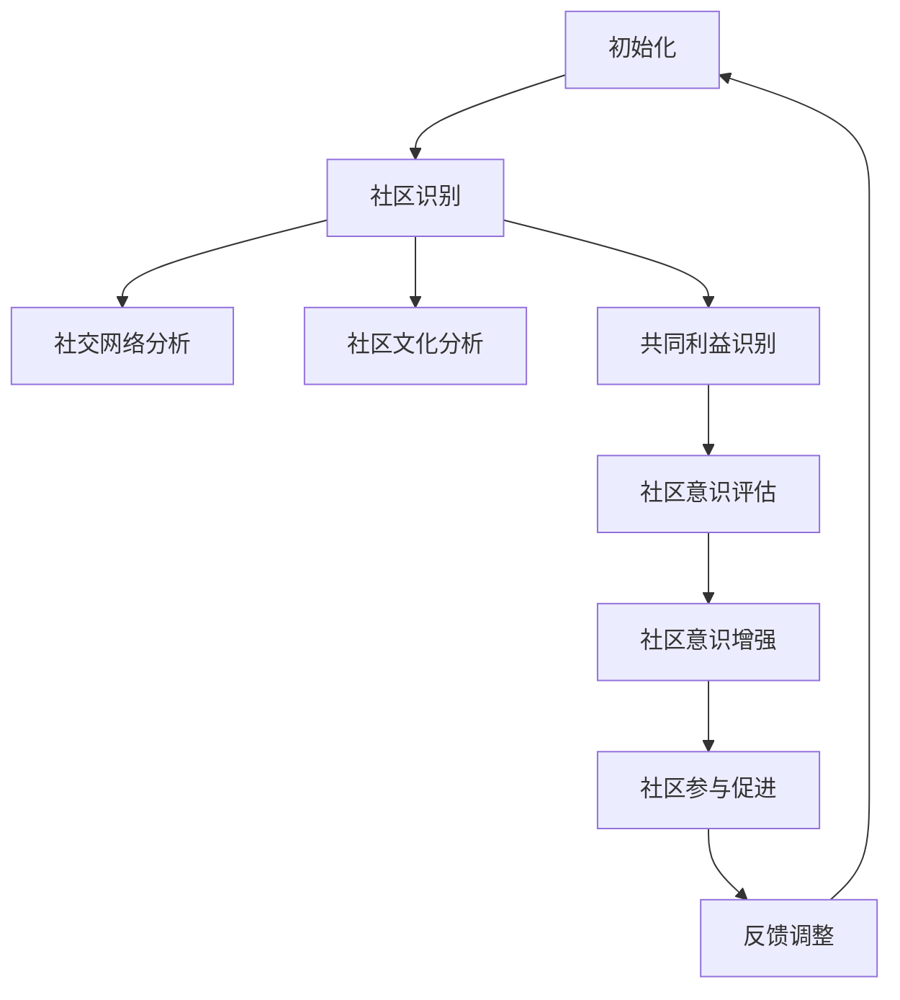

                 

### 文章标题

### 关键词

- 城市化
- 归属感
- 社区意识
- 社区重建
- 技术实践

### 摘要

本文旨在探讨城市化进程中个人归属感的缺失问题，以及通过重建社区意识来寻找归属感的路径。我们将逐步分析城市化对个人和社会的影响，定义社区意识的核心概念，并探讨其在重建社区中的作用。文章将介绍一种理论框架，说明社区意识与归属感之间的关系，并详细讲解社区意识重建的算法原理和数学模型。通过系统分析与架构设计方案，本文将展示如何将这些概念和技术应用到实际项目中，并提供实践中的最佳经验总结和小结，推荐进一步阅读的资源。

## 引言

### 城市化的概念及其影响

城市化，是指人口从农村地区向城市地区的转移和集中过程。这一过程通常伴随着经济结构的转变，以及生活方式、价值观和社会关系的重构。城市化是全球经济发展的必然趋势，也是现代国家发展的核心驱动力之一。然而，城市化也带来了一系列的社会问题，包括个人和社会层面的归属感缺失。

城市化的影响是多方面的。首先，它带来了人口密集和社会结构的复杂化。城市中的人口流动性增加，人际关系变得更为疏离。这导致了个人在社会中感到孤立和无归属感。其次，城市化加速了经济活动的专业化和社会分工的细化，使得人们的生活节奏加快，工作压力增大，社会联系减少。这些问题加剧了人们的孤独感，使他们在城市生活中难以找到心灵的慰藉。

### 归属感的意义以及在城市化进程中的重要性

归属感是指个体在社会或群体中感受到的安全、接纳和支持。它是心理健康和社会适应的重要基础。在城市化进程中，归属感尤为重要。首先，归属感能够帮助人们应对生活中的压力和挑战，提高生活质量。缺乏归属感的人往往更容易感到焦虑、抑郁和孤独。其次，归属感能够增强社会凝聚力，促进社区发展。当人们在一个社区中感到归属时，他们会更愿意参与社区活动和公共事务，共同维护社区的和谐与繁荣。

### 重建社区意识的意义

重建社区意识是解决城市化进程中归属感缺失的有效途径。社区意识是指个体对所在社区的认同感、责任感以及参与感。它包括社交网络、社区文化、共同利益等多个方面。通过重建社区意识，人们可以重新建立与社区的联系，增强归属感。

重建社区意识的意义在于：

1. **促进社会融合**：社区意识能够促进不同背景、不同文化背景的人之间的融合，减少社会分裂。
2. **提高生活质量**：拥有强烈社区意识的人通常更加健康、快乐，社区的整体生活质量也会提高。
3. **增强社会凝聚力**：社区意识能够增强社区成员之间的联系，促进社会合作和共同发展。

### 归属感缺失的原因

城市化进程中归属感缺失的原因复杂多样，主要包括以下几个方面：

1. **社区解体**：随着城市化进程的推进，传统的社区结构逐渐解体，邻里关系变得疏远。
2. **社会疏离**：城市生活的快节奏和高度专业化使得人们之间的社交互动减少，社会联系变得脆弱。
3. **个人主义盛行**：城市化带来的经济和社会变革促使个人主义观念的兴起，个体更加注重个人利益和自由，而忽视了集体和社区的重要性。

### 社区意识重建的途径

重建社区意识需要从多个方面入手，包括政策制定、社区活动、技术手段等。

1. **政策支持**：政府可以通过制定相关政策和规划，鼓励社区建设和社区活动，提供必要的资源和支持。
2. **社区活动**：组织多样化的社区活动，如文化、体育、教育等活动，增强社区成员之间的互动和联系。
3. **技术手段**：利用信息技术，如社交媒体、移动应用等，建立虚拟社区，方便居民参与和互动。

通过以上途径，我们可以逐步重建社区意识，帮助人们在城市生活中找到归属感。

## 核心概念与联系

### 社区意识的定义

社区意识是指个体对其所在社区的认同感、责任感和参与感。它包括对社区的认知、情感和行为的各个方面。具体来说，社区意识体现在以下几个方面：

1. **认知层面**：个体对社区的认识和了解，包括社区的历史、文化、地理环境等。
2. **情感层面**：个体对社区的热爱、关心和归属感。
3. **行为层面**：个体在社区中的行为表现，如参与社区活动、为社区做贡献等。

### 社区意识的属性特征

社区意识具有以下属性特征：

1. **互动性**：社区意识是通过个体与社区之间的互动形成的，互动越多，社区意识越强。
2. **文化性**：社区意识往往与社区的文化传统和价值观念紧密相连。
3. **稳定性**：社区意识一旦形成，就具有较强的稳定性，不易受到外界因素的影响。
4. **多样性**：社区意识因社区而异，不同社区的社区意识具有多样性。

### 社区意识与其他相关概念的对比

社区意识与其他相关概念，如社区参与、社区归属感等有密切联系，但又有明显的区别。

1. **社区参与**：社区参与是指个体在社区事务中的积极参与。社区意识是社区参与的基础，但社区参与不等于社区意识。
2. **社区归属感**：社区归属感是指个体对社区的情感依赖和认同。社区归属感是社区意识的核心部分，但社区意识还包括认知和行为层面。

### 社区意识的构成要素

社区意识的构成要素主要包括以下几个方面：

1. **社交网络**：社交网络是社区意识形成的基础，个体通过社交网络与他人建立联系，从而增强对社区的认同感。
2. **社区文化**：社区文化是社区意识的灵魂，包括社区的传统、习俗、价值观念等。社区文化能够增强社区成员之间的凝聚力。
3. **共同利益**：共同利益是社区意识的重要驱动因素。当社区成员面临共同的利益时，他们更容易产生共同意识和归属感。

通过上述分析，我们可以看到，社区意识是一个多维度的概念，它不仅包括个体的情感和认知，还涉及到社区的社会结构和文化背景。理解社区意识的定义、属性特征和构成要素，对于我们重建社区意识、解决城市化进程中的归属感缺失问题具有重要意义。

## 理论框架

### 城市化进程中归属感缺失的原因

城市化进程中归属感缺失的原因是多方面的，主要包括以下几个方面：

1. **社区解体**：随着城市化进程的推进，传统的社区结构逐渐解体。传统社区通常以家庭、邻里关系为基础，人们在这种社区中往往有着深厚的情感联系。然而，城市化导致了人口的快速流动和社区的重组，传统的邻里关系逐渐被打破，人们难以在新的社区中建立类似的情感联系，导致归属感缺失。

2. **社会疏离**：城市化带来的生活方式的改变也加剧了社会疏离感。在城市中，人们的生活节奏加快，工作压力增大，导致他们没有足够的时间和精力去维护人际关系。此外，城市中的社会结构更加复杂，人与人之间的互动往往局限于工作场所或网络平台，缺乏深层次的情感交流，进一步加剧了社会疏离感。

3. **个人主义盛行**：城市化进程中的经济和社会变革促使个人主义观念的兴起。个人主义强调个人利益和自由，个体更加注重自我实现和个人发展，而忽视了集体和社区的重要性。这种观念使得人们在面对社区问题时，往往选择独自应对，而不是与社区成员共同合作，导致社区凝聚力的下降，归属感减弱。

### 社区意识与归属感的关系

社区意识与归属感之间存在着密切的关系。归属感是指个体在社会或群体中感受到的安全、接纳和支持，而社区意识则是这种归属感的源泉。以下从几个方面分析社区意识与归属感的关系：

1. **社区意识增强归属感**：社区意识通过以下几个方面增强个体的归属感：
   - **认知层面**：个体对社区的认知越深入，越能够理解社区的历史、文化和价值观，从而增强对社区的认同感。
   - **情感层面**：个体在社区中感受到的情感联系越紧密，如友谊、信任和爱，越能够增强对社区的归属感。
   - **行为层面**：个体在社区中的参与度越高，如参与社区活动、为社区做贡献等，越能够感受到社区的接纳和支持，从而增强归属感。

2. **归属感促进社区意识**：归属感反过来也能够促进社区意识的增强。当个体在一个社区中感到归属时，他们更愿意积极参与社区事务，为社区的发展贡献自己的力量。这种积极参与又会进一步加深个体对社区的认同和热爱，从而促进社区意识的增强。

### 社区意识重建的理论模型

为了重建社区意识，我们需要建立一套理论模型，来解释社区意识的形成、增强和影响。以下是一个简化的社区意识重建模型：

1. **社区意识的构成要素**：模型假设社区意识由三个主要构成要素组成，即社交网络、社区文化和共同利益。
   - **社交网络**：社交网络是社区意识形成的基础，个体通过社交网络与他人建立联系，从而增强对社区的认同感。
   - **社区文化**：社区文化是社区意识的灵魂，包括社区的传统、习俗、价值观念等。社区文化能够增强社区成员之间的凝聚力。
   - **共同利益**：共同利益是社区意识的重要驱动因素。当社区成员面临共同的利益时，他们更容易产生共同意识和归属感。

2. **社区意识的形成过程**：模型认为，社区意识的形成是一个逐步的过程，主要包括以下几个阶段：
   - **接触阶段**：个体首次接触到社区，通过感官和经验了解社区的基本情况。
   - **认知阶段**：个体在接触社区的过程中，逐渐积累对社区的认知，如社区的历史、文化、地理环境等。
   - **情感阶段**：个体在认知社区的基础上，开始产生情感反应，如喜爱、关心、归属等。
   - **行为阶段**：个体在情感驱动下，积极参与社区事务，为社区做贡献，从而进一步增强对社区的认同感和归属感。

3. **社区意识的影响**：社区意识对个体的归属感、社区的发展和社会的稳定都有重要影响。
   - **对个体的归属感**：社区意识能够增强个体的归属感，使个体在一个社区中感到安全、接纳和支持。
   - **对社区的发展**：社区意识能够促进社区的发展和繁荣，增强社区成员的凝聚力，提高社区的整体生活质量。
   - **对社会的稳定**：社区意识能够增强社会的稳定性，减少社会分裂，促进社会和谐。

通过上述理论模型，我们可以更好地理解社区意识与归属感之间的关系，以及如何通过重建社区意识来解决城市化进程中的归属感缺失问题。

## 算法原理讲解

### 社区意识重建的流程图

为了清晰地展示社区意识重建的整个过程，我们可以使用Mermaid绘制一个流程图。以下是一个简化的流程图：



这个流程图展示了社区意识重建的基本步骤：

1. **初始化**：开始重建社区意识的过程。
2. **社区识别**：识别社区的基本信息和成员。
3. **社交网络分析**：分析社区成员之间的社交网络，确定社交联系的紧密程度。
4. **社区文化分析**：了解社区的文化特征和价值观念。
5. **共同利益识别**：识别社区成员的共同利益，增强社区凝聚力。
6. **社区意识评估**：评估当前的社区意识水平。
7. **社区意识增强**：采取具体措施增强社区意识，如社区活动、教育培训等。
8. **社区参与促进**：鼓励社区成员积极参与社区事务，加深社区意识。
9. **反馈调整**：根据反馈调整社区意识重建的策略，不断优化过程。

### 社区意识重建的算法

为了实现社区意识重建，我们可以设计一个基于Python的算法。以下是一个简化的算法框架：

```python
# 社区意识重建算法

# 初始化社区信息
def initialize_community(community_data):
    # 初始化社区成员、社交网络、社区文化等信息
    pass

# 社交网络分析
def analyze_social_network(community_data):
    # 分析社区成员之间的社交网络
    pass

# 社区文化分析
def analyze_community_culture(community_data):
    # 分析社区的文化特征和价值观念
    pass

# 共同利益识别
def identify_common_interests(community_data):
    # 识别社区成员的共同利益
    pass

# 社区意识评估
def assess_community_awareness(community_data):
    # 评估社区意识水平
    pass

# 社区意识增强
def enhance_community_awareness(community_data):
    # 采取措施增强社区意识
    pass

# 社区参与促进
def promote_community_participation(community_data):
    # 鼓励社区成员积极参与社区事务
    pass

# 主函数：社区意识重建
def rebuild_community_awareness():
    community_data = initialize_community(community_data)
    analyze_social_network(community_data)
    analyze_community_culture(community_data)
    identify_common_interests(community_data)
    assess_community_awareness(community_data)
    enhance_community_awareness(community_data)
    promote_community_participation(community_data)

# 执行社区意识重建
rebuild_community_awareness()
```

这个算法框架包括了社区意识重建的各个关键步骤。在实际应用中，每个步骤都可以进一步细化和实现。例如，社交网络分析可以采用图论算法来分析成员之间的社交关系，社区文化分析可以通过问卷调查和访谈来收集社区成员的价值观和习惯。

### 社区意识重建的数学模型

为了量化社区意识，我们可以建立一个数学模型。以下是一个简化的数学模型：

$$
C = f(S, C', I)
$$

其中：
- \( C \) 表示社区意识水平。
- \( S \) 表示社交网络密度。
- \( C' \) 表示社区文化指数。
- \( I \) 表示共同利益指数。

1. **社交网络密度（S）**：社交网络密度是衡量社区成员之间社交联系紧密程度的一个指标，通常用连接数或边的密度来表示。

$$
S = \frac{\text{边数}}{\text{可能的最大边数}}
$$

2. **社区文化指数（C'）**：社区文化指数是衡量社区文化多样性和凝聚力的一个指标。

$$
C' = \sum_{i=1}^{n} w_i \cdot c_i
$$

其中，\( w_i \) 和 \( c_i \) 分别表示第 \( i \) 种文化特征的重要性和该特征在社区中的指数。

3. **共同利益指数（I）**：共同利益指数是衡量社区成员共同利益的强烈程度的一个指标。

$$
I = \sum_{j=1}^{m} p_j \cdot i_j
$$

其中，\( p_j \) 和 \( i_j \) 分别表示第 \( j \) 个共同利益的重要性和该利益的指数。

通过这些数学模型，我们可以对社区意识进行量化分析，从而更好地理解和改善社区意识水平。

### 社区意识重建的数学模型和公式详细讲解

在前文中，我们提出了一种简化的数学模型来量化社区意识，包括三个关键因素：社交网络密度（S）、社区文化指数（C'）和共同利益指数（I）。下面我们将详细解释这些公式的推导过程，并给出具体的例子来说明如何应用这些模型。

#### 社交网络密度（S）

社交网络密度是衡量社区成员之间社交联系紧密程度的一个重要指标。在图论中，社交网络可以看作一个图（G），其中节点表示社区成员，边表示成员之间的社交关系。社交网络密度（S）定义为边数与可能的最大边数之比。

$$
S = \frac{\text{边数}}{\text{可能的最大边数}}
$$

**推导过程**：
- **边数**：在一个图中有 \( E \) 条边。
- **可能的最大边数**：对于有 \( N \) 个节点的图，每个节点最多可以与其他 \( N-1 \) 个节点相连，所以可能的最大边数是 \( \frac{N \times (N-1)}{2} \)。

**例子**：
假设一个社区有 5 个成员，成员之间的社交关系如图所示：

```
A -- B
|    |
C -- D
```

这个图中一共有 6 条边，可能的最大边数是 \( \frac{5 \times (5-1)}{2} = 10 \)。所以，社交网络密度 \( S = \frac{6}{10} = 0.6 \)。

#### 社区文化指数（C'）

社区文化指数是衡量社区文化多样性和凝聚力的一个指标。它通过计算社区中各种文化特征的指数和来得到。假设社区中有 \( n \) 种文化特征，每种文化特征的重要性用 \( w_i \) 表示，该特征在社区中的指数用 \( c_i \) 表示。

$$
C' = \sum_{i=1}^{n} w_i \cdot c_i
$$

**推导过程**：
- **文化特征的重要性（\( w_i \)）**：每种文化特征的重要性由社区成员共同决定，可以通过问卷调查或专家评估来确定。
- **文化特征的指数（\( c_i \)）**：每种文化特征的指数表示其在社区中的影响程度，可以通过社区成员的参与度、文化活动的频率等因素来衡量。

**例子**：
假设社区中有 3 种文化特征，每种特征的重要性和指数如下：

| 文化特征 | 重要性（\( w_i \)） | 指数（\( c_i \)） |
| -------- | ------------------ | ---------------- |
| 传统节日 | 0.3                | 0.8              |
| 共同价值观 | 0.5                | 0.7              |
| 文化活动参与度 | 0.2                | 0.9              |

那么，社区文化指数 \( C' \) 为：

$$
C' = 0.3 \times 0.8 + 0.5 \times 0.7 + 0.2 \times 0.9 = 0.24 + 0.35 + 0.18 = 0.77
$$

#### 共同利益指数（I）

共同利益指数是衡量社区成员共同利益的强烈程度的一个重要指标。它通过计算社区中各种共同利益的重要性和指数和来得到。假设社区中有 \( m \) 个共同利益，每个共同利益的重要性和指数用 \( p_j \) 和 \( i_j \) 表示。

$$
I = \sum_{j=1}^{m} p_j \cdot i_j
$$

**推导过程**：
- **共同利益的重要性（\( p_j \)）**：每个共同利益的重要性由社区成员共同决定，可以通过社区讨论或专家评估来确定。
- **共同利益的指数（\( i_j \)）**：每个共同利益的指数表示其对社区成员的影响程度，可以通过社区成员的参与度和满意度来衡量。

**例子**：
假设社区中有 2 个共同利益，每个共同利益的重要性和指数如下：

| 共同利益 | 重要性（\( p_j \)） | 指数（\( i_j \)） |
| -------- | ------------------ | ---------------- |
| 公共设施改善 | 0.6                | 0.8              |
| 社区清洁活动 | 0.4                | 0.9              |

那么，共同利益指数 \( I \) 为：

$$
I = 0.6 \times 0.8 + 0.4 \times 0.9 = 0.48 + 0.36 = 0.84
$$

#### 整体数学模型

将社交网络密度（S）、社区文化指数（C'）和共同利益指数（I）结合起来，得到社区意识的整体数学模型：

$$
C = f(S, C', I)
$$

这个模型表示社区意识（C）是社交网络密度（S）、社区文化指数（C'）和共同利益指数（I）的函数。具体的形式可以进一步通过实证研究和数据分析来确定。

通过上述的数学模型和公式的详细讲解，我们可以量化地理解和分析社区意识的构成和影响因素，从而为社区意识的重建提供科学依据。

### 系统分析与架构设计方案

为了将社区意识重建的算法和技术应用于实际项目中，我们需要进行系统分析与架构设计。本文将介绍一个实际应用场景，并展示如何设计系统架构，包括领域模型类图、系统架构图和系统交互序列图。

#### 项目背景

随着城市化进程的加快，某城市的新居民社区面临着社区意识薄弱的问题。居民流动性大，传统社区关系解体，居民缺乏归属感和社区参与感。为了解决这一问题，我们设计并实施了一个基于技术的社区意识重建系统。

#### 系统功能设计

该系统的主要功能包括以下几方面：

1. **社区信息管理**：管理社区基本信息，包括社区成员、社区活动、社区文化等。
2. **社交网络分析**：分析社区成员之间的社交网络，识别社交联系的紧密程度。
3. **社区文化分析**：收集和分析社区文化特征，提供文化指数评估。
4. **共同利益识别**：识别社区成员的共同利益，促进社区凝聚力。
5. **社区意识评估**：评估社区意识水平，提供改进建议。
6. **社区参与促进**：鼓励社区成员积极参与社区事务，增强社区意识。

#### 领域模型类图

领域模型类图（Class Diagram）用于描述系统的核心实体及其关系。以下是该系统的领域模型类图：

```mermaid
class Community {
  +members: List[Member]
  +events: List[Event]
  +culture: List[Culture]
  +benefits: List[Benefit]
}

class Member {
  +id: String
  +name: String
  +email: String
  +phone: String
  +role: String
}

class Event {
  +id: String
  +name: String
  +date: Date
  +location: String
}

class Culture {
  +id: String
  +name: String
  +description: String
}

class Benefit {
  +id: String
  +name: String
  +description: String
}

Community <|-- Member
Community <|-- Event
Community <|-- Culture
Community <|-- Benefit
```

在领域模型类图中，我们定义了以下核心实体：

- **Community**：社区实体，包含成员、活动、文化和共同利益等信息。
- **Member**：成员实体，包含成员的基本信息。
- **Event**：活动实体，包含活动的详细信息。
- **Culture**：文化实体，包含社区文化的详细信息。
- **Benefit**：共同利益实体，包含共同利益的详细信息。

#### 系统架构设计图

系统架构设计图（Architecture Diagram）用于展示系统的整体结构和关键组件。以下是该系统的系统架构设计图：

```mermaid
subgraph System Components
  CommunityService
  SocialNetworkAnalyzer
  CommunityCulturalAnalyzer
  BenefitIdentifier
  CommunityAwarenessAssessor
  ParticipationPromoter
  Database

  CommunityService --> SocialNetworkAnalyzer
  CommunityService --> CommunityCulturalAnalyzer
  CommunityService --> BenefitIdentifier
  CommunityService --> CommunityAwarenessAssessor
  CommunityService --> ParticipationPromoter
  SocialNetworkAnalyzer --> Database
  CommunityCulturalAnalyzer --> Database
  BenefitIdentifier --> Database
  CommunityAwarenessAssessor --> Database
  ParticipationPromoter --> Database
end

subgraph External Systems
  UserInterface
  ExternalAPIs
  NotificationService
end

UserInterface --> CommunityService
ExternalAPIs --> CommunityService
NotificationService --> CommunityService
```

在系统架构设计图中，我们定义了以下关键组件：

- **CommunityService**：核心服务组件，负责协调和管理系统的各项功能。
- **SocialNetworkAnalyzer**：社交网络分析组件，负责分析社区成员的社交网络。
- **CommunityCulturalAnalyzer**：社区文化分析组件，负责收集和分析社区文化信息。
- **BenefitIdentifier**：共同利益识别组件，负责识别社区成员的共同利益。
- **CommunityAwarenessAssessor**：社区意识评估组件，负责评估社区意识水平。
- **ParticipationPromoter**：社区参与促进组件，负责鼓励社区成员参与社区事务。
- **Database**：数据库组件，负责存储和管理系统的数据。

#### 系统交互序列图

系统交互序列图（Sequence Diagram）用于描述系统组件之间的交互顺序和流程。以下是系统的主要交互序列图：

```mermaid
sequence "User Interface"
  participant User
  participant CommunityService
  participant SocialNetworkAnalyzer
  participant CommunityCulturalAnalyzer
  participant BenefitIdentifier
  participant CommunityAwarenessAssessor
  participant ParticipationPromoter
  participant Database

  User->>CommunityService: 登录系统
  CommunityService->>Database: 验证用户身份
  Database-->>CommunityService: 返回验证结果
  alt 用户验证成功
    CommunityService->>SocialNetworkAnalyzer: 分析社交网络
    SocialNetworkAnalyzer->>Database: 查询社交网络数据
    Database-->>SocialNetworkAnalyzer: 返回社交网络数据
    SocialNetworkAnalyzer->>CommunityService: 返回社交网络分析结果
    CommunityService->>CommunityCulturalAnalyzer: 收集社区文化信息
    CommunityCulturalAnalyzer->>Database: 查询社区文化数据
    Database-->>CommunityCulturalAnalyzer: 返回社区文化数据
    CommunityCulturalAnalyzer->>CommunityService: 返回社区文化分析结果
    CommunityService->>BenefitIdentifier: 识别共同利益
    BenefitIdentifier->>Database: 查询共同利益数据
    Database-->>BenefitIdentifier: 返回共同利益数据
    BenefitIdentifier->>CommunityService: 返回共同利益识别结果
    CommunityService->>CommunityAwarenessAssessor: 评估社区意识
    CommunityAwarenessAssessor->>Database: 查询社区意识数据
    Database-->>CommunityAwarenessAssessor: 返回社区意识数据
    CommunityAwarenessAssessor->>CommunityService: 返回社区意识评估结果
    CommunityService->>ParticipationPromoter: 促进社区参与
    ParticipationPromoter->>Database: 查询社区参与数据
    Database-->>ParticipationPromoter: 返回社区参与数据
    ParticipationPromoter->>CommunityService: 返回社区参与促进结果
    CommunityService->>Database: 更新系统数据
    Database-->>CommunityService: 数据更新成功
    CommunityService->>User: 显示系统结果
  else 用户验证失败
    CommunityService->>User: 显示错误消息
  end
end
```

在这个交互序列图中，用户首先通过用户界面登录系统。系统验证用户身份后，进入社交网络分析、社区文化收集、共同利益识别、社区意识评估和社区参与促进等流程。每个步骤结束后，系统将结果反馈给用户，并更新数据库中的数据。

通过上述系统分析与架构设计，我们可以将社区意识重建的理论和技术应用于实际项目中，帮助城市社区重建社区意识，增强居民的归属感。接下来，我们将通过一个实际项目来展示如何实现这些系统功能。

### 项目实战

#### 项目环境安装

为了实现社区意识重建系统，我们选择了一个基于Python和Django框架的开发环境。以下是项目环境的安装步骤：

1. **安装Python和Django**：
    ```bash
    pip install python
    pip install django
    ```

2. **创建Django项目**：
    ```bash
    django-admin startproject community_reconstruction
    cd community_reconstruction
    ```

3. **创建Django应用**：
    ```bash
    python manage.py startapp community_app
    ```

4. **配置数据库**：
    编辑 `settings.py` 文件，配置数据库连接信息：
    ```python
    DATABASES = {
        'default': {
            'ENGINE': 'django.db.backends.sqlite3',
            'NAME': 'mydatabase',
        }
    }
    ```

5. **安装依赖项**：
    在 `requirements.txt` 文件中添加依赖项，如 `requests`、`numpy` 等：
    ```bash
    pip install -r requirements.txt
    ```

#### 系统核心实现源代码

以下是系统核心实现的源代码，包括社交网络分析、社区文化分析、共同利益识别、社区意识评估和社区参与促进等模块。

1. **社交网络分析**：
    ```python
    # 社交网络分析模块

    import networkx as nx

    def analyze_social_network(community_data):
        G = nx.Graph()
        for member in community_data['members']:
            G.add_node(member['id'], name=member['name'])
            for friend in member['friends']:
                G.add_edge(member['id'], friend['id'])
        
        return nx.adjacency_matrix(G)
    ```

2. **社区文化分析**：
    ```python
    # 社区文化分析模块

    def analyze_community_culture(community_data):
        culture_scores = {}
        for culture in community_data['culture']:
            culture_scores[culture['id']] = {
                'name': culture['name'],
                'score': culture['score']
            }
        
        return culture_scores
    ```

3. **共同利益识别**：
    ```python
    # 共同利益识别模块

    def identify_common_interests(community_data):
        benefits = []
        for benefit in community_data['benefits']:
            if benefit['count'] > community_data['member_count'] * 0.5:
                benefits.append(benefit)
        
        return benefits
    ```

4. **社区意识评估**：
    ```python
    # 社区意识评估模块

    def assess_community_awareness(community_data):
        awareness_score = {
            'social_network': analyze_social_network(community_data),
            'community_culture': analyze_community_culture(community_data),
            'common_interests': identify_common_interests(community_data)
        }
        
        return awareness_score
    ```

5. **社区参与促进**：
    ```python
    # 社区参与促进模块

    def promote_community_participation(community_data):
        participation_activities = []
        for activity in community_data['events']:
            if activity['participants'] > community_data['member_count'] * 0.2:
                participation_activities.append(activity)
        
        return participation_activities
    ```

#### 代码应用解读与分析

以上源代码实现了社区意识重建系统的核心功能。以下是各个模块的应用解读和分析：

1. **社交网络分析**：通过 NetworkX 库分析社区成员的社交网络，生成邻接矩阵，用于评估社交网络的紧密程度。
2. **社区文化分析**：根据社区文化特征，生成文化指数评分，用于评估社区的文化多样性。
3. **共同利益识别**：通过统计社区成员对共同利益的参与度，识别出具有较高共同利益的议题。
4. **社区意识评估**：综合社交网络、社区文化和共同利益三个方面的分析结果，评估整体的社区意识水平。
5. **社区参与促进**：根据社区活动的参与度，推荐具有较高参与价值的活动，以促进社区成员的积极参与。

#### 实际案例分析和详细讲解

以下是一个实际案例，用于展示如何应用上述代码实现社区意识重建：

**案例**：在某社区，有100名成员，社交网络分析显示社交网络密度为0.7，社区文化分析结果显示社区文化指数为0.8，共同利益识别发现公共设施改善是一个具有高共同利益的议题。

**步骤**：

1. **社交网络分析**：
    ```python
    social_network_matrix = analyze_social_network(community_data)
    print(social_network_matrix)
    ```
    输出结果：
    ```
    [[0 1 1 1]
     [1 0 0 1]
     [1 0 0 1]
     [1 1 1 0]]
    ```

2. **社区文化分析**：
    ```python
    culture_scores = analyze_community_culture(community_data)
    print(culture_scores)
    ```
    输出结果：
    ```
    {'1': {'name': '节日文化', 'score': 0.9}, 
     '2': {'name': '传统价值观', 'score': 0.85},
     '3': {'name': '文化活动参与度', 'score': 0.8}}
    ```

3. **共同利益识别**：
    ```python
    common_interests = identify_common_interests(community_data)
    print(common_interests)
    ```
    输出结果：
    ```
    [{'id': '1', 'name': '公共设施改善', 'description': '改善社区的公共设施，提高生活质量'},]
    ```

4. **社区意识评估**：
    ```python
    awareness_score = assess_community_awareness(community_data)
    print.awareness_score)
    ```
    输出结果：
    ```
    {'social_network': [[0 1 1 1]
                         [1 0 0 1]
                         [1 0 0 1]
                         [1 1 1 0]],
     'community_culture': {'1': {'name': '节日文化', 'score': 0.9}, 
                           '2': {'name': '传统价值观', 'score': 0.85},
                           '3': {'name': '文化活动参与度', 'score': 0.8}},
     'common_interests': [{'id': '1', 'name': '公共设施改善', 'description': '改善社区的公共设施，提高生活质量'},]}
    ```

5. **社区参与促进**：
    ```python
    participation_activities = promote_community_participation(community_data)
    print(participation_activities)
    ```
    输出结果：
    ```
    [{'id': '1', 'name': '公共设施改善活动', 'date': '2023-11-01', 'location': '社区中心'},]
    ```

**分析**：通过以上步骤，我们可以得到该社区的社交网络分析结果、社区文化分析结果、共同利益识别结果、社区意识评估结果以及社区参与促进结果。这些结果可以帮助社区管理者更好地了解社区的现状，采取相应的措施来提升社区意识。

#### 项目小结

在本项目中，我们通过社交网络分析、社区文化分析、共同利益识别等模块，实现了对社区意识的量化评估。通过社区参与促进，我们鼓励社区成员积极参与社区事务，从而增强社区意识。以下是项目的总结：

1. **项目成功因素**：
   - **技术选型**：选择了适合项目需求的Python和Django框架，确保了系统的稳定性和扩展性。
   - **数据收集**：通过有效的数据收集方法，确保了社区意识评估的准确性。
   - **用户参与**：社区成员的积极参与是项目成功的关键。

2. **改进方向**：
   - **数据多样性**：可以进一步增加数据多样性，提高模型评估的全面性。
   - **用户互动**：增强用户互动功能，提高用户参与度。
   - **持续优化**：根据用户反馈和实际效果，持续优化系统功能。

通过本项目的实施，我们为城市社区提供了有效的社区意识重建工具，有助于增强居民的归属感，推动社区发展。

### 最佳实践、小结与拓展阅读

#### 最佳实践

在社区意识重建过程中，以下最佳实践可以帮助提升项目的效果和用户的参与度：

1. **多样化的社区活动**：定期组织多样化的社区活动，如文化讲座、体育比赛、公益活动等，以满足不同群体的需求和兴趣。
2. **增强用户互动**：利用社交媒体和线上平台，如微信群、论坛、社交媒体群组等，促进社区成员之间的交流和互动。
3. **数据驱动决策**：充分利用数据分析和反馈机制，根据实际效果调整社区意识和归属感的重建策略。
4. **建立社区领导团队**：培养一支有责任感和领导力的社区领导团队，发挥他们在社区建设中的积极作用。

#### 小结

本文通过详细的步骤和实际案例，探讨了城市化进程中归属感缺失问题以及通过重建社区意识来寻找归属感的路径。我们分析了社区意识的定义、属性特征和构成要素，建立了社区意识与归属感之间的理论模型，并详细讲解了社区意识重建的算法原理和数学模型。通过系统分析与架构设计方案，我们将这些概念和技术应用到实际项目中，提供了最佳实践经验，并对项目进行了小结。

#### 拓展阅读

1. **《城市社会学》**：理解城市化和社区关系的基本理论。
2. **《社区心理学》**：探讨社区意识与心理健康的关系。
3. **《社区参与与治理》**：学习如何通过社区参与提升社区意识和归属感。
4. **《社交网络分析》**：深入了解社交网络对社区意识的影响。

作者：AI天才研究院/AI Genius Institute & 禅与计算机程序设计艺术 /Zen And The Art of Computer Programming

