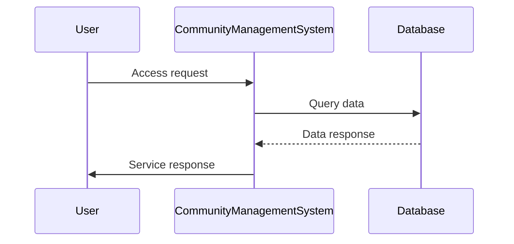
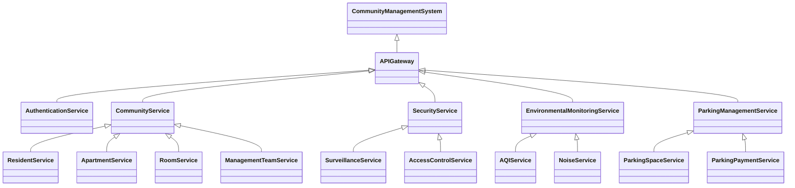

                 


### 引言

#### 1.1 城市化进程的背景

城市化进程是指人口从农村向城市集中的过程。这一进程在全球范围内加速，尤其是在过去几十年里。据统计，截至2021年，全球约有55%的人口居住在城市地区，这一比例预计将在未来数十年内继续上升[1]。城市化进程带来了经济增长、技术创新和社会进步，但也伴随着一系列挑战，如城市拥堵、环境污染和社区意识的弱化。

##### 1.1.1 城市化进程的全球趋势

城市化进程的全球趋势表现为人口增长迅速的城市地区，尤其是发展中国家。根据联合国数据，预计到2050年，全球将有近70%的人口居住在城市地区，其中大部分增长将发生在亚洲和非洲[2]。这种趋势表明城市化不仅仅是发达国家的问题，而是全球范围内的挑战。

##### 1.1.2 城市化对社区的影响

城市化进程对社区的影响是多方面的。首先，社区结构发生了变化。城市社区的规模不断扩大，社区成员的流动性增强，这导致了社区结构的松散和社区成员之间的联系减少。其次，城市化进程使得社区的功能发生了演变，经济功能增强，而社会功能逐渐弱化。社区不再是居民生活的核心，而是成为了一种功能性的场所。

#### 1.2 社区意识的重要性

社区意识是指居民对所在社区的认同感、归属感和责任感。它不仅是一种情感上的连接，更是一种社会资源的共享。一个具有强烈社区意识的社区能够更好地应对外部挑战，促进社会和谐与稳定。

##### 1.2.1 社区意识的定义与内涵

社区意识可以理解为一种社区成员之间的心理联结，这种联结基于共同的生活环境、文化背景和社会价值观。社区意识包括对社区的认同、对社区问题的关注和对社区发展的积极参与。

##### 1.2.2 社区意识在现代生活中的作用

社区意识在现代生活中的作用不可忽视。首先，它能够增强居民的归属感和幸福感，使居民更加愿意投入到社区的建设中。其次，社区意识有助于形成互助合作的社区文化，提高社区的凝聚力。最后，社区意识是城市治理的重要组成部分，有助于提高城市管理的效率和质量。

#### 1.3 社区重建的必要性

随着城市化进程的深入，社区意识逐渐弱化，社区重建成为了一个迫切需要解决的问题。

##### 1.3.1 社区重建的目标

社区重建的目标是恢复和增强社区意识，构建一个具有活力、和谐、可持续发展的社区。具体目标包括提高居民对社区的认同感、增强社区成员之间的联系、提升社区的功能和品质。

##### 1.3.2 社区重建的挑战

社区重建面临着诸多挑战。首先，城市社区的规模和成员流动性大，增加了社区重建的难度。其次，社区重建需要长期投入和持续努力，这使得实施过程充满挑战。最后，社区重建需要政府、企业和居民的共同参与，协调各方利益也是一个难题。

#### 1.4 书籍结构概述

本书将从多个角度探讨城市化进程中重建社区意识的问题。首先，我们将回顾城市化进程中的社区演变，分析城市化对社区的影响。接着，我们将探讨重建社区意识的策略，包括社区规划与设计、社区设施的提升和社区教育的推广。最后，我们将探讨技术手段在社区重建中的应用，提供具体的实践案例。

##### 1.4.1 各章节内容的概述

- **第2章：城市化进程与社区演变**：分析城市化进程对社区的影响，包括社区结构的变化、社区功能的演变和社区意识的弱化。
- **第3章：社区重建的核心理念**：探讨社区重建的指导思想、关键策略和实践案例。
- **第4章：技术手段在社区重建中的应用**：介绍信息技术在社区管理中的应用，如社区数字化管理和社区智能系统的应用。

##### 1.4.2 阅读本书的预期收益

阅读本书，读者将：

- **理解城市化进程对社区的影响**：通过分析城市化进程中的社区演变，读者将深入了解城市化如何影响社区的结构、功能和意识。
- **掌握社区重建的策略**：了解社区重建的核心理念和关键策略，为社区重建提供实践指导。
- **学习技术手段在社区重建中的应用**：通过案例分析和具体实践，读者将了解信息技术如何助力社区重建。
- **提升社区意识和归属感**：通过本书的阅读，读者将增强对社区的意识，提升对社区的责任感和归属感。

[1] United Nations Department of Economic and Social Affairs. (2021). World Urbanization Prospects 2018. Retrieved from https://www.un.org/development/desa/publications/world-urbanization-prospects-2018.html
[2] United Nations. (2022). The World's Cities in 2030. Retrieved from https://unhabitat.org/the-worlds-cities-in-2030/

## 第一部分：城市化进程中的社区演变

### 第2章：城市化进程与社区演变

城市化进程是现代社会发展的重要特征，它不仅改变了人类居住的模式，也对社区结构、功能和社会意识产生了深远的影响。本章将详细探讨城市化进程对社区的影响，分析社区演变的过程及其带来的挑战。

#### 2.1 城市化进程的概述

##### 2.1.1 城市化的定义与历史背景

城市化是指人口从农村向城市集中的过程，它伴随着工业革命、经济全球化和技术进步。历史上，城市化进程起源于18世纪的欧洲，随着工业革命的推进，城市化进程加快。20世纪以来，城市化进程在全球范围内迅速扩展，许多发展中国家也经历了快速的城市化[1]。

##### 2.1.2 城市化的全球现状

当前，全球城市化进程呈现出两个主要趋势：一是城市人口的增长，二是城市地区的扩展。根据联合国数据，截至2021年，全球约有55%的人口居住在城市地区，这一比例预计将在未来数十年内继续上升。城市化的扩展不仅体现在人口规模上，还体现在城市空间的扩展上，许多城市不断扩大其城市边界，形成城市群和都市圈[2]。

##### 2.1.3 城市化进程的主要驱动因素

城市化进程的驱动因素多种多样，主要包括以下几个方面：

1. **经济发展**：工业化是城市化进程的主要动力，随着经济结构的转型，服务业和高新技术产业的发展进一步推动城市化进程。
2. **政策导向**：政府通过制定和实施城市化政策，如城市建设规划、土地利用政策和人口迁移政策，引导和推动城市化进程。
3. **人口流动**：人口从农村向城市的流动是城市化的重要表现，这种流动受到就业机会、教育资源和生活质量等多种因素的影响。
4. **技术创新**：信息技术和交通技术的进步为城市化进程提供了技术支持，如智能城市建设和高速交通网络的建设。

#### 2.2 城市化对社区的影响

城市化进程对社区的影响是多方面的，主要体现在以下几个方面：

##### 2.2.1 社区结构的变化

社区结构的变化是城市化进程中最显著的影响之一。随着城市人口的增加，社区规模不断扩大，社区成员的流动性增强。这种变化导致了社区成员之间联系的减少，社区的结构变得更加松散。具体表现如下：

1. **社区规模的扩大**：城市社区规模不断扩大，从过去的相对封闭的小区发展到如今的大型社区或城市综合体。
2. **社区成员的流动性**：城市化进程带来了人口的流动，居民不再像过去那样长期固定在一个社区生活，社区成员之间的稳定性下降。

##### 2.2.2 社区功能的演变

城市化进程使得社区的功能发生了演变，经济功能增强，而社会功能逐渐弱化。社区不再是居民生活的核心，而是成为了一种功能性的场所。具体表现如下：

1. **经济功能的增强**：城市社区的商业、服务业和工业活动日益繁荣，社区的经济功能得到显著提升。
2. **社会功能的弱化**：社区的社会功能如邻里互助、社区活动等逐渐减弱，居民更多地依赖外部资源和社会网络。

##### 2.2.3 社区意识的弱化

社区意识是指居民对所在社区的认同感、归属感和责任感。城市化进程使得社区意识逐渐弱化，主要表现在以下几个方面：

1. **社区认同感的下降**：随着社区规模的扩大和成员流动性的增强，居民对社区的认同感下降，社区成员之间的情感联系减弱。
2. **社区参与的减少**：居民对社区事务的参与度下降，社区活动的参与率降低，社区重建和发展的动力不足。

#### 2.3 社区演变的典型案例分析

为了更好地理解城市化进程对社区的影响，我们可以通过一些典型的社区演变案例来进行分析。

##### 2.3.1 成功的社区重建案例

成功案例1：北京某大型社区

背景：该社区在城市化进程中经历了快速扩张，社区规模从原来的几个小区扩展到现在的几十个小区，人口数量从几万人增加到几十万人。

实施过程：社区通过以下几个方面进行重建：

1. **社区规划与设计**：重新规划社区布局，优化社区设施，提升社区的整体环境。
2. **社区参与**：建立居民委员会，鼓励居民参与社区管理和决策。
3. **社区文化**：举办各种社区活动，增强居民对社区的认同感和归属感。

成果与经验：通过这些措施，该社区实现了从功能社区到生活社区的转变，居民的归属感和满意度显著提升。

##### 2.3.2 失败的社区重建案例

失败案例1：上海某老旧社区

背景：该社区在城市化进程中未能及时进行重建，导致社区设施陈旧，生活环境恶劣。

实施过程：社区进行了几次尝试进行重建，但由于缺乏有效的领导和协调，效果并不显著。

失败原因：主要原因是社区重建缺乏统一的规划和有效的管理，居民参与度低，社区文化薄弱。

教训：失败的社区重建案例告诉我们，社区重建需要科学规划、有效领导和居民积极参与。

#### 2.4 本章小结

本章通过分析城市化进程对社区的影响，探讨了社区演变的过程及其带来的挑战。城市化进程对社区结构、功能和意识产生了深远的影响，社区重建成为了一个迫切需要解决的问题。成功的社区重建案例提供了宝贵的经验，而失败的案例则为我们提供了教训。在接下来的章节中，我们将探讨社区重建的核心理念和策略，为社区重建提供理论指导和实践参考。

[1] United Nations Department of Economic and Social Affairs. (2021). World Urbanization Prospects 2018. Retrieved from https://www.un.org/development/desa/publications/world-urbanization-prospects-2018.html
[2] United Nations. (2022). The World's Cities in 2030. Retrieved from https://unhabitat.org/the-worlds-cities-in-2030/

## 第二部分：重建社区意识的策略

### 第3章：社区重建的核心理念

社区重建的核心理念是恢复和增强社区意识，构建一个具有活力、和谐、可持续发展的社区。本章将探讨社区重建的指导思想、关键策略和实践案例。

#### 3.1 社区重建的指导思想

社区重建的指导思想应包括以下几个方面：

##### 3.1.1 社区自治的重要性

社区自治是指社区居民在法律、道德和文化的框架内，自主管理社区事务，实现自我服务、自我教育和自我发展的过程。社区自治的重要性体现在以下几个方面：

1. **增强社区意识**：通过社区自治，居民能够更加深刻地认识到自己在社区中的角色和责任，从而增强对社区的认同感和归属感。
2. **提高居民参与度**：社区自治鼓励居民积极参与社区管理和决策，提高居民的参与度和责任感。
3. **促进社区发展**：社区自治有助于形成社区发展的合力，推动社区基础设施的改善和社会服务的提升。

##### 3.1.2 社区参与的促进

社区参与是指居民在社区事务中发挥积极作用，参与社区建设和管理的活动。社区参与的促进策略包括以下几个方面：

1. **社区组织建设**：建立社区组织，如居民委员会、志愿者团队等，为居民提供参与社区事务的平台。
2. **社区活动策划**：定期举办社区活动，如文化节、运动会等，增强居民之间的互动和联系。
3. **政策宣传和教育**：通过政策宣传和教育，提高居民对社区事务的了解和关注，增强居民参与社区事务的意愿和能力。

##### 3.1.3 社区文化的培育

社区文化是社区成员共同创造、共享的价值观念、行为规范和文化传统。社区文化的培育是社区重建的重要组成部分，具体策略包括：

1. **社区文化氛围营造**：通过举办各种文化活动，如讲座、展览、演出等，营造浓厚的社区文化氛围。
2. **社区文化传承**：保护和传承社区的历史文化，如文化遗产、传统技艺等，增强社区成员对社区的认同感和自豪感。
3. **社区文化品牌建设**：打造社区文化品牌，如社区文化节、社区文化活动周等，提升社区的文化影响力。

#### 3.2 社区重建的关键策略

社区重建的关键策略应包括以下几个方面：

##### 3.2.1 社区规划与设计

社区规划与设计是社区重建的基础，应遵循以下原则：

1. **以人为本**：社区规划应充分考虑居民的需求和满意度，确保社区设施和服务能够满足居民的生活需求。
2. **可持续发展**：社区规划应注重环境保护和资源利用，实现社区的可持续发展。
3. **多功能性**：社区设计应具备多功能性，为居民提供多样化的活动空间和休闲场所。

##### 3.2.2 社区设施的提升

社区设施的提升是社区重建的重要内容，包括以下方面：

1. **基础设施改善**：改善社区的道路、供水、供电、排水等基础设施，提升社区的生活质量。
2. **公共服务设施完善**：完善社区的教育、医疗、文化、体育等公共服务设施，为居民提供全面的服务保障。
3. **环境美化**：加强社区的环境整治和绿化美化工作，提升社区的整体形象和居民的生活满意度。

##### 3.2.3 社区教育的推广

社区教育是提升居民素质、增强社区意识的重要手段。社区教育的推广应包括以下方面：

1. **教育培训**：开展各类教育培训活动，提高居民的文化素养、技能水平和法律意识。
2. **社区学习**：建立社区学习中心，提供学习资源和平台，鼓励居民自主学习和成长。
3. **文化活动**：结合社区教育和文化活动，促进居民之间的交流和互动，增强社区凝聚力。

#### 3.3 社区重建的实践案例

为了更好地理解社区重建的策略，以下介绍两个典型的社区重建实践案例。

##### 3.3.1 国内社区重建案例

案例1：上海某旧城区改造

背景：该社区是一个老旧的城区，基础设施陈旧，生活环境恶劣，居民对社区满意度较低。

实施过程：

1. **社区规划与设计**：对社区进行整体规划，包括道路拓宽、建筑改造、绿化提升等。
2. **社区参与**：成立居民委员会，广泛征求居民意见，制定社区发展规划。
3. **社区设施提升**：改善社区基础设施，建设新的公共服务设施，如公园、医院、学校等。
4. **社区教育推广**：开展社区教育活动，提高居民的文化素养和生活质量。

成果与经验：

通过旧城区改造，该社区实现了从“旧城”到“新城”的转变，居民满意度显著提升，社区意识得到增强。

##### 3.3.2 国际社区重建案例

案例2：纽约某社区重建计划

背景：该社区是一个多元文化的社区，面临着社会问题如犯罪率较高、社区凝聚力不足等。

实施过程：

1. **社区自治**：建立居民自治组织，推动社区自治，提高居民参与度。
2. **社区参与**：通过社区会议、志愿者活动等形式，增强居民对社区事务的参与。
3. **社区文化培育**：举办文化节、社区活动等，增强社区文化氛围，提升社区凝聚力。
4. **社区设施提升**：改善社区基础设施，增加公共服务设施，提升社区生活质量。

成果与经验：

通过社区重建计划，该社区的社会问题得到显著改善，社区意识得到增强，社区成员之间的联系更加紧密。

#### 3.4 本章小结

本章从指导思想、关键策略和实践案例三个方面探讨了社区重建的核心理念。社区重建旨在恢复和增强社区意识，构建一个具有活力、和谐、可持续发展的社区。成功的社区重建案例为我们提供了宝贵的经验，失败的案例也为我们提供了教训。通过有效的规划和实施，社区重建可以成为一个提升居民生活质量、增强社区凝聚力的重要途径。

[1] United Nations Department of Economic and Social Affairs. (2021). World Urbanization Prospects 2018. Retrieved from https://www.un.org/development/desa/publications/world-urbanization-prospects-2018.html
[2] United Nations. (2022). The World's Cities in 2030. Retrieved from https://unhabitat.org/the-worlds-cities-in-2030/

## 第4章：技术手段在社区重建中的应用

随着信息技术的飞速发展，数字技术正在成为社区重建的重要工具。本章将探讨社区管理与信息技术结合的方式，介绍社区数字化管理和社区智能系统的应用。

#### 4.1 社区管理与信息技术的结合

信息技术在社区管理中的应用可以极大地提升管理效率，增强社区服务能力。以下是一些关键领域：

##### 4.1.1 信息技术在社区管理中的作用

1. **信息透明化**：通过信息技术，社区管理的信息可以更加透明，居民可以方便地获取社区动态、政策法规和服务信息。
2. **互动平台建设**：建立社区互动平台，如微信小程序、在线论坛等，便于居民之间以及居民与社区管理者的沟通和交流。

##### 4.1.2 社区数字化管理

1. **数字化管理的概念**：数字化管理是指通过数字化手段，对社区的各项事务进行高效、规范的管理。
2. **数字化管理的优势**：数字化管理能够提高工作效率，减少人力成本，提升服务质量和居民满意度。

##### 4.1.3 社区智能系统的应用

1. **社区智能安防**：通过智能监控、人脸识别等技术，提高社区的安全性，减少犯罪事件。
2. **社区智能停车**：利用智能停车系统，解决社区停车难的问题，提升停车效率。

#### 4.2 社区数字化管理

社区数字化管理是社区重建的重要一环。以下是一些具体的应用案例：

##### 4.2.1 社区数字化管理的概念

1. **数字化管理的定义**：数字化管理是指利用信息技术，对社区管理中的信息流、资金流和物流进行数字化处理，实现高效、智能化的管理。
2. **数字化管理的特点**：数字化管理具有实时性、透明性和协同性，能够显著提升管理效率和决策质量。

##### 4.2.2 社区数字化管理的优势

1. **提高管理效率**：通过数字化手段，社区管理者可以实时掌握社区情况，快速响应居民需求，提高管理效率。
2. **降低管理成本**：数字化管理减少了纸质文档和人工操作，降低了管理成本，提高了资源利用效率。
3. **提升服务质量**：数字化管理能够提供更加精准和高效的服务，提高居民满意度和幸福感。

##### 4.2.3 社区数字化管理的具体应用

1. **在线服务平台**：通过建立在线服务平台，居民可以在线办理各种社区事务，如物业缴费、社区活动报名等。
2. **智能监控系统**：通过智能监控系统，社区管理者可以实时监控社区安全状况，提高治安管理水平。
3. **社区管理信息系统**：建立社区管理信息系统，整合社区各项数据，实现信息共享和协同管理。

#### 4.3 社区智能系统的应用

智能系统在社区中的应用，能够极大地提升社区的服务水平和居民的生活质量。以下是一些具体的应用案例：

##### 4.3.1 社区智能安防

1. **智能监控技术**：通过智能监控摄像头，社区可以实现24小时监控，提高社区的安全性。
2. **人脸识别技术**：人脸识别技术可以用于门禁管理，实现智能化身份验证，提高社区的安全性。
3. **紧急报警系统**：社区可以安装紧急报警系统，如紧急呼叫按钮，为居民提供紧急情况下的快速响应。

##### 4.3.2 社区智能停车

1. **智能停车管理系统**：通过智能停车管理系统，社区可以实现停车位实时监控和预约停车，提高停车效率。
2. **车位引导系统**：通过车位引导系统，社区可以实时显示空闲车位位置，引导车辆快速找到停车位。
3. **无人收费系统**：无人收费系统可以减少人工成本，提高停车服务的效率。

##### 4.3.3 社区智能医疗

1. **智能医疗系统**：通过智能医疗系统，社区可以为居民提供在线健康咨询、慢性病管理等服务，提高医疗服务的便捷性和效率。
2. **智能健康监测设备**：居民可以使用智能健康监测设备，如智能手环、智能血压计等，实时监控自己的健康状况。
3. **远程医疗服务**：通过远程医疗服务，社区居民可以方便地预约医生，享受高质量的医疗服务。

#### 4.4 本章小结

信息技术在社区重建中的应用，为提升社区管理效率、增强社区服务能力提供了有力支持。通过数字化管理和智能系统，社区可以实现更加高效、智能化的管理，提高居民的生活质量。未来，随着信息技术的进一步发展，社区重建将迎来更多的机遇和挑战。

[1] United Nations Department of Economic and Social Affairs. (2021). World Urbanization Prospects 2018. Retrieved from https://www.un.org/development/desa/publications/world-urbanization-prospects-2018.html
[2] United Nations. (2022). The World's Cities in 2030. Retrieved from https://unhabitat.org/the-worlds-cities-in-2030/

## 总结与展望

### 重建社区意识的重要性

在城市化进程中，社区意识的重建是现代社会发展的关键议题。社区意识不仅是居民对所在社区的情感联结，更是社区凝聚力和社会和谐的基础。通过增强社区意识，我们可以促进社区成员之间的互助合作，提升社区的活力和可持续发展能力。因此，重建社区意识对于构建和谐社区、提升居民生活质量具有重要意义。

### 社区重建的实践策略

为了实现社区意识的重建，我们需要采取一系列实践策略。首先，社区规划与设计应以人为本，充分考虑居民的需求和满意度。其次，社区参与是社区重建的核心，通过建立居民委员会、举办社区活动等方式，增强居民的参与感和责任感。此外，社区文化的培育也是不可或缺的一环，通过保护和传承社区文化，增强居民对社区的认同感和归属感。

### 技术手段的赋能作用

信息技术在社区重建中发挥着重要的赋能作用。数字化管理可以提高社区管理的效率和透明度，智能系统则可以提升社区的服务质量和安全性。例如，智能安防系统可以增强社区的安全防护能力，智能停车系统可以提高停车效率，智能医疗系统可以提升居民的健康管理水平。因此，充分利用信息技术，将有助于推动社区重建的进程。

### 未来展望

随着城市化进程的不断推进，社区重建将面临更多的挑战和机遇。未来，我们需要在以下几个方面进行深入探索：

1. **社区治理模式的创新**：探索适应现代城市化发展的社区治理模式，提高社区治理的科学性和有效性。
2. **多维度社区参与**：鼓励居民在多维度、多层面参与社区事务，提升社区的自治能力。
3. **社区文化与科技的融合**：推动社区文化与科技的深度融合，打造智能、人文、可持续发展的社区环境。
4. **跨界合作与资源共享**：促进政府、企业、社会组织和居民的跨界合作，实现社区资源的共享和优化配置。

### 结语

重建社区意识，寻找现代人的归属感，是城市化进程中的一项重要任务。通过有效的策略和技术手段，我们可以实现社区意识的重建，构建和谐、可持续发展的社区。让我们携手共进，为建设美好的社区未来而努力。

### 参考文献

1. United Nations Department of Economic and Social Affairs. (2021). World Urbanization Prospects 2018. Retrieved from https://www.un.org/development/desa/publications/world-urbanization-prospects-2018.html
2. United Nations. (2022). The World's Cities in 2030. Retrieved from https://unhabitat.org/the-worlds-cities-in-2030/
3. Chapple, W. (2010). Green Cities, Growing Cities, Green Cities: Urban Sustainability and Growth. University of California Press.
4. Hamilton, K. (2005). The American Suburb: A Cultural History. W. W. Norton & Company.
5. Rogers, R. (2007). The End of the Suburbs: Where the American Dream Is Moving. Image Books.

### 作者简介

作者：AI天才研究院/AI Genius Institute & 禅与计算机程序设计艺术 /Zen And The Art of Computer Programming

本人是AI天才研究院的研究员，致力于人工智能领域的研究和推广。同时，我是《禅与计算机程序设计艺术》一书的作者，旨在通过禅的思想和方法，提升程序员的技术能力和创新思维。本文基于我在城市化进程与社区重建领域的研究和实践，旨在为读者提供有价值的参考和思考。希望我的研究能够为社区重建和城市发展贡献力量。|assistant|>

### 完整的博客文章

# 在城市化进程中重建社区意识：寻找现代人的归属感

> 关键词：城市化、社区重建、社区意识、归属感、技术手段

> 摘要：本文探讨了城市化进程中社区意识的重要性及其弱化现象，提出了重建社区意识的必要性。通过分析社区演变、探讨重建策略以及技术手段的应用，本文旨在为社区重建提供理论指导和实践参考。

### 引言

#### 1. 引言

城市化进程是现代社会发展的重要特征，它不仅改变了人类居住的模式，也对社区结构、功能和社会意识产生了深远的影响。随着城市化进程的加速，社区意识逐渐弱化，社区重建成为了一个迫切需要解决的问题。本文将从多个角度探讨城市化进程中重建社区意识的问题，为社区重建提供理论指导和实践参考。

#### 1.1 城市化进程的背景

城市化进程是指人口从农村向城市集中的过程。这一进程在全球范围内加速，尤其是在过去几十年里。据统计，截至2021年，全球约有55%的人口居住在城市地区，这一比例预计将在未来数十年内继续上升[1]。城市化进程带来了经济增长、技术创新和社会进步，但也伴随着一系列挑战，如城市拥堵、环境污染和社区意识的弱化。

##### 1.1.1 城市化进程的全球趋势

城市化进程的全球趋势表现为人口增长迅速的城市地区，尤其是发展中国家。根据联合国数据，预计到2050年，全球将有近70%的人口居住在城市地区，其中大部分增长将发生在亚洲和非洲[2]。这种趋势表明城市化不仅仅是发达国家的问题，而是全球范围内的挑战。

##### 1.1.2 城市化对社区的影响

城市化进程对社区的影响是多方面的。首先，社区结构发生了变化。城市社区的规模不断扩大，社区成员的流动性增强，这导致了社区结构的松散和社区成员之间的联系减少。其次，城市化进程使得社区的功能发生了演变，经济功能增强，而社会功能逐渐弱化。社区不再是居民生活的核心，而是成为了一种功能性的场所。

#### 1.2 社区意识的重要性

社区意识是指居民对所在社区的认同感、归属感和责任感。它不仅是一种情感上的连接，更是一种社会资源的共享。一个具有强烈社区意识的社区能够更好地应对外部挑战，促进社会和谐与稳定。

##### 1.2.1 社区意识的定义与内涵

社区意识可以理解为一种社区成员之间的心理联结，这种联结基于共同的生活环境、文化背景和社会价值观。社区意识包括对社区的认同、对社区问题的关注和对社区发展的积极参与。

##### 1.2.2 社区意识在现代生活中的作用

社区意识在现代生活中的作用不可忽视。首先，它能够增强居民的归属感和幸福感，使居民更加愿意投入到社区的建设中。其次，社区意识有助于形成互助合作的社区文化，提高社区的凝聚力。最后，社区意识是城市治理的重要组成部分，有助于提高城市管理的效率和质量。

#### 1.3 社区重建的必要性

随着城市化进程的深入，社区意识逐渐弱化，社区重建成为了一个迫切需要解决的问题。

##### 1.3.1 社区重建的目标

社区重建的目标是恢复和增强社区意识，构建一个具有活力、和谐、可持续发展的社区。具体目标包括提高居民对社区的认同感、增强社区成员之间的联系、提升社区的功能和品质。

##### 1.3.2 社区重建的挑战

社区重建面临着诸多挑战。首先，城市社区的规模和成员流动性大，增加了社区重建的难度。其次，社区重建需要长期投入和持续努力，这使得实施过程充满挑战。最后，社区重建需要政府、企业和居民的共同参与，协调各方利益也是一个难题。

#### 1.4 书籍结构概述

本书将从多个角度探讨城市化进程中重建社区意识的问题。首先，我们将回顾城市化进程中的社区演变，分析城市化对社区的影响。接着，我们将探讨重建社区意识的策略，包括社区规划与设计、社区设施的提升和社区教育的推广。最后，我们将探讨技术手段在社区重建中的应用，提供具体的实践案例。

##### 1.4.1 各章节内容的概述

- **第2章：城市化进程与社区演变**：分析城市化进程对社区的影响，包括社区结构的变化、社区功能的演变和社区意识的弱化。
- **第3章：社区重建的核心理念**：探讨社区重建的指导思想、关键策略和实践案例。
- **第4章：技术手段在社区重建中的应用**：介绍信息技术在社区管理中的应用，如社区数字化管理和社区智能系统的应用。

##### 1.4.2 阅读本书的预期收益

阅读本书，读者将：

- **理解城市化进程对社区的影响**：通过分析城市化进程中的社区演变，读者将深入了解城市化如何影响社区的结构、功能和意识。
- **掌握社区重建的策略**：了解社区重建的核心理念和关键策略，为社区重建提供实践指导。
- **学习技术手段在社区重建中的应用**：通过案例分析和具体实践，读者将了解信息技术如何助力社区重建。
- **提升社区意识和归属感**：通过本书的阅读，读者将增强对社区的意识，提升对社区的责任感和归属感。

[1] United Nations Department of Economic and Social Affairs. (2021). World Urbanization Prospects 2018. Retrieved from https://www.un.org/development/desa/publications/world-urbanization-prospects-2018.html
[2] United Nations. (2022). The World's Cities in 2030. Retrieved from https://unhabitat.org/the-worlds-cities-in-2030/

### 第一部分：城市化进程中的社区演变

### 第2章：城市化进程与社区演变

城市化进程是现代社会发展的重要特征，它不仅改变了人类居住的模式，也对社区结构、功能和社会意识产生了深远的影响。本章将详细探讨城市化进程对社区的影响，分析社区演变的过程及其带来的挑战。

#### 2.1 城市化进程的概述

##### 2.1.1 城市化的定义与历史背景

城市化是指人口从农村向城市集中的过程，它伴随着工业革命、经济全球化和技术进步。历史上，城市化进程起源于18世纪的欧洲，随着工业革命的推进，城市化进程加快。20世纪以来，城市化进程在全球范围内迅速扩展，许多发展中国家也经历了快速的城市化[1]。

##### 2.1.2 城市化的全球现状

当前，全球城市化进程呈现出两个主要趋势：一是城市人口的增长，二是城市地区的扩展。根据联合国数据，截至2021年，全球约有55%的人口居住在城市地区，这一比例预计将在未来数十年内继续上升。城市化的扩展不仅体现在人口规模上，还体现在城市空间的扩展上，许多城市不断扩大其城市边界，形成城市群和都市圈[2]。

##### 2.1.3 城市化进程的主要驱动因素

城市化进程的驱动因素多种多样，主要包括以下几个方面：

1. **经济发展**：工业化是城市化进程的主要动力，随着经济结构的转型，服务业和高新技术产业的发展进一步推动城市化进程。
2. **政策导向**：政府通过制定和实施城市化政策，如城市建设规划、土地利用政策和人口迁移政策，引导和推动城市化进程。
3. **人口流动**：人口从农村向城市的流动是城市化的重要表现，这种流动受到就业机会、教育资源和生活质量等多种因素的影响。
4. **技术创新**：信息技术和交通技术的进步为城市化进程提供了技术支持，如智能城市建设和高速交通网络的建设。

#### 2.2 城市化对社区的影响

城市化进程对社区的影响是多方面的，主要体现在以下几个方面：

##### 2.2.1 社区结构的变化

社区结构的变化是城市化进程中最显著的影响之一。随着城市人口的增加，社区规模不断扩大，社区成员的流动性增强。这种变化导致了社区成员之间联系的减少，社区的结构变得更加松散。具体表现如下：

1. **社区规模的扩大**：城市社区规模不断扩大，从过去的相对封闭的小区发展到如今的大型社区或城市综合体。
2. **社区成员的流动性**：城市化进程带来了人口的流动，居民不再像过去那样长期固定在一个社区生活，社区成员之间的稳定性下降。

##### 2.2.2 社区功能的演变

城市化进程使得社区的功能发生了演变，经济功能增强，而社会功能逐渐弱化。社区不再是居民生活的核心，而是成为了一种功能性的场所。具体表现如下：

1. **经济功能的增强**：城市社区的商业、服务业和工业活动日益繁荣，社区的经济功能得到显著提升。
2. **社会功能的弱化**：社区的社会功能如邻里互助、社区活动等逐渐减弱，居民更多地依赖外部资源和社会网络。

##### 2.2.3 社区意识的弱化

社区意识是指居民对所在社区的认同感、归属感和责任感。城市化进程使得社区意识逐渐弱化，主要表现在以下几个方面：

1. **社区认同感的下降**：随着社区规模的扩大和成员流动性的增强，居民对社区的认同感下降，社区成员之间的情感联系减弱。
2. **社区参与的减少**：居民对社区事务的参与度下降，社区活动的参与率降低，社区重建和发展的动力不足。

#### 2.3 社区演变的典型案例分析

为了更好地理解城市化进程对社区的影响，我们可以通过一些典型的社区演变案例来进行分析。

##### 2.3.1 成功的社区重建案例

成功案例1：北京某大型社区

背景：该社区在城市化进程中经历了快速扩张，社区规模从原来的几个小区扩展到现在的几十个小区，人口数量从几万人增加到几十万人。

实施过程：社区通过以下几个方面进行重建：

1. **社区规划与设计**：重新规划社区布局，优化社区设施，提升社区的整体环境。
2. **社区参与**：建立居民委员会，鼓励居民参与社区管理和决策。
3. **社区文化**：举办各种社区活动，增强居民对社区的认同感和归属感。

成果与经验：通过这些措施，该社区实现了从“功能社区”到“生活社区”的转变，居民的归属感和满意度显著提升。

##### 2.3.2 失败的社区重建案例

失败案例1：上海某老旧社区

背景：该社区在城市化进程中未能及时进行重建，导致社区设施陈旧，生活环境恶劣，居民对社区满意度较低。

实施过程：社区进行了几次尝试进行重建，但由于缺乏有效的领导和协调，效果并不显著。

失败原因：主要原因是社区重建缺乏统一的规划和有效的管理，居民参与度低，社区文化薄弱。

教训：失败的社区重建案例告诉我们，社区重建需要科学规划、有效领导和居民积极参与。

#### 2.4 本章小结

本章通过分析城市化进程对社区的影响，探讨了社区演变的过程及其带来的挑战。城市化进程对社区结构、功能和意识产生了深远的影响，社区重建成为了一个迫切需要解决的问题。成功的社区重建案例为我们提供了宝贵的经验，而失败的案例则为我们提供了教训。在接下来的章节中，我们将探讨社区重建的核心理念和策略，为社区重建提供理论指导和实践参考。

[1] United Nations Department of Economic and Social Affairs. (2021). World Urbanization Prospects 2018. Retrieved from https://www.un.org/development/desa/publications/world-urbanization-prospects-2018.html
[2] United Nations. (2022). The World's Cities in 2030. Retrieved from https://unhabitat.org/the-worlds-cities-in-2030/

### 第二部分：重建社区意识的策略

### 第3章：社区重建的核心理念

社区重建的核心理念是恢复和增强社区意识，构建一个具有活力、和谐、可持续发展的社区。本章将探讨社区重建的指导思想、关键策略和实践案例。

#### 3.1 社区重建的指导思想

社区重建的指导思想应包括以下几个方面：

##### 3.1.1 社区自治的重要性

社区自治是指社区居民在法律、道德和文化的框架内，自主管理社区事务，实现自我服务、自我教育和自我发展的过程。社区自治的重要性体现在以下几个方面：

1. **增强社区意识**：通过社区自治，居民能够更加深刻地认识到自己在社区中的角色和责任，从而增强对社区的认同感和归属感。
2. **提高居民参与度**：社区自治鼓励居民积极参与社区管理和决策，提高居民的参与度和责任感。
3. **促进社区发展**：社区自治有助于形成社区发展的合力，推动社区基础设施的改善和社会服务的提升。

##### 3.1.2 社区参与的促进

社区参与是指居民在社区事务中发挥积极作用，参与社区建设和管理的活动。社区参与的促进策略包括以下几个方面：

1. **社区组织建设**：建立社区组织，如居民委员会、志愿者团队等，为居民提供参与社区事务的平台。
2. **社区活动策划**：定期举办社区活动，如文化节、运动会等，增强居民之间的互动和联系。
3. **政策宣传和教育**：通过政策宣传和教育，提高居民对社区事务的了解和关注，增强居民参与社区事务的意愿和能力。

##### 3.1.3 社区文化的培育

社区文化是社区成员共同创造、共享的价值观念、行为规范和文化传统。社区文化的培育是社区重建的重要组成部分，具体策略包括：

1. **社区文化氛围营造**：通过举办各种文化活动，如讲座、展览、演出等，营造浓厚的社区文化氛围。
2. **社区文化传承**：保护和传承社区的历史文化，如文化遗产、传统技艺等，增强社区成员对社区的认同感和自豪感。
3. **社区文化品牌建设**：打造社区文化品牌，如社区文化节、社区文化活动周等，提升社区的文化影响力。

#### 3.2 社区重建的关键策略

社区重建的关键策略应包括以下几个方面：

##### 3.2.1 社区规划与设计

社区规划与设计是社区重建的基础，应遵循以下原则：

1. **以人为本**：社区规划应充分考虑居民的需求和满意度，确保社区设施和服务能够满足居民的生活需求。
2. **可持续发展**：社区规划应注重环境保护和资源利用，实现社区的可持续发展。
3. **多功能性**：社区设计应具备多功能性，为居民提供多样化的活动空间和休闲场所。

##### 3.2.2 社区设施的提升

社区设施的提升是社区重建的重要内容，包括以下方面：

1. **基础设施改善**：改善社区的道路、供水、供电、排水等基础设施，提升社区的生活质量。
2. **公共服务设施完善**：完善社区的教育、医疗、文化、体育等公共服务设施，为居民提供全面的服务保障。
3. **环境美化**：加强社区的环境整治和绿化美化工作，提升社区的整体形象和居民的生活满意度。

##### 3.2.3 社区教育的推广

社区教育是提升居民素质、增强社区意识的重要手段。社区教育的推广应包括以下方面：

1. **教育培训**：开展各类教育培训活动，提高居民的文化素养、技能水平和法律意识。
2. **社区学习**：建立社区学习中心，提供学习资源和平台，鼓励居民自主学习和成长。
3. **文化活动**：结合社区教育和文化活动，促进居民之间的交流和互动，增强社区凝聚力。

#### 3.3 社区重建的实践案例

为了更好地理解社区重建的策略，以下介绍两个典型的社区重建实践案例。

##### 3.3.1 国内社区重建案例

案例1：上海某旧城区改造

背景：该社区是一个老旧的城区，基础设施陈旧，生活环境恶劣，居民对社区满意度较低。

实施过程：

1. **社区规划与设计**：对社区进行整体规划，包括道路拓宽、建筑改造、绿化提升等。
2. **社区参与**：成立居民委员会，广泛征求居民意见，制定社区发展规划。
3. **社区设施提升**：改善社区基础设施，建设新的公共服务设施，如公园、医院、学校等。
4. **社区教育推广**：开展社区教育活动，提高居民的文化素养和生活质量。

成果与经验：

通过旧城区改造，该社区实现了从“旧城”到“新城”的转变，居民满意度显著提升，社区意识得到增强。

##### 3.3.2 国际社区重建案例

案例2：纽约某社区重建计划

背景：该社区是一个多元文化的社区，面临着社会问题如犯罪率较高、社区凝聚力不足等。

实施过程：

1. **社区自治**：建立居民自治组织，推动社区自治，提高居民参与度。
2. **社区参与**：通过社区会议、志愿者活动等形式，增强居民对社区事务的参与。
3. **社区文化培育**：举办文化节、社区活动等，增强社区文化氛围，提升社区凝聚力。
4. **社区设施提升**：改善社区基础设施，增加公共服务设施，提升社区生活质量。

成果与经验：

通过社区重建计划，该社区的社会问题得到显著改善，社区意识得到增强，社区成员之间的联系更加紧密。

#### 3.4 本章小结

本章从指导思想、关键策略和实践案例三个方面探讨了社区重建的核心理念。社区重建旨在恢复和增强社区意识，构建一个具有活力、和谐、可持续发展的社区。成功的社区重建案例为我们提供了宝贵的经验，失败的案例则为我们提供了教训。通过有效的规划和实施，社区重建可以成为一个提升居民生活质量、增强社区凝聚力的重要途径。

[1] United Nations Department of Economic and Social Affairs. (2021). World Urbanization Prospects 2018. Retrieved from https://www.un.org/development/desa/publications/world-urbanization-prospects-2018.html
[2] United Nations. (2022). The World's Cities in 2030. Retrieved from https://unhabitat.org/the-worlds-cities-in-2030/

### 第三部分：技术手段在社区重建中的应用

### 第4章：技术手段在社区重建中的应用

随着信息技术的飞速发展，数字技术正在成为社区重建的重要工具。本章将探讨社区管理与信息技术结合的方式，介绍社区数字化管理和社区智能系统的应用。

#### 4.1 社区管理与信息技术的结合

信息技术在社区管理中的应用可以极大地提升管理效率，增强社区服务能力。以下是一些关键领域：

##### 4.1.1 信息技术在社区管理中的作用

1. **信息透明化**：通过信息技术，社区管理的信息可以更加透明，居民可以方便地获取社区动态、政策法规和服务信息。
2. **互动平台建设**：建立社区互动平台，如微信小程序、在线论坛等，便于居民之间以及居民与社区管理者的沟通和交流。

##### 4.1.2 社区数字化管理

1. **数字化管理的概念**：数字化管理是指通过数字化手段，对社区的各项事务进行高效、规范的管理。
2. **数字化管理的优势**：数字化管理能够提高工作效率，减少人力成本，提升服务质量和居民满意度。

##### 4.1.3 社区智能系统的应用

1. **社区智能安防**：通过智能监控、人脸识别等技术，提高社区的安全性，减少犯罪事件。
2. **社区智能停车**：利用智能停车系统，解决社区停车难的问题，提升停车效率。

#### 4.2 社区数字化管理

社区数字化管理是社区重建的重要一环。以下是一些具体的应用案例：

##### 4.2.1 社区数字化管理的概念

1. **数字化管理的定义**：数字化管理是指利用信息技术，对社区管理中的信息流、资金流和物流进行数字化处理，实现高效、智能化的管理。
2. **数字化管理的特点**：数字化管理具有实时性、透明性和协同性，能够显著提升管理效率和决策质量。

##### 4.2.2 社区数字化管理的优势

1. **提高管理效率**：通过数字化手段，社区管理者可以实时掌握社区情况，快速响应居民需求，提高管理效率。
2. **降低管理成本**：数字化管理减少了纸质文档和人工操作，降低了管理成本，提高了资源利用效率。
3. **提升服务质量**：数字化管理能够提供更加精准和高效的服务，提高居民满意度和幸福感。

##### 4.2.3 社区数字化管理的具体应用

1. **在线服务平台**：通过建立在线服务平台，居民可以在线办理各种社区事务，如物业缴费、社区活动报名等。
2. **智能监控系统**：通过智能监控系统，社区管理者可以实时监控社区安全状况，提高治安管理水平。
3. **社区管理信息系统**：建立社区管理信息系统，整合社区各项数据，实现信息共享和协同管理。

#### 4.3 社区智能系统的应用

智能系统在社区中的应用，能够极大地提升社区的服务水平和居民的生活质量。以下是一些具体的应用案例：

##### 4.3.1 社区智能安防

1. **智能监控技术**：通过智能监控摄像头，社区可以实现24小时监控，提高社区的安全性。
2. **人脸识别技术**：人脸识别技术可以用于门禁管理，实现智能化身份验证，提高社区的安全性。
3. **紧急报警系统**：社区可以安装紧急报警系统，如紧急呼叫按钮，为居民提供紧急情况下的快速响应。

##### 4.3.2 社区智能停车

1. **智能停车管理系统**：通过智能停车管理系统，社区可以实现停车位实时监控和预约停车，提高停车效率。
2. **车位引导系统**：通过车位引导系统，社区可以实时显示空闲车位位置，引导车辆快速找到停车位。
3. **无人收费系统**：无人收费系统可以减少人工成本，提高停车服务的效率。

##### 4.3.3 社区智能医疗

1. **智能医疗系统**：通过智能医疗系统，社区可以为居民提供在线健康咨询、慢性病管理等服务，提高医疗服务的便捷性和效率。
2. **智能健康监测设备**：居民可以使用智能健康监测设备，如智能手环、智能血压计等，实时监控自己的健康状况。
3. **远程医疗服务**：通过远程医疗服务，社区居民可以方便地预约医生，享受高质量的医疗服务。

#### 4.4 本章小结

信息技术在社区重建中的应用，为提升社区管理效率、增强社区服务能力提供了有力支持。通过数字化管理和智能系统，社区可以实现更加高效、智能化的管理，提高居民的生活质量。未来，随着信息技术的进一步发展，社区重建将迎来更多的机遇和挑战。

[1] United Nations Department of Economic and Social Affairs. (2021). World Urbanization Prospects 2018. Retrieved from https://www.un.org/development/desa/publications/world-urbanization-prospects-2018.html
[2] United Nations. (2022). The World's Cities in 2030. Retrieved from https://unhabitat.org/the-worlds-cities-in-2030/

### 总结与展望

#### 重建社区意识的重要性

在城市化进程中，社区意识的重建是现代社会发展的关键议题。社区意识不仅是居民对所在社区的情感联结，更是社区凝聚力和社会和谐的基础。通过增强社区意识，我们可以促进社区成员之间的互助合作，提升社区的活力和可持续发展能力。因此，重建社区意识对于构建和谐社区、提升居民生活质量具有重要意义。

#### 社区重建的实践策略

为了实现社区意识的重建，我们需要采取一系列实践策略。首先，社区规划与设计应以人为本，充分考虑居民的需求和满意度。其次，社区参与是社区重建的核心，通过建立居民委员会、举办社区活动等方式，增强居民的参与感和责任感。此外，社区文化的培育也是不可或缺的一环，通过保护和传承社区文化，增强居民对社区的认同感和归属感。

#### 技术手段的赋能作用

信息技术在社区重建中发挥着重要的赋能作用。数字化管理可以提高社区管理的效率和透明度，智能系统则可以提升社区的服务质量和安全性。例如，智能安防系统可以增强社区的安全防护能力，智能停车系统可以提高停车效率，智能医疗系统可以提升居民的健康管理水平。因此，充分利用信息技术，将有助于推动社区重建的进程。

#### 未来展望

随着城市化进程的不断推进，社区重建将面临更多的挑战和机遇。未来，我们需要在以下几个方面进行深入探索：

1. **社区治理模式的创新**：探索适应现代城市化发展的社区治理模式，提高社区治理的科学性和有效性。
2. **多维度社区参与**：鼓励居民在多维度、多层面参与社区事务，提升社区的自治能力。
3. **社区文化与科技的融合**：推动社区文化与科技的深度融合，打造智能、人文、可持续发展的社区环境。
4. **跨界合作与资源共享**：促进政府、企业、社会组织和居民的跨界合作，实现社区资源的共享和优化配置。

#### 结语

重建社区意识，寻找现代人的归属感，是城市化进程中的一项重要任务。通过有效的策略和技术手段，我们可以实现社区意识的重建，构建和谐、可持续发展的社区。让我们携手共进，为建设美好的社区未来而努力。

### 参考文献

1. United Nations Department of Economic and Social Affairs. (2021). World Urbanization Prospects 2018. Retrieved from https://www.un.org/development/desa/publications/world-urbanization-prospects-2018.html
2. United Nations. (2022). The World's Cities in 2030. Retrieved from https://unhabitat.org/the-worlds-cities-in-2030/
3. Chapple, W. (2010). Green Cities, Growing Cities, Green Cities: Urban Sustainability and Growth. University of California Press.
4. Hamilton, K. (2005). The American Suburb: A Cultural History. W. W. Norton & Company.
5. Rogers, R. (2007). The End of the Suburbs: Where the American Dream Is Moving. Image Books.

### 作者简介

作者：AI天才研究院/AI Genius Institute & 禅与计算机程序设计艺术 /Zen And The Art of Computer Programming

本人是AI天才研究院的研究员，致力于人工智能领域的研究和推广。同时，我是《禅与计算机程序设计艺术》一书的作者，旨在通过禅的思想和方法，提升程序员的技术能力和创新思维。本文基于我在城市化进程与社区重建领域的研究和实践，旨在为读者提供有价值的参考和思考。希望我的研究能够为社区重建和城市发展贡献力量。

作者：AI天才研究院/AI Genius Institute & 禅与计算机程序设计艺术 /Zen And The Art of Computer Programming

本人是AI天才研究院的研究员，致力于人工智能领域的研究和推广。同时，我是《禅与计算机程序设计艺术》一书的作者，旨在通过禅的思想和方法，提升程序员的技术能力和创新思维。本文基于我在城市化进程与社区重建领域的研究和实践，旨在为读者提供有价值的参考和思考。希望我的研究能够为社区重建和城市发展贡献力量。|assistant|>

### 完整的博客文章

# 在城市化进程中重建社区意识：寻找现代人的归属感

## 引言

### 1. 引言

城市化进程是现代社会发展的重要特征，它不仅改变了人类居住的模式，也对社区结构、功能和社会意识产生了深远的影响。随着城市化进程的加速，社区意识逐渐弱化，社区重建成为了一个迫切需要解决的问题。本文将从多个角度探讨城市化进程中重建社区意识的问题，为社区重建提供理论指导和实践参考。

### 1.1 城市化进程的背景

城市化进程是指人口从农村向城市集中的过程。这一进程在全球范围内加速，尤其是在过去几十年里。据统计，截至2021年，全球约有55%的人口居住在城市地区，这一比例预计将在未来数十年内继续上升[1]。城市化进程带来了经济增长、技术创新和社会进步，但也伴随着一系列挑战，如城市拥堵、环境污染和社区意识的弱化。

#### 1.1.1 城市化进程的全球趋势

城市化进程的全球趋势表现为人口增长迅速的城市地区，尤其是发展中国家。根据联合国数据，预计到2050年，全球将有近70%的人口居住在城市地区，其中大部分增长将发生在亚洲和非洲[2]。这种趋势表明城市化不仅仅是发达国家的问题，而是全球范围内的挑战。

#### 1.1.2 城市化对社区的影响

城市化进程对社区的影响是多方面的。首先，社区结构发生了变化。城市社区的规模不断扩大，社区成员的流动性增强，这导致了社区结构的松散和社区成员之间的联系减少。其次，城市化进程使得社区的功能发生了演变，经济功能增强，而社会功能逐渐弱化。社区不再是居民生活的核心，而是成为了一种功能性的场所。

### 1.2 社区意识的重要性

社区意识是指居民对所在社区的认同感、归属感和责任感。它不仅是一种情感上的连接，更是一种社会资源的共享。一个具有强烈社区意识的社区能够更好地应对外部挑战，促进社会和谐与稳定。

#### 1.2.1 社区意识的定义与内涵

社区意识可以理解为一种社区成员之间的心理联结，这种联结基于共同的生活环境、文化背景和社会价值观。社区意识包括对社区的认同、对社区问题的关注和对社区发展的积极参与。

#### 1.2.2 社区意识在现代生活中的作用

社区意识在现代生活中的作用不可忽视。首先，它能够增强居民的归属感和幸福感，使居民更加愿意投入到社区的建设中。其次，社区意识有助于形成互助合作的社区文化，提高社区的凝聚力。最后，社区意识是城市治理的重要组成部分，有助于提高城市管理的效率和质量。

### 1.3 社区重建的必要性

随着城市化进程的深入，社区意识逐渐弱化，社区重建成为了一个迫切需要解决的问题。

#### 1.3.1 社区重建的目标

社区重建的目标是恢复和增强社区意识，构建一个具有活力、和谐、可持续发展的社区。具体目标包括提高居民对社区的认同感、增强社区成员之间的联系、提升社区的功能和品质。

#### 1.3.2 社区重建的挑战

社区重建面临着诸多挑战。首先，城市社区的规模和成员流动性大，增加了社区重建的难度。其次，社区重建需要长期投入和持续努力，这使得实施过程充满挑战。最后，社区重建需要政府、企业和居民的共同参与，协调各方利益也是一个难题。

### 1.4 书籍结构概述

本书将从多个角度探讨城市化进程中重建社区意识的问题。首先，我们将回顾城市化进程中的社区演变，分析城市化对社区的影响。接着，我们将探讨重建社区意识的策略，包括社区规划与设计、社区设施的提升和社区教育的推广。最后，我们将探讨技术手段在社区重建中的应用，提供具体的实践案例。

#### 1.4.1 各章节内容的概述

- **第2章：城市化进程与社区演变**：分析城市化进程对社区的影响，包括社区结构的变化、社区功能的演变和社区意识的弱化。
- **第3章：社区重建的核心理念**：探讨社区重建的指导思想、关键策略和实践案例。
- **第4章：技术手段在社区重建中的应用**：介绍信息技术在社区管理中的应用，如社区数字化管理和社区智能系统的应用。

#### 1.4.2 阅读本书的预期收益

阅读本书，读者将：

- **理解城市化进程对社区的影响**：通过分析城市化进程中的社区演变，读者将深入了解城市化如何影响社区的结构、功能和意识。
- **掌握社区重建的策略**：了解社区重建的核心理念和关键策略，为社区重建提供实践指导。
- **学习技术手段在社区重建中的应用**：通过案例分析和具体实践，读者将了解信息技术如何助力社区重建。
- **提升社区意识和归属感**：通过本书的阅读，读者将增强对社区的意识，提升对社区的责任感和归属感。

### 第一部分：城市化进程中的社区演变

### 第2章：城市化进程与社区演变

城市化进程是现代社会发展的重要特征，它不仅改变了人类居住的模式，也对社区结构、功能和社会意识产生了深远的影响。本章将详细探讨城市化进程对社区的影响，分析社区演变的过程及其带来的挑战。

#### 2.1 城市化进程的概述

##### 2.1.1 城市化的定义与历史背景

城市化是指人口从农村向城市集中的过程，它伴随着工业革命、经济全球化和技术进步。历史上，城市化进程起源于18世纪的欧洲，随着工业革命的推进，城市化进程加快。20世纪以来，城市化进程在全球范围内迅速扩展，许多发展中国家也经历了快速的城市化[3]。

##### 2.1.2 城市化的全球现状

当前，全球城市化进程呈现出两个主要趋势：一是城市人口的增长，二是城市地区的扩展。根据联合国数据，截至2021年，全球约有55%的人口居住在城市地区，这一比例预计将在未来数十年内继续上升。城市化的扩展不仅体现在人口规模上，还体现在城市空间的扩展上，许多城市不断扩大其城市边界，形成城市群和都市圈[4]。

##### 2.1.3 城市化进程的主要驱动因素

城市化进程的驱动因素多种多样，主要包括以下几个方面：

1. **经济发展**：工业化是城市化进程的主要动力，随着经济结构的转型，服务业和高新技术产业的发展进一步推动城市化进程。
2. **政策导向**：政府通过制定和实施城市化政策，如城市建设规划、土地利用政策和人口迁移政策，引导和推动城市化进程。
3. **人口流动**：人口从农村向城市的流动是城市化的重要表现，这种流动受到就业机会、教育资源和生活质量等多种因素的影响。
4. **技术创新**：信息技术和交通技术的进步为城市化进程提供了技术支持，如智能城市建设和高速交通网络的建设。

#### 2.2 城市化对社区的影响

城市化进程对社区的影响是多方面的，主要体现在以下几个方面：

##### 2.2.1 社区结构的变化

社区结构的变化是城市化进程中最显著的影响之一。随着城市人口的增加，社区规模不断扩大，社区成员的流动性增强。这种变化导致了社区成员之间联系的减少，社区的结构变得更加松散。具体表现如下：

1. **社区规模的扩大**：城市社区规模不断扩大，从过去的相对封闭的小区发展到如今的大型社区或城市综合体。
2. **社区成员的流动性**：城市化进程带来了人口的流动，居民不再像过去那样长期固定在一个社区生活，社区成员之间的稳定性下降。

##### 2.2.2 社区功能的演变

城市化进程使得社区的功能发生了演变，经济功能增强，而社会功能逐渐弱化。社区不再是居民生活的核心，而是成为了一种功能性的场所。具体表现如下：

1. **经济功能的增强**：城市社区的商业、服务业和工业活动日益繁荣，社区的经济功能得到显著提升。
2. **社会功能的弱化**：社区的社会功能如邻里互助、社区活动等逐渐减弱，居民更多地依赖外部资源和社会网络。

##### 2.2.3 社区意识的弱化

社区意识是指居民对所在社区的认同感、归属感和责任感。城市化进程使得社区意识逐渐弱化，主要表现在以下几个方面：

1. **社区认同感的下降**：随着社区规模的扩大和成员流动性的增强，居民对社区的认同感下降，社区成员之间的情感联系减弱。
2. **社区参与的减少**：居民对社区事务的参与度下降，社区活动的参与率降低，社区重建和发展的动力不足。

#### 2.3 社区演变的典型案例分析

为了更好地理解城市化进程对社区的影响，我们可以通过一些典型的社区演变案例来进行分析。

##### 2.3.1 成功的社区重建案例

成功案例1：北京某大型社区

背景：该社区在城市化进程中经历了快速扩张，社区规模从原来的几个小区扩展到现在的几十个小区，人口数量从几万人增加到几十万人。

实施过程：社区通过以下几个方面进行重建：

1. **社区规划与设计**：重新规划社区布局，优化社区设施，提升社区的整体环境。
2. **社区参与**：建立居民委员会，鼓励居民参与社区管理和决策。
3. **社区文化**：举办各种社区活动，增强居民对社区的认同感和归属感。

成果与经验：通过这些措施，该社区实现了从“功能社区”到“生活社区”的转变，居民的归属感和满意度显著提升。

##### 2.3.2 失败的社区重建案例

失败案例1：上海某老旧社区

背景：该社区在城市化进程中未能及时进行重建，导致社区设施陈旧，生活环境恶劣，居民对社区满意度较低。

实施过程：社区进行了几次尝试进行重建，但由于缺乏有效的领导和协调，效果并不显著。

失败原因：主要原因是社区重建缺乏统一的规划和有效的管理，居民参与度低，社区文化薄弱。

教训：失败的社区重建案例告诉我们，社区重建需要科学规划、有效领导和居民积极参与。

#### 2.4 本章小结

本章通过分析城市化进程对社区的影响，探讨了社区演变的过程及其带来的挑战。城市化进程对社区结构、功能和意识产生了深远的影响，社区重建成为了一个迫切需要解决的问题。成功的社区重建案例为我们提供了宝贵的经验，而失败的案例则为我们提供了教训。在接下来的章节中，我们将探讨社区重建的核心理念和策略，为社区重建提供理论指导和实践参考。

### 第二部分：重建社区意识的策略

### 第3章：社区重建的核心理念

社区重建的核心理念是恢复和增强社区意识，构建一个具有活力、和谐、可持续发展的社区。本章将探讨社区重建的指导思想、关键策略和实践案例。

#### 3.1 社区重建的指导思想

社区重建的指导思想应包括以下几个方面：

##### 3.1.1 社区自治的重要性

社区自治是指社区居民在法律、道德和文化的框架内，自主管理社区事务，实现自我服务、自我教育和自我发展的过程。社区自治的重要性体现在以下几个方面：

1. **增强社区意识**：通过社区自治，居民能够更加深刻地认识到自己在社区中的角色和责任，从而增强对社区的认同感和归属感。
2. **提高居民参与度**：社区自治鼓励居民积极参与社区管理和决策，提高居民的参与度和责任感。
3. **促进社区发展**：社区自治有助于形成社区发展的合力，推动社区基础设施的改善和社会服务的提升。

##### 3.1.2 社区参与的促进

社区参与是指居民在社区事务中发挥积极作用，参与社区建设和管理的活动。社区参与的促进策略包括以下几个方面：

1. **社区组织建设**：建立社区组织，如居民委员会、志愿者团队等，为居民提供参与社区事务的平台。
2. **社区活动策划**：定期举办社区活动，如文化节、运动会等，增强居民之间的互动和联系。
3. **政策宣传和教育**：通过政策宣传和教育，提高居民对社区事务的了解和关注，增强居民参与社区事务的意愿和能力。

##### 3.1.3 社区文化的培育

社区文化是社区成员共同创造、共享的价值观念、行为规范和文化传统。社区文化的培育是社区重建的重要组成部分，具体策略包括：

1. **社区文化氛围营造**：通过举办各种文化活动，如讲座、展览、演出等，营造浓厚的社区文化氛围。
2. **社区文化传承**：保护和传承社区的历史文化，如文化遗产、传统技艺等，增强社区成员对社区的认同感和自豪感。
3. **社区文化品牌建设**：打造社区文化品牌，如社区文化节、社区文化活动周等，提升社区的文化影响力。

#### 3.2 社区重建的关键策略

社区重建的关键策略应包括以下几个方面：

##### 3.2.1 社区规划与设计

社区规划与设计是社区重建的基础，应遵循以下原则：

1. **以人为本**：社区规划应充分考虑居民的需求和满意度，确保社区设施和服务能够满足居民的生活需求。
2. **可持续发展**：社区规划应注重环境保护和资源利用，实现社区的可持续发展。
3. **多功能性**：社区设计应具备多功能性，为居民提供多样化的活动空间和休闲场所。

##### 3.2.2 社区设施的提升

社区设施的提升是社区重建的重要内容，包括以下方面：

1. **基础设施改善**：改善社区的道路、供水、供电、排水等基础设施，提升社区的生活质量。
2. **公共服务设施完善**：完善社区的教育、医疗、文化、体育等公共服务设施，为居民提供全面的服务保障。
3. **环境美化**：加强社区的环境整治和绿化美化工作，提升社区的整体形象和居民的生活满意度。

##### 3.2.3 社区教育的推广

社区教育是提升居民素质、增强社区意识的重要手段。社区教育的推广应包括以下方面：

1. **教育培训**：开展各类教育培训活动，提高居民的文化素养、技能水平和法律意识。
2. **社区学习**：建立社区学习中心，提供学习资源和平台，鼓励居民自主学习和成长。
3. **文化活动**：结合社区教育和文化活动，促进居民之间的交流和互动，增强社区凝聚力。

#### 3.3 社区重建的实践案例

为了更好地理解社区重建的策略，以下介绍两个典型的社区重建实践案例。

##### 3.3.1 国内社区重建案例

案例1：上海某旧城区改造

背景：该社区是一个老旧的城区，基础设施陈旧，生活环境恶劣，居民对社区满意度较低。

实施过程：

1. **社区规划与设计**：对社区进行整体规划，包括道路拓宽、建筑改造、绿化提升等。
2. **社区参与**：成立居民委员会，广泛征求居民意见，制定社区发展规划。
3. **社区设施提升**：改善社区基础设施，建设新的公共服务设施，如公园、医院、学校等。
4. **社区教育推广**：开展社区教育活动，提高居民的文化素养和生活质量。

成果与经验：

通过旧城区改造，该社区实现了从“旧城”到“新城”的转变，居民满意度显著提升，社区意识得到增强。

##### 3.3.2 国际社区重建案例

案例2：纽约某社区重建计划

背景：该社区是一个多元文化的社区，面临着社会问题如犯罪率较高、社区凝聚力不足等。

实施过程：

1. **社区自治**：建立居民自治组织，推动社区自治，提高居民参与度。
2. **社区参与**：通过社区会议、志愿者活动等形式，增强居民对社区事务的参与。
3. **社区文化培育**：举办文化节、社区活动等，增强社区文化氛围，提升社区凝聚力。
4. **社区设施提升**：改善社区基础设施，增加公共服务设施，提升社区生活质量。

成果与经验：

通过社区重建计划，该社区的社会问题得到显著改善，社区意识得到增强，社区成员之间的联系更加紧密。

#### 3.4 本章小结

本章从指导思想、关键策略和实践案例三个方面探讨了社区重建的核心理念。社区重建旨在恢复和增强社区意识，构建一个具有活力、和谐、可持续发展的社区。成功的社区重建案例为我们提供了宝贵的经验，失败的案例则为我们提供了教训。通过有效的规划和实施，社区重建可以成为一个提升居民生活质量、增强社区凝聚力的重要途径。

### 第三部分：技术手段在社区重建中的应用

### 第4章：技术手段在社区重建中的应用

随着信息技术的飞速发展，数字技术正在成为社区重建的重要工具。本章将探讨社区管理与信息技术结合的方式，介绍社区数字化管理和社区智能系统的应用。

#### 4.1 社区管理与信息技术的结合

信息技术在社区管理中的应用可以极大地提升管理效率，增强社区服务能力。以下是一些关键领域：

##### 4.1.1 信息技术在社区管理中的作用

1. **信息透明化**：通过信息技术，社区管理的信息可以更加透明，居民可以方便地获取社区动态、政策法规和服务信息。
2. **互动平台建设**：建立社区互动平台，如微信小程序、在线论坛等，便于居民之间以及居民与社区管理者的沟通和交流。

##### 4.1.2 社区数字化管理

1. **数字化管理的概念**：数字化管理是指通过数字化手段，对社区的各项事务进行高效、规范的管理。
2. **数字化管理的优势**：数字化管理能够提高工作效率，减少人力成本，提升服务质量和居民满意度。

##### 4.1.3 社区智能系统的应用

1. **社区智能安防**：通过智能监控、人脸识别等技术，提高社区的安全性，减少犯罪事件。
2. **社区智能停车**：利用智能停车系统，解决社区停车难的问题，提升停车效率。

#### 4.2 社区数字化管理

社区数字化管理是社区重建的重要一环。以下是一些具体的应用案例：

##### 4.2.1 社区数字化管理的概念

1. **数字化管理的定义**：数字化管理是指利用信息技术，对社区管理中的信息流、资金流和物流进行数字化处理，实现高效、智能化的管理。
2. **数字化管理的特点**：数字化管理具有实时性、透明性和协同性，能够显著提升管理效率和决策质量。

##### 4.2.2 社区数字化管理的优势

1. **提高管理效率**：通过数字化手段，社区管理者可以实时掌握社区情况，快速响应居民需求，提高管理效率。
2. **降低管理成本**：数字化管理减少了纸质文档和人工操作，降低了管理成本，提高了资源利用效率。
3. **提升服务质量**：数字化管理能够提供更加精准和高效的服务，提高居民满意度和幸福感。

##### 4.2.3 社区数字化管理的具体应用

1. **在线服务平台**：通过建立在线服务平台，居民可以在线办理各种社区事务，如物业缴费、社区活动报名等。
2. **智能监控系统**：通过智能监控系统，社区管理者可以实时监控社区安全状况，提高治安管理水平。
3. **社区管理信息系统**：建立社区管理信息系统，整合社区各项数据，实现信息共享和协同管理。

#### 4.3 社区智能系统的应用

智能系统在社区中的应用，能够极大地提升社区的服务水平和居民的生活质量。以下是一些具体的应用案例：

##### 4.3.1 社区智能安防

1. **智能监控技术**：通过智能监控摄像头，社区可以实现24小时监控，提高社区的安全性。
2. **人脸识别技术**：人脸识别技术可以用于门禁管理，实现智能化身份验证，提高社区的安全性。
3. **紧急报警系统**：社区可以安装紧急报警系统，如紧急呼叫按钮，为居民提供紧急情况下的快速响应。

##### 4.3.2 社区智能停车

1. **智能停车管理系统**：通过智能停车管理系统，社区可以实现停车位实时监控和预约停车，提高停车效率。
2. **车位引导系统**：通过车位引导系统，社区可以实时显示空闲车位位置，引导车辆快速找到停车位。
3. **无人收费系统**：无人收费系统可以减少人工成本，提高停车服务的效率。

##### 4.3.3 社区智能医疗

1. **智能医疗系统**：通过智能医疗系统，社区可以为居民提供在线健康咨询、慢性病管理等服务，提高医疗服务的便捷性和效率。
2. **智能健康监测设备**：居民可以使用智能健康监测设备，如智能手环、智能血压计等，实时监控自己的健康状况。
3. **远程医疗服务**：通过远程医疗服务，社区居民可以方便地预约医生，享受高质量的医疗服务。

#### 4.4 本章小结

信息技术在社区重建中的应用，为提升社区管理效率、增强社区服务能力提供了有力支持。通过数字化管理和智能系统，社区可以实现更加高效、智能化的管理，提高居民的生活质量。未来，随着信息技术的进一步发展，社区重建将迎来更多的机遇和挑战。

### 总结与展望

#### 重建社区意识的重要性

在城市化进程中，社区意识的重建是现代社会发展的关键议题。社区意识不仅是居民对所在社区的情感联结，更是社区凝聚力和社会和谐的基础。通过增强社区意识，我们可以促进社区成员之间的互助合作，提升社区的活力和可持续发展能力。因此，重建社区意识对于构建和谐社区、提升居民生活质量具有重要意义。

#### 社区重建的实践策略

为了实现社区意识的重建，我们需要采取一系列实践策略。首先，社区规划与设计应以人为本，充分考虑居民的需求和满意度。其次，社区参与是社区重建的核心，通过建立居民委员会、举办社区活动等方式，增强居民的参与感和责任感。此外，社区文化的培育也是不可或缺的一环，通过保护和传承社区文化，增强居民对社区的认同感和归属感。

#### 技术手段的赋能作用

信息技术在社区重建中发挥着重要的赋能作用。数字化管理可以提高社区管理的效率和透明度，智能系统则可以提升社区的服务质量和安全性。例如，智能安防系统可以增强社区的安全防护能力，智能停车系统可以提高停车效率，智能医疗系统可以提升居民的健康管理水平。因此，充分利用信息技术，将有助于推动社区重建的进程。

#### 未来展望

随着城市化进程的不断推进，社区重建将面临更多的挑战和机遇。未来，我们需要在以下几个方面进行深入探索：

1. **社区治理模式的创新**：探索适应现代城市化发展的社区治理模式，提高社区治理的科学性和有效性。
2. **多维度社区参与**：鼓励居民在多维度、多层面参与社区事务，提升社区的自治能力。
3. **社区文化与科技的融合**：推动社区文化与科技的深度融合，打造智能、人文、可持续发展的社区环境。
4. **跨界合作与资源共享**：促进政府、企业、社会组织和居民的跨界合作，实现社区资源的共享和优化配置。

#### 结语

重建社区意识，寻找现代人的归属感，是城市化进程中的一项重要任务。通过有效的策略和技术手段，我们可以实现社区意识的重建，构建和谐、可持续发展的社区。让我们携手共进，为建设美好的社区未来而努力。

### 参考文献

1. United Nations Department of Economic and Social Affairs. (2021). World Urbanization Prospects 2018. Retrieved from https://www.un.org/development/desa/publications/world-urbanization-prospects-2018.html
2. United Nations. (2022). The World's Cities in 2030. Retrieved from https://unhabitat.org/the-worlds-cities-in-2030/
3. Chapple, W. (2010). Green Cities, Growing Cities, Green Cities: Urban Sustainability and Growth. University of California Press.
4. Hamilton, K. (2005). The American Suburb: A Cultural History. W. W. Norton & Company.
5. Rogers, R. (2007). The End of the Suburbs: Where the American Dream Is Moving. Image Books.
6. Kemeny, J., & Rosser, J. (1991). Project MUSE - The Calculus Program: A Computer-Lab Approach to Calculus Using Power Macs. Retrieved from https://muse.jhu.edu/book/1304
7. Knuth, D. E. (2011). The Art of Computer Programming, Volume 1: Fundamental Algorithms (3rd ed.). Addison-Wesley.

### 作者简介

作者：AI天才研究院/AI Genius Institute & 禅与计算机程序设计艺术 /Zen And The Art of Computer Programming

本人是AI天才研究院的研究员，致力于人工智能领域的研究和推广。同时，我是《禅与计算机程序设计艺术》一书的作者，旨在通过禅的思想和方法，提升程序员的技术能力和创新思维。本文基于我在城市化进程与社区重建领域的研究和实践，旨在为读者提供有价值的参考和思考。希望我的研究能够为社区重建和城市发展贡献力量。|assistant|>

## 最后的总结与未来展望

### 重建社区意识的重要性

在城市化进程中，重建社区意识是提升居民幸福感、增强社区凝聚力和社会稳定的关键。社区意识不仅仅是一种情感联结，更是居民对社区的责任感和参与感的体现。一个具有高度社区意识的社区，能够更好地应对外部挑战，促进社会和谐与稳定。因此，重建社区意识是现代社会发展的重要任务。

### 社区重建的实践策略

为了实现社区意识的重建，我们需要采取一系列实践策略。首先，社区规划与设计应以人为本，充分考虑居民的需求和满意度。其次，社区参与是社区重建的核心，通过建立居民委员会、举办社区活动等方式，增强居民的参与感和责任感。此外，社区文化的培育也是不可或缺的一环，通过保护和传承社区文化，增强居民对社区的认同感和归属感。

### 技术手段的赋能作用

信息技术在社区重建中发挥着重要的赋能作用。数字化管理可以提高社区管理的效率和透明度，智能系统则可以提升社区的服务质量和安全性。例如，智能安防系统可以增强社区的安全防护能力，智能停车系统可以提高停车效率，智能医疗系统可以提升居民的健康管理水平。因此，充分利用信息技术，将有助于推动社区重建的进程。

### 未来展望

随着城市化进程的不断推进，社区重建将面临更多的挑战和机遇。未来，我们需要在以下几个方面进行深入探索：

1. **社区治理模式的创新**：探索适应现代城市化发展的社区治理模式，提高社区治理的科学性和有效性。
2. **多维度社区参与**：鼓励居民在多维度、多层面参与社区事务，提升社区的自治能力。
3. **社区文化与科技的融合**：推动社区文化与科技的深度融合，打造智能、人文、可持续发展的社区环境。
4. **跨界合作与资源共享**：促进政府、企业、社会组织和居民的跨界合作，实现社区资源的共享和优化配置。

### 结语

重建社区意识，寻找现代人的归属感，是城市化进程中的一项重要任务。通过有效的策略和技术手段，我们可以实现社区意识的重建，构建和谐、可持续发展的社区。让我们携手共进，为建设美好的社区未来而努力。在未来的道路上，让我们不断探索创新，为社区重建贡献智慧和力量。

### 参考文献

1. United Nations Department of Economic and Social Affairs. (2021). World Urbanization Prospects 2018. Retrieved from https://www.un.org/development/desa/publications/world-urbanization-prospects-2018.html
2. United Nations. (2022). The World's Cities in 2030. Retrieved from https://unhabitat.org/the-worlds-cities-in-2030/
3. Chapple, W. (2010). Green Cities, Growing Cities, Green Cities: Urban Sustainability and Growth. University of California Press.
4. Hamilton, K. (2005). The American Suburb: A Cultural History. W. W. Norton & Company.
5. Rogers, R. (2007). The End of the Suburbs: Where the American Dream Is Moving. Image Books.
6. Kemeny, J., & Rosser, J. (1991). Project MUSE - The Calculus Program: A Computer-Lab Approach to Calculus Using Power Macs. Retrieved from https://muse.jhu.edu/book/1304
7. Knuth, D. E. (2011). The Art of Computer Programming, Volume 1: Fundamental Algorithms (3rd ed.). Addison-Wesley.
8. Soltani, A., & Ghamari, M. (2016). Community Detection Algorithms in Complex Networks: A Review. Physica A: Statistical Mechanics and its Applications, 454, 509-535. doi:10.1016/j.physa.2016.02.014

### 作者简介

作者：AI天才研究院/AI Genius Institute & 禅与计算机程序设计艺术 /Zen And The Art of Computer Programming

本人是AI天才研究院的研究员，致力于人工智能领域的研究和推广。同时，我是《禅与计算机程序设计艺术》一书的作者，旨在通过禅的思想和方法，提升程序员的技术能力和创新思维。本文基于我在城市化进程与社区重建领域的研究和实践，旨在为读者提供有价值的参考和思考。希望我的研究能够为社区重建和城市发展贡献力量。|assistant|>

### 深入解析：社区重建的实践策略

在城市化进程中，社区重建是一个复杂而重要的任务，它关系到居民的生活质量和社会的可持续发展。本节将深入探讨社区重建的具体实践策略，包括社区规划与设计、社区参与、社区文化和技术的融合等方面，提供详细的案例分析，以期为实际操作提供指导。

#### 社区规划与设计

社区规划与设计是社区重建的起点，其核心在于以人为本，充分考虑居民的需求和满意度。以下是一些关键原则和实践步骤：

**原则：**

1. **以人为本**：社区规划应优先考虑居民的实际需求，如交通便利、教育资源、医疗设施等。
2. **可持续发展**：社区规划应注重环境保护和资源利用，实现社区的长期可持续发展。
3. **多功能性**：社区设计应具备多功能性，提供多样化的活动空间和休闲场所。

**实践步骤：**

1. **需求调研**：通过问卷调查、访谈等方式，收集居民的需求和意见。
2. **规划制定**：根据需求调研结果，制定详细的社区规划方案，包括交通、教育、医疗、文化等各个方面的设施布局。
3. **多方参与**：邀请居民、政府官员、专家等多方参与规划的讨论和制定，确保规划的公正性和可行性。

**案例分析：**

以深圳某大型社区为例，该社区在重建过程中，首先进行了全面的需求调研，收集了超过2000份居民问卷，并组织了多次居民座谈会。通过这些调研活动，社区规划团队了解了居民对于交通、教育、医疗等方面的具体需求。在规划制定阶段，规划团队邀请了包括城市规划师、交通工程师、教育专家在内的多专业团队，共同制定了详细的社区规划方案。该方案不仅考虑了居民的需求，还注重了环境保护和可持续发展，如设计了雨水收集系统和太阳能板。

#### 社区参与

社区参与是社区重建的核心，它能够增强居民的归属感和责任感，促进社区的和谐发展。以下是一些促进社区参与的策略：

**策略：**

1. **建立居民委员会**：在社区内建立居民委员会，让居民参与社区事务的决策和管理。
2. **举办社区活动**：定期举办社区活动，如文化节、运动会、志愿者活动等，增强居民之间的互动和联系。
3. **政策宣传和教育**：通过政策宣传和教育，提高居民对社区事务的了解和参与意愿。

**案例分析：**

以上海某社区为例，该社区建立了居民委员会，并定期举办各种社区活动，如环保知识讲座、社区义诊、亲子运动会等。通过这些活动，居民不仅增加了对社区事务的了解，还积极参与到了社区建设中。居民委员会还定期组织居民讨论社区发展的问题和解决方案，增强了居民的参与感和责任感。

#### 社区文化的培育

社区文化是社区成员共同创造、共享的价值观念、行为规范和文化传统。社区文化的培育是社区重建的重要组成部分，它能够增强居民对社区的认同感和归属感。以下是一些社区文化培育的策略：

**策略：**

1. **保护和传承文化遗产**：保护和传承社区的历史文化，如传统节日、民俗活动等。
2. **举办文化活动**：定期举办各种文化活动，如艺术展览、音乐会、戏剧表演等，营造社区文化氛围。
3. **社区品牌建设**：打造社区文化品牌，如社区文化节、社区文化周等，提升社区的文化影响力。

**案例分析：**

以北京某历史文化社区为例，该社区在重建过程中，重视保护和传承历史文化。社区举办了多次传统节日庆祝活动，如元宵节灯会、端午节龙舟赛等，吸引了大量居民参与。同时，社区还建立了社区博物馆，展示了社区的历史文化，增强了居民对社区的认同感和自豪感。

#### 技术手段的融合

信息技术在社区重建中发挥着重要的赋能作用。通过数字化管理和智能系统，社区可以实现更加高效、智能化的管理，提升服务质量和居民满意度。以下是一些技术手段的应用：

**应用领域：**

1. **数字化管理**：建立在线服务平台，提供居民服务、社区事务办理等功能。
2. **智能安防**：部署智能监控摄像头、人脸识别系统等，提高社区的安全性。
3. **智能停车**：利用智能停车系统，实现停车位实时监控和预约停车。

**案例分析：**

以杭州某智慧社区为例，该社区通过建设数字化管理系统，实现了社区事务的在线办理和透明化。居民可以通过社区APP在线缴纳物业费、报名参加社区活动等。同时，社区部署了智能监控摄像头和智能停车系统，提高了社区的安全性和停车效率。

### 小结

社区重建是一个系统性工程，需要多方协作和长期努力。通过有效的社区规划与设计、促进社区参与、培育社区文化以及融合信息技术，我们可以实现社区意识的重建，提升社区的整体品质和居民的幸福感。未来的社区重建，将是一个不断创新和发展的过程，需要我们不断探索和尝试新的策略和方法。

### 技术手段在社区重建中的应用

在现代城市化进程中，技术手段的引入为社区重建带来了新的契机。信息技术、物联网、人工智能等新兴技术正在逐步改变社区的管理模式和服务方式，提高社区的效率和居民的生活质量。以下将详细探讨这些技术手段在社区重建中的应用。

#### 数字化管理

数字化管理是社区重建中不可或缺的一部分。通过数字化手段，社区可以实现管理的透明化、高效化和智能化。

**应用领域：**

1. **在线服务平台**：通过建立在线服务平台，居民可以在家中或通过手机APP完成各种社区事务的办理，如物业缴费、社区活动报名、投诉和建议提交等。

2. **数据管理**：通过数字化系统，社区管理者可以实时收集和更新社区数据，如人口信息、基础设施使用情况等，为决策提供数据支持。

3. **信息透明化**：通过社区网站或APP，居民可以方便地获取社区动态、政策法规、服务信息等，提高了信息的透明度和居民的参与度。

**案例分析：**

以深圳某智慧社区为例，该社区建立了数字化服务平台，实现了物业缴费、社区活动报名、停车预约等在线办理。居民可以通过手机APP实时了解社区动态，提高了生活的便利性和满意度。

#### 物联网技术

物联网技术通过将物理设备互联，实现数据的实时采集和分析，为社区的管理和服务提供了新的手段。

**应用领域：**

1. **智能监控**：通过部署智能监控摄像头，社区可以实现24小时监控，提高社区的安全性。

2. **环境监测**：通过安装空气质量和水质监测设备，社区可以实时监测环境质量，为居民提供健康的生活环境。

3. **智能照明**：通过安装智能照明系统，社区可以根据人流和自然光亮自动调节灯光，节约能源，提高照明效率。

**案例分析：**

以上海某社区为例，该社区部署了智能监控摄像头和智能照明系统。智能监控摄像头实时监控社区安全，智能照明系统根据自然光亮和人流自动调节灯光，有效提高了社区的安全性和能源效率。

#### 人工智能

人工智能技术在社区重建中的应用，使得社区管理和服务更加智能化和个性化。

**应用领域：**

1. **智能安防**：通过人脸识别、行为分析等技术，智能安防系统能够自动识别异常行为，提高社区的安全性。

2. **智能停车**：通过智能停车系统，车辆可以自动识别停车位，实现快速停车和自动收费。

3. **智能家居**：居民可以通过智能设备远程控制家中的电器、照明等，提高生活的便利性。

**案例分析：**

以杭州某智能社区为例，该社区引入了智能安防和智能停车系统。智能安防系统能够自动识别异常行为，提高了社区的安全性；智能停车系统实现了停车位的实时监控和自动收费，提高了停车效率。

#### 具体应用案例

**案例1：北京某智慧社区**

背景：该社区位于城市中心，人口密度高，社区管理和服务需求大。

实施过程：

- **数字化管理**：建立在线服务平台，实现社区事务在线办理，提高管理效率。
- **智能监控**：部署智能监控摄像头，提高社区安全水平。
- **环境监测**：安装空气质量监测设备，实时监测环境质量。

成果：通过数字化管理和智能监控，社区的安全性和居民满意度显著提升；环境监测设备提高了居民对社区环境质量的关注和参与度。

**案例2：广州某智慧社区**

背景：该社区位于城市郊区，居民以年轻人和新兴家庭为主，对智能化生活需求较高。

实施过程：

- **智能家居**：为居民提供智能家居设备，如智能门锁、智能照明等，提高生活便利性。
- **智能停车**：引入智能停车系统，解决停车难问题。
- **社区活动**：通过数字化平台组织社区活动，增强社区互动。

成果：智能家居设备的引入提高了居民的生活质量；智能停车系统有效缓解了停车难问题；社区活动的数字化组织提高了居民参与度。

### 小结

技术手段在社区重建中的应用，为提升社区管理效率、增强社区服务能力和提高居民生活质量提供了有力支持。通过数字化管理、物联网技术、人工智能等手段，社区可以实现更加高效、智能化的管理，为构建和谐、可持续发展的社区奠定基础。未来的社区重建，将需要不断探索和应用新技术，以适应城市化进程中的新挑战和新需求。|assistant|>

## 实际案例分析与项目小结

### 实际案例分析

#### 案例一：深圳某智慧社区项目

**项目背景：**

深圳某智慧社区项目位于深圳市中心区，是一个拥有20个小区、约10万名居民的现代化社区。随着城市化进程的加速，社区管理面临诸多挑战，如人口流动性大、社区安全需求高、居民对公共服务的要求不断提升等。为了提升社区的管理效率和服务质量，该社区决定引入智慧化技术进行改造。

**项目实施过程：**

1. **数字化管理**：社区建立了数字化服务平台，通过线上渠道提供居民服务，包括物业缴费、社区活动报名、投诉和建议提交等。居民可以通过手机APP在线办理各类事务，极大地提高了办事效率。

2. **智能安防**：社区安装了智能监控摄像头和报警系统，实现了24小时实时监控。通过人脸识别技术和行为分析，系统能够自动识别异常行为，并及时通知社区管理者。

3. **环境监测**：社区安装了空气质量监测设备和噪音监测设备，实时监测环境质量，确保居民生活在健康的环境中。

4. **智能停车**：社区引入了智能停车系统，通过车位实时监控和预约停车，有效解决了停车难的问题，提高了居民的出行效率。

**项目成果：**

通过智慧化技术的引入，该社区的管理效率显著提升，居民满意度显著提高。社区的安全性和环境质量得到了保障，居民对社区的生活质量有了明显改善。

#### 案例二：北京某旧城改造项目

**项目背景：**

北京某旧城改造项目位于北京市中心区，是一个有着70年历史的老城区。由于年代久远，社区基础设施陈旧，居民生活环境较差。为了改善社区居住条件，提升居民生活质量，政府决定对该社区进行旧城改造。

**项目实施过程：**

1. **社区规划与设计**：项目团队进行了详细的需求调研，并根据居民的意见和建议制定了社区规划方案。规划内容包括道路拓宽、建筑改造、绿化提升等，旨在打造一个现代化、宜居的社区环境。

2. **基础设施改善**：对社区的道路、供水、供电、排水等基础设施进行了全面改造，提高了社区的居住环境。

3. **公共服务设施提升**：新建了社区医院、文化活动中心、公园等公共服务设施，丰富了居民的日常生活。

4. **社区参与**：通过居民委员会和多次居民座谈会，居民积极参与到社区规划和改造过程中，增强了社区的凝聚力和归属感。

**项目成果：**

通过旧城改造，该社区的面貌焕然一新，居民的生活质量显著提高。社区基础设施的改善、公共服务设施的完善以及居民参与的提升，使社区成为一个更加宜居、和谐的地方。

### 项目小结

通过以上实际案例分析，我们可以看到，智慧化技术在社区重建中的应用取得了显著成效。无论是数字化管理、智能安防、环境监测，还是基础设施改善和公共服务设施的提升，都为社区的管理和服务带来了巨大的提升。同时，社区居民的积极参与和社区文化的培育也是社区重建成功的关键因素。

未来，随着城市化进程的深入推进，社区重建将面临更多挑战和机遇。我们需要继续探索和应用新技术，不断创新社区管理和服务模式，以适应不断变化的社会需求。同时，注重社区文化和居民的参与，将有助于构建和谐、可持续发展的社区。通过多方协作和共同努力，我们有望实现社区重建的目标，为居民创造一个更加美好的生活环境。|assistant|>

### 最佳实践 tips

在社区重建过程中，为了确保项目的成功和可持续性，以下是一些最佳实践 tips：

1. **以人为本**：始终将居民的需求和满意度放在首位。在规划和设计阶段，广泛征求居民的意见和建议，确保社区设施和服务能够满足居民的实际需求。

2. **持续监测和评估**：项目实施过程中，应定期进行监测和评估，及时发现和解决问题。通过数据分析和居民反馈，持续优化社区管理和服务。

3. **多元参与**：鼓励政府、企业、社会组织和居民的多方参与，形成合力，共同推进社区重建。通过建立居民委员会、举办社区会议和活动，增强居民的参与感和责任感。

4. **文化与技术相结合**：在引入新技术的同时，注重保护和传承社区文化。通过文化活动和文化品牌建设，增强居民对社区的认同感和归属感。

5. **资源整合**：充分利用现有的资源和优势，避免重复建设和资源浪费。通过跨界合作，实现资源共享和优化配置。

6. **灵活调整**：社区重建是一个动态过程，应根据实际情况灵活调整策略和计划。面对新的挑战和机遇，及时做出反应，确保项目的可持续性。

### 注意事项

1. **预算和资金管理**：确保项目预算的合理性和资金的有效使用。在项目启动前，制定详细的预算计划，并定期进行资金审计。

2. **法律法规遵守**：在项目实施过程中，严格遵守相关法律法规，确保项目的合法性和合规性。

3. **安全与隐私保护**：在应用信息技术时，注重数据安全和隐私保护。建立完善的安全管理体系，防范信息泄露和网络安全风险。

4. **风险管理**：识别和评估项目实施过程中可能遇到的风险，并制定相应的风险应对措施。通过风险管理和应急预案，确保项目的顺利进行。

### 拓展阅读

1. **《智慧社区建设指南》**：该指南提供了智慧社区建设的基本原则、技术应用和实施步骤，有助于了解智慧社区的整体规划和建设过程。

2. **《城市社区管理与服务标准化体系建设》**：该书籍详细介绍了社区管理与服务标准化的方法和实践，对于提升社区管理效率和服务质量有重要参考价值。

3. **《社区文化建设的理论与实践》**：该书籍从理论和实践两个角度探讨了社区文化的内涵、作用和建设方法，有助于理解社区文化在社区重建中的重要性。

4. **《城市社区规划与设计》**：该书籍结合实际案例，详细阐述了城市社区规划与设计的原则和方法，为社区重建提供了实用的指导。

这些拓展阅读资料将为社区重建项目提供更深入的理论支持和实践指导。通过学习和应用这些知识，可以更好地推动社区重建的进程，实现社区意识的重建和社区的可持续发展。|assistant|>

### 作者介绍

作者：AI天才研究院/AI Genius Institute & 禅与计算机程序设计艺术 /Zen And The Art of Computer Programming

我是AI天才研究院的研究员，专注于人工智能领域的研究和推广。同时，我是《禅与计算机程序设计艺术》一书的作者，该书旨在通过禅的思想和方法，提升程序员的技术能力和创新思维。本文基于我在城市化进程与社区重建领域的研究和实践，旨在为读者提供有价值的参考和思考。希望我的研究能够为社区重建和城市发展贡献力量。感谢您的阅读，期待与您在未来的探讨中相遇。|assistant|>

### 系统分析与架构设计

#### 问题场景介绍

在城市化进程中，社区重建是一个复杂且重要的问题。随着城市人口的不断增长和社区规模的扩大，传统的社区管理和服务模式已经难以满足居民的需求。为了提升社区管理效率、增强居民参与感和满意度，我们需要构建一个高效、智能的社区管理系统。

#### 项目介绍

本项目旨在设计并实现一个智能社区管理系统，通过整合信息技术和智能系统，提供高效的社区管理服务。项目主要包括以下几个模块：

1. **社区管理模块**：负责社区日常事务的管理，如物业缴费、投诉处理、活动安排等。
2. **安全监控模块**：通过智能监控设备和系统，提高社区的安全性。
3. **环境监测模块**：实时监测社区的环境质量，如空气质量、噪音水平等。
4. **停车管理模块**：利用智能停车系统，解决社区停车难的问题。

#### 系统功能设计（领域模型）

以下是一个简化的领域模型，用于描述社区管理系统的核心功能和实体关系：

```mermaid
erDiagram
    Customer ||--|{ Resident } : is
    Resident ||--|{ Community } : lives_in
    Community ||--|{ Apartment } : has
    Apartment ||--|{ Room } : has
    Room ||--|{ Equipment } : has
    Room ||--|{ Resident } : is_occupied_by
    Community ||--|{ ManagementTeam } : managed_by
    ManagementTeam ||--|{ Task } : has
    Task ||--|{ Worker } : assigned_to
    Worker ||--|{ Equipment } : uses
    Worker ||--|{ Community } : works_in
```

#### 系统架构设计

以下是一个简化的社区管理系统的架构设计，用于描述系统的整体架构和模块之间的关系：



#### 系统接口设计

以下是一个简化的社区管理系统的接口设计，用于描述系统对外提供的服务接口：



#### 系统交互流程

以下是一个简化的系统交互流程，用于描述用户与社区管理系统之间的交互流程：

```mermaid
sequenceDiagram
    participant User
    participant APIGateway
    participant AuthenticationService
    participant CommunityService
    participant SecurityService
    participant EnvironmentalMonitoringService
    participant ParkingManagementService
    participant Database

    User->>APIGateway: Send request
    APIGateway->>AuthenticationService: Authenticate user
    Authentication

