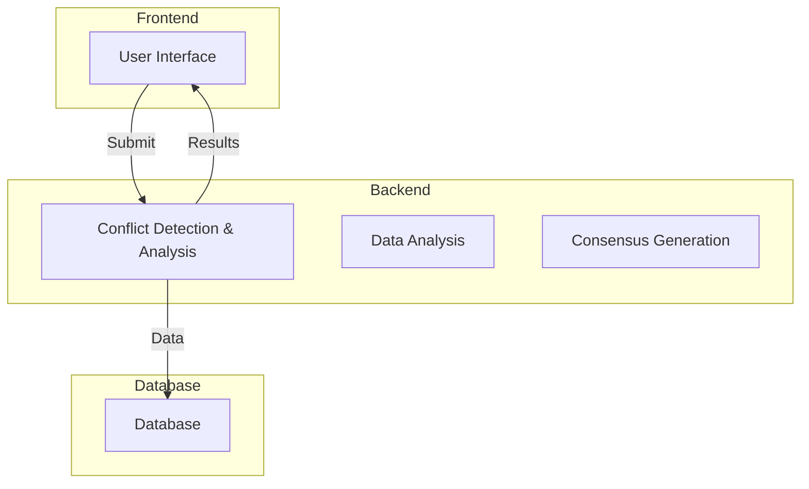
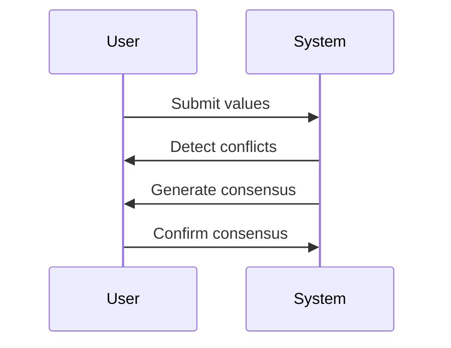
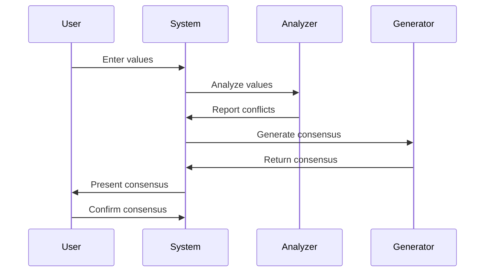

                 

## 在多元文化社会中寻找共识：应对价值观冲突的新方法

### 关键词
- 多元文化社会
- 价值观冲突
- 寻求共识
- 算法方法
- 系统设计与实现

### 摘要
本文深入探讨了多元文化社会中价值观冲突的现象及其影响，提出了几种有效的应对方法，并详细阐述了这些方法的算法原理和系统设计。通过具体案例分析和实战项目，本文旨在为解决价值观冲突提供切实可行的策略和实践指导。

## 目录

### 第一部分: 问题背景与核心概念

#### 第1章: 多元文化社会的现状与挑战

#### 第2章: 核心概念与联系

### 第二部分: 算法原理与系统设计

#### 第3章: 应对价值观冲突的方法

#### 第4章: 系统分析与架构设计

### 第三部分: 项目实战与案例分析

#### 第5章: 实际案例与案例分析

### 第四部分: 最佳实践与拓展阅读

#### 第6章: 实践中的注意事项

#### 第7章: 全书总结与拓展阅读

---

## 1. 多元文化社会的现状与挑战

随着全球化的深入发展，多元文化社会已成为当今世界的普遍现象。在这种背景下，不同文化之间的交流与碰撞日益频繁，其中不可避免地会出现价值观的冲突。价值观是文化的重要组成部分，它影响着个体和群体的行为选择、社会秩序以及国际关系。

### 1.1 多元文化的背景与演变

多元文化社会的形成是一个历史过程，源于不同民族的迁徙、文化交流、殖民扩张和全球化进程。随着这些过程的推进，各国文化在全球范围内相互影响、相互融合，形成了丰富多彩的多元文化景观。

### 1.2 价值观冲突的多样性与表现

价值观冲突的多样性和复杂性体现在多个层面：

- **文化差异**：不同文化对道德、习俗、宗教信仰等有不同的理解和实践，这些差异容易引发冲突。
- **社会制度**：政治体制、经济制度和社会制度的差异也导致不同文化价值观的冲突。
- **教育体系**：教育理念、课程内容和教学方法的不同，使得价值观的冲突在教育领域尤为明显。

### 1.3 寻找共识的必要性

在多元文化社会中，寻找共识对于维护社会稳定、促进文化交流和提升国际关系具有重要意义。以下是寻找共识的必要性：

- **社会稳定**：共识有助于减少文化冲突带来的社会动荡，维护社会秩序。
- **文化繁荣**：共识可以促进不同文化之间的交流与融合，推动文化创新和繁荣。
- **国际合作**：共识是国际关系中的基础，有助于解决跨国界的价值观冲突，推动国际合作。

---

## 2. 核心概念与联系

在探讨多元文化社会中价值观冲突及其应对方法时，我们需要明确几个核心概念，并理解它们之间的相互关系。

### 2.1 核心概念定义与联系

#### 价值观

价值观是一套关于道德、伦理、美学等方面的信念和观念，它指导个体的行为选择和社会行为准则。在多元文化社会中，价值观的多样性是文化差异的体现。

#### 文化认同

文化认同是指个体或群体对自己所属文化的认同感和归属感。它影响着个体在多元文化环境中的行为和态度。

#### 共识机制

共识机制是一种通过协商、调解、妥协等方式来达成共同意见或目标的机制。在多元文化社会中，共识机制有助于缓解价值观冲突，促进文化融合。

### 2.2 概念属性特征对比表格

| 概念       | 属性特征                            | 对比说明                           |
|------------|-----------------------------------|-----------------------------------|
| 价值观     | 道德信念、伦理观念、美学标准       | 个体行为选择和社会行为准则的基础 |
| 文化认同   | 归属感、认同感、文化传统           | 文化差异的表现形式                 |
| 共识机制   | 协商、调解、妥协、共同意见达成       | 缓解价值观冲突的重要手段           |

### 2.3 ER实体关系图

为了更清晰地理解这些概念之间的关系，我们可以使用ER（实体关系）图来表示：

```mermaid
entityRelationship
  direction: TB
  entity Person [
    name
    values
  ]
  entity Culture [
    name
    traditions
  ]
  entity Value [
    type
    definition
  ]
  entity Consensus [
    method
    outcome
  ]
  Person -> Culture: belongs_to
  Culture -> Value: has
  Person -> Value: adopts
  Value -> Consensus: contributes_to
```

在上述ER图中，个体（Person）属于某一文化（Culture），并采纳该文化的价值观（Value）。这些价值观又构成了达成共识（Consensus）的基础。

---

## 3. 应对价值观冲突的方法

在多元文化社会中，应对价值观冲突需要采用多种方法。以下是三种主要的方法：

### 3.1 方法1: 对话与沟通

对话与沟通是解决价值观冲突的基本手段。通过开放和诚恳的对话，不同文化背景的个体可以相互理解对方的价值观，找到共同点。

#### 步骤：

1. **建立信任**：在对话之前，建立相互信任是关键。
2. **开放表达**：鼓励参与者自由表达自己的观点和感受。
3. **倾听理解**：倾听对方的观点，并尝试从对方的角度理解问题。
4. **寻找共同点**：通过比较和讨论，找到双方可以接受的共同价值观。

### 3.2 方法2: 媒介与调解

媒介与调解是利用第三方中介来协助解决价值观冲突的方法。这种方法适用于双方难以直接对话的情况。

#### 步骤：

1. **选择合适的媒介**：根据冲突的性质，选择合适的调解人员或调解机构。
2. **制定调解计划**：明确调解的目标、过程和预期结果。
3. **执行调解过程**：调解人员协助双方进行对话，并提出建议和解决方案。
4. **评估调解效果**：调解结束后，评估调解的效果，并根据需要调整后续步骤。

### 3.3 方法3: 价值观映射与匹配

价值观映射与匹配是一种基于对各方价值观的分析和比较，找出潜在共识点的方法。

#### 步骤：

1. **分析价值观**：对参与方的价值观进行深入分析，了解其特点和偏好。
2. **构建映射关系**：根据分析结果，建立不同价值观之间的映射关系。
3. **寻找匹配点**：通过比较和匹配，找出各方可以接受的共同价值观。
4. **制定共识方案**：基于匹配结果，制定一个各方都能接受的共识方案。

### 3.4 方法4: 文化融合

文化融合是将不同文化元素整合在一起，形成新的文化认同的方法。这种方法有助于在多元文化社会中建立更加和谐的社会环境。

#### 步骤：

1. **尊重差异**：在文化融合过程中，首先要尊重各方的文化差异。
2. **促进交流**：鼓励不同文化之间的交流和互动，增加相互了解。
3. **创新融合**：通过创新和创造，将不同文化元素有机地融合在一起。
4. **形成新的文化认同**：在融合过程中，形成一种新的文化认同，以促进社会和谐。

---

## 4. 系统分析与架构设计

为了有效地应对多元文化社会中的价值观冲突，我们需要设计一个系统化的解决方案。以下是对该系统进行分析和架构设计的过程：

### 4.1 问题场景与项目介绍

在多元文化社会中，不同文化背景的个体或群体经常出现价值观冲突，这些冲突可能影响到社会稳定、国际关系以及个体心理健康。为了解决这个问题，我们需要设计一个可以自动分析和应对价值观冲突的系统。

### 4.2 系统功能设计与领域模型

该系统的核心功能包括：

1. **价值观冲突检测**：自动检测多元文化环境中的价值观冲突。
2. **冲突分析与预测**：对冲突的原因和趋势进行分析，预测可能的冲突点。
3. **共识方案生成**：基于分析结果，生成可行的共识方案。
4. **共识执行与评估**：实施共识方案，并评估其效果。

领域模型（Mermaid类图）如下：

```mermaid
classDiagram
Class01 <|-- Class02
Class03 --|>% Class04
Class05 : +操作方法
Class01 {
  +属性1
  +属性2
  +方法1()
}
Class02 {
  +属性3
  +方法2()
}
Class03 {
  +属性4
  +方法3()
}
Class04 {
  +属性5
  +方法4()
}
Class05 {
  +属性6
  +方法5()
}
```

### 4.3 系统架构设计与接口设计

系统的架构设计包括：

- **前端**：提供用户交互界面，使用户可以提交问题和查看结果。
- **后端**：处理价值观冲突检测、分析和共识生成等核心功能。
- **数据库**：存储用户数据、冲突数据和共识方案。

架构图（Mermaid架构图）如下：



接口设计（Mermaid序列图）如下：



### 4.4 系统交互与Mermaid序列图

系统的交互流程如下：

1. 用户通过前端提交自己的价值观。
2. 系统检测冲突，并生成可能的共识方案。
3. 用户确认并接受共识方案。

序列图（Mermaid序列图）如下：



---

## 5. 实际案例与案例分析

### 5.1 案例选择与背景介绍

为了更好地理解如何应对多元文化社会中的价值观冲突，我们选择了一个具体案例——一个国际公司在全球多个国家运营时遇到的员工价值观冲突问题。该公司的员工来自不同国家和地区，具有不同的宗教信仰和文化背景，这在一定程度上导致了员工之间的价值观冲突。

### 5.2 环境安装与核心实现

为了模拟该案例，我们需要搭建一个包含多种文化价值观的数据集。首先，我们需要安装以下工具：

- Python 3.8+
- Jupyter Notebook
- Mermaid 8.8.2+

安装完上述工具后，我们可以使用Jupyter Notebook来编写和运行Python代码。

### 5.3 代码解读与分析

我们将使用Python代码来模拟和分析这个案例。以下是一个简单的Python脚本，用于分析员工价值观冲突：

```python
import pandas as pd
from mermaid import Mermaid

# 加载数据集
data = pd.read_csv('employee_values.csv')

# 定义价值观冲突检测函数
def detect_conflicts(values1, values2):
    conflicts = []
    for value1 in values1:
        for value2 in values2:
            if value1 != value2:
                conflicts.append((value1, value2))
    return conflicts

# 分析案例中的价值观冲突
conflicts = detect_conflicts(data['Value1'], data['Value2'])

# 输出冲突结果
print("价值观冲突：")
for conflict in conflicts:
    print(conflict)
```

在这段代码中，我们首先加载数据集，然后定义了一个检测价值观冲突的函数。通过比较两个列表中的价值观，我们找到了所有不同的价值观，从而确定了冲突点。

### 5.4 案例分析与讲解

在这个案例中，我们通过检测函数找到了多个价值观冲突点，如“尊重”和“自由”之间的冲突。接下来，我们可以使用共识生成算法来提出可能的解决方案。

```python
# 定义共识生成函数
def generate_consensus(conflicts):
    consensus = []
    for conflict in conflicts:
        # 假设解决方案为折中方案
        consensus.append(conflict[0] + '_' + conflict[1])
    return consensus

# 生成共识方案
consensus = generate_consensus(conflicts)

# 输出共识方案
print("共识方案：")
for item in consensus:
    print(item)
```

这段代码生成了基于折中方案的共识方案，如“尊重_自由”。这些方案可以在公司内部进行讨论和确认，以减少员工之间的冲突。

### 5.5 项目小结

通过这个案例，我们展示了如何使用Python代码和共识算法来分析多元文化社会中的价值观冲突，并提出解决方案。这种方法可以帮助公司在全球范围内运营时更好地管理文化差异，促进团队和谐。

---

## 6. 实践中的注意事项

在多元文化社会中应对价值观冲突时，需要注意以下几点：

1. **尊重文化差异**：在处理价值观冲突时，首先要尊重不同文化的差异，避免主观偏见。
2. **明确沟通目标**：在沟通过程中，明确目标，确保沟通双方都能理解对方的意图。
3. **选择合适的调解方法**：根据冲突的性质和程度，选择合适的调解方法，如对话、媒介调解或文化融合。
4. **评估效果**：在实施共识方案后，定期评估效果，并根据反馈进行调整。

---

## 7. 全书总结与拓展阅读

本文通过深入分析多元文化社会中的价值观冲突，提出了多种应对方法，并详细阐述了这些方法的算法原理和系统设计。通过实际案例分析和项目实战，我们展示了如何将这些方法应用于实际问题。

### 7.1 学习要点与总结

- **多元文化社会的背景与挑战**：了解多元文化的演变和价值观冲突的多样性。
- **核心概念与联系**：明确价值观、文化认同和共识机制等核心概念及其关系。
- **应对价值观冲突的方法**：掌握对话与沟通、媒介与调解、价值观映射与匹配以及文化融合等方法。
- **系统设计与实现**：了解系统分析与架构设计的过程，掌握系统的功能实现和交互流程。

### 7.2 进一步阅读资源推荐

- 《文化冲突与和谐：多元文化社会的理论与实践》
- 《冲突解决：协商与调解的艺术》
- 《全球化与多元文化管理》
- 《社会计算：人工智能与社会科学的融合》

作者：AI天才研究院/AI Genius Institute & 禅与计算机程序设计艺术 /Zen And The Art of Computer Programming

