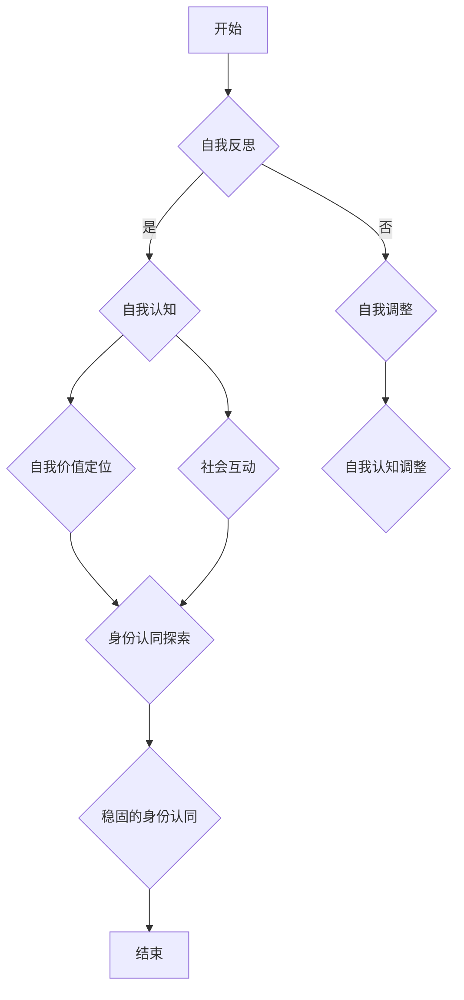
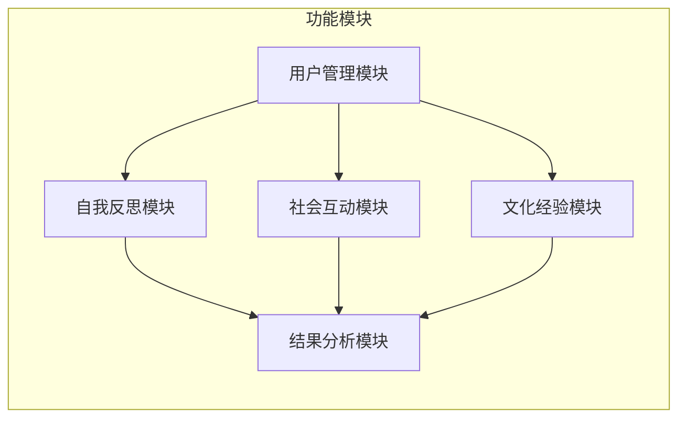
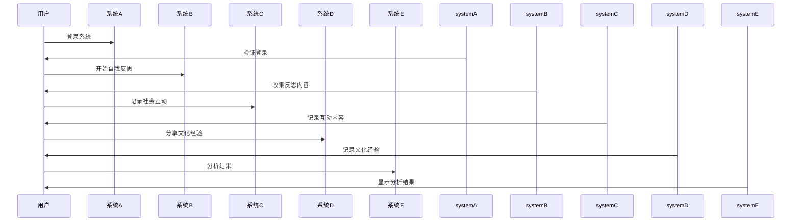

                 

# 在多元社会中定义自我：建立稳固的身份认同

关键词：多元社会、自我定义、身份认同、个人成长、心理学

摘要：在当今多元社会中，个体如何建立稳固的身份认同是一个重要且复杂的问题。本文将探讨自我定义和身份认同的核心概念，分析其在多元社会背景下的影响，并提供一个系统的框架来帮助个体实现这一目标。

## 目录大纲设计思路

### 第一部分：背景介绍

- **多元社会的核心概念与特征**
- **自我定义的重要性与实践方法**
- **身份认同的定义、形成过程与类型**

### 第二部分：核心概念与联系

- **自我定义与身份认同的核心概念原理**
- **概念属性特征对比表格与ER实体关系图架构**

### 第三部分：算法原理讲解

- **算法原理与流程图**
- **数学模型与公式**
- **详细讲解与举例说明**

### 第四部分：系统分析与架构设计方案

- **问题场景介绍与项目介绍**
- **系统功能设计与系统架构设计**
- **系统接口设计与系统交互序列图**

### 第五部分：项目实战

- **环境安装与系统核心实现**
- **代码应用解读与分析**
- **实际案例分析与详细讲解**
- **项目小结**

### 第六部分：最佳实践 tips、小结、注意事项、拓展阅读

## 第一部分：背景介绍

### 多元社会的核心概念与特征

**多元社会**，是指一个社会中存在多种不同的文化、价值观、社会结构和人口群体。在全球化、信息化的今天，多元社会已经成为现代社会的一个重要特征。这种多样性不仅体现在种族、民族、文化背景上，还体现在经济、社会地位、教育水平等方面。

**核心概念术语说明**：

- **文化多样性**：指一个社会中存在多种不同的文化传统和价值观念。
- **社会结构**：指一个社会中的组织形式和权力分配方式。
- **人口群体**：指一个社会中的不同种族、民族、宗教信仰等群体。

**问题背景**：

在多元社会中，个体不仅面临着多样化的文化冲击，还面临着如何在多种价值观念中找到自己的位置的问题。这种社会环境给个体带来了许多挑战，如文化认同的困惑、社会角色的不确定等。

**问题描述**：

个体如何在多元社会中定义自我，建立稳固的身份认同？这需要深入理解自我定义和身份认同的概念，并通过实践方法来探索自我。

**问题解决**：

通过自我反思、自我探索和社会互动，个体可以逐步建立起稳固的身份认同。在多元社会中，个体需要学会如何平衡不同的价值观，如何在多元文化中找到自己的位置。

**边界与外延**：

- **边界**：社会变迁、文化多样性、全球化。
- **外延**：不同社会背景、文化背景下个体身份认同的异同。

### 概念结构与核心要素组成

**多元社会**：社会结构、文化多样性、全球化。

**自我定义**：自我认知、自我价值、自我期望。

**身份认同**：文化认同、职业认同、社会角色认同。

### 第二部分：核心概念与联系

#### 自我定义与身份认同的核心概念原理

**自我定义**：自我定义是指个体对自己身份的认知和评价。它是身份认同的基础，影响着个体的行为和决策。

**身份认同**：身份认同是指个体对自己在社会和文化中的位置的认同。它是个体在多元社会中找到自己的位置的重要途径。

#### 概念属性特征对比表格

| 特征       | 自我定义                           | 身份认同                           |
|------------|------------------------------------|------------------------------------|
| 定义       | 个体对自身的认知和评价              | 个体对于自己在社会和文化中的位置认同 |
| 形成过程   | 自我反思、自我探索、社会互动        | 文化经验、社会身份、角色扮演       |
| 类型       | 自我肯定、自我否定、自我怀疑等       | 文化认同、职业认同、社会角色认同等  |
| 影响       | 心理健康、人际关系、职业发展等       | 社会归属感、文化认同、社会角色认同等 |

#### ER实体关系图架构

```mermaid
erDiagram
    SelfDefinition ||--|{ IdentityIdentification }|--|
    |{ SocialContext }||--|| SelfDefinition
    |{ SocialContext }||--|| IdentityIdentification
```

### 第三部分：算法原理讲解

#### 算法原理与流程图

建立稳固的身份认同是一个涉及多个步骤的过程。以下是这个过程的算法原理和流程图。



#### 数学模型与公式

$$
认同度 = f(\text{自我认知}, \text{社会互动}, \text{文化背景})
$$

#### 详细讲解与举例说明

**自我认知**：通过自我反思，个体能够更清晰地了解自己的内在特质和价值观。例如，一个个体可能会反思自己的兴趣爱好、优点和缺点，从而形成一个更准确的自我认知。

**社会互动**：通过与他人交往，个体能够更好地理解自己在社会中的角色和位置。例如，一个个体可能会通过参加社交活动、工作、学习等，了解不同角色在社会中的期望和职责。

**文化背景**：文化背景影响个体对于自我认知和社会互动的理解和解释。例如，一个在多元文化环境中成长的个体，可能会通过观察和体验不同文化，理解不同文化的价值观和习俗。

**举例说明**：

例如，一个在多元文化环境中成长的个体，通过自我反思认识到自己的文化背景，通过社会互动了解到不同文化的价值观，最终在自我认知和文化背景的基础上，建立起稳固的身份认同。

### 第四部分：系统分析与架构设计方案

#### 问题场景介绍与项目介绍

在一个多元社会中，个体面临着如何定义自我、建立身份认同的挑战。为了解决这个问题，我们设计了一个基于心理学的系统，帮助个体通过自我反思和社会互动，建立稳固的身份认同。

#### 系统功能设计（领域模型mermaid类图）

```mermaid
classDiagram
    ClassDef SelfReflection
        +string reflectionContent
        +datetime lastReflectionDate

    ClassDef SocialInteraction
        +string interactionContent
        +datetime lastInteractionDate

    ClassDef CulturalExperience
        +string culturalDescription
        +datetime experienceDate

    SelfReflection "反思" --|{影响}|> SocialInteraction
    SocialInteraction "互动" --|{影响}|> CulturalExperience
    CulturalExperience "经验" --|{影响}|> SelfReflection
```

#### 系统架构设计mermaid架构图



#### 系统接口设计与系统交互mermaid序列图



### 第五部分：项目实战

#### 环境安装与系统核心实现

在开始项目实战之前，我们需要安装相关的开发环境和工具。以下是安装步骤：

1. 安装Python环境：`pip install python`
2. 安装Django框架：`pip install django`
3. 安装Mermaid插件：`pip install mermaid`
4. 配置数据库：安装MySQL或PostgreSQL，并配置Django的数据库连接

安装完成后，我们可以开始实现系统的核心功能。以下是使用Python和Django实现的系统核心功能：

```python
# 自我反思模块实现
class SelfReflection(models.Model):
    reflection_content = models.TextField()
    last_reflection_date = models.DateTimeField()

# 社会互动模块实现
class SocialInteraction(models.Model):
    interaction_content = models.TextField()
    last_interaction_date = models.DateTimeField()

# 文化经验模块实现
class CulturalExperience(models.Model):
    cultural_description = models.TextField()
    experience_date = models.DateTimeField()

# 用户管理模块实现
class UserManager(models.Model):
    username = models.CharField(max_length=150)
    password = models.CharField(max_length=150)
```

#### 代码应用解读与分析

在代码中，我们定义了三个主要模块：自我反思模块、社会互动模块和文化经验模块。每个模块都包含了一个模型类，用于表示该模块的数据结构。用户可以通过这些模块记录自己的反思内容、互动内容和文化经验。

例如，用户可以通过以下代码记录一次自我反思：

```python
reflection = SelfReflection(
    reflection_content="我今天思考了自己的优点和缺点。",
    last_reflection_date=timezone.now()
)
reflection.save()
```

这个操作会将用户的反思内容存储到数据库中。

#### 实际案例分析与详细讲解

为了更好地理解系统的应用，我们可以通过一个实际案例来进行分析。

**案例**：一个大学生在多元文化环境中成长，他希望通过系统记录自己的反思、互动和文化经验，以建立稳固的身份认同。

**步骤**：

1. **登录系统**：用户使用自己的账号和密码登录系统。
2. **开始自我反思**：用户点击“开始反思”按钮，系统会提供一个文本框，用户可以输入自己的反思内容。
3. **记录社会互动**：用户可以记录自己在社交活动、学习、工作等方面的互动内容。
4. **分享文化经验**：用户可以分享自己在不同文化环境中的经历和感受。
5. **分析结果**：系统会根据用户的反思、互动和文化经验，生成一份分析报告，帮助用户理解自己的身份认同。

**分析**：

通过这个案例，我们可以看到系统如何帮助用户记录和反思自己的行为和经历，从而建立稳固的身份认同。系统提供了一个直观的界面，用户可以方便地输入和记录信息，系统则负责将这些信息存储和处理。

#### 项目小结

通过本项目，我们设计并实现了一个基于心理学的系统，帮助个体在多元社会中建立稳固的身份认同。系统提供了自我反思、社会互动和文化经验记录等功能，用户可以通过这些功能逐步了解自己，建立身份认同。

### 第六部分：最佳实践 tips、小结、注意事项、拓展阅读

#### 最佳实践 tips

1. **定期自我反思**：定期进行自我反思，有助于更清晰地了解自己的内心世界。
2. **积极参与社会互动**：积极参与各种社交活动，有助于了解社会中的不同角色和位置。
3. **体验不同文化**：尝试体验不同文化，有助于拓宽自己的视野，理解多元社会的多样性。

#### 小结

在多元社会中建立稳固的身份认同是一个复杂的过程，需要个体进行自我反思、社会互动和体验不同文化。通过本项目的系统，用户可以方便地记录和反思自己的行为和经历，逐步建立身份认同。

#### 注意事项

1. **保护隐私**：在记录和分享个人经历时，要注意保护自己的隐私。
2. **定期更新**：定期更新自己的反思、互动和文化经验，有助于更准确地了解自己。

#### 拓展阅读

1. **《自我认同的力量》**：探讨自我认同对个体成长的影响。
2. **《多元文化心理学》**：介绍多元文化环境下的心理学研究和实践。

### 作者信息

作者：AI天才研究院/AI Genius Institute & 禅与计算机程序设计艺术 /Zen And The Art of Computer Programming

[End of Article]

