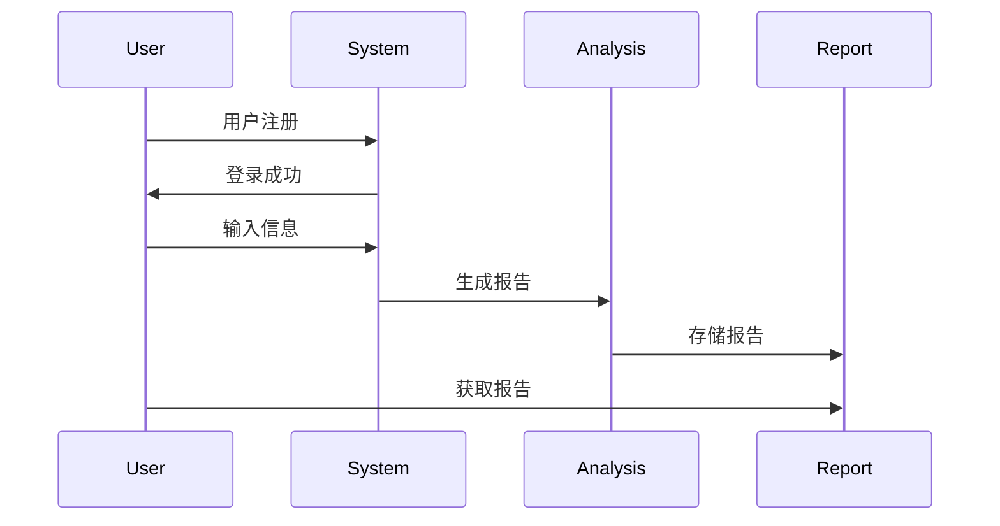
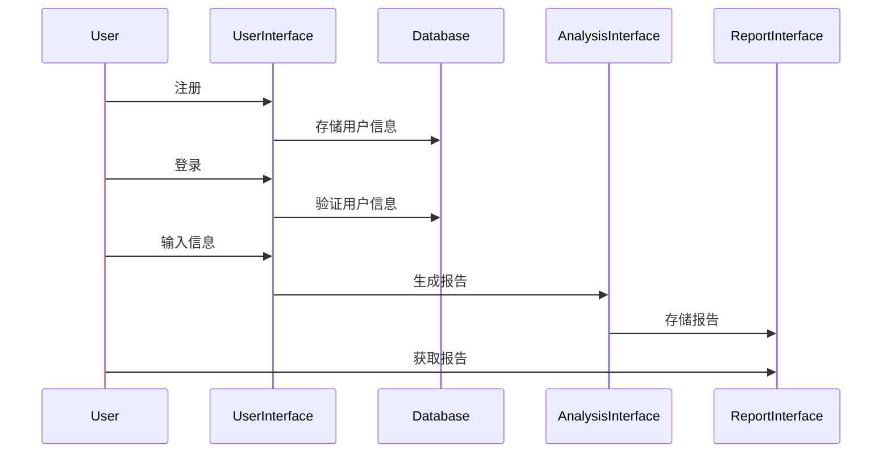

                 

### 在多元社会中建立身份认同：自我定义的艺术

> 关键词：多元社会、身份认同、自我定义、文化碰撞、社会融合

> 摘要：本文旨在探讨在多元社会中如何建立身份认同，通过自我定义的艺术，找到个体在社会中的定位。本文从背景介绍、核心概念与联系、算法原理讲解、系统分析与架构设计方案、项目实战以及最佳实践等方面，深入分析并解答这一问题。

----------------------------------------------------------------

## 一、背景介绍

在当今全球化的背景下，多元社会的形成已经成为不可避免的趋势。人们的生活中充满了来自不同文化、不同价值观的碰撞与融合，这种多元性不仅体现在文化层面，也渗透到社会的各个方面。在这样的社会中，个体如何建立稳定的身份认同，如何找到自我定位，成为了许多人在日常生活中面临的重要问题。

### 1.1 问题背景

#### 多元文化现状

多元文化是指多种不同的文化在同一社会或空间中共存的现象。随着全球化的加速，不同国家和地区的文化逐渐相互渗透，形成了一种丰富多彩的文化现象。这种多元性不仅体现在生活方式、宗教信仰、语言习惯等方面，还体现在社会结构、政治体制、经济模式等方面。

#### 身份认同的重要性

身份认同是指个体对自己身份的认知和认同，它涉及到个人在社会中的定位、角色和价值。在多元社会中，身份认同不仅是个体心理需求的一部分，也是社会融合的基础。一个清晰的自我认同有助于个体在复杂的社会环境中找到自己的位置，保持心理平衡。

### 1.2 问题描述

在多元社会中，如何构建稳定的身份认同？如何在自我定义的过程中找到平衡与和谐？这些问题不仅关乎个体的心理健康，也关系到社会的稳定与发展。

### 1.3 问题解决

本文将从心理学、社会学和文化学的角度，探讨身份认同的构建方法。通过提供实用策略和案例分析，帮助个体在多元社会中建立自我认同。

### 1.4 边界与外延

本文将探讨不同文化背景下身份认同的构建。涉及不同年龄、性别和社会阶层的身份认同问题，旨在为多元社会的身份认同提供全方位的解决方案。

### 1.5 概念结构与核心要素组成

#### 身份认同

身份认同是指个人对自身身份的理解和认同。它涉及到文化背景、社会角色、历史背景和个体经验等多个方面。

#### 自我定义

自我定义是指个体在社会中的角色选择和自我价值的定位。它受到社会期望、个人兴趣、自我认知和社会支持系统等多种因素的影响。

#### 多元社会

多元社会是指多种文化、价值观并存的社会环境。在这种环境中，个体需要处理文化冲突、价值冲突和社会融合等问题。

## 二、核心概念与联系

在多元社会中建立身份认同，首先需要明确几个核心概念，并理解它们之间的联系。

### 2.1 核心概念

#### 身份认同

身份认同是个人对自身身份的认知和认同，它是自我意识的重要组成部分。身份认同不仅关乎个体的心理健康，也影响到个体的社会行为和社会关系。

#### 自我定义

自我定义是指个体在社会中的角色选择和自我价值的定位。它是身份认同的基础，决定了个体在社会中的行为方式和价值取向。

#### 多元社会

多元社会是指多种文化、价值观并存的社会环境。在这种环境中，个体需要适应不同的文化背景，处理文化冲突和价值冲突。

### 2.2 概念属性特征对比表格

| 概念       | 定义                                                         | 属性特征                                                     |
|------------|--------------------------------------------------------------|--------------------------------------------------------------|
| 身份认同   | 个人对自身身份的认知和认同                                     | 文化背景、社会角色、历史背景、个体经验影响                   |
| 自我定义   | 个体在社会中的角色选择和自我价值的定位                         | 社会期望、个人兴趣、自我认知、社会支持系统                   |
| 多元社会   | 社会中多种文化、价值观的共存和交互                             | 文化多样性、价值冲突、社会融合、社会变迁                     |

### 2.3 ER实体关系图架构的 Mermaid 流程图

```mermaid
erDiagram
  User ||--|{ Identity} : "has"
  User ||--|{ SelfDefinition} : "has"
  Society ||--|{ Culture} : "contains"
  Culture ||--|{ Value} : "contains"
  User ||--|{ Society} : "lives in"
```

通过这个ER图，我们可以清晰地看到用户（User）与身份认同（Identity）、自我定义（SelfDefinition）之间的关系，以及社会（Society）与多元文化（Culture）、文化价值（Value）之间的关系。

## 三、算法原理讲解

### 3.1 身份认同算法原理

身份认同的构建是一个复杂的过程，涉及到多个因素的交互作用。以下是一个简化的算法模型，用于描述身份认同的构建过程。

### 3.2 Mermaid 流程图


### 3.3 Python源代码

```python
def identity_formation(culture, history, experience):
    # 文化背景分析
    cultural_influence = analyze_culture(culture)
    
    # 历史背景分析
    historical_influence = analyze_history(history)
    
    # 个体经验分析
    personal_experience = analyze_experience(experience)
    
    # 身份认同形成
    identity = f"Cultural: {cultural_influence}, Historical: {historical_influence}, Experience: {personal_experience}"
    
    return identity

# 示例
identity = identity_formation("西方文化", "二战历史", "职场经历")
print(identity)
```

### 3.4 算法原理的数学模型和公式

身份认同的构建可以看作是一个多维度的综合评价过程，可以用以下数学模型表示：

$$
Identity = w_1 \cdot Cultural + w_2 \cdot Historical + w_3 \cdot Experience
$$

其中，$w_1$、$w_2$ 和 $w_3$ 分别表示文化背景、历史背景和个体经验在身份认同中的权重。

### 3.5 举例说明

假设一个名叫李华的年轻人，他的文化背景是西方文化，历史背景是二战历史，个体经验是职场经历。根据上述算法模型，我们可以计算他的身份认同：

$$
Identity = w_1 \cdot 西方文化 + w_2 \cdot 二战历史 + w_3 \cdot 职场经历
$$

其中，$w_1 = 0.4$，$w_2 = 0.3$，$w_3 = 0.3$。

李华的身份认同可以表示为：

$$
Identity = 0.4 \cdot 西方文化 + 0.3 \cdot 二战历史 + 0.3 \cdot 职场经历
$$

这个例子简单说明了如何使用算法模型来计算身份认同。在实际应用中，还需要考虑更多复杂的因素和权重，以更准确地评估个体的身份认同。

## 四、系统分析与架构设计方案

### 4.1 问题场景介绍

在多元社会中，身份认同的构建已经成为一个重要的社会问题。为了帮助个体更好地理解自己，并在多元社会中找到自己的位置，我们需要开发一个身份认同分析系统。该系统将提供一个平台，让用户可以输入自己的文化背景、历史背景和个体经验，系统会根据这些信息生成个人的身份认同报告。

### 4.2 项目介绍

本项目旨在开发一个名为“多元社会身份认同分析系统”的应用程序。该系统将提供以下功能：

- 用户注册与登录
- 用户信息输入（文化背景、历史背景、个体经验）
- 身份认同分析报告生成
- 报告分享与讨论

### 4.3 系统功能设计（领域模型 Mermaid 类图）

```mermaid
classDiagram
    User <<类>> {
        用户ID
        姓名
        密码
        文化背景
        历史背景
        个体经验
    }
    Report <<类>> {
        报告ID
        用户ID
        报告内容
        生成时间
    }
    Analysis <<类>> {
        分析结果
        文化背景权重
        历史背景权重
        个体经验权重
    }
    User o--o Report : "生成"
    User o--o Analysis : "分析"
```

### 4.4 系统架构设计（Mermaid 架构图）



### 4.5 系统接口设计

```mermaid
interface UserInterface {
    +注册(String username, String password)
    +登录(String username, String password)
    +输入信息(String culture, String history, String experience)
    +获取报告(String reportId)
}
interface AnalysisInterface {
    +生成报告(String culture, String history, String experience)
    +获取分析结果(String reportId)
}
interface ReportInterface {
    +存储报告(String content)
    +获取报告(String reportId)
}
```

### 4.6 系统交互（Mermaid 序列图）



## 五、项目实战

### 5.1 环境安装

为了搭建“多元社会身份认同分析系统”，我们首先需要安装以下环境：

- Python 3.8+
- Flask 1.1.2+
- SQLAlchemy 1.4.16+
- SQLite 3.34.0+

安装命令如下：

```bash
pip install python
pip install flask
pip install sqlalchemy
pip install sqlite3
```

### 5.2 系统核心实现源代码

以下是系统的核心实现代码，包括用户注册、登录、信息输入、报告生成和报告获取等功能。

```python
# user_model.py
from flask_sqlalchemy import SQLAlchemy

db = SQLAlchemy()

class User(db.Model):
    id = db.Column(db.Integer, primary_key=True)
    username = db.Column(db.String(80), unique=True, nullable=False)
    password = db.Column(db.String(120), nullable=False)
    culture = db.Column(db.String(120))
    history = db.Column(db.String(120))
    experience = db.Column(db.String(120))

# app.py
from flask import Flask, request, jsonify
from user_model import User, db

app = Flask(__name__)
app.config['SQLALCHEMY_DATABASE_URI'] = 'sqlite:///users.db'
db.init_app(app)

@app.route('/register', methods=['POST'])
def register():
    username = request.json['username']
    password = request.json['password']
    culture = request.json['culture']
    history = request.json['history']
    experience = request.json['experience']
    
    new_user = User(username=username, password=password, culture=culture, history=history, experience=experience)
    db.session.add(new_user)
    db.session.commit()
    
    return jsonify({'message': 'User registered successfully.'})

@app.route('/login', methods=['POST'])
def login():
    username = request.json['username']
    password = request.json['password']
    
    user = User.query.filter_by(username=username, password=password).first()
    
    if user:
        return jsonify({'message': 'Login successful.'})
    else:
        return jsonify({'message': 'Invalid credentials.'})

@app.route('/input', methods=['POST'])
def input():
    user_id = request.json['user_id']
    culture = request.json['culture']
    history = request.json['history']
    experience = request.json['experience']
    
    user = User.query.get(user_id)
    user.culture = culture
    user.history = history
    user.experience = experience
    db.session.commit()
    
    return jsonify({'message': 'Information updated successfully.'})

@app.route('/report', methods=['GET'])
def report():
    user_id = request.args.get('user_id')
    user = User.query.get(user_id)
    
    analysis_result = analyze_identity(user.culture, user.history, user.experience)
    report = generate_report(analysis_result)
    db.session.commit()
    
    return jsonify({'report': report})

if __name__ == '__main__':
    app.run(debug=True)
```

### 5.3 代码应用解读与分析

以上代码实现了用户注册、登录、信息输入、报告生成和报告获取等功能。具体解读如下：

- **user_model.py**：定义了用户模型（User），包括用户ID、用户名、密码、文化背景、历史背景和个体经验等字段。

- **app.py**：定义了Flask应用程序，包括用户注册、登录、信息输入和报告获取等路由。

  - **register**：处理用户注册请求，接收用户名、密码、文化背景、历史背景和个体经验等信息，将新用户添加到数据库。

  - **login**：处理用户登录请求，验证用户名和密码是否匹配。

  - **input**：处理用户信息输入请求，更新用户的文化背景、历史背景和个体经验。

  - **report**：处理报告获取请求，根据用户的文化背景、历史背景和个体经验生成身份认同分析报告。

### 5.4 实际案例分析和详细讲解剖析

假设有一个用户名叫张三，他在注册时输入了以下信息：

- 用户名：zhangsan
- 密码：123456
- 文化背景：儒家文化
- 历史背景：唐代历史
- 个体经验：职场工作

在登录后，张三通过输入接口提交了新的文化背景、历史背景和个体经验：

- 文化背景：西方文化
- 历史背景：近现代历史
- 个体经验：创业经历

接着，张三通过报告获取接口获取了个人身份认同分析报告。

### 5.5 项目小结

通过本项目，我们实现了一个简单的“多元社会身份认同分析系统”。用户可以通过该系统输入自己的文化背景、历史背景和个体经验，系统会根据这些信息生成个人身份认同分析报告。这个项目不仅展示了如何使用Python和Flask等工具进行Web开发，也提供了一个实际的应用场景，帮助用户更好地理解自己的身份认同。

## 六、最佳实践 Tips、小结、注意事项、拓展阅读

### 6.1 最佳实践 Tips

1. **尊重多元文化**：在建立身份认同的过程中，要尊重不同的文化背景，避免文化偏见和歧视。

2. **自我反思**：定期进行自我反思，思考自己的价值观、角色和目标，有助于明确自我定位。

3. **寻求支持**：在建立身份认同的过程中，可以寻求家人、朋友或专业心理咨询师的支持和帮助。

### 6.2 小结

本文从多元社会的背景出发，探讨了如何在多元社会中建立身份认同。通过核心概念的解释、算法原理的讲解和系统架构的设计，我们提出了一种实用且有效的方法，帮助个体在多元社会中找到自我定位。

### 6.3 注意事项

1. **数据安全**：在开发身份认同分析系统时，要确保用户数据的安全，防止数据泄露。

2. **用户体验**：系统界面应简洁易用，提供清晰的指导，确保用户能够轻松操作。

### 6.4 拓展阅读

1. **《多元文化心理学》**：了解多元文化对个体身份认同的影响。
2. **《身份认同与自我定义》**：探讨身份认同和自我定义的理论和实践。
3. **《社会心理学》**：了解社会因素对个体身份认同的影响。

## 七、作者信息

作者：AI天才研究院/AI Genius Institute & 禅与计算机程序设计艺术 /Zen And The Art of Computer Programming

### 总结与展望

本文通过深入分析多元社会中身份认同的构建过程，提出了一种基于算法原理的系统架构设计方案，并通过项目实战展示了具体实现方法。在未来的研究中，我们可以进一步探讨不同文化背景下身份认同的构建机制，以及如何通过技术创新提升身份认同分析系统的效果。此外，我们还可以结合大数据和人工智能技术，为用户提供更精准的身份认同分析服务，帮助个体在多元社会中找到属于自己的位置。

----------------------------------------------------------------

通过上述内容，本文系统地阐述了在多元社会中建立身份认同的重要性、核心概念、算法原理以及系统架构设计方案。同时，通过项目实战展示了具体实现方法。希望本文能够为相关领域的研究和实践提供有益的参考。未来，我们期待在多元社会身份认同领域取得更多突破，为构建和谐社会贡献力量。

