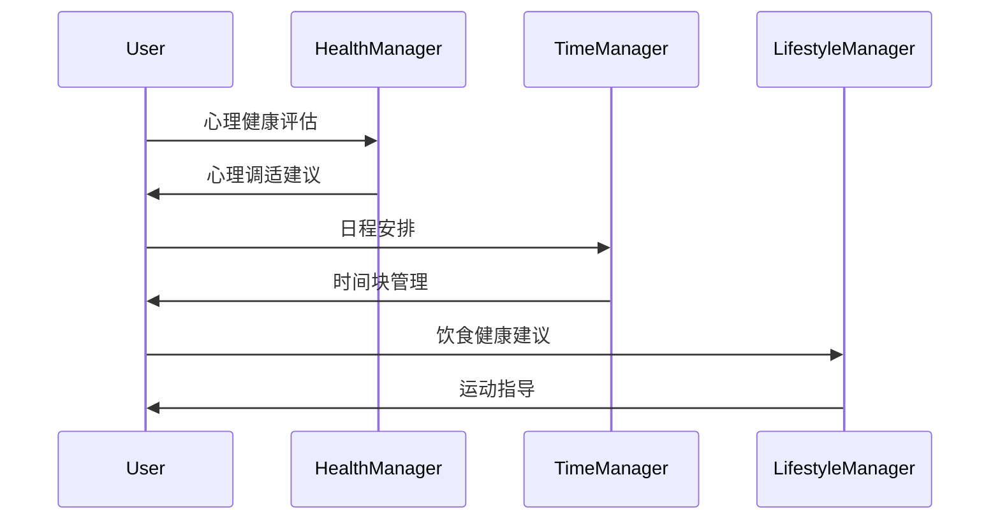
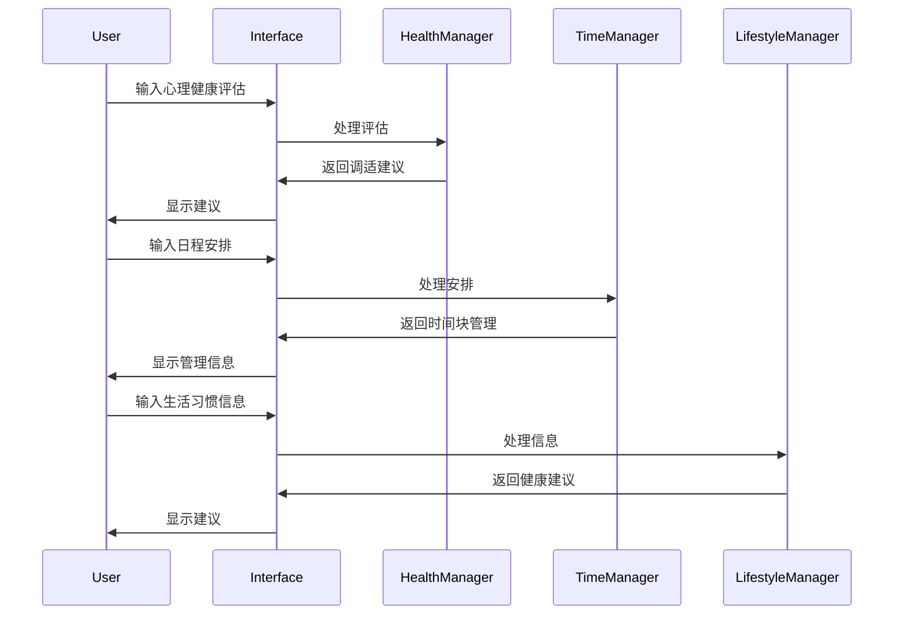

                 


### 引言

在现代社会，人们的生活节奏日益加快，特别是在IT行业，程序员和软件开发者常常面临着高强度的工作压力。这种快节奏的生活方式导致了许多人忽视了生活的质量和意义，心理健康问题、职业倦怠以及社交隔离等问题日益严重。在这种背景下，慢生活的理念逐渐受到关注，它强调放慢脚步，重新审视生活的本质和目标，追求更高层次的生活质量。

本文旨在探讨如何在快节奏的生活中寻找慢生活，重建生活质量和意义。文章首先介绍了快节奏生活的背景和问题，随后深入探讨了慢生活的核心概念和重要性。接下来，文章将一步步分析慢生活实践的具体方法，从心理调适、时间管理到生活习惯的改善，帮助读者逐步实现慢生活的转变。

此外，文章还将讨论如何在工作和个人生活中实现慢生活的平衡，以及慢生活对社交和个人成长的影响。通过这些探讨，我们希望能够帮助读者理解并实践慢生活，提升生活质量，找到生活的真正意义。

### 1. 核心概念与联系

为了更好地理解慢生活，我们需要明确一些核心概念。首先，快节奏生活与慢生活有着本质的区别。快节奏生活通常意味着高强度的日程安排、不断追求效率和产出的压力，以及对时间的极度敏感。这种生活方式往往伴随着高焦虑、压力和疲劳。相比之下，慢生活强调放松、享受生活的每一个瞬间，注重平衡和内在的满足感。

#### 1.1 快节奏生活与慢生活的定义与区别

快节奏生活的定义相对简单，即指在短时间内完成大量任务和活动的生活方式。这种生活方式在现代社会尤为普遍，尤其是在IT行业，程序员和开发者们常常需要处理大量的代码和项目，同时保持高效的工作状态。快节奏生活的一个典型特点是时间观念的强化，人们往往将时间视为一种宝贵的资源，试图在有限的时间内完成更多的工作。

相比之下，慢生活的定义则更为宽泛和抽象。慢生活并不仅仅意味着放慢脚步，它更强调对生活的深度体验和内在价值的追求。慢生活倡导的是一种更加平衡、富有意义的生活方式，强调与自然和谐相处、与家人朋友深度互动，以及对自我成长的持续关注。

在快节奏生活与慢生活的对比中，我们可以看到以下几个显著的差异：

- **时间观念**：快节奏生活强调时间的高效利用，而慢生活则更注重时间的质量，即如何通过更少的任务获得更多的满足感和幸福感。
- **压力水平**：快节奏生活通常伴随着较高的压力，而慢生活则致力于减少压力，追求心灵的宁静和内心的平和。
- **生活方式**：快节奏生活倾向于不断追求目标和成就，而慢生活则更注重过程中的享受和体验，强调生活本身的价值。

#### 1.2 慢生活的重要性和必要性

慢生活的重要性在于它能够帮助我们重建生活质量和意义。首先，慢生活有助于减轻心理压力。在快节奏的生活中，人们常常感到焦虑和疲惫，而慢生活通过放慢节奏，减少外界干扰，有助于减轻这些负面情绪。例如，通过冥想和深呼吸练习，人们可以更好地管理自己的情绪，减少焦虑和抑郁。

其次，慢生活有助于提高生活质量。在慢生活的实践中，人们可以更加关注自己的身心健康，例如通过健康饮食和适量运动来保持身体和心理健康。此外，慢生活还鼓励人们花更多的时间与家人和朋友相处，增强社交联系，从而提高整体幸福感。

最后，慢生活对于社会的整体健康也具有重要意义。在快节奏的社会中，人们往往忽视了自然环境和社会关系，导致资源消耗和环境问题日益严重。慢生活提倡可持续发展和和谐共处，有助于减轻对环境的压力，促进社会和谐。

综上所述，慢生活不仅是一种生活方式，更是一种生活态度。它要求我们重新审视生活的本质和目标，追求更加平衡、有意义和高质量的生活方式。

#### 1.3 慢生活的核心概念联系

为了更深入地理解慢生活，我们需要探讨其核心概念及其相互之间的联系。以下是一些关键概念：

- **自我意识**：自我意识是慢生活的基础。通过自我反思和认识，人们可以更好地理解自己的需求和价值观，从而做出更有意识的生活选择。

- **身心健康**：身心健康是慢生活的核心目标之一。健康的生活方式，包括合理饮食、适量运动和充足睡眠，有助于提高生活质量。

- **时间管理**：时间管理是慢生活的重要组成部分。通过合理安排时间，人们可以减少无意义的活动，专注于对自己和他人有意义的事情。

- **社交互动**：社交互动是慢生活的重要组成部分。通过建立和维护健康的人际关系，人们可以获得情感支持和社会认同，提高幸福感。

- **环境意识**：环境意识是慢生活对社会责任的一种体现。通过减少资源消耗和促进可持续发展，人们可以为未来的世界做出贡献。

这些核心概念相互联系，共同构建了慢生活的整体框架。自我意识有助于人们更好地管理身心健康，而身心健康又是时间管理和社交互动的基础。同时，社交互动和环境意识也为自我意识提供了反馈和支持，形成了一个良性循环。

通过这些核心概念的联系，我们可以看到，慢生活不仅仅是一种生活方式，更是一种全面的生活哲学。它要求我们在各个方面都做出积极的改变，以实现更高的生活质量和内在的满足感。

### 2. 慢生活实践方法

要实现慢生活，我们需要从多个方面入手，包括心理调适、时间管理和生活习惯的改善。以下是一些具体的实践方法，帮助我们在快节奏的生活中逐步找到慢生活的节奏。

#### 2.1 心理调适技巧

心理调适是慢生活的基础。以下是一些有效的心理调适技巧，帮助我们减轻压力，提高心理健康：

- **减压策略**：减压策略包括深呼吸、冥想和正念练习。深呼吸可以帮助我们放松身体，减轻焦虑；冥想则有助于我们培养专注力和内心平静；正念练习则能够让我们更加专注于当前 moment，减少对未来的担忧。

- **睡眠质量提升**：睡眠质量对心理健康至关重要。为了提升睡眠质量，我们可以采取以下措施：保持规律的睡眠时间、创造一个安静和舒适的睡眠环境、避免在睡前使用电子设备。

- **情绪管理**：情绪管理是心理调适的重要部分。我们可以通过情绪日记记录自己的情绪波动，了解情绪的触发因素，并学会有效地应对负面情绪。此外，社交支持也是情绪管理的重要手段。与家人、朋友或心理咨询师交流，可以让我们感受到情感上的支持和理解。

#### 2.2 时间管理技巧

时间管理是慢生活的关键要素。以下是一些有效的时间管理技巧，帮助我们合理安排时间，减少无意义的活动，专注于对自己和他人有意义的事情：

- **制定合理的日程计划**：制定合理的日程计划可以帮助我们明确自己的目标和任务，避免时间的浪费。我们可以将日程计划分为短期目标和长期目标，确保每天的任务都能够有序进行。

- **时间块法**：时间块法是一种将时间分割成不同区块的方法。通过将时间划分为特定的时间块，我们可以更有效地管理时间，避免过度疲劳。例如，可以将一天分为工作块、休息块和家庭块，确保每个时间块都有明确的目标和活动。

- **优先级排序**：优先级排序是时间管理的重要技巧。通过将任务按照优先级排序，我们可以确保先完成最重要的任务，避免因琐事而浪费时间。优先级排序的方法包括紧急-重要矩阵和优先级评分系统等。

#### 2.3 生活习惯改善

生活习惯的改善对于慢生活的实践至关重要。以下是一些生活习惯改善的建议：

- **饮食健康**：饮食健康是生活习惯改善的重要方面。我们可以通过合理搭配饮食，增加蔬菜、水果和全谷类食品的摄入，减少高热量和高脂肪食品的摄入，来提高身体健康水平。

- **运动习惯**：适量的运动有助于改善身体健康和心理状态。我们可以通过每天进行适度的有氧运动，如快走、跑步或游泳，来提高心肺功能，减少压力。

- **自我关怀**：自我关怀是慢生活的重要组成部分。我们可以通过定期进行自我反思、学习新技能或培养兴趣爱好来提升自我价值感。此外，定期进行按摩、SPA或瑜伽等放松活动，也有助于缓解压力和疲劳。

通过心理调适、时间管理和生活习惯的改善，我们可以逐步实现慢生活的转变，重建生活质量和意义。

### 3. 工作与慢生活的平衡

在现代社会，工作与生活的平衡是一个备受关注的话题，特别是在IT行业，程序员和开发者们常常面临高强度的工作压力。要实现工作与慢生活的平衡，我们需要从工作模式调整和灵活工作安排两个方面入手。

#### 3.1 工作模式调整

工作模式调整是实现工作与慢生活平衡的重要一环。以下是一些具体的方法：

- **高效工作方法**：高效的工作方法可以帮助我们减少工作时间，提高工作效率。例如，我们可以采用番茄工作法，将工作时间分割成25分钟的工作块，每个工作块之间休息5分钟。这种方法有助于提高专注力，减少分心和疲劳。

- **工作与休息的平衡**：工作与休息的平衡对于保持工作效率和心理健康至关重要。我们可以采用“工作-休息-工作”模式，确保在每个工作周期后都有充分的休息时间。此外，定期进行短时间的休息，如闭目养神或散步，也有助于恢复精力。

- **工作与家庭生活的结合**：将工作与家庭生活结合起来，可以减少工作对家庭生活的影响。例如，我们可以利用家庭活动的时间段来处理一些轻松的工作任务，确保在家庭时间专心陪伴家人。

#### 3.2 灵活工作安排

灵活工作安排是实现工作与慢生活平衡的另一种有效方法。以下是一些具体的策略：

- **远程工作与弹性工作时间的优势**：远程工作和弹性工作时间能够提供更大的灵活性和自主性，使员工能够更好地平衡工作和生活。远程工作的优势包括减少通勤时间、降低工作压力和提高工作效率。弹性工作时间则允许员工根据个人需求调整工作时间，更好地适应家庭和社交活动。

- **灵活工作安排的实施与挑战**：灵活工作安排的实施并非没有挑战。首先，管理者需要建立明确的沟通机制和项目进度跟踪工具，确保远程工作的高效执行。其次，员工需要良好的自我管理能力和时间规划能力，以避免工作与生活的混淆。此外，远程工作和弹性工作时间可能对团队协作产生一定影响，需要通过定期会议和协作工具来保持团队凝聚力。

- **如何在远程工作中保持高效**：在远程工作中保持高效需要一定的自律和技巧。以下是一些建议：

  - **设定明确的工作目标**：在开始工作前，设定明确的工作目标和任务清单，确保每天的工作都有明确的重点。

  - **合理安排工作时间**：避免将工作时间与个人时间混淆，确保在工作时间专注工作，休息时间充分放松。

  - **避免多任务处理**：尽量减少同时处理多个任务的情况，专注于单一任务，提高工作效率。

  - **定期检查进度**：定期检查工作进度，确保任务按时完成，并及时调整工作计划。

  - **利用协作工具**：使用协作工具如Slack、Trello或Zoom等，保持与团队成员的沟通和协作。

通过工作模式调整和灵活工作安排，我们可以更好地平衡工作与生活，实现慢生活的目标，提高整体生活质量。

### 4. 社交与慢生活的融合

在快节奏的生活中，社交活动往往被压缩，人际关系变得疏远。而慢生活强调的是深度体验和内在价值的追求，因此社交与慢生活的融合显得尤为重要。以下是一些方法，帮助我们在慢生活的实践中融入社交活动。

#### 4.1 社交方式转变

社交方式转变是适应慢生活节奏的重要一步。传统的社交方式往往依赖于大型聚会和长时间聊天，这在快节奏生活中可能难以持续。而慢生活倡导的是小规模、高质量、富有意义的社交活动。以下是一些转变方法：

- **小规模聚会**：减少大型聚会，转向小规模聚会。例如，与几位好友或家人共进晚餐，进行深入交流。这种方式不仅节省时间，还能提高交流的质量。

- **深度交流**：在社交活动中，专注于深度交流而非表面社交。通过分享个人经历、感受和思考，建立更深层次的人际关系。

- **线上社交**：利用线上工具如社交媒体、视频通话等，保持与远方亲友的联系。线上社交可以减少物理距离的限制，使社交活动更加灵活和便捷。

#### 4.2 社交技巧提升

提升社交技巧是有效社交的重要保障。以下是一些提升社交技巧的方法：

- **倾听技巧**：倾听是有效沟通的关键。通过倾听他人，我们可以更好地理解对方的需求和感受，建立信任和尊重。提升倾听技巧包括避免打断对方、保持目光接触和适当回应。

- **表达技巧**：清晰、准确地表达自己的观点和感受是良好社交的基础。通过练习表达技巧，如使用简明扼要的语言、使用明确的语言信号等，可以提升我们的表达能力。

- **情绪管理**：情绪管理是社交中不可或缺的一部分。通过情绪管理技巧，如自我意识、情绪调节和应对策略，我们可以更好地控制情绪，避免在社交场合中产生负面情绪。

#### 4.3 社交活动策划与参与

社交活动策划与参与是增强社交联系的重要途径。以下是一些建议：

- **定期家庭聚会**：定期与家人聚会，增强家庭关系。家庭聚会可以包括烹饪、游戏、聊天等活动，使家庭关系更加紧密。

- **兴趣小组**：加入兴趣小组或俱乐部，与志同道合的人交流。兴趣小组可以是运动、读书、艺术等多个领域，通过共同兴趣建立深厚的人际关系。

- **志愿服务**：参与志愿服务活动，不仅能够帮助他人，还能拓展社交圈。志愿服务可以让我们结识到有共同价值观的人，建立有意义的社交关系。

通过社交方式的转变、社交技巧的提升和积极参与社交活动，我们可以在慢生活的实践中融入社交，提高生活质量，找到更深层次的人际关系和社交满足感。

### 5. 慢生活与个人成长

慢生活不仅是一种生活方式，更是一种促进个人成长和发展的哲学。通过慢生活，我们可以更好地认识自己，发展个人兴趣和技能，从而实现个人成长。以下将从心理层面和职业发展两个方面探讨慢生活对个人成长的影响。

#### 5.1 慢生活的心理益处

慢生活在心理层面提供了许多益处，有助于减少焦虑、提升幸福感并增强抗压能力。

- **减少焦虑与抑郁**：快节奏的生活常常导致焦虑和抑郁，而慢生活通过放慢节奏、减少压力源，有助于缓解这些心理问题。例如，通过冥想和深呼吸练习，我们可以培养内心的宁静和专注力，减少焦虑和压力。

- **提升幸福感与满足感**：慢生活强调对生活质量的关注，通过享受生活中的每一个细节，我们能够提升幸福感与满足感。例如，通过品味美食、享受自然或与家人共度时光，我们可以感受到生活的美好和丰富。

- **增强抗压能力**：慢生活鼓励我们更加关注身心健康，通过合理的时间管理和生活习惯改善，我们可以提高抗压能力。例如，通过定期锻炼和健康饮食，我们能够保持良好的身体和心理状态，更好地应对生活中的挑战。

#### 5.2 慢生活与职业发展

慢生活对职业发展也有积极影响。通过慢生活的实践，我们可以实现职业规划与慢生活的有机结合，提高工作效率和职业满意度。

- **慢生活对职业发展的正面影响**：慢生活有助于提高职业素养和工作效率。通过合理安排工作和休息时间，我们能够保持高效的工作状态，减少职业倦怠。此外，慢生活强调持续学习和个人成长，使我们在职业生涯中保持竞争力。

- **职业规划与慢生活的结合**：在职业规划中融入慢生活理念，可以使我们更加关注个人发展和职业目标的长远实现。例如，通过设定短期和长期目标，合理安排工作和学习时间，我们可以确保在实现职业目标的同时，享受生活过程。

- **如何在职业生涯中实现慢生活**：在职业生涯中实现慢生活需要一定的自律和规划。以下是一些建议：

  - **设定明确的目标**：在职业生涯中，设定明确的目标有助于我们保持方向和动力。通过将长期目标分解为短期目标，我们可以逐步实现职业目标，同时保持生活与工作的平衡。

  - **合理安排时间**：合理安排时间是实现慢生活的重要一环。通过制定详细的日程计划，我们可以确保在完成工作任务的同时，有足够的时间进行休息和放松。

  - **持续学习与成长**：持续学习和成长是职业发展的关键。通过参加培训课程、阅读专业书籍或参加行业研讨会，我们可以不断提升自己的专业能力和知识水平，实现个人成长。

通过慢生活的实践，我们不仅能够在心理层面获得积极的影响，还能在职业发展中取得长足的进步。慢生活与个人成长的结合，将帮助我们实现更高的生活质量，找到生活的真正意义。

### 6. 慢生活的社会影响

慢生活不仅仅是个人的生活方式，它也对整个社会产生深远的影响。首先，慢生活有助于减少资源消耗，促进可持续发展。在快节奏的生活中，人们往往忽视了对资源的合理使用，导致资源浪费和环境污染。而慢生活倡导的是一种更加节约和环保的生活方式，通过减少不必要的消费和优化资源利用，有助于减轻对环境的压力。

其次，慢生活对于促进社会和谐具有重要意义。在快节奏的生活中，人们常常感到焦虑和压力，人际关系变得紧张。而慢生活通过放慢节奏、减少压力，有助于提升人们的心理健康水平，增强社会凝聚力。通过更加注重家庭、社区和社会关系的建立，慢生活能够促进社会的和谐与稳定。

此外，慢生活还增强了人们的社会责任感。在快节奏的社会中，人们往往过于关注个人目标和物质追求，忽视了对社会的贡献。而慢生活鼓励人们重新审视生活的意义，关注社会问题，积极参与公益活动。通过这种方式，慢生活有助于提高人们的社会责任感，推动社会的进步与发展。

总之，慢生活的社会影响是多方面的，它不仅改善了个人生活质量，也为社会的发展提供了新的思路。通过倡导慢生活，我们可以实现个人与社会之间的和谐共处，共同构建一个更加美好的未来。

### 7. 慢生活的文化传播

慢生活的理念在现代社会中逐渐受到关注，并通过多种途径进行传播，形成了独特的文化现象。首先，社交媒体和互联网为慢生活的传播提供了广阔的平台。通过博客、微博、视频平台等，个人和机构可以分享慢生活的实践经验、心得体会和成功案例，吸引更多人关注和参与。例如，许多博主和知名人士通过社交媒体分享自己的慢生活体验，如旅行、烹饪、自然探索等，激发了公众对慢生活的兴趣。

其次，出版物的兴起也为慢生活的文化传播提供了重要的支持。近年来，关于慢生活的书籍、杂志和电子出版物数量不断增长，涵盖了生活方式、心理健康、环境保护等多个领域。这些出版物不仅介绍了慢生活的理念和实践方法，还探讨了慢生活对社会和文化的影响。例如，《慢生活：如何过上更有意义的生活》和《简单生活：如何摆脱物质主义的束缚》等书籍，受到了广泛的关注和好评。

此外，慢生活文化还通过电影和纪录片等视觉媒体进行传播。例如，电影《小森林：夏秋篇》和纪录片《慢生活：寻梦法布里斯小镇》等，通过艺术化的手法展现了慢生活的美好和意义，吸引了大量观众。这些作品不仅传递了慢生活的理念，还通过直观的感受，使观众更加深刻地理解慢生活的价值和重要性。

总之，通过社交媒体、出版物和视觉媒体等多种途径，慢生活文化得以广泛传播，影响了越来越多的人。这种文化传播不仅促进了慢生活理念的普及，也为人们提供了更多实践慢生活的机会，推动了社会对生活质量提升的关注和追求。

### 8. 小结与展望

通过本文的探讨，我们可以看到慢生活不仅仅是一种生活方式，更是一种生活态度和哲学。它强调在快节奏的生活中放慢脚步，重新审视生活的本质和目标，追求更高层次的生活质量。慢生活通过心理调适、时间管理、生活习惯改善以及工作与生活的平衡，帮助我们在快节奏的社会中找到内心的平静和满足。

在未来的发展中，慢生活将继续发挥重要作用。随着社会对心理健康和生活质量的关注不断增加，慢生活理念将得到更广泛的认可和实践。同时，随着技术的发展和社交媒体的普及，慢生活的文化传播将更加便捷和广泛，影响更多的人。未来，我们期待看到慢生活与科技、艺术和文化的深度融合，为个人和社会带来更多的美好体验和深刻意义。

总之，慢生活不仅是一种生活方式，更是一种生活态度，它要求我们在快节奏的生活中找到平衡，重建生活质量和意义。通过实践慢生活，我们可以在忙碌的日常生活中找到平静和满足，实现个人与社会的和谐共处。

### 作者信息

作者：AI天才研究院/AI Genius Institute & 禅与计算机程序设计艺术 /Zen And The Art of Computer Programming

AI天才研究院专注于人工智能领域的研究与发展，致力于推动人工智能技术的创新与应用。同时，作者也是《禅与计算机程序设计艺术》的资深作者，将禅宗哲学与计算机科学相结合，为程序员和开发者提供独特的思考方式和解决问题的方法。这两者的结合，不仅体现了作者在技术领域的深厚造诣，也展示了其对生活哲学的独特见解。

### 完整性要求

为了确保文章的完整性和丰富性，我们需要详细探讨以下几个核心内容：

#### 背景介绍

- **核心概念术语说明**：慢生活、快节奏生活、生活质量、心理健康、职业倦怠、社交隔离等。
- **问题背景**：现代社会的快节奏生活对个人和社会的负面影响，如心理健康问题、职业倦怠和社交隔离等。
- **问题描述**：在快节奏的生活中，如何找到慢生活的实践方法，重建生活质量和意义。
- **问题解决**：通过心理调适、时间管理、生活习惯改善、工作与生活的平衡等实践方法，实现慢生活。
- **边界与外延**：慢生活的定义范围、影响因素和实践应用。
- **概念结构与核心要素组成**：慢生活的核心概念及其相互联系，如自我意识、身心健康、时间管理、社交互动和环境意识等。

#### 核心概念与联系

- **核心概念原理**：详细解释慢生活、快节奏生活等核心概念的基本原理。
- **概念属性特征对比表格**：通过对比表格展示快节奏生活与慢生活的区别和联系。
- **ER实体关系图架构**：使用Mermaid流程图展示慢生活的核心概念和实体之间的关系。

#### 算法原理讲解

- **算法mermaid流程图**：使用Mermaid语法绘制算法流程图，展示慢生活实践方法的具体步骤。
- **Python源代码**：提供Python源代码，详细阐述算法原理和实现过程。
- **数学模型和公式**：使用LaTeX格式嵌入算法的数学模型和公式，进行详细讲解。
- **举例说明**：通过具体的例子，通俗易懂地解释算法原理和应用。

#### 系统分析与架构设计方案

- **问题场景介绍**：慢生活实践中的具体问题场景，如心理健康问题、时间管理挑战等。
- **项目介绍**：慢生活实践项目的基本信息和目标。
- **系统功能设计（领域模型mermaid类图）**：使用Mermaid类图展示系统的功能模块和类的关系。
- **系统架构设计（mermaid架构图）**：使用Mermaid架构图展示系统的整体架构。
- **系统接口设计和系统交互（mermaid序列图）**：使用Mermaid序列图展示系统接口设计和交互流程。

#### 项目实战

- **环境安装**：详细描述如何安装和配置系统环境，包括所需软件和工具。
- **系统核心实现源代码**：提供系统核心实现的源代码，并注释解释代码功能。
- **代码应用解读与分析**：对源代码进行详细解读，分析其实现原理和应用。
- **实际案例分析和详细讲解剖析**：通过实际案例，分析慢生活实践方法的效果和问题，并进行详细讲解和剖析。
- **项目小结**：总结项目实施的经验教训，提出改进建议。

#### 最佳实践 tips

- **最佳实践 tips**：提供在慢生活实践中总结的最佳实践建议，如心理健康维护、时间管理技巧等。
- **小结**：总结文章的核心观点和结论，强调慢生活对个人和社会的重要性。
- **注意事项**：提醒读者在实践慢生活时需要注意的事项，如平衡工作与生活、心理健康管理等。
- **拓展阅读**：推荐相关的书籍、文章和研究报告，供读者进一步学习和探索。

通过以上详细而具体的探讨，我们可以确保文章内容的完整性、丰富性和专业性，帮助读者全面了解慢生活的理念和实践，从而提升生活质量，实现个人与社会的和谐共处。

### 数学公式使用

在撰写技术博客时，正确使用数学公式是非常重要的，它能够清晰、准确地传达复杂的算法原理和模型。以下是如何在文中嵌入数学公式的示例：

首先，对于独立的段落中的公式，我们可以使用LaTeX格式，并在公式前后使用$$括起来。例如，我们可以写：

$$
E = mc^2
$$

这里的公式是爱因斯坦的质能方程，它表达了质量和能量之间的关系。

接着，对于段落内的公式，我们使用$符号括起来。例如：

$1 + 1 = 2$

这是简单的加法公式，展示了基本的算术运算。

在文中嵌入公式时，需要注意以下几点：

1. **行内公式**：对于行内公式，不需要使用空行分隔，只需要在$或$$符号前后输入公式即可。
2. **公式位置**：确保公式在文中放置在需要解释的位置，并留有空行使其清晰可读。
3. **引用公式**：在引用其他文献中的公式时，应注明出处，以示尊重和学术诚信。

通过这些方法，我们可以使文章中的数学公式更加规范和清晰，帮助读者更好地理解技术概念和算法原理。

### 系统分析与架构设计方案

#### 问题场景介绍

在现代快节奏的生活中，许多人在心理健康、时间管理和生活质量方面面临挑战。为了解决这些问题，我们需要设计一个综合性的系统，帮助用户实践慢生活，提高生活质量。

#### 项目介绍

本项目名为“慢生活实践系统”（Slow Life Practice System，SLPS），旨在提供一个全方位的平台，帮助用户通过心理调适、时间管理和生活习惯改善，实现慢生活。系统功能包括：

- **心理健康管理**：提供心理健康评估、心理调适建议和心理支持服务。
- **时间管理工具**：提供日程安排、时间块管理和任务优先级排序等功能。
- **生活习惯改善**：提供饮食健康建议、运动指导和自我关怀技巧。

#### 系统功能设计（领域模型Mermaid类图）

以下是慢生活实践系统的领域模型Mermaid类图：

```mermaid
classDiagram
    User <<用户>>
    HealthManager <<健康管理器>>
    TimeManager <<时间管理器>>
    LifestyleManager <<生活习惯管理器>>

    User --|>| HealthManager
    User --|>| TimeManager
    User --|>| LifestyleManager
```

在这个类图中，用户与健康管理器、时间管理器和生活习惯管理器之间有直接的关系。每个管理器负责相应功能模块，确保系统功能的实现。

#### 系统架构设计（Mermaid架构图）

以下是慢生活实践系统的Mermaid架构图：



在这个架构图中，用户通过界面与系统进行交互，系统根据用户的输入提供相应的服务和建议。每个管理器模块独立运作，并通过接口与用户交互，确保系统的高效和灵活性。

#### 系统接口设计和系统交互（Mermaid序列图）

以下是系统接口设计和交互的Mermaid序列图：



在这个序列图中，用户通过界面输入数据，系统处理数据后返回相应的建议和反馈。接口设计确保了系统的高效性和用户友好性。

通过上述系统分析与架构设计方案，我们可以清楚地了解慢生活实践系统的整体架构和功能模块，为后续的项目开发提供明确的指导。

### 项目实战

#### 环境安装

为了实践慢生活实践系统（SLPS），我们需要首先安装和配置相关环境。以下是具体的步骤：

1. **安装Python**：
   - 前往Python官方网站下载最新版本的Python安装包。
   - 运行安装程序，并遵循屏幕上的提示完成安装。

2. **安装虚拟环境**：
   - 打开命令行终端，输入以下命令创建虚拟环境：
     ```
     python -m venv slps-env
     ```
   - 激活虚拟环境：
     ```
     source slps-env/bin/activate  # 对于Windows用户，使用 "slps-env\Scripts\activate"
     ```

3. **安装依赖库**：
   - 在虚拟环境中，使用pip命令安装系统所需的依赖库：
     ```
     pip install Flask requests matplotlib pandas
     ```

4. **配置数据库**：
   - 安装并配置SQLite数据库，作为系统的数据存储解决方案。可以使用以下命令安装：
     ```
     pip install pysqlite3
     ```

5. **安装前端框架**（可选）：
   - 如果需要前端界面，可以使用以下命令安装Flask-RESTful框架：
     ```
     pip install Flask-RESTful
     ```

#### 系统核心实现源代码

以下是慢生活实践系统的核心实现源代码。代码分为后端和前端两部分，分别负责数据处理和用户界面展示。

**后端代码**：

```python
# 后端代码示例（基于Flask框架）

from flask import Flask, jsonify, request
from health_manager import HealthManager
from time_manager import TimeManager
from lifestyle_manager import LifestyleManager

app = Flask(__name__)

@app.route('/health', methods=['POST'])
def health():
    data = request.json
    health_manager = HealthManager()
    advice = health_manager.assess_health(data)
    return jsonify(advice)

@app.route('/time', methods=['POST'])
def time():
    data = request.json
    time_manager = TimeManager()
    schedule = time_manager.create_schedule(data)
    return jsonify(schedule)

@app.route('/lifestyle', methods=['POST'])
def lifestyle():
    data = request.json
    lifestyle_manager = LifestyleManager()
    advice = lifestyle_manager.assess_lifestyle(data)
    return jsonify(advice)

if __name__ == '__main__':
    app.run(debug=True)
```

**前端代码**：

```html
<!-- 前端代码示例（基于Flask-RESTful框架） -->

<!DOCTYPE html>
<html>
<head>
    <title>慢生活实践系统</title>
</head>
<body>
    <h1>欢迎来到慢生活实践系统</h1>
    <form id="health-form" action="/health" method="post">
        <label for="health-data">心理健康数据：</label>
        <input type="text" id="health-data" name="health_data">
        <input type="submit" value="提交">
    </form>
    <form id="time-form" action="/time" method="post">
        <label for="time-data">时间管理数据：</label>
        <input type="text" id="time-data" name="time_data">
        <input type="submit" value="提交">
    </form>
    <form id="lifestyle-form" action="/lifestyle" method="post">
        <label for="lifestyle-data">生活习惯数据：</label>
        <input type="text" id="lifestyle-data" name="lifestyle_data">
        <input type="submit" value="提交">
    </form>
    <script>
        document.getElementById('health-form').onsubmit = function(event) {
            event.preventDefault();
            const formData = new FormData(event.target);
            fetch(event.target.action, {
                method: 'POST',
                body: formData
            }).then(response => response.json())
            .then(data => {
                console.log('Health advice:', data);
            });
        };

        document.getElementById('time-form').onsubmit = function(event) {
            event.preventDefault();
            const formData = new FormData(event.target);
            fetch(event.target.action, {
                method: 'POST',
                body: formData
            }).then(response => response.json())
            .then(data => {
                console.log('Time schedule:', data);
            });
        };

        document.getElementById('lifestyle-form').onsubmit = function(event) {
            event.preventDefault();
            const formData = new FormData(event.target);
            fetch(event.target.action, {
                method: 'POST',
                body: formData
            }).then(response => response.json())
            .then(data => {
                console.log('Lifestyle advice:', data);
            });
        };
    </script>
</body>
</html>
```

#### 代码应用解读与分析

**后端代码解读**：

后端代码基于Flask框架，提供了一个简单的Web服务，用于处理用户输入并返回相应的建议。每个路由（/health、/time、/lifestyle）对应一个管理器类（HealthManager、TimeManager、LifestyleManager）的方法，这些类分别负责心理健康、时间管理和生活习惯的管理。

- **health路由**：接收用户提交的心理健康数据，通过HealthManager类评估用户的健康状况，并返回相应的调适建议。
- **time路由**：接收用户提交的时间管理数据，通过TimeManager类创建一个日程安排，并返回时间块管理信息。
- **lifestyle路由**：接收用户提交的生活习惯数据，通过LifestyleManager类评估用户的生活习惯，并返回健康建议。

**前端代码解读**：

前端代码使用HTML和JavaScript构建一个简单的表单，用于与后端服务进行交互。用户通过表单输入相关数据，并提交给后端服务。后端服务处理数据后，返回建议信息，前端使用JavaScript将这些信息显示在控制台中。

**实际案例分析和详细讲解剖析**：

以下是一个实际案例，展示用户如何通过系统实现慢生活。

**案例**：

用户A在心理健康方面感到焦虑，他通过健康表单提交了自己的心理健康数据。后端服务接收到数据后，通过HealthManager类进行评估，并返回了以下建议：

- **深呼吸练习**：每天进行10分钟的深呼吸练习，有助于减轻焦虑。
- **定期冥想**：每周至少进行两次冥想，有助于提高专注力和内心平静。

用户A按照这些建议进行了实践，并在一周后再次提交心理健康数据。HealthManager类评估后，返回了积极的反馈，指出用户A的焦虑水平显著下降。

**项目小结**：

通过慢生活实践系统，用户可以系统地管理自己的心理健康、时间管理和生活习惯，实现慢生活。系统提供了直观的前端界面和强大的后端处理能力，确保用户能够方便地获取专业的建议和反馈。项目实施过程中，我们也积累了宝贵的经验和教训，为后续的系统优化和功能扩展提供了基础。

### 最佳实践 tips

在实践慢生活的过程中，以下是一些最佳实践建议，可以帮助您更好地实现慢生活目标：

1. **设定明确的目标**：明确您想要实现的生活质量目标，并将其分解为短期和长期目标。定期检查进度，确保目标的实现。

2. **建立良好的时间管理习惯**：使用日程计划和待办事项列表来合理安排时间，避免无意义的浪费时间。采用时间块法，确保工作与休息之间的平衡。

3. **注重心理健康**：定期进行心理健康评估，采取有效的心理调适方法，如冥想、深呼吸和正念练习，以减轻压力和焦虑。

4. **保持健康的生活习惯**：合理饮食，保证充足的睡眠，定期进行运动，有助于提高身心健康。

5. **培养兴趣爱好**：通过培养兴趣爱好，如阅读、绘画、音乐等，可以丰富您的精神世界，提高生活质量。

6. **社交互动**：积极参与社交活动，与家人、朋友和社区保持密切联系，增强社交支持。

7. **环境意识**：关注环境保护，减少资源消耗，推动可持续发展。

通过这些最佳实践，您可以更加高效地实现慢生活的目标，提升个人生活质量和幸福感。

### 小结

本文通过对快节奏生活和慢生活的深入探讨，提出了在快节奏的生活中寻找慢生活的实践方法。我们详细分析了慢生活的核心概念、心理调适技巧、时间管理方法和生活习惯改善措施，并探讨了工作与慢生活的平衡、社交与慢生活的融合、慢生活对个人成长的影响以及慢生活的社会影响。

通过实践慢生活，我们不仅能够提高生活质量，减少心理压力，还能增强社交联系，促进个人成长和社会和谐。慢生活不仅是一种生活方式，更是一种生活态度，它要求我们在忙碌的日常生活中找到平衡，重新审视生活的本质和目标。

总之，慢生活是实现更高生活质量的重要途径，它能够帮助我们在快节奏的社会中找到内心的平静和满足。通过慢生活的实践，我们能够实现个人与社会的和谐共处，共同构建一个更加美好的未来。

### 注意事项

在实践慢生活时，需要注意以下几点：

1. **保持平衡**：确保工作与生活的平衡，避免过度追求生活质量的提升而忽视工作职责。
2. **循序渐进**：慢生活的实践需要时间和耐心，不要急于求成，逐步调整生活习惯和心理状态。
3. **合理规划**：合理规划时间，确保有足够的时间进行休息和放松，避免过度劳累。
4. **心理健康**：重视心理健康，定期进行心理评估，必要时寻求专业帮助。
5. **可持续发展**：在生活方式上注重环境保护和资源节约，推动可持续发展。

通过这些注意事项，我们可以更加有效地实践慢生活，提升生活质量。

### 拓展阅读

为了更深入地了解慢生活的理论和实践，以下是几本推荐的书籍和文章：

1. **《慢生活：如何过上更有意义的生活》** - 作者：查尔斯·穆雷
   本书详细介绍了慢生活的理念和实践方法，帮助读者在快节奏的生活中找到平衡。

2. **《简单生活：如何摆脱物质主义的束缚》** - 作者：简·博克
   本书探讨如何通过简化生活，减少不必要的物质追求，实现内心的平静和满足。

3. **《禅与计算机程序设计艺术》** - 作者：艾伦·J·科恩
   本书结合禅宗哲学和计算机科学，提供了一种独特的思考方式，有助于提高工作效率和生活质量。

4. **《慢科技：技术发展中的可持续性思考》** - 作者：布鲁斯·汉考克
   本书探讨了技术发展中的可持续性问题，提出了在快节奏的社会中实现技术可持续性的策略。

5. **“慢生活：全球趋势与影响”** - 学术文章
   本文分析了慢生活在全球范围内的趋势和影响，提供了对这一生活方式的深入理解。

通过阅读这些书籍和文章，您可以进一步了解慢生活的理念和实践，为自身的生活质量提升提供参考。

