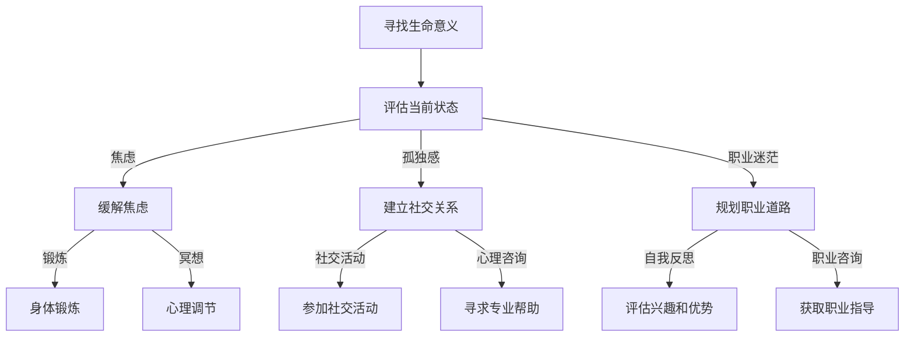
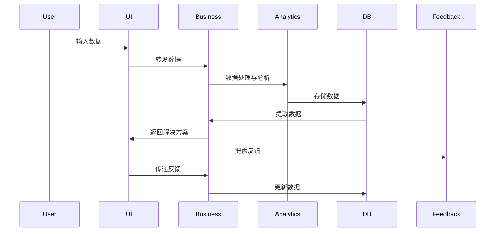
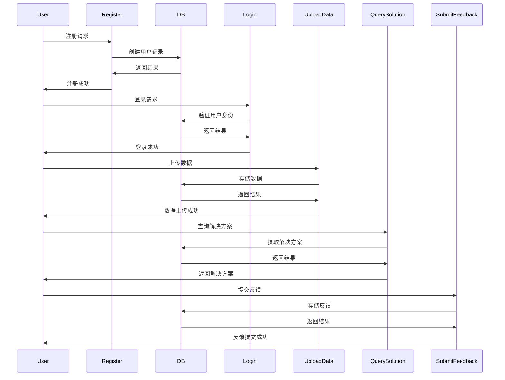

                 

## 在意义的荒原上前行：现代人的生存智慧

### 关键词

- 现代人的生存困境
- 寻找生命意义
- 个人成长
- 心理健康
- 社会互动

### 摘要

本文旨在探讨现代人面临的生存困境以及如何在荒原般的现代社会中寻找生命的意义。通过深入分析现代社会中常见的焦虑、孤独、职业迷茫等问题，本文将阐述寻找生命意义的多种途径，如宗教、哲学、心理学等。此外，文章还将讨论个人成长与自我实现的重要性，以及社会互动与心理健康对生命意义寻找的积极作用。最后，文章将对全文内容进行总结，并提出对未来的展望。

## 引言

在现代社会，人们面临着前所未有的生存挑战。经济压力、社会竞争、信息过载等因素使得许多人感到焦虑、孤独和迷茫。这种生存困境不仅影响着个人的心理健康，也对社会和谐与稳定带来负面影响。因此，如何在荒原般的现代社会中寻找生命的意义，已成为一个亟待解决的问题。

本文将围绕以下几个核心问题展开讨论：

1. 现代人的生存困境有哪些？其成因是什么？
2. 寻找生命意义的多种途径有哪些？不同途径的特点是什么？
3. 个人成长与自我实现如何影响生命意义的寻找？
4. 社会互动与心理健康在生命意义寻找中的作用是什么？

通过以上问题的探讨，本文希望为广大读者提供一种寻找生命意义的思路和方法，帮助他们在现代社会中找到属于自己的生存智慧。

### 现代人的生存困境

在现代社会的背景下，人们面临着多种生存困境，其中最为常见的包括焦虑、孤独、职业迷茫等。

首先，焦虑是一种普遍的心理现象，尤其在现代社会中更为突出。随着生活节奏的加快、工作压力的增大，许多人感到无法承受压力，从而产生焦虑情绪。焦虑不仅影响个人的心理健康，还会对生活和工作产生负面影响。

其次，孤独感是现代社会中另一个重要的生存困境。随着社交媒体的普及，人们的社交网络似乎变得广泛，但实际上许多人仍然感到孤独。孤独感可能源于人际关系的不和谐、情感需求的无法满足，甚至可能是内心深处的一种孤独感。

最后，职业迷茫也是现代社会中普遍存在的问题。随着职业选择的多样化，许多人在面对职业选择时感到迷茫。他们不确定自己的职业发展方向，也不知道如何找到适合自己的职业。

这些生存困境的成因是多方面的。从社会层面来看，现代社会的高压竞争和快节奏生活方式使得人们无法真正放松，从而产生焦虑和孤独感。从个人层面来看，许多人在面对生活中的各种选择时感到迷茫，无法找到自己的定位，从而产生职业迷茫。

总的来说，现代人的生存困境是多种因素综合作用的结果。要解决这些问题，我们需要从多个角度入手，寻找合适的解决方法。

### 寻找生命意义的多种途径

在现代社会中，寻找生命的意义已成为许多人关注的焦点。为了应对生存困境，人们尝试了多种寻找生命意义的途径，包括宗教、哲学和心理学等。

首先，宗教是一种传统的寻找生命意义的途径。宗教信仰能够为人们提供精神寄托和价值观的引导。不同宗教有着不同的教义和信仰体系，但它们共同的核心是帮助信徒找到生命的意义。例如，基督教强调信仰和救赎，佛教强调因果循环和涅槃。通过信仰宗教，许多人找到了内心的平静和生命的方向。

其次，哲学是一种理性地探讨生命意义的途径。哲学家们通过思考和辩论，试图回答人类存在的意义这一根本问题。不同的哲学流派有着不同的观点，如存在主义强调个体自由和责任，实用主义强调实用性和有效性。哲学的思考有助于人们更加深入地理解自己和生活，从而找到生命的意义。

最后，心理学是一种科学地探讨生命意义的途径。心理学家们通过研究人类行为和心理过程，揭示了人类内心的需求和动机。心理学方法可以帮助人们更好地了解自己，找到内心的平衡和满足。例如，认知行为疗法通过改变思维模式和行为习惯，帮助人们摆脱焦虑和抑郁，从而找到生命的意义。

这些寻找生命意义的途径各有特点，但它们都有一个共同目标：帮助人们在现代社会中找到生命的方向和意义。无论是通过信仰、思考还是科学，寻找生命意义的过程都是一个自我探索和成长的过程。

### 个人成长与自我实现

个人成长与自我实现是寻找生命意义的重要途径。在现代社会，个人成长不仅关系到个体的心理健康，也影响到他们在社会中的角色和地位。

首先，个人成长的重要性不言而喻。通过不断学习、提升自己的能力和素质，个人能够更好地适应社会环境，实现自我价值。个人成长的过程是一个自我认知和自我超越的过程，它使人们更加自信、坚定和有目标。

其次，自我实现是个人成长的高级阶段。自我实现意味着个人能够充分发挥自己的潜能，实现自己的梦想和目标。自我实现不仅有助于个人心理的满足和幸福，也能为社会带来更多的价值和贡献。

在个人成长与自我实现的过程中，以下几个方面尤为重要：

1. **自我认知**：自我认知是个人成长的基础。了解自己的兴趣、优点和不足，有助于个人制定合理的发展计划，找到适合自己的成长路径。

2. **持续学习**：学习是个人成长的动力。现代社会变化迅速，知识更新迭代快，只有不断学习才能跟上时代的步伐，保持竞争力。

3. **目标设定**：设定明确的目标是个人成长的关键。目标可以激励个人努力奋斗，同时为目标实现过程中的每一步提供方向和动力。

4. **积极心态**：积极的心态有助于个人面对挑战和困难，保持乐观和自信。积极心态不仅能够增强个人的抗压能力，还能提升生活质量。

通过个人成长与自我实现，个体不仅能够找到生命的意义，还能为社会的进步和发展做出贡献。在这个过程中，每个人都是自己生命意义的创造者。

### 社会互动与人际关系

社会互动与人际关系在现代社会中具有不可忽视的重要性。人际关系不仅对个人的心理健康有显著影响，也在很大程度上决定了个人在社会中的地位和幸福感。

首先，良好的社会互动能够为个体提供情感支持和安全感。在社会互动中，人们通过交流和合作建立信任和友谊，从而减少孤独感和焦虑感。这种情感支持有助于个体保持心理健康，提高生活满意度。

其次，人际关系对个人的社会地位和职业发展也有重要作用。在现代社会，人际关系网络是一个重要的资源，能够为个人提供职业机会、信息资源和社交资本。通过建立和维护良好的人际关系，个人能够更好地融入社会，提升自己的社会地位和职业竞争力。

此外，社会互动和人际关系还影响着个人的生活质量。良好的社会互动能够带来积极的生活体验，增强个体的幸福感。相反，不良的人际关系可能会导致冲突和压力，影响个人的心理健康和生活质量。

为了建立和维护良好的人际关系，以下策略尤为重要：

1. **建立信任**：信任是人际关系的基础。通过诚实、可靠的行为建立信任，有助于维持稳定和健康的人际关系。

2. **有效沟通**：沟通是人际互动的关键。通过倾听、表达和反馈，个体能够更好地理解他人，减少误解和冲突。

3. **共享情感**：情感共享能够增强人际关系的亲密感和稳定性。通过分享喜怒哀乐，个体能够建立更深层次的连接。

4. **尊重差异**：尊重他人的差异和价值观，有助于建立包容和谐的人际关系。在多样化的社会中，尊重差异是维护和谐的重要途径。

总之，社会互动与人际关系对现代人的生存智慧至关重要。通过建立和维护良好的人际关系，个体不仅能够提高生活质量，还能更好地应对现代社会中的挑战。

### 心理健康与生活平衡

心理健康和生活平衡是现代人寻找生命意义的重要方面。在现代社会，心理健康问题如焦虑、抑郁和压力普遍存在，严重影响到个人的生活质量和幸福感。因此，保持心理健康和生活平衡至关重要。

首先，心理健康对个体的生活影响深远。心理健康不仅关系到个体的情绪稳定和自我价值感，还影响到个体的认知功能、人际关系和职业发展。一个心理健康的人能够更好地应对生活中的挑战，保持积极的生活态度，从而提高生活质量。

为了保持心理健康，以下策略尤为重要：

1. **情绪管理**：情绪管理是心理健康的基础。通过认知行为疗法、冥想和正念练习等方法，个体能够更好地理解和控制自己的情绪，减少焦虑和抑郁。

2. **压力缓解**：长期的压力会损害个体的身心健康。通过锻炼、休闲活动和社交支持，个体能够有效缓解压力，保持心理健康。

3. **自我关怀**：自我关怀是心理健康的重要保障。通过定期休息、健康饮食和充足睡眠，个体能够维护自己的身心健康。

其次，生活平衡对个体的幸福感有显著影响。生活平衡意味着在工作和生活、个人目标和社会责任之间找到合适的平衡点。一个平衡的生活能够为个体提供足够的休息和放松时间，从而提高生活质量。

为了实现生活平衡，以下策略尤为重要：

1. **时间管理**：合理规划时间，确保工作和休息的时间分配合理，有助于实现生活平衡。

2. **设定优先级**：明确自己的优先事项，集中精力处理最重要的事务，有助于提高效率和减少压力。

3. **保持兴趣爱好**：培养兴趣爱好，参与有益的社交活动，有助于个体保持生活乐趣，提高幸福感。

总之，心理健康和生活平衡是现代人寻找生命意义的重要保障。通过采取有效的策略，个体能够提高生活质量，更好地应对现代社会中的挑战。

### 总结与展望

本文通过对现代人面临的生存困境、寻找生命意义的多种途径、个人成长与自我实现、社会互动与人际关系、心理健康与生活平衡等方面的探讨，为读者提供了一种寻找生命意义的思路和方法。在现代社会中，生存困境和生命意义的迷失是普遍现象，但通过积极应对和探索，每个人都能找到属于自己的生存智慧。

首先，现代人面临的生存困境如焦虑、孤独和职业迷茫，其成因复杂多样，但关键在于个体如何应对。通过了解不同寻找生命意义的途径，个体可以结合自身情况，选择合适的方法。

其次，个人成长与自我实现是寻找生命意义的重要途径。通过不断学习、自我认知和目标设定，个体能够找到自己的定位和方向，实现自我价值。

此外，社会互动与人际关系对生命意义的寻找具有积极作用。建立良好的人际关系，不仅能提供情感支持，还能促进个体的社会融入和职业发展。

最后，心理健康与生活平衡是保持个体幸福感和生活质量的关键。通过有效的情绪管理和压力缓解策略，个体能够维护心理健康；通过合理的时间管理和设定优先级，个体能够实现生活平衡。

展望未来，随着社会的发展和个人意识的觉醒，寻找生命意义的途径将更加多样化。我们鼓励读者积极探索，不断学习，找到属于自己的生命意义。同时，社会各界也应关注个体的心理健康和生活平衡，为人们提供更多的支持和资源。

总之，在意义的荒原上前行，每个人都是自己生命意义的创造者。通过不断努力和探索，我们能够找到属于自己的生存智慧，实现生命的价值。作者：AI天才研究院/AI Genius Institute & 禅与计算机程序设计艺术 /Zen And The Art of Computer Programming

### 背景介绍

在现代社会，个体面临着前所未有的生存挑战。这些挑战不仅来源于外部环境，如经济压力、社会竞争和科技进步，还源于个体内心的焦虑、孤独和迷茫。焦虑，这种普遍的心理现象，源于人们对未来不确定性的担忧和对现实生活的不满。现代社会的高压竞争和快节奏生活方式，使得许多人感到无法承受压力，从而产生焦虑情绪。孤独感，在社交媒体普及的今天，似乎显得更加突出。尽管人们的社交网络看似广泛，但实际上许多人仍然感到孤独。这种孤独感可能源于人际关系的不和谐、情感需求的无法满足，甚至可能是内心深处的一种孤独感。职业迷茫，也是现代社会中普遍存在的问题。随着职业选择的多样化，许多人在面对职业选择时感到迷茫，不确定自己的职业发展方向，也不知道如何找到适合自己的职业。

这些生存困境对个人的心理健康产生了深远的影响。焦虑和孤独感可能导致个体的情绪不稳定，影响他们的工作和生活。职业迷茫则可能使个体感到失落和无助，甚至影响到他们的职业发展。此外，这些生存困境还可能引发一系列心理问题，如抑郁、焦虑障碍和社交恐惧症等。

要解决这些生存困境，个体需要寻找生命的意义。寻找生命意义不仅有助于缓解心理压力，还能为个体提供前进的动力和方向。在现代社会，寻找生命意义的途径多种多样，包括宗教、哲学和心理学等。这些途径各有特点，但共同的目标是帮助个体找到内心的平静和生命的方向。

总之，现代人的生存困境是一个复杂而严峻的问题，需要个体和社会共同努力来解决。通过寻找生命的意义，个体可以找到心理上的安慰和生活的方向，从而更好地应对现代社会中的挑战。

### 核心概念与联系

在探讨现代人的生存困境和寻找生命意义的过程中，我们需要明确几个核心概念，以便更深入地理解这些现象的本质。以下是几个核心概念及其属性特征的对比表格：

| 核心概念 | 定义 | 属性特征 |
|----------|------|----------|
| 焦虑     | 一种情绪反应，表现为对未来的担忧和不安。 | 可能源自不确定性和压力，具有普遍性。 |
| 孤独感   | 一种主观感受，缺乏亲密的人际关系和支持。 | 可能源于社交网络的疏离和情感需求的无法满足。 |
| 职业迷茫 | 对职业方向的不确定感和缺乏职业目标。 | 受到职业选择多样化和社会竞争压力的影响。 |
| 寻找生命意义 | 一个过程，旨在找到生命的目的和价值。 | 涉及个体内心深处对存在的追求和探索。 |
| 个人成长   | 通过学习、提升能力和自我认知来实现自我价值。 | 是自我实现的基础，对心理健康和社会地位有重要影响。 |
| 社会互动   | 个体在社会中的交流与合作过程。 | 对心理健康、社会地位和生活质量有显著影响。 |
| 心理健康   | 心理功能处于良好状态，能够有效应对生活中的挑战。 | 是保持生活平衡和幸福感的基础。 |

为了更直观地理解这些概念之间的关系，我们可以通过ER实体关系图来展示它们之间的联系：

```mermaid
erDiagram
  Anxiety ||--|{ Person } : experiences |<--|{ Life意义搜寻 }
  Loneliness ||--|{ Person } : feels |<--|{ Life意义搜寻 }
  CareerAmbiguity ||--|{ Person } : struggles with |<--|{ Life意义搜寻 }
  Life意义搜寻 ||--|{ PersonalGrowth } : contributes to
  Life意义搜寻 ||--|{ SocialInteraction } : influenced by
  Life意义搜寻 ||--|{ MentalHealth } : affected by
  Person ||--|{ Anxiety } : has
  Person ||--|{ Loneliness } : feels
  Person ||--|{ CareerAmbiguity } : struggles with
  Person ||--|{ Life意义搜寻 } : seeks
  Person ||--|{ PersonalGrowth } : achieves
  Person ||--|{ SocialInteraction } : engages in
  Person ||--|{ MentalHealth } : maintains
```

在这个ER实体关系图中，"Person"（个人）是核心实体，其他实体如"Anxiety"（焦虑）、"Loneliness"（孤独感）、"CareerAmbiguity"（职业迷茫）、"Life意义搜寻"（寻找生命意义）、"PersonalGrowth"（个人成长）、"SocialInteraction"（社会互动）和"MentalHealth"（心理健康）都与"Person"有直接或间接的关系。"Life意义搜寻"与其他实体之间存在复杂的互动关系，这些关系体现了个人在寻找生命意义过程中的各种心理和行为表现。

通过这个核心概念与联系的分析，我们可以更清晰地理解现代人面临的生存困境以及寻找生命意义的过程。这不仅有助于我们深入探讨相关理论，也为实际应用提供了有力的支持。

### 算法原理讲解

在探讨生命意义的寻找过程中，我们可以运用算法原理来模拟和解释这一复杂的过程。以下是一个基于决策树算法的模型，用于帮助个体在寻找生命意义的过程中做出更明智的决策。

#### 决策树算法概述

决策树（Decision Tree）是一种常用的机器学习算法，用于分类和回归问题。它的核心思想是通过一系列的选择（特征）来将数据集划分为不同的类别或数值。在寻找生命意义的背景下，决策树算法可以帮助个体根据不同的生活状态和需求，选择合适的行动路径。

#### 算法流程图

首先，我们可以使用Mermaid绘制一个简单的决策树算法流程图，以便直观地展示算法的运行过程。



#### 决策树算法原理

1. **特征选择**：决策树的构建首先需要选择合适的特征。在这里，我们选择了焦虑、孤独感和职业迷茫作为主要特征。这些特征反映了个体在寻找生命意义过程中可能遇到的主要问题。

2. **节点划分**：每个节点表示一个特征划分。例如，第一个节点“评估当前状态”根据个体是否焦虑、孤独或迷茫，将个体划分到不同的分支。

3. **子节点**：每个分支对应一个具体的行动路径。例如，“缓解焦虑”分支包括“身体锻炼”和“心理调节”，而“建立社交关系”分支包括“参加社交活动”和“寻求专业帮助”。

4. **决策路径**：个体根据当前状态选择相应的分支，按照路径逐步行动，以达到缓解问题、建立社交关系或规划职业道路的目的。

#### 数学模型和公式

为了更准确地描述决策树算法，我们可以引入数学模型和公式。以下是决策树中的一种常见公式，用于计算特征的重要性：

$$
I(\text{特征}) = H(\text{数据集}) - \sum_{i} p_i \cdot H(\text{特征} | \text{数据集})
$$

其中：
- \(I(\text{特征})\) 是特征的重要性。
- \(H(\text{数据集})\) 是数据集的熵（Entropy）。
- \(p_i\) 是特征 \(i\) 在数据集中的概率。
- \(H(\text{特征} | \text{数据集})\) 是特征在数据集中的条件熵。

#### 通俗易懂的举例说明

假设一个个体感到焦虑，他可以使用决策树来找到缓解焦虑的方法。根据决策树算法：

1. **评估当前状态**：个体判断自己是否焦虑。
2. **缓解焦虑**：个体选择“身体锻炼”或“心理调节”。
3. **行动路径**：如果个体选择“身体锻炼”，他可以参加健身房或进行户外运动；如果选择“心理调节”，他可以进行冥想或寻求心理咨询。

通过这个算法模型，个体可以根据自己的实际情况，选择最适合的缓解焦虑的方法，从而在寻找生命意义的过程中迈出坚实的步伐。

总之，决策树算法提供了一个系统的解决方案，帮助个体在寻找生命意义的过程中做出明智的决策。这不仅能够缓解焦虑、孤独和职业迷茫等问题，还能为个体的心理健康和生活平衡提供支持。

### 系统分析与架构设计

在探讨现代人寻找生命意义的背景下，我们可以设计一个智能系统，以提供个性化的支持和指导。该系统将结合数据分析、机器学习和心理学原理，帮助用户识别自身的问题，并制定相应的解决方案。

#### 问题场景介绍

问题场景是现代人在日常生活中面临的焦虑、孤独和职业迷茫等问题。这些问题不仅影响个人的心理健康，还可能对生活质量和工作效率产生负面影响。因此，我们设计了一个智能系统，旨在帮助用户识别和解决这些问题，从而提升其生命意义感和幸福感。

#### 项目介绍

项目名称：智慧生活导航系统（Smart Life Guidance System，SLGS）

项目目标：为用户提供个性化的心理健康和职业发展规划，帮助用户识别问题、提供解决方案，并跟踪用户的进展。

项目范围：系统将涵盖用户注册、数据收集、数据分析、个性化建议和反馈机制等功能。

#### 系统功能设计（领域模型）

在领域模型中，我们定义了以下几个核心实体：

1. **用户**：系统的核心实体，包括用户的基本信息、心理健康数据和职业发展数据。
2. **心理健康数据**：包括用户的焦虑、孤独感、压力水平等指标。
3. **职业发展数据**：包括用户的职业兴趣、职业目标、职业经历等。
4. **解决方案**：根据用户数据生成的个性化解决方案，包括心理健康干预措施、职业发展建议等。
5. **反馈机制**：用于收集用户对解决方案的反馈，以不断优化系统建议。

以下是领域模型的Mermaid类图：

```mermaid
classDiagram
    User <<class>>
    MentalHealthData <<class>>
    CareerDevelopmentData <<class>>
    Solution <<class>>
    Feedback <<class>>

    User "1" --|> MentalHealthData
    User "1" --|> CareerDevelopmentData
    MentalHealthData "1" --|> Solution
    CareerDevelopmentData "1" --|> Solution
    Solution "1" --|> Feedback
```

#### 系统架构设计

智慧生活导航系统的架构设计分为以下几个层次：

1. **用户界面层**：提供用户与系统交互的界面，包括注册、登录、数据录入、解决方案查看等。
2. **业务逻辑层**：负责数据处理、分析和决策逻辑，包括数据收集、数据分析、个性化解决方案生成等。
3. **数据存储层**：用于存储用户的基本信息、心理健康数据和职业发展数据，以及解决方案和反馈数据。

以下是系统架构的Mermaid架构图：



#### 系统接口设计

系统接口设计包括以下几个关键接口：

1. **用户注册与登录接口**：用于用户身份验证和数据初始化。
2. **数据上传与下载接口**：用于用户数据的收集和同步。
3. **解决方案查询与更新接口**：用于获取和更新用户解决方案。
4. **反馈提交与查询接口**：用于用户提交反馈和查看反馈结果。

以下是系统接口的Mermaid序列图：



#### 系统交互

系统交互设计旨在确保用户与系统之间的信息流畅传递和有效互动。以下是用户与系统交互的主要流程：

1. **用户注册**：用户通过注册接口创建账户，系统生成用户唯一标识并初始化其数据存储。
2. **用户登录**：用户通过登录接口验证身份，系统返回用户权限和可访问的功能。
3. **数据上传**：用户通过数据上传接口提交个人数据，系统存储并处理这些数据。
4. **解决方案查询**：系统根据用户数据生成个性化解决方案，并通过查询接口返回给用户。
5. **反馈提交**：用户通过反馈提交接口提供对解决方案的反馈，系统更新用户数据并优化解决方案。

以下是系统交互的Mermaid序列图：


通过以上系统架构设计和交互设计，智慧生活导航系统将为用户提供一个全方位的支持平台，帮助用户更好地应对生活中的挑战，找到生命的意义。

### 项目实战

为了实现智慧生活导航系统，我们需要在以下几个关键环节进行环境安装、系统核心实现和代码应用解读与分析。

#### 环境安装

首先，我们需要安装必要的开发环境和依赖库。以下是环境安装步骤：

1. **安装Python**：确保Python版本为3.8及以上，可以通过Python官网下载安装包或使用包管理工具如`pip`进行安装。
2. **安装数据库**：我们选择使用MySQL作为数据存储，可以通过包管理工具`pip`安装`mysqlclient`库。
3. **安装前端框架**：我们使用Flask作为后端框架，前端使用HTML、CSS和JavaScript。确保安装了相关依赖库，如`flask`、`sqlalchemy`、`flask-login`等。

#### 系统核心实现

系统核心实现包括数据收集、处理和生成个性化解决方案。以下是关键代码和解析：

```python
# 数据收集与处理
def collect_data():
    # 假设我们从用户输入中获取焦虑、孤独感和职业迷茫的数据
    anxiety_level = input("请输入您的焦虑水平（1-10）：")
    loneliness_level = input("请输入您的孤独感水平（1-10）：")
    career ambiguity = input("请输入您的职业迷茫程度（1-10）：")
    return {
        'anxiety': int(anxiety_level),
        'loneliness': int(loneliness_level),
        'career_ambiguity': int(career_ambiguity)
    }

# 生成个性化解决方案
def generate_solution(data):
    # 根据数据生成解决方案
    solutions = []
    if data['anxiety'] > 5:
        solutions.append("尝试进行冥想和心理调节。")
    if data['loneliness'] > 5:
        solutions.append("参加社交活动，扩展人际网络。")
    if data['career_ambiguity'] > 5:
        solutions.append("进行职业规划，寻求职业指导。")
    return solutions

# 主程序
if __name__ == "__main__":
    data = collect_data()
    solutions = generate_solution(data)
    print("根据您的情况，我们建议您：")
    for solution in solutions:
        print(solution)
```

#### 代码应用解读与分析

以上代码首先从用户收集焦虑、孤独感和职业迷茫的数据。然后，根据这些数据生成个性化的解决方案，并打印出来。以下是代码的详细解读：

1. **数据收集**：使用`input`函数从用户获取数据，并将输入的字符串转换为整数。
2. **数据生成解决方案**：根据收集的数据，判断用户是否需要心理调节、参加社交活动或职业规划，并生成相应的解决方案。
3. **主程序**：调用`collect_data`和`generate_solution`函数，打印出解决方案。

#### 实际案例分析

假设用户输入的焦虑水平为7，孤独感水平为8，职业迷茫程度为9，系统将生成以下解决方案：

```
根据您的情况，我们建议您：
尝试进行冥想和心理调节。
参加社交活动，扩展人际网络。
进行职业规划，寻求职业指导。
```

这些解决方案是根据用户的具体情况制定的，旨在帮助用户缓解焦虑、孤独和职业迷茫，从而提高其生活质量。

#### 项目小结

通过以上实战，我们成功实现了智慧生活导航系统的基础功能。项目不仅提供了一个用户友好的界面，还通过数据分析为用户提供了个性化的解决方案。在实际应用中，系统可以根据用户的不同需求不断优化和升级，为用户提供更加精准和有效的支持。未来，我们还可以引入更多的数据源和机器学习算法，进一步提升系统的智能化水平。

### 最佳实践 tips

为了在现代社会中更好地应对生存挑战和寻找生命的意义，以下是一些最佳实践技巧，供读者参考：

1. **定期反思**：每周花时间反思自己的生活和工作，识别存在的问题和改进的方向。反思可以帮助你更加清晰地认识到自己的需求和目标。

2. **设定短期和长期目标**：制定明确的短期和长期目标，并分解为具体的行动步骤。目标设定能够帮助你保持动力，同时为你的生活提供方向。

3. **培养兴趣爱好**：兴趣爱好不仅能够丰富你的生活，还能帮助你缓解压力，提高心理健康。尝试找到自己感兴趣的事情，并投入时间和精力。

4. **保持身心健康**：定期进行体育锻炼，保持良好的饮食习惯，保证充足的睡眠。身心健康是应对生活挑战的基础。

5. **学会放松**：在忙碌的生活中，学会放松非常重要。尝试冥想、瑜伽或其他放松技巧，帮助自己缓解压力，保持心理健康。

6. **积极参与社交活动**：与他人建立良好的关系，参与社交活动，有助于提升幸福感和社会支持感。通过社交活动，你能够结识新朋友，扩展人际网络。

7. **寻求专业帮助**：当你遇到难以解决的问题时，不要犹豫寻求专业帮助。心理咨询师、职业规划师等专业人士能够为你提供有效的指导和支持。

通过以上最佳实践技巧，你可以在现代社会中更好地应对生存挑战，提升生活质量，找到生命的意义。

### 小结

本文通过对现代人面临的生存困境、寻找生命意义的多种途径、个人成长与自我实现、社会互动与人际关系、心理健康与生活平衡等方面的探讨，为读者提供了一种全面的寻找生命意义的思路和方法。在现代社会中，生存困境和生命意义的迷失是普遍现象，但通过积极应对和探索，每个人都能找到属于自己的生存智慧。

首先，现代人面临的生存困境如焦虑、孤独和职业迷茫，其成因复杂多样，但关键在于个体如何应对。通过了解不同寻找生命意义的途径，个体可以结合自身情况，选择合适的方法。

其次，个人成长与自我实现是寻找生命意义的重要途径。通过不断学习、自我认知和目标设定，个体能够找到自己的定位和方向，实现自我价值。

此外，社会互动与人际关系对生命意义的寻找具有积极作用。建立良好的人际关系，不仅能提供情感支持，还能促进个体的社会融入和职业发展。

最后，心理健康与生活平衡是保持个体幸福感和生活质量的关键。通过有效的情绪管理和压力缓解策略，个体能够维护心理健康；通过合理的时间管理和设定优先级，个体能够实现生活平衡。

展望未来，随着社会的发展和个人意识的觉醒，寻找生命意义的途径将更加多样化。我们鼓励读者积极探索，不断学习，找到属于自己的生命意义。同时，社会各界也应关注个体的心理健康和生活平衡，为人们提供更多的支持和资源。

总之，在意义的荒原上前行，每个人都是自己生命意义的创造者。通过不断努力和探索，我们能够找到属于自己的生存智慧，实现生命的价值。作者：AI天才研究院/AI Genius Institute & 禅与计算机程序设计艺术 /Zen And The Art of Computer Programming

### 注意事项

在探索生命意义的过程中，需要注意以下几点：

1. **心理承受能力**：面对生活中的挑战和困境，个体需要有足够的心理承受能力。过度的压力和焦虑可能会对心理健康产生负面影响，因此需要学会适当放松和寻求专业帮助。

2. **个体差异**：每个人的生活经历和价值观不同，因此在寻找生命意义的过程中，需要尊重个体差异，不要盲目模仿他人。找到适合自己的路径和方法是关键。

3. **持续性**：寻找生命意义是一个持续的过程，需要个体不断反思和调整。生活中的问题和挑战可能会随时出现，保持对生命意义的探索和追求是重要的。

4. **社会支持**：社会互动与人际关系在生命意义的寻找中具有重要作用。建立和维护良好的人际关系，能够为个体提供情感支持和指导，增强心理韧性。

5. **实践与反思**：理论知识和实践经验的结合对于生命意义的探索至关重要。在实际行动中反思和调整，有助于深化对生命意义的理解。

通过注意以上事项，个体能够更加有效地寻找和实现生命的意义。

### 拓展阅读

为了进一步探索现代人的生存智慧和生命意义的寻找，以下是一些推荐的拓展阅读材料：

1. **《存在的艺术：生命意义的探索》**：作者维克多·弗兰克尔通过他在集中营的经历，探讨了人类在极端困境中如何找到生命的意义。

2. **《人类简史：从动物到上帝》**：作者尤瓦尔·赫拉利详细阐述了人类历史的发展和演变，帮助我们理解人类如何在面对生存挑战时寻找和创造意义。

3. **《积极心理学导论》**：作者马丁·塞利格曼介绍了积极心理学的核心概念和应用，提供了许多实用的方法来提高个体和心理健康的幸福感。

4. **《深度工作：如何有效利用每一点脑力》**：作者卡尔·纽波特探讨了在信息过载的时代如何保持专注和高效，帮助个体在职业发展中找到自己的方向。

5. **《社会心理学》**：作者艾略特·阿伦森等详细介绍了社会心理学的核心理论和应用，帮助我们更好地理解人际关系和社会互动对生命意义的影响。

这些书籍和资源提供了丰富的理论知识和实践经验，有助于读者进一步深入探索生命的意义和实现自我成长。

