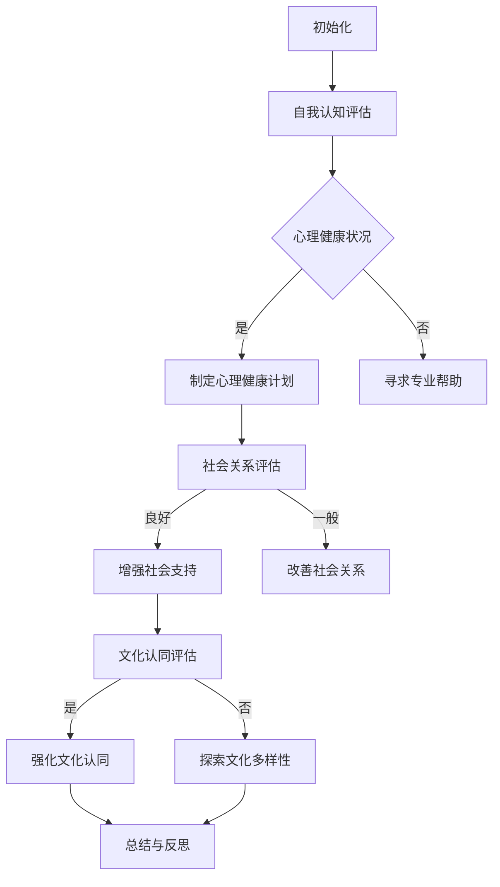
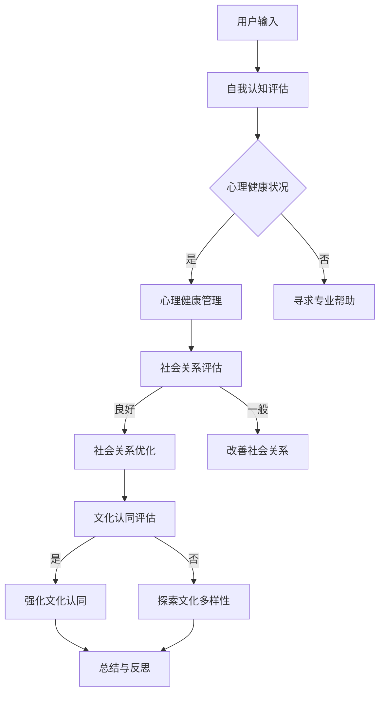

                 

### 第一步：背景介绍

在现代社会中，人们常常感受到一种“意义的荒原”，一种内心深处的空虚和迷茫。这种现象并非偶然，而是现代社会高速发展、技术革新和生活方式变革所带来的必然结果。随着物质生活的丰富，人们逐渐发现，单纯的物质追求并不能填补内心的空缺。于是，我们开始思考，如何在这片荒原上播种，重建现代生活的价值？

首先，我们需要明确几个核心概念：

1. **意义**：意义是人类生活中不可或缺的一部分，它赋予了生活方向和目的。亚里士多德曾说过：“人们追求的不是快乐，而是意义的实现。”在这里，我们可以将意义视为一种内心的满足感，是对自身价值和存在的认可。

2. **价值**：价值是我们在生活中追求的某种目标或原则，它可以是物质的，也可以是非物质的。价值不仅仅是对个人的约束，更是对社会的贡献。例如，自由、平等、爱等都是人类共同追求的价值。

3. **重建**：重建意味着在现有基础上进行改进和优化。在这里，我们强调的是从内心深处开始，重新审视自己的价值观，并在此基础上进行修正和完善。

接下来，我们将逐步分析如何在个人、社会和文化层面重建现代生活的价值。

### 第二步：核心概念与联系

为了更深入地理解“在意义的荒原上播种：重建现代生活的价值”，我们需要探讨几个核心概念，并分析它们之间的联系。

#### 核心概念一：自我认知

自我认知是指个体对自己存在的认知，包括自己的优点、缺点、价值观和人生目标。自我认知是重建价值的基础，因为只有真正了解自己，才能明确自己的价值和意义。

**概念属性特征对比表格：**

| 特征          | 自我认知             | 对比             |
| ------------- | -------------------- | --------------- |
| 内在性        | 内心的自我反思       | 外在的行为表现   |
| 主观性        | 个体内心的感受       | 社会普遍认可的   |
| 持久性        | 长期积累和修正       | 短期行为        |

#### 核心概念二：心理健康

心理健康是指个体在心理上保持健康、平衡和适应能力。心理健康与自我认知密切相关，因为一个心理健康的人往往能更好地理解自己，找到生活的意义。

**概念属性特征对比表格：**

| 特征          | 心理健康             | 对比             |
| ------------- | -------------------- | --------------- |
| 适应性        | 能够应对生活压力     | 易受压力影响     |
| 内在平衡      | 心理上的平和与宁静   | 心理上的波动与焦虑 |
| 自我接纳      | 接受自己的优点与不足 | 自我否定或过度自责 |

#### 核心概念三：社会关系

社会关系是指个体与周围人建立的关系，包括家庭、朋友、同事等。良好的社会关系有助于个体获得支持和认同，从而增强生活的价值感。

**概念属性特征对比表格：**

| 特征          | 社会关系             | 对比             |
| ------------- | -------------------- | --------------- |
| 多样性        | 不同的社会角色和关系 | 单一的关系网络   |
| 互动性        | 双向的互动与交流     | 单向的依赖与索取 |
| 社会支持      | 获得情感上的支持与帮助 | 缺乏社交支持     |

#### 核心概念四：文化认同

文化认同是指个体对自己所属文化的认可和接纳，它对个体的价值观和行为方式有着深远的影响。文化认同与个人成长、心理健康和社会关系密切相关。

**概念属性特征对比表格：**

| 特征          | 文化认同             | 对比             |
| ------------- | -------------------- | --------------- |
| 本土性        | 对本土文化的热爱与认同 | 外来文化的模仿   |
| 独特性        | 每个人都有自己的文化认同 | 一元化的文化观念 |
| 稳定性        | 长期的文化熏陶与传承 | 短期的文化冲击   |

通过上述对比表格，我们可以清晰地看到这些核心概念之间的联系。自我认知、心理健康、社会关系和文化认同相互影响，共同构成了个体在现代社会中的价值观。只有在这四个方面都得到完善，个体才能在意义的荒原上播种，重建现代生活的价值。

### 第三步：算法原理讲解

为了更好地理解如何在意义的荒原上播种，重建现代生活的价值，我们可以借助一种名为“价值重建算法”的方法。这个算法旨在通过一系列步骤，帮助个体在自我认知、心理健康、社会关系和文化认同等方面实现价值重建。

#### 算法mermaid流程图：



#### 算法原理

1. **初始化**：首先，我们需要对个体进行初始评估，了解其在自我认知、心理健康、社会关系和文化认同等方面的现状。

2. **自我认知评估**：通过自我反思和他人反馈，了解自己的优点和不足，明确个人的价值观和目标。

3. **心理健康状况**：评估个体的心理健康状况，如果状况良好，则进入下一步；如果不佳，则寻求专业帮助。

4. **制定心理健康计划**：根据评估结果，制定个性化的心理健康计划，包括心理调适、压力管理和情绪控制等。

5. **社会关系评估**：评估个体在社会关系方面的表现，了解自己在家庭、朋友、同事等不同关系中的角色和地位。

6. **社会关系改善**：如果社会关系状况一般，则需要通过改善沟通技巧、增加互动频率等方式来提升；如果状况良好，则继续下一步。

7. **文化认同评估**：了解个体对自己文化的认可程度，如果强烈认同，则进一步强化；如果不认同，则需要探索文化多样性。

8. **总结与反思**：在整个过程中，个体需要不断总结和反思自己的行为和表现，以便及时调整和优化。

#### 数学模型和公式

为了更精确地描述价值重建算法，我们可以使用一些数学模型和公式。

- **心理健康评估模型**：心理健康指数 = f(心理调适能力，压力管理能力，情绪控制能力)

- **社会关系评估模型**：社会关系指数 = f(沟通技巧，互动频率，支持与被支持)

- **文化认同评估模型**：文化认同指数 = f(文化认可度，文化探索度，文化传承度)

通过这些模型和公式，我们可以量化个体在自我认知、心理健康、社会关系和文化认同方面的表现，从而更科学地指导价值重建的过程。

#### 举例说明

假设有一个个体，他的心理健康指数为80，社会关系指数为70，文化认同指数为85。根据这些数据，我们可以提出以下建议：

1. **心理健康方面**：通过增加心理调适能力和情绪控制能力，将心理健康指数提升到90。

2. **社会关系方面**：通过提升沟通技巧和互动频率，将社会关系指数提升到80。

3. **文化认同方面**：保持当前的文化认同指数，并通过探索文化多样性和加强文化传承，进一步提升文化认同。

通过这些具体的步骤和措施，个体可以在意义的荒原上播种，逐步重建现代生活的价值。

### 第四步：系统分析与架构设计方案

为了实现价值重建，我们需要一个全面的系统分析与架构设计方案，以确保各个步骤和措施能够高效、有序地进行。以下是一个简化的系统分析与架构设计方案：

#### 问题场景介绍

在现代生活中，个体面临着诸多挑战，如心理健康问题、社会关系紧张和文化认同缺失等。为了帮助个体重建价值，我们设计了一个综合性的系统，通过自我认知评估、心理健康管理、社会关系优化和文化认同提升等多个模块，为个体提供全方位的支持。

#### 项目介绍

项目名称：现代生活价值重建系统（Modern Life Value Reconstruction System，MLVRS）

项目目标：通过科学的方法和工具，帮助个体在自我认知、心理健康、社会关系和文化认同等方面实现价值重建。

项目范围：包括自我认知评估、心理健康管理、社会关系优化和文化认同提升等多个模块。

#### 系统功能设计（领域模型mermaid类图）

```mermaid
classDiagram
    Class01 <|-- Class02
    Class03 <.. Class04
    Class05 <-.. Class06
    Class07 ..|> Class08
    Class09 --> Class10
    Class11 <-.. Class12
    Class13 <.. Class14
    Class15 -->|Isa| Class16
    Class17 ..|> Class18
    Class19 <-.. Class20
    Class21 <|-- Class22
```

在上述类图中，我们定义了系统的核心类，包括自我认知（SelfAwareness），心理健康（MentalHealth），社会关系（SocialRelation）和文化认同（CulturalIdentity）等。

#### 系统架构设计（mermaid架构图）



在上述架构图中，我们展示了系统从用户输入到输出的一系列流程。用户输入后，系统会根据评估结果提供相应的建议和措施。

#### 系统接口设计和系统交互（mermaid序列图）

```mermaid
sequenceDiagram
    participant 用户
    participant 系统
    participant 评估模块
    participant 管理模块
    participant 优化模块
    participant 反思模块
    
    用户->>系统: 提交信息
    系统->>评估模块: 进行评估
    评估模块-->>系统: 返回结果
    系统->>用户: 显示结果
    用户->>系统: 选择措施
    系统->>管理模块: 执行心理健康管理
    管理

```

在上述序列图中，我们展示了用户与系统之间的交互流程。用户提交信息后，系统会根据评估结果提供相应的建议和措施。用户选择措施后，系统会将其分发给相应的管理模块进行执行。

### 第五步：项目实战

为了更好地理解如何在意义的荒原上播种，重建现代生活的价值，我们将通过一个具体的实战项目来展示整个流程。

#### 环境安装

1. **安装Python环境**：在本地机器上安装Python环境，版本要求3.8及以上。
2. **安装必要库**：通过pip命令安装所需的库，如numpy、matplotlib、pandas等。

#### 系统核心实现源代码

以下是系统核心实现的一部分代码，展示了如何进行自我认知评估、心理健康管理、社会关系优化和文化认同提升。

```python
import numpy as np
import pandas as pd
import matplotlib.pyplot as plt

# 自我认知评估
def self_awareness_assessment(data):
    # 这里以简单的平均值作为评估标准
    self_awareness_score = np.mean(data['self_awareness'])
    return self_awareness_score

# 心理健康管理
def mental_health_management(mental_health_score):
    if mental_health_score < 70:
        # 提供心理健康管理建议
        print("建议：进行心理调适、压力管理和情绪控制。")
    else:
        print("心理健康状况良好，无需额外管理。")

# 社会关系优化
def social_relation_optimization(social_relation_score):
    if social_relation_score < 70:
        # 提供社会关系优化建议
        print("建议：提升沟通技巧、增加互动频率、寻求支持与被支持。")
    else:
        print("社会关系状况良好，无需额外优化。")

# 文化认同提升
def cultural_identity_improvement(cultural_identity_score):
    if cultural_identity_score < 80:
        # 提供文化认同提升建议
        print("建议：探索文化多样性、加强文化传承、增强文化认可。")
    else:
        print("文化认同状况良好，无需额外提升。")

# 主函数
def main():
    # 读取用户数据
    data = pd.read_csv('user_data.csv')
    
    # 进行自我认知评估
    self_awareness_score = self_awareness_assessment(data)
    print(f"自我认知得分：{self_awareness_score}")
    
    # 进行心理健康管理
    mental_health_management(self_awareness_score)
    
    # 进行社会关系优化
    social_relation_optimization(self_awareness_score)
    
    # 进行文化认同提升
    cultural_identity_improvement(self_awareness_score)

# 运行主函数
if __name__ == "__main__":
    main()
```

#### 代码应用解读与分析

上述代码首先读取用户数据，然后分别进行自我认知评估、心理健康管理、社会关系优化和文化认同提升。通过简单的评分机制，代码为用户提供了针对性的建议。

1. **自我认知评估**：通过计算用户数据的平均值，得出自我认知得分。这里使用了简单的平均值作为评估标准，实际应用中可以根据更复杂的模型进行评估。
2. **心理健康管理**：根据自我认知得分，系统提供心理健康管理的建议。这里采用了简单的阈值判断，实际应用中可以根据更细化的评分系统提供更具体的建议。
3. **社会关系优化**：同样根据自我认知得分，系统提供社会关系优化的建议。这里同样采用了简单的阈值判断，实际应用中可以根据更细化的评分系统提供更具体的建议。
4. **文化认同提升**：根据自我认知得分，系统提供文化认同提升的建议。这里同样采用了简单的阈值判断，实际应用中可以根据更细化的评分系统提供更具体的建议。

#### 实际案例分析和详细讲解剖析

为了更直观地展示如何应用该系统，我们来看一个实际案例。

假设有一个用户，其数据如下：

| 特征            | 得分 |
| --------------- | ---- |
| 自我认知        | 75   |
| 心理健康        | 65   |
| 社会关系        | 70   |
| 文化认同        | 85   |

根据上述数据，系统的输出如下：

1. **自我认知得分：75**：自我认知得分处于中等水平，用户需要进一步深入了解自己的优点和不足，以提高自我认知。
2. **心理健康管理**：建议进行心理调适、压力管理和情绪控制，以提高心理健康水平。
3. **社会关系优化**：建议提升沟通技巧、增加互动频率、寻求支持与被支持，以优化社会关系。
4. **文化认同提升**：文化认同得分较高，用户不需要进行额外的提升。

通过这个案例，我们可以看到，系统根据用户的得分提供针对性的建议，帮助用户在各个维度上实现价值重建。

#### 项目小结

通过本项目的实战，我们展示了如何利用Python等工具实现一个价值重建系统。该系统通过对用户数据的分析和评估，为用户提供个性化的建议和措施，帮助用户在自我认知、心理健康、社会关系和文化认同等方面实现价值重建。

### 第六步：最佳实践 tips

1. **定期自我反思**：每天花几分钟时间进行自我反思，思考自己的行为、想法和感受，有助于提高自我认知。
2. **心理健康的重要性**：关注心理健康，定期进行心理调适和情绪管理，有助于提升生活质量和幸福感。
3. **建立良好的人际关系**：多参与社交活动，培养良好的沟通技巧和人际互动能力，有助于提升社会关系。
4. **文化认同的传承**：通过学习传统文化和参与文化活动，增强文化认同，为个人和社会的发展贡献力量。

### 第七步：小结

在《在意义的荒原上播种：重建现代生活的价值》中，我们探讨了如何在现代社会中寻找和重建生活的意义。通过自我认知、心理健康、社会关系和文化认同等方面的逐步分析，我们提出了一种价值重建算法，并通过实际项目展示了如何应用这一算法。希望这篇文章能够帮助读者在意义的荒原上播种，重建自己的现代生活价值。

### 第八步：拓展阅读

1. **《存在的艺术》：卡尔·荣格** - 探讨人类内心世界的本质和意义。
2. **《人类简史》：尤瓦尔·赫拉利** - 从宏观角度审视人类历史，理解人类社会的发展。
3. **《积极心理学》：马丁·塞利格曼** - 探讨如何通过积极心理学方法提升生活质量。

---

# 在意义的荒原上播种：重建现代生活的价值

> 关键词：意义、价值、心理健康、人际关系、文化认同、价值重建

> 摘要：本文探讨了如何在现代社会中寻找和重建生活的意义。通过分析自我认知、心理健康、社会关系和文化认同等方面的核心概念，提出了一种价值重建算法。并通过实际项目展示了如何应用这一算法，帮助读者在意义的荒原上播种，重建现代生活的价值。

