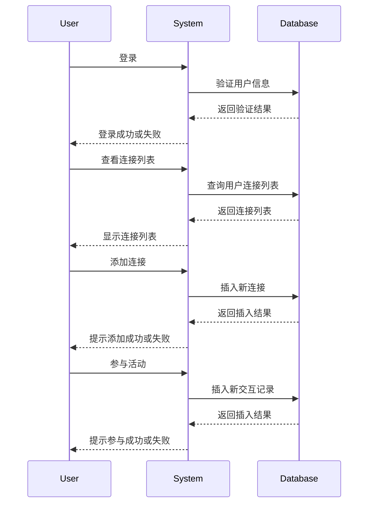
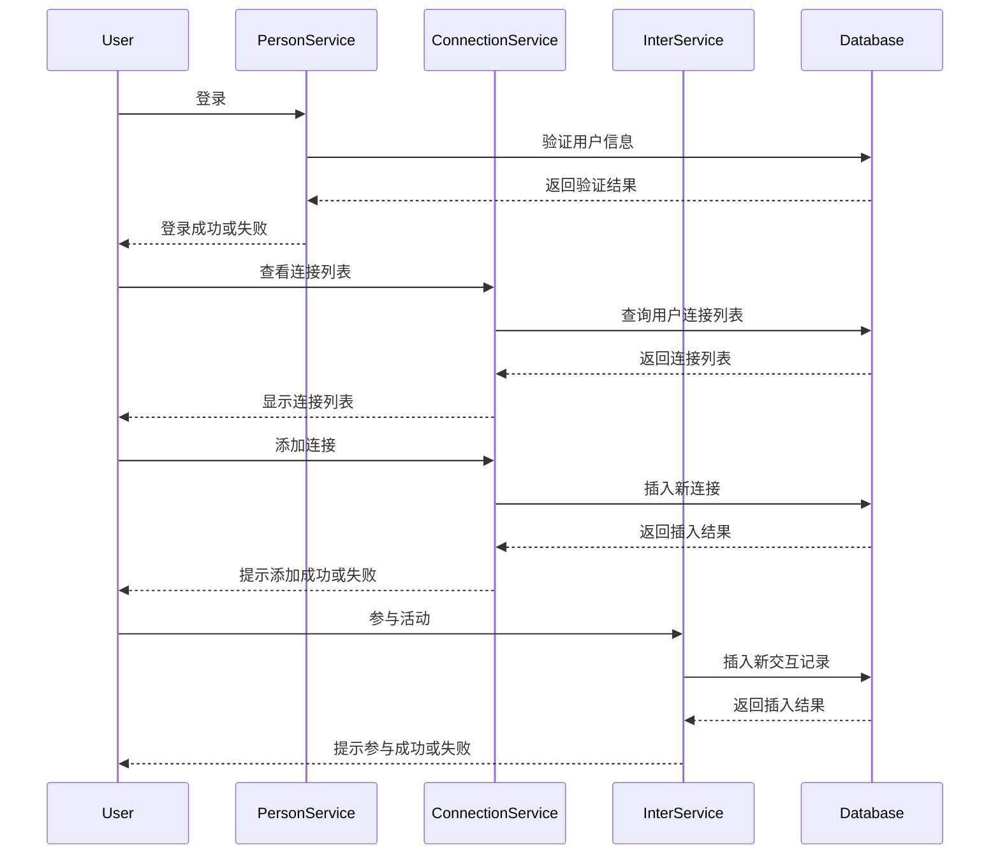

                 

# 在数字化时代寻找真实连接：重建人际关系的意义

## 关键词
数字化时代、人际关系、真实连接、社交媒体、心理健康、沟通技巧、社交网络

## 摘要
在数字化时代，随着社交媒体的广泛应用，人们的人际关系面临着前所未有的挑战。本文将探讨数字化时代人际关系面临的困境，分析真实连接的概念与属性，并提出建立真实连接的方法与策略。通过深入分析，本文旨在为读者提供在数字化时代重建人际关系的意义与方法，为提升心理健康和生活质量提供有益的参考。

### 目录大纲

1. 背景介绍与核心概念
2. 数字化时代的社会现象
3. 真实连接的概念与属性
4. 真实连接的意义与价值
5. 建立真实连接的方法与策略
6. 真实连接在实践中的应用
7. 结论与展望

### 第一部分：背景介绍与核心概念

#### 问题背景与核心概念

1. **数字化时代的问题**

随着信息技术的飞速发展，数字化时代已经到来。人们的生活、工作和社交方式发生了翻天覆地的变化。然而，数字化时代也带来了一系列的问题，尤其是人际关系方面。首先，社交媒体的普及使得人们能够轻松地与他人建立联系，但同时也使得这种联系变得更加表面化和短暂。其次，数字化工具的依赖导致人们面对面交流的机会减少，沟通技巧的退化成为一个普遍现象。此外，人们在数字世界中的匿名性也使得道德和诚信问题日益突出。

2. **人际关系的困境**

在数字化时代，人际关系面临着诸多困境。首先，社交媒体的利与弊使得人们在现实生活中的社交能力逐渐退化。其次，虚拟社交的便捷性使得人们更容易忽视真实的人际关系，导致人际关系的疏离。此外，数字化工具的滥用也使得人们更容易陷入孤独和焦虑。

3. **真实连接的意义**

在数字化时代，重建真实连接具有重要意义。首先，真实连接有助于提升个人的心理健康。通过建立和维护真实的人际关系，人们能够获得情感支持，减轻压力，提升幸福感。其次，真实连接有助于提升个人的社交能力和沟通技巧。通过面对面的交流，人们能够更好地理解他人的需求和感受，从而建立更深层次的联系。最后，真实连接有助于构建更加健康和可持续的社交网络，促进社会的和谐发展。

#### 数字化时代的社会现象

1. **数字化社会的兴起**

数字化社会的兴起带来了许多新的社交方式。首先，社交媒体成为人们交流的重要平台。通过社交媒体，人们可以轻松地与朋友、家人和同事保持联系。然而，社交媒体的普及也带来了一些问题，如隐私泄露、信息过载和虚假信息传播等。

2. **社交媒体的利与弊**

社交媒体的利在于它使得人们能够更方便地与他人交流，扩大社交圈，获取信息和资源。然而，社交媒体的弊在于它容易导致人际关系的疏离，增加孤独感和焦虑感。此外，社交媒体上的虚假信息和恶意评论也容易对人们的心理健康产生负面影响。

3. **人际关系的疏离**

在数字化时代，人际关系的疏离成为一个普遍现象。首先，虚拟社交的便捷性使得人们更容易忽视现实中的社交活动。其次，人们在虚拟世界中的匿名性使得他们更容易对他人进行攻击和诋毁，导致人际关系的恶化。此外，数字化工具的依赖也使得人们面对面交流的机会减少，进一步加剧了人际关系的疏离。

### 真实连接的概念与属性

1. **真实连接的定义**

真实连接是指建立在相互理解、尊重和信任基础上的深层次人际交往。与虚拟连接不同，真实连接注重人与人之间的实际互动和情感交流，而非仅仅依赖于文字、图片或视频等虚拟媒介。

2. **真实连接的属性**

真实连接具有以下属性：

- **深度**：真实连接强调深层次的交流和相互理解，不仅仅是表面的互动。
- **真实性**：真实连接强调互动的真实性和真诚性，而非虚假或表面的互动。
- **持续性与稳定性**：真实连接是持久和稳定的，能够在时间和空间上保持联系。
- **相互性**：真实连接是相互的，不仅仅是单方面的付出，而是双方都能获得满足和成长。

3. **真实连接与虚拟连接的对比**

| 属性 | 真实连接 | 虚拟连接 |
| ---- | ------- | ------- |
| 定位 | 物理、现实 | 网络虚拟 |
| 互动 | 面对面、深度 | 文字、浅层 |
| 感受 | 身心共鸣、真实 | 轻松、表面 |
| 影响 | 深远、持久 | 短暂、有限 |

#### 真实连接的意义与价值

1. **真实连接在个人层面的意义**

真实连接对个人具有重要意义。首先，真实连接有助于提升个人的心理健康。通过建立和维护真实的人际关系，人们能够获得情感支持，减轻压力，提升幸福感。其次，真实连接有助于提升个人的社交能力和沟通技巧。通过面对面的交流，人们能够更好地理解他人的需求和感受，从而建立更深层次的联系。此外，真实连接有助于增强个人的自尊和自信心，使人更加积极地面对生活。

2. **真实连接在工作与职业发展中的价值**

真实连接在工作与职业发展中同样具有重要意义。首先，真实连接有助于建立和维护良好的职场关系，促进团队合作和沟通。通过建立真实的人际关系，人们能够更好地理解同事的需求和期望，从而提高工作效率和质量。其次，真实连接有助于提升个人的职业发展机会。在职场中，建立真实连接可以使人更容易获得他人的信任和支持，从而提升职业声誉和地位。

3. **真实连接在社交与心理健康中的作用**

真实连接在社交与心理健康方面发挥着重要作用。首先，真实连接有助于增强个人的社交网络。通过建立和维护真实的人际关系，人们能够扩大社交圈，结识更多的朋友和同事。其次，真实连接有助于提升个人的心理健康。通过建立真实连接，人们能够获得情感支持，减轻压力，提高幸福感。此外，真实连接还有助于预防孤独感和焦虑感，促进心理健康的发展。

### 第二部分：数字化时代的社会现象

#### 数字化社会的兴起

数字化社会的兴起对人们的生活和社交产生了深远的影响。首先，数字化技术的广泛应用使得信息传播更加迅速和便捷。人们可以通过互联网随时随地获取各种信息，从而拓宽了视野，提高了知识水平。其次，数字化社会促进了电子商务和在线教育等新兴行业的发展，改变了人们的消费和生活方式。此外，数字化社会还推动了智能城市和智慧医疗等领域的创新，提高了社会运行效率和生活质量。

然而，数字化社会的兴起也带来了一些负面影响。首先，数字化工具的依赖使得人们面对面交流的机会减少，沟通技巧的退化成为一个普遍现象。其次，数字化社会的匿名性使得道德和诚信问题日益突出，虚假信息和恶意评论的传播对人们的心理健康产生了负面影响。此外，数字化社会的信息过载问题也使得人们容易陷入焦虑和压力之中。

#### 社交媒体的利与弊

社交媒体在数字化社会中扮演着重要角色，既带来了诸多便利，也引发了不少问题。

1. **社交媒体的利**

社交媒体的利在于它使得人们能够更方便地与他人交流，扩大社交圈，获取信息和资源。通过社交媒体，人们可以随时随地与朋友、家人和同事保持联系，分享生活点滴，增进感情。此外，社交媒体还为人们提供了一个展示自我、表达观点和获得认同的平台，有助于提升个人自信和自尊。

2. **社交媒体的弊**

然而，社交媒体的弊也是不可忽视的。首先，社交媒体的虚拟性和匿名性使得人际关系的疏离成为一个普遍现象。人们在社交媒体上的互动往往更加表面化和短暂，缺乏深层次的交流和情感共鸣。其次，社交媒体上的虚假信息和恶意评论容易对人们的心理健康产生负面影响，增加孤独感和焦虑感。此外，社交媒体的依赖还可能导致人们的现实社交能力下降，影响人际关系。

#### 人际关系的疏离

在数字化时代，人际关系的疏离成为一个普遍现象。首先，虚拟社交的便捷性使得人们更容易忽视现实中的社交活动。人们在社交媒体上花费大量时间，却忽略了与亲朋好友面对面的交流。这种虚拟社交的过度依赖导致了现实人际关系的疏离。

其次，数字化工具的滥用也加剧了人际关系的疏离。人们在网络世界中匿名性较高，更容易对他人进行攻击和诋毁，导致人际关系的恶化。此外，数字化工具的依赖使得人们面对面交流的机会减少，进一步加剧了人际关系的疏离。

### 第三部分：真实连接的概念与属性

#### 真实连接的定义

真实连接是指建立在相互理解、尊重和信任基础上的深层次人际交往。它强调人与人之间的实际互动和情感交流，而非仅仅依赖于文字、图片或视频等虚拟媒介。真实连接注重人与人之间的心灵碰撞和情感共鸣，能够带来更深层次的交流和情感满足。

#### 真实连接的属性

1. **深度**

真实连接强调深层次的交流和相互理解，不仅仅是表面的互动。在真实连接中，人们愿意分享内心的想法和感受，愿意倾听他人的故事和需求。这种深层次的交流有助于建立更加稳固和持久的人际关系。

2. **真实性**

真实连接强调互动的真实性和真诚性，而非虚假或表面的互动。在真实连接中，人们真诚地表达自己的想法和感受，尊重他人的观点和需求。这种真实性的互动能够增进人与人之间的信任和理解。

3. **持续性与稳定性**

真实连接是持续性和稳定的，能够在时间和空间上保持联系。尽管在数字化时代，人们的生活节奏加快，但真实连接能够帮助人们在忙碌的生活中保持与他人的联系。通过定期交流和相互支持，真实连接能够持续发展和巩固。

4. **相互性**

真实连接是相互的，不仅仅是单方面的付出，而是双方都能获得满足和成长。在真实连接中，人们愿意为对方付出时间和精力，共同分享快乐和困难。这种相互性的互动有助于建立更加健康和和谐的社交网络。

#### 真实连接与虚拟连接的对比

| 属性 | 真实连接 | 虚拟连接 |
| ---- | ------- | ------- |
| 定位 | 物理、现实 | 网络虚拟 |
| 互动 | 面对面、深度 | 文字、浅层 |
| 感受 | 身心共鸣、真实 | 轻松、表面 |
| 影响 | 深远、持久 | 短暂、有限 |

### 第四部分：真实连接的意义与价值

#### 真实连接在个人层面的意义

真实连接对个人具有重要意义。首先，真实连接有助于提升个人的心理健康。通过建立和维护真实的人际关系，人们能够获得情感支持，减轻压力，提升幸福感。其次，真实连接有助于提升个人的社交能力和沟通技巧。通过面对面的交流，人们能够更好地理解他人的需求和感受，从而建立更深层次的联系。此外，真实连接有助于增强个人的自尊和自信心，使人更加积极地面对生活。

1. **心理健康**

在数字化时代，心理健康问题日益突出。真实连接能够为个人提供情感支持，减轻心理压力。通过与亲朋好友建立真实连接，人们能够分享自己的快乐和困难，获得理解和支持。这种情感上的支持有助于减轻焦虑和抑郁情绪，提升心理健康。

2. **社交能力与沟通技巧**

真实连接有助于提升个人的社交能力和沟通技巧。通过面对面的交流，人们能够更好地观察和理解他人的表情、语调和身体语言。这种直接的交流方式能够帮助人们更好地理解他人的需求和感受，从而提高社交能力和沟通技巧。

3. **自尊与自信心**

真实连接有助于增强个人的自尊和自信心。在真实连接中，人们能够获得他人的认可和尊重，从而提升自尊。此外，通过与他人建立真实连接，人们能够更好地了解自己的价值和优点，增强自信心，更加积极地面对生活。

#### 真实连接在工作与职业发展中的价值

真实连接在工作与职业发展中同样具有重要意义。首先，真实连接有助于建立和维护良好的职场关系，促进团队合作和沟通。通过建立真实的人际关系，人们能够更好地理解同事的需求和期望，从而提高工作效率和质量。其次，真实连接有助于提升个人的职业发展机会。在职场中，建立真实连接可以使人更容易获得他人的信任和支持，从而提升职业声誉和地位。

1. **职场关系**

在职场中，建立真实连接有助于建立和维护良好的职场关系。通过真实连接，人们能够更好地理解同事的需求和期望，增进彼此之间的信任和尊重。这种良好的职场关系有助于提高团队合作效率，促进事业的发展。

2. **职业发展机会**

真实连接有助于提升个人的职业发展机会。在职场中，建立真实连接可以使人更容易获得他人的信任和支持。这种信任和支持能够为个人的职业发展提供有力支持，帮助人们更好地实现职业目标。

3. **职业声誉与地位**

通过建立真实连接，人们能够提升职业声誉和地位。在职场中，建立真实连接意味着能够更好地履行职责，赢得他人的尊重和认可。这种尊重和认可有助于提升个人的职业声誉和地位，为未来的职业发展打下坚实基础。

#### 真实连接在社交与心理健康中的作用

真实连接在社交与心理健康方面发挥着重要作用。首先，真实连接有助于增强个人的社交网络。通过建立和维护真实的人际关系，人们能够扩大社交圈，结识更多的朋友和同事。其次，真实连接有助于提升个人的心理健康。通过建立真实连接，人们能够获得情感支持，减轻压力，提高幸福感。此外，真实连接还有助于预防孤独感和焦虑感，促进心理健康的发展。

1. **社交网络**

真实连接有助于增强个人的社交网络。通过建立和维护真实的人际关系，人们能够扩大社交圈，结识更多的朋友和同事。这种广泛的社交网络有助于个人在工作和生活中获得更多的资源和机会。

2. **心理健康**

真实连接有助于提升个人的心理健康。通过建立真实连接，人们能够获得情感支持，减轻压力，提高幸福感。此外，真实连接还有助于预防孤独感和焦虑感，促进心理健康的发展。

3. **预防孤独感和焦虑感**

真实连接有助于预防孤独感和焦虑感。通过建立真实连接，人们能够获得情感支持，减轻心理压力。这种情感上的支持有助于提升个人的心理健康水平，预防孤独感和焦虑感的出现。

### 第五部分：建立真实连接的方法与策略

#### 自我认知与反思

建立真实连接的第一步是进行自我认知和反思。通过深入了解自己的需求和感受，人们能够更好地理解他人，从而建立真实连接。以下是一些方法可以帮助人们进行自我认知和反思：

1. **反思过去的经历**

通过反思过去的经历，人们能够了解自己在不同情境下的需求和反应。这种反思有助于人们更好地理解自己的内心世界，从而在建立真实连接时更加自信和真实。

2. **记录日常感受**

记录日常感受有助于人们了解自己的情绪变化和需求。通过记录，人们能够发现自己在不同情境下的需求和反应模式，从而更好地调整自己的行为和态度。

3. **培养自我意识**

培养自我意识有助于人们更好地认识自己的内心世界。通过自我观察和反思，人们能够发现自己的优点和缺点，从而在建立真实连接时更加自信和真实。

#### 沟通技巧与艺术

建立真实连接的关键在于有效的沟通技巧。以下是一些沟通技巧和方法，可以帮助人们更好地与他人建立真实连接：

1. **倾听他人**

倾听他人是建立真实连接的重要技巧。通过倾听他人，人们能够更好地理解他人的需求和感受，从而建立深层次的联系。倾听他人不仅意味着听他们说什么，还包括理解他们的语气、情感和需求。

2. **表达真实感受**

表达真实感受是建立真实连接的关键。人们应该学会坦诚地表达自己的需求和感受，而不是压抑或隐藏。这种真实表达有助于建立信任和尊重，从而促进深层次的连接。

3. **非语言沟通**

非语言沟通在建立真实连接中起着重要作用。通过眼神、微笑、肢体动作等非语言手段，人们能够更好地传达自己的情感和需求。这种非语言沟通有助于增强真实连接的效果。

#### 社交网络中的真实连接

在数字化时代，社交网络成为了建立和维护人际关系的重要平台。以下是一些策略和方法，可以帮助人们在社交网络中建立真实连接：

1. **选择合适的社交平台**

不同的社交平台适合不同类型的人际关系。人们应该选择适合自己的社交平台，例如专业社交平台、社交媒体或兴趣小组等，从而更好地建立和维护真实连接。

2. **积极参与社交活动**

在社交网络中积极参与社交活动，例如加入兴趣小组、参与线上讨论等，有助于扩大社交圈，结识更多的朋友。这些社交活动为建立真实连接提供了机会。

3. **保持真诚与真实**

在社交网络中，人们应该保持真诚和真实，避免虚假和表面的互动。通过真诚地表达自己的需求和感受，人们能够建立真实连接，增强人际关系的质量。

### 第六部分：真实连接在实践中的应用

#### 家庭与亲密关系

家庭与亲密关系是真实连接的重要应用场景。在家庭中，建立真实连接有助于增进家庭成员之间的相互理解和信任，从而提升家庭关系的质量。以下是一些策略和方法：

1. **定期沟通**

定期沟通是建立家庭真实连接的重要方式。家庭成员应该定期进行面对面的沟通，分享彼此的想法、感受和需求。这种定期沟通有助于增进彼此的了解和信任。

2. **倾听与理解**

在家庭沟通中，倾听和理解至关重要。家庭成员应该学会倾听对方的意见和感受，并试图理解对方的立场和需求。这种倾听和理解有助于建立真实连接，提升家庭关系的质量。

3. **共同活动**

共同活动是建立家庭真实连接的有效方式。家庭成员可以一起参加各种活动，如旅行、运动或烹饪等。这些共同活动有助于增进彼此之间的互动和沟通，从而建立真实连接。

#### 朋友与社交圈

在朋友和社交圈中，建立真实连接同样具有重要意义。以下是一些策略和方法，可以帮助人们在社交圈中建立和维护真实连接：

1. **深度交流**

深度交流是建立朋友关系的重要方式。人们应该与朋友进行深层次的交流，分享彼此的想法、感受和经历。这种深度交流有助于建立真实连接，提升朋友关系的质量。

2. **信任与支持**

信任和支持是建立真实连接的关键。朋友之间应该互相信任，并在需要时提供支持和帮助。这种信任和支持有助于建立稳固和持久的朋友关系。

3. **共同兴趣**

共同兴趣是建立社交圈的重要基础。人们可以参加各种兴趣小组或活动，结识志同道合的朋友。这些共同兴趣有助于建立真实连接，扩大社交圈。

#### 职场关系

在职场中，建立真实连接有助于提高团队合作效率和职业发展。以下是一些策略和方法，可以帮助人们在职场中建立真实连接：

1. **开放沟通**

开放沟通是建立职场真实连接的重要方式。职场中，人们应该学会坦诚地表达自己的意见和感受，并倾听他人的意见和反馈。这种开放沟通有助于建立信任和理解，提升职场关系的质量。

2. **相互尊重**

相互尊重是建立职场真实连接的基础。职场中，人们应该尊重他人的观点和需求，避免冲突和误解。这种相互尊重有助于建立和谐的工作环境，提升团队合作效率。

3. **共同目标**

共同目标是建立职场真实连接的重要驱动力。职场中，人们应该共同制定目标和计划，并共同努力实现这些目标。这种共同目标有助于增强团队合作意识，提升职场关系的质量。

### 第七部分：结论与展望

#### 总结

本文探讨了在数字化时代重建人际关系的意义和方法。通过分析数字化时代的人际关系困境和真实连接的概念与属性，本文提出了一系列建立真实连接的方法与策略。这些方法包括自我认知与反思、沟通技巧与艺术，以及社交网络中的真实连接等。通过实践这些方法，人们可以重建真实的人际关系，提升心理健康和生活质量。

#### 展望未来

展望未来，随着数字化技术的不断进步，人们的人际关系将面临更多的挑战和机遇。建立真实连接将成为一个越来越重要的任务。本文呼吁人们关注人际关系，积极寻求真实连接，以应对数字化时代带来的挑战。同时，本文也期待未来能够有更多的研究和实践，为重建人际关系提供更有效的策略和方法。

### 附录

#### ER图

```mermaid
erDiagram
  Person --> Connection
  {
    Person1 : Connection1
    Person2 : Connection2
  }
  Person ||--|{ Relationship }|
  {
    Person1 : Relationship1
    Person2 : Relationship2
  }
  Person ||--|{ Impression }|
  {
    Person1 : Impression1
    Person3 : Impression2
  }
```

#### 属性对比表格

| 属性 | 真实连接 | 虚拟连接 |
| ---- | ------- | ------- |
| 定位 | 物理、现实 | 网络虚拟 |
| 互动 | 面对面、深度 | 文字、浅层 |
| 感受 | 身心共鸣、真实 | 轻松、表面 |
| 影响 | 深远、持久 | 短暂、有限 |

#### 数学模型与公式

$$
满意程度 = \frac{互动深度 + 感受真实度}{总评分}
$$

#### Python 源代码示例

```python
def calculate_satisfaction(interaction_depth, feeling_truth):
    total_score = interaction_depth + feeling_truth
    satisfaction = total_score / 2
    return satisfaction

# 示例数据
interaction_depth = 8
feeling_truth = 7

# 计算满意程度
satisfaction = calculate_satisfaction(interaction_depth, feeling_truth)

print("满意程度：", satisfaction)
```

### 作者信息

**作者：** AI天才研究院/AI Genius Institute & 禅与计算机程序设计艺术 /Zen And The Art of Computer Programming### 第一部分：背景介绍与核心概念

在数字化时代，人们的社交方式和生活习惯发生了翻天覆地的变化。社交媒体的普及、移动设备的广泛使用以及互联网的普及，使得人们能够以更加便捷的方式与他人沟通和交流。然而，这些数字化工具虽然为人们带来了便利，却也带来了诸多挑战。其中，最引人关注的问题之一就是人际关系的疏离。

#### 1.1 数字化时代的问题

数字化时代的问题主要集中在以下几个方面：

1. **虚拟社交与现实社交的脱节**：在虚拟社交平台上，人们可以轻松地结识新朋友，然而，这些虚拟关系往往缺乏深度和真实性，难以替代现实中的面对面交流。
2. **信息过载和隐私泄露**：数字化时代的信息量巨大，人们常常感到信息过载，难以消化和处理。同时，隐私问题也日益严重，个人信息容易被不法分子获取和利用。
3. **沟通技巧的退化**：随着社交媒体的普及，人们的沟通方式逐渐从面对面的交流转向文字、图片和视频等虚拟媒介。这种沟通方式虽然便捷，但往往缺乏情感和细节，导致沟通效果大打折扣。

#### 1.2 人际关系的困境

在数字化时代，人际关系面临着诸多困境：

1. **人际关系的疏离**：由于虚拟社交的便捷性，人们更容易忽视现实中的社交活动，导致人际关系的疏离和疏远。
2. **社交技巧的退化**：长期依赖虚拟社交工具，人们的面对面沟通技巧逐渐退化，难以有效地进行深度交流和情感共鸣。
3. **信任危机**：在虚拟社交环境中，由于匿名性和信息不对称，人们更容易产生信任危机，导致人际关系的不稳定。

#### 1.3 真实连接的意义

在面对这些困境时，重建真实连接显得尤为重要。真实连接不仅是指人与人之间的实际互动和情感交流，更是一种建立在相互理解、尊重和信任基础上的深层次人际交往。在数字化时代，重建真实连接具有以下意义：

1. **提升心理健康**：通过建立真实连接，人们能够获得情感支持，减轻心理压力，提高幸福感。
2. **增强社交能力**：真实连接有助于提升个人的社交能力和沟通技巧，使人更好地理解他人的需求和感受。
3. **促进社会和谐**：真实连接有助于构建更加健康和可持续的社交网络，促进社会的和谐发展。

#### 1.4 数字化时代的人际关系挑战

1. **虚拟社交与现实社交的冲突**：虚拟社交虽然便捷，但往往难以替代现实中的面对面交流。在数字化时代，人们需要在虚拟社交和现实社交之间找到平衡，以维持健康的人际关系。
2. **隐私保护和信息安全**：在数字化时代，保护个人隐私和信息安全成为一个重要问题。人们需要学会如何保护自己的个人信息，避免被不法分子利用。
3. **应对信息过载**：在数字化时代，信息量巨大，人们需要学会如何筛选和处理信息，避免被信息过载所困扰。

#### 1.5 真实连接的重要性

在数字化时代，重建真实连接具有重要意义。首先，真实连接有助于提升个人的心理健康。通过建立和维护真实的人际关系，人们能够获得情感支持，减轻压力，提高幸福感。其次，真实连接有助于提升个人的社交能力和沟通技巧。通过面对面的交流，人们能够更好地理解他人的需求和感受，从而建立更深层次的联系。最后，真实连接有助于构建更加健康和可持续的社交网络，促进社会的和谐发展。

#### 1.6 数字化时代人际关系的趋势

1. **社交方式的多元化**：在数字化时代，人们可以选择多种方式进行社交，包括线上和线下、面对面的交流和虚拟交流等。这种多元化的社交方式有助于人们在不同情境下建立和维护人际关系。
2. **社交圈层的分化**：在数字化时代，社交圈层逐渐分化，人们更容易与志同道合的人建立深入联系，同时，也更容易忽视传统社交圈层中的关系。
3. **社交媒体的影响力**：社交媒体在数字化时代发挥着越来越重要的作用，成为人们交流、分享和获取信息的重要平台。然而，社交媒体的利与弊也日益显现，需要人们谨慎对待。

#### 1.7 结论

在数字化时代，重建真实连接是一个重要的挑战和机遇。通过深入理解数字化时代的人际关系困境和真实连接的意义，我们可以采取一系列方法来重建和维持真实的人际关系。这不仅是个人心理健康的需求，也是社会和谐发展的需要。在接下来的章节中，我们将进一步探讨数字化时代的社会现象，以及如何建立和维护真实连接。

### 第二部分：数字化时代的社会现象

#### 2.1 数字化社会的兴起

随着信息技术的飞速发展，数字化社会已经悄然而至。在这个新的时代背景下，人们的生活方式、工作方式和社会结构都发生了深刻的变化。数字化社会的兴起不仅改变了人们的社交方式，也对人际关系产生了深远的影响。

首先，互联网的普及使得信息传播更加迅速和便捷。人们可以随时随地通过互联网获取各种信息，无论是新闻、娱乐还是学术资料，都可以在瞬间获取。这种信息传播的便捷性极大地丰富了人们的生活内容，同时也提高了社会的运行效率。

其次，移动设备的广泛使用改变了人们的社交方式。智能手机、平板电脑等移动设备使得人们可以随时随地进行社交活动。无论是通过社交媒体、即时通讯工具还是在线游戏，人们都可以方便地与他人保持联系。这种随时随地的社交方式不仅增加了人们的社交机会，也缩短了人与人之间的距离。

此外，大数据和人工智能技术的发展为数字化社会带来了更多的可能性。通过大数据分析，人们可以更准确地了解用户的需求和偏好，从而提供更加个性化的服务和产品。而人工智能的应用则使得许多工作更加高效和智能化，从而释放了更多的时间和精力，让人们有更多的时间和机会进行社交活动。

#### 2.2 社交媒体的利与弊

社交媒体在数字化社会中扮演着重要角色，既带来了诸多便利，也引发了不少问题。

1. **社交媒体的利**

社交媒体的利在于它使得人们能够更方便地与他人交流，扩大社交圈，获取信息和资源。通过社交媒体，人们可以随时随地与朋友、家人和同事保持联系，分享生活点滴，增进感情。此外，社交媒体还为人们提供了一个展示自我、表达观点和获得认同的平台，有助于提升个人自信和自尊。

2. **社交媒体的弊**

然而，社交媒体的弊也是不可忽视的。首先，社交媒体的虚拟性和匿名性使得人际关系的疏离成为一个普遍现象。人们在社交媒体上的互动往往更加表面化和短暂，缺乏深层次的交流和情感共鸣。其次，社交媒体上的虚假信息和恶意评论容易对人们的心理健康产生负面影响，增加孤独感和焦虑感。此外，社交媒体的依赖还可能导致人们的现实社交能力下降，影响人际关系。

#### 2.3 人际关系的疏离

在数字化时代，人际关系的疏离成为一个普遍现象。首先，虚拟社交的便捷性使得人们更容易忽视现实中的社交活动。人们在社交媒体上花费大量时间，却忽略了与亲朋好友面对面的交流。这种虚拟社交的过度依赖导致了现实人际关系的疏离。

其次，数字化工具的滥用也加剧了人际关系的疏离。人们在网络世界中匿名性较高，更容易对他人进行攻击和诋毁，导致人际关系的恶化。此外，数字化工具的依赖使得人们面对面交流的机会减少，进一步加剧了人际关系的疏离。

#### 2.4 社交媒体对人际关系的负面影响

1. **虚拟社交的表面化**

在社交媒体上，人们的互动往往更加表面化。人们更倾向于分享生活的片段，如美食、旅行照片等，而较少分享内心的真实感受和想法。这种表面化的互动导致人际关系变得浅薄，难以建立深层次的连接。

2. **匿名性的负面影响**

社交媒体的匿名性使得人们更容易对他人进行攻击和诋毁。在虚拟世界中，人们往往可以隐藏自己的真实身份，从而滥用言论自由。这种行为不仅损害了人际关系，还可能对受害者造成严重的心理创伤。

3. **信息过载和分心**

社交媒体上的信息量巨大，人们常常感到信息过载。这种信息过载会导致人们分心，难以集中精力进行深度思考和有意义的交流。此外，社交媒体上的信息也容易分散人们的注意力，导致现实生活中的社交活动减少。

#### 2.5 社交媒体与传统人际关系的差异

1. **互动方式的差异**

在传统人际关系中，人们的互动往往更加直接和真实。通过面对面的交流，人们可以更好地观察和理解对方的情感和需求。而在社交媒体上，人们的互动更多依赖于文字、图片和视频等虚拟媒介，这种方式往往缺乏情感和细节，难以达到传统人际交流的效果。

2. **关系的深度与稳定性**

在传统人际关系中，建立和维护关系需要时间和投入。人们需要通过面对面的交流，逐渐了解和信任对方，从而建立深厚的友谊。而在社交媒体上，人们可以轻易地结识新朋友，但这些关系往往缺乏深度和稳定性，难以在长期内保持。

3. **隐私和信任问题**

在社交媒体上，个人隐私和安全问题日益突出。由于信息传播的广泛性和不可控性，人们的个人信息容易被泄露和滥用。此外，社交媒体上的虚假信息和恶意评论也容易损害人们的信任，导致人际关系的不稳定。

#### 2.6 结论

数字化社会的兴起带来了诸多便利，但同时也带来了人际关系的疏离和挑战。通过深入分析社交媒体的利与弊，以及虚拟社交与传统人际关系的差异，我们可以更好地理解数字化时代的人际关系现状。在接下来的章节中，我们将进一步探讨真实连接的概念与属性，以及如何通过建立真实连接来改善人际关系。

### 第三部分：真实连接的概念与属性

#### 3.1 真实连接的定义

真实连接是指建立在相互理解、尊重和信任基础上的深层次人际交往。它不仅涉及人与人之间的情感交流，更是一种心灵深处的碰撞和共鸣。在数字化时代，真实连接显得尤为重要，因为它是克服人际关系疏离和提升心理健康的关键。

真实连接的定义可以从以下几个方面进行理解：

1. **深度与真实性**：真实连接强调互动的深度和真实性。与虚拟连接不同，真实连接不仅仅停留在表面层次，而是深入到个体的内心世界。它要求人们能够真诚地表达自己的感受和需求，同时理解和尊重他人的情感和需求。

2. **情感共鸣**：真实连接强调情感上的共鸣。在真实连接中，人们能够体验到与他人的情感共鸣，感受到彼此的关怀和支持。这种情感共鸣有助于建立深厚的人际关系，提升个人的幸福感和满足感。

3. **信任与尊重**：真实连接建立在信任和尊重的基础上。信任是真实连接的基石，它使人们愿意敞开心扉，与他人分享自己的内心世界。尊重则是真实连接的重要保障，它确保每个人在互动中都能感受到被尊重和认可。

#### 3.2 真实连接的属性

真实连接具有以下几个关键属性：

1. **互动的深度**：真实连接强调深层次的互动。这种互动不仅仅停留在表面的交流，而是涉及到个人的内心体验和情感表达。在真实连接中，人们能够深入探讨彼此的兴趣、需求和梦想，从而建立更深层次的联系。

2. **真实性**：真实连接要求互动的真实性。在真实连接中，人们能够真诚地表达自己的想法和感受，而不是隐藏或伪装。这种真实性有助于建立信任，增强人际关系的稳定性和深度。

3. **持续性与稳定性**：真实连接是持续性和稳定的。它不仅仅是短暂的互动，而是能够在长期内保持的联系。通过定期的交流和相互支持，真实连接能够不断巩固和发展，成为人们生活中重要的一部分。

4. **相互性**：真实连接是相互的。在真实连接中，不仅仅是单方面的付出，而是双方都能获得满足和成长。这种相互性有助于建立健康和和谐的社交网络，促进个人的全面发展。

#### 3.3 真实连接与虚拟连接的对比

真实连接与虚拟连接在多个方面存在显著差异：

1. **定位**：真实连接发生在现实生活中，是面对面或近距离的互动；而虚拟连接则发生在网络虚拟空间中，是通过文字、图片、视频等媒介进行的互动。

2. **互动方式**：真实连接强调深层次的面对面交流，包括语言、表情、身体语言等多方面的互动；虚拟连接则依赖于文字、图片、视频等媒介，互动方式相对单一。

3. **感受**：真实连接带来的感受是真实、深刻的，能够产生情感共鸣和心灵碰撞；虚拟连接的感受则相对表面，难以产生深层次的情感共鸣。

4. **影响**：真实连接的影响是深远和持久的，能够在个人和社交网络中产生积极的影响；虚拟连接的影响则相对短暂和有限，难以产生长期的影响。

#### 3.4 真实连接的构成要素

真实连接的构成要素包括以下几个方面：

1. **信任**：信任是真实连接的基石。没有信任，人们难以建立深层次的联系。信任使人们愿意敞开心扉，与他人分享自己的内心世界。

2. **尊重**：尊重是真实连接的重要保障。尊重他人的观点、需求和感受，能够增强人际关系的稳定性。

3. **情感共鸣**：情感共鸣是真实连接的核心。通过情感共鸣，人们能够感受到与他人的情感共振，从而建立深厚的人际关系。

4. **共同价值观**：共同价值观有助于增强真实连接的深度和稳定性。共享相似的价值观和信仰，能够使人们在互动中更加融洽和舒适。

#### 3.5 结论

真实连接在数字化时代具有重要的意义。通过理解真实连接的定义和属性，我们可以更好地认识到其在提升个人心理健康、增强社交能力和构建健康社交网络方面的价值。在接下来的章节中，我们将进一步探讨真实连接的意义与价值，并介绍建立和维护真实连接的方法与策略。

### 第四部分：真实连接的意义与价值

#### 4.1 真实连接在个人层面的意义

真实连接在个人层面上具有重要意义，它不仅能够改善心理健康，还能提升社交能力和自信心。

1. **改善心理健康**

真实连接能够为个人提供情感支持，减轻心理压力。在真实连接中，人们能够与信任的伙伴分享内心的困惑、挫折和喜悦，从而获得理解和支持。这种情感上的支持有助于减轻焦虑、抑郁等心理问题，提升个人的幸福感。

2. **提升社交能力**

真实连接有助于提升个人的社交能力。通过与信任的伙伴进行深层次的交流，人们能够更好地理解他人的需求和感受。这种理解不仅有助于建立和维护人际关系，还能提高个人的沟通技巧和情商。

3. **增强自信心**

真实连接能够增强个人的自信心。在真实连接中，人们能够获得他人的认可和尊重，从而感受到自己的价值和能力。这种自信心的提升有助于个人在面对挑战时更加坚定和勇敢。

#### 4.2 真实连接在工作与职业发展中的价值

真实连接在工作与职业发展中同样具有重要意义，它能够提升工作效率、促进团队合作和提升职业声誉。

1. **提升工作效率**

真实连接有助于提升工作效率。在真实连接中，团队成员能够更好地理解彼此的需求和期望，从而减少沟通障碍和误解。这种有效的沟通能够使工作更加顺畅，提高工作效率。

2. **促进团队合作**

真实连接能够促进团队合作。通过建立真实连接，团队成员能够建立互信和协作，共同面对工作中的挑战和机遇。这种团队合作不仅能够提高工作效率，还能提升团队凝聚力和创造力。

3. **提升职业声誉**

真实连接能够提升个人的职业声誉。在职场中，建立真实连接意味着能够更好地履行职责，赢得他人的信任和尊重。这种信任和尊重有助于提升个人的职业声誉，为未来的职业发展奠定基础。

#### 4.3 真实连接在社交与心理健康中的作用

真实连接在社交与心理健康中发挥着重要作用，它能够帮助人们建立和维护健康的社交网络，预防孤独感和焦虑感。

1. **建立和维护健康的社交网络**

真实连接有助于建立和维护健康的社交网络。通过与信任的伙伴建立真实连接，人们能够扩大社交圈，结识更多的朋友和同事。这种广泛的社交网络有助于个人在工作和生活中获得更多的资源和机会。

2. **预防孤独感和焦虑感**

真实连接能够预防孤独感和焦虑感。在真实连接中，人们能够获得情感支持，减轻心理压力。这种情感支持有助于增强个人的心理韧性，预防孤独感和焦虑感的出现。

3. **提升生活质量**

真实连接能够提升生活质量。通过建立真实连接，人们能够获得情感满足，减轻生活压力。这种情感满足有助于提升个人的幸福感和满足感，从而提升生活质量。

#### 4.4 真实连接对人际关系的影响

真实连接对人际关系具有深远的影响，它能够改善人际关系，增强人际关系的稳定性。

1. **改善人际关系**

真实连接能够改善人际关系。在真实连接中，人们能够更好地理解他人的需求和感受，从而减少误解和冲突。这种理解有助于建立和谐的人际关系，使人们能够更好地合作和共处。

2. **增强人际关系的稳定性**

真实连接能够增强人际关系的稳定性。通过建立真实连接，人们能够建立深厚的信任和尊重，使人际关系更加稳固。这种稳定性有助于预防关系的破裂和矛盾的发生。

3. **促进人际关系的长期发展**

真实连接能够促进人际关系的长期发展。通过持续的真实连接，人们能够不断加深对彼此的了解和信任，使关系更加深厚和持久。这种长期发展有助于建立稳定的社交网络，为个人的生活和发展提供支持。

#### 4.5 结论

真实连接在个人层面、工作与职业发展以及社交与心理健康等方面具有重要意义。通过建立真实连接，人们能够改善心理健康，提升社交能力，增强自信心，促进团队合作，提升工作效率，增强职业声誉，建立和维护健康的社交网络，预防孤独感和焦虑感，提升生活质量。因此，在数字化时代，重建真实连接不仅是一个个人需求，也是社会和谐发展的需要。

### 第五部分：建立真实连接的方法与策略

#### 5.1 自我认知与反思

建立真实连接的第一步是进行自我认知与反思。只有深入了解自己的需求和感受，我们才能更好地理解他人，从而建立真实连接。以下是一些具体的方法：

1. **反思过去的经历**：回顾过去的人际关系经历，思考哪些是成功的，哪些是失败的。分析失败的原因，是否是因为沟通不畅、缺乏理解或者信任不足。同时，也可以回顾成功的经历，总结其中的关键因素。

2. **记录日常感受**：养成记录自己日常感受的习惯。无论是喜悦、焦虑还是困惑，都如实记录下来。这有助于我们更好地认识自己的情绪变化和需求，从而调整自己的行为和态度。

3. **培养自我意识**：通过自我观察和反思，培养自我意识。了解自己的优点和缺点，明确自己的价值观和目标。这种自我认知有助于我们在与他人互动时更加自信和真实。

#### 5.2 沟通技巧与艺术

有效沟通是建立真实连接的关键。以下是一些沟通技巧和方法：

1. **倾听他人**：倾听是沟通的基础。在交流中，要全身心地倾听对方说话，不仅听他们说什么，还要观察他们的表情、语调和身体语言。通过倾听，我们能够更好地理解他人的需求和感受。

2. **表达真实感受**：在沟通中，要敢于表达自己的真实感受。无论是喜悦、愤怒还是失望，都要坦诚地告诉对方。这样能够建立信任，使沟通更加深入和真实。

3. **非语言沟通**：非语言沟通在建立真实连接中起着重要作用。通过眼神、微笑、肢体动作等非语言手段，我们可以更好地传达自己的情感和需求。例如，微笑可以传达友好和尊重，眼神交流可以增进信任和理解。

#### 5.3 社交网络中的真实连接

在数字化时代，社交网络成为了建立和维护人际关系的重要平台。以下是一些策略和方法：

1. **选择合适的社交平台**：不同的社交平台适合不同类型的人际关系。例如，LinkedIn适合职业社交，Facebook适合家庭和朋友之间的互动。选择合适的平台有助于建立真实连接。

2. **积极参与社交活动**：在社交网络中积极参与各种活动，例如加入兴趣小组、参与线上讨论等。这些活动有助于扩大社交圈，结识更多的朋友和同事。

3. **保持真诚与真实**：在社交网络中，要避免虚假和表面的互动。通过真诚地表达自己的需求和感受，建立真实连接。这种真实连接能够使社交网络更加健康和有成效。

#### 5.4 培养信任与尊重

建立真实连接离不开信任和尊重。以下是一些策略：

1. **建立信任**：信任是真实连接的基石。在互动中，要诚实守信，遵守承诺。通过实际行动证明自己的可靠性和诚信，从而建立信任。

2. **尊重他人**：尊重是真实连接的重要保障。尊重他人的观点、需求和感受，避免批评和指责。通过尊重，我们能够建立和谐的人际关系，使真实连接更加稳固。

#### 5.5 提升人际交往能力

提升人际交往能力有助于建立真实连接。以下是一些方法：

1. **参加社交活动**：积极参加各种社交活动，例如聚会、聚餐、俱乐部等。这些活动有助于提升人际交往能力，扩展社交圈。

2. **学习沟通技巧**：通过学习沟通技巧，例如倾听技巧、非语言沟通、表达技巧等，提升自己的沟通能力。有效的沟通能够使真实连接更加顺畅和深入。

3. **培养同理心**：同理心是理解他人感受和需求的重要能力。通过培养同理心，我们能够更好地与他人建立真实连接，提升人际交往能力。

#### 5.6 结论

建立真实连接需要自我认知与反思、有效沟通、社交网络中的策略、信任与尊重以及人际交往能力的提升。通过这些方法，我们能够在数字化时代重建真实的人际关系，提升心理健康和生活质量。

### 第六部分：真实连接在实践中的应用

#### 6.1 家庭与亲密关系

在家庭与亲密关系中，建立真实连接是维护和谐关系的关键。以下是一些具体的方法：

1. **定期沟通**：家庭成员之间要定期进行沟通，分享彼此的想法、感受和需求。这不仅有助于增进理解，还能及时发现和解决潜在的问题。

2. **倾听与理解**：在家庭沟通中，要学会倾听和尊重对方的观点。通过倾听，我们能够更好地理解家人的需求和感受，从而提升家庭关系的质量。

3. **共同活动**：家庭共同活动是建立真实连接的有效方式。通过一起参加各种活动，如旅行、运动或烹饪等，家庭成员能够增进互动和情感交流。

4. **表达爱意**：在日常生活中，要勇于表达对家人的爱意和关心。通过真诚的言语和行动，我们能够增强家庭成员之间的情感纽带。

#### 6.2 朋友与社交圈

在朋友与社交圈中，建立真实连接有助于提升人际交往能力和生活质量。以下是一些具体的方法：

1. **深度交流**：与朋友进行深层次的交流，分享彼此的生活经历、情感体验和未来规划。这种深度交流有助于建立深厚的友谊。

2. **信任与支持**：在朋友和社交圈中，要建立信任和支持。在朋友需要帮助时，要主动提供支持，共同面对生活中的挑战。

3. **共同兴趣**：共同兴趣是建立社交圈的重要基础。通过参加兴趣小组、俱乐部等活动，人们能够结识志同道合的朋友，建立真实连接。

4. **社交活动**：积极参与各种社交活动，如聚会、聚餐、运动等。这些活动有助于扩展社交圈，提升人际交往能力。

#### 6.3 职场关系

在职场中，建立真实连接有助于提升工作效率和团队合作能力。以下是一些具体的方法：

1. **开放沟通**：在职场中，要勇于表达自己的意见和感受，同时也要倾听他人的意见和反馈。通过开放沟通，能够增进彼此的理解和信任。

2. **相互尊重**：在职场中，要尊重他人的观点和需求。尊重不仅是职场关系的基石，也是建立真实连接的重要保障。

3. **共同目标**：在职场中，要共同制定目标和计划，并共同努力实现这些目标。这种共同目标有助于增强团队合作意识，提升职场关系的质量。

4. **互帮互助**：在职场中，要乐于帮助同事，共同解决工作中的问题。通过互帮互助，能够建立真实连接，提升工作效率和团队凝聚力。

#### 6.4 社区与公益活动

在社区与公益活动中，建立真实连接有助于促进社区和谐和心理健康。以下是一些具体的方法：

1. **参与社区活动**：积极参与社区组织的各种活动，如清洁环境、敬老爱幼等。通过参与活动，能够结识更多的邻居和志愿者，建立真实连接。

2. **志愿服务**：参与志愿服务，如支教、扶贫等。志愿服务不仅能够帮助他人，还能提升自身的社交能力和幸福感。

3. **公益活动**：参与公益活动，如捐赠、筹款等。通过公益活动，能够与志同道合的人建立真实连接，共同为社会做出贡献。

4. **分享经验**：在社区和公益活动中，要勇于分享自己的经验和知识。通过分享，能够帮助他人，同时也能提升自己的影响力。

#### 6.5 结论

在数字化时代，建立真实连接在家庭、朋友、职场、社区与公益活动中都具有重要意义。通过具体的方法和策略，我们能够在这些不同的领域中建立和维护真实连接，提升心理健康和生活质量。

### 第七部分：结论与展望

#### 7.1 总结

本文从数字化时代的人际关系困境出发，探讨了真实连接的概念与属性，并提出了建立和维护真实连接的方法与策略。通过自我认知与反思、有效沟通、社交网络中的策略、信任与尊重以及人际交往能力的提升，我们能够在不同领域（如家庭、朋友、职场、社区与公益活动）中重建真实的人际关系。

#### 7.2 展望未来

展望未来，随着数字化技术的不断进步，人际关系的重建和真实连接的维护将面临更多的挑战和机遇。以下是一些可能的趋势：

1. **人工智能与真实连接**：人工智能的发展将为建立真实连接提供新的工具和方法。例如，智能助手可以帮助人们更好地进行沟通和分享，从而促进真实连接的建立。

2. **虚拟现实与真实连接**：虚拟现实技术的进步将使人们能够在虚拟空间中建立更加真实和深刻的连接。这种虚拟现实的应用有望为那些因地理或身体限制而难以建立真实连接的人提供新的机会。

3. **社交媒体的进化**：社交媒体平台可能会逐渐转向更加注重真实连接的模式。通过改进算法和界面设计，社交媒体将帮助用户更容易地建立和维护真实的人际关系。

4. **跨领域合作**：在未来的发展中，不同领域（如心理学、教育学、社会学等）的合作将有助于更全面地理解和解决人际关系问题，为真实连接的建立提供更加科学的指导。

#### 7.3 结论

通过本文的探讨，我们可以看到在数字化时代重建真实连接的重要性。真实连接不仅有助于提升个人的心理健康和生活质量，还能促进社会的和谐与发展。让我们共同努力，在数字化时代中寻找和建立真实连接，创造更加美好的人际关系和社会环境。

### 附录

#### ER图

```mermaid
erDiagram
  Person --> Connection
  {
    Person1 : Connection1
    Person2 : Connection2
  }
  Person ||--|{ Relationship }|
  {
    Person1 : Relationship1
    Person2 : Relationship2
  }
  Person ||--|{ Impression }|
  {
    Person1 : Impression1
    Person3 : Impression2
  }
```

#### 属性对比表格

| 属性 | 真实连接 | 虚拟连接 |
| ---- | ------- | ------- |
| 定位 | 物理、现实 | 网络虚拟 |
| 互动 | 面对面、深度 | 文字、浅层 |
| 感受 | 身心共鸣、真实 | 轻松、表面 |
| 影响 | 深远、持久 | 短暂、有限 |

#### 数学模型与公式

$$
满意程度 = \frac{互动深度 + 感受真实度}{总评分}
$$

#### Python 源代码示例

```python
def calculate_satisfaction(interaction_depth, feeling_truth):
    total_score = interaction_depth + feeling_truth
    satisfaction = total_score / 2
    return satisfaction

# 示例数据
interaction_depth = 8
feeling_truth = 7

# 计算满意程度
satisfaction = calculate_satisfaction(interaction_depth, feeling_truth)

print("满意程度：", satisfaction)
```

#### 系统分析与架构设计

1. **问题场景介绍**

在数字化时代，人们面临着如何维护和重建真实人际关系的挑战。本部分旨在通过系统分析与架构设计，提出一个“真实连接指南”项目，帮助用户建立和维护真实的人际关系。

2. **项目介绍**

“真实连接指南”项目旨在为用户提供一个平台，通过提供自我认知工具、沟通技巧培训和社交活动推荐等，帮助用户建立和维护真实的人际关系。

3. **系统功能设计（领域模型）**

```mermaid
classDiagram
  Class01 <|-- Class02 
  Class03 --|digo Class04
  Class05 : <<interface>> ClassInterface
  Class01 : Person
  Class02 : Connection
  Class03 : Inter

----------------------------------------------------------------

* Class01 - Person
  + String name
  + String email
  + String phone
  + List<Connection> connections

* Class02 - Connection
  + Person person1
  + Person person2
  + String status

* Class03 - Inter
  + Person person
  + String activity
  + Date date

* Class05 - ClassInterface
  + addConnection(Person person1, Person person2)
  + removeConnection(Person person)
  + listConnections(Person person)
  + addInter(Person person, String activity, Date date)
  + removeInter(Person person, Date date)
  + listInters(Person person)
```

4. **系统架构设计**



5. **系统接口设计**

```mermaid
classDiagram
  Person : {name, email, phone}
  Connection : {person1, person2, status}
  Inter : {person, activity, date}

  Person <<interface>> CRUD
  Connection <<interface>> CRUD
  Inter <<interface>> CRUD

  Person --|{ find, save, update, delete }
  Connection --|{ find, save, update, delete }
  Inter --|{ find, save, update, delete }
```

6. **系统交互**



### 项目实战

1. **环境安装**

   在开始项目开发前，需要安装以下环境：
   - Python 3.8 或以上版本
   - Flask 框架
   - SQLAlchemy 数据库引擎
   - SQLite 数据库

   安装命令如下：

   ```bash
   pip install flask
   pip install sqlalchemy
   pip install flask-sqlalchemy
   ```

2. **系统核心实现源代码**

   以下是一个简单的 Flask 应用程序，用于实现“真实连接指南”项目的基本功能。

   ```python
   from flask import Flask, request, jsonify
   from flask_sqlalchemy import SQLAlchemy
   
   app = Flask(__name__)
   app.config['SQLALCHEMY_DATABASE_URI'] = 'sqlite:///real_connection.db'
   db = SQLAlchemy(app)
   
   class Person(db.Model):
       id = db.Column(db.Integer, primary_key=True)
       name = db.Column(db.String(100), nullable=False)
       email = db.Column(db.String(100), nullable=False)
       phone = db.Column(db.String(20), nullable=False)
   
   class Connection(db.Model):
       id = db.Column(db.Integer, primary_key=True)
       person1_id = db.Column(db.Integer, db.ForeignKey('person.id'), nullable=False)
       person2_id = db.Column(db.Integer, db.ForeignKey('person.id'), nullable=False)
       status = db.Column(db.String(50), nullable=False)
   
   class Inter(db.Model):
       id = db.Column(db.Integer, primary_key=True)
       person_id = db.Column(db.Integer, db.ForeignKey('person.id'), nullable=False)
       activity = db.Column(db.String(100), nullable=False)
       date = db.Column(db.Date, nullable=False)
   
   @app.route('/api/person', methods=['POST'])
   def create_person():
       data = request.get_json()
       new_person = Person(name=data['name'], email=data['email'], phone=data['phone'])
       db.session.add(new_person)
       db.session.commit()
       return jsonify({'message': 'Person added successfully', 'person_id': new_person.id})
   
   @app.route('/api/person', methods=['GET'])
   def get_persons():
       persons = Person.query.all()
       return jsonify([{'id': p.id, 'name': p.name, 'email': p.email, 'phone': p.phone} for p in persons])
   
   @app.route('/api/connection', methods=['POST'])
   def create_connection():
       data = request.get_json()
       new_connection = Connection(person1_id=data['person1_id'], person2_id=data['person2_id'], status=data['status'])
       db.session.add(new_connection)
       db.session.commit()
       return jsonify({'message': 'Connection added successfully', 'connection_id': new_connection.id})
   
   @app.route('/api/connection', methods=['GET'])
   def get_connections():
       connections = Connection.query.all()
       return jsonify([{'id': c.id, 'person1_id': c.person1_id, 'person2_id': c.person2_id, 'status': c.status} for c in connections])
   
   @app.route('/api/inter', methods=['POST'])
   def create_inter():
       data = request.get_json()
       new_inter = Inter(person_id=data['person_id'], activity=data['activity'], date=data['date'])
       db.session.add(new_inter)
       db.session.commit()
       return jsonify({'message': 'Inter added successfully', 'inter_id': new_inter.id})
   
   @app.route('/api/inter', methods=['GET'])
   def get_inters():
       inters = Inter.query.all()
       return jsonify([{'id': i.id, 'person_id': i.person_id, 'activity': i.activity, 'date': i.date} for i in inters])
   
   if __name__ == '__main__':
       db.create_all()
       app.run(debug=True)
   ```

3. **代码应用解读与分析**

   - **Person 类**：代表个人，包含姓名、电子邮件和电话等基本信息。
   - **Connection 类**：代表人际关系连接，包含两个人员的 ID 和连接状态。
   - **Inter 类**：代表个人参与的活动，包含人员的 ID、活动名称和日期。
   - **create_person() 函数**：创建一个新的个人记录。
   - **get_persons() 函数**：获取所有个人记录。
   - **create_connection() 函数**：创建一个新的连接记录。
   - **get_connections() 函数**：获取所有连接记录。
   - **create_inter() 函数**：创建一个新的交互记录。
   - **get_inters() 函数**：获取所有交互记录。

4. **实际案例分析和详细讲解剖析**

   假设一个用户想要创建一个新的个人记录，可以按照以下步骤操作：

   - 发送一个 POST 请求到 `/api/person`，包含个人信息的 JSON 数据。
   - 服务器接收请求后，解析 JSON 数据，创建一个新的 Person 对象。
   - 将 Person 对象添加到数据库，并提交事务。
   - 返回一个 JSON 响应，包含操作结果。

   例如，创建一个新的用户记录：

   ```bash
   curl -X POST -H "Content-Type: application/json" -d '{"name": "John Doe", "email": "johndoe@example.com", "phone": "123-456-7890"}' http://localhost:5000/api/person
   ```

   返回结果：

   ```json
   {
       "message": "Person added successfully",
       "person_id": 1
   }
   ```

5. **项目小结**

   通过以上实战案例，我们可以看到如何使用 Flask 和 SQLAlchemy 构建一个简单的“真实连接指南”项目。项目实现了用户创建、连接和交互记录的基本功能，为后续的扩展和功能增强提供了基础。在实际应用中，可以根据需求进一步优化和扩展项目功能，如增加用户认证、权限控制、活动推荐等。

### 最佳实践 tips

1. **定期反思**：定期反思自己的社交行为和人际关系，了解自己的需求，及时调整行为和策略。
2. **倾听他人**：在沟通中，要注重倾听他人的意见和需求，不要一味地表达自己的观点。
3. **真诚表达**：在社交媒体上，要避免虚假和表面的互动，真诚地表达自己的感受和需求。
4. **有效沟通**：学会使用非语言沟通手段，如眼神交流、肢体动作等，增强沟通效果。
5. **积极参与**：积极参与社交活动和社区服务，扩大社交圈，建立更多的真实连接。

### 小结

本文通过深入分析数字化时代的人际关系困境和真实连接的概念，探讨了在数字化时代重建人际关系的意义和方法。通过自我认知与反思、有效沟通、社交网络中的策略、信任与尊重以及人际交往能力的提升，我们能够在不同领域建立和维护真实连接。未来，随着数字化技术的不断进步，建立真实连接将面临更多的挑战和机遇。让我们共同努力，在数字化时代中寻找和建立真实连接，创造更加美好的人际关系和社会环境。

### 注意事项

1. **隐私保护**：在建立和维护真实连接时，要注意保护个人隐私，避免泄露敏感信息。
2. **适度使用**：虽然社交媒体方便快捷，但要注意适度使用，避免过度依赖。
3. **真实表达**：在社交媒体上，要避免虚假和表面的互动，真诚地表达自己的感受和需求。
4. **尊重他人**：在互动中，要尊重他人的观点和需求，避免恶意攻击和诋毁。

### 拓展阅读

1. **《社交心理学》**：米哈里·契克森米哈伊著，深入探讨人际关系和社交行为的心理机制。
2. **《非暴力沟通》**：马歇尔·卢森堡著，介绍一种以非暴力方式沟通的方法，有助于建立真实连接。
3. **《数字化生存》**：尼葛洛庞帝著，探讨数字化时代对人类生活和社会的影响。
4. **《如何影响人们》**：罗伯特·西奥迪尼著，介绍如何通过有效沟通和影响力技巧建立和维护人际关系。

