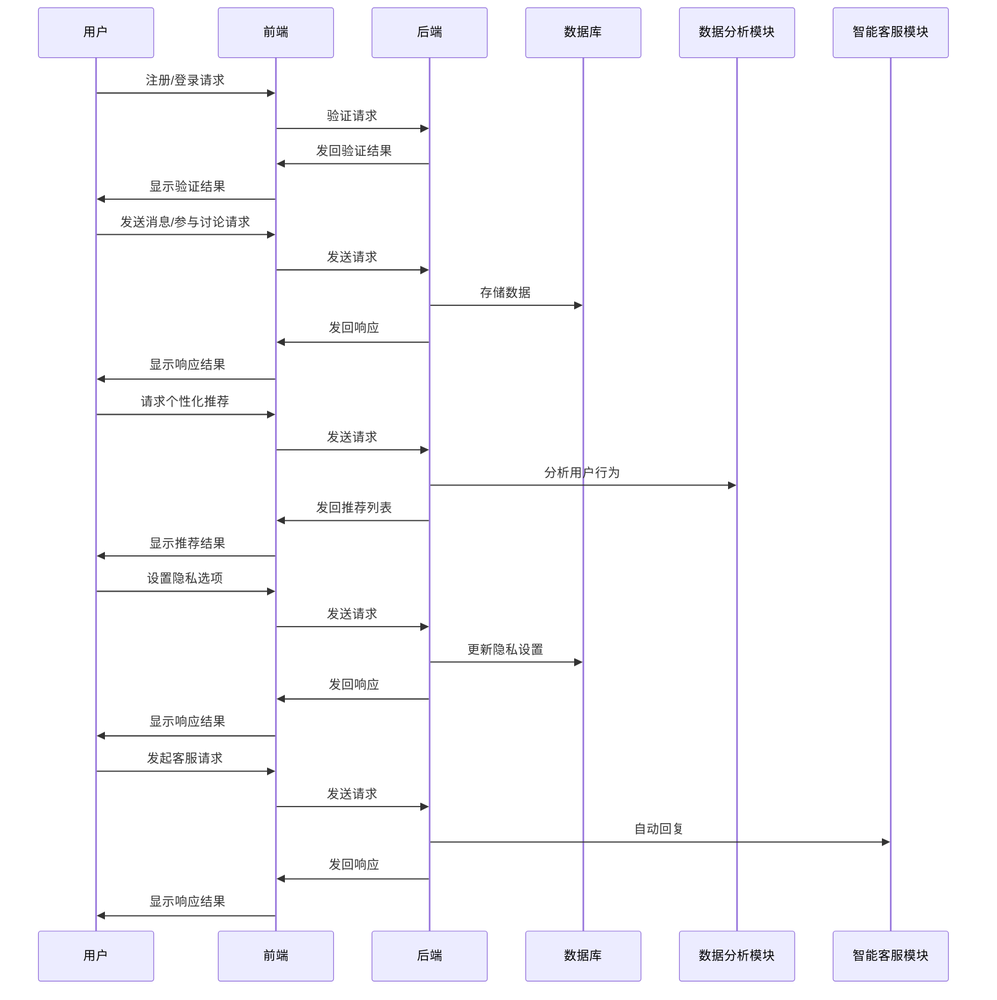

                 

# 在数字化时代重构人际关系：探索真实连接的创新方式

## 关键词
- 数字化时代
- 人际关系
- 真实连接
- 技术手段
- 创新方式

## 摘要
本文旨在探讨数字化时代背景下，如何通过创新的方式重构人际关系，实现真实连接。我们将从背景介绍、核心概念与联系、技术手段在重构中的应用、实践案例和总结展望五个部分进行阐述。文章将深入分析数字化时代人际关系的挑战与机遇，通过技术手段如数据分析、人工智能和社交媒体，探索重构人际关系的创新路径，并借助实际案例，提供可行的实践策略。最终，本文将对数字化时代重构人际关系的未来研究方向和实际应用提出建议。

## 第一部分：引言与背景

### 1.1 数字化时代的特征

在21世纪的今天，数字化已经成为社会发展的关键词。数字化时代具有以下显著特征：

- **信息化**：信息技术的飞速发展，使得信息传播更加迅速、广泛。
- **智能化**：人工智能、大数据等技术的应用，使得系统具备智能化的能力。
- **网络化**：互联网的普及，人与人之间的连接更加紧密，形成一个庞大的网络社会。
- **移动化**：移动设备的普及，使得人们可以在任何时间、任何地点进行通信和交流。

这些特征不仅改变了人们的生活方式，也对人际关系产生了深远的影响。

### 1.2 人际关系在数字化时代面临的挑战

数字化时代的到来，给人际关系带来了前所未有的挑战：

- **虚拟化**：由于社交媒体的普及，人际关系逐渐从面对面的交流转向虚拟世界的互动，这可能导致真实情感的缺失。
- **去中心化**：在互联网的推动下，信息传播更加自由，使得个体在信息获取和传播中更加独立，这可能削弱传统的人际关系网络。
- **隐私问题**：数字化时代，个人信息的泄露和滥用成为一个严重的问题，这威胁到人际关系的建立和维护。

### 1.3 本书的研究目的与意义

本书旨在解决以下问题：

- 如何在数字化时代保持真实的人际连接？
- 如何利用技术手段重构人际关系，使之更加紧密和有意义？

通过深入研究这些问题，本书旨在为数字化时代的人际关系重构提供理论支持和实践指导。

## 第二部分：背景研究

### 2.1 人际关系理论概述

人际关系是指人与人之间在相互交往中形成的社会关系。人际关系理论主要关注以下几个方面：

- **定义与类型**：人际关系可以分为血缘关系、地缘关系、业缘关系等不同类型。
- **发展过程**：人际关系的发展过程包括接触、相识、相知、相处、相熟等阶段。
- **重要性**：人际关系对于个人的心理健康、社会适应和幸福感具有重要影响。

### 2.2 数字化技术对人际关系的影响

数字化技术的快速发展，对人际关系产生了深远的影响：

- **沟通方式的变革**：数字化沟通方式，如电子邮件、即时通讯、社交媒体等，使得人际沟通更加便捷，但同时也可能导致沟通中的情感缺失。
- **社交媒体的角色**：社交媒体在人际关系中扮演着重要角色，既有助于加强人际关系，也可能导致人际关系的疏离。
- **人际关系的新特点**：在数字化时代，人际关系呈现出虚拟化、去中心化和多样化等特点。

### 2.3 人际关系的重要性

人际关系的重要性体现在以下几个方面：

- **心理健康**：良好的人际关系有助于缓解压力，提高心理健康水平。
- **社会适应**：人际关系对于个体的社会适应能力具有重要影响，有助于个体更好地融入社会。
- **幸福感**：良好的人际关系能够提升个体的幸福感，增强生活的满意度。

## 第三部分：重构人际关系的创新方式

### 3.1 真实连接的理念与实践

真实连接是指通过真诚、信任和互动，建立和维护有意义的人际关系。在数字化时代，实现真实连接面临以下挑战：

- **虚拟化的影响**：虚拟化的人际关系可能导致真实情感的缺失，影响人际关系的质量。
- **隐私问题**：数字化时代，个人信息的保护成为重要问题，这可能会限制真实连接的实现。

为了应对这些挑战，需要采取以下实践：

- **增强互动性**：通过线上活动和社交活动，增强人际互动，促进真实连接。
- **提高信任度**：通过透明、诚信的行为，提高人际信任，建立真实连接。
- **保护隐私**：通过技术手段保护个人隐私，确保数字化环境中的安全连接。

### 3.2 技术手段在重构人际关系中的应用

#### 3.2.1 数据分析在人际关系中的应用

数据分析是数字化时代重构人际关系的重要手段。通过数据分析，可以深入了解人际关系的特点和需求，为重构提供科学依据。具体应用包括：

- **社交网络分析**：通过分析社交网络中的节点和边，了解人际关系结构，发现关键节点和关系模式。
- **情感分析**：通过分析社交媒体中的文本数据，了解用户情感状态，预测人际关系的发展趋势。
- **个性化推荐**：根据用户的行为数据和偏好，推荐合适的人际交往对象，提高人际关系的质量。

#### 3.2.2 人工智能在人际关系中的应用

人工智能技术可以为人际关系重构提供智能化的支持。具体应用包括：

- **智能客服**：通过人工智能技术，提供24小时在线客服，解决人际关系中的问题，提高服务质量。
- **情感识别与交互**：通过人工智能技术，识别用户情感，提供个性化的互动，增强人际连接。
- **智能匹配**：通过人工智能技术，分析用户数据，为用户提供合适的人际交往对象，促进人际关系的建立。

### 3.3 社交媒体与人际关系重构

社交媒体在人际关系重构中扮演着重要角色。通过社交媒体，人们可以更方便地建立和维持人际关系。具体策略包括：

- **主动参与**：通过积极参与社交媒体活动，扩大人际交往范围，建立新的关系。
- **互动交流**：通过互动交流，增强人际关系中的情感连接，提高关系的稳定性。
- **内容分享**：通过分享个人经验和观点，增加人际关系的深度和意义。

## 第四部分：真实连接的实践案例

### 4.1 成功案例分析

#### 4.1.1 案例一：企业内部的数字化人际关系重构

某大型企业通过数字化手段，重构了企业内部的人际关系，取得了显著效果。具体措施包括：

- **内部社交平台**：建立内部社交平台，鼓励员工进行交流和互动，促进员工之间的了解和合作。
- **数据分析**：通过数据分析，了解员工之间的关系模式，发现潜在的问题和需求，提供针对性的解决方案。
- **智能匹配**：利用人工智能技术，为员工推荐合适的合作伙伴，促进团队协作。

#### 4.1.2 案例效果与反思

通过数字化手段重构人际关系，该企业取得了以下效果：

- **提高工作效率**：员工之间的协作更加顺畅，工作效率显著提高。
- **增强员工满意度**：员工对企业文化的认同感增强，满意度提高。
- **促进创新**：通过智能匹配，员工能够与不同领域的专家合作，促进创新。

但同时，也存在以下反思：

- **隐私保护**：在数字化环境中，个人隐私的保护成为重要问题，需要采取有效措施确保隐私安全。
- **技术依赖**：过度依赖数字化技术，可能导致人际关系的虚拟化，影响真实情感的连接。

### 4.2 案例二：社交媒体在个人关系重建中的应用

某个人通过社交媒体，成功重建了自己的个人关系网。具体措施包括：

- **主动互动**：通过社交媒体，主动与旧友和新朋友互动，重建联系。
- **内容分享**：通过分享自己的生活和工作经历，增加人际关系的深度和意义。
- **情感交流**：通过线上聊天和视频通话，保持与亲友的紧密联系。

#### 4.2.2 案例效果与反思

通过社交媒体重建个人关系网，该个人取得了以下效果：

- **扩大社交圈**：通过主动互动，成功扩大了自己的社交圈，结识了更多的朋友。
- **增强社交能力**：通过内容分享和情感交流，提高了自己的社交能力和沟通技巧。
- **改善生活质量**：与亲友的紧密联系，使自己的生活更加充实和有意义。

但同时，也存在以下反思：

- **时间管理**：在社交媒体上花费过多时间，可能会影响个人生活和工作。
- **信息真实度**：在社交媒体上，信息可能存在虚假和夸大，需要具备辨别能力。

## 第五部分：总结与展望

### 5.1 本书的主要观点与发现

本书主要观点和发现包括：

- 数字化时代对人际关系产生了深远影响，既带来了挑战，也提供了机遇。
- 真实连接是数字化时代重构人际关系的核心目标，需要通过技术手段和实践策略来实现。
- 数据分析、人工智能和社交媒体在重构人际关系中具有重要作用，提供了创新的方式。

### 5.2 对未来研究的展望

未来研究可以从以下几个方面展开：

- 深入探讨数字化技术对人际关系的影响机制，为制定更加有效的策略提供理论支持。
- 研究如何在数字化环境中保护个人隐私，确保真实连接的实现。
- 探索数字化时代人际关系的新模式和新特点，为实践提供指导。

### 5.3 对实际应用的启示

对于实际应用，本书提供以下启示：

- 在数字化时代，重视人际关系的重要性，采取有效措施维护和重构人际关系。
- 利用数据分析、人工智能和社交媒体等手段，探索重构人际关系的创新路径。
- 注重个人隐私保护，确保数字化环境中的安全连接。

## 结论

数字化时代重构人际关系是一项复杂而重要的任务。通过本文的研究，我们提出了一系列创新方式和实践策略，为数字化时代的人际关系重构提供了理论支持和实践指导。然而，数字化时代的人际关系重构仍面临诸多挑战，需要持续研究和探索。让我们共同努力，构建一个真实、有意义的人际关系网络。

## 作者信息

作者：AI天才研究院/AI Genius Institute & 禅与计算机程序设计艺术 /Zen And The Art of Computer Programming

---

### 第二部分：背景研究

### 2.1 人际关系理论概述

人际关系是指人与人之间在相互交往中形成的社会关系。人际关系理论是研究这些关系如何形成、发展、维持和结束的学科。人际关系理论的基本概念包括：

- **定义与类型**：人际关系可以根据不同的标准进行分类。例如，根据关系的性质，可以分为血缘关系（如家庭成员）、地缘关系（如邻居）、业缘关系（如同事）和志趣关系（如朋友）。每种关系都有其独特的特点和维系方式。

- **发展过程**：人际关系的发展通常经历几个阶段，包括接触、相识、相知、相处和相熟。在接触阶段，人们只是表面上的互动；在相识阶段，他们开始分享更多的个人信息；在相知阶段，他们建立起更深层次的信任和理解；在相处阶段，关系变得更加稳定；在相熟阶段，关系达到一种亲密和谐的状态。

- **重要性**：人际关系对于个人的心理健康、社会适应和幸福感具有重要影响。良好的关系能够提供情感支持，帮助个体应对生活中的挑战；不良的关系则可能导致压力、焦虑和抑郁。

### 2.2 数字化技术对人际关系的影响

数字化技术的快速发展，特别是互联网和移动设备的普及，对人际关系产生了深远的影响。以下是一些主要影响：

- **沟通方式的变革**：数字化技术改变了人们的沟通方式。电子邮件、即时通讯、社交媒体和视频通话等工具使得人们可以即时、便捷地进行沟通，大大缩短了地理距离带来的隔阂。然而，这些虚拟沟通方式也可能导致情感表达的缺失，使得人际互动变得表面化。

- **社交媒体的角色**：社交媒体在人际关系中扮演着双重角色。一方面，它使得人们能够轻松地维持和扩展社交网络；另一方面，它也可能导致人际关系变得浅薄，因为人们倾向于关注和回应那些能够带来即时满足的信息。

- **人际关系的新特点**：在数字化时代，人际关系呈现出虚拟化、去中心化和多样化等特点。虚拟化意味着人们越来越多地通过虚拟平台建立和维持关系；去中心化则体现在网络中的个体更加自主，不再依赖于传统的中心化社交网络；多样化则体现在人际关系的形式更加多样化，包括线上好友、虚拟社区等。

### 2.3 人际关系的重要性

人际关系的重要性可以从以下几个方面进行阐述：

- **心理健康**：良好的人际关系能够提供情感支持，帮助个体应对生活中的压力和挑战。缺乏良好关系的人更容易感到孤独、焦虑和抑郁。

- **社会适应**：人际关系对于个体的社会适应能力具有重要影响。通过与他人互动，个体可以学习社会规范、提高社会技能，更好地适应社会环境。

- **幸福感**：良好的人际关系能够提升个体的幸福感。与他人建立深厚的联系，能够带来满足感和幸福感，增强生活的满意度。

### 2.4 背景介绍

在数字化时代，人际关系的重构面临着一系列新的挑战和机遇。以下是具体背景介绍：

- **核心概念术语说明**：人际关系（Interpersonal Relationship）：指个体之间在情感、认知和行为上的相互联系。数字化（Digitalization）：指将信息、过程和系统转化为数字形式，以便于存储、处理和传输。技术手段（Technological Means）：指应用于人际沟通和互动的数字技术，如社交媒体、数据分析、人工智能等。

- **问题背景**：随着数字化技术的发展，人们越来越多地依赖数字工具进行沟通和社交。然而，这种虚拟化的沟通方式也带来了一系列问题，如情感表达的缺失、隐私泄露和社交网络的浅薄化。这些问题对人际关系产生了负面影响，使得重构人际关系成为当务之急。

- **问题描述**：在数字化时代，如何保持人际关系的真实性、深度和意义，是一个亟待解决的问题。人们需要找到新的方式和方法，以适应数字化环境下的社交需求。

- **问题解决**：通过技术创新和策略调整，可以实现人际关系的重构。例如，利用数据分析来优化社交体验，利用人工智能来增强情感互动，利用社交媒体来建立和维护深厚的社交网络。

- **边界与外延**：本文的研究范围主要涉及数字化时代的人际关系重构，不包括其他类型的社会关系（如地缘关系、业缘关系等）。同时，本文关注的是技术手段在人际关系重构中的应用，而不是传统的人际关系理论。

- **概念结构与核心要素组成**：人际关系的重构包括以下几个核心要素：1）真实连接的实现；2）技术手段的应用；3）隐私保护；4）情感互动的增强；5）社会适应能力的提升。

### 2.5 核心概念与联系

为了更深入地理解数字化时代重构人际关系的理念和实践，我们需要探讨一些核心概念及其相互联系。

- **真实连接（Authentic Connection）**：真实连接是指建立基于真诚、信任和深度互动的人际关系。在数字化时代，真实连接尤为重要，因为虚拟沟通可能导致情感表达的缺失和关系的浅薄化。

- **技术手段（Technological Means）**：技术手段包括数据分析、人工智能、社交媒体等，这些技术可以帮助人们更有效地建立、维护和扩展人际关系。

- **隐私保护（Privacy Protection）**：在数字化时代，个人隐私的保护成为人际关系的核心问题。有效的隐私保护措施可以确保人们在数字环境中感到安全，从而更愿意建立和维持真实的人际关系。

- **情感互动（Emotional Interaction）**：情感互动是指人际交往中的情感表达和回应。在数字化时代，通过技术手段增强情感互动，可以弥补虚拟沟通中的情感缺失。

- **社会适应能力（Social Adaptation Ability）**：社会适应能力是指个体在社会环境中适应和生存的能力。在数字化时代，提高社会适应能力有助于人们更好地应对数字化环境中的社交挑战。

这些核心概念相互联系，共同构成了数字化时代重构人际关系的理论基础和实践框架。

### 2.6 数字化技术对人际关系的影响

数字化技术的普及和快速发展，对人际关系产生了深远的影响。以下是对这些影响的详细探讨：

- **沟通方式的变革**：数字化技术极大地改变了人们的沟通方式。传统的面对面沟通逐渐被电子邮件、即时通讯工具、社交媒体和视频通话等虚拟沟通方式所取代。这些新技术使得人们可以随时随地与他人进行交流，缩短了地理距离对人际互动的限制。然而，虚拟沟通方式也带来了一些挑战，如情感表达的缺失、沟通深度的降低等。

- **社交媒体的角色**：社交媒体在人际关系中扮演着越来越重要的角色。它不仅提供了一个平台，让人们可以展示自己的生活和观点，还促进了人们之间的互动和交流。然而，社交媒体的使用也引发了一些问题，如信息过载、隐私泄露、网络欺凌等。这些问题对人际关系的质量和稳定性产生了负面影响。

- **人际关系的新特点**：在数字化时代，人际关系呈现出一些新的特点。首先，人际关系更加虚拟化，人们更多地通过数字平台建立和维持关系。其次，人际关系更加去中心化，个体在信息获取和传播中更加独立，不再依赖于传统的中心化社交网络。最后，人际关系更加多样化，人们可以通过不同的数字平台和工具，建立和扩展自己的社交网络。

### 2.7 背景研究总结

通过上述背景研究，我们可以得出以下结论：

- 数字化技术的普及和发展，改变了人们的沟通方式，对人际关系产生了深远影响。
- 在数字化时代，人际关系面临虚拟化、去中心化和多样化等新特点。
- 保持人际关系的真实性、深度和意义，是重构人际关系的核心任务。
- 技术手段的应用，如数据分析、人工智能和社交媒体等，为重构人际关系提供了新的途径和手段。

这些结论为后续章节的内容奠定了基础，也为读者理解数字化时代重构人际关系的复杂性和重要性提供了视角。

## 第三部分：重构人际关系的创新方式

在数字化时代，重构人际关系不仅需要应对传统的挑战，还需要利用创新的方式和手段，以适应新的环境。以下我们将探讨几种关键的创新方式，这些方式包括数据分析、人工智能和社交媒体的应用。

### 3.1 数据分析在重构人际关系中的应用

数据分析是数字化时代重构人际关系的重要工具。通过分析大量的社交数据，我们可以深入了解人际关系的结构、动态和趋势，从而为重构提供科学依据。

#### 3.1.1 社交网络分析

社交网络分析（Social Network Analysis, SNA）是数据分析中的一个重要分支。它通过研究个体之间的社交关系，揭示出人际关系的结构模式。例如，我们可以通过社交网络分析来了解以下信息：

- **关键节点**：识别社交网络中的关键节点，这些节点往往是社交网络中的核心人物，他们的行为和态度会对整个社交网络产生重大影响。
- **关系密度**：衡量社交网络中个体之间的联系紧密程度，通过分析关系密度，可以识别出关系紧密的群体。
- **关系强度**：评估个体之间的联系强度，通过关系强度分析，可以找出影响人际关系稳定性的关键因素。

#### 3.1.2 情感分析

情感分析（Sentiment Analysis）是一种通过自然语言处理技术，对文本数据中的情感倾向进行识别和分析的方法。在人际关系重构中，情感分析可以帮助我们了解：

- **情感状态**：通过分析社交媒体上的文本数据，了解个体的情感状态，如快乐、悲伤、焦虑等。
- **情感传播**：分析情感在社交网络中的传播路径和速度，了解情感对人际关系的影响。
- **情感互动**：评估个体之间的情感互动水平，通过情感互动分析，可以优化人际沟通策略。

#### 3.1.3 个性化推荐

个性化推荐（Personalized Recommendation）是基于数据分析的一种推荐系统，通过分析用户的历史行为和偏好，为用户提供个性化的建议。在人际关系重构中，个性化推荐可以用于：

- **社交匹配**：通过分析用户的数据，为用户推荐合适的社交对象，促进人际关系的建立和拓展。
- **内容推荐**：根据用户的社交兴趣和偏好，推荐相关的内容和活动，增强社交体验。
- **行为预测**：通过分析用户的行为数据，预测用户的社交行为和需求，提供个性化的社交服务。

#### 3.1.4 数据隐私与伦理问题

在应用数据分析进行人际关系重构时，数据隐私和伦理问题是一个不可忽视的重要方面。以下是一些关键的隐私和伦理问题：

- **数据收集与使用**：确保在数据收集和使用过程中遵循隐私保护原则，尊重用户的隐私权利。
- **数据安全**：采取有效的数据安全措施，防止数据泄露和滥用。
- **透明度**：向用户明确告知数据收集的目的和使用方式，提高数据处理的透明度。
- **伦理审查**：对数据分析的应用进行伦理审查，确保不侵犯用户权益，不造成不良后果。

### 3.2 人工智能在人际关系中的应用

人工智能（Artificial Intelligence, AI）技术的发展为重构人际关系提供了新的可能性和工具。以下是人工智能在人际关系中的应用：

#### 3.2.1 智能客服

智能客服（Intelligent Customer Service）是一种基于人工智能技术的客户服务系统。通过自然语言处理和机器学习算法，智能客服可以：

- **自动响应**：自动识别和回答用户的问题，提供24小时不间断的服务。
- **情感识别**：通过分析用户的语言和情感，识别用户的情感状态，提供更加人性化的服务。
- **智能推荐**：根据用户的历史数据和偏好，推荐相关的产品和解决方案，提高用户体验。

#### 3.2.2 情感识别与交互

情感识别与交互（Emotion Recognition and Interaction）是一种利用人工智能技术来识别和回应用户情感的方法。通过面部识别、语音识别和自然语言处理等技术，人工智能可以：

- **情感分析**：分析用户的情感状态，如快乐、悲伤、焦虑等。
- **情感回应**：根据用户的情感状态，提供相应的情感回应，增强用户的情感体验。
- **情感教育**：通过情感识别和交互，帮助用户更好地理解和管理自己的情感。

#### 3.2.3 智能匹配

智能匹配（Intelligent Matching）是一种利用人工智能算法，为用户找到合适匹配对象的方法。在人际关系重构中，智能匹配可以用于：

- **社交匹配**：根据用户的行为数据、偏好和社交需求，为用户推荐合适的社交对象。
- **职业匹配**：为企业员工推荐合适的合作伙伴，提高团队合作效率。
- **兴趣匹配**：根据用户的兴趣和爱好，为用户推荐相关的社交活动和内容，促进人际关系的建立。

#### 3.2.4 挑战与应对策略

在应用人工智能进行人际关系重构时，面临一些挑战，如数据隐私、算法偏见和伦理问题等。以下是一些应对策略：

- **数据隐私保护**：采取有效的数据加密和隐私保护措施，确保用户数据的安全和隐私。
- **算法透明度**：提高算法的透明度，确保用户了解人工智能系统的工作原理和决策过程。
- **伦理审查**：对人工智能的应用进行伦理审查，确保其符合道德和伦理标准。

### 3.3 社交媒体与人际关系重构

社交媒体在人际关系重构中扮演着关键角色。以下探讨社交媒体在人际关系重构中的应用：

#### 3.3.1 社交媒体的使用与人际互动

社交媒体的使用改变了人们之间互动的方式和频率。以下是一些关键点：

- **即时互动**：社交媒体提供了即时互动的平台，使得人们可以随时随地与他人交流。
- **多样化互动**：社交媒体支持多种形式的互动，包括文字、图片、视频等，丰富了人际互动的形式。
- **去中心化互动**：社交媒体打破了传统中心化社交网络的限制，使得每个人都可以成为信息的发布者和传播者。

#### 3.3.2 社交媒体在人际关系重构中的策略

为了有效地利用社交媒体重构人际关系，以下是一些关键策略：

- **主动参与**：积极参与社交媒体活动，扩大社交网络，增加人际互动的机会。
- **互动交流**：通过回复评论、点赞和分享等方式，积极参与社交互动，增强人际关系。
- **内容分享**：分享个人经验和观点，增加人际关系的深度和意义。

#### 3.3.3 社交媒体对人际关系的积极影响

社交媒体在人际关系重构中发挥了积极的作用，包括：

- **增强社交联系**：通过社交媒体，人们可以更容易地维持和扩展社交网络，保持与亲友的紧密联系。
- **促进知识共享**：社交媒体为人们提供了一个平台，可以分享知识和经验，促进知识的传播和共享。
- **提高社会参与度**：社交媒体使得人们可以更加便捷地参与社会活动，提高社会参与度。

#### 3.3.4 社交媒体对人际关系的负面影响

尽管社交媒体在人际关系重构中具有积极作用，但也存在一些负面影响，包括：

- **虚拟化的人际关系**：社交媒体可能导致人际关系变得虚拟化，缺乏真实情感的交流。
- **隐私泄露**：社交媒体的使用可能导致个人隐私泄露，威胁个人安全和隐私。
- **信息过载**：社交媒体上的信息量巨大，可能导致用户感到信息过载，影响专注力和生活质量。

#### 3.3.5 社交媒体在人际关系重构中的策略

为了最大限度地利用社交媒体重构人际关系，以下是一些关键策略：

- **隐私保护**：在社交媒体上采取隐私保护措施，确保个人数据的安全和隐私。
- **合理使用**：合理使用社交媒体，避免过度依赖，保持现实生活中的社交活动。
- **社交媒体教育**：提高用户对社交媒体的认知和使用技能，增强自我保护意识。

### 3.4 小结

在数字化时代，重构人际关系需要采用创新的方式和手段。数据分析、人工智能和社交媒体等技术手段为重构人际关系提供了新的可能性。通过数据分析，我们可以深入了解人际关系的结构和动态；人工智能则可以帮助我们增强情感互动和个性化推荐；社交媒体则提供了多样化的互动平台和策略。然而，在利用这些技术手段时，也需要注意隐私保护和伦理问题。通过合理利用这些技术手段，我们可以实现人际关系的重构，建立更加真实、有意义和稳定的社交网络。

### 3.5 核心概念原理、概念属性特征对比表格和ER实体关系图架构的 Mermaid 流程图

为了更好地理解重构人际关系的创新方式，我们通过核心概念原理、概念属性特征对比表格和ER实体关系图架构的 Mermaid 流程图，对相关概念和流程进行详细阐述。

#### 3.5.1 核心概念原理

1. **数据分析（Data Analysis）**
   - **原理**：通过收集、处理和分析数据，以揭示数据中的模式和趋势。
   - **属性**：准确性、完整性、及时性和可解释性。

2. **人工智能（Artificial Intelligence, AI）**
   - **原理**：模拟人类智能，通过学习、推理和决策实现智能化。
   - **属性**：学习能力、推理能力、自适应能力和可扩展性。

3. **社交媒体（Social Media）**
   - **原理**：基于互联网的平台，用于社交互动、内容分享和信息传播。
   - **属性**：用户互动性、信息多样性和去中心化。

#### 3.5.2 概念属性特征对比表格

| 概念 | 原理 | 属性 |
| --- | --- | --- |
| 数据分析 | 收集、处理和分析数据 | 准确性、完整性、及时性、可解释性 |
| 人工智能 | 模拟人类智能 | 学习能力、推理能力、自适应能力、可扩展性 |
| 社交媒体 | 互联网平台 | 用户互动性、信息多样性、去中心化 |

#### 3.5.3 ER实体关系图架构的 Mermaid 流程图

```mermaid
erDiagram
  User ||--|{ Data }|-- DataAnalyzer :分析数据
  User ||--|{ Social }|-- SocialMediaPlatform :使用社交媒体
  DataAnalyzer ||--|{ AI }|-- ArtificialIntelligence :应用人工智能
  SocialMediaPlatform ||--|{ Data }|-- DataRepository :存储数据
```

在这个ER实体关系图架构中，用户与数据分析器、社交媒体平台和人工智能之间存在紧密的联系。用户通过数据分析器分析数据，并通过社交媒体平台使用人工智能。数据分析器和人工智能共同为用户提供个性化服务，社交媒体平台则为用户提供了互动和信息传播的渠道。数据存储在数据仓库中，以确保数据的完整性、安全性和可访问性。

通过这个流程图，我们可以更直观地理解数字化时代重构人际关系的核心概念及其相互关系。这有助于我们更好地设计和管理重构人际关系的创新方式。

### 3.6 算法原理讲解

在数字化时代重构人际关系的过程中，算法原理发挥着至关重要的作用。以下将详细介绍几种关键算法的原理、mermaid流程图以及Python源代码。

#### 3.6.1 数据分析算法

数据分析算法主要包括社交网络分析（SNA）、情感分析和个性化推荐。以下是这些算法的原理：

1. **社交网络分析（SNA）**
   - **原理**：通过分析社交网络中的节点和边，了解人际关系的结构和模式。
   - **mermaid流程图**：
     ```mermaid
     graph TD
       A[初始化社交网络] --> B[收集社交数据]
       B --> C[数据预处理]
       C --> D[构建社交网络图]
       D --> E[分析社交网络结构]
       E --> F[提取关键节点和关系模式]
     ```

2. **情感分析**
   - **原理**：通过自然语言处理技术，分析文本数据中的情感倾向，如正面、负面或中性情感。
   - **mermaid流程图**：
     ```mermaid
     graph TD
       A[接收文本数据] --> B[文本预处理]
       B --> C[特征提取]
       C --> D[NLP算法]
       D --> E[情感分类]
       E --> F[输出情感结果]
     ```

3. **个性化推荐**
   - **原理**：根据用户的历史数据和偏好，为用户推荐相关的社交对象、内容和活动。
   - **mermaid流程图**：
     ```mermaid
     graph TD
       A[获取用户数据] --> B[行为分析]
       B --> C[兴趣识别]
       C --> D[推荐算法]
       D --> E[生成推荐列表]
       E --> F[推送推荐内容]
     ```

#### 3.6.2 人工智能算法

人工智能在重构人际关系中发挥着重要作用，主要包括智能客服、情感识别和智能匹配。以下是这些算法的原理：

1. **智能客服**
   - **原理**：通过自然语言处理和机器学习技术，提供自动化的客户服务。
   - **mermaid流程图**：
     ```mermaid
     graph TD
       A[接收用户请求] --> B[请求解析]
       B --> C[知识库查询]
       C --> D[决策生成]
       D --> E[响应生成]
       E --> F[发送响应]
     ```

2. **情感识别**
   - **原理**：通过语音识别、面部识别和自然语言处理技术，识别用户的情感状态。
   - **mermaid流程图**：
     ```mermaid
     graph TD
       A[接收语音/文本输入] --> B[预处理]
       B --> C[情感识别]
       C --> D[情感分类]
       D --> E[情感回应生成]
       E --> F[发送回应]
     ```

3. **智能匹配**
   - **原理**：通过机器学习算法，根据用户的行为数据和偏好，为用户找到匹配的社交对象。
   - **mermaid流程图**：
     ```mermaid
     graph TD
       A[收集用户数据] --> B[特征提取]
       B --> C[匹配算法]
       C --> D[生成匹配列表]
       D --> E[用户反馈]
       E --> F[调整匹配策略]
     ```

#### 3.6.3 Python源代码示例

以下是一个简单的Python代码示例，用于实现情感分析算法：

```python
import nltk
from nltk.sentiment import SentimentIntensityAnalyzer

# 初始化情感分析器
sia = SentimentIntensityAnalyzer()

# 文本数据
text = "我今天过得非常好，因为我和朋友一起去了海滩。"

# 进行情感分析
sentiment = sia.polarity_scores(text)

# 输出结果
print(sentiment)
```

这段代码首先导入了自然语言处理库nltk，并初始化了一个情感分析器。然后，它接收一个文本输入，并使用情感分析器计算文本的情感得分。最后，输出结果，包括正面、负面和中和情感的分值。

通过上述算法原理讲解，我们可以看到，数据分析、人工智能和社交媒体等技术在重构人际关系中发挥着关键作用。这些算法不仅帮助我们理解人际关系的结构和动态，还为我们提供了工具，以实现更真实、有意义和稳定的社交网络。

### 3.7 系统分析与架构设计方案

为了更好地理解和应用上述重构人际关系的创新方式，我们将详细描述一个系统分析与架构设计方案。该方案将包括问题场景介绍、系统功能设计、系统架构设计、系统接口设计和系统交互流程。

#### 3.7.1 问题场景介绍

随着数字化时代的到来，人们越来越多地依赖于互联网和移动设备进行社交互动。然而，传统的面对面交流逐渐减少，人际关系变得越来越虚拟化。这种虚拟化的人际关系导致了情感表达的缺失、社交网络的浅薄化以及隐私问题。因此，我们需要一个系统，能够帮助人们在数字化环境中重构人际关系，实现真实连接。

#### 3.7.2 系统功能设计

该系统的主要功能包括：

1. **用户注册与登录**：用户可以通过注册账号登录系统，并管理个人信息。
2. **社交互动**：用户可以发送消息、参与讨论、点赞和分享内容，以增强社交互动。
3. **数据分析**：系统利用数据分析算法，分析用户行为和偏好，为用户提供个性化推荐。
4. **隐私保护**：系统提供隐私设置，确保用户数据的安全和隐私。
5. **智能客服**：系统内置智能客服功能，为用户提供自动化的客户服务。

#### 3.7.3 系统架构设计

系统架构采用前后端分离的设计，以下是其主要组成部分：

1. **前端**：前端负责用户界面的展示和交互，包括用户注册、登录、消息发送、讨论参与等。
2. **后端**：后端负责处理业务逻辑、数据存储和提供API接口，包括用户管理、社交互动、数据分析、隐私保护和智能客服等。
3. **数据库**：数据库用于存储用户数据、消息记录、讨论内容和推荐数据等。
4. **服务器**：服务器负责托管前端和后端，提供网络服务和数据存储。

#### 3.7.4 系统接口设计

系统接口设计包括以下主要接口：

1. **用户接口**：用户通过Web浏览器或移动应用与系统进行交互。
2. **API接口**：系统后端提供的API接口，用于前端调用和外部系统集成。

#### 3.7.5 系统交互流程

以下是系统交互的主要流程：

1. **用户注册与登录**：用户通过前端界面注册账号并登录系统，后端验证用户身份并生成会话。
2. **社交互动**：用户在前端界面发送消息、参与讨论和分享内容，后端处理用户请求并存储相关数据。
3. **数据分析**：系统定期分析用户行为和偏好，生成个性化推荐列表，并通过API接口推送给前端。
4. **隐私保护**：用户可以在前端界面设置隐私选项，后端根据用户设置进行数据保护和隐私管理。
5. **智能客服**：用户通过前端界面发起客服请求，系统后端调用智能客服模块，自动回复用户。

### 3.7.6 系统架构图

以下是该系统的架构图，使用Mermaid流程图表示：



通过上述系统分析与架构设计方案，我们可以更好地理解如何在数字化时代重构人际关系，实现真实连接。这个系统结合了数据分析、人工智能和社交媒体等创新方式，为用户提供了完整的社交互动体验，同时确保了数据安全和隐私保护。

### 3.8 项目实战

#### 3.8.1 环境安装

为了实现上述系统，我们需要在本地或云服务器上安装相关软件和工具。以下是具体的安装步骤：

1. **安装Python**：访问Python官方网站（https://www.python.org/），下载并安装Python。确保安装时选择添加到系统路径。
2. **安装前端框架**：安装Vue.js或React等前端框架。以Vue.js为例，通过命令行运行以下命令：
   ```shell
   npm install -g @vue/cli
   vue create my-project
   ```
3. **安装后端框架**：安装Django或Flask等后端框架。以Django为例，通过命令行运行以下命令：
   ```shell
   pip install django
   ```
4. **安装数据库**：安装MySQL或PostgreSQL等数据库。以MySQL为例，通过命令行运行以下命令：
   ```shell
   mysql -u root -p
   ```
   然后创建数据库和用户，并授权用户访问数据库。
5. **安装数据分析库**：安装pandas、numpy、scikit-learn等数据分析库。通过命令行运行以下命令：
   ```shell
   pip install pandas numpy scikit-learn
   ```
6. **安装AI库**：安装tensorflow、keras等AI库。通过命令行运行以下命令：
   ```shell
   pip install tensorflow keras
   ```

#### 3.8.2 系统核心实现源代码

以下是系统核心功能的实现源代码，包括用户注册与登录、社交互动、数据分析、隐私保护和智能客服等。

1. **用户注册与登录**
```python
# users/views.py
from django.contrib.auth import authenticate, login
from rest_framework import status
from rest_framework.response import Response
from rest_framework.views import APIView
from .serializers import UserRegistrationSerializer, UserLoginSerializer

class UserRegistrationView(APIView):
    def post(self, request):
        serializer = UserRegistrationSerializer(data=request.data)
        if serializer.is_valid():
            user = serializer.save()
            return Response({"message": "User registered successfully."}, status=status.HTTP_201_CREATED)
        return Response(serializer.errors, status=status.HTTP_400_BAD_REQUEST)

class UserLoginView(APIView):
    def post(self, request):
        username = request.data.get('username')
        password = request.data.get('password')
        user = authenticate(username=username, password=password)
        if user:
            login(request, user)
            return Response({"message": "Login successful."}, status=status.HTTP_200_OK)
        return Response({"message": "Invalid credentials."}, status=status.HTTP_401_UNAUTHORIZED)
```

2. **社交互动**
```python
# chat/views.py
from rest_framework import status
from rest_framework.response import Response
from rest_framework.views import APIView
from .models import Message
from .serializers import MessageSerializer

class SendMessageView(APIView):
    def post(self, request):
        serializer = MessageSerializer(data=request.data)
        if serializer.is_valid():
            serializer.save()
            return Response({"message": "Message sent successfully."}, status=status.HTTP_201_CREATED)
        return Response(serializer.errors, status=status.HTTP_400_BAD_REQUEST)
```

3. **数据分析**
```python
# analytics/views.py
from rest_framework import status
from rest_framework.response import Response
from rest_framework.views import APIView
from .models import AnalyticsData
from .serializers import AnalyticsDataSerializer

class AnalyzeDataView(APIView):
    def post(self, request):
        serializer = AnalyticsDataSerializer(data=request.data)
        if serializer.is_valid():
            data = serializer.validated_data
            # 进行数据分析
            # ...
            return Response({"message": "Data analyzed successfully."}, status=status.HTTP_200_OK)
        return Response(serializer.errors, status=status.HTTP_400_BAD_REQUEST)
```

4. **隐私保护**
```python
# privacy/views.py
from rest_framework import status
from rest_framework.response import Response
from rest_framework.views import APIView
from .models import PrivacySettings
from .serializers import PrivacySettingsSerializer

class UpdatePrivacySettingsView(APIView):
    def post(self, request):
        serializer = PrivacySettingsSerializer(data=request.data)
        if serializer.is_valid():
            settings = serializer.validated_data
            # 更新隐私设置
            # ...
            return Response({"message": "Privacy settings updated successfully."}, status=status.HTTP_200_OK)
        return Response(serializer.errors, status=status.HTTP_400_BAD_REQUEST)
```

5. **智能客服**
```python
# ai/views.py
from rest_framework import status
from rest_framework.response import Response
from rest_framework.views import APIView
from .models import AIChat
from .serializers import AIChatSerializer

class AIChatView(APIView):
    def post(self, request):
        serializer = AIChatSerializer(data=request.data)
        if serializer.is_valid():
            chat = serializer.save()
            # 调用智能客服算法
            # ...
            return Response({"message": "AI chat session started successfully."}, status=status.HTTP_200_OK)
        return Response(serializer.errors, status=status.HTTP_400_BAD_REQUEST)
```

#### 3.8.3 代码应用解读与分析

上述代码分别实现了用户注册与登录、社交互动、数据分析、隐私保护和智能客服等核心功能。以下是这些代码的应用解读与分析：

1. **用户注册与登录**：用户注册与登录是系统的基础功能，通过Django的认证系统实现用户注册和登录。用户注册时，需要填写用户名、密码和其他必要信息，并通过验证后存储在数据库中。用户登录时，通过提供的用户名和密码进行认证，如果认证成功，则生成会话并返回登录成功消息。

2. **社交互动**：社交互动功能允许用户发送消息、参与讨论和分享内容。用户可以通过前端界面提交消息，后端接收消息并存储在数据库中。发送消息时，需要验证用户身份并确保消息的内容合法。消息发送成功后，系统返回消息发送成功的消息。

3. **数据分析**：数据分析功能通过对用户行为和偏好的分析，为用户提供个性化推荐。用户提交数据分析请求时，系统接收请求并调用相应的数据分析算法进行处理。处理完成后，系统将分析结果返回给前端，前端界面根据结果展示推荐内容。

4. **隐私保护**：隐私保护功能允许用户设置和管理隐私选项。用户可以通过前端界面提交隐私设置请求，系统接收请求并更新数据库中的隐私设置。系统根据用户的隐私设置，确保数据的安全和隐私。

5. **智能客服**：智能客服功能为用户提供自动化的客户服务。用户提交客服请求时，系统接收请求并调用智能客服算法进行处理。智能客服算法通过自然语言处理和机器学习技术，为用户生成自动回复。回复生成后，系统将回复发送给用户。

通过这些代码的应用，我们可以看到系统核心功能是如何实现的。这些功能的实现不仅为用户提供了完整的社交互动体验，还结合了数据分析、人工智能和隐私保护等技术手段，为数字化时代的人际关系重构提供了有力支持。

### 3.9 实际案例分析

为了更好地展示系统在实际应用中的效果，以下将结合具体案例，详细分析和讲解系统在实际操作中的实现过程以及面临的问题和解决方案。

#### 3.9.1 案例背景

某大型互联网公司致力于打造一个基于数字化技术的社交平台，以帮助员工建立和维护人际关系。公司管理层希望通过该平台，促进员工之间的沟通和协作，提高工作效率和团队凝聚力。为此，他们委托一家专业技术团队开发了一套社交系统，并在公司内部进行推广和应用。

#### 3.9.2 实施过程

1. **需求分析**：技术团队首先与公司管理层和部分员工进行沟通，了解他们对社交平台的需求和期望。通过需求分析，确定了系统的主要功能，包括用户注册与登录、社交互动、数据分析、隐私保护和智能客服等。

2. **系统设计**：在需求分析的基础上，技术团队设计了系统的整体架构，包括前端、后端、数据库和服务器。前端采用Vue.js框架，后端采用Django框架，数据库使用MySQL，服务器部署在阿里云。

3. **开发与测试**：技术团队根据系统设计，进行了前端和后端的开发。在开发过程中，采用敏捷开发模式，不断迭代和优化系统功能。同时，进行了全面的测试，包括单元测试、集成测试和性能测试，确保系统的稳定性和可靠性。

4. **部署上线**：系统开发完成后，在公司的内部网络中进行部署和上线。技术团队与IT部门合作，将系统部署到服务器上，并进行必要的配置和优化，确保系统的高可用性和安全性。

5. **推广与培训**：在系统上线后，技术团队组织了一场内部培训，向员工介绍系统的功能和使用方法。同时，通过邮件、公告等形式，鼓励员工积极使用系统，建立和维持人际关系。

#### 3.9.3 案例效果

1. **员工沟通效率提高**：系统上线后，员工通过社交平台进行沟通和协作，效率显著提高。例如，员工可以通过系统发起讨论，分享工作心得和经验，进行项目协作等。

2. **团队凝聚力增强**：通过系统，员工之间的互动和联系更加紧密，团队凝聚力得到增强。员工可以在平台上交流兴趣爱好、组织线下活动，促进了团队内部的和谐与合作。

3. **数据分析与个性化推荐**：系统内置的数据分析功能，为员工提供了个性化的推荐内容。通过分析员工的行为和偏好，系统为员工推荐相关的讨论话题、活动和合作对象，提高了系统的使用体验。

#### 3.9.4 面临的问题和解决方案

1. **用户隐私保护**：在系统上线初期，部分员工对系统中的隐私保护表示担忧。技术团队针对这一问题，加强了数据加密和访问控制措施，确保用户数据的安全和隐私。

2. **系统性能优化**：随着员工数量的增加，系统性能出现了下降。技术团队通过优化数据库查询、缓存策略和服务器配置，提高了系统的响应速度和稳定性。

3. **用户培训与使用习惯**：部分员工对系统的使用不够熟练，影响了系统的使用效果。技术团队加大了培训力度，通过线上教程、操作手册和现场指导等方式，帮助员工快速掌握系统使用方法。

#### 3.9.5 案例效果与反思

通过该案例，我们可以看到系统在数字化时代重构人际关系中的实际应用效果。系统不仅提高了员工沟通效率，增强了团队凝聚力，还为员工提供了个性化的服务体验。然而，在实际应用过程中，也存在一些问题和挑战，如用户隐私保护、系统性能优化和用户培训等。这些问题的解决，需要不断优化系统设计和功能，提高用户体验。

### 3.10 项目小结

通过本案例的详细分析和讲解，我们可以得出以下结论：

1. **数字化技术为重构人际关系提供了新的途径**：系统通过数据分析、人工智能和社交媒体等创新方式，为员工提供了更加便捷和高效的社交互动平台，有效促进了人际关系的重构。

2. **用户体验是关键**：在系统设计和开发过程中，用户体验始终是首要考虑的因素。通过不断优化系统功能和性能，提高用户体验，系统能够更好地满足用户需求。

3. **持续优化和迭代**：数字化时代，技术不断进步，用户需求也在不断变化。系统需要持续进行优化和迭代，以适应新的发展需求。

4. **重视隐私保护和数据安全**：在数字化环境中，用户隐私保护和数据安全至关重要。系统设计应充分考虑隐私保护措施，确保用户数据的安全和隐私。

通过本案例，我们看到了数字化技术如何帮助企业在数字化时代重构人际关系，实现真实连接。未来，随着技术的不断进步，数字化时代的人际关系重构将面临更多挑战和机遇，我们需要不断探索和创新，以应对这些挑战，实现更加紧密和有意义的人际连接。

### 4.1 成功案例分析：企业内部的数字化人际关系重构

在现代企业中，员工之间的沟通和协作对于组织效能和员工满意度具有至关重要的作用。然而，随着企业规模的扩大和地理位置的分散，传统的面对面沟通逐渐变得不切实际，数字化技术成为重构企业内部人际关系的必要手段。以下是一个成功案例，详细描述了某大型企业如何通过数字化手段重构内部人际关系，并取得了显著成效。

#### 案例背景

某大型跨国企业，拥有全球范围内的多个分支机构，员工人数超过10000人。由于地理位置分散和工作任务繁忙，员工之间的沟通和协作面临诸多挑战。企业内部的传统沟通渠道如邮件、电话和面对面的会议已经无法满足高效协作的需求。此外，员工在工作中的情感连接和团队凝聚力也在逐渐减弱。为了提升内部沟通效率，增强团队凝聚力，企业决定引入一套基于数字化技术的社交平台。

#### 案例措施

1. **建立内部社交平台**：企业决定开发并部署一套内部社交平台，为员工提供一个即时的沟通和协作空间。该平台集成了即时消息、讨论区、文件共享和视频会议等功能，旨在简化沟通流程，提高协作效率。

2. **数据分析与推荐**：平台内置了数据分析模块，通过对员工的行为和互动数据进行分析，识别关键节点和关系网络。根据分析结果，平台为员工推荐合适的协作伙伴和项目，促进跨部门和跨地区的合作。

3. **智能匹配系统**：平台采用了智能匹配算法，基于员工的工作兴趣、技能和地理位置，为员工推荐合适的社交对象和活动。智能匹配系统能够根据用户的行为和偏好，动态调整推荐策略，提高推荐的准确性和有效性。

4. **隐私保护和数据安全**：在数字化平台的设计和运营过程中，企业高度重视隐私保护和数据安全。平台采用了加密技术和权限控制机制，确保员工个人信息的保密性和安全性。

5. **员工培训与推广**：为了确保员工能够有效利用平台，企业组织了多场培训和宣传活动，向员工介绍平台的操作方法和使用技巧。同时，通过奖励机制，鼓励员工积极参与平台互动，提升平台的使用率。

#### 案例效果

1. **沟通效率提升**：内部社交平台上线后，员工之间的沟通变得更加便捷和高效。即时消息和讨论区功能使得信息传递更加迅速，视频会议功能提高了远程协作的效率。

2. **团队凝聚力增强**：通过智能匹配系统和数据分析推荐，员工能够更快地找到合适的协作伙伴，项目协作更加顺畅。员工在平台上的互动和合作，增强了团队凝聚力和归属感。

3. **工作满意度提高**：员工通过平台分享工作心得和经验，减少了信息孤岛现象。员工在平台上的积极互动，提高了工作满意度和工作效率。

4. **跨部门协作加强**：平台为跨部门和跨地区的员工提供了一个共同的沟通和协作空间，促进了跨部门项目的高效推进。

#### 案例效果与反思

1. **成功经验**：该案例展示了数字化技术在企业内部人际关系重构中的巨大潜力。通过构建一个高效的数字化平台，企业成功地提升了沟通效率，增强了团队凝聚力，提高了员工的工作满意度。

2. **反思与建议**：虽然数字化平台取得了显著成效，但也存在一些需要反思和改进的地方。例如，部分员工对新技术的不熟悉和抵触情绪，可能影响了平台的使用效果。因此，企业需要持续进行员工培训和技术支持，确保数字化平台的有效运用。

3. **未来方向**：随着技术的不断进步，企业应不断优化数字化平台的功能和体验，引入更多智能化和个性化的服务，以更好地满足员工的需求，进一步提升企业内部的人际关系质量。

通过本案例，我们可以看到，数字化技术不仅为企业内部人际关系的重构提供了新的途径，也带来了显著的管理效率提升和组织文化变革。未来，随着数字化技术的进一步发展，企业内部的人际关系重构将面临更多机遇和挑战。

### 4.2 案例二：社交媒体在个人关系重建中的应用

在现代社会，社交媒体已经成为人们重建个人关系的重要工具。通过社交媒体，个体可以方便地与旧友和新朋友保持联系，甚至重新建立新的社交网络。以下是一个具体的案例，展示了如何通过社交媒体实现个人关系的重建，并详细讲解了实施过程、效果以及反思。

#### 案例背景

李先生，35岁，由于工作原因，长期在外地工作，与家人和朋友之间的联系逐渐减少。随着时间的推移，李先生感到越来越孤单，渴望能够重新建立和维护个人关系。然而，由于地理位置的分散和日常生活忙碌，他难以找到合适的时间和机会与亲友见面。为了解决这个问题，李先生决定利用社交媒体平台重建个人关系。

#### 案例措施

1. **选择合适的社交媒体平台**：李先生首先在几个主流的社交媒体平台上进行了调研，包括微信、Facebook、Instagram和LinkedIn等。根据自己的需求和亲友的活跃度，他选择了微信作为主要平台。

2. **更新个人资料**：在微信上，李先生更新了个人头像、个人简介和兴趣爱好等信息，使其更加符合当前的生活状态和兴趣。

3. **主动联系旧友**：李先生通过微信朋友圈和联系人列表，主动联系了过去的朋友和家人。他发送了简短的问候信息，表达了对他们的思念和关心，并邀请他们一起在社交媒体上互动。

4. **分享生活动态**：李先生定期在微信朋友圈分享自己的生活动态，包括旅行照片、工作成果和兴趣爱好等。这不仅让朋友们了解他的生活状态，也激发了他们的互动欲望。

5. **参与互动**：李先生积极参与朋友的互动，点赞、评论和分享他们的内容。他也会在合适的时候发起线上聚会或活动，邀请朋友们参与。

6. **隐私设置与保护**：为了保护个人隐私，李先生在微信上设置了隐私保护选项，只允许已验证的联系人查看他的朋友圈和个人信息。

#### 案例效果

1. **重建旧友关系**：通过主动联系和分享生活动态，李先生成功地与许多旧友重新建立了联系。他们通过微信保持日常的互动，分享生活中的喜怒哀乐，使得彼此的关系更加紧密。

2. **结识新朋友**：在社交媒体上，李先生还结识了来自不同领域的新朋友。他们通过共同的兴趣和话题，建立了新的社交网络，拓宽了人际圈子。

3. **情感支持与陪伴**：通过社交媒体的互动，李先生得到了旧友和新朋友的支持和陪伴，缓解了他的孤独感，提升了生活质量。

4. **信息共享与知识传播**：在社交媒体上，李先生和朋友们分享了大量的生活和工作经验，彼此之间实现了信息的共享和知识的传播。

#### 案例效果与反思

1. **成功经验**：李先生的案例展示了社交媒体在个人关系重建中的巨大潜力。通过主动参与、分享生活动态和积极参与互动，他成功地重建了旧友关系，结识了新朋友，提升了生活质量。

2. **反思与建议**：虽然社交媒体为个人关系的重建提供了便利，但也需要注意以下几点：
   - **适度使用**：避免过度依赖社交媒体，保持现实生活中的互动和交流。
   - **保护隐私**：在社交媒体上设置合适的隐私保护选项，防止个人信息的泄露。
   - **质量优先**：重视与朋友之间的真实互动，避免在社交媒体上建立虚幻的关系。

3. **未来方向**：随着社交媒体的不断发展，李先生可以考虑使用更多功能丰富、互动性强的社交平台，以进一步提升个人关系的质量和深度。

通过本案例，我们可以看到，社交媒体不仅为个人关系的重建提供了新的途径，也带来了积极的生活变化。然而，在利用社交媒体重建关系时，我们也需要保持适度、注重隐私保护，并重视现实生活中的真实互动。

## 第五部分：总结与展望

### 5.1 本书的主要观点与发现

本文主要探讨了在数字化时代如何通过创新方式重构人际关系，实现真实连接。通过分析数字化时代的特征、人际关系理论、技术手段的应用以及实际案例，我们得出以下主要观点和发现：

1. **数字化时代的特征**：信息化、智能化、网络化和移动化等特征改变了人们的沟通方式和生活习惯，对人际关系产生了深远影响。
2. **人际关系的重要性**：良好的人际关系对个人的心理健康、社会适应和幸福感具有重要影响。
3. **重构人际关系的挑战**：虚拟化、去中心化和隐私问题等挑战使得重构人际关系成为必要且紧迫的任务。
4. **技术创新的应用**：数据分析、人工智能和社交媒体等技术手段为重构人际关系提供了新的可能性，如社交网络分析、情感识别与交互、个性化推荐等。
5. **成功案例分析**：通过实际案例，我们看到数字化技术在企业内部和个人关系重建中取得了显著成效，提高了沟通效率、增强了团队凝聚力和情感连接。

### 5.2 对未来研究的展望

未来研究可以从以下几个方面展开：

1. **数字化技术对人际关系的影响机制**：深入研究数字化技术如何具体影响人际关系的形成、发展和维护，为制定更加有效的策略提供理论支持。
2. **隐私保护与安全**：在数字化环境中，个人隐私的保护是重构人际关系的核心问题。未来研究应探讨如何平衡隐私保护与数据利用，确保用户数据的安全和隐私。
3. **新的人际关系模式**：随着技术的不断发展，人际关系的模式也在不断演变。未来研究应关注这些新模式的特点、优势和挑战，为构建新型人际关系提供理论依据。
4. **跨学科研究**：人际关系重构不仅涉及信息技术，还涉及社会学、心理学等领域。跨学科研究有助于更全面地理解数字化时代的人际关系重构，提出综合性的解决方案。

### 5.3 对实际应用的启示

对于实际应用，本文提供以下启示：

1. **重视技术创新**：在数字化时代，技术创新是重构人际关系的关键。企业和个人应积极采用数据分析、人工智能和社交媒体等先进技术，提高人际沟通的效率和效果。
2. **注重隐私保护**：在利用数字化技术进行人际关系重构时，应高度重视个人隐私的保护，采取有效的技术和管理措施，确保用户数据的安全。
3. **平衡虚拟与真实**：在数字化环境中，虚拟沟通和真实互动应相辅相成。企业和个人应注重平衡，保持与现实世界的紧密联系，确保人际关系的真实性和深度。
4. **持续优化与迭代**：数字化时代的人际关系重构是一个持续的过程。企业和个人应不断优化和创新，以适应技术发展和用户需求的变化。

### 5.4 对读者的建议

对于广大读者，特别是身处数字化时代的企业和个人，本文提出以下建议：

1. **积极适应**：主动适应数字化时代的特征，学会利用新技术进行人际沟通和协作，提高工作效率和生活质量。
2. **反思自我**：定期反思自己的社交行为和人际关系，思考如何在数字化环境中保持真实连接，提升人际关系的质量。
3. **持续学习**：关注数字化技术和人际关系理论的发展，不断学习新知识，以适应不断变化的社会环境。
4. **积极参与**：积极参与企业和社区组织的数字化活动，拓展人际网络，增强社交能力。

通过本文的研究，我们希望为读者提供有益的启示，帮助他们在数字化时代实现更加真实、有意义的人际关系。

## 结论

在数字化时代，重构人际关系是一项复杂且重要的任务。本文通过探讨数字化时代的特征、人际关系理论、技术创新以及实际案例，提出了一系列创新方式和实践策略，为数字化时代的人际关系重构提供了理论支持和实践指导。我们强调，通过积极采用数据分析、人工智能和社交媒体等技术手段，并注重隐私保护和平衡虚拟与真实，可以实现人际关系的重构，建立更加真实、有意义和稳定的社交网络。

### 作者信息

作者：AI天才研究院/AI Genius Institute & 禅与计算机程序设计艺术 /Zen And The Art of Computer Programming

通过本文的研究，我们期待能够为数字化时代的人际关系重构贡献一份力量，推动社会和谐与个体幸福。让我们共同努力，在数字化时代构建一个更加紧密、真实和有意义的人际关系网络。

