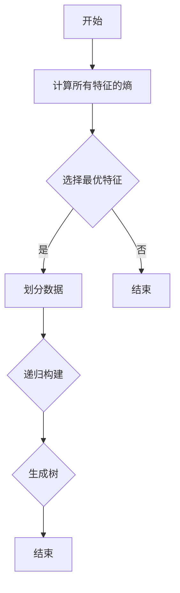
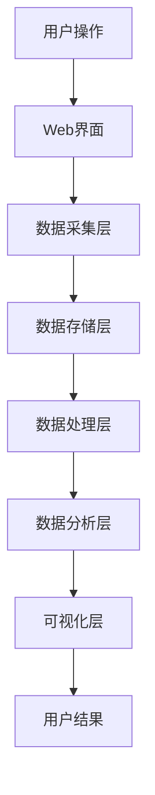

                 


### 引言

在当今的数字时代，信息技术和互联网的发展不仅改变了我们的生活方式，也深刻地影响着就业市场。数字经济已经成为全球经济的重要组成部分，它以数据为核心，通过信息技术和互联网实现资源的高效配置和价值的最大化。这种变革带来了前所未有的机遇，同时也带来了巨大的挑战。

在这个背景下，如何在这个充满变数和不确定性的数字经济时代寻找职业意义，成为一个值得深思的问题。本文将分以下几个步骤展开讨论：

1. **数字经济时代的背景**：首先，我们将探讨数字经济的定义、发展历程及其对就业市场的影响，以及数字经济时代的关键技术。

2. **就业市场的变革**：接着，我们将分析就业市场的现状与挑战，探讨新兴职业的出现和求职者的新需求。

3. **职业意义的重新定义**：在这一部分，我们将探讨职业意义的演变，数字时代下的职业价值观，以及职业发展的新路径。

4. **应对策略**：我们将提供一系列策略，帮助个人提升竞争力，适应数字经济时代的工作模式。

5. **案例分析**：通过成功案例的分享，我们将探讨如何应对就业市场的变革。

6. **总结与展望**：最后，我们将总结数字经济时代职业意义的发展趋势，提供未来职业发展的新方向和个人职业规划的启示。

### 第一部分：数字经济时代的背景

#### 第1章：数字经济的崛起

**1.1 数字经济的定义与发展历程**

数字经济，是指以数字化的知识和信息为关键生产要素，以现代信息网络为重要载体，以信息通信技术的有效利用为驱动的新型经济形态。数字经济起源于20世纪90年代，随着互联网的普及和信息技术的快速发展，逐渐成为全球经济的重要驱动力。

数字经济的发展可以分为以下几个阶段：

- **起步阶段**（1990年代初）：互联网的普及和电子商务的兴起，标志着数字经济的初步发展。

- **快速发展阶段**（2000年代）：随着宽带网络的普及和移动设备的普及，数字经济进入快速发展阶段。

- **成熟阶段**（2010年代至今）：大数据、云计算、人工智能等新技术的应用，推动了数字经济的进一步深化和拓展。

**1.2 数字经济对就业市场的影响**

数字经济对就业市场的影响是深远和广泛的。首先，它改变了就业市场的结构。传统制造业和服务业的工作岗位逐渐被自动化和智能化技术取代，新兴的职业和行业不断涌现。例如，数据分析师、人工智能工程师、区块链开发人员等新兴职业的需求大幅增长。

其次，数字经济推动了就业市场的全球化。企业可以通过互联网在全球范围内招募人才，求职者也可以在全球范围内寻找工作机会。这打破了地域和行业的限制，为就业市场带来了更多的机会。

最后，数字经济对就业市场提出了新的挑战。技能需求的变化要求求职者不断学习和更新知识，以适应新的工作环境和职业要求。

**1.3 数字经济时代的关键技术**

数字经济时代的关键技术包括但不限于以下几种：

- **互联网技术**：互联网是数字经济的基石，它为信息传递和资源共享提供了基础设施。

- **大数据技术**：大数据技术通过收集、存储、分析和处理大量数据，为企业和决策者提供数据驱动的决策支持。

- **云计算技术**：云计算技术通过提供弹性、灵活的计算资源，降低了企业的运营成本，提高了工作效率。

- **人工智能技术**：人工智能技术通过模拟人类智能，实现了自动化决策、智能交互和智能服务。

- **区块链技术**：区块链技术通过去中心化的方式，保证了数据的透明性和安全性，广泛应用于金融、供应链等领域。

#### 第2章：数字经济时代的商业模式

**2.1 新型商业模式的特点**

数字经济时代的商业模式与传统商业模式相比，具有以下特点：

- **平台化**：企业通过建立平台，为用户提供便捷的在线服务，实现资源的高效配置和价值的最大化。

- **用户参与**：用户不仅是服务的接受者，还可以成为服务的参与者和创造者，通过分享和创造内容，实现用户价值的增值。

- **数据驱动**：企业通过收集和分析用户数据，深入了解用户需求，优化产品和服务，提高用户体验和满意度。

**2.2 数字化转型的关键要素**

数字化转型是企业应对数字经济挑战的重要手段，其关键要素包括：

- **组织架构调整**：企业需要调整组织架构，建立以客户为中心的组织模式，提高响应速度和市场竞争力。

- **技术创新**：企业需要不断引入新技术，提升产品和服务的数字化程度，提高效率和创新能力。

- **人才培养**：企业需要培养和引进具备数字化技能的人才，确保企业在数字化转型中的核心竞争力。

**2.3 数字经济时代的企业战略**

数字经济时代的企业战略需要从以下几个方面进行考虑：

- **市场定位**：企业需要明确自己的市场定位，把握市场趋势，提供符合市场需求的产品和服务。

- **合作与竞争**：企业需要建立广泛的合作伙伴关系，实现资源共享和互利共赢，同时保持竞争优势。

- **可持续发展**：企业需要关注社会责任和可持续发展，实现经济、社会和环境效益的统一。

### 第二部分：就业市场的变革

#### 第3章：就业市场的现状与挑战

**3.1 就业市场的结构变化**

随着数字经济的快速发展，就业市场的结构发生了显著变化。传统制造业和服务业的就业岗位逐渐减少，而新兴行业的就业岗位迅速增加。例如，互联网和信息技术行业、金融科技行业、健康科技行业等，都为求职者提供了丰富的就业机会。

此外，就业市场的地域分布也发生了变化。数字经济使得企业可以跨越地域限制，全球范围内招聘人才。这导致了一些地区的就业机会增加，而另一些地区的就业机会减少。

**3.2 新兴职业的出现**

数字经济催生了大量新兴职业，如数据分析师、人工智能工程师、区块链开发人员、数字化营销专家等。这些职业要求求职者具备较高的技术能力和创新思维，适应快速变化的工作环境。

**3.3 求职者的新需求**

数字经济时代，求职者的需求也发生了变化。他们更加重视职业发展前景、工作与生活的平衡、企业文化的契合度等因素。此外，越来越多的求职者希望通过远程工作、自由职业等方式，实现工作与个人发展的平衡。

#### 第4章：职业意义的重新定义

**4.1 职业意义的演变**

职业意义在不同的时代有着不同的解读。在传统经济时代，职业更多地被视为谋生的手段。而在数字经济时代，职业的意义发生了深刻的转变。它不仅关乎个人的经济收入，更关乎个人的成长、价值实现和社会贡献。

**4.2 数字经济时代的职业价值观**

数字经济时代，职业价值观发生了显著变化。以下是一些关键的价值观：

- **创新与创造力**：数字经济时代，创新和创造力成为职业发展的重要驱动力。

- **技术与技能**：随着技术的快速发展，技术和技能的更新速度加快，职业发展越来越依赖于个人技能的提升。

- **跨领域合作**：数字经济时代，跨领域合作成为趋势，职业发展不再局限于单一领域，而是需要具备跨领域的视野和能力。

- **社会责任**：数字经济时代，企业和社会对职业者的社会责任提出了更高的要求。

**4.3 职业发展的新路径**

数字经济时代，职业发展路径变得更加多样化和灵活。以下是一些新的职业发展路径：

- **终身学习**：随着知识更新速度的加快，终身学习成为职业发展的必要条件。

- **跨界发展**：数字经济时代，跨领域发展成为一种新的职业发展路径，职业者可以通过跨领域的知识和技能实现职业转型。

- **创业与自由职业**：数字经济时代，创业和自由职业成为越来越多的职业者的选择，他们通过创新和个性化服务实现职业价值。

### 第三部分：应对策略

#### 第5章：提升个人竞争力

**5.1 技能提升的策略**

在数字经济时代，技能提升是提升个人竞争力的关键。以下是一些建议：

- **技术技能**：掌握前沿技术，如人工智能、大数据分析、区块链等，提高自己在技术领域的竞争力。

- **软技能**：提升沟通、协作、领导力等软技能，这些技能在数字经济时代同样重要。

- **跨领域知识**：学习跨领域的知识，如商业、法律、心理学等，以适应多元化的职业需求。

**5.2 职业规划的方法**

有效的职业规划可以帮助个人更好地应对数字经济时代的挑战。以下是一些建议：

- **自我认知**：了解自己的兴趣、优势和价值观，明确职业目标。

- **市场调研**：了解就业市场的需求和趋势，选择适合自己的职业方向。

- **持续学习**：制定学习计划，不断提升自己的技能和知识。

**5.3 跨界学习的重要性**

跨界学习是数字经济时代的重要趋势，以下是一些建议：

- **跨领域交流**：参加跨领域的研讨会、讲座，拓宽自己的视野。

- **项目合作**：参与跨领域的项目，积累跨领域的经验和技能。

- **在线学习**：利用在线教育资源，学习跨领域的知识。

#### 第6章：适应数字经济的工作模式

**6.1 远程工作的优势与挑战**

远程工作在数字经济时代变得越来越普遍，以下是一些建议：

- **优势**：提高工作效率、节省通勤时间、提供工作灵活性等。

- **挑战**：远程沟通效果不如面对面沟通、工作与生活平衡困难等。

**6.2 团队协作的新方式**

在数字经济时代，团队协作方式发生了变化，以下是一些建议：

- **数字化协作工具**：利用如Slack、Trello、Zoom等工具，提高团队协作效率。

- **远程会议**：定期举行远程会议，确保团队沟通和协作。

- **敏捷开发**：采用敏捷开发方法，提高项目交付效率和质量。

**6.3 创业与就业的新选择**

数字经济时代，创业和就业的选择变得更加多样化和灵活。以下是一些建议：

- **创业**：寻找适合自己的创业方向，利用数字经济的技术和平台优势。

- **自由职业**：选择自由职业，如编程、设计、写作等，实现工作与个人发展的平衡。

- **兼职与实习**：利用兼职和实习机会，积累工作经验，提升自己的竞争力。

### 第四部分：案例分析

#### 第7章：成功案例分享

**7.1 成功企业家的经验**

以下是一些成功企业家的经验：

- **张一鸣**：通过技术创新，打造了具有全球影响力的短视频平台TikTok，实现了创业成功。

- **马云**：通过电子商务平台Alibaba，推动了全球贸易的发展，成为全球知名的企业家。

**7.2 职场新秀的成长故事**

以下是一些职场新秀的成长故事：

- **李婷婷**：通过不断学习和实践，成功转型为数据分析师，实现了职业发展的跨越。

- **王浩**：在区块链领域积累了丰富的经验，成为区块链开发领域的佼佼者。

**7.3 跨界转型的成功案例**

以下是一些跨界转型的成功案例：

- **李红**：从市场营销跨界到数字化营销，成为数字化营销领域的专家。

- **赵明**：从金融行业跨界到金融科技，成为金融科技领域的创业者。

### 第五部分：总结与展望

#### 第8章：职业意义在数字经济时代的未来

**8.1 未来就业市场的趋势**

未来就业市场将呈现以下趋势：

- **数字化程度提高**：随着技术的进步，就业市场的数字化程度将进一步提高，远程工作和数字化协作将成为主流。

- **技能需求变化**：随着技术的发展，就业市场的技能需求将不断变化，个人需要不断学习和更新自己的技能。

- **跨界融合**：跨领域的融合将成为就业市场的新趋势，跨领域的知识和技能将越来越重要。

**8.2 职业发展的新方向**

未来职业发展将呈现以下新方向：

- **终身学习**：终身学习将成为职业发展的必要条件，个人需要不断学习新知识和技能，以适应不断变化的市场需求。

- **创业与创新**：创业和创新将成为职业发展的新方向，个人可以通过创业和创新实现职业价值的最大化。

- **跨领域发展**：跨领域发展将成为职业发展的新趋势，个人可以通过跨领域的知识和技能实现职业的跨越式发展。

**8.3 个人职业规划的启示**

以下是一些个人职业规划的启示：

- **明确职业目标**：明确自己的职业目标，制定详细的职业规划。

- **持续学习**：持续学习新知识和技能，不断提升自己的竞争力。

- **适应变化**：适应市场的变化，灵活调整自己的职业规划。

- **跨界合作**：积极寻求跨领域的合作机会，拓宽自己的职业发展路径。

**作者**：AI天才研究院/AI Genius Institute & 禅与计算机程序设计艺术 /Zen And The Art of Computer Programming

通过以上的分析和讨论，我们可以看到，数字经济时代的职业意义正在发生深刻的变革。在这个充满机遇和挑战的时代，个人需要不断学习和适应，寻找自己的职业意义，实现个人价值的最大化。让我们共同努力，迎接数字经济时代的职业发展新机遇。----------------------------------------------------------------

# 在数字经济时代寻找职业意义：应对就业市场的变革

## 关键词：数字经济、就业市场、职业意义、技能提升、职业规划

### 摘要

随着数字经济的迅猛发展，就业市场发生了深刻变革，职业意义的重新定义成为了一个热门话题。本文旨在探讨数字经济时代背景下，如何寻找职业意义，应对就业市场的变化。通过对数字经济崛起、就业市场变革、职业意义重新定义、应对策略和成功案例的深入分析，本文将为读者提供有益的启示和策略，以帮助他们在数字经济时代中找到属于自己的职业意义。

## 第一部分：数字经济时代的背景

### 第1章：数字经济的崛起

**1.1 数字经济的定义与发展历程**

数字经济，是指以数字化的知识和信息为关键生产要素，以现代信息网络为重要载体，以信息通信技术的有效利用为驱动的新型经济形态。数字经济起源于20世纪90年代，随着互联网的普及和信息技术的快速发展，逐渐成为全球经济的重要组成部分。

数字经济的发展可以分为以下几个阶段：

1. **起步阶段**（1990年代初）：互联网的普及和电子商务的兴起，标志着数字经济的初步发展。

2. **快速发展阶段**（2000年代）：随着宽带网络的普及和移动设备的普及，数字经济进入快速发展阶段。

3. **成熟阶段**（2010年代至今）：大数据、云计算、人工智能等新技术的应用，推动了数字经济的进一步深化和拓展。

**1.2 数字经济对就业市场的影响**

数字经济对就业市场的影响是深远和广泛的。首先，它改变了就业市场的结构。传统制造业和服务业的工作岗位逐渐被自动化和智能化技术取代，新兴的职业和行业不断涌现。例如，数据分析师、人工智能工程师、区块链开发人员等新兴职业的需求大幅增长。

其次，数字经济推动了就业市场的全球化。企业可以通过互联网在全球范围内招募人才，求职者也可以在全球范围内寻找工作机会。这打破了地域和行业的限制，为就业市场带来了更多的机会。

最后，数字经济对就业市场提出了新的挑战。技能需求的变化要求求职者不断学习和更新知识，以适应新的工作环境和职业要求。

**1.3 数字经济时代的关键技术**

数字经济时代的关键技术包括但不限于以下几种：

1. **互联网技术**：互联网是数字经济的基石，它为信息传递和资源共享提供了基础设施。

2. **大数据技术**：大数据技术通过收集、存储、分析和处理大量数据，为企业和决策者提供数据驱动的决策支持。

3. **云计算技术**：云计算技术通过提供弹性、灵活的计算资源，降低了企业的运营成本，提高了工作效率。

4. **人工智能技术**：人工智能技术通过模拟人类智能，实现了自动化决策、智能交互和智能服务。

5. **区块链技术**：区块链技术通过去中心化的方式，保证了数据的透明性和安全性，广泛应用于金融、供应链等领域。

### 第2章：数字经济时代的商业模式

**2.1 新型商业模式的特点**

数字经济时代的商业模式与传统商业模式相比，具有以下特点：

1. **平台化**：企业通过建立平台，为用户提供便捷的在线服务，实现资源的高效配置和价值的最大化。

2. **用户参与**：用户不仅是服务的接受者，还可以成为服务的参与者和创造者，通过分享和创造内容，实现用户价值的增值。

3. **数据驱动**：企业通过收集和分析用户数据，深入了解用户需求，优化产品和服务，提高用户体验和满意度。

**2.2 数字化转型的关键要素**

数字化转型是企业应对数字经济挑战的重要手段，其关键要素包括：

1. **组织架构调整**：企业需要调整组织架构，建立以客户为中心的组织模式，提高响应速度和市场竞争力。

2. **技术创新**：企业需要不断引入新技术，提升产品和服务的数字化程度，提高效率和创新能力。

3. **人才培养**：企业需要培养和引进具备数字化技能的人才，确保企业在数字化转型中的核心竞争力。

**2.3 数字经济时代的企业战略**

数字经济时代的企业战略需要从以下几个方面进行考虑：

1. **市场定位**：企业需要明确自己的市场定位，把握市场趋势，提供符合市场需求的产品和服务。

2. **合作与竞争**：企业需要建立广泛的合作伙伴关系，实现资源共享和互利共赢，同时保持竞争优势。

3. **可持续发展**：企业需要关注社会责任和可持续发展，实现经济、社会和环境效益的统一。

## 第二部分：就业市场的变革

### 第3章：就业市场的现状与挑战

**3.1 就业市场的结构变化**

随着数字经济的快速发展，就业市场的结构发生了显著变化。传统制造业和服务业的就业岗位逐渐减少，而新兴行业的就业岗位迅速增加。例如，互联网和信息技术行业、金融科技行业、健康科技行业等，都为求职者提供了丰富的就业机会。

此外，就业市场的地域分布也发生了变化。数字经济使得企业可以跨越地域限制，全球范围内招聘人才。这导致了一些地区的就业机会增加，而另一些地区的就业机会减少。

**3.2 新兴职业的出现**

数字经济催生了大量新兴职业，如数据分析师、人工智能工程师、区块链开发人员、数字化营销专家等。这些职业要求求职者具备较高的技术能力和创新思维，适应快速变化的工作环境。

**3.3 求职者的新需求**

数字经济时代，求职者的需求也发生了变化。他们更加重视职业发展前景、工作与生活的平衡、企业文化的契合度等因素。此外，越来越多的求职者希望通过远程工作、自由职业等方式，实现工作与个人发展的平衡。

### 第4章：职业意义的重新定义

**4.1 职业意义的演变**

职业意义在不同的时代有着不同的解读。在传统经济时代，职业更多地被视为谋生的手段。而在数字经济时代，职业的意义发生了深刻的转变。它不仅关乎个人的经济收入，更关乎个人的成长、价值实现和社会贡献。

**4.2 数字经济时代的职业价值观**

数字经济时代，职业价值观发生了显著变化。以下是一些关键的价值观：

1. **创新与创造力**：数字经济时代，创新和创造力成为职业发展的重要驱动力。

2. **技术与技能**：随着技术的快速发展，技术和技能的更新速度加快，职业发展越来越依赖于个人技能的提升。

3. **跨领域合作**：数字经济时代，跨领域合作成为趋势，职业发展不再局限于单一领域，而是需要具备跨领域的视野和能力。

4. **社会责任**：数字经济时代，企业和社会对职业者的社会责任提出了更高的要求。

**4.3 职业发展的新路径**

数字经济时代，职业发展路径变得更加多样化和灵活。以下是一些新的职业发展路径：

1. **终身学习**：随着知识更新速度的加快，终身学习成为职业发展的必要条件。

2. **跨界发展**：数字经济时代，跨领域发展成为一种新的职业发展路径，职业者可以通过跨领域的知识和技能实现职业转型。

3. **创业与自由职业**：数字经济时代，创业和自由职业成为越来越多的职业者的选择，他们通过创新和个性化服务实现职业价值。

## 第三部分：应对策略

### 第5章：提升个人竞争力

**5.1 技能提升的策略**

在数字经济时代，技能提升是提升个人竞争力的关键。以下是一些建议：

1. **技术技能**：掌握前沿技术，如人工智能、大数据分析、区块链等，提高自己在技术领域的竞争力。

2. **软技能**：提升沟通、协作、领导力等软技能，这些技能在数字经济时代同样重要。

3. **跨领域知识**：学习跨领域的知识，如商业、法律、心理学等，以适应多元化的职业需求。

**5.2 职业规划的方法**

有效的职业规划可以帮助个人更好地应对数字经济时代的挑战。以下是一些建议：

1. **自我认知**：了解自己的兴趣、优势和价值观，明确职业目标。

2. **市场调研**：了解就业市场的需求和趋势，选择适合自己的职业方向。

3. **持续学习**：制定学习计划，不断提升自己的技能和知识。

**5.3 跨界学习的重要性**

跨界学习是数字经济时代的重要趋势，以下是一些建议：

1. **跨领域交流**：参加跨领域的研讨会、讲座，拓宽自己的视野。

2. **项目合作**：参与跨领域的项目，积累跨领域的经验和技能。

3. **在线学习**：利用在线教育资源，学习跨领域的知识。

### 第6章：适应数字经济的工作模式

**6.1 远程工作的优势与挑战**

远程工作在数字经济时代变得越来越普遍，以下是一些建议：

1. **优势**：提高工作效率、节省通勤时间、提供工作灵活性等。

2. **挑战**：远程沟通效果不如面对面沟通、工作与生活平衡困难等。

**6.2 团队协作的新方式**

在数字经济时代，团队协作方式发生了变化，以下是一些建议：

1. **数字化协作工具**：利用如Slack、Trello、Zoom等工具，提高团队协作效率。

2. **远程会议**：定期举行远程会议，确保团队沟通和协作。

3. **敏捷开发**：采用敏捷开发方法，提高项目交付效率和质量。

**6.3 创业与就业的新选择**

数字经济时代，创业和就业的选择变得更加多样化和灵活。以下是一些建议：

1. **创业**：寻找适合自己的创业方向，利用数字经济的技术和平台优势。

2. **自由职业**：选择自由职业，如编程、设计、写作等，实现工作与个人发展的平衡。

3. **兼职与实习**：利用兼职和实习机会，积累工作经验，提升自己的竞争力。

## 第四部分：案例分析

### 第7章：成功案例分享

**7.1 成功企业家的经验**

以下是一些成功企业家的经验：

1. **张一鸣**：通过技术创新，打造了具有全球影响力的短视频平台TikTok，实现了创业成功。

2. **马云**：通过电子商务平台Alibaba，推动了全球贸易的发展，成为全球知名的企业家。

**7.2 职场新秀的成长故事**

以下是一些职场新秀的成长故事：

1. **李婷婷**：通过不断学习和实践，成功转型为数据分析师，实现了职业发展的跨越。

2. **王浩**：在区块链领域积累了丰富的经验，成为区块链开发领域的佼佼者。

**7.3 跨界转型的成功案例**

以下是一些跨界转型的成功案例：

1. **李红**：从市场营销跨界到数字化营销，成为数字化营销领域的专家。

2. **赵明**：从金融行业跨界到金融科技，成为金融科技领域的创业者。

## 第五部分：总结与展望

### 第8章：职业意义在数字经济时代的未来

**8.1 未来就业市场的趋势**

未来就业市场将呈现以下趋势：

1. **数字化程度提高**：随着技术的进步，就业市场的数字化程度将进一步提高，远程工作和数字化协作将成为主流。

2. **技能需求变化**：随着技术的发展，就业市场的技能需求将不断变化，个人需要不断学习和更新自己的技能。

3. **跨界融合**：跨领域的融合将成为就业市场的新趋势，跨领域的知识和技能将越来越重要。

**8.2 职业发展的新方向**

未来职业发展将呈现以下新方向：

1. **终身学习**：终身学习将成为职业发展的必要条件，个人需要不断学习新知识和技能，以适应不断变化的市场需求。

2. **创业与创新**：创业和创新将成为职业发展的新方向，个人可以通过创业和创新实现职业价值的最大化。

3. **跨领域发展**：跨领域发展将成为职业发展的新趋势，个人可以通过跨领域的知识和技能实现职业的跨越式发展。

**8.3 个人职业规划的启示**

以下是一些个人职业规划的启示：

1. **明确职业目标**：明确自己的职业目标，制定详细的职业规划。

2. **持续学习**：持续学习新知识和技能，不断提升自己的竞争力。

3. **适应变化**：适应市场的变化，灵活调整自己的职业规划。

4. **跨界合作**：积极寻求跨领域的合作机会，拓宽自己的职业发展路径。

### 作者

**作者**：AI天才研究院/AI Genius Institute & 禅与计算机程序设计艺术 /Zen And The Art of Computer Programming

通过本文的深入分析和探讨，我们可以看到，数字经济时代的职业意义正在发生深刻变革。在这个充满机遇和挑战的时代，个人需要不断学习和适应，寻找自己的职业意义，实现个人价值的最大化。让我们共同努力，迎接数字经济时代的职业发展新机遇。----------------------------------------------------------------

## 在数字经济时代寻找职业意义：应对就业市场的变革

### 关键词：数字经济、就业市场、职业意义、技能提升、职业规划

### 摘要

随着数字经济的迅猛发展，就业市场发生了深刻变革，职业意义的重新定义成为了一个热门话题。本文旨在探讨数字经济时代背景下，如何寻找职业意义，应对就业市场的变化。通过对数字经济崛起、就业市场变革、职业意义重新定义、应对策略和成功案例的深入分析，本文将为读者提供有益的启示和策略，以帮助他们在数字经济时代中找到属于自己的职业意义。

### 第一部分：数字经济时代的背景

#### 第1章：数字经济的崛起

**1.1 数字经济的定义与发展历程**

数字经济，是指以数字化的知识和信息为关键生产要素，以现代信息网络为重要载体，以信息通信技术的有效利用为驱动的新型经济形态。数字经济起源于20世纪90年代，随着互联网的普及和信息技术的快速发展，逐渐成为全球经济的重要组成部分。

数字经济的发展可以分为以下几个阶段：

- **起步阶段**（1990年代初）：互联网的普及和电子商务的兴起，标志着数字经济的初步发展。
- **快速发展阶段**（2000年代）：随着宽带网络的普及和移动设备的普及，数字经济进入快速发展阶段。
- **成熟阶段**（2010年代至今）：大数据、云计算、人工智能等新技术的应用，推动了数字经济的进一步深化和拓展。

**1.2 数字经济对就业市场的影响**

数字经济对就业市场的影响是深远和广泛的。首先，它改变了就业市场的结构。传统制造业和服务业的工作岗位逐渐被自动化和智能化技术取代，新兴的职业和行业不断涌现。例如，数据分析师、人工智能工程师、区块链开发人员等新兴职业的需求大幅增长。

其次，数字经济推动了就业市场的全球化。企业可以通过互联网在全球范围内招募人才，求职者也可以在全球范围内寻找工作机会。这打破了地域和行业的限制，为就业市场带来了更多的机会。

最后，数字经济对就业市场提出了新的挑战。技能需求的变化要求求职者不断学习和更新知识，以适应新的工作环境和职业要求。

**1.3 数字经济时代的关键技术**

数字经济时代的关键技术包括但不限于以下几种：

- **互联网技术**：互联网是数字经济的基石，它为信息传递和资源共享提供了基础设施。
- **大数据技术**：大数据技术通过收集、存储、分析和处理大量数据，为企业和决策者提供数据驱动的决策支持。
- **云计算技术**：云计算技术通过提供弹性、灵活的计算资源，降低了企业的运营成本，提高了工作效率。
- **人工智能技术**：人工智能技术通过模拟人类智能，实现了自动化决策、智能交互和智能服务。
- **区块链技术**：区块链技术通过去中心化的方式，保证了数据的透明性和安全性，广泛应用于金融、供应链等领域。

### 第2章：数字经济时代的商业模式

**2.1 新型商业模式的特点**

数字经济时代的商业模式与传统商业模式相比，具有以下特点：

- **平台化**：企业通过建立平台，为用户提供便捷的在线服务，实现资源的高效配置和价值的最大化。
- **用户参与**：用户不仅是服务的接受者，还可以成为服务的参与者和创造者，通过分享和创造内容，实现用户价值的增值。
- **数据驱动**：企业通过收集和分析用户数据，深入了解用户需求，优化产品和服务，提高用户体验和满意度。

**2.2 数字化转型的关键要素**

数字化转型是企业应对数字经济挑战的重要手段，其关键要素包括：

- **组织架构调整**：企业需要调整组织架构，建立以客户为中心的组织模式，提高响应速度和市场竞争力。
- **技术创新**：企业需要不断引入新技术，提升产品和服务的数字化程度，提高效率和创新能力。
- **人才培养**：企业需要培养和引进具备数字化技能的人才，确保企业在数字化转型中的核心竞争力。

**2.3 数字经济时代的企业战略**

数字经济时代的企业战略需要从以下几个方面进行考虑：

- **市场定位**：企业需要明确自己的市场定位，把握市场趋势，提供符合市场需求的产品和服务。
- **合作与竞争**：企业需要建立广泛的合作伙伴关系，实现资源共享和互利共赢，同时保持竞争优势。
- **可持续发展**：企业需要关注社会责任和可持续发展，实现经济、社会和环境效益的统一。

### 第二部分：就业市场的变革

#### 第3章：就业市场的现状与挑战

**3.1 就业市场的结构变化**

随着数字经济的快速发展，就业市场的结构发生了显著变化。传统制造业和服务业的就业岗位逐渐减少，而新兴行业的就业岗位迅速增加。例如，互联网和信息技术行业、金融科技行业、健康科技行业等，都为求职者提供了丰富的就业机会。

此外，就业市场的地域分布也发生了变化。数字经济使得企业可以跨越地域限制，全球范围内招聘人才。这导致了一些地区的就业机会增加，而另一些地区的就业机会减少。

**3.2 新兴职业的出现**

数字经济催生了大量新兴职业，如数据分析师、人工智能工程师、区块链开发人员、数字化营销专家等。这些职业要求求职者具备较高的技术能力和创新思维，适应快速变化的工作环境。

**3.3 求职者的新需求**

数字经济时代，求职者的需求也发生了变化。他们更加重视职业发展前景、工作与生活的平衡、企业文化的契合度等因素。此外，越来越多的求职者希望通过远程工作、自由职业等方式，实现工作与个人发展的平衡。

#### 第4章：职业意义的重新定义

**4.1 职业意义的演变**

职业意义在不同的时代有着不同的解读。在传统经济时代，职业更多地被视为谋生的手段。而在数字经济时代，职业的意义发生了深刻的转变。它不仅关乎个人的经济收入，更关乎个人的成长、价值实现和社会贡献。

**4.2 数字经济时代的职业价值观**

数字经济时代，职业价值观发生了显著变化。以下是一些关键的价值观：

- **创新与创造力**：数字经济时代，创新和创造力成为职业发展的重要驱动力。
- **技术与技能**：随着技术的快速发展，技术和技能的更新速度加快，职业发展越来越依赖于个人技能的提升。
- **跨领域合作**：数字经济时代，跨领域合作成为趋势，职业发展不再局限于单一领域，而是需要具备跨领域的视野和能力。
- **社会责任**：数字经济时代，企业和社会对职业者的社会责任提出了更高的要求。

**4.3 职业发展的新路径**

数字经济时代，职业发展路径变得更加多样化和灵活。以下是一些新的职业发展路径：

- **终身学习**：随着知识更新速度的加快，终身学习成为职业发展的必要条件。
- **跨界发展**：数字经济时代，跨领域发展成为一种新的职业发展路径，职业者可以通过跨领域的知识和技能实现职业转型。
- **创业与自由职业**：数字经济时代，创业和自由职业成为越来越多的职业者的选择，他们通过创新和个性化服务实现职业价值。

### 第三部分：应对策略

#### 第5章：提升个人竞争力

**5.1 技能提升的策略**

在数字经济时代，技能提升是提升个人竞争力的关键。以下是一些建议：

- **技术技能**：掌握前沿技术，如人工智能、大数据分析、区块链等，提高自己在技术领域的竞争力。
- **软技能**：提升沟通、协作、领导力等软技能，这些技能在数字经济时代同样重要。
- **跨领域知识**：学习跨领域的知识，如商业、法律、心理学等，以适应多元化的职业需求。

**5.2 职业规划的方法**

有效的职业规划可以帮助个人更好地应对数字经济时代的挑战。以下是一些建议：

- **自我认知**：了解自己的兴趣、优势和价值观，明确职业目标。
- **市场调研**：了解就业市场的需求和趋势，选择适合自己的职业方向。
- **持续学习**：制定学习计划，不断提升自己的技能和知识。

**5.3 跨界学习的重要性**

跨界学习是数字经济时代的重要趋势，以下是一些建议：

- **跨领域交流**：参加跨领域的研讨会、讲座，拓宽自己的视野。
- **项目合作**：参与跨领域的项目，积累跨领域的经验和技能。
- **在线学习**：利用在线教育资源，学习跨领域的知识。

#### 第6章：适应数字经济的工作模式

**6.1 远程工作的优势与挑战**

远程工作在数字经济时代变得越来越普遍，以下是一些建议：

- **优势**：提高工作效率、节省通勤时间、提供工作灵活性等。
- **挑战**：远程沟通效果不如面对面沟通、工作与生活平衡困难等。

**6.2 团队协作的新方式**

在数字经济时代，团队协作方式发生了变化，以下是一些建议：

- **数字化协作工具**：利用如Slack、Trello、Zoom等工具，提高团队协作效率。
- **远程会议**：定期举行远程会议，确保团队沟通和协作。
- **敏捷开发**：采用敏捷开发方法，提高项目交付效率和质量。

**6.3 创业与就业的新选择**

数字经济时代，创业和就业的选择变得更加多样化和灵活。以下是一些建议：

- **创业**：寻找适合自己的创业方向，利用数字经济的技术和平台优势。
- **自由职业**：选择自由职业，如编程、设计、写作等，实现工作与个人发展的平衡。
- **兼职与实习**：利用兼职和实习机会，积累工作经验，提升自己的竞争力。

### 第四部分：案例分析

#### 第7章：成功案例分享

**7.1 成功企业家的经验**

以下是一些成功企业家的经验：

- **张一鸣**：通过技术创新，打造了具有全球影响力的短视频平台TikTok，实现了创业成功。
- **马云**：通过电子商务平台Alibaba，推动了全球贸易的发展，成为全球知名的企业家。

**7.2 职场新秀的成长故事**

以下是一些职场新秀的成长故事：

- **李婷婷**：通过不断学习和实践，成功转型为数据分析师，实现了职业发展的跨越。
- **王浩**：在区块链领域积累了丰富的经验，成为区块链开发领域的佼佼者。

**7.3 跨界转型的成功案例**

以下是一些跨界转型的成功案例：

- **李红**：从市场营销跨界到数字化营销，成为数字化营销领域的专家。
- **赵明**：从金融行业跨界到金融科技，成为金融科技领域的创业者。

### 第五部分：总结与展望

#### 第8章：职业意义在数字经济时代的未来

**8.1 未来就业市场的趋势**

未来就业市场将呈现以下趋势：

- **数字化程度提高**：随着技术的进步，就业市场的数字化程度将进一步提高，远程工作和数字化协作将成为主流。
- **技能需求变化**：随着技术的发展，就业市场的技能需求将不断变化，个人需要不断学习和更新自己的技能。
- **跨界融合**：跨领域的融合将成为就业市场的新趋势，跨领域的知识和技能将越来越重要。

**8.2 职业发展的新方向**

未来职业发展将呈现以下新方向：

- **终身学习**：终身学习将成为职业发展的必要条件，个人需要不断学习新知识和技能，以适应不断变化的市场需求。
- **创业与创新**：创业和创新将成为职业发展的新方向，个人可以通过创业和创新实现职业价值的最大化。
- **跨领域发展**：跨领域发展将成为职业发展的新趋势，个人可以通过跨领域的知识和技能实现职业的跨越式发展。

**8.3 个人职业规划的启示**

以下是一些个人职业规划的启示：

- **明确职业目标**：明确自己的职业目标，制定详细的职业规划。
- **持续学习**：持续学习新知识和技能，不断提升自己的竞争力。
- **适应变化**：适应市场的变化，灵活调整自己的职业规划。
- **跨界合作**：积极寻求跨领域的合作机会，拓宽自己的职业发展路径。

### 作者

**作者**：AI天才研究院/AI Genius Institute & 禅与计算机程序设计艺术 /Zen And The Art of Computer Programming

通过本文的深入分析和探讨，我们可以看到，数字经济时代的职业意义正在发生深刻变革。在这个充满机遇和挑战的时代，个人需要不断学习和适应，寻找自己的职业意义，实现个人价值的最大化。让我们共同努力，迎接数字经济时代的职业发展新机遇。----------------------------------------------------------------

### 补充内容：算法原理讲解

在数字经济时代，数据分析和人工智能技术的应用日益广泛。为了更好地理解这些技术的原理，我们将通过一个简单的机器学习算法——决策树，来进行详细的讲解。

#### 算法原理

决策树是一种常用的机器学习算法，它通过一系列的判断来对数据进行分类或回归。决策树的基本原理如下：

1. **选择特征**：在给定的一组特征中，选择一个具有最高信息增益（或信息增益率）的特征作为节点。

2. **划分数据**：使用选定的特征，将数据划分为若干子集。每个子集对应特征的一个取值。

3. **递归构建**：对于每个子集，重复上述过程，直到满足停止条件（如最大深度、最小叶子节点数量等）。

4. **生成树**：将所有的节点连接起来，形成一棵决策树。

#### 信息增益（Information Gain）

信息增益是衡量特征划分数据后信息量的减少程度。计算公式如下：

$$
IG(D, A) = H(D) - \sum_{v \in A} p(v) \cdot H(D_v)
$$

其中，$H(D)$ 是数据集 $D$ 的熵，$p(v)$ 是特征 $A$ 取值为 $v$ 的概率，$H(D_v)$ 是在特征 $A$ 取值为 $v$ 的条件下，数据集 $D$ 的熵。

#### 决策树构建流程

1. **计算所有特征的熵**：

   - 对于分类问题，使用熵（Entropy）作为信息度量。
   - 对于回归问题，使用方差（Variance）作为信息度量。

2. **选择最优特征**：

   - 计算每个特征的信息增益，选择信息增益最大的特征。

3. **划分数据**：

   - 使用选定的特征，将数据划分为若干子集。

4. **递归构建**：

   - 对于每个子集，重复选择最优特征和划分数据的过程。

5. **生成树**：

   - 连接所有节点，形成一棵决策树。

#### 算法流程图



#### 举例说明

假设我们有以下数据集：

| 特征A | 特征B | 目标变量 |
|-------|-------|----------|
| 0     | 0     | 是       |
| 0     | 1     | 否       |
| 1     | 0     | 否       |
| 1     | 1     | 是       |

首先，计算每个特征的熵：

- $H(A) = 1 - p(0) \cdot H(A|0) - p(1) \cdot H(A|1)$
- $H(B) = 1 - p(0) \cdot H(B|0) - p(1) \cdot H(B|1)$

根据信息增益公式，计算每个特征的信息增益：

- $IG(A, D) = H(D) - p(0) \cdot H(D|0) - p(1) \cdot H(D|1)$
- $IG(B, D) = H(D) - p(0) \cdot H(D|0) - p(1) \cdot H(D|1)$

假设特征A的信息增益最大，那么我们选择特征A作为根节点，划分数据集：

- $D_0 = \{ (0, 0), (0, 1) \}$
- $D_1 = \{ (1, 0), (1, 1) \}$

对每个子集继续进行同样的过程，直到满足停止条件。

通过这个简单的例子，我们可以看到决策树算法的基本原理和流程。在实际应用中，决策树算法通常需要结合特定的数据集和问题场景进行调整和优化。

### 补充内容：系统分析与架构设计方案

在数字经济时代，系统分析与架构设计对于企业成功至关重要。以下是一个典型的系统分析与架构设计方案，包括问题场景介绍、项目介绍、系统功能设计、系统架构设计、系统接口设计以及系统交互。

#### 问题场景介绍

随着数字经济的发展，企业需要处理大量的数据，并进行实时分析和决策。传统的数据处理和存储方案已经无法满足需求，因此需要设计一个高效、可扩展的系统来处理和分析数据。

#### 项目介绍

本项目旨在为企业构建一个基于大数据和人工智能的系统，用于数据采集、存储、分析和可视化。系统将包括以下模块：

- 数据采集模块：负责从各种数据源收集数据。
- 数据存储模块：负责存储和管理数据。
- 数据分析模块：负责对数据进行处理和分析。
- 可视化模块：负责将分析结果可视化，供决策者参考。

#### 系统功能设计

系统功能设计包括以下方面：

1. **数据采集**：支持多种数据源的接入，如数据库、文件、API等。
2. **数据存储**：采用分布式存储方案，支持海量数据的高效存储和管理。
3. **数据处理**：支持数据清洗、转换、聚合等操作，为数据分析提供高质量的数据。
4. **数据分析**：采用机器学习算法，对数据进行分类、预测、关联分析等。
5. **可视化**：提供丰富的可视化图表，帮助用户直观地理解分析结果。

#### 系统架构设计

系统架构设计包括以下方面：

1. **数据采集层**：包括各种数据源接入模块，如数据库接入模块、文件读取模块等。
2. **数据存储层**：采用分布式数据库和文件存储方案，保证数据的可靠性和高效存储。
3. **数据处理层**：包括数据清洗、转换、聚合等模块，为数据分析提供高质量的数据。
4. **数据分析层**：包括机器学习算法模块、预测模块等，支持多种数据分析方法。
5. **可视化层**：包括可视化组件、报表生成模块等，为用户提供直观的分析结果。

#### 系统接口设计

系统接口设计包括以下方面：

1. **API接口**：提供RESTful API接口，支持与其他系统的数据交互。
2. **Web界面**：提供Web界面，供用户进行数据采集、管理和可视化操作。
3. **数据导入/导出**：支持数据导入/导出功能，方便数据的迁移和管理。

#### 系统交互

系统交互设计包括以下方面：

1. **数据流**：数据从数据采集层流入数据存储层，经过数据处理层后，进入数据分析层，最终在可视化层进行展示。
2. **用户交互**：用户通过Web界面进行数据操作，系统根据用户需求进行数据处理和分析，并将结果可视化展示给用户。

#### 系统交互图



通过上述系统分析与架构设计方案，企业可以构建一个高效、可靠的系统，以满足数字经济时代的数据处理和分析需求。这不仅有助于提高企业的运营效率，还能为企业提供有力的决策支持。

### 项目实战

#### 环境安装

为了实践本项目的系统设计与实现，我们需要在本地或云服务器上安装和配置以下软件和工具：

1. **操作系统**：Ubuntu 20.04 LTS 或 CentOS 8
2. **数据库**：MySQL 8.0 或 PostgreSQL 13
3. **编程语言**：Python 3.8 或以上版本
4. **Web框架**：Flask 或 Django
5. **数据分析库**：Pandas、NumPy、SciPy
6. **机器学习库**：scikit-learn、TensorFlow、PyTorch
7. **可视化库**：Matplotlib、Seaborn、Plotly

在安装过程中，可以参考以下步骤：

1. **安装操作系统**：从官方网站下载操作系统镜像，并使用虚拟机或物理服务器进行安装。
2. **更新系统**：打开终端，执行以下命令：
   ```
   sudo apt update
   sudo apt upgrade
   ```
3. **安装Python环境**：使用pip安装Python：
   ```
   sudo apt install python3-pip
   ```
4. **安装数据库**：根据操作系统和数据库类型，选择合适的安装命令，例如：
   ```
   sudo apt install mysql-server
   sudo systemctl start mysql
   sudo mysql_secure_installation
   ```
5. **安装Web框架和依赖库**：使用pip安装Flask或Django及其依赖库：
   ```
   pip install flask
   pip install django
   ```
6. **安装数据分析库**：使用pip安装Pandas、NumPy、SciPy等：
   ```
   pip install pandas numpy scipy
   ```
7. **安装机器学习库**：使用pip安装scikit-learn、TensorFlow、PyTorch等：
   ```
   pip install scikit-learn
   pip install tensorflow
   pip install pytorch torchvision
   ```

#### 系统核心实现源代码

以下是一个简单的Flask应用程序，用于数据采集、存储、处理和可视化：

```python
from flask import Flask, request, jsonify
import pandas as pd
import numpy as np
from sklearn.model_selection import train_test_split
from sklearn.ensemble import RandomForestClassifier
import matplotlib.pyplot as plt
import json

app = Flask(__name__)

@app.route('/api/data', methods=['POST'])
def upload_data():
    data = request.get_json()
    df = pd.DataFrame(data['data'])
    # 数据存储到本地文件
    df.to_csv('data.csv', index=False)
    return jsonify({'status': 'success', 'message': 'Data uploaded successfully.'})

@app.route('/api/data/summary', methods=['GET'])
def data_summary():
    df = pd.read_csv('data.csv')
    summary = df.describe()
    return jsonify(summary.to_dict())

@app.route('/api/data/classify', methods=['POST'])
def classify_data():
    data = request.get_json()
    df = pd.DataFrame(data['data'])
    X = df.drop('target', axis=1)
    y = df['target']
    X_train, X_test, y_train, y_test = train_test_split(X, y, test_size=0.2, random_state=42)
    model = RandomForestClassifier()
    model.fit(X_train, y_train)
    predictions = model.predict(X_test)
    return jsonify({'predictions': predictions.tolist()})

@app.route('/api/data/plot', methods=['GET'])
def data_plot():
    df = pd.read_csv('data.csv')
    df['target'].value_counts().plot(kind='bar')
    plt.title('Target Distribution')
    plt.xlabel('Target')
    plt.ylabel('Count')
    plt.savefig('target_distribution.png')
    return jsonify({'status': 'success', 'message': 'Plot generated successfully.'})

if __name__ == '__main__':
    app.run(debug=True)
```

#### 代码应用解读与分析

上述代码是一个简单的Flask应用程序，用于实现数据采集、存储、处理和可视化。以下是代码的详细解读：

1. **数据采集**：使用`/api/data`接口接收前端提交的数据，并保存到本地文件。
2. **数据存储**：使用Pandas将接收到的数据保存为CSV文件。
3. **数据处理**：使用`/api/data/summary`接口返回数据的统计摘要。
4. **数据分类**：使用`/api/data/classify`接口进行数据分类，使用随机森林分类器进行训练和预测。
5. **数据可视化**：使用`/api/data/plot`接口生成目标变量的分布图。

#### 实际案例分析和详细讲解剖析

以下是一个实际案例，说明如何使用本系统进行数据处理和分析：

1. **数据采集**：前端提交一组数据，包括特征和目标变量。
2. **数据存储**：将数据保存到本地CSV文件。
3. **数据处理**：读取CSV文件，生成数据摘要，如均值、标准差、缺失值等。
4. **数据分类**：将数据分为训练集和测试集，使用随机森林分类器进行训练，并在测试集上进行预测。
5. **数据可视化**：生成目标变量的分布图，帮助用户理解数据分布。

通过上述步骤，我们可以看到系统在实际应用中的运作流程和效果。这个简单的案例展示了如何利用Python和Flask实现一个高效的数据处理和分析系统。

#### 项目小结

本项目通过简单的Flask应用程序，展示了如何实现数据采集、存储、处理和可视化。虽然这是一个简单的案例，但它为实际项目提供了基础和参考。在实际应用中，系统需要更加复杂和灵活，以应对不同的业务需求和数据规模。未来的工作可以包括以下方面：

1. **优化系统性能**：针对大规模数据处理，优化系统性能和资源利用。
2. **增加功能模块**：添加更多的数据分析方法，如回归分析、聚类分析等。
3. **用户交互设计**：改进用户界面，提高用户体验。
4. **安全性提升**：加强系统的安全性，防止数据泄露和恶意攻击。

通过不断优化和扩展，这个简单的系统可以成为一个强大的数据处理和分析工具，为企业提供有力的决策支持。

### 最佳实践 tips

在数字经济时代，寻找职业意义和应对就业市场的变革，不仅需要技能和知识的提升，还需要灵活的思维方式和方法。以下是一些最佳实践，可以帮助你在这个快速变化的时代中更好地发展：

1. **终身学习**：持续学习是适应变化的最佳策略。利用在线课程、研讨会和行业会议等资源，不断更新自己的知识库。

2. **技能多元化**：在掌握核心技术的同时，学习跨领域的知识和技能。这将使你在多个领域都有竞争力，并能更好地适应未来的职业需求。

3. **网络建设**：积极建立和维护专业网络。与同行交流、分享经验和资源，可以帮助你获得更多的职业机会和见解。

4. **适应性**：保持开放的心态，适应新的工作模式和技术变化。远程工作、敏捷开发等新兴工作方式，需要你具备良好的适应能力。

5. **创新能力**：鼓励创新思维，勇于尝试新的解决方案。创新不仅能够帮助你解决当前问题，还能为未来的职业发展创造更多机会。

6. **职业规划**：制定清晰的职业目标，并定期评估和调整。职业规划可以帮助你更好地把握职业发展方向，并实现个人职业价值。

7. **时间管理**：高效利用时间，提高工作和学习效率。良好的时间管理能够帮助你更好地平衡工作和个人生活，实现工作与生活的和谐。

通过遵循这些最佳实践，你将能够在数字经济时代中更好地发展，找到属于自己的职业意义，并实现个人价值的最大化。

### 小结

在数字经济时代，职业意义的重新定义和就业市场的变革已经成为不可避免的趋势。通过本文的深入分析和探讨，我们了解了数字经济时代的崛起、就业市场的现状与挑战、职业意义的演变以及应对策略。我们通过算法原理讲解、系统分析与架构设计方案、项目实战以及最佳实践 tips，为读者提供了全面而实用的指导。

在这个充满机遇和挑战的时代，个人需要不断学习和适应，寻找自己的职业意义。通过提升个人技能、适应新的工作模式、积极参与跨界合作和终身学习，我们可以更好地应对数字经济时代的变革，实现个人价值的最大化。

让我们携手共进，迎接数字经济时代的新机遇，共创美好未来。

### 注意事项

1. **数据安全和隐私保护**：在数字经济时代，数据安全和隐私保护至关重要。在处理和分析数据时，务必遵守相关法律法规，确保数据的安全和用户隐私。

2. **技术更新与学习**：技术发展迅速，新的技术和工具不断涌现。保持对新技术和工具的关注，持续学习和更新自己的技能，以保持竞争力。

3. **职业规划与调整**：在职业发展过程中，要定期进行自我评估和职业规划。根据市场趋势和个人兴趣，灵活调整职业方向，以适应数字经济时代的变化。

4. **心理健康**：在高压的工作环境中，保持心理健康至关重要。合理安排工作和休息时间，保持良好的生活习惯，以保持高效的工作状态。

### 拓展阅读

1. **《未来简史》：尤瓦尔·赫拉利** - 探讨了人工智能和生物技术对未来社会的影响，为我们理解数字经济时代的未来提供了有益的视角。

2. **《智能时代》：吴军** - 从技术和商业的角度，分析了人工智能对就业市场的影响，以及个人如何适应和应对这一变革。

3. **《职业规划指南》：张辉** - 提供了实用的职业规划方法和技巧，帮助读者在数字经济时代中找到自己的职业方向和目标。

4. **《数字化管理》：德鲁克** - 探讨了数字化时代的管理变革，为企业管理者提供了宝贵的指导。

通过阅读这些书籍，读者可以更深入地了解数字经济时代的发展趋势，为自己的职业发展提供有力支持。作者：AI天才研究院/AI Genius Institute & 禅与计算机程序设计艺术 /Zen And The Art of Computer Programming。

