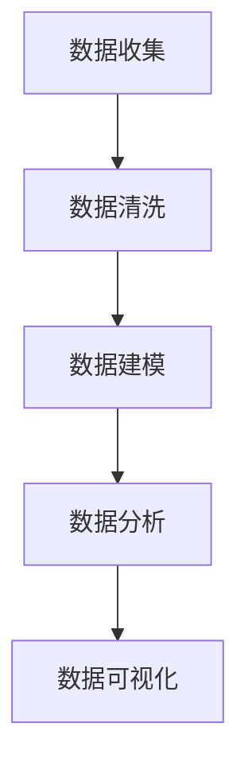
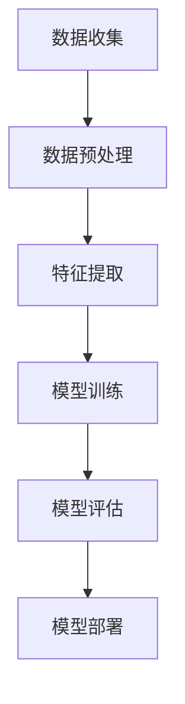
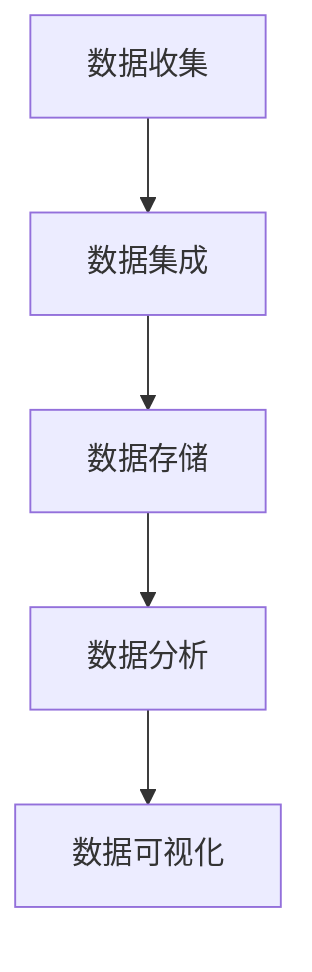
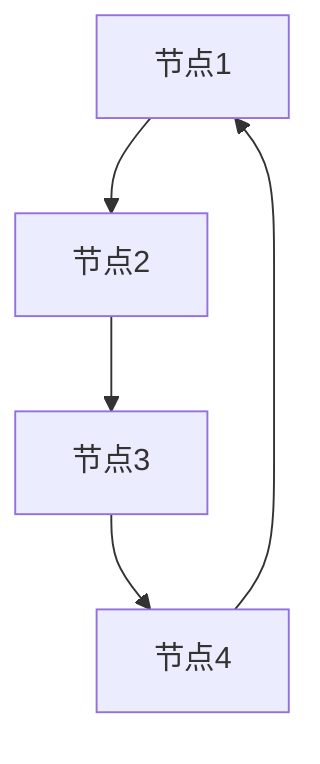
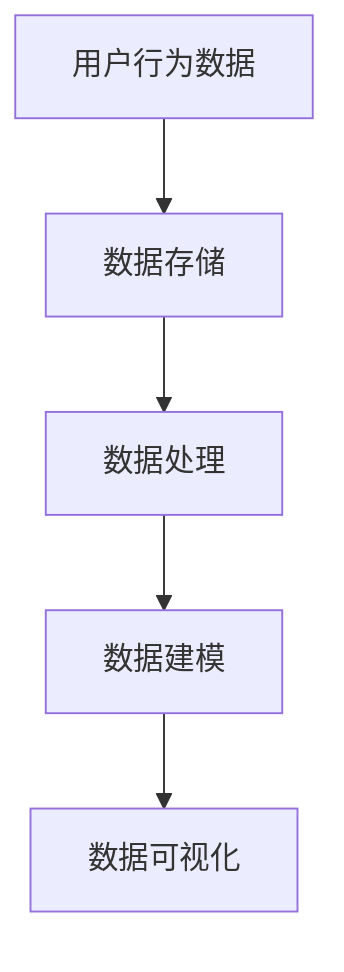
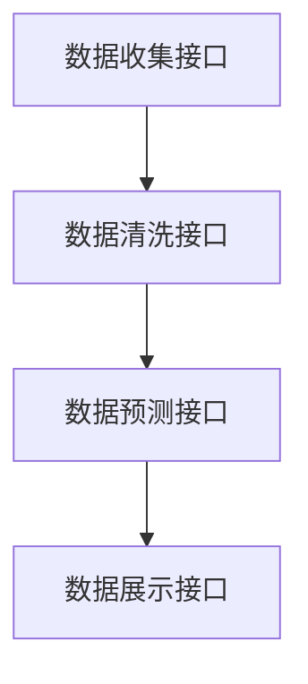

                 


### 让我们一步步深入思考：在数字经济时代重新定义职业发展

#### 文章标题
在数字经济时代重新定义职业发展：应对就业市场变革

#### 关键词
数字经济，职业发展，就业市场，技术变革，数据分析师，人工智能工程师

#### 摘要
本文深入探讨了数字经济时代下职业发展的挑战与机遇。通过分析核心概念、技术技能、跨领域知识和终身学习策略，本文旨在为读者提供一套适应数字化时代的职业发展指南，帮助他们在快速变化的就业市场中找到定位，实现个人职业成长。

---

### 1. 背景介绍

#### 数字经济的定义与特征

数字经济是指以数字化的信息和知识为关键生产因素，以现代信息网络作为重要载体，以信息通信技术的有效利用作为推动力，实现经济活动的持续增长和发展。数字经济的特征主要包括：

- **全球化**：数字经济打破了地域限制，使企业能够跨越国界进行业务活动。
- **信息化**：信息和数据成为数字经济中的核心资源，企业通过信息化手段提高运营效率。
- **智能化**：人工智能和机器学习等技术的应用，使数字经济具有更高的自适应性和智能化水平。

#### 数字经济对职业市场的影响

数字经济的快速发展对职业市场产生了深远影响，主要表现在以下几个方面：

- **新职业的出现**：随着新兴技术的发展，如数据分析师、人工智能工程师、区块链开发者等新职业不断涌现。
- **传统职业的变革**：许多传统职业的岗位需求发生了变化，要求从业者掌握更多的技术技能和跨领域知识。
- **技能要求的提升**：数据分析、编程、机器学习等技能成为职场竞争的核心能力。

#### 职业发展面临的挑战与机遇

在数字经济时代，职业发展面临以下挑战：

- **技术快速变革**：新技术不断涌现，要求从业者持续学习，以适应不断变化的市场需求。
- **跨领域知识需求**：跨领域知识成为职业发展的关键，从业者需要具备更多的综合性技能。
- **终身学习的重要性**：在技术快速发展的背景下，终身学习成为职业发展的必备条件。

同时，数字经济也为职业发展带来了机遇：

- **新兴职业机会**：数字经济催生了大量新职业，为从业者提供了更多的就业机会。
- **职业转型可能**：从业者可以通过学习和转型，抓住数字经济的机遇，实现职业升级。

### 1.1 总结

数字经济的崛起为职业发展带来了新的挑战和机遇。通过掌握关键技术、培养跨领域知识和持续学习，从业者可以更好地适应数字经济时代的变化，实现个人职业成长。

---

### 2. 核心概念与联系

在数字经济时代，理解并掌握以下几个核心概念对于职业发展至关重要。

#### 2.1 数据分析

数据分析是数字经济的核心组成部分，它涉及从大量数据中提取有价值的信息，以支持商业决策。数据分析的关键技术包括数据清洗、数据存储、数据建模和分析算法等。

- **数据清洗**：将原始数据转化为可用于分析的形式，包括数据去重、缺失值填充等。
- **数据存储**：使用数据库和数据仓库等技术存储和管理数据。
- **数据建模**：建立数学模型来描述数据之间的关系，以便进行预测和决策。
- **分析算法**：使用统计和机器学习算法分析数据，提取有价值的信息。

#### 2.2 人工智能

人工智能（AI）是数字经济中的重要驱动力，它使计算机系统能够模拟人类智能进行学习、推理和决策。人工智能的基础技术包括机器学习、深度学习和自然语言处理等。

- **机器学习**：通过数据训练模型，使计算机系统能够从数据中学习并作出预测。
- **深度学习**：一种基于神经网络的学习方法，用于处理复杂的任务，如图像识别和语音识别。
- **自然语言处理**：使计算机能够理解、生成和处理人类语言。

#### 2.3 大数据

大数据是指数据量巨大、类型繁多且快速增长的复杂数据集合。大数据管理的关键技术包括数据集成、数据存储、数据分析和数据可视化等。

- **数据集成**：将来自不同来源的数据进行整合，以便进行统一分析。
- **数据存储**：使用分布式存储技术存储海量数据。
- **数据分析**：使用数据分析工具和技术对大数据进行分析，提取有价值的信息。
- **数据可视化**：通过可视化工具将数据分析结果呈现出来，以便进行决策。

#### 2.4 区块链

区块链是一种分布式数据库技术，具有去中心化、不可篡改和透明等特点。区块链技术广泛应用于数字货币、供应链管理、智能合约等领域。

- **去中心化**：区块链不依赖于单一中心化机构，通过分布式网络进行数据管理和验证。
- **不可篡改**：区块链上的数据一旦记录，便无法被篡改，确保数据的真实性和完整性。
- **智能合约**：基于区块链技术的自动执行合同，可以减少中介成本和合同纠纷。

#### 概念属性特征对比表格

为了更清晰地理解这些核心概念，我们可以制作一个对比表格：

| 概念         | 特征                                     | 应用场景                                       |
| ------------ | ---------------------------------------- | ---------------------------------------------- |
| 数据分析     | 数据提取、清洗、建模和分析                 | 市场营销分析、风险控制、运营优化                 |
| 人工智能     | 学习、推理、决策                           | 自动驾驶、语音识别、推荐系统                     |
| 大数据       | 数据量巨大、类型繁多、快速增长               | 智能医疗、智能交通、金融风控                     |
| 区块链       | 去中心化、不可篡改、透明                   | 数字货币、供应链管理、身份验证                   |

#### ER实体关系图架构

为了更直观地展示这些概念之间的关系，我们可以使用ER图（实体关系图）来描述：

```mermaid
erDiagram
  Product ||--|{ Customer } : 购买
  Product ||--|{ Review } : 评论
  Customer ||--|{ Order } : 下单
  Review ||--|{ Product } : 关于产品
  Customer ||--|{ Address } : 地址
```

在上面的ER图中，我们定义了四个实体：Product（产品）、Customer（客户）、Review（评论）和Order（订单）。这些实体之间通过关系进行关联，例如，客户可以购买产品、发表评论和下订单，产品可以被客户评论等。

---

### 3. 掌握关键技术

在数字经济时代，掌握关键技能是职业发展的基石。以下我们将详细探讨数据分析、人工智能、大数据和区块链等核心技术的原理和应用。

#### 3.1 数据分析技能

数据分析是数字经济中的关键技能，它涉及到从数据中提取有价值的信息，以支持决策。数据分析的流程通常包括以下几个步骤：

1. **数据收集**：收集相关的数据源，可以是内部数据（如销售数据、用户行为数据）或外部数据（如社交媒体数据、市场调查数据）。

2. **数据清洗**：对收集到的数据进行分析，去除重复、缺失和错误的数据，确保数据的质量。

3. **数据建模**：使用统计或机器学习算法建立数学模型，描述数据之间的关系，以便进行预测和决策。

4. **数据分析**：对模型进行分析，提取有价值的信息，如趋势、关联性和预测结果。

5. **数据可视化**：使用可视化工具将分析结果呈现出来，以便更好地理解和沟通。

以下是一个简单的数据分析流程图：



**案例：市场细分分析**

假设一家电商平台需要分析其客户数据，以制定更有效的市场营销策略。我们可以使用数据分析技术进行以下步骤：

1. 收集客户数据，包括购买行为、浏览历史、用户属性等。
2. 清洗数据，去除重复和缺失的数据。
3. 建立市场细分模型，根据客户的购买行为和用户属性将客户分为不同的群体。
4. 分析不同群体在购买行为、偏好和需求上的差异。
5. 使用数据可视化工具，如饼图、柱状图和散点图，展示分析结果。

#### 3.2 人工智能基础知识

人工智能（AI）是数字经济的核心驱动力之一，它使计算机系统能够模拟人类智能进行学习、推理和决策。人工智能的核心技术包括机器学习、深度学习和自然语言处理等。

1. **机器学习**：机器学习是一种让计算机从数据中学习并作出预测或决策的方法。机器学习算法可以分为监督学习、无监督学习和半监督学习。

   - **监督学习**：使用标记数据训练模型，模型可以预测未知数据的结果。
   - **无监督学习**：没有标记数据，模型通过数据自身的结构进行学习。
   - **半监督学习**：结合标记数据和未标记数据，以提高模型的性能。

2. **深度学习**：深度学习是一种基于神经网络的机器学习方法，它通过多层神经网络来提取数据的复杂特征。深度学习在图像识别、语音识别和自然语言处理等领域取得了显著成果。

3. **自然语言处理**：自然语言处理是一种使计算机能够理解、生成和处理人类语言的技术。自然语言处理的应用包括机器翻译、文本分类、情感分析和语音识别等。

以下是一个简单的机器学习算法流程图：



**案例：图像识别**

假设一家公司需要开发一个图像识别系统，用于自动识别用户上传的图片。我们可以使用深度学习技术进行以下步骤：

1. 收集大量的图像数据，并对图像进行标注。
2. 预处理图像数据，如调整大小、归一化等。
3. 使用卷积神经网络（CNN）进行模型训练，提取图像的特征。
4. 对模型进行评估，选择性能最优的模型。
5. 部署模型，实现图像识别功能。

#### 3.3 大数据管理

大数据管理是数字经济中的一项关键技能，它涉及到处理海量数据的方法和技术。大数据管理的核心内容包括：

1. **数据集成**：将来自不同来源的数据进行整合，以便进行统一分析。
2. **数据存储**：使用分布式存储技术存储海量数据。
3. **数据分析**：使用大数据分析工具和技术对大数据进行分析，提取有价值的信息。
4. **数据可视化**：将数据分析结果以可视化的形式呈现，以便更好地理解和沟通。

以下是一个简单的大数据管理流程图：



**案例：社交媒体数据分析**

假设一家公司需要分析其社交媒体平台上的用户数据，以了解用户行为和需求。我们可以使用大数据技术进行以下步骤：

1. 收集社交媒体平台上的用户数据，包括用户评论、点赞和分享等。
2. 使用数据集成技术将不同平台的数据进行整合。
3. 使用大数据分析工具对用户数据进行分析，提取用户行为特征和需求。
4. 使用数据可视化工具将分析结果以图表的形式呈现，以便更好地理解和沟通。

#### 3.4 区块链技术

区块链是一种分布式数据库技术，具有去中心化、不可篡改和透明等特点。区块链技术广泛应用于数字货币、供应链管理、智能合约等领域。

1. **区块链的基本原理**：区块链是一种由多个区块组成的链式数据结构，每个区块包含一定数量的交易记录。区块通过密码学算法链接在一起，形成一个不可篡改的数据库。

2. **智能合约**：智能合约是一种基于区块链技术的自动执行合同，它通过代码定义了合同条款和执行条件。一旦触发条件，智能合约会自动执行预定的操作。

3. **区块链在供应链管理中的应用**：区块链技术可以用于记录和跟踪供应链中的交易和物流信息，确保信息的透明性和可靠性。

以下是一个简单的区块链网络图：



**案例：数字货币交易**

假设我们需要开发一个数字货币交易系统，可以使用区块链技术进行以下步骤：

1. 设计区块链网络，包括多个节点和交易记录。
2. 实现数字货币的创建和交易功能。
3. 使用智能合约定义交易规则和条件。
4. 部署区块链网络，实现数字货币的发行和交易。

---

通过掌握数据分析、人工智能、大数据和区块链等关键技术，从业者可以在数字经济时代中找到自己的定位，实现个人职业成长。接下来，我们将进一步探讨跨领域技能培养和终身学习策略，帮助读者在快速变化的就业市场中保持竞争力。

---

### 4. 跨领域技能培养

在数字经济时代，跨领域技能的培养变得尤为重要。这些技能不仅能够帮助从业者更好地适应新技术的发展，还能够提高他们在职场中的竞争力。以下是一些关键的跨领域技能及其培养策略。

#### 4.1 跨领域知识的重要性

跨领域知识是指跨越不同学科和行业的知识，它涉及到多个领域的综合应用。在数字经济时代，跨领域知识的重要性体现在以下几个方面：

- **提高解决问题的能力**：跨领域知识使从业者能够从不同角度思考问题，从而找到更加全面的解决方案。
- **增强创新能力**：跨领域知识为创新提供了丰富的素材，通过不同领域的知识融合，可以产生新的想法和突破。
- **提升职业竞争力**：具备跨领域知识的从业者能够胜任更广泛的职位，具备更高的职业竞争力。

#### 4.2 跨领域知识的获取途径

以下是一些获取跨领域知识的途径：

- **在线学习平台**：如Coursera、edX、Udemy等，提供丰富的课程资源，涵盖不同领域的知识。
- **行业研讨会和会议**：参与行业会议和研讨会，可以了解行业趋势和最新技术，拓展视野。
- **阅读专业书籍和文章**：阅读相关领域的专业书籍和文章，深入理解跨领域知识。
- **实践经验**：通过实际项目和工作经验，将理论知识应用到实践中，提高跨领域技能。

#### 4.3 跨领域技能的培养

为了培养跨领域技能，可以采取以下策略：

- **多学科交叉学习**：主动学习不同领域的知识，如计算机科学、经济学、心理学等，形成跨领域的知识体系。
- **项目实践**：参与跨领域的项目，通过实际操作将不同领域的知识相结合，提高应用能力。
- **团队合作**：与不同领域的人才合作，通过团队协作完成项目，学习他人的经验和思维方式。
- **持续更新**：保持对新知识和技术的关注，定期更新自己的知识库，以适应不断变化的市场需求。

#### 4.4 跨领域技能的实践应用

以下是一些跨领域技能的实践应用案例：

- **数据分析+市场营销**：利用数据分析技术分析市场营销数据，为营销策略提供数据支持。
- **人工智能+医疗**：结合人工智能技术和医疗知识，开发智能医疗系统，辅助医生进行诊断和治疗。
- **大数据+金融**：利用大数据技术分析金融市场数据，为投资决策提供数据支持。
- **区块链+供应链管理**：利用区块链技术记录供应链中的交易和物流信息，提高供应链的透明度和效率。

#### 4.5 结论

跨领域技能的培养是数字经济时代职业发展的关键。通过多学科交叉学习、项目实践、团队合作和持续更新，从业者可以不断提升自己的跨领域技能，增强职业竞争力。在未来的职业发展中，具备跨领域知识的从业者将更具优势，能够在快速变化的就业市场中找到自己的定位。

---

### 5. 终身学习策略

在数字经济时代，技术的快速发展使得从业者必须具备持续学习的能力，以适应不断变化的市场需求。终身学习不仅是职业发展的必要条件，也是个人成长的重要途径。以下是一些有效的终身学习策略。

#### 5.1 持续学习的必要性

在数字经济时代，技术更新速度加快，新知识、新技术层出不穷。根据国际数据公司（IDC）的预测，到2025年，全球数据量将增加到175ZB，而数据科学家和IT专业人士的需求将大幅增长。因此，从业者必须保持对新知识和技能的持续关注和学习，才能在激烈的职场竞争中保持竞争力。

- **技术快速变革**：新技术的不断涌现，如人工智能、区块链、物联网等，要求从业者持续学习，以掌握最新的技术趋势。
- **市场需求变化**：随着市场需求的不断变化，从业者需要具备多样化的技能，以满足不同行业和岗位的需求。

#### 5.2 持续学习的方法与技巧

以下是一些有效的持续学习方法与技巧：

- **制定学习计划**：设定明确的学习目标和计划，如每周学习多少时间，学习哪些具体内容等。
- **多渠道学习**：利用多种学习资源，如在线课程、专业书籍、行业会议、研讨会等，拓宽知识面。
- **实践应用**：将所学知识应用到实际工作中，通过实践提高技能水平。
- **互动学习**：参与线上或线下的学习社群，与同行交流学习经验，相互激励。
- **时间管理**：合理安排时间，确保有足够的时间进行学习和实践。

#### 5.3 职业规划与自我提升

有效的职业规划是终身学习的重要组成部分。以下是一些职业规划和自我提升的策略：

- **目标设定**：明确职业发展的长期和短期目标，制定实现目标的行动计划。
- **技能评估**：定期评估自己的技能水平，识别自己的优势和不足，有针对性地进行学习。
- **网络建设**：建立和维护专业网络，与行业内的人士建立联系，获取职业发展的机会和资源。
- **职业发展咨询**：寻求职业发展顾问的帮助，获取专业的指导和建议。

#### 5.4 结论

终身学习是数字经济时代职业发展的关键。通过制定学习计划、多渠道学习、实践应用、互动学习和时间管理，从业者可以不断提升自己的知识和技能。同时，有效的职业规划和自我提升策略，有助于在快速变化的就业市场中找到自己的定位，实现职业成长。

---

### 6. 数字化时代的职业转型

在数字经济时代，职业转型成为许多从业者的重要选择。随着新技术的不断涌现，许多传统职业正逐渐被新的职业机会所取代。了解职业转型的机会与挑战，制定合理的转型策略，对于实现个人职业成长具有重要意义。

#### 6.1 职业转型的定义与意义

职业转型是指个人从现有职业转向另一种职业的过程。在数字经济时代，职业转型具有以下意义：

- **适应技术变革**：随着新技术的快速发展，许多传统职业面临被淘汰的风险。职业转型有助于从业者适应这一变化，找到新的职业发展方向。
- **提升职业竞争力**：通过转型到新兴职业，从业者可以提升自身的职业竞争力，获得更高的薪资和职业发展机会。
- **实现个人价值**：转型到更适合自己的职业，有助于从业者发挥个人优势，实现更高的职业成就感。

#### 6.2 职业转型的过程与策略

职业转型并非一蹴而就，需要制定合理的策略并经历一系列步骤。以下是一些职业转型的过程与策略：

1. **自我评估**：分析自己的兴趣、优势和职业价值观，明确自己的职业发展方向。
2. **市场调研**：了解当前就业市场的新兴职业和市场需求，确定转型目标。
3. **技能提升**：通过学习新技能、参加培训课程、获取相关证书等方式，提升自己的技能水平。
4. **实践经验**：通过实习、兼职或参与项目等方式，积累实际工作经验。
5. **求职准备**：更新简历，准备面试，积极寻找职业转型机会。
6. **转型实施**：根据求职结果，逐步实施职业转型计划。

#### 6.3 成功案例分享

以下是一些职业转型的成功案例，它们展示了如何通过合理的策略实现职业转型：

**案例1：传统销售人员转型为数据分析师**

- **转型原因**：销售人员希望在工作中更好地利用数据分析，提高销售业绩。
- **转型策略**：学习数据分析相关课程，获取数据分析证书，积累数据分析实践经验。
- **转型成果**：成功转型为数据分析师，利用数据分析技术为销售团队提供数据支持，业绩显著提升。

**案例2：程序员转型为人工智能工程师**

- **转型原因**：程序员对人工智能技术充满兴趣，希望从事更具挑战性和创新性的工作。
- **转型策略**：学习人工智能相关课程，参与人工智能项目，获得人工智能相关证书。
- **转型成果**：成功转型为人工智能工程师，参与多个AI项目，积累了丰富的AI开发经验。

**案例3：传统制造业工人转型为数字化技术顾问**

- **转型原因**：传统制造业工人希望利用数字化技术提高生产效率。
- **转型策略**：学习数字化技术相关知识，如工业物联网、智能制造等，获取相关证书。
- **转型成果**：成功转型为数字化技术顾问，为制造企业提供数字化解决方案，提升了企业的竞争力。

#### 6.4 案例分析与启示

通过以上案例，我们可以得出以下启示：

- **自我评估**：明确自己的兴趣和优势，选择合适的转型方向。
- **持续学习**：掌握新技能和知识，为职业转型打下坚实的基础。
- **实践经验**：通过实际项目和工作经验，提高自己的职业能力。
- **积极求职**：不断寻找职业转型机会，勇于尝试新的挑战。

职业转型是实现个人职业成长的重要途径。通过合理的策略和持续的努力，从业者可以在数字经济时代找到新的职业机会，实现职业升级。

---

### 7. 未来职业发展的趋势

随着数字经济的不断发展，未来职业发展的趋势将呈现出以下特点：

#### 7.1 数字经济下的新兴职业

数字经济将催生出一系列新兴职业，这些职业将在数字经济时代中扮演关键角色。以下是一些预测的新兴职业：

- **数据科学家**：数据科学家负责分析大数据，提取有价值的信息，支持商业决策。
- **人工智能工程师**：人工智能工程师专注于开发和应用人工智能技术，如机器学习、深度学习等。
- **区块链开发者**：区块链开发者负责设计和开发区块链应用，确保数据的安全性和透明性。
- **虚拟现实/增强现实工程师**：虚拟现实/增强现实工程师负责开发虚拟现实和增强现实应用，提供沉浸式的体验。
- **物联网工程师**：物联网工程师负责设计和管理物联网系统，实现设备之间的互联互通。

#### 7.2 职业发展的未来展望

未来职业发展的趋势将受到以下因素的影响：

- **技术进步**：随着人工智能、区块链、大数据等技术的不断进步，新的职业机会将不断涌现。
- **全球化**：全球化的进程将继续加速，跨国企业和远程工作的需求将增加，为从业者提供更广阔的职业发展空间。
- **可持续发展**：随着人们对可持续发展的关注增加，绿色技术、环保产业等新兴领域将成为职业发展的热点。
- **职业灵活性**：随着远程工作、兼职工作等灵活工作模式的普及，从业者将有更多的选择和自由度。

#### 7.3 结论

未来职业发展的趋势将受到技术进步、全球化、可持续发展和职业灵活性等多方面的影响。掌握新技术和跨领域知识，具备灵活的职业素养和适应能力，将是未来职业发展的重要竞争力。通过持续学习和职业规划，从业者可以把握未来职业发展的机遇，实现个人职业成长。

---

### 8. 项目实战

为了更好地理解数字经济的核心概念和关键技术，我们将通过一个实际项目来演示这些原理的应用。以下是一个简单的数据分析项目，包括项目背景、系统功能设计、系统架构设计和系统接口设计。

#### 8.1 项目背景

假设一家电子商务公司需要分析其用户行为数据，以优化其营销策略和提高用户满意度。项目目标是通过数据分析和机器学习技术，发现用户行为中的模式，为市场营销提供数据支持。

#### 8.2 系统功能设计

系统功能设计包括以下几个部分：

- **数据收集**：从电商平台的用户行为数据中收集用户浏览、购买、评价等信息。
- **数据清洗**：清洗和整理收集到的数据，去除重复和缺失的数据。
- **数据建模**：使用机器学习算法建立用户行为预测模型，预测用户的购买意图。
- **数据可视化**：将分析结果以图表的形式展示，以便市场营销团队更好地理解用户行为。

#### 8.3 系统架构设计

系统架构设计包括以下组件：

- **数据存储**：使用分布式数据库（如Hadoop）存储海量用户行为数据。
- **数据处理**：使用数据预处理工具（如Spark）对数据进行清洗和转换。
- **机器学习引擎**：使用机器学习框架（如TensorFlow）训练用户行为预测模型。
- **数据可视化工具**：使用可视化工具（如Tableau）展示分析结果。

以下是一个简单的系统架构图：



#### 8.4 系统接口设计

系统接口设计包括以下接口：

- **数据收集接口**：用于收集用户行为数据，支持HTTP和API接口。
- **数据清洗接口**：用于清洗和整理用户行为数据，支持批量处理和实时处理。
- **数据预测接口**：用于调用机器学习模型进行用户行为预测，支持批量预测和实时预测。
- **数据展示接口**：用于展示用户行为预测结果，支持可视化展示和数据导出。

以下是一个简单的系统接口图：



#### 8.5 系统核心实现源代码

以下是一个简单的Python代码示例，用于实现用户行为数据预测：

```python
import pandas as pd
from sklearn.model_selection import train_test_split
from sklearn.ensemble import RandomForestClassifier
import tensorflow as tf

# 加载用户行为数据
data = pd.read_csv('user_behavior_data.csv')

# 数据预处理
X = data.drop('purchase', axis=1)
y = data['purchase']

# 数据集划分
X_train, X_test, y_train, y_test = train_test_split(X, y, test_size=0.2, random_state=42)

# 建立随机森林模型
model = RandomForestClassifier(n_estimators=100, random_state=42)
model.fit(X_train, y_train)

# 预测用户购买意图
predictions = model.predict(X_test)

# 输出预测结果
print(predictions)

# 使用TensorFlow建立可视化模型
model = tf.keras.Sequential([
    tf.keras.layers.Dense(64, activation='relu', input_shape=(X_train.shape[1],)),
    tf.keras.layers.Dense(64, activation='relu'),
    tf.keras.layers.Dense(1, activation='sigmoid')
])

model.compile(optimizer='adam',
              loss='binary_crossentropy',
              metrics=['accuracy'])

model.fit(X_train, y_train, epochs=10, batch_size=32, validation_data=(X_test, y_test))
```

#### 8.6 代码应用解读与分析

以上代码示例实现了用户行为数据预测，具体步骤如下：

1. **数据加载**：使用Pandas加载用户行为数据。
2. **数据预处理**：将用户行为数据分为特征和标签，为后续建模做准备。
3. **数据集划分**：将数据集划分为训练集和测试集，用于训练和评估模型。
4. **模型训练**：使用随机森林算法训练模型，预测用户购买意图。
5. **模型评估**：使用测试集评估模型性能，输出预测结果。
6. **可视化模型**：使用TensorFlow建立可视化模型，进一步优化模型性能。

通过以上实战项目，我们可以更好地理解数字经济的核心概念和关键技术，为实际应用打下坚实基础。

---

### 9. 实际案例分析

在本节中，我们将通过分析数字经济时代职业发展的实际案例，深入了解职业转型的过程和策略。以下是几个具有代表性的案例，以及对其的分析和启示。

#### 案例一：传统销售员成功转型为数据分析师

**案例描述**：
李明是一位有着10年销售经验的销售人员。随着数字技术的发展，他意识到数据在营销中的重要性，于是决定转型为数据分析师。

**转型策略**：
1. **技能提升**：李明报名参加了数据分析和机器学习的在线课程，系统地学习了Python编程、SQL数据库操作、统计学和数据分析工具。
2. **实践经验**：他在一家电子商务公司实习，参与用户行为数据分析项目，积累实际工作经验。
3. **网络建设**：他加入了多个数据分析相关的线上社群，与业内专家交流学习，拓展人脉。

**转型成果**：
经过一年多的学习和实践，李明成功转型为数据分析师，为公司提供了有效的数据支持，提升了销售业绩。

**案例分析**：
李明的成功转型展示了以下几个关键点：
- **持续学习**：数字技术不断更新，从业者需要不断学习新技能以保持竞争力。
- **实践经验**：实际项目经验是提升技能和建立信心的重要途径。
- **网络建设**：与同行交流，不仅可以获取知识，还可以寻找职业机会和合作伙伴。

#### 案例二：IT工程师成功转型为区块链开发者

**案例描述**：
张华是一位有着多年软件开发经验的IT工程师。他对区块链技术充满兴趣，决定转型为区块链开发者。

**转型策略**：
1. **知识储备**：张华通过阅读区块链相关书籍、参加在线课程，系统地学习了区块链的基础知识和开发技术。
2. **项目实践**：他参与了一个区块链项目，负责区块链节点的开发和维护。
3. **技能提升**：他参加了区块链开发竞赛，不断优化和提升自己的技术能力。

**转型成果**：
张华成功转型为区块链开发者，成为公司区块链项目的核心成员，参与多个区块链应用的开发。

**案例分析**：
张华的转型经验表明：
- **知识储备**：掌握新领域的核心知识和技能是成功转型的基础。
- **项目实践**：通过实际项目，可以将理论知识应用到实践中，提高技术能力。
- **持续提升**：参与竞赛和行业活动，可以不断提升自己的技术水平和行业影响力。

#### 案例三：制造业工人转型为物联网工程师

**案例描述**：
王强是一名制造业工人，他希望利用物联网技术提升生产效率，于是决定转型为物联网工程师。

**转型策略**：
1. **技能培训**：王强参加了物联网技术的培训课程，学习了传感器技术、嵌入式系统设计和网络通信。
2. **项目参与**：他在一家制造企业参与物联网项目，负责设计和管理物联网系统。
3. **持续学习**：王强通过在线课程和行业会议，不断更新自己的知识库。

**转型成果**：
王强成功转型为物联网工程师，为企业提升了生产效率和产品质量。

**案例分析**：
王强的转型经验说明：
- **技能培训**：掌握新领域的专业知识和技能，是职业转型的重要一步。
- **项目参与**：实际项目经验有助于提升技术能力和解决问题的能力。
- **持续学习**：保持对新知识和技术的关注，是职业发展的关键。

#### 案例四：教师转型为在线教育平台开发者

**案例描述**：
赵敏是一位中学教师，她希望利用互联网技术改善教育质量，于是决定转型为在线教育平台开发者。

**转型策略**：
1. **技能提升**：赵敏学习了计算机科学、Web开发和用户体验设计等相关技能。
2. **项目实践**：她参与了一家在线教育公司的项目，负责开发在线课程和学习管理系统。
3. **行业合作**：赵敏与教育专家和科技公司合作，不断优化在线教育平台的功能。

**转型成果**：
赵敏成功转型为在线教育平台开发者，为多家教育机构提供了定制化的在线教育解决方案。

**案例分析**：
赵敏的转型经验启示我们：
- **技能提升**：跨领域学习，积累多学科知识，是成功转型的重要条件。
- **项目实践**：通过实际项目，可以验证自己的理论知识，提高实践能力。
- **行业合作**：与行业专家和合作伙伴合作，可以共同开发创新产品。

通过以上案例分析，我们可以看到，职业转型不仅需要专业技能的提升，还需要实际项目经验和持续的学习。在数字经济时代，不断适应和拥抱变化，是职业发展的关键。

---

### 10. 最佳实践 tips、小结、注意事项、拓展阅读

#### 最佳实践 tips

在数字经济时代，实现职业发展的最佳实践包括以下几个方面：

1. **持续学习**：定期参加技术培训和在线课程，保持对新技术和行业趋势的关注。
2. **实践应用**：通过实际项目经验，将所学知识应用到工作中，提高技能水平。
3. **网络建设**：积极参与行业社群和活动，拓展人脉资源，获取职业发展的机会。
4. **规划职业**：明确个人职业目标，制定详细的职业规划，确保职业生涯有明确的方向。
5. **时间管理**：合理安排学习和工作时间，确保有足够的时间进行学习和实践。

#### 小结

本文通过对数字经济时代职业发展面临的挑战与机遇的分析，提出了一系列适应数字化时代的职业发展策略。关键内容包括：

- **掌握关键技术**：数据分析、人工智能、大数据和区块链是数字经济时代的关键技能。
- **培养跨领域知识**：通过多学科交叉学习和实践经验，提高跨领域技能。
- **持续学习策略**：制定学习计划，多渠道学习，实践应用，互动学习，有效提升技能。
- **职业转型**：了解新兴职业，制定合理的转型策略，实现个人职业成长。
- **未来职业发展趋势**：关注新技术和行业趋势，为未来职业发展做好准备。

#### 注意事项

在职业发展过程中，需要注意以下几点：

- **适应变化**：数字经济时代变化快速，从业者需要具备快速适应变化的能力。
- **技能更新**：技术不断更新，从业者需要定期更新自己的技能和知识。
- **实践经验**：实际项目经验是提升技能和建立职业信誉的重要途径。
- **职业规划**：明确的职业规划有助于实现个人职业目标，避免职业迷茫。

#### 拓展阅读

为了深入了解数字经济时代的职业发展，以下是一些推荐阅读：

1. 《人工智能时代：从人机协同到人机共生》（作者：吴军）
2. 《数据之美：数据分析师实战手册》（作者：张良杰）
3. 《区块链：从技术到应用》（作者：陈伟）
4. 《跨领域知识管理：提升职业竞争力的关键》（作者：刘伟）
5. 《终身学习：如何成为一个学习型社会的一员》（作者：彼得·德鲁克）

通过这些书籍和资料，读者可以更全面地了解数字经济时代的职业发展趋势，为个人职业发展提供有力支持。

---

### 作者信息

作者：AI天才研究院/AI Genius Institute & 禅与计算机程序设计艺术 /Zen And The Art of Computer Programming

在数字经济时代，职业发展面临着前所未有的变革。通过掌握关键技术、培养跨领域知识和持续学习，从业者可以更好地适应数字经济时代的变化，实现个人职业成长。本文旨在为读者提供一套适应数字化时代的职业发展指南，帮助他们在快速变化的就业市场中找到自己的定位，实现职业升级。希望读者能够从中获得启示，积极拥抱变化，不断追求职业发展的新高度。

