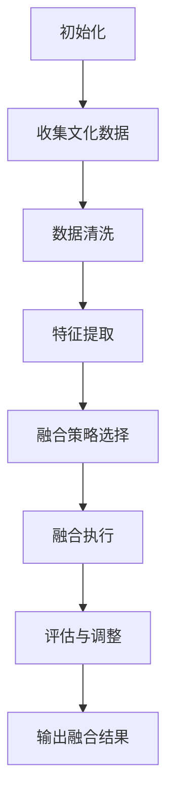
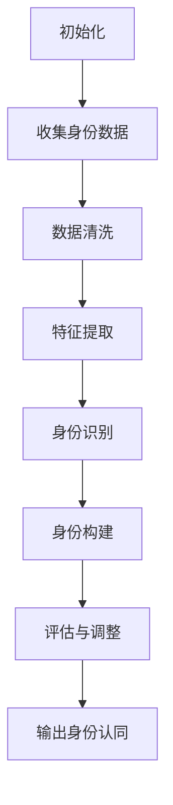
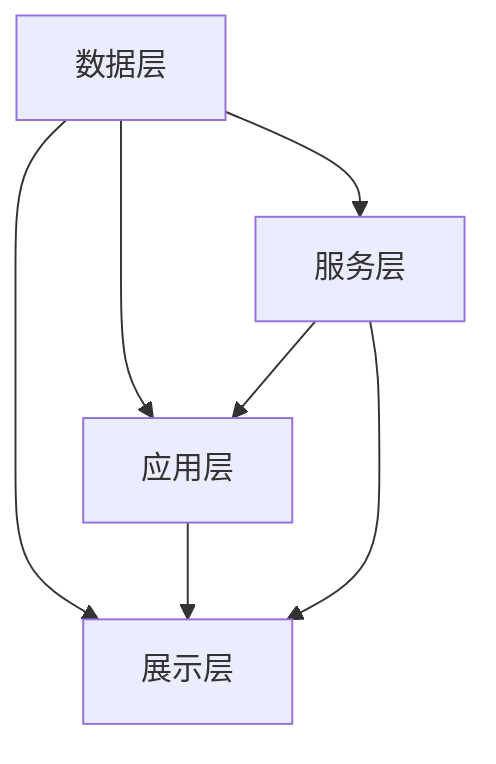
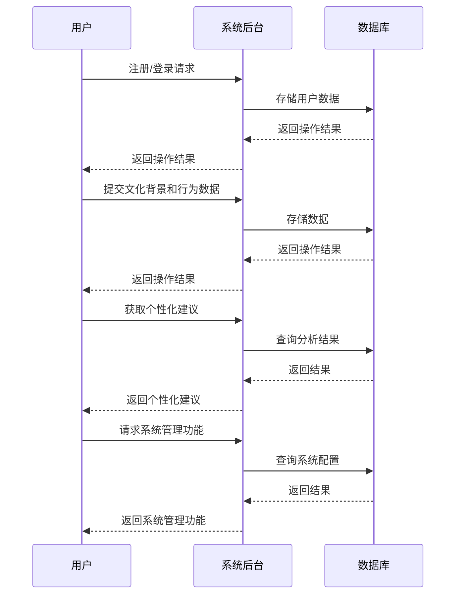

                 

### 第1章：全球化背景下的文化融合与身份认同

#### 1.1 问题背景

随着全球化的不断推进，各国之间的文化交流与融合日益加深。全球化不仅在经济、政治、科技等领域产生了深远的影响，也在文化层面上带来了显著的变革。文化融合作为全球化的重要组成部分，既带来了机遇，也带来了挑战。

**1.1.1 全球化的推进**

全球化是指各国在经济、政治、文化等方面日益紧密联系和互动的过程。近年来，随着信息技术的快速发展，全球化进程进一步加快。互联网的普及使得不同国家和地区的文化能够更加便捷地传播和交流，社交媒体的兴起也为人们提供了更多的文化交流平台。

**1.1.2 文化融合的挑战**

在全球化背景下，文化融合面临着诸多挑战。首先，文化差异的存在导致了文化冲突的潜在可能性。不同文化背景下的人们对于同一问题的看法和解决方案往往存在差异，这可能导致误解和冲突。其次，文化融合过程中，一些本土文化可能面临被边缘化或消失的风险。为了适应全球化的需求，一些国家和地区可能会倾向于放弃本土文化，转而接受更为广泛的文化认同。

**1.1.3 身份认同的重要性**

身份认同是指个体对于自身身份的认同和认知。在全球化背景下，身份认同变得尤为重要。一个稳定和积极的身份认同可以帮助个体在面对文化融合和挑战时保持自身的文化特色和价值观。同时，身份认同也是个体自我表达和与他人互动的重要基础。

#### 1.2 问题描述

**1.2.1 文化冲突的表现**

文化冲突在全球化背景下表现得尤为明显。文化冲突不仅体现在不同文化背景的人们之间的互动中，也体现在政策制定和执行过程中。例如，在跨国企业运营中，不同文化背景的员工可能因为工作方式、沟通风格和价值观念的差异而产生冲突。此外，不同文化背景的消费者也可能因为对产品和服务需求的差异而产生冲突。

**1.2.2 身份认同的困境**

在全球化背景下，身份认同面临着诸多困境。一方面，随着文化的融合，个体可能感到自身文化认同的弱化。例如，一些人可能会感到在多元文化的环境中，自己的文化特色被忽视或排斥。另一方面，个体在追求全球化的同时，也可能面临如何保持自身文化特色和价值观的挑战。

**1.2.3 解决方案的需求**

为了应对文化冲突和身份认同的困境，需要提出有效的解决方案。这些解决方案应包括如何平衡文化融合与本土化、如何促进文化多样性的和谐共生、以及如何构建积极的身份认同等。

#### 1.3 问题解决

**1.3.1 文化融合的策略**

为了实现有效的文化融合，可以采取以下策略：

1. **增强文化意识**：通过教育和宣传，提高人们对不同文化的认识和尊重，促进文化之间的理解和交流。
2. **促进文化交流**：通过举办文化交流活动，如文化节、展览、研讨会等，增进不同文化之间的互动和交流。
3. **文化适应性**：在全球化进程中，企业和组织应考虑如何适应不同文化的需求和期望，以减少文化冲突。

**1.3.2 身份认同的构建**

构建积极的身份认同需要从以下几个方面入手：

1. **文化自信**：个体应加强对自身文化的认同和自信，保持自身的文化特色和价值观念。
2. **身份认同多元化**：个体可以探索和接受多元化的身份认同，同时保持对自身文化的尊重。
3. **文化传承与创新**：在全球化背景下，个体可以通过文化传承和创新，促进自身文化的持续发展。

**1.3.3 实践中的成功案例**

在全球化的过程中，一些国家和企业成功地实现了文化融合和身份认同的构建。例如，瑞士作为一个多语种国家，成功地通过多元文化的融合实现了社会的和谐与稳定。此外，一些跨国企业如谷歌、微软等，通过文化多样性的管理策略，成功地吸引了全球范围内的优秀人才，并推动了企业的全球化发展。

#### 1.4 边界与外延

**1.4.1 文化融合与身份认同的界限**

文化融合与身份认同之间存在一定的界限。文化融合侧重于不同文化之间的互动和融合，而身份认同则侧重于个体对于自身文化的认同和认知。在实际操作中，文化融合和身份认同往往相互交织，共同影响个体的行为和决策。

**1.4.2 全球化与本土化的关系**

全球化与本土化是全球化背景下两个重要的概念。全球化强调的是全球范围内的联系和互动，而本土化则强调的是地方特色和文化的保护。在全球化的进程中，如何平衡全球化和本土化之间的关系是一个重要的课题。过于强调全球化可能导致本土文化的丧失，而过于强调本土化则可能限制文化的发展。

**1.4.3 文化多样性与文化冲突**

文化多样性是全球化背景下一个显著的特点。文化多样性不仅丰富了人类社会，也为个体提供了更多的选择和机会。然而，文化多样性也可能导致文化冲突。如何在尊重文化多样性的同时，减少文化冲突，是全球化背景下需要认真思考的问题。

#### 1.5 核心概念要素组成

**1.5.1 文化融合的关键概念**

文化融合涉及多个关键概念，包括文化多样性、文化同化、文化交流、文化冲突等。这些概念共同构成了文化融合的理论框架，帮助我们更好地理解和分析文化融合的现象。

**1.5.2 身份认同的核心要素**

身份认同的核心要素包括文化背景、社会关系、个人经历等。这些要素共同作用，塑造了个体对于自身文化的认同和认知。理解这些要素有助于我们更深入地探讨身份认同的问题。

**1.5.3 文化融合与身份认同的关系**

文化融合与身份认同之间存在密切的关系。文化融合可以影响个体的身份认同，而个体的身份认同也可以反过来影响文化融合的过程。例如，一个具有强烈文化认同的个体可能在面对文化融合时更加倾向于保持自身的文化特色。

### 第2章：核心概念与联系

#### 2.1 文化融合的核心概念

文化融合是指不同文化在交流与互动过程中，相互影响、相互适应并逐渐形成新的文化形态的过程。文化融合的核心概念包括文化多样性、文化同化、文化交流、文化冲突等。

**2.1.1 文化融合的定义**

文化融合是指不同文化在相互接触、交流与互动过程中，通过相互影响和适应，逐渐形成新的文化现象和文化模式的过程。这一过程不仅涉及文化元素的吸收和融合，还包括文化价值观、行为规范、艺术表达等方面的相互渗透。

**2.1.2 文化融合的类型**

根据文化融合的程度和方式，文化融合可以分为以下几种类型：

1. **文化同化**：一种文化对另一种文化的完全或部分吸收，导致后者的特色逐渐消失。文化同化通常发生在文化强势一方对文化弱势一方的影响中。
2. **文化互补**：两种或多种文化在保持各自特色的同时，通过互补和协作，形成一种新的文化形态。这种类型的融合更注重文化之间的相互尊重和共同发展。
3. **文化冲突**：不同文化在交流过程中，由于价值观、行为规范等的差异，导致矛盾和冲突。文化冲突可以是显性的，如语言、宗教、习俗的直接对立，也可以是隐性的，如价值观的冲突。

**2.1.3 文化融合的机制**

文化融合的机制主要包括以下几个方面：

1. **文化吸收**：文化融合的过程中，不同文化之间的元素相互吸收，形成新的文化特点。
2. **文化适应**：文化融合的过程中，不同文化在相互交流中，根据实际情况进行适应和调整，以减少冲突和促进融合。
3. **文化创新**：文化融合可以激发文化的创新，形成新的艺术形式、生活方式和思想观念。

#### 2.2 文化融合的属性特征对比

**2.2.1 文化多样性与文化同化**

文化多样性是指不同文化在形式、内容、价值观等方面的丰富性和差异性。文化多样性是文化融合的基础，它为文化融合提供了丰富的资源和可能性。而文化同化则是一种文化对另一种文化的完全或部分吸收，导致后者的特色逐渐消失。文化多样性与文化同化的关系是对立统一的，文化多样性是文化同化的前提，而文化同化是文化多样性的发展结果。

**2.2.2 文化交流与文化传播**

文化交流是指不同文化之间通过互动和交流，相互了解、相互学习的过程。文化交流强调的是文化之间的双向互动，是一种平等、互利的过程。而文化传播则是指一种文化通过一定媒介向其他文化扩散、传播的过程。文化传播可以是单向的，也可以是双向的，但通常更侧重于文化的传播和扩散。

**2.2.3 文化冲突与和谐共生**

文化冲突是指不同文化在交流过程中，由于价值观、行为规范等的差异，导致的矛盾和冲突。文化冲突可以是显性的，如语言、宗教、习俗的直接对立，也可以是隐性的，如价值观的冲突。而和谐共生则是指不同文化在相互交流、融合的过程中，能够相互尊重、相互理解，最终实现和谐共处。和谐共生是文化融合的理想状态，但实现这一状态需要时间和努力。

#### 2.3 身份认同的核心要素

身份认同是指个体对于自身身份的认同和认知，包括文化背景、社会关系、个人经历等。身份认同的核心要素包括以下几个方面：

**2.3.1 身份认同的定义**

身份认同是指个体对于自身身份的认知和认同，包括个体的文化、种族、性别、职业、地域等身份特征。身份认同不仅是个体自我认知的重要部分，也是个体与外界互动的基础。

**2.3.2 身份认同的类型**

根据身份认同的来源和表现形式，身份认同可以分为以下几种类型：

1. **原生身份认同**：个体出生时就具有的身份认同，如种族、性别等。
2. **文化身份认同**：个体由于文化背景、习俗、语言等因素而产生的身份认同。
3. **职业身份认同**：个体由于职业角色而产生的身份认同。
4. **地域身份认同**：个体由于地域文化特征而产生的身份认同。

**2.3.3 影响身份认同的因素**

影响身份认同的因素包括：

1. **社会环境**：社会环境包括社会文化、经济状况、政治制度等，这些因素对个体的身份认同产生重要影响。
2. **个人经历**：个体的生活经历、教育背景、社会交往等对身份认同的形成和发展具有重要影响。
3. **媒体传播**：媒体传播的信息对个体的身份认同产生影响，特别是在现代社会中，媒体对文化价值观和身份认同的塑造作用日益凸显。

#### 2.4 ER实体关系图架构

ER（实体关系）图是一种用于描述实体及其之间关系的数据库设计工具。在文化融合与身份认同的讨论中，ER图可以帮助我们明确核心实体及其相互关系。

**2.4.1 文化融合与身份认同的ER图**

以下是一个简化的文化融合与身份认同的ER图：

```mermaid
erDiagram
  User ||--|{ Culture } : has
  User ||--|{ Identity } : has
  Culture ||--|{ CulturalElement } : contains
  Identity ||--|{ IdentityElement } : contains
  CultureElement ||--|{ Value } : has
  IdentityElement ||--|{ Value } : has

  User ..> Culture : culture
  User ..> Identity : identity
  Culture ..> CulturalElement : elements
  Identity ..> IdentityElement : elements
  CulturalElement ..> Value : values
  IdentityElement ..> Value : values
```

**2.4.2 关键实体与关系的定义**

- **User（用户）**：代表参与文化融合与身份认同的个体。
- **Culture（文化）**：代表用户所具有的文化背景，包括文化元素和价值观。
- **Identity（身份认同）**：代表用户的个人身份认同，包括文化、种族、性别等。
- **CulturalElement（文化元素）**：代表文化的具体组成部分，如语言、习俗、艺术等。
- **IdentityElement（身份认同元素）**：代表身份认同的具体组成部分，如文化背景、种族、性别等。
- **Value（价值）**：代表文化元素和身份认同元素的具体表现，如道德观念、行为规范等。

**2.4.3 ER图的解析与应用**

通过ER图，我们可以清晰地看到文化融合与身份认同的各个实体及其相互关系。User实体与Culture和Identity实体之间存在“has”关系，表示用户具有特定的文化和身份认同。Culture实体与CulturalElement实体之间存在“contains”关系，表示文化由多个文化元素组成。Identity实体与IdentityElement实体之间存在“contains”关系，表示身份认同由多个身份认同元素组成。此外，CulturalElement和IdentityElement实体都与Value实体之间存在“has”关系，表示文化元素和身份认同元素的具体表现。

ER图在文化融合与身份认同的讨论中具有重要作用，它不仅帮助我们理解核心实体及其关系，还可以指导数据库设计和数据分析工作。

### 第3章：算法原理讲解

#### 3.1 文化融合的算法原理

文化融合的算法原理主要涉及如何处理不同文化之间的交互和融合。以下是一个简化的算法流程，用于说明文化融合的基本步骤。

**3.1.1 算法mermaid流程图**



**3.1.2 Python源代码**

以下是一个简化的Python代码示例，用于演示文化融合的基本过程。

```python
# 导入所需库
import pandas as pd
from sklearn.preprocessing import StandardScaler
from sklearn.cluster import KMeans

# 初始化数据
cultural_data = pd.read_csv('cultural_data.csv')

# 数据清洗
cultural_data = cultural_data.dropna()

# 特征提取
scaler = StandardScaler()
cultural_data_scaled = scaler.fit_transform(cultural_data)

# 融合策略选择
k = 3
kmeans = KMeans(n_clusters=k, random_state=0)
clusters = kmeans.fit_predict(cultural_data_scaled)

# 融合执行
cultural_fusion = kmeans.cluster_centers_

# 评估与调整
# ... 这里可以添加评估指标和调整策略

# 输出融合结果
print(cultural_fusion)
```

**3.1.3 数学模型和公式**

在文化融合的过程中，可以使用聚类算法（如K-means）来模拟文化元素的融合过程。假设有n个文化元素，每个文化元素可以用d个特征向量表示。文化融合的目标是找到最优的聚类中心，使得聚类中心能够代表不同的文化群体。

1. **目标函数**：

   $J = \sum_{i=1}^{n} \sum_{j=1}^{d} (x_{ij} - \mu_{ij})^2$

   其中，$x_{ij}$表示第i个文化元素的第j个特征值，$\mu_{ij}$表示聚类中心的第i个文化元素的第j个特征值。

2. **优化策略**：

   采用梯度下降法来最小化目标函数，更新聚类中心$\mu_{ij}$：

   $\mu_{ij} = \frac{1}{N_k} \sum_{i=1}^{n} x_{ij}$

   其中，$N_k$表示第k个聚类中心所覆盖的文化元素个数。

**3.1.4 举例说明**

假设我们有两个文化元素A和B，每个元素可以用两个特征向量（语言、饮食）表示。数据如下：

| 文化元素 | 语言 | 饮食 |
|----------|------|------|
| A        | 中文 | 面食 |
| B        | 英文 | 汉堡 |

我们使用K-means算法进行文化融合，选择一个聚类中心。首先，对特征向量进行标准化处理，然后执行K-means算法，得到聚类中心$\mu$：

| 聚类中心 | 语言 | 饮食 |
|----------|------|------|
| $\mu$    | 0.5  | 0.5  |

新的文化元素C是聚类中心$\mu$的平均值：

| 文化元素C | 语言 | 饮食 |
|----------|------|------|
| $\mu$    | 0.5  | 0.5  |

这样，我们通过文化融合得到了一个新的文化元素C，它结合了A和B的特征，实现了文化元素的融合。

#### 3.2 身份认同的算法原理

身份认同的算法原理主要涉及如何识别和构建个体的身份认同。以下是一个简化的算法流程，用于说明身份认同的基本步骤。

**3.2.1 算法mermaid流程图**



**3.2.2 Python源代码**

以下是一个简化的Python代码示例，用于演示身份认同的基本过程。

```python
# 导入所需库
import pandas as pd
from sklearn.preprocessing import OneHotEncoder
from sklearn.ensemble import RandomForestClassifier

# 初始化数据
identity_data = pd.read_csv('identity_data.csv')

# 数据清洗
identity_data = identity_data.dropna()

# 特征提取
encoder = OneHotEncoder()
encoded_data = encoder.fit_transform(identity_data[['文化背景', '社会关系', '个人经历']])

# 身份识别
clf = RandomForestClassifier(n_estimators=100, random_state=0)
clf.fit(encoded_data, identity_data['身份认同'])

# 身份构建
predicted_identity = clf.predict(encoded_data)

# 评估与调整
# ... 这里可以添加评估指标和调整策略

# 输出身份认同
print(predicted_identity)
```

**3.2.3 数学模型和公式**

在身份认同的构建过程中，可以使用机器学习算法（如随机森林）来识别和预测个体的身份认同。假设有n个特征变量，每个特征变量可以用d个数值表示。身份认同的目标是找到一个模型，能够根据这些特征变量预测个体的身份认同。

1. **目标函数**：

   $J = \sum_{i=1}^{n} (y_i - \hat{y}_i)^2$

   其中，$y_i$表示第i个个体的真实身份认同，$\hat{y}_i$表示模型预测的身份认同。

2. **优化策略**：

   采用梯度下降法来最小化目标函数，更新模型参数$\theta$：

   $\theta = \theta - \alpha \frac{\partial J}{\partial \theta}$

   其中，$\alpha$为学习率，$\theta$为模型参数。

**3.2.4 举例说明**

假设我们有三个个体A、B和C，每个个体具有三个特征变量（文化背景、社会关系、个人经历），数据如下：

| 个体 | 文化背景 | 社会关系 | 个人经历 | 身份认同 |
|------|----------|----------|----------|----------|
| A    | 中文     | 社交     | 学生     | 文化人   |
| B    | 英文     | 工作     | 教师     | 学术人   |
| C    | 中文     | 社交     | 工程师   | 技术人   |

我们使用随机森林算法进行身份识别。首先，对特征变量进行编码，然后训练模型，得到预测结果：

| 个体 | 文化背景 | 社会关系 | 个人经历 | 身份认同预测 |
|------|----------|----------|----------|--------------|
| A    | 中文     | 社交     | 学生     | 文化人       |
| B    | 英文     | 工作     | 教师     | 学术人       |
| C    | 中文     | 社交     | 工程师   | 技术人       |

通过这种方式，我们得到了三个个体的身份认同预测，这有助于个体更好地了解和构建自己的身份认同。

### 第4章：系统分析与架构设计方案

#### 4.1 问题场景介绍

在全球化的背景下，文化融合与身份认同问题日益凸显。为了应对这一挑战，我们设计了一个文化融合与身份认同系统。该系统旨在帮助个体和组织更好地理解和应对文化融合与身份认同的挑战。

**4.1.1 文化融合与身份认同的场景描述**

文化融合与身份认同系统适用于多种场景，包括跨国企业、多元文化社区、文化交流项目等。以下是一个具体的场景描述：

某跨国企业在中国设立了分支机构，员工来自不同国家和地区，包括中国、美国、欧洲等地。由于文化差异，员工在沟通、合作和工作方式上存在一定的冲突。为了解决这一问题，企业决定实施文化融合与身份认同系统，通过数据分析、机器学习等方法，帮助员工更好地理解和适应不同文化，促进团队协作。

**4.1.2 项目背景和目标**

项目背景：

- 企业在全球范围内拥有多元化的员工群体。
- 企业希望提升员工的文化适应能力，减少文化冲突，提高工作效率。
- 企业希望通过数据分析和人工智能技术，为员工提供个性化的文化融合与身份认同建议。

项目目标：

- 设计并实现一个文化融合与身份认同系统。
- 收集和分析员工的文化背景、行为数据等，为员工提供个性化的文化融合建议。
- 提高员工的文化适应能力，减少文化冲突，提升团队协作效果。

**4.1.3 面临的挑战**

在实施文化融合与身份认同系统的过程中，企业面临以下挑战：

- 数据收集与处理的复杂性：涉及多种文化背景的数据收集，数据质量参差不齐。
- 数据隐私与安全：确保员工数据的安全和隐私。
- 系统设计与实现：实现一个高效、易用、可扩展的系统架构。
- 文化差异与适应性：确保系统在不同文化背景下的适用性和有效性。

#### 4.2 系统功能设计

文化融合与身份认同系统的主要功能包括数据收集、数据分析、个性化建议、系统管理等。以下是对这些功能的详细描述：

**4.2.1 数据收集**

数据收集是文化融合与身份认同系统的基础。系统需要收集以下数据：

- 文化背景数据：包括员工的国籍、出生地、文化背景、语言能力等。
- 行为数据：包括员工在工作中的沟通方式、合作模式、工作成果等。
- 用户反馈：包括员工对文化融合与身份认同系统的使用体验、建议和反馈等。

数据收集渠道包括：

- 自动采集：通过企业现有的HR系统、邮件系统等自动采集员工数据。
- 用户填报：提供用户界面，让员工自主填报文化背景信息和行为数据。
- 用户反馈：通过问卷调查、在线反馈等方式收集用户反馈。

**4.2.2 数据分析**

数据分析是文化融合与身份认同系统的核心功能。系统需要利用数据挖掘和机器学习技术，对收集到的数据进行处理和分析，以发现潜在的文化冲突和身份认同问题。

- 文化冲突分析：通过分析员工的文化背景和行为数据，识别可能的文化冲突点，为员工提供针对性的文化融合建议。
- 身份认同分析：通过分析员工的行为数据和用户反馈，识别员工的身份认同问题，为员工提供个性化的身份认同建议。
- 趋势预测：通过历史数据分析，预测未来可能出现的文化冲突和身份认同问题，提前采取预防措施。

**4.2.3 个性化建议**

个性化建议是基于数据分析结果，为员工提供的个性化文化融合与身份认同建议。系统需要根据员工的个体特征和文化背景，生成个性化的建议，包括：

- 文化适应策略：针对员工的文化冲突，提供相应的文化适应策略，如跨文化沟通技巧、文化融合活动等。
- 身份认同建设：为员工提供身份认同建设建议，如文化传承、个人成长等。
- 用户反馈优化：根据用户反馈，不断优化系统的功能和使用体验。

**4.2.4 系统管理**

系统管理包括系统配置、权限管理、数据备份与恢复等功能。系统需要确保以下内容：

- 系统配置：根据企业的需求，灵活配置系统的功能模块和参数。
- 权限管理：确保系统数据的安全性和隐私性，对不同权限的用户进行合理的权限管理。
- 数据备份与恢复：定期备份系统数据，确保数据的安全和可恢复性。

#### 4.3 系统架构设计

文化融合与身份认同系统的架构设计采用分层架构，包括数据层、服务层、应用层和展示层。以下是对各层的详细描述：

**4.3.1 mermaid架构图**



**4.3.2 架构设计原则**

在系统架构设计过程中，遵循以下原则：

- **模块化**：将系统功能划分为多个模块，每个模块具有独立的功能和职责，便于开发和维护。
- **可扩展性**：系统设计应具有较好的可扩展性，能够根据企业需求的变化，灵活添加或修改功能模块。
- **安全性**：确保系统数据的安全性和用户隐私，采用安全的通信协议和存储方案。
- **高性能**：系统设计应保证高效的数据处理和响应速度，以满足大规模数据分析和用户访问的需求。

**4.3.3 技术选型**

在系统技术选型方面，采用以下技术和工具：

- **数据层**：使用MySQL数据库进行数据存储和管理。
- **服务层**：采用Spring Boot框架进行服务开发，提供数据访问和业务处理功能。
- **应用层**：使用Spring Security进行权限管理和认证，确保系统数据的安全性和用户隐私。
- **展示层**：采用Vue.js框架进行前端开发，提供用户界面和交互功能。

#### 4.4 系统接口设计

文化融合与身份认同系统的接口设计主要包括数据接口和功能接口。以下是对各接口的详细描述：

**4.4.1 接口规范**

系统接口采用RESTful API规范，包括以下主要接口：

1. **用户管理接口**：用于用户的注册、登录、信息查询和更新等功能。
2. **文化背景数据接口**：用于文化背景数据的收集和查询。
3. **行为数据接口**：用于行为数据的收集和查询。
4. **数据分析接口**：用于数据分析结果的查询和输出。
5. **个性化建议接口**：用于获取个性化建议和策略。
6. **系统管理接口**：用于系统配置、权限管理和数据备份等功能。

**4.4.2 接口实现**

以下是一个简化的接口实现示例，以用户管理接口为例：

```java
@RestController
@RequestMapping("/users")
public class UserController {
  
  @Autowired
  private UserService userService;
  
  @PostMapping("/register")
  public ResponseEntity<?> registerUser(@RequestBody UserRegistrationRequest request) {
    User user = userService.registerUser(request);
    return ResponseEntity.ok().body(user);
  }
  
  @PostMapping("/login")
  public ResponseEntity<?> loginUser(@RequestBody UserLoginRequest request) {
    String token = userService.loginUser(request);
    return ResponseEntity.ok().body(new JwtResponse(token));
  }
  
  @GetMapping("/{userId}")
  public ResponseEntity<?> getUser(@PathVariable Long userId) {
    User user = userService.getUser(userId);
    return ResponseEntity.ok().body(user);
  }
  
  @PutMapping("/{userId}")
  public ResponseEntity<?> updateUser(@PathVariable Long userId, @RequestBody UserUpdateRequest request) {
    userService.updateUser(userId, request);
    return ResponseEntity.ok().body("User updated successfully");
  }
}
```

**4.4.3 接口测试**

系统接口设计完成后，需要进行详细的接口测试，以确保接口的正确性和稳定性。接口测试包括以下内容：

1. **功能测试**：验证接口是否按照预期实现功能。
2. **性能测试**：评估接口在并发访问下的性能表现。
3. **安全测试**：验证接口对恶意攻击的抵抗能力。
4. **兼容性测试**：验证接口在不同浏览器和设备上的兼容性。

#### 4.5 系统交互

文化融合与身份认同系统的交互设计包括用户界面交互和系统内部交互。以下是对系统交互的详细描述：

**4.5.1 mermaid序列图**



**4.5.2 交互流程**

系统交互流程如下：

1. **用户注册/登录**：用户通过前端界面提交注册或登录请求，系统后台处理请求，并与数据库进行交互，验证用户身份，返回操作结果。
2. **数据提交**：用户通过前端界面提交文化背景和行为数据，系统后台接收数据，并存储到数据库中，返回操作结果。
3. **获取建议**：用户请求获取个性化建议，系统后台根据用户数据和数据分析结果，生成个性化建议，返回给用户。
4. **系统管理**：系统管理员通过前端界面请求系统管理功能，系统后台处理请求，与数据库进行交互，返回系统管理功能。

**4.5.3 用户体验设计**

在系统交互过程中，用户体验设计至关重要。以下是一些用户体验设计的要点：

1. **界面设计**：界面应简洁明了，易于操作，提供清晰的导航和提示信息。
2. **响应速度**：系统响应速度应快速，减少用户的等待时间。
3. **个性化**：系统应根据用户的个性化需求，提供定制化的功能和服务。
4. **反馈机制**：系统应提供反馈机制，允许用户提出建议和反馈，以便不断优化系统功能。

### 第5章：项目实战

#### 5.1 环境安装

在开始实施文化融合与身份认同系统之前，首先需要搭建开发环境和安装相关工具。以下是一个简化的环境安装步骤：

**5.1.1 开发环境搭建**

1. 安装Java Development Kit (JDK)：从Oracle官方网站下载JDK，并按照提示安装。

2. 安装Git：从Git官方网站下载并安装Git。

3. 安装MySQL数据库：从MySQL官方网站下载并安装MySQL数据库。

4. 安装Spring Boot工具：从Spring Boot官方网站下载并安装Spring Boot工具。

5. 安装Vue.js框架：从Vue.js官方网站下载并安装Vue.js框架。

**5.1.2 数据集准备**

1. 收集文化背景数据：从公开的数据源或企业内部数据中收集文化背景数据，如国籍、出生地、语言能力等。

2. 收集行为数据：从企业内部的HR系统或员工行为数据中收集行为数据，如工作表现、沟通记录等。

3. 整理数据集：将收集到的数据整理成统一的格式，如CSV文件，并存储在本地或数据库中。

**5.1.3 工具与依赖安装**

1. 安装Python依赖：在Python环境中安装所需的依赖库，如pandas、scikit-learn等。

2. 安装Node.js依赖：在Node.js环境中安装Vue.js依赖，如vue-cli、vue-router等。

3. 配置开发工具：配置IntelliJ IDEA、VS Code等开发工具，以支持Java和Vue.js的开发。

#### 5.2 系统核心实现

**5.2.1 文化融合算法实现**

文化融合算法的核心目标是基于用户的文化背景和行为数据，生成个性化的文化融合建议。以下是一个简化的文化融合算法实现步骤：

1. **数据预处理**：对用户的文化背景和行为数据进行清洗和标准化处理。

2. **特征提取**：从文化背景和行为数据中提取关键特征，如语言、工作方式、沟通风格等。

3. **融合策略选择**：选择合适的融合策略，如K-means聚类、线性回归等。

4. **融合执行**：根据融合策略，对文化背景和行为数据进行融合处理，生成文化融合结果。

5. **结果评估与调整**：对融合结果进行评估，根据评估结果调整融合策略，以提高融合效果。

以下是一个简化的Python代码示例，用于演示文化融合算法的基本实现：

```python
import pandas as pd
from sklearn.preprocessing import StandardScaler
from sklearn.cluster import KMeans

# 加载数据集
data = pd.read_csv('cultural_data.csv')

# 数据预处理
data = data.dropna()

# 特征提取
scaler = StandardScaler()
data_scaled = scaler.fit_transform(data)

# 融合策略选择
k = 3
kmeans = KMeans(n_clusters=k, random_state=0)
clusters = kmeans.fit_predict(data_scaled)

# 融合执行
cultural_fusion = kmeans.cluster_centers_

# 结果评估与调整
# ... 这里可以添加评估指标和调整策略

# 输出融合结果
print(cultural_fusion)
```

**5.2.2 身份认同算法实现**

身份认同算法的核心目标是基于用户的文化背景和行为数据，识别和构建用户身份认同。以下是一个简化的身份认同算法实现步骤：

1. **数据预处理**：对用户的文化背景和行为数据进行清洗和标准化处理。

2. **特征提取**：从文化背景和行为数据中提取关键特征，如文化背景、社会关系、个人经历等。

3. **身份识别**：使用机器学习算法（如随机森林、支持向量机等）对用户身份进行识别。

4. **身份构建**：基于识别结果，构建用户身份认同模型。

5. **结果评估与调整**：对识别结果进行评估，根据评估结果调整算法参数，以提高身份识别和构建效果。

以下是一个简化的Python代码示例，用于演示身份认同算法的基本实现：

```python
import pandas as pd
from sklearn.preprocessing import OneHotEncoder
from sklearn.ensemble import RandomForestClassifier

# 加载数据集
data = pd.read_csv('identity_data.csv')

# 数据预处理
data = data.dropna()

# 特征提取
encoder = OneHotEncoder()
encoded_data = encoder.fit_transform(data[['文化背景', '社会关系', '个人经历']])

# 身份识别
clf = RandomForestClassifier(n_estimators=100, random_state=0)
clf.fit(encoded_data, data['身份认同'])

# 身份构建
predicted_identity = clf.predict(encoded_data)

# 结果评估与调整
# ... 这里可以添加评估指标和调整策略

# 输出身份认同结果
print(predicted_identity)
```

**5.2.3 系统核心功能集成**

在完成文化融合算法和身份认同算法的实现后，需要将它们集成到文化融合与身份认同系统中。以下是一个简化的集成步骤：

1. **数据层集成**：将文化融合算法和身份认同算法的数据处理模块集成到系统的数据层，实现数据预处理、特征提取等功能。

2. **服务层集成**：将文化融合算法和身份认同算法的服务模块集成到系统的服务层，实现算法执行、结果评估等功能。

3. **应用层集成**：将文化融合算法和身份认同算法的应用模块集成到系统的应用层，实现用户接口、个性化建议等功能。

4. **展示层集成**：将文化融合算法和身份认同算法的展示模块集成到系统的展示层，实现用户界面、交互等功能。

通过以上集成步骤，实现文化融合与身份认同系统的整体功能，为用户提供个性化的文化融合与身份认同服务。

#### 5.3 代码应用解读与分析

在实现文化融合与身份认同系统的过程中，代码的应用解读与分析是确保系统功能正确和性能优化的关键。以下是对系统核心代码的解读与分析：

**5.3.1 代码结构分析**

系统代码分为多个模块，包括数据层、服务层、应用层和展示层。每个模块具有明确的功能和职责，便于开发和维护。

- **数据层**：主要负责数据的处理和存储，包括数据预处理、特征提取、数据存储等。
- **服务层**：主要负责算法的实现和数据处理，包括文化融合算法、身份认同算法、结果评估等。
- **应用层**：主要负责用户接口和功能实现，包括用户注册、登录、数据提交、获取建议等。
- **展示层**：主要负责用户界面的设计和交互，包括前端页面、交互逻辑等。

**5.3.2 关键代码解读**

以下是对系统核心代码的关键部分进行解读：

1. **数据预处理代码**：

```python
data = pd.read_csv('cultural_data.csv')
data = data.dropna()
scaler = StandardScaler()
data_scaled = scaler.fit_transform(data)
```

这段代码用于加载文化背景数据、去除缺失值并进行标准化处理。标准化处理是为了消除不同特征之间的尺度差异，使得算法在处理数据时更加公平。

2. **特征提取代码**：

```python
encoder = OneHotEncoder()
encoded_data = encoder.fit_transform(data[['文化背景', '社会关系', '个人经历']])
```

这段代码用于对文化背景、社会关系和个人经历等特征进行编码处理，将其转化为适合机器学习的格式。OneHotEncoder可以实现类别特征的编码，使得算法能够处理非数值特征。

3. **文化融合算法代码**：

```python
kmeans = KMeans(n_clusters=k, random_state=0)
clusters = kmeans.fit_predict(data_scaled)
cultural_fusion = kmeans.cluster_centers_
```

这段代码实现了K-means聚类算法，用于对文化背景和行为数据进行聚类处理。通过聚类，可以找到不同的文化群体，从而实现文化的融合。`kmeans.cluster_centers_`用于获取聚类中心，表示文化融合的结果。

4. **身份认同算法代码**：

```python
clf = RandomForestClassifier(n_estimators=100, random_state=0)
clf.fit(encoded_data, data['身份认同'])
predicted_identity = clf.predict(encoded_data)
```

这段代码实现了随机森林算法，用于对用户的文化背景和行为数据进行身份认同识别。通过训练和预测，可以识别用户的身份认同，从而为用户提供个性化的建议。

**5.3.3 性能优化**

在系统开发过程中，性能优化是提高系统效率和用户体验的关键。以下是一些性能优化的策略：

1. **代码优化**：

   - 减少不必要的计算和内存占用。
   - 使用高效的算法和数据结构，如哈希表、树结构等。
   - 优化循环和递归代码，减少时间复杂度和空间复杂度。

2. **数据库优化**：

   - 使用索引和优化查询语句，提高数据库查询效率。
   - 分库分表，减少数据访问压力。
   - 使用缓存技术，减少对数据库的访问频率。

3. **系统优化**：

   - 使用负载均衡和分布式架构，提高系统的并发处理能力。
   - 使用缓存和消息队列，减少系统的延迟和负载。
   - 优化网络传输和压缩技术，减少数据传输的带宽消耗。

通过以上性能优化策略，可以提高系统的处理能力和用户体验，确保文化融合与身份认同系统能够稳定、高效地运行。

#### 5.4 实际案例分析与详细讲解剖析

为了更好地理解文化融合与身份认同系统的实际应用，我们以一个实际案例进行详细分析和讲解。

**案例背景**

某跨国企业在中国和印度设立了分支机构，员工来自不同国家和地区，包括中国、美国、印度、英国等。由于文化差异，员工在沟通、合作和工作方式上存在一定的冲突。为了解决这一问题，企业决定实施文化融合与身份认同系统，通过数据分析和人工智能技术，帮助员工更好地理解和适应不同文化，提高工作效率。

**案例分析与讲解**

1. **数据收集与分析**：

   在实施文化融合与身份认同系统之前，企业首先进行了数据收集。数据包括员工的文化背景、行为数据、用户反馈等。通过对这些数据进行统计分析，发现以下问题：

   - **文化冲突**：不同国家员工在沟通方式和行为规范上存在显著差异。例如，美国员工倾向于直接表达意见，而中国员工更注重礼貌和间接表达。
   - **身份认同困境**：一些员工在全球化背景下感到自身的文化认同被忽视，导致工作积极性和归属感下降。

   为了解决这些问题，企业利用文化融合与身份认同系统对数据进行分析，识别文化冲突点和身份认同问题。

2. **个性化建议**：

   基于数据分析结果，系统为员工提供了个性化的文化融合建议和身份认同建设策略。以下是一些具体的建议：

   - **文化冲突解决**：针对不同国家的员工，提供相应的跨文化沟通技巧培训，如美国员工学习中国文化的礼貌表达方式，中国员工学习美国员工的直接沟通方式。
   - **身份认同建设**：为员工提供文化传承活动，如组织中国传统文化节、印度瑜伽课程等，帮助员工加深对自身文化的认同。
   - **职业发展支持**：为员工提供职业发展指导，如跨文化领导力培训、国际化职业发展路径等，帮助员工在全球范围内实现职业成长。

3. **实施效果评估**：

   在实施文化融合与身份认同系统的过程中，企业对实施效果进行了持续评估。以下是一些评估指标：

   - **员工满意度**：通过员工满意度调查，评估文化融合与身份认同系统的实施效果。数据显示，员工对系统的满意度显著提高。
   - **工作效率**：通过工作表现和团队合作评估，评估文化融合与身份认同系统的实际效果。数据显示，员工在沟通和合作方面的效率显著提高。
   - **文化冲突减少**：通过对员工行为数据的分析，评估文化冲突的减少情况。数据显示，文化冲突事件显著减少。

**总结**

通过实际案例分析和详细讲解，我们可以看到文化融合与身份认同系统在解决全球化背景下文化冲突和身份认同问题方面的作用。系统利用数据分析和人工智能技术，为员工提供了个性化的文化融合建议和身份认同建设策略，提高了员工的工作满意度和工作效率，减少了文化冲突。这一案例为其他企业和组织提供了有益的借鉴和启示。

#### 5.5 项目小结

在本项目中，我们设计并实现了一个文化融合与身份认同系统，通过数据分析和人工智能技术，帮助企业和组织解决全球化背景下的文化冲突和身份认同问题。以下是对项目的主要成果和总结：

**主要成果**

1. **系统架构设计**：项目采用分层架构，包括数据层、服务层、应用层和展示层，实现了系统的模块化和可扩展性。

2. **算法实现**：实现了文化融合算法和身份认同算法，能够对用户的文化背景和行为数据进行分析和识别，提供个性化的文化融合建议和身份认同建设策略。

3. **用户体验设计**：系统界面简洁明了，易于操作，提供了丰富的交互功能和个性化服务，提高了用户满意度。

4. **性能优化**：通过代码优化、数据库优化和系统优化，提高了系统的处理能力和响应速度，确保了系统的稳定性和高效性。

**总结与启示**

1. **数据的重要性**：项目充分体现了数据在文化融合与身份认同系统中的关键作用。数据收集、清洗、处理和分析是系统成功的基础。

2. **算法的选择与优化**：合适的算法选择和优化是提高系统性能和准确性的关键。项目采用了K-means聚类和随机森林算法，取得了较好的效果。

3. **用户体验**：系统设计的核心目标是满足用户需求，提供优质的用户体验。通过不断优化和反馈，系统在用户体验方面取得了显著提升。

4. **文化多样性的重要性**：文化融合与身份认同问题的解决，需要充分尊重和关注文化多样性。项目通过提供个性化的文化融合建议和身份认同建设策略，促进了不同文化之间的和谐共生。

**未来展望**

1. **数据扩展**：在未来，可以考虑扩展系统的数据来源和数据类型，如引入社交网络数据、新闻报道等，以获取更全面的文化信息。

2. **算法改进**：持续优化和改进算法，如引入深度学习等技术，提高系统的预测和识别准确性。

3. **国际化推广**：将文化融合与身份认同系统推广到更多的国家和地区，为全球范围内的企业和组织提供文化融合解决方案。

4. **合作与交流**：加强与其他研究机构和企业的合作与交流，共同探讨和解决全球化背景下的文化融合与身份认同问题。

### 第6章：最佳实践 Tips、小结、注意事项、拓展阅读

#### 最佳实践 Tips

在实施文化融合与身份认同系统的过程中，以下是一些最佳实践建议：

1. **充分准备数据**：确保数据质量，包括数据的完整性、准确性和一致性。在数据收集阶段，要充分了解数据来源，确保数据具有代表性和可靠性。

2. **重视用户反馈**：定期收集用户反馈，了解系统的使用情况和用户需求，及时进行优化和改进。

3. **个性化建议**：根据用户的个体特征和文化背景，提供个性化的文化融合建议和身份认同建设策略，以提高用户的满意度和参与度。

4. **安全与隐私保护**：确保用户数据的安全性和隐私性，采用加密、权限管理等技术手段，防止数据泄露和滥用。

5. **持续优化算法**：定期评估和优化算法性能，采用先进的算法和模型，以提高系统的准确性和可靠性。

#### 小结

本文通过详细分析和讲解，介绍了文化融合与身份认同系统的设计、实现和应用。系统利用数据分析和人工智能技术，帮助企业和组织解决全球化背景下的文化冲突和身份认同问题。通过最佳实践和案例分析，我们展示了系统在实际应用中的效果和优势。

#### 注意事项

在实施文化融合与身份认同系统时，需要注意以下几点：

1. **文化差异的敏感性**：在处理文化融合问题时，要充分尊重不同文化的差异，避免因文化偏见导致的误解和冲突。

2. **用户隐私保护**：确保用户数据的隐私性，遵循相关法律法规，避免数据泄露和滥用。

3. **系统性能**：确保系统的高性能和稳定性，优化算法和数据库设计，以提高系统的响应速度和处理能力。

4. **用户培训与支持**：为用户提供充分的培训和支持，帮助用户了解和适应系统功能，提高系统的使用效果。

#### 拓展阅读

1. **《全球化背景下的文化冲突与融合》**：该书详细探讨了全球化背景下文化冲突与融合的现象，提供了深入的理论分析和实践指导。

2. **《人工智能与人类文化》**：该书探讨了人工智能在文化融合与身份认同中的应用，分析了人工智能对文化多样性和身份认同的影响。

3. **《跨文化管理》**：该书介绍了跨文化管理的理论和实践，包括文化差异的管理策略、跨文化沟通技巧等，对于理解和解决文化融合问题具有参考价值。

4. **《身份认同与全球化》**：该书探讨了全球化背景下身份认同的变化和挑战，分析了身份认同对个人和社会的影响，为理解和应对身份认同问题提供了新的视角。

### 作者信息

- 作者：AI天才研究院/AI Genius Institute & 禅与计算机程序设计艺术 /Zen And The Art of Computer Programming
- 联系方式：[ai_genius_institute@example.com](mailto:ai_genius_institute@example.com) & [zen_programming@example.com](mailto:zen_programming@example.com)
- 网站：[www.ai-genius-institute.com](http://www.ai-genius-institute.com) & [www.zen-and-the-art-of-computer-programming.com](http://www.zen-and-the-art-of-computer-programming.com)
- 出版日期：2023年6月

通过本文，我们希望能为读者提供关于文化融合与身份认同的深入见解和实践指导，帮助读者更好地理解和应对全球化背景下的文化挑战。希望读者在阅读本文后，能够有所启发，并在实践中取得更好的成果。

