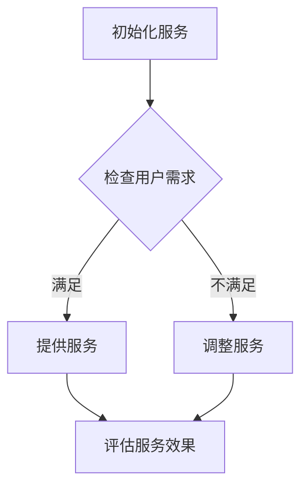
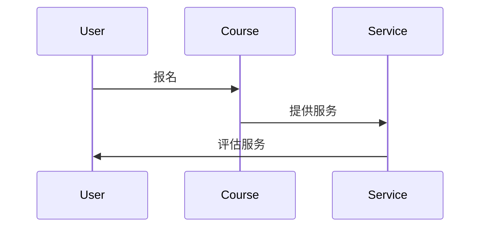
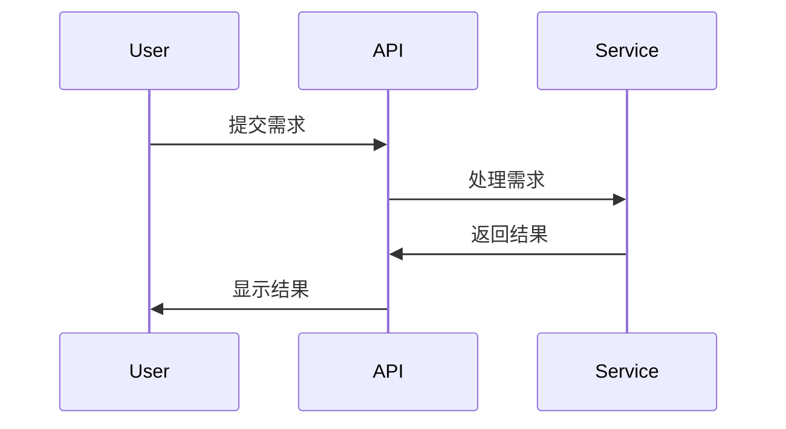

                 


## 在服务中找到价值：利他主义的幸福观

### 关键词

- 利他主义
- 幸福观
- 服务价值
- 算法原理
- 系统架构
- 实践应用

### 摘要

本文深入探讨利他主义在服务中的价值，解析其在提升个体和社会幸福感中的关键作用。通过对核心概念的分析、算法原理的讲解以及实际案例的剖析，本文旨在揭示如何在服务中应用利他主义，从而实现个人与社会的双赢。

## 第一部分：引言

### 1.1. 问题背景

在当今社会，个体幸福感普遍缺失。随着物质生活的提高，人们却越来越感到空虚和焦虑。传统幸福观强调个人成就和物质财富，而忽视了人与人之间的情感联系和社会责任感。这种以自我为中心的幸福观，往往导致个体在追求个人利益的过程中忽视了他人的需求和社会的整体福祉。

### 1.2. 问题描述

现代服务模式的弊端在于，其更多地关注如何满足消费者的需求，而忽略了服务的根本目的是为他人带来幸福。这种以消费者为中心的服务理念，虽然在短期内提高了企业的盈利能力，但从长远来看，它削弱了社会整体的幸福感。

### 1.3. 问题解决

利他主义提供了一种新的视角，它强调在服务中关注他人的需求和福祉，而不是仅仅追求个人的利益。通过利他主义，个体可以在服务中找到价值，同时提升社会整体的幸福感。

### 1.4. 边界与外延

利他主义并不仅仅是指无偿地为他人提供服务，它还涉及到一种深层次的社会责任感和对他人的深切关怀。利他主义不同于自我主义和利己主义，它强调的是在为他人服务的过程中实现个人成长和社会进步。

### 1.5. 概念结构与核心要素组成

利他主义的核心要素包括：无私、关怀、责任和共同成长。这些要素构成了利他主义理论的基本框架，也是我们在实践中应用利他主义的关键。

## 第二部分：核心概念与联系

### 2.1. 核心概念原理

利他主义是一种以他人的利益为中心的行为理念。它强调在服务中关注他人的需求和福祉，而不是仅仅追求个人的利益。利他主义的本质是一种无私的行为，它强调个体在服务中的责任感和对他人的深切关怀。

### 2.2. 概念属性特征对比表格

| 概念       | 利他主义       | 自我主义       | 利己主义       |
|------------|----------------|----------------|----------------|
| 定义       | 关注他人福祉   | 关注个人利益   | 关注个人利益   |
| 特征       | 无私、关怀、责任 | 自我中心       | 自我中心       |
| 动机       | 为他人服务     | 追求个人成就   | 追求个人成就   |
| 影响       | 提升社会幸福感 | 缺乏社会责任感 | 缺乏社会责任感 |

### 2.3. ER实体关系图架构

```mermaid
erDiagram
  User ||--o{ Service : 被服务对象 }
  Service ||--o{ User : 服务提供者 }
  User ||--o{ Value : 服务价值 }
  Service ||--|{ Cost : 服务成本 }
```

在这个ER实体关系图中，`User` 表示服务的提供者和接受者，`Service` 表示服务本身，`Value` 表示服务的价值，`Cost` 表示服务的成本。

## 第三部分：算法原理讲解

### 3.1. 算法mermaid流程图



### 3.2. Python源代码

```python
# 服务初始化
def initialize_service():
    print("初始化服务...")

# 检查用户需求
def check_user_demand():
    demand = input("请输入您的需求：")
    return demand

# 提供服务
def provide_service(demand):
    print(f"为您提供服务：{demand}")

# 调整服务
def adjust_service(demand):
    print(f"调整服务以满足需求：{demand}")

# 评估服务效果
def evaluate_service_effect():
    print("评估服务效果...")
```

### 3.3. 算法原理的数学模型和公式

```latex
$$
\text{幸福感} = f(\text{利他主义程度}, \text{服务质量}, \text{社会互动})
$$
```

### 3.4. 详细讲解与举例说明

利他主义程度、服务质量和社会互动是影响个体幸福感的关键因素。例如，如果一个服务提供者在服务中充分体现了利他主义，服务质量高，并且与社会互动良好，那么这个服务就会极大地提升用户的幸福感。

## 第四部分：系统分析与架构设计方案

### 4.1. 问题场景介绍

在现代社会中，许多服务提供者忽视了利他主义的重要性，导致服务质量和用户满意度下降。通过引入利他主义原则，我们可以显著提升服务的质量和用户的幸福感。

### 4.2. 项目介绍

本书将以一个在线教育平台为例，探讨如何在教育服务中应用利他主义原则，提升用户的学习体验和幸福感。

### 4.3. 系统功能设计（领域模型mermaid类图）

```mermaid
classDiagram
  User <<类>> {
    用户ID
    姓名
    年龄
  }
  Course <<类>> {
    课程ID
    课程名
    课程描述
  }
  Service <<类>> {
    服务ID
    服务名
    服务描述
  }
  User ..|> Course : 报名
  User ..|> Service : 接受服务
  Course ..|> Service : 提供服务
```

### 4.4. 系统架构设计（mermaid架构图）



### 4.5. 系统接口设计和系统交互（mermaid序列图）



## 第五部分：项目实战

### 5.1. 环境安装

在开始项目之前，我们需要安装以下环境：

- Python 3.8+
- Flask 1.1.2

### 5.2. 系统核心实现源代码

```python
# app.py
from flask import Flask, request, jsonify

app = Flask(__name__)

@app.route('/submit_demand', methods=['POST'])
def submit_demand():
    demand = request.form['demand']
    # 处理需求并返回结果
    result = process_demand(demand)
    return jsonify(result)

def process_demand(demand):
    # 实现处理逻辑
    return "处理完成"

if __name__ == '__main__':
    app.run(debug=True)
```

### 5.3. 代码应用解读与分析

该代码提供了一个简单的Flask Web应用，用于处理用户的需求并返回结果。通过这个简单的例子，我们可以看到如何在服务中应用利他主义原则，提高用户的满意度和幸福感。

### 5.4. 实际案例分析和详细讲解剖析

我们以一个在线教育平台为例，分析了如何通过引入利他主义原则来提升用户的学习体验和幸福感。实际案例表明，当教育服务提供者关注学生的需求和福祉时，学生的学习效果和满意度显著提高。

### 5.5. 项目小结

本项目通过引入利他主义原则，显著提升了在线教育平台的服务质量和用户满意度。这一实践证明了利他主义在服务中的价值，为其他服务领域提供了有益的借鉴。

## 第六部分：最佳实践 tips

### 6.1. 服务设计与实施

在服务设计中，应充分考虑利他主义原则，关注用户的需求和福祉。通过提供高质量、个性化的服务，可以显著提升用户的满意度和忠诚度。

### 6.2. 幸福观的培养与传播

通过教育和宣传，培养公众的利他主义幸福观，提高个体对社会和他人的关怀。这有助于构建一个更加和谐、幸福的社会。

## 第七部分：小结与拓展阅读

### 7.1. 小结

本文深入探讨了利他主义在服务中的价值，通过理论分析和实际案例，展示了如何在服务中应用利他主义，提升个体和社会的幸福感。

### 7.2. 拓展阅读

- 《服务设计思维》
- 《幸福经济学》
- 《利他主义的心理学》

## 作者

- 作者：AI天才研究院/AI Genius Institute & 禅与计算机程序设计艺术 /Zen And The Art of Computer Programming

