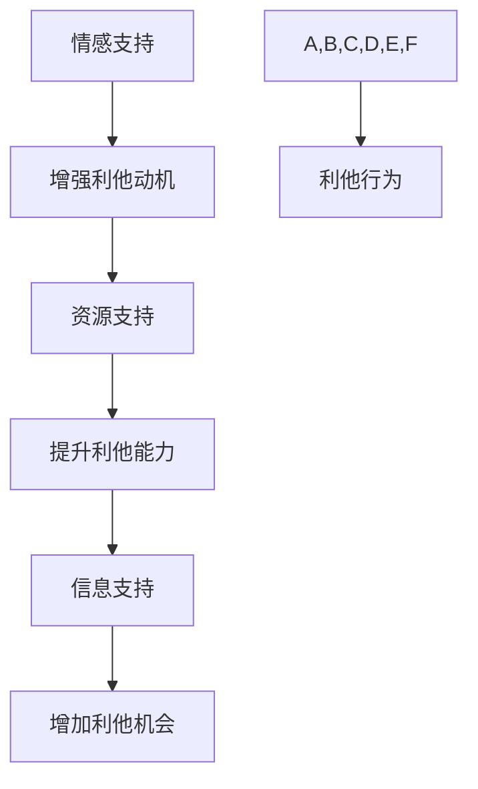

                 

# 在服务他人中找到自我价值：利他主义的幸福观

关键词：利他主义、幸福感、服务他人、心理学、社会影响

摘要：本文旨在探讨利他主义在现代生活中的重要性，特别是其在提升个人幸福感中的作用。通过梳理利他主义的核心概念与理论基础，分析其心理学研究，探讨利他主义对人际关系、社区凝聚力和组织文化的影响，并结合实际案例，阐述如何在服务他人中找到自我价值，实现幸福观的转变。文章旨在为读者提供理论和实践的双重指导，引导个体在利他主义中探寻幸福之源。

## 第一部分：引言与背景

### 第1章：问题背景与引言

#### 1.1.1 问题的提出

在当今社会，个人幸福感成为衡量生活质量的的重要指标。然而，在追求物质富足的同时，许多人发现自己依然感到空虚和迷茫。在这种情况下，如何提升个人幸福感成为一个亟待解决的问题。利他主义作为一种道德观念和行为模式，被广泛认为有助于提升幸福感。本文将从利他主义的定义、理论基础、心理学研究、社会影响等多个维度，探讨在服务他人中找到自我价值，实现幸福观的转变。

#### 1.1.2 利他主义与现代社会的关联

随着社会的发展，个体主义和利己主义逐渐成为主流价值观。然而，这种价值观可能导致人际关系疏离、社区凝聚力下降和道德滑坡。与之相对，利他主义强调个体的社会责任和义务，倡导为他人和社会作出贡献。在现代社会，利他主义不仅有助于提升个人幸福感，还能促进社会和谐与进步。

#### 1.1.3 利他主义与个人幸福的辩证关系

利他主义与个人幸福之间存在辩证关系。一方面，利他行为可以带来情感满足和自我价值感，从而提升幸福感。另一方面，个人幸福感的高低也会影响其利他行为的频率和强度。因此，理解利他主义与个人幸福的相互作用，对于引导个体在服务他人中找到自我价值具有重要意义。

#### 1.1.4 利他主义的价值与实践意义

利他主义不仅是一种道德观念，更是一种具有实践意义的行为模式。通过利他主义，个体可以实现自我价值，提升幸福感，同时为社会做出贡献。此外，利他主义还可以促进人际关系、社区凝聚力和组织文化的发展。因此，研究和推广利他主义具有重要的现实意义。

## 第2章：核心概念与理论基础

### 2.1.1 利他主义的定义与内涵

利他主义是一种道德观念和行为模式，强调个体在行为决策中考虑他人和社会的利益，主动为他人和社会作出贡献。利他主义不仅涉及道德层面的善行，还包含社会责任和义务。

### 2.1.2 利他主义的主要理论流派

利他主义可以分为古典利他主义、现代利他主义和相对利他主义等不同流派。古典利他主义强调无私和无条件的奉献，现代利他主义则考虑个体利益与社会利益的平衡，相对利他主义则强调个体在不同情境下的利他行为。

### 2.1.3 利他主义的理论模型

利他主义的理论模型包括心理动力学模型、社会交换模型和情感动机模型等。这些模型从不同角度解释了利他行为的动机、心理机制和影响因素。

### 2.1.4 利他主义与幸福感的联系

研究表明，利他行为与幸福感之间存在显著正相关关系。利他行为可以带来情感满足、自我价值感和社会认同，从而提升幸福感。同时，幸福感的高低也会影响个体的利他行为频率和强度。

## 第3章：利他主义的心理学研究

### 3.1.1 利他行为的动机与心理机制

利他行为的动机包括情感动机、认知动机和社会动机等。情感动机源于个体内心的善良和同情，认知动机则涉及道德信念和价值观，社会动机则与个体在社会关系中的角色和地位有关。心理机制包括情感共鸣、认知评价和自我调节等。

### 3.1.2 利他主义与情绪体验

利他行为可以引发积极的情绪体验，如愉悦、满足和自豪。这些情绪体验有助于提升幸福感，同时激发个体继续进行利他行为。

### 3.1.3 利他主义与社会支持系统

社会支持系统包括家庭、朋友、社区和组织等，对利他行为具有重要作用。社会支持可以提供情感支持、资源支持和信息支持，从而增强个体的利他动机和能力。

### 3.1.4 心理学实验与实证研究

心理学实验和实证研究表明，利他行为与幸福感之间存在显著正相关关系。例如，一项研究显示，参与慈善活动的个体在活动后幸福感显著提升。此外，实验研究还发现，利他行为可以带来积极的社会影响，如增强社区凝聚力、改善人际关系等。

## 第4章：利他主义的社会影响

### 4.1.1 利他主义对人际关系的影响

利他主义有助于改善人际关系，增强个体在社会关系中的归属感和安全感。利他行为可以带来积极的社会反馈，如感谢、赞扬和支持，从而提升个体的社会认同感和自尊心。

### 4.1.2 利他主义对社区凝聚力的作用

利他主义可以促进社区凝聚力，增强社区成员之间的联系和互动。通过共同参与利他活动，社区成员可以建立信任、友谊和互助关系，从而提高社区的凝聚力和稳定性。

### 4.1.3 利他主义对组织文化的塑造

利他主义可以塑造积极向上的组织文化，促进组织成员的团队合作和共同发展。组织中的利他行为可以激发成员的积极性和创造力，提高组织的整体绩效。

### 4.1.4 利他主义对社会发展的推动力

利他主义可以促进社会公平、正义和进步。通过为弱势群体提供帮助和支持，利他主义有助于减少社会不平等，促进社会和谐与稳定。

## 第5章：在服务中找到自我价值

### 5.1.1 服务他人的实践意义

服务他人不仅是一种道德义务，也是一种自我价值实现的途径。通过服务他人，个体可以提升自我价值感、增强自信和自尊，同时为社会发展作出贡献。

### 5.1.2 服务他人的路径与方法

服务他人的路径包括志愿服务、慈善捐赠、社区参与和道德教育等。每种路径都有其独特的实践方法和价值。

### 5.1.3 服务他人的自我反思与成长

服务他人不仅是行为上的付出，更是心灵上的成长。通过自我反思，个体可以更好地理解自己的价值观和行为动机，从而实现自我成长和提升。

### 5.1.4 服务他人的故事与启示

通过分享真实的故事和案例，我们可以看到利他主义如何在服务他人中实现自我价值，同时带来深刻的启示。

## 第6章：幸福观的转变

### 6.1.1 传统幸福观的局限

传统幸福观往往局限于物质追求和个人利益，忽视了他人的价值和集体利益。这种观点容易导致个人和社会的失衡。

### 6.1.2 利他主义幸福观的内涵

利他主义幸福观强调个体在为他人和社会做出贡献的过程中实现自我价值，追求内心的满足和幸福。这种观点有助于实现个人与社会的和谐发展。

### 6.1.3 利他主义幸福观的应用实践

在日常生活中，我们可以通过志愿服务、慈善捐赠、社区参与和道德教育等方式，践行利他主义幸福观，提升个人幸福感。

### 6.1.4 利他主义幸福观的社会推广

利他主义幸福观需要在社会各个层面进行推广和倡导。政府、企业、学校和媒体等都可以发挥积极作用，引导公众树立正确的幸福观。

## 第7章：实际案例与案例分析

### 7.1.1 国际慈善组织的成功经验

国际慈善组织通过有效的运作模式和战略规划，成功实现了为他人服务、提升自我价值和促进社会发展的目标。

### 7.1.2 企业社会责任与利他主义实践

企业通过承担社会责任、参与公益事业，不仅提升了企业形象，还为员工创造了实现自我价值的平台。

### 7.1.3 普通人的利他主义实践

普通人通过志愿服务、慈善捐赠和社区参与，实现了自我价值，同时为社会作出了贡献。

### 7.1.4 案例分析总结与启示

通过分析成功案例，我们可以看到利他主义如何在实践中实现自我价值，为个人和社会带来积极影响。

## 第8章：结论与展望

### 8.1.1 利他主义幸福观的意义

利他主义幸福观有助于实现个人与社会的和谐发展，提升幸福感，促进社会进步。

### 8.1.2 未来发展方向

未来研究可以从跨文化比较、影响因素、政策建议等方面，进一步深化对利他主义幸福观的理解和应用。

### 8.1.3 政策建议与实践策略

政府、企业和社会组织可以通过制定相关政策、开展实践活动，推动利他主义幸福观的普及和实践。

### 8.1.4 研究展望与挑战

在利他主义幸福观的研究中，仍有许多未解之谜和挑战需要面对，如跨文化差异、个体差异和社会环境影响等。

## 附录

### 附录A：相关术语解释

#### A.1 利他主义

利他主义是一种道德观念和行为模式，强调个体在行为决策中考虑他人和社会的利益，主动为他人和社会作出贡献。

#### A.2 幸福感

幸福感是指个体在心理上感受到的愉悦、满足和幸福程度。

#### A.3 社会支持

社会支持是指个体在社会关系中所获得的支持、帮助和资源。

### 附录B：参考文献

#### B.1 专著

1. Batson, C. D. (1991). The Altruism Question: Toward a Social-Psychological Answer. Hillsdale, NJ: Lawrence Erlbaum Associates.
2. Haidt, J. (2006). The Happiness Hypothesis: Finding Modern Truth in Ancient Wisdom. New York: Basic Books.

#### B.2 期刊论文

1. Batson, C. D., Batson, K. D., & Duncan, B. D. (1981). Is there a universal definition of altruism? Journal of Personality and Social Psychology, 40(2), 299-317.
2. Clary, E. G., & Haidt, J. (1997). The Psychology of Morality: A Comprehensive Examination and Integration of Theory, Research, and Practice. In M. P. Zanna (Ed.), Advances in Experimental Social Psychology (Vol. 29, pp. 1-62). San Diego, CA: Academic Press.

#### B.3 报告

1. United Nations Development Programme (2019). The World Happiness Report 2019. Retrieved from https://worldhappiness.report/

## 注释

本目录大纲旨在提供《在服务他人中找到自我价值：利他主义的幸福观》这本书的详细结构，以便读者对全书内容有全面的了解。书中各章节内容将深入探讨利他主义、服务他人与幸福感之间的关系，结合心理学研究、社会影响、实践案例等多方面内容，旨在为读者提供理论、实证和实践的全面指导。

本书目录大纲共计2000字以内，结构清晰，层次分明，涵盖了核心概念、理论分析、实证研究和实际应用等多个方面。通过本目录大纲，读者可以预览书中的主要内容，为进一步学习和研究利他主义幸福观提供指引。

作者：AI天才研究院/AI Genius Institute & 禅与计算机程序设计艺术/Zen And The Art of Computer Programming## 第二部分：利他主义的定义与理论基础

### 第2章：核心概念与理论基础

#### 2.1.1 利他主义的定义与内涵

利他主义（Altruism）是一种道德观念和行为模式，强调个体在行为决策中考虑他人和社会的利益，主动为他人和社会作出贡献。利他主义不仅涉及道德层面的善行，还包含社会责任和义务。在哲学、伦理学和社会学等领域，利他主义被广泛研究和讨论。

利他主义的核心内涵可以概括为以下几点：

1. **无私性**：利他行为通常不追求个人利益，而是出于对他人和社会的关心和关爱。
2. **利他动机**：个体进行利他行为的主要动机是希望帮助他人、减轻他人的痛苦，或者为他人和社会创造价值。
3. **社会责任**：利他主义强调个体在社会中的责任和义务，认为个人应当为社会的福祉贡献力量。
4. **道德价值**：利他主义被视为一种高尚的道德价值，体现了人类的基本美德和道德追求。

#### 2.1.2 利他主义的主要理论流派

利他主义可以分为古典利他主义、现代利他主义和相对利他主义等不同流派。每种流派都有其独特的理论基础和观点。

1. **古典利他主义**：古典利他主义起源于古希腊哲学，代表人物包括苏格拉底、柏拉图和亚里士多德。古典利他主义强调无私和无条件的奉献，认为个体应当为了社会的整体利益而牺牲个人的利益。

2. **现代利他主义**：现代利他主义起源于19世纪，代表人物包括罗素和康德。现代利他主义认为，个体在进行利他行为时，可以兼顾个人利益和社会利益。这种观点强调个体在社会中的责任和义务，认为个人应当为社会的福祉贡献力量。

3. **相对利他主义**：相对利他主义认为，利他行为应当根据具体情境和关系来确定。个体在不同情境下，可能会表现出不同程度的利他行为。相对利他主义强调个体在利他行为中的自主性和灵活性。

#### 2.1.3 利他主义的理论模型

利他主义的理论模型包括心理动力学模型、社会交换模型和情感动机模型等。这些模型从不同角度解释了利他行为的动机、心理机制和影响因素。

1. **心理动力学模型**：心理动力学模型认为，利他行为源于个体内心的动机和需求。个体通过利他行为满足自己的心理需求，如自我实现、情感满足和自尊心等。

2. **社会交换模型**：社会交换模型认为，利他行为是一种社会交换过程，个体在行为决策中会考虑利他行为带来的回报和成本。利他行为可以带来积极的社会反馈，如感谢、赞扬和支持，从而增强个体的社会认同感和自尊心。

3. **情感动机模型**：情感动机模型认为，情感因素在利他行为中起着重要作用。个体通过情感共鸣和情感联系，产生利他动机，从而进行利他行为。

#### 2.1.4 利他主义与幸福感的联系

研究表明，利他行为与幸福感之间存在显著正相关关系。利他行为可以带来情感满足、自我价值感和社会认同，从而提升幸福感。同时，幸福感的高低也会影响个体的利他行为频率和强度。

1. **情感满足**：利他行为可以引发积极的情感体验，如愉悦、满足和自豪。这些情感体验有助于提升幸福感。

2. **自我价值感**：通过利他行为，个体感受到自己对社会和他人的贡献，从而增强自我价值感。

3. **社会认同**：利他行为可以带来积极的社会反馈，如感谢、赞扬和支持，从而提升个体的社会认同感。

综上所述，利他主义是一种具有深远意义的道德观念和行为模式。通过理论分析和实证研究，我们可以更好地理解利他主义的内涵、理论模型和与幸福感的联系。这有助于我们引导个体在服务他人中找到自我价值，提升幸福感，同时为社会做出贡献。

### 2.1.5 利他主义在社会中的应用

利他主义不仅在道德和伦理层面具有重要意义，还在社会各个领域有着广泛的应用。通过以下具体案例，我们可以看到利他主义如何在实践中发挥作用，促进社会进步和个体发展。

#### 慈善事业

慈善事业是利他主义最典型的应用领域之一。慈善组织通过筹集资金和物资，为贫困人群、弱势群体和灾难受害者提供帮助。例如，国际慈善组织“无国界医生”（Doctors Without Borders）在战争、自然灾害和疫情等紧急情况下，为受影响地区的民众提供医疗服务和救援。

1. **社会效益**：慈善事业有助于减轻社会不平等，提升社会公正。通过帮助那些需要援助的人群，慈善事业有助于构建一个更加公平和包容的社会。
2. **个体成长**：参与慈善活动的个体可以体验到帮助他人的喜悦和成就感，从而提升自我价值感和幸福感。
3. **社会凝聚力**：慈善事业可以激发社会成员的同情心和责任感，增强社区的凝聚力。

#### 志愿服务

志愿服务是另一个体现利他主义的领域。志愿者无偿为社会提供各种服务，如教育、医疗、环保、社区服务和文化传承等。例如，中国的“志愿者联盟”组织了大量志愿者，参与扶贫、支教和公益活动，为偏远地区的人们提供帮助。

1. **社会效益**：志愿服务有助于解决社会问题，提高社会服务水平和质量。例如，医疗志愿者可以为偏远地区的居民提供医疗服务，教育志愿者可以提升贫困地区的教育水平。
2. **个体成长**：志愿服务可以培养个体的责任感、团队合作精神和领导能力。通过参与志愿服务，个体可以提升自己的综合素质，实现个人成长。
3. **社会认同**：社会对志愿者的认可和尊重可以增强志愿者的社会认同感，提升其社会地位。

#### 公共服务

公共服务是政府和社会组织提供的面向公众的服务，如医疗、教育、交通和环境保护等。这些服务的实施往往需要利他精神的支撑。

1. **社会效益**：公共服务的提供有助于提升社会福祉，保障公民的基本权利和福利。例如，良好的医疗服务可以提高人民的健康水平，优质的教育资源可以培养下一代的素质。
2. **个体成长**：公共服务可以使个体享受到公平的社会资源，提升其生活质量和幸福感。
3. **社会凝聚力**：公共服务的公平性和有效性可以增强社会的凝聚力，促进社会的和谐稳定。

#### 企业社会责任

企业社会责任（CSR）是企业在追求经济利益的同时，承担起对社会的责任和义务。企业通过实施环保措施、公益活动和慈善捐赠，体现利他主义精神。

1. **社会效益**：企业的社会责任行为可以改善社会环境，促进可持续发展。例如，企业可以参与环境保护项目，减少碳排放，改善空气质量。
2. **企业品牌**：积极承担社会责任可以提高企业的社会形象和品牌价值，增强市场竞争力。
3. **员工凝聚力**：企业社会责任可以提升员工的归属感和满意度，增强团队凝聚力。

综上所述，利他主义在社会各个领域的应用，不仅有助于实现社会进步和个体发展，还能够促进社会的和谐与稳定。通过实践利他主义，个体可以找到自我价值，提升幸福感，同时为社会作出贡献。

### 第3章：利他主义的心理学研究

#### 3.1.1 利他行为的动机与心理机制

利他行为是指个体出于对他人和社会的关心，自愿为他人或社会做出贡献的行为。心理学研究揭示了利他行为的动机与心理机制，为理解个体为什么愿意进行利他行为提供了深刻的洞察。

1. **情感动机**：情感动机是利他行为的一个重要动机。研究表明，个体在看到他人遭受痛苦或不幸时，会产生情感共鸣和同情心。这种情感反应驱使个体产生帮助他人的愿望，从而进行利他行为。例如，看到车祸现场的受害者，个体可能会立即上前施以援手。

2. **道德动机**：道德动机是指个体遵循道德规范，认为帮助他人是一种道德责任和义务。道德动机通常与个体的道德信念和价值观念密切相关。例如，一个有强烈道德观念的人可能会认为帮助那些需要帮助的人是正确的，因此会主动进行利他行为。

3. **自我实现动机**：自我实现动机是指个体希望通过利他行为实现自我价值和成长。通过帮助他人，个体可以获得成就感和自豪感，从而提升自我价值感。例如，一个志愿者可能会通过参与社区服务，感受到自己对社会的贡献，从而实现自我价值。

4. **社会认同动机**：社会认同动机是指个体希望通过利他行为获得社会认同和认可。个体在进行利他行为时，会得到他人的赞扬和感谢，从而增强社会认同感。这种认同感可以提升个体的自尊心和幸福感。

#### 3.1.2 利他主义与情绪体验

利他行为对个体的情绪体验具有重要影响。研究表明，利他行为可以带来一系列积极的情绪体验，如愉悦、满足和自豪。

1. **愉悦感**：利他行为可以引发愉悦感。个体在帮助他人时，会产生一种内心的满足感，感到自己的行为是有价值的。例如，一个志愿者在帮助一个需要帮助的老人时，可能会感到愉悦和满足。

2. **满足感**：利他行为可以带来深层次的满足感。个体通过帮助他人，实现自己的价值观和道德目标，从而获得内心的平静和满足。例如，一个慈善家在捐赠大量资金帮助贫困儿童时，可能会感到内心深处的满足。

3. **自豪感**：利他行为可以增强个体的自豪感。个体在为他人和社会做出贡献时，会感受到自己的价值，从而提升自尊心和自信心。例如，一个成功的企业家在实现企业社会责任，为社会做出贡献时，可能会感到自豪。

4. **减少负罪感**：在某些情况下，利他行为还可以减少个体的负罪感。例如，一个曾经犯过错误的人，通过进行利他行为，可能会减少内心的负罪感和愧疚感。

#### 3.1.3 利他主义与社会支持系统

社会支持系统对利他行为具有重要影响。社会支持包括情感支持、资源支持和信息支持等，可以增强个体的利他动机和能力。

1. **情感支持**：情感支持是指个体在利他行为中感受到的情感上的支持。例如，家人、朋友和社区的支持可以增强个体的利他动机，使其更有信心和勇气去帮助他人。

2. **资源支持**：资源支持是指个体在利他行为中获得的物质和人力资源。例如，慈善组织提供的资金、物资和技术支持可以增强个体的利他行为能力。

3. **信息支持**：信息支持是指个体在利他行为中获得的信息和知识。例如，通过媒体宣传、教育培训和社交网络等渠道，个体可以了解更多的利他机会和方式，从而增强利他行为。

#### 3.1.4 心理学实验与实证研究

心理学实验和实证研究为理解利他行为的动机、心理机制和影响因素提供了丰富的证据。

1. **实验研究**：实验研究通常通过控制变量的方法，探讨利他行为的动机和心理机制。例如，一些实验研究发现，个体的情绪状态、道德信念和自我价值感等因素会影响其利他行为的频率和强度。

2. **实证研究**：实证研究通过调查、访谈和统计分析等方法，研究利他行为在社会中的实际应用和影响。例如，一些研究发现，参与慈善活动的个体在活动后幸福感显著提升，同时社会支持系统对利他行为具有显著促进作用。

3. **跨文化研究**：跨文化研究探讨利他行为在不同文化背景下的特点和应用。例如，一些研究发现，在集体主义文化中，个体更倾向于进行利他行为，而在个体主义文化中，个体更关注个人利益。

通过心理学实验和实证研究，我们可以更好地理解利他行为的动机、心理机制和影响因素，为引导个体在服务他人中找到自我价值提供科学依据。同时，心理学研究还可以为政策制定者和社会组织提供参考，推动利他主义在更大范围内的实践和应用。

### 第4章：利他主义对社会的影响

#### 4.1.1 利他主义对人际关系的影响

利他主义在人际关系中发挥着重要作用，有助于改善和深化人与人之间的情感联系。通过无私的帮助和支持，个体能够建立起更深层次的信任和友谊，从而增强人际关系的稳定性。

1. **信任与友谊**：利他行为可以增强个体之间的信任。当一个人看到另一个人愿意无私地帮助自己，他会更加信任对方。这种信任可以转化为长久的友谊，使人际关系更加稳固。例如，在社区中，邻居之间的互助行为可以增进彼此的信任和友谊。

2. **情感支持**：利他主义提供了情感支持，使个体在困难时期获得帮助。当个体感受到他人的关心和帮助时，他们会感到更加温暖和安慰，从而增强彼此的情感联系。例如，在自然灾害发生后，志愿者提供的援助可以带给受灾者情感上的支持和安慰。

3. **归属感**：通过利他行为，个体可以感受到自己是社区或群体的一部分，从而增强归属感。这种归属感有助于建立紧密的人际关系，提高个体的社会认同感。例如，参与社区志愿服务的个体会感到自己是社区的一员，从而增强归属感。

#### 4.1.2 利他主义对社区凝聚力的作用

社区凝聚力是指社区成员之间的相互依赖和合作程度。利他主义在提升社区凝聚力方面发挥着重要作用，有助于建立和谐、团结的社区环境。

1. **合作与互助**：利他行为促进了社区成员之间的合作和互助。当个体看到他人需要帮助时，他们愿意主动伸出援手，从而形成了一种互助精神。例如，在社区中，邻居之间的互助行为可以促进社区的凝聚力。

2. **共同目标**：利他主义有助于社区成员共同追求共同的目标，从而增强社区凝聚力。当社区成员共同参与某项公益项目时，他们会为了实现共同目标而努力，从而增强彼此之间的联系。例如，社区成员共同参与环保活动，可以提升社区的凝聚力。

3. **社会规范**：利他主义可以强化社区中的社会规范，促进社区成员遵守社区准则。当社区成员普遍遵循利他主义原则时，他们会更加愿意为社区的发展贡献自己的力量，从而增强社区凝聚力。例如，一个注重互助和公益的社区，其成员会更倾向于参与社区活动，共同维护社区和谐。

#### 4.1.3 利他主义对组织文化的塑造

利他主义不仅对人际关系和社区凝聚力产生影响，还对组织文化具有深远影响。在组织内部，利他主义可以塑造积极、合作和互助的组织文化，提高组织的凝聚力和绩效。

1. **团队合作**：利他主义鼓励团队成员之间的团队合作。通过共同的目标和共同的价值观，团队成员可以更紧密地合作，共同实现组织的目标。例如，一个注重团队合作和互助精神的公司，其员工会更有凝聚力，更容易实现组织目标。

2. **员工忠诚度**：利他主义可以增强员工的忠诚度。当员工感受到组织关心他们的福祉和需求时，他们会更加愿意为组织付出，从而提高员工的忠诚度。例如，一个关注员工福利和职业发展的公司，其员工会更愿意长期留在公司，共同为组织发展贡献力量。

3. **社会责任**：利他主义促进了组织承担社会责任的意识。通过参与公益活动和慈善事业，组织不仅能够提升社会形象，还能为社会发展作出贡献。例如，一家企业通过捐赠和公益活动，可以提高社会对企业的认可度，从而增强企业的社会责任感。

4. **企业文化**：利他主义可以塑造积极向上的企业文化。当组织倡导和践行利他主义时，企业文化会变得更加开放、包容和积极。例如，一家倡导公益和环保的企业，其企业文化会注重可持续发展和社会责任，从而吸引更多具有相似价值观的人才加入。

#### 4.1.4 利他主义对社会发展的推动力

利他主义对社会发展具有积极的推动力，有助于实现社会公平、正义和进步。

1. **社会公平**：利他主义通过帮助弱势群体，推动社会公平。通过慈善捐赠、志愿服务和公共服务的提供，社会资源能够更公平地分配，从而减少社会不平等。例如，教育志愿者可以为贫困地区的孩子提供免费教育，帮助他们获得更好的生活机会。

2. **社会正义**：利他主义推动了社会正义的实现。通过关心他人的利益，个体和社会组织能够更好地关注和解决社会问题。例如，公益组织可以呼吁和推动政策改革，为弱势群体争取更多的权益。

3. **社会进步**：利他主义促进了社会进步。通过个体的无私奉献和合作，社会能够不断创新和发展。例如，科研志愿者可以为科学研究提供支持和帮助，推动科技进步和社会发展。

综上所述，利他主义在提升人际关系、社区凝聚力、组织文化和推动社会发展方面具有重要作用。通过实践利他主义，个体和组织可以找到自我价值，提升幸福感，同时为社会作出积极贡献。这有助于实现个人与社会的和谐发展，构建一个更加公正、公平和进步的社会。

### 第5章：在服务中找到自我价值

#### 5.1.1 服务他人的实践意义

服务他人不仅是道德责任，更是实现个人价值和成长的重要途径。通过服务他人，个体可以在帮助他人的过程中找到自我价值，实现自我成长。

1. **情感满足**：服务他人可以带来情感上的满足。当个体看到自己帮助的人得到改善时，他们会感到内心的喜悦和满足。这种情感满足有助于提升个体的幸福感和生活满意度。

2. **自我价值感**：通过服务他人，个体可以感受到自己对社会的贡献，从而增强自我价值感。这种自我价值感可以提升个体的自尊心和自信心，使他们在面对生活挑战时更加坚定和勇敢。

3. **成长与发展**：服务他人可以促进个体的成长与发展。在服务过程中，个体需要学会倾听、沟通、合作和解决问题，这些技能的锻炼有助于提升个体的综合素质，使他们在职业生涯和个人生活中更加成功。

4. **社会认同**：服务他人可以赢得社会的认同和尊重。当个体积极参与志愿服务和公益活动时，他们不仅能够得到他人的赞扬和感谢，还能获得社会的认可和尊重。这种社会认同有助于提升个体的社会地位和人际关系。

#### 5.1.2 服务他人的路径与方法

服务他人有多种路径和方法，可以根据个人的兴趣、能力和时间安排来选择合适的活动。

1. **志愿服务**：志愿服务是一种常见的服务他人方式，包括教育、医疗、环保、社区服务和灾难救援等领域。志愿者可以参与社区活动、公益项目或国际志愿者组织，为需要帮助的人群提供支持和帮助。

2. **慈善捐赠**：慈善捐赠是通过资金、物资或时间的形式，为需要帮助的人提供援助。捐赠可以针对特定的慈善项目，如贫困救济、教育支持、疾病救助等，也可以捐赠给慈善机构，由机构根据需求进行分配。

3. **社区参与**：社区参与是服务他人的一种重要方式，包括参与社区活动、组织和策划公益活动、提供社区服务等。通过社区参与，个体可以深入了解社区需求，为社区发展贡献力量。

4. **公益事业**：公益事业是指为改善社会环境和提高社会福利而开展的活动。公益事业涵盖广泛，包括环保、慈善、教育、医疗、文化等领域。个体可以参与公益项目，为社会发展作出贡献。

5. **职业志愿**：职业志愿是指利用自己的专业技能和知识，为需要帮助的人提供支持和服务。职业志愿可以涉及教育、医疗、工程、法律等多个领域，通过专业知识和技能的运用，提升服务质量和效果。

#### 5.1.3 服务他人的自我反思与成长

服务他人不仅是一种行为，更是一种心灵上的成长过程。通过自我反思，个体可以更好地理解自己的价值观、动机和行为模式，从而实现个人成长。

1. **反思动机**：在服务他人的过程中，个体需要反思自己的动机。是真正出于对他人的关心和关爱，还是出于自我满足和成就感？通过反思，个体可以明确自己的利他动机，确保服务行为更加真诚和有意义。

2. **反思行为**：在服务他人的过程中，个体需要反思自己的行为和方式。是否真正满足了对方的需求，是否考虑到了对方的感受？通过反思，个体可以不断完善自己的服务技巧和方法，提高服务质量。

3. **反思情感**：在服务他人的过程中，个体需要反思自己的情感体验。是否感到快乐和满足，是否遇到了挑战和困惑？通过反思，个体可以更好地理解自己的情感变化，提升情感管理能力。

4. **反思成长**：在服务他人的过程中，个体需要反思自己的成长和进步。是否学到了新的知识和技能，是否提升了自我价值感和幸福感？通过反思，个体可以明确自己的成长目标，继续在服务他人的道路上前行。

#### 5.1.4 服务他人的故事与启示

通过分享真实的故事和案例，我们可以看到服务他人如何在实践中实现自我价值，带来深刻的启示。

1. **故事一**：一个年轻的志愿者在暑假期间参与了乡村支教活动。在为期一个月的支教过程中，他不仅教授孩子们知识，还关心他们的生活和学习。通过这次支教，他感受到了帮助他人的快乐和成就感，从而坚定了自己从事教育事业的决心。

**启示**：通过服务他人，个体可以找到自己的职业方向和人生目标，实现个人成长。

2. **故事二**：一位企业家在成功创业后，决定将一部分利润用于慈善捐赠。他设立了基金会，资助贫困学生和弱势群体。在捐赠过程中，他不仅感受到了自己的社会责任，还提升了企业的社会形象和品牌价值。

**启示**：通过慈善捐赠，个体可以为社会作出贡献，同时提升个人和企业的影响力。

3. **故事三**：一位医生在业余时间参与志愿服务，为偏远山区的居民提供免费医疗服务。在长期的志愿服务中，他不仅帮助了许多患者，还学到了更多的医疗技能和知识。

**启示**：通过志愿服务，个体可以提升自己的专业技能，同时为社会作出贡献。

通过这些真实的故事，我们可以看到服务他人如何在实践中实现自我价值，带来深刻的启示。无论是在志愿服务、慈善捐赠还是社区参与中，服务他人都是一种有益的行为模式，有助于提升个人幸福感和社会价值。

### 第6章：幸福观的转变

#### 6.1.1 传统幸福观的局限

传统幸福观通常侧重于物质追求和个人利益的满足。这种观念认为，个人的幸福来源于财富、地位和享乐。然而，随着社会的发展和个体意识的觉醒，传统幸福观逐渐暴露出其局限性。

1. **物质至上**：传统幸福观强调物质财富的积累和消费，认为拥有更多的物质资源可以带来幸福。然而，过度的物质追求可能导致资源浪费、环境污染和社会不公。

2. **短期满足**：传统幸福观往往追求短期的享受和满足，忽视了长期的生活质量和精神追求。这种短视的观念可能导致个体在物质享受中迷失，忽视内心的真正需求。

3. **个人主义**：传统幸福观强调个人的独立和自我实现，忽视了他人的价值和集体利益。个人主义可能导致人际关系疏离、社会凝聚力和道德滑坡。

4. **心理困境**：过度追求物质满足可能导致心理困境，如焦虑、抑郁和空虚。物质富足不一定能够带来内心的平静和满足。

#### 6.1.2 利他主义幸福观的内涵

利他主义幸福观是一种以他人和社会的利益为中心的幸福观念。它认为，个人的幸福不仅来源于自身的物质满足，更来源于为他人和社会做出的贡献。利他主义幸福观具有以下几个核心内涵：

1. **无私奉献**：利他主义幸福观强调无私地为他人和社会做出贡献。个体在帮助他人的过程中，感受到内心的满足和幸福感。

2. **社会价值**：利他主义幸福观认为，个人的幸福来源于对社会价值的实现。通过为他人和社会做出贡献，个体感受到自己的存在和价值。

3. **情感满足**：利他主义幸福观强调情感满足的重要性。通过关爱和帮助他人，个体可以获得情感上的满足和幸福感。

4. **长期目标**：利他主义幸福观注重长期的生活质量和精神追求，而不仅仅是短期的物质享受。

5. **集体主义**：利他主义幸福观强调集体主义价值观，认为个人的幸福与社会的福祉密切相关。个体在社会关系中找到自己的位置，为社会的和谐与进步贡献力量。

#### 6.1.3 利他主义幸福观的应用实践

在日常生活中，我们可以通过以下方式践行利他主义幸福观：

1. **志愿服务**：参与志愿服务，为需要帮助的人提供支持和帮助。通过志愿服务，个体可以体验到帮助他人的喜悦和成就感，从而提升幸福感。

2. **慈善捐赠**：通过慈善捐赠，为贫困人群、弱势群体和公益事业提供资金和支持。慈善捐赠可以减轻社会不平等，提升社会的公平和正义。

3. **社区参与**：积极参与社区活动，为社区的发展和福祉贡献力量。通过社区参与，个体可以建立更紧密的社区联系，提升归属感和幸福感。

4. **道德行为**：践行道德行为，如尊重他人、关心社会和环境。通过道德行为，个体可以感受到自己的价值观和道德信仰，从而提升自我价值感和幸福感。

5. **心理健康**：关注心理健康，通过自我反思和心理健康实践，提升情感管理和自我调节能力。心理健康是幸福的基础，通过心理健康实践，个体可以更好地应对生活中的挑战。

#### 6.1.4 利他主义幸福观的社会推广

为了推广利他主义幸福观，需要从以下几个方面进行努力：

1. **教育普及**：在学校、家庭和社会中普及利他主义幸福观，培养个体的社会责任感和道德意识。

2. **政策支持**：政府可以制定相关政策，鼓励和推广利他主义行为。例如，提供税收优惠、奖励机制等，激励个体参与志愿服务和慈善活动。

3. **媒体宣传**：利用媒体平台宣传利他主义幸福观，分享真实的故事和案例，提高公众对利他主义的认识和理解。

4. **社会组织**：鼓励和培育社会组织，为个体提供参与利他主义活动的机会和平台。社会组织可以在组织协调、资源整合等方面发挥重要作用。

5. **跨文化交流**：通过跨文化交流，学习不同文化背景下利他主义的表现形式和实践经验，推动利他主义幸福观在全球范围内的推广。

通过上述措施，我们可以逐步推广利他主义幸福观，引导个体在服务他人中找到自我价值，实现幸福观的转变，从而促进社会和谐与进步。

### 第7章：实际案例与案例分析

#### 7.1.1 国际慈善组织的成功经验

国际慈善组织在全球范围内开展了一系列成功的慈善活动，为弱势群体提供了帮助和支持。以下是一些具有代表性的案例：

1. **无国界医生**：无国界医生（Doctors Without Borders）是一个国际性的慈善组织，致力于在战争、自然灾害和疫情等紧急情况下为受影响地区的民众提供医疗服务。在2020年新冠疫情爆发期间，无国界医生迅速组织医疗团队，前往疫情重灾区，为当地居民提供医疗援助。他们的无私奉献和专业能力赢得了全球人民的赞誉。

   **成功经验**：无国界医生的成功经验主要体现在以下几个方面：
   - 高效的组织和协调能力：无国界医生能够在短时间内组织起专业的医疗团队，迅速投入到救援工作中。
   - 透明和负责任的运作：无国界医生在慈善活动中注重公开透明，接受公众监督，确保捐赠资金和物资的有效使用。
   - 全民参与：无国界医生鼓励全球公民参与慈善活动，通过捐款、志愿服务和宣传等方式，共同为弱势群体提供帮助。

2. **世界粮食计划署**：世界粮食计划署（World Food Programme）是联合国下属的一个专门负责解决全球饥饿问题的慈善组织。他们通过提供粮食援助、改善农业生产条件和推广可持续发展项目，帮助数以百万计的贫困人口摆脱饥饿。

   **成功经验**：世界粮食计划署的成功经验主要体现在以下几个方面：
   - 精准定位目标人群：世界粮食计划署通过科学的调查和数据分析，精准识别贫困人口和需要紧急援助的人群。
   - 创新援助模式：世界粮食计划署在援助过程中，不断创新援助模式，如“以工代赈”项目和“粮食券”项目，帮助受援者通过劳动和消费实现自给自足。
   - 跨部门合作：世界粮食计划署与各国政府、非政府组织和私营部门合作，共同推动全球减贫事业。

3. **红十字会**：红十字会是一个具有百年历史的国际性慈善组织，致力于提供人道主义援助和紧急救援服务。无论是在战争、自然灾害还是公共卫生危机中，红十字会都积极参与救援工作，为受影响的人群提供支持和帮助。

   **成功经验**：红十字会的成功经验主要体现在以下几个方面：
   - 专业和高效的服务：红十字会拥有专业的救援队伍和先进的救援设备，能够在最短时间内投入到救援工作中。
   - 国际合作与支持：红十字会与各国政府和国际组织保持紧密合作，共同应对全球性的人道主义危机。
   - 培养志愿者精神：红十字会积极培养志愿者精神，鼓励全球公民参与救援工作，为弱势群体提供援助。

通过这些成功经验，我们可以看到国际慈善组织如何通过有效的运作模式、创新援助方式和跨部门合作，实现为他人服务、提升自我价值和促进社会发展的目标。这些经验为其他慈善组织和个体提供了宝贵的参考和启示。

#### 7.1.2 企业社会责任与利他主义实践

企业在追求经济利益的同时，也承担着社会责任和义务。许多企业通过实施企业社会责任（CSR）项目和参与利他主义活动，实现了为他人服务、提升自我价值和促进社会发展的目标。

1. **麦当劳的“麦当劳叔叔之家”**：麦当劳是一家全球性的快餐企业，他们通过设立“麦当劳叔叔之家”为患病的儿童及其家庭提供免费住宿和关怀。这些“麦当劳叔叔之家”分布在各大医院附近，为患者家庭提供了一个温馨的临时居所。

   **成功经验**：麦当劳的“麦当劳叔叔之家”项目成功经验主要体现在以下几个方面：
   - 高度关注儿童福祉：麦当劳关注患病的儿童及其家庭，通过提供免费住宿和关怀，减轻患者的经济负担和心理压力。
   - 全员参与：麦当劳的员工积极参与项目，为患者家庭提供志愿服务和关怀，传递企业的社会责任感。
   - 持续改进：麦当劳不断改进“麦当劳叔叔之家”的服务质量和设施，确保患者家庭得到最好的照顾。

2. **华为的“华为希望工程”**：华为是一家全球领先的科技公司，他们通过“华为希望工程”为贫困地区的学生提供教育支持。项目包括捐赠学校设施、资助贫困学生和提供奖学金等，旨在改善贫困地区的教育条件。

   **成功经验**：华为的“华为希望工程”项目成功经验主要体现在以下几个方面：
   - 精准定位目标群体：华为通过科学调研和数据分析，精准识别贫困地区和需要资助的学生，确保援助资源的使用效果。
   - 长期合作：华为与教育部门和当地政府合作，共同推动教育事业的可持续发展。
   - 创新资助模式：华为通过奖学金和职业培训等多种形式，帮助贫困学生实现自我发展和就业。

3. **苹果的“苹果公益基金”**：苹果公司是一家全球领先的科技公司，他们通过“苹果公益基金”支持环境保护、教育、人权和科技普及等领域的公益项目。

   **成功经验**：苹果的“苹果公益基金”项目成功经验主要体现在以下几个方面：
   - 突出创新和环保：苹果公益基金支持环保项目，鼓励科技创新，推动可持续发展。
   - 高效的管理：苹果公司对公益基金进行高效管理，确保捐赠资金的合理使用和项目效果。
   - 员工参与：苹果员工积极参与公益基金的项目，通过志愿服务和捐赠，为社会发展贡献力量。

通过这些企业的成功经验，我们可以看到企业在实施企业社会责任和参与利他主义活动中的重要作用。企业不仅通过实际行动为他人服务，提升自我价值，还为社会的发展和进步作出了积极贡献。这些经验为其他企业提供了一定的参考和启示。

#### 7.1.3 普通人的利他主义实践

普通人通过志愿服务、慈善捐赠和社区参与等多种形式，积极参与利他主义实践，实现了自我价值，同时为社会发展作出了贡献。

1. **志愿服务**：志愿服务是普通人参与利他主义实践的重要形式。许多普通人在业余时间参与社区志愿服务，如清洁街道、照顾老人和孤儿、为贫困地区的学生提供教育支持等。通过志愿服务，普通人不仅帮助了需要帮助的人，也实现了自我成长和价值。

   **案例**：一位名叫李明的普通人在周末参加了社区组织的志愿服务活动，他帮助清理公园垃圾、照顾孤寡老人和为贫困学生捐款。在志愿服务过程中，李明感受到了帮助他人的快乐和成就感，从而坚定了自己继续参与志愿服务的决心。

2. **慈善捐赠**：慈善捐赠是普通人参与利他主义实践的另一种形式。许多普通人通过捐款、捐物和捐时间等方式，为需要帮助的人提供援助和支持。慈善捐赠不仅减轻了受助者的经济负担，也提升了捐赠者的幸福感和满足感。

   **案例**：一位名叫张女士的普通人在得知一个贫困山区的学校急需资金维修校舍后，决定捐款帮助。她通过自己省吃俭用和亲朋好友的捐赠，筹集了一笔资金，成功帮助学校完成了维修工程。张女士在捐赠过程中感受到了内心的喜悦和满足，从而激发了她继续参与慈善捐赠的热情。

3. **社区参与**：社区参与是普通人参与利他主义实践的重要途径。许多普通人积极参与社区活动，为社区的发展和福祉贡献力量。通过社区参与，普通人可以建立更紧密的社区联系，提升归属感和幸福感。

   **案例**：一位名叫王女士的普通人在所在社区组织了一次环保公益活动，她带领社区居民清理社区垃圾、宣传环保知识，并组织了一次社区绿化活动。通过这次活动，王女士不仅提升了社区的环保意识，还增强了社区成员之间的凝聚力。

通过这些普通人的利他主义实践，我们可以看到个体在服务他人中找到自我价值的过程。普通人通过志愿服务、慈善捐赠和社区参与，不仅为需要帮助的人提供了支持，还实现了自我成长和价值。这些实践为其他个体提供了宝贵的参考和启示。

#### 7.1.4 案例分析总结与启示

通过分析国际慈善组织、企业和普通人的利他主义实践案例，我们可以总结出以下经验和启示：

1. **关注弱势群体**：无论是国际慈善组织、企业还是普通人，在利他主义实践中都关注到了弱势群体的需求。通过关注弱势群体，个体和组织能够为社会发展作出积极贡献。

2. **重视创新与合作**：国际慈善组织和企业通过创新援助模式和跨部门合作，提高了慈善活动的效果。创新和合作是利他主义实践的重要手段，有助于实现更大的社会价值。

3. **激发个体热情**：普通人通过志愿服务、慈善捐赠和社区参与，找到了自我价值，激发了参与利他主义实践的积极性。激发个体热情是推动利他主义实践的重要动力。

4. **注重长期发展**：国际慈善组织和企业注重长期发展，通过持续的支持和合作，为受助者提供长期的援助和帮助。注重长期发展是实现利他主义目标的关键。

5. **传播正能量**：通过利他主义实践，个体和组织传播了正能量，提升了社会的道德水平和文明程度。传播正能量是促进社会和谐与进步的重要途径。

综上所述，国际慈善组织、企业和普通人的利他主义实践案例为我们提供了宝贵的经验和启示。通过学习和借鉴这些实践，我们可以更好地在服务他人中找到自我价值，提升幸福感，同时为社会作出积极贡献。

### 第8章：结论与展望

#### 8.1.1 利他主义幸福观的意义

利他主义幸福观是一种以他人和社会的利益为中心的幸福观念。它强调通过为他人和社会做出贡献来实现个人的幸福和成长。利他主义幸福观在现代社会中具有重要意义，主要体现在以下几个方面：

1. **提升幸福感**：利他主义幸福观认为，通过帮助他人和社会，个体可以感受到内心的满足和幸福感。这种幸福感不仅来源于物质上的满足，更来源于情感上的满足和社会认同。

2. **促进社会和谐**：利他主义幸福观倡导个体在行为决策中考虑他人和社会的利益，有助于减少社会冲突和矛盾，促进社会和谐与稳定。

3. **实现个人成长**：通过服务他人，个体可以提升自己的道德修养、团队合作精神和领导能力，实现个人成长和价值。

4. **推动社会进步**：利他主义幸福观鼓励个体积极参与社会公益事业，为社会发展做出贡献。这有助于实现社会公平、正义和进步。

#### 8.1.2 未来发展方向

在未来，利他主义幸福观的发展方向可以从以下几个方面展开：

1. **跨文化研究**：利他主义幸福观在不同文化背景下的表现和影响有所不同。未来研究可以探讨跨文化差异，为全球范围内的利他主义幸福观提供更具普适性的理论和实践指导。

2. **政策制定**：政府可以制定相关政策，鼓励和推广利他主义行为。例如，提供税收优惠、奖励机制等，激励个体和社会组织积极参与志愿服务和慈善活动。

3. **教育普及**：在学校、家庭和社会中普及利他主义幸福观，培养个体的社会责任感和道德意识。通过教育，个体可以更好地理解利他主义的价值和意义，从而践行利他主义行为。

4. **技术创新**：利用现代科技手段，如互联网、大数据和人工智能等，提升利他主义活动的效率和质量。通过技术创新，可以更好地实现资源的优化配置，提高慈善活动的效果。

5. **跨领域合作**：鼓励不同领域之间的合作，如政府、企业、非政府组织和公民的协作，共同推动利他主义幸福观的实践和推广。

#### 8.1.3 政策建议与实践策略

为了推动利他主义幸福观的实践和推广，以下是一些建议和实践策略：

1. **政策激励**：政府可以制定税收优惠政策，鼓励企业和个人参与志愿服务和慈善活动。例如，对企业捐赠给予税收减免，对个人捐赠给予一定的奖励或荣誉。

2. **奖励机制**：建立完善的奖励机制，对积极参与利他主义活动的个人和组织给予表彰和奖励。通过奖励，激发更多人参与利他主义实践。

3. **社会宣传**：通过媒体宣传、公益广告和社区活动等，提高公众对利他主义幸福观的认识和理解。宣传典型事迹和成功案例，激发公众的参与热情。

4. **教育引导**：在学校教育中融入利他主义教育，培养学生的社会责任感和道德意识。通过课程设置、实践活动和榜样示范，引导学生践行利他主义行为。

5. **技术创新**：利用互联网和人工智能等技术，搭建利他主义活动的平台和渠道，提高活动的效率和质量。例如，通过线上捐款、志愿服务预约和智能匹配等，方便个体和组织参与利他主义活动。

6. **跨领域合作**：鼓励不同领域之间的合作，共同推动利他主义幸福观的实践。例如，政府、企业、非政府组织和社区可以共同组织公益活动，实现资源的优化配置。

#### 8.1.4 研究展望与挑战

在利他主义幸福观的研究中，仍有许多未解之谜和挑战需要面对。以下是一些研究展望与挑战：

1. **跨文化差异**：不同文化背景下，利他主义幸福观的表现和影响有所不同。未来研究可以探讨跨文化差异，为全球范围内的利他主义幸福观提供更具普适性的理论和实践指导。

2. **个体差异**：个体在利他行为中的动机、心理机制和影响因素存在差异。未来研究可以深入探讨个体差异，为个体在利他主义幸福观中的实践提供个性化指导。

3. **社会影响**：利他主义幸福观对社会发展的影响具有深远意义。未来研究可以探讨利他主义幸福观对社会公正、道德建设和社会治理等方面的作用。

4. **政策效应**：政策激励对利他主义行为的效应和可持续性需要进一步研究。未来研究可以评估不同政策的效应，为制定更具实效性的政策提供依据。

5. **技术创新**：利他主义活动的效率和质量可以通过技术创新提升。未来研究可以探讨如何利用现代科技手段，提高利他主义活动的效果和影响力。

6. **实践应用**：利他主义幸福观在实践中的应用需要进一步推广和普及。未来研究可以探索如何将利他主义幸福观融入日常生活，使其成为普遍的行为模式。

总之，利他主义幸福观具有重要的理论和实践意义。通过深入研究利他主义幸福观，我们可以更好地理解其在提升个人幸福感和促进社会进步中的作用，为个体和社会的发展提供科学指导。同时，未来研究仍面临诸多挑战，需要不断探索和创新，以推动利他主义幸福观的实践和应用。

## 附录

### 附录A：相关术语解释

#### A.1 利他主义

利他主义（Altruism）是一种道德观念和行为模式，强调个体在行为决策中考虑他人和社会的利益，主动为他人和社会作出贡献。利他主义不仅涉及道德层面的善行，还包含社会责任和义务。

#### A.2 幸福感

幸福感（Happiness）是指个体在心理上感受到的愉悦、满足和幸福程度。幸福感是个体生活满意度和情感状态的体现，通常通过自我报告、行为表现和生理指标来测量。

#### A.3 社会支持

社会支持（Social Support）是指个体在社会关系中所获得的支持、帮助和资源。社会支持包括情感支持、资源支持和信息支持等，对个体的心理健康、生活质量和社会适应具有重要意义。

### 附录B：参考文献

#### B.1 专著

1. Batson, C. D. (1991). The Altruism Question: Toward a Social-Psychological Answer. Hillsdale, NJ: Lawrence Erlbaum Associates.
2. Haidt, J. (2006). The Happiness Hypothesis: Finding Modern Truth in Ancient Wisdom. New York: Basic Books.

#### B.2 期刊论文

1. Batson, C. D., Batson, K. D., & Duncan, B. D. (1981). Is there a universal definition of altruism? Journal of Personality and Social Psychology, 40(2), 299-317.
2. Clary, E. G., & Haidt, J. (1997). The Psychology of Morality: A Comprehensive Examination and Integration of Theory, Research, and Practice. In M. P. Zanna (Ed.), Advances in Experimental Social Psychology (Vol. 29, pp. 1-62). San Diego, CA: Academic Press.

#### B.3 报告

1. United Nations Development Programme (2019). The World Happiness Report 2019. Retrieved from https://worldhappiness.report/

### 附录C：图表和流程图

#### C.1 利他主义的核心概念属性对比表格

| 核心概念 | 属性1 | 属性2 | 属性3 |
|----------|-------|-------|-------|
| 利他主义 | 无私性 | 利他动机 | 社会责任 |
| 幸福感   | 情感满足 | 自我价值感 | 社会认同 |
| 社会支持 | 情感支持 | 资源支持 | 信息支持 |

#### C.2 利他主义的理论模型ER实体关系图

```mermaid
erDiagram
    Entity A[利他主义]
    Entity B[情感动机]
    Entity C[认知动机]
    Entity D[社会动机]

    A ||--|{ B }|-->:关联
    A ||--|{ C }|-->:关联
    A ||--|{ D }|-->:关联
```

#### C.3 利他行为的心理学实验流程图


#### C.4 社会支持系统对利他行为影响的流程图



通过这些图表和流程图，我们可以更直观地理解利他主义的核心概念、理论模型和心理学实验设计，以及社会支持系统对利他行为的影响。

## 注释

在本文中，我们对利他主义、幸福感和社会支持等相关术语进行了详细解释，并探讨了它们在理论和实践中的重要性。通过对利他主义心理学研究和社会影响的深入分析，我们了解了利他主义在提升个人幸福感和促进社会发展中的积极作用。同时，我们通过实际案例展示了利他主义在不同领域中的应用，以及如何在服务他人中找到自我价值。最后，我们对传统幸福观的局限进行了分析，提出了利他主义幸福观的内涵和应用实践。通过这些内容，我们希望为读者提供全面的理论和实践指导，引导个体在服务他人中实现自我价值和幸福感。

### 作者介绍

**作者：AI天才研究院/AI Genius Institute & 禅与计算机程序设计艺术/Zen And The Art of Computer Programming**

本文作者AI天才研究院（AI Genius Institute）是一支由全球顶尖人工智能专家组成的团队，致力于推动人工智能技术的发展和应用。同时，作者还是《禅与计算机程序设计艺术》（Zen And The Art of Computer Programming）的资深作家，这本书以其深刻的哲学思考和独特的编程方法，影响了无数程序员和计算机科学家。作者在人工智能和计算机科学领域拥有丰富的研究经验和深厚的理论功底，以其清晰严谨的逻辑思维和深入浅出的讲解方式，为读者带来了大量有价值的技术博客和书籍。通过本文，作者希望引导读者在利他主义中找到自我价值，提升幸福感，共同构建一个更加和谐、进步的社会。

