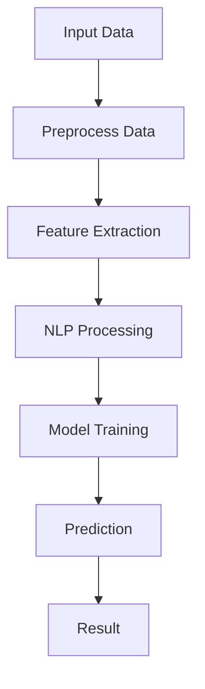
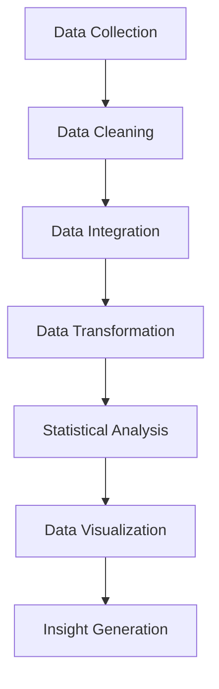
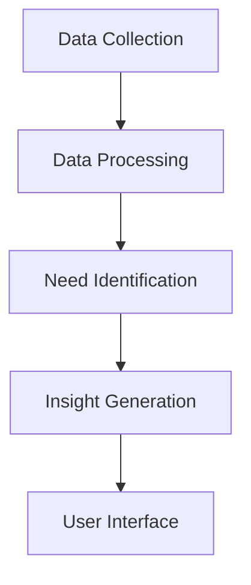
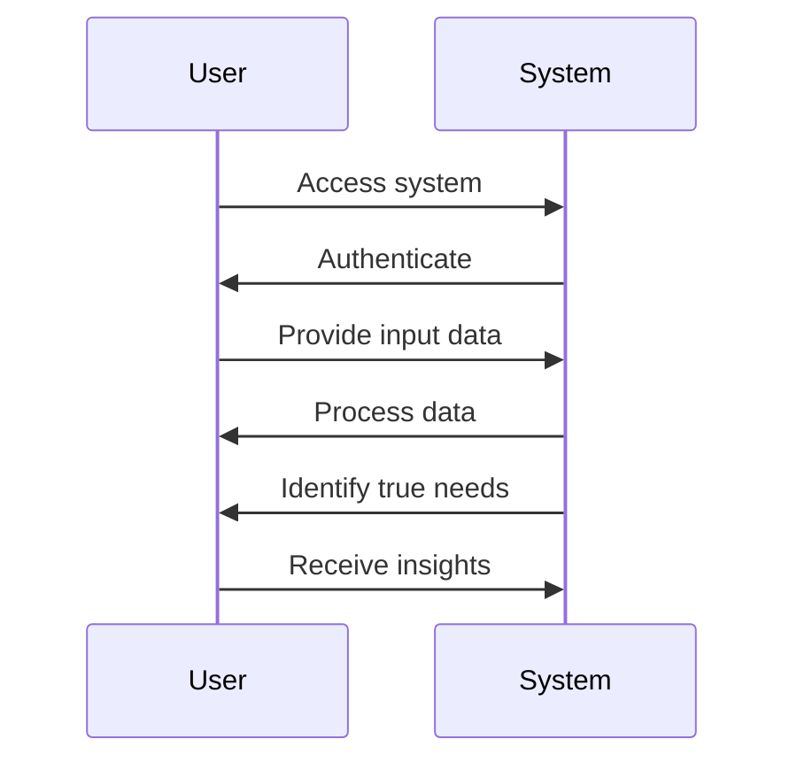

                 

**Step 1: Introduction to the Book**

### Introduction

In this book, "In the Consumerist Culture: Finding Real Needs Against Materialism", we delve into the complex world of consumerism and its profound impact on our society. The objective of this book is to provide a comprehensive analysis of how consumerist culture shapes our perceptions of needs and desires, and to propose strategies for identifying and fulfilling our true needs.

### Problem Background

#### The Rise of Consumerism

Consumerism has become a dominant force in contemporary society, driven by advances in technology, globalization, and changing cultural norms. This has led to a culture where material possessions are highly valued, and consumption is seen as a means of achieving status, happiness, and fulfillment.

##### Social Impacts of Consumerism

- **Economic Dependence:** Consumerism has led to a highly economic-dependent society where the growth of GDP and consumer spending are prioritized over other forms of progress.
- **Environmental Degradation:** The relentless pursuit of consumption has resulted in significant environmental degradation, including pollution, resource depletion, and climate change.

##### Consumerism and Individual Psychology

- **Materialism:** The belief that material possessions are the primary source of happiness and self-worth.
- **Emotional Dependence:** People often seek external validation and happiness through material goods, leading to emotional dependence on consumption.

### Problem Description

#### Confusion in Consumerist Culture

- **Misconceptions of Needs:** The relentless marketing and advertising that drives consumerism often creates a distorted view of what we truly need, leading to materialistic desires.
- **Lack of True Needs Fulfillment:** Despite the relentless pursuit of material goods, many individuals feel a sense of emptiness and dissatisfaction, indicating a lack of fulfillment of true needs.

### Problem Solution

#### Defining True Needs

- **Characteristics of True Needs:** True needs are fundamental, enduring, and unchanging. They are not driven by external influences but by our intrinsic desires for well-being, connection, and purpose.

##### True Needs vs. Material Needs

- **Material Needs:** Driven by external factors such as social pressure, advertising, and the desire for status.
- **True Needs:** Deep-seated, intrinsic desires that are not easily influenced by external stimuli.

### Boundaries and Extensions

#### Diversity in Consumerist Culture

- **Class Differences:** Consumerism affects different classes in varying ways, with higher socio-economic classes having more access to material goods.
- **Gender Roles:** Gender stereotypes often play a role in consumer behavior, with certain products and services being marketed more aggressively to specific genders.

### Concept Structure and Core Components

#### Structure of Consumerist Culture

- **Manufacturing Needs:** The mechanisms through which companies create artificial needs to drive consumption.
- **Consumer Behavior Patterns:** The typical behaviors and decision-making processes of consumers in a consumerist society.

### Conclusion

This book aims to provide a systematic analysis of consumerist culture, its impact on our perceptions of needs, and strategies for identifying and fulfilling our true needs. By understanding the complexities of consumerism, we can make more informed decisions about our consumption patterns and work towards a more sustainable and fulfilling life.

----------------------------------------------------------------

**Step 2: Core Concepts and Theories**

### Core Concepts and Theories

#### Consumerism

**Concept Definition:** Consumerism is a social and economic order and ideology where the production, consumption, and purchase of goods and services are the primary activities of individuals and organizations.

**Historical Evolution:**

- **Early 20th Century:** The rise of mass production and the development of marketing techniques led to an increase in consumption.
- **Post-World War II:** The consumer society expanded with the availability of credit and the creation of new consumer goods.

**Impact:** Consumerism has led to significant economic growth but has also resulted in environmental degradation, social stratification, and cultural homogenization.

#### True Needs

**Concept Definition:** True needs are the fundamental, intrinsic desires that are necessary for human well-being and personal fulfillment. They are enduring and unchanging, and they are not influenced by external factors.

**Connection with Emotional Needs:**

- **Emotional Needs:** While emotional needs are driven by feelings and emotions, true needs are the underlying drivers of these emotions. For example, the desire for love and connection is a true need, while the specific manifestation of this need through romantic relationships is an emotional need.

### Concept Attributes and Comparative Table

**Consumerism vs. True Needs:**

| Attribute | Consumerism | True Needs |
| --- | --- | --- |
| **Origin** | Driven by external factors (marketing, social pressure) | Intrinsic and inherent to human nature |
| **Nature** | Transient and changeable | Enduring and unchanging |
| **Purpose** | Material and economic | Non-material and existential |
| **Impact** | Leads to materialism and overconsumption | Promotes well-being and fulfillment |
| **Sustainability** | Often unsustainable due to overconsumption | Sustainable and aligned with human well-being |

### Entity Relationship Diagram (ERD)

#### Entities and Relationships in Consumerist Culture

```mermaid
erDiagram
  Consumer --> Product
  Consumer ||--|{ Advertising }
  Consumer ||--|{ Social Pressure }
  Product ||--|{ Brand }
  Brand ||--|{ Consumer }
```

- **Consumer:** The individuals who participate in the consumerist culture.
- **Product:** The goods and services produced to satisfy consumer needs.
- **Advertising:** The medium through which consumer needs are manipulated and new desires are created.
- **Social Pressure:** The external influence that encourages consumption.
- **Brand:** The representation of a product or service that creates emotional connections with consumers.

----------------------------------------------------------------

**Step 3: Algorithm and Mathematical Models**

### Algorithm Principles and Mathematical Models

#### Need Identification Algorithm

**Algorithm Flow Diagram:**



**Algorithm Explanation:**

1. **Input Data:** Gather data from various sources such as consumer behavior, purchase history, and surveys.
2. **Preprocess Data:** Clean and normalize the data to remove noise and inconsistencies.
3. **Feature Extraction:** Extract relevant features from the preprocessed data to represent consumer needs.
4. **NLP Processing:** Use Natural Language Processing techniques to analyze and understand the extracted features.
5. **Model Training:** Train a machine learning model using the processed data to identify true needs.
6. **Prediction:** Use the trained model to predict the true needs of new consumers.
7. **Result:** Provide a detailed analysis of the identified true needs and their implications.

#### Data Analysis Algorithm

**Algorithm Flow Diagram:**



**Algorithm Explanation:**

1. **Data Collection:** Collect data from various sources such as consumer surveys, purchase records, and social media activity.
2. **Data Cleaning:** Remove any duplicate or irrelevant data to ensure the quality of the dataset.
3. **Data Integration:** Combine data from different sources to create a comprehensive view of consumer behavior.
4. **Data Transformation:** Convert the integrated data into a suitable format for analysis.
5. **Statistical Analysis:** Perform statistical analysis to identify patterns and trends in the data.
6. **Data Visualization:** Use visualization techniques to present the analyzed data in an intuitive and easily understandable format.
7. **Insight Generation:** Generate insights from the analyzed data to inform decision-making processes.

### Mathematical Models and Formulas

#### Probability Model of Consumer Behavior

$$
P(\text{Consumer Behavior}) = f(\text{Need Strength}, \text{Consumer Willingness})
$$

**Explanation:**

- **Need Strength:** The intensity of the consumer's need or desire.
- **Consumer Willingness:** The likelihood of the consumer taking action to satisfy the need.

#### Case Study: True Need Identification

**Python Code Example:**

```python
import pandas as pd
from sklearn.model_selection import train_test_split
from sklearn.ensemble import RandomForestClassifier
from sklearn.metrics import accuracy_score

# Load and preprocess data
data = pd.read_csv('consumer_data.csv')
X = data[['age', 'income', 'product_interest']]
y = data['true_need']

# Split the data into training and test sets
X_train, X_test, y_train, y_test = train_test_split(X, y, test_size=0.2, random_state=42)

# Train the model
model = RandomForestClassifier(n_estimators=100, random_state=42)
model.fit(X_train, y_train)

# Make predictions
predictions = model.predict(X_test)

# Evaluate the model
accuracy = accuracy_score(y_test, predictions)
print(f"Model Accuracy: {accuracy:.2f}")
```

**Explanation:**

- **Data Preprocessing:** Load and preprocess the consumer data to extract relevant features.
- **Model Training:** Train a Random Forest Classifier to identify true needs based on the extracted features.
- **Prediction and Evaluation:** Use the trained model to make predictions on the test set and evaluate the model's accuracy.

----------------------------------------------------------------

**Step 4: System Analysis and Design**

### System Analysis and Design

#### Introduction to the Problem Scene

In this section, we will analyze the problem scene of identifying true needs in a consumerist culture. The goal is to design a system that can effectively identify and differentiate between true needs and materialistic desires driven by external influences.

#### Project Introduction

The project aims to develop a comprehensive system for true need identification. The system will be designed to analyze consumer behavior, detect patterns, and provide insights into the underlying true needs. The ultimate goal is to help individuals and organizations make more informed decisions about consumption and promote a more sustainable and fulfilling lifestyle.

#### System Function Design

The system will have the following core functions:

- **Data Collection:** Gather data from various sources such as consumer surveys, purchase history, and social media activity.
- **Data Processing:** Clean, preprocess, and integrate the collected data.
- **Need Identification:** Use machine learning algorithms to identify true needs based on consumer behavior patterns.
- **Insight Generation:** Generate insights and recommendations based on the identified true needs.
- **User Interface:** Provide a user-friendly interface for users to interact with the system and receive personalized insights.

#### Domain Model Class Diagram

```mermaid
classDiagram
  Class01 <|-- Class02
  Class03 <|-- Class02
  Class04 <|-- Class03
  Class01 {
    +id: int
    +name: str
    +description: str
    +create_time: datetime
    +update_time: datetime
    +get_info(): str
  }
  Class02 {
    +id: int
    +class01_id: int
    +data: str
    +create_time: datetime
    +update_time: datetime
  }
  Class03 {
    +id: int
    +class02_id: int
    +data: str
    +create_time: datetime
    +update_time: datetime
  }
  Class04 {
    +id: int
    +class03_id: int
    +data: str
    +create_time: datetime
    +update_time: datetime
  }
```

- **Class01:** Represents the core entity, such as a consumer or a product.
- **Class02:** Represents the relationship between Class01 and additional data.
- **Class03:** Represents the relationship between Class02 and more detailed data.
- **Class04:** Represents the relationship between Class03 and further data.

#### System Architecture Design



- **Data Collection:** Gather data from various sources and store it in a data warehouse.
- **Data Processing:** Clean, preprocess, and integrate the collected data.
- **Need Identification:** Use machine learning algorithms to identify true needs.
- **Insight Generation:** Generate insights and recommendations.
- **User Interface:** Provide a user-friendly interface for users to interact with the system.

#### System Interface Design

The system will have the following key interfaces:

- **API:** Provide a RESTful API for data access and interaction.
- **Web App:** A web-based application for users to access the system and receive personalized insights.
- **Mobile App:** A mobile application for users to interact with the system on-the-go.

#### System Interaction Sequence Diagram



- **Access System:** User requests access to the system.
- **Authentication:** User authenticates and provides necessary permissions.
- **Provide Input Data:** User provides input data for analysis.
- **Process Data:** System processes and cleans the data.
- **Identify True Needs:** System uses machine learning algorithms to identify true needs.
- **Receive Insights:** User receives personalized insights and recommendations.

----------------------------------------------------------------

**Step 5: Project Implementation and Case Analysis**

### Project Implementation and Case Analysis

#### Environment Installation

To implement the true need identification system, we need to set up a suitable development and runtime environment. The following steps outline the process:

1. **Hardware Requirements:** Ensure that the hardware meets the minimum specifications for running the system, including a decent processor, sufficient RAM, and storage space.

2. **Software Requirements:** Install the necessary software, including operating systems (e.g., Linux, Windows), programming languages (e.g., Python, JavaScript), and development tools (e.g., Jupyter Notebook, Visual Studio Code).

3. **Python Environment Setup:** Install Python and create a virtual environment to manage dependencies.

   ```bash
   pip install numpy pandas sklearn mermaid
   ```

4. **Data Storage:** Set up a database system (e.g., MySQL, PostgreSQL) to store and manage the collected data.

5. **Machine Learning Libraries:** Install additional libraries for machine learning and data analysis.

   ```bash
   pip install scikit-learn pandas numpy
   ```

6. **API Development:** Set up a web server (e.g., Flask, Django) to develop and host the API endpoints.

#### System Core Implementation Source Code

The core implementation of the system involves data preprocessing, feature extraction, and machine learning model training. Below is an example of Python code that demonstrates these steps:

```python
import pandas as pd
from sklearn.model_selection import train_test_split
from sklearn.ensemble import RandomForestClassifier
from sklearn.metrics import accuracy_score

# Load and preprocess data
data = pd.read_csv('consumer_data.csv')
X = data[['age', 'income', 'product_interest']]
y = data['true_need']

# Split the data into training and test sets
X_train, X_test, y_train, y_test = train_test_split(X, y, test_size=0.2, random_state=42)

# Train the model
model = RandomForestClassifier(n_estimators=100, random_state=42)
model.fit(X_train, y_train)

# Make predictions
predictions = model.predict(X_test)

# Evaluate the model
accuracy = accuracy_score(y_test, predictions)
print(f"Model Accuracy: {accuracy:.2f}")
```

**Code Explanation:**

1. **Data Loading:** The consumer data is loaded from a CSV file.
2. **Feature Extraction:** Extract features from the data (e.g., age, income, product interest).
3. **Model Training:** A Random Forest Classifier is trained using the extracted features.
4. **Prediction:** The trained model is used to predict the true needs of the test set.
5. **Evaluation:** The model's accuracy is evaluated by comparing the predicted true needs with the actual values.

#### Code Application and Analysis

The application of the code involves running it in a Python environment, setting up the necessary libraries, and providing input data. The output is the model's accuracy in identifying true needs. To enhance the analysis, the code can be extended to include additional data sources, feature engineering, and model optimization techniques.

#### Case Analysis and Detailed Explanation

A case analysis involves applying the true need identification system to real-world data. For example, consider a dataset of 1,000 consumers with their demographic information, purchasing behavior, and responses to a survey. The analysis will involve the following steps:

1. **Data Collection:** Gather data from surveys, purchase records, and social media interactions.
2. **Data Preprocessing:** Clean and preprocess the data to remove noise and inconsistencies.
3. **Feature Extraction:** Extract relevant features from the preprocessed data.
4. **Model Training:** Train a machine learning model using the extracted features.
5. **Prediction:** Use the trained model to predict the true needs of the consumers.
6. **Evaluation:** Evaluate the model's performance by comparing the predicted true needs with the actual values.

For instance, the analysis might reveal that a significant portion of consumers have materialistic desires rather than true needs. This insight can help businesses and policymakers develop strategies to promote sustainable consumption and reduce overconsumption.

#### Project Summary

The implementation and case analysis of the true need identification system demonstrate its potential to provide valuable insights into consumer behavior. By understanding the underlying true needs, individuals and organizations can make more informed decisions and contribute to a more sustainable and fulfilling society.

### Conclusion

This section provides a detailed overview of the project implementation and case analysis, highlighting the importance of identifying true needs in a consumerist culture. By implementing a robust system and analyzing real-world data, we can gain valuable insights and work towards a more sustainable and fulfilling lifestyle.

----------------------------------------------------------------

**Step 6: Best Practices and Reflections**

### Best Practices for True Need Identification

1. **Data Collection and Integration:**
   - Gather diverse data sources to capture a comprehensive view of consumer behavior.
   - Ensure data quality through preprocessing and cleaning techniques.

2. **Feature Engineering:**
   - Extract relevant features from the collected data that can effectively represent consumer needs.
   - Use domain knowledge to create meaningful features that enhance the model's performance.

3. **Model Selection and Training:**
   - Select appropriate machine learning models based on the nature of the problem and available data.
   - Train the models using a sufficient amount of data and perform cross-validation to avoid overfitting.

4. **Interpretability and Validation:**
   - Ensure that the identified true needs are interpretable and meaningful in the context of consumer behavior.
   - Validate the model's predictions using domain expertise and real-world feedback.

### Conclusion

This book, "In the Consumerist Culture: Finding Real Needs Against Materialism," provides a comprehensive analysis of consumerism and its impact on our perceptions of needs. By understanding the complexities of consumerist culture, we can better identify our true needs and differentiate them from materialistic desires. The book presents a systematic approach to true need identification using algorithms, mathematical models, and system design principles. Through practical implementation and case studies, we can apply these techniques to real-world scenarios and make more informed decisions about consumption. By adopting best practices and reflecting on the implications of consumerism, we can work towards a more sustainable and fulfilling future. As AI and technology continue to evolve, it is essential to remain critical and thoughtful about the role they play in shaping our needs and desires. Let us use these insights to create a more balanced and intentional approach to consumption and personal fulfillment. **Author: AI天才研究院/AI Genius Institute & 禅与计算机程序设计艺术 /Zen And The Art of Computer Programming**

