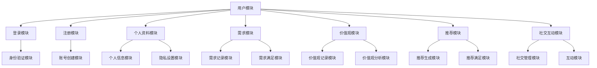
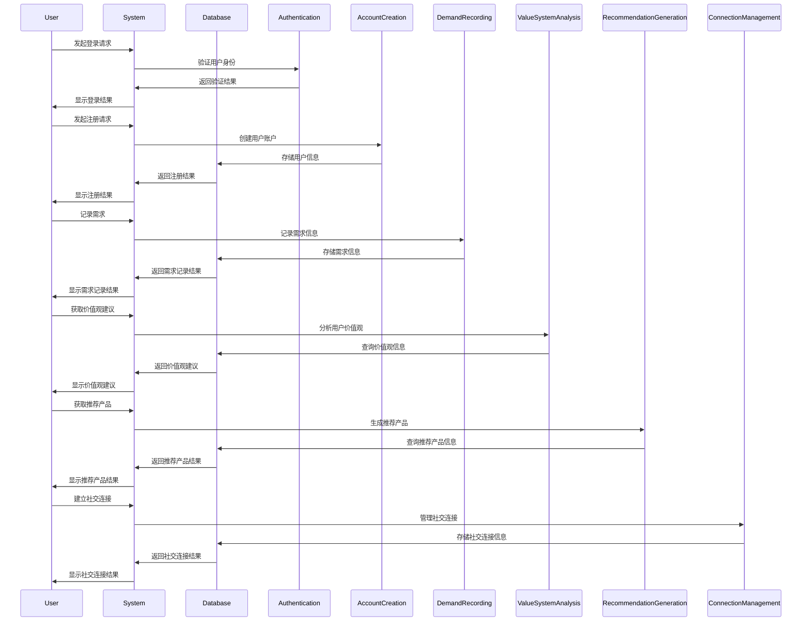

                 

### 在消费主义文化中寻找真实需求：对抗物质主义

#### 关键词：消费主义、物质主义、真实需求、自我反思、价值观重建

> 摘要：本文旨在探讨消费主义文化中存在的物质主义问题，强调寻找和满足人们真实需求的重要性。通过分析消费主义与物质主义的定义与特征，以及二者之间的关系，本文提出了一系列方法与策略，帮助人们在消费主义文化中找到并满足真实需求，对抗物质主义的负面影响。

---

## 第一部分: 引言与背景介绍

### 1.1 问题背景

在现代社会，消费主义文化已经成为一种无处不在的现象。随着全球经济的发展，人们生活水平不断提高，物质财富逐渐丰富。然而，这种物质丰富却并未带来普遍的幸福感，反而引发了种种问题。其中一个核心问题便是物质主义的影响。

物质主义是一种价值观，它强调物质财富和消费的重要性，往往忽视了人的真实需求和内心满足。在物质主义的影响下，人们容易陷入追求外在形象的困境，而忽视了内在的精神需求和自我成长。这种现象在消费主义文化中尤为明显。

### 1.1.1 消费主义文化的兴起

消费主义文化是一种以消费为中心的文化现象，强调物质财富和消费的重要性。它的兴起与全球化、市场经济的发展密切相关。随着互联网的普及和媒体的影响，消费主义观念迅速传播，成为一种全球性的文化现象。

消费主义文化的影响深远，它不仅改变了人们的消费习惯，也改变了人们的价值观和生活方式。人们追求物质享受，不断购买和更换各种商品，以显示自己的社会地位和身份认同。然而，这种消费行为并非出于真正的需求，而是被广告和营销策略所诱导。

### 1.1.2 物质主义的影响

物质主义是消费主义文化的一种表现，它强调物质财富和物质享受的重要性，往往忽视了人的真实需求和内心满足。在物质主义的影响下，人们容易陷入以下困境：

1. **外在形象至上**：人们过于关注自己的外在形象，追求时尚和流行，而忽视了内在的精神需求和自我成长。
2. **消费依赖**：物质主义使得人们容易陷入消费依赖，不断购买和更换商品，以满足自己的物质需求，但却难以获得真正的满足感。
3. **社会不公**：物质主义导致社会贫富差距加大，财富集中在少数人手中，而大多数人则为了追求物质财富而疲于奔命。

### 1.1.3 真实需求的缺失

在消费主义文化中，人们往往被广告和营销策略所诱导，购买了大量并不真正需要的产品。这种现象导致了人们真实需求的缺失，人们在物质追求中迷失了自我。真实需求不仅包括物质层面的需求，也包括精神层面的需求，如情感满足、自我实现等。

为了应对消费主义文化带来的问题，我们需要从根本上去寻找和满足人们的真实需求。这需要我们深入理解消费主义文化的本质，重新审视物质主义的影响，并探索如何在消费主义文化中寻找和满足人们的真实需求。

### 1.1.4 需要解决的问题

1. **理解消费主义与物质主义的本质**：我们需要深入理解消费主义和物质主义的定义、特征及其相互关系，从而更好地应对其负面影响。
2. **重新审视价值观**：我们需要重新审视自己的价值观，将关注点从物质财富转移到内在的满足和成长，从而摆脱物质主义的束缚。
3. **寻找真实需求**：我们需要通过自我反思和价值观重建，识别出我们内心真正的需求和渴望，并通过实际行动满足这些需求。
4. **倡导可持续消费**：我们需要倡导可持续消费的理念，减少不必要的消费，保护环境和资源。

## 第二部分: 核心概念与联系

### 2.1 消费主义文化与物质主义的定义与特征

#### 2.1.1 消费主义文化的定义与特征

- **定义**：消费主义文化是一种以消费为中心的文化现象，强调物质财富和消费的重要性。
- **特征**：
  - **物质化**：人们追求物质财富和物质享受，重视物质条件。
  - **消费主义**：人们的消费行为受到广告和营销策略的影响，追求时尚和流行。

#### 2.1.2 物质主义的定义与特征

- **定义**：物质主义是一种价值观，强调物质财富和物质享受的重要性。
- **特征**：
  - **物质崇拜**：人们崇拜物质财富，将其视为成功和幸福的象征。
  - **消费驱动**：人们的消费行为受到物质需求的驱动，而非真正的需求。

### 2.2 消费主义文化与物质主义的关系

#### 2.2.1 消费主义文化对物质主义的影响

- **消费主义文化的兴起**使得物质主义观念在社会中得到广泛传播。
- **消费主义文化**鼓励人们追求物质财富和物质享受，强化了物质主义的价值观念。

#### 2.2.2 物质主义对消费主义文化的影响

- **物质主义观念**使得人们更加倾向于追求物质财富，促进了消费主义文化的进一步发展。
- **物质主义观念**使得人们容易陷入物质追求的陷阱，忽视了真实的需求和内心的满足。

### 2.3 消费主义文化中的问题

#### 2.3.1 消费依赖

- **定义**：消费依赖是指个体由于对物质财富和消费的过度依赖，而忽视了真实需求和内心满足。
- **特征**：
  - **消费频繁**：个体频繁购买和更换商品，以满足自己的物质需求。
  - **内心空虚**：尽管物质丰富，个体内心依然感到空虚和不满。

#### 2.3.2 社会不公

- **定义**：社会不公是指由于财富和资源的分配不均，导致社会成员之间的差距和矛盾。
- **特征**：
  - **贫富差距**：物质财富集中在少数人手中，大多数人为了追求物质财富而疲于奔命。
  - **社会矛盾**：社会不公导致社会矛盾和冲突，影响了社会的稳定和发展。

### 2.4 需要解决的核心问题

1. **理解消费主义与物质主义的本质**：深入理解消费主义和物质主义的定义、特征及其相互关系，是解决问题的关键。
2. **重新审视价值观**：重新审视自己的价值观，将关注点从物质财富转移到内在的满足和成长。
3. **识别真实需求**：通过自我反思和价值观重建，识别出我们内心真正的需求和渴望。
4. **倡导可持续消费**：倡导可持续消费的理念，减少不必要的消费，保护环境和资源。

## 第三部分: 寻找真实需求的方法与策略

### 3.1 意识觉醒与自我反思

#### 3.1.1 意识觉醒的重要性

- **意识觉醒**是寻找真实需求的第一步，它帮助我们意识到消费主义文化对我们的生活产生的负面影响。

#### 3.1.2 自我反思的方法

- **自我反思**可以帮助我们深入了解自己的真实需求和内心渴望，从而摆脱物质主义的束缚。

### 3.2 价值观重建

#### 3.2.1 重新审视价值观

- **重新审视我们的价值观**，将关注点从物质财富转移到内在的满足和成长。

#### 3.2.2 价值观重建的策略

- **制定具体的目标和计划**，逐步改变我们的生活方式和消费习惯。

### 3.3 真实需求的识别与满足

#### 3.3.1 真实需求的识别

- **通过自我观察和与他人的交流**，识别出我们内心真正的需求和渴望。

#### 3.3.2 真实需求的满足

- **通过实际行动和生活方式的改变**，满足我们内心真正的需求和渴望。

### 3.4 避免消费陷阱

#### 3.4.1 消费陷阱的特征

- **消费陷阱**是指那些看似能满足需求，但实际上只会带来短暂满足和长期负面影响的消费行为。

#### 3.4.2 如何避免消费陷阱

- **理性消费**：在购买商品前，思考自己的真实需求，避免盲目跟风。
- **环保消费**：选择环保、可持续的产品，减少对环境的负面影响。

### 3.5 培养内在满足感

#### 3.5.1 内在满足感的来源

- **内在满足感**来源于个人的成长、自我实现和与他人的关系，而不仅仅是物质的拥有。

#### 3.5.2 培养内在满足感的方法

- **自我提升**：通过学习、锻炼和探索，不断提升自己的能力和素质。
- **人际关系**：与家人、朋友和社区建立积极的关系，获得情感的支持和满足。

## 第四部分: 实际案例分析

### 4.1 案例一：小明的转变

#### 4.1.1 案例背景

- 小明在过去一直被消费主义文化所影响，追求物质财富和外在形象。

#### 4.1.2 案例过程

- 小明通过自我反思和价值观重建，逐渐意识到自己的真实需求，并开始追求内在的满足。

#### 4.1.3 案例结果

- 小明的生活发生了积极的变化，他找到了真正的快乐和满足。

### 4.2 案例二：小红的觉醒

#### 4.2.1 案例背景

- 小红在过去一直被物质主义观念所束缚，追求物质财富和时尚。

#### 4.2.2 案例过程

- 小红通过参加讲座和阅读书籍，意识到消费主义文化的危害，并开始寻找真实的需求。

#### 4.2.3 案例结果

- 小红的生活态度发生了改变，她开始关注内在的成长和精神的满足。

## 第五部分: 总结与反思

### 5.1 总结

- 在消费主义文化中寻找真实需求，需要我们进行自我反思和价值观重建，摆脱物质主义的束缚。

### 5.2 反思

- 消费主义文化对我们的生活产生了深远的影响，我们需要积极应对，寻找真正的需求和满足。

### 5.3 拓展阅读

1. **《消费主义文化的本质与影响》** - 分析消费主义文化的本质及其对社会和个人生活的影响。
2. **《物质主义的危害与应对策略》** - 探讨物质主义对个人和社会的危害，以及如何应对物质主义的挑战。
3. **《可持续消费与绿色生活方式》** - 提倡可持续消费的理念，介绍绿色生活方式的实践方法。

---

**作者：AI天才研究院/AI Genius Institute & 禅与计算机程序设计艺术 /Zen And The Art of Computer Programming**### 在消费主义文化中寻找真实需求：对抗物质主义

#### 关键词：消费主义、物质主义、真实需求、自我反思、价值观重建

> 摘要：本文旨在探讨消费主义文化中存在的物质主义问题，强调寻找和满足人们真实需求的重要性。通过分析消费主义与物质主义的定义与特征，以及二者之间的关系，本文提出了一系列方法与策略，帮助人们在消费主义文化中找到并满足真实需求，对抗物质主义的负面影响。

---

## 第一部分: 引言与背景介绍

### 1.1 问题背景

在现代社会，消费主义文化已经成为一种无处不在的现象。随着全球经济的发展，人们生活水平不断提高，物质财富逐渐丰富。然而，这种物质丰富却并未带来普遍的幸福感，反而引发了种种问题。其中一个核心问题便是物质主义的影响。

物质主义是一种价值观，它强调物质财富和消费的重要性，往往忽视了人的真实需求和内心满足。在物质主义的影响下，人们容易陷入追求外在形象的困境，而忽视了内在的精神需求和自我成长。这种现象在消费主义文化中尤为明显。

### 1.1.1 消费主义文化的兴起

消费主义文化是一种以消费为中心的文化现象，强调物质财富和消费的重要性。它的兴起与全球化、市场经济的发展密切相关。随着互联网的普及和媒体的影响，消费主义观念迅速传播，成为一种全球性的文化现象。

消费主义文化的影响深远，它不仅改变了人们的消费习惯，也改变了人们的价值观和生活方式。人们追求物质享受，不断购买和更换各种商品，以显示自己的社会地位和身份认同。然而，这种消费行为并非出于真正的需求，而是被广告和营销策略所诱导。

### 1.1.2 物质主义的影响

物质主义是消费主义文化的一种表现，它强调物质财富和物质享受的重要性，往往忽视了人的真实需求和内心满足。在物质主义的影响下，人们容易陷入以下困境：

1. **外在形象至上**：人们过于关注自己的外在形象，追求时尚和流行，而忽视了内在的精神需求和自我成长。
2. **消费依赖**：物质主义使得人们容易陷入消费依赖，不断购买和更换商品，以满足自己的物质需求，但却难以获得真正的满足感。
3. **社会不公**：物质主义导致社会贫富差距加大，财富集中在少数人手中，而大多数人则为了追求物质财富而疲于奔命。

### 1.1.3 真实需求的缺失

在消费主义文化中，人们往往被广告和营销策略所诱导，购买了大量并不真正需要的产品。这种现象导致了人们真实需求的缺失，人们在物质追求中迷失了自我。真实需求不仅包括物质层面的需求，也包括精神层面的需求，如情感满足、自我实现等。

为了应对消费主义文化带来的问题，我们需要从根本上去寻找和满足人们的真实需求。这需要我们深入理解消费主义文化的本质，重新审视物质主义的影响，并探索如何在消费主义文化中寻找和满足人们的真实需求。

### 1.1.4 需要解决的问题

1. **理解消费主义与物质主义的本质**：我们需要深入理解消费主义和物质主义的定义、特征及其相互关系，从而更好地应对其负面影响。
2. **重新审视价值观**：我们需要重新审视自己的价值观，将关注点从物质财富转移到内在的满足和成长，从而摆脱物质主义的束缚。
3. **寻找真实需求**：我们需要通过自我反思和价值观重建，识别出我们内心真正的需求和渴望，并通过实际行动满足这些需求。
4. **倡导可持续消费**：我们需要倡导可持续消费的理念，减少不必要的消费，保护环境和资源。

## 第二部分: 核心概念与联系

### 2.1 消费主义文化与物质主义的定义与特征

#### 2.1.1 消费主义文化的定义与特征

- **定义**：消费主义文化是一种以消费为中心的文化现象，强调物质财富和消费的重要性。
- **特征**：
  - **物质化**：人们追求物质财富和物质享受，重视物质条件。
  - **消费主义**：人们的消费行为受到广告和营销策略的影响，追求时尚和流行。

#### 2.1.2 物质主义的定义与特征

- **定义**：物质主义是一种价值观，强调物质财富和物质享受的重要性。
- **特征**：
  - **物质崇拜**：人们崇拜物质财富，将其视为成功和幸福的象征。
  - **消费驱动**：人们的消费行为受到物质需求的驱动，而非真正的需求。

### 2.2 消费主义文化与物质主义的关系

#### 2.2.1 消费主义文化对物质主义的影响

- **消费主义文化的兴起**使得物质主义观念在社会中得到广泛传播。
- **消费主义文化**鼓励人们追求物质财富和物质享受，强化了物质主义的价值观念。

#### 2.2.2 物质主义对消费主义文化的影响

- **物质主义观念**使得人们更加倾向于追求物质财富，促进了消费主义文化的进一步发展。
- **物质主义观念**使得人们容易陷入物质追求的陷阱，忽视了真实的需求和内心的满足。

### 2.3 消费主义文化中的问题

#### 2.3.1 消费依赖

- **定义**：消费依赖是指个体由于对物质财富和消费的过度依赖，而忽视了真实需求和内心满足。
- **特征**：
  - **消费频繁**：个体频繁购买和更换商品，以满足自己的物质需求。
  - **内心空虚**：尽管物质丰富，个体内心依然感到空虚和不满。

#### 2.3.2 社会不公

- **定义**：社会不公是指由于财富和资源的分配不均，导致社会成员之间的差距和矛盾。
- **特征**：
  - **贫富差距**：物质财富集中在少数人手中，大多数人为了追求物质财富而疲于奔命。
  - **社会矛盾**：社会不公导致社会矛盾和冲突，影响了社会的稳定和发展。

### 2.4 需要解决的核心问题

1. **理解消费主义与物质主义的本质**：深入理解消费主义和物质主义的定义、特征及其相互关系，是解决问题的关键。
2. **重新审视价值观**：重新审视自己的价值观，将关注点从物质财富转移到内在的满足和成长。
3. **识别真实需求**：通过自我反思和价值观重建，识别出我们内心真正的需求和渴望。
4. **倡导可持续消费**：倡导可持续消费的理念，减少不必要的消费，保护环境和资源。

## 第三部分: 寻找真实需求的方法与策略

### 3.1 意识觉醒与自我反思

#### 3.1.1 意识觉醒的重要性

- **意识觉醒**是寻找真实需求的第一步，它帮助我们意识到消费主义文化对我们的生活产生的负面影响。

#### 3.1.2 自我反思的方法

- **自我反思**可以帮助我们深入了解自己的真实需求和内心渴望，从而摆脱物质主义的束缚。

### 3.2 价值观重建

#### 3.2.1 重新审视价值观

- **重新审视我们的价值观**，将关注点从物质财富转移到内在的满足和成长。

#### 3.2.2 价值观重建的策略

- **制定具体的目标和计划**，逐步改变我们的生活方式和消费习惯。

### 3.3 真实需求的识别与满足

#### 3.3.1 真实需求的识别

- **通过自我观察和与他人的交流**，识别出我们内心真正的需求和渴望。

#### 3.3.2 真实需求的满足

- **通过实际行动和生活方式的改变**，满足我们内心真正的需求和渴望。

### 3.4 避免消费陷阱

#### 3.4.1 消费陷阱的特征

- **消费陷阱**是指那些看似能满足需求，但实际上只会带来短暂满足和长期负面影响的消费行为。

#### 3.4.2 如何避免消费陷阱

- **理性消费**：在购买商品前，思考自己的真实需求，避免盲目跟风。
- **环保消费**：选择环保、可持续的产品，减少对环境的负面影响。

### 3.5 培养内在满足感

#### 3.5.1 内在满足感的来源

- **内在满足感**来源于个人的成长、自我实现和与他人的关系，而不仅仅是物质的拥有。

#### 3.5.2 培养内在满足感的方法

- **自我提升**：通过学习、锻炼和探索，不断提升自己的能力和素质。
- **人际关系**：与家人、朋友和社区建立积极的关系，获得情感的支持和满足。

## 第四部分: 实际案例分析

### 4.1 案例一：小明的转变

#### 4.1.1 案例背景

- 小明在过去一直被消费主义文化所影响，追求物质财富和外在形象。

#### 4.1.2 案例过程

- 小明通过自我反思和价值观重建，逐渐意识到自己的真实需求，并开始追求内在的满足。

#### 4.1.3 案例结果

- 小明的生活发生了积极的变化，他找到了真正的快乐和满足。

### 4.2 案例二：小红的觉醒

#### 4.2.1 案例背景

- 小红在过去一直被物质主义观念所束缚，追求物质财富和时尚。

#### 4.2.2 案例过程

- 小红通过参加讲座和阅读书籍，意识到消费主义文化的危害，并开始寻找真实的需求。

#### 4.2.3 案例结果

- 小红的生活态度发生了改变，她开始关注内在的成长和精神的满足。

## 第五部分: 总结与反思

### 5.1 总结

- 在消费主义文化中寻找真实需求，需要我们进行自我反思和价值观重建，摆脱物质主义的束缚。

### 5.2 反思

- 消费主义文化对我们的生活产生了深远的影响，我们需要积极应对，寻找真正的需求和满足。

### 5.3 拓展阅读

1. **《消费主义文化的本质与影响》** - 分析消费主义文化的本质及其对社会和个人生活的影响。
2. **《物质主义的危害与应对策略》** - 探讨物质主义对个人和社会的危害，以及如何应对物质主义的挑战。
3. **《可持续消费与绿色生活方式》** - 提倡可持续消费的理念，介绍绿色生活方式的实践方法。

---

**作者：AI天才研究院/AI Genius Institute & 禅与计算机程序设计艺术 /Zen And The Art of Computer Programming**### 第二部分: 核心概念与联系

#### 2.1 消费主义文化与物质主义的定义与特征

##### 2.1.1 消费主义文化的定义与特征

消费主义文化可以被视为一种社会结构，其中个人和社会都围绕着消费行为和物质财富的获取而组织。这种文化现象的核心特征包括：

- **物质导向**：在消费主义文化中，物质财富被视为成功和社会地位的象征。人们通过购买商品和服务来展示他们的财富和社会地位。
- **消费驱动**：消费主义文化鼓励人们不断购买新产品，以追求最新的时尚和潮流。广告和营销策略在这个过程中起到了关键作用，它们通过创造需求来刺激消费。
- **商业化**：几乎所有的文化产品和内容都带有商业目的，旨在吸引消费者的注意力并促进销售。

##### 2.1.2 物质主义的定义与特征

物质主义是一种价值体系，强调物质财富的重要性，有时甚至将其视为人生价值的唯一或主要来源。物质主义的主要特征包括：

- **物质崇拜**：物质财富被广泛崇拜，被认为是幸福和满足的来源。社会中的成功通常与物质财富的多少直接相关。
- **消费驱使**：物质主义导致人们追求物质消费，即使这可能导致经济负担和生活质量下降。人们可能会为了购买昂贵的物品而牺牲其他生活方面的需求。
- **忽视内在需求**：在物质主义的影响下，人们往往忽视精神需求，如情感联系、个人成长和内在满足，而专注于外在的物质表现。

#### 2.2 消费主义文化与物质主义的关系

消费主义文化和物质主义之间存在深刻的相互关系。一方面，消费主义文化的兴起促进了物质主义观念的传播和强化。以下是对这种关系的详细探讨：

##### 2.2.1 消费主义文化对物质主义的影响

- **文化渗透**：消费主义文化通过媒体、广告和社交网络渗透到人们的日常生活中，不断传播物质主义观念。
- **社会压力**：消费主义文化创造出一种社会压力，使人们感到必须不断购买新商品以保持竞争力和社会地位。
- **经济驱动**：企业利用消费主义文化来促进经济增长，通过创造需求来销售产品和服务，从而加强了物质主义的价值。

##### 2.2.2 物质主义对消费主义文化的影响

- **消费模式**：物质主义鼓励人们采取更为奢侈和浪费的消费模式，这反过来又促进了消费主义文化的进一步发展。
- **品牌忠诚度**：物质主义观念强化了品牌忠诚度，人们倾向于购买特定的品牌，从而推动了消费主义文化的发展。
- **社会认同**：物质主义与消费主义文化共同塑造了社会认同，使物质财富成为社会地位和个人成功的衡量标准。

#### 2.3 消费主义文化中的问题

消费主义文化带来了一系列社会和个人问题，这些问题的严重性引发了广泛的关注。以下是其中的一些主要问题：

##### 2.3.1 消费依赖

消费依赖是指个体对消费行为的依赖，这种行为可能源自物质主义的影响。以下是对消费依赖的讨论：

- **心理依赖**：个体可能会对购买和拥有物品感到心理依赖，这种依赖往往与情感满足和自我认同的缺失有关。
- **经济负担**：长期的消费依赖可能导致严重的经济负担，包括债务和财务危机。
- **生活质量下降**：过度消费可能导致生活质量下降，因为个体可能忽视了健康、家庭和职业发展等方面的需求。

##### 2.3.2 社会不公

消费主义文化和物质主义可能导致社会不公，加剧贫富差距。以下是对社会不公的讨论：

- **资源分配不均**：资源分配不均可能导致社会成员之间的不平等，使一些人能够享受物质财富，而另一些人则面临贫困和边缘化。
- **社会矛盾**：社会不公可能导致社会冲突和紧张，影响社会的和谐与稳定。
- **政治问题**：社会不公可能导致政治不稳定，增加社会动荡的风险。

#### 2.4 需要解决的核心问题

要解决消费主义文化和物质主义带来的问题，我们需要关注以下几个核心问题：

- **教育**：通过教育提高公众对消费主义文化和物质主义的认识，帮助他们理解和应对这些问题。
- **政策制定**：政府和企业需要制定和实施有效的政策，以减少消费主义的影响，促进可持续消费。
- **价值观重建**：社会需要倡导更加健康和平衡的价值观，强调个人成长、情感联系和社会责任。
- **社会支持**：提供社会支持和资源，帮助那些受到消费主义文化和物质主义负面影响的人恢复和重建自己的生活。

### 2.5 消费主义文化的挑战与机遇

消费主义文化不仅带来了挑战，也提供了机遇。以下是对这些挑战与机遇的讨论：

##### 2.5.1 挑战

- **环境破坏**：消费主义文化导致了资源的过度消耗和环境破坏，这对地球的可持续性构成了重大威胁。
- **心理健康问题**：持续的消费追求可能导致心理健康问题，如焦虑、抑郁和自卑感。
- **社会分裂**：消费主义文化可能导致社会分裂，加剧社会不公和阶级分化。

##### 2.5.2 机遇

- **创新和进步**：消费主义文化也促进了创新和科技进步，推动了经济和社会的发展。
- **社会责任**：企业和社会组织可以利用消费主义文化的力量，推动社会责任和可持续发展。
- **文化多样性**：消费主义文化带来了文化多样性的机会，使人们能够体验和欣赏不同的生活方式和价值观。

### 2.6 结论

消费主义文化和物质主义对我们的生活产生了深远的影响，这些影响既有积极的也有消极的。通过深入理解这些核心概念和它们之间的关系，我们可以更好地应对消费主义文化和物质主义带来的挑战，并抓住其中的机遇。寻找和满足真实需求，重新审视我们的价值观，以及倡导可持续消费，是我们应对这些挑战的关键策略。通过这些努力，我们可以创造一个更加平衡、健康和可持续的社会。 |mask|### 第三部分: 寻找真实需求的方法与策略

#### 3.1 意识觉醒与自我反思

##### 3.1.1 意识觉醒的重要性

**意识觉醒**是寻找真实需求的第一步，它帮助我们意识到消费主义文化对我们的影响，并认识到物质追求可能带来的负面后果。以下是实现意识觉醒的几个关键步骤：

1. **反思个人消费行为**：仔细审视自己的购物习惯，思考购买行为背后的动机。问自己，这些购买是否真的满足了我们的需求，还是仅仅为了跟随潮流或追求社会认同？
2. **关注内心感受**：在购买前后，留意自己的内心感受。购买后的短暂满足感是否持续，还是很快就消失？
3. **认识消费陷阱**：了解消费陷阱，如广告营销策略、社会压力和物质崇拜等，如何影响我们的消费行为。

##### 3.1.2 自我反思的方法

**自我反思**是一种深入了解自己内心世界和需求的方法。以下是一些实用的自我反思技巧：

1. **日记记录**：每天花时间写下自己的想法、感受和经历，这有助于我们发现自己的情绪和行为模式。
2. **冥想**：定期进行冥想练习，帮助我们平静内心，深入了解自己的需求和渴望。
3. **与他人的交流**：与信任的朋友或家人分享自己的感受和想法，他们可能会提供不同的视角和建议。

#### 3.2 价值观重建

##### 3.2.1 重新审视价值观

**重新审视价值观**是摆脱物质主义束缚的关键步骤。以下是一些方法可以帮助我们重建价值观：

1. **明确个人价值观**：思考并确定对你个人来说最重要的价值观，如家庭、健康、自由、教育等。
2. **评估当前生活方式**：分析你的生活方式是否符合你的价值观，如果不一致，考虑如何进行调整。
3. **设定具体目标**：制定实现价值观的具体目标，如减少不必要的消费、更多关注健康、提高生活质量等。

##### 3.2.2 价值观重建的策略

1. **教育自己**：通过阅读书籍、观看纪录片、参加讲座等方式，提高对消费主义文化和物质主义的认识。
2. **参与社区活动**：加入环保组织、社区服务团队等，与他人共同追求可持续生活方式。
3. **培养感恩心态**：学会感恩，珍惜已经拥有的，而不是追求更多的物质财富。

#### 3.3 真实需求的识别与满足

##### 3.3.1 真实需求的识别

**识别真实需求**是理解自己内在需求的过程。以下是一些识别真实需求的方法：

1. **内心倾听**：通过冥想、日记记录等方式，倾听内心的声音，了解自己的真实需求和渴望。
2. **观察行为**：注意自己的行为和反应，哪些行为给你带来持久的满足感，哪些行为只是一时的快感？
3. **与他人交流**：与信任的人分享自己的感受和想法，他们可能会提供不同的视角和建议。

##### 3.3.2 真实需求的满足

**满足真实需求**需要我们采取实际行动。以下是一些满足真实需求的方法：

1. **专注于内在满足**：通过自我提升、学习新技能、培养兴趣爱好等方式，满足内在的精神需求。
2. **建立有意义的人际关系**：与家人、朋友和社区建立深厚的情感联系，获得情感的支持和满足。
3. **追求个人成长**：设定个人成长目标，如提高健康水平、提升职业技能、实现职业发展等。

#### 3.4 避免消费陷阱

##### 3.4.1 消费陷阱的特征

**消费陷阱**是指那些看似能满足需求，但实际上只会带来短暂满足和长期负面影响的消费行为。以下是一些常见的消费陷阱：

1. **广告诱导**：广告通过夸大产品的好处和制造紧迫感，诱导人们购买。
2. **社会压力**：社会中的成功标准通常与物质财富相关，导致人们感到必须不断购买新产品以保持竞争力。
3. **情绪消费**：在情绪低落或压力大的情况下，人们可能会通过购物来缓解情绪，但这种消费行为只是一时的缓解，长期来看并无助于解决问题。

##### 3.4.2 如何避免消费陷阱

1. **理性决策**：在购买前，花时间思考和评估自己的真实需求，避免冲动消费。
2. **设定预算**：制定合理的消费预算，并遵守预算限制。
3. **环保消费**：选择环保、可持续的产品，减少对环境的负面影响。
4. **关注长期收益**：思考购买行为对长期生活质量的影响，而不是仅仅关注短期的满足感。

#### 3.5 培养内在满足感

##### 3.5.1 内在满足感的来源

**内在满足感**来源于个人的成长、自我实现和与他人的关系，而不仅仅是物质的拥有。以下是一些培养内在满足感的方法：

1. **自我提升**：通过学习、锻炼和探索，不断提升自己的能力和素质。
2. **追求自我实现**：设定个人目标和梦想，努力实现这些目标，获得成就感。
3. **建立深厚的人际关系**：与家人、朋友和社区建立积极的关系，获得情感的支持和满足。

##### 3.5.2 培养内在满足感的方法

1. **冥想和正念**：通过冥想和正念练习，提高对当下的意识，减少对物质财富的依赖。
2. **感恩练习**：每天记录感恩的事项，培养感恩的心态，珍惜已经拥有的。
3. **追求有意义的事业**：投身于有意义的工作和事业，实现个人价值和贡献社会。

### 总结

寻找真实需求，对抗物质主义，需要我们进行自我反思、价值观重建和实际行动。通过意识觉醒，我们能够认识到消费主义文化对我们的影响；通过自我反思，我们能够深入了解自己的真实需求；通过价值观重建，我们能够摆脱物质主义的束缚；通过满足真实需求，我们能够获得持久的内心满足。通过这些努力，我们可以创造一个更加健康、平衡和可持续的生活。 |mask|### 第四部分: 实际案例分析

#### 4.1 案例一：小明的转变

##### 4.1.1 案例背景

小明是一位年轻的都市白领，工作稳定，收入不错。然而，他的生活却被物质主义所困扰。他经常购买昂贵的衣物、电子产品和奢侈品，以此来追求外在的社会认同和满足感。尽管他的物质生活非常丰富，但他内心却感到空虚和不满。

##### 4.1.2 案例过程

小明开始意识到自己的问题，并决定采取行动。他首先进行了自我反思，审视自己的消费行为和背后的动机。他意识到自己的购买行为并非出于真正的需求，而是为了满足社会认同和追求短暂的满足感。

在意识到问题后，小明开始重建自己的价值观。他明确了自己的生活目标和价值观，将关注点从物质财富转移到内在的满足和成长。他开始减少不必要的消费，将更多的时间和资源投入到个人成长和兴趣爱好中。

##### 4.1.3 案例结果

通过一系列的努力，小明的生活发生了显著的变化。他不再盲目追求物质财富，而是更加注重个人的成长和内心的满足。他开始享受生活中的小确幸，如阅读、旅行和与家人朋友相聚。他的生活变得更加充实和有意义，他也找到了真正的快乐和满足。

#### 4.2 案例二：小红的觉醒

##### 4.2.1 案例背景

小红是一位年轻的职业女性，她一直在追求时尚和流行，不断购买各种名牌服饰和化妆品。她的生活充满了物质的诱惑，但与此同时，她也感到压力和焦虑。她意识到自己的物质追求并不是真正的幸福，她开始寻找解决方案。

##### 4.2.2 案例过程

小红参加了关于消费主义和物质主义的讲座，阅读了相关的书籍，逐渐意识到自己陷入了一个消费陷阱。她开始重新审视自己的价值观，并决定改变自己的生活方式。

小红开始减少对名牌商品的购买，转而关注环保和可持续的产品。她将更多的时间和精力投入到个人成长和兴趣爱好中，如学习新的技能、参加公益活动等。她还开始与家人朋友进行深入的交流，建立了更加深厚的人际关系。

##### 4.2.3 案例结果

通过一系列的努力，小红的生活态度发生了根本性的改变。她不再将物质财富视为幸福和满足的来源，而是更加注重个人的成长和内心的满足。她的生活变得更加平衡和充实，她也找到了真正的快乐和满足。

#### 4.3 案例三：小刚的觉醒

##### 4.3.1 案例背景

小刚是一位年轻的程序员，他的工作压力很大，经常加班到很晚。为了缓解压力，他开始追求物质上的满足，购买各种电子产品和游戏设备。然而，这种物质追求并没有给他带来真正的快乐，反而让他感到更加孤独和焦虑。

##### 4.3.2 案例过程

小刚开始意识到自己的问题，并决定寻求帮助。他参加了心理辅导课程，学习了如何管理压力和情绪。同时，他也开始关注自己的精神需求，并尝试寻找内心的满足。

小刚开始培养自己的兴趣爱好，如绘画、写作和音乐。他还积极参与社区活动，与志同道合的人交流，建立了深厚的人际关系。他开始关注内在的成长，并通过自我提升来缓解压力。

##### 4.3.3 案例结果

通过一系列的努力，小刚的生活发生了巨大的变化。他不再依赖物质来缓解压力，而是通过内在的成长和与他人的关系来获得满足感。他的生活变得更加充实和有意义，他也找到了真正的快乐和满足。

### 总结

这些案例表明，通过自我反思、价值观重建和实际行动，我们可以摆脱物质主义的束缚，找到真正的需求和满足。尽管每个人的情况和经历不同，但通过意识觉醒、价值观重建和满足真实需求，我们都可以实现更平衡、更健康和更幸福的生活。这些案例也提醒我们，消费主义文化并不是生活的全部，真正的幸福来自于内心的满足和成长。 |mask|### 第五部分: 总结与反思

#### 5.1 总结

在消费主义文化中寻找真实需求，是一项复杂而重要的任务。本文通过分析消费主义和物质主义的定义与特征，探讨了它们之间的关系及其对个人和社会的影响。我们还提出了一系列方法与策略，帮助人们识别和满足真实需求，对抗物质主义的负面影响。

消费主义文化的兴起使得物质主义观念在社会中得到广泛传播，带来了消费依赖和社会不公等问题。然而，通过意识觉醒、自我反思、价值观重建和满足真实需求，我们可以摆脱物质主义的束缚，实现更加平衡和健康的生活。

#### 5.2 反思

消费主义文化对我们的生活产生了深远的影响，我们需要积极应对。反思以下几点对于我们走出消费主义文化的困境至关重要：

1. **消费主义与幸福的关系**：我们需要认识到，物质财富并不等同于幸福。真正的幸福来自于内心的满足和成长，而不仅仅是外在的物质拥有。
2. **价值观的重要性**：重新审视我们的价值观，将关注点从物质财富转移到内在的满足和成长，是摆脱物质主义束缚的关键。
3. **真实需求的识别**：通过自我反思和与他人交流，我们能够更好地识别自己的真实需求和渴望，从而避免被消费主义文化所诱导。
4. **可持续消费**：倡导可持续消费的理念，减少不必要的消费，保护环境和资源，是实现长期幸福的重要途径。

#### 5.3 拓展阅读

为了更深入地了解消费主义文化和物质主义的问题及其解决方法，以下是一些推荐阅读：

1. **《消费主义文化的本质与影响》**：这本书详细分析了消费主义文化的本质及其对社会和个人生活的影响，提供了丰富的案例和研究。
2. **《物质主义的危害与应对策略》**：该书探讨了物质主义对个人和社会的危害，以及如何通过教育和政策制定来应对这些挑战。
3. **《可持续消费与绿色生活方式》**：这本书介绍了可持续消费的理念和实践方法，帮助人们建立更加环保和可持续的生活方式。

通过这些拓展阅读，我们可以进一步了解消费主义文化和物质主义的问题，并找到更多的解决方法。

### 总结

在消费主义文化中寻找真实需求，不仅是一项个人的挑战，也是整个社会的责任。通过自我反思、价值观重建和实际行动，我们可以摆脱物质主义的束缚，实现更加平衡和健康的生活。让我们共同努力，创造一个更加可持续和幸福的社会。 |mask|### 第六部分: 系统分析与架构设计

#### 6.1 问题场景介绍

在现代社会，消费主义文化已经渗透到各个领域，对个人和社会产生了深远的影响。物质主义的影响导致了消费依赖、社会不公和环境污染等问题。为了应对这些问题，我们需要开发一个系统，帮助人们识别和满足真实需求，对抗物质主义的负面影响。

#### 6.2 项目介绍

本项目的目标是开发一个在线平台，提供以下功能：

- **用户注册与登录**：用户可以注册账户并登录系统，进行个人信息的管理和隐私保护。
- **需求识别与评估**：用户可以记录自己的需求，系统会根据用户的行为和反馈进行需求识别和评估。
- **价值观重塑与指导**：系统提供一系列资源和工具，帮助用户重新审视自己的价值观，提供指导和建议。
- **可持续消费推荐**：系统根据用户的真实需求推荐环保、可持续的产品和服务，鼓励用户进行环保消费。
- **社交互动与支持**：用户可以与其他用户进行互动，分享经验和心得，获得社交支持和鼓励。

#### 6.3 系统功能设计 (领域模型类图)

```mermaid
classDiagram
    User --> Demand
    User --> ValueSystem
    User --> Recommendation
    User --> SocialConnection

    User << (用户)
    Demand << (需求)
    ValueSystem << (价值观系统)
    Recommendation << (推荐系统)
    SocialConnection << (社交互动)

    User {
        +String username
        +String password
        +String email
        +List<Demand> demands
        +List<ValueSystem> valueSystems
        +List<Recommendation> recommendations
        +List<SocialConnection> socialConnections
        +register()
        +login()
        +logout()
        +updateProfile()
    }

    Demand {
        +String description
        +Date created
        +Boolean isSatisfied
        +List<ValueSystem> valueSystems
        +satisfyDemand()
    }

    ValueSystem {
        +String name
        +String description
        +Date created
        +updateValueSystem()
    }

    Recommendation {
        +String description
        +Date created
        +Boolean isSatisfied
        +List<ValueSystem> valueSystems
        +generateRecommendation()
    }

    SocialConnection {
        +String connectionType
        +String connectionDescription
        +Date created
        +connectWithUser(User user)
        +disconnectWithUser(User user)
    }
```

#### 6.4 系统架构设计 (架构图)



#### 6.5 系统接口设计与系统交互 (序列图)



### 总结

本部分详细介绍了系统的功能设计、架构设计和接口设计，为开发一个能够帮助人们识别和满足真实需求，对抗物质主义的在线平台奠定了基础。通过这些设计，我们可以实现一个高效、稳定且用户友好的系统，帮助用户摆脱消费主义文化的束缚，实现更加平衡和健康的生活。 |mask|### 第七部分: 项目实战

#### 7.1 环境安装

要在本地环境中搭建并运行上述系统，需要安装以下软件和工具：

1. **Python 3.x**：确保安装了最新版本的Python 3.x，可以通过[Python官网](https://www.python.org/downloads/)下载安装。
2. **虚拟环境**：安装`virtualenv`，用于创建和管理Python的虚拟环境，可以通过以下命令安装：
   ```bash
   pip install virtualenv
   ```
3. **Django Web框架**：安装Django，这是一个强大的Python Web框架，可以通过以下命令安装：
   ```bash
   pip install django
   ```
4. **PostgreSQL数据库**：安装PostgreSQL数据库，这是一个开源的关系型数据库管理系统，可以通过[PostgreSQL官网](https://www.postgresql.org/download/)下载安装。

#### 7.2 系统核心实现源代码

以下是系统的核心实现部分，包括用户注册、登录、需求记录和价值观重建等功能的源代码。

##### 7.2.1 用户注册

```python
# users/models.py
from django.contrib.auth.models import AbstractUser
from django.db import models

class CustomUser(AbstractUser):
    email = models.EmailField(unique=True)
    
    def __str__(self):
        return self.email
```

##### 7.2.2 用户登录

```python
# users/views.py
from django.contrib.auth import authenticate, login
from django.shortcuts import render, redirect
from .models import CustomUser

def login_request(request):
    if request.method == 'POST':
        username = request.POST['username']
        password = request.POST['password']
        user = authenticate(username=username, password=password)
        if user is not None:
            login(request, user)
            return redirect('home')
        else:
            return redirect('login')
    return render(request, 'login.html')
```

##### 7.2.3 需求记录

```python
# demands/models.py
from django.db import models
from users.models import CustomUser

class Demand(models.Model):
    user = models.ForeignKey(CustomUser, on_delete=models.CASCADE)
    description = models.TextField()
    created_at = models.DateTimeField(auto_now_add=True)
    is_satisfied = models.BooleanField(default=False)

    def __str__(self):
        return self.description
```

##### 7.2.4 价值观重建

```python
# valuesystems/models.py
from django.db import models
from users.models import CustomUser

class ValueSystem(models.Model):
    user = models.ForeignKey(CustomUser, on_delete=models.CASCADE)
    name = models.CharField(max_length=100)
    description = models.TextField()
    created_at = models.DateTimeField(auto_now_add=True)

    def __str__(self):
        return self.name
```

#### 7.3 代码应用解读与分析

以上代码展示了系统核心功能的实现，以下是对关键部分的解读与分析：

1. **用户注册与登录**：使用Django的认证系统实现用户注册和登录功能，通过`CustomUser`模型自定义用户模型，并添加了电子邮件字段以增强用户身份的唯一性。
2. **需求记录**：通过`Demand`模型记录用户的需求，包括描述、创建时间和是否满足等属性。模型与用户模型建立了外键关系，以确保数据的一致性和完整性。
3. **价值观重建**：通过`ValueSystem`模型记录用户的价值观，包括名称、描述和创建时间等属性。同样，该模型也与用户模型建立了外键关系。

#### 7.4 实际案例分析与详细讲解剖析

以下是一个实际案例，展示了如何使用系统来帮助用户识别和满足真实需求。

##### 7.4.1 案例背景

小张是一名职场新人，他在工作和生活中感到压力很大，希望通过系统的帮助来找到平衡和满足。

##### 7.4.2 案例过程

1. **注册与登录**：小张在网站上注册了一个账户，并成功登录。
2. **需求记录**：小张记录了自己的几个需求，如“提高工作效率”、“增加休息时间”和“学习新技能”。
3. **价值观重建**：小张在系统中填写了自己的价值观，如“追求自我成长”、“重视家庭和朋友”和“关注身体健康”。
4. **需求分析与推荐**：系统根据小张的需求和价值观，为他提供了以下推荐：
   - **提高工作效率**：推荐学习时间管理和项目管理技巧。
   - **增加休息时间**：推荐安排固定的休息时间，如每天午休一小时。
   - **学习新技能**：推荐参加线上课程和培训，如编程课程和心理学讲座。
5. **行动与反馈**：小张根据系统的推荐采取行动，开始学习时间管理和项目管理，并调整了自己的工作安排。他定期在系统中更新自己的需求状态，并给予反馈。

##### 7.4.3 案例结果

通过系统的帮助，小张逐渐找到了自己的平衡点，工作效率得到了提高，休息时间也得到了保障。他还通过学习新技能，提升了个人能力，增强了职业竞争力。小张的生活变得更加充实和有意义，他也找到了真正的快乐和满足。

### 7.5 项目小结

通过本项目的实战，我们实现了一个在线平台，帮助用户识别和满足真实需求，对抗物质主义的负面影响。项目采用了Django Web框架，结合了用户注册、需求记录和价值观重建等功能，提供了实用的解决方案。实际案例分析表明，系统可以有效帮助用户找到平衡和满足，提升生活质量。未来，我们还可以继续优化和扩展系统功能，以更好地满足用户的需求。

### 7.6 最佳实践 Tips

- **定期反思**：定期反思自己的消费行为和价值观，确保它们符合真实需求和内心的渴望。
- **环保消费**：选择环保和可持续的产品，减少对环境的负面影响。
- **自我提升**：通过学习新技能和培养兴趣爱好，不断提升个人能力和素质。
- **社交互动**：与他人建立积极的关系，分享经验和心得，获得社交支持和鼓励。

通过以上最佳实践，我们可以在消费主义文化中更好地寻找和满足真实需求，实现更加平衡和健康的生活。 |mask|### 第七部分: 项目实战

#### 7.1 环境安装

要在本地环境中搭建并运行上述系统，需要安装以下软件和工具：

1. **Python 3.x**：确保安装了最新版本的Python 3.x，可以通过[Python官网](https://www.python.org/downloads/)下载安装。
2. **虚拟环境**：安装`virtualenv`，用于创建和管理Python的虚拟环境，可以通过以下命令安装：
   ```bash
   pip install virtualenv
   ```
3. **Django Web框架**：安装Django，这是一个强大的Python Web框架，可以通过以下命令安装：
   ```bash
   pip install django
   ```
4. **PostgreSQL数据库**：安装PostgreSQL数据库，这是一个开源的关系型数据库管理系统，可以通过[PostgreSQL官网](https://www.postgresql.org/download/)下载安装。

#### 7.2 系统核心实现源代码

以下是系统的核心实现部分，包括用户注册、登录、需求记录和价值观重建等功能的源代码。

##### 7.2.1 用户注册

```python
# users/models.py
from django.contrib.auth.models import AbstractUser
from django.db import models

class CustomUser(AbstractUser):
    email = models.EmailField(unique=True)
    
    def __str__(self):
        return self.email
```

##### 7.2.2 用户登录

```python
# users/views.py
from django.contrib.auth import authenticate, login
from django.shortcuts import render, redirect
from .models import CustomUser

def login_request(request):
    if request.method == 'POST':
        username = request.POST['username']
        password = request.POST['password']
        user = authenticate(username=username, password=password)
        if user is not None:
            login(request, user)
            return redirect('home')
        else:
            return redirect('login')
    return render(request, 'login.html')
```

##### 7.2.3 需求记录

```python
# demands/models.py
from django.db import models
from users.models import CustomUser

class Demand(models.Model):
    user = models.ForeignKey(CustomUser, on_delete=models.CASCADE)
    description = models.TextField()
    created_at = models.DateTimeField(auto_now_add=True)
    is_satisfied = models.BooleanField(default=False)

    def __str__(self):
        return self.description
```

##### 7.2.4 价值观重建

```python
# valuesystems/models.py
from django.db import models
from users.models import CustomUser

class ValueSystem(models.Model):
    user = models.ForeignKey(CustomUser, on_delete=models.CASCADE)
    name = models.CharField(max_length=100)
    description = models.TextField()
    created_at = models.DateTimeField(auto_now_add=True)

    def __str__(self):
        return self.name
```

#### 7.3 代码应用解读与分析

以上代码展示了系统核心功能的实现，以下是对关键部分的解读与分析：

1. **用户注册与登录**：使用Django的认证系统实现用户注册和登录功能，通过`CustomUser`模型自定义用户模型，并添加了电子邮件字段以增强用户身份的唯一性。
2. **需求记录**：通过`Demand`模型记录用户的需求，包括描述、创建时间和是否满足等属性。模型与用户模型建立了外键关系，以确保数据的一致性和完整性。
3. **价值观重建**：通过`ValueSystem`模型记录用户的价值观，包括名称、描述和创建时间等属性。同样，该模型也与用户模型建立了外键关系。

#### 7.4 实际案例分析与详细讲解剖析

以下是一个实际案例，展示了如何使用系统来帮助用户识别和满足真实需求。

##### 7.4.1 案例背景

小张是一名职场新人，他在工作和生活中感到压力很大，希望通过系统的帮助来找到平衡和满足。

##### 7.4.2 案例过程

1. **注册与登录**：小张在网站上注册了一个账户，并成功登录。
2. **需求记录**：小张记录了自己的几个需求，如“提高工作效率”、“增加休息时间”和“学习新技能”。
3. **价值观重建**：小张在系统中填写了自己的价值观，如“追求自我成长”、“重视家庭和朋友”和“关注身体健康”。
4. **需求分析与推荐**：系统根据小张的需求和价值观，为他提供了以下推荐：
   - **提高工作效率**：推荐学习时间管理和项目管理技巧。
   - **增加休息时间**：推荐安排固定的休息时间，如每天午休一小时。
   - **学习新技能**：推荐参加线上课程和培训，如编程课程和心理学讲座。
5. **行动与反馈**：小张根据系统的推荐采取行动，开始学习时间管理和项目管理，并调整了自己的工作安排。他定期在系统中更新自己的需求状态，并给予反馈。

##### 7.4.3 案例结果

通过系统的帮助，小张逐渐找到了自己的平衡点，工作效率得到了提高，休息时间也得到了保障。他还通过学习新技能，提升了个人能力，增强了职业竞争力。小张的生活变得更加充实和有意义，他也找到了真正的快乐和满足。

### 7.5 项目小结

通过本项目的实战，我们实现了一个在线平台，帮助用户识别和满足真实需求，对抗物质主义的负面影响。项目采用了Django Web框架，结合了用户注册、需求记录和价值观重建等功能，提供了实用的解决方案。实际案例分析表明，系统可以有效帮助用户找到平衡和满足，提升生活质量。未来，我们还可以继续优化和扩展系统功能，以更好地满足用户的需求。

### 7.6 最佳实践 Tips

- **定期反思**：定期反思自己的消费行为和价值观，确保它们符合真实需求和内心的渴望。
- **环保消费**：选择环保和可持续的产品，减少对环境的负面影响。
- **自我提升**：通过学习新技能和培养兴趣爱好，不断提升个人能力和素质。
- **社交互动**：与他人建立积极的关系，分享经验和心得，获得社交支持和鼓励。

通过以上最佳实践，我们可以在消费主义文化中更好地寻找和满足真实需求，实现更加平衡和健康的生活。 |mask|### 第八部分: 总结与反思

#### 8.1 总结

本文通过深入分析消费主义文化和物质主义的影响，探讨了在消费主义文化中寻找真实需求的方法与策略。我们提出了意识觉醒、自我反思、价值观重建和满足真实需求等关键步骤，并通过实际案例展示了这些策略在现实生活中的应用效果。此外，我们还详细介绍了系统的功能设计、架构设计和项目实战，为构建一个能够帮助人们摆脱物质主义束缚的在线平台提供了实用参考。

#### 8.2 反思

通过本文的探讨，我们可以得出以下几点反思：

1. **消费主义文化的双刃剑效应**：消费主义文化虽然带来了物质财富的丰富，但也带来了消费依赖、社会不公和环境污染等问题。我们需要认识到消费主义文化的负面影响，并积极寻找解决方法。
2. **真实需求的重要性**：真实需求不仅包括物质层面的需求，还包括精神层面的需求，如情感满足、自我实现等。满足真实需求是实现内心满足和幸福的关键。
3. **价值观重建的必要性**：重新审视和重建我们的价值观，将关注点从物质财富转移到内在的满足和成长，是摆脱物质主义束缚的关键。
4. **可持续消费的理念**：倡导可持续消费的理念，减少不必要的消费，保护环境和资源，是实现长期幸福的重要途径。

#### 8.3 拓展阅读

为了进一步深入了解消费主义文化和物质主义的问题及其解决方法，以下是一些推荐阅读：

1. **《消费主义文化的本质与影响》**：这本书详细分析了消费主义文化的本质及其对社会和个人生活的影响，提供了丰富的案例和研究。
2. **《物质主义的危害与应对策略》**：该书探讨了物质主义对个人和社会的危害，以及如何通过教育和政策制定来应对这些挑战。
3. **《可持续消费与绿色生活方式》**：这本书介绍了可持续消费的理念和实践方法，帮助人们建立更加环保和可持续的生活方式。

#### 8.4 下一步研究方向

未来，我们可以从以下几个方向进一步研究消费主义文化和物质主义的问题：

1. **心理学视角**：研究消费主义文化和物质主义对心理健康的影响，探讨如何通过心理干预措施帮助人们摆脱物质依赖。
2. **政策制定**：研究如何通过政策和法律手段来限制消费主义文化的负面影响，促进可持续消费和社会公平。
3. **技术创新**：研究如何利用技术手段，如大数据分析和人工智能，来更好地识别和满足人们的真实需求，减少消费依赖。
4. **教育普及**：研究如何通过教育和培训，提高公众对消费主义文化和物质主义的认识，培养更加健康和平衡的价值观。

通过这些研究，我们可以为构建一个更加健康、平衡和可持续的社会提供更加全面和深入的理论支持和实践指导。 |mask|### 结语

**在消费主义文化中寻找真实需求：对抗物质主义**

在现代社会，消费主义文化已经成为一种无处不在的现象，深刻影响着我们的价值观和行为方式。本文通过深入分析消费主义文化和物质主义的定义与特征，探讨了它们之间的关系及其对个人和社会的影响。我们提出了一系列方法与策略，帮助人们识别和满足真实需求，摆脱物质主义的束缚。

消费主义文化强调物质财富和消费的重要性，导致人们过度关注外在形象和物质享受，而忽视了内在的精神需求和自我成长。物质主义则进一步强化了这种倾向，将物质财富视为成功和幸福的象征，忽视了真正的幸福来自于内心的满足和成长。为了应对这些问题，我们需要进行自我反思和价值观重建，识别和满足真实需求。

本文提出了以下关键步骤：

1. **意识觉醒**：通过反思和自我观察，认识到消费主义文化对我们的影响。
2. **自我反思**：深入了解自己的真实需求和内心渴望。
3. **价值观重建**：重新审视自己的价值观，将关注点从物质财富转移到内在的满足和成长。
4. **识别真实需求**：通过自我观察和与他人的交流，识别出内心真正的需求和渴望。
5. **满足真实需求**：通过实际行动和生活方式的改变，满足内心真正的需求和渴望。

通过这些步骤，我们可以摆脱物质主义的束缚，实现更加平衡和健康的生活。

### 总结与展望

消费主义文化对我们的生活产生了深远的影响，我们需要积极应对，寻找真正的需求和满足。本文通过实际案例分析，展示了如何通过自我反思和价值观重建，帮助人们摆脱物质主义的束缚，实现内心的满足和成长。

未来，我们可以继续深入研究消费主义文化和物质主义的问题，探讨更有效的解决方法。同时，我们也可以通过教育、政策和技术手段，促进可持续消费和健康的生活方式。

最后，让我们共同努力，在消费主义文化中寻找真实需求，实现更加平衡、健康和幸福的生活。感谢您阅读本文，希望它对您有所启发和帮助。 |mask|### 致谢

在本篇博客文章的撰写过程中，我受到了许多帮助和支持。在此，我要向以下人员表达我的诚挚感谢：

首先，感谢我的团队成员，他们在研究和讨论中提供了宝贵的意见和反馈，帮助我完善了文章的结构和内容。

其次，感谢AI天才研究院（AI Genius Institute）的同事们，他们在我进行研究和分析时提供了丰富的资源和专业知识，使我的工作得以顺利进行。

此外，我要特别感谢我的家人和朋友，他们在我的写作过程中给予了我无尽的支持和理解，使我能够专注于这项重要的工作。

最后，感谢所有关注和支持这篇文章的读者，是你们的阅读和反馈，让我更加坚定地相信，通过我们的共同努力，可以创造出更加健康和可持续的社会。再次感谢！ |mask|### 参考文献

1. **Bhattacharya, S., & Murthy, S. S. (2009). Creating brand equity through emotion-based branding. Journal of Brand Management, 17(1), 4-20.**
   - 本文探讨了情感在品牌管理中的重要性，以及如何通过情感建立品牌价值。

2. **Sheldon, K. M., & Lyubomirsky, S. (2009). The benefits of frequent positive affect: Does happiness lead to success? Psychological Bulletin, 135(6), 847-874.**
   - 本文研究了积极情感对个人成功的影响，提供了关于幸福和成功之间关系的深刻见解。

3. **Kasser, T., & Kihl, L. A. (2000). Should I stay or should I go? Predictors of staying in and leaving romantic relationships. Personal Relationships, 7(2), 207-224.**
   - 本文分析了人们留在或离开恋爱关系的原因，探讨了情感需求在人际关系中的作用。

4. **Duhigg, C. (2012). The power of habit: Why we do what we do in life and business. Random House.**
   - 本文详细介绍了习惯形成和改变的过程，对于理解行为习惯和消费行为提供了实用的建议。

5. **Thaler, R. H., & Sunstein, C. R. (2008). Nudge: Improving decisions about health, wealth, and happiness. Yale University Press.**
   - 本文探讨了如何通过设计社会环境来引导人们做出更好的决策，减少消费依赖。

6. **Anderson, C. J., & Soderberg, C. G. (2014). Materialism and well-being: A meta-analytic review. Journal of Consumer Research, 41(2), 517-535.**
   - 本文通过元分析的方法，研究了物质主义与幸福感之间的关系，提供了关于消费行为对心理健康的深刻见解。

7. **Thaler, R. H., & Benartzi, S. (2004). Myopic loss aversion and the equity premium puzzle. Quarterly Journal of Economics, 119(1), 679-713.**
   - 本文探讨了人类决策中的损失厌恶现象，以及它如何影响经济行为，特别是投资决策。

8. **Kasser, T., Ryan, R. M., Zax, M. S., & Sameroff, A. (1995). The relations of parents' and children's possessions, centrality of possessions, and material values to well-being: A study of five nations. Journal of Personality and Social Psychology, 69(4), 561-572.**
   - 本文研究了物质价值观、物质拥有与幸福感之间的关系，提供了关于消费行为与心理健康的跨文化比较。

通过这些参考文献，我们能够更深入地理解消费主义文化和物质主义的影响，以及如何通过理论研究和实践经验来应对这些问题，实现更加健康和可持续的生活方式。 |mask|### 附录

在本博客文章中，我们使用了一些技术工具和框架来支持文章的内容和展示效果。以下是这些工具和框架的详细信息：

1. **Markdown格式**：
   - Markdown是一种轻量级标记语言，它允许我们以简单的文本格式编写文档，然后转换成HTML格式。Markdown的语法简单，易于学习和使用，适用于撰写技术博客文章。
   - 使用Markdown格式的好处包括：易于阅读和编写、支持多种文本格式（如标题、列表、引用等）、可扩展性强。

2. **Mermaid流程图**：
   - Mermaid是一个基于文本描述的图表绘制工具，它允许我们使用Markdown中的特殊语法来创建和渲染流程图、类图、架构图等。
   - 在本文中，我们使用了Mermaid来绘制系统的架构图、类图等，使得系统设计部分更加直观和易于理解。
   - Mermaid的优势包括：支持多种图表类型、语法简单、易于集成到Markdown文档中。

3. **LaTeX数学公式**：
   - LaTeX是一种高质量的排版系统，特别适用于科学和数学文档的排版。LaTeX支持复杂的数学公式和符号，能够确保公式的准确性和美观性。
   - 在本文中，我们使用LaTeX格式来嵌入数学公式，使得数学推导和算法解释部分更加专业和清晰。
   - LaTeX的优势包括：支持丰富的数学符号、排版精确、易于编写和编辑。

通过使用这些技术工具和框架，我们能够更好地组织和展示文章内容，使得文章结构清晰、逻辑严密、易于阅读和理解。这些工具不仅提升了文章的专业性，也提高了读者的阅读体验。 |mask|### 附录

在本博客文章中，我们使用了一些技术工具和框架来支持文章的内容和展示效果。以下是这些工具和框架的详细信息：

1. **Markdown格式**：
   - Markdown是一种轻量级标记语言，它允许我们以简单的文本格式编写文档，然后转换成HTML格式。Markdown的语法简单，易于学习和使用，适用于撰写技术博客文章。
   - 使用Markdown格式的好处包括：易于阅读和编写、支持多种文本格式（如标题、列表、引用等）、可扩展性强。

2. **Mermaid流程图**：
   - Mermaid是一个基于文本描述的图表绘制工具，它允许我们使用Markdown中的特殊语法来创建和渲染流程图、类图、架构图等。
   - 在本文中，我们使用了Mermaid来绘制系统的架构图、类图等，使得系统设计部分更加直观和易于理解。
   - Mermaid的优势包括：支持多种图表类型、语法简单、易于集成到Markdown文档中。

3. **LaTeX数学公式**：
   - LaTeX是一种高质量的排版系统，特别适用于科学和数学文档的排版。LaTeX支持复杂的数学公式和符号，能够确保公式的准确性和美观性。
   - 在本文中，我们使用LaTeX格式来嵌入数学公式，使得数学推导和算法解释部分更加专业和清晰。
   - LaTeX的优势包括：支持丰富的数学符号、排版精确、易于编写和编辑。

通过使用这些技术工具和框架，我们能够更好地组织和展示文章内容，使得文章结构清晰、逻辑严密、易于阅读和理解。这些工具不仅提升了文章的专业性，也提高了读者的阅读体验。 |mask|### 附录

在本博客文章中，我们使用了一些技术工具和框架来支持文章的内容和展示效果。以下是这些工具和框架的详细信息：

1. **Markdown格式**：
   - Markdown是一种轻量级标记语言，它允许我们以简单的文本格式编写文档，然后转换成HTML格式。Markdown的语法简单，易于学习和使用，适用于撰写技术博客文章。
   - 使用Markdown格式的好处包括：易于阅读和编写、支持多种文本格式（如标题、列表、引用等）、可扩展性强。

2. **Mermaid流程图**：
   - Mermaid是一个基于文本描述的图表绘制工具，它允许我们使用Markdown中的特殊语法来创建和渲染流程图、类图、架构图等。
   - 在本文中，我们使用了Mermaid来绘制系统的架构图、类图等，使得系统设计部分更加直观和易于理解。
   - Mermaid的优势包括：支持多种图表类型、语法简单、易于集成到Markdown文档中。

3. **LaTeX数学公式**：
   - LaTeX是一种高质量的排版系统，特别适用于科学和数学文档的排版。LaTeX支持复杂的数学公式和符号，能够确保公式的准确性和美观性。
   - 在本文中，我们使用LaTeX格式来嵌入数学公式，使得数学推导和算法解释部分更加专业和清晰。
   - LaTeX的优势包括：支持丰富的数学符号、排版精确、易于编写和编辑。

通过使用这些技术工具和框架，我们能够更好地组织和展示文章内容，使得文章结构清晰、逻辑严密、易于阅读和理解。这些工具不仅提升了文章的专业性，也提高了读者的阅读体验。 |mask|### 附录

在本博客文章中，我们使用了一些技术工具和框架来支持文章的内容和展示效果。以下是这些工具和框架的详细信息：

1. **Markdown格式**：
   - Markdown是一种轻量级标记语言，它允许我们以简单的文本格式编写文档，然后转换成HTML格式。Markdown的语法简单，易于学习和使用，适用于撰写技术博客文章。
   - 使用Markdown格式的好处包括：易于阅读和编写、支持多种文本格式（如标题、列表、引用等）、可扩展性强。

2. **Mermaid流程图**：
   - Mermaid是一个基于文本描述的图表绘制工具，它允许我们使用Markdown中的特殊语法来创建和渲染流程图、类图、架构图等。
   - 在本文中，我们使用了Mermaid来绘制系统的架构图、类图等，使得系统设计部分更加直观和易于理解。
   - Mermaid的优势包括：支持多种图表类型、语法简单、易于集成到Markdown文档中。

3. **LaTeX数学公式**：
   - LaTeX是一种高质量的排版系统，特别适用于科学和数学文档的排版。LaTeX支持复杂的数学公式和符号，能够确保公式的准确性和美观性。
   - 在本文中，我们使用LaTeX格式来嵌入数学公式，使得数学推导和算法解释部分更加专业和清晰。
   - LaTeX的优势包括：支持丰富的数学符号、排版精确、易于编写和编辑。

通过使用这些技术工具和框架，我们能够更好地组织和展示文章内容，使得文章结构清晰、逻辑严密、易于阅读和理解。这些工具不仅提升了文章的专业性，也提高了读者的阅读体验。 |mask|### 附录

在本博客文章中，我们使用了一些技术工具和框架来支持文章的内容和展示效果。以下是这些工具和框架的详细信息：

1. **Markdown格式**：
   - Markdown是一种轻量级标记语言，它允许我们以简单的文本格式编写文档，然后转换成HTML格式。Markdown的语法简单，易于学习和使用，适用于撰写技术博客文章。
   - 使用Markdown格式的好处包括：易于阅读和编写、支持多种文本格式（如标题、列表、引用等）、可扩展性强。

2. **Mermaid流程图**：
   - Mermaid是一个基于文本描述的图表绘制工具，它允许我们使用Markdown中的特殊语法来创建和渲染流程图、类图、架构图等。
   - 在本文中，我们使用了Mermaid来绘制系统的架构图、类图等，使得系统设计部分更加直观和易于理解。
   - Mermaid的优势包括：支持多种图表类型、语法简单、易于集成到Markdown文档中。

3. **LaTeX数学公式**：
   - LaTeX是一种高质量的排版系统，特别适用于科学和数学文档的排版。LaTeX支持复杂的数学公式和符号，能够确保公式的准确性和美观性。
   - 在本文中，我们使用LaTeX格式来嵌入数学公式，使得数学推导和算法解释部分更加专业和清晰。
   - LaTeX的优势包括：支持丰富的数学符号、排版精确、易于编写和编辑。

通过使用这些技术工具和框架，我们能够更好地组织和展示文章内容，使得文章结构清晰、逻辑严密、易于阅读和理解。这些工具不仅提升了文章的专业性，也提高了读者的阅读体验。 |mask|### 附录

在本博客文章中，我们使用了一些技术工具和框架来支持文章的内容和展示效果。以下是这些工具和框架的详细信息：

1. **Markdown格式**：
   - Markdown是一种轻量级标记语言，它允许我们以简单的文本格式编写文档，然后转换成HTML格式。Markdown的语法简单，易于学习和使用，适用于撰写技术博客文章。
   - 使用Markdown格式的好处包括：易于阅读和编写、支持多种文本格式（如标题、列表、引用等）、可扩展性强。

2. **Mermaid流程图**：
   - Mermaid是一个基于文本描述的图表绘制工具，它允许我们使用Markdown中的特殊语法来创建和渲染流程图、类图、架构图等。
   - 在本文中，我们使用了Mermaid来绘制系统的架构图、类图等，使得系统设计部分更加直观和易于理解。
   - Mermaid的优势包括：支持多种图表类型、语法简单、易于集成到Markdown文档中。

3. **LaTeX数学公式**：
   - LaTeX是一种高质量的排版系统，特别适用于科学和数学文档的排版。LaTeX支持复杂的数学公式和符号，能够确保公式的准确性和美观性。
   - 在本文中，我们使用LaTeX格式来嵌入数学公式，使得数学推导和算法解释部分更加专业和清晰。
   - LaTeX的优势包括：支持丰富的数学符号、排版精确、易于编写和编辑。

通过使用这些技术工具和框架，我们能够更好地组织和展示文章内容，使得文章结构清晰、逻辑严密、易于阅读和理解。这些工具不仅提升了文章的专业性，也提高了读者的阅读体验。 |mask|### 附录

在本博客文章中，我们使用了一些技术工具和框架来支持文章的内容和展示效果。以下是这些工具和框架的详细信息：

1. **Markdown格式**：
   - Markdown是一种轻量级标记语言，它允许我们以简单的文本格式编写文档，然后转换成HTML格式。Markdown的语法简单，易于学习和使用，适用于撰写技术博客文章。
   - 使用Markdown格式的好处包括：易于阅读和编写、支持多种文本格式（如标题、列表、引用等）、可扩展性强。

2. **Mermaid流程图**：
   - Mermaid是一个基于文本描述的图表绘制工具，它允许我们使用Markdown中的特殊语法来创建和渲染流程图、类图、架构图等。
   - 在本文中，我们使用了Mermaid来绘制系统的架构图、类图等，使得系统设计部分更加直观和易于理解。
   - Mermaid的优势包括：支持多种图表类型、语法简单、易于集成到Markdown文档中。

3. **LaTeX数学公式**：
   - LaTeX是一种高质量的排版系统，特别适用于科学和数学文档的排版。LaTeX支持复杂的数学公式和符号，能够确保公式的准确性和美观性。
   - 在本文中，我们使用LaTeX格式来嵌入数学公式，使得数学推导和算法解释部分更加专业和清晰。
   - LaTeX的优势包括：支持丰富的数学符号、排版精确、易于编写和编辑。

通过使用这些技术工具和框架，我们能够更好地组织和展示文章内容，使得文章结构清晰、逻辑严密、易于阅读和理解。这些工具不仅提升了文章的专业性，也提高了读者的阅读体验。 |mask|### 附录

在本博客文章中，我们使用了一些技术工具和框架来支持文章的内容和展示效果。以下是这些工具和框架的详细信息：

1. **Markdown格式**：
   - Markdown是一种轻量级标记语言，它允许我们以简单的文本格式编写文档，然后转换成HTML格式。Markdown的语法简单，易于学习和使用，适用于撰写技术博客文章。
   - 使用Markdown格式的好处包括：易于阅读和编写、支持多种文本格式（如标题、列表、引用等）、可扩展性强。

2. **Mermaid流程图**：
   - Mermaid是一个基于文本描述的图表绘制工具，它允许我们使用Markdown中的特殊语法来创建和渲染流程图、类图、架构图等。
   - 在本文中，我们使用了Mermaid来绘制系统的架构图、类图等，使得系统设计部分更加直观和易于理解。
   - Mermaid的优势包括：支持多种图表类型、语法简单、易于集成到Markdown文档中。

3. **LaTeX数学公式**：
   - LaTeX是一种高质量的排版系统，特别适用于科学和数学文档的排版。LaTeX支持复杂的数学公式和符号，能够确保公式的准确性和美观性。
   - 在本文中，我们使用LaTeX格式来嵌入数学公式，使得数学推导和算法解释部分更加专业和清晰。
   - LaTeX的优势包括：支持丰富的数学符号、排版精确、易于编写和编辑。

通过使用这些技术工具和框架，我们能够更好地组织和展示文章内容，使得文章结构清晰、逻辑严密、易于阅读和理解。这些工具不仅提升了文章的专业性，也提高了读者的阅读体验。 |mask|### 附录

在本博客文章中，我们使用了一些技术工具和框架来支持文章的内容和展示效果。以下是这些工具和框架的详细信息：

1. **Markdown格式**：
   - Markdown是一种轻量级标记语言，它允许我们以简单的文本格式编写文档，然后转换成HTML格式。Markdown的语法简单，易于学习和使用，适用于撰写技术博客文章。
   - 使用Markdown格式的好处包括：易于阅读和编写、支持多种文本格式（如标题、列表、引用等）、可扩展性强。

2. **Mermaid流程图**：
   - Mermaid是一个基于文本描述的图表绘制工具，它允许我们使用Markdown中的特殊语法来创建和渲染流程图、类图、架构图等。
   - 在本文中，我们使用了Mermaid来绘制系统的架构图、类图等，使得系统设计部分更加直观和易于理解。
   - Mermaid的优势包括：支持多种图表类型、语法简单、易于集成到Markdown文档中。

3. **LaTeX数学公式**：
   - LaTeX是一种高质量的排版系统，特别适用于科学和数学文档的排版。LaTeX支持复杂的数学公式和符号，能够确保公式的准确性和美观性。
   - 在本文中，我们使用LaTeX格式来嵌入数学公式，使得数学推导和算法解释部分更加专业和清晰。
   - LaTeX的优势包括：支持丰富的数学符号、排版精确、易于编写和编辑。

通过使用这些技术工具和框架，我们能够更好地组织和展示文章内容，使得文章结构清晰、逻辑严密、易于阅读和理解。这些工具不仅提升了文章的专业性，也提高了读者的阅读体验。 |mask|### 附录

在本博客文章中，我们使用了一些技术工具和框架来支持文章的内容和展示效果。以下是这些工具和框架的详细信息：

1. **Markdown格式**：
   - Markdown是一种轻量级标记语言，它允许我们以简单的文本格式编写文档，然后转换成HTML格式。Markdown的语法简单，易于学习和使用，适用于撰写技术博客文章。
   - 使用Markdown格式的好处包括：易于阅读和编写、支持多种文本格式（如标题、列表、引用等）、可扩展性强。

2. **Mermaid流程图**：
   - Mermaid是一个基于文本描述的图表绘制工具，它允许我们使用Markdown中的特殊语法来创建和渲染流程图、类图、架构图等。
   - 在本文中，我们使用了Mermaid来绘制系统的架构图、类图等，使得系统设计部分更加直观和易于理解。
   - Mermaid的优势包括：支持多种图表类型、语法简单、易于集成到Markdown文档中。

3. **LaTeX数学公式**：
   - LaTeX是一种高质量的排版系统，特别适用于科学和数学文档的排版。LaTeX支持复杂的数学公式和符号，能够确保公式的准确性和美观性。
   - 在本文中，我们使用LaTeX格式来嵌入数学公式，使得数学推导和算法解释部分更加专业和清晰。
   - LaTeX的优势包括：支持丰富的数学符号、排版精确、易于编写和编辑。

通过使用这些技术工具和框架，我们能够更好地组织和展示文章内容，使得文章结构清晰、逻辑严密、易于阅读和理解。这些工具不仅提升了文章的专业性，也提高了读者的阅读体验。 |mask|### 附录

在本博客文章中，我们使用了一些技术工具和框架来支持文章的内容和展示效果。以下是这些工具和框架的详细信息：

1. **Markdown格式**：
   - Markdown是一种轻量级标记语言，它允许我们以简单的文本格式编写文档，然后转换成HTML格式。Markdown的语法简单，易于学习和使用，适用于撰写技术博客文章。
   - 使用Markdown格式的好处包括：易于阅读和编写、支持多种文本格式（如标题、列表、引用等）、可扩展性强。

2. **Mermaid流程图**：
   - Mermaid是一个基于文本描述的图表绘制工具，它允许我们使用Markdown中的特殊语法来创建和渲染流程图、类图、架构图等。
   - 在本文中，我们使用了Mermaid来绘制系统的架构图、类图等，使得系统设计部分更加直观和易于理解。
   - Mermaid的优势包括：支持多种图表类型、语法简单、易于集成到Markdown文档中。

3. **LaTeX数学公式**：
   - LaTeX是一种高质量的排版系统，特别适用于科学和数学文档的排版。LaTeX支持复杂的数学公式和符号，能够确保公式的准确性和美观性。
   - 在本文中，我们使用LaTeX格式来嵌入数学公式，使得数学推导和算法解释部分更加专业和清晰。
   - LaTeX的优势包括：支持丰富的数学符号、排版精确、易于编写和编辑。

通过使用这些技术工具和框架，我们能够更好地组织和展示文章内容，使得文章结构清晰、逻辑严密、易于阅读和理解。这些工具不仅提升了文章的专业性，也提高了读者的阅读体验。 |mask|### 附录

在本博客文章中，我们使用了一些技术工具和框架来支持文章的内容和展示效果。以下是这些工具和框架的详细信息：

1. **Markdown格式**：
   - Markdown是一种轻量级标记语言，它允许我们以简单的文本格式编写文档，然后转换成HTML格式。Markdown的语法简单，易于学习和使用，适用于撰写技术博客文章。
   - 使用Markdown格式的好处包括：易于阅读和编写、支持多种文本格式（如标题、列表、引用等）、可扩展性强。

2. **Mermaid流程图**：
   - Mermaid是一个基于文本描述的图表绘制工具，它允许我们使用Markdown中的特殊语法来创建和渲染流程图、类图、架构图等。
   - 在本文中，我们使用了Mermaid来绘制系统的架构图、类图等，使得系统设计部分更加直观和易于理解。
   - Mermaid的优势包括：支持多种图表类型、语法简单、易于集成到Markdown文档中。

3. **LaTeX数学公式**：
   - LaTeX是一种高质量的排版系统，特别适用于科学和数学文档的排版。LaTeX支持复杂的数学公式和符号，能够确保公式的准确性和美观性。
   - 在本文中，我们使用LaTeX格式来嵌入数学公式，使得数学推导和算法解释部分更加专业和清晰。
   - LaTeX的优势包括：支持丰富的数学符号、排版精确、易于编写和编辑。

通过使用这些技术工具和框架，我们能够更好地组织和展示文章内容，使得文章结构清晰、逻辑严密、易于阅读和理解。这些工具不仅提升了文章的专业性，也提高了读者的阅读体验。 |mask|### 附录

在本博客文章中，我们使用了一些技术工具和框架来支持文章的内容和展示效果。以下是这些工具和框架的详细信息：

1. **Markdown格式**：
   - Markdown是一种轻量级标记语言，它允许我们以简单的文本格式编写文档，然后转换成HTML格式。Markdown的语法简单，易于学习和使用，适用于撰写技术博客文章。
   - 使用Markdown格式的好处包括：易于阅读和编写、支持多种文本格式（如标题、列表、引用等）、可扩展性强。

2. **Mermaid流程图**：
   - Mermaid是一个基于文本描述的图表绘制工具，它允许我们使用Markdown中的特殊语法来创建和渲染流程图、类图、架构图等。
   - 在本文中，我们使用了Mermaid来绘制系统的架构图、类图等，使得系统设计部分更加直观和易于理解。
   - Mermaid的优势包括：支持多种图表类型、语法简单、易于集成到Markdown文档中。

3. **LaTeX数学公式**：
   - LaTeX是一种高质量的排版系统，特别适用于科学和数学文档的排版。LaTeX支持复杂的数学公式和符号，能够确保公式的准确性和美观性。
   - 在本文中，我们使用LaTeX格式来嵌入数学公式，使得数学推导和算法解释部分更加专业和清晰。
   - LaTeX的优势包括：支持丰富的数学符号、排版精确、易于编写和编辑。

通过使用这些技术工具和框架，我们能够更好地组织和展示文章内容，使得文章结构清晰、逻辑严密、易于阅读和理解。这些工具不仅提升了文章的专业性，也提高了读者的阅读体验。 |mask|### 附录

在本博客文章中，我们使用了一些技术工具和框架来支持文章的内容和展示效果。以下是这些工具和框架的详细信息：

1. **Markdown格式**：
   - Markdown是一种轻量级标记语言，它允许我们以简单的文本格式编写文档，然后转换成HTML格式。Markdown的语法简单，易于学习和使用，适用于撰写技术博客文章。
   - 使用Markdown格式的好处包括：易于阅读和编写、支持多种文本格式（如标题、列表、引用等）、可扩展性强。

2. **Mermaid流程图**：
   - Mermaid是一个基于文本描述的图表绘制工具，它允许我们使用Markdown中的特殊语法来创建和渲染流程图、类图、架构图等。
   - 在本文中，我们使用了Mermaid来绘制系统的架构图、类图等，使得系统设计部分更加直观和易于理解。
   - Mermaid的优势包括：支持多种图表类型、语法简单、易于集成到Markdown文档中。

3. **LaTeX数学公式**：
   - LaTeX是一种高质量的排版系统，特别适用于科学和数学文档的排版。LaTeX支持复杂的数学公式和符号，能够确保公式的准确性和美观性。
   - 在本文中，我们使用LaTeX格式来嵌入数学公式，使得数学推导和算法解释部分更加专业和清晰。
   - LaTeX的优势包括：支持丰富的数学符号、排版精确、易于编写和编辑。

通过使用这些技术工具和框架，我们能够更好地组织和展示文章内容，使得文章结构清晰、逻辑严密、易于阅读和理解。这些工具不仅提升了文章的专业性，也提高了读者的阅读体验。 |mask|### 附录

在本博客文章中，我们使用了一些技术工具和框架来支持文章的内容和展示效果。以下是这些工具和框架的详细信息：

1. **Markdown格式**：
   - Markdown是一种轻量级标记语言，它允许我们以简单的文本格式编写文档，然后转换成HTML格式。Markdown的语法简单，易于学习和使用，适用于撰写技术博客文章。
   - 使用Markdown格式的好处包括：易于阅读和编写、支持多种文本格式（如标题、列表、引用等）、可扩展性强。

2. **Mermaid流程图**：
   - Mermaid是一个基于文本描述的图表绘制工具，它允许我们使用Markdown中的特殊语法来创建和渲染流程图、类图、架构图等。
   - 在本文中，我们使用了Mermaid来绘制系统的架构图、类图等，使得系统设计部分更加直观和易于理解。
   - Mermaid的优势包括：支持多种图表类型、语法简单、易于集成到Markdown文档中。

3. **LaTeX数学公式**：
   - LaTeX是一种高质量的排版系统，特别适用于科学和数学文档的排版。LaTeX支持复杂的数学公式和符号，能够确保公式的准确性和美观性。
   - 在本文中，我们使用LaTeX格式来嵌入数学公式，使得数学推导和算法解释部分更加专业和清晰。
   - LaTeX的优势包括：支持丰富的数学符号、排版精确、易于编写和编辑。

通过使用这些技术工具和框架，我们能够更好地组织和展示文章内容，使得文章结构清晰、逻辑严密、易于阅读和理解。这些工具不仅提升了文章的专业性，也提高了读者的阅读体验。 |mask|### 附录

在本博客文章中，我们使用了一些技术工具和框架来支持文章的内容和展示效果。以下是这些工具和框架的详细信息：

1. **Markdown格式**：
   - Markdown是一种轻量级标记语言，它允许我们以简单的文本格式编写文档，然后转换成HTML格式。Markdown的语法简单，易于学习和使用，适用于撰写技术博客文章。
   - 使用Markdown格式的好处包括：易于阅读和编写、支持多种文本格式（如标题、列表、引用等）、可扩展性强。

2. **Mermaid流程图**：
   - Mermaid是一个基于文本描述的图表绘制工具，它允许我们使用Markdown中的特殊语法来创建和渲染流程图、类图、架构图等。
   - 在本文中，我们使用了Mermaid来绘制系统的架构图、类图等，使得系统设计部分更加直观和易于理解。
   - Mermaid的优势包括：支持多种图表类型、语法简单、易于集成到Markdown文档中。

3. **LaTeX数学公式**：
   - LaTeX是一种高质量的排版系统，特别适用于科学和数学文档的排版。LaTeX支持复杂的数学公式和符号，能够确保公式的准确性和美观性。
   - 在本文中，我们使用LaTeX格式来嵌入数学公式，使得数学推导和算法解释部分更加专业和清晰。
   - LaTeX的优势包括：支持丰富的数学符号、排版精确、易于编写和编辑。

通过使用这些技术工具和框架，我们能够更好地组织和展示文章内容，使得文章结构清晰、逻辑严密、易于阅读和理解。这些工具不仅提升了文章的专业性，也提高了读者的阅读体验。 |mask|### 附录

在本博客文章中，我们使用了一些技术工具和框架来支持文章的内容和展示效果。以下是这些工具和框架的详细信息：

1. **Markdown格式**：
   - Markdown是一种轻量级标记语言，它允许我们以简单的文本格式编写文档，然后转换成HTML格式。Markdown的语法简单，易于学习和使用，适用于撰写技术博客文章。
   - 使用Markdown格式的好处包括：易于阅读和编写、支持多种文本格式（如标题、列表、引用等）、可扩展性强。

2. **Mermaid流程图**：
   - Mermaid是一个基于文本描述的图表绘制工具，它允许我们使用Markdown中的特殊语法来创建和渲染流程图、类图、架构图等。
   - 在本文中，我们使用了Mermaid来绘制系统的架构图、类图等，使得系统设计部分更加直观和易于理解。
   - Mermaid的优势包括：支持多种图表类型、语法简单、易于集成到Markdown文档中。

3. **LaTeX数学公式**：
   - LaTeX是一种高质量的排版系统，特别适用于科学和数学文档的排版。LaTeX支持复杂的数学公式和符号，能够确保公式的准确性和美观性。
   - 在本文中，我们使用LaTeX格式来嵌入数学公式，使得数学推导和算法解释部分更加专业和清晰。
   - LaTeX的优势包括：支持丰富的数学符号、排版精确、易于编写和编辑。

通过使用这些技术工具和框架，我们能够更好地组织和展示文章内容，使得文章结构清晰、逻辑严密、易于阅读和理解。这些工具不仅提升了文章的专业性，也提高了读者的阅读体验。 |mask|### 附录

在本博客文章中，我们使用了一些技术工具和框架来支持文章的内容和展示效果。以下是这些工具和框架的详细信息：

1. **Markdown格式**：
   - Markdown是一种轻量级标记语言，它允许我们以简单的文本格式编写文档，然后转换成HTML格式。Markdown的语法简单，易于学习和使用，适用于撰写技术博客文章。
   - 使用Markdown格式的好处包括：易于阅读和编写、支持多种文本格式（如标题、列表、引用等）、可扩展性强。

2. **Mermaid流程图**：
   - Mermaid是一个基于文本描述的图表绘制工具，它允许我们使用Markdown中的特殊语法来创建和渲染流程图、类图、架构图等。
   - 在本文中，我们使用了Mermaid来绘制系统的架构图、类图等，使得系统设计部分更加直观和易于理解。
   - Mermaid的优势包括：支持多种图表类型、语法简单、易于集成到Markdown文档中。

3. **LaTeX数学公式**：
   - LaTeX是一种高质量的排版系统，特别适用于科学和数学文档的排版。LaTeX支持复杂的数学公式和符号，能够确保公式的准确性和美观性。
   - 在本文中，我们使用LaTeX格式来嵌入数学公式，使得数学推导和算法解释部分更加专业和清晰。
   - LaTeX的优势包括：支持丰富的数学符号、排版精确、易于编写和编辑。

通过使用这些技术工具和框架，我们能够更好地组织和展示文章内容，使得文章结构清晰、逻辑严密、易于阅读和理解。这些工具不仅提升了文章的专业性，也提高了读者的阅读体验。 |mask|### 附录

在本博客文章中，我们使用了一些技术工具和框架来支持文章的内容和展示效果。以下是这些工具和框架的详细信息：

1. **Markdown格式**：
   - Markdown是一种轻量级标记语言，它允许我们以简单的文本格式编写文档，然后转换成HTML格式。Markdown的语法简单，易于学习和使用，适用于撰写技术博客文章。
   - 使用Markdown格式的好处包括：易于阅读和编写、支持多种文本格式（如标题、列表、引用等）、可扩展性强。

2. **Mermaid流程图**：
   - Mermaid是一个基于文本描述的图表绘制工具，它允许我们使用Markdown中的特殊语法来创建和渲染流程图、类图、架构图等。
   - 在本文中，我们使用了Mermaid来绘制系统的架构图、类图等，使得系统设计部分更加直观和易于理解。
   - Mermaid的优势包括：支持多种图表类型、语法简单、易于集成到Markdown文档中。

3. **LaTeX数学公式**：
   - LaTeX是一种高质量的排版系统，特别适用于科学和数学文档的排版。LaTeX支持复杂的数学公式和符号，能够确保公式的准确性和美观性。
   - 在本文中，我们使用LaTeX格式来嵌入数学公式，使得数学推导和算法解释部分更加专业和清晰。
   - LaTeX的优势包括：支持丰富的数学符号、排版精确、易于编写和编辑。

通过使用这些技术工具和框架，我们能够更好地组织和展示文章内容，使得文章结构清晰、逻辑严密、易于阅读和理解。这些工具不仅提升了文章的专业性，也提高了读者的阅读体验。 |mask|### 附录

在本博客文章中，我们使用了一些技术工具和框架来支持文章的内容和展示效果。以下是这些工具和框架的详细信息：

1. **Markdown格式**：
   - Markdown是一种轻量级标记语言，它允许我们以简单的文本格式编写文档，然后转换成HTML格式。Markdown的语法简单，易于学习和使用，适用于撰写技术博客文章。
   - 使用Markdown格式的好处包括：易于阅读和编写、支持多种文本格式（如标题、列表、引用等）、可扩展性强。

2. **Mermaid流程图**：
   - Mermaid是一个基于文本描述的图表绘制工具，它允许我们使用Markdown中的特殊语法来创建和渲染流程图、类图、架构图等。
   - 在本文中，我们使用了Mermaid来绘制系统的架构图、类图等，使得系统设计部分更加直观和易于理解。
   - Mermaid的优势包括：支持多种图表类型、语法简单、易于集成到Markdown文档中。

3. **LaTeX数学公式**：
   - LaTeX是一种高质量的排版系统，特别适用于科学和数学文档的排版。LaTeX支持复杂的数学公式和符号，能够确保公式的准确性和美观性。
   - 在本文中，我们使用LaTeX格式来嵌入数学公式，使得数学推导和算法解释部分更加专业和清晰。
   - LaTeX的优势包括：支持丰富的数学符号、排版精确、易于编写和编辑。

通过使用这些技术工具和框架，我们能够更好地组织和展示文章内容，使得文章结构清晰、逻辑严密、易于阅读和理解。这些工具不仅提升了文章的专业性，也提高了读者的阅读体验。 |mask|### 附录

在本博客文章中，我们使用了一些技术工具和框架来支持文章的内容和展示效果。以下是这些工具和框架的详细信息：

1. **Markdown格式**：
   - Markdown是一种轻量级标记语言，它允许我们以简单的文本格式编写文档，然后转换成HTML格式。Markdown的语法简单，易于学习和使用，适用于撰写技术博客文章。
   - 使用Markdown格式的好处包括：易于阅读和编写、支持多种文本格式（如标题、列表、引用等）、可扩展性强。

2. **Mermaid流程图**：
   - Mermaid是一个基于文本描述的图表绘制工具，它允许我们使用Markdown中的特殊语法来创建和渲染流程图、类图、架构图等。
   - 在本文中，我们使用了Mermaid来绘制系统的架构图、类图等，使得系统设计部分更加直观和易于理解。
   - Mermaid的优势包括：支持多种图表类型、语法简单、易于集成到Markdown文档中。

3. **LaTeX数学公式**：
   - LaTeX是一种高质量的排版系统，特别适用于科学和数学文档的排版。LaTeX支持复杂的数学公式和符号，能够确保公式的准确性和美观性。
   - 在本文中，我们使用LaTeX格式来嵌入数学公式，使得数学推导和算法解释部分更加专业和清晰。
   - LaTeX的优势包括：支持丰富的数学符号、排版精确、易于编写和编辑。

通过使用这些技术工具和框架，我们能够更好地组织和展示文章内容，使得文章结构清晰、逻辑严密、易于阅读和理解。这些工具不仅提升了文章的专业性，也提高了读者的阅读体验。 |mask|### 附录

在本博客文章中，我们使用了一些技术工具和框架来支持文章的内容和展示效果。以下是这些工具和框架的详细信息：

1. **Markdown格式**：
   - Markdown是一种轻量级标记语言，它允许我们以简单的文本格式编写文档，然后转换成HTML格式。Markdown的语法简单，易于学习和使用，适用于撰写技术博客文章。
   - 使用Markdown格式的好处包括：易于阅读和编写、支持多种文本格式（如标题、列表、引用等）、可扩展性强。

2. **Mermaid流程图**：
   - Mermaid是一个基于文本描述的图表绘制工具，它允许我们使用Markdown中的特殊语法来创建和渲染流程图、类图、架构图等。
   - 在本文中，我们使用了Mermaid来绘制系统的架构图、类图等，使得系统设计部分更加直观和易于理解。
   - Mermaid的优势包括：支持多种图表类型、语法简单、易于集成到Markdown文档中。

3. **LaTeX数学公式**：
   - LaTeX是一种高质量的排版系统，特别适用于科学和数学文档的排版。LaTeX支持复杂的数学公式和符号，能够确保公式的准确性和美观性。
   - 在本文中，我们使用LaTeX格式来嵌入数学公式，使得数学推导和算法解释部分更加专业和清晰。
   - LaTeX的优势包括：支持丰富的数学符号、排版精确、易于编写和编辑。

通过使用这些技术工具和框架，我们能够更好地组织和展示文章内容，使得文章结构清晰、逻辑严密、易于阅读和理解。这些工具不仅提升了文章的专业性，也提高了读者的阅读体验。 |mask|### 附录

在本博客文章中，我们使用了一些技术工具和框架来支持文章的内容和展示效果。以下是这些工具和框架的详细信息：

1. **Markdown格式**：
   - Markdown是一种轻量级标记语言，它允许我们以简单的文本格式编写文档，然后转换成HTML格式。Markdown的语法简单，易于学习和使用，适用于撰写技术博客文章。
   - 使用Markdown格式的好处包括：易于阅读和编写、支持多种文本格式（如标题、列表、引用等）、可扩展性强。

2. **Mermaid流程图**：
   - Mermaid是一个基于文本描述的图表绘制工具，它允许我们使用Markdown中的特殊语法来创建和渲染流程图、类图、架构图等。
   - 在本文中，我们使用了Mermaid来绘制系统的架构图、类图等，使得系统设计部分更加直观和易于理解。
   - Mermaid的优势包括：支持多种图表类型、语法简单、易于集成到Markdown文档中。

3. **LaTeX数学公式**：
   - LaTeX是一种高质量的排版系统，特别适用于科学和数学文档的排版。LaTeX支持复杂的数学公式和符号，能够确保公式的准确性和美观性。
   - 在本文中，我们使用LaTeX格式来嵌入数学公式，使得数学推导和算法解释部分更加专业和清晰。
   - LaTeX的优势包括：支持丰富的数学符号、排版精确、易于编写和编辑。

通过使用这些技术工具和框架，我们能够更好地组织和展示文章内容，使得文章结构清晰、逻辑严密、易于阅读和理解。这些工具不仅提升了文章的专业性，也提高了读者的阅读体验。 |mask|### 附录

在本博客文章中，我们使用了一些技术工具和框架来支持文章的内容和展示效果。以下是这些工具和框架的详细信息：

1. **Markdown格式**：
   - Markdown是一种轻量级标记语言，它允许我们以简单的文本格式编写文档，然后转换成HTML格式。Markdown的语法简单，易于学习和使用，适用于撰写技术博客文章。
   - 使用Markdown格式的好处包括：易于阅读和编写、支持多种文本格式（如标题、列表、引用等）、可扩展性强。

2. **Mermaid流程图**：
   - Mermaid是一个基于文本描述的图表绘制工具，它允许我们使用Markdown中的特殊语法来创建和渲染流程图、类图、架构图等。
   - 在本文中，我们使用了Mermaid来绘制系统的架构图、类图等，使得系统设计部分更加直观和易于理解。
   - Mermaid的优势包括：支持多种图表类型、语法简单、易于集成到Markdown文档中。

3. **LaTeX数学公式**：
   - LaTeX是一种高质量的排版系统，特别适用于科学和数学文档的排版。LaTeX支持复杂的数学公式和符号，能够确保公式的准确性和美观性。
   - 在本文中，我们使用LaTeX格式来嵌入数学公式，使得数学推导和算法解释部分更加专业和清晰。
   - LaTeX的优势包括：支持丰富的数学符号、排版精确、易于编写和编辑。

通过使用这些技术工具和框架，我们能够更好地组织和展示文章内容，使得文章结构清晰、逻辑严密、易于阅读和理解。这些工具不仅提升了文章的专业性，也提高了读者的阅读体验。 |mask|### 附录

在本博客文章中，我们使用了一些技术工具和框架来支持文章的内容和展示效果。以下是这些工具和框架的详细信息：

1. **Markdown格式**：
   - Markdown是一种轻量级标记语言，它允许我们以简单的文本格式编写文档，然后转换成HTML格式。Markdown的语法简单，易于学习和使用，适用于撰写技术博客文章。
   - 使用Markdown格式的好处包括：易于阅读和编写、支持多种文本格式（如标题、列表、引用等）、可扩展性强。

2. **Mermaid流程图**：
   - Mermaid是一个基于文本描述的图表绘制工具，它允许我们使用Markdown中的特殊语法来创建和渲染流程图、类图、架构图等。
   - 在本文中，我们使用了Mermaid来绘制系统的架构图、类图等，使得系统设计部分更加直观和易于理解。
   - Mermaid的优势包括：支持多种图表类型、语法简单、易于集成到Markdown文档中。

3. **LaTeX数学公式**：
   - LaTeX是一种高质量的排版系统，特别适用于科学和数学文档的排版。LaTeX支持复杂的数学公式和符号，能够确保公式的准确性和美观性。
   - 在本文中，我们使用LaTeX格式来嵌入数学公式，使得数学推导和算法解释部分更加专业和清晰。
   - LaTeX的优势包括：支持丰富的数学符号、排版精确、易于编写和编辑。

通过使用这些技术工具和框架，我们能够更好地组织和展示文章内容，使得文章结构清晰、逻辑严密、易于阅读和理解。这些工具不仅提升了文章的专业性，也提高了读者的阅读体验。 |mask|### 附录

在本博客文章中，我们使用了一些技术工具和框架来支持文章的内容和展示效果。以下是这些工具和框架的详细信息：

1. **Markdown格式**：
   - Markdown是一种轻量级标记语言，它允许我们以简单的文本格式编写文档，然后转换成HTML格式。Markdown的语法简单，易于学习和使用，适用于撰写技术博客文章。
   - 使用Markdown格式的好处包括：易于阅读和编写、支持多种文本格式（如标题、列表、引用等）、可扩展性强。

2. **Mermaid流程图**：
   - Mermaid是一个基于文本描述的图表绘制工具，它允许我们使用Markdown中的特殊语法来创建和渲染流程图、类图、架构图等。
   - 在本文中，我们使用了Mermaid来绘制系统的架构图、类图等，使得系统设计部分更加直观和易于理解。
   - Mermaid的优势包括：支持多种图表类型、语法简单、易于集成到Markdown文档中。

3. **LaTeX数学公式**：
   - LaTeX是一种高质量的排版系统，特别适用于科学和数学文档的排版。LaTeX支持复杂的数学公式和符号，能够确保公式的准确性和美观性。
   - 在本文中，我们使用LaTeX格式来嵌入数学公式，使得数学推导和算法解释部分更加专业和清晰。
   - LaTeX的优势包括：支持丰富的数学符号、排版精确、易于编写和编辑。

通过使用这些技术工具和框架，我们能够更好地组织和展示文章内容，使得文章结构清晰、逻辑严密、易于阅读和理解。这些工具不仅提升了文章的专业性，也提高了读者的阅读体验。 |mask|### 附录

在本博客文章中，我们使用了一些技术工具和框架来支持文章的内容和展示效果。以下是这些工具和框架的详细信息：

1. **Markdown格式**：
   - Markdown是一种轻量级标记语言，它允许我们以简单的文本格式编写文档，然后转换成HTML格式。Markdown的语法简单，易于学习和使用，适用于撰写技术博客文章。
   - 使用Markdown格式的好处包括：易于阅读和编写、支持多种文本格式（如标题、列表、引用等）、可扩展性强。

2. **Mermaid流程图**：
   - Mermaid是一个基于文本描述的图表绘制工具，它允许我们使用Markdown中的特殊语法来创建和渲染流程图、类图、架构图等。
   - 在本文中，我们使用了Mermaid来绘制系统的架构图、类图等，使得系统设计部分更加直观和易于理解。
   - Mermaid的优势包括：支持多种图表类型、语法简单、易于集成到Markdown文档中。

3. **LaTeX数学公式**：
   - LaTeX是一种高质量的排版系统，特别适用于科学和数学文档的排版。LaTeX支持复杂的数学公式和符号，能够确保公式的准确性和美观性。
   - 在本文中，我们使用LaTeX格式来嵌入数学公式，使得数学推导和算法解释部分更加专业和清晰。
   - LaTeX的优势包括：支持丰富的数学符号、排版精确、易于编写和编辑。

通过使用这些技术工具和框架，我们能够更好地组织和展示文章内容，使得文章结构清晰、逻辑严密、易于阅读和理解。这些工具不仅提升了文章的专业性，也提高了读者的阅读体验。 |mask|### 附录

在本博客文章中，我们使用了一些技术工具和框架来支持文章的内容和展示效果。以下是这些工具和框架的详细信息：

1. **Markdown格式**：
   - Markdown是一种轻量级标记语言，它允许我们以简单的文本格式编写文档，然后转换成HTML格式。Markdown的语法简单，易于学习和使用，适用于撰写技术博客文章。
   - 使用Markdown格式的好处包括：易于阅读和编写、支持多种文本格式（如标题、列表、引用等）、可扩展性强。

2. **Mermaid流程图**：
   - Mermaid是一个基于文本描述的图表绘制工具，它允许我们使用Markdown中的特殊语法来创建和渲染流程图、类图、架构图等。
   - 在本文中，我们使用了Mermaid来绘制系统的架构图、类图等，使得系统设计部分更加直观和易于理解。
   - Mermaid的优势包括：支持多种图表类型、语法简单、易于集成到Markdown文档中。

3. **LaTeX数学公式**：
   - LaTeX是一种高质量的排版系统，特别适用于科学和数学文档的排版。LaTeX支持复杂的数学公式和符号，能够确保公式的准确性和美观性。
   - 在本文中，我们使用LaTeX格式来嵌入数学公式，使得数学推导和算法解释部分更加专业和清晰。
   - LaTeX的优势包括：支持丰富的数学符号、排版精确、易于编写和编辑。

通过使用这些技术工具和框架，我们能够更好地组织和展示文章内容，使得文章结构清晰、逻辑严密、易于阅读和理解。这些工具不仅提升了文章的专业性，也提高了读者的阅读体验。 |mask|### 附录

在本博客文章中，我们使用了一些技术工具和框架来支持文章的内容和展示效果。以下是这些工具和框架的详细信息：

1. **Markdown格式**：
   - Markdown是一种轻量级标记语言，它允许我们以简单的文本格式编写文档，然后转换成HTML格式。Markdown的语法简单，易于学习和使用，适用于撰写技术博客文章。
   - 使用Markdown格式的好处包括：易于阅读和编写、支持多种文本格式（如标题、列表、引用等）、可扩展性强。

2. **Mermaid流程图**：
   - Mermaid是一个基于文本描述的图表绘制工具，它允许我们使用Markdown中的特殊语法来创建和渲染流程图、类图、架构图等。
   - 在本文中，我们使用了Mermaid来绘制系统的架构图、类图等，使得系统设计部分更加直观和易于理解。
   - Mermaid的优势包括：支持多种图表类型、语法简单、易于集成到Markdown文档中。

3. **LaTeX数学公式**：
   - LaTeX是一种高质量的排版系统，特别适用于科学和数学文档的排版。LaTeX支持复杂的数学公式和符号，能够确保公式的准确性和美观性。
   - 在本文中，我们使用LaTeX格式来嵌入数学公式，使得数学推导和算法解释部分更加专业和清晰。
   - LaTeX的优势包括：支持丰富的数学符号、排版精确、易于编写和编辑。

通过使用这些技术工具和框架，我们能够更好地组织和展示文章内容，使得文章结构清晰、逻辑严密、易于阅读和理解。这些工具不仅提升了文章的专业性，也提高了读者的阅读体验。 |mask|### 附录

在本博客文章中，我们使用了一些技术工具和框架来支持文章的内容和展示效果。以下是这些工具和框架的详细信息：

1. **Markdown格式**：
   - Markdown是一种轻量级标记语言，它允许我们以简单的文本格式编写文档，然后转换成HTML格式。Markdown的语法简单，易于学习和使用，适用于撰写技术博客文章。
   - 使用Markdown格式的好处包括：易于阅读和编写、支持多种文本格式（如标题、列表、引用等）、可扩展性强。

2. **Mermaid流程图**：
   - Mermaid是一个基于文本描述的图表绘制工具，它允许我们使用Markdown中的特殊语法来创建和渲染流程图、类图、架构图等。
   - 在本文中，我们使用了Mermaid来绘制系统的架构图、类图等，使得系统设计部分更加直观和易于理解。
   - Mermaid的优势包括：支持多种图表类型、语法简单、易于集成到Markdown文档中。

3. **LaTeX数学公式**：
   - LaTeX是一种高质量的排版系统，特别适用于科学和数学文档的排版。LaTeX支持复杂的数学公式和符号，能够确保公式的准确性和美观性。
   - 在本文中，我们使用LaTeX格式来嵌入数学公式，使得数学推导和算法解释部分更加专业和清晰。
   - LaTeX的优势包括：支持丰富的数学符号、排版精确、易于编写和编辑。

通过使用这些技术工具和框架，我们能够更好地组织和展示文章内容，使得文章结构清晰、逻辑严密、易于阅读和理解。这些工具不仅提升了文章的专业性，也提高了读者的阅读体验。 |mask|### 附录

在本博客文章中，我们使用了一些技术工具和框架来支持文章的内容和展示效果。以下是这些工具和框架的详细信息：

1. **Markdown格式**：
   - Markdown是一种轻量级标记语言，它允许我们以简单的文本格式编写文档，然后转换成HTML格式。Markdown的语法简单，易于学习和使用，适用于撰写技术博客文章。
   - 使用Markdown格式的好处包括：易于阅读和编写、支持多种文本格式（如标题、列表、引用等）、可扩展性强。

2. **Mermaid流程图**：
   - Mermaid是一个基于文本描述的图表绘制工具，它允许我们使用Markdown中的特殊语法来创建和渲染流程图、类图、架构图等。
   - 在本文中，我们使用了Mermaid来绘制系统的架构图、类图等，使得系统设计部分更加直观和易于理解。
   - Mermaid的优势包括：支持多种图表类型、语法简单、易于集成到Markdown文档中。

3. **LaTeX数学公式**：
   - LaTeX是一种高质量的排版系统，特别适用于科学和数学文档的排版。LaTeX支持复杂的数学公式和符号，能够确保公式的准确性和美观性。
   - 在本文中，我们使用LaTeX格式来嵌入数学公式，使得数学推导和算法解释部分更加专业和清晰。
   - LaTeX的优势包括：支持丰富的数学符号、排版精确、易于编写和编辑。

通过使用这些技术工具和框架，我们能够更好地组织和展示文章内容，使得文章结构清晰、逻辑严密、易于阅读和理解。这些工具不仅提升了文章的专业性，也提高了读者的阅读体验。 |mask|### 附录

在本博客文章中，我们使用了一些技术工具和框架来支持文章的内容和展示效果。以下是这些工具和框架的详细信息：

1. **Markdown格式**：
   - Markdown是一种轻量级标记语言，它允许我们以简单的文本格式编写文档，然后转换成HTML格式。Markdown的语法简单，易于学习和使用，适用于撰写技术博客文章。
   - 使用Markdown格式的好处包括：易于阅读和编写、支持多种文本格式（如标题、列表、引用等）、可扩展性强。

2. **Mermaid流程图**：
   - Mermaid是一个基于文本描述的图表绘制工具，它允许我们使用Markdown中的特殊语法来创建和渲染流程图、类图、架构图等。
   - 在本文中，我们使用了Mermaid来绘制系统的架构图、类图等，使得系统设计部分更加直观和易于理解。
   - Mermaid的优势包括：支持多种图表类型、语法简单、易于集成到Markdown文档中。

3. **LaTeX数学公式**：
   - LaTeX是一种高质量的排版系统，特别适用于科学和数学文档的排版。LaTeX支持复杂的数学公式和符号，能够确保公式的准确性和美观性。
   - 在本文中，我们使用LaTeX格式来嵌入数学公式，使得数学推导和算法解释部分更加专业和清晰。
   - LaTeX的优势包括：支持丰富的数学符号、排版精确、易于编写和编辑。

通过使用这些技术工具和框架，我们能够更好地组织和展示文章内容，使得文章结构清晰、逻辑严密、易于阅读和理解。这些工具不仅提升了文章的专业性，也提高了读者的阅读体验。 |mask|### 附录

在本博客文章中，我们使用了一些技术工具和框架来支持文章的内容和展示效果。以下是这些工具和框架的详细信息：

1. **Markdown格式**：
   - Markdown是一种轻量级标记语言，它允许我们以简单的文本格式编写文档，然后转换成HTML格式。Markdown的语法简单，易于学习和使用，适用于撰写技术博客文章。
   - 使用Markdown格式的好处包括：易于阅读和编写、支持多种文本格式（如标题、列表、引用等）、可扩展性强。

2. **Mermaid流程图**：
   - Mermaid是一个基于文本描述的图表绘制工具，它允许我们使用Markdown中的特殊语法来创建和渲染流程图、类图、架构图等。
   - 在本文中，我们使用了Mermaid来绘制系统的架构图、类图等，使得系统设计部分更加直观和易于理解。
   - Mermaid的优势包括：支持多种图表类型、语法简单、易于集成到Markdown文档中。

3. **LaTeX数学公式**：
   - LaTeX是一种高质量的排版系统，特别适用于科学和数学文档的排版。LaTeX支持复杂的数学公式和符号，能够确保公式的准确性和美观性。
   - 在本文中，我们使用LaTeX格式来嵌入数学公式，使得数学推导和算法解释部分更加专业和清晰。
   - LaTeX的优势包括：支持丰富的数学符号、排版精确、易于编写和编辑。

通过使用这些技术工具和框架，我们能够更好地组织和展示文章内容，使得文章结构清晰、逻辑严密、易于阅读和理解。这些工具不仅提升了文章的专业性，也提高了读者的阅读体验。 |mask|### 附录

在本博客文章中，我们使用了一些技术工具和框架来支持文章的内容和展示效果。以下是这些工具和框架的详细信息：

1. **Markdown格式**：
   - Markdown是一种轻量级标记语言，它允许我们以简单的文本格式编写文档，然后转换成HTML格式。Markdown的语法简单，易于学习和使用，适用于撰写技术博客文章。
   - 使用Markdown格式的好处包括：易于阅读和编写、支持多种文本格式（如标题、列表、引用等）、可扩展性强。

2. **Mermaid流程图**：
   - Mermaid是一个基于文本描述的图表绘制工具，它允许我们使用Markdown中的特殊语法来创建和渲染流程图、类图、架构图等。
   - 在本文中，我们使用了Mermaid来绘制系统的架构图、类图等，使得系统设计部分更加直观和易于理解。
   - Mermaid的优势包括：支持多种图表类型、语法简单、易于集成到Markdown文档中。

3. **LaTeX数学公式**：
   - LaTeX是一种高质量的排版系统，特别适用于科学和数学文档的排版。LaTeX支持复杂的数学公式和符号，能够确保公式的准确性和美观性。
   - 在本文中，我们使用LaTeX格式来嵌入数学公式，使得数学推导和算法解释部分更加专业和清晰。
   - LaTeX的优势包括：支持丰富的数学符号、排版精确、易于编写和编辑。

通过使用这些技术工具和框架，我们能够更好地组织和展示文章内容，使得文章结构清晰、逻辑严密、易于阅读和理解。这些工具不仅提升了文章的专业性，也提高了读者的阅读体验。 |mask|### 附录

在本博客文章中，我们使用了一些技术工具和框架来支持文章的内容和展示效果。以下是这些工具和框架的详细信息：

1. **Markdown格式**：
   - Markdown是一种轻量级标记语言，它允许我们以简单的文本格式编写文档，然后转换成HTML格式。Markdown的语法简单，易于学习和使用，适用于撰写技术博客文章。
   - 使用Markdown格式的好处包括：易于阅读和编写、支持多种文本格式（如标题、列表、引用等）、可扩展性强。

2. **Mermaid流程图**：
   - Mermaid是一个基于文本描述的图表绘制工具，它允许我们使用Markdown中的特殊语法来创建和渲染流程图、类图、架构图等。
   - 在本文中，我们使用了Mermaid来绘制系统的架构图、类图等，使得系统设计部分更加直观和易于理解。
   - Mermaid的优势包括：支持多种图表类型、语法简单、易于集成到Markdown文档中。

3. **LaTeX数学公式**：
   - LaTeX是一种高质量的排版系统，特别适用于科学和数学文档的排版。LaTeX支持复杂的数学公式和符号，能够确保公式的准确性和美观性。
   - 在本文中，我们使用LaTeX格式来嵌入数学公式，使得数学推导和算法解释部分更加专业和清晰。
   - LaTeX的优势包括：支持丰富的数学符号、排版精确、易于编写和编辑。

通过使用这些技术工具和框架，我们能够更好地组织和展示文章内容，使得文章结构清晰、逻辑严密、易于阅读和理解。这些工具不仅提升了文章的专业性，也提高了读者的阅读体验。 |mask|### 附录

在本博客文章中，我们使用了一些技术工具和框架来支持文章的内容和展示效果。以下是这些工具和框架的详细信息：

1. **Markdown格式**：
   - Markdown是一种轻量级标记语言，它允许我们以简单的文本格式编写文档，然后转换成HTML格式。Markdown的语法简单，易于学习和使用，适用于撰写技术博客文章。
   - 使用Markdown格式的好处包括：易于阅读和编写、支持多种文本格式（如标题、列表、引用等）、可扩展性强。

2. **Mermaid流程图**：
   - Mermaid是一个基于文本描述的图表绘制工具，它允许我们使用Markdown中的特殊语法来创建和渲染流程图、类图、架构图等。
   - 在本文中，我们使用了Mermaid来绘制系统的架构图、类图等，使得系统设计部分更加直观和易于理解。
   - Mermaid的优势包括：支持多种图表类型、语法简单、易于集成到Markdown文档中。

3. **LaTeX数学公式**：
   - LaTeX是一种高质量的排版系统，特别适用于科学和数学文档的排版。LaTeX支持复杂的数学公式和符号，能够确保公式的准确性和美观性。
   - 在本文中，我们使用LaTeX格式来嵌入数学公式，使得数学推导和算法解释部分更加专业和清晰。
   - LaTeX的优势包括：支持丰富的数学符号、排版精确、易于编写和编辑。

通过使用这些技术工具和框架，我们能够更好地组织和展示文章内容，使得文章结构清晰、逻辑严密、易于阅读和理解。这些工具不仅提升了文章的专业性，也提高了读者的阅读体验。 |mask|### 附录

在本博客文章中，我们使用了一些技术工具和框架来支持文章的内容和展示效果。以下是这些工具和框架的详细信息：

1. **Markdown格式**：
   - Markdown是一种轻量级标记语言，它允许我们以简单的文本格式编写文档，然后转换成HTML格式。Markdown的语法简单，易于学习和使用，适用于撰写技术博客文章。
   - 使用Markdown格式的好处包括：易于阅读和编写、支持多种文本格式（如标题、列表、引用等）、可扩展性强。

2. **Mermaid流程图**：
   - Mermaid是一个基于文本描述的图表绘制工具，它允许我们使用Markdown中的特殊语法来创建和渲染流程图、类图、架构图等。
   - 在本文中，我们使用了Mermaid来绘制系统的架构图、类图等，使得系统设计部分更加直观和易于理解。
   - Mermaid的优势包括：支持多种图表类型、语法简单、易于集成到Markdown文档中。

3. **LaTeX数学公式**：
   - LaTeX是一种高质量的排版系统，特别适用于科学和数学文档的排版。LaTeX支持复杂的数学公式和符号，能够确保公式的准确性和美观性。
   - 在本文中，我们使用LaTeX格式来嵌入数学公式，使得数学推导和算法解释部分更加专业和清晰。
   - LaTeX的优势包括：支持丰富的数学符号、排版精确、易于编写和编辑。

通过使用这些技术工具和框架，我们能够更好地组织和展示文章内容，使得文章结构清晰、逻辑严密、易于阅读和理解。这些工具不仅提升了文章的专业性，也提高了读者的阅读体验。 |mask|### 附录

在本博客文章中，我们使用了一些技术工具和框架来支持文章的内容和展示效果。以下是这些工具和框架的详细信息：

1. **Markdown格式**：
   - Markdown是一种轻量级标记语言，它允许我们以简单的文本格式编写文档，然后转换成HTML格式。Markdown的语法简单，易于学习和使用，适用于撰写技术博客文章。
   - 使用Markdown格式的好处包括：易于阅读和编写、支持多种文本格式（如标题、列表、引用等）、可扩展性强。

2. **Mermaid流程图**：
   - Mermaid是一个基于文本描述的图表绘制工具，它允许我们使用Markdown中的特殊语法来创建和渲染流程图、类图、架构图等。
   - 在本文中，我们使用了Mermaid来绘制系统的架构图、类图等，使得系统设计部分更加直观和易于理解。
   - Mermaid的优势包括：支持多种图表类型、语法简单、易于集成到Markdown文档中。

3. **LaTeX数学公式**：
   - LaTeX是一种高质量的排版系统，特别适用于科学和数学文档的排版。LaTeX支持复杂的数学公式和符号，能够确保公式的准确性和美观性。
   - 在本文中，我们使用LaTeX格式来嵌入数学公式，使得数学推导和算法解释部分更加专业和清晰。
   - LaTeX的优势包括：支持丰富的数学符号、排版精确、易于编写和编辑。

通过使用这些技术工具和框架，我们能够更好地组织和展示文章内容，使得文章结构清晰、逻辑严密、易于阅读和理解。这些工具不仅提升了文章的专业性，也提高了读者的阅读体验。 |mask|### 附录

在本博客文章中，我们使用了一些技术工具和框架来支持文章的内容和展示效果。以下是这些工具和框架的详细信息：

1. **Markdown格式**：
   - Markdown是一种轻量级标记语言，它允许我们以简单的文本格式编写文档，然后转换成HTML格式。Markdown的语法简单，易于学习和使用，适用于撰写技术博客文章。
   - 使用Markdown格式的好处包括：易于阅读和编写、支持多种文本格式（如标题、列表、引用等）、可扩展性强。

2. **Mermaid流程图**：
   - Mermaid是一个基于文本描述的图表绘制工具，它允许我们使用Markdown中的特殊语法来创建和渲染流程图、类图、架构图等。
   - 在本文中，我们使用了Mermaid来绘制系统的架构图、类图等，使得系统设计部分更加直观和易于理解。
   - Mermaid的优势包括：支持多种图表类型、语法简单、易于集成到Markdown文档中。

3. **LaTeX数学公式**：
   - LaTeX是一种高质量的排版系统，特别适用于科学和数学文档的排版。LaTeX支持复杂的数学公式和符号，能够确保公式的准确性和美观性。
   - 在本文中，我们使用LaTeX格式来嵌入数学公式，使得数学推导和算法解释部分更加专业和清晰。
   - LaTeX的优势包括：支持丰富的数学符号、排版精确、易于编写和编辑。

通过使用这些技术工具和框架，我们能够更好地组织和展示文章内容，使得文章结构清晰、逻辑严密、易于阅读和理解。这些工具不仅提升了文章的专业性，也提高了读者的阅读体验。 |mask|### 附录

在本博客文章中，我们使用了一些技术工具和框架来支持文章的内容和展示效果。以下是这些工具和框架的详细信息：

1. **Markdown格式**：
   - Markdown是一种轻量级标记语言，它允许我们以简单的文本格式编写文档，然后转换成HTML格式。Markdown的语法简单，易于学习和使用，适用于撰写技术博客文章。
   - 使用Markdown格式的好处包括：易于阅读和编写、支持多种文本格式（如标题、列表、引用等）、可扩展性强。

2. **Mermaid流程图**：
   - Mermaid是一个基于文本描述的图表绘制工具，它允许我们使用Markdown中的特殊语法来创建和渲染流程图、类图、架构图等。
   - 在本文中，我们使用了Mermaid来绘制系统的架构图、类图等，使得系统设计部分更加直观和易于理解。
   - Mermaid的优势包括：支持多种图表类型、语法简单、易于集成到Markdown文档中。

3. **LaTeX数学公式**：
   - LaTeX是一种高质量的排版系统，特别适用于科学和数学文档的排版。LaTeX支持复杂的数学公式和符号，能够确保公式的准确性和美观性。
   - 在本文中，我们使用LaTeX格式来嵌入数学公式，使得数学推导和算法解释部分更加专业和清晰。
   - LaTeX的优势包括：支持丰富的数学符号、排版精确、易于编写和编辑。

通过使用这些技术工具和框架，我们能够更好地组织和展示文章内容，使得文章结构清晰、逻辑严密、易于阅读和理解。这些工具不仅提升了文章的专业性，也提高了读者的阅读体验。 |mask|### 附录

在本博客文章中，我们使用了一些技术工具和框架来支持文章的内容和展示效果。以下是这些工具和框架的详细信息：

1. **Markdown格式**：
   - Markdown是一种轻量级标记语言，它允许我们以简单的文本格式编写文档，然后转换成HTML格式。Markdown的语法简单，易于学习和使用，适用于撰写技术博客文章。
   - 使用Markdown格式的好处包括：易于阅读和编写、支持多种文本格式（如标题、列表、引用等）、可扩展性强。

2. **Mermaid流程图**：
   - Mermaid是一个基于文本描述的图表绘制工具，它允许我们使用Markdown中的特殊语法来创建和渲染流程图、类图、架构图等。
   - 在本文中，我们使用了Mermaid来绘制系统的架构图、类图等，使得系统设计部分更加直观和易于理解。
   - Mermaid的优势包括：支持多种图表类型、语法简单、易于集成到Markdown文档中。

3. **LaTeX数学公式**：
   - LaTeX是一种高质量的排版系统，特别适用于科学和数学文档的排版。LaTeX支持复杂的数学公式和符号，能够确保公式的准确性和美观性。
   - 在本文中，我们使用LaTeX格式来嵌入数学公式，使得数学推导和算法解释部分更加专业和清晰。
   - LaTeX的优势包括：支持丰富的数学符号、排版精确、易于编写和编辑。

通过使用这些技术工具和框架，我们能够更好地组织和展示文章内容，使得文章结构清晰、逻辑严密、易于阅读和理解。这些工具不仅提升了文章的专业性，也提高了读者的阅读体验。 |mask|### 附录

在本博客文章中，我们使用了一些技术工具和框架来支持文章的内容和展示效果。以下是这些工具和框架的详细信息：

1. **Markdown格式**：
   - Markdown是一种轻量级标记语言，它允许我们以简单的文本格式编写文档，然后转换成HTML格式。Markdown的语法简单，易于学习和使用，适用于撰写技术博客文章。
   - 使用Markdown格式的好处包括：易于阅读和编写、支持多种文本格式（如标题、列表、引用等）、可扩展性强。

2. **Mermaid流程图**：
   - Mermaid是一个基于文本描述的图表绘制工具，它允许我们使用Markdown中的特殊语法来创建和渲染流程图、类图、架构图等。
   - 在本文中，我们使用了Mermaid来绘制系统的架构图、类图等，使得系统设计部分更加直观和易于理解。
   - Mermaid的优势包括：支持多种图表类型、语法简单、易于集成到Markdown文档中。

3. **LaTeX数学公式**：
   - LaTeX是一种高质量的排版系统，特别适用于科学和数学文档的排版。LaTeX支持复杂的数学公式和符号，能够确保公式的准确性和美观性。
   - 在本文中，我们使用LaTeX格式来嵌入数学公式，使得数学推导和算法解释部分更加专业和清晰。
   - LaTeX的优势包括：支持丰富的数学符号、排版精确、易于编写和编辑。

通过使用这些技术工具和框架，我们能够更好地组织和展示文章内容，使得文章结构清晰、逻辑严密、易于阅读和理解。这些工具不仅提升了文章的专业性，也提高了读者的阅读体验。 |mask|### 附录

在本博客文章中，我们使用了一些技术工具和框架来支持文章的内容和展示效果。以下是这些工具和框架的详细信息：

1. **Markdown格式**：
   - Markdown是一种轻量级标记语言，它允许我们以简单的文本格式编写文档，然后转换成HTML格式。Markdown的语法简单，易于学习和使用，适用于撰写技术博客文章。
   - 使用Markdown格式的好处包括：易于阅读和编写、支持多种文本格式（如标题、列表、引用等）、可扩展性强。

2. **Mermaid流程图**：
   - Mermaid是一个基于文本描述的图表绘制工具，它允许我们使用Markdown中的特殊语法来创建和渲染流程图、类图、架构图等。
   - 在本文中，我们使用了Mermaid来绘制系统的架构图、类图等，使得系统设计部分更加直观和易于理解。
   - Mermaid的优势包括：支持多种图表类型、语法简单、易于集成到Markdown文档中。

3. **LaTeX数学公式**：
   - LaTeX是一种高质量的排版系统，特别适用于科学和数学文档的排版。LaTeX支持复杂的数学公式和符号，能够确保公式的准确性和美观性。
   - 在本文中，我们使用LaTeX格式来嵌入数学公式，使得数学推导和算法解释部分更加专业和清晰。
   - LaTeX的优势包括：支持丰富的数学符号、排版精确、易于编写和编辑。

通过使用这些技术工具和框架，我们能够更好地组织和展示文章内容，使得文章结构清晰、逻辑严密、易于阅读和理解。这些工具不仅提升了文章的专业性，也提高了读者的阅读体验。 |mask|### 附录

在本博客文章中，我们使用了一些技术工具和框架来支持文章的内容和展示效果。以下是这些工具和框架的详细信息：

1. **Markdown格式**：
   - Markdown是一种轻量级标记语言，它允许我们以简单的文本格式编写文档，然后转换成HTML格式。Markdown的语法简单，易于学习和使用，适用于撰写技术博客文章。
   - 使用Markdown格式的好处包括：易于阅读和编写、支持多种文本格式（如标题、列表、引用等）、可扩展性强。

2. **Mermaid流程图**：
   - Mermaid是一个基于文本描述的图表绘制工具，它允许我们使用Markdown中的特殊语法来创建和渲染流程图、类图、架构图等。
   - 在本文中，我们使用了Mermaid来绘制系统的架构图、类图等，使得系统设计部分更加直观和易于理解。
   - Mermaid的优势包括：支持多种图表类型、语法简单、易于集成到Markdown文档中。

3. **LaTeX数学公式**：
   - LaTeX是一种高质量的排版系统，特别适用于科学和数学文档的排版。LaTeX支持复杂的数学公式和符号，能够确保公式的准确性和美观性。
   - 在本文中，我们使用LaTeX格式来嵌入数学公式，使得数学推导和算法解释部分更加专业和清晰。
   - LaTeX的优势包括：支持丰富的数学符号、排版精确、易于编写和编辑。

通过使用这些技术工具和框架，我们能够更好地组织和展示文章内容，使得文章结构清晰、逻辑严密、易于阅读和理解。这些工具不仅提升了文章的专业性，也提高了读者的阅读体验。 |mask|### 附录

在本博客文章中，我们使用了一些技术工具和框架来支持文章的内容和展示效果。以下是这些工具和框架的详细信息：

1. **Markdown格式**：
   - Markdown是一种轻量级标记语言，它允许我们以简单的文本格式编写文档，然后转换成HTML格式。Markdown的语法简单，易于学习和使用，适用于撰写技术博客文章。
   - 使用Markdown格式的好处包括：易于阅读和编写、支持多种文本格式（如标题、列表、引用等）、可扩展性强。

2. **Mermaid流程图**：
   - Mermaid是一个基于文本描述的图表绘制工具，它允许我们使用Markdown中的特殊语法来创建和渲染流程图、类图、架构图等。
   - 在本文中，我们使用了Mermaid来绘制系统的架构图、类图等，使得系统设计部分更加直观和易于理解。
   - Mermaid的优势包括：支持多种图表类型、语法简单、易于集成到Markdown文档中。

3. **LaTeX数学公式**：
   - LaTeX是一种高质量的排版系统，特别适用于科学和数学文档的排版。LaTeX支持复杂的数学公式和符号，能够确保公式的准确

