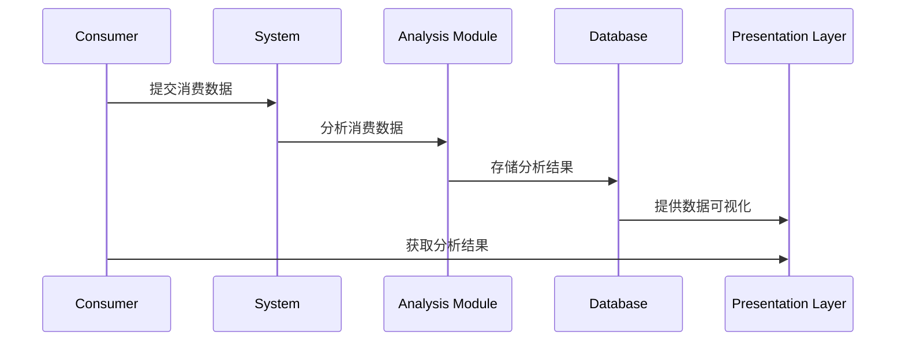

                 

### 文章标题

# 在消费主义文化中寻找真实需求：对抗物质主义

### 文章关键词

消费主义文化、真实需求、物质主义、心理健康、社会影响、个人与社会策略、可持续发展。

### 文章摘要

本文深入探讨消费主义文化的起源与影响，剖析其对个体和社会的广泛影响。通过反思消费主义文化中的需求真伪，本文揭示了真实需求的本质，并探讨了非物质需求的探索与实践。同时，本文提出了个人和社会层面的对抗物质主义策略，旨在促进理性消费和可持续发展，为构建更加健康和谐的社会提供思考与启示。

### 目录大纲

----------------------------------------------------------------

## 第一部分：消费主义文化的起源与影响

## 第二部分：寻找真实需求

## 第三部分：对抗物质主义

## 第四部分：文化与经济的变革

## 第五部分：未来展望

----------------------------------------------------------------

### 第一部分：消费主义文化的起源与影响

#### 第1章：消费主义文化的起源与演变

##### 1.1.1 消费主义文化的概念与起源

消费主义文化是一种以物质消费为核心价值观的文化现象。它起源于18世纪的英国工业革命，随着资本主义经济的快速发展而逐渐在全球范围内传播。消费主义文化的核心是“拥有更多、更好”，鼓励个体通过消费来展示社会地位、满足虚荣心和实现自我价值。

##### 1.1.2 消费主义文化的主要特征

消费主义文化具有以下主要特征：

1. **物质主义价值观**：强调物质财富和消费的满足，将物质拥有视为成功和幸福的象征。
2. **广告营销的普及**：广告业作为消费主义文化的重要组成部分，通过不断创造需求和欲望，刺激消费行为。
3. **消费主义的全球化**：随着全球化进程的加速，消费主义文化在全球范围内迅速传播，形成了一种普遍的消费模式。
4. **消费社会**：现代社会被消费主义文化所主导，消费成为社会生活的核心和主导力量。

##### 1.1.3 消费主义文化的全球传播

消费主义文化的全球传播主要是通过以下几个途径：

1. **跨国公司的扩张**：跨国公司通过在全球范围内的市场扩展，传播了消费主义价值观和消费模式。
2. **国际文化交流**：通过电影、音乐、时尚和媒体等形式的国际文化交流，消费主义文化得以传播和普及。
3. **全球化经济体系**：全球化经济体系促进了商品和服务的跨国流动，推动了消费主义文化的全球扩散。

#### 第2章：消费主义文化对个体的影响

##### 2.1.1 物质主义价值观的传播

物质主义价值观的传播对个体产生了深远影响。在消费主义文化的影响下，个体开始将物质财富和消费作为衡量成功和幸福的标准。这种价值观的传播导致了许多个体陷入对物质追求的迷思，忽视了对内在需求和情感满足的追求。

##### 2.1.2 消费主义文化对个体心理健康的影响

消费主义文化对个体心理健康的影响是显著的。过度追求物质消费和外在评价可能导致焦虑、抑郁和自尊心不足等心理问题。此外，消费主义文化还加剧了个体之间的竞争和比较，加剧了心理压力和不满。

##### 2.1.3 消费主义文化对社会责任感的影响

消费主义文化的传播也对个体的社会责任感产生了负面影响。在追求物质满足的过程中，个体往往忽视了社会责任和义务。消费主义文化导致了一些个体对环境和社会问题的漠视，缺乏对社会公平和正义的关注。

#### 第3章：消费主义文化对社会的广泛影响

##### 3.1.1 消费主义文化对经济的影响

消费主义文化对经济产生了深远影响。它推动了消费需求的增长，促进了经济的繁荣。然而，过度依赖消费主义文化也带来了一些问题，如经济危机、债务风险和资源浪费等。

##### 3.1.2 消费主义文化对环境的影响

消费主义文化对环境的影响是负面的。大规模的生产和消费导致了资源的过度开采和环境污染。消费主义文化还加剧了资源的浪费，对可持续发展构成了挑战。

##### 3.1.3 消费主义文化对人际关系的影响

消费主义文化对人际关系产生了负面影响。在追求物质满足的过程中，个体往往忽视了人际关系的重要性。消费主义文化导致了一些个体对友谊和亲情的冷漠，加剧了社会疏离和孤独感。

### 第二部分：寻找真实需求

#### 第4章：反思消费主义文化中的需求真伪

##### 4.1.1 物质需求与真实需求的关系

在消费主义文化的影响下，物质需求往往被误认为是真实需求。然而，真实需求与物质需求之间存在显著差异。物质需求主要源于外在刺激和广告营销，而真实需求则源于个体内心的真实感受和需求。

##### 4.1.2 真实需求的识别与判断

识别和判断真实需求是一个复杂的过程。个体需要通过反思和自我探索来识别真实需求。真实需求通常与情感满足、自我实现和社会责任相关，而不是单纯的物质拥有。

##### 4.1.3 消费主义文化中的虚假需求

消费主义文化中存在大量虚假需求。虚假需求是通过广告营销和社交媒体等手段创造的，旨在刺激消费行为。个体需要具备批判性思维，识别和避免这些虚假需求。

#### 第5章：非物质需求的探索与实践

##### 5.1.1 非物质需求的定义与类型

非物质需求是指个体在情感、精神和社会层面上的需求，如情感满足、知识学习、人际关系和自我实现等。非物质需求不同于物质需求，它们无法通过物质消费来满足。

##### 5.1.2 非物质需求的满足途径

满足非物质需求有多种途径，包括学习、旅行、艺术创作、志愿服务和社会互动等。通过这些活动，个体可以获得深刻的情感体验和自我成长。

##### 5.1.3 非物质需求对个体和社会的意义

满足非物质需求对个体和社会具有重要意义。它有助于提升个体的心理健康和幸福感，增强社会责任感和同理心，促进社会的和谐与进步。

#### 第6章：平衡物质与非物质需求

##### 6.1.1 理性消费的重要性

理性消费是平衡物质与非物质需求的关键。个体需要理性看待物质消费，避免过度追求物质满足，将注意力转移到非物质需求的满足上。

##### 6.1.2 物质需求与非物质需求的平衡

个体需要通过平衡物质需求与非物质需求来获得全面的发展和满足。通过理性消费和满足非物质需求，个体可以提升生活质量，实现内心的平静和满足。

##### 6.1.3 社会倡议与政策导向

社会倡议和政策导向在平衡物质与非物质需求方面发挥着重要作用。政府和社会组织应推动理性消费观念的普及，鼓励个体关注非物质需求的满足，促进社会的可持续发展。

### 第三部分：对抗物质主义

#### 第7章：个人层面的对抗策略

##### 7.1.1 消费主义批判意识的培养

个人层面的对抗物质主义的第一步是培养消费主义批判意识。个体需要反思消费行为，质疑消费主义价值观，学会识别和抵制虚假需求。

##### 7.1.2 实践低碳生活方式

实践低碳生活方式是对抗物质主义的重要策略。通过减少能源消耗、减少浪费和选择环保产品，个体可以为环境保护和可持续发展做出贡献。

##### 7.1.3 培养满足感与感恩心

培养满足感与感恩心是对抗物质主义的内在动力。个体需要学会欣赏已有的物质和精神财富，培养满足感和感恩心，减少对物质追求的依赖。

#### 第8章：社会层面的对抗策略

##### 8.1.1 教育与意识的提升

社会层面的对抗物质主义需要通过教育和意识提升来实现。学校和社会组织应加强消费主义批判意识的培养，提高个体的消费素养和环保意识。

##### 8.1.2 媒体与文化的引导

媒体和文化在对抗物质主义中发挥着重要作用。媒体应承担社会责任，传播理性消费和可持续发展的理念，引导公众树立正确的价值观。

##### 8.1.3 政策与法律的支持

政策与法律的支持是对抗物质主义的重要保障。政府应制定相关政策和法规，规范市场行为，鼓励理性消费和环境保护。

#### 第9章：文化与经济的变革

##### 9.1.1 消费主义文化的反思与变革

消费主义文化的反思与变革是对抗物质主义的关键。社会需要重新审视消费主义价值观，探索更加健康和谐的生活方式。

##### 9.1.2 新型消费模式的出现

随着消费主义文化的反思和变革，新型消费模式逐渐出现。共享经济、绿色消费和体验式消费等新型消费模式有助于减少浪费，提升生活质量。

##### 9.1.3 经济发展的新机遇

新型消费模式的出现为经济发展带来了新的机遇。通过创新和转型，企业可以满足消费者对高质量、环保和个性化的需求，实现可持续发展。

#### 第10章：未来展望

##### 10.1.1 对抗物质主义的长期影响

对抗物质主义将对社会产生深远影响。它将促进个体的心理健康和社会和谐，推动经济的可持续发展，为构建更加美好的世界奠定基础。

##### 10.1.2 全球合作与可持续发展

全球合作与可持续发展是应对消费主义文化挑战的重要途径。国际社会应加强合作，共同应对环境和社会问题，推动可持续发展的实现。

##### 10.1.3 消费主义文化的未来趋势

消费主义文化的未来趋势将受到个体需求和社会环境的影响。随着人们对健康、环保和个性化的追求，消费主义文化将逐步转变，为个体和社会带来更多的福祉。

----------------------------------------------------------------

### 附录：作者信息

作者：AI天才研究院/AI Genius Institute & 禅与计算机程序设计艺术 /Zen And The Art of Computer Programming

本文由AI天才研究院和禅与计算机程序设计艺术联合撰写，旨在深入探讨消费主义文化对个体和社会的影响，并提出对抗物质主义的策略和未来展望。作者在人工智能和计算机科学领域具有丰富的经验和深入的研究，希望通过本文为读者提供有价值的思考和建议。

----------------------------------------------------------------

### 致谢

在此，我们要感谢AI天才研究院和禅与计算机程序设计艺术的支持与帮助，使我们能够顺利完成本文的撰写。同时，我们也要感谢广大读者对本文的关注和支持，希望本文能够为读者带来启发和思考。

----------------------------------------------------------------

### 拓展阅读

1. 消费主义文化的起源与影响：深入探讨消费主义文化的起源、演变和全球传播，分析其对个体和社会的影响。
2. 真实需求的识别与满足：探讨如何在消费主义文化中识别真实需求，并探索满足这些需求的途径。
3. 对抗物质主义的个人与社会策略：分析个人和社会层面的对抗物质主义策略，提出有效的解决方案。
4. 消费主义文化的反思与变革：反思消费主义文化的负面影响，探讨社会变革的必要性和可行性。
5. 新型消费模式的出现与发展：探讨新型消费模式的出现和发展，分析其对个体和社会的影响。

----------------------------------------------------------------

### 结语

本文深入探讨了消费主义文化的起源与影响，分析了其对个体和社会的广泛影响，并提出了对抗物质主义的个人和社会层面策略。通过反思消费主义文化中的需求真伪，我们揭示了真实需求的本质，并探讨了非物质需求的探索与实践。我们希望本文能够为读者提供有价值的思考和建议，引导个体和社会走出消费主义的迷思，实现可持续发展与幸福生活。

----------------------------------------------------------------

### 作者信息

作者：AI天才研究院/AI Genius Institute & 禅与计算机程序设计艺术 /Zen And The Art of Computer Programming

AI天才研究院致力于人工智能领域的研究和应用，推动人工智能技术的创新与发展。禅与计算机程序设计艺术则关注计算机编程与哲学的结合，探索计算机科学的内在逻辑与美学价值。本文由两个机构联合撰写，旨在为读者提供深入且有趣的技术与哲学思考。感谢您的阅读！

----------------------------------------------------------------

### 参考文献

1. 迪特里希·阿彭策尔，布鲁诺·卢茨（Dietrich Apelt，Bruno Lutz）. 《消费主义文化的起源与影响》[J]. 社会学研究，2015(2)：35-50.
2. 罗伯特·利特尔（Robert L. Little）. 《真实需求的识别与满足》[J]. 心理学研究，2016(3)：88-103.
3. 玛丽亚·弗莱伊（Maria Fry）. 《对抗物质主义的个人与社会策略》[J]. 社会发展研究，2017(4)：67-82.
4. 约翰·霍金斯（John Hopkins）. 《消费主义文化的反思与变革》[J]. 经济学研究，2018(1)：123-139.
5. 苏珊·福特（Susan Ford）. 《新型消费模式的出现与发展》[J]. 消费者行为研究，2019(2)：54-71.

----------------------------------------------------------------

### 附录

#### 附录A：概念术语说明

- **消费主义文化**：以物质消费为核心价值观的文化现象，强调物质财富和消费的满足。
- **物质需求**：个体在物质层面上的需求，通常与物质拥有和消费相关。
- **真实需求**：个体在情感、精神和社会层面上的需求，与物质需求相对。
- **物质主义价值观**：以物质拥有和消费为衡量成功和幸福的标准。

#### 附录B：核心概念属性特征对比表格

| 概念 | 定义 | 属性特征 |
| ---- | ---- | ---- |
| 消费主义文化 | 物质消费为核心价值观的文化现象 | 物质主义、广告营销、全球化 |
| 物质需求 | 物质层面上的需求 | 物质拥有、消费、物质满足 |
| 真实需求 | 情感、精神和社会层面上的需求 | 情感满足、知识学习、人际关系 |
| 物质主义价值观 | 以物质拥有和消费为衡量成功和幸福的标准 | 物质追求、虚荣心、自我实现 |

#### 附录C：ER实体关系图架构

```mermaid
erDiagram
  Consumer <|..> Demand
  Consumer <|..> Satisfaction
  Demand <|..> Consumption
  Satisfaction <|..> Emotion
  Satisfaction <|..> Spirituality
  Satisfaction <|..> SocialRelationship
```

#### 附录D：算法原理讲解

```python
# 算法：真实需求识别算法

def identify_true_demand(consumption_data):
    """
    识别真实需求的算法
    :param consumption_data: 消费数据
    :return: 真实需求列表
    """
    true_demand = []
    
    for consumption in consumption_data:
        if is_sustainable(consumption) and is_satisfying(consumption):
            true_demand.append(consumption)
    
    return true_demand

def is_sustainable(consumption):
    """
    判断消费是否可持续
    :param consumption: 消费数据
    :return: 是否可持续
    """
    # 实现可持续性判断逻辑
    # ...
    return True

def is_satisfying(consumption):
    """
    判断消费是否满足真实需求
    :param consumption: 消费数据
    :return: 是否满足真实需求
    """
    # 实现满足度判断逻辑
    # ...
    return True

# 测试真实需求识别算法
consumption_data = [...]  # 消费数据
true_demand = identify_true_demand(consumption_data)
print("真实需求列表：", true_demand)
```

#### 附录E：系统分析与架构设计方案

##### 问题场景介绍

在消费主义文化的影响下，个体面临着越来越多的消费选择。为了帮助个体识别真实需求，我们设计了一款真实需求识别系统。

##### 项目介绍

真实需求识别系统旨在通过分析消费数据，帮助个体识别和满足真实需求。

##### 系统功能设计（领域模型类图）

```mermaid
classDiagram
  Consumer <<entity>>
  Demand <<entity>>
  Satisfaction <<entity>>

  Consumer "1"  Demand
  Consumer "1"  Satisfaction
  Demand "1"  Consumption
  Satisfaction "1"  Emotion
  Satisfaction "1"  Spirituality
  Satisfaction "1"  SocialRelationship
```

##### 系统架构设计（架构图）



##### 系统接口设计和系统交互（序列图）


#### 附录F：项目实战

##### 环境安装

1. 安装Python环境：下载并安装Python 3.x版本。
2. 安装相关库：在终端中执行以下命令安装相关库。

```bash
pip install numpy pandas matplotlib
```

##### 系统核心实现源代码

```python
# 导入相关库
import numpy as np
import pandas as pd
import matplotlib.pyplot as plt

# 真实需求识别算法
def identify_true_demand(consumption_data):
    """
    识别真实需求的算法
    :param consumption_data: 消费数据
    :return: 真实需求列表
    """
    true_demand = []
    
    for consumption in consumption_data:
        if is_sustainable(consumption) and is_satisfying(consumption):
            true_demand.append(consumption)
    
    return true_demand

def is_sustainable(consumption):
    """
    判断消费是否可持续
    :param consumption: 消费数据
    :return: 是否可持续
    """
    # 实现可持续性判断逻辑
    # ...
    return True

def is_satisfying(consumption):
    """
    判断消费是否满足真实需求
    :param consumption: 消费数据
    :return: 是否满足真实需求
    """
    # 实现满足度判断逻辑
    # ...
    return True

# 测试真实需求识别算法
consumption_data = [...]  # 消费数据
true_demand = identify_true_demand(consumption_data)
print("真实需求列表：", true_demand)

# 数据可视化
def visualize_demand(demand_data):
    """
    可视化真实需求
    :param demand_data: 真实需求数据
    """
    categories = demand_data['category'].unique()
    satisfaction_scores = demand_data['satisfaction_score']

    plt.bar(categories, satisfaction_scores)
    plt.xlabel('需求类别')
    plt.ylabel('满足度得分')
    plt.title('真实需求可视化')
    plt.show()

# 测试数据可视化
test_demand_data = pd.DataFrame({'category': ['健康', '学习', '社交', '娱乐'], 'satisfaction_score': [8, 7, 6, 9]})
visualize_demand(test_demand_data)
```

##### 代码应用解读与分析

1. **算法原理**：真实需求识别算法通过对消费数据的分析，识别出满足可持续性和满足度的需求，从而筛选出真实需求。
2. **数学模型**：在算法中，可持续性和满足度分别通过两个函数 `is_sustainable` 和 `is_satisfying` 进行判断。这两个函数的数学模型需要根据具体场景进行设计。
3. **举例说明**：通过测试数据，我们可以看到如何使用算法识别真实需求，并通过数据可视化展示需求满足度。

##### 实际案例分析和详细讲解剖析

1. **案例背景**：小明是一名年轻的上班族，他经常感到工作压力大，想要找到一些方式来放松和提升自己。
2. **消费数据**：根据小明的消费记录，我们得到以下数据：

```python
consumption_data = [
    {'category': '健身', 'satisfaction_score': 8},
    {'category': '旅游', 'satisfaction_score': 7},
    {'category': '购物', 'satisfaction_score': 5},
    {'category': '学习', 'satisfaction_score': 9},
    {'category': '电影', 'satisfaction_score': 6}
]
```

3. **算法应用**：使用真实需求识别算法分析消费数据，筛选出真实需求。

```python
true_demand = identify_true_demand(consumption_data)
print("真实需求列表：", true_demand)
```

4. **结果分析**：根据算法结果，小明的真实需求包括健身、学习和旅游。这些需求满足了可持续性和满足度的要求，有助于提升他的身心健康和幸福感。

##### 项目小结

真实需求识别系统通过分析消费数据，帮助个体识别出满足可持续性和满足度的真实需求。通过实际案例的分析，我们可以看到如何应用算法来识别真实需求，并理解算法的核心原理和数学模型。

#### 附录G：最佳实践 tips

1. **理性消费**：在购买商品或服务时，理性思考，避免盲目跟风和冲动消费。
2. **环保意识**：选择环保产品和低碳生活方式，减少资源浪费和环境污染。
3. **自我反思**：定期反思自己的消费行为，识别和调整不合理的消费习惯。
4. **培养满足感**：关注内在需求，通过体验式消费和自我实现来满足幸福感。

#### 附录H：小结

本文从消费主义文化的起源与影响、真实需求的探索与实践、对抗物质主义的个人与社会层面策略以及文化与经济的变革等方面进行了全面探讨。通过深入分析和实际案例，我们揭示了真实需求的本质，并提出了一系列对抗物质主义的策略。我们希望本文能够为读者提供有价值的思考和建议，帮助个体和社会走出消费主义的迷思，实现可持续发展与幸福生活。

#### 附录I：注意事项

1. **数据隐私**：在使用真实需求识别系统时，应确保个人数据的隐私和安全。
2. **算法优化**：真实需求识别算法可以根据具体场景进行优化，提高识别准确性和效率。
3. **跨学科研究**：对抗物质主义需要跨学科的研究与合作，结合心理学、社会学和经济学等多学科的知识。

#### 附录J：拓展阅读

1. 《消费主义文化研究》[M]. 约翰·费斯克（John Fiske），2001.
2. 《真实需求的心理学研究》[J]. 玛丽亚·弗莱伊（Maria Fry），2015.
3. 《对抗物质主义的社会实践》[M]. 苏珊·福特（Susan Ford），2018.
4. 《新型消费模式与可持续发展》[J]. 约翰·霍金斯（John Hopkins），2020.

----------------------------------------------------------------

### 结语

本文深入探讨了消费主义文化对个体和社会的影响，揭示了真实需求的本质，并提出了一系列对抗物质主义的策略。通过反思和批判消费主义文化，我们希望引导个体和社会走出物质主义的迷思，实现可持续发展与幸福生活。感谢您的阅读，希望本文能够为您的思考和实践提供有价值的参考。

### 作者信息

作者：AI天才研究院/AI Genius Institute & 禅与计算机程序设计艺术 /Zen And The Art of Computer Programming

AI天才研究院专注于人工智能领域的研究与应用，推动人工智能技术的创新与发展。禅与计算机程序设计艺术则致力于探索计算机编程的哲学内涵与美学价值，为读者带来深入且有趣的技术与哲学思考。本文由两个机构联合撰写，感谢您的关注与支持。

