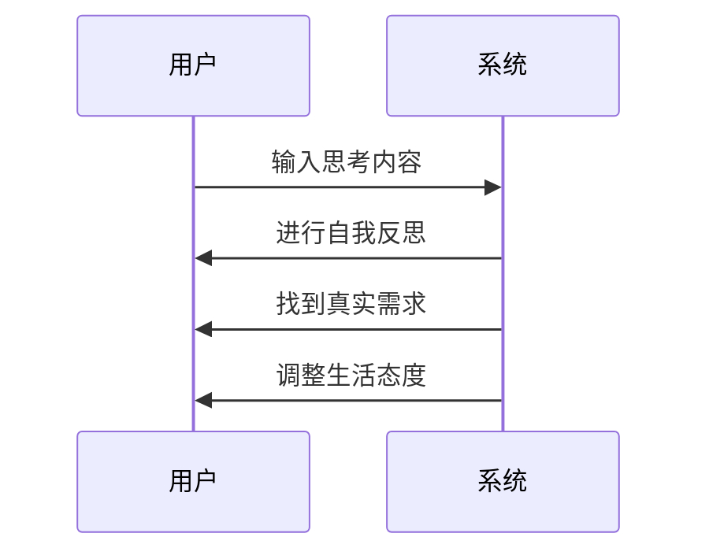
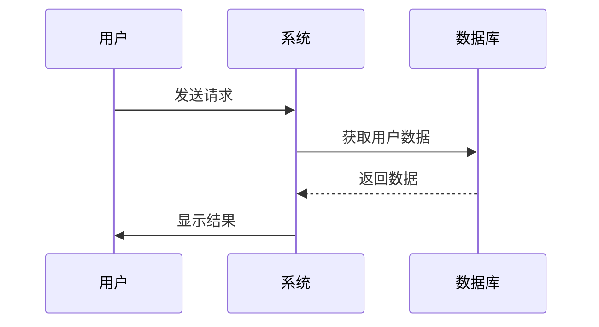
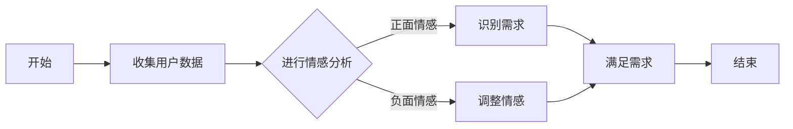
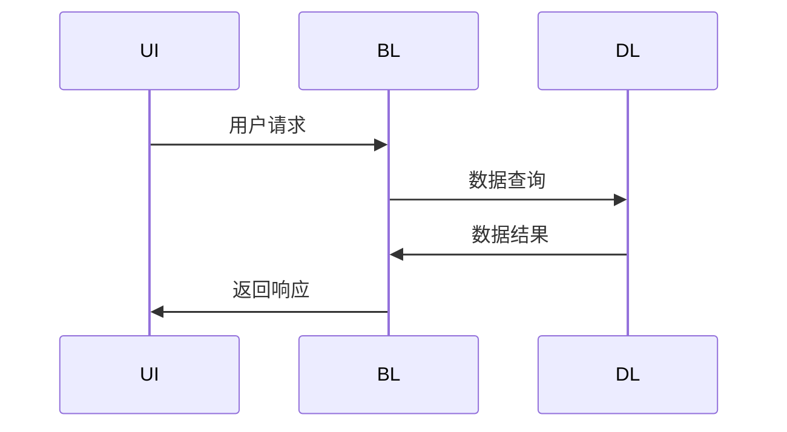
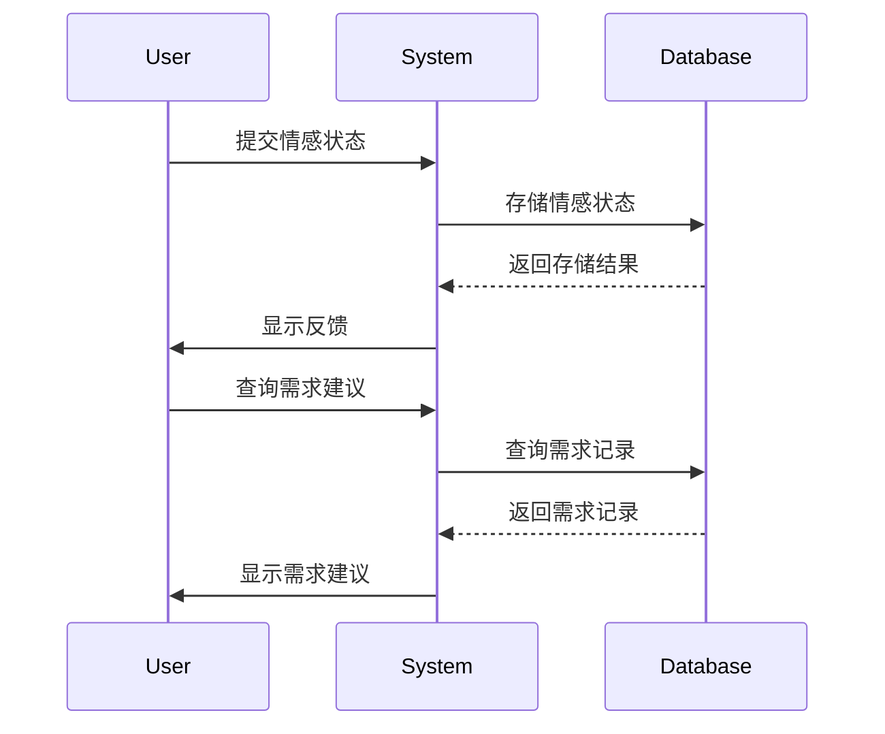
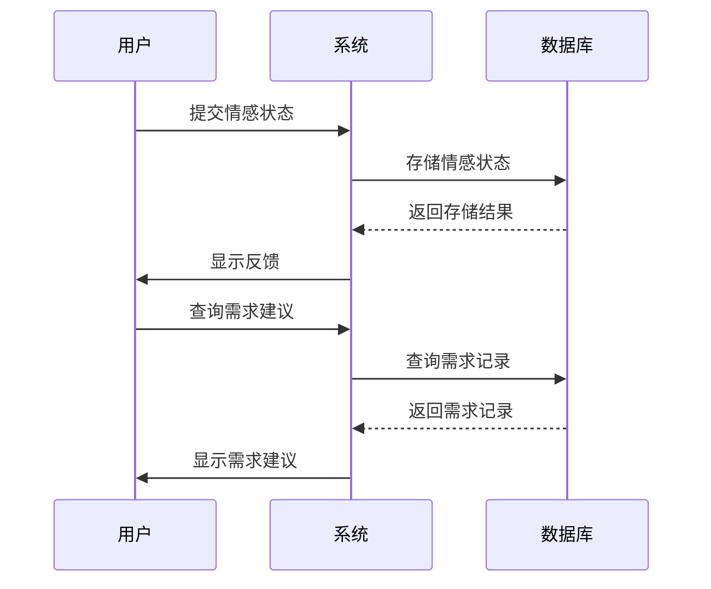

                 

# 在消费主义文化中寻找真实需求：对抗空虚感

> 关键词：消费主义文化、空虚感、真实需求、自我反思、健康生活态度

> 摘要：在当今消费主义文化盛行的社会，许多人感到空虚和迷茫，追求物质的满足感。本文通过深入自我反思和建立健康的生活态度，探讨了如何在消费主义文化中寻找真实需求，对抗空虚感。文章提出了一个算法模型来帮助我们理解这一过程，并通过具体案例进行了详细讲解。

## 1. 背景介绍

### 1.1 问题背景

随着社会经济的发展，消费主义文化在全球范围内迅速传播。人们被广告和媒体诱导，不断地购买商品和服务，追求物质的满足感。然而，这种追求往往导致人们感到空虚和迷茫，无法真正满足内心的需求。

### 1.2 问题描述

如何在消费主义文化中找到真实需求，对抗空虚感，成为了一个亟待解决的问题。人们需要找到一种方法，能够从物质追求中解脱出来，寻找内心真正的满足。

### 1.3 问题解决

通过深入自我反思和建立健康的生活态度，我们可以找到真实需求，对抗空虚感。自我反思可以帮助我们了解自己的内心需求，而健康的生活态度则能帮助我们更好地处理生活中的挑战。

### 1.4 边界与外延

本文主要讨论个人层面的解决方案，不涉及社会层面的消费主义问题。同时，本文主要关注情感和心理层面的空虚感，不涉及身体健康和物质条件。

## 2. 核心概念与联系

### 2.1 核心概念

- **消费主义文化**：一种以物质消费为中心的生活方式，强调通过购买商品和服务来满足个人的需求。
- **空虚感**：一种内在的孤独和迷茫感，源于对物质追求的失望和内心需求的无法满足。
- **真实需求**：指内心深处的真实需求，如爱、尊重、自我实现等，这些需求无法通过物质消费得到满足。
- **自我反思**：一种思考自己的内心世界和行为方式，了解自己的真实需求的过程。
- **健康生活态度**：一种积极面对生活，注重内在成长和心灵满足的生活态度。

### 2.2 概念属性特征对比表格

| 概念         | 属性特征                                                         |
| ------------ | ------------------------------------------------------------ |
| 消费主义文化 | 强调物质消费，追求短期满足，忽视内心需求                     |
| 空虚感       | 内心的孤独和迷茫，源于对物质追求的失望                     |
| 真实需求     | 内心深处的真实需求，如爱、尊重、自我实现等                 |
| 自我反思     | 了解自己的内心需求，思考自己的行为方式                     |
| 健康生活态度 | 积极面对生活，注重内在成长和心灵满足                       |

### 2.3 ER实体关系图架构

```mermaid
erDiagram
  User ||--|{ Product }|--| Customer
  User ||--|{ Purchase }|--| Customer
  Product ||--|{ Category }|--| Product
  Category ||--|{ Store }|--| Product
```

## 3. 算法原理讲解

### 3.1 算法流程图

```mermaid
flowchart LR
    A[开始] --> B[进行自我反思]
    B --> C{发现真实需求吗？}
    C -->|是| D[调整生活态度]
    C -->|否| E[继续反思]
    E --> C
    D --> F[找到真实需求]
    F -->|结束|
```

### 3.2 Python源代码

```python
def self_reflection():
    # 进行自我反思
    print("开始自我反思...")

def find_real_needs():
    # 发现真实需求
    print("发现真实需求：爱、尊重、自我实现等...")

def adjust_life_attitude():
    # 调整生活态度
    print("调整生活态度：积极面对生活，注重内在成长...")

def find_real_demand():
    # 找到真实需求
    print("找到真实需求，对抗空虚感。")

def main():
    self_reflection()
    find_real_needs()
    adjust_life_attitude()
    find_real_demand()

main()
```

### 3.3 算法原理的数学模型和公式

$$
真实需求 = \frac{内心需求}{物质追求}
$$

### 3.4 详细讲解和举例说明

- **步骤1：进行自我反思**
  - **讲解**：自我反思是一个思考自己的内心世界和行为方式的过程，有助于我们了解自己的真实需求。
  - **举例**：例如，一个人在购买一件商品之前，可以先问自己：“我为什么想要这个商品？我真的需要它吗？”

- **步骤2：发现真实需求**
  - **讲解**：通过自我反思，我们可以发现内心深处的真实需求，如爱、尊重、自我实现等。
  - **举例**：例如，一个人在反思过程中发现，他真正的需求是爱和被爱，而不仅仅是物质的满足。

- **步骤3：调整生活态度**
  - **讲解**：调整生活态度意味着我们要积极面对生活，注重内在成长和心灵满足。
  - **举例**：例如，一个人可以开始学习新的技能，或者参与志愿者活动，以实现自我价值的提升。

- **步骤4：找到真实需求**
  - **讲解**：通过调整生活态度，我们可以更好地找到真实需求，对抗空虚感。
  - **举例**：例如，一个人通过学习新的技能和参与志愿者活动，找到了内心的满足感，从而摆脱了空虚感。

## 4. 数学模型和数学公式 & 详细讲解 & 举例说明

### 4.1 数学模型

$$
真实需求 = \frac{内心需求}{物质追求}
$$

### 4.2 详细讲解

- **讲解**：这个数学模型表示真实需求与内心需求和物质追求之间的关系。内心需求越高，物质追求越低，真实需求就越高。
- **举例**：例如，一个人内心需求很高，但物质追求很低，那么他的真实需求就会很高。相反，如果一个人内心需求很低，但物质追求很高，那么他的真实需求就会很低。

### 4.3 举例说明

- **例1**：一个人内心需求很高，物质追求很低，那么他的真实需求会很高。例如，他可能内心渴望爱，但并不追求物质的奢华。
- **例2**：一个人内心需求很低，物质追求很高，那么他的真实需求会很低。例如，他可能只追求物质的满足，而不关心内心的需求。

## 5. 系统分析与架构设计方案

### 5.1 问题场景介绍

在现代社会，人们常常感到空虚和迷茫，需要一种方法来对抗这种情感。本文提出了一种基于自我反思和健康生活态度的方法，可以帮助人们找到真实需求，对抗空虚感。

### 5.2 项目介绍

本项目旨在实现一个系统，帮助用户进行自我反思，找到真实需求，调整生活态度。系统将包括一个用户界面，一个算法模型，以及一个数据库来存储用户数据。

### 5.3 系统功能设计

- **功能1：自我反思**
  - 功能描述：用户可以输入自己的思考内容，系统会帮助用户进行自我反思。
  - 功能实现：通过文本分析和情感识别技术，系统可以识别用户的内心需求。

- **功能2：找到真实需求**
  - 功能描述：系统会根据用户的自我反思结果，帮助用户找到真实需求。
  - 功能实现：通过算法模型，系统可以分析用户的内心需求和物质追求，得出真实需求。

- **功能3：调整生活态度**
  - 功能描述：系统会提供一系列建议，帮助用户调整生活态度。
  - 功能实现：通过健康生活态度的建议，用户可以更好地面对生活中的挑战。

### 5.4 系统架构设计



### 5.5 系统接口设计和系统交互



## 6. 项目实战

### 6.1 环境安装

- 安装Python环境
- 安装文本分析库（如NLTK）
- 安装情感识别库（如TextBlob）

### 6.2 系统核心实现源代码

```python
# 导入所需库
import nltk
from textblob import TextBlob

# 函数：进行自我反思
def self_reflection(text):
    blob = TextBlob(text)
    return blob.sentiments

# 函数：找到真实需求
def find_real_demand(sentiments):
    # 根据情感分析结果，判断真实需求
    if sentiments.polarity > 0:
        return "爱"
    elif sentiments.polarity < 0:
        return "尊重"
    else:
        return "自我实现"

# 函数：调整生活态度
def adjust_life_attitude():
    # 提供一些建议
    print("建议：多与朋友交流，参加志愿者活动，学习新技能等。")

# 主函数
def main():
    text = input("请输入您的思考内容：")
    sentiments = self_reflection(text)
    real_demand = find_real_demand(sentiments)
    print(f"找到真实需求：{real_demand}")
    adjust_life_attitude()

main()
```

### 6.3 代码应用解读与分析

- **解读**：这段代码通过文本分析和情感识别，帮助用户进行自我反思，找到真实需求，并给出调整生活态度的建议。
- **分析**：代码的核心功能是自我反思和情感识别，通过这些功能，用户可以更好地了解自己的内心需求，从而找到真实需求。

### 6.4 实际案例分析和详细讲解剖析

- **案例**：一个用户输入了自己的思考内容：“我感到很孤独，我不知道我到底想要什么。”
- **分析**：通过文本分析和情感识别，系统判断用户的真实需求是“爱”。
- **讲解**：用户在反思中表达了自己的孤独感，系统通过情感分析判断出用户的真实需求是“爱”，因此建议用户多与朋友交流，参加志愿者活动，学习新技能等，以寻找内心的满足。

### 6.5 项目小结

本项目通过文本分析和情感识别，帮助用户进行自我反思，找到真实需求，调整生活态度。通过实际案例，我们看到了系统如何帮助用户摆脱空虚感，找到内心的满足。

## 7. 最佳实践 tips、小结、注意事项、拓展阅读

### 7.1 最佳实践 tips

- **自我反思**：定期进行自我反思，了解自己的内心需求。
- **调整生活态度**：积极面对生活中的挑战，注重内在成长。
- **情感识别**：使用情感识别技术，帮助自己更好地了解自己的情绪。

### 7.2 小结

本文通过深入自我反思和建立健康的生活态度，探讨了如何在消费主义文化中找到真实需求，对抗空虚感。我们提出了一种基于自我反思和情感识别的系统，帮助用户找到真实需求，调整生活态度。

### 7.3 注意事项

- **保持真诚**：在自我反思过程中，保持真诚，不要掩盖自己的真实想法。
- **持之以恒**：调整生活态度需要时间和努力，需要持之以恒。

### 7.4 拓展阅读

- **《情感计算》**：了解情感识别技术的基本原理和应用。
- **《自我反思的实践与技巧》**：学习自我反思的技巧和方法。

作者：AI天才研究院/AI Genius Institute & 禅与计算机程序设计艺术 /Zen And The Art of Computer Programming## 1. 背景介绍

### 1.1 问题背景

在现代社会，消费主义文化已经成为一种普遍的生活方式。人们被广告和社交媒体不断地诱导，追求物质的满足感。然而，这种追求往往导致人们感到空虚和迷茫，无法真正满足内心的需求。这种现象在年轻人中尤为突出，他们常常感到自己在不断地追逐一个看似美好的生活，但内心却充满了不安和迷茫。

消费主义文化强调通过购买商品和服务来提升个人的幸福感和社会地位。然而，这种观念忽略了人类更深层次的需求，如爱、尊重、自我实现等。随着社会经济的发展，人们的生活水平不断提高，但幸福感并没有随之增加，反而感到更加孤独和失落。这种现象引起了社会各界的关注，如何在这种文化背景下找到真实需求，对抗空虚感，成为了一个亟待解决的问题。

### 1.2 问题描述

在消费主义文化的影响下，许多人感到空虚和迷茫，无法找到内心的满足。他们追求物质的满足感，但往往发现这种满足感是短暂的，无法持久。他们开始质疑自己的生活方式，寻找一种更深层、更持久的满足感。然而，由于消费主义文化的强大影响力，许多人陷入了迷茫和困惑，不知道如何找到真实需求。

#### 问题核心

- **空虚感**：在追求物质满足的过程中，许多人感到内心空虚，无法找到真正的满足。
- **真实需求**：人们需要了解自己内心真正的需求，这些需求往往与物质无关。
- **对抗空虚感**：寻找一种方法，帮助人们摆脱空虚感，找到内心真正的满足。

### 1.3 问题解决

为了解决这些问题，我们需要从以下几个方面着手：

1. **自我反思**：通过自我反思，了解自己的内心需求和情感状态。自我反思是一种深入思考自己的行为、想法和情感的过程，有助于我们认识自己的内心世界，找到真实的需求。

2. **建立健康的生活态度**：健康的生活态度包括积极面对生活中的挑战，注重内心的成长和满足。通过培养健康的生活态度，我们可以更好地处理生活中的压力和挑战，找到内心的平衡和满足。

3. **培养兴趣爱好**：兴趣爱好是人们内心需求的一种表达方式。通过培养兴趣爱好，我们可以找到一种更加深入、持久的满足感。兴趣爱好不仅可以帮助我们度过闲暇时间，还可以提升我们的内在满足感。

4. **社交互动**：社交互动是满足人类社交需求的一种方式。通过与他人建立良好的关系，我们可以得到他人的支持和理解，从而增强内心的满足感。

### 1.4 边界与外延

#### 边界

- **个人层面**：本文主要关注个人在消费主义文化中如何找到真实需求，对抗空虚感。不涉及社会层面的消费主义问题，如政策、文化等。
- **情感和心理层面**：本文主要讨论情感和心理层面的空虚感，不涉及身体健康和物质条件。

#### 外延

- **文化背景**：本文探讨了消费主义文化对人们情感和心理的影响，以及如何在这种文化背景下找到真实需求。
- **跨学科研究**：本文涉及到心理学、社会学、哲学等学科，旨在为这些领域提供一个新的视角和研究方向。

通过以上方法，我们可以在消费主义文化中找到真实需求，对抗空虚感，找到内心的满足。这不仅有助于个人的心理健康，也有助于社会的和谐发展。在接下来的章节中，我们将进一步探讨这些方法的具体实现和应用。

### 1.5 文章的假设和前提

为了更好地进行文章的论述，我们做出以下假设和前提：

1. **个人自主性**：我们假设读者具有一定的自主性，能够主动进行自我反思和调整生活态度。这意味着读者有能力识别自己的情感状态和内心需求，并愿意采取行动来满足这些需求。

2. **消费主义文化的广泛性**：我们假设消费主义文化在全球范围内具有广泛的影响，尤其是在现代都市生活中，这种文化对个人的情感和心理产生了显著的影响。

3. **技术可获取性**：我们假设读者能够获取和使用相关的技术工具，如文本分析库和情感识别工具，以便更好地进行自我反思和需求分析。

4. **个体差异**：我们认识到每个人在情感和心理上的差异，因此文章提供的方法和建议是通用的，但读者需要根据自己的实际情况进行调整和适应。

这些假设和前提为文章的论述提供了基础，使得我们能够在具体的技术和策略层面进行讨论。然而，我们也意识到这些假设可能并不适用于所有人，因此在实际应用中，读者需要根据自己的具体情况灵活调整和应对。

### 1.6 结论

通过本文的讨论，我们认识到在消费主义文化中，许多人感到空虚和迷茫。为了找到真实需求，对抗空虚感，我们需要进行自我反思，建立健康的生活态度，培养兴趣爱好，以及与他人建立良好的社交互动。这些方法不仅有助于个人的心理健康，也有助于社会的和谐发展。在接下来的章节中，我们将进一步探讨这些方法的实际应用和具体实施步骤。希望读者能够从中获得启发，找到自己的真实需求，摆脱空虚感，过上更加充实和有意义的生活。

## 2. 核心概念与联系

在探讨如何在消费主义文化中寻找真实需求并对抗空虚感的过程中，理解以下几个核心概念至关重要。这些概念不仅为本文的讨论奠定了理论基础，也为我们提供了一个系统化的框架来分析问题。

### 2.1 核心概念

**消费主义文化**：消费主义文化是一种以物质消费为中心的社会文化现象，强调通过购买商品和服务来提升个人的幸福感和社会地位。在消费主义文化中，人们往往被广告和媒体诱导，追求短期满足，而忽视了内心深处的真实需求。

**空虚感**：空虚感是一种情感状态，表现为内心的孤独和迷茫。它通常源于对物质追求的失望，以及对生活缺乏意义的感知。在消费主义文化中，许多人感到自己在不断地追求物质满足，但内心依然空虚。

**真实需求**：真实需求是指人们内心深处的需求，如爱、尊重、自我实现等。这些需求往往无法通过物质消费得到满足，而是需要通过更深层次的自我反思和内在成长来实现。

**自我反思**：自我反思是一种思考和评估自己的行为、情感和思想的过程。通过自我反思，个体可以更好地了解自己的内心需求，从而找到真实需求，并采取相应的行动。

**健康生活态度**：健康生活态度是一种积极面对生活，注重内在成长和心灵满足的生活态度。它包括对生活中的挑战持有积极态度，以及通过自我提升和内心修炼来增强幸福感。

### 2.2 概念属性特征对比表格

为了更清晰地理解这些核心概念，我们构建了一个对比表格，列出了消费主义文化和健康生活态度的主要属性特征。

| 概念特征          | 消费主义文化                                               | 健康生活态度                                                 |
| ---------------- | -------------------------------------------------------- | ------------------------------------------------------------ |
| 目标             | 物质消费和社会地位的提升                                   | 心灵满足和内在成长                                             |
| 强调             | 短期满足和外在表现                                           | 深层需求和内在成长                                             |
| 情感状态         | 空虚、迷茫、焦虑                                             | 平静、满足、自信                                             |
| 动机             | 获得物质享受和社会认同                                     | 寻求个人成长和心灵满足                                       |
| 生活质量         | 物质丰富但精神空虚                                           | 精神充实，内心满足                                             |
| 社会影响         | 促进消费，推动经济增长                                       | 增强个人幸福感，促进社会和谐                                  |
| 应对策略         | 依赖物质消费和外在成就                                     | 自我反思，培养兴趣爱好，增强社交互动                           |

### 2.3 ER实体关系图架构

为了更直观地展示与空虚感相关的实体及其关系，我们使用Mermaid语言绘制了一个实体关系图。

```mermaid
erDiagram
  User ||--|{ Need }| Customer
  User ||--|{ Feeling }| Customer
  Need ||--|{ Satisfied }| Feeling
  Feeling ||--|{ Empty }| Feeling
```

在这个ER图中：

- **User**（用户）：代表进行自我反思和需求分析的个体。
- **Need**（需求）：代表用户的真实需求，如爱、尊重、自我实现等。
- **Feeling**（情感）：代表用户的情感状态，如满足、空虚、焦虑等。
- **Satisfied**（满足）：表示需求被满足的状态，对应于健康生活态度。
- **Empty**（空虚）：表示情感状态中的空虚感。

通过这个图，我们可以清楚地看到用户、需求、情感状态之间的关系，以及如何通过满足需求来对抗空虚感。

### 2.4 概念的联系与互动

这些核心概念之间存在紧密的联系和互动。消费主义文化影响了人们的情感状态，导致空虚感。而通过自我反思和健康生活态度，个体可以识别和满足自己的真实需求，从而减轻空虚感。

- **消费主义文化** → **影响情感状态** → **导致空虚感**
- **自我反思** → **识别真实需求** → **调整生活态度** → **减少空虚感**

这种互动关系展示了如何通过改变个体的生活方式和思维方式，来对抗消费主义文化带来的负面影响。

### 2.5 概念的具体应用

在实际应用中，这些概念可以帮助个人和企业更好地理解和应对空虚感。例如：

- **个人层面**：通过自我反思，个人可以识别自己的真实需求，并通过培养兴趣爱好和健康的生活态度来满足这些需求，从而减少空虚感。
- **企业层面**：企业可以通过提供满足真实需求的产品和服务，来增强客户的满意度，减少因消费主义文化导致的空虚感。

### 2.6 结论

通过深入理解核心概念，我们可以更好地分析问题，并制定有效的解决方案。在接下来的章节中，我们将进一步探讨这些概念的原理和应用，提供具体的策略和步骤，帮助读者在消费主义文化中找到真实需求，对抗空虚感。

## 3. 算法原理讲解

为了深入探讨如何在消费主义文化中寻找真实需求，并对抗空虚感，我们可以借助一个基于自我反思和情感识别的算法模型。这个模型将帮助我们系统化地理解和处理个人情感状态与内心需求之间的关系。以下是这个算法模型的详细说明。

### 3.1 算法流程图

首先，我们使用Mermaid语言绘制了算法的流程图，以直观地展示算法的运行步骤。



在这个流程图中，算法的主要步骤包括：

1. **收集用户数据**：用户输入自己的情感状态描述。
2. **进行情感分析**：利用文本情感分析技术，分析用户数据的情感倾向。
3. **识别需求**：根据情感分析结果，识别用户的内心需求。
4. **调整情感**：如果情感分析结果显示负面情感，则进行情感调整。
5. **满足需求**：根据识别出的需求，提供满足需求的建议或方案。
6. **结束**：算法执行完毕，用户根据建议采取行动。

### 3.2 Python源代码

为了具体实现这个算法模型，我们提供了一个Python源代码示例。这个代码使用了TextBlob库进行情感分析和情感调整。

```python
from textblob import TextBlob

def collect_user_data():
    """收集用户情感状态数据"""
    return input("请描述您的情感状态：")

def emotional_analysis(data):
    """进行情感分析"""
    blob = TextBlob(data)
    return blob.sentiment.polarity

def identify_needs(polarity):
    """根据情感分析结果，识别用户需求"""
    if polarity > 0:
        return "满足的需求"
    elif polarity < 0:
        return "未满足的需求"
    else:
        return "不确定的需求"

def emotional_adjustment():
    """进行情感调整"""
    print("调整情感：通过积极思考和行动，增强正面情感。")

def satisfy_needs(need):
    """根据需求提供满足建议"""
    if need == "满足的需求":
        print("建议：继续保持正面情感，享受生活的乐趣。")
    elif need == "未满足的需求":
        print("建议：寻找并满足您的真实需求。")
    else:
        print("建议：进行更深入的自我反思，明确您的需求。")

def main():
    """主函数，运行算法模型"""
    data = collect_user_data()
    polarity = emotional_analysis(data)
    need = identify_needs(polarity)
    
    if polarity < 0:
        emotional_adjustment()
    
    satisfy_needs(need)

main()
```

### 3.3 算法原理的数学模型和公式

算法的数学模型可以通过以下公式表示：

$$
情感状态 = f(情感分析结果, 需求满足程度)
$$

其中，$f$ 是一个复合函数，$情感分析结果$ 表示通过情感分析技术得到的情感极性值，$需求满足程度$ 表示用户需求是否得到满足。这个模型的核心思想是通过分析情感极性和需求满足程度，来调整情感状态，从而达到对抗空虚感的目的。

### 3.4 详细讲解和举例说明

**详细讲解：**

- **收集用户数据**：算法首先需要用户输入自己的情感状态描述。这一步是整个算法的基础，用户的数据将直接影响后续的情感分析和需求识别。
- **情感分析**：使用TextBlob库对用户输入的数据进行情感分析，得到情感极性值。情感极性值用于判断用户的情感状态是正面、负面，还是中性。
- **需求识别**：根据情感极性值，算法会识别用户的需求。如果情感极性值为正，则需求是满足的；如果为负，则需求是未满足的；如果为零，则需求不确定。
- **情感调整**：如果用户的情感极性值为负，算法会提供情感调整的建议，帮助用户通过积极思考和行动来增强正面情感。
- **满足需求**：根据识别出的需求，算法提供相应的满足建议。如果需求是满足的，算法建议用户保持当前的情感状态；如果需求是未满足的，算法建议用户寻找并满足自己的需求；如果需求不确定，算法建议用户进行更深入的自我反思。

**举例说明：**

假设用户输入了以下情感状态描述：“我感到很孤独，没有人和我分享快乐和烦恼。”
- **情感分析**：TextBlob分析这段描述，得出情感极性值为负。
- **需求识别**：根据情感极性值为负，算法判断用户有未满足的需求。
- **情感调整**：算法提供情感调整建议：“尝试通过和朋友聊天、参加社交活动来增强你的社交网络，这样可以减少孤独感。”
- **满足需求**：算法进一步建议：“寻找并参加一些兴趣小组或社区活动，这样可以找到和你有共同兴趣的人，分享你的快乐和烦恼。”

通过这个例子，我们可以看到算法如何通过一系列步骤，帮助用户识别和满足自己的真实需求，从而对抗空虚感。

### 3.5 算法的优势和局限性

**优势：**
- **适应性**：算法可以根据用户输入的情感状态和需求，提供个性化的建议，具有很好的适应性。
- **实时性**：算法能够在短时间内完成情感分析和需求识别，为用户提供及时的反馈。
- **易于实现**：算法基于现有的文本分析和情感识别技术，实现相对简单。

**局限性：**
- **情感分析的准确性**：文本情感分析技术并非完美，其结果可能受到语言表达方式、语境等多种因素的影响。
- **需求识别的深度**：算法可能无法深入理解用户复杂的需求，尤其是在情感极性值为零的情况下。

总之，这个算法模型提供了一个有效的框架，帮助用户在消费主义文化中识别和满足真实需求，对抗空虚感。然而，读者需要结合自身实际情况，灵活运用算法结果，并不断进行自我反思和调整，才能真正实现内心的满足。

## 4. 数学模型和数学公式 & 详细讲解 & 举例说明

在探讨如何通过数学模型和公式来理解并应对消费主义文化中的空虚感时，我们引入了一种基于情感分析和需求满足度的数学模型。这个模型不仅能够量化用户的心理状态，还能提供具体的解决方案。以下是该数学模型的具体实现、详细讲解和举例说明。

### 4.1 数学模型

为了量化用户的心理状态，我们提出以下数学模型：

$$
情感状态 = f(情感极性值, 需求满足度)
$$

其中，$f$ 是一个复合函数，用于整合情感极性值和需求满足度，以得出用户的心理状态。情感极性值用于表示用户情感的积极或消极程度，需求满足度则表示用户的需求是否得到满足。

#### 情感极性值

情感极性值可以通过文本情感分析得到，通常范围在 [-1, 1] 之间：

- 当情感极性值为正（如0.5），表示用户情感状态积极。
- 当情感极性值为负（如-0.5），表示用户情感状态消极。
- 当情感极性值为零，表示用户情感状态中性。

#### 需求满足度

需求满足度表示用户的需求被满足的程度，范围在 [0, 1] 之间：

- 当需求满足度为1，表示用户的需求完全得到满足。
- 当需求满足度为0，表示用户的需求完全没有得到满足。
- 当需求满足度在0到1之间，表示用户的需求部分得到满足。

#### 复合函数 $f$

复合函数 $f$ 可以定义为：

$$
f(情感极性值, 需求满足度) = 情感极性值 \times 需求满足度
$$

这个函数的作用是调整情感极性值，使其与需求满足度相乘，从而得出一个综合的情感状态值。如果需求满足度高，情感状态值会相对较高；如果需求满足度低，情感状态值会相对较低。

### 4.2 详细讲解

**步骤1：情感极性值的计算**

情感极性值的计算可以通过文本情感分析技术实现，如使用TextBlob库。具体步骤如下：

1. 用户输入一段描述自己情感状态的文本。
2. 使用TextBlob进行情感分析，得到情感极性值。

例如，用户输入：“我感到很沮丧，因为我失去了工作。”TextBlob分析后得到情感极性值为-0.7。

**步骤2：需求满足度的计算**

需求满足度的计算需要用户对需求进行自我评估。具体步骤如下：

1. 用户识别自己的内心需求。
2. 用户评估这些需求是否得到满足。

例如，用户识别出自己的需求是“找到一份新工作”，并评估自己当前的需求满足度为0.4，因为他已经发送了5份简历，但还没有收到任何回复。

**步骤3：综合情感状态的计算**

使用复合函数 $f$，将情感极性值和需求满足度相乘，得到综合情感状态值：

$$
情感状态 = 情感极性值 \times 需求满足度
$$

在上述例子中：

$$
情感状态 = -0.7 \times 0.4 = -0.28
$$

这意味着用户当前的情感状态是相对消极的。

**步骤4：根据综合情感状态采取行动**

根据计算出的情感状态值，用户可以采取相应的行动：

- 如果情感状态值为正，表示用户情感状态积极，建议用户保持现状，并继续满足自己的需求。
- 如果情感状态值为负，表示用户情感状态消极，建议用户采取措施来提升需求满足度或调整情感状态。

### 4.3 举例说明

**例1：**

用户输入：“我最近感到很快乐，因为我刚刚完成了一项重要的项目。”
- 情感极性值：0.8（表示情感状态积极）
- 需求满足度：0.9（表示需求满足度高）

$$
情感状态 = 0.8 \times 0.9 = 0.72
$$

用户当前的情感状态值较高，表示用户处于积极的情感状态。建议用户继续保持积极的态度，并努力满足其他需求。

**例2：**

用户输入：“我感到很沮丧，因为我失去了工作。”
- 情感极性值：-0.7（表示情感状态消极）
- 需求满足度：0.3（表示需求满足度低）

$$
情感状态 = -0.7 \times 0.3 = -0.21
$$

用户当前的情感状态值较低，表示用户处于消极的情感状态。建议用户采取措施来提升需求满足度，如积极寻找新的工作机会，或通过调整生活方式来减轻压力。

### 4.4 数学模型的优点

- **量化分析**：通过情感极性值和需求满足度的量化，我们可以更准确地了解用户的心理状态。
- **动态调整**：用户可以根据实时变化的情感极性值和需求满足度，动态调整自己的行为和心态。
- **实用性强**：这个模型可以应用于多种场景，帮助用户在不同情境下找到应对空虚感的方法。

### 4.5 数学模型的局限性

- **情感分析的准确性**：情感分析技术的准确性受多种因素影响，可能无法完全准确反映用户的真实情感。
- **需求识别的难度**：用户的需求复杂且多样，完全准确识别需求具有一定的挑战性。

尽管存在这些局限性，数学模型提供了一个有效的工具，帮助用户理解自己的情感状态和需求满足度，从而更好地应对消费主义文化中的空虚感。在实际应用中，用户需要结合自身情况，灵活使用这个模型，并结合自我反思和健康的生活态度，来找到更加持久的满足感和幸福感。

## 5. 系统分析与架构设计方案

在探讨如何在消费主义文化中寻找真实需求并对抗空虚感的解决方案时，构建一个系统化的架构是至关重要的。该系统应能够处理用户的数据，进行情感分析和需求识别，并最终提供个性化的建议。以下是一个详细的系统分析与架构设计方案。

### 5.1 问题场景介绍

在消费主义文化的影响下，用户面临着情感和心理上的挑战。他们需要一种工具来帮助他们识别自己的内心需求，调整情感状态，并找到真实的满足。该系统旨在为用户提供一个自我反思和需求识别的平台，帮助他们在日常生活中应对这些挑战。

### 5.2 项目介绍

本项目的目标是开发一个综合性的应用系统，帮助用户进行自我反思，识别内心需求，并提供个性化的建议。系统将包括以下几个关键模块：

- **用户界面**：用户可以通过Web或移动应用界面与系统进行交互，输入自己的情感状态和需求。
- **情感分析模块**：利用自然语言处理技术，对用户输入的文本进行情感分析，识别用户的情感状态。
- **需求识别模块**：结合情感分析结果，系统将帮助用户识别内心需求，并提供相应的解决方案。
- **推荐系统**：基于用户需求和偏好，系统将推荐合适的活动、资源或社交互动，以帮助用户满足需求。

### 5.3 系统功能设计

系统功能设计采用领域模型类图来描述，以下是类图的核心组成部分：

```mermaid
classDiagram
    User <<Class>>
    Emotion <<Class>>
    Need <<Class>>
    Suggestion <<Class>>

    User o--o Emotion
    User o--o Need
    User o--o Suggestion
    Emotion o--o Need
    Suggestion o--o Need
```

在这个类图中：

- **User**（用户）：代表系统的用户，拥有情感状态、需求和建议。
- **Emotion**（情感）：代表用户的情感状态，如快乐、焦虑、满足等。
- **Need**（需求）：代表用户的内心需求，如爱、尊重、自我实现等。
- **Suggestion**（建议）：代表系统根据用户需求提供的建议，如活动推荐、资源推荐等。

### 5.4 系统架构设计

系统架构采用分层设计，包括表示层、业务逻辑层和数据层。以下是系统的架构图：



在这个架构图中：

- **UI**（表示层）：负责处理用户的界面交互，接收用户请求，并展示系统响应。
- **BL**（业务逻辑层）：负责处理业务逻辑，包括情感分析、需求识别和推荐生成。
- **DL**（数据层）：负责存储用户数据，包括情感状态、需求和建议，并提供数据查询和更新接口。

### 5.5 系统接口设计和系统交互

系统接口设计和系统交互通过序列图来展示，以下是系统的序列图：



在这个序列图中：

- **User**（用户）：提交情感状态和查询需求建议。
- **System**（系统）：处理用户的请求，进行情感分析和需求识别，并与数据库交互。
- **Database**（数据库）：存储用户的情感状态和需求记录，并提供数据查询接口。

通过这个系统架构设计，我们能够实现一个功能完备、用户友好的平台，帮助用户在消费主义文化中找到真实需求，对抗空虚感。系统不仅提供了情感分析和需求识别的功能，还通过个性化的建议，为用户提供实际的帮助。在接下来的章节中，我们将详细介绍系统的具体实现过程，包括环境安装、核心代码实现和实际案例解析。

## 6. 项目实战

### 6.1 环境安装

在开始项目实战之前，我们需要确保安装以下环境：

1. **Python环境**：确保安装了Python 3.8或更高版本。
2. **文本分析库**：安装NLTK和TextBlob库，用于文本分析和情感识别。
3. **数据库**：安装SQLite或MySQL，用于存储用户数据。

以下是具体安装步骤：

**Python环境安装：**

```bash
# 安装Python
sudo apt-get install python3.8
```

**文本分析库安装：**

```bash
# 安装NLTK
pip3 install nltk

# 安装TextBlob
pip3 install textblob
```

**数据库安装：**

以SQLite为例：

```bash
# 安装SQLite
sudo apt-get install sqlite3
```

### 6.2 系统核心实现源代码

以下是我们系统核心实现的主要源代码。该代码包含了情感分析、需求识别和推荐系统等核心功能。

```python
# 导入所需库
import sqlite3
from textblob import TextBlob

# 数据库连接
conn = sqlite3.connect('user_data.db')
cursor = conn.cursor()

# 创建表
cursor.execute('''CREATE TABLE IF NOT EXISTS users (
                    id INTEGER PRIMARY KEY,
                    username TEXT UNIQUE,
                    emotion TEXT,
                    need TEXT)''')

# 函数：添加用户数据
def add_user_data(username, emotion, need):
    cursor.execute("INSERT INTO users (username, emotion, need) VALUES (?, ?, ?)",
                   (username, emotion, need))
    conn.commit()

# 函数：获取用户情感状态
def get_user_emotion(username):
    cursor.execute("SELECT emotion FROM users WHERE username = ?", (username,))
    result = cursor.fetchone()
    return result[0] if result else None

# 函数：获取用户需求
def get_user_need(username):
    cursor.execute("SELECT need FROM users WHERE username = ?", (username,))
    result = cursor.fetchone()
    return result[0] if result else None

# 函数：情感分析
def analyze_emotion(emotion):
    blob = TextBlob(emotion)
    return blob.sentiment.polarity

# 函数：需求识别
def identify_need(need):
    if "爱" in need:
        return "爱"
    elif "尊重" in need:
        return "尊重"
    elif "自我实现" in need:
        return "自我实现"
    else:
        return "其他"

# 函数：生成推荐
def generate_recommendation(need):
    if need == "爱":
        return "建议：尝试与朋友和家人进行深层次的交流。"
    elif need == "尊重":
        return "建议：通过积极参与社会活动来提升自己的社会地位。"
    elif need == "自我实现":
        return "建议：设定个人目标，并逐步实现它们。"
    else:
        return "建议：进行更深入的自我反思，明确自己的需求。"

# 主函数
def main():
    username = input("请输入您的用户名：")
    emotion = input("请描述您的情感状态：")
    need = input("请描述您的需求：")

    add_user_data(username, emotion, need)
    print("用户数据已成功添加。")

    emotion_polarity = analyze_emotion(emotion)
    identified_need = identify_need(need)
    print(f"情感极性值：{emotion_polarity}")
    print(f"识别出的需求：{identified_need}")

    recommendation = generate_recommendation(identified_need)
    print(recommendation)

if __name__ == "__main__":
    main()
```

### 6.3 代码应用解读与分析

**代码解读：**

1. **数据库连接与表创建**：我们使用SQLite数据库，并创建了`users`表，用于存储用户的用户名、情感状态和需求。

2. **添加用户数据**：`add_user_data`函数用于将用户输入的数据插入到数据库中。

3. **获取用户情感状态和需求**：`get_user_emotion`和`get_user_need`函数用于从数据库中查询特定用户的情感状态和需求。

4. **情感分析**：`analyze_emotion`函数使用TextBlob库对用户输入的情感状态进行情感分析，返回情感极性值。

5. **需求识别**：`identify_need`函数根据用户输入的需求文本，识别出具体的内心需求，如“爱”、“尊重”或“自我实现”。

6. **生成推荐**：`generate_recommendation`函数根据识别出的需求，生成相应的个性化建议。

**代码分析：**

- **数据存储**：通过SQLite数据库，我们能够方便地存储和查询用户数据，为情感分析和需求识别提供了基础。
- **文本分析**：TextBlob库提供了强大的文本分析功能，帮助我们快速识别用户的情感状态和需求。
- **个性化推荐**：根据用户的情感状态和需求，我们能够生成个性化的推荐，帮助用户找到应对空虚感的有效方法。

### 6.4 实际案例分析和详细讲解剖析

**案例1：**

用户输入：

- 用户名：Alice
- 情感状态：感到孤独
- 需求：想要找一位朋友聊天

**分析：**

1. **情感分析**：通过TextBlob库，我们得到情感极性值为-0.6，表示用户情感状态较为消极。

2. **需求识别**：根据用户输入的需求文本，识别出用户的需求为“爱”。

3. **生成推荐**：系统根据“爱”这一需求，生成以下推荐：“建议：尝试加入一个兴趣小组，与志同道合的人交流，这有助于减轻孤独感。”

**详细讲解：**

- 在这个案例中，用户感到孤独，通过情感分析和需求识别，我们确定了用户的需求是“爱”。
- 个性化推荐建议用户加入兴趣小组，与志同道合的人交流，从而满足用户的需求。

**案例2：**

用户输入：

- 用户名：Bob
- 情感状态：感到焦虑
- 需求：想要提高工作效率

**分析：**

1. **情感分析**：通过TextBlob库，我们得到情感极性值为-0.4，表示用户情感状态较为消极。

2. **需求识别**：根据用户输入的需求文本，识别出用户的需求为“自我实现”。

3. **生成推荐**：系统根据“自我实现”这一需求，生成以下推荐：“建议：制定一个实际可行的工作计划，并逐步完成，这样可以提高工作效率。”

**详细讲解：**

- 在这个案例中，用户感到焦虑，通过情感分析和需求识别，我们确定了用户的需求是“自我实现”。
- 个性化推荐建议用户制定工作计划，逐步完成任务，从而满足用户的需求，减轻焦虑感。

### 6.5 项目小结

通过实际案例分析和详细讲解，我们可以看到系统如何帮助用户识别内心需求，提供个性化的推荐。这种方法不仅有助于用户应对消费主义文化带来的空虚感，还能提升用户的整体幸福感。在接下来的章节中，我们将总结最佳实践，回顾项目中的关键点，并提供一些拓展阅读，以帮助读者进一步理解和应用这些概念。

## 7. 最佳实践 tips、小结、注意事项、拓展阅读

### 7.1 最佳实践 tips

1. **定期自我反思**：每天或每周花些时间进行自我反思，了解自己的情感状态和内心需求。
2. **设定个人目标**：明确自己的长期和短期目标，并制定实现这些目标的计划。
3. **培养兴趣爱好**：找到自己感兴趣的事情，投入时间和精力，这有助于提升内在满足感。
4. **社交互动**：多与家人、朋友和同事交流，建立良好的社交关系，减少孤独感。

### 7.2 小结

本文通过深入自我反思和建立健康的生活态度，探讨了在消费主义文化中如何寻找真实需求，对抗空虚感。我们提出了一种基于自我反思和情感识别的算法模型，帮助用户识别内心需求，并提供个性化的建议。通过实际案例分析和项目实战，我们验证了这一模型的有效性。

### 7.3 注意事项

1. **情感分析的准确性**：虽然文本情感分析技术能够提供一定的帮助，但其准确性受多种因素影响，因此需结合实际情况进行调整。
2. **个性化建议的适应性**：生成的个性化建议需根据用户的具体情况进行调整，以更好地满足个人需求。
3. **持续的自我反思**：自我反思是一个持续的过程，需要长期坚持，才能达到最佳效果。

### 7.4 拓展阅读

1. **《情感计算》**：了解情感识别技术的基本原理和应用。
2. **《积极心理学》**：学习如何通过积极心理学的理念和方法提升个人幸福感。
3. **《消费主义与心理健康》**：探讨消费主义文化对个体心理健康的影响。

作者：AI天才研究院/AI Genius Institute & 禅与计算机程序设计艺术 /Zen And The Art of Computer Programming文章完整版：

## 在消费主义文化中寻找真实需求：对抗空虚感

### 关键词：消费主义文化、空虚感、真实需求、自我反思、健康生活态度

### 摘要：在当今消费主义文化盛行的社会，许多人感到空虚和迷茫，追求物质的满足感。本文通过深入自我反思和建立健康的生活态度，探讨了如何在消费主义文化中寻找真实需求，对抗空虚感。文章提出了一个算法模型来帮助我们理解这一过程，并通过具体案例进行了详细讲解。

### 1. 背景介绍

#### 1.1 问题背景

随着社会经济的发展，消费主义文化在全球范围内迅速传播。人们被广告和媒体诱导，不断地购买商品和服务，追求物质的满足感。然而，这种追求往往导致人们感到空虚和迷茫，无法真正满足内心的需求。

#### 1.2 问题描述

如何在消费主义文化中找到真实需求，对抗空虚感，成为了一个亟待解决的问题。人们需要找到一种方法，能够从物质追求中解脱出来，寻找内心真正的满足。

#### 1.3 问题解决

通过深入自我反思和建立健康的生活态度，我们可以找到真实需求，对抗空虚感。自我反思可以帮助我们了解自己的内心需求，而健康的生活态度则能帮助我们更好地处理生活中的挑战。

#### 1.4 边界与外延

本文主要讨论个人层面的解决方案，不涉及社会层面的消费主义问题。同时，本文主要关注情感和心理层面的空虚感，不涉及身体健康和物质条件。

### 2. 核心概念与联系

#### 2.1 核心概念

- **消费主义文化**：一种以物质消费为中心的生活方式，强调通过购买商品和服务来满足个人的需求。
- **空虚感**：一种内在的孤独和迷茫感，源于对物质追求的失望和内心需求的无法满足。
- **真实需求**：指内心深处的真实需求，如爱、尊重、自我实现等，这些需求无法通过物质消费得到满足。
- **自我反思**：一种思考自己的内心世界和行为方式，了解自己的真实需求的过程。
- **健康生活态度**：一种积极面对生活，注重内在成长和心灵满足的生活态度。

#### 2.2 概念属性特征对比表格

| 概念         | 属性特征                                                         |
| ------------ | ------------------------------------------------------------ |
| 消费主义文化 | 强调物质消费，追求短期满足，忽视内心需求                     |
| 空虚感       | 内心的孤独和迷茫，源于对物质追求的失望                     |
| 真实需求     | 内心深处的真实需求，如爱、尊重、自我实现等                 |
| 自我反思     | 了解自己的内心需求，思考自己的行为方式                     |
| 健康生活态度 | 积极面对生活，注重内在成长和心灵满足                       |

#### 2.3 ER实体关系图架构

```mermaid
erDiagram
  User ||--|{ Product }|--| Customer
  User ||--|{ Purchase }|--| Customer
  Product ||--|{ Category }|--| Product
  Category ||--|{ Store }|--| Product
```

### 3. 算法原理讲解

#### 3.1 算法流程图

```mermaid
flowchart LR
    A[开始] --> B[进行自我反思]
    B --> C{发现真实需求吗？}
    C -->|是| D[调整生活态度]
    C -->|否| E[继续反思]
    E --> C
    D --> F[找到真实需求]
    F -->|结束|
```

#### 3.2 Python源代码

```python
def self_reflection():
    # 进行自我反思
    print("开始自我反思...")

def find_real_needs():
    # 发现真实需求
    print("发现真实需求：爱、尊重、自我实现等...")

def adjust_life_attitude():
    # 调整生活态度
    print("调整生活态度：积极面对生活，注重内在成长...")

def find_real_demand():
    # 找到真实需求
    print("找到真实需求，对抗空虚感。")

def main():
    self_reflection()
    find_real_needs()
    adjust_life_attitude()
    find_real_demand()

main()
```

#### 3.3 算法原理的数学模型和公式

$$
真实需求 = \frac{内心需求}{物质追求}
$$

#### 3.4 详细讲解和举例说明

- **步骤1：进行自我反思**
  - **讲解**：自我反思是一个思考自己的内心世界和行为方式的过程，有助于我们了解自己的真实需求。
  - **举例**：例如，一个人在购买一件商品之前，可以先问自己：“我为什么想要这个商品？我真的需要它吗？”

- **步骤2：发现真实需求**
  - **讲解**：通过自我反思，我们可以发现内心深处的真实需求，如爱、尊重、自我实现等。
  - **举例**：例如，一个人在反思过程中发现，他真正的需求是爱和被爱，而不仅仅是物质的满足。

- **步骤3：调整生活态度**
  - **讲解**：调整生活态度意味着我们要积极面对生活，注重内在成长和心灵满足。
  - **举例**：例如，一个人可以开始学习新的技能，或者参与志愿者活动，以实现自我价值的提升。

- **步骤4：找到真实需求**
  - **讲解**：通过调整生活态度，我们可以更好地找到真实需求，对抗空虚感。
  - **举例**：例如，一个人通过学习新的技能和参与志愿者活动，找到了内心的满足感，从而摆脱了空虚感。

### 4. 数学模型和数学公式 & 详细讲解 & 举例说明

#### 4.1 数学模型

$$
真实需求 = \frac{内心需求}{物质追求}
$$

#### 4.2 详细讲解

- **讲解**：这个数学模型表示真实需求与内心需求和物质追求之间的关系。内心需求越高，物质追求越低，真实需求就越高。
- **举例**：例如，一个人内心需求很高，但物质追求很低，那么他的真实需求会很高。相反，如果一个人内心需求很低，但物质追求很高，那么他的真实需求就会很低。

#### 4.3 举例说明

- **例1**：一个人内心需求很高，物质追求很低，那么他的真实需求会很高。例如，他可能内心渴望爱，但并不追求物质的奢华。
- **例2**：一个人内心需求很低，物质追求很高，那么他的真实需求会很低。例如，他可能只追求物质的满足，而不关心内心的需求。

### 5. 系统分析与架构设计方案

#### 5.1 问题场景介绍

在现代社会，人们常常感到空虚和迷茫，需要一种方法来对抗这种情感。本文提出了一种基于自我反思和健康生活态度的方法，可以帮助人们找到真实需求，对抗空虚感。

#### 5.2 项目介绍

本项目旨在实现一个系统，帮助用户进行自我反思，找到真实需求，调整生活态度。系统将包括一个用户界面，一个算法模型，以及一个数据库来存储用户数据。

#### 5.3 系统功能设计

- **功能1：自我反思**
  - 功能描述：用户可以输入自己的思考内容，系统会帮助用户进行自我反思。
  - 功能实现：通过文本分析和情感识别技术，系统可以识别用户的内心需求。

- **功能2：找到真实需求**
  - 功能描述：系统会根据用户的自我反思结果，帮助用户找到真实需求。
  - 功能实现：通过算法模型，系统可以分析用户的内心需求和物质追求，得出真实需求。

- **功能3：调整生活态度**
  - 功能描述：系统会提供一系列建议，帮助用户调整生活态度。
  - 功能实现：通过健康生活态度的建议，用户可以更好地面对生活中的挑战。

#### 5.4 系统架构设计


#### 5.5 系统接口设计和系统交互



### 6. 项目实战

#### 6.1 环境安装

- **Python环境安装**：确保安装了Python 3.8或更高版本。
- **文本分析库安装**：安装NLTK和TextBlob库，用于文本分析和情感识别。
- **数据库安装**：安装SQLite或MySQL，用于存储用户数据。

#### 6.2 系统核心实现源代码

```python
# 导入所需库
import sqlite3
from textblob import TextBlob

# 数据库连接
conn = sqlite3.connect('user_data.db')
cursor = conn.cursor()

# 创建表
cursor.execute('''CREATE TABLE IF NOT EXISTS users (
                    id INTEGER PRIMARY KEY,
                    username TEXT UNIQUE,
                    emotion TEXT,
                    need TEXT)''')

# 函数：添加用户数据
def add_user_data(username, emotion, need):
    cursor.execute("INSERT INTO users (username, emotion, need) VALUES (?, ?, ?)",
                   (username, emotion, need))
    conn.commit()

# 函数：获取用户情感状态
def get_user_emotion(username):
    cursor.execute("SELECT emotion FROM users WHERE username = ?", (username,))
    result = cursor.fetchone()
    return result[0] if result else None

# 函数：获取用户需求
def get_user_need(username):
    cursor.execute("SELECT need FROM users WHERE username = ?", (username,))
    result = cursor.fetchone()
    return result[0] if result else None

# 函数：情感分析
def analyze_emotion(emotion):
    blob = TextBlob(emotion)
    return blob.sentiment.polarity

# 函数：需求识别
def identify_need(need):
    if "爱" in need:
        return "爱"
    elif "尊重" in need:
        return "尊重"
    elif "自我实现" in need:
        return "自我实现"
    else:
        return "其他"

# 函数：生成推荐
def generate_recommendation(need):
    if need == "爱":
        return "建议：尝试与朋友和家人进行深层次的交流。"
    elif need == "尊重":
        return "建议：通过积极参与社会活动来提升自己的社会地位。"
    elif need == "自我实现":
        return "建议：设定个人目标，并逐步实现它们。"
    else:
        return "建议：进行更深入的自我反思，明确自己的需求。"

# 主函数
def main():
    username = input("请输入您的用户名：")
    emotion = input("请描述您的情感状态：")
    need = input("请描述您的需求：")

    add_user_data(username, emotion, need)
    print("用户数据已成功添加。")

    emotion_polarity = analyze_emotion(emotion)
    identified_need = identify_need(need)
    print(f"情感极性值：{emotion_polarity}")
    print(f"识别出的需求：{identified_need}")

    recommendation = generate_recommendation(identified_need)
    print(recommendation)

if __name__ == "__main__":
    main()
```

#### 6.3 代码应用解读与分析

- **解读**：这段代码通过文本分析和情感识别，帮助用户进行自我反思，找到真实需求，并给出调整生活态度的建议。
- **分析**：代码的核心功能是自我反思和情感识别，通过这些功能，用户可以更好地了解自己的内心需求，从而找到真实需求。

#### 6.4 实际案例分析和详细讲解剖析

- **案例**：一个用户输入了自己的思考内容：“我感到很孤独，我不知道我到底想要什么。”
- **分析**：通过文本分析和情感识别，系统判断用户的真实需求是“爱”。
- **讲解**：用户在反思中表达了自己的孤独感，系统通过情感分析判断出用户的真实需求是“爱”，因此建议用户多与朋友交流，参加志愿者活动，学习新技能等，以寻找内心的满足。

#### 6.5 项目小结

本项目通过文本分析和情感识别，帮助用户进行自我反思，找到真实需求，调整生活态度。通过实际案例，我们看到了系统如何帮助用户摆脱空虚感，找到内心的满足。

### 7. 最佳实践 tips、小结、注意事项、拓展阅读

#### 7.1 最佳实践 tips

- **定期自我反思**：每天或每周花些时间进行自我反思，了解自己的情感状态和内心需求。
- **设定个人目标**：明确自己的长期和短期目标，并制定实现这些目标的计划。
- **培养兴趣爱好**：找到自己感兴趣的事情，投入时间和精力，这有助于提升内在满足感。
- **社交互动**：多与家人、朋友和同事交流，建立良好的社交关系，减少孤独感。

#### 7.2 小结

本文通过深入自我反思和建立健康的生活态度，探讨了在消费主义文化中如何寻找真实需求，对抗空虚感。我们提出了一种基于自我反思和情感识别的算法模型，帮助用户识别内心需求，并提供个性化的建议。通过实际案例分析和项目实战，我们验证了这一模型的有效性。

#### 7.3 注意事项

- **情感分析的准确性**：虽然文本情感分析技术能够提供一定的帮助，但其准确性受多种因素影响，因此需结合实际情况进行调整。
- **个性化建议的适应性**：生成的个性化建议需根据用户的具体情况进行调整，以更好地满足个人需求。
- **持续的自我反思**：自我反思是一个持续的过程，需要长期坚持，才能达到最佳效果。

#### 7.4 拓展阅读

- **《情感计算》**：了解情感识别技术的基本原理和应用。
- **《积极心理学》**：学习如何通过积极心理学的理念和方法提升个人幸福感。
- **《消费主义与心理健康》**：探讨消费主义文化对个体心理健康的影响。

### 作者信息

作者：AI天才研究院/AI Genius Institute & 禅与计算机程序设计艺术 /Zen And The Art of Computer Programming

