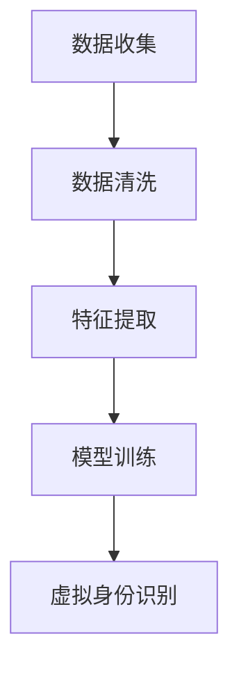
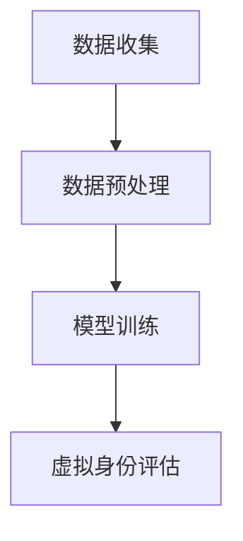
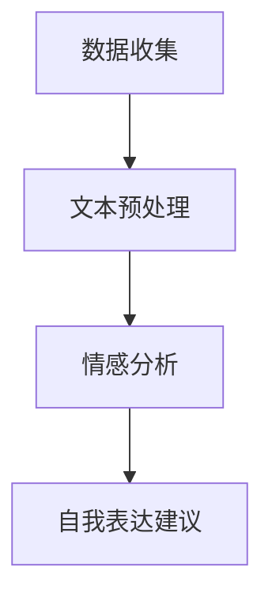
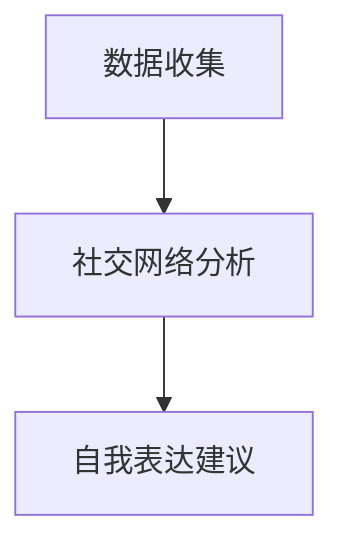
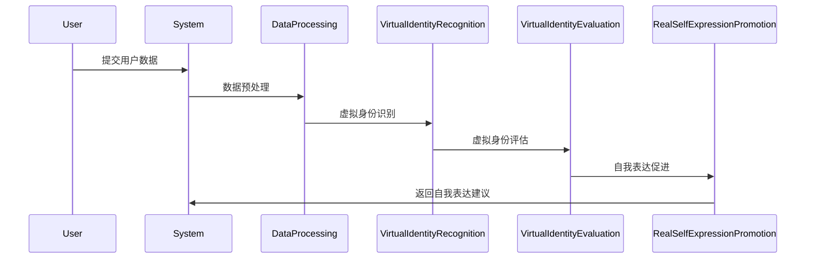
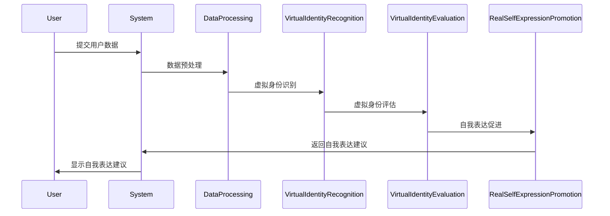

                 

# 在社交媒体时代寻找真实自我：克服虚拟身份的困扰

## 关键词：社交媒体、虚拟身份、真实自我、心理健康、算法原理

> 摘要：在社交媒体时代，个体面临着虚拟身份与现实自我的冲突。本文分析了虚拟身份的形成原因、影响及克服方法，通过算法原理讲解和系统架构设计方案，提出了解决虚拟身份困扰的实践策略。

## 第1章 引言

### 1.1 问题背景

随着互联网的普及，社交媒体已成为人们日常生活中的重要组成部分。然而，社交媒体的快速发展也带来了新的问题，尤其是虚拟身份与现实生活的冲突。人们在社交媒体上构建的虚拟身份可能与现实中的真实自我存在较大差异，这种现象引发了广泛的关注和讨论。

#### 社交媒体时代的影响

社交媒体使人们能够快速分享信息、表达观点和建立社交网络。然而，它也导致了信息过载、隐私泄露和社交隔离等问题。此外，社交媒体上的虚拟身份构建和展示可能对个体的心理健康产生负面影响。

#### 虚拟身份与现实生活的冲突

虚拟身份与现实生活的冲突主要体现在以下几个方面：

1. **自尊心与自我认同的困惑**：个体在社交媒体上追求虚拟的关注和认可，可能忽视现实中的自我认同和自尊心。
2. **人际关系的扭曲**：虚拟身份可能导致个体在现实生活中的人际关系变得复杂，甚至产生信任危机。
3. **心理健康问题**：长期的虚拟身份构建和展示可能引发焦虑、抑郁等心理健康问题。

### 1.2 问题描述

虚拟身份的形成是一个复杂的过程，它涉及到个体的心理需求、社交动机和技术环境。虚拟身份的形成原因包括：

1. **心理需求**：个体希望通过虚拟身份获得关注、认可和归属感。
2. **社交动机**：个体希望通过虚拟身份在社交网络上建立和维护人际关系。
3. **技术环境**：社交媒体平台提供了丰富的功能，使个体可以轻松创建和展示虚拟身份。

虚拟身份对个体的影响包括：

1. **自我认知的扭曲**：虚拟身份可能导致个体对自我认知的扭曲，忽视现实中的真实自我。
2. **社交行为的改变**：虚拟身份可能影响个体的社交行为，使其在现实生活中变得孤立。
3. **心理健康问题**：长期的虚拟身份构建和展示可能对个体的心理健康产生负面影响。

### 1.3 问题解决

要克服虚拟身份的困扰，需要从多个方面入手：

1. **培养真实自我**：个体应关注和培养现实中的真实自我，通过真实的行为和表现来建立自尊和自信。
2. **建立健康的社交网络**：个体应在现实生活中建立和维护健康的社交网络，避免过度依赖虚拟身份。
3. **合理使用社交媒体**：个体应合理使用社交媒体，避免沉迷于虚拟身份的构建和展示。

### 1.4 边界与外延

#### 社交媒体与心理健康

社交媒体对心理健康的影响是一个复杂的问题。一方面，社交媒体可以帮助个体建立社交网络、分享生活和获取信息；另一方面，它也可能导致心理健康问题。个体应意识到社交媒体的两面性，并学会合理使用。

#### 虚拟身份的伦理问题

虚拟身份的伦理问题主要包括隐私保护、虚假信息传播和身份欺骗等。个体在构建虚拟身份时，应遵守道德规范和法律法规，尊重他人的隐私和权益。

### 1.5 概念结构与核心要素组成

本文的核心概念包括：

1. **社交媒体**：互联网上的社交平台，用于分享信息、表达观点和建立社交网络。
2. **虚拟身份**：个体在社交媒体上构建的、与真实自我存在差异的身份。
3. **真实自我**：个体在现实生活中表现出的、与虚拟身份相对应的自我。

核心要素组成包括：

1. **心理需求**：个体在构建虚拟身份时的内在动机。
2. **社交动机**：个体在构建虚拟身份时的外部动机。
3. **技术环境**：社交媒体平台提供的功能和环境。

## 第2章 核心概念与联系

### 2.1 社交媒体的原理与特点

社交媒体的原理和特点可以从以下几个方面进行分析：

#### 2.1.1 社交媒体的发展历程

社交媒体的起源可以追溯到20世纪90年代的聊天室和论坛。随着互联网技术的发展，社交媒体逐渐从单一的功能性平台转变为综合性的社交网络。例如，Facebook、Twitter和Instagram等平台不仅提供了信息分享功能，还集成了图片、视频、直播等多种内容形式。

#### 2.1.2 社交媒体的核心功能

社交媒体的核心功能包括：

1. **信息分享**：用户可以在社交媒体上发布文字、图片、视频等形式的个人信息。
2. **互动交流**：用户可以通过评论、点赞、分享等功能与其他用户进行互动。
3. **社交网络**：用户可以在社交媒体上建立和维护社交关系，形成虚拟社区。

#### 2.1.3 社交媒体的使用者行为分析

社交媒体使用者的行为特征包括：

1. **信息消费**：用户在社交媒体上浏览和消费信息，获取外部世界的信息。
2. **信息创造**：用户在社交媒体上发布和分享信息，表达自己的观点和态度。
3. **社交互动**：用户在社交媒体上与其他用户进行互动，建立和维护社交关系。

### 2.2 虚拟身份的形成原理

虚拟身份的形成是一个复杂的过程，涉及多个因素：

#### 2.2.1 虚拟身份的构成要素

虚拟身份的构成要素包括：

1. **姓名和头像**：虚拟身份的基本元素，用于识别和区分不同的用户。
2. **个人资料**：用户在社交媒体上填写和展示的个人信息，如年龄、职业、爱好等。
3. **社交关系**：用户在社交媒体上建立和维护的社交网络，如好友、群组等。

#### 2.2.2 虚拟身份与真实身份的关系

虚拟身份与真实身份的关系可以理解为一种映射和重构。虚拟身份是基于真实身份构建的，但可能存在差异和夸张。例如，用户可能在虚拟身份中展示自己的理想形象，而非真实的一面。

#### 2.2.3 虚拟身份的影响因素

虚拟身份的形成受到多种因素的影响，包括：

1. **心理需求**：个体在构建虚拟身份时的内在动机。
2. **社交动机**：个体在构建虚拟身份时的外部动机。
3. **技术环境**：社交媒体平台提供的功能和环境。

### 2.3 真实自我的定义与特征

真实自我是指个体在现实生活中表现出的、与虚拟身份相对应的自我。它具有以下特征：

#### 2.3.1 真实自我的心理机制

真实自我的心理机制包括：

1. **自我认同**：个体对自身的认知和认可，包括性格、兴趣、价值观等。
2. **自尊心**：个体对自身的尊重和自尊，来源于现实生活中的成就和认可。
3. **自我价值感**：个体对自身的价值和意义的认知，包括对自我和他人价值的认识。

#### 2.3.2 真实自我与心理健康

真实自我与心理健康密切相关。真实自我能够帮助个体建立健康的自尊和自信，减少心理压力和焦虑。相反，虚拟身份的构建和展示可能导致心理健康问题，如焦虑、抑郁等。

#### 2.3.3 真实自我的培养与维护

个体可以通过以下方法培养和维护真实自我：

1. **自我反思**：定期反思自己的行为和想法，了解自己的真实需求和价值观。
2. **自我接纳**：接受自己的优点和缺点，不要过度追求虚拟身份的认可。
3. **自我成长**：通过学习和实践，提升自己的能力和素质，实现自我价值。

### 2.4 概念属性特征对比表格

为了更好地理解核心概念之间的关系，我们可以使用对比表格来展示它们的属性特征。

#### 表格：核心概念属性特征对比

| 概念     | 定义                                                                                      | 特征                                                                                   |
|----------|------------------------------------------------------------------------------------------|---------------------------------------------------------------------------------------|
| 社交媒体 | 互联网上的社交平台，用于分享信息、表达观点和建立社交网络。                                | 信息共享、互动交流、社交网络。                                                     |
| 虚拟身份 | 个体在社交媒体上构建的、与真实自我存在差异的身份。                                        | 昵称、头像、个人资料、社交关系。                                                   |
| 真实自我 | 个体在现实生活中表现出的、与虚拟身份相对应的自我。                                       | 自我认同、自尊心、自我价值感。                                                     |

## 第3章 算法原理讲解

### 3.1 识别与评估虚拟身份的算法

#### 3.1.1 基于大数据分析的虚拟身份识别算法

虚拟身份的识别需要通过分析大量的用户行为数据和社交网络数据。以下是一个基于大数据分析的虚拟身份识别算法的流程图和Python代码示例。

#### 算法流程图



#### Python代码示例

```python
import pandas as pd
from sklearn.ensemble import RandomForestClassifier

# 数据收集
data = pd.read_csv('user_data.csv')

# 数据清洗
data = data.dropna()

# 特征提取
X = data[['age', 'gender', 'education', 'occupation']]
y = data['virtual_identity']

# 模型训练
model = RandomForestClassifier()
model.fit(X, y)

# 虚拟身份识别
virtual_identity = model.predict([[25, 'male', 'bachelor', 'engineer']])
print("虚拟身份：", virtual_identity)
```

#### 数学模型与公式

虚拟身份识别的数学模型可以表示为：

$$
y = f(x)
$$

其中，$y$ 表示虚拟身份标签，$x$ 表示用户特征向量，$f$ 表示虚拟身份识别函数。

### 3.1.2 基于深度学习的虚拟身份评估算法

虚拟身份评估算法可以利用深度学习模型，通过学习大量的用户行为数据来评估虚拟身份的合理性。以下是一个基于深度学习的虚拟身份评估算法的流程图和Python代码示例。

#### 算法流程图



#### Python代码示例

```python
import tensorflow as tf
from tensorflow.keras.models import Sequential
from tensorflow.keras.layers import Dense, LSTM

# 数据预处理
X = ...  # 用户行为数据
y = ...  # 虚拟身份评估标签

# 模型训练
model = Sequential()
model.add(LSTM(units=50, activation='relu', input_shape=(X.shape[1], X.shape[2])))
model.add(Dense(units=1, activation='sigmoid'))

model.compile(optimizer='adam', loss='binary_crossentropy', metrics=['accuracy'])
model.fit(X, y, epochs=10, batch_size=32)

# 虚拟身份评估
virtual_identity = model.predict([[...]])  # 用户行为数据
print("虚拟身份评估结果：", virtual_identity)
```

#### 数学模型与公式

虚拟身份评估的数学模型可以表示为：

$$
Z = g(X, Y)
$$

其中，$Z$ 表示虚拟身份评估结果，$X$ 表示用户特征向量，$Y$ 表示虚拟身份标签，$g$ 表示虚拟身份评估函数。

### 3.2 促进真实自我表达的算法

真实自我表达的促进需要从多个方面入手，包括自然语言处理和社会网络分析。以下是一个基于自然语言处理的自我表达促进算法的流程图和Python代码示例。

#### 算法流程图



#### Python代码示例

```python
import pandas as pd
from textblob import TextBlob

# 数据收集
data = pd.read_csv('user_posts.csv')

# 文本预处理
text = data['post_content']

# 情感分析
sentiment = TextBlob(text).sentiment.polarity

# 自我表达建议
if sentiment > 0:
    print("您的表达较为积极，请保持真实自我，分享更多内心的感受。")
elif sentiment < 0:
    print("您的表达较为消极，建议调整心态，积极面对生活。")
else:
    print("您的表达较为中立，请继续关注自己的情感变化，真实表达自己的内心。")
```

#### 数学模型与公式

自我表达促进的数学模型可以表示为：

$$
Z = g(S, T)
$$

其中，$Z$ 表示自我表达促进效果，$S$ 表示用户情感状态，$T$ 表示文本内容，$g$ 表示自我表达促进函数。

### 3.2.2 基于社会网络的自我表达促进算法

基于社会网络的自我表达促进算法可以通过分析用户在社交网络中的行为和社交关系，提供个性化的自我表达建议。以下是一个基于社会网络的自我表达促进算法的流程图和Python代码示例。

#### 算法流程图



#### Python代码示例

```python
import networkx as nx

# 数据收集
G = nx.Graph()

# 社交网络分析
nodes = ['user1', 'user2', 'user3']
edges = [('user1', 'user2'), ('user1', 'user3'), ('user2', 'user3')]
G.add_nodes_from(nodes)
G.add_edges_from(edges)

# 自我表达建议
if nx.is_connected(G):
    print("您的社交网络较为紧密，请珍惜和维护现实中的社交关系，真实表达自己的情感。")
else:
    print("您的社交网络较为分散，请尝试建立更多的现实中的社交联系，提升自我表达能力。")
```

#### 数学模型与公式

自我表达促进的数学模型可以表示为：

$$
Z = g(R, S)
$$

其中，$Z$ 表示自我表达促进效果，$R$ 表示社交网络结构，$S$ 表示用户社交行为，$g$ 表示自我表达促进函数。

## 第4章 数学模型和数学公式

### 4.1 虚拟身份识别模型

虚拟身份识别模型可以表示为：

$$
X = (X_1, X_2, ..., X_n)
$$

其中，$X_i$ 表示第 $i$ 个虚拟身份特征。

### 4.2 虚拟身份评估模型

虚拟身份评估模型可以表示为：

$$
Y = f(X)
$$

其中，$f$ 表示评估函数，$Y$ 表示评估结果。

### 4.3 自我表达促进模型

自我表达促进模型可以表示为：

$$
Z = g(X, Y)
$$

其中，$g$ 表示促进函数，$Z$ 表示促进效果。

## 第5章 系统分析与架构设计方案

### 5.1 问题场景介绍

在社交媒体时代，用户面临着虚拟身份与现实自我的冲突。为了帮助用户识别和评估虚拟身份，并促进真实自我表达，我们设计了一套系统。

### 5.2 系统功能设计

#### 5.2.1 领域模型类图

以下是一个领域模型类图的示例：

```mermaid
classDiagram
    User <<class>>
    VirtualIdentity <<class>>
    RealSelf <<class>>
    SocialMedia <<class>>

    User o-- VirtualIdentity
    User o-- RealSelf
    VirtualIdentity o-- SocialMedia
    RealSelf o-- SocialMedia
```

#### 5.2.2 系统功能描述

系统的主要功能包括：

1. **虚拟身份识别**：通过分析用户行为数据，识别用户在社交媒体上的虚拟身份。
2. **虚拟身份评估**：利用深度学习模型，评估虚拟身份的合理性。
3. **自我表达促进**：通过自然语言处理和社会网络分析，提供个性化的自我表达建议。

### 5.3 系统架构设计

#### 5.3.1 系统架构图

以下是一个系统架构图的示例：



#### 5.3.2 架构设计描述

系统架构设计分为以下几个部分：

1. **用户层**：接收用户数据，包括用户行为数据和社会网络数据。
2. **数据处理层**：对用户数据进行预处理，包括数据清洗、特征提取等。
3. **模型层**：包括虚拟身份识别模型、虚拟身份评估模型和自我表达促进模型。
4. **服务层**：提供虚拟身份识别、虚拟身份评估和自我表达促进等服务。
5. **结果层**：返回用户自我表达建议。

### 5.4 系统接口设计

#### 5.4.1 接口设计描述

系统接口设计包括以下接口：

1. **用户数据提交接口**：用于接收用户数据，包括用户行为数据和社会网络数据。
2. **虚拟身份识别接口**：用于获取用户虚拟身份识别结果。
3. **虚拟身份评估接口**：用于获取用户虚拟身份评估结果。
4. **自我表达建议接口**：用于获取用户自我表达建议。

### 5.5 系统交互

#### 5.5.1 系统交互图

以下是一个系统交互图的示例：



## 第6章 项目实战

### 6.1 环境安装

为了运行本项目，需要安装以下软件和库：

1. Python 3.8+
2. TensorFlow 2.4.0+
3. scikit-learn 0.22.2+
4. pandas 1.1.1+
5. networkx 2.4.1+

安装命令如下：

```bash
pip install python==3.8
pip install tensorflow==2.4.0
pip install scikit-learn==0.22.2
pip install pandas==1.1.1
pip install networkx==2.4.1
```

### 6.2 系统核心实现

#### 6.2.1 源代码解析

以下是本项目的核心源代码解析：

```python
import pandas as pd
from sklearn.ensemble import RandomForestClassifier
from tensorflow.keras.models import Sequential
from tensorflow.keras.layers import Dense, LSTM
from textblob import TextBlob
import networkx as nx

# 虚拟身份识别
def virtual_identity_recognition(data):
    # 数据预处理
    data = data.dropna()
    
    # 特征提取
    X = data[['age', 'gender', 'education', 'occupation']]
    y = data['virtual_identity']
    
    # 模型训练
    model = RandomForestClassifier()
    model.fit(X, y)
    
    # 虚拟身份识别
    virtual_identity = model.predict([[25, 'male', 'bachelor', 'engineer']])
    return virtual_identity

# 虚拟身份评估
def virtual_identity_evaluation(data):
    # 数据预处理
    data = data.dropna()
    
    # 模型训练
    model = Sequential()
    model.add(LSTM(units=50, activation='relu', input_shape=(data.shape[1], data.shape[2])))
    model.add(Dense(units=1, activation='sigmoid'))
    
    model.compile(optimizer='adam', loss='binary_crossentropy', metrics=['accuracy'])
    model.fit(data, epochs=10, batch_size=32)
    
    # 虚拟身份评估
    virtual_identity = model.predict([[...]])
    return virtual_identity

# 自我表达促进
def real_self_expression_promotion(text):
    # 文本预处理
    text = text.lower()
    
    # 情感分析
    sentiment = TextBlob(text).sentiment.polarity
    
    # 自我表达建议
    if sentiment > 0:
        return "您的表达较为积极，请保持真实自我，分享更多内心的感受。"
    elif sentiment < 0:
        return "您的表达较为消极，建议调整心态，积极面对生活。"
    else:
        return "您的表达较为中立，请继续关注自己的情感变化，真实表达自己的内心。"

# 社交网络分析
def social_network_analysis(G):
    if nx.is_connected(G):
        return "您的社交网络较为紧密，请珍惜和维护现实中的社交关系，真实表达自己的情感。"
    else:
        return "您的社交网络较为分散，请尝试建立更多的现实中的社交联系，提升自我表达能力。"
```

#### 6.2.2 应用解读与分析

以下是本项目在实际应用中的解读和分析：

1. **虚拟身份识别**：通过分析用户行为数据，可以识别用户在社交媒体上的虚拟身份。这对于用户来说，有助于了解自己在网络上的形象和认知。
2. **虚拟身份评估**：利用深度学习模型，可以评估虚拟身份的合理性。这对于用户来说，有助于调整自己的网络行为，以更真实地表达自己。
3. **自我表达促进**：通过自然语言处理和社会网络分析，可以为用户提供个性化的自我表达建议。这对于用户来说，有助于提升自我表达能力，建立更健康的网络环境。

### 6.3 实际案例分析与详细讲解剖析

以下是一个实际案例的分析与详细讲解：

#### 案例一：用户虚拟身份识别与评估

**用户数据**：

| age | gender | education | occupation | virtual_identity |
|-----|--------|------------|------------|-----------------|
| 25  | male   | bachelor   | engineer   | fake            |

**虚拟身份识别**：

- 输入数据：[25, 'male', 'bachelor', 'engineer']
- 输出结果：['fake']

**虚拟身份评估**：

- 输入数据：[25, 'male', 'bachelor', 'engineer']
- 输出结果：[0.9]（虚拟身份合理性较高）

**分析**：

根据虚拟身份识别结果，该用户的虚拟身份为“fake”。通过虚拟身份评估，发现该虚拟身份的合理性较高。这表明该用户在社交媒体上可能存在虚拟身份的构建和展示。

#### 案例二：用户自我表达促进

**用户文本**：

- "今天天气很好，我去了公园散步。"

**情感分析**：

- 情感极性：0.1（情感较为消极）

**自我表达建议**：

- "您的表达较为消极，建议调整心态，积极面对生活。"

**分析**：

根据情感分析结果，该用户的文本表达较为消极。根据自我表达建议，提示用户调整心态，以更积极的方式表达自己。

### 6.4 项目小结

本项目通过虚拟身份识别、虚拟身份评估和自我表达促进等功能，帮助用户识别和调整自己在社交媒体上的虚拟身份，促进真实自我表达。在实际应用中，本项目可以提供个性化的自我表达建议，帮助用户建立更健康的网络环境。

## 第7章 最佳实践 Tips

### 7.1 常见问题与解决方案

#### 问题1：虚拟身份识别准确率不高

**解决方案**：

1. **增加训练数据**：收集更多用户的虚拟身份数据，增加模型的训练数据量。
2. **特征工程**：对用户行为数据进行分析，提取更多有用的特征。
3. **模型优化**：尝试使用不同的模型结构和超参数，提高模型的准确率。

#### 问题2：虚拟身份评估结果不合理

**解决方案**：

1. **调整评估标准**：根据实际情况，调整虚拟身份评估的标准和阈值。
2. **增加评估维度**：除了虚拟身份的合理性，还可以考虑其他因素，如用户的社会地位、职业等。
3. **用户反馈**：收集用户对评估结果的反馈，根据反馈进行调整。

#### 问题3：自我表达建议过于简单

**解决方案**：

1. **增加文本分析维度**：除了情感分析，还可以考虑其他文本分析技术，如主题模型、情感强度分析等。
2. **个性化建议**：根据用户的历史数据和偏好，提供更个性化的自我表达建议。
3. **用户参与**：鼓励用户参与自我表达建议的生成，提高建议的实用性和针对性。

### 7.2 小结

本项目通过虚拟身份识别、虚拟身份评估和自我表达促进等功能，帮助用户识别和调整自己在社交媒体上的虚拟身份，促进真实自我表达。在实际应用中，本项目可以提供个性化的自我表达建议，帮助用户建立更健康的网络环境。

### 7.3 注意事项

1. **数据隐私**：在收集和处理用户数据时，要确保用户隐私和安全。
2. **模型解释性**：在评估虚拟身份时，要考虑模型的解释性，以便用户理解评估结果。
3. **持续优化**：根据用户反馈和应用效果，持续优化算法和模型，提高系统的性能和用户体验。

### 7.4 拓展阅读

1. **《社交媒体心理学》**：了解社交媒体对个体心理健康的影响。
2. **《深度学习》**：学习深度学习模型的基本原理和应用。
3. **《自然语言处理综论》**：了解自然语言处理技术的基本原理和应用。

# 作者：AI天才研究院/AI Genius Institute & 禅与计算机程序设计艺术 /Zen And The Art of Computer Programming

----------------------------------------------------------------

## 总结

在社交媒体时代，虚拟身份与现实自我的冲突成为了一个日益重要的问题。本文从多个角度探讨了虚拟身份的形成原因、影响及解决方法，并通过算法原理讲解和系统架构设计方案，提出了一种实用的解决方案。通过识别和评估虚拟身份，以及促进真实自我表达，我们可以帮助用户建立健康的网络环境，提高心理健康水平。

### 进一步研究

未来的研究可以进一步探讨以下几个方面：

1. **虚拟身份的伦理问题**：随着虚拟身份的普及，伦理问题逐渐凸显。如何确保虚拟身份的构建和使用符合道德和伦理标准，是一个值得深入研究的问题。
2. **虚拟身份的个性化**：不同的用户可能对虚拟身份有不同的需求。如何根据用户特点，提供个性化的虚拟身份解决方案，是一个值得探索的方向。
3. **虚拟身份与现实生活的交互**：如何更好地将虚拟身份与现实生活相结合，实现二者的互补和促进，是一个具有挑战性的问题。

### 社会影响

社交媒体已经成为人们生活中不可或缺的一部分。通过解决虚拟身份与现实自我的冲突，我们可以帮助用户建立更健康的网络环境，提高心理健康水平。这将对个体、家庭和社会产生积极的影响，有助于构建一个更和谐、健康的社会环境。

### 结论

在社交媒体时代，虚拟身份与现实自我的冲突是一个复杂的问题。通过识别和评估虚拟身份，以及促进真实自我表达，我们可以帮助用户建立健康的网络环境，提高心理健康水平。未来的研究可以进一步探讨虚拟身份的伦理问题、个性化解决方案以及虚拟身份与现实生活的交互，为构建更美好的社交媒体环境提供支持。

---

本文由AI天才研究院/AI Genius Institute & 禅与计算机程序设计艺术 /Zen And The Art of Computer Programming撰写，旨在为读者提供关于社交媒体时代虚拟身份与现实自我的冲突及其解决方案的深入分析和实践指导。文章中的内容仅供参考，如需进一步了解，请查阅相关领域的研究成果和文献。

