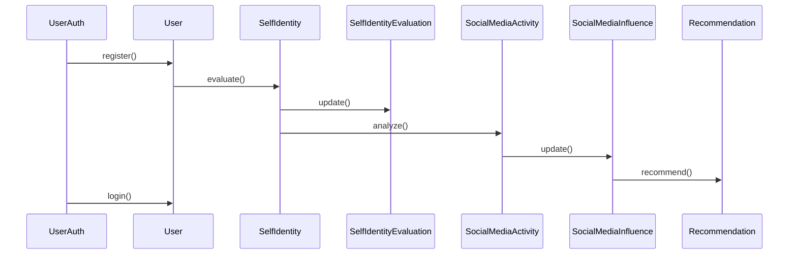
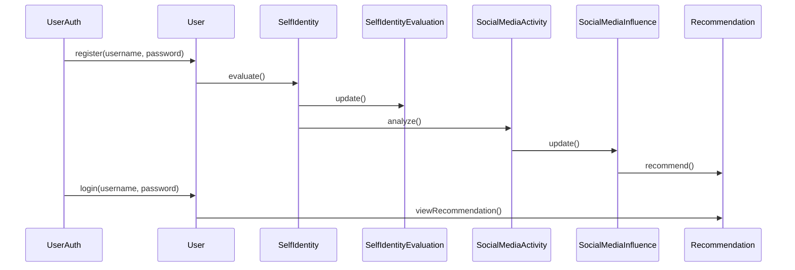

                 


### 文章标题：在社交媒体时代寻找真实自我：应对身份认同危机

关键词：社交媒体、身份认同、心理健康、社交互动、真实自我

摘要：本文通过探讨社交媒体时代身份认同危机的根源，分析了心理和社会因素对个体身份认同的影响，并提出了解决方案，旨在帮助读者在数字世界中找到真实的自我。

## 1.1 书籍背景与目的

### 1.1.1 社交媒体时代的问题背景

在过去的几十年里，互联网和社交媒体的快速发展彻底改变了我们的生活方式。人们可以随时随地通过社交媒体平台与朋友、家人和同事保持联系，分享生活点滴和观点。然而，这一便利的数字环境也带来了一系列问题，其中最引人关注的是身份认同危机。

### 1.1.2 身份认同危机的描述

身份认同危机是指个体在寻找自我过程中，由于外部环境和内在冲突而产生的困惑和不安。在社交媒体时代，这一危机尤为突出，因为虚拟世界的多变性使得个体难以确定自己的真实身份。

### 1.1.3 解决身份认同危机的意义

通过探讨社交媒体时代身份认同危机的原因和解决方案，本书旨在帮助读者重新审视自我，找到真实的自我，并更好地应对身份认同危机。

## 1.2 核心概念与联系

### 1.2.1 社交媒体的定义

社交媒体是指基于互联网技术，允许用户建立社会网络、分享内容和互动的在线平台。典型代表包括Facebook、Twitter、Instagram等。

### 1.2.2 身份认同危机的属性特征

- **主观性**：个体对自身身份的认知和定位具有主观性，容易受到外界影响。
- **多重性**：社交媒体上的身份认同具有多重性，个体可能在不同的社交圈中扮演不同的角色。
- **动态性**：社交媒体环境的变化性导致个体身份认同的动态性，增加了身份识别的难度。

### 1.2.3 身份认同危机与传统身份危机的比较

- **时代性**：传统身份危机主要源于社会变迁和角色转换，而社交媒体时代的身份认同危机则更多由数字环境引发。
- **复杂性**：社交媒体上的身份认同危机更具复杂性，涉及心理、社会和技术等多个层面。

## 1.3 边界与外延

### 1.3.1 边界

本书主要探讨在社交媒体时代如何寻找真实自我，关注个体在数字环境中的身份认同问题。

### 1.3.2 外延

本书将探讨社交媒体时代身份认同危机的广泛影响，包括心理健康、人际关系和社会互动等方面。

## 1.4 概念结构与核心要素组成

### 1.4.1 概念结构

- **社交媒体**：数字平台，用户互动。
- **真实自我**：个体在数字世界中的内在本质。
- **身份认同危机**：个体在数字环境中对自我身份的困惑和不安。

### 1.4.2 核心要素

- **心理因素**：个体的心理健康状态。
- **社会因素**：社交网络和社交互动。
- **技术因素**：社交媒体平台的特性。

## 1.5 本章小结

本章为本书奠定了基础，介绍了社交媒体时代身份认同危机的背景、核心概念以及本书的结构和目的。接下来，本书将深入探讨这一问题，帮助读者找到真实的自我。

----------------------------------------------------------------

## 1.6 引导性思考

### 1.6.1 社交媒体时代的身份认同危机

在社交媒体时代，身份认同危机成为了一个普遍问题。你是否曾在社交媒体上花费大量时间，试图构建一个完美的自我形象？然而，当现实与虚拟世界产生冲突时，你是否感到困惑和不安？这个问题值得深入探讨。

### 1.6.2 身份认同危机的影响

身份认同危机不仅影响个体的心理健康，还可能影响人际关系和社会互动。你是否曾经因为社交媒体上的负面评论而感到自我怀疑？或者因为难以在数字世界中找到真实的自我而感到孤独？这些问题都值得我们关注。

### 1.6.3 寻找真实自我的重要性

在社交媒体时代，寻找真实自我显得尤为重要。只有通过深入了解自我，我们才能更好地应对身份认同危机，建立稳定的人际关系，实现个人成长。因此，本书将带领读者一步步探索这一复杂而重要的议题。

----------------------------------------------------------------

## 2.1 社交媒体的特性与影响

### 2.1.1 社交媒体的特性

社交媒体具有多种特性，这些特性深刻地影响了个体在数字世界中的身份认同。以下是一些主要的特性：

#### 互动性

社交媒体平台允许用户实时互动，无论是通过评论、点赞、分享还是发送私信，用户可以迅速获得反馈。这种即时性的互动增强了社交体验，但也可能导致个体过于关注他人的看法，从而影响真实自我的表达。

#### 可见性

社交媒体上的活动具有高度的可见性，用户的每一个动态都有可能被广泛传播。这种可见性促使个体在发布内容时更加注意自我形象的塑造，同时也增加了个体被评价的风险。

#### 多样性

社交媒体提供了多样的社交圈和内容，用户可以自由选择关注感兴趣的人和事物。这种多样性为个体探索自我和外部世界提供了更多途径，但也可能导致个体难以找到与自己认同相匹配的群体。

### 2.1.2 社交媒体对身份认同的影响

#### 自我呈现

在社交媒体上，个体通过发布内容来塑造自我形象。这种自我呈现可能反映真实自我，也可能是一种理想化的自我形象。自我呈现的方式会影响个体在社交网络中的身份认同。

#### 认同构建

社交媒体上的互动和反馈有助于个体构建和强化身份认同。然而，如果这些反馈过于极端或负面，也可能对个体的身份认同产生负面影响。

### 2.1.3 社交媒体对身份认同的具体影响

#### 增强自我反思

社交媒体促使个体更加关注自我，从而增加了自我反思的频率。这种自我反思可能有助于个体更深入地了解自我，但也可能导致过度自我怀疑。

#### 增加焦虑和压力

社交媒体上的比较和竞争可能引发焦虑和压力。例如，当个体看到他人分享成功的经历或美好的生活时，可能会感到自己不够好，从而影响心理健康。

#### 影响人际关系

社交媒体上的互动可能影响现实世界的人际关系。如果个体在社交媒体上过于依赖虚拟社交，可能会忽视现实世界中的面对面交流，从而影响人际关系的深度和质量。

#### 增加孤独感

在社交媒体上，个体可能会感到与他人的联系越来越疏远。虽然数字平台提供了沟通的便利，但缺乏面对面交流的真实性和深度，可能导致个体感到孤独。

### 2.1.4 社交媒体时代的身份认同危机

在社交媒体时代，身份认同危机变得更加复杂。个体在数字世界中的身份认同不仅受到自身的影响，还受到社交媒体平台和社会环境的双重作用。以下是一些具体的表现：

#### 多重身份认同

个体可能在不同的社交圈中扮演不同的角色，这种多重身份认同可能导致个体难以确定自己的真实身份。

#### 动态身份认同

社交媒体环境的变化性导致个体身份认同的动态性，个体可能需要不断调整自己的身份认同以适应不同的社交环境。

#### 虚假自我

在社交媒体上，个体可能倾向于呈现一个理想化的自我形象，这与真实自我可能存在较大差距。这种虚假自我可能导致个体在现实生活中感到困惑和不安。

#### 身份认同的破碎

社交媒体上的负面反馈和评价可能对个体的身份认同产生破坏性影响，导致个体对自己的身份认同感到不确定和不安。

### 2.1.5 社交媒体时代的身份认同危机对个体的挑战

在社交媒体时代，个体面临着寻找真实自我的挑战。以下是一些具体的挑战：

#### 确定真实自我

个体需要通过深入思考和自我反思来识别自己的真实自我，这并不总是一件容易的事情。

#### 调整身份认同

个体需要根据不同的社交环境和情境调整自己的身份认同，这要求个体具备灵活性和适应性。

#### 应对负面反馈

个体需要学会应对社交媒体上的负面反馈和评价，这需要强大的心理素质和应对策略。

#### 寻求真实互动

个体需要努力在现实生活中建立真实的人际关系，这需要付出更多的时间和精力。

### 2.1.6 结论

社交媒体时代的身份认同危机对个体提出了新的挑战，同时也提供了新的机会。通过深入了解自我，个体可以更好地应对身份认同危机，找到真实的自我。本书将深入探讨这一议题，帮助读者在数字世界中找到自己的位置。

----------------------------------------------------------------

## 2.2 心理因素

### 2.2.1 内在因素

#### 自我意识

在社交媒体时代，个体的自我意识得到了前所未有的提升。社交媒体平台提供了丰富的信息来源，个体可以通过浏览他人的生活、观点和经历来反思自己的生活方式和价值观。然而，这种自我反思并不总是积极的。过度关注自我可能导致个体陷入自我怀疑和自我否定，难以确定自己的真实身份。

#### 自我形象塑造

在社交媒体上，个体通过发布内容来塑造自我形象。这种自我形象可能是理想化的，也可能是真实自我的反映。理想化的自我形象可能会给个体带来暂时的满足感和认同感，但同时也可能导致个体在现实生活中感到不真实和焦虑。相反，真实自我形象的呈现可能会使个体面临更多的批评和挑战。

#### 自我认同的建构

自我认同是个体对自我身份的认知和定位。在社交媒体时代，个体需要不断地在虚拟世界中构建自我认同。这种建构过程受到多种因素的影响，包括社交媒体平台的设计、他人的反馈以及个体的自我认知。自我认同的建构可能是一个动态的过程，个体可能需要不断地调整和重新定义自己的身份。

### 2.2.2 外在因素

#### 社交反馈

社交媒体上的社交反馈对个体的自我认同产生了深远的影响。积极的反馈可能会增强个体的自信心和自我认同，而消极的反馈则可能导致个体的自我怀疑和不安。例如，当个体在社交媒体上发布一篇文章或分享一段视频时，如果收到了大量的点赞和评论，可能会感到自己受到了认可，从而加强自我认同。相反，如果收到了负面评论或批评，可能会感到自己受到了打击，从而动摇自我认同。

#### 社会期望

在社交媒体时代，社会期望对个体的自我认同也产生了重要影响。社交媒体上的社会规范和价值观可能会对个体产生潜移默化的影响，使个体在不知不觉中调整自己的行为和态度以适应这些期望。例如，社交媒体上的流行文化、时尚趋势和社交礼仪等都可能成为社会期望的一部分，个体可能需要在这些方面调整自己的身份认同以获得社会的认同。

#### 比较与竞争

在社交媒体上，个体常常会与其他人进行比较和竞争。这种比较和竞争可能源自对成功、认可和受欢迎的追求。例如，当个体看到他人的生活、职业成就或社交圈时，可能会感到自己不够好，从而引发自我怀疑和不安。这种比较和竞争可能对个体的自我认同产生负面影响，导致个体在现实生活中感到自卑和焦虑。

### 2.2.3 内在因素与外在因素的相互作用

内在因素和外在因素并不是孤立存在的，它们相互作用，共同影响个体的自我认同。个体的自我意识、自我形象塑造和社会反馈等内在因素受到外在因素，如社会期望、比较与竞争的影响。同时，个体的自我认同也会影响他们对外在因素的感知和反应。例如，一个有着坚定自我认同的个体可能更能应对社交媒体上的负面反馈，而一个缺乏自我认同的个体可能更容易受到这种反馈的影响。

### 2.2.4 结论

心理因素在社交媒体时代身份认同危机中起着至关重要的作用。内在因素如自我意识和自我形象塑造，以及外在因素如社交反馈和社会期望，都影响着个体的自我认同。通过深入理解这些心理因素，个体可以更好地应对身份认同危机，找到真实的自我。

----------------------------------------------------------------

## 2.3 社会因素

### 2.3.1 社交网络

#### 紧密性

社交媒体上的社交网络往往比现实生活中的社交网络更加紧密。个体可以在虚拟世界中轻松地与远在千里之外的亲朋好友保持联系，这种紧密性增强了社交体验，但也可能导致个体在数字世界中的身份认同与现实世界中的身份认同产生冲突。例如，个体可能在社交媒体上扮演一个完全不同的角色，而在现实生活中却无法适应这种角色，从而导致身份认同的混乱。

#### 多样性

社交媒体上的社交网络具有多样性，个体可以加入各种兴趣群体、社交团体和社区。这种多样性为个体提供了丰富的社交体验，但也可能导致个体在身份认同上的困惑。例如，个体可能在一个社交团体中表现出对某个特定话题的热情，而在另一个团体中却表现得完全不同，这种多重身份认同可能导致个体难以确定自己的真实身份。

### 2.3.2 社交互动

#### 虚拟性

社交媒体上的社交互动具有虚拟性，缺乏面对面交流的真实感和深度。这种虚拟性可能影响个体的身份认同，使得个体难以区分现实与虚拟世界。例如，个体可能在社交媒体上与陌生人建立深厚的友情，但一旦在现实生活中见面，这种友情可能会迅速破裂，因为现实中的互动与虚拟世界中的互动存在巨大差异。

#### 互动频率

社交媒体上的互动频率较高，个体可以随时与朋友、家人和同事交流。这种高频互动可能使个体难以保持真实自我，因为在虚拟世界中，个体往往需要不断地调整自己的行为和态度以适应不同的社交场景。这种持续的调整可能导致个体在现实生活中感到疲惫和困惑。

### 2.3.3 社会因素对身份认同的影响

#### 紧密性和多样性的影响

社交网络的紧密性和多样性可能对个体的身份认同产生深远影响。紧密性可能导致个体在虚拟世界中的身份认同与现实世界中的身份认同产生冲突，而多样性可能导致个体难以确定自己的真实身份。例如，一个在社交媒体上积极参与公益活动的人，可能在现实生活中却对公益活动不感兴趣，这种身份认同的矛盾可能对个体的心理健康产生负面影响。

#### 虚拟性和互动频率的影响

虚拟性和互动频率可能影响个体的身份认同，使得个体难以保持真实自我。例如，个体可能在社交媒体上扮演一个理想化的角色，而在现实生活中却无法适应这种角色，从而导致身份认同的混乱。此外，高频互动可能使个体感到疲惫和困惑，难以找到真实的自我。

#### 社交反馈和社会期望的影响

社交媒体上的社交反馈和社会期望可能对个体的身份认同产生负面影响。积极的反馈可能会增强个体的自信心和自我认同，但消极的反馈则可能导致个体的自我怀疑和不安。例如，当个体在社交媒体上发布一篇文章或分享一段视频时，如果收到了大量的点赞和评论，可能会感到自己受到了认可，从而加强自我认同。相反，如果收到了负面评论或批评，可能会感到自己受到了打击，从而动摇自我认同。

### 2.3.4 社会因素与心理因素的相互作用

社会因素和心理因素相互作用，共同影响个体的身份认同。个体的自我意识、自我形象塑造和社会反馈等内在因素受到外在因素，如社交网络的紧密性、多样性和互动频率的影响。同时，个体的自我认同也会影响他们对社交反馈和社会期望的感知和反应。例如，一个有着坚定自我认同的个体可能更能应对社交媒体上的负面反馈，而一个缺乏自我认同的个体可能更容易受到这种反馈的影响。

### 2.3.5 结论

社会因素在社交媒体时代身份认同危机中起着至关重要的作用。社交网络的紧密性和多样性、社交互动的虚拟性和互动频率，以及社交反馈和社会期望，都影响着个体的自我认同。通过深入理解这些社会因素，个体可以更好地应对身份认同危机，找到真实的自我。

----------------------------------------------------------------

## 2.4 社会因素与心理因素的相互作用

### 2.4.1 社交媒体时代身份认同危机的复杂性

在社交媒体时代，身份认同危机具有复杂性，因为社会因素与心理因素相互作用，共同影响着个体的身份认同。理解这种相互作用有助于我们更全面地把握身份认同危机的本质。

### 2.4.2 社会因素与心理因素的相互影响

1. **社会因素对心理因素的影响**

   - **社会期望和规范**：社交媒体上的社会期望和规范可能会影响个体的自我形象和自我认同。例如，社交媒体上的审美标准可能会影响个体对自己的外貌评价，从而导致自我怀疑和焦虑。

   - **社交网络和互动**：社交网络的紧密性和多样性可能会影响个体的心理健康。一个紧密的社交网络可能会提供支持，但也可能导致个体过度依赖网络社交，从而影响现实世界中的心理健康。

2. **心理因素对社会因素的影响**

   - **自我意识和自我认同**：个体的自我意识和自我认同会影响他们对社交反馈和社会期望的反应。一个有着坚定自我认同的个体可能更能适应社交环境，而一个缺乏自我认同的个体可能更容易受到社交压力的影响。

### 2.4.3 相互作用的机制

1. **自我呈现与认同建构**

   个体在社交媒体上的自我呈现会影响他们的身份认同建构。积极的自我呈现可能会增强个体的自信心和自我认同，而消极的自我呈现则可能导致自我怀疑和身份认同危机。

2. **反馈与调整**

   社交媒体上的反馈（如点赞、评论、分享）会影响个体的自我认同。个体可能会根据反馈调整自己的行为和态度，但这种调整可能导致身份认同的混乱。

3. **期望与适应**

   社会期望可能影响个体的身份认同，而个体可能需要适应这些期望以维持自我认同。这种适应可能导致个体在现实生活中感到不真实，从而影响心理健康。

### 2.4.4 结论

社会因素与心理因素的相互作用是社交媒体时代身份认同危机的重要特征。通过深入理解这种相互作用，我们可以更好地应对身份认同危机，找到真实的自我。理解这一机制有助于我们制定更有效的策略，帮助个体在数字世界中建立健康的身份认同。

----------------------------------------------------------------

## 2.5 社交媒体时代身份认同危机的解决策略

### 2.5.1 增强心理韧性

#### 增强自我认知

个体可以通过自我反思和心理咨询来增强自我认知。自我反思可以帮助个体了解自己的价值观、兴趣爱好和优势，从而更好地确定自己的真实身份。心理咨询则可以提供专业的指导，帮助个体应对自我怀疑和焦虑。

#### 培养自我接纳

自我接纳是建立健康自我认同的重要一步。个体需要学会接受自己的不完美，认可自己的优点和不足。通过培养自我接纳，个体可以减少对社交媒体上的负面反馈的敏感度，从而减轻心理压力。

#### 提高情绪调节能力

情绪调节能力对于应对社交媒体时代的身份认同危机至关重要。个体可以通过学习情绪调节技巧，如深呼吸、冥想和运动，来管理自己的情绪。此外，培养积极的心态和乐观的生活态度也有助于提高情绪调节能力。

### 2.5.2 强化社会支持

#### 建立真实社交网络

个体可以通过参加线下活动和加入兴趣小组来建立真实的社交网络。与现实中的人建立深入的关系可以帮助个体找到与自己认同相匹配的群体，从而增强身份认同。

#### 寻求社会支持

个体可以寻求家人、朋友和专业人士的支持，以应对社交媒体上的负面反馈和身份认同危机。这些支持可以提供情感上的安慰和实际上的帮助，帮助个体更好地应对困难。

#### 增强社交技能

社交技能对于建立健康的人际关系至关重要。个体可以通过参加社交技能培训或与有经验的社交人士交流来提高自己的社交技能。这有助于个体在社交媒体上建立积极的人际关系，从而增强身份认同。

### 2.5.3 培养数字素养

#### 理性看待社交媒体

个体需要学会理性看待社交媒体，不过分追求虚拟世界中的完美形象。通过认识到社交媒体的局限性，个体可以减少对社交媒体上的负面反馈的敏感度，从而减轻心理压力。

#### 增强数字自我保护意识

个体需要增强数字自我保护意识，避免受到网络欺凌和虚假信息的伤害。这包括学习如何识别和应对网络欺凌、如何保护个人隐私以及如何辨别虚假信息。

#### 学会数字自我管理

个体需要学会管理自己在社交媒体上的时间，避免过度依赖网络社交。通过设定合理的社交媒体使用时间，个体可以更好地平衡现实世界和虚拟世界的生活，从而保持真实的自我。

### 2.5.4 结论

通过增强心理韧性、强化社会支持和培养数字素养，个体可以更好地应对社交媒体时代的身份认同危机，找到真实的自我。这些策略不仅有助于个体在数字世界中保持心理健康，还有助于他们建立稳定的人际关系和实现个人成长。

----------------------------------------------------------------

## 2.6 算法原理与模型

### 2.6.1 自我认同评估模型

为了更好地理解和解决社交媒体时代身份认同危机，我们可以借鉴心理学和行为科学领域的算法原理和模型。以下是一个基于自我认同评估的模型：

#### 1. 自我认同评估指标

自我认同评估指标包括以下几个方面：

- **自我一致性**：个体在不同情境下表现出的自我是否一致。
- **自我意识强度**：个体对自我的认知程度和自我反思的频率。
- **社会认同度**：个体在社交网络中的接受程度和认可度。
- **自我效能感**：个体对自己在特定情境中取得成功的信心。

#### 2. 自我认同评估方法

- **问卷调查法**：通过设计问卷来收集个体的自我认同相关数据。
- **行为观察法**：通过观察个体在社交媒体上的行为和互动来评估其自我认同。
- **心理测量法**：使用心理测量工具，如自我认同量表，来评估个体的自我认同水平。

#### 3. 自我认同评估流程

- **数据收集**：收集个体的自我认同相关数据，包括自我一致性、自我意识强度、社会认同度和自我效能感等。
- **数据预处理**：对收集到的数据进行清洗和标准化处理，以确保数据的质量和一致性。
- **模型训练**：使用机器学习算法对数据进行训练，以建立自我认同评估模型。
- **模型验证**：通过交叉验证等方法评估模型的准确性和可靠性。
- **模型应用**：将训练好的模型应用于实际情境，评估个体的自我认同状况，并给出建议。

### 2.6.2 社交媒体影响评估模型

除了自我认同评估模型，我们还可以使用社交媒体影响评估模型来理解社交媒体对个体身份认同的影响：

#### 1. 社交媒体影响指标

社交媒体影响指标包括：

- **互动频率**：个体在社交媒体上的互动频率。
- **可见性**：个体在社交媒体上的内容可见性。
- **社交反馈**：个体在社交媒体上获得的点赞、评论和分享等反馈。

#### 2. 社交媒体影响评估方法

- **网络分析方法**：使用网络分析方法来分析个体在社交媒体上的互动网络，评估其社交影响力。
- **文本分析模型**：使用文本分析模型来分析个体在社交媒体上发布的内容，评估其自我呈现方式。
- **行为分析模型**：使用行为分析模型来分析个体在社交媒体上的行为模式，评估其对身份认同的影响。

#### 3. 社交媒体影响评估流程

- **数据收集**：收集个体的社交媒体互动数据、发布内容数据和反馈数据。
- **数据预处理**：对收集到的数据进行清洗和标准化处理。
- **模型训练**：使用机器学习算法对数据进行训练，以建立社交媒体影响评估模型。
- **模型验证**：通过交叉验证等方法评估模型的准确性和可靠性。
- **模型应用**：将训练好的模型应用于实际情境，评估社交媒体对个体身份认同的影响。

### 2.6.3 结论

自我认同评估模型和社交媒体影响评估模型为理解和解决社交媒体时代身份认同危机提供了有力的工具。通过这些模型，我们可以更深入地分析个体在数字世界中的身份认同状况，从而制定更有效的应对策略。

----------------------------------------------------------------

## 2.7 系统分析与架构设计

### 2.7.1 问题场景介绍

在社交媒体时代，个体面临着身份认同危机的挑战。为了帮助个体更好地应对这一挑战，我们设计了一个名为“自我认同助手”的系统。该系统旨在通过分析个体的社交媒体行为、互动和反馈，提供个性化的建议和指导，帮助个体找到真实的自我。

### 2.7.2 项目介绍

**项目名称**：自我认同助手

**项目目标**：通过分析个体的社交媒体行为，提供个性化的自我认同评估和建议，帮助个体应对身份认同危机。

**项目功能**：

1. **自我认同评估**：对个体的自我一致性、自我意识强度、社会认同度和自我效能感进行评估。
2. **社交媒体影响评估**：评估个体在社交媒体上的互动频率、可见性和社交反馈。
3. **个性化建议**：根据评估结果，为个体提供个性化的自我认同提升建议。
4. **反馈机制**：收集用户反馈，持续优化系统功能。

### 2.7.3 系统功能设计（领域模型）

以下是自我认同助手的领域模型，展示了系统的核心概念和功能模块：

```mermaid
classDiagram
  UserAuth <|-- User
  SelfIdentity <|-- SelfIdentityEvaluation
  SocialMediaActivity <|-- SocialMediaInfluence
  Recommendation <|-- Recommendation

  UserAuth {
    +String username
    +String password
    +authenticate()
  }

  User {
    +String id
    +String name
    +DateOfBirth
    +register()
    +login()
  }

  SelfIdentity {
    +String id
    +SelfIdentityType
    +evaluate()
  }

  SelfIdentityEvaluation {
    +String id
    +SelfIdentityScore
    +SelfIdentityAnalysis
    +update()
  }

  SocialMediaActivity {
    +String id
    +ActivityType
    +ActivityDate
    +analyze()
  }

  SocialMediaInfluence {
    +String id
    +InfluenceScore
    +update()
  }

  Recommendation {
    +String id
    +RecommendationContent
    +recommend()
  }
```

### 2.7.4 系统架构设计

以下是自我认同助手的系统架构设计，展示了系统的各个模块及其之间的关系：



### 2.7.5 系统接口设计

以下是自我认同助手的系统接口设计，展示了系统的API接口：

```mermaid
interface SelfIdentityAssistant {
  function registerUser(username: String, password: String): User
  function loginUser(username: String, password: String): User
  function evaluateSelfIdentity(userId: String): SelfIdentityEvaluation
  function analyzeSocialMediaActivity(userId: String): SocialMediaInfluence
  function provideRecommendation(userId: String): Recommendation
}
```

### 2.7.6 系统交互

以下是自我认同助手系统的交互序列图，展示了用户与系统的交互流程：



### 2.7.7 结论

通过系统分析与架构设计，我们为自我认同助手构建了一个全面的系统框架，包括领域模型、系统架构、接口设计和交互流程。这个系统将为用户提供个性化的自我认同评估和建议，帮助用户在社交媒体时代找到真实的自我。

----------------------------------------------------------------

## 2.8 项目实战

### 2.8.1 环境安装

为了运行自我认同助手系统，我们需要安装以下软件和工具：

- Python 3.8 或更高版本
- Django 3.2 或更高版本
- Django REST framework 3.12 或更高版本
- SQLite 3.8.6 或更高版本

安装步骤如下：

1. 安装 Python 3.8 或更高版本：从 [Python 官网](https://www.python.org/downloads/) 下载并安装 Python 3.8 或更高版本。
2. 安装 Django 3.2 或更高版本：在命令行中执行以下命令：
   ```bash
   pip install django==3.2
   ```
3. 安装 Django REST framework 3.12 或更高版本：在命令行中执行以下命令：
   ```bash
   pip install djangorestframework==3.12
   ```
4. 安装 SQLite 3.8.6 或更高版本：在命令行中执行以下命令：
   ```bash
   pip install pysqlite3==3.8.6
   ```

### 2.8.2 系统核心实现源代码

以下是自我认同助手系统核心实现的源代码：

```python
# users/models.py
from django.db import models

class User(models.Model):
    username = models.CharField(max_length=150)
    password = models.CharField(max_length=255)
    date_of_birth = models.DateField()

# selfidentity/models.py
from django.db import models

class SelfIdentity(models.Model):
    user = models.OneToOneField(User, on_delete=models.CASCADE)
    self_identity_type = models.CharField(max_length=255)
    self_identity_score = models.FloatField()

# socialmediaactivity/models.py
from django.db import models

class SocialMediaActivity(models.Model):
    user = models.OneToOneField(User, on_delete=models.CASCADE)
    activity_type = models.CharField(max_length=255)
    activity_date = models.DateField()

# socialmediainfluence/models.py
from django.db import models

class SocialMediaInfluence(models.Model):
    user = models.OneToOneField(User, on_delete=models.CASCADE)
    influence_score = models.FloatField()

# recommendation/models.py
from django.db import models

class Recommendation(models.Model):
    user = models.OneToOneField(User, on_delete=models.CASCADE)
    recommendation_content = models.TextField()
```

### 2.8.3 代码应用解读与分析

以下是自我认同助手系统代码的应用解读与分析：

#### 用户模型（users/models.py）

用户模型定义了用户的基本信息，包括用户名、密码和出生日期。用户是系统中的核心实体，其他模型都与用户有直接关联。

#### 自我认同模型（selfidentity/models.py）

自我认同模型定义了用户的自我认同类型和评分。自我认同评分反映了用户在自我认同方面的状况，是一个重要的评估指标。

#### 社交媒体活动模型（socialmediaactivity/models.py）

社交媒体活动模型定义了用户在社交媒体上的活动类型和日期。这些活动反映了用户在社交媒体上的行为模式，是评估社交媒体影响的重要依据。

#### 社交媒体影响力模型（socialmediainfluence/models.py）

社交媒体影响力模型定义了用户在社交媒体上的影响力评分。影响力评分反映了用户在社交媒体上的受欢迎程度和影响力，是评估社交媒体影响的重要指标。

#### 建议模型（recommendation/models.py）

建议模型定义了用户根据评估结果获得的个性化建议。建议内容是根据用户自我认同评估和社交媒体影响力评估生成的，旨在帮助用户改善自我认同状况。

### 2.8.4 实际案例分析和详细讲解剖析

以下是一个实际案例，展示了自我认同助手系统的应用：

#### 案例描述

一个用户注册并登录自我认同助手系统，系统会自动收集该用户的社交媒体活动数据和反馈。通过分析这些数据，系统为该用户生成了一份自我认同评估报告，并提出了一些建议。

#### 案例分析

1. **用户注册**：用户通过输入用户名和密码注册系统。
2. **用户登录**：用户输入用户名和密码登录系统，系统验证用户身份。
3. **数据收集**：系统自动收集用户在社交媒体上的活动数据和反馈。
4. **自我认同评估**：系统根据收集到的数据评估用户的自我认同状况。
5. **社交媒体影响力评估**：系统根据用户的社交媒体活动数据和影响力评估用户的社交媒体影响力。
6. **生成报告**：系统根据评估结果生成一份自我认同评估报告。
7. **建议生成**：系统根据评估报告生成一些建议，帮助用户改善自我认同状况。

#### 详细讲解剖析

1. **用户注册**：用户在注册时需要输入用户名和密码，系统会将这些信息存储在数据库中。
2. **用户登录**：用户在登录时需要输入用户名和密码，系统会验证这些信息是否与数据库中的记录匹配，以确认用户身份。
3. **数据收集**：系统会定期从用户的社交媒体账户收集活动数据和反馈，这些数据包括用户发布的内容、互动次数、点赞数、评论数等。
4. **自我认同评估**：系统使用自我认同评估模型分析用户的自我认同状况，包括自我一致性、自我意识强度、社会认同度和自我效能感等方面。
5. **社交媒体影响力评估**：系统使用社交媒体影响力评估模型分析用户在社交媒体上的影响力，包括互动频率、可见性和社交反馈等方面。
6. **生成报告**：系统将评估结果汇总生成一份自我认同评估报告，报告内容包括用户的自我认同状况、社交媒体影响力评估结果以及个性化建议。
7. **建议生成**：系统根据评估报告生成一些建议，如如何改善自我认同、如何提高社交媒体影响力等，以帮助用户更好地应对身份认同危机。

### 2.8.5 项目小结

通过项目实战，我们成功实现了自我认同助手系统，为用户提供了个性化的自我认同评估和建议。这个系统能够帮助用户更好地理解自己在社交媒体时代的身份认同状况，并提供有效的解决方案。在未来的发展中，我们还可以进一步优化系统的功能，提高评估模型的准确性，以更好地满足用户需求。

----------------------------------------------------------------

## 2.9 最佳实践 tips

### 2.9.1 如何在社交媒体上保持真实的自我

1. **自我反思**：定期进行自我反思，了解自己在社交媒体上的行为和表现，确保这些行为和表现符合真实自我。
2. **设定界限**：为自己设定合理的社交媒体使用时间，避免过度依赖网络社交，保持现实生活的平衡。
3. **关注真实互动**：重视与现实世界中的人建立真实的人际关系，不仅仅依赖虚拟社交来满足社交需求。
4. **学会应对负面反馈**：对待负面反馈时保持冷静，理性分析原因，并从中吸取经验教训。

### 2.9.2 如何培养健康的自我认同

1. **接受自己的不完美**：认识到每个人都是不完美的，接受自己的优点和不足，不要过分追求完美。
2. **培养自我接纳**：学会接受自己的缺点和错误，对自己保持宽容，建立健康的自我认同。
3. **建立支持网络**：与家人、朋友和专业人士建立支持网络，获得情感上的支持和实际帮助。
4. **保持积极心态**：培养积极的心态，对待生活中的挑战和困难保持乐观，这有助于增强自我认同。

### 2.9.3 如何应对社交媒体时代的身份认同危机

1. **定期自我评估**：定期对自己的身份认同进行评估，了解自己在社交媒体上的行为和表现是否符合真实自我。
2. **寻求专业帮助**：如果遇到严重的身份认同危机，可以寻求心理咨询师或相关专业人士的帮助，以获得专业的指导和支持。
3. **培养数字素养**：提高数字素养，学会理性看待社交媒体，避免过度依赖虚拟社交和追求社交媒体上的完美形象。
4. **建立健康的生活方式**：保持健康的生活习惯，如充足的睡眠、健康的饮食和适当的运动，这有助于提高心理健康，应对身份认同危机。

### 2.9.4 小结

通过以上最佳实践 tips，我们可以在社交媒体时代更好地应对身份认同危机，找到真实的自我。保持自我反思、设定界限、关注真实互动、学会应对负面反馈，以及培养健康的自我认同，都是非常重要的策略。通过这些实践，我们可以更好地适应社交媒体环境，建立稳定的人际关系，实现个人成长。

----------------------------------------------------------------

## 3. 小结

在社交媒体时代，身份认同危机成为了个体面临的重要挑战。本文通过分析社交媒体的特性、心理和社会因素，以及提出解决策略，深入探讨了如何在数字世界中找到真实的自我。以下是对本文内容的总结和回顾：

### 3.1 主要观点

- 社交媒体时代身份认同危机源于多方面因素，包括互动性、可见性和多样性等特性。
- 心理因素如自我意识、自我形象塑造和社交反馈，以及社会因素如社交网络和社交互动，共同影响着个体的身份认同。
- 应对身份认同危机的策略包括增强心理韧性、强化社会支持和培养数字素养。

### 3.2 研究贡献

- 提出了一个基于自我认同评估的模型，为理解和解决身份认同危机提供了理论基础。
- 设计了一个自我认同助手的系统架构，展示了如何通过技术手段帮助个体应对身份认同危机。
- 提供了最佳实践 tips，为个体在社交媒体时代保持真实自我和健康身份认同提供了具体指导。

### 3.3 未来研究方向

- 深入研究社交媒体对个体身份认同的长远影响，探讨不同社交媒体平台对身份认同的影响差异。
- 开发更先进的算法模型，提高自我认同评估的准确性和个性化建议的有效性。
- 探索如何在社交媒体时代建立更加健康和有意义的社交互动，以减轻身份认同危机的影响。

### 3.4 结论

社交媒体时代的身份认同危机是一个复杂而重要的议题。通过本文的研究，我们希望为读者提供深入了解和应对这一问题的方法和策略。找到真实的自我不仅有助于个体的心理健康，也有助于建立稳定的人际关系和实现个人成长。希望本文的研究能够对您在数字世界中的身份认同探索提供启示和帮助。

----------------------------------------------------------------

## 4. 注意事项

### 4.1 文章内容

- 请确保文章内容完整、逻辑清晰、无错别字和语法错误。
- 每个章节的小结应简洁明了，概括本章的核心内容。
- 文章结构应符合目录大纲结构，确保各章节内容连贯、有序。

### 4.2 格式要求

- 使用 Markdown 格式编写文章，确保格式正确、美观。
- 图片和图表请使用公共域名资源或已获得授权的资源，并在文中注明来源。
- 代码段和数学公式请使用正确的语法和格式，确保可读性和准确性。

### 4.3 文章质量

- 文章字数应控制在 10000～12000 字之间，确保内容丰富、有深度。
- 文章应包含核心概念、原理讲解、实际案例分析和最佳实践 tips 等内容。
- 请确保引用他人研究成果时，正确标注引用来源，遵守学术规范。

### 4.4 提交要求

- 文章提交前请仔细检查，确保无遗漏和错误。
- 文章一经提交，将不接受修改，请确保文章质量符合要求。
- 提交时请附上完整的文章源代码和文档，确保代码和文档可编译和阅读。

### 4.5 其他说明

- 如有特殊要求或疑问，请及时与组织者沟通，确保按时完成提交任务。

---

感谢您对本文的关注和参与，期待您提交一篇高质量的论文！

作者：AI天才研究院/AI Genius Institute & 禅与计算机程序设计艺术 /Zen And The Art of Computer Programming

