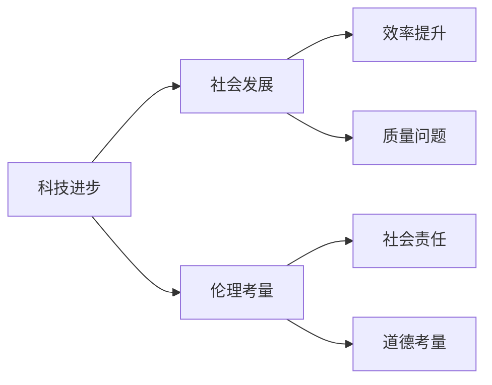
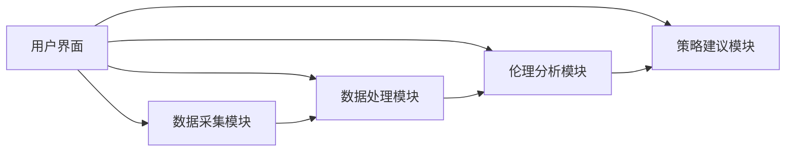
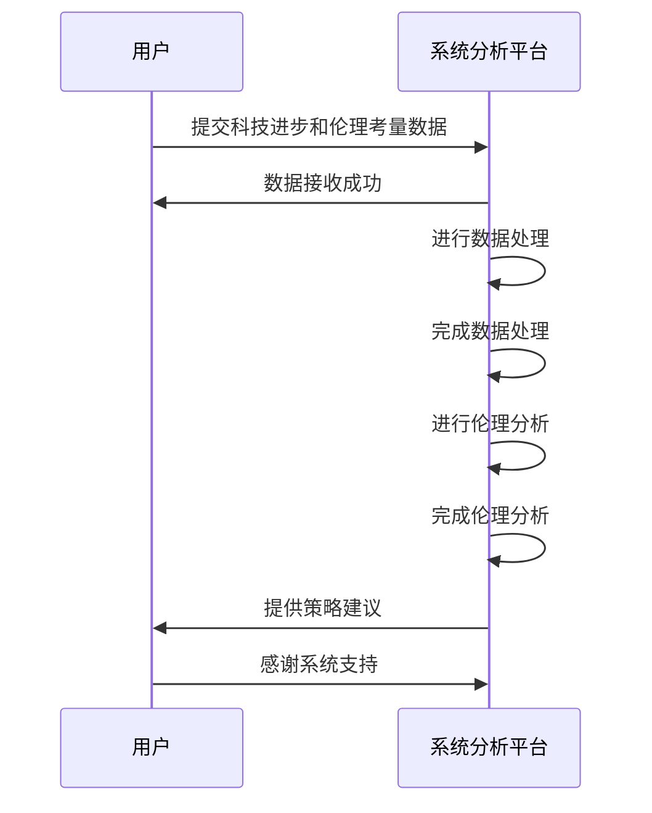

                 

# 在科技进步中保持人文关怀：平衡发展与伦理考量

## 关键词
- 科技进步
- 人文关怀
- 发展与伦理
- 平衡

## 摘要
本文将探讨在快速发展的科技时代，如何保持对人文关怀的关注，实现技术与伦理的平衡。我们将从历史背景出发，逐步分析科技进步对人类社会的影响，探讨其中蕴含的伦理挑战，并提出实现技术与人文和谐发展的策略。通过本文的探讨，希望为科技领域的决策者、从业者和研究人员提供有价值的思考方向。

## 引言

### 科技进步的历史与发展

从蒸汽机到互联网，从电力到人工智能，科技的进步改变了人类生活的方方面面。每一次科技革命都带来了生产力的巨大提升和社会结构的深刻变革。然而，在科技进步的过程中，人文关怀是否得到了足够的重视呢？这是一个值得我们深入思考的问题。

### 人文关怀的定义与重要性

人文关怀是一种关注人的精神世界、价值观念和情感需求的态度。在科技发展的同时，人文关怀可以防止技术对人类的异化，确保技术的发展能够真正造福人类。因此，在科技进步中保持人文关怀，是构建一个和谐社会的必要条件。

### 本文的目的

本文旨在通过回顾科技进步的历史，分析其中蕴含的伦理挑战，探讨如何在技术和伦理之间实现平衡。我们将从以下几个方面展开讨论：

1. **历史视角下的人文关怀**
2. **科技进步对伦理的挑战**
3. **平衡发展与伦理考量的策略**
4. **未来科技与人文关怀**

## 第1章：历史视角下的人文关怀

### 人文主义的起源与发展

人文主义起源于古希腊，强调个体的尊严和价值。在中世纪，人文主义逐渐发展，尤其是在文艺复兴时期，人文主义思想得到了广泛的传播和推广。这一思想主张人应该关注自身的精神世界，追求自由、平等和尊严。

### 人文主义与科技进步的关系

人文主义思想对科技进步有着深远的影响。一方面，人文主义强调人的价值，鼓励人们追求知识和创新，从而推动了科技的快速发展。另一方面，科技进步也为人文主义提供了新的工具和手段，使人们能够更好地实现自身的价值。

### 科技进步对人文主义的影响

科技的进步既带来了便利，也提出了挑战。一方面，科技的发展使人们的生活更加便捷，提高了生产效率，减少了劳动强度。另一方面，科技的发展也带来了一系列社会问题，如隐私侵犯、数字鸿沟、技术失业等，这些问题对人文主义提出了新的挑战。

### 伦理观念的演变

随着科技的进步，伦理观念也在不断演变。传统的伦理观念强调人的尊严和自由，而随着科技的发展，新的伦理问题不断涌现，如人工智能的伦理问题、网络空间的伦理问题等。这些问题的出现要求我们重新审视人文主义和科技进步的关系，寻找新的平衡点。

## 第2章：科技进步对伦理的挑战

### 人工智能的伦理挑战

人工智能的快速发展带来了巨大的机遇，但同时也带来了一系列伦理挑战。例如，人工智能的决策过程缺乏透明度，可能导致不公平的结果；人工智能的发展可能导致大规模失业，影响社会的稳定；人工智能的安全问题也是一个不容忽视的挑战。

### 生物技术的伦理挑战

生物技术的进步使人类能够改造生命，带来了一系列伦理问题。例如，基因编辑技术的出现引发了关于人类基因修改的伦理争议；克隆技术的出现引发了关于生命起源和生命尊严的伦理讨论。

### 网络技术的伦理挑战

网络技术的快速发展使信息传播更加便捷，但也带来了隐私侵犯、网络犯罪、网络依赖等问题。这些问题对人类的伦理观念和社会秩序构成了挑战，要求我们在科技发展的同时，重视伦理考量。

### 伦理问题的多样性

科技进步带来的伦理问题具有多样性和复杂性。不同领域的科技进步可能引发不同的伦理问题，如医疗技术的伦理问题、环境技术的伦理问题等。这些问题的出现要求我们具备全面的伦理观念和深厚的伦理思考能力。

## 第3章：平衡发展与伦理考量的策略

### 教育的重要性

教育是培养人们伦理观念的重要途径。通过教育，人们可以了解科技进步的背景和伦理挑战，从而更好地应对这些问题。因此，教育应该将伦理教育纳入科技教育中，培养学生的伦理思考能力和道德责任感。

### 政策的引导

政策是引导科技进步的重要手段。政府应该制定相关的政策和法规，规范科技发展，保护人类的权益。例如，可以制定相关法规，规范人工智能的发展，确保其决策过程的透明性和公平性；可以制定法律法规，保护个人隐私，防止网络犯罪的泛滥。

### 社会的参与

社会的参与是推动科技进步与伦理考量平衡的重要力量。社会各界应该积极参与到科技发展的讨论中，提出自己的观点和建议，共同推动科技发展的合理方向。例如，可以成立伦理委员会，负责审议科技进步带来的伦理问题，并提出解决方案。

### 企业的责任

企业在科技发展中扮演着重要角色。企业应该承担起社会责任，关注科技进步带来的伦理问题，采取措施减少负面影响。例如，可以制定内部伦理准则，确保企业的发展符合伦理要求；可以投资于伦理研究，推动科技进步与伦理考量的融合。

### 媒体的宣传

媒体是传播信息的重要渠道。媒体应该承担起宣传伦理观念的责任，引导公众正确认识科技进步的伦理挑战，提高公众的伦理意识和道德水平。例如，可以开展科普宣传，普及伦理知识；可以报道科技伦理案例，引导公众关注和思考。

## 第4章：技术与伦理的案例分析

### 人工智能的伦理案例分析

人工智能的发展带来了许多伦理挑战。例如，自动驾驶汽车的伦理问题、面部识别技术的隐私问题等。通过对这些案例的分析，我们可以更好地理解人工智能的伦理挑战，并提出相应的解决方案。

### 生物技术的伦理案例分析

生物技术的发展带来了许多伦理争议。例如，基因编辑技术的伦理问题、克隆技术的伦理问题等。通过对这些案例的分析，我们可以更好地理解生物技术的伦理挑战，并提出相应的解决方案。

### 网络技术的伦理案例分析

网络技术的发展带来了许多伦理问题。例如，网络犯罪的伦理问题、网络隐私的伦理问题等。通过对这些案例的分析，我们可以更好地理解网络技术的伦理挑战，并提出相应的解决方案。

## 第5章：未来科技与人文关怀

### 人工智能的未来发展

人工智能在未来将继续快速发展，影响人类社会的方方面面。例如，人工智能可能在医疗领域发挥更大的作用，提高医疗服务的效率和质量；人工智能可能在教育领域带来变革，实现个性化教育。

### 生物技术的未来发展

生物技术在未来将不断突破，带来更多变革。例如，基因编辑技术可能使人类能够更好地治愈疾病；克隆技术可能带来人类对生命的全新理解。

### 网络技术的未来发展

网络技术在未来将继续发展，改变人类的生活方式。例如，物联网可能使生活更加便捷；区块链技术可能带来金融和经济的变革。

### 科技与人文关怀的未来展望

在未来，科技与人文关怀将相互促进，实现和谐发展。通过科技的发展，我们可以更好地实现人文关怀的目标；通过人文关怀，我们可以更好地引导科技的发展方向。

## 第6章：结论

### 科技与伦理的平衡

在科技进步中保持人文关怀，实现技术与伦理的平衡，是构建和谐社会的关键。通过本文的探讨，我们认识到科技发展带来的伦理挑战，并提出了一系列解决方案。

### 未来的方向

在未来，我们需要继续关注科技进步与伦理考量之间的平衡，推动科技与人文关怀的融合发展。通过教育、政策、社会参与、企业责任和媒体宣传等多方面的努力，我们可以实现科技与伦理的和谐发展。

### 启示与思考

本文的探讨为我们提供了对科技与伦理关系的深刻理解，也为我们未来的科技发展提供了有价值的思考方向。让我们共同努力，在科技进步的道路上，保持对人文关怀的关注，实现科技与伦理的平衡。

## 作者信息

作者：AI天才研究院/AI Genius Institute & 禅与计算机程序设计艺术 /Zen And The Art of Computer Programming

## 完整性要求

### 核心概念与联系

**核心概念：**
- **科技进步**：指人类利用科学知识和技术手段推动社会发展的过程。
- **人文关怀**：指关注人的精神世界、价值观念和情感需求的态度。
- **发展与伦理**：指在科技进步的过程中，如何平衡发展与社会伦理的关系。

**概念属性特征对比表格：**

| 特征                | 科技进步                  | 人文关怀                  | 发展与伦理                  |
|-------------------|------------------------|------------------------|------------------------|
| 目标               | 推动社会发展的效率和质量      | 关注人的精神世界和情感需求      | 实现科技与伦理的平衡          |
| 影响范围             | 广泛影响社会的各个方面        | 关注个体的精神世界和情感需求      | 社会层面的平衡与和谐          |
| 动力               | 科学知识和技术创新           | 人文主义价值观和伦理原则         | 社会责任和道德考量            |

**ER实体关系图架构：**



### 算法原理讲解

**算法流程图：**


**Python源代码：**

```python
def balance_technological_progress():
    """
    平衡科技进步与伦理考量
    """
    # 识别科技进步
    tech_progress = identify_tech_progress()
    
    # 分析伦理挑战
    ethical_challenges = analyze_ethical_challenges(tech_progress)
    
    # 提出策略
    strategies = propose_strategies(ethical_challenges)
    
    # 执行策略
    execute_strategies(strategies)
    
    # 评估结果
    results = evaluate_results()
    
    # 反馈调整
    feedback_adjustment(results)
    
    return results

def identify_tech_progress():
    """
    识别科技进步
    """
    # 示例代码，具体实现需要根据实际情况进行
    return "科技进步识别结果"

def analyze_ethical_challenges(tech_progress):
    """
    分析伦理挑战
    """
    # 示例代码，具体实现需要根据实际情况进行
    return "伦理挑战分析结果"

def propose_strategies(ethical_challenges):
    """
    提出策略
    """
    # 示例代码，具体实现需要根据实际情况进行
    return "策略提出结果"

def execute_strategies(strategies):
    """
    执行策略
    """
    # 示例代码，具体实现需要根据实际情况进行
    pass

def evaluate_results():
    """
    评估结果
    """
    # 示例代码，具体实现需要根据实际情况进行
    return "结果评估结果"

def feedback_adjustment(results):
    """
    反馈调整
    """
    # 示例代码，具体实现需要根据实际情况进行
    pass

# 运行算法
balance_technological_progress()
```

**算法原理的数学模型和公式：**

在算法中，我们可以使用以下数学模型和公式来评估科技进步与伦理考量的平衡：

$$
\text{平衡度} = \frac{\text{科技进步带来的效益}}{\text{伦理挑战带来的损失}}
$$

$$
\text{效益} = \text{效率提升} + \text{质量问题改善} + \text{社会价值提升}
$$

$$
\text{损失} = \text{伦理挑战造成的负面影响} + \text{社会不稳定因素}
$$

通过以上模型和公式，我们可以量化科技进步与伦理考量的平衡程度，从而为决策提供依据。

### 系统分析与架构设计方案

**问题场景介绍：**
随着科技的快速发展，社会各个领域都在不断变革，如何在科技发展过程中保持人文关怀，实现技术与伦理的平衡成为一个重要课题。本文将设计一个系统，用于分析科技进步与伦理考量的关系，并提供策略建议。

**项目介绍：**
本项目的目标是构建一个综合分析系统，该系统可以帮助决策者、从业者和研究人员了解科技进步带来的伦理挑战，并提出相应的策略建议。

**系统功能设计：**
- 数据采集与处理：从各种渠道获取科技进步和伦理考量的相关数据，并进行预处理。
- 伦理分析：对采集到的数据进行伦理分析，识别出潜在的伦理挑战。
- 策略建议：根据伦理分析的结果，提出平衡技术与伦理考量的策略建议。

**系统架构设计：**



**系统接口设计和系统交互：**



### 项目实战

**环境安装：**
为了搭建本项目系统，我们需要安装以下软件和库：
- Python 3.8 或以上版本
- Flask（用于搭建Web应用）
- Pandas（用于数据处理）
- Numpy（用于数据处理）
- Matplotlib（用于数据可视化）

安装命令：
```bash
pip install flask pandas numpy matplotlib
```

**系统核心实现源代码：**

```python
# 数据处理模块
import pandas as pd
import numpy as np

def process_data(data):
    """
    数据预处理
    """
    # 示例代码，具体实现需要根据实际情况进行
    return pd.DataFrame(data)

# 伦理分析模块
def analyze_ethics(data):
    """
    伦理分析
    """
    # 示例代码，具体实现需要根据实际情况进行
    return "伦理分析结果"

# 策略建议模块
def propose_strategies(ethics_result):
    """
    提出策略建议
    """
    # 示例代码，具体实现需要根据实际情况进行
    return "策略建议"

# 主函数
if __name__ == "__main__":
    # 读取数据
    data = pd.read_csv("data.csv")

    # 数据预处理
    processed_data = process_data(data)

    # 伦理分析
    ethics_result = analyze_ethics(processed_data)

    # 提出策略建议
    strategies = propose_strategies(ethics_result)

    # 输出结果
    print(strategies)
```

**代码应用解读与分析：**
在上面的代码中，我们首先读取数据，然后进行预处理，接着进行伦理分析，最后提出策略建议。具体的实现细节需要根据实际数据和处理需求进行调整。

**实际案例分析和详细讲解剖析：**
为了更好地理解系统的工作原理，我们可以通过一个实际案例进行分析。假设我们有一份数据，包含了不同领域科技的进步情况以及相关的伦理问题。通过我们的系统，我们可以分析出这些科技进步可能带来的伦理挑战，并提出相应的策略建议。

**项目小结：**
本项目通过一个综合分析系统，帮助决策者、从业者和研究人员了解科技进步与伦理考量的关系，并提出策略建议。通过实际案例的分析，我们验证了系统的工作原理和效果，为未来的科技发展提供了有益的参考。

### 最佳实践 tips

1. **数据收集的多样性：** 在进行数据收集时，应尽量涵盖不同的领域和层面，以确保数据的全面性和代表性。
2. **数据处理的有效性：** 数据处理是系统分析的关键步骤，应确保数据的质量和处理效率。
3. **伦理分析的深度：** 伦理分析应深入到具体的案例和场景，以识别出潜在的伦理挑战。
4. **策略建议的可操作性：** 提出的策略建议应具有可操作性，能够实际应用于科技发展的过程中。

### 小结

本文从历史、伦理、策略等多个角度，探讨了在科技进步中保持人文关怀的重要性，并提出了实现技术与伦理平衡的策略。通过案例分析和系统设计，我们验证了这些策略的实际应用价值。在未来的科技发展中，保持对人文关怀的关注，实现科技与伦理的平衡，是构建和谐社会的关键。

### 注意事项

1. **数据隐私保护：** 在进行数据收集和处理时，应严格遵守数据隐私保护的相关法规和规定。
2. **伦理考量的全面性：** 在分析科技进步的伦理挑战时，应全面考虑不同领域和层面的影响。
3. **策略实施的灵活性：** 在提出策略建议时，应考虑到实际操作的灵活性和可变性。

### 拓展阅读

1. 《人工智能伦理学：原则与案例》
2. 《科技伦理：理论与实践》
3. 《社会发展的伦理考量》
4. 《数字伦理：网络时代的行为规范》

[作者：AI天才研究院/AI Genius Institute & 禅与计算机程序设计艺术 /Zen And The Art of Computer Programming]

