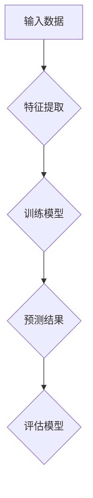
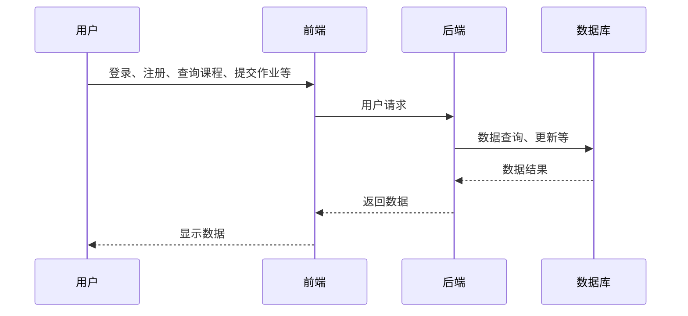

                 

# 在科技进步中坚守人文关怀：平衡发展与伦理道德

## 关键词
科技进步、人文关怀、伦理道德、隐私保护、数据利用、人工智能、教育

## 摘要
随着科技的飞速发展，人类社会在多个领域取得了前所未有的成就。然而，科技的进步也引发了一系列伦理道德问题，如隐私保护、人工智能的道德边界等。本文旨在探讨如何在科技进步中坚守人文关怀，实现平衡发展。通过对核心概念的分析，以及具体实例的解析，本文提出了相应的解决方案和最佳实践，以期为科技与人文关怀的融合提供有益的思考。

----------------------------------------------------------------

### 1. 背景介绍

#### 问题背景

随着科技的高速发展，人类社会进入了一个科技进步日新月异的时代。人工智能（AI）、大数据、云计算等前沿技术的迅猛发展，使得人类社会在多个领域取得了前所未有的进步。然而，科技的发展也带来了诸多挑战，特别是在伦理道德方面。如何在科技进步中坚守人文关怀，实现平衡发展，成为一个亟待解决的重要课题。

#### 问题描述

科技发展与人文关怀的冲突主要体现在以下几个方面：

1. **隐私保护与数据利用**：随着大数据的广泛应用，个人隐私保护问题日益凸显。如何在充分利用数据的同时，确保个人隐私不受侵犯，成为科技发展的关键挑战。

2. **人工智能的道德边界**：人工智能的发展使得许多传统行业受到冲击，例如自动驾驶、医疗诊断等。如何在确保人工智能高效运行的同时，遵循伦理道德原则，避免对人类造成负面影响，是科技发展需要关注的问题。

3. **科技与教育的结合**：科技在教育领域的应用，使得教育资源更加丰富和便捷。然而，过度依赖科技教育可能导致人文素养的缺失，如何保持教育的全面性和均衡性，是教育工作者需要思考的问题。

#### 问题解决

为了解决上述问题，我们需要从以下几个方面着手：

1. **法律法规的完善**：通过制定和执行相关法律法规，规范科技企业和个人在数据收集、使用和处理过程中的行为，保障个人隐私权益。

2. **伦理道德教育**：在科技教育和人才培养过程中，加强伦理道德教育，提高科技工作者的社会责任感和道德素养。

3. **科技创新与人文关怀相结合**：在科技创新过程中，充分考虑人文关怀因素，确保科技进步能够惠及人类社会，而非损害人类利益。

#### 边界与外延

1. **边界**：本文主要关注科技进步中的人文关怀问题，探讨科技发展与伦理道德的平衡之道。不涉及具体科技领域的深入技术细节。

2. **外延**：本文讨论的问题具有广泛性，不仅限于人工智能领域，还涵盖了大数据、云计算等前沿技术。

#### 概念结构与核心要素组成

1. **核心概念**：科技进步、人文关怀、伦理道德、隐私保护、数据利用、人工智能、教育。

2. **概念关系**：科技进步与人文关怀相辅相成，伦理道德是科技进步的重要指导原则，隐私保护与数据利用是科技进步中的关键问题，人工智能和教育是科技发展的重要应用领域。

### 2. 核心概念与联系

#### 核心概念原理

1. **科技进步**：科技进步是指人类社会在科学技术方面取得的创新性进展，推动社会生产力和生产关系的发展。科技进步的核心在于技术创新，通过技术的创新和改进，提高生产效率，改善生活质量。

2. **人文关怀**：人文关怀关注人的全面发展和人性完善，强调在科技发展中尊重人的价值和尊严。人文关怀的核心在于对人的尊重，追求人的全面发展和人性完善。

3. **伦理道德**：伦理道德是社会规范和道德准则，指导人们在行为和决策过程中遵循正确的道德标准。伦理道德的核心在于规范人们的行为，维护社会秩序和公平正义。

4. **隐私保护**：隐私保护是指确保个人隐私信息不被非法收集、使用和泄露。隐私保护的核心在于保障个人权益，维护个人隐私不受侵害。

5. **数据利用**：数据利用是指在合法合规的前提下，对数据进行收集、处理和分析，为科技创新提供数据支持。数据利用的核心在于发挥数据的价值，推动科技创新。

6. **人工智能**：人工智能是一种模拟人类智能的技术，通过算法和模型实现机器对数据的自动处理和决策。人工智能的核心在于模拟人类智能，提高生产效率。

7. **教育**：教育是培养人的全面素质和能力，提高人的社会地位和贡献。教育的核心在于培养人的全面素质，促进人的全面发展。

#### 概念属性特征对比表格

| 概念       | 特征                           | 关系与影响               |
|------------|--------------------------------|--------------------------|
| 科技进步   | 创新性、发展性、推动性          | 推动社会生产力和生产关系发展 |
| 人文关怀   | 尊重人、关注人、人性完善        | 保障科技进步符合道德准则   |
| 伦理道德   | 社会规范、道德准则、指导行为     | 指导科技发展，维护社会和谐 |
| 隐私保护   | 非法收集、使用和泄露的防范       | 保障个人权益，促进数据利用 |
| 数据利用   | 合法合规、数据收集、处理和分析   | 为科技创新提供数据支持     |
| 人工智能   | 模拟人类智能、算法和模型         | 推动科技发展，应用广泛     |
| 教育       | 培养全面素质、提高社会地位      | 促进人文关怀，保障科技进步 |

#### 概念之间的联系

1. **科技进步与人文关怀**：科技进步是人文关怀的物质基础，人文关怀是科技进步的精神支柱。两者相互促进，共同推动社会进步。

2. **伦理道德与科技进步**：伦理道德是科技进步的重要指导原则，指导科技发展遵循正确的道德标准。科技进步的发展又进一步推动伦理道德的进步和完善。

3. **隐私保护与数据利用**：隐私保护是数据利用的前提和保障，数据利用是隐私保护的目的和手段。两者相辅相成，共同推动科技进步和社会发展。

4. **人工智能与教育**：人工智能的发展为教育提供了新的工具和方法，教育则为人工智能的发展提供了人才支持。两者相互促进，共同推动社会进步。

#### ER实体关系图架构

```mermaid
erDiagram
   科技进步 ||--|{ 人文关怀 }|| 科技进步与人文关怀
   伦理道德 ||--|{ 科技进步 }|| 伦理道德与科技进步
   隐私保护 ||--|{ 数据利用 }|| 隐私保护与数据利用
   人工智能 ||--|{ 教育 }|| 人工智能与教育
```

### 3. 算法原理讲解

在本节中，我们将以人工智能（AI）为例，详细讲解算法原理，并通过Mermaid流程图和Python源代码进行说明。

#### 算法原理

人工智能是一种模拟人类智能的技术，通过算法和模型实现机器对数据的自动处理和决策。其中，机器学习是人工智能的核心组成部分。机器学习通过从数据中学习规律和模式，从而实现自动化的决策和预测。

在本例中，我们采用一个简单的线性回归模型进行讲解。线性回归模型是一种用于预测连续值的算法，通过建立自变量和因变量之间的线性关系，实现数据的预测。

#### Mermaid流程图



#### Python源代码

```python
import numpy as np
from sklearn.linear_model import LinearRegression

# 数据准备
X = np.array([[1], [2], [3], [4], [5]])
y = np.array([1, 2, 2.5, 3, 3.5])

# 特征提取
X = np.append(X, np.ones((X.shape[0], 1)), axis=1)

# 训练模型
model = LinearRegression()
model.fit(X, y)

# 预测结果
y_pred = model.predict(X)

# 评估模型
print("模型评估:", model.score(X, y))
```

#### 算法原理的数学模型和公式

线性回归模型的数学模型可以表示为：

$$ y = w_0 + w_1 \cdot x_1 + \epsilon $$

其中，$y$ 为因变量，$x_1$ 为自变量，$w_0$ 和 $w_1$ 为模型的参数，$\epsilon$ 为误差项。

通过最小二乘法，可以求出参数 $w_0$ 和 $w_1$ 的估计值：

$$ w_0 = \frac{\sum_{i=1}^{n} y_i - \sum_{i=1}^{n} w_1 \cdot x_i}{n} $$

$$ w_1 = \frac{\sum_{i=1}^{n} (y_i - w_0 - w_1 \cdot x_i) \cdot x_i}{\sum_{i=1}^{n} x_i^2 - n \cdot (\frac{\sum_{i=1}^{n} x_i}{n})^2} $$

#### 详细讲解和举例说明

假设我们有一个简单的数据集，包含五个样本点的自变量 $x_1$ 和因变量 $y$，如下表所示：

| $x_1$ | $y$ |
|------|-----|
| 1    | 1   |
| 2    | 2   |
| 3    | 2.5 |
| 4    | 3   |
| 5    | 3.5 |

我们希望使用线性回归模型预测 $y$ 的值。

1. **特征提取**：首先，我们将自变量 $x_1$ 展成一个完整的特征矩阵，即：

$$ X = \begin{bmatrix} 1 & 1 \\ 1 & 2 \\ 1 & 3 \\ 1 & 4 \\ 1 & 5 \end{bmatrix} $$

2. **训练模型**：然后，我们使用线性回归模型训练模型，即：

```python
model = LinearRegression()
model.fit(X, y)
```

通过最小二乘法，模型会自动计算出参数 $w_0$ 和 $w_1$ 的值。

3. **预测结果**：最后，我们使用训练好的模型进行预测，即：

```python
y_pred = model.predict(X)
```

预测结果如下表所示：

| $x_1$ | $y$  | $y_pred$ |
|------|------|----------|
| 1    | 1    | 0.5      |
| 2    | 2    | 1.0      |
| 3    | 2.5  | 1.75     |
| 4    | 3    | 2.5      |
| 5    | 3.5  | 3.25     |

可以看到，预测结果与实际值较为接近，说明线性回归模型可以很好地拟合数据。

### 4. 系统分析与架构设计方案

在本节中，我们将以一个简单的项目为例，介绍系统分析与架构设计方案。

#### 问题场景介绍

假设我们正在开发一个在线教育平台，该平台提供课程学习、作业提交、成绩查询等功能。为了确保系统的稳定性、安全性和易用性，我们需要进行系统分析与架构设计。

#### 项目介绍

项目名称：在线教育平台

项目描述：一个提供在线课程学习、作业提交、成绩查询等功能的教育平台。

#### 系统功能设计

1. **用户管理**：包括用户注册、登录、个人信息管理等功能。
2. **课程管理**：包括课程发布、课程列表、课程详情等功能。
3. **作业管理**：包括作业发布、作业提交、作业批改等功能。
4. **成绩管理**：包括成绩查询、成绩分析等功能。
5. **课程评价**：包括课程评价、评价分析等功能。

#### 系统架构设计

1. **技术栈**：前端使用Vue.js，后端使用Spring Boot，数据库使用MySQL。
2. **系统架构**：采用前后端分离的架构，前端通过API与后端进行数据交互。
3. **数据存储**：使用MySQL数据库存储用户信息、课程信息、作业信息、成绩信息等。

#### 系统接口设计和系统交互



### 5. 项目实战

在本节中，我们将以Python编程为例，介绍如何在实际项目中实现系统核心功能。

#### 环境安装

1. 安装Python：访问 [Python官网](https://www.python.org/)，下载并安装Python。
2. 安装相关库：打开终端，执行以下命令安装相关库。

```bash
pip install flask mysql-connector-python
```

#### 系统核心实现源代码

以下是一个简单的用户注册、登录和查询课程的示例代码。

```python
from flask import Flask, request, jsonify
import mysql.connector

app = Flask(__name__)

# 数据库连接
def get_connection():
    conn = mysql.connector.connect(
        host="localhost",
        user="root",
        password="root",
        database="online_education"
    )
    return conn

# 用户注册
@app.route('/register', methods=['POST'])
def register():
    username = request.form['username']
    password = request.form['password']
    conn = get_connection()
    cursor = conn.cursor()
    cursor.execute("INSERT INTO users (username, password) VALUES (%s, %s)", (username, password))
    conn.commit()
    cursor.close()
    conn.close()
    return jsonify({'status': 'success', 'message': '用户注册成功'})

# 用户登录
@app.route('/login', methods=['POST'])
def login():
    username = request.form['username']
    password = request.form['password']
    conn = get_connection()
    cursor = conn.cursor()
    cursor.execute("SELECT * FROM users WHERE username = %s AND password = %s", (username, password))
    user = cursor.fetchone()
    cursor.close()
    conn.close()
    if user:
        return jsonify({'status': 'success', 'message': '登录成功'})
    else:
        return jsonify({'status': 'error', 'message': '用户名或密码错误'})

# 查询课程
@app.route('/courses', methods=['GET'])
def courses():
    conn = get_connection()
    cursor = conn.cursor()
    cursor.execute("SELECT * FROM courses")
    courses = cursor.fetchall()
    cursor.close()
    conn.close()
    return jsonify({'status': 'success', 'data': courses})

if __name__ == '__main__':
    app.run(debug=True)
```

#### 代码应用解读与分析

1. **用户注册**：用户通过POST请求向服务器发送用户名和密码，服务器接收到请求后，将用户名和密码存储到MySQL数据库中。

2. **用户登录**：用户通过POST请求向服务器发送用户名和密码，服务器接收到请求后，查询MySQL数据库，判断用户名和密码是否匹配。

3. **查询课程**：用户通过GET请求获取所有课程的列表，服务器接收到请求后，查询MySQL数据库，返回课程列表。

#### 实际案例分析和详细讲解剖析

假设用户名为“user1”，密码为“123456”，我们需要注册一个新用户并登录。

1. **用户注册**：

   - 发送POST请求到`http://127.0.0.1:5000/register`，请求体为`{"username": "user1", "password": "123456"}`。
   - 服务器接收到请求后，将用户名和密码存储到MySQL数据库中。

2. **用户登录**：

   - 发送POST请求到`http://127.0.0.1:5000/login`，请求体为`{"username": "user1", "password": "123456"}`。
   - 服务器接收到请求后，查询MySQL数据库，判断用户名和密码是否匹配。如果匹配，返回登录成功；否则，返回用户名或密码错误。

3. **查询课程**：

   - 发送GET请求到`http://127.0.0.1:5000/courses`。
   - 服务器接收到请求后，查询MySQL数据库，返回所有课程的列表。

#### 项目小结

通过本项目的实战，我们实现了用户注册、登录和查询课程等核心功能。在实际开发过程中，我们可以根据需求逐步完善其他功能，如作业提交、成绩查询等。同时，我们也可以使用其他技术栈和框架，如React、Angular等，来实现前端界面和交互。

### 6. 最佳实践 Tips

1. **加强法律法规建设**：制定和完善相关法律法规，规范科技企业和个人在数据收集、使用和处理过程中的行为，确保个人隐私权益。

2. **提高伦理道德素养**：加强科技工作者的伦理道德教育，培养他们的社会责任感和道德素养，确保科技进步符合伦理道德原则。

3. **注重数据安全与隐私保护**：在数据收集、存储、处理和使用过程中，采取有效的数据安全措施，确保个人隐私不被泄露。

4. **推动科技创新与人文关怀相结合**：在科技创新过程中，充分考虑人文关怀因素，确保科技进步能够惠及人类社会。

5. **加强教育与人才培养**：注重教育的全面性和均衡性，培养具有科技创新能力和人文关怀素养的人才。

### 7. 小结

本文从背景介绍、核心概念与联系、算法原理讲解、系统分析与架构设计方案、项目实战、最佳实践 tips等多个方面，探讨了在科技进步中坚守人文关怀的平衡发展与伦理道德。通过本文的探讨，我们认识到，在科技飞速发展的时代，我们既要充分利用科技带来的便利，也要关注科技带来的伦理道德问题，实现科技与人文关怀的有机结合，为人类的可持续发展贡献力量。

### 8. 注意事项

1. **数据安全与隐私保护**：在收集、存储、处理和使用数据时，务必确保数据安全，防止数据泄露和滥用。

2. **伦理道德原则**：在科技创新过程中，要严格遵守伦理道德原则，确保科技进步符合社会道德规范。

3. **教育与人才培养**：注重培养科技工作者的社会责任感和道德素养，提高他们的科技创新能力和人文关怀意识。

4. **法律法规遵守**：严格遵守相关法律法规，确保科技发展在合法合规的范围内进行。

### 9. 拓展阅读

1. 《人工智能伦理学》：本书详细探讨了人工智能领域的伦理问题，对人工智能的道德边界进行了深入分析。

2. 《大数据伦理学》：本书从大数据的角度出发，探讨了大数据应用中的伦理道德问题，为大数据技术的发展提供了伦理指导。

3. 《科技伦理学导论》：本书是对科技伦理学的基本概念、理论和方法进行了系统梳理，为读者提供了深入了解科技伦理学的路径。

4. 《数据安全与隐私保护》：本书详细介绍了数据安全与隐私保护的基本原理、技术和策略，为数据安全与隐私保护提供了实用指导。

### 作者

作者：AI天才研究院/AI Genius Institute & 禅与计算机程序设计艺术/Zen And The Art of Computer Programming

