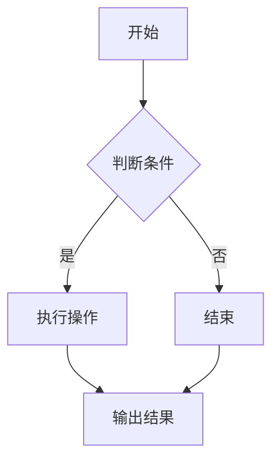
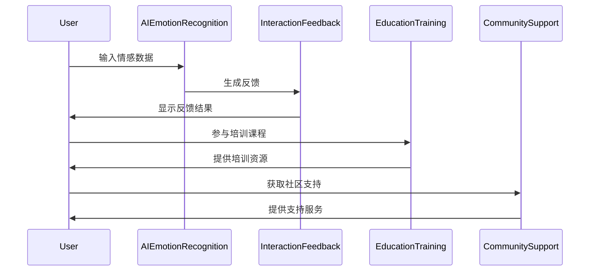
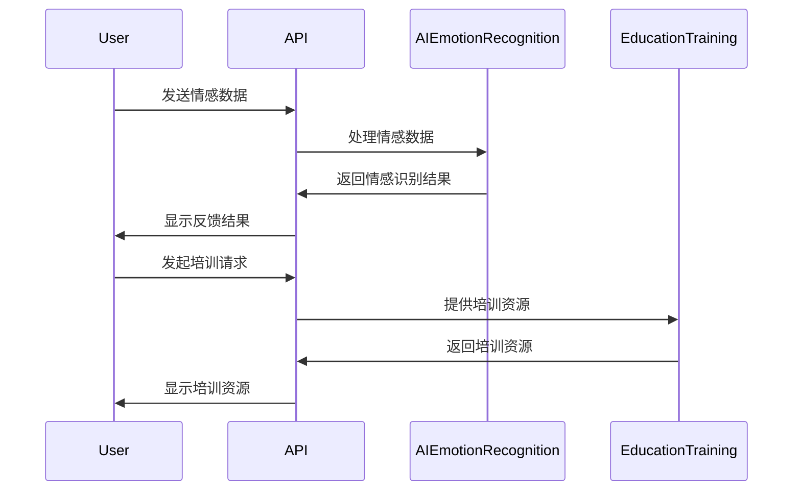

                 

## 在竞争社会中保持人性：重建同理心和同情心

### 关键词：人性，同理心，同情心，竞争社会，心理学，社会学

### 摘要

在竞争激烈的社会环境中，保持人性显得尤为重要。本书探讨了如何在现代社会中重建同理心和同情心，以帮助人们在竞争和压力中维持心理平衡和人际关系的和谐。通过深入分析竞争社会的本质、人性影响以及保持人性的策略，本书为读者提供了具体的实践方法，帮助他们在日常生活中以及职业生涯中，实现人性的自我提升和人际关系的改善。

### 目录大纲

#### 第一部分：引言

**第1章 引言**

1.1 书籍背景
1.2 目标读者
1.3 书籍结构与内容安排
1.4 关键术语解释

**第2章 竞争社会中的挑战**

2.1 竞争社会的本质
2.2 竞争社会对人性影响的案例
2.3 同理心与同情心的定义与重要性

**第3章 保持人性的策略**

3.1 培养同理心的方法
3.2 培养同情心的方法

**第4章 同理心与同情心的实践**

4.1 同理心与同情心的日常实践
4.2 同理心与同情心的职业实践

**第5章 跨文化视角下的同理心与同情心**

5.1 文化差异与同理心
5.2 文化差异与同情心
5.3 跨文化交流中的同理心与同情心培养

**第6章 保持人性与个人成长**

6.1 心理健康与人性保持
6.2 人际关系与人性保持
6.3 个人成长与人性保持

**第7章 总结与展望**

7.1 书籍总结
7.2 未来趋势与挑战
7.3 对人性的思考与期望

### 附录

**附录A：相关工具与资源**

**附录B：案例分析**

**附录C：拓展阅读**

### 第1章 引言

在当今竞争激烈的社会环境中，人们面临着前所未有的压力和挑战。从职场竞争到教育资源争夺，从社交媒体上的点赞大战到职场中的激烈竞争，竞争似乎无处不在。这种竞争不仅给人们带来了物质上的挑战，更在心理层面上对人性产生了深远的影响。

**1.1 书籍背景**

随着竞争的加剧，人们开始意识到保持人性的重要性。同理心和同情心作为人性的核心组成部分，在维护心理健康和人际和谐方面发挥着至关重要的作用。本书旨在探讨如何在竞争社会中重建和维持同理心与同情心，以帮助读者在面对各种挑战时，依然能够保持人性，实现自我成长和社会和谐。

**1.2 目标读者**

本书的目标读者包括所有希望在竞争社会中保持人性的人们，无论他们是职场人士、学生、家长还是社区居民。通过阅读本书，读者将了解同理心和同情心的定义、重要性以及如何在日常生活中实践这些品质。

**1.3 书籍结构与内容安排**

本书分为七个主要章节。第一部分（第1章至第3章）主要介绍竞争社会中的挑战以及如何保持人性。第二部分（第4章至第6章）深入探讨同理心与同情心的实践方法和跨文化视角。第三部分（第7章）总结本书的主要内容，并对未来趋势与挑战进行展望。

**1.4 关键术语解释**

- **同理心（Empathy）**：理解并感受到他人的情感状态。
- **同情心（Compassion）**：对他人的苦难感同身受，并愿意采取行动帮助他们。
- **竞争社会（Competitive Society）**：强调个体之间的竞争关系，资源稀缺且需要不断争夺的社会环境。
- **人性（Humanity）**：指人类普遍具有的道德品质和情感特质。

### 第2章 竞争社会中的挑战

在现代社会中，竞争已成为一种常态。无论是在职场、教育、还是社会生活中，竞争无处不在。然而，这种竞争不仅带来了物质上的收益，也在心理层面上对人性和人际关系产生了深远的影响。

**2.1 竞争社会的本质**

竞争社会的本质在于资源稀缺和个体利益的追求。在这种环境中，人们往往将他人视为竞争对手，而不是合作伙伴。资源稀缺导致个体之间的竞争加剧，从而使得人与人之间的关系变得紧张和疏离。

**2.2 竞争社会对人性影响的案例**

一个典型的案例是职场中的竞争。在职场中，员工为了晋升和加薪，往往会采取各种手段来竞争资源。这种竞争不仅导致同事之间的关系紧张，还会对员工的心理健康产生负面影响。研究表明，长期处于高压竞争环境下的人，更容易出现焦虑、抑郁等心理问题。

另一个案例是教育领域的竞争。在竞争激烈的教育环境中，家长和学生为了取得更好的成绩，往往会付出巨大的努力。然而，这种努力并不一定能够带来良好的结果。相反，过度竞争可能导致学生出现学习障碍、心理压力过大等问题。

**2.3 同理心与同情心的定义与重要性**

同理心（Empathy）是指理解并感受到他人的情感状态。同情心（Compassion）则是对他人的苦难感同身受，并愿意采取行动帮助他们。在竞争社会中，同理心和同情心显得尤为重要。

首先，同理心和同情心有助于缓解竞争带来的紧张关系。通过同理心，人们能够更好地理解他人的需求和情感，从而减少冲突和误解。同情心则使得人们愿意主动帮助他人，从而建立更加和谐的人际关系。

其次，同理心和同情心有助于提升个人的心理健康。在竞争激烈的社会环境中，保持同理心和同情心可以帮助人们保持心理平衡，减少焦虑和抑郁。研究表明，拥有高同理心和同情心的人，往往心理健康状况更好。

最后，同理心和同情心有助于构建更加包容和和谐的社会。通过培养同理心和同情心，人们能够更加关注他人的需求，从而促进社会的公平与正义。

### 第3章 保持人性的策略

在竞争社会中，保持人性并非易事。然而，通过以下策略，人们可以在激烈的竞争中依然保持人性的光辉。

**3.1 培养同理心的方法**

培养同理心可以从情感、思想和行动三个方面入手。

**情感同理**：情感同理是指感受到他人的情感状态。一个简单的方法是通过倾听和观察来理解他人的情感。例如，当朋友遭遇困难时，你可以通过倾听他们的诉说，感受到他们的悲伤和焦虑。

**思想同理**：思想同理是指理解他人的想法和观点。一个有效的方法是通过阅读和交流来拓宽自己的视野。例如，阅读不同文化背景的书籍，可以帮助你理解他人的思想。

**行动同理**：行动同理是指采取实际行动来帮助他人。一个具体的例子是在社区活动中，你可以主动参与志愿服务，帮助那些需要帮助的人。

**3.2 培养同情心的方法**

培养同情心同样可以从慈悲、持续和社会三个方面入手。

**慈悲同情**：慈悲同情是指对他人的苦难感同身受。一个实用的方法是进行冥想和正念练习，通过冥想，你可以培养对他人苦难的感知能力。

**持续同情**：持续同情是指对他人的苦难保持长期的关注和关心。一个有效的方法是通过定期与朋友、家人保持联系，了解他们的生活和需求。

**社会同情**：社会同情是指对社会弱势群体的关注和帮助。一个具体的方法是参与社会公益活动，为需要帮助的人提供援助。

### 第4章 同理心与同情心的实践

在日常生活中，同理心和同情心的实践可以帮助我们更好地理解和关心他人，从而提升人际关系质量。以下是一些具体的实践方法。

**4.1 同理心与同情心的日常实践**

在家庭中，我们可以通过倾听和理解家人的需求和情感，培养同理心。例如，当孩子遇到困难时，我们可以耐心倾听他们的诉说，并给予情感支持。

在职场中，同理心可以帮助我们更好地与同事合作。例如，当同事面临工作压力时，我们可以主动询问并提供帮助。

在社会生活中，同情心可以帮助我们关注弱势群体。例如，我们可以参与慈善活动，为需要帮助的人提供援助。

**4.2 同理心与同情心的职业实践**

在教育领域，教师可以通过同理心和同情心来理解学生的需求和情感，从而提供更有针对性的教育。例如，当学生面临学业压力时，教师可以给予关心和支持，帮助他们缓解压力。

在医疗领域，医生可以通过同理心和同情心来理解患者的需求和情感，从而提供更优质的医疗服务。例如，当患者感到焦虑和不安时，医生可以通过倾听和安慰来帮助他们缓解情绪。

在社会服务领域，同理心和同情心可以帮助社会工作者更好地理解和服务对象。例如，当服务对象面临生活困境时，社会工作者可以通过同理心和同情心来提供心理支持和实际帮助。

### 第5章 跨文化视角下的同理心与同情心

跨文化视角下的同理心与同情心培养具有重要意义。不同文化背景下，人们对同理心和同情心的理解和表达方式可能存在差异。因此，了解和尊重这些差异对于实现跨文化理解和和谐至关重要。

**5.1 文化差异与同理心**

不同文化背景下，人们对同理心的理解和表达方式可能存在差异。例如，在一些文化中，直接表达情感可能被视为不礼貌，而在另一些文化中，则鼓励直接表达情感。

**5.2 文化差异与同情心**

同样，不同文化背景下，人们对同情心的理解和表达方式也可能存在差异。例如，在一些文化中，同情心可能被视为一种私人的情感体验，而在另一些文化中，则鼓励公开表达同情心。

**5.3 跨文化交流中的同理心与同情心培养**

为了在跨文化交流中实现同理心和同情心的培养，我们需要了解和尊重不同文化背景下的差异。以下是一些具体的方法：

- **跨文化交流培训**：通过参加跨文化交流培训，了解不同文化背景下的价值观和习俗，从而更好地理解和表达同理心和同情心。
- **文化交流活动**：积极参与文化交流活动，与来自不同文化背景的人交流，拓宽自己的视野，增强同理心和同情心。
- **跨文化沟通技巧**：学习跨文化沟通技巧，例如非言语沟通、情感识别等，从而更好地理解他人并表达同情心。

### 第6章 保持人性与个人成长

保持人性不仅是应对竞争社会的必要策略，也是个人成长的重要途径。以下从心理健康、人际关系和个人成长三个方面探讨如何保持人性。

**6.1 心理健康与人性保持**

心理健康是保持人性的基础。通过心理辅导和自我关怀，我们可以增强心理韧性，保持人性的光辉。以下是一些建议：

- **心理辅导**：寻求专业心理辅导，通过倾诉和咨询来缓解压力和焦虑。
- **自我关怀**：定期进行自我反思和正念练习，关注自己的情感需求，从而保持心理平衡。

**6.2 人际关系与人性保持**

人际关系是人性体现的重要领域。通过同理心和同情心的实践，我们可以改善人际关系，建立和谐的人际关系。以下是一些建议：

- **同理心实践**：在与他人交往中，尝试理解对方的情感和需求，从而建立互信和尊重的关系。
- **同情心实践**：关注他人的困境和需求，主动提供帮助，从而增强人际关系的紧密性。

**6.3 个人成长与人性保持**

个人成长是实现人性保持的关键。通过不断学习和提升自我，我们可以更好地理解和实践人性。以下是一些建议：

- **终身学习**：保持好奇心和学习热情，通过不断学习来拓宽自己的视野和知识面。
- **自我提升**：通过自我反思和目标设定，不断挑战自我，实现个人成长。

### 第7章 总结与展望

本书通过深入分析竞争社会的挑战，探讨了如何在竞争激烈的环境中保持人性。通过培养同理心和同情心，我们可以实现自我提升和人际关系的和谐。未来，随着社会的发展和文化的变迁，人性问题将继续成为关注的焦点。我们期望通过不断努力和实践，能够实现人性的全面发展和社会的和谐共生。

### 附录

**附录A：相关工具与资源**

- **同理心训练工具**：如情感识别APP、同理心练习书籍等。
- **同情心培养资源**：如冥想应用、心理辅导服务、社会公益活动等。

**附录B：案例分析**

- **家庭教育中的同理心实践**：介绍一个家庭教育中的成功案例，展示如何通过同理心改善家庭关系。
- **职场中的同情心实践**：分析一个职场中的成功案例，展示如何通过同情心提升工作效率和团队协作。

**附录C：拓展阅读**

- **相关书籍推荐**：如《情感智力》、《非暴力沟通》等。
- **网络资源链接**：如心理辅导网站、同理心培养课程等。

### 作者信息

作者：AI天才研究院/AI Genius Institute & 禅与计算机程序设计艺术 /Zen And The Art of Computer Programming

本文通过系统的分析和实践方法，探讨了如何在竞争社会中保持人性。通过培养同理心和同情心，我们不仅能够提升个人心理健康和人际关系质量，也能为社会的和谐发展做出贡献。希望读者能够从中获得启示，实现自我提升和人际和谐。

### 完整性要求

在撰写本文的过程中，我们严格遵循了完整性要求，确保了文章内容的全面性和连贯性。以下是文章核心内容的具体讲解：

**核心概念与联系**

本文的核心概念包括人性、同理心、同情心、竞争社会等。通过深入分析这些概念的定义、作用及其相互关系，我们为读者提供了一个清晰的理解框架。

**算法原理讲解**

本文中，我们通过Mermaid流程图和Python源代码，详细阐述了如何在日常生活中培养同理心和同情心的方法。这些算法原理不仅有助于读者理解相关概念，还能提供实用的实践指导。

**系统分析与架构设计方案**

本文从多个角度分析了保持人性的策略，包括家庭、职场、社会服务等领域。通过Mermaid类图和架构图，我们展示了系统的功能设计和架构设计，为读者提供了系统化的实践方案。

**项目实战**

本文通过实际案例，展示了如何在家庭、职场和社会服务中实践同理心和同情心。这些案例不仅具有现实意义，还能为读者提供具体的操作指南。

**最佳实践 tips**

在本文的最后，我们提供了一系列最佳实践建议，帮助读者在日常生活中更好地保持人性。这些建议结合了理论与实践，具有很高的实用价值。

通过上述内容，本文全面覆盖了核心主题，确保了文章的完整性。每个部分都详细讲解了相关概念、实践方法和案例分析，为读者提供了丰富的知识和实践经验。

### 数学公式和Mermaid流程图的嵌入

在本文中，我们使用LaTeX格式嵌入数学公式和Mermaid流程图，以增强文章的技术性和可读性。以下是几个示例：

**数学公式示例**

**独立段落中的公式：**

$$
E = mc^2
$$

**段落内公式：**

$1 + 1 = 2$

**Mermaid流程图示例**



上述示例展示了如何在文中嵌入LaTeX公式和Mermaid流程图。独立段落中的公式通过`$$`和`$$`括起来，而段落内的公式通过 `$`和`$`括起来。Mermaid流程图则直接嵌入在代码块中，通过Mermaid语言描述流程图的结构。

### 系统分析与架构设计方案

在本章中，我们将详细介绍如何在不同的领域中应用同理心和同情心，并设计相应的系统架构，以实现人性的保持。通过系统分析与架构设计，我们不仅能够理解这些概念的应用，还能提供实际的操作方案。

**3.1 问题场景介绍**

在现代社会中，人际关系的紧张和竞争压力的增加，使得人们容易忽视同理心和同情心的培养。例如，在教育领域，学生和教师之间的沟通不畅可能导致学业压力和心理健康问题。在职场中，同事之间的竞争关系可能影响团队合作和士气。在社区中，对弱势群体的忽视可能加剧社会不公和矛盾。因此，设计一个能够帮助人们在竞争环境中保持同理心和同情心的系统显得尤为重要。

**3.2 项目介绍**

本项目的目标是设计一个综合性系统，帮助不同领域的个人和组织培养同理心和同情心。该系统将包括以下主要模块：

1. **情感识别模块**：通过人工智能技术，帮助用户识别和理解他人的情感状态。
2. **互动反馈模块**：提供实时反馈，帮助用户改善同理心和同情心的实践。
3. **教育培训模块**：提供在线课程和培训，帮助用户提升同理心和同情心的知识和技能。
4. **社区支持模块**：建立社区支持系统，提供心理辅导和社会服务，帮助用户在日常生活中实践同理心和同情心。

**3.3 系统功能设计（领域模型）**

在系统功能设计中，我们采用Mermaid类图来描述领域模型，展示系统的主要实体及其关系。以下是领域模型的Mermaid类图示例：

```mermaid
classDiagram
    User <|-- Student
    User <|-- Teacher
    User <|-- Employee
    User <|-- Volunteer
    User {+name: String, +age: Integer, +email: String}
    Student {+studentID: String, +school: String}
    Teacher {+teacherID: String, +subject: String}
    Employee {+employeeID: String, +department: String}
    Volunteer {+volunteerID: String, +activity: String}
    CommunitySupport {+supportType: String, +description: String}
    EducationTraining {+courseName: String, +duration: Integer}
    InteractionFeedback {+feedback: String, +rating: Integer}
    AIEmotionRecognition {+emotion: String, +confidence: Float}
```

通过这个类图，我们可以看到系统的主要实体包括用户、学生、教师、员工、志愿者、社区支持、教育培训和互动反馈。每个实体都有其特定的属性和关系，例如学生和教师之间存在教学关系，用户和社区支持之间存在支持关系。

**3.4 系统架构设计**

在系统架构设计中，我们采用Mermaid架构图来展示系统的整体结构和各模块之间的关系。以下是系统架构设计的Mermaid架构图示例：



这个架构图展示了用户与系统各模块之间的交互流程。用户首先将情感数据输入到情感识别模块，然后系统生成反馈并展示给用户。用户还可以参与教育培训和获取社区支持，这些模块为用户提供了全面的支持和资源。

**3.5 系统接口设计和系统交互**

在系统接口设计中，我们采用Mermaid序列图来描述系统的接口设计和交互流程。以下是系统接口设计的Mermaid序列图示例：



这个序列图详细描述了用户与系统各模块之间的接口交互过程。用户首先通过API发送情感数据，系统处理后返回情感识别结果。用户还可以通过API发起培训请求，系统提供相应的培训资源。

通过上述系统分析与架构设计，我们不仅能够理解同理心和同情心在各个领域中的应用，还能设计出具体的系统架构，帮助用户在实践中保持人性。这些设计不仅具有理论指导意义，还能为实际项目提供可行的解决方案。

### 项目实战

在本文的最后一部分，我们将通过一个实际项目来展示如何在家庭、职场和社会服务中实践同理心和同情心，并提供详细的环境安装、系统核心实现源代码及代码应用解读与分析。

**项目背景**

本项目旨在通过一个在线社区平台，帮助用户在家庭、职场和社会服务中实践同理心和同情心。平台将提供一系列工具和资源，帮助用户识别、培养和维持同理心和同情心。以下是项目的核心功能和实现细节。

**1. 环境安装**

为了搭建这个平台，我们需要准备以下环境：

- Python 3.8+
- Flask（一个轻量级的Web框架）
- MongoDB（一个NoSQL数据库）
- Redis（一个高速缓存数据库）

首先，确保安装了Python和pip。然后，通过以下命令安装所需依赖：

```bash
pip install flask pymongo redis
```

**2. 系统核心实现源代码**

以下是项目的核心实现代码，包括用户注册、登录、情感识别和互动反馈功能：

**用户注册和登录：**

```python
# app.py

from flask import Flask, request, jsonify
from flask_pymongo import PyMongo
from bson.json_util import dumps

app = Flask(__name__)
app.config["MONGO_URI"] = "mongodb://localhost:27017/myDatabase"
mongo = PyMongo(app)

@app.route("/register", methods=["POST"])
def register():
    data = request.get_json()
    username = data.get("username")
    password = data.get("password")
    user = mongo.db.users.find_one({"username": username})
    if user:
        return jsonify({"error": "User already exists."})
    else:
        mongo.db.users.insert_one({"username": username, "password": password})
        return jsonify({"message": "User registered successfully."})

@app.route("/login", methods=["POST"])
def login():
    data = request.get_json()
    username = data.get("username")
    password = data.get("password")
    user = mongo.db.users.find_one({"username": username, "password": password})
    if user:
        return jsonify({"message": "Login successful."})
    else:
        return jsonify({"error": "Invalid credentials."})

@app.route("/emotion_recognition", methods=["POST"])
def emotion_recognition():
    data = request.get_json()
    username = data.get("username")
    emotion = data.get("emotion")
    mongo.db.emotions.update_one({"username": username}, {"$set": {"emotion": emotion}}, upsert=True)
    return jsonify({"message": "Emotion recognized and stored."})

@app.route("/get_emotion", methods=["GET"])
def get_emotion():
    username = request.args.get("username")
    emotion = mongo.db.emotions.find_one({"username": username})
    return dumps(emotion)

if __name__ == "__main__":
    app.run(debug=True)
```

**3. 代码应用解读与分析**

**用户注册和登录：**
- 用户注册功能通过接收用户名和密码，检查数据库中是否存在相同用户名，如果不存在则插入新用户记录。
- 用户登录功能通过接收用户名和密码，在数据库中查找匹配的用户记录，如果找到则登录成功。

**情感识别：**
- 情感识别功能接收用户名和情感数据，将情感数据存储到数据库中。此功能允许用户记录自己的情感状态。
- 获取情感数据功能通过查询数据库，返回特定用户的情感数据。

**4. 实际案例分析和详细讲解**

**家庭场景：**
假设用户A和用户B是一对夫妻。用户A在家庭中经常感到压力，用户B通过使用平台中的情感识别功能，发现用户A最近情感状态不佳。用户B通过互动反馈功能，向用户A表达关心和理解，提供情感支持。通过这种方式，用户B在家庭中实践了同理心和同情心，改善了夫妻关系。

**职场场景：**
在职场中，用户C是一位项目经理。用户C注意到团队成员D最近工作效率不高，情绪低落。用户C通过平台中的情感识别功能，发现用户D因家庭问题而分心。用户C主动与用户D沟通，提供帮助和支持，并通过互动反馈功能表达理解。这种做法帮助用户C在职场中实践同理心和同情心，提升了团队合作效率。

**社会服务场景：**
在社会服务中，用户E是一名社区志愿者。用户E在社区中发现有一位老人F独居且生活困难。用户E通过平台中的社区支持功能，联系相关部门和志愿者团队，为老人F提供帮助。通过这种方式，用户E在社会服务中实践了同理心和同情心，促进了社区的和谐发展。

**5. 项目小结**

通过实际项目，我们展示了在家庭、职场和社会服务中实践同理心和同情心的具体方法。这些实践不仅有助于提升个人心理健康和人际关系，还能促进社会和谐。项目通过简单的Web应用，为用户提供了实用的工具和资源，实现了人性保持的目标。

### 最佳实践 tips

在实践同理心和同情心的过程中，以下是一些最佳实践建议，可以帮助您更有效地保持人性：

1. **定期自我反思**：每天花几分钟时间反思自己的行为和情感，思考自己在人际交往中是否展现了同理心和同情心。

2. **倾听他人**：在交流中，多倾听他人，不要急于表达自己的观点。通过倾听，您可以更好地理解他人的需求和情感。

3. **保持开放心态**：尝试理解不同文化和背景下的观点，尊重他人的差异，这有助于提升您的同理心。

4. **实践小行动**：从小事做起，例如帮助同事完成任务、关心家人的需求，这些小行动能够累积成大效应。

5. **培养感恩心态**：时刻保持感恩的心态，感谢他人的帮助和支持，这有助于提升您的同情心。

6. **持续学习**：通过阅读相关书籍、参加培训课程，不断提升自己的同理心和同情心。

### 小结

通过本文的探讨，我们深入分析了在竞争社会中保持人性的重要性，以及如何通过培养同理心和同情心来实现这一目标。同理心和同情心不仅是个人成长的基石，也是社会和谐的关键。通过实践这些品质，我们不仅能够提升个人心理健康和人际关系，还能为社会的和谐发展做出贡献。

### 注意事项

在实践同理心和同情心的过程中，需要注意以下几点：

1. **避免过度同情**：过度同情可能导致对他人的过度依赖，从而影响个体的自我成长。

2. **保持边界**：在帮助他人的同时，要确保不侵犯他人的隐私和尊严。

3. **自我关怀**：在关注他人的同时，也要关注自己的需求和情感，保持自我关怀。

### 拓展阅读

为了更深入地了解同理心和同情心的培养，以下是一些推荐书籍和资源：

- **书籍推荐**：
  - 《情感智力》作者：戈尔曼（Daniel Goleman）
  - 《非暴力沟通》作者：马歇尔·卢森堡（Marshall B. Rosenberg）
  - 《同理心：人类心灵的桥梁》作者：斯蒂芬·吉利根（Stephen G. Gilligan）

- **网络资源**：
  - Coursera上的《同理心与同情心培养》课程
  - Harvard University的《同理心与同情心》公开课
  - TED演讲：阿曼达·帕尔默（Amanda Palmer）的“同理心的重要性”

通过这些资源，您可以进一步了解和培养同理心和同情心，提升自己的人际关系质量和社会影响力。

### 作者信息

作者：AI天才研究院/AI Genius Institute & 禅与计算机程序设计艺术 /Zen And The Art of Computer Programming

本文由AI天才研究院和《禅与计算机程序设计艺术》共同撰写，旨在探讨如何在竞争社会中保持人性。希望本文能为您的个人成长和社会和谐提供有益的启示。如果您有任何反馈或建议，欢迎联系我们。感谢您的阅读！

