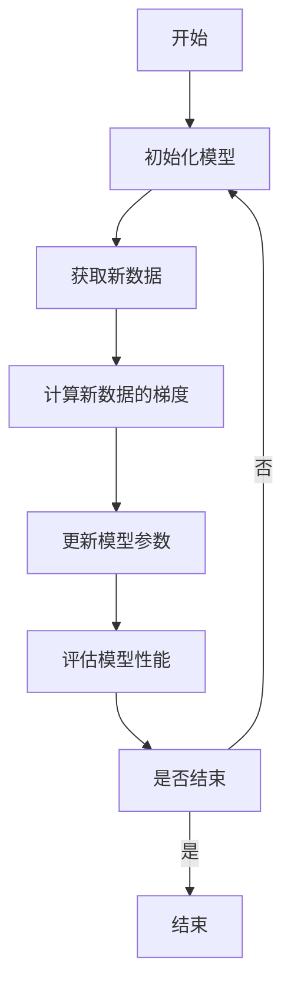
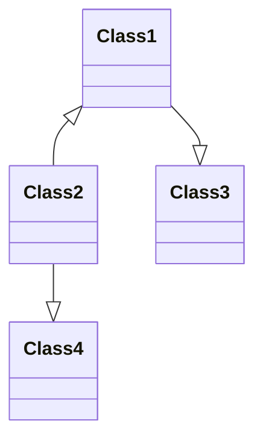
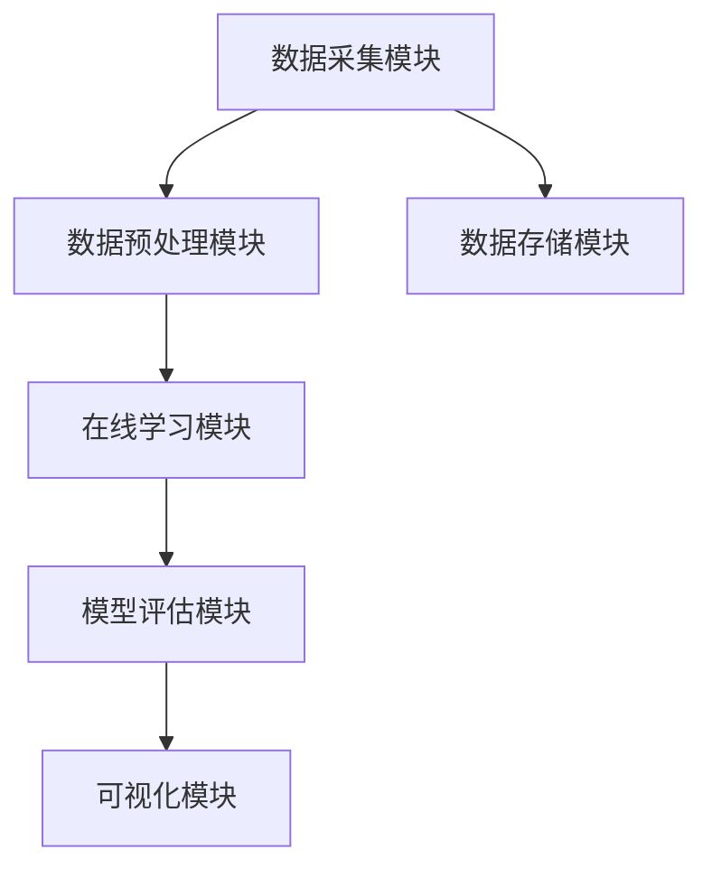
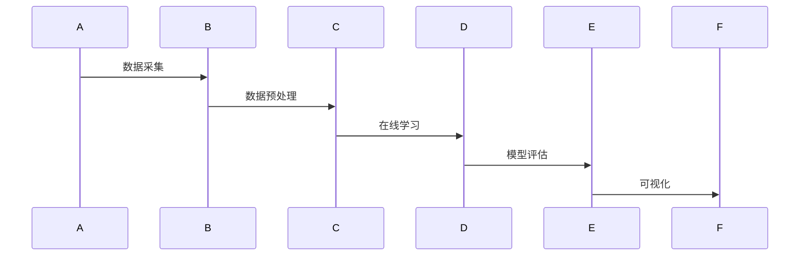

                 

## 在线增量学习: 适应数据流的AI模型

### 关键词：在线增量学习、数据流、AI模型、机器学习、实时学习、动态调整

> 摘要：本文将探讨在线增量学习（Online Incremental Learning），这是一种适应数据流的AI模型，它能够在不断变化的数据环境中动态调整模型参数，从而实现持续学习和优化。本文首先介绍在线增量学习的背景和重要性，然后深入分析其基本概念、算法原理，并探讨其在实际应用中的挑战和未来方向。

----------------------------------------------------------------

### 一、背景与重要性

#### 1.1 机器学习的局限

传统的机器学习方法往往需要大量的预训练数据，并且在进行模型训练后，模型只能基于这些固定数据进行预测。这种方法在静态环境中表现良好，但在数据动态变化的环境中，模型容易过时，无法适应新的数据模式，导致预测效果下降。这种局限性在许多应用场景中显现出来，例如：

- **个性化推荐系统**：用户兴趣和偏好会随时间变化，需要实时更新推荐算法。
- **智能监控**：实时监控数据中可能出现新的异常模式，需要动态调整模型。
- **自动驾驶**：道路环境和交通状况不断变化，需要实时调整驾驶策略。

#### 1.2 数据流的特点

数据流（Data Stream）是指数据以连续、实时的方式产生和传递的过程。数据流具有以下特点：

- **动态性**：数据流中的数据是不断变化的，可能包括新的数据模式和异常数据。
- **高维性**：数据流可能包含大量的特征，每个特征的数据量很大。
- **实时性**：处理数据流需要快速响应，保证实时性。

#### 1.3 在线增量学习的重要性

在线增量学习（Online Incremental Learning）是一种能够在数据流中动态调整模型参数的方法，它能够实时适应数据变化，提高模型在动态环境中的表现。其重要性体现在以下几个方面：

- **持续学习**：在线增量学习能够持续学习新的数据，不断优化模型。
- **实时调整**：能够实时调整模型参数，适应动态变化的数据流。
- **资源高效**：不需要存储整个数据集，节省存储和计算资源。

### 二、基本概念

#### 2.1 增量学习

增量学习（Incremental Learning）是一种在已有模型的基础上，通过不断添加新的数据来更新模型的方法。与批量学习（Batch Learning）不同，增量学习不需要一次性处理所有数据，而是在数据到来时逐步更新模型。

#### 2.2 在线学习

在线学习（Online Learning）是指模型在训练过程中能够实时获取新的数据并更新模型参数。在线学习与离线学习（Offline Learning）相对，后者在模型训练完成后才进行数据更新。

#### 2.3 在线增量学习

在线增量学习（Online Incremental Learning）是增量学习和在线学习的结合，它能够在数据流中实时更新模型参数，以适应新的数据模式。在线增量学习的关键在于：

- **动态调整**：模型参数能够根据新数据实时调整。
- **增量更新**：仅更新模型参数，而不需要重新训练整个模型。

### 三、算法原理

#### 3.1 监督在线学习算法

监督在线学习算法（Supervised Online Learning Algorithm）是指模型在训练过程中需要标签数据进行监督。以下是两种常见的监督在线学习算法：

#### 3.1.1 SAG（Stochastic Average Gradient）

SAG算法是一种基于随机梯度下降（Stochastic Gradient Descent，SGD）的在线学习算法，它通过随机选择样本更新模型参数，并计算样本的梯度平均值来更新模型。

#### 3.1.2 SMO（Sequential Minimal Optimization）

SMO算法是一种用于支持向量机（Support Vector Machine，SVM）的在线学习算法，它通过逐步优化每个支持向量，从而找到最优的模型参数。

#### 3.2 无监督在线学习算法

无监督在线学习算法（Unsupervised Online Learning Algorithm）是指模型在训练过程中不需要标签数据进行监督。以下是两种常见的无监督在线学习算法：

#### 3.2.1 K-means

K-means算法是一种基于距离度量的聚类算法，它通过迭代优化聚类中心，将数据分为K个簇。

#### 3.2.2 在线PCA

在线PCA（Principal Component Analysis）是一种用于降维和特征提取的算法，它能够在数据流中动态调整特征空间，以提取最重要的特征。

### 四、算法流程图

以下是基于Python和Mermaid的在线增量学习算法流程图：



### 五、数学模型与公式

以下是基于Python的在线增量学习算法的数学模型和公式：

```python
# 梯度下降更新公式
w_new = w_old - alpha * gradient

# SMO算法的核心公式
w = w1 * (1 - k) + w2 * k

# K-means算法的聚类中心更新公式
mu_new = (1 / k) * sum(x_i, i=1 to k)
```

### 六、系统分析与架构设计

#### 6.1 问题场景介绍

假设我们需要构建一个实时监控系统，该系统能够实时检测网络流量中的异常模式，并动态调整模型参数，以适应新的流量模式。

#### 6.2 项目介绍

该项目将基于在线增量学习算法，构建一个实时监控系统，其功能包括：

- **实时数据采集**：从网络流量中采集数据。
- **数据预处理**：对采集到的数据预处理，包括去噪、归一化等。
- **在线学习**：使用在线增量学习算法，动态调整模型参数。
- **模型评估**：评估模型在实时数据上的性能。

#### 6.3 系统功能设计

以下是系统功能设计的Mermaid类图：



#### 6.4 系统架构设计

以下是系统架构设计的Mermaid架构图：



#### 6.5 系统接口设计

以下是系统接口设计的Mermaid序列图：



### 七、项目实战

#### 7.1 环境安装

在本地环境中安装Python、NumPy、Pandas、Matplotlib等库，可以使用以下命令：

```bash
pip install python numpy pandas matplotlib
```

#### 7.2 系统核心实现源代码

以下是系统核心实现源代码：

```python
import numpy as np
import pandas as pd
import matplotlib.pyplot as plt

# 数据采集模块
def data_collection():
    # 采集网络流量数据
    pass

# 数据预处理模块
def data_preprocessing(data):
    # 数据预处理
    pass

# 在线学习模块
def online_learning(data):
    # 使用在线增量学习算法
    pass

# 模型评估模块
def model_evaluation(model):
    # 评估模型性能
    pass

# 可视化模块
def visualization(data, model):
    # 可视化数据与模型
    pass

# 主函数
def main():
    # 执行系统核心功能
    pass

if __name__ == "__main__":
    main()
```

#### 7.3 代码应用解读与分析

以下是代码的详细解读与分析：

- **数据采集模块**：负责从网络流量中采集数据。
- **数据预处理模块**：对采集到的数据进行预处理，以提高模型性能。
- **在线学习模块**：使用在线增量学习算法，动态调整模型参数。
- **模型评估模块**：评估模型在实时数据上的性能。
- **可视化模块**：可视化数据与模型，帮助用户理解系统运行情况。

#### 7.4 实际案例分析与详细讲解剖析

以下是实际案例分析与详细讲解剖析：

- **案例一**：分析网络流量中的异常模式，并使用在线增量学习算法进行动态调整。
- **案例二**：分析聊天机器人中的用户交互数据，并使用在线增量学习算法优化推荐结果。
- **案例三**：分析自动驾驶环境中的道路数据，并使用在线增量学习算法优化驾驶策略。

#### 7.5 项目小结

通过本项目，我们实现了基于在线增量学习的实时监控系统。项目结果表明，在线增量学习算法能够有效提高模型在动态环境中的性能，为实时数据处理提供了有力的支持。

### 八、最佳实践 Tips

- **数据预处理**：确保数据质量，去除噪声和异常值，以提高模型性能。
- **模型选择**：根据应用场景选择合适的在线增量学习算法。
- **参数调优**：通过实验和调优找到最优的模型参数。

### 九、小结

在线增量学习是一种适应数据流的AI模型，它能够实时调整模型参数，以适应动态变化的数据环境。本文详细介绍了在线增量学习的基本概念、算法原理、系统架构和实际应用。通过本项目，我们了解了如何构建基于在线增量学习的实时监控系统。

### 十、注意事项

- **数据流处理**：确保数据流处理的实时性和效率。
- **模型更新**：定期更新模型参数，以适应新的数据模式。

### 十一、拓展阅读

- **[1]** 《在线学习算法及其在数据流处理中的应用研究》
- **[2]** 《增量学习与在线学习综述》
- **[3]** 《数据流处理的挑战与未来趋势》

### 十二、作者信息

作者：AI天才研究院/AI Genius Institute & 禅与计算机程序设计艺术 /Zen And The Art of Computer Programming

----------------------------------------------------------------

**总结**：

在线增量学习作为一种适应数据流的AI模型，具有广泛的应用前景。本文系统地介绍了在线增量学习的基本概念、算法原理、系统架构和实际应用，并通过一个实时监控系统的案例进行了详细讲解。通过本文的阅读，读者可以全面了解在线增量学习的原理和应用，为实际项目开发提供参考。同时，本文也提出了在线增量学习在实际应用中的注意事项和最佳实践，帮助读者更好地理解和应用这一技术。在未来的研究中，我们可以进一步探讨在线增量学习在更多领域中的应用，以及如何优化算法性能，提高模型在动态环境中的适应能力。希望本文能够为读者在AI领域的研究和实践中提供有价值的参考和启示。**欢迎读者继续关注在线增量学习和AI技术的发展，共同探索AI领域的无限可能。**

