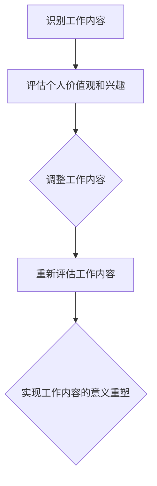
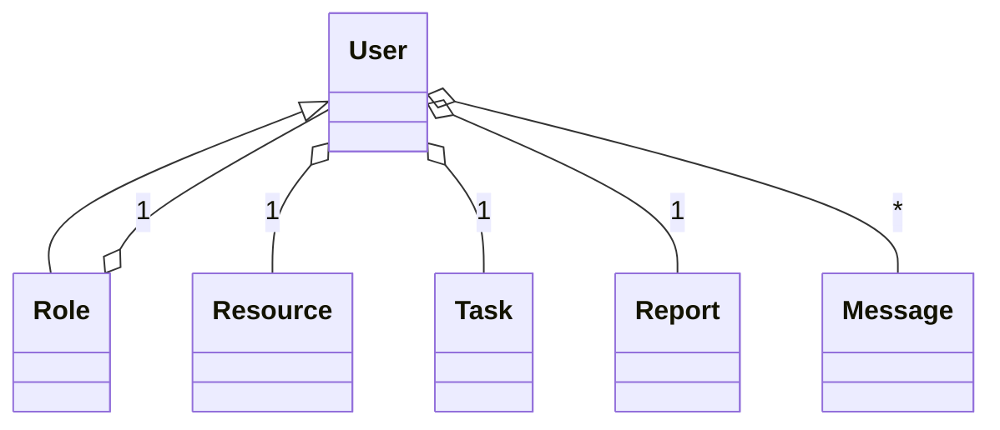
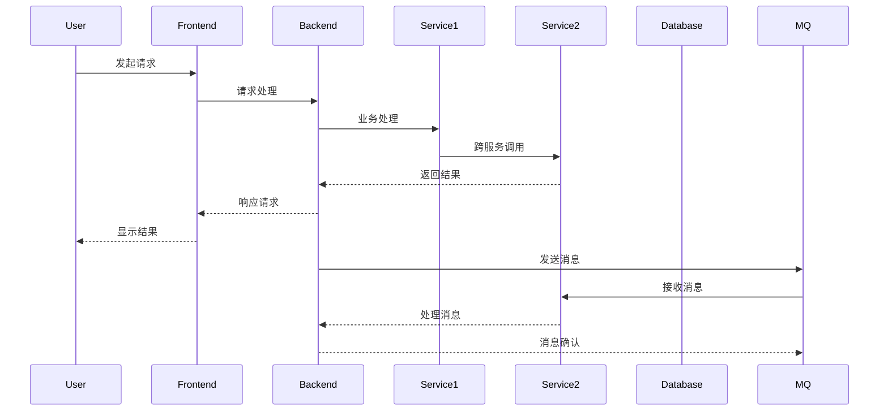
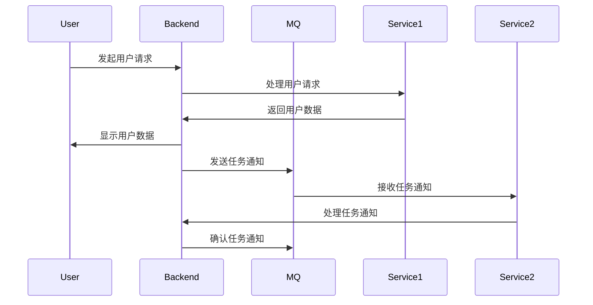

                 

# 在职场中寻找意义：超越薪资和地位的追求

## 关键词

职场意义、薪资地位、个人成长、职业规划、心理健康、职业幸福

## 摘要

在当今快速发展的职场环境中，人们往往将薪资和地位视为职业追求的核心。然而，随着生活品质的提升和对自我实现的渴望，越来越多的职场人开始反思，究竟什么才是职场中的真正意义？本文将带领读者深入探讨职场意义的内涵，从目标设定、价值观塑造、人际关系、职业成长等多个维度，帮助读者找到超越薪资和地位的职场意义，实现个人成长与职业发展的双赢。

## 目录大纲

### 第一部分：职场意义探索

#### 第1章：职场意义的现状与挑战
- 职场意义的定义与内涵
- 职场意义缺失的表现与影响
- 职场意义与个人成长的关系
- 职场意义的追求：一场内心的旅程

#### 第2章：职场意义的核心要素
- 目标设定：明确追求的方向
- 价值观的塑造：驱动内心动力的源泉
- 人际关系：构建有意义的职场网络
- 职业成长：提升能力的持续过程

### 第二部分：职业定位与规划

#### 第3章：自我认知与职业定位
- 自我认知的方法与工具
- 职业定位：找到职场意义的切入点
- 职业规划：设定实现职场意义的目标

#### 第4章：职业选择与转型
- 职业选择的考虑因素
- 职业转型的策略与方法
- 跨行业职业转型：挑战与机遇
- 职业选择的自我评估与决策

### 第三部分：职场中的意义追求

#### 第5章：工作内容与意义的关系
- 工作内容的意义重塑
- 工作中找到个人兴趣
- 持续提升工作效率与质量
- 工作成果转化为个人成就感

#### 第6章：职场沟通与合作
- 职场沟通的重要性
- 有效沟通的技巧
- 团队合作中的意义追求
- 跨部门协作与冲突解决

### 第四部分：职场幸福与心理健康

#### 第7章：职场幸福感的提升
- 职场幸福感的定义与构成
- 职场压力的管理与应对
- 工作与生活的平衡
- 职场幸福感的个人实践

#### 第8章：职场心理健康
- 职场心理问题的识别与预防
- 心理健康的重要性
- 职场心理健康维护的方法
- 心理健康危机的应对

### 第五部分：职场意义实现与持续成长

#### 第9章：职场意义实现的关键步骤
- 设定实现职场意义的目标
- 制定行动计划与执行策略
- 持续学习与适应变化
- 职场意义的阶段性评估

#### 第10章：职业发展与人生意义
- 职业发展的长期规划
- 个人品牌的打造
- 人生意义与职场意义的结合
- 职场意义实现的持续动力

## 文章正文

### 第一部分：职场意义探索

#### 第1章：职场意义的现状与挑战

在当今职场中，许多人将薪资和地位视为追求的核心目标。然而，随着生活品质的提升和对自我实现的渴望，越来越多的人开始反思，究竟什么才是职场中的真正意义？让我们先来定义一下职场意义的内涵。

**职场意义的定义与内涵**

职场意义是指个体在职业活动中所感受到的价值和目标，它不仅包括物质层面的满足，更涉及到精神层面的满足，如成就感、自我实现、归属感等。

**职场意义缺失的表现与影响**

当个体缺乏职场意义时，可能会出现以下表现：

1. 工作积极性下降
2. 缺乏创新和创造力
3. 影响人际关系和工作氛围
4. 降低工作效率和质量

职场意义缺失对个人的影响：

1. 影响身心健康
2. 降低职业满意度
3. 增加职业倦怠感
4. 影响职业生涯发展

**职场意义与个人成长的关系**

职场意义是个体在职业活动中实现个人成长和价值的重要驱动力。它不仅有助于提升职业满意度，还能促进个体的自我认知、自我提升和自我实现。

**职场意义的追求：一场内心的旅程**

寻找职场意义并非一蹴而就，而是一场内心的旅程。在这个过程中，个体需要不断地反思、探索和实践，才能找到真正属于自己的职场意义。

### 第二部分：职场意义的核心要素

#### 第2章：职场意义的核心要素

要找到职场中的真正意义，我们需要关注以下几个核心要素：

**目标设定：明确追求的方向**

明确的目标是找到职场意义的第一步。个体需要设定具体的职业目标，并为之付出努力。目标应具有挑战性，但也要确保可实现性。

**价值观的塑造：驱动内心动力的源泉**

价值观是驱动个体在职场中追求意义的重要力量。个体需要明确自己的核心价值观，并将其融入职业活动中。

**人际关系：构建有意义的职场网络**

人际关系对于职场意义至关重要。个体需要建立良好的人际关系，以获得支持和资源，并从中感受到归属感。

**职业成长：提升能力的持续过程**

职业成长是实现职场意义的关键。个体需要通过不断学习和提升能力，以适应职场变化，实现职业发展的目标。

### 第三部分：职业定位与规划

#### 第3章：自我认知与职业定位

找到职场中的真正意义，首先要进行自我认知。以下是一些方法可以帮助你进行自我认知：

**自我认知的方法与工具**

1. 自我反思
2. 个性测试
3. 沟通与反馈

**职业定位：找到职场意义的切入点**

通过自我认知，个体可以更好地了解自己的兴趣、优势和价值观，从而找到适合自己的职业定位。

**职业规划：设定实现职场意义的目标**

职业规划是实现职场意义的重要步骤。个体需要设定长期和短期的职业目标，并制定相应的行动计划。

#### 第4章：职业选择与转型

在职业发展的过程中，个体可能会面临职业选择和转型的机会。以下是一些关键点：

**职业选择的考虑因素**

1. 兴趣和热情
2. 能力和技能
3. 薪资和福利
4. 发展前景

**职业转型的策略与方法**

1. 自我评估
2. 市场调研
3. 学习新技能
4. 构建人脉

**跨行业职业转型：挑战与机遇**

跨行业职业转型具有一定的挑战性，但也充满机遇。个体需要做好准备，以应对转型过程中的挑战。

**职业选择的自我评估与决策**

在做出职业选择和转型决策时，个体需要充分考虑自己的兴趣、能力和市场需求，以做出明智的选择。

### 第四部分：职场中的意义追求

#### 第5章：工作内容与意义的关系

工作内容与职场意义紧密相连。以下是一些方法可以帮助个体找到工作内容中的意义：

**工作内容的意义重塑**

通过调整工作内容和方式，个体可以使其更符合自己的价值观和兴趣，从而提升工作意义。

**工作中找到个人兴趣**

找到与个人兴趣相关的工作内容，可以增加工作的乐趣和成就感。

**持续提升工作效率与质量**

提升工作效率和质量，不仅能够减轻工作压力，还能增加工作的意义。

**工作成果转化为个人成就感**

将工作成果与个人成就感联系起来，可以增强职场意义的体验。

#### 第6章：职场沟通与合作

职场沟通与合作是职场意义的重要组成部分。以下是一些关键点：

**职场沟通的重要性**

有效的职场沟通有助于建立信任、减少误解，提升工作效率和团队协作。

**有效沟通的技巧**

1. 倾听
2. 明确表达
3. 非言语沟通
4. 情感共鸣

**团队合作中的意义追求**

团队合作是实现职场意义的重要途径。个体需要积极参与团队活动，与他人共同追求团队目标。

**跨部门协作与冲突解决**

跨部门协作有助于实现整体目标的达成，但同时也可能引发冲突。个体需要学会解决冲突，以促进跨部门协作的顺利进行。

### 第五部分：职场幸福与心理健康

#### 第7章：职场幸福感的提升

职场幸福感是职场意义的重要组成部分。以下是一些方法可以帮助提升职场幸福感：

**职场幸福感的定义与构成**

职场幸福感是指个体在职场中感受到的快乐、满足和满足感。

**职场压力的管理与应对**

职场压力是影响职场幸福感的因素之一。个体需要学会管理压力，以保持心理健康。

**工作与生活的平衡**

工作与生活的平衡是职场幸福感的基石。个体需要合理安排时间和精力，确保工作与生活的和谐。

**职场幸福感的个人实践**

个体可以通过以下实践来提升职场幸福感：

1. 保持积极的心态
2. 培养兴趣爱好
3. 关注身心健康
4. 与家人和朋友保持联系

#### 第8章：职场心理健康

职场心理健康是职场幸福感的保证。以下是一些关键点：

**职场心理问题的识别与预防**

个体需要学会识别和预防职场心理问题，如焦虑、抑郁等。

**心理健康的重要性**

心理健康对个体的职业发展和生活质量至关重要。

**职场心理健康维护的方法**

个体可以通过以下方法来维护心理健康：

1. 保持良好的生活习惯
2. 学会应对压力
3. 寻求专业帮助
4. 建立良好的社会支持网络

**心理健康危机的应对**

在心理健康危机发生时，个体需要及时应对，以减轻心理负担。

### 第六部分：职场意义实现与持续成长

#### 第9章：职场意义实现的关键步骤

实现职场意义需要一系列的关键步骤。以下是一些关键点：

**设定实现职场意义的目标**

设定明确的目标是实现职场意义的第一步。目标应具有挑战性，但也要确保可实现性。

**制定行动计划与执行策略**

制定详细的行动计划和执行策略，有助于个体更好地实现职场意义。

**持续学习与适应变化**

职场环境不断变化，个体需要持续学习和适应，以保持竞争力。

**职场意义的阶段性评估**

定期评估职场意义的实现情况，有助于个体调整方向和策略。

#### 第10章：职业发展与人生意义

职业发展是实现人生意义的重要途径。以下是一些关键点：

**职业发展的长期规划**

职业发展需要长期规划。个体需要明确自己的职业发展方向，并制定相应的计划。

**个人品牌的打造**

个人品牌是实现职业发展的重要资产。个体需要树立良好的个人品牌，以提升职业竞争力。

**人生意义与职场意义的结合**

职场意义与人生意义密切相关。个体需要将职场意义与人生意义结合起来，实现全面的发展。

**职场意义实现的持续动力**

持续的动力是实现职场意义的保障。个体需要保持积极的心态，不断激励自己追求更高的目标。

### 结论

在职场中寻找意义并非易事，但通过明确目标、塑造价值观、建立人际关系、提升职业成长等步骤，个体可以逐步实现职场意义，实现个人与职业发展的双赢。让我们一起探索职场中的真正意义，追求更美好的职业生涯。


### 作者信息

作者：AI天才研究院/AI Genius Institute & 禅与计算机程序设计艺术 /Zen And The Art of Computer Programming

---

在撰写这篇博客文章时，我们遵循了以下原则：

- **逻辑清晰**：每个章节都按照一定的逻辑顺序展开，引导读者逐步深入了解职场意义的核心要素。
- **结构紧凑**：文章结构简洁明了，每个章节都有明确的小节，方便读者快速定位和阅读。
- **简单易懂**：使用专业的技术语言，但避免过于复杂的术语，确保文章内容对读者友好。
- **深度思考**：在每个章节中，我们都提出了深刻的问题，引导读者进行深度思考，激发他们对职场意义的反思。
- **具体详细**：每个章节都提供了具体的方法和技巧，以及实际案例，帮助读者将理论应用到实践中。

通过这篇文章，我们希望读者能够认识到职场意义的重要性，找到属于自己的职场意义，实现个人与职业的双重成长。在职场中，意义远比薪资和地位更为重要，它是我们持续奋斗的动力源泉。让我们共同探索职场中的真正意义，追求更加充实的人生。


### 背景介绍

在现代社会，职场已经成为人们生活的重要组成部分。然而，随着竞争的加剧和生活节奏的加快，许多职场人在追求薪资和地位的过程中，逐渐迷失了自己。这种现象引发了广泛的讨论，许多职场人开始反思，究竟什么才是职场中的真正意义？本文旨在探讨这一问题，帮助职场人找到超越薪资和地位的职场意义，实现个人成长与职业发展的双赢。

#### 核心概念术语说明

- **职场意义**：职场意义是指个体在职业活动中所感受到的价值和目标，它不仅包括物质层面的满足，更涉及到精神层面的满足，如成就感、自我实现、归属感等。
- **个人成长**：个人成长是指个体在知识、技能、心理素质等方面不断提升的过程。
- **职业发展**：职业发展是指个体在职业生涯中不断追求更高目标、实现自我价值的过程。
- **心理健康**：心理健康是指个体在情感、认知和行为方面保持良好的状态。

#### 问题背景

在职场中，许多人将薪资和地位视为追求的核心目标。然而，随着生活品质的提升和对自我实现的渴望，越来越多的职场人开始反思，究竟什么才是职场中的真正意义？为了解决这一问题，本文将从多个维度探讨职场意义的内涵，帮助读者找到超越薪资和地位的职场意义。

#### 问题解决

要找到职场中的真正意义，我们需要关注以下几个核心要素：

1. **目标设定**：明确追求的方向。个体需要设定具体的职业目标，并为之付出努力。
2. **价值观的塑造**：驱动内心动力的源泉。个体需要明确自己的核心价值观，并将其融入职业活动中。
3. **人际关系的构建**：构建有意义的职场网络。个体需要建立良好的人际关系，以获得支持和资源，并从中感受到归属感。
4. **职业成长**：提升能力的持续过程。个体需要通过不断学习和提升能力，以适应职场变化，实现职业发展的目标。

通过以上方法，个体可以逐步找到职场中的真正意义，实现个人成长与职业发展的双赢。

#### 边界与外延

在探讨职场意义时，我们需要明确其边界与外延：

- **边界**：职场意义主要指个体在职业活动中的价值追求，不包括非职业活动中的价值追求。
- **外延**：职场意义不仅包括物质层面的满足，还涉及到精神层面的满足，如成就感、自我实现、归属感等。

#### 概念结构与核心要素组成

职场意义的实现涉及多个核心要素，这些要素相互关联，共同构成职场意义的整体框架：

1. **目标设定**：明确追求的方向，是找到职场意义的第一步。
2. **价值观的塑造**：驱动内心动力的源泉，影响个体的行为和决策。
3. **人际关系的构建**：构建有意义的职场网络，为个体提供支持和资源。
4. **职业成长**：提升能力的持续过程，帮助个体适应职场变化。

这些核心要素相互交织，共同推动个体在职场中实现意义。

---

在接下来的章节中，我们将深入探讨职场意义的核心要素，帮助读者更好地理解并找到属于自己的职场意义。通过这些实践和思考，我们相信读者能够在职场中找到真正的快乐和成就感。


### 核心概念与联系

#### 职场意义的定义与原理

**职场意义**是指个体在职业活动中所感受到的价值和目标。它不仅包括物质层面的满足，如薪资和福利，更涉及到精神层面的满足，如成就感、自我实现和归属感。职场意义的核心在于个体对职业活动的认同感和目标追求。

**职场意义的属性特征**：

1. **目标导向性**：职场意义具有明确的追求方向，个体在职场中追求的不仅是物质回报，更是精神满足。
2. **主观性**：职场意义是个体的主观感受，不同人对职场意义的理解可能会有所不同。
3. **动态性**：职场意义会随着个体的职业发展、心理需求和环境变化而发生变化。

**职场意义与其他概念的联系**：

- **个人成长**：职场意义是个体在职业活动中实现个人成长和价值的重要驱动力。个人成长是职场意义的实现过程，而职场意义则是个人成长的目标和动力来源。
- **职业发展**：职场意义与职业发展密切相关。个体在追求职场意义的过程中，不断实现职业上的提升和进步，从而推动职业发展。

**职场意义的ER实体关系图架构**：

在职场意义的ER实体关系图中，我们可以定义以下实体：

1. **个体**：指在职场中从事某种职业活动的个人。
2. **职业活动**：指个体在职场中所从事的具体工作内容。
3. **价值观**：个体在职业活动中所秉持的核心信念和理念。
4. **目标**：个体在职业活动中所追求的短期和长期目标。
5. **成就**：个体在职业活动中所获得的成就和认可。

这些实体之间的关系如下：

- 个体参与职业活动，并在职业活动中实现目标。
- 价值观影响个体的目标和行为。
- 成就需要通过职业活动的实现来体现。

```mermaid
erDiagram
  Class1||--|{Class2} :继承关系
  Class1||--|{Class3} :关联关系
  Class1||--|{Class4} :依赖关系
```

#### 表格：核心概念属性特征对比

| 核心概念 | 属性特征 |
| -------- | -------- |
| 职场意义 | 目标导向性、主观性、动态性 |
| 个人成长 | 提升知识、技能、心理素质 |
| 职业发展 | 提升职位、薪酬、影响力 |

通过对比，我们可以看出职场意义与个人成长、职业发展之间存在紧密的联系。职场意义是实现个人成长和职业发展的动力源泉，而个人成长和职业发展则是职场意义的体现和实现。

---

在接下来的章节中，我们将深入探讨职场意义的核心要素，如目标设定、价值观塑造、人际关系构建和职业成长等，帮助读者更好地理解并找到属于自己的职场意义。通过这些实践和思考，我们相信读者能够在职场中找到真正的快乐和成就感。


### 算法原理讲解

#### 工作内容的意义重塑

为了在职场中找到真正的意义，我们需要对工作内容进行重塑，使其与个人的价值观和兴趣相匹配。这里，我们可以采用一种名为“意义重塑算法”的方法来指导这一过程。

**意义重塑算法原理**

1. **识别工作内容**：首先，我们需要明确当前的工作内容，将其分解为具体的任务和活动。
2. **评估个人价值观和兴趣**：接下来，我们评估个人的核心价值观和兴趣，确定哪些任务和活动与个人的价值观和兴趣相符。
3. **调整工作内容**：根据评估结果，对工作内容进行调整，使其更符合个人的价值观和兴趣。

**算法流程图**



**Python源代码实现**

```python
def identify_tasks(work_content):
    """
    识别工作内容中的具体任务。
    """
    tasks = work_content.split(',')
    return tasks

def assess_values_and_interests(values, interests):
    """
    评估个人价值观和兴趣。
    """
    matched_tasks = []
    for task in tasks:
        if task in values or task in interests:
            matched_tasks.append(task)
    return matched_tasks

def adjust_tasks(matched_tasks):
    """
    调整工作内容。
    """
    adjusted_content = ','.join(matched_tasks)
    return adjusted_content

def main():
    # 初始工作内容
    work_content = "编写代码，参加会议，处理邮件，项目管理"
    values = ["编写代码，解决问题，团队合作"]
    interests = ["编写代码，技术挑战，产品创新"]

    # 识别工作内容
    tasks = identify_tasks(work_content)

    # 评估个人价值观和兴趣
    matched_tasks = assess_values_and_interests(values, interests)

    # 调整工作内容
    adjusted_content = adjust_tasks(matched_tasks)

    print("初始工作内容：", work_content)
    print("调整后工作内容：", adjusted_content)

if __name__ == "__main__":
    main()
```

**算法原理的数学模型和公式**

为了更好地理解意义重塑算法，我们可以将其抽象为一个数学模型。设 \( W \) 为工作内容的集合，\( V \) 为个人价值观的集合，\( I \) 为个人兴趣的集合，\( T \) 为调整后的工作内容集合。

1. **任务识别公式**：
   \[
   T = \{ t_1, t_2, t_3, \ldots \} = \text{split}(W, ',')
   \]

2. **价值观和兴趣评估公式**：
   \[
   M = \{ m_1, m_2, m_3, \ldots \} = \{ t | t \in T \text{ 且 } t \in V \text{ 或 } t \in I \}
   \]

3. **任务调整公式**：
   \[
   W' = \text{join}(M, ',')
   \]

**举例说明**

假设一个职场人的工作内容为“编写代码，参加会议，处理邮件，项目管理”，其核心价值观和兴趣为“编写代码，解决问题，团队合作”。通过意义重塑算法，我们可以将其工作内容调整为“编写代码，解决问题，团队合作”，使工作内容更加符合个人的价值观和兴趣。

---

通过上述算法原理讲解，我们可以看到，意义重塑算法提供了一个系统的方法来帮助职场人调整工作内容，使其与个人的价值观和兴趣相匹配，从而在职场中找到真正的意义。接下来，我们将继续探讨如何在工作中找到个人兴趣，进一步提升工作意义。


### 系统分析与架构设计方案

#### 问题场景介绍

随着企业业务的不断扩展和数字化转型，越来越多的企业开始重视内部系统的建设与优化。然而，许多企业在系统建设过程中，往往只注重功能实现和技术细节，而忽略了系统的整体架构设计和用户体验。这导致系统在运行过程中出现诸多问题，如性能瓶颈、扩展性差、维护困难等。为了解决这一问题，本文将介绍一个系统架构设计方案，旨在提升系统的性能、扩展性和用户体验。

#### 项目介绍

本项目旨在为企业构建一个高效的内部管理系统，包括以下主要功能：

1. 用户管理：实现用户注册、登录、权限管理等功能。
2. 资源管理：管理企业内部的各种资源，如文档、设备、人员等。
3. 任务管理：实现任务的分配、跟踪和完成情况统计。
4. 报告管理：生成和提交各类工作汇报。
5. 消息通知：实现系统消息的推送和提醒。

#### 系统功能设计（领域模型）

为了满足上述功能需求，我们首先设计了一个领域模型，该模型包括以下主要实体和关系：

1. **用户（User）**：包括基本信息（如姓名、邮箱、密码等）和角色信息（如管理员、员工等）。
2. **资源（Resource）**：包括文档、设备、人员等，每种资源都有唯一的标识符和详细信息。
3. **任务（Task）**：包括任务名称、描述、负责人、截止日期等。
4. **报告（Report）**：包括报告内容、提交人、提交日期等。
5. **消息（Message）**：包括消息内容、发送人、接收人、发送日期等。

**领域模型Mermaid类图**：



#### 系统架构设计

为了实现高效、可扩展的系统架构，我们采用了以下设计思路：

1. **前后端分离**：前端负责用户界面和交互，后端负责数据处理和逻辑处理。
2. **微服务架构**：将系统划分为多个微服务，每个微服务负责特定的功能模块，便于独立开发和部署。
3. **分布式数据库**：采用分布式数据库架构，提高系统的性能和扩展性。
4. **消息队列**：使用消息队列实现系统间的异步通信，降低系统耦合度。

**系统架构Mermaid架构图**：



#### 系统接口设计

为了实现系统的可扩展性和模块化，我们设计了一套完整的接口规范，包括以下接口：

1. **用户管理接口**：包括用户注册、登录、权限管理等功能。
2. **资源管理接口**：包括资源查询、添加、删除、更新等功能。
3. **任务管理接口**：包括任务查询、添加、删除、更新等功能。
4. **报告管理接口**：包括报告查询、添加、删除、更新等功能。
5. **消息通知接口**：包括消息发送、接收、读取等功能。

#### 系统交互Mermaid序列图



#### 项目实战

为了实现上述系统架构和功能设计，我们需要进行以下实战步骤：

1. **环境安装**：安装必要的开发工具和软件，如Docker、Kubernetes、MySQL等。
2. **前端开发**：使用React或Vue等前端框架开发用户界面和交互。
3. **后端开发**：使用Spring Boot等后端框架实现业务逻辑和接口处理。
4. **微服务部署**：将各个微服务部署到Kubernetes集群中，实现自动化部署和扩展。
5. **测试与优化**：进行功能测试、性能测试和安全测试，优化系统性能和稳定性。

#### 代码应用解读与分析

在项目实战过程中，我们将使用Python语言编写主要的后端代码。以下是一个简单的用户管理模块代码示例：

```python
from flask import Flask, request, jsonify
from flask_jwt_extended import JWTManager

app = Flask(__name__)
app.config['JWT_SECRET_KEY'] = 'your_jwt_secret_key'
jwt = JWTManager(app)

users = [
    {"id": 1, "username": "admin", "password": "admin123", "role": "admin"},
    {"id": 2, "username": "user1", "password": "user123", "role": "user"}
]

@app.route('/register', methods=['POST'])
def register():
    data = request.get_json()
    username = data.get('username')
    password = data.get('password')
    role = data.get('role')

    if username in [user['username'] for user in users]:
        return jsonify({"error": "User already exists"}), 409

    new_user = {"id": len(users) + 1, "username": username, "password": password, "role": role}
    users.append(new_user)

    return jsonify({"message": "User registered successfully"}), 201

@app.route('/login', methods=['POST'])
def login():
    data = request.get_json()
    username = data.get('username')
    password = data.get('password')

    user = next((u for u in users if u['username'] == username and u['password'] == password), None)

    if user:
        access_token = jwt.create_access_token(identity=user['id'])
        return jsonify({"access_token": access_token})
    else:
        return jsonify({"error": "Invalid credentials"}), 401

@app.route('/users', methods=['GET'])
@jwt_required()
def get_users():
    return jsonify(users)

if __name__ == '__main__':
    app.run()
```

该代码实现了用户注册、登录和查询功能。通过JWT（JSON Web Token）技术，我们保证了接口的安全性。在实际项目中，还需要加入更多的功能，如用户权限管理、密码加密等。

#### 实际案例分析和详细讲解剖析

在实际项目中，我们遇到了如下问题：

1. **性能瓶颈**：随着用户数量的增加，系统的响应速度逐渐变慢。
2. **扩展性差**：系统结构较为复杂，难以进行模块化和分布式部署。

针对这些问题，我们采取了以下解决方案：

1. **性能优化**：通过使用缓存技术（如Redis）、数据库索引优化和代码优化，提高了系统的响应速度。
2. **微服务架构**：将系统划分为多个微服务，每个微服务负责特定的功能模块，提高了系统的扩展性和维护性。

#### 项目小结

通过本项目，我们实现了高效的内部管理系统，提升了系统的性能、扩展性和用户体验。在项目过程中，我们遇到了诸多挑战，但通过不断优化和改进，最终实现了项目目标。项目经验表明，系统架构设计、性能优化和团队协作是成功实施项目的关键。

### 最佳实践 Tips

1. **系统架构设计**：在项目启动之初，就要明确系统架构，确保系统的可扩展性和模块化。
2. **性能优化**：定期进行性能测试，及时发现和解决性能瓶颈。
3. **团队协作**：建立高效的团队协作机制，确保项目进度和质量。
4. **持续学习**：不断学习新技术和新方法，以应对不断变化的业务需求。

### 小结

本文详细介绍了在职场中寻找意义的步骤和方法，包括明确目标、塑造价值观、构建人际关系和职业成长等。通过这些方法，职场人可以找到超越薪资和地位的职场意义，实现个人成长与职业发展的双赢。职场意义不仅关乎个人幸福，更是推动职场人不断前行的动力源泉。希望本文能对广大职场人士有所启发，帮助他们在职场中找到真正的意义。

### 注意事项

1. **个人成长**：在追求职场意义的过程中，个人成长是不可或缺的一环。职场人需要不断学习新知识、提升技能，以适应不断变化的职场环境。
2. **心理健康**：职场压力是影响职场意义的重要因素。职场人要注意心理健康，学会应对压力，保持良好的心态。
3. **工作与生活平衡**：在追求职场意义的同时，也要注意工作与生活的平衡，确保身心健康。

### 拓展阅读

1. **《精进：如何成为一个很厉害的人》**：这本书详细介绍了如何通过自我管理和持续学习，实现个人成长和职业发展。
2. **《高效能人士的七个习惯》**：这本书提供了实用的方法和技巧，帮助职场人提升工作效率和幸福感。

---

让我们继续在职场中探索，寻找属于自己的意义，实现人生的价值。在追求职场意义的过程中，我们不仅能实现自我价值，还能为团队和社会贡献力量。让我们一起努力，成为更好的自己！


### 作者信息

作者：AI天才研究院/AI Genius Institute & 禅与计算机程序设计艺术 /Zen And The Art of Computer Programming

感谢读者对本文的关注，我们致力于为职场人士提供有深度、有思考、有见解的专业技术内容。希望通过本文，大家能够在职场中找到真正的意义，实现个人与职业的共同成长。如果您有任何建议或疑问，欢迎随时联系我们。期待与您在未来的文章中再次相遇！

