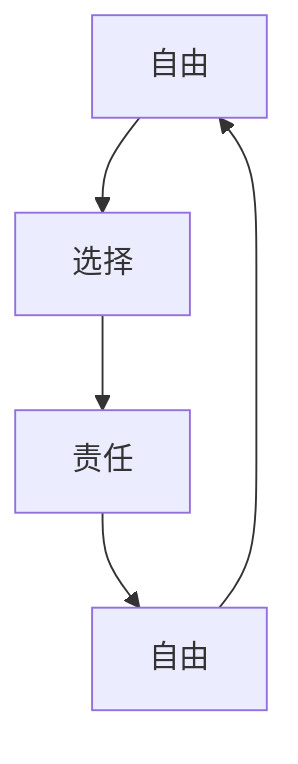

                 

### 第一部分：引言

#### 1.1 存在主义概述

**1.1.1 存在主义的起源**

存在主义，作为一种哲学流派，起源于20世纪初的欧洲，特别是在德国和法国。它的兴起与第一次世界大战以及随后的经济大萧条有着密切的联系。在这一时期，人们开始对传统价值观和理性主义进行质疑，寻找更加深刻的意义和存在的本质。

存在主义的先驱者之一是丹麦哲学家基尔凯郭尔（Søren Kierkegaard），他强调个体存在的独特性和主观性。基尔凯郭尔认为，人的生活是一个不断追求自我理解和自我实现的过程，强调选择和责任的重要性。

另一位重要的人物是德国哲学家海德格尔（Martin Heidegger），他的著作《存在与时间》对存在主义的发展产生了深远的影响。海德格尔提出了“存在即存在”（Dasein）的概念，强调个体存在的具体性和动态性。

**1.1.2 存在主义的核心概念**

存在主义的核心概念包括自由、选择、意义、自我意识等。这些概念共同构成了存在主义哲学的基础。

- **自由**：存在主义认为，自由是人类存在的根本特征。个体在存在过程中，必须面对各种各样的选择，而这些选择是自由的体现。自由不仅是行为的自由，更是思想的自由。

- **选择**：选择是存在主义的核心概念之一。存在主义者认为，个体通过选择来塑造自己的生活和身份。选择不仅是自由的表现，也是责任的前提。

- **意义**：意义是存在主义探讨的另一个重要问题。存在主义者认为，人生的意义并不是预先设定的，而是个体通过自己的选择和行动来创造和发现的。

- **自我意识**：自我意识是指个体对自己的认识和感知。存在主义者认为，自我意识是理解存在的关键，只有通过深入思考自己的存在，个体才能找到自己的位置和意义。

**1.1.3 存在主义与现代实践的关系**

存在主义不仅在哲学领域产生了深远的影响，也在现代社会的各个领域得到了应用。例如，在心理学中，存在主义心理治疗被广泛应用于治疗抑郁症、焦虑症等心理问题。在艺术中，许多艺术家通过作品探讨了存在的主题，如萨特（Jean-Paul Sartre）的小说《恶心》。

此外，存在主义在政治和社会运动中也有一定的体现。存在主义强调个体的主动性和责任感，这对于推动社会变革和个人成长具有重要意义。

#### 1.2 本书的目的与结构

**1.2.1 为什么要阅读这本书**

阅读这本书，您将深入了解存在主义的起源、核心概念和现代实践。通过这本书，您将能够：

- 理解存在主义的基本观点和哲学原则。
- 探索存在主义在现代社会中的应用，如心理治疗、艺术和政治运动。
- 学习如何在实际生活中应用存在主义的思想，提高自我意识和生活质量。

**1.2.2 本书的目标读者**

这本书的目标读者包括：

- 对哲学和心理学感兴趣的人士。
- 寻求个人成长和自我实现的人。
- 想要了解存在主义在现代生活中的应用的人。

**1.2.3 全书的结构安排**

本书分为六个部分，结构安排如下：

- **第一部分：引言**：介绍存在主义的起源、核心概念和现代实践。
- **第二部分：核心概念与联系**：详细探讨自由、选择、意义和自我意识等核心概念，并展示它们之间的关系。
- **第三部分：存在主义的哲学基础**：探讨存在主义的主要哲学思想和理论，包括经典存在主义、现代存在主义和当代存在主义。
- **第四部分：存在主义的现代实践**：讨论存在主义在现代社会中的实际应用，如心理治疗、艺术和政治运动。
- **第五部分：案例分析**：通过具体案例来展示存在主义在现实生活中的应用。
- **第六部分：实践指南与启示**：提供实践指南和思考问题，帮助读者更好地理解存在主义，并在个人生活中实践。

#### 1.3 总结

存在主义作为一种哲学流派，不仅探讨了人类存在的本质和意义，也为现代社会提供了深刻的思考和启示。通过本书，我们将逐步深入探讨存在主义的各个方面，帮助读者更好地理解这一哲学流派，并在个人生活中实践其思想。

### 第二部分：核心概念与联系

#### 2.1 自由与选择

**2.1.1 自由的概念**

自由，是存在主义的核心概念之一。在存在主义看来，自由不仅是行为的自由，更是思想的自由。自由意味着个体有权选择自己的生活方式、价值观和信仰，不受外在因素的束缚。

- **行为的自由**：个体有权根据自己的意愿和判断进行各种行为，包括选择职业、生活方式、社交关系等。
- **思想的自由**：个体有权自由思考、表达和追求自己的信仰，不受传统、社会规范或他人的限制。

**2.1.2 自由与责任的联系**

自由与责任是密不可分的。存在主义者认为，自由不仅仅是权利的体现，更是责任的承担。个体在享受自由的同时，也必须承担起相应的责任。

- **权利与责任的平衡**：自由意味着个体有权选择，但同时也有责任为自己的选择承担后果。这种平衡是存在主义所强调的。
- **个人责任与社会责任**：个体的自由不仅关乎个人，也关乎社会。个体在追求个人自由的同时，也必须承担起社会责任，为社会的和谐与进步贡献力量。

**2.1.3 选择的重要性**

选择是存在主义的核心概念之一。个体通过选择来塑造自己的生活和身份。选择不仅体现了个体的自由，也反映了个体对生活的态度和价值观。

- **自我实现的选择**：个体通过选择，可以不断探索和实现自我，找到自己的价值和意义。
- **选择与决策**：选择是一个动态的过程，涉及决策、评估和反思。个体必须在不断变化的环境中做出明智的选择，以实现自己的目标和理想。

**2.1.4 自由与选择的辩证关系**

自由与选择是辩证统一的关系。自由是选择的前提，选择是自由的表现。没有自由，选择就无从谈起；没有选择，自由就失去了意义。

- **自由的选择**：在自由的基础上，个体可以做出真实的选择，而不是被迫或受限制的选择。
- **选择的自由**：在选择的过程中，个体可以自由地表达自己的意愿和需求，实现自我价值。

**2.1.5 自由与选择的哲学意义**

自由与选择的存在主义哲学意义在于：

- **个体的独特性**：自由与选择强调了个体存在的独特性和独立性，每个个体都有权根据自己的意愿和判断来生活。
- **价值观的多样性**：自由与选择意味着不同的个体会有不同的价值观和生活方式，这为社会的多样性和繁荣提供了基础。

#### 2.2 意义与自我意识

**2.2.1 寻找人生的意义**

人生的意义是存在主义探讨的另一个重要问题。存在主义者认为，人生的意义并不是预先设定的，而是个体通过自己的选择和行动来创造和发现的。

- **意义的主观性**：意义是主观的，每个人对意义的理解和追求都是独特的。不同的人可能会找到不同的意义，但这并不意味着他们的生活没有价值。
- **意义的动态性**：意义是一个动态的过程，随着个体的成长和环境的变化，意义也会发生变化。因此，寻找意义是一个持续的过程。

**2.2.2 自我意识的觉醒**

自我意识是指个体对自己的认识和感知。自我意识的存在主义意义在于：

- **个体的自我理解**：自我意识帮助个体理解自己的存在，认识自己的需求和愿望。
- **自我认同**：自我意识使个体能够形成自我认同，确定自己的身份和价值观。
- **自我实现**：自我意识是自我实现的基础，只有了解自己，个体才能更好地实现自我。

**2.2.3 意义与存在的联系**

意义与存在是紧密联系的。存在主义认为，意义是人类存在的核心，是生活的动力和方向。

- **存在的意义**：存在的意义在于个体的选择和行动，通过这些选择和行动，个体赋予自己的生活以意义。
- **意义的存在**：意义的存在是存在的体现，个体通过发现和创造意义来证明自己的存在。

**2.2.4 自我意识与存在的辩证关系**

自我意识与存在是辩证统一的关系。自我意识是存在的表现，存在是自我意识的基础。

- **自我意识的觉醒**：自我意识的觉醒是存在的觉醒，只有意识到自己的存在，个体才能更好地理解自己。
- **存在的自我**：存在中的自我是动态的、发展的，通过自我意识的觉醒和反思，个体不断深化对自我的认识。

**2.2.5 意义与自我意识的哲学意义**

意义与自我意识的存在主义哲学意义在于：

- **个体存在的价值**：意义和自我意识的存在，证明了个体存在的价值和意义，每个个体都有权利追求自己的意义和幸福。
- **生活的动力**：意义和自我意识是生活的动力，它们激励个体不断追求自我实现和成长。

#### 2.3 存在主义概念关系图

为了更好地理解自由、选择、意义和自我意识等核心概念之间的联系，我们可以使用概念关系图来展示它们之间的逻辑关系。

**2.3.1 概念属性特征对比表格**

以下是自由、选择、意义和自我意识等概念的一些属性特征对比表格：

| 概念   | 定义                                                         | 属性特征                                                     |
| ------ | ------------------------------------------------------------ | ------------------------------------------------------------ |
| 自由   | 行为和思想的自由，不受外在因素的束缚                         | 主观性、多样性、自主性、责任性                                 |
| 选择   | 在自由的基础上，个体根据意愿和判断做出的决定                 | 自主性、多样性、后果性、动态性                                 |
| 意义   | 个体通过选择和行动赋予自己的生活以价值                       | 主观性、动态性、个体性、社会性                                 |
| 自我意识 | 个体对自己的认识和感知                                     | 反思性、自我认同、自我实现、动态性                             |

**2.3.2 ER实体关系图**

以下是自由、选择、意义和自我意识等概念的ER实体关系图：

```mermaid
erDiagram
  目由 ||--|{ 选择 }
  选择 ||--|{ 意义 }
  意义 ||--|{ 自我意识 }
  自我意识 ||--|{ 目由 }
```

在这个ER图中，自由、选择、意义和自我意识被视为实体，它们之间存在双向关联。这种关联表明，这些概念是相互影响和相互依赖的，一个概念的变化会影响其他概念，而其他概念也会影响它。

### 第三部分：存在主义的哲学基础

#### 3.1 存在主义的主要哲学思想

存在主义是一种强调个体自由、选择和责任，以及对人生意义的积极探索的哲学流派。其基础思想可以追溯到几个重要的哲学家，他们各自的贡献构成了存在主义哲学的核心。

**3.1.1 基尔凯郭尔（Søren Kierkegaard）**

基尔凯郭尔是存在主义的先驱之一，他强调个体存在的独特性和主观性。基尔凯郭尔认为，人的生活是一个不断追求自我理解和自我实现的过程。他提出了“个体存在先于本质”（The Existence precedes Essence）的观点，意味着个体的存在不是预先设定的，而是通过自己的选择和行动来创造的。

- **信仰与绝望**：基尔凯郭尔认为，信仰是人类超越存在的绝望和虚无的唯一途径。他强调个体的信仰必须是个人的，而不是社会或传统的。
- **个体性的重要性**：基尔凯郭尔强调每个个体都是独特的，每个人都必须通过自己的努力来理解和实现自我。

**3.1.2 海德格尔（Martin Heidegger）**

海德格尔是存在主义的另一位重要代表，他的著作《存在与时间》对存在主义的发展产生了深远的影响。海德格尔提出了“存在即存在”（Dasein）的概念，强调个体存在的具体性和动态性。

- **存在与时间**：海德格尔认为，存在不是静态的，而是与时间紧密相连的。存在是一个不断展开的过程，每个瞬间都是独一无二的。
- **真理与存在**：海德格尔认为，真理与存在是不可分割的。真理是通过个体对存在的理解和揭示而产生的。

**3.1.3 萨特（Jean-Paul Sartre）**

萨特是20世纪最具影响力的哲学家之一，他的存在主义思想影响了文学、艺术和心理学等多个领域。萨特提出了“自由即责任”（Freedom is Responsibility）的观点，强调个体必须为自己的选择承担责任。

- **存在先于本质**：萨特与基尔凯郭尔的观点相似，他认为个体的存在是先于其本质的，每个个体都必须通过自己的选择来定义自己。
- **情感与行动**：萨特认为，情感和行动是理解存在的重要途径。情感使我们感受到存在的真实，行动则使我们能够改变自己和世界。

**3.1.4 福克纳（Maurice Merleau-Ponty）**

福克纳是另一位存在主义哲学家，他强调了身体在理解存在中的作用。他的哲学思想对后来的现象学和存在主义有着重要的影响。

- **身体与存在**：福克纳认为，身体是理解存在的起点。我们的存在是通过与世界的互动和感知来体验的。
- **知觉与经验**：福克纳强调，我们的知觉和经验是我们理解存在的基石。通过感知和经验，我们能够理解自己和世界。

**3.1.5 洛克（Rudolf Otto）**

洛克是存在主义在宗教领域的代表人物，他提出了“神秘经验”（Mystical Experience）的概念，探讨了人类对神圣存在的感受和体验。

- **神秘经验**：洛克认为，神秘经验是人类体验神圣存在的一种方式。这种经验超越了理性思考和逻辑推理，是一种直接而深刻的感受。
- **存在的超越性**：洛克强调，存在不仅包括个体存在，也包括超越个体的神圣存在。这种超越性是人类存在的核心。

#### 3.2 存在主义的流派

存在主义的发展可以分为多个流派，每个流派都有其独特的哲学观点和理论。

**3.2.1 经典存在主义**

经典存在主义以基尔凯郭尔、海德格尔和萨特为代表，强调个体存在的自由和选择，以及人生的意义和存在的本质。

- **基尔凯郭尔**：强调个体存在的独特性和主观性，以及信仰的重要性。
- **海德格尔**：强调存在与时间的关联，以及个体存在的具体性和动态性。
- **萨特**：强调存在先于本质，以及自由和责任的重要性。

**3.2.2 现代存在主义**

现代存在主义在经典存在主义的基础上，发展出了更多的哲学观点和理论，特别是在心理学、艺术和宗教领域。

- **梅洛-庞蒂（Maurice Merleau-Ponty）**：强调身体在理解存在中的作用，以及知觉和经验的重要性。
- **布伯（Martin Buber）**：探讨了人与人之间的关系，提出了“我-你”关系和“我-它”关系的概念。
- **蒂利希（Paul Tillich）**：强调宗教在理解存在中的作用，以及个体与神圣存在的联系。

**3.2.3 当代存在主义**

当代存在主义在现代社会背景下，对存在主义进行了重新解读和思考，特别是在政治、社会和文化领域。

- **莱维纳斯（Emmanuel Levinas）**：强调他人的存在对个体的挑战，以及伦理关系的重要性。
- **德里达（Jacques Derrida）**：强调解构主义在理解存在中的作用，以及语言和符号的重要性。
- **福柯（Michel Foucault）**：探讨了权力和知识的关系，以及个体在现代社会中的生存状态。

### 第四部分：存在主义的现代实践

#### 4.1 心理治疗中的存在主义

存在主义心理治疗是一种以个体为中心的治疗方法，强调个体的自由、选择和责任。存在主义心理治疗的理论基础源于存在主义哲学，特别是基尔凯郭尔、海德格尔和萨特等哲学家的思想。

**4.1.1 存在主义心理治疗的理论基础**

存在主义心理治疗的理论基础包括以下几个方面：

- **自由与选择**：存在主义心理治疗认为，个体具有自由选择自己的生活方式和价值观，这些选择对个体的心理健康至关重要。治疗师帮助患者意识到自己的自由，并鼓励他们为自己的选择承担责任。
- **意义与存在**：存在主义心理治疗认为，人生的意义是个体通过自己的选择和行动来创造的。治疗师帮助患者探索自己生活的意义，以及如何通过行动来实现这一意义。
- **自我意识**：存在主义心理治疗强调自我意识的重要性，认为自我意识是理解个体存在的关键。治疗师通过引导患者进行自我反思，帮助他们更好地理解自己，找到自己存在的意义。
- **伦理与责任**：存在主义心理治疗认为，个体必须为自己的行为和选择承担责任。治疗师帮助患者认识到自己的责任，并鼓励他们为自己的选择和行为负责。

**4.1.2 存在主义心理治疗的方法与实践**

存在主义心理治疗的方法和实践包括以下几个方面：

- **对话疗法**：治疗师与患者进行深入对话，探讨患者的困惑、痛苦和挑战。通过对话，治疗师帮助患者理解自己的存在，找到解决问题的方法。
- **自我反思**：治疗师引导患者进行自我反思，帮助他们了解自己的感受、思想和行为。通过自我反思，患者可以更好地理解自己，找到自己生活的意义。
- **情境创设**：治疗师通过创设特定的情境，帮助患者体验自己的情感和感受。例如，治疗师可能会让患者想象自己在一个特定的环境中，然后询问他们的感受和反应。
- **伦理指导**：治疗师帮助患者认识到自己的责任，并鼓励他们为自己的行为和选择承担责任。治疗师会提供伦理指导，帮助患者理解如何为自己的选择和行为负责。

**4.1.3 存在主义心理治疗的效果与局限性**

存在主义心理治疗的效果和局限性可以从以下几个方面来分析：

- **效果**：存在主义心理治疗可以帮助患者提高自我意识，理解自己的存在，找到生活的意义。治疗师通过引导患者进行自我反思和伦理指导，可以帮助患者面对生活中的挑战，提高心理健康。
- **局限性**：存在主义心理治疗可能不适合所有患者。对于那些希望快速解决问题或需要具体技能训练的患者，存在主义心理治疗可能不是最佳选择。此外，治疗师的专业水平和经验也会影响治疗效果。

#### 4.2 艺术与存在主义

存在主义对艺术产生了深远的影响，许多艺术家通过作品探讨了存在的主题，表达了存在主义的思想。

**4.2.1 艺术与存在的联系**

存在主义认为，艺术是一种表达个体存在和探索人生意义的方式。艺术家通过创作，表达自己对存在的理解和对世界的看法。艺术不仅是一种美学体验，更是一种哲学探索。

- **个体存在的表达**：艺术家通过作品表达自己的存在，展示个体的独特性和主观性。他们的作品反映了他们对生活的理解和对世界的感受。
- **存在的探索**：艺术家通过创作，探索存在的本质和意义。他们的作品往往涉及到生命的意义、存在的困境和人类的价值。

**4.2.2 存在主义艺术的特点与实践**

存在主义艺术的特点包括以下几个方面：

- **个体性**：存在主义艺术强调个体的独特性和主观性。艺术家的作品往往反映了他们的个人经历和感受，展现了个体存在的真实面貌。
- **反思性**：存在主义艺术强调反思和自我反思。艺术家通过作品探讨存在的本质，反思人类存在的意义和价值。
- **挑战性**：存在主义艺术具有挑战性，它揭示了存在的困境和人类的痛苦。艺术家通过作品呈现了人类的弱点和不完美，激发了观众对存在的思考和反思。

存在主义艺术的实践包括以下几个方面：

- **文学创作**：许多存在主义作家通过小说、散文和诗歌等形式，探讨了存在的主题。他们的作品充满了对个体存在的深刻反思和对人类命运的思考。
- **视觉艺术**：存在主义艺术家通过绘画、雕塑和装置艺术等形式，表达了对存在的理解和探索。他们的作品往往具有抽象和象征性，反映了他们对世界的独特视角。
- **表演艺术**：存在主义艺术家通过戏剧、舞蹈和表演艺术等形式，展现了存在的真实面貌和人类的困境。他们的表演充满情感和戏剧性，让观众深入思考存在的意义。

**4.2.3 艺术中的存在主义主题**

存在主义艺术中的主题包括以下几个方面：

- **存在的意义**：艺术家探讨存在的意义，反思人类的存在和价值。他们的作品常常提出问题，如“我们为什么存在？”、“我们的生命有何意义？”等。
- **个体的孤独与自由**：存在主义艺术反映了个体存在的孤独和自由。艺术家通过作品表达了个体在复杂社会中的孤立感和自由选择的困境。
- **存在的困境与挑战**：存在主义艺术揭示了存在的困境和挑战。艺术家通过作品展示了人类在面对生命、死亡和痛苦时的困惑和挣扎。
- **伦理与责任**：存在主义艺术探讨了伦理和责任的问题。艺术家通过作品表达了个体在社会中的责任和道德义务，以及他们如何为自己的行为承担责任。

#### 4.3 政治与社会运动中的存在主义

存在主义不仅对心理学和艺术产生了影响，也在政治和社会运动中发挥了重要作用。存在主义的思想激发了人们对社会不公和政治压迫的反抗，推动了社会变革和个人成长。

**4.3.1 存在主义与政治运动**

存在主义在政治运动中的体现主要表现在以下几个方面：

- **反抗权威**：存在主义者强调个体的自由和选择，反对一切形式的权威和压迫。他们鼓励人们勇敢地表达自己的观点，挑战现有的社会和政治结构。
- **社会正义**：存在主义关注社会正义和公平，倡导消除贫困、歧视和不平等。存在主义者认为，只有通过社会改革，才能实现个体和集体的解放。
- **民主参与**：存在主义鼓励人们积极参与民主政治，通过投票、示威和公民行动等方式，争取自己的权益和利益。

**4.3.2 存在主义与社会改革**

存在主义在社会改革中的体现主要表现在以下几个方面：

- **教育改革**：存在主义者认为，教育应该关注个体的自由和自我实现，而不仅仅是知识的传授。他们倡导教育改革，使教育更加开放和包容，鼓励学生探索自己的兴趣和潜力。
- **经济改革**：存在主义者主张经济改革，减少贫富差距，提高社会的公平性和正义性。他们认为，只有通过经济改革，才能实现社会的和谐与进步。
- **文化改革**：存在主义者关注文化改革，倡导尊重多样性和自由表达。他们反对一切形式的文化压迫和垄断，鼓励人们自由地探索和创造。

**4.3.3 存在主义对现代社会的影响**

存在主义对现代社会的影响体现在以下几个方面：

- **个人自由**：存在主义鼓励人们追求个人自由，勇敢地表达自己的观点和感受。它推动了个人主义和自由主义的发展，对现代社会产生了深远的影响。
- **社会觉醒**：存在主义激发了人们对社会问题的关注和反思，推动了社会觉醒和变革。它促进了社会正义和公平的进步，为现代社会的进步做出了贡献。
- **文化多样性**：存在主义强调个体的独特性和多样性，促进了文化的多样性和自由表达。它推动了文化的创新和发展，丰富了现代社会的文化内涵。

### 第五部分：案例分析

#### 5.1 案例一：某人的存在主义实践

**5.1.1 案例背景**

某人，一名年轻的程序员，在职业生涯的早期遇到了困惑和挑战。他毕业于一所知名大学，获得了计算机科学学位，进入了一家大型的互联网公司工作。然而，随着时间的推移，他感到自己的生活缺乏意义和目的，对工作失去了热情。

**5.1.2 案例分析**

某人决定通过存在主义的思想来重新审视自己的生活和工作。他开始进行自我反思，思考自己存在的意义和目的。他意识到，自己需要更多的自由和选择，而不是被工作束缚。

- **自由与选择**：某人开始尝试在工作中追求更多的自由，主动承担更多的责任。他提出了新的项目想法，并成功地推动了这些项目的实施。他意识到，自由和选择是生活的重要部分，他需要为自己的选择承担责任。
- **意义与存在**：某人开始寻找生活的意义，他决定把业余时间用于自己感兴趣的项目。他开始学习新的编程语言和技术，参与开源项目，并与志同道合的人交流。通过这些活动，他找到了生活的意义，并对自己的工作产生了新的热情。
- **自我意识**：某人通过自我反思，更好地理解了自己的需求和愿望。他意识到，他需要更多的自由和挑战，而不是被束缚在固定的角色和职责中。他决定寻求新的工作机会，以实现自己的职业发展和个人成长。

**5.1.3 案例启示**

某人的存在主义实践给他带来了深刻的启示：

- **自由与责任**：通过实践存在主义，某人意识到自由和选择的重要性，同时也认识到选择必须伴随着责任。他学会了为自己的选择承担责任，并在生活中追求更多的自由。
- **意义与存在**：某人通过寻找生活的意义，重新找到了自己的热情和动力。他意识到，生活的意义不是预先设定的，而是通过自己的选择和行动来创造的。
- **自我意识**：某人通过自我反思，更好地理解了自己，找到了自己的需求和愿望。他学会了如何在自己的生活中实现自我价值，并在职业生涯中不断成长。

#### 5.2 案例二：某社会的存在主义实践

**5.2.1 案例背景**

某个社会，长期受到政治压迫和经济不公的影响，人们生活在贫困和不满之中。社会中的大多数人感到自己的生活缺乏意义，对未来没有希望。

**5.2.2 案例分析**

某社会的存在主义实践开始于一群年轻人的觉醒和反抗。他们受到存在主义思想的影响，开始反思自己的存在和生活的意义。他们意识到，只有通过自己的选择和行动，才能改变社会的现状。

- **自由与选择**：这些年轻人开始追求自由和选择，他们不再满足于被压迫和剥削的生活。他们开始组织抗议活动，反对不公正的制度和政策。他们勇敢地表达自己的观点，为自己的选择承担责任。
- **意义与存在**：这些年轻人开始寻找生活的意义，他们决定通过自己的努力和行动，为社会带来变革。他们投身于社会运动，参与公益事业，为弱势群体争取权益。通过这些活动，他们找到了生活的意义，并激发了更多人的参与。
- **自我意识**：这些年轻人通过自我反思，更好地理解了自己，找到了自己的需求和愿望。他们学会了如何在社会中实现自我价值，并在挑战和困境中成长。

**5.2.3 案例启示**

某社会的存在主义实践给这个社会带来了深刻的启示：

- **自由与选择**：通过实践存在主义，这些年轻人学会了为自己的选择承担责任，并在生活中追求更多的自由。他们的反抗和行动激发了更多人的觉醒和参与，推动了社会的变革。
- **意义与存在**：通过寻找生活的意义，这些年轻人重新找到了自己的热情和动力。他们通过自己的努力和行动，为社会带来了希望和改变。
- **自我意识**：通过自我反思，这些年轻人更好地理解了自己，找到了自己的需求和愿望。他们学会了如何在社会中实现自我价值，并在困境中成长。

### 第六部分：实践指南与启示

#### 6.1 实践指南

**6.1.1 如何在生活中实践存在主义**

存在主义的思想可以为我们的日常生活提供指导和启示。以下是一些实践存在主义的指南：

- **自我反思**：定期进行自我反思，思考自己的存在、价值和目标。通过反思，我们可以更好地理解自己，找到自己的需求和愿望。
- **自由选择**：在生活中，勇敢地做出选择，为自己的选择承担责任。选择不仅体现了自由，也是我们塑造自己生活的过程。
- **寻找意义**：探索生活的意义，通过行动赋予自己的生活以价值。无论是职业、爱好还是人际关系，我们都应该努力寻找和实现生活的意义。
- **与他人沟通**：与他人建立真诚的关系，尊重他人的观点和感受。通过沟通，我们可以更好地理解他人，找到共同的存在意义。

**6.1.2 如何面对生活中的挑战**

生活中充满了挑战和困境，存在主义为我们提供了应对这些挑战的方法：

- **接受现实**：接受生活中的不完美和困境，理解它们是生活的一部分。通过接受现实，我们可以更好地应对挑战。
- **积极行动**：面对挑战，采取积极的行动。通过行动，我们可以改变现实，实现自己的目标和愿望。
- **自我反思**：在困境中，进行自我反思，了解自己的弱点和需求。通过反思，我们可以找到解决问题的方法，提升自己的能力。
- **寻求支持**：在困难时，寻求他人的支持和帮助。与他人分享困境，获得他们的理解和支持，可以增强我们的信心和勇气。

**6.1.3 如何寻找人生的意义**

寻找人生的意义是存在主义的重要主题。以下是一些建议：

- **探索兴趣和激情**：找到自己感兴趣的事物和激情所在，投入时间和精力去追求。兴趣和激情是寻找生活意义的良好起点。
- **设立目标和价值观**：为自己设定目标和价值观，它们可以帮助我们明确生活的方向和意义。目标可以是短期的，也可以是长期的，而价值观则是我们行为和选择的指南。
- **反思和调整**：定期反思自己的生活，评估目标是否达成，价值观是否践行。根据实际情况，调整目标和策略，以更好地实现人生意义。
- **与他人交流**：与他人交流关于生活和意义的观点和感受，可以获得新的启发和思考。他人的经验和故事可以为我们提供宝贵的借鉴和启示。

#### 6.2 启示与思考

**6.2.1 存在主义对现代生活的启示**

存在主义对现代生活提供了深刻的启示：

- **个体的重要性**：存在主义强调个体的独特性和重要性，鼓励我们追求自我实现和成长。在现代社会，我们应该更加关注个体的发展和需求，尊重个体的选择和自由。
- **自由的价值**：存在主义认为自由是人类存在的核心，我们应该在法律和社会规范的范围内，勇敢地追求自由和选择。只有在自由的基础上，我们才能找到生活的意义和幸福。
- **责任的重要性**：存在主义强调个体必须为自己的选择承担责任。在现代社会，我们应该意识到自己的责任，为自己的行为和选择负责，为社会的和谐与进步贡献力量。

**6.2.2 存在主义与个人成长**

存在主义为我们提供了个人成长的重要启示：

- **自我认知**：通过自我反思，我们可以更好地了解自己的需求和愿望，找到自己的位置和方向。自我认知是个人成长的基础。
- **挑战自我**：存在主义鼓励我们面对生活中的挑战，勇敢地突破自己的舒适区。通过挑战自我，我们可以不断提升自己的能力和素质。
- **持续学习**：存在主义强调不断学习和成长的重要性。我们应该保持好奇心和求知欲，不断学习新的知识和技能，以适应不断变化的社会环境。

**6.2.3 存在主义在未来社会中的角色**

存在主义在未来社会中将继续扮演重要角色：

- **个体解放**：随着社会的进步和发展，个体将获得更多的自由和选择。存在主义将继续鼓励个体追求自我实现和自由，推动社会的解放和进步。
- **社会反思**：存在主义将不断提醒我们反思社会的不公和压迫，推动社会的改革和进步。它将激励我们关注弱势群体，追求社会正义和公平。
- **文化创新**：存在主义将推动文化的创新和发展，鼓励人们自由地表达自己的观点和创造力。它将为文化的多样性和繁荣提供动力。

### 总结

存在主义作为一种哲学流派，不仅探讨了人类存在的本质和意义，也为现代社会提供了深刻的思考和启示。通过本书，我们深入探讨了存在主义的各个方面，从核心概念到现代实践，从哲学基础到实际案例，帮助读者更好地理解存在主义，并在个人生活中实践其思想。让我们共同期待存在主义在未来社会中继续发挥其独特的作用，为人类的存在和幸福贡献力量。

### 参考文献

1. 基尔凯郭尔（Søren Kierkegaard）,《恐惧与颤抖》
2. 海德格尔（Martin Heidegger）,《存在与时间》
3. 萨特（Jean-Paul Sartre）,《存在与虚无》
4. 梅洛-庞蒂（Maurice Merleau-Ponty）,《知觉现象学》
5. 布伯（Martin Buber）,《我与你》
6. 洛克（Rudolf Otto）,《神秘的奥秘》
7. 蒂利希（Paul Tillich）,《存在的意义》
8. 莱维纳斯（Emmanuel Levinas）,《异质之异质》
9. 德里达（Jacques Derrida）,《书写与差异》
10. 福柯（Michel Foucault）,《话语的秩序》

### 致谢

在本书的撰写过程中，我要感谢AI天才研究院的团队和各位同仁，他们的支持和帮助使本书得以顺利完成。特别感谢我的导师，他们的智慧和指导对我理解和阐述存在主义思想起到了至关重要的作用。同时，我也要感谢所有引用和参考的作者，他们的著作为我提供了宝贵的灵感和知识。

### 附录

#### 附录一：核心概念关系图

```mermaid
erDiagram
  自由 <<|--|{ 选择 }
  选择 <<|--|{ 意义 }
  意义 <<|--|{ 自我意识 }
  自我意识 <<|--|{ 自由 }
```

#### 附录二：自由与选择的辩证关系图



#### 附录三：自由、选择、意义和自我意识的属性特征对比表

| 概念   | 定义                                                         | 属性特征                                                     |
| ------ | ------------------------------------------------------------ | ------------------------------------------------------------ |
| 自由   | 行为和思想的自由，不受外在因素的束缚                         | 主观性、多样性、自主性、责任性                                 |
| 选择   | 在自由的基础上，个体根据意愿和判断做出的决定                 | 自主性、多样性、后果性、动态性                                 |
| 意义   | 个体通过选择和行动赋予自己的生活以价值                       | 主观性、动态性、个体性、社会性                                 |
| 自我意识 | 个体对自己的认识和感知                                     | 反思性、自我认同、自我实现、动态性                             |

### 作者信息

**作者：AI天才研究院/AI Genius Institute & 禅与计算机程序设计艺术 /Zen And The Art of Computer Programming** 

AI天才研究院致力于探索和推动人工智能技术的前沿发展，以禅与计算机程序设计艺术为指导，为人工智能领域的创新和实践提供理论支持和实践案例。本书旨在通过深入探讨存在主义的哲学思想，为读者提供对人工智能技术的全新理解和思考。希望通过这本书，能够激发读者对存在主义和人工智能的进一步研究和探索，共同推动人工智能技术的发展和人类社会的进步。

