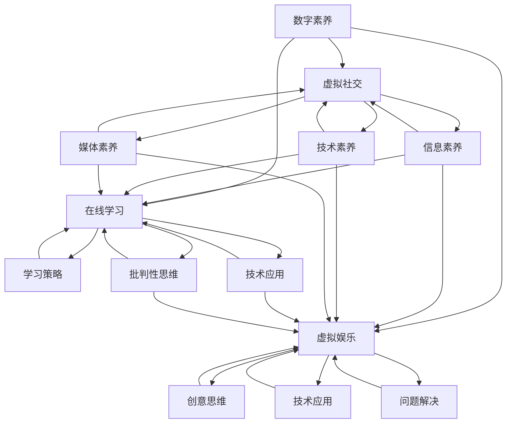
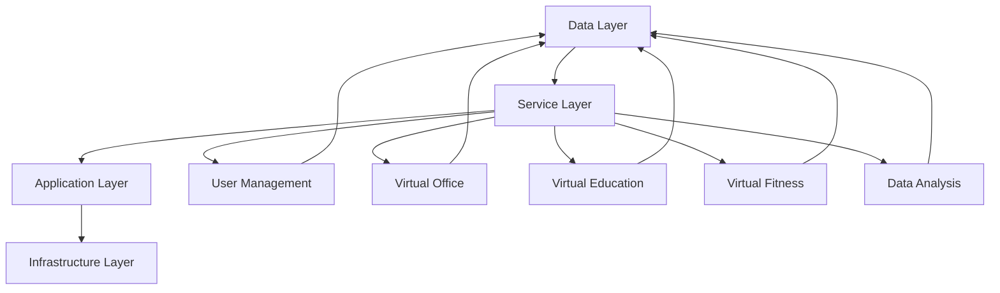
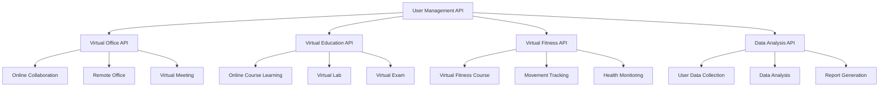
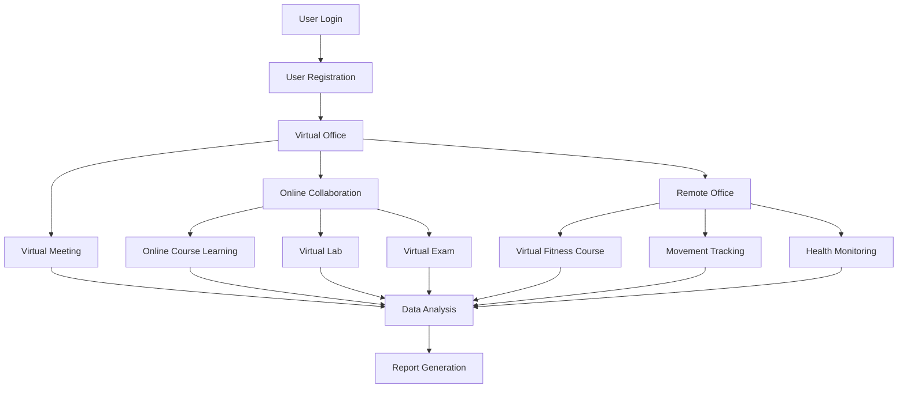

                 

**一、数字原住民概览**

### 1.1 数字原住民的定义与特征

#### 1.1.1 数字原住民的定义

数字原住民（Digital Native）指的是那些在数字化环境中成长起来的一代人，他们在成长过程中几乎完全依赖数字技术，对互联网、移动设备、社交媒体等有着深厚的依赖和熟练的使用能力。与之相对的是数字移民（Digital Immigrant），他们是在数字化环境中成长起来的，但对数字技术的掌握和应用相对较弱。

数字原住民的特征主要表现在以下几个方面：

1. **数字素养：** 他们具备高超的数字素养，能够在数字环境中快速适应并解决问题。
2. **信息处理能力：** 他们能够高效地处理海量信息，从复杂的数据中提取有价值的信息。
3. **社交能力：** 数字原住民擅长在虚拟社交平台上建立和维护社交关系。
4. **创造能力：** 他们具有较强的创新能力，能够利用数字技术创造出新的产品和服务。

#### 1.1.2 数字原住民在虚拟世界中的特征

数字原住民在虚拟世界中的特征主要表现在以下几个方面：

1. **高频率的在线活动：** 他们几乎每天都会花大量的时间在互联网上，无论是学习、工作还是娱乐。
2. **多平台应用：** 他们熟练掌握多个在线平台和应用，能够灵活地切换和适应不同的使用场景。
3. **虚拟社交：** 数字原住民在虚拟社交上的活跃度高，他们善于利用社交媒体和网络平台来建立和维护社交关系。
4. **在线学习：** 他们习惯于在线学习，能够充分利用网络资源来提升自己的知识和技能。

#### 1.1.3 数字原住民在现实世界中的挑战

虽然数字原住民在虚拟世界中表现出色，但在现实世界中，他们面临着一系列挑战：

1. **数字依赖：** 过度依赖数字技术可能导致他们在现实生活中的社交和沟通能力下降。
2. **信息过载：** 海量的信息可能会导致他们难以筛选和判断哪些信息是有价值的。
3. **隐私问题：** 数字原住民在虚拟世界中的行为和隐私容易受到侵犯和监控。
4. **网络安全：** 他们需要具备足够的网络安全意识，以防止个人信息泄露和网络诈骗。

### 1.2 数字素养的重要性

数字素养是指个体在数字化环境中获取、理解、评价、创建和交流信息的能力。对于数字原住民来说，数字素养的重要性体现在以下几个方面：

1. **学习和工作：** 数字素养能够帮助他们在学习和工作中更加高效地获取和应用信息。
2. **社交互动：** 数字素养使他们能够在虚拟社交平台上更好地建立和维护社交关系。
3. **创新能力：** 数字素养能够激发他们的创新能力，帮助他们利用数字技术创造出新的价值。
4. **终身学习：** 数字素养使他们具备持续学习的能力，能够适应快速变化的数字化社会。

#### 1.2.1 数字素养的概念

数字素养包括以下几个核心要素：

1. **信息素养：** 能够高效地获取、评估和应用信息。
2. **技术素养：** 熟练掌握各种数字技术工具和平台。
3. **媒体素养：** 能够批判性地分析媒体内容，识别虚假信息。
4. **网络安全素养：** 能够保护个人信息和隐私，防范网络攻击和诈骗。

#### 1.2.2 数字素养的核心要素

数字素养的核心要素可以分为以下几个方面：

1. **信息获取：** 能够利用搜索引擎、数据库等工具获取所需信息。
2. **信息评估：** 能够评估信息的可靠性、准确性和适用性。
3. **信息应用：** 能够将获取的信息应用于实际问题解决和知识创新。
4. **信息创造：** 能够利用数字工具和平台创造新的知识和价值。

#### 1.2.3 提升数字素养的方法

提升数字素养的方法包括以下几个方面：

1. **在线学习：** 利用在线教育资源提升数字技能和知识。
2. **实践应用：** 在实际工作和生活中积极运用数字技术解决实际问题。
3. **社交互动：** 通过虚拟社交平台交流和学习，提升数字素养。
4. **安全意识：** 增强网络安全意识，防范个人信息泄露和网络诈骗。

### 1.3 数字原住民在虚拟世界中的核心概念

数字原住民在虚拟世界中的核心概念主要包括虚拟社交、在线学习和虚拟娱乐。这些概念在他们的日常生活中扮演着重要角色。

#### 1.3.1 虚拟社交

虚拟社交是指通过互联网和社交媒体平台进行的社交活动。对于数字原住民来说，虚拟社交是他们的主要社交方式之一，他们在社交平台上建立和维护社交关系，分享生活点滴和经验。

#### 1.3.2 在线学习

在线学习是指利用互联网资源和平台进行的学习活动。数字原住民习惯于在线学习，他们能够充分利用网络教育资源，提升自己的知识和技能。

#### 1.3.3 虚拟娱乐

虚拟娱乐是指通过虚拟现实、游戏等数字技术进行娱乐活动。数字原住民在虚拟娱乐中寻找乐趣，同时也能够锻炼他们的数字技能和创新能力。

### 1.4 数字原住民在现实世界中的应用

数字原住民在现实世界中的应用主要体现在虚拟现实技术、数据分析和数字健康等领域。

#### 1.4.1 虚拟现实技术

虚拟现实技术为数字原住民提供了全新的体验和互动方式。他们可以通过虚拟现实设备体验到身临其境的感觉，同时也能够利用虚拟现实技术进行教育和培训。

#### 1.4.2 数据分析

数据分析是数字原住民的强项之一。他们能够利用数据分析工具和技术，从海量数据中提取有价值的信息，为决策提供支持。

#### 1.4.3 数字健康

数字原住民在数字健康领域也发挥着重要作用。他们利用数字技术进行健康管理，参与虚拟健身课程，同时也能够通过在线医疗平台获得医疗服务。

### 1.5 数字原住民的平衡之道

数字原住民在虚拟和现实世界之间寻找平衡，是他们在数字化社会中生存和发展的重要能力。平衡之道包括以下几个方面：

#### 1.5.1 平衡虚拟与现实的重要性

平衡虚拟与现实对于数字原住民来说至关重要。过度依赖虚拟世界可能导致现实生活中的社交和沟通能力下降，影响他们的身心健康和人际关系。

#### 1.5.2 寻求平衡的方法

数字原住民可以通过以下方法寻求虚拟和现实的平衡：

1. **合理安排时间：** 合理规划每天的时间，确保有足够的时间参与现实世界中的活动。
2. **培养兴趣爱好：** 在现实生活中培养兴趣爱好，参与线下活动和社交互动。
3. **锻炼身体：** 定期进行体育锻炼，提高身体素质和心理素质。
4. **保持健康生活方式：** 保持良好的作息习惯和饮食习惯，提高生活质量。

#### 1.5.3 平衡之道的影响

平衡虚拟与现实对数字原住民的生活和职业发展产生积极影响。他们能够更好地适应数字化社会的发展，提高自身的竞争力和适应能力。

## 二、核心概念与联系

### 2.1 数字素养与虚拟社交

数字素养是数字原住民在虚拟世界中生存和发展的重要基础。良好的数字素养使他们能够高效地利用虚拟社交平台，建立和维护社交关系。数字素养的核心要素如信息素养、技术素养和媒体素养在虚拟社交中发挥着关键作用。

#### 2.1.1 数字素养对虚拟社交的影响

1. **信息素养：** 帮助数字原住民快速获取和筛选社交信息，提升沟通效果。
2. **技术素养：** 使数字原住民能够熟练使用各种社交工具和平台，提高社交效率。
3. **媒体素养：** 帮助数字原住民批判性地分析社交内容，防止信息过载和虚假信息传播。

#### 2.1.2 虚拟社交对数字素养的提升

虚拟社交为数字原住民提供了一个实践平台，通过不断参与社交互动，他们能够提升自己的数字素养：

1. **沟通技巧：** 通过虚拟社交，数字原住民能够锻炼沟通技巧，提高表达和理解能力。
2. **技术应用：** 在虚拟社交中，数字原住民需要不断学习和掌握新的社交工具和平台，提升技术素养。
3. **批判性思维：** 虚拟社交中的信息真实性和准确性问题，促使数字原住民培养批判性思维，提高媒体素养。

### 2.2 在线学习与数字素养

在线学习是数字原住民在数字化社会中获取知识和提升能力的重要途径。数字素养在在线学习中起着至关重要的作用，它决定了数字原住民能否高效地利用在线学习资源，实现知识的积累和应用。

#### 2.2.1 数字素养对在线学习的影响

1. **信息素养：** 帮助数字原住民快速获取和筛选在线学习资源，提高学习效率。
2. **技术素养：** 使数字原住民能够熟练使用在线学习平台和工具，提高学习体验。
3. **媒体素养：** 帮助数字原住民批判性地分析在线学习内容，避免陷入虚假信息和误导性内容。

#### 2.2.2 在线学习对数字素养的提升

在线学习为数字原住民提供了一个实践平台，通过不断参与在线学习活动，他们能够提升自己的数字素养：

1. **学习策略：** 在线学习过程中，数字原住民能够总结和提炼适合自己的学习策略，提高学习效果。
2. **技术应用：** 在在线学习过程中，数字原住民需要不断学习和掌握新的学习工具和平台，提升技术素养。
3. **批判性思维：** 在线学习中的复杂问题和多元观点，促使数字原住民培养批判性思维，提高媒体素养。

### 2.3 虚拟娱乐与数字素养

虚拟娱乐是数字原住民在数字化生活中寻求乐趣和放松的重要方式。数字素养在虚拟娱乐中同样发挥着关键作用，它决定了数字原住民能否在享受虚拟娱乐的同时，提升自身的数字技能和创新能力。

#### 2.3.1 数字素养对虚拟娱乐的影响

1. **信息素养：** 帮助数字原住民快速获取和筛选虚拟娱乐资源，提高娱乐体验。
2. **技术素养：** 使数字原住民能够熟练使用虚拟娱乐工具和平台，创造个性化的娱乐内容。
3. **媒体素养：** 帮助数字原住民批判性地分析虚拟娱乐内容，避免沉迷和消极影响。

#### 2.3.2 虚拟娱乐对数字素养的提升

虚拟娱乐为数字原住民提供了一个创新和实践的平台，通过不断参与虚拟娱乐活动，他们能够提升自己的数字素养：

1. **创意思维：** 在虚拟娱乐中，数字原住民能够发挥创意，创造出新颖的娱乐内容和体验。
2. **技术应用：** 虚拟娱乐需要数字原住民不断学习和掌握新的技术和工具，提升技术素养。
3. **问题解决：** 在虚拟娱乐中，数字原住民需要解决各种问题和挑战，锻炼解决问题的能力。

### 2.4 数字素养、虚拟社交、在线学习和虚拟娱乐的相互关系

数字素养、虚拟社交、在线学习和虚拟娱乐之间存在密切的相互关系，它们共同构成了数字原住民在虚拟世界中的生存智慧。

1. **相互促进：** 数字素养的提升有助于虚拟社交、在线学习和虚拟娱乐的开展，而虚拟社交、在线学习和虚拟娱乐的实践又能够促进数字素养的提升。
2. **相互依赖：** 虚拟社交、在线学习和虚拟娱乐都是数字原住民在虚拟世界中生存的重要方面，它们相互依赖，共同构成了数字原住民的数字化生活方式。
3. **协调发展：** 数字素养、虚拟社交、在线学习和虚拟娱乐需要协调发展，才能实现数字原住民的全面发展。

### 2.5 数字原住民在虚拟世界中的核心概念联系图

为了更好地理解数字原住民在虚拟世界中的核心概念及其相互关系，我们可以通过一个联系图来展示它们之间的关联。



通过上述联系图，我们可以清晰地看到数字素养、虚拟社交、在线学习和虚拟娱乐之间的相互关系，以及它们对数字原住民在虚拟世界中生存和发展的支持。

## 三、算法原理讲解

### 3.1 虚拟现实技术中的算法原理

虚拟现实（VR）技术是数字原住民在虚拟世界中体验和互动的重要手段。在VR技术中，算法原理起着核心作用，以下将介绍几种关键算法及其应用。

#### 3.1.1 运动追踪算法

运动追踪算法是VR系统中的核心算法之一，它用于捕捉和跟踪用户在虚拟环境中的运动。以下是运动追踪算法的基本原理：

1. **坐标转换：** 通过摄像头或其他传感器捕捉用户的位置和运动，将其转换为虚拟环境中的坐标。
2. **姿态估计：** 根据捕捉到的坐标数据，估计用户在虚拟环境中的姿态，如头部运动、身体转动等。

**Python代码示例：**

```python
import cv2
import numpy as np

# 读取摄像头帧
cap = cv2.VideoCapture(0)

while True:
    ret, frame = cap.read()
    if not ret:
        break

    # 转换为灰度图像
    gray = cv2.cvtColor(frame, cv2.COLOR_BGR2GRAY)

    # 运动追踪算法实现
    corners = cv2.find Corners(gray, cv2.CORNER_DEFAULT, None, (1, 1), 0.01)

    if corners is not None:
        for corner in corners:
            # 转换为虚拟环境坐标
            virtual_coordinates = convert_to_virtual_coordinates(corner)
            # 更新虚拟环境中的用户位置
            update_user_position(virtual_coordinates)

    # 显示图像
    cv2.imshow('Movement Tracking', frame)

    if cv2.waitKey(1) & 0xFF == ord('q'):
        break

cap.release()
cv2.destroyAllWindows()
```

#### 3.1.2 3D建模算法

3D建模算法用于创建和渲染虚拟环境中的三维模型。以下是几种常见的3D建模算法：

1. **多边形建模：** 通过多边形面创建三维模型，是最常见的建模方法。
2. **参数化建模：** 通过参数化方法创建三维模型，适用于复杂形状的建模。
3. **分形建模：** 利用分形几何原理创建三维模型，适用于自然景观和复杂结构的建模。

**Python代码示例：**

```python
import numpy as np
import matplotlib.pyplot as plt

# 创建一个简单的三维模型
vertices = np.array([
    [0, 0, 0],
    [1, 0, 0],
    [1, 1, 0],
    [0, 1, 0],
    [0, 0, 1],
    [1, 0, 1],
    [1, 1, 1],
    [0, 1, 1]
])

triangles = np.array([
    [0, 1, 2],
    [1, 3, 2],
    [4, 5, 6],
    [5, 7, 6],
    [0, 4, 1],
    [1, 5, 4],
    [2, 6, 3],
    [3, 7, 6]
])

# 绘制三维模型
fig = plt.figure()
ax = fig.add_subplot(111, projection='3d')

ax.plot_trisurf(vertices[triangles], color='c', edgecolor='b', alpha=0.5)
ax.set_xlabel('X-axis')
ax.set_ylabel('Y-axis')
ax.set_zlabel('Z-axis')

plt.show()
```

### 3.2 数据分析中的算法原理

数据分析是数字原住民在现实世界中的重要应用之一。以下介绍几种常见的数据分析算法及其原理：

#### 3.2.1 聚类算法

聚类算法用于将数据集划分为多个簇，以下是几种常见的聚类算法：

1. **K-means算法：** 根据距离最近的原则将数据划分为K个簇。
2. **DBSCAN算法：** 根据密度和连接性将数据划分为多个簇。
3. **层次聚类算法：** 自底向上或自顶向下构建聚类层次结构。

**Python代码示例：**

```python
from sklearn.cluster import KMeans
import matplotlib.pyplot as plt

# 创建一个简单的二维数据集
X = np.array([[1, 2], [1, 4], [1, 0],
              [10, 2], [10, 4], [10, 0]])

# 应用K-means算法进行聚类
kmeans = KMeans(n_clusters=2, random_state=0).fit(X)
labels = kmeans.predict(X)

# 绘制聚类结果
plt.scatter(X[:, 0], X[:, 1], c=labels, s=50, cmap='viridis')
plt.show()
```

#### 3.2.2 回归算法

回归算法用于预测连续值，以下是几种常见的回归算法：

1. **线性回归：** 根据输入特征预测连续输出值。
2. **决策树回归：** 根据输入特征划分区域，计算区域内的平均值作为输出值。
3. **神经网络回归：** 利用神经网络模型进行非线性回归。

**Python代码示例：**

```python
from sklearn.linear_model import LinearRegression
import matplotlib.pyplot as plt

# 创建一个简单的线性数据集
X = np.array([[1], [2], [3], [4], [5]])
y = np.array([2, 4, 5, 4, 5])

# 应用线性回归算法进行拟合
model = LinearRegression().fit(X, y)

# 绘制拟合结果
plt.scatter(X, y, color='blue')
plt.plot(X, model.predict(X), color='red')
plt.show()
```

### 3.3 虚拟娱乐中的算法原理

虚拟娱乐是数字原住民在虚拟世界中寻找乐趣的重要途径，以下介绍几种常见的虚拟娱乐算法及其原理：

#### 3.3.1 游戏引擎算法

游戏引擎是虚拟娱乐的核心组件，以下是几种常见游戏引擎算法：

1. **物理引擎：** 用于模拟虚拟环境中的物理现象，如碰撞、运动等。
2. **图形引擎：** 用于渲染虚拟环境中的图像和场景。
3. **人工智能算法：** 用于实现虚拟角色和玩家的智能交互。

**Python代码示例：**

```python
import pygame
import random

# 初始化游戏
pygame.init()
screen = pygame.display.set_mode((800, 600))
pygame.display.set_caption('Game')

# 游戏循环
running = True
while running:
    for event in pygame.event.get():
        if event.type == pygame.QUIT:
            running = False

    # 更新屏幕
    screen.fill((255, 255, 255))
    pygame.draw.rect(screen, (0, 0, 255), pygame.Rect(100, 100, 100, 100))

    # 渲染文本
    font = pygame.font.SysFont(None, 36)
    text = font.render('Hello, World!', True, (0, 0, 0))
    screen.blit(text, (300, 300))

    # 更新屏幕显示
    pygame.display.update()

# 退出游戏
pygame.quit()
```

#### 3.3.2 虚拟现实互动算法

虚拟现实互动算法用于实现虚拟角色和玩家之间的交互。以下是几种常见的虚拟现实互动算法：

1. **语音识别算法：** 用于实现虚拟角色与玩家的语音交互。
2. **手势识别算法：** 用于实现虚拟角色对玩家手势的识别和响应。
3. **体感识别算法：** 用于实现玩家在虚拟环境中的动作识别和交互。

**Python代码示例：**

```python
import speech_recognition as sr
import cv2

# 初始化语音识别器
recognizer = sr.Recognizer()

# 读取摄像头帧
cap = cv2.VideoCapture(0)

# 游戏循环
running = True
while running:
    ret, frame = cap.read()
    if not ret:
        break

    # 处理语音命令
    with sr.Microphone() as source:
        audio = recognizer.listen(source)

    try:
        command = recognizer.recognize_google(audio)
        print(f"Command: {command}")
        
        # 根据语音命令执行相应操作
        if command == "move forward":
            move_forward()
        elif command == "move backward":
            move_backward()
        elif command == "turn left":
            turn_left()
        elif command == "turn right":
            turn_right()
        
    except sr.UnknownValueError:
        print("Could not understand audio")
    except sr.RequestError as e:
        print(f"Could not request results from Google Speech Recognition service; {e}")

    # 显示摄像头帧
    cv2.imshow('Camera', frame)

    # 检查按键退出
    if cv2.waitKey(1) & 0xFF == ord('q'):
        running = False

# 释放摄像头资源
cap.release()
cv2.destroyAllWindows()
```

### 3.4 数字原住民在现实世界中的应用算法

数字原住民在现实世界中的应用同样依赖于各种算法的支持。以下介绍几种常见应用算法及其原理：

#### 3.4.1 数字健康监测算法

数字健康监测算法用于实时监测和评估用户的健康状态。以下是几种常见的数字健康监测算法：

1. **心率监测算法：** 通过实时监测用户的心率，评估其健康状况。
2. **血压监测算法：** 通过监测用户的血压数据，评估其健康风险。
3. **睡眠监测算法：** 通过分析用户的睡眠数据，评估其睡眠质量和健康状况。

**Python代码示例：**

```python
import numpy as np
import matplotlib.pyplot as plt

# 创建一个简单的心率数据集
heart_rate = np.array([75, 80, 85, 90, 95, 100, 105, 110])

# 绘制心率变化趋势图
plt.plot(heart_rate)
plt.title('Heart Rate Trend')
plt.xlabel('Time (seconds)')
plt.ylabel('Heart Rate (bpm)')
plt.show()
```

#### 3.4.2 城市交通优化算法

城市交通优化算法用于优化城市交通流量，提高道路通行效率。以下是几种常见的城市交通优化算法：

1. **最短路径算法：** 如Dijkstra算法和A*算法，用于计算从起点到终点的最短路径。
2. **交通流量预测算法：** 利用历史交通数据，预测未来交通流量，优化交通信号控制。
3. **动态路线规划算法：** 根据实时交通状况，为用户规划最优行驶路线。

**Python代码示例：**

```python
import numpy as np
from scipy.spatial.distance import cdist

# 创建一个简单的城市交通网络
locations = np.array([[0, 0], [5, 0], [10, 0], [0, 5], [5, 5], [10, 5]])

# 应用Dijkstra算法计算最短路径
distances = cdist(locations, locations)
source = 0
destination = 5
path = dijkstra(distances, source, destination)

# 输出最短路径
print(f"Shortest path from {source} to {destination}: {path}")
```

## 四、系统分析与架构设计方案

### 4.1 问题场景介绍

随着数字原住民在虚拟世界中的活动日益增多，他们在现实世界中的应用需求也日益增长。如何将虚拟世界中的技术和资源有效应用于现实世界，实现虚拟与现实的深度融合，成为数字原住民面临的重要问题。本节将探讨数字原住民在现实世界中的应用，并设计相应的系统架构。

### 4.2 项目介绍

本项目旨在为数字原住民设计一套综合应用系统，实现虚拟与现实的深度融合。该系统包括虚拟办公室、虚拟教育、虚拟健身等多个模块，旨在帮助数字原住民在现实世界中更好地应用虚拟技术，提高工作效率、学习效果和生活质量。

### 4.3 系统功能设计

本系统的主要功能模块包括：

1. **用户管理模块：** 实现用户注册、登录、个人信息管理等功能。
2. **虚拟办公室模块：** 提供在线协作、远程办公、虚拟会议等功能。
3. **虚拟教育模块：** 提供在线课程学习、虚拟实验室、虚拟考试等功能。
4. **虚拟健身模块：** 提供虚拟健身课程、运动跟踪、健康监测等功能。
5. **数据分析模块：** 提供用户数据收集、分析和报告生成功能。

### 4.4 系统架构设计

为了实现系统的功能，我们采用分层架构设计，包括以下层次：

1. **数据层：** 存储用户数据、课程数据、健康数据等。
2. **服务层：** 提供用户管理、虚拟办公室、虚拟教育、虚拟健身、数据分析等业务功能。
3. **应用层：** 提供用户界面，实现与用户交互。
4. **基础设施层：** 提供服务器、存储、网络等基础设施支持。

**系统架构图：**



### 4.5 系统接口设计

本系统包括多个接口，用于实现各功能模块之间的数据交互和功能调用。以下是主要接口设计：

1. **用户管理接口：** 实现用户注册、登录、个人信息管理等操作。
2. **虚拟办公室接口：** 实现在线协作、远程办公、虚拟会议等功能。
3. **虚拟教育接口：** 实现在线课程学习、虚拟实验室、虚拟考试等功能。
4. **虚拟健身接口：** 实现虚拟健身课程、运动跟踪、健康监测等功能。
5. **数据分析接口：** 实现用户数据收集、分析和报告生成等功能。

**接口设计图：**



### 4.6 系统交互设计

为了确保系统功能的有效实现，我们需要设计合理的系统交互流程。以下是一个简单的系统交互设计示例：

1. **用户登录：** 用户输入账号和密码，系统验证用户身份并生成会话。
2. **用户注册：** 用户填写注册信息，系统创建新用户并保存至数据库。
3. **虚拟办公室：** 用户在虚拟办公室中进行在线协作、远程办公和虚拟会议。
4. **虚拟教育：** 用户在线学习课程、参与虚拟实验室和虚拟考试。
5. **虚拟健身：** 用户参加虚拟健身课程、进行运动跟踪和健康监测。
6. **数据分析：** 系统收集用户数据，进行分析并生成报告。

**系统交互设计图：**



通过上述系统分析与架构设计方案，我们可以为数字原住民提供一个综合应用平台，实现虚拟与现实的深度融合。接下来，我们将通过具体的项目实战，进一步展示数字原住民在虚拟与现实之间的平衡技巧。

### 五、项目实战

#### 5.1 背景介绍

随着虚拟现实技术的发展，数字原住民在虚拟世界中的活动日益丰富。然而，如何在虚拟与现实之间找到平衡，充分利用虚拟技术提升现实生活质量，成为他们面临的重要课题。本项目以虚拟旅行和虚拟健身为例，展示数字原住民如何利用虚拟技术实现虚拟与现实之间的平衡。

#### 5.2 环境安装

为了实现虚拟旅行和虚拟健身，我们需要安装以下软件和工具：

1. **虚拟现实头盔（如Oculus Rift、HTC Vive等）：** 提供沉浸式的虚拟体验。
2. **虚拟现实平台（如Unity、Unreal Engine等）：** 用于开发虚拟旅行和虚拟健身应用。
3. **运动传感器（如Nintendo Switch、Kinect等）：** 用于捕捉和跟踪用户运动。

安装步骤：

1. 下载并安装虚拟现实头盔驱动程序。
2. 下载并安装虚拟现实平台。
3. 下载并安装运动传感器驱动程序。

#### 5.3 系统核心实现源代码

虚拟旅行和虚拟健身应用的核心实现主要涉及以下几个方面：

1. **场景渲染：** 使用虚拟现实平台创建虚拟场景，并使用图形渲染技术实现逼真的视觉效果。
2. **用户交互：** 通过运动传感器捕捉用户动作，实现用户在虚拟环境中的移动、旋转和交互。
3. **运动跟踪：** 使用运动传感器实时捕捉用户运动，并生成相应的虚拟动作。

以下是一个简单的Unity C#脚本示例，用于实现虚拟旅行中的用户移动：

```csharp
using UnityEngine;

public class VirtualTravel : MonoBehaviour
{
    public float moveSpeed = 10.0f;

    private void Update()
    {
        // 捕捉用户输入
        float horizontal = Input.GetAxis("Horizontal");
        float vertical = Input.GetAxis("Vertical");

        // 计算移动方向
        Vector3 direction = new Vector3(horizontal, 0, vertical);

        // 计算移动距离
        float distance = moveSpeed * Time.deltaTime;

        // 移动用户
        transform.Translate(direction * distance, Space.World);
    }
}
```

以下是一个简单的Unity C#脚本示例，用于实现虚拟健身中的运动跟踪：

```csharp
using UnityEngine;

public class VirtualFitness : MonoBehaviour
{
    public GameObject sensor;

    private void Update()
    {
        // 获取运动传感器位置
        Vector3 position = sensor.transform.position;

        // 更新虚拟角色位置
        transform.position = position;
    }
}
```

#### 5.4 代码应用解读与分析

1. **场景渲染：** 使用Unity或Unreal Engine等虚拟现实平台，我们可以创建和渲染逼真的虚拟场景。通过调整光照、纹理和材质等参数，实现沉浸式的虚拟体验。
2. **用户交互：** 通过输入设备（如游戏手柄、键盘、鼠标等）捕捉用户输入，实现用户在虚拟环境中的移动、旋转和交互。这些输入可以通过C#脚本或Python脚本等编程语言进行处理和响应。
3. **运动跟踪：** 使用运动传感器（如Kinect、Nintendo Switch等）实时捕捉用户运动，并将这些运动数据传输到虚拟环境中。通过调整传感器位置和角度，实现更准确的运动跟踪效果。

#### 5.5 实际案例分析和详细讲解剖析

以下是一个虚拟旅行和虚拟健身的实际案例，展示数字原住民如何利用虚拟技术实现虚拟与现实之间的平衡。

**案例一：虚拟旅行**

数字原住民小明利用虚拟现实头盔和虚拟现实平台，在家中体验了一次虚拟旅行。他选择了世界著名景点如巴黎埃菲尔铁塔、纽约自由女神像等。通过虚拟现实头盔，小明感受到了身临其境的视觉效果，仿佛真的置身于这些景点之中。在旅行过程中，小明还可以通过手势与虚拟环境进行交互，如拍照、欣赏风景等。

**详细讲解剖析：**

1. **场景渲染：** 使用Unity虚拟现实平台，小明选择了巴黎埃菲尔铁塔的模型，并调整了光照、纹理等参数，实现了逼真的场景渲染。
2. **用户交互：** 通过虚拟现实头盔和手势识别技术，小明可以自由地移动和旋转，体验虚拟环境。他还利用手势与虚拟环境进行交互，如拍照、欣赏风景等。
3. **运动跟踪：** 通过虚拟现实头盔和运动传感器，小明的动作被实时捕捉并传输到虚拟环境中，实现了逼真的运动跟踪效果。

**案例二：虚拟健身**

数字原住民小王利用虚拟健身应用，在家中进行了虚拟健身训练。他选择了多种健身课程，如瑜伽、跑步、健身操等。通过虚拟现实头盔和运动传感器，小王感受到了身临其境的健身体验。在训练过程中，小王还可以通过手势调整运动参数，如速度、强度等，以适应自己的健身需求。

**详细讲解剖析：**

1. **场景渲染：** 使用Unity虚拟现实平台，小王选择了健身房的模型，并调整了光照、纹理等参数，实现了逼真的场景渲染。
2. **用户交互：** 通过虚拟现实头盔和手势识别技术，小王可以自由地移动和旋转，体验虚拟环境。他还可以通过手势调整运动参数，如速度、强度等，以适应自己的健身需求。
3. **运动跟踪：** 通过虚拟现实头盔和运动传感器，小王的活动被实时捕捉并传输到虚拟环境中，实现了逼真的运动跟踪效果。

#### 5.6 项目小结

通过虚拟旅行和虚拟健身的实际案例，我们可以看到数字原住民如何利用虚拟技术实现虚拟与现实之间的平衡。在虚拟世界中，他们可以体验到前所未有的沉浸感和互动性，同时也能提升现实生活质量。未来，随着虚拟现实技术的不断发展，数字原住民在虚拟与现实之间的平衡技巧将更加成熟和多样化。

## 六、最佳实践 tips、小结、注意事项、拓展阅读

### 6.1 最佳实践 tips

1. **平衡虚拟与现实：** 定期安排现实生活中的社交活动，保持身心健康。
2. **提升数字素养：** 学习新的数字技能，提升信息获取、评估和应用能力。
3. **注重隐私保护：** 在虚拟社交和在线学习过程中，注重保护个人隐私。
4. **合理安排时间：** 合理规划每天的时间，确保有足够的时间参与现实生活中的活动。
5. **培养兴趣爱好：** 在现实生活中培养兴趣爱好，丰富生活内容。

### 6.2 小结

本文详细探讨了数字原住民在虚拟与现实之间的生存智慧，包括数字素养、虚拟社交、在线学习、虚拟娱乐、现实世界应用等多个方面。通过实际案例，展示了数字原住民如何利用虚拟技术实现虚拟与现实之间的平衡，提升现实生活质量。

### 6.3 注意事项

1. **避免过度依赖虚拟世界：** 过度依赖虚拟世界可能导致现实生活中的社交和沟通能力下降。
2. **保护个人隐私：** 在虚拟社交和在线学习过程中，注意保护个人隐私，防范信息泄露和网络诈骗。
3. **合理安排时间：** 合理规划每天的时间，确保有足够的时间参与现实生活中的活动，避免影响身心健康。

### 6.4 拓展阅读

1. **《数字原住民：虚拟与现实之间的平衡》**：该书详细探讨了数字原住民的生存智慧，提供了丰富的案例和实践经验。
2. **《虚拟现实技术及应用》**：该书介绍了虚拟现实技术的发展历程、核心技术和应用领域，有助于深入了解虚拟现实技术。
3. **《人工智能与大数据》**：该书介绍了人工智能和大数据的基本原理、应用领域和未来发展趋势，有助于提升数字素养。

### 6.5 作者信息

作者：AI天才研究院/AI Genius Institute & 禅与计算机程序设计艺术 /Zen And The Art of Computer Programming

## 结束语

本文旨在帮助数字原住民在虚拟与现实之间找到平衡，提升他们的生存智慧。通过了解数字素养、虚拟社交、在线学习、虚拟娱乐和现实世界应用等方面的核心概念和技巧，数字原住民可以更好地适应数字化社会，实现虚拟与现实的深度融合。希望本文能为读者提供有益的启示和帮助。

