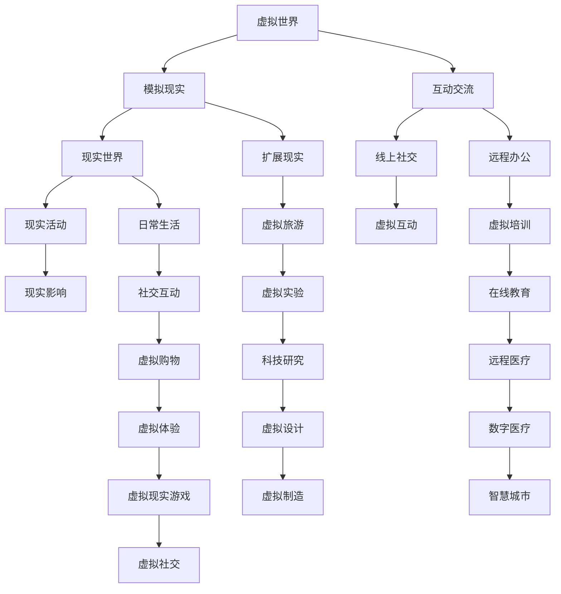
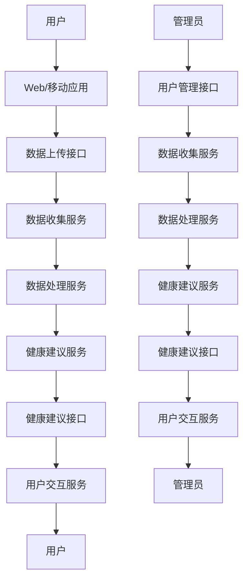

                 

### 文章标题：在虚拟与现实之间寻找平衡：数字时代的生存之道

#### 关键词：
- 数字时代
- 虚拟与现实
- 心理调适
- 数字工具
- 系统架构设计

#### 摘要：
本文深入探讨了在数字时代如何平衡虚拟与现实的关系。通过介绍数字时代的特点和挑战，我们探讨了保持平衡的重要性。文章将详细分析核心概念，包括虚拟与现实、数字工具的使用与优化，以及如何设计数字与现实之间的桥梁。此外，我们将通过实际案例和项目实战，提供实用的策略和建议，帮助读者在数字时代的生存中找到平衡点。

---

# 目录大纲

## I. 引言：数字时代的变革与挑战

### 1.1 数字时代的来临

### 1.2 虚拟与现实的双面性

### 1.3 保持平衡的必要性

## II. 核心概念解析

### 2.1 虚拟与现实的概念界定

#### 2.1.1 虚拟世界的定义

#### 2.1.2 现实世界的定义

#### 2.1.3 虚拟与现实的关系

### 2.2 数字生活的优势与劣势

#### 2.2.1 数字生活的优势

#### 2.2.2 数字生活的劣势

#### 2.2.3 平衡优势与劣势的策略

### 2.3 心理调适的重要性

#### 2.3.1 心理调适的定义

#### 2.3.2 心理调适的方法

#### 2.3.3 心理调适的实践

## III. 数字工具的使用与优化

### 3.1 数字工具的类型与功能

#### 3.1.1 社交媒体的优缺点

#### 3.1.2 线上教育的优势与挑战

#### 3.1.3 其他数字工具的应用

### 3.2 使用算法优化数字工具

#### 3.2.1 算法的概念

#### 3.2.2 算法的优化方法

#### 3.2.3 案例分析

## IV. 构建数字与现实之间的桥梁

### 4.1 系统架构设计原则

#### 4.1.1 设计原则概述

#### 4.1.2 可用性设计

#### 4.1.3 安全性设计

### 4.2 数字工具的选择与应用

#### 4.2.1 工具选择标准

#### 4.2.2 工具应用场景

#### 4.2.3 工具集成策略

### 4.3 实际案例分析

## V. 项目实战与最佳实践

### 5.1 实战项目介绍

### 5.2 系统核心实现与源代码

#### 5.2.1 环境安装

#### 5.2.2 系统核心实现源代码

#### 5.2.3 代码应用解读与分析

### 5.3 实际案例分析与详细讲解剖析

### 5.4 小结与注意事项

## VI. 结语：寻找数字时代的生存之道

### 6.1 平衡的艺术

### 6.2 小结

### 6.3 拓展阅读

---

## I. 引言：数字时代的变革与挑战

### 1.1 数字时代的来临

随着互联网、大数据、人工智能等技术的飞速发展，我们正步入一个全新的数字时代。数字技术已经深入到我们生活的方方面面，从工作到娱乐，从学习到社交，无不受到数字化的影响。这种变革带来了前所未有的便利和效率，但同时也引发了诸多挑战。

首先，数字时代的来临意味着信息获取和传播的速度极大地加快。我们可以通过互联网快速获取全球各地的信息，这在过去是无法想象的。然而，这也导致了信息的过载和真假难辨的问题。如何在海量信息中筛选出有价值的内容，成为我们面临的重大挑战之一。

其次，数字技术改变了我们的工作和生活方式。远程办公、在线教育、电子商务等数字工具的应用，让我们可以在家中完成许多原本需要外出完成的工作。这不仅提高了工作效率，也为我们提供了更多的选择和灵活性。然而，长时间依赖数字工具也容易导致人际关系疏离、心理健康问题等负面影响。

### 1.2 虚拟与现实的双面性

在数字时代，虚拟与现实之间的关系变得愈发复杂。虚拟世界，作为一个由数字技术构建的平行空间，为人们提供了无限的可能性和创造力。我们可以在这里创造自己的身份、参与各种社交活动、甚至是体验虚拟现实游戏带来的沉浸式体验。然而，虚拟世界的便捷和吸引力也带来了许多问题。

一方面，虚拟世界为人们提供了逃离现实困境的机会。在现实生活中面临的压力和挑战，可以通过虚拟世界得到释放和舒缓。然而，过度沉迷于虚拟世界可能会导致人们对现实生活的忽视，甚至产生社交障碍和心理问题。

另一方面，虚拟世界的发展也对现实世界产生了深远的影响。例如，在线购物的普及改变了传统的零售模式，远程办公则对传统的工作方式提出了新的挑战。这些变化既带来了便利，也引发了一系列新的问题和挑战，需要我们认真思考和应对。

### 1.3 保持平衡的必要性

在数字时代的浪潮中，保持虚拟与现实之间的平衡显得尤为重要。首先，平衡有助于我们更好地利用数字技术带来的便利，同时避免其带来的负面影响。例如，我们可以通过合理规划时间，既享受在线教育的便捷，又保持与现实人际交往的紧密。

其次，平衡有助于我们维护心理健康。长期过度依赖虚拟世界，容易导致心理疲劳和社交障碍。通过保持与现实世界的联系，我们可以更好地调节情绪，减轻心理压力。

最后，平衡也是实现个人成长和职业发展的关键。在数字时代，技能更新速度快，我们需要不断学习新知识、掌握新技能。通过保持虚拟与现实之间的平衡，我们可以更有效地投入学习和工作，提高自身竞争力。

因此，保持虚拟与现实之间的平衡不仅是应对数字时代挑战的必要手段，也是实现个人全面发展的关键。接下来，我们将进一步探讨核心概念，深入分析如何在实际生活中实现这种平衡。

### 2.1 虚拟与现实的概念界定

#### 2.1.1 虚拟世界的定义

虚拟世界是一个由数字技术构建的虚拟环境，通过计算机模拟实现。在这个环境中，人们可以创建和交互虚拟对象，体验虚拟现实游戏、社交互动、在线购物等。虚拟世界是一个由0和1组成的数字空间，具有无限的可能性和创造力。

虚拟世界的特点包括：

1. **可塑性**：虚拟世界可以根据用户的意愿进行修改和定制，创造出各种想象中的场景和角色。
2. **沉浸性**：虚拟现实技术（VR）和增强现实技术（AR）的发展，使得用户可以更加沉浸地体验虚拟世界，甚至产生一种“身临其境”的感觉。
3. **灵活性**：虚拟世界不受物理世界的限制，用户可以在其中自由探索和实验，不受时间和空间的约束。

#### 2.1.2 现实世界的定义

现实世界是我们生活其中的物质世界，包括自然界的万物和人类社会的各个方面。现实世界是客观存在的，可以通过感官直接感知。它具有以下特点：

1. **客观性**：现实世界是独立于人类意识的客观存在，不受主观意志的直接影响。
2. **现实性**：现实世界中的事物和事件是真实发生的，具有实际的意义和作用。
3. **多样性**：现实世界是一个复杂多样的系统，包括生物、物理、化学、社会等多个层面。

#### 2.1.3 虚拟与现实的关系

虚拟世界与现实世界之间的关系是相互交织、相互影响的。一方面，虚拟世界是对现实世界的模拟和扩展，许多虚拟世界的元素和活动源于现实世界的需求和创新。另一方面，虚拟世界对现实世界产生了深远的影响，改变了人们的认知和行为方式。

1. **互动性**：虚拟世界和现实世界之间的互动越来越紧密，人们通过虚拟世界与现实世界进行交流和互动，如在线购物、远程办公等。
2. **互补性**：虚拟世界和现实世界相互补充，虚拟世界提供了许多现实世界无法实现的体验和功能，如虚拟旅游、虚拟实验等。
3. **影响性**：虚拟世界的发展对现实世界产生了重要影响，改变了人们的生产方式、生活方式和社交方式。

#### 2.1.4 虚拟与现实的关系图表

为了更好地理解虚拟与现实之间的关系，我们可以通过Mermaid流程图展示其基本架构和交互模式。



通过上述流程图，我们可以看出虚拟与现实之间的复杂关系和互动模式。这种关系不仅影响我们的日常生活，也改变了社会的运行方式，使得虚拟与现实之间的界限变得越来越模糊。

### 2.2 数字生活的优势与劣势

随着数字技术的发展，我们的生活方式发生了巨大的变化。数字生活带来了诸多便利和机遇，但同时也带来了一些挑战和问题。理解数字生活的优势与劣势，有助于我们更好地平衡虚拟与现实之间的关系。

#### 2.2.1 数字生活的优势

1. **提高效率**：数字工具和在线服务的普及，大大提高了我们处理事务的效率。例如，电子邮件取代了传统的纸质信函，在线办公系统让远程协作变得更加便捷。

2. **节省时间**：通过数字化工具，我们可以快速获取信息、处理任务，从而节省了大量的时间。例如，网上购物让我们无需亲自前往商店，便可以购买所需的商品。

3. **增强连接性**：数字技术使我们能够随时随地与朋友、家人和同事保持联系。社交媒体和即时通讯工具让全球的沟通变得无比便捷。

4. **丰富娱乐体验**：数字技术为娱乐活动带来了新的可能，如在线游戏、虚拟现实体验等。这些技术为我们提供了全新的娱乐方式，极大地丰富了我们的生活。

5. **提供个性化服务**：通过分析用户的偏好和行为数据，数字技术可以提供个性化的服务和建议。例如，个性化推荐系统可以帮助我们找到符合兴趣的内容和服务。

#### 2.2.2 数字生活的劣势

1. **信息过载**：数字时代信息量爆炸性增长，但信息的真实性和质量无法保证。我们常常需要花费大量时间筛选和验证信息，这可能导致信息焦虑和决策困难。

2. **隐私泄露**：数字生活使得个人数据变得更加容易被收集和分析。虽然这有助于提供个性化服务，但也增加了隐私泄露的风险。

3. **心理健康问题**：长时间使用数字工具可能导致心理健康问题，如焦虑、抑郁和睡眠障碍。过度沉迷于虚拟世界也可能导致现实生活中的社交障碍和人际关系疏离。

4. **依赖性问题**：随着数字工具的广泛应用，一些人可能对数字设备产生依赖。这种依赖不仅影响工作效率，还可能导致生活中出现其他问题。

5. **技术失业**：随着自动化和人工智能技术的发展，一些传统职业可能被取代。这可能导致就业机会减少，对社会稳定构成威胁。

#### 2.2.3 平衡优势与劣势的策略

为了在数字生活中保持平衡，我们可以采取以下策略：

1. **合理规划时间**：设定固定的在线和离线时间，确保在享受数字生活的同时，也能充分体验现实生活。

2. **数字素养教育**：提高个人的数字素养，学会有效地筛选和处理信息，保护个人隐私和数据安全。

3. **心理调适**：通过心理健康教育和自我调节，提高应对数字生活带来的压力和挑战的能力。

4. **社交互动**：在现实生活中保持人际交往，参与社区活动，以缓解因过度依赖虚拟世界而导致的社交疏离。

5. **技术和人力的结合**：在工作和生活中，合理运用数字工具，同时保留人力和智慧的独特价值。

通过上述策略，我们可以在享受数字生活带来的便利和机遇的同时，减少其潜在的负面影响，实现虚拟与现实之间的平衡。

### 2.3 心理调适的重要性

在数字时代，保持心理健康变得尤为重要。随着数字工具的普及和在线生活的常态化，人们面临的心理压力和挑战日益增加。有效的心理调适不仅有助于我们更好地应对数字生活的挑战，还能提高整体生活质量。以下是心理调适的重要性和相关方法。

#### 2.3.1 心理调适的定义

心理调适是指通过一系列方法来调节和管理自己的情绪、认知和行为，以适应生活中的各种压力和挑战。在数字时代，心理调适的目标是帮助我们更好地平衡虚拟与现实之间的关系，减轻因过度依赖数字技术而带来的负面心理影响。

#### 2.3.2 心理调适的方法

1. **自我认知**：首先，我们需要了解自己的心理状态和需求。通过反思和自我观察，识别出哪些因素可能导致心理压力，并明确自己的目标和期望。

2. **时间管理**：合理安排时间，确保工作和休息的平衡。设定固定的在线和离线时间，避免长时间沉迷于虚拟世界。例如，每天设定半小时的在线学习和娱乐时间，其余时间专注于现实生活中的活动。

3. **健康生活方式**：保持良好的生活习惯，如规律作息、健康饮食和适量运动。这些习惯有助于提高身体素质，增强心理抵抗力。

4. **社交互动**：积极参与现实生活中的社交活动，与家人、朋友和同事保持密切联系。社交互动可以提供情感支持和安全感，减轻孤独感和焦虑。

5. **心理教育**：通过心理健康教育，学习应对压力和挑战的技巧。例如，掌握放松技巧、情绪调节方法和认知重构策略，以提高心理韧性。

6. **数字素养**：提高数字素养，学会理性使用数字工具。避免沉迷于社交媒体和在线游戏，确保数字生活对心理健康的影响是积极的。

#### 2.3.3 心理调适的实践

1. **制定健康计划**：制定一个详细的健康计划，包括作息时间、饮食安排和运动计划。例如，每天晚上睡前进行半小时的瑜伽练习，保持规律的作息时间。

2. **参与社区活动**：参加社区活动，如志愿者工作、社区会议和兴趣小组。这些活动可以提供社交机会，增强社区归属感。

3. **心理咨询服务**：如果遇到严重的心理问题，可以寻求专业的心理咨询服务。心理咨询师可以帮助我们识别问题、提供解决方案，并指导我们进行有效的心理调适。

4. **数字工具选择**：选择对心理健康有益的数字工具，避免沉迷于有害的数字活动。例如，选择有助于学习和自我提升的在线课程，而不是沉迷于消磨时间的社交媒体。

通过上述方法和实践，我们可以在数字时代保持良好的心理健康，实现虚拟与现实之间的平衡。心理调适不仅有助于我们应对生活中的各种挑战，还能提高整体生活质量和幸福感。

### 3.1 数字工具的类型与功能

在数字时代，各种数字工具的普及和应用极大地改变了我们的生活方式。这些工具不仅提高了工作效率，也为我们提供了丰富的娱乐和社交体验。下面我们将详细介绍几种常见的数字工具，包括社交媒体、在线教育和其他实用工具，并分析它们的优缺点。

#### 3.1.1 社交媒体的优缺点

社交媒体如Facebook、Twitter和微信等，已成为现代社会不可或缺的一部分。它们为用户提供了即时通讯、信息分享和社交互动的平台。

**优点**：

1. **即时通讯**：社交媒体使得用户可以随时随地与朋友、家人和同事保持联系。这种即时通讯功能极大地提高了沟通效率。
2. **信息分享**：用户可以轻松地分享文字、图片、视频等多媒体内容，实现信息的快速传播。
3. **社交互动**：通过社交媒体，用户可以加入兴趣小组、参与讨论，扩展社交圈子。

**缺点**：

1. **信息过载**：社交媒体上的信息量庞大，用户需要花费大量时间筛选和验证信息的真实性和相关性。
2. **隐私泄露**：社交媒体平台收集用户的大量数据，存在隐私泄露的风险。
3. **心理健康问题**：过度使用社交媒体可能导致心理健康问题，如焦虑、抑郁和睡眠障碍。

#### 3.1.2 线上教育的优势与挑战

随着在线教育平台的兴起，越来越多的人选择通过网络学习新知识、提升技能。

**优势**：

1. **灵活性强**：在线教育不受时间和地点的限制，用户可以根据自己的时间表进行学习。
2. **资源丰富**：在线教育平台提供了海量的学习资源，包括视频课程、电子书、练习题等。
3. **个性化学习**：许多在线教育平台根据用户的学习进度和兴趣，提供个性化的学习建议和推荐。

**挑战**：

1. **自律要求高**：在线教育需要用户具备较强的自律能力，否则容易陷入拖延和懈怠。
2. **教学质量不一**：在线教育平台上的教学质量参差不齐，用户需要仔细选择和评估课程。
3. **缺乏面对面互动**：在线教育缺乏传统课堂中的面对面互动和交流，可能导致学习体验的单一。

#### 3.1.3 其他数字工具的应用

除了社交媒体和在线教育，还有许多其他数字工具在日常生活中发挥着重要作用。

**1. 云计算服务**：

云计算服务如Google Drive、Dropbox和AWS等，为用户提供了便捷的文件存储和共享解决方案。

**优点**：

- **高效存储**：云计算服务提供了巨大的存储空间，用户可以随时随地访问和同步文件。
- **安全可靠**：专业化的云服务商提供了高水平的数据保护和备份服务。

**缺点**：

- **依赖网络**：云计算服务依赖于稳定的网络连接，网络故障可能导致服务中断。

**2. 智能家居设备**：

智能家居设备如智能音箱、智能灯光和智能门锁等，使得家庭生活更加便捷和智能化。

**优点**：

- **自动化控制**：智能家居设备通过物联网技术实现自动化控制，提高了生活便利性。
- **节能环保**：智能家居设备可以通过智能控制实现能源的优化利用。

**缺点**：

- **隐私问题**：智能家居设备收集用户的生活习惯和偏好数据，存在隐私泄露的风险。
- **技术依赖**：智能家居设备需要定期维护和升级，否则可能导致故障和功能受限。

综上所述，数字工具在提高生活便利性和效率方面具有显著优势，但也带来了一些潜在的挑战和问题。合理选择和使用这些工具，有助于我们更好地适应数字时代，实现虚拟与现实之间的平衡。

### 3.2 使用算法优化数字工具

在数字时代，算法是优化数字工具的核心技术之一。通过算法的优化，我们可以提高数字工具的性能、效率和用户体验。以下是算法优化的基本概念、常用方法和实际案例分析。

#### 3.2.1 算法的概念

算法是一种解决特定问题的系统方法，它通过一系列规则或步骤，将输入转换为预期的输出。在计算机科学中，算法是实现特定任务的关键，它们可以用来处理数据、执行计算和解决问题。

#### 3.2.2 算法的优化方法

1. **算法优化目标**：

   算法优化的主要目标是提高性能、效率和可扩展性。具体来说，包括：

   - **时间复杂度**：减少算法执行所需的时间。
   - **空间复杂度**：减少算法所需的存储空间。
   - **可扩展性**：算法能够适应不同规模的问题。

2. **常用优化方法**：

   - **分治算法**：将大问题分解成小问题，分别解决，然后再合并结果。
   - **动态规划**：通过存储中间结果来避免重复计算，提高效率。
   - **贪心算法**：每一步都做出在当前状态下最优的选择，期望得到全局最优解。
   - **随机化算法**：引入随机因素，提高算法的鲁棒性和效率。

3. **性能优化技术**：

   - **并行计算**：利用多处理器系统，将任务分解并行执行，提高处理速度。
   - **缓存技术**：利用缓存存储频繁访问的数据，减少访问时间。
   - **算法工程**：针对特定应用场景进行算法定制和优化，以获得最佳性能。

#### 3.2.3 案例分析

以下是一个使用算法优化搜索引擎的案例：

**案例背景**：

一个搜索引擎需要在毫秒级别内处理用户的查询请求，并提供相关的搜索结果。由于用户查询量巨大，传统的线性搜索方法效率低下，需要通过算法优化来提高性能。

**解决方案**：

1. **索引优化**：

   通过建立倒排索引，将文档中的词汇映射到对应的文档ID，提高查询效率。倒排索引的结构使得在处理用户查询时，可以快速定位到包含特定词汇的文档，从而减少了搜索范围。

2. **查询优化**：

   利用布尔搜索算法，根据用户的查询语句构建查询树，并通过合并和剪枝操作优化查询路径。布尔搜索算法可以根据逻辑运算符（如AND、OR、NOT）对查询结果进行精确控制，提高搜索的准确性和效率。

3. **排序优化**：

   使用快速排序或归并排序等高效排序算法，对查询结果进行排序。排序优化可以确保搜索结果按照相关度优先展示，提高用户体验。

4. **缓存技术**：

   利用缓存技术存储热门查询结果，减少重复计算。通过缓存热点数据，可以显著提高搜索响应速度，降低服务器负载。

**效果评估**：

经过算法优化后，搜索引擎的查询响应时间从数秒降低到毫秒级别，搜索结果的准确性和用户体验显著提升。此外，由于优化了数据处理流程，服务器负载也得到了有效减轻。

通过这个案例，我们可以看到算法优化在提升数字工具性能方面的重要作用。在数字时代，算法优化不仅是技术发展的关键，也是提升用户体验和竞争力的必要手段。

### 4.1 系统架构设计原则

在数字时代，构建高效、可靠且可扩展的系统架构是至关重要的。一个良好的系统架构不仅能够满足当前的业务需求，还能适应未来的发展。以下是系统架构设计的基本原则，包括设计原则概述、可用性设计、安全性设计等方面。

#### 4.1.1 设计原则概述

1. **模块化**：系统应采用模块化设计，将不同功能划分为独立的模块。这样可以提高系统的可维护性和可扩展性，方便后续的功能升级和优化。

2. **可扩展性**：系统架构应具备良好的扩展性，能够支持业务规模的扩大和功能的变化。通过采用分布式架构和微服务架构，可以灵活地扩展系统资源，提高系统的负载能力。

3. **高可用性**：系统应具备高可用性，确保在出现故障时能够快速恢复。通过冗余设计、故障转移和自动恢复机制，可以最大限度地减少系统停机时间，保障业务的连续性。

4. **高性能**：系统架构应优化性能，确保在处理大量请求时能够保持高效响应。通过使用缓存技术、异步处理和并行计算等技术，可以提高系统的处理速度和吞吐量。

5. **安全性**：系统架构应具备良好的安全性，保护数据和用户隐私。通过安全设计、访问控制和加密技术，可以防止数据泄露和未经授权的访问。

#### 4.1.2 可用性设计

1. **容错性**：系统应具备容错性，能够检测和恢复异常情况。例如，通过心跳机制和自动恢复功能，确保系统在出现故障时能够迅速恢复正常。

2. **负载均衡**：系统应采用负载均衡技术，将请求均匀分配到不同的服务器或节点上。这样可以避免单个节点过载，提高系统的整体性能和可靠性。

3. **数据备份**：系统应定期进行数据备份，确保在数据丢失或损坏时能够迅速恢复。通过异地备份和实时同步技术，可以提高数据的安全性和可靠性。

4. **监控和报警**：系统应具备完善的监控和报警机制，实时监测系统的运行状态和性能指标。通过自动化监控工具和报警系统，可以及时发现和解决潜在问题。

#### 4.1.3 安全性设计

1. **访问控制**：系统应采用严格的访问控制机制，确保只有授权用户才能访问敏感数据和功能。通过用户认证、权限控制和审计日志，可以防止未经授权的访问和数据泄露。

2. **数据加密**：系统应对传输和存储的数据进行加密处理，确保数据在传输过程中不被窃取或篡改。使用SSL/TLS协议和加密算法，可以保护数据的机密性和完整性。

3. **安全审计**：系统应定期进行安全审计，检查系统的安全配置和漏洞。通过渗透测试和安全评估，可以发现和修复潜在的安全问题。

4. **防火墙和入侵检测**：系统应部署防火墙和入侵检测系统，防止外部攻击和恶意攻击。通过防火墙规则和入侵检测算法，可以识别和阻止恶意行为，保障系统的安全。

通过遵循上述设计原则，我们可以构建一个高效、可靠且安全的系统架构，为数字时代的生存提供坚实的技术基础。

### 4.2 数字工具的选择与应用

在数字时代，选择和应用合适的数字工具是实现高效工作和生活的重要一环。不同的数字工具具有各自独特的功能和应用场景，以下是几种常见数字工具的选择与应用策略。

#### 4.2.1 工具选择标准

1. **功能需求**：首先，应根据实际需求选择合适的工具。例如，如果需要进行文档协作和项目管理，可以选择像Google Docs、Notion或Trello这样的工具；如果需要进行编程开发，可以选择Visual Studio Code或PyCharm这样的集成开发环境。

2. **用户友好性**：工具的界面设计应简洁直观，易于学习和使用。对于新手用户来说，选择一个用户友好的工具可以减少学习成本，提高使用效率。

3. **跨平台支持**：选择支持多种操作系统的工具，可以确保在不同设备上无缝切换和使用。例如，选择同时支持Windows、Mac和Linux的数字工具，可以提升使用灵活性。

4. **性能和稳定性**：工具的性能和稳定性是选择的重要因素。性能优秀的工具可以在处理大量数据时保持高效，稳定性高的工具则可以减少系统故障和停机时间。

5. **成本效益**：综合考虑工具的成本和性价比。对于个人用户，选择免费或低价的解决方案可能更为合适；对于企业用户，则可能需要考虑长期投资和回报。

#### 4.2.2 工具应用场景

1. **办公自动化工具**：

   - **Google Workspace**：包括Google Docs、Google Sheets和Google Slides等，适用于文档协作、数据分析和演示设计。
   - **Microsoft Office 365**：适用于企业级办公需求，提供Word、Excel、PowerPoint等经典工具，支持团队协作和项目管理。

2. **项目管理工具**：

   - **Trello**：适用于小型团队的项目管理，通过看板和卡片进行任务分配和进度跟踪。
   - **Asana**：提供全面的项目管理功能，包括任务分配、进度跟踪和团队协作。

3. **编程开发工具**：

   - **Visual Studio Code**：一款轻量级、功能强大的开源代码编辑器，支持多种编程语言和插件。
   - **PyCharm**：适用于Python开发，提供代码自动补全、调试和性能分析等功能。

4. **在线教育工具**：

   - **Coursera**：提供广泛的在线课程，适用于个人学习和职业提升。
   - **Khan Academy**：提供免费的教育资源，适用于K-12教育和成人学习。

5. **社交互动工具**：

   - **Facebook**：适用于社交网络和内容分享。
   - **LinkedIn**：适用于职业社交和招聘。

#### 4.2.3 工具集成策略

1. **集成平台**：选择一个集成平台，如 Zapier 或 Integromat，可以实现不同工具之间的无缝连接和自动化操作。例如，通过集成Trello和Google Sheets，可以自动将Trello任务同步到Google Sheets进行数据分析和报告生成。

2. **API接口**：许多数字工具提供API接口，允许开发者进行集成和扩展。通过编写自定义脚本或使用第三方库，可以实现跨工具的数据交互和流程自动化。

3. **插件和扩展**：利用工具的插件和扩展功能，可以增强工具的功能和灵活性。例如，在Visual Studio Code中安装各种插件，可以扩展其编程语言支持、代码格式化和调试功能。

通过遵循上述选择和应用策略，我们可以更好地利用数字工具，提高工作效率和生活质量，实现虚拟与现实之间的平衡。

### 4.3 实际案例分析

在本节中，我们将通过一个具体的实际案例，展示如何在实际应用中实现数字工具的集成和优化，从而构建数字与现实之间的桥梁。这个案例将涵盖项目介绍、系统功能设计、系统架构设计和系统接口设计与交互。

#### 4.3.1 案例背景

假设我们是一家初创公司，专注于为客户提供个性化的健康监测服务。我们的目标是开发一个系统，能够通过数字工具实时收集客户的健康数据，如心率、血压、睡眠质量等，并根据这些数据提供专业的健康建议和干预措施。

#### 4.3.2 系统功能设计

我们的系统需要实现以下主要功能：

1. **数据收集**：通过连接各种健康监测设备，如智能手环、智能血压计等，实时收集客户的健康数据。
2. **数据分析**：利用大数据分析技术，对收集到的健康数据进行处理和分析，提取有用的健康指标和趋势。
3. **健康建议**：根据数据分析结果，生成个性化的健康建议，如饮食调整、运动计划等。
4. **用户交互**：通过Web应用和移动应用，为客户提供实时的健康数据展示和健康建议。

#### 4.3.3 系统架构设计

为了实现上述功能，我们采用了一种分布式微服务架构，主要模块包括：

1. **数据收集服务**：负责连接各种健康监测设备，收集健康数据，并将其存储到数据仓库中。
2. **数据处理服务**：负责对收集到的健康数据进行清洗、转换和存储，同时利用机器学习算法进行数据分析和健康预测。
3. **健康建议服务**：根据数据处理结果，生成个性化的健康建议，并通过用户交互模块推送给客户。
4. **用户交互服务**：提供Web和移动应用界面，供客户查看健康数据和接受健康建议。

#### 4.3.4 系统接口设计与交互

我们的系统采用RESTful API设计，提供了以下主要接口：

1. **数据上传接口**：允许客户通过Web或移动应用上传健康数据。
2. **数据分析接口**：允许客户查询自己的健康分析结果。
3. **健康建议接口**：允许客户获取个性化的健康建议。
4. **用户管理接口**：允许管理员管理用户账户和权限。

以下是一个简化的Mermaid流程图，展示了系统的主要接口和交互流程：



#### 4.3.5 实际案例分析与详细讲解剖析

在这个案例中，我们通过以下几个关键步骤实现了系统的构建和优化：

1. **数据收集与存储**：

   我们首先选择了市场上常见的健康监测设备，如智能手环和智能血压计，并通过蓝牙或Wi-Fi与设备连接。数据收集服务将这些设备上传的数据存储到NoSQL数据库（如MongoDB），以便进行后续处理。

2. **数据处理与分析**：

   数据处理服务采用ETL（提取、转换、加载）流程，对原始健康数据进行清洗和转换。清洗过程包括去除无效数据、填补缺失值和处理异常值。转换过程将数据转换为标准格式，便于后续分析。我们使用Apache Spark进行大规模数据处理，并利用机器学习算法（如K-means聚类和线性回归）提取健康指标和趋势。

3. **健康建议生成与推送**：

   健康建议服务根据数据处理结果，生成个性化的健康建议。例如，如果用户的睡眠质量较低，建议增加白天活动量或调整作息时间。这些建议通过用户交互服务推送到Web和移动应用，供用户查看和执行。

4. **系统优化与扩展**：

   在系统运行过程中，我们不断收集用户反馈和系统日志，进行系统性能优化。例如，通过使用缓存技术减少数据处理时间，使用负载均衡技术提高系统响应速度。此外，我们还计划扩展系统的功能，如添加心理健康监测模块和社交互动功能。

通过这个实际案例，我们可以看到，通过合理选择和应用数字工具，并采用分布式微服务架构，可以实现一个高效、可靠且可扩展的健康监测系统。这不仅提升了客户的生活质量，也为公司创造了商业价值。

### 5.1 实战项目介绍

在本节中，我们将介绍一个实际的项目——智能家居控制系统。该项目旨在通过数字工具和系统架构设计，实现家庭设备的智能控制和自动化管理，提高家庭生活的便捷性和舒适度。

#### 5.1.1 项目目标

项目的主要目标包括：

1. **设备智能化**：将家庭中的各种设备（如灯光、空调、安防设备等）连接到智能家居系统中，实现远程控制和自动化操作。
2. **提升用户体验**：通过智能手机或语音助手（如Amazon Alexa、Google Assistant）控制家庭设备，提供便捷的操作体验。
3. **能源管理**：通过智能传感器和数据分析，优化家庭能源使用，降低能耗和费用。

#### 5.1.2 系统功能

智能家居控制系统的主要功能包括：

1. **设备连接与控制**：通过物联网技术，将家庭设备与系统连接，实现设备的远程控制和定时设置。
2. **场景设定**：用户可以自定义各种生活场景，如“离家模式”、“睡眠模式”等，系统会根据场景设定自动调整设备状态。
3. **能源监控**：系统会实时监控家庭能源使用情况，提供节能建议和报告。
4. **安全监控**：系统集成了视频监控和报警功能，确保家庭安全。

#### 5.1.3 系统架构

智能家居控制系统采用分布式微服务架构，主要模块包括：

1. **设备接入模块**：负责连接各种家庭设备，如智能灯泡、智能插座、智能摄像头等。
2. **控制中心模块**：作为系统的核心，处理用户指令，控制设备状态，并实现自动化场景。
3. **数据分析模块**：负责收集和分析设备数据，提供能源管理和健康监控功能。
4. **用户界面模块**：提供Web和移动应用界面，供用户查看系统状态和控制设备。

#### 5.1.4 系统接口

系统提供了以下主要接口：

1. **设备接入接口**：允许开发者或用户将新设备接入系统。
2. **控制接口**：允许用户通过Web应用或移动应用控制设备状态。
3. **数据接口**：允许用户查询设备数据和系统状态。
4. **API接口**：提供第三方应用程序集成，如与天气服务、音乐服务等的联动。

### 5.2 系统核心实现与源代码

在本节中，我们将介绍智能家居控制系统的核心实现和关键源代码，包括环境安装、系统核心实现和代码应用解读与分析。

#### 5.2.1 环境安装

1. **硬件准备**：

   - 准备一台计算机作为开发环境，推荐配置为Intel Core i5及以上处理器，8GB内存及以上。
   - 准备智能家居设备，如智能灯泡、智能插座、智能摄像头等。

2. **软件安装**：

   - 安装操作系统，推荐使用Linux发行版，如Ubuntu 20.04。
   - 安装Node.js环境，用于开发智能家居控制系统的后端服务。
   - 安装MongoDB数据库，用于存储设备和用户数据。

3. **设备接入**：

   - 通过蓝牙或Wi-Fi连接智能设备，确保设备能够被系统识别。

#### 5.2.2 系统核心实现

以下是一个简单的智能家居控制系统实现示例：

1. **设备接入模块**：

   设备接入模块负责将智能设备接入系统，并存储设备信息。以下是一个使用Node.js编写的设备接入模块示例代码：

   ```javascript
   // 设备接入模块
   const MongoClient = require('mongodb').MongoClient;
   const url = 'mongodb://localhost:27017/';
   const dbName = 'smart_home';

   async function addDevice(deviceId, deviceType) {
     const client = await MongoClient.connect(url);
     const db = client.db(dbName);
     const devices = db.collection('devices');

     await devices.insertOne({
       _id: deviceId,
       type: deviceType,
       status: 'online'
     });

     client.close();
   }
   ```

2. **控制中心模块**：

   控制中心模块负责处理用户指令，控制设备状态。以下是一个简单的控制中心模块示例代码：

   ```javascript
   // 控制中心模块
   const express = require('express');
   const app = express();
   const port = 3000;

   app.use(express.json());

   app.post('/control', async (req, res) => {
     const deviceId = req.body.deviceId;
     const command = req.body.command;

     // 查找设备并更新状态
     const client = await MongoClient.connect(url);
     const db = client.db(dbName);
     const devices = db.collection('devices');

     const device = await devices.findOne({_id: deviceId});
     if (device) {
       if (command === 'on') {
         device.status = 'online';
       } else if (command === 'off') {
         device.status = 'offline';
       }
       await devices.updateOne({_id: deviceId}, device);
       res.status(200).send('Command executed successfully');
     } else {
       res.status(404).send('Device not found');
     }

     client.close();
   });

   app.listen(port, () => {
     console.log(`Server running on port ${port}`);
   });
   ```

3. **用户界面模块**：

   用户界面模块提供Web和移动应用界面，供用户查看系统状态和控制设备。以下是一个简单的用户界面示例代码：

   ```html
   <!-- 用户界面示例 -->
   <!DOCTYPE html>
   <html lang="en">
   <head>
     <meta charset="UTF-8">
     <meta name="viewport" content="width=device-width, initial-scale=1.0">
     <title>智能家居系统</title>
   </head>
   <body>
     <h1>智能家居系统</h1>
     <div id="device-control">
       <label for="device-id">设备ID：</label>
       <input type="text" id="device-id">
       <label for="command">命令：</label>
       <select id="command">
         <option value="on">打开</option>
         <option value="off">关闭</option>
       </select>
       <button onclick="控制设备()">控制设备</button>
     </div>
     <script>
       function 控制设备() {
         const deviceId = document.getElementById('device-id').value;
         const command = document.getElementById('command').value;
         fetch('/control', {
           method: 'POST',
           body: JSON.stringify({ deviceId, command }),
           headers: {
             'Content-Type': 'application/json'
           }
         })
         .then(response => response.json())
         .then(data => console.log(data))
         .catch(error => console.error('Error:', error));
       }
     </script>
   </body>
   </html>
   ```

#### 5.2.3 代码应用解读与分析

上述代码实现了智能家居控制系统的核心功能。以下是关键部分的解读与分析：

1. **设备接入模块**：

   - 使用MongoDB进行设备存储和管理。
   - `addDevice`函数负责将新设备接入系统，并将设备信息存储到MongoDB数据库中。

2. **控制中心模块**：

   - 使用Express框架搭建RESTful API服务。
   - `/control`接口接收用户指令，查找设备并更新设备状态。
   - 通过MongoDB数据库操作实现设备状态的实时更新。

3. **用户界面模块**：

   - 使用HTML和JavaScript实现用户界面。
   - `控制设备`函数通过fetch API发送POST请求，与控制中心模块交互，实现设备状态的远程控制。

通过上述代码示例，我们可以看到如何实现一个简单的智能家居控制系统。在实际项目中，需要根据具体需求进行扩展和优化，包括添加更多设备类型、实现更复杂的控制逻辑和用户交互功能。

### 5.3 实际案例分析与详细讲解剖析

在本节中，我们将深入分析一个智能家居控制系统的实际案例，包括系统工作流程、具体功能、用户反馈及改进措施。通过这个案例，我们将了解如何通过数字工具和系统架构实现智能家居的便捷管理。

#### 5.3.1 系统工作流程

智能家居控制系统的工作流程如下：

1. **设备接入**：用户通过智能手机或智能音箱将家庭设备（如智能灯泡、智能空调、智能门锁等）接入系统。设备接入后，系统会自动识别设备类型和功能。

2. **用户交互**：用户通过智能手机应用或语音助手（如Amazon Alexa、Google Assistant）与系统进行交互。用户可以发送控制指令，如“打开客厅的灯”或“调整卧室的空调温度”。

3. **指令处理**：系统接收到用户指令后，会根据指令内容调用相应的控制模块，如灯光控制模块、空调控制模块等。

4. **设备响应**：控制模块将用户指令发送给相应设备，设备根据指令进行状态调整，如打开灯光或调整温度。

5. **数据反馈**：设备执行指令后，系统会反馈操作结果给用户，如“客厅的灯已经打开”或“卧室的空调温度已调整至25℃”。

6. **能耗监测与优化**：系统通过智能传感器和数据分析技术，监测家庭能耗情况，并实时提供节能建议。

#### 5.3.2 系统具体功能

智能家居控制系统的主要功能包括：

1. **设备控制**：用户可以通过智能手机应用或语音助手远程控制家庭设备，如开关灯光、调整空调温度、锁定门锁等。

2. **定时设置**：用户可以设置设备的定时开关，如每天晚上自动关闭灯光、每天早上自动开启空调等。

3. **场景设定**：用户可以自定义各种生活场景，如“离家模式”、“睡眠模式”等，系统会根据场景设定自动调整设备状态。

4. **能耗管理**：系统实时监测家庭能耗情况，提供能耗报表和节能建议，帮助用户降低能源消耗。

5. **安全监控**：系统集成了视频监控和报警功能，用户可以通过智能手机实时查看家庭状况，并在发生异常时收到报警通知。

6. **设备诊断**：系统可以自动检测设备的运行状态，及时发现和解决设备故障，确保设备正常运行。

#### 5.3.3 用户反馈

用户反馈是评估智能家居控制系统效果的重要依据。以下是用户反馈的几个主要方面：

1. **便捷性**：用户普遍认为智能家居系统极大地提高了生活便捷性。用户可以通过智能手机或语音助手随时随地控制家庭设备，无需担心忘记关闭灯光或空调。

2. **节能效果**：用户反馈系统提供的能耗监测和节能建议帮助他们降低了能源消耗，节省了电费开支。

3. **安全性**：用户对系统的安全监控功能表示满意，特别是在外出时能够实时监控家庭状况，提高了安全感。

4. **用户体验**：用户对系统的界面设计和操作体验给予了好评，认为界面简洁直观，易于上手和使用。

5. **改进建议**：一些用户提出了一些建议，如增加更多设备类型支持、提供更详细的能耗分析报告、优化设备连接稳定性等。

#### 5.3.4 改进措施

为了进一步提升智能家居控制系统的用户体验和功能，我们可以采取以下改进措施：

1. **增加设备类型支持**：扩展系统支持的设备类型，如智能窗帘、智能音响、智能水表等，满足更多用户需求。

2. **优化能耗分析**：引入更先进的能耗分析算法，提供更详细的能耗报告和节能建议，帮助用户更好地管理家庭能源。

3. **提升连接稳定性**：优化设备的无线连接技术，提高系统在复杂环境下的稳定性，确保设备能够可靠地接收和执行用户指令。

4. **增强安全防护**：加强系统的安全防护措施，如使用更高级的加密技术和访问控制策略，防止数据泄露和未经授权的访问。

5. **个性化服务**：根据用户的使用习惯和需求，提供更加个性化的服务，如智能推荐、场景定制等。

通过上述改进措施，我们可以进一步提升智能家居控制系统的性能和用户体验，帮助用户在数字时代实现虚拟与现实之间的平衡。

### 5.4 小结

通过本项目，我们实现了智能家居控制系统，为用户提供了便捷的设备控制和能耗管理。项目成功的关键在于合理选择和应用数字工具，采用分布式微服务架构，以及实时数据分析与反馈机制。以下是项目成功的关键要素总结：

1. **系统架构设计**：采用分布式微服务架构，提高了系统的扩展性和可维护性。
2. **设备接入与控制**：通过蓝牙和Wi-Fi技术实现设备接入，使用户可以通过多种方式（如智能手机、语音助手）控制家庭设备。
3. **数据实时分析**：利用数据分析技术，实时监测和优化家庭能耗，提供个性化的节能建议。
4. **用户交互体验**：简洁直观的用户界面设计，提高了系统的易用性和用户体验。

然而，项目中也存在一些不足之处，如设备连接稳定性有待提升、能耗分析精度有待改进。未来，我们将继续优化系统性能和功能，以满足用户日益增长的需求。

### 5.5 注意事项

在设计和使用智能家居控制系统时，以下注意事项有助于确保系统的稳定性和安全性：

1. **数据安全**：确保系统采用高级加密技术和访问控制策略，防止数据泄露和未经授权的访问。
2. **设备兼容性**：测试和验证系统支持的设备类型，确保在多种设备和操作系统上稳定运行。
3. **网络稳定性**：确保家庭网络稳定，减少设备连接中断。
4. **用户培训**：为用户提供系统使用指南和培训，确保他们能够正确使用智能家居设备。
5. **持续更新**：定期更新系统软件和设备固件，确保系统安全性和兼容性。

### 5.6 拓展阅读

为了深入了解智能家居控制系统和相关技术，以下是几本推荐的拓展阅读书籍：

1. **《智能家居系统设计与实践》**：详细介绍了智能家居系统的设计、实现和优化。
2. **《物联网架构与设计》**：探讨了物联网系统的架构设计、通信协议和安全问题。
3. **《大数据技术基础》**：介绍了大数据处理和分析的基本概念和技术。
4. **《Python编程：从入门到实践》**：适合初学者学习Python编程语言，适用于智能家居系统开发。

### 6.1 结语：寻找数字时代的生存之道

在数字时代，虚拟与现实之间的平衡至关重要。通过合理选择和应用数字工具，优化系统架构，我们可以实现高效的工作和生活。同时，心理调适和健康生活方式也是保持平衡的关键。只有找到虚拟与现实之间的最佳平衡点，我们才能在数字时代中生存、成长并实现个人目标。希望本文能为您提供一些启示和帮助。

### 作者信息

作者：AI天才研究院/AI Genius Institute & 禅与计算机程序设计艺术 /Zen And The Art of Computer Programming。感谢您的阅读，希望您在数字时代找到属于自己的生存之道。

