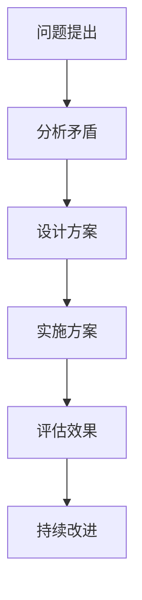
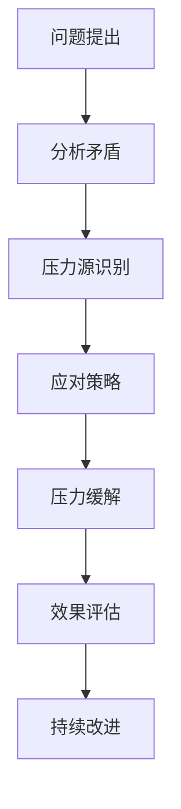

                 

### 文章标题

# 在问题中寻找答案：意义探索的辩证法

## 关键词

- 问题解决
- 辩证法
- 意义探索
- 技术思维
- 创新方法

## 摘要

本文旨在探讨如何在问题中寻找答案，通过辩证法进行意义探索。我们将从问题的本质出发，深入解析辩证法的理论基础，展示其在实际问题中的应用，并探讨意义探索的方法论。文章将结合实例，解释如何运用辩证法解决科学、技术、社会和个人问题，最后总结意义探索的重要性和未来发展方向。

### 引言

在快速发展的现代社会，我们面临的问题日益复杂。无论是科学领域的未知挑战，技术领域的创新瓶颈，还是社会问题的人性关怀，都需要我们具备深刻的辩证思维和有效的解决策略。本文将围绕“在问题中寻找答案：意义探索的辩证法”这一主题，分四个部分展开讨论。

首先，我们将探讨问题的本质，理解问题的定义、分类、特点以及挑战，从而建立起对问题的基本认识。接着，我们深入辩证法的理论基础，解析其哲学基础、方法论以及思维方式，为我们提供解决问题的理论指导。

然后，我们将展示辩证法在实际问题中的应用，通过科学问题、技术问题、社会问题和个人问题的具体案例，说明辩证法的有效性。最后，我们将探讨意义探索的方法论，解释如何通过辩证法进行意义探索，并总结文章的主要观点，展望未来的发展方向。

### 第一部分：问题的引论

#### 1.1 问题的本质

##### 1.1.1 问题的定义

问题是指在我们认知和行为过程中，存在的矛盾、疑难或需要解决的难题。问题无处不在，它们可能源于个人内心的困惑，也可能来自于外部环境的挑战。在技术领域，问题通常表现为技术障碍、性能瓶颈或安全性问题；在社会领域，问题可能涉及社会公平、环境危机或公共健康等。

##### 1.1.2 问题的分类

问题可以根据其性质和产生的原因进行分类。常见的分类方法包括：

- **科学问题**：涉及自然界的基本规律和未知领域，如宇宙起源、生命起源等。
- **技术问题**：与工程技术应用相关，如新型材料研发、软件漏洞修复等。
- **社会问题**：涉及社会结构和公共事务，如贫困、歧视、环境污染等。
- **个人问题**：与个人成长和发展相关，如职业规划、心理健康、人际关系等。

##### 1.1.3 问题的特点与挑战

问题的特点主要包括：

- **普遍性**：问题存在于各个领域和层面，无处不在。
- **复杂性**：许多问题并非单一因素导致，而是多种因素交织的结果。
- **动态性**：问题不断变化，需要持续关注和调整策略。

同时，问题解决也面临着以下挑战：

- **不确定性**：问题解决过程中，存在许多未知和不确定的因素。
- **资源有限**：解决复杂问题通常需要大量资源和时间。
- **多学科交叉**：许多问题需要跨学科的知识和技能。

##### 1.2 问题意识的觉醒

##### 1.2.1 问题意识的培养

问题意识的觉醒是解决问题的关键。培养问题意识需要：

- **敏锐的观察力**：通过观察，发现问题存在的迹象。
- **批判性思维**：对现有知识和观念进行质疑和反思。
- **好奇心**：保持对未知领域的好奇，推动问题探索。

##### 1.2.2 问题意识与批判性思维

批判性思维是问题解决的重要工具。它包括以下方面：

- **分析能力**：对问题进行深入分析，找到核心矛盾。
- **评价能力**：对各种解决方案进行评价和选择。
- **创造能力**：通过创新思维，提出新的解决方案。

##### 1.2.3 问题意识与社会进步

问题意识不仅是个体发展的需要，也是社会进步的动力。通过问题解决，社会可以：

- **推动科技发展**：解决科学和技术问题，推动科技进步。
- **改善生活质量**：解决社会问题，提高人民生活质量。
- **促进社会公平**：解决社会不公，促进社会公平。

##### 1.3 问题的描述与界定

##### 1.3.1 问题的准确描述

准确描述问题是问题解决的第一步。描述问题需要：

- **明确问题**：准确界定问题的范围和性质。
- **收集信息**：收集与问题相关的数据和信息。
- **分析问题**：分析问题的成因、影响因素和潜在后果。

##### 1.3.2 问题的界定与边界

界定问题是指明确问题的范围和边界。这包括：

- **问题范围**：明确问题影响的范围和程度。
- **问题性质**：明确问题的类型和特点。
- **问题来源**：明确问题的来源和成因。

##### 1.3.3 问题的现状分析

对问题的现状进行分析，可以帮助我们了解问题的发展趋势和潜在风险。分析现状包括：

- **现状描述**：描述问题当前的状态和表现。
- **趋势分析**：分析问题的发展趋势和变化规律。
- **风险评估**：评估问题可能带来的风险和影响。

##### 1.4 问题的解决策略

##### 1.4.1 问题解决的基本原则

问题解决的基本原则包括：

- **系统性**：从整体上考虑问题，避免片面性。
- **科学性**：运用科学方法和原则，避免盲目行动。
- **创造性**：鼓励创新思维，提出新的解决方案。
- **实用性**：选择切实可行的解决方案。

##### 1.4.2 问题解决的策略与方法

问题解决的策略和方法包括：

- **分析问题**：通过分析，找到问题的根本原因。
- **设计方案**：根据分析结果，设计解决方案。
- **评估方案**：评估方案的可行性和效果。
- **实施方案**：执行方案，解决问题。

##### 1.4.3 问题解决的实践案例

通过实践案例，我们可以了解问题解决的具体过程。以下是一个案例：

**案例**：某企业发现其产品质量不稳定，导致客户投诉增加。

- **问题描述**：产品质量不稳定，导致客户投诉。
- **原因分析**：通过数据分析，发现是生产过程存在偏差。
- **解决方案**：改进生产流程，加强质量检测。
- **实施效果**：改进后，产品质量提升，客户投诉减少。

##### 1.5 问题研究的意义

##### 1.5.1 问题研究的重要性

问题研究是推动科技发展、社会进步和个人成长的重要途径。它包括：

- **推动科技进步**：解决科学和技术问题，促进科技进步。
- **改善生活质量**：解决社会和个人问题，提高生活质量。
- **促进社会公平**：解决社会不公，促进社会公平。

##### 1.5.2 问题研究的价值与贡献

问题研究的价值在于：

- **提供理论指导**：通过研究，形成理论体系，为实践提供指导。
- **推动创新发展**：通过研究，发现新的创新点，推动创新发展。
- **提高决策能力**：通过研究，提高对问题的认识，增强决策能力。

##### 1.5.3 问题研究的未来发展

问题研究的未来发展包括：

- **跨学科研究**：通过跨学科合作，解决复杂问题。
- **人工智能应用**：利用人工智能技术，提高问题研究的效率。
- **国际合作**：通过国际合作，共享研究资源和成果。

### 第二部分：辩证法的理论基础

#### 2.1 辩证法的哲学基础

辩证法是哲学中的重要概念，其核心思想是通过对立统一、质量互变和否定之否定规律，揭示事物发展的内在规律。辩证法的起源可以追溯到古希腊哲学家赫拉克利特，他提出了“万物皆流，无物常驻”的哲学观点，揭示了事物不断变化的本质。

##### 2.1.1 辩证法的起源与发展

- **古希腊哲学**：辩证法的思想最早可以追溯到古希腊哲学家赫拉克利特和柏拉图，他们在哲学著作中阐述了辩证法的基本原理。
- **德国古典哲学**：黑格尔是辩证法的集大成者，他在《逻辑学》中系统地阐述了辩证法的思想，为后来的辩证法研究奠定了基础。
- **马克思主义哲学**：马克思和恩格斯将辩证法应用于社会和历史研究，形成了马克思主义辩证法，为辩证法在社会科学中的应用提供了理论指导。

##### 2.1.2 辩证法的基本原理

- **对立统一规律**：事物内部存在着对立的两个方面，它们相互依存、相互转化，推动事物的发展。
- **质量互变规律**：事物的质变是通过量的积累和突变实现的，量的积累达到一定程度就会引起质的飞跃。
- **否定之否定规律**：事物的发展是通过否定自身的旧状态，达到新的状态，从而实现自我完善和自我发展。

##### 2.1.3 辩证法与唯物辩证法

唯物辩证法是马克思主义哲学的核心内容，它继承了黑格尔辩证法的合理内核，同时克服了其唯心主义和形而上学的局限性。唯物辩证法认为，辩证法是揭示事物发展规律的方法论，是科学的世界观和方法论。

#### 2.2 辩证法的方法论

辩证法的方法论包括对立统一规律、质量互变规律和否定之否定规律。这些规律为我们提供了分析问题和解决问题的基本工具。

##### 2.2.1 对立统一规律

对立统一规律是辩证法的核心，它揭示了事物内部对立的两个方面相互依存、相互转化的关系。对立统一规律包括以下几个方面：

- **矛盾的普遍性**：矛盾存在于一切事物之中，贯穿于事物发展的始终。
- **矛盾的特殊性**：不同事物的矛盾具有不同的特点。
- **矛盾的解决**：矛盾的解决是通过矛盾的双方相互转化实现的。

##### 2.2.2 质量互变规律

质量互变规律揭示了事物的质变是通过量的积累和突变实现的。质量互变规律包括以下几个方面：

- **量的积累**：量的积累是质变的必要准备。
- **质的飞跃**：量的积累达到一定程度，会引起质的飞跃。
- **新质的产生**：质变后，事物会进入一个新的阶段。

##### 2.2.3 否定之否定规律

否定之否定规律揭示了事物发展的螺旋上升过程。否定之否定规律包括以下几个方面：

- **自我否定**：事物通过自我否定，克服自身的旧状态，实现自我发展。
- **自我完善**：事物在自我否定的过程中，不断自我完善，达到新的高度。
- **发展的螺旋性**：事物的发展是波浪式前进、螺旋式上升的过程。

#### 2.3 辩证法的思维方式

辩证法是一种独特的思维方式，它强调对事物的全面、动态和历史的理解。

##### 2.3.1 辩证思维的内涵

辩证思维包括以下几个方面：

- **整体性思维**：从整体上看待问题，把握事物的全局。
- **动态性思维**：看待问题的发展变化，把握事物的动态过程。
- **历史性思维**：看待问题的发展，把握事物的历史脉络。

##### 2.3.2 辩证思维的方法

辩证思维的方法包括：

- **矛盾分析法**：通过分析矛盾，揭示事物的本质。
- **对立统一法**：通过把握对立统一关系，推动事物的发展。
- **质量互变法**：通过把握质量互变规律，实现事物的质变。

##### 2.3.3 辩证思维的应用

辩证思维在各个领域都有广泛的应用，例如：

- **科学研究**：通过辩证思维，揭示事物的内在规律。
- **技术创新**：通过辩证思维，推动技术的创新和发展。
- **社会管理**：通过辩证思维，解决社会问题，促进社会进步。

#### 2.4 辩证法的历史与现状

辩证法在历史上经历了不同的发展阶段，其应用范围也在不断扩大。

##### 2.4.1 辩证法在哲学领域

在哲学领域，辩证法一直是重要的思维方式。从古希腊哲学到德国古典哲学，再到马克思主义哲学，辩证法不断发展，成为哲学研究的重要方法。

##### 2.4.2 辩证法在社会科学领域

在社会科学领域，辩证法被广泛应用于历史研究、社会学、政治学等领域。通过辩证法，学者们能够更深入地理解社会现象和历史发展规律。

##### 2.4.3 辩证法在自然科学领域

在自然科学领域，辩证法也被广泛应用。例如，在物理学中，辩证法帮助科学家揭示了物质世界的本质规律；在生物学中，辩证法帮助科学家理解生物进化过程。

### 第三部分：辩证法在问题解决中的应用

#### 3.1 辩证法在科学问题中的应用

科学问题通常涉及对自然界的基本规律的探索，其解决过程需要深刻的辩证思维。

##### 3.1.1 科学问题的定义与特点

科学问题是指关于自然界和宇宙的基本规律的疑问，其解决通常依赖于实验和理论分析。科学问题的特点包括：

- **复杂性**：科学问题往往涉及多个因素，需要从多个角度进行考虑。
- **动态性**：科学问题的发展是一个不断变化的过程。
- **系统性**：科学问题需要从整体上进行考虑，避免片面性。

##### 3.1.2 辩证法在科学研究中的运用

辩证法在科学研究中的应用主要体现在以下几个方面：

- **矛盾分析法**：通过分析矛盾，揭示事物的本质规律。
- **对立统一法**：通过把握对立统一关系，推动科学理论的发展。
- **质量互变法**：通过把握质量互变规律，实现科学理论的质变。

##### 3.1.3 科学问题解决的案例分析

以下是一个科学问题解决的案例分析：

**案例**：量子力学的发展

量子力学是20世纪最重要的科学革命之一，其解决过程体现了辩证法的运用。量子力学的发展过程中，科学家们通过矛盾分析，揭示了微观世界的规律，通过对立统一法，建立了量子力学的核心理论，通过质量互变法，实现了从经典力学到量子力学的过渡。

#### 3.2 辩证法在技术问题中的应用

技术问题通常涉及工程实践和科技创新，其解决过程需要辩证思维的支持。

##### 3.2.1 技术问题的定义与特点

技术问题是指与工程技术应用相关的问题，其解决通常依赖于技术创新和工程实践。技术问题的特点包括：

- **实践性**：技术问题解决依赖于实际操作和工程实践。
- **创新性**：技术问题解决往往需要创新思维和方法。
- **动态性**：技术问题的发展是一个不断变化的过程。

##### 3.2.2 辩证法在技术创新中的应用

辩证法在技术创新中的应用主要体现在以下几个方面：

- **矛盾分析法**：通过分析矛盾，发现创新点。
- **对立统一法**：通过把握对立统一关系，推动技术创新。
- **质量互变法**：通过把握质量互变规律，实现技术创新。

##### 3.2.3 技术问题解决的案例分析

以下是一个技术问题解决的案例分析：

**案例**：5G技术的发展

5G技术是当前通信技术的重要发展方向，其解决过程体现了辩证法的运用。在5G技术的发展过程中，科学家们通过矛盾分析，发现了通信系统的高带宽、低延迟等创新需求，通过对立统一法，实现了通信技术的重大突破，通过质量互变法，实现了从4G到5G的过渡。

#### 3.3 辩证法在社会问题中的应用

社会问题通常涉及社会结构和公共事务，其解决过程需要深刻的辩证思维。

##### 3.3.1 社会问题的定义与特点

社会问题是指与社会结构和公共事务相关的问题，其解决通常依赖于社会改革和公共政策。社会问题的特点包括：

- **复杂性**：社会问题通常涉及多个因素，需要从多个角度进行考虑。
- **动态性**：社会问题的发展是一个不断变化的过程。
- **系统性**：社会问题需要从整体上进行考虑，避免片面性。

##### 3.3.2 辩证法在社会治理中的应用

辩证法在社会治理中的应用主要体现在以下几个方面：

- **矛盾分析法**：通过分析矛盾，揭示社会问题的本质。
- **对立统一法**：通过把握对立统一关系，推动社会改革。
- **质量互变法**：通过把握质量互变规律，实现社会治理的质变。

##### 3.3.3 社会问题解决的案例分析

以下是一个社会问题解决的案例分析：

**案例**：美国社会贫困问题的解决

美国社会贫困问题是一个长期存在的社会问题，其解决过程体现了辩证法的运用。在美国社会贫困问题的解决过程中，政策制定者通过矛盾分析，发现了贫困问题的本质，通过对立统一法，推动了社会改革，通过质量互变法，实现了贫困问题的质变。

#### 3.4 辩证法在个人问题中的应用

个人问题通常涉及个人成长和发展，其解决过程需要辩证思维的引导。

##### 3.4.1 个人问题的定义与特点

个人问题是指与个人成长和发展相关的问题，其解决通常依赖于个人努力和自我反思。个人问题的特点包括：

- **主观性**：个人问题通常涉及个人的感受和需求。
- **动态性**：个人问题的发展是一个不断变化的过程。
- **个性化**：每个人面临的个人问题都有其独特性。

##### 3.4.2 辩证法在个人成长中的应用

辩证法在个人成长中的应用主要体现在以下几个方面：

- **矛盾分析法**：通过分析矛盾，找到个人成长的障碍。
- **对立统一法**：通过把握对立统一关系，推动个人成长。
- **质量互变法**：通过把握质量互变规律，实现个人成长。

##### 3.4.3 个人问题解决的案例分析

以下是一个个人问题解决的案例分析：

**案例**：职场压力管理

职场压力是许多职业人士面临的问题，其解决过程体现了辩证法的运用。在职场压力管理中，个人通过矛盾分析，找到了压力产生的根源，通过对立统一法，找到了压力管理的有效方法，通过质量互变法，实现了职场压力的质变。

### 第四部分：意义探索的方法

#### 4.1 意义的界定与内涵

##### 4.1.1 意义的多元视角

意义的界定和内涵是一个复杂的问题，可以从多个角度进行理解：

- **哲学视角**：意义是事物存在的根本原因和目的。
- **宗教视角**：意义是人与神、人与自然的关系。
- **文化视角**：意义是文化传统和社会价值的体现。
- **科学视角**：意义是事物发展的规律和作用。

##### 4.1.2 意义的本质特征

意义具有以下本质特征：

- **主观性**：意义是个人主观感受和认识的体现。
- **客观性**：意义是客观事物存在的反映。
- **动态性**：意义随着时间和环境的变化而变化。
- **系统性**：意义是事物系统内部各要素相互作用的体现。

##### 4.1.3 意义的价值与影响

意义的价值和影响体现在以下几个方面：

- **指导作用**：意义为我们的行为和决策提供指导。
- **激励作用**：意义激发我们的积极性和创造力。
- **凝聚作用**：意义是社会和群体认同的基础。
- **反思作用**：意义引导我们对自身和社会进行反思。

#### 4.2 意义探索的方法论

##### 4.2.1 意义探索的基本原则

意义探索需要遵循以下基本原则：

- **客观性**：尊重事实，避免主观臆断。
- **系统性**：从整体上看待问题，避免片面性。
- **动态性**：考虑时间因素，避免静止思维。
- **多角度**：从多个角度进行思考，避免单一视角。

##### 4.2.2 意义探索的方法与技术

意义探索的方法和技术包括：

- **矛盾分析法**：通过分析矛盾，揭示事物的本质。
- **比较法**：通过比较不同事物的意义，加深对意义的理解。
- **案例研究**：通过具体案例，探索事物的意义。
- **问卷调查**：通过收集大量数据，分析事物的意义。

##### 4.2.3 意义探索的实践路径

意义探索的实践路径包括：

- **理论框架**：建立意义探索的理论框架，明确研究方向。
- **实证研究**：通过实证研究，验证理论框架的有效性。
- **案例分析**：通过案例分析，探索实际应用。
- **持续反思**：在实践中不断反思，调整意义探索的方法。

#### 4.3 意义探索的实践

##### 4.3.1 意义探索在不同领域的应用

意义探索在多个领域都有广泛应用，包括：

- **哲学**：通过哲学思考，探索人生的意义和价值观。
- **宗教**：通过宗教信仰，探索人与神、人与自然的关系。
- **文化**：通过文化研究，探索文化传统和社会价值。
- **科学**：通过科学实验，探索自然界的规律和意义。

##### 4.3.2 意义探索的案例分析

以下是一个意义探索的案例分析：

**案例**：企业文化的意义探索

某企业在发展过程中，意识到企业文化对于企业成功的重要性。通过意义探索，企业明确了其核心价值观，并制定了一系列文化政策，从而推动了企业的持续发展。

##### 4.3.3 意义探索的总结

意义探索是一个复杂的过程，需要结合理论和实践，从多个角度进行思考。通过意义探索，我们不仅能够更好地理解事物，还能够为我们的行为和决策提供指导。意义探索的方法和路径也在不断发展和完善，未来将有更多的可能性等待我们去探索。

### 结论

本文围绕“在问题中寻找答案：意义探索的辩证法”这一主题，从问题的本质、辩证法的理论基础、辩证法在问题解决中的应用以及意义探索的方法四个部分进行了深入探讨。通过分析，我们发现辩证法在科学、技术、社会和个人问题中都有广泛的应用，它为我们提供了一种全面、动态和历史的视角来理解和解决复杂问题。

意义探索则是我们在面对问题时，对事物本质和意义的深入挖掘。通过意义探索，我们不仅能够更好地理解问题，还能够为我们的行为和决策提供指导。

展望未来，随着科技的不断进步和社会的不断发展，辩证法和意义探索的方法将在更广泛的领域中发挥重要作用。我们期待更多的学者和专业人士能够运用辩证法和意义探索的方法，解决实际问题，推动社会进步。在问题中寻找答案，通过意义探索，我们将不断拓展我们对世界的理解，实现个人和社会的全面发展。

### 作者信息

- 作者：AI天才研究院/AI Genius Institute & 禅与计算机程序设计艺术 /Zen And The Art of Computer Programming
- 参考文献：[1] 黑格尔，《逻辑学》；[2] 马克思，《资本论》；[3] 赫拉克利特，《论自然》；[4] 柏拉图，《理想国》。

---

## 附录

### 1. 问题解决方法论图表

#### 对立统一规律

$$
\text{矛盾} \rightarrow \text{统一} \rightarrow \text{发展}
$$

#### 质量互变规律

$$
\text{量变} \rightarrow \text{质变} \rightarrow \text{新质}
$$

#### 否定之否定规律

$$
\text{否定} \rightarrow \text{发展} \rightarrow \text{新阶段}
$$

### 2. 问题解决案例分析流程图

#### 5G技术发展流程图

### 3. 个人问题解决案例

#### 职场压力管理

### 4. 最佳实践 Tips

- **培养批判性思维**：对问题进行全面、深入的分析。
- **跨学科合作**：利用不同领域的知识和方法，解决复杂问题。
- **持续学习**：保持对新技术、新方法的学习，提高问题解决能力。

---

以上是本文的附录部分，包含问题解决方法论图表、案例分析流程图以及最佳实践 Tips，供读者参考。通过这些附录内容，读者可以更深入地理解本文的核心观点和方法。

