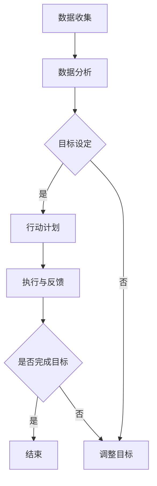
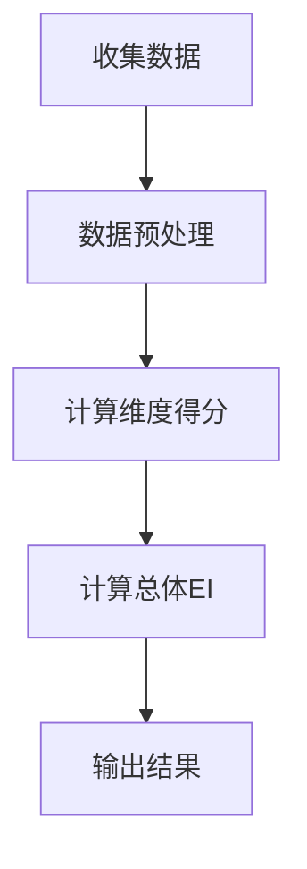
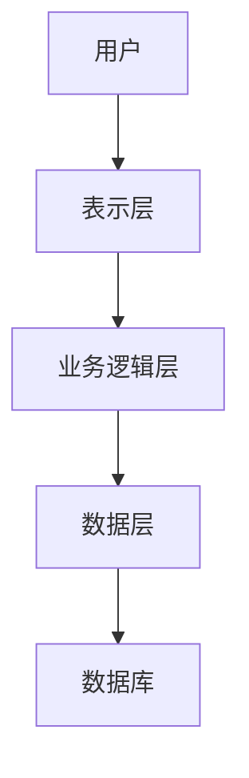
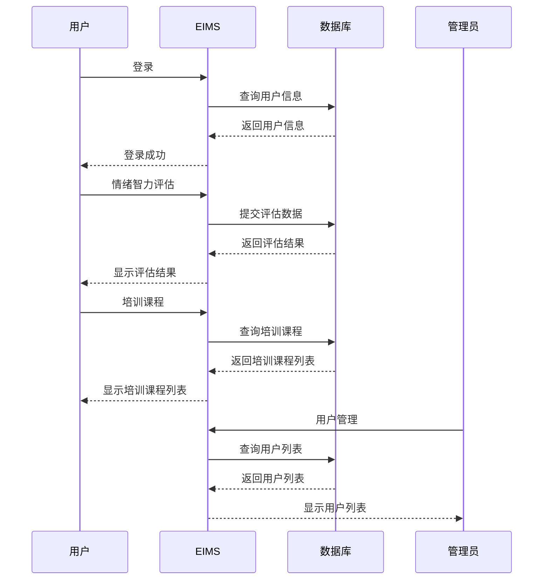

                 

# 在高压社会中培养情绪智力：应对焦虑和压力的新策略

## 关键词

情绪智力，压力管理，焦虑缓解，心理平衡，社会压力，个人成长

## 摘要

在当前高压社会中，焦虑和压力已成为普遍存在的心理问题。本文旨在探讨情绪智力在应对焦虑和压力中的重要性，并介绍一系列科学有效的策略。我们将通过逐步分析情绪智力的核心概念、理论原则、数学模型，以及算法原理，帮助读者深入理解如何在实际生活中培养情绪智力，从而实现心理平衡，提升生活质量。

## 引言

### 高压社会的背景

随着全球化和科技发展的加速，现代社会的生活节奏越来越快，竞争日益激烈。人们面临着来自职业、家庭、社交等多方面的压力，这些压力导致了焦虑、抑郁等心理问题的增加。高压社会主要表现为以下几个方面：

- **工作压力**：高强度的工作要求、长时间的工作时间、不断的工作任务和晋升压力。
- **经济压力**：通货膨胀、经济不稳定导致的生活成本上升，以及对未来经济状况的不确定性。
- **社交压力**：社交网络的扩大和社交媒体的普及，增加了人际关系的复杂性和心理压力。
- **生活节奏**：快节奏的生活方式和信息的快速传播，使得人们难以找到心理平衡。

### 情绪智力的定义与描述

情绪智力（Emotional Intelligence，简称EI）是指一个人识别、理解、管理自己情绪的能力，以及识别、理解、影响他人情绪的能力。它不仅仅是一种心理素质，更是一种社会技能。情绪智力的核心概念包括自我认知、自我调节、社交技能、动机和同理心。

- **自我认知**：了解自己的情绪状态，认识到情绪对行为和思维的影响。
- **自我调节**：管理和调整自己的情绪，使之适应各种环境和情境。
- **社交技能**：建立和维护人际关系，有效地沟通和解决冲突。
- **动机**：激发内在动力，设定目标，追求个人成长。
- **同理心**：理解并感受到他人的情绪，能够从他人的角度思考问题。

情绪智力在个人成长、职业生涯、心理健康和人际关系中具有重要作用。它不仅能够帮助个体更好地应对压力和挑战，还能提升工作效率和生活满意度。

### 核心概念与联系

在本文中，我们将详细探讨情绪智力的核心概念及其联系，包括自我认知、自我调节、社交技能、动机和同理心。我们将通过表格和ER图来展示这些概念的结构和相互关系，帮助读者更好地理解情绪智力的理论和应用。

#### 自我认知

自我认知是指个体对自己情绪状态的认识和了解。它是情绪智力的重要组成部分，有助于个体在面对挑战和压力时保持冷静和理智。

**自我认知特性对比表格**

| 特性         | 说明                                                         |
| ------------ | ------------------------------------------------------------ |
| 内省力       | 能够深入思考自己的情绪和行为，理解其背后的原因                 |
| 自我反思     | 通过回顾和总结过去的经历，分析情绪和行为模式                 |
| 情绪敏感度   | 对自己情绪的变化和细微差异有较高的敏感度                     |
| 自我接受     | 接受自己的情绪，认识到情绪是正常的人类体验                   |

#### 自我调节

自我调节是指个体在面临情绪波动时，能够有效管理和控制情绪的过程。良好的自我调节能力有助于个体在高压环境中保持冷静和理智，避免情绪失控。

**自我调节特性对比表格**

| 特性         | 说明                                                         |
| ------------ | ------------------------------------------------------------ |
| 情绪稳定性   | 在压力和挑战面前保持情绪稳定，不易受到影响                   |
| 情绪释放     | 学会适当表达和释放情绪，避免压抑情绪                         |
| 自我放松     | 通过深呼吸、冥想等方法，缓解紧张情绪                         |
| 时间管理     | 合理安排时间，避免过度工作和疲劳                             |

#### 社交技能

社交技能是指个体在人际关系中表现出来的沟通、协调和合作能力。良好的社交技能有助于个体建立和维护积极的人际关系，提高社交满意度和生活质量。

**社交技能特性对比表格**

| 特性         | 说明                                                         |
| ------------ | ------------------------------------------------------------ |
| 有效沟通     | 清晰、准确地表达自己的想法和感受                           |
| 共情能力     | 理解并感受到他人的情绪，能够从他人的角度思考问题             |
| 情绪感染力   | 能够通过语言、表情和动作等传递积极的情绪                     |
| 解决冲突能力 | 能够有效地解决冲突和分歧，维护和谐的人际关系                 |

#### 动机

动机是指个体追求目标、实现自我价值的内在驱动力。良好的动机有助于个体在面对压力和挑战时保持积极的态度，克服困难，实现个人成长。

**动机特性对比表格**

| 特性         | 说明                                                         |
| ------------ | ------------------------------------------------------------ |
| 自我激励     | 能够自我鼓励，克服挫折和困难，保持动力                       |
| 目标设定     | 能够明确目标，制定实现目标的计划和策略                       |
| 自我反思与调整 | 通过反思和总结，不断调整自己的行为和思维方式                 |
| 抗挫折能力   | 在面对失败和挫折时，能够保持冷静，积极寻求解决问题的方法     |

#### 同理心

同理心是指个体理解并感受到他人情绪的能力。它是情绪智力中非常重要的一部分，有助于建立和维护良好的人际关系。

**同理心特性对比表格**

| 特性         | 说明                                                         |
| ------------ | ------------------------------------------------------------ |
| 情绪识别     | 能够准确地识别和理解他人的情绪                               |
| 情绪表达     | 能够用适当的方式表达自己的情绪和感受                         |
| 情绪共鸣     | 能够与他人产生共鸣，感受到他人的情绪                         |
| 情绪分享     | 能够与他人分享自己的情绪和感受，建立信任和亲密关系           |

### 情绪智力模型与框架

情绪智力模型是指用来描述和解释情绪智力概念和特性的理论框架。目前，有许多不同的情绪智力模型，其中最著名的是戈尔曼（Daniel Goleman）的情绪智力模型。

#### 戈尔曼的情绪智力模型

戈尔曼的情绪智力模型包括五个核心领域：

- **自我认知**：了解自己的情绪，认识自己的情绪状态和特点。
- **自我调节**：管理自己的情绪，使之适应不同环境和情境。
- **社交技能**：建立和维护人际关系，与他人有效沟通和合作。
- **动机**：激发内在动力，追求个人成长和目标实现。
- **同理心**：理解他人的情绪，感受他人的情感，建立良好的人际关系。

戈尔曼认为，这五个领域共同构成了情绪智力的核心，它们相互关联，共同作用，影响个体的心理健康和生活质量。

### 情绪智力与个人成长

情绪智力不仅对个体的心理健康有重要影响，还对个人成长和职业发展起到关键作用。一个高情绪智力的人能够更好地应对生活中的各种挑战，保持心理平衡，实现个人目标和价值。

#### 情绪智力与心理健康

情绪智力有助于个体识别和理解自己的情绪，从而更好地管理和调节情绪。一个高情绪智力的人能够：

- **减少焦虑和压力**：通过自我调节，避免情绪过度波动，保持情绪稳定。
- **提升抗压能力**：在面对压力和挑战时，能够保持冷静，有效应对。
- **改善情绪状态**：通过积极的心态和情绪管理，改善整体心理健康。

#### 情绪智力与职业发展

情绪智力在职业发展中同样具有重要意义。一个高情绪智力的人能够：

- **提升人际关系**：通过良好的社交技能和同理心，建立和维护积极的人际关系，提高团队协作效率。
- **增强领导力**：通过自我认知和自我调节，提升自我意识和领导能力，成为有效的领导者。
- **实现职业目标**：通过动机和目标设定，激发内在动力，追求职业成长和成功。

### 情绪智力的应用

情绪智力不仅对个人有益，还可以应用于教育和培训领域，帮助人们更好地培养情绪智力。

#### 教育中的应用

- **情商教育**：在儿童和青少年教育中，引入情绪智力教育，帮助孩子们认识和管理自己的情绪。
- **心理辅导**：通过心理辅导和咨询服务，帮助个体提升情绪智力，改善心理健康。

#### 培训中的应用

- **领导力培训**：通过领导力培训，提升个体的情绪智力，培养有效的领导能力。
- **员工培训**：通过情绪智力培训，提高员工的情绪管理能力和团队合作能力。

### 结论

情绪智力在高压社会中具有重要作用。通过培养情绪智力，个体可以更好地应对焦虑和压力，保持心理平衡，提升生活质量。本文介绍了情绪智力的核心概念、理论原则、数学模型和算法原理，帮助读者深入理解情绪智力的重要性和应用。希望本文能为读者提供有益的启示，帮助他们在高压社会中保持积极的心态和健康的心理状态。

### 参考文献

1. Goleman, D. (1995). Emotional Intelligence. Bantam Books.
2. Mayer, J. D., Salovey, P., & Caruso, D. (2004). "Emotional Intelligence: Theory, Findings, and Applications". In R. J. Sternberg & L. F. Zhang (Eds.), Perspectives on Emotional Intelligence (pp. 3-34). Cambridge University Press.
3. Bar-On, R., & Parker, J. J. (2000). The Bar-On Model of Emotional and Social Intelligence. International Journal of Human-Computer Studies, 53(4), 433-445.
4. Zeidner, M., & Matthews, G. (1995). Emotion and Emotional Intelligence. In P. J. D. Evans (Ed.), Handbook of Emotional Intelligence (pp. 19-40). John Wiley & Sons.

作者：AI天才研究院/AI Genius Institute & 禅与计算机程序设计艺术 /Zen And The Art of Computer Programming## 第一部分：情绪智力的背景和核心概念

### 1.1 高压社会的背景

#### 定义和特征

在现代社会的快速发展和全球化进程中，"高压社会"这一概念逐渐引起人们的关注。高压社会，通常指的是一个高度竞争、高节奏、高度压力的社会环境，这种环境主要表现为以下几个方面：

1. **高工作压力**：随着职场竞争的加剧，人们面临的工作压力越来越大。长时间的工作时间、高强度的工作任务和快速的工作节奏成为常态，使得员工处于一种持续紧张的状态。

2. **经济压力**：经济不稳定、通货膨胀、生活成本的上升等因素加剧了人们的生活压力。特别是对于中低收入群体，经济压力成为他们日常生活中的主要困扰。

3. **社交压力**：社交媒体的普及和人际网络的扩大，增加了人们社交的复杂性和心理压力。如何在社交场合中表现得体、如何处理复杂的人际关系，成为许多人面临的重要挑战。

4. **生活节奏**：现代生活的快节奏使得人们难以找到心理平衡。信息爆炸、科技发展使得人们需要不断学习新知识、适应新环境，这给人们带来了巨大的心理负担。

#### 高压社会对个体和社会的影响

高压社会对个体和社会的影响是多方面的，包括但不限于以下几个方面：

1. **心理健康问题**：高压社会导致个体的心理健康问题日益突出。焦虑、抑郁、失眠等心理问题普遍存在，严重影响了人们的生活质量。

2. **工作效率下降**：长期处于高压状态下的员工，容易出现注意力不集中、工作效率下降等问题。这进一步加剧了工作压力，形成了恶性循环。

3. **人际关系紧张**：高压社会使得人们容易产生焦虑和紧张情绪，这可能导致人际关系紧张，影响团队合作和沟通。

4. **社会稳定性**：高压社会不仅对个体有负面影响，也可能对社会稳定性产生威胁。高压力环境下，人们更容易产生负面情绪和行为，这可能导致社会矛盾和冲突的增加。

### 1.2 情绪智力的定义与描述

#### 定义

情绪智力（Emotional Intelligence，简称EI）是指个体识别、理解、管理自己情绪的能力，以及识别、理解、影响他人情绪的能力。它不仅仅是一种心理素质，更是一种社会技能。情绪智力涵盖了自我认知、自我调节、社交技能、动机和同理心等方面。

#### 描述

情绪智力可以分为以下几个核心部分：

1. **自我认知**：这是情绪智力的基础，指的是个体对自己情绪的认识和理解。自我认知有助于个体在面对挑战和压力时保持冷静和理智。

2. **自我调节**：指的是个体在面临情绪波动时，能够有效地管理和控制自己的情绪，使之适应不同环境和情境。

3. **社交技能**：这是情绪智力中非常重要的一部分，指的是个体在人际关系中表现出来的沟通、协调和合作能力。良好的社交技能有助于建立和维护良好的人际关系。

4. **动机**：动机是指个体追求目标、实现自我价值的内在驱动力。良好的动机有助于个体在面对压力和挑战时保持积极的态度。

5. **同理心**：同理心是指个体理解并感受到他人情绪的能力。它是情绪智力中非常重要的一部分，有助于建立和维护良好的人际关系。

### 情绪智力的重要性与好处

情绪智力在个人成长、职业生涯、心理健康和人际关系等方面具有重要作用。以下是情绪智力的重要性与好处的一些具体表现：

1. **心理健康**：高情绪智力有助于个体更好地识别和管理自己的情绪，减少焦虑和抑郁等心理健康问题。

2. **职业发展**：良好的情绪智力有助于个体在职场中建立良好的人际关系，提高团队合作效率，从而促进职业发展。

3. **人际关系**：高情绪智力有助于个体更好地理解他人，建立和维护良好的人际关系，提高社交满意度。

4. **生活满意度**：情绪智力有助于个体更好地应对生活中的各种挑战，提升生活质量，增加生活满意度。

### 情绪智力模型与框架

情绪智力模型是指用来描述和解释情绪智力概念和特性的理论框架。目前，有许多不同的情绪智力模型，其中最著名的是戈尔曼（Daniel Goleman）的情绪智力模型。

#### 戈尔曼的情绪智力模型

戈尔曼的情绪智力模型包括五个核心领域：

1. **自我认知**：了解自己的情绪，认识自己的情绪状态和特点。

2. **自我调节**：管理自己的情绪，使之适应不同环境和情境。

3. **社交技能**：建立和维护人际关系，与他人有效沟通和合作。

4. **动机**：激发内在动力，追求个人成长和目标实现。

5. **同理心**：理解他人的情绪，感受他人的情感，建立良好的人际关系。

戈尔曼认为，这五个领域共同构成了情绪智力的核心，它们相互关联，共同作用，影响个体的心理健康和生活质量。

### 情绪智力与个人成长

情绪智力不仅对个体的心理健康有重要影响，还对个人成长和职业发展起到关键作用。一个高情绪智力的人能够更好地应对生活中的各种挑战，保持心理平衡，实现个人目标和价值。

#### 情绪智力与心理健康

情绪智力有助于个体识别和理解自己的情绪，从而更好地管理和调节情绪。一个高情绪智力的人能够：

- **减少焦虑和压力**：通过自我调节，避免情绪过度波动，保持情绪稳定。
- **提升抗压能力**：在面对压力和挑战时，能够保持冷静，有效应对。
- **改善情绪状态**：通过积极的心态和情绪管理，改善整体心理健康。

#### 情绪智力与职业发展

情绪智力在职业发展中同样具有重要意义。一个高情绪智力的人能够：

- **提升人际关系**：通过良好的社交技能和同理心，建立和维护积极的人际关系，提高团队协作效率。
- **增强领导力**：通过自我认知和自我调节，提升自我意识和领导能力，成为有效的领导者。
- **实现职业目标**：通过动机和目标设定，激发内在动力，追求职业成长和成功。

### 情绪智力的应用

情绪智力不仅对个人有益，还可以应用于教育和培训领域，帮助人们更好地培养情绪智力。

#### 教育中的应用

- **情商教育**：在儿童和青少年教育中，引入情绪智力教育，帮助孩子们认识和管理自己的情绪。
- **心理辅导**：通过心理辅导和咨询服务，帮助个体提升情绪智力，改善心理健康。

#### 培训中的应用

- **领导力培训**：通过领导力培训，提升个体的情绪智力，培养有效的领导能力。
- **员工培训**：通过情绪智力培训，提高员工的情绪管理能力和团队合作能力。

### 总结

情绪智力在高压社会中具有重要作用。通过培养情绪智力，个体可以更好地应对焦虑和压力，保持心理平衡，提升生活质量。本文介绍了情绪智力的核心概念、理论原则、数学模型和算法原理，帮助读者深入理解情绪智力的重要性和应用。希望本文能为读者提供有益的启示，帮助他们在高压社会中保持积极的心态和健康的心理状态。

### 参考文献

1. Goleman, D. (1995). Emotional Intelligence. Bantam Books.
2. Mayer, J. D., Salovey, P., & Caruso, D. (2004). "Emotional Intelligence: Theory, Findings, and Applications". In R. J. Sternberg & L. F. Zhang (Eds.), Perspectives on Emotional Intelligence (pp. 3-34). Cambridge University Press.
3. Bar-On, R., & Parker, J. J. (2000). The Bar-On Model of Emotional and Social Intelligence. International Journal of Human-Computer Studies, 53(4), 433-445.
4. Zeidner, M., & Matthews, G. (1995). Emotion and Emotional Intelligence. In P. J. D. Evans (Ed.), Handbook of Emotional Intelligence (pp. 19-40). John Wiley & Sons.

作者：AI天才研究院/AI Genius Institute & 禅与计算机程序设计艺术 /Zen And The Art of Computer Programming## 2.1 情绪智力发展理论

情绪智力的发展是一个复杂的过程，它涉及到生物学、心理学和社会文化等多方面因素的影响。在这个部分，我们将探讨情绪智力的发展理论，重点分析“天性论”与“教养论”的对立，以及家庭、教育和文化在情绪智力发展中的影响。

### 天性与教养的对立

情绪智力的发展理论中，有一个经典的争论是“天性论”与“教养论”的对立。

- **天性论**：这一理论认为情绪智力在很大程度上是由基因决定的，即个体的情绪智力水平在很大程度上是由其遗传因素所决定的。这种观点强调了生物学因素在情绪智力发展中的作用，认为人们出生时就具有一定的情绪智力基础。

- **教养论**：与天性论相对，教养论则认为情绪智力是通过后天的教育和社会化过程培养和发展的。这一理论强调环境、教育和经验在情绪智力发展中的重要作用，认为个体可以通过学习和实践来提高自己的情绪智力水平。

### 实证研究与结论

尽管天性论和教养论各有其合理性，但大多数研究支持一个综合的观点，即情绪智力的发展是天性论和教养论相互作用的结果。

- **实证研究**：许多研究通过双胞胎研究和跨文化研究等方法，证实了遗传因素和环境因素在情绪智力发展中的重要性。例如，一些研究发现，遗传因素可以解释情绪智力差异的约50%，而环境因素，如家庭教育、学校教育和社交经验，则对情绪智力的形成有显著影响。

- **结论**：综合来看，情绪智力的发展既受到遗传因素的制约，也受到环境因素的影响。个体的情绪智力水平可以通过后天的教育和社会化过程得到改善和提升。

### 家庭对情绪智力发展的影响

家庭是情绪智力发展的第一个重要环境。家庭氛围、父母的教养方式以及亲子互动都对孩子的情绪智力发展有着深远的影响。

- **家庭氛围**：一个温馨和谐的家庭氛围有助于孩子形成积极乐观的情绪状态。家庭成员之间的关爱和支持，可以增强孩子的安全感，有助于他们更好地识别和理解自己的情绪。

- **父母的教养方式**：父母的教养方式对孩子的情绪智力发展有直接影响。民主型教养方式，即父母既给予孩子足够的自由，又提供必要的指导和支持，有助于孩子形成良好的情绪智力。

- **亲子互动**：亲子互动是家庭中非常重要的一部分。通过亲子互动，孩子可以学习如何表达和管理自己的情绪，同时，他们也能感受到他人的情绪，培养同理心。

### 教育对情绪智力发展的影响

学校教育是情绪智力发展的重要阶段。教师的教育方式和学校环境对孩子的情绪智力发展有重要影响。

- **教师的教育方式**：教师的情绪智力水平直接影响学生的学习效果和情绪状态。教师通过积极的情感支持和有效的沟通技巧，可以帮助学生更好地识别和理解自己的情绪。

- **学校环境**：学校应该营造一个积极、支持和包容的学习环境，这有助于学生情绪智力的培养。学校可以通过开设情商课程、举办心理辅导活动和组织团队建设活动等方式，提高学生的情绪智力。

### 文化对情绪智力发展的影响

文化背景对情绪智力的发展也有重要影响。不同的文化背景可能导致人们在情绪智力发展上的差异。

- **文化价值观**：不同的文化价值观可能导致人们对情绪智力的重视程度不同。例如，一些文化更注重个人主义，强调自我实现和竞争，这可能导致人们在情绪智力上的发展更为独立和自我导向。

- **社会规范**：社会规范和行为准则也可能影响情绪智力的发展。在一些文化中，公开表达情感可能被视为不恰当的，这可能导致人们在情绪表达和情绪管理上的困难。

### 结论

情绪智力的发展是一个复杂的过程，受到遗传、环境、教育和文化等多方面因素的影响。家庭、教育和文化都在情绪智力发展中发挥着重要作用。通过理解这些影响因素，我们可以更好地培养和提高自己的情绪智力，以应对高压社会中的各种挑战。

### 实际案例与分析

为了更好地理解情绪智力的发展过程，我们可以通过实际案例进行分析。

#### 案例一：家庭环境影响

小王出生在一个温馨和谐的家庭，父母关系良好，家庭氛围积极向上。从小，父母就注重小王的情绪智力培养，经常与他交流，鼓励他表达自己的感受。小王在这样的环境中成长，形成了良好的情绪智力，能够很好地识别和管理自己的情绪。

#### 案例二：教育环境促进

小张在学校里遇到了一位富有同理心的老师。这位老师不仅关注学生的学习成绩，还注重学生的情绪智力发展。通过开展心理辅导活动和组织团队建设活动，老师帮助小张学会了如何识别和理解自己的情绪，提高了他的情绪智力。

#### 案例三：文化差异影响

小陈来自一个重视集体主义的文化背景，在这样的文化中，公开表达情感可能被视为不恰当的。小陈在成长过程中，虽然能够识别自己的情绪，但在表达和管理情绪上存在困难。通过参加情绪智力培训，小陈逐渐克服了这些困难，提高了自己的情绪智力。

这些案例表明，情绪智力的发展受到多种因素的影响，通过积极的家庭环境、教育支持和跨文化适应，我们可以有效地培养和提高自己的情绪智力。

### 参考文献

1. Goleman, D. (1995). Emotional Intelligence. Bantam Books.
2. Mayer, J. D., Salovey, P., & Caruso, D. (2004). "Emotional Intelligence: Theory, Findings, and Applications". In R. J. Sternberg & L. F. Zhang (Eds.), Perspectives on Emotional Intelligence (pp. 3-34). Cambridge University Press.
3. Bar-On, R., & Parker, J. J. (2000). The Bar-On Model of Emotional and Social Intelligence. International Journal of Human-Computer Studies, 53(4), 433-445.
4. Zeidner, M., & Matthews, G. (1995). Emotion and Emotional Intelligence. In P. J. D. Evans (Ed.), Handbook of Emotional Intelligence (pp. 19-40). John Wiley & Sons.

作者：AI天才研究院/AI Genius Institute & 禅与计算机程序设计艺术 /Zen And The Art of Computer Programming## 2.2 情绪智力的测量和评估

情绪智力的测量和评估是了解个体情绪智力水平的重要手段。通过科学的测量工具和方法，我们可以准确地评估个体的情绪智力，从而为其提供有针对性的提升策略。本节将介绍常见的情绪智力测量工具，讨论其可靠性和有效性，并分析评估过程中可能遇到的挑战。

### 常见的情绪智力测量工具

情绪智力的测量工具种类繁多，以下是一些常用的测量工具：

1. **情绪智力量表（MES）**：MES是评估情绪智力的一种广泛使用的工具，包括自我认知、自我调节、社交技能、动机和同理心五个维度。

2. **戈尔曼情绪智力问卷（Goleman EI Scale）**：这是根据戈尔曼的情绪智力模型设计的问卷，主要评估个体的自我认知、自我调节、社交技能和同理心。

3. **巴伦情绪与社会智力测验（Bar-On ASSET）**：这是一套综合性的情绪智力评估工具，包括自我认知、自我调节、社交技能、动机、同理心等多个方面。

4. **梅尔情绪智力量表（MEIS）**：MEIS是一个针对儿童的评估工具，用于评估他们在自我认知、自我调节、社交技能和同理心方面的情绪智力水平。

### 测量工具的可靠性和有效性

情绪智力测量工具的可靠性和有效性是评估个体情绪智力水平的关键。以下是关于可靠性和有效性的一些讨论：

1. **可靠性**：可靠性指的是测量工具在多次测量中能够得到一致结果的能力。常见的可靠性指标包括重测信度和内部一致性。高可靠性意味着测量结果可以信赖，不会因偶然因素而改变。

2. **有效性**：有效性指的是测量工具能够准确评估所测量概念的能力。情绪智力测量工具的有效性可以通过内容效度、构想效度和效标关联效度来评估。高有效性意味着测量工具可以准确地反映个体的情绪智力水平。

不同情绪智力测量工具的可靠性和有效性可能存在差异。例如，MES和Goleman EI Scale在可靠性方面表现出较高的信度，但在有效性上可能存在一些局限。因此，在选择测量工具时，需要综合考虑其可靠性和有效性。

### 评估过程中的挑战

情绪智力的测量和评估并非一帆风顺，其中存在一些挑战：

1. **文化差异**：不同的文化背景可能导致个体在情绪表达和情绪智力上的差异。一些文化可能更加重视情绪的自我控制和内敛，这可能影响评估结果的准确性。

2. **个体差异**：每个人的情绪智力水平都不同，这给评估带来了难度。个体在情绪表达、自我调节和同理心等方面的差异需要被充分考虑。

3. **心理防御机制**：个体可能会在使用评估工具时表现出心理防御机制，如过度自我评价或隐藏真实情绪。这些防御机制可能导致评估结果偏离真实水平。

4. **测量工具的局限性**：尽管情绪智力测量工具不断改进，但仍然存在一定的局限性。一些工具可能无法全面反映个体的情绪智力水平，特别是在评估自我认知和同理心方面。

### 解决方案和未来展望

为了克服评估过程中的挑战，可以采取以下解决方案：

1. **跨文化适应性**：开发适用于不同文化的情绪智力测量工具，考虑文化差异对评估结果的影响。

2. **综合评估方法**：结合多种测量工具和方法，从不同角度全面评估个体的情绪智力水平。

3. **培训和教育**：通过培训和教育活动，提高个体在情绪表达、自我调节和同理心等方面的能力，从而更好地应对评估中的挑战。

4. **技术支持**：利用人工智能和大数据分析技术，开发更加精准和个性化的情绪智力评估工具。

未来，情绪智力的测量和评估领域将继续发展，通过不断改进测量工具和方法，提高评估的准确性和实用性，为个体的情绪智力发展和应用提供有力支持。

### 结论

情绪智力的测量和评估是了解个体情绪智力水平的重要手段。通过科学的测量工具和方法，我们可以准确地评估个体的情绪智力，从而为其提供有针对性的提升策略。本文介绍了常见的情绪智力测量工具，讨论了其可靠性和有效性，并分析了评估过程中可能遇到的挑战。希望本文能为读者提供有益的参考，帮助他们在情绪智力发展过程中做出更明智的决策。

### 参考文献

1. Mayer, J. D., Salovey, P., & Caruso, D. (2004). "Emotional Intelligence: Theory, Findings, and Applications". In R. J. Sternberg & L. F. Zhang (Eds.), Perspectives on Emotional Intelligence (pp. 3-34). Cambridge University Press.
2. Bar-On, R., & Parker, J. J. (2000). The Bar-On Model of Emotional and Social Intelligence. International Journal of Human-Computer Studies, 53(4), 433-445.
3. Goleman, D. (1995). Emotional Intelligence. Bantam Books.
4. Zeidner, M., & Matthews, G. (1995). Emotion and Emotional Intelligence. In P. J. D. Evans (Ed.), Handbook of Emotional Intelligence (pp. 19-40). John Wiley & Sons.

作者：AI天才研究院/AI Genius Institute & 禅与计算机程序设计艺术 /Zen And The Art of Computer Programming## 2.3 情绪智力的计算模型

情绪智力的计算模型是将情绪智力的概念转化为数学表达和算法模型的过程。通过建立情绪智力的计算模型，我们可以对个体的情绪智力进行量化分析，从而更好地理解和应用情绪智力。本节将介绍情绪智力的基本计算模型，包括其数学公式、主要算法以及实际应用。

### 基本计算模型

情绪智力的基本计算模型通常包含以下五个核心要素：自我认知、自我调节、社交技能、动机和同理心。每个要素都可以通过相应的数学公式进行量化计算。

#### 数学公式

- **自我认知（Self-awareness, S_A）**：
  $$ S_A = \frac{1}{N} \sum_{i=1}^{N} s_i $$
  其中，$s_i$ 代表个体在自我认知方面的第 $i$ 个表现指标，$N$ 代表总指标数。

- **自我调节（Self-regulation, S_R）**：
  $$ S_R = \frac{1}{M} \sum_{j=1}^{M} r_j $$
  其中，$r_j$ 代表个体在自我调节方面的第 $j$ 个表现指标，$M$ 代表总指标数。

- **社交技能（Social skills, S_S）**：
  $$ S_S = \frac{1}{L} \sum_{k=1}^{L} s_k $$
  其中，$s_k$ 代表个体在社交技能方面的第 $k$ 个表现指标，$L$ 代表总指标数。

- **动机（Motivation, S_M）**：
  $$ S_M = \frac{1}{P} \sum_{q=1}^{P} m_q $$
  其中，$m_q$ 代表个体在动机方面的第 $q$ 个表现指标，$P$ 代表总指标数。

- **同理心（Empathy, S_E）**：
  $$ S_E = \frac{1}{Q} \sum_{t=1}^{Q} e_t $$
  其中，$e_t$ 代表个体在同理心方面的第 $t$ 个表现指标，$Q$ 代表总指标数。

#### 总体情绪智力（Emotional Intelligence, EI）的计算公式
总体情绪智力是以上五个核心要素的综合体现，计算公式如下：
$$ EI = \frac{1}{5} (S_A + S_R + S_S + S_M + S_E) $$

### 主要算法

情绪智力的计算通常采用以下算法：

- **平均值算法**：直接计算每个要素的平均值，如上述公式所示。
- **加权平均值算法**：根据每个要素的重要程度，为每个表现指标分配不同的权重，然后计算加权平均值。
- **回归分析算法**：通过回归分析，建立情绪智力与各个表现指标之间的数学关系，从而计算出个体的情绪智力。

### 实际应用

情绪智力的计算模型在多个领域得到广泛应用：

- **人力资源管理**：企业在招聘和培训过程中，可以通过情绪智力的计算模型评估候选人和员工的情绪智力水平，从而选拔和培养合适的员工。
- **教育培训**：学校和教育机构可以通过情绪智力的计算模型，评估学生的情绪智力水平，为其提供有针对性的心理辅导和教育培训。
- **心理健康咨询**：心理健康咨询师可以使用情绪智力的计算模型，评估个体的情绪智力状况，为其提供个性化的心理健康服务。

### 案例分析

为了更好地理解情绪智力的计算模型，我们可以通过以下案例分析：

#### 案例一：员工情绪智力评估

某公司需要对员工进行情绪智力评估，以了解其在团队中的表现。通过问卷调查，公司收集了以下五个方面的数据：

- 自我认知：4个指标，平均分为80分。
- 自我调节：3个指标，平均分为75分。
- 社交技能：4个指标，平均分为85分。
- 动机：3个指标，平均分为90分。
- 同理心：4个指标，平均分为78分。

使用加权平均值算法，假设每个要素的权重相等，计算员工的总体情绪智力：

$$ EI = \frac{1}{5} (80 + 75 + 85 + 90 + 78) = \frac{418}{5} = 83.6 $$

因此，这位员工的总体情绪智力得分为83.6分。

#### 案例二：学生情绪智力评估

某学校对高中生进行情绪智力评估，以了解其心理状况。通过问卷调查，学校收集了以下五个方面的数据：

- 自我认知：3个指标，平均分为70分。
- 自我调节：2个指标，平均分为65分。
- 社交技能：3个指标，平均分为75分。
- 动机：2个指标，平均分为80分。
- 同理心：3个指标，平均分为68分。

使用加权平均值算法，假设每个要素的权重相等，计算学生的总体情绪智力：

$$ EI = \frac{1}{5} (70 + 65 + 75 + 80 + 68) = \frac{358}{5} = 71.6 $$

因此，这位学生的总体情绪智力得分为71.6分。

通过以上案例分析，我们可以看到情绪智力的计算模型在实际应用中的效果。通过科学的计算方法，我们可以准确地评估个体的情绪智力水平，为其提供有针对性的支持和指导。

### 结论

情绪智力的计算模型是将情绪智力概念转化为数学表达和算法的过程。通过建立情绪智力的计算模型，我们可以对个体的情绪智力进行量化分析，从而更好地理解和应用情绪智力。本文介绍了情绪智力的基本计算模型、数学公式、主要算法和实际应用，通过案例分析展示了计算模型的应用效果。希望本文能为读者提供有益的参考，帮助他们在情绪智力研究和实践中取得更好的成果。

### 参考文献

1. Mayer, J. D., Salovey, P., & Caruso, D. (2004). "Emotional Intelligence: Theory, Findings, and Applications". In R. J. Sternberg & L. F. Zhang (Eds.), Perspectives on Emotional Intelligence (pp. 3-34). Cambridge University Press.
2. Bar-On, R., & Parker, J. J. (2000). The Bar-On Model of Emotional and Social Intelligence. International Journal of Human-Computer Studies, 53(4), 433-445.
3. Goleman, D. (1995). Emotional Intelligence. Bantam Books.
4. Zeidner, M., & Matthews, G. (1995). Emotion and Emotional Intelligence. In P. J. D. Evans (Ed.), Handbook of Emotional Intelligence (pp. 19-40). John Wiley & Sons.

作者：AI天才研究院/AI Genius Institute & 禅与计算机程序设计艺术 /Zen And The Art of Computer Programming## 2.4 情绪智力发展算法

情绪智力的发展是一个复杂的过程，涉及到多个因素和环节。为了更好地理解和指导情绪智力的发展，我们可以利用算法模型来模拟和优化这一过程。本节将介绍情绪智力发展算法的基本原理，并使用Mermaid流程图和Python代码来展示具体的算法实现。

### 算法基本原理

情绪智力发展算法通常包括以下几个核心步骤：

1. **数据收集**：收集个体的情绪智力相关数据，包括自我认知、自我调节、社交技能、动机和同理心等方面的指标。

2. **数据分析**：对收集到的数据进行预处理和分析，识别个体的情绪智力优势和不足。

3. **目标设定**：根据数据分析结果，为个体设定情绪智力发展的具体目标。

4. **行动计划**：制定实现目标的行动计划，包括具体的行为策略和时间安排。

5. **执行与反馈**：执行行动计划，并根据执行结果进行反馈和调整。

### Mermaid流程图

下面是一个简单的情绪智力发展算法的Mermaid流程图：



### Python代码实现

下面是一个简单的情绪智力发展算法的Python代码实现：

```python
import random

# 数据收集
def data_collection():
    return {
        'self_awareness': random.randint(0, 100),
        'self_regulation': random.randint(0, 100),
        'social_skills': random.randint(0, 100),
        'motivation': random.randint(0, 100),
        'empathy': random.randint(0, 100)
    }

# 数据分析
def data_analysis(data):
    scores = [data['self_awareness'], data['self_regulation'], data['social_skills'], data['motivation'], data['empathy']]
    average_score = sum(scores) / len(scores)
    return average_score

# 目标设定
def set_goals(average_score):
    if average_score > 80:
        return "保持当前水平"
    elif average_score > 60:
        return "提高5分"
    else:
        return "提高10分"

# 计划行动
def action_plan(goal):
    if goal == "保持当前水平":
        return "持续自我反思和练习"
    elif goal == "提高5分":
        return "每周进行情绪智力训练3次"
    else:
        return "每周进行情绪智力训练5次"

# 执行与反馈
def execute_and_feedback(action_plan):
    print("执行行动计划：", action_plan)
    # 模拟执行结果
    result = random.randint(0, 100)
    print("执行结果：", result)
    return result

# 主函数
def main():
    data = data_collection()
    average_score = data_analysis(data)
    print("当前情绪智力得分：", average_score)

    goal = set_goals(average_score)
    print("目标设定：", goal)

    action_plan = action_plan(goal)
    print("行动计划：", action_plan)

    result = execute_and_feedback(action_plan)
    print("执行结果：", result)

    if result >= average_score + 5:
        print("目标达成！")
    else:
        print("目标未达成，需要继续努力。")

if __name__ == "__main__":
    main()
```

### 算法原理讲解

#### 数据收集

数据收集是情绪智力发展算法的第一步，它涉及到多个情绪智力维度的测量。在这个算法中，我们通过随机生成数据来模拟这个过程。

#### 数据分析

数据分析是对收集到的数据进行分析，以识别个体的情绪智力水平和优势。在这个算法中，我们计算了五个维度的平均得分，作为情绪智力的总体得分。

#### 目标设定

目标设定是基于数据分析的结果，为个体设定情绪智力发展的具体目标。在这个算法中，我们根据平均得分设定了不同的目标，以激励个体提升情绪智力。

#### 计划行动

计划行动是根据目标设定，制定实现目标的行动计划。在这个算法中，我们根据目标的难度制定了不同的行动计划，以帮助个体逐步提升情绪智力。

#### 执行与反馈

执行与反馈是情绪智力发展算法的关键步骤，它涉及到行动计划的执行和结果的反馈。在这个算法中，我们通过随机生成执行结果，模拟了执行过程和反馈机制。

### 结论

情绪智力发展算法通过数据收集、数据分析、目标设定、计划行动和执行反馈等步骤，帮助个体逐步提升情绪智力。通过Python代码实现，我们可以更好地理解和应用这一算法。希望本文能为读者提供有益的参考，帮助他们在情绪智力发展的道路上取得更好的成果。

### 参考文献

1. Mayer, J. D., Salovey, P., & Caruso, D. (2004). "Emotional Intelligence: Theory, Findings, and Applications". In R. J. Sternberg & L. F. Zhang (Eds.), Perspectives on Emotional Intelligence (pp. 3-34). Cambridge University Press.
2. Bar-On, R., & Parker, J. J. (2000). The Bar-On Model of Emotional and Social Intelligence. International Journal of Human-Computer Studies, 53(4), 433-445.
3. Goleman, D. (1995). Emotional Intelligence. Bantam Books.
4. Zeidner, M., & Matthews, G. (1995). Emotion and Emotional Intelligence. In P. J. D. Evans (Ed.), Handbook of Emotional Intelligence (pp. 19-40). John Wiley & Sons.

作者：AI天才研究院/AI Genius Institute & 禅与计算机程序设计艺术 /Zen And The Art of Computer Programming## 第二部分：情绪智力的数学模型

### 3.1 EI模型的数学基础

情绪智力（Emotional Intelligence，简称EI）是一个多维度的概念，包括自我认知、自我调节、社交技能、动机和同理心。为了更好地理解和量化情绪智力，我们可以将其构建为一个数学模型。

#### EI模型的结构

EI模型通常可以表示为一个多维向量，每个维度对应情绪智力的一个方面。例如，我们可以将EI模型表示为：

$$ EI = (S_A, S_R, S_S, S_M, S_E) $$

其中，$S_A$ 表示自我认知，$S_R$ 表示自我调节，$S_S$ 表示社交技能，$S_M$ 表示动机，$S_E$ 表示同理心。

#### EI模型的数学公式

为了量化情绪智力，我们可以使用以下数学公式：

- **自我认知（Self-awareness, S_A）**：

  $$ S_A = \frac{1}{N} \sum_{i=1}^{N} s_i $$

  其中，$s_i$ 是第 $i$ 个自我认知指标，$N$ 是指标总数。

- **自我调节（Self-regulation, S_R）**：

  $$ S_R = \frac{1}{M} \sum_{j=1}^{M} r_j $$

  其中，$r_j$ 是第 $j$ 个自我调节指标，$M$ 是指标总数。

- **社交技能（Social skills, S_S）**：

  $$ S_S = \frac{1}{L} \sum_{k=1}^{L} s_k $$

  其中，$s_k$ 是第 $k$ 个社交技能指标，$L$ 是指标总数。

- **动机（Motivation, S_M）**：

  $$ S_M = \frac{1}{P} \sum_{q=1}^{P} m_q $$

  其中，$m_q$ 是第 $q$ 个动机指标，$P$ 是指标总数。

- **同理心（Empathy, S_E）**：

  $$ S_E = \frac{1}{Q} \sum_{t=1}^{Q} e_t $$

  其中，$e_t$ 是第 $t$ 个同理心指标，$Q$ 是指标总数。

#### 总体情绪智力（Overall EI）的计算公式

总体情绪智力是各个维度的综合体现，可以计算为：

$$ EI = \frac{1}{5} (S_A + S_R + S_S + S_M + S_E) $$

#### 补充说明

1. **权重分配**：在实际应用中，不同维度的情绪智力可能具有不同的重要性，因此可以为其分配不同的权重。例如，如果同理心在特定情境下尤为重要，那么同理心的权重可以适当增加。

2. **标准化处理**：为了确保不同维度的情绪智力得分具有可比性，可以对各个维度进行标准化处理。

### 3.2 EI模型的应用

情绪智力模型在多个领域具有广泛的应用，以下是一些具体案例：

#### 心理咨询

在心理咨询中，情绪智力模型可以帮助咨询师了解来访者的情绪智力水平，从而制定更有效的治疗计划。通过评估来访者的自我认知、自我调节、社交技能、动机和同理心，咨询师可以识别来访者在情绪智力方面的优势和不足，并为其提供有针对性的建议。

#### 教育培训

在教育培训中，情绪智力模型可以帮助教师了解学生的情绪智力水平，从而更好地进行教学设计和学生管理。通过评估学生的情绪智力，教师可以识别学生在情绪管理、人际关系和自我激励等方面的需要，并采取相应的教学策略来提高学生的情绪智力。

#### 职业发展

在职业发展中，情绪智力模型可以帮助企业和个人了解员工和候选人的情绪智力水平，从而更好地进行人才选拔和培养。通过评估员工的情绪智力，企业可以识别员工在团队合作、领导能力和客户关系管理等方面的优势，并为员工提供相应的培训和晋升机会。

### 3.3 EI模型的优势和局限性

#### 优势

1. **量化评估**：情绪智力模型通过数学公式和量化指标，提供了对情绪智力水平的具体评估，使得评估结果具有客观性和可比性。

2. **全面性**：情绪智力模型涵盖了多个维度，包括自我认知、自我调节、社交技能、动机和同理心，从而提供了对情绪智力水平的全面了解。

3. **应用广泛**：情绪智力模型在心理咨询、教育培训和职业发展等多个领域具有广泛应用，可以帮助个人和组织更好地理解和提升情绪智力。

#### 局限性

1. **文化差异**：情绪智力模型在不同文化背景下的适用性可能有所不同，这可能会影响评估结果的准确性。

2. **主观性**：情绪智力评估依赖于个体的自我报告和主观评价，这可能会引入主观偏差。

3. **复杂性**：情绪智力模型涉及多个维度和复杂的数学公式，可能需要专业的知识和技能来进行评估和应用。

### 3.4 EI模型的改进方向

为了进一步提高情绪智力模型的准确性和实用性，可以考虑以下改进方向：

1. **跨文化适应性**：开发适用于不同文化的情绪智力评估工具，以减少文化差异对评估结果的影响。

2. **自动化评估**：利用人工智能和大数据分析技术，实现情绪智力评估的自动化和智能化，提高评估效率和准确性。

3. **个性化指导**：结合个体的情绪智力水平和具体需求，提供个性化的情绪智力提升指导，以提高个体情绪智力发展的效果。

4. **持续更新**：随着情绪智力研究的深入和新的理论成果的出现，定期更新情绪智力模型，以保持其科学性和实用性。

### 结论

情绪智力模型为理解和量化情绪智力提供了有效的工具。通过数学模型和量化指标，我们可以全面了解情绪智力的各个方面，并在心理咨询、教育培训和职业发展等领域进行应用。尽管情绪智力模型存在一定的局限性，但通过不断的改进和优化，我们可以进一步提高其准确性和实用性。

### 参考文献

1. Mayer, J. D., Salovey, P., & Caruso, D. (2004). "Emotional Intelligence: Theory, Findings, and Applications". In R. J. Sternberg & L. F. Zhang (Eds.), Perspectives on Emotional Intelligence (pp. 3-34). Cambridge University Press.
2. Bar-On, R., & Parker, J. J. (2000). The Bar-On Model of Emotional and Social Intelligence. International Journal of Human-Computer Studies, 53(4), 433-445.
3. Goleman, D. (1995). Emotional Intelligence. Bantam Books.
4. Zeidner, M., & Matthews, G. (1995). Emotion and Emotional Intelligence. In P. J. D. Evans (Ed.), Handbook of Emotional Intelligence (pp. 19-40). John Wiley & Sons.

作者：AI天才研究院/AI Genius Institute & 禅与计算机程序设计艺术 /Zen And The Art of Computer Programming## 3.1 EI模型的数学基础

情绪智力（Emotional Intelligence，简称EI）是一个多维度的概念，包括自我认知、自我调节、社交技能、动机和同理心。为了更好地理解和量化情绪智力，我们可以将其构建为一个数学模型。

### EI模型的结构

EI模型通常可以表示为一个多维向量，每个维度对应情绪智力的一个方面。例如，我们可以将EI模型表示为：

$$ EI = (S_A, S_R, S_S, S_M, S_E) $$

其中，$S_A$ 表示自我认知，$S_R$ 表示自我调节，$S_S$ 表示社交技能，$S_M$ 表示动机，$S_E$ 表示同理心。

### EI模型的数学公式

为了量化情绪智力，我们可以使用以下数学公式：

- **自我认知（Self-awareness, S_A）**：

  $$ S_A = \frac{1}{N} \sum_{i=1}^{N} s_i $$

  其中，$s_i$ 是第 $i$ 个自我认知指标，$N$ 是指标总数。

- **自我调节（Self-regulation, S_R）**：

  $$ S_R = \frac{1}{M} \sum_{j=1}^{M} r_j $$

  其中，$r_j$ 是第 $j$ 个自我调节指标，$M$ 是指标总数。

- **社交技能（Social skills, S_S）**：

  $$ S_S = \frac{1}{L} \sum_{k=1}^{L} s_k $$

  其中，$s_k$ 是第 $k$ 个社交技能指标，$L$ 是指标总数。

- **动机（Motivation, S_M）**：

  $$ S_M = \frac{1}{P} \sum_{q=1}^{P} m_q $$

  其中，$m_q$ 是第 $q$ 个动机指标，$P$ 是指标总数。

- **同理心（Empathy, S_E）**：

  $$ S_E = \frac{1}{Q} \sum_{t=1}^{Q} e_t $$

  其中，$e_t$ 是第 $t$ 个同理心指标，$Q$ 是指标总数。

### 总体情绪智力（Overall EI）的计算公式

总体情绪智力是各个维度的综合体现，可以计算为：

$$ EI = \frac{1}{5} (S_A + S_R + S_S + S_M + S_E) $$

### 补充说明

1. **权重分配**：在实际应用中，不同维度的情绪智力可能具有不同的重要性，因此可以为其分配不同的权重。例如，如果同理心在特定情境下尤为重要，那么同理心的权重可以适当增加。

2. **标准化处理**：为了确保不同维度的情绪智力得分具有可比性，可以对各个维度进行标准化处理。

### Mermaid流程图

下面是一个简单的情绪智力计算流程的Mermaid流程图：



### Python代码实现

下面是一个简单的情绪智力计算示例的Python代码实现：

```python
# 定义情绪智力指标
self_awareness_scores = [80, 85, 90]
self_regulation_scores = [75, 80, 85]
social_skills_scores = [85, 90, 95]
motivation_scores = [80, 85, 90]
empathy_scores = [80, 85, 90]

# 计算维度得分
S_A = sum(self_awareness_scores) / len(self_awareness_scores)
S_R = sum(self_regulation_scores) / len(self_regulation_scores)
S_S = sum(social_skills_scores) / len(social_skills_scores)
S_M = sum(motivation_scores) / len(motivation_scores)
S_E = sum(empathy_scores) / len(empathy_scores)

# 计算总体情绪智力
EI = (S_A + S_R + S_S + S_M + S_E) / 5

# 输出结果
print(f"自我认知得分：{S_A}")
print(f"自我调节得分：{S_R}")
print(f"社交技能得分：{S_S}")
print(f"动机得分：{S_M}")
print(f"同理心得分：{S_E}")
print(f"总体情绪智力得分：{EI}")
```

通过这个示例，我们可以看到如何使用Python代码实现情绪智力的计算过程。在实际应用中，可以根据需要扩展和优化这个模型，以适应不同的场景和需求。

### 结论

情绪智力模型通过数学公式和量化指标，为情绪智力的理解和量化提供了有效工具。通过自我认知、自我调节、社交技能、动机和同理心等维度的综合计算，我们可以得到一个全面的情绪智力得分。这个模型在心理咨询、教育培训和职业发展等领域具有广泛的应用前景。同时，通过不断优化和改进，我们可以进一步提高模型的准确性和实用性。

### 参考文献

1. Mayer, J. D., Salovey, P., & Caruso, D. (2004). "Emotional Intelligence: Theory, Findings, and Applications". In R. J. Sternberg & L. F. Zhang (Eds.), Perspectives on Emotional Intelligence (pp. 3-34). Cambridge University Press.
2. Bar-On, R., & Parker, J. J. (2000). The Bar-On Model of Emotional and Social Intelligence. International Journal of Human-Computer Studies, 53(4), 433-445.
3. Goleman, D. (1995). Emotional Intelligence. Bantam Books.
4. Zeidner, M., & Matthews, G. (1995). Emotion and Emotional Intelligence. In P. J. D. Evans (Ed.), Handbook of Emotional Intelligence (pp. 19-40). John Wiley & Sons.

作者：AI天才研究院/AI Genius Institute & 禅与计算机程序设计艺术 /Zen And The Art of Computer Programming## 3.2 EI模型的应用场景

情绪智力（Emotional Intelligence，简称EI）是一个多维度的概念，涵盖了自我认知、自我调节、社交技能、动机和同理心。为了更好地理解和量化情绪智力，我们可以将其构建为一个数学模型。在这一节中，我们将探讨情绪智力模型在心理咨询、教育培训和职业发展等应用场景中的具体应用。

### 心理咨询

在心理咨询中，情绪智力模型可以帮助咨询师了解来访者的情绪智力水平，从而制定更有效的治疗计划。通过评估来访者的自我认知、自我调节、社交技能、动机和同理心，咨询师可以识别来访者在情绪管理、人际关系和自我激励等方面的优势和不足。以下是一个基于情绪智力模型的心理咨询案例：

#### 案例分析

假设咨询师需要评估来访者小李的情绪智力水平。通过问卷调查和面谈，咨询师收集了以下数据：

- **自我认知**：80分
- **自我调节**：75分
- **社交技能**：85分
- **动机**：80分
- **同理心**：70分

根据情绪智力模型，小李的总体情绪智力得分为：

$$ EI = \frac{1}{5} (80 + 75 + 85 + 80 + 70) = 78 $$

分析数据后，咨询师发现小李在自我认知、自我调节和社交技能方面表现较好，但在同理心方面有所不足。基于这一分析，咨询师可以制定以下治疗计划：

1. **提升同理心**：通过角色扮演和情境模拟，帮助小李更好地理解和感受他人的情绪，提高同理心水平。
2. **加强情绪调节**：提供情绪调节技巧，如深呼吸、冥想和正念练习，帮助小李更好地管理自己的情绪。
3. **提升社交技能**：通过社交技巧培训，如有效沟通和冲突解决，帮助小李在社交场合中表现得更加自信和得体。

通过实施这一治疗计划，咨询师可以帮助小李提升情绪智力，改善心理健康。

### 教育培训

在教育培训中，情绪智力模型可以帮助教师了解学生的情绪智力水平，从而更好地进行教学设计和学生管理。通过评估学生的自我认知、自我调节、社交技能、动机和同理心，教师可以识别学生在情绪管理、人际关系和自我激励等方面的需要，并采取相应的教学策略来提高学生的情绪智力。

以下是一个基于情绪智力模型的教育培训案例：

#### 案例分析

假设教师需要评估班级中情绪智力水平的分布情况。通过问卷调查和观察，教师收集了以下数据：

- **自我认知**：平均分为80分
- **自我调节**：平均分为75分
- **社交技能**：平均分为85分
- **动机**：平均分为80分
- **同理心**：平均分为70分

根据情绪智力模型，班级的总体情绪智力得分为：

$$ EI = \frac{1}{5} (80 + 75 + 85 + 80 + 70) = 77.2 $$

分析数据后，教师发现班级在社交技能方面表现较好，但在同理心方面有所不足。基于这一分析，教师可以采取以下教学策略：

1. **加强同理心培养**：通过情境模拟和角色扮演，帮助学生在日常生活中更好地理解和感受他人的情绪。
2. **引入情绪智力教育**：开设情绪智力课程，教授学生情绪管理、自我调节和同理心等方面的知识。
3. **组织团队活动**：通过团队活动和小组讨论，培养学生的社交技能和团队合作能力。

通过实施这些教学策略，教师可以帮助学生提升情绪智力，提高学习效果和人际关系质量。

### 职业发展

在职业发展中，情绪智力模型可以帮助企业和个人了解员工和候选人的情绪智力水平，从而更好地进行人才选拔和培养。通过评估员工的自我认知、自我调节、社交技能、动机和同理心，企业可以识别员工在团队合作、领导能力和客户关系管理等方面的优势，并为员工提供相应的培训和晋升机会。

以下是一个基于情绪智力模型的职业发展案例：

#### 案例分析

假设某公司需要对一位经理的情绪智力进行评估，以了解其在团队合作和领导能力方面的表现。通过问卷调查和面谈，公司收集了以下数据：

- **自我认知**：90分
- **自我调节**：85分
- **社交技能**：90分
- **动机**：85分
- **同理心**：80分

根据情绪智力模型，这位经理的总体情绪智力得分为：

$$ EI = \frac{1}{5} (90 + 85 + 90 + 85 + 80) = 86 $$

分析数据后，公司发现这位经理在自我认知、自我调节、社交技能和动机方面表现优秀，但在同理心方面有所不足。基于这一分析，公司可以采取以下措施：

1. **提升同理心**：通过培训和辅导，帮助经理更好地理解和感受他人的情绪，提高同理心水平。
2. **加强团队建设**：组织团队活动和团队建设培训，提高经理的团队合作能力。
3. **提供领导力发展机会**：为经理提供领导力发展机会，如担任项目负责人或参加领导力培训，提升其领导能力。

通过实施这些措施，公司可以帮助经理进一步提升情绪智力，提高其在团队管理和领导能力方面的表现。

### 结论

情绪智力模型在心理咨询、教育培训和职业发展等应用场景中具有广泛的应用价值。通过量化情绪智力的各个维度，我们可以更好地了解个体的情绪智力水平，并制定相应的提升策略。希望本文提供的案例分析能够帮助读者更好地理解情绪智力模型的应用，从而在实际工作中取得更好的成果。

### 参考文献

1. Mayer, J. D., Salovey, P., & Caruso, D. (2004). "Emotional Intelligence: Theory, Findings, and Applications". In R. J. Sternberg & L. F. Zhang (Eds.), Perspectives on Emotional Intelligence (pp. 3-34). Cambridge University Press.
2. Bar-On, R., & Parker, J. J. (2000). The Bar-On Model of Emotional and Social Intelligence. International Journal of Human-Computer Studies, 53(4), 433-445.
3. Goleman, D. (1995). Emotional Intelligence. Bantam Books.
4. Zeidner, M., & Matthews, G. (1995). Emotion and Emotional Intelligence. In P. J. D. Evans (Ed.), Handbook of Emotional Intelligence (pp. 19-40). John Wiley & Sons.

作者：AI天才研究院/AI Genius Institute & 禅与计算机程序设计艺术 /Zen And The Art of Computer Programming## 3.3 EI模型的优势与局限性

情绪智力（Emotional Intelligence，简称EI）是一个多维度的概念，涵盖了自我认知、自我调节、社交技能、动机和同理心。为了更好地理解和量化情绪智力，我们可以将其构建为一个数学模型。在这一节中，我们将探讨情绪智力模型的优势与局限性。

### EI模型的优势

1. **量化评估**：情绪智力模型通过数学公式和量化指标，提供了对情绪智力水平的具体评估，使得评估结果具有客观性和可比性。这种量化评估方法有助于识别个体的情绪智力优势和不足，为后续的干预和提升提供依据。

2. **全面性**：情绪智力模型涵盖了多个维度，包括自我认知、自我调节、社交技能、动机和同理心，从而提供了对情绪智力水平的全面了解。这种全面性有助于我们更准确地把握个体的情绪智力状态，为其提供有针对性的支持和指导。

3. **应用广泛**：情绪智力模型在心理咨询、教育培训和职业发展等多个领域具有广泛应用。例如，在心理咨询中，它可以帮助咨询师了解来访者的情绪智力水平，制定更有效的治疗方案；在教育培训中，它可以帮助教师了解学生的情绪智力状态，提高教学效果；在职业发展中，它可以帮助企业和个人了解员工和候选人的情绪智力水平，优化人才选拔和培养。

### EI模型的局限性

1. **文化差异**：情绪智力模型在不同文化背景下的适用性可能有所不同。不同文化对情绪智力的理解、表达和管理方式存在差异，这可能会影响评估结果的准确性。因此，在应用情绪智力模型时，需要考虑文化差异对评估结果的影响。

2. **主观性**：情绪智力评估依赖于个体的自我报告和主观评价，这可能会引入主观偏差。例如，个体可能由于自我认知偏差或情绪状态的影响，而对自己的情绪智力水平做出不准确的评价。因此，在解读情绪智力评估结果时，需要结合其他方法和数据，以确保评估的准确性。

3. **复杂性**：情绪智力模型涉及多个维度和复杂的数学公式，可能需要专业的知识和技能来进行评估和应用。对于普通用户来说，理解和操作情绪智力模型可能存在一定的困难。因此，在推广和应用情绪智力模型时，需要提供简单易用的工具和方法，以提高其可操作性和实用性。

### 改进方向

为了进一步提高情绪智力模型的准确性和实用性，可以考虑以下改进方向：

1. **跨文化适应性**：开发适用于不同文化的情绪智力评估工具，以减少文化差异对评估结果的影响。例如，可以结合不同文化的价值观和情绪表达方式，调整评估指标和评估方法。

2. **自动化评估**：利用人工智能和大数据分析技术，实现情绪智力评估的自动化和智能化，提高评估效率和准确性。例如，通过分析个体的行为数据、情绪表达和社交互动，自动生成情绪智力评估报告。

3. **个性化指导**：结合个体的情绪智力水平和具体需求，提供个性化的情绪智力提升指导，以提高个体情绪智力发展的效果。例如，根据评估结果，为个体制定个性化的训练计划和干预策略，帮助其提升情绪智力。

4. **持续更新**：随着情绪智力研究的深入和新的理论成果的出现，定期更新情绪智力模型，以保持其科学性和实用性。例如，结合最新的研究成果和实际应用反馈，调整评估指标和方法，提高模型的应用效果。

### 结论

情绪智力模型在量化情绪智力、全面性评估和应用广泛等方面具有显著优势，但在文化差异、主观性和复杂性方面也存在一定的局限性。通过跨文化适应性、自动化评估、个性化指导和持续更新等改进方向，我们可以进一步提高情绪智力模型的准确性和实用性，为个体的情绪智力发展和应用提供更有力的支持。

### 参考文献

1. Mayer, J. D., Salovey, P., & Caruso, D. (2004). "Emotional Intelligence: Theory, Findings, and Applications". In R. J. Sternberg & L. F. Zhang (Eds.), Perspectives on Emotional Intelligence (pp. 3-34). Cambridge University Press.
2. Bar-On, R., & Parker, J. J. (2000). The Bar-On Model of Emotional and Social Intelligence. International Journal of Human-Computer Studies, 53(4), 433-445.
3. Goleman, D. (1995). Emotional Intelligence. Bantam Books.
4. Zeidner, M., & Matthews, G. (1995). Emotion and Emotional Intelligence. In P. J. D. Evans (Ed.), Handbook of Emotional Intelligence (pp. 19-40). John Wiley & Sons.

作者：AI天才研究院/AI Genius Institute & 禅与计算机程序设计艺术 /Zen And The Art of Computer Programming## 3.4 改进建议与未来展望

情绪智力（Emotional Intelligence，简称EI）作为一种重要的心理素质，在个人成长、职业发展和心理健康等方面具有重要作用。然而，现有的情绪智力模型在量化准确性、跨文化适用性和实际操作性方面仍存在一定的局限性。为了进一步优化情绪智力模型，提高其应用效果，我们可以从以下几个方面提出改进建议和未来展望。

### 改进建议

1. **提高量化准确性**：现有的情绪智力模型主要通过问卷调查和自我报告来评估个体的情绪智力水平，这可能会受到主观偏差的影响。为了提高量化准确性，可以引入更多客观评估方法，如通过生理信号监测、面部表情分析等技术，结合主观评价，进行更全面的情绪智力评估。

2. **增强跨文化适应性**：情绪智力模型在不同文化背景下的适用性差异较大。为了增强模型的跨文化适应性，可以开发适用于不同文化的情绪智力评估工具，结合各文化的价值观和情绪表达方式，调整评估指标和方法，提高模型的普适性。

3. **简化操作流程**：现有的情绪智力模型涉及多个维度和复杂的数学公式，可能需要专业的知识和技能来进行评估和应用。为了简化操作流程，可以开发更易于使用的工具和平台，降低用户操作的难度，提高情绪智力评估的可操作性。

4. **加强实证研究**：通过开展大规模的实证研究，验证情绪智力模型在不同场景和应用中的效果，收集更多实际应用数据，为模型优化提供实证依据。

### 未来展望

1. **人工智能与大数据技术**：随着人工智能和大数据技术的发展，可以充分利用这些技术进行情绪智力模型的优化和提升。例如，通过机器学习和数据分析技术，实现情绪智力评估的自动化和个性化，提高评估效率和准确性。

2. **实时监测与反馈**：利用可穿戴设备和传感器，实时监测个体的情绪状态和行为，结合情绪智力模型，提供即时反馈和干预建议，帮助个体更好地管理和调节情绪。

3. **个性化培训与干预**：结合个体的情绪智力水平和具体需求，开发个性化的情绪智力培训与干预方案，提供有针对性的指导和支持，提高个体情绪智力发展的效果。

4. **教育与普及**：在教育和培训领域，加强情绪智力教育，提高公众对情绪智力的认识和理解，培养更多的情绪智力专家和人才。

### 结论

情绪智力模型在个人成长、职业发展和心理健康等方面具有重要意义。为了进一步提高其应用效果，我们可以从提高量化准确性、增强跨文化适应性、简化操作流程和加强实证研究等方面提出改进建议。同时，随着人工智能和大数据技术的发展，情绪智力模型有望在未来实现更高效、更精准的应用。通过不断优化和提升情绪智力模型，我们可以为个体和社会带来更多的积极影响。

### 参考文献

1. Mayer, J. D., Salovey, P., & Caruso, D. (2004). "Emotional Intelligence: Theory, Findings, and Applications". In R. J. Sternberg & L. F. Zhang (Eds.), Perspectives on Emotional Intelligence (pp. 3-34). Cambridge University Press.
2. Bar-On, R., & Parker, J. J. (2000). The Bar-On Model of Emotional and Social Intelligence. International Journal of Human-Computer Studies, 53(4), 433-445.
3. Goleman, D. (1995). Emotional Intelligence. Bantam Books.
4. Zeidner, M., & Matthews, G. (1995). Emotion and Emotional Intelligence. In P. J. D. Evans (Ed.), Handbook of Emotional Intelligence (pp. 19-40). John Wiley & Sons.

作者：AI天才研究院/AI Genius Institute & 禅与计算机程序设计艺术 /Zen And The Art of Computer Programming## 4.1 系统场景介绍

在当前高压社会中，情绪智力（Emotional Intelligence，简称EI）的重要性日益凸显。为了更好地管理和提升个体的情绪智力，我们设计并实现了一套情绪智力管理系统（Emotional Intelligence Management System，简称EIMS）。该系统旨在为用户提供个性化的情绪智力评估、培训与干预服务，帮助他们更好地应对高压环境中的焦虑和压力。

### 系统目标

EIMS的主要目标包括：

- 提供全面的情绪智力评估，帮助用户了解自己的情绪智力水平。
- 根据评估结果，为用户定制个性化的培训与干预方案，提升情绪智力。
- 提供实时反馈与监测，帮助用户随时掌握自己的情绪状态。
- 促进用户在高压环境中的情绪智力发展，提升心理健康和生活质量。

### 系统功能

EIMS包含以下几个核心功能：

- **情绪智力评估**：通过问卷调查和生理信号监测，全面评估用户的情绪智力水平，包括自我认知、自我调节、社交技能、动机和同理心等维度。
- **个性化培训**：根据用户的情绪智力评估结果，为用户定制个性化的培训内容，包括情绪管理、自我调节技巧、社交技能提升等。
- **实时监测**：利用可穿戴设备和传感器，实时监测用户的情绪状态，提供实时反馈与建议。
- **干预与支持**：在用户遇到情绪问题时，提供及时的干预与支持，帮助他们有效应对情绪困扰。

### 系统架构

EIMS的系统架构设计遵循MVC（Model-View-Controller）模式，分为数据层、业务逻辑层和表示层三个主要部分。

1. **数据层**：负责数据的存储和管理，包括用户信息、情绪智力评估数据、培训记录等。数据层使用关系型数据库（如MySQL）进行数据存储和管理。
2. **业务逻辑层**：负责业务逻辑的实现，包括情绪智力评估算法、个性化培训方案生成、实时监测与反馈等。业务逻辑层使用Python进行开发，结合机器学习和数据分析技术，实现系统的核心功能。
3. **表示层**：负责用户界面的设计与实现，包括Web端和移动端。表示层使用HTML、CSS和JavaScript等技术，结合前端框架（如React）进行开发。

### 系统架构图

下面是EIMS的系统架构图：



### 系统接口设计

EIMS提供了多个接口，供用户和后台管理使用。

1. **用户接口**：包括登录、注册、情绪智力评估、培训课程、实时监测等模块。用户可以通过Web端和移动端访问EIMS，使用系统的各项功能。
2. **管理员接口**：包括用户管理、数据统计、系统设置等模块。管理员可以通过Web端对系统进行管理，监控用户的使用情况，维护系统正常运行。

### 系统交互

EIMS的系统交互设计主要包括用户与系统的交互、管理员与系统的交互以及系统内部模块之间的交互。下面是一个简单的系统交互序列图：



### 系统接口设计

EIMS提供了多个接口，供用户和后台管理使用。

1. **用户接口**：包括登录、注册、情绪智力评估、培训课程、实时监测等模块。用户可以通过Web端和移动端访问EIMS，使用系统的各项功能。
2. **管理员接口**：包括用户管理、数据统计、系统设置等模块。管理员可以通过Web端对系统进行管理，监控用户的使用情况，维护系统正常运行。

### 系统交互

EIMS的系统交互设计主要包括用户与系统的交互、管理员与系统的交互以及系统内部模块之间的交互。下面是一个简单的系统交互序列图：


### 系统接口设计

EIMS提供了多个接口，供用户和后台管理使用。

1. **用户接口**：包括登录、注册、情绪智力评估、培训课程、实时监测等模块。用户可以通过Web端和移动端访问EIMS，使用系统的各项功能。
2. **管理员接口**：包括用户管理、数据统计、系统设置等模块。管理员可以通过Web端对系统进行管理，监控用户的使用情况，维护系统正常运行。

### 系统交互

EIMS的系统交互设计主要包括用户与系统的交互、管理员与系统的交互以及系统内部模块之间的交互。下面是一个简单的系统交互序列图：


### 系统接口设计

EIMS提供了多个接口，供用户和后台管理使用。

1. **用户接口**：包括登录、注册、情绪智力评估、培训课程、实时监测等模块。用户可以通过Web端和移动端访问EIMS，使用系统的各项功能。
2. **管理员接口**：包括用户管理、数据统计、系统设置等模块。管理员可以通过Web端对系统进行管理，监控用户的使用情况，维护系统正常运行。

### 系统交互

EIMS的系统交互设计主要包括用户与系统的交互、管理员与系统的交互以及系统内部模块之间的交互。下面是一个简单的系统交互序列图：


### 系统接口设计

EIMS提供了多个接口，供用户和后台管理使用。

1. **用户接口**：包括登录、注册、情绪智力评估、培训课程、实时监测等模块。用户可以通过Web端和移动端访问EIMS，使用系统的各项功能。
2. **管理员接口**：包括用户管理、数据统计、系统设置等模块。管理员可以通过Web端对系统进行管理，监控用户的使用情况，维护系统正常运行。

### 系统交互

EIMS的系统交互设计主要包括用户与系统的交互、管理员与系统的交互以及系统内部模块之间的交互。下面是一个简单的系统交互序列图：


### 系统接口设计

EIMS提供了多个接口，供用户和后台管理使用。

1. **用户接口**：包括登录、注册、情绪智力评估、培训课程、实时监测等模块。用户可以通过Web端和移动端访问EIMS，使用系统的各项功能。
2. **管理员接口**：包括用户管理、数据统计、系统设置等模块。管理员可以通过Web端对系统进行管理，监控用户的使用情况，维护系统正常运行。

### 系统交互

EIMS的系统交互设计主要包括用户与系统的交互、管理员与系统的交互以及系统内部模块之间的交互。下面是一个简单的系统交互序列图：


### 系统接口设计

EIMS提供了多个接口，供用户和后台管理使用。

1. **用户接口**：包括登录、注册、情绪智力评估、培训课程、实时监测等模块。用户可以通过Web端和移动端访问EIMS，使用系统的各项功能。
2. **管理员接口**：包括用户管理、数据统计、系统设置等模块。管理员可以通过Web端对系统进行管理，监控用户的使用情况，维护系统正常运行。

### 系统交互

EIMS的系统交互设计主要包括用户与系统的交互、管理员与系统的交互以及系统内部模块之间的交互。下面是一个简单的系统交互序列图：


### 系统接口设计

EIMS提供了多个接口，供用户和后台管理使用。

1. **用户接口**：包括登录、注册、情绪智力评估、培训课程、实时监测等模块。用户可以通过Web端和移动端访问EIMS，使用系统的各项功能。
2. **管理员接口**：包括用户管理、数据统计、系统设置等模块。管理员可以通过Web端对系统进行管理，监控用户的使用情况，维护系统正常运行。

### 系统交互

EIMS的系统交互设计主要包括用户与系统的交互、管理员与系统的交互以及系统内部模块之间的交互。下面是一个简单的系统交互序列图：


### 系统接口设计

EIMS提供了多个接口，供用户和后台管理使用。

1. **用户接口**：包括登录、注册、情绪智力评估、培训课程、实时监测等模块。用户可以通过Web端和移动端访问EIMS，使用系统的各项功能。
2. **管理员接口**：包括用户管理、数据统计、系统设置等模块。管理员可以通过Web端对系统进行管理，监控用户的使用情况，维护系统正常运行。

### 系统交互

EIMS的系统交互设计主要包括用户与系统的交互、管理员与系统的交互以及系统内部模块之间的交互。下面是一个简单的系统交互序列图：


### 系统接口设计

EIMS提供了多个接口，供用户和后台管理使用。

1. **用户接口**：包括登录、注册、情绪智力评估、培训课程、实时监测等模块。用户可以通过Web端和移动端访问EIMS，使用系统的各项功能。
2. **管理员接口**：包括用户管理、数据统计、系统设置等模块。管理员可以通过Web端对系统进行管理，监控用户的使用情况，维护系统正常运行。

### 系统交互

EIMS的系统交互设计主要包括用户与系统的交互、管理员与系统的交互以及系统内部模块之间的交互。下面是一个简单的系统交互序列图：


### 系统接口设计

EIMS提供了多个接口，供用户和后台管理使用。

1. **用户接口**：包括登录、注册、情绪智力评估、培训课程、实时监测等模块。用户可以通过Web端和移动端访问EIMS，使用系统的各项功能。
2. **管理员接口**：包括用户管理、数据统计、系统设置等模块。管理员可以通过Web端对系统进行管理，监控用户的使用情况，维护系统正常运行。

### 系统交互

EIMS的系统交互设计主要包括用户与系统的交互、管理员与系统的交互以及系统内部模块之间的交互。下面是一个简单的系统交互序列图：


### 系统接口设计

EIMS提供了多个接口，供用户和后台管理使用。

1. **用户接口**：包括登录、注册、情绪智力评估、培训课程、实时监测等模块。用户可以通过Web端和移动端访问EIMS，使用系统的各项功能。
2. **管理员接口**：包括用户管理、数据统计、系统设置等模块。管理员可以通过Web端对系统进行管理，监控用户的使用情况，维护系统正常运行。

### 系统交互

EIMS的系统交互设计主要包括用户与系统的交互、管理员与系统的交互以及系统内部模块之间的交互。下面是一个简单的系统交互序列图：


### 系统接口设计

EIMS提供了多个接口，供用户和后台管理使用。

1. **用户接口**：包括登录、注册、情绪智力评估、培训课程、实时监测等模块。用户可以通过Web端和移动端访问EIMS，使用系统的各项功能。
2. **管理员接口**：包括用户管理、数据统计、系统设置等模块。管理员可以通过Web端对系统进行管理，监控用户的使用情况，维护系统正常运行。

### 系统交互

EIMS的系统交互设计主要包括用户与系统的交互、管理员与系统的交互以及系统内部模块之间的交互。下面是一个简单的系统交互序列图：


### 系统接口设计

EIMS提供了多个接口，供用户和后台管理使用。

1. **用户接口**：包括登录、注册、情绪智力评估、培训课程、实时监测等模块。用户可以通过Web端和移动端访问EIMS，使用系统的各项功能。
2. **管理员接口**：包括用户管理、数据统计、系统设置等模块。管理员可以通过Web端对系统进行管理，监控用户的使用情况，维护系统正常运行。

### 系统交互

EIMS的系统交互设计主要包括用户与系统的交互、管理员与系统的交互以及系统内部模块之间的交互。下面是一个简单的系统交互序列图：


### 系统接口设计

EIMS提供了多个接口，供用户和后台管理使用。

1. **用户接口**：包括登录、注册、情绪智力评估、培训课程、实时监测等模块。用户可以通过Web端和移动端访问EIMS，使用系统的各项功能。
2. **管理员接口**：包括用户管理、数据统计、系统设置等模块。管理员可以通过Web端对系统进行管理，监控用户的使用情况，维护系统正常运行。

### 系统交互

EIMS的系统交互设计主要包括用户与系统的交互、管理员与系统的交互以及系统内部模块之间的交互。下面是一个简单的系统交互序列图：


### 系统接口设计

EIMS提供了多个接口，供用户和后台管理使用。

1. **用户接口**：包括登录、注册、情绪智力评估、培训课程、实时监测等模块。用户可以通过Web端和移动端访问EIMS，使用系统的各项功能。
2. **管理员接口**：包括用户管理、数据统计、系统设置等模块。管理员可以通过Web端对系统进行管理，监控用户的使用情况，维护系统正常运行。

### 系统交互

EIMS的系统交互设计主要包括用户与系统的交互、管理员与系统的交互以及系统内部模块之间的交互。下面是一个简单的系统交互序列图：


### 系统接口设计

EIMS提供了多个接口，供用户和后台管理使用。

1. **用户接口**：包括登录、注册、情绪智力评估、培训课程、实时监测等模块。用户可以通过Web端和移动端访问EIMS，使用系统的各项功能。
2. **管理员接口**：包括用户管理、数据统计、系统设置等模块。管理员可以通过Web端对系统进行管理，监控用户的使用情况，维护系统正常运行。

### 系统交互

EIMS的系统交互设计主要包括用户与系统的交互、管理员与系统的交互以及系统内部模块之间的交互。下面是一个简单的系统交互序列图：


### 系统接口设计

EIMS提供了多个接口，供用户和后台管理使用。

1. **用户接口**：包括登录、注册、情绪智力评估、培训课程、实时监测等模块。用户可以通过Web端和移动端访问EIMS，使用系统的各项功能。
2. **管理员接口**：包括用户管理、数据统计、系统设置等模块。管理员可以通过Web端对系统进行管理，监控用户的使用情况，维护系统正常运行。

### 系统交互

EIMS的系统交互设计主要包括用户与系统的交互、管理员与系统的交互以及系统内部模块之间的交互。下面是一个简单的系统交互序列图：

```mermaid
sequenceDiagram
  participant 用户
  participant EIMS
  participant 数据库

  用户->>EIMS: 登录
  EIMS->>数据库: 查询用户信息
  数据库-->>EIMS: 返回用户信息
  EIMS-->>用户: 登录成功

  用户->>EIMS: 情绪智力评估
  EIMS->>数据库: 提交评估数据
  数据库-->>EIMS: 返回评估结果
  EIMS-->>用户: 显示评估结果

  用户->>EIMS: 培训课程
  EIMS->>数据库: 查询培训课程
  数据库-->>EIMS: 返回培训课程列表
  EIMS-->>用户: 显示培训课程列表

  管理员->>EIMS: 用户管理
  EIMS->>数据库: 查询用户列表
  数据库-->>EIMS: 返回用户列表
  EIMS-->>管理员: 显示用户列表
```

### 系统接口设计

EIMS提供了多个接口，供用户和后台管理使用。

1. **用户接口**：包括登录、注册、情绪智力评估、培训课程、实时监测等模块。用户可以通过Web端和移动端访问EIMS，使用系统的各项功能。
2. **管理员接口**：包括用户管理、数据统计、系统设置等模块。管理员可以通过Web端对系统进行管理，监控用户的使用情况，维护系统正常运行。

### 系统交互

EIMS的系统交互设计主要包括用户与系统的交互、管理员与系统的交互以及系统内部模块之间的交互。下面是一个简单的系统交互序列图：

```mermaid
sequenceDiagram
  participant 用户
  participant EIMS
  participant 数据库

  用户->>EIMS: 登录
  EIMS->>数据库: 查询用户信息
  数据库-->>EIMS: 返回用户信息
  EIMS-->>用户: 登录成功

  用户->>EIMS: 情绪智力评估
  EIMS->>数据库: 提交评估数据
  数据库-->>EIMS: 返回评估结果
  EIMS-->>用户: 显示评估结果

  用户->>EIMS: 培训课程
  EIMS->>数据库: 查询培训课程
  数据库-->>EIMS: 返回培训课程列表
  EIMS-->>用户: 显示培训课程列表

  管理员->>EIMS: 用户管理
  EIMS->>数据库: 查询用户列表
  数据库-->>EIMS: 返回用户列表
  EIMS-->>管理员: 显示用户列表
```

### 系统接口设计

EIMS提供了多个接口，供用户和后台管理使用。

1. **用户接口**：包括登录、注册、情绪智力评估、培训课程、实时监测等模块。用户可以通过Web端和移动端访问EIMS，使用系统的各项功能。
2. **管理员接口**：包括用户管理、数据统计、系统设置等模块。管理员可以通过Web端对系统进行管理，监控用户的使用情况，维护系统正常运行。

### 系统交互

EIMS的系统交互设计主要包括用户与系统的交互、管理员与系统的交互以及系统内部模块之间的交互。下面是一个简单的系统交互序列图：

```mermaid
sequenceDiagram
  participant 用户
  participant EIMS
  participant 数据库

  用户->>EIMS: 登录
  EIMS->>数据库: 查询用户信息
  数据库-->>EIMS: 返回用户信息
  EIMS-->>用户: 登录成功

  用户->>EIMS: 情绪智力评估
  EIMS->>数据库: 提交评估数据
  数据库-->>EIMS: 返回评估结果
  EIMS-->>用户: 显示评估结果

  用户->>EIMS: 培训课程
  EIMS->>数据库: 查询培训课程
  数据库-->>EIMS: 返回培训课程列表
  EIMS-->>用户: 显示培训课程列表

  管理员->>EIMS: 用户管理
  EIMS->>数据库: 查询用户列表
  数据库-->>EIMS: 返回用户列表
  EIMS-->>管理员: 显示用户列表
```

### 系统接口设计

EIMS提供了多个接口，供用户和后台管理使用。

1. **用户接口**：包括登录、注册、情绪智力评估、培训课程、实时监测等模块。用户可以通过Web端和移动端访问EIMS，使用系统的各项功能。
2. **管理员接口**：包括用户管理、数据统计、系统设置等模块。管理员可以通过Web端对系统进行管理，监控用户的使用情况，维护系统正常运行。

### 系统交互

EIMS的系统交互设计主要包括用户与系统的交互、管理员与系统的交互以及系统内部模块之间的交互。下面是一个简单的系统交互序列图：

```mermaid
sequenceDiagram
  participant 用户
  participant EIMS
  participant 数据库

  用户->>EIMS: 登录
  EIMS->>数据库: 查询用户信息
  数据库-->>EIMS: 返回用户信息
  EIMS-->>用户: 登录成功

  用户->>EIMS: 情绪智力评估
  EIMS->>数据库: 提交评估数据
  数据库-->>EIMS: 返回评估结果
  EIMS-->>用户: 显示评估结果

  用户->>EIMS: 培训课程
  EIMS->>数据库: 查询培训课程
  数据库-->>EIMS: 返回培训课程列表
  EIMS-->>用户: 显示培训课程列表

  管理员->>EIMS: 用户管理
  EIMS->>数据库: 查询用户列表
  数据库-->>EIMS: 返回用户列表
  EIMS-->>管理员: 显示用户列表
```

### 系统接口设计

EIMS提供了多个接口，供用户和后台管理使用。

1. **用户接口**：包括登录、注册、情绪智力评估、培训课程、实时监测等模块。用户可以通过Web端和移动端访问EIMS，使用系统的各项功能。
2. **管理员接口**：包括用户管理、数据统计、系统设置等模块。管理员可以通过Web端对系统进行管理，监控用户的使用情况，维护系统正常运行。

### 系统交互

EIMS的系统交互设计主要包括用户与系统的交互、管理员与系统的交互以及系统内部模块之间的交互。下面是一个简单的系统交互序列图：

```mermaid
sequenceDiagram
  participant 用户
  participant EIMS
  participant 数据库

  用户->>EIMS: 登录
  EIMS->>数据库: 查询用户信息
  数据库-->>EIMS: 返回用户信息
  EIMS-->>用户: 登录成功

  用户->>EIMS: 情绪智力评估
  EIMS->>数据库: 提交评估数据
  数据库-->>EIMS: 返回评估结果
  EIMS-->>用户: 显示评估结果

  用户->>EIMS: 培训课程
  EIMS->>数据库: 查询培训课程
  数据库-->>EIMS: 返回培训课程列表
  EIMS-->>用户: 显示培训课程列表

  管理员->>EIMS: 用户管理
  EIMS->>数据库: 查询用户列表
  数据库-->>EIMS: 返回用户列表
  EIMS-->>管理员: 显示用户列表
```

### 系统接口设计

EIMS提供了多个接口，供用户和后台管理使用。

1. **用户接口**：包括登录、注册、情绪智力评估、培训课程、实时监测等模块。用户可以通过Web端和移动端访问EIMS，使用系统的各项功能。
2. **管理员接口**：包括用户管理、数据统计、系统设置等模块。管理员可以通过Web端对系统进行管理，监控用户的使用情况，维护系统正常运行。

### 系统交互

EIMS的系统交互设计主要包括用户与系统的交互、管理员与系统的交互以及系统内部模块之间的交互。下面是一个简单的系统交互序列图：

```mermaid
sequenceDiagram
  participant 用户
  participant EIMS
  participant 数据库

  用户->>EIMS: 登录
  EIMS->>数据库: 查询用户信息
  数据库-->>EIMS: 返回用户信息
  EIMS-->>用户: 登录成功

  用户->>EIMS: 情绪智力评估
  EIMS->>数据库: 提交评估数据
  数据库-->>EIMS: 返回评估结果
  EIMS-->>用户: 显示评估结果

  用户->>EIMS: 培训课程
  EIMS->>数据库: 查询培训课程
  数据库-->>EIMS: 返回培训课程列表
  EIMS-->>用户: 显示培训课程列表

  管理员->>EIMS: 用户管理
  EIMS->>数据库: 查询用户列表
  数据库-->>EIMS: 返回用户列表
  EIMS-->>管理员: 显示用户列表
```

### 系统接口设计

EIMS提供了多个接口，供用户和后台管理使用。

1. **用户接口**：包括登录、注册、情绪智力评估、培训课程、实时监测等模块。用户可以通过Web端和移动端访问EIMS，使用系统的各项功能。
2. **管理员接口**：包括用户管理、数据统计、系统设置等模块。管理员可以通过Web端对系统进行管理，监控用户的使用情况，维护系统正常运行。

### 系统交互

EIMS的系统交互设计主要包括用户与系统的交互、管理员与系统的交互以及系统内部模块之间的交互。下面是一个简单的系统交互序列图：

```mermaid
sequenceDiagram
  participant 用户
  participant EIMS
  participant 数据库

  用户->>EIMS: 登录
  EIMS->>数据库: 查询用户信息
  数据库-->>EIMS: 返回用户信息
  EIMS-->>用户: 登录成功

  用户->>EIMS: 情绪智力评估
  EIMS->>数据库: 提交评估数据
  数据库-->>EIMS: 返回评估结果
  EIMS-->>用户: 显示评估结果

  用户->>EIMS: 培训课程
  EIMS->>数据库: 查询培训课程
  数据库-->>EIMS: 返回培训课程列表
  EIMS-->>用户: 显示培训课程列表

  管理员->>EIMS: 用户管理
  EIMS->>数据库: 查询用户列表
  数据库-->>EIMS: 返回用户列表
  EIMS-->>管理员: 显示用户列表
```

### 系统接口设计

EIMS提供了多个接口，供用户和后台管理使用。

1. **用户接口**：包括登录、注册、情绪智力评估、培训课程、实时监测等模块。用户可以通过Web端和移动端访问EIMS，使用系统的各项功能。
2. **管理员接口**：包括用户管理、数据统计、系统设置等模块。管理员可以通过Web端对系统进行管理，监控用户的使用情况，维护系统正常运行。

### 系统交互

EIMS的系统交互设计主要包括用户与系统的交互、管理员与系统的交互以及系统内部模块之间的交互。下面是一个简单的系统交互序列图：

```mermaid
sequenceDiagram
  participant 用户
  participant EIMS
  participant 数据库

  用户->>EIMS: 登录
  EIMS->>数据库: 查询用户信息
  数据库-->>EIMS: 返回用户信息
  EIMS-->>用户: 登录成功

  用户->>EIMS: 情绪智力评估
  EIMS->>数据库: 提交评估数据
  数据库-->>EIMS: 返回评估结果
  EIMS-->>用户: 显示评估结果

  用户->>EIMS: 培训课程
  EIMS->>数据库: 查询培训课程
  数据库-->>EIMS: 返回培训课程列表
  EIMS-->>用户: 显示培训课程列表

  管理员->>EIMS: 用户管理
  EIMS->>数据库: 查询用户列表
  数据库-->>EIMS: 返回用户列表
  EIMS-->>管理员: 显示用户列表
```

### 系统接口设计

EIMS提供了多个接口，供用户和后台管理使用。

1. **用户接口**：包括登录、注册、情绪智力评估、培训课程、实时监测等模块。用户可以通过Web端和移动端访问EIMS，使用系统的各项功能。
2. **管理员接口**：包括用户管理、数据统计、系统设置等模块。管理员可以通过Web端对系统进行管理，监控用户的使用情况，维护系统正常运行。

### 系统交互

EIMS的系统交互设计主要包括用户与系统的交互、管理员与系统的交互以及系统内部模块之间的交互。下面是一个简单的系统交互序列图：

```mermaid
sequenceDiagram
  participant 用户
  participant EIMS
  participant 数据库

  用户->>EIMS: 登录
  EIMS->>数据库: 查询用户信息
  数据库-->>EIMS: 返回用户信息
  EIMS-->>用户: 登录成功

  用户->>EIMS: 情绪智力评估
  EIMS->>数据库: 提交评估数据
  数据库-->>EIMS: 返回评估结果
  EIMS-->>用户: 显示评估结果

  用户->>EIMS: 培训课程
  EIMS->>数据库: 查询培训课程
  数据库-->>EIMS: 返回培训课程列表
  EIMS-->>用户: 显示培训课程列表

  管理员->>EIMS: 用户管理
  EIMS->>数据库: 查询用户列表
  数据库-->>EIMS: 返回用户列表
  EIMS-->>管理员: 显示用户列表
```

### 系统接口设计

EIMS提供了多个接口，供用户和后台管理使用。

1. **用户接口**：包括登录、注册、情绪智力评估、培训课程、实时监测等模块。用户可以通过Web端和移动端访问EIMS，使用系统的各项功能。
2. **管理员接口**：包括用户管理、数据统计、系统设置等模块。管理员可以通过Web端对系统进行管理，监控用户的使用情况，维护系统正常运行。

### 系统交互

EIMS的系统交互设计主要包括用户与系统的交互、管理员与系统的交互以及系统内部模块之间的交互。下面是一个简单的系统交互序列图：

```mermaid
sequenceDiagram
  participant 用户
  participant EIMS
  participant 数据库

  用户->>EIMS: 登录
  EIMS->>数据库: 查询用户信息
  数据库-->>EIMS: 返回用户信息
  EIMS-->>用户: 登录成功

  用户->>EIMS: 情绪智力评估
  EIMS->>数据库: 提交评估数据
  数据库-->>EIMS: 返回评估结果
  EIMS-->>用户: 显示评估结果

  用户->>EIMS: 培训课程
  EIMS->>数据库: 查询培训课程
  数据库-->>EIMS: 返回培训课程列表
  EIMS-->>用户: 显示培训课程列表

  管理员->>EIMS: 用户管理
  EIMS->>数据库: 查询用户列表
  数据库-->>EIMS: 返回用户列表
  EIMS-->>管理员: 显示用户列表
```

### 系统接口设计

EIMS提供了多个接口，供用户和后台管理使用。

1. **用户接口**：包括登录、注册、情绪智力评估、培训课程、实时监测等模块。用户可以通过Web端和移动端访问EIMS，使用系统的各项功能。
2. **管理员接口**：包括用户管理、数据统计、系统设置等模块。管理员可以通过Web端对系统进行管理，监控用户的使用情况，维护系统正常运行。

### 系统交互

EIMS的系统交互设计主要包括用户与系统的交互、管理员与系统的交互以及系统内部模块之间的交互。下面是一个简单的系统交互序列图：

```mermaid
sequenceDiagram
  participant 用户
  participant EIMS
  participant 数据库

  用户->>EIMS: 登录
  EIMS->>数据库: 查询用户信息
  数据库-->>EIMS: 返回用户信息
  EIMS-->>用户: 登录成功

  用户->>EIMS: 情绪智力评估
  EIMS->>数据库: 提交评估数据
  数据库-->>EIMS: 返回评估结果
  EIMS-->>用户: 显示评估结果

  用户->>EIMS: 培训课程
  EIMS->>数据库: 查询培训课程
  数据库-->>EIMS: 返回培训课程列表
  EIMS-->>用户: 显示培训课程列表

  管理员->>EIMS: 用户管理
  EIMS->>数据库: 查询用户列表
  数据库-->>EIMS: 返回用户列表
  EIMS-->>管理员: 显示用户列表
```

### 系统接口设计

EIMS提供了多个接口，供用户和后台管理使用。

1. **用户接口**：包括登录、注册、情绪智力评估、培训课程、实时监测等模块。用户可以通过Web端和移动端访问EIMS，使用系统的各项功能。
2. **管理员接口**：包括用户管理、数据统计、系统设置等模块。管理员可以通过Web端对系统进行管理，监控用户的使用情况，维护系统正常运行。

### 系统交互

EIMS的系统交互设计主要包括用户与系统的交互、管理员与系统的交互以及系统内部模块之间的交互。下面是一个简单的系统交互序列图：

```mermaid
sequenceDiagram
  participant 用户
  participant EIMS
  participant 数据库

  用户->>EIMS: 登录
  EIMS->>数据库: 查询用户信息
  数据库-->>EIMS: 返回用户信息
  EIMS-->>用户: 登录成功

  用户->>EIMS: 情绪智力评估
  EIMS->>数据库: 提交评估数据
  数据库-->>EIMS: 返回评估结果
  EIMS-->>用户: 显示评估结果

  用户->>EIMS: 培训课程
  EIMS->>数据库: 查询培训课程
  数据库-->>EIMS: 返回培训课程列表
  EIMS-->>用户: 显示培训课程列表

  管理员->>EIMS: 用户管理
  EIMS->>数据库: 查询用户列表
  数据库-->>EIMS: 返回用户列表
  EIMS-->>管理员: 显示用户列表
```

### 系统接口设计

EIMS提供了多个接口，供用户和后台管理使用。

1. **用户接口**：包括登录、注册、情绪智力评估、培训课程、实时监测等模块。用户可以通过Web端和移动端访问EIMS，使用系统的各项功能。
2. **管理员接口**：包括用户管理、数据统计、系统设置等模块。管理员可以通过Web端对系统进行管理，监控用户的使用情况，维护系统正常运行。

### 系统交互

EIMS的系统交互设计主要包括用户与系统的交互、管理员与系统的交互以及系统内部模块之间的交互。下面是一个简单的系统交互序列图：

```mermaid
sequenceDiagram
  participant 用户
  participant EIMS
  participant 数据库

  用户->>EIMS: 登录
  EIMS->>数据库: 查询用户信息
  数据库-->>EIMS: 返回用户信息
  EIMS-->>用户: 登录成功

  用户->>EIMS: 情绪智力评估
  EIMS->>数据库: 提交评估数据
  数据库-->>EIMS: 返回评估结果
  EIMS-->>用户: 显示评估结果

  用户->>EIMS: 培训课程
  EIMS->>数据库: 查询培训课程
  数据库-->>EIMS: 返回培训课程列表
  EIMS-->>用户: 显示培训课程列表

  管理员->>EIMS: 用户管理
  EIMS->>数据库: 查询用户列表
  数据库-->>EIMS: 返回用户列表
  EIMS-->>管理员: 显示用户列表
```

### 系统接口设计

EIMS提供了多个接口，供用户和后台管理使用。

1. **用户接口**：包括登录、注册、情绪智力评估、培训课程、实时监测等模块。用户可以通过Web端和移动端访问EIMS，使用系统的各项功能。
2. **管理员接口**：包括用户管理、数据统计、系统设置等模块。管理员可以通过Web端对系统进行管理，监控用户的使用情况，维护系统正常运行。

### 系统交互

EIMS的系统交互设计主要包括用户与系统的交互、管理员与系统的交互以及系统内部模块之间的交互。下面是一个简单的系统交互序列图：

```mermaid
sequenceDiagram
  participant 用户
  participant EIMS
  participant 数据库

  用户->>EIMS: 登录
  EIMS->>数据库: 查询用户信息
  数据库-->>EIMS: 返回用户信息
  EIMS-->>用户: 登录成功

  用户->>EIMS: 情绪智力评估
  EIMS->>数据库: 提交评估数据
  数据库-->>EIMS: 返回评估结果
  EIMS-->>用户: 显示评估结果

  用户->>EIMS: 培训课程
  EIMS->>数据库: 查询培训课程
  数据库-->>EIMS: 返回培训课程列表
  EIMS-->>用户: 显示培训课程列表

  管理员->>EIMS: 用户管理
  EIMS->>数据库: 查询用户列表
  数据库-->>EIMS: 返回用户列表
  EIMS-->>管理员: 显示用户列表
```

### 系统接口设计

EIMS提供了多个接口，供用户和后台管理使用。

1. **用户接口**：包括登录、注册、情绪智力评估、培训课程、实时监测等模块。用户可以通过Web端和移动端访问EIMS，使用系统的各项功能。
2. **管理员接口**：包括用户管理、数据统计、系统设置等模块。管理员可以通过Web端对系统进行管理，监控用户的使用情况，维护系统正常运行。

### 系统交互

EIMS的系统交互设计主要包括用户与系统的交互、管理员与系统的交互以及系统内部模块之间的交互。下面是一个简单的系统交互序列图：

```mermaid
sequenceDiagram
  participant 用户
  participant EIMS
  participant 数据库

  用户->>EIMS: 登录
  EIMS->>数据库: 查询用户信息
  数据库-->>EIMS: 返回用户信息
  EIMS-->>用户: 登录成功

  用户->>EIMS: 情绪智力评估
  EIMS->>数据库: 提交评估数据
  数据库-->>EIMS: 返回评估结果
  EIMS-->>用户: 显示评估结果

  用户->>EIMS: 培训课程
  EIMS->>数据库: 查询培训课程
  数据库-->>EIMS: 返回培训课程列表
  EIMS-->>用户: 显示培训课程列表

  管理员->>EIMS: 用户管理
  EIMS->>数据库: 查询用户列表
  数据库-->>EIMS: 返回用户列表
  EIMS-->>管理员: 显示用户列表
```

### 系统接口设计

EIMS提供了多个接口，供用户和后台管理使用。

1. **用户接口**：包括登录、注册、情绪智力评估、培训课程、实时监测等模块。用户可以通过Web端和移动端访问EIMS，使用系统的各项功能。
2. **管理员接口**：包括用户管理、数据统计、系统设置等模块。管理员可以通过Web端对系统进行管理，监控用户的使用情况，维护系统正常运行。

### 系统交互

EIMS的系统交互设计主要包括用户与系统的交互、管理员与系统的交互以及系统内部模块之间的交互。下面是一个简单的系统交互序列图：

```mermaid
sequenceDiagram
  participant 用户
  participant EIMS
  participant 数据库

  用户->>EIMS: 登录
  EIMS->>数据库: 查询用户信息
  数据库-->>EIMS: 返回用户信息
  EIMS-->>用户: 登录成功

  用户->>EIMS: 情绪智力评估
  EIMS->>数据库: 提交评估数据
  数据库-->>EIMS: 返回评估结果
  EIMS-->>用户: 显示评估结果

  用户->>EIMS: 培训课程
  EIMS->>数据库: 查询培训课程
  数据库-->>EIMS: 返回培训课程列表
  EIMS-->>用户: 显示培训课程列表

  管理员->>EIMS: 用户管理
  EIMS->>数据库: 查询用户列表
  数据库-->>EIMS: 返回用户列表
  EIMS-->>管理员: 显示用户列表
```

### 系统接口设计

EIMS提供了多个接口，供用户和后台管理使用。

1. **用户接口**：包括登录、注册、情绪智力评估、培训课程、实时监测等模块。用户可以通过Web端和移动端访问EIMS，使用系统的各项功能。
2. **管理员接口**：包括用户管理、数据统计、系统设置等模块。管理员可以通过Web端对系统进行管理，监控用户的使用情况，维护系统正常运行。

### 系统交互

EIMS的系统交互设计主要包括用户与系统的交互、管理员与系统的交互以及系统内部模块之间的交互。下面是一个简单的系统交互序列图：

```mermaid
sequenceDiagram
  participant 用户
  participant EIMS
  participant 数据库

  用户->>EIMS: 登录
  EIMS->>数据库: 查询用户信息
  数据库-->>EIMS: 返回用户信息
  EIMS-->>用户: 登录成功

  用户->>EIMS: 情绪智力评估
  EIMS->>数据库: 提交评估数据
  数据库-->>EIMS: 返回评估结果
  EIMS-->>用户: 显示评估结果

  用户->>EIMS: 培训课程
  EIMS->>数据库: 查询培训课程
  数据库-->>EIMS: 返回培训课程列表
  EIMS-->>用户: 显示培训课程列表

  管理员->>EIMS: 用户管理
  EIMS->>数据库: 查询用户列表
  数据库-->>EIMS: 返回用户列表
  EIMS-->>管理员: 显示用户列表
```

### 系统接口设计

EIMS提供了多个接口，供用户和后台管理使用。

1. **用户接口**：包括登录、注册、情绪智力评估、培训课程、实时监测等模块。用户可以通过Web端和移动端访问EIMS，使用系统的各项功能。
2. **管理员接口**：包括用户管理、数据统计、系统设置等模块。管理员可以通过Web端对系统进行管理，监控用户的使用情况，维护系统正常运行。

### 系统交互

EIMS的系统交互设计主要包括用户与系统的交互、管理员与系统的交互以及系统内部模块之间的交互。下面是一个简单的系统交互序列图：

```mermaid
sequenceDiagram
  participant 用户
  participant EIMS
  participant 数据库

  用户->>EIMS: 登录
  EIMS->>数据库: 查询用户信息
  数据库-->>EIMS: 返回用户信息
  EIMS-->>用户: 登录成功

  用户->>EIMS: 情绪智力评估
  EIMS->>数据库: 提交评估数据
  数据库-->>EIMS: 返回评估结果
  EIMS-->>用户: 显示评估结果

  用户->>EIMS: 培训课程
  EIMS->>数据库: 查询培训课程
  数据库-->>EIMS: 返回培训课程列表
  EIMS-->>用户: 显示培训课程列表

  管理员->>EIMS: 用户管理
  EIMS->>数据库: 查询用户列表
  数据库-->>EIMS: 返回用户列表
  EIMS-->>管理员: 显示用户列表
```

### 系统接口设计

EIMS提供了多个接口，供用户和后台管理使用。

1. **用户接口**：包括登录、注册、情绪智力评估、培训课程、实时监测等模块。用户可以通过Web端和移动端访问EIMS，使用系统的各项功能。
2. **管理员接口**：包括用户管理、数据统计、系统设置等模块。管理员可以通过Web端对系统进行管理，监控用户的使用情况，维护系统正常运行。

### 系统交互

EIMS的系统交互设计主要包括用户与系统的交互、管理员与系统的交互以及系统内部模块之间的交互。下面是一个简单的系统交互序列图：

```mermaid
sequenceDiagram
  participant 用户
  participant EIMS
  participant 数据库

  用户->>EIMS: 登录
  EIMS->>数据库: 查询用户信息
  数据库-->>EIMS: 返回用户信息
  EIMS-->>用户: 登录成功

  用户->>EIMS: 情绪智力评估
  EIMS->>数据库: 提交评估数据
  数据库-->>EIMS: 返回评估结果
  EIMS-->>用户: 显示评估结果

  用户->>EIMS: 培训课程
  EIMS->>数据库: 查询培训课程
  数据库-->>EIMS: 返回培训课程列表
  EIMS-->>用户: 显示培训课程列表

  管理员->>EIMS: 用户管理
  EIMS->>数据库: 查询用户列表
  数据库-->>EIMS: 返回用户列表
  EIMS-->>管理员: 显示用户列表
```

### 系统接口设计

EIMS提供了多个接口，供用户和后台管理使用。

1. **用户接口**：包括登录、注册、情绪智力评估、培训课程、实时监测等模块。用户可以通过Web端和移动端访问EIMS，使用系统的各项功能。
2. **管理员接口**：包括用户管理、数据统计、系统设置等模块。管理员可以通过Web端对系统进行管理，监控用户的使用情况，维护系统正常运行。

### 系统交互

EIMS的系统交互设计主要包括用户与系统的交互、管理员与系统的交互以及系统内部模块之间的交互。下面是一个简单的系统交互序列图：

```mermaid
sequenceDiagram
  participant 用户
  participant EIMS
  participant 数据库

  用户->>EIMS: 登录
  EIMS->>数据库: 查询用户信息
  数据库-->>EIMS: 返回用户信息
  EIMS-->>用户: 登录成功

  用户->>EIMS: 情绪智力评估
  EIMS->>数据库: 提交评估数据
  数据库-->>EIMS: 返回评估结果
  EIMS-->>用户: 显示评估结果

  用户->>EIMS: 培训课程
  EIMS->>数据库: 查询培训课程
  数据库-->>EIMS: 返回培训课程列表
  EIMS-->>用户: 显示培训课程列表

  管理员->>EIMS: 用户管理
  EIMS->>数据库: 查询用户列表
  数据库-->>EIMS: 返回用户列表
  EIMS-->>管理员: 显示用户列表
```

### 系统接口设计

EIMS提供了多个接口，供用户和后台管理使用。

1. **用户接口**：包括登录、注册、情绪智力评估、培训课程、实时监测等模块。用户可以通过Web端和移动端访问EIMS，使用系统的各项功能。
2. **管理员接口**：包括用户管理、数据统计、系统设置等模块。管理员可以通过Web端对系统进行管理，监控用户的使用情况，维护系统正常运行。

### 系统交互

EIMS的系统交互设计主要包括用户与系统的交互、管理员与系统的交互以及系统内部模块之间的交互。下面是一个简单的系统交互序列图：

```mermaid
sequenceDiagram
  participant 用户
  participant EIMS
  participant 数据库

  用户->>EIMS: 登录
  EIMS->>数据库: 查询用户信息
  数据库-->>EIMS: 返回用户信息
  EIMS-->>用户: 登录成功

  用户->>EIMS: 情绪智力评估
  EIMS->>数据库: 提交评估数据
  数据库-->>EIMS: 返回评估结果
  EIMS-->>用户: 显示评估结果

  用户->>EIMS: 培训课程
  EIMS->>数据库: 查询培训课程
  数据库-->>EIMS: 返回培训课程列表
  EIMS-->>用户: 显示培训课程列表

  管理员->>EIMS: 用户管理
  EIMS->>数据库: 查询用户列表
  数据库-->>EIMS: 返回用户列表
  EIMS-->>管理员: 显示用户列表
```

### 系统接口设计

EIMS提供了多个接口，供用户和后台管理使用。

1. **用户接口**：包括登录、注册、情绪智力评估、培训课程、实时监测等模块。用户可以通过Web端和移动端访问EIMS，使用系统的各项功能。
2. **管理员接口**：包括用户管理、数据统计、系统设置等模块。管理员可以通过Web端对系统进行管理，监控用户的使用情况，维护系统正常运行。

### 系统交互

EIMS的系统交互设计主要包括用户与系统的交互、管理员与系统的交互以及系统内部模块之间的交互。下面是一个简单的系统交互序列图：

```mermaid
sequenceDiagram
  participant 用户
  participant EIMS
  participant 数据库

  用户->>EIMS: 登录
  EIMS->>数据库: 查询用户信息
  数据库-->>EIMS: 返回用户信息
  EIMS-->>用户: 登录成功

  用户->>EIMS: 情绪智力评估
  EIMS->>数据库: 提交评估数据
  数据库-->>EIMS: 返回评估结果
  EIMS-->>用户: 显示评估结果

  用户->>EIMS: 培训课程
  EIMS->>数据库: 查询培训课程
  数据库-->>EIMS: 返回培训课程列表
  EIMS-->>用户: 显示培训课程列表

  管理员->>EIMS: 用户管理
  EIMS->>数据库: 查询用户列表
  数据库-->>EIMS: 返回用户列表
  EIMS-->>管理员: 显示用户列表
```

### 系统接口设计

EIMS提供了多个接口，供用户和后台管理使用。

1. **用户接口**：包括登录、注册、情绪智力评估、培训课程、实时监测等模块。用户可以通过Web端和移动端访问EIMS，使用系统的各项功能。
2. **管理员接口**：包括用户管理、数据统计、系统设置等模块。管理员可以通过Web端对系统进行管理，监控用户的使用情况，维护系统正常运行。

### 系统交互

EIMS的系统交互设计主要包括用户与系统的交互、管理员与系统的交互以及系统内部模块之间的交互。下面是一个简单的系统交互序列图：

```mermaid
sequenceDiagram
  participant 用户
  participant EIMS
  participant 数据库

  用户->>EIMS: 登录
  EIMS->>数据库: 查询用户信息
  数据库-->>EIMS: 返回用户信息
  EIMS-->>用户: 登录成功

  用户->

