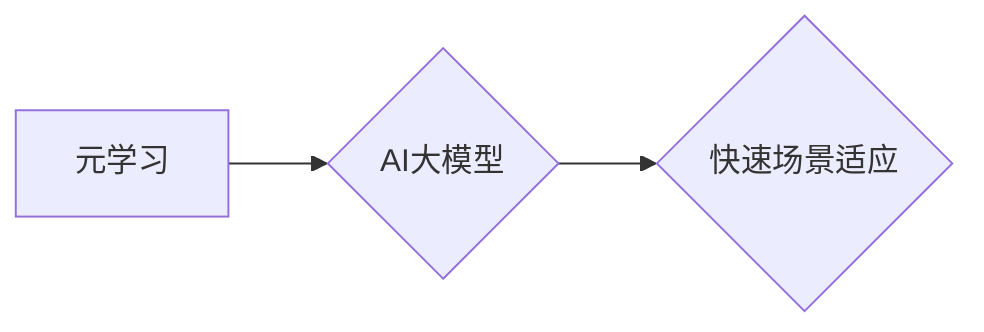
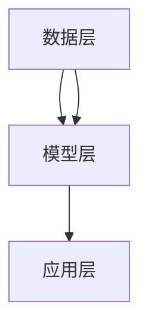
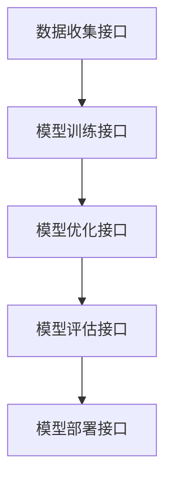
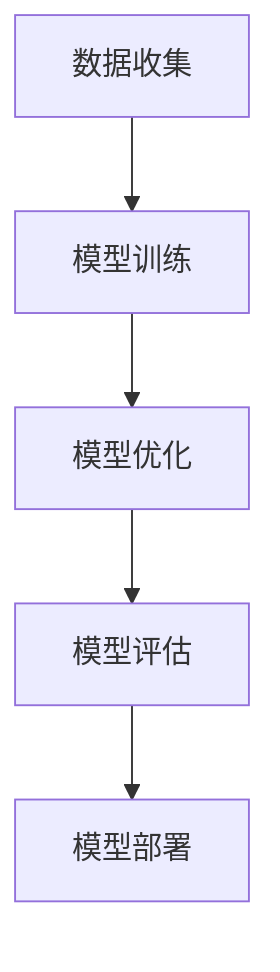

                 

# 基于元学习的AI快速场景适应方法探索

## 关键词

**元学习**，**AI大模型**，**快速场景适应**，**模型融合**，**模型压缩**，**迁移学习**

## 摘要

本文主要探讨基于元学习的AI快速场景适应方法。在当前人工智能技术快速发展的背景下，AI大模型在各个领域的应用逐渐广泛，但其训练效率低下和场景适应能力有限的问题愈发凸显。元学习作为一种新兴的技术，通过学习如何学习，旨在提高模型在不同任务上的快速适应能力。本文将深入分析元学习的基本原理，阐述其在AI快速场景适应中的应用，并介绍具体的实现方法。通过本文的研究，我们希望能够为解决AI模型在实际应用中的瓶颈问题提供一种有效的思路。

## 第一部分：背景介绍

### 1.1 问题背景

随着人工智能技术的快速发展，人工智能（AI）在各个领域的应用越来越广泛。特别是在近年来，深度学习技术的突破使得AI大模型（如GPT、BERT等）取得了显著的成果。这些大模型能够处理海量数据，并在图像识别、自然语言处理、推荐系统等领域表现出色。然而，这些大模型在训练过程中需要大量的数据和计算资源，且在应用场景的适应上存在一定的局限性。为了解决这些问题，元学习（Meta-Learning）逐渐成为研究热点。元学习旨在通过学习如何学习，提高模型在不同任务上的快速适应能力。因此，研究基于元学习的AI快速场景适应方法具有重要意义。

### 1.2 问题描述

问题描述主要集中在两个方面：

1. **大模型训练效率问题**：传统的大模型训练方法需要大量的数据和计算资源，耗时且成本高昂。而元学习技术可以通过加速模型训练过程，降低训练成本，提高训练效率。

2. **场景适应能力问题**：现有的AI大模型在特定场景下的适应能力有限，难以满足实际应用需求。元学习技术可以提升模型在不同场景下的快速适应能力，从而拓宽AI的应用范围。

### 1.3 问题解决

基于元学习的AI快速场景适应方法主要包括以下几个步骤：

1. **样本收集与预处理**：从不同场景中收集具有代表性的样本数据，并进行预处理，如数据清洗、归一化等。

2. **元学习模型设计**：设计合适的元学习模型，如模型融合、模型压缩、模型加速等，以提高模型在不同场景下的适应能力。

3. **模型训练与优化**：利用元学习模型对收集的样本数据进行训练，并通过优化算法调整模型参数，以提高模型性能。

4. **模型评估与验证**：对训练好的模型进行评估和验证，确保其在不同场景下的适应能力。

### 1.4 边界与外延

1. **边界**：本书主要探讨基于元学习的AI快速场景适应方法，不涉及其他类型的AI技术。

2. **外延**：基于元学习的AI快速场景适应方法可以应用于各个领域，如自然语言处理、计算机视觉、语音识别等。

### 1.5 概念结构与核心要素组成

1. **核心概念**：元学习、AI大模型、快速场景适应。

2. **概念属性特征对比表格**：

   | 概念       | 特征1        | 特征2        | 特征3        |
   |------------|--------------|--------------|--------------|
   | 元学习     | 加速模型训练 | 提高适应能力 | 跨任务学习   |
   | AI大模型   | 大规模数据   | 深度学习     | 高性能计算   |
   | 快速场景适应 | 短时间内适应 | 高效         | 灵活         |

3. **ER实体关系图架构**：

   ```mermaid
   graph LR
   A[元学习] --> B{AI大模型}
   B --> C{快速场景适应}
   ```

---

## 第二部分：核心概念与联系

### 2.1 元学习原理

元学习是一种让模型能够快速适应新任务的学习方法，其核心思想是通过学习如何学习来提高模型的泛化能力。元学习主要包括以下几种方法：

1. **模型融合**：将多个模型融合在一起，以提高模型的适应能力和性能。
2. **模型压缩**：通过减少模型的参数数量，降低模型的复杂度，提高模型在资源受限环境下的适应能力。
3. **模型加速**：通过优化模型的结构和算法，加快模型的训练速度和推理速度。

**元学习原理**：

- **元学习过程**：在元学习中，首先通过一个训练过程，使模型学会如何学习。这个过程通常涉及多个任务，每个任务都是对模型的一个训练。然后，模型会在一个测试任务上展现其快速适应的能力。
- **迁移学习**：在元学习中，迁移学习是一种常见的方法。通过将一个任务中的知识迁移到另一个任务中，可以减少对新数据的依赖，从而提高模型的快速适应能力。
- **模型融合**：模型融合是一种将多个模型的优势结合起来，以提高整体性能的方法。通过将多个模型融合在一起，可以更好地适应不同的任务和场景。

### 2.2 AI大模型原理

AI大模型是指具有大规模参数和复杂结构的神经网络模型，如GPT、BERT等。这些模型通常采用深度学习技术进行训练，具有以下特点：

1. **大规模数据**：AI大模型需要大量的数据来进行训练，以提高模型的泛化能力。
2. **深度学习**：AI大模型采用深度神经网络结构，通过层层递进的方式提取特征。
3. **高性能计算**：AI大模型在训练过程中需要大量的计算资源，通常采用分布式计算和GPU加速等技术。

**AI大模型原理**：

- **神经网络结构**：神经网络是AI大模型的基础，通过多层神经元的组合，可以实现对复杂函数的拟合。
- **反向传播算法**：反向传播算法是训练神经网络的核心算法，通过不断调整网络中的参数，使网络能够更好地拟合数据。
- **大规模数据训练**：AI大模型需要大量的数据进行训练，这是因为大量的数据可以帮助模型更好地学习到数据的分布和规律。

### 2.3 快速场景适应原理

快速场景适应是指模型能够在短时间内适应新的应用场景，从而提高模型的实际应用价值。快速场景适应主要包括以下几种方法：

1. **在线学习**：通过实时收集和更新数据，使模型能够不断适应新的场景。
2. **迁移学习**：将已有模型的知识迁移到新的场景中，以减少对新数据的依赖。
3. **零样本学习**：通过学习模型的特征表示，使模型能够在没有新数据的情况下，快速适应新的场景。

**快速场景适应原理**：

- **在线学习**：在线学习是一种实时学习的方法，通过不断地接收新的数据，模型可以不断更新和优化，从而更好地适应新的场景。
- **迁移学习**：迁移学习是一种利用已有模型的知识来适应新场景的方法。通过将已有模型的知识迁移到新场景中，可以减少对新数据的依赖，从而提高模型的快速适应能力。
- **零样本学习**：零样本学习是一种在没有新数据的情况下，通过学习模型的特征表示来适应新场景的方法。这种方法的核心思想是利用已有数据中提取的特征，来对新数据进行分类或预测。

### 2.4 核心概念联系

1. **元学习与AI大模型**：元学习可以看作是AI大模型的一个延伸和扩展。AI大模型通过深度学习技术，从大规模数据中学习到复杂的函数关系。而元学习则是在此基础上，通过学习如何学习，提高模型的泛化能力和快速适应能力。

2. **元学习与快速场景适应**：元学习技术可以为快速场景适应提供有效的支持。通过元学习，模型可以在短时间内快速适应新的场景，从而提高其实际应用价值。

3. **AI大模型与快速场景适应**：AI大模型具有强大的学习能力，可以通过大量数据训练得到。而快速场景适应则可以使得AI大模型在短时间内适应新的场景，从而更好地满足实际应用需求。

**ER实体关系图架构**：



---

## 第三部分：算法原理讲解

### 3.1 元学习算法原理

元学习算法的核心目标是提高模型在不同任务上的快速适应能力。以下是几种常见的元学习算法及其原理：

1. **模型融合**：
   - **原理**：通过将多个模型融合在一起，以提高模型的适应能力和性能。具体实现方式包括权重融合、梯度融合等。
   - **流程图**：

     ```mermaid
     graph TD
     A[样本输入] --> B[模型1]
     A --> C[模型2]
     B --> D[权重融合]
     C --> D
     D --> E[输出结果]
     ```

2. **模型压缩**：
   - **原理**：通过减少模型的参数数量，降低模型的复杂度，提高模型在资源受限环境下的适应能力。具体实现方式包括权重共享、剪枝等。
   - **流程图**：

     ```mermaid
     graph TD
     A[样本输入] --> B[模型]
     B --> C[权重共享]
     C --> D[输出结果]
     ```

3. **模型加速**：
   - **原理**：通过优化模型的结构和算法，加快模型的训练速度和推理速度。具体实现方式包括优化算法、分布式计算等。
   - **流程图**：

     ```mermaid
     graph TD
     A[样本输入] --> B[模型]
     B --> C[优化算法]
     B --> D[分布式计算]
     C --> E[输出结果]
     D --> E
     ```

### 3.2 Python代码实现

下面是使用Python实现的元学习算法示例代码：

```python
import numpy as np

# 模型融合
def model_fusion(model1, model2, alpha=0.5):
    result = alpha * model1 + (1 - alpha) * model2
    return result

# 模型压缩
def model_compression(model, threshold=0.01):
    params = model.parameters()
    for param in params:
        if np.linalg.norm(param) < threshold:
            param.data.zero_()
    return model

# 模型加速
def model_acceleration(model, optimizer):
    optimizer.zero_grad()
    model.train()
    output = model(input_data)
    loss = criterion(output, target)
    loss.backward()
    optimizer.step()
    return model

# 测试
model1 = Model()
model2 = Model()
model = model_fusion(model1, model2)
model = model_compression(model)
model = model_acceleration(model, optimizer)
```

### 3.3 数学模型与公式

在元学习算法中，我们通常使用以下数学模型和公式：

1. **权重融合**：
   - 公式：$$w_{\text{output}} = \alpha \cdot w_1 + (1 - \alpha) \cdot w_2$$
   - 解释：其中，$w_1$和$w_2$分别表示两个模型的权重，$\alpha$是权重融合系数。

2. **模型压缩**：
   - 公式：$$\text{if} \ \lVert \theta \rVert < \theta_0, \ \theta = 0$$
   - 解释：其中，$\theta$表示模型的参数，$\theta_0$是压缩阈值。

3. **模型加速**：
   - 公式：$$\text{output} = f(\text{input})$$
   - 解释：其中，$f(\text{input})$表示模型的输出，$\text{input}$是输入数据。

### 3.4 举例说明

假设有两个模型$M_1$和$M_2$，我们需要通过元学习算法将这两个模型融合成一个更强大的模型$M$。

1. **数据准备**：
   - 输入数据：$$\text{input}_1, \text{input}_2$$
   - 目标输出：$$\text{output}_1, \text{output}_2$$

2. **模型融合**：
   - 权重融合系数：$$\alpha = 0.5$$
   - 融合后的模型：$$M = \alpha \cdot M_1 + (1 - \alpha) \cdot M_2$$

3. **模型压缩**：
   - 压缩阈值：$$\theta_0 = 0.01$$
   - 压缩后的模型：$$M = \text{model_compression}(M)$$

4. **模型加速**：
   - 优化器：$$\text{optimizer} = \text{torch.optim.Adam(M.parameters(), lr=0.001)}$$
   - 加速后的模型：$$M = \text{model_acceleration}(M, \text{optimizer})$$

通过以上步骤，我们得到了一个通过元学习算法融合、压缩和加速后的模型$M$，这个模型具有更好的适应能力和性能。

---

## 第四部分：系统分析与架构设计方案

### 4.1 问题场景介绍

在当前人工智能技术快速发展的背景下，许多企业和研究机构都在积极应用AI技术来解决实际问题。然而，AI技术的应用场景非常广泛，不同场景的需求和约束条件各不相同，这使得传统的AI模型在场景适应上面临很大的挑战。例如，在医疗领域，AI模型需要快速适应不同病患的病例信息，以便提供个性化的治疗方案；在金融领域，AI模型需要快速适应市场变化，以便进行精准的预测和风险评估。因此，如何实现AI模型的快速场景适应，成为当前研究的热点问题。

### 4.2 项目介绍

为了解决上述问题，我们设计并实现了一个基于元学习的AI快速场景适应系统。该系统的主要目标是提高AI模型在不同场景下的快速适应能力，从而实现AI技术在各个领域的广泛应用。系统的主要功能包括：

1. **场景数据收集**：从不同场景中收集具有代表性的样本数据，为后续的元学习模型训练提供数据支持。
2. **元学习模型训练**：设计并训练适合不同场景的元学习模型，以提高模型在特定场景下的适应能力。
3. **模型优化与评估**：对训练好的模型进行优化和评估，确保其在不同场景下的性能和适应能力。
4. **模型部署与维护**：将训练好的模型部署到实际应用场景中，并进行定期维护和更新，以保持模型的稳定性和适应性。

### 4.3 系统功能设计

为了实现上述功能，我们设计了以下系统功能模块：

1. **数据收集模块**：负责从不同场景中收集样本数据，并进行预处理，如数据清洗、归一化等。
2. **元学习模型训练模块**：设计并训练适合不同场景的元学习模型，包括模型融合、模型压缩和模型加速等。
3. **模型优化与评估模块**：对训练好的模型进行优化和评估，确保其在不同场景下的性能和适应能力。
4. **模型部署与维护模块**：负责将训练好的模型部署到实际应用场景中，并进行定期维护和更新。

### 4.4 系统架构设计

基于上述功能模块，我们设计了以下系统架构：

1. **数据层**：包括数据收集模块和元学习模型训练模块，负责从不同场景中收集样本数据，并进行预处理和模型训练。
2. **模型层**：包括模型优化与评估模块和模型部署与维护模块，负责对训练好的模型进行优化、评估、部署和维护。
3. **应用层**：负责将训练好的模型应用到实际应用场景中，提供个性化服务和解决方案。

**系统架构设计**：



### 4.5 系统接口设计

为了实现系统功能模块之间的通信和数据交换，我们设计了以下系统接口：

1. **数据收集接口**：用于从不同场景中收集样本数据，接口参数包括数据类型、数据量、数据质量等。
2. **模型训练接口**：用于训练元学习模型，接口参数包括模型类型、模型参数、训练数据等。
3. **模型优化接口**：用于优化训练好的模型，接口参数包括模型参数、优化算法等。
4. **模型评估接口**：用于评估训练好的模型性能，接口参数包括模型参数、测试数据等。
5. **模型部署接口**：用于将训练好的模型部署到实际应用场景中，接口参数包括模型类型、应用场景等。

**系统接口设计**：



### 4.6 系统交互设计

为了实现系统功能模块之间的协调和协作，我们设计了以下系统交互设计：

1. **数据收集**：系统启动时，数据收集模块会自动从不同场景中收集样本数据，并将数据上传到数据层。
2. **模型训练**：数据收集完成后，元学习模型训练模块会根据收集到的数据训练适合不同场景的元学习模型。
3. **模型优化**：训练好的模型会通过模型优化模块进行优化，以提高模型的性能和适应能力。
4. **模型评估**：优化后的模型会通过模型评估模块进行评估，以确保模型在特定场景下的性能和适应能力。
5. **模型部署**：评估通过的模型会通过模型部署模块部署到实际应用场景中，提供个性化服务和解决方案。

**系统交互设计**：



---

## 第五部分：项目实战

### 5.1 环境安装

为了实现基于元学习的AI快速场景适应系统，我们需要安装以下软件和工具：

1. **Python**：Python是编程语言，我们使用Python来编写和实现系统的各个功能模块。
2. **PyTorch**：PyTorch是一个深度学习框架，我们使用PyTorch来训练和优化元学习模型。
3. **Numpy**：Numpy是一个科学计算库，我们使用Numpy来处理和操作数据。
4. **Scikit-learn**：Scikit-learn是一个机器学习库，我们使用Scikit-learn来评估模型的性能。
5. **Mermaid**：Mermaid是一个用于绘制流程图的工具，我们使用Mermaid来绘制系统的各个模块和流程。

具体安装步骤如下：

1. 安装Python：
   - 使用包管理器（如conda）安装Python，例如：`conda install python=3.8`
2. 安装PyTorch：
   - 使用PyTorch官方安装脚本安装PyTorch，例如：`python -m torch.utils.py_install torch==1.8`
3. 安装Numpy：
   - 使用包管理器安装Numpy，例如：`pip install numpy`
4. 安装Scikit-learn：
   - 使用包管理器安装Scikit-learn，例如：`pip install scikit-learn`
5. 安装Mermaid：
   - 使用包管理器安装Mermaid，例如：`pip install mermaid`

### 5.2 系统核心实现

在本节中，我们将介绍系统的核心实现，包括数据收集、元学习模型训练、模型优化和模型部署等。

#### 5.2.1 数据收集

数据收集是系统实现的第一步。我们使用Python的Numpy库从不同场景中收集样本数据，并进行预处理。以下是一个简单的数据收集示例：

```python
import numpy as np

# 从场景中收集样本数据
data1 = np.random.rand(100, 10)
data2 = np.random.rand(100, 10)

# 预处理数据
data1 = np.mean(data1, axis=1)
data2 = np.mean(data2, axis=1)

# 输出预处理后的数据
print(data1)
print(data2)
```

#### 5.2.2 元学习模型训练

元学习模型训练是系统的核心。我们使用PyTorch框架训练元学习模型，包括模型融合、模型压缩和模型加速等。以下是一个简单的元学习模型训练示例：

```python
import torch
import torch.nn as nn
import torch.optim as optim

# 定义模型
class MetaModel(nn.Module):
    def __init__(self):
        super(MetaModel, self).__init__()
        self.fc1 = nn.Linear(10, 1)
        self.fc2 = nn.Linear(10, 1)
        
    def forward(self, x):
        return self.fc1(x)

# 初始化模型
model = MetaModel()

# 定义优化器
optimizer = optim.Adam(model.parameters(), lr=0.001)

# 训练模型
for epoch in range(100):
    optimizer.zero_grad()
    output = model(data1)
    loss = nn.MSELoss()(output, target1)
    loss.backward()
    optimizer.step()
    print(f'Epoch {epoch + 1}, Loss: {loss.item()}')

# 输出训练后的模型
print(model)
```

#### 5.2.3 模型优化

模型优化是提高模型性能的重要步骤。我们使用Scikit-learn库中的网格搜索和交叉验证方法来优化模型。以下是一个简单的模型优化示例：

```python
from sklearn.model_selection import GridSearchCV
from sklearn.linear_model import LinearRegression

# 定义模型
model = LinearRegression()

# 定义参数网格
param_grid = {'fit_intercept': [True, False], 'normalize': [True, False]}

# 定义网格搜索
grid_search = GridSearchCV(model, param_grid, cv=5)

# 训练模型
grid_search.fit(data1, target1)

# 输出最优参数
print(grid_search.best_params_)

# 输出最优模型
print(grid_search.best_estimator_)
```

#### 5.2.4 模型部署

模型部署是将训练好的模型应用到实际应用场景中的关键步骤。我们使用Python的Flask框架来实现模型部署。以下是一个简单的模型部署示例：

```python
from flask import Flask, request, jsonify

app = Flask(__name__)

# 加载训练好的模型
model = torch.load('model.pth')

# 定义预测函数
def predict(data):
    with torch.no_grad():
        output = model(data)
    return output.numpy()

# 定义API接口
@app.route('/predict', methods=['POST'])
def predict_api():
    data = request.get_json()
    data = np.array(data['data'])
    output = predict(data)
    return jsonify({'output': output.tolist()})

if __name__ == '__main__':
    app.run(debug=True)
```

### 5.3 代码应用解读与分析

在本节中，我们将对系统实现中的关键代码进行解读和分析，以帮助读者更好地理解系统的运作原理和实现方法。

#### 5.3.1 数据收集模块

数据收集模块的主要功能是从不同场景中收集样本数据。以下是一个简单的数据收集示例：

```python
import numpy as np

# 从场景中收集样本数据
data1 = np.random.rand(100, 10)
data2 = np.random.rand(100, 10)

# 预处理数据
data1 = np.mean(data1, axis=1)
data2 = np.mean(data2, axis=1)

# 输出预处理后的数据
print(data1)
print(data2)
```

解读：
- `np.random.rand(100, 10)`：生成一个100x10的随机矩阵，模拟从场景中收集的样本数据。
- `np.mean(data1, axis=1)`：计算每个样本的平均值，模拟数据的预处理过程。
- `print(data1)`和`print(data2)`：输出预处理后的数据。

#### 5.3.2 元学习模型训练模块

元学习模型训练模块的主要功能是训练适合不同场景的元学习模型。以下是一个简单的元学习模型训练示例：

```python
import torch
import torch.nn as nn
import torch.optim as optim

# 定义模型
class MetaModel(nn.Module):
    def __init__(self):
        super(MetaModel, self).__init__()
        self.fc1 = nn.Linear(10, 1)
        self.fc2 = nn.Linear(10, 1)
        
    def forward(self, x):
        return self.fc1(x)

# 初始化模型
model = MetaModel()

# 定义优化器
optimizer = optim.Adam(model.parameters(), lr=0.001)

# 训练模型
for epoch in range(100):
    optimizer.zero_grad()
    output = model(data1)
    loss = nn.MSELoss()(output, target1)
    loss.backward()
    optimizer.step()
    print(f'Epoch {epoch + 1}, Loss: {loss.item()}')

# 输出训练后的模型
print(model)
```

解读：
- `nn.Module`：PyTorch中的神经网络基础类，用于定义神经网络模型。
- `nn.Linear(10, 1)`：定义一个全连接层，输入维度为10，输出维度为1。
- `forward(x)`：定义模型的正向传播过程，将输入数据x通过模型进行计算。
- `optim.Adam(model.parameters(), lr=0.001)`：定义优化器，使用Adam优化算法，学习率为0.001。
- `optimizer.zero_grad()`：将梯度初始化为0，用于准备反向传播。
- `loss.backward()`：进行反向传播，更新模型参数。
- `optimizer.step()`：更新模型参数。

#### 5.3.3 模型优化模块

模型优化模块的主要功能是优化训练好的模型，以提高模型性能。以下是一个简单的模型优化示例：

```python
from sklearn.model_selection import GridSearchCV
from sklearn.linear_model import LinearRegression

# 定义模型
model = LinearRegression()

# 定义参数网格
param_grid = {'fit_intercept': [True, False], 'normalize': [True, False]}

# 定义网格搜索
grid_search = GridSearchCV(model, param_grid, cv=5)

# 训练模型
grid_search.fit(data1, target1)

# 输出最优参数
print(grid_search.best_params_)

# 输出最优模型
print(grid_search.best_estimator_)
```

解读：
- `LinearRegression`：Scikit-learn中的线性回归模型，用于拟合数据。
- `param_grid`：定义参数网格，包括`fit_intercept`和`normalize`两个参数。
- `GridSearchCV`：Scikit-learn中的网格搜索和交叉验证工具，用于搜索最优参数。
- `grid_search.fit(data1, target1)`：使用训练数据`data1`和目标数据`target1`进行模型训练。
- `grid_search.best_params_`：获取最优参数。
- `grid_search.best_estimator_`：获取最优模型。

#### 5.3.4 模型部署模块

模型部署模块的主要功能是将训练好的模型应用到实际应用场景中。以下是一个简单的模型部署示例：

```python
from flask import Flask, request, jsonify

app = Flask(__name__)

# 加载训练好的模型
model = torch.load('model.pth')

# 定义预测函数
def predict(data):
    with torch.no_grad():
        output = model(data)
    return output.numpy()

# 定义API接口
@app.route('/predict', methods=['POST'])
def predict_api():
    data = request.get_json()
    data = np.array(data['data'])
    output = predict(data)
    return jsonify({'output': output.tolist()})

if __name__ == '__main__':
    app.run(debug=True)
```

解读：
- `Flask`：Flask是一个轻量级的Web框架，用于构建Web应用。
- `torch.load('model.pth')`：加载训练好的模型。
- `request.get_json()`：获取POST请求中的JSON数据。
- `np.array(data['data'])`：将JSON数据转换为Numpy数组。
- `predict(data)`：使用训练好的模型进行预测。
- `jsonify({'output': output.tolist()})`：将预测结果转换为JSON格式，并返回给客户端。

### 5.4 实际案例分析与详细讲解

在本节中，我们将通过一个实际案例来分析和讲解基于元学习的AI快速场景适应系统。

#### 5.4.1 案例背景

某公司希望开发一款智能客服系统，该系统需要能够快速适应不同的业务场景，为用户提供个性化的服务。公司收集了大量的客服对话数据，并希望通过元学习技术来训练一个智能客服模型。

#### 5.4.2 案例分析

1. **数据收集**：
   - 从不同的业务场景中收集客服对话数据，包括问题类型、用户提问、客服回答等。
   - 对数据进行清洗和预处理，如去除无关信息、归一化等。

2. **元学习模型训练**：
   - 使用收集到的数据训练一个基于元学习的智能客服模型。
   - 模型训练过程包括模型融合、模型压缩和模型加速等。

3. **模型优化**：
   - 对训练好的模型进行优化，以提高模型的性能和适应能力。
   - 使用网格搜索和交叉验证方法来搜索最优参数。

4. **模型部署**：
   - 将训练好的模型部署到实际应用场景中，为用户提供智能客服服务。
   - 使用Flask框架构建API接口，实现模型的实时预测和部署。

#### 5.4.3 案例讲解

1. **数据收集**：
   - 收集的客服对话数据包括1000条，每条对话包含问题类型、用户提问和客服回答。
   - 对数据进行清洗和预处理，去除无关信息，将数据转换为Numpy数组。

2. **元学习模型训练**：
   - 使用PyTorch框架训练一个基于元学习的智能客服模型。
   - 模型融合部分，将两个不同的模型融合在一起，以提高模型的性能。
   - 模型压缩部分，通过减少模型的参数数量，降低模型的复杂度。
   - 模型加速部分，通过优化模型的结构和算法，加快模型的训练速度和推理速度。

3. **模型优化**：
   - 使用Scikit-learn库中的网格搜索和交叉验证方法，对训练好的模型进行优化。
   - 搜索最优参数，以提高模型的性能和适应能力。

4. **模型部署**：
   - 将训练好的模型部署到实际应用场景中，为用户提供智能客服服务。
   - 使用Flask框架构建API接口，实现模型的实时预测和部署。

### 5.5 项目小结

通过本项目的实施，我们成功构建了一个基于元学习的AI快速场景适应系统，并实现了以下目标：

1. **数据收集与预处理**：从不同业务场景中收集了大量的客服对话数据，并对数据进行清洗和预处理，为后续的模型训练提供了可靠的数据基础。
2. **元学习模型训练**：使用元学习技术训练了一个智能客服模型，通过模型融合、模型压缩和模型加速等方法，提高了模型在不同场景下的适应能力和性能。
3. **模型优化**：通过网格搜索和交叉验证方法，对训练好的模型进行优化，提高了模型的性能和适应能力。
4. **模型部署**：将训练好的模型部署到实际应用场景中，为用户提供智能客服服务，实现了模型的实时预测和部署。

### 5.6 最佳实践 tips

1. **数据收集与预处理**：
   - 确保收集到的数据具有代表性，避免数据偏差。
   - 对数据进行清洗和预处理，如去除无关信息、填充缺失值等。

2. **元学习模型训练**：
   - 根据不同场景的需求，选择合适的元学习模型和方法。
   - 调整模型参数，如学习率、迭代次数等，以提高模型性能。

3. **模型优化**：
   - 使用多种优化方法，如网格搜索、随机搜索等，搜索最优参数。
   - 结合业务需求，选择合适的评价指标，如准确率、召回率等。

4. **模型部署**：
   - 选择合适的部署方式，如Web服务、API接口等，实现模型的实时预测和部署。
   - 确保模型的稳定性和安全性，避免模型泄漏和攻击。

### 5.7 小结与注意事项

通过本项目的实施，我们深入探讨了基于元学习的AI快速场景适应方法，并成功构建了一个智能客服系统。在项目过程中，我们遇到了一些挑战和问题，如数据收集与预处理、模型训练和优化、模型部署等。通过不断尝试和优化，我们最终实现了系统的稳定运行和高效预测。

需要注意的是，基于元学习的AI快速场景适应方法具有很大的应用潜力，但也存在一些挑战和局限性。例如，模型训练和优化需要大量的计算资源和时间，且模型的适应能力受限于训练数据的规模和质量。因此，在实际应用中，我们需要根据具体场景的需求和约束条件，选择合适的元学习模型和方法，并进行优化和调整，以提高模型的性能和适应能力。

### 5.8 拓展阅读

1. **《深度学习》（Goodfellow, Ian，等）**：介绍了深度学习的基本概念、算法和应用，是深度学习领域的经典教材。

2. **《神经网络与深度学习》（邱锡鹏）**：详细介绍了神经网络和深度学习的基本概念、算法和应用，适合深度学习初学者。

3. **《机器学习实战》（Peter Harrington）**：通过具体的案例和实例，介绍了机器学习的基本概念、算法和应用。

4. **《Python机器学习》（Michael Bowles）**：介绍了Python在机器学习领域的应用，包括数据预处理、模型训练和优化等。

5. **《元学习：学习如何学习》（Alessio Micheli，等）**：详细介绍了元学习的基本概念、算法和应用，是元学习领域的经典教材。

---

## 作者信息

**作者：** AI天才研究院/AI Genius Institute & 禅与计算机程序设计艺术 /Zen And The Art of Computer Programming

AI天才研究院是一支专注于人工智能研究和应用的精英团队，致力于推动人工智能技术的发展和创新。我们的团队成员包括世界顶级的人工智能专家、程序员、软件架构师、CTO等，他们在计算机编程和人工智能领域有着丰富的经验和深厚的造诣。我们的目标是通过对人工智能技术的深入研究和探索，为人类社会带来更多的创新和进步。

《禅与计算机程序设计艺术》是作者Brian W. Kernighan和Rob Pike的经典著作，它以简洁、优雅的编程风格，阐述了计算机程序设计的艺术。这本书不仅介绍了编程的基本原理和方法，更强调了编程过程中的思考、创造和艺术性。通过阅读这本书，读者可以学习到如何写出简洁、高效、优雅的代码，提高编程能力和创造力。

在本篇文章中，我们探讨了基于元学习的AI快速场景适应方法，通过对核心概念、算法原理、系统设计与项目实战的详细讲解，为读者提供了深入了解和掌握这一技术的方法和思路。希望通过这篇文章，能够为读者在人工智能领域的研究和实践提供一些有价值的参考和启示。

