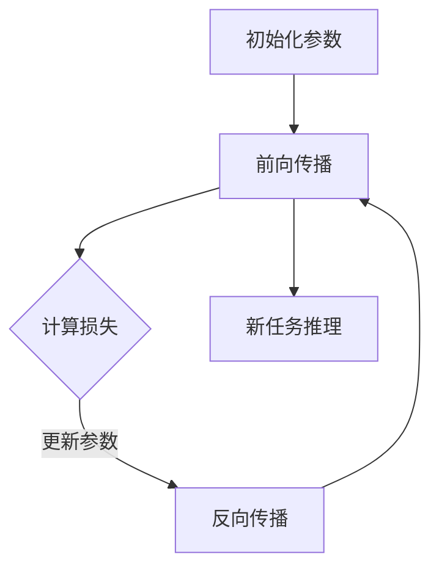

                 

### 第1章：问题背景介绍

#### 1.1 元学习的基本概念

元学习（Meta-Learning），又称“学习的学习”，是一种让机器通过学习如何学习来提升其在新任务上的表现的能力。其核心思想是通过在一系列不同的任务上训练模型，使模型能够捕捉到任务的共性，从而在新的任务上迅速适应并达到良好的性能。

##### 1.1.1 元学习的定义与历史发展

元学习这一概念最早由G. Booch等人于1980年代提出，最初应用于软件工程领域。随后，随着机器学习特别是深度学习技术的发展，元学习逐渐成为人工智能领域的一个研究热点。传统的机器学习方法需要针对每个具体任务重新训练模型，而元学习旨在通过一次学习或少量样本学习，使模型能够在新的任务上快速适应。

在深度学习领域，元学习的研究主要可以分为两个方向：模型自适应（Model Adaptation）和样本自适应（Sample Adaptation）。模型自适应是指通过调整模型参数来适应新任务；而样本自适应则是通过重新采样数据或修改样本特征来实现对新任务的快速适应。

##### 1.1.2 元学习的研究意义与应用场景

元学习的研究意义在于它能够提高模型的泛化能力和迁移学习能力。通过在多种任务上训练模型，元学习能够使模型对任务的共性有更深刻的理解，从而在遇到新任务时能够迅速适应。这一特性使得元学习在多种应用场景中具有显著的优势。

以下是元学习的一些典型应用场景：

1. **强化学习**：在强化学习任务中，元学习可以用于快速调整策略网络，使其在不同环境中具有更好的适应能力。
2. **计算机视觉**：元学习可以用于图像分类、目标检测等任务，使模型能够在不同的图像数据集上快速适应。
3. **自然语言处理**：元学习在文本分类、机器翻译、问答系统等领域具有广泛的应用，通过学习不同语言和文体的特征，能够提高模型的泛化能力。
4. **无人驾驶**：在自动驾驶领域，元学习可以帮助车辆快速适应不同的驾驶环境和路况。

#### 1.2 场景适应推理的需求与挑战

##### 1.2.1 场景适应推理的背景

场景适应推理（Scene Adaptation Reasoning）是人工智能领域的一个重要研究方向，它涉及模型在不同场景下的自适应能力。场景适应推理的核心目标是使模型能够从现有的知识库中推断出新的结论，并适应新的场景或任务。

场景适应推理的需求源于现实世界的复杂性。在实际应用中，系统需要处理的数据和任务往往具有多样性和动态性，这就要求模型具有高度的适应能力。例如，在自动驾驶系统中，车辆需要能够适应不同的路况、天气和环境；在医疗诊断系统中，模型需要能够适应不同医生的风格和诊断标准。

##### 1.2.2 快速适应推理的现实挑战

尽管场景适应推理具有广泛的应用前景，但实现快速适应推理仍然面临许多挑战：

1. **数据多样性**：现实世界中的场景和任务是多样化的，如何设计模型使其能够适应不同类型的数据和任务，是一个关键问题。
2. **数据稀疏性**：在某些应用场景中，新的数据可能非常稀少，这要求模型能够在少量样本上迅速适应。
3. **计算资源限制**：在许多应用中，尤其是实时应用，如自动驾驶和智能监控，对计算资源的需求非常高，如何设计高效的算法是一个重要的挑战。
4. **模型可解释性**：为了提高模型的可靠性和透明度，需要确保模型的可解释性，使其适应推理过程能够被理解和验证。

#### 1.3 元学习在快速场景适应推理中的应用前景

元学习为快速场景适应推理提供了一种有效的解决方案。通过元学习，模型可以在多种任务上训练，从而提高其适应新任务的能力。以下是一些元学习在快速场景适应推理中的应用前景：

1. **迁移学习**：元学习可以通过迁移学习的方式，将已有任务的知识迁移到新任务中，从而减少对新数据的依赖，提高模型的适应速度。
2. **持续学习**：元学习可以帮助模型在不断变化的环境中持续学习，使其能够适应新的场景和任务。
3. **多任务学习**：元学习可以同时训练多个任务，通过共享知识，提高模型在不同任务上的适应能力。
4. **少样本学习**：元学习可以在少量样本上快速适应，这对于数据稀疏的应用场景具有重要意义。

总之，元学习在快速场景适应推理中具有广阔的应用前景，其研究与发展将有助于推动人工智能技术的进步和应用。

### 2.1 元学习的核心原理

#### 2.1.1 元学习的基本模型

元学习的基本模型可以分为两部分：元学习算法和元学习任务。元学习算法负责通过在不同任务上的训练来提高模型的泛化能力，而元学习任务则是为元学习算法提供训练数据。

##### 2.1.1.1 元学习算法

常见的元学习算法包括：

- **模型自适应学习（Model-Agnostic Meta-Learning, MAML）**：MAML是一种基于梯度下降的元学习算法，旨在找到一组模型参数，使得模型能够在新的任务上快速适应。其基本思想是优化模型的初始化参数，使其在新任务上的梯度更新较小。
- **模型更新算法（Model Update Algorithms）**：这类算法通过更新模型参数来适应新任务，常见的有Reptile和AdaNet。
- **基于梯度的元学习（Gradient-based Meta-Learning）**：这类算法利用梯度信息来优化模型参数，常见的有Model Averaging和Random Initialization。

##### 2.1.1.2 元学习任务

元学习任务可以分为以下几种类型：

- **合成任务（Synthetic Tasks）**：这些任务是通过合成数据集来模拟不同的任务环境。
- **域自适应任务（Domain Adaptation Tasks）**：这些任务关注模型在不同数据分布上的适应能力。
- **少样本学习任务（Few-Shot Learning Tasks）**：这些任务要求模型能够在非常少量的样本上快速适应。

#### 2.1.2 元学习的分类与对比

根据元学习算法的不同，可以将元学习分为以下几类：

- **基于梯度的元学习**：这类算法通过优化梯度来提高模型的适应能力。例如，MAML和模型更新算法。
- **基于模型结构的元学习**：这类算法通过优化模型结构来提高适应能力。例如，模型融合和神经网络架构搜索。
- **基于数据集的元学习**：这类算法通过优化数据集来提高模型的适应能力。例如，数据增强和域自适应。

以下是几种主要元学习算法的对比表格：

| 算法         | 基本思想                                   | 优点                                           | 缺点                                       |
|------------|------------------------------------------|------------------------------------------------|------------------------------------------|
| MAML       | 通过优化初始化参数，使模型快速适应新任务 | 快速适应，适用于少样本学习                   | 计算成本高，对初始化敏感               |
| Reptile    | 通过迭代更新模型参数，使模型适应新任务   | 实时适应，计算成本低                           | 泛化能力有限，收敛速度慢               |
| Model Averaging | 通过平均多个模型的参数，提高适应能力    | 降低过拟合，提高泛化能力                    | 需要大量模型，计算成本高               |
| Neural Architecture Search (NAS) | 自动搜索最优模型结构                         | 自动化模型设计，提高模型性能                | 计算成本高，对数据依赖性强             |

#### 2.2 场景适应推理的数学模型

##### 2.2.1 场景适应推理的基本框架

场景适应推理的数学模型可以分为以下几个部分：

1. **场景表示（Scene Representation）**：将场景信息转换为模型可以理解和处理的形式。常见的表示方法包括向量表示、图谱表示和图神经网络。
2. **知识表示（Knowledge Representation）**：将已有知识库中的信息表示为模型可以学习的形式。知识表示方法包括知识图谱、知识嵌入和规则表示。
3. **推理算法（Reasoning Algorithm）**：根据场景表示和知识表示，进行推理以生成新的结论。常见的推理算法包括基于规则的推理、基于模型的推理和混合推理。
4. **适应性调整（Adaptation Adjustment）**：根据推理结果对模型进行调整，以适应新的场景或任务。适应性调整方法包括在线学习、迁移学习和模型更新。

##### 2.2.2 关键技术参数解析

在场景适应推理的数学模型中，几个关键技术参数需要特别关注：

1. **场景表示精度**：场景表示的精度直接影响推理的准确性。高精度的场景表示可以更好地捕捉场景特征，从而提高推理效果。
2. **知识表示一致性**：知识表示需要与场景表示保持一致性，以确保推理过程的连贯性和准确性。
3. **推理算法效率**：高效的推理算法可以更快地生成结论，从而提高系统的响应速度和实时性。
4. **模型适应性**：模型需要具备良好的适应性，能够在不同的场景和任务下快速调整。

##### 2.2.3 元学习与场景适应推理的关系

元学习与场景适应推理有着密切的联系。元学习通过在多种任务上训练模型，使其能够捕捉到任务的共性，从而提高模型的泛化能力和适应能力。这一特性使得元学习成为场景适应推理的重要工具。

1. **元学习提升场景适应能力**：通过元学习，模型可以快速适应新的场景，减少对新数据的依赖。
2. **场景适应推理优化元学习**：场景适应推理中的适应性调整可以反馈给元学习过程，从而优化模型的初始参数和学习过程。

总之，元学习与场景适应推理的结合为人工智能系统提供了强大的适应能力，有助于实现更加智能化和自动化的解决方案。

#### 2.3.1 元学习如何支持场景适应推理

元学习在支持场景适应推理方面发挥着关键作用，其核心在于通过跨任务的训练来提升模型的泛化能力，使其能够在新的、未见过的场景中迅速适应。以下从几个方面详细阐述元学习如何支持场景适应推理：

1. **快速适应新任务**：元学习算法，如MAML，通过在多个任务上的训练，学习到一套通用的模型初始化策略，使得模型在新任务上能够迅速达到良好性能。这种方法特别适合那些难以获取大量训练数据或数据获取成本高昂的场景。

2. **减少数据依赖**：在许多实际应用中，如自动驾驶、医疗诊断等，数据获取和标注非常困难且成本高昂。元学习通过在多个任务上的训练，使模型能够在少量样本上快速适应，从而减少对大量训练数据的依赖。

3. **提高泛化能力**：元学习通过跨任务的训练，使模型能够学习到不同任务之间的共性，从而提高其在未见过的任务上的泛化能力。这种方法不仅适用于静态场景，也适用于动态变化的场景。

4. **优化模型初始化**：在元学习过程中，通过优化模型初始化参数，可以使得模型在新的任务上具有更好的适应性和性能。这一过程类似于人类学习新任务时的经验积累，使得模型能够更快地掌握新任务的特点。

5. **增强模型鲁棒性**：元学习通过在不同任务上的训练，增强了模型的鲁棒性，使其能够处理不同类型的数据和异常情况。这在某些需要高可靠性的应用中尤为重要，如无人驾驶和医疗诊断。

6. **支持少样本学习**：在许多实际应用中，如个性化推荐和智能诊断，数据的稀疏性是一个显著问题。元学习能够帮助模型在少量样本上快速适应，从而减少对大量数据的依赖。

#### 2.3.2 二者结合的优势分析

元学习与场景适应推理的结合带来了以下几个显著优势：

1. **高效适应新环境**：通过元学习，模型能够在新的场景中快速适应，减少了对传统训练方法的依赖，提高了系统的响应速度和效率。

2. **提高模型稳定性**：元学习使模型能够在多种任务和场景下保持良好的性能，从而提高了模型的稳定性和可靠性。

3. **降低数据需求**：元学习通过在多个任务上的训练，减少了单个任务对大量训练数据的依赖，这在数据获取成本高昂的场景中尤为重要。

4. **增强泛化能力**：元学习使模型能够从多个任务中学习到共性，从而提高了其在未见过的任务和场景上的泛化能力。

5. **提高系统灵活性**：通过元学习和场景适应推理的结合，系统可以更加灵活地应对不同的场景和任务，从而提高了系统的适用性和扩展性。

6. **减少训练成本**：元学习通过在多个任务上的共享训练，减少了单个任务的训练成本，这对于资源有限的应用场景具有重要意义。

总之，元学习与场景适应推理的结合不仅提高了模型的适应能力，还带来了显著的优势，为人工智能系统提供了更加高效、稳定和灵活的解决方案。

### 3.1 常见元学习算法介绍

#### 3.1.1 MAML（模型自适应学习）

MAML（Model-Agnostic Meta-Learning）是一种基于梯度的元学习算法，旨在找到一组模型参数，使得模型能够在新的任务上快速适应。其核心思想是优化模型的初始化参数，使其在新任务上的梯度更新较小。

**MAML的工作原理**：

MAML算法通过以下步骤进行训练：

1. **初始化参数**：首先初始化模型参数 $\theta_0$。
2. **前向传播**：对于每个任务 $t$，进行前向传播得到损失函数 $L_t(\theta)$。
3. **反向传播**：对于每个任务 $t$，进行反向传播更新模型参数 $\theta$。
4. **优化参数**：通过优化损失函数 $L_t(\theta)$，更新模型参数 $\theta$。

MAML的目标是最小化所有任务的损失函数，即：
$$
\theta^* = \arg \min_{\theta} \sum_{t=1}^T L_t(\theta)
$$

其中 $T$ 是任务的个数。

**MAML的优势**：

- **快速适应新任务**：MAML通过优化初始化参数，使得模型能够在新的任务上快速适应，减少了对大量训练数据的依赖。
- **减少计算成本**：由于MAML只需在初始化时进行一次全量训练，因此在后续的任务适应中，计算成本较低。

**MAML的应用场景**：

- **少样本学习**：MAML特别适合那些难以获取大量训练数据的场景，如个性化推荐、智能诊断等。
- **跨领域迁移学习**：MAML能够将已有任务的知识迁移到新任务中，从而减少对新数据的依赖。

#### 3.1.2 Reptile

Reptile（Recurrent Elastic Weight Consolidation）是一种基于梯度的元学习算法，旨在通过迭代更新模型参数，使模型能够快速适应新任务。与MAML不同，Reptile不需要进行全量训练，而是通过迭代优化来更新模型参数。

**Reptile的工作原理**：

Reptile算法通过以下步骤进行训练：

1. **初始化参数**：首先初始化模型参数 $\theta_0$。
2. **迭代优化**：对于每个任务 $t$，进行以下迭代优化：
   - **前向传播**：进行前向传播得到损失函数 $L_t(\theta)$。
   - **反向传播**：进行反向传播更新模型参数 $\theta$。
   - **优化参数**：更新模型参数 $\theta$。

Reptile的目标是最小化所有任务的损失函数，即：
$$
\theta^* = \arg \min_{\theta} \sum_{t=1}^T L_t(\theta)
$$

**Reptile的优势**：

- **实时适应**：Reptile通过迭代优化，可以实时更新模型参数，从而快速适应新任务。
- **计算成本低**：由于Reptile不需要进行全量训练，因此在计算成本上具有优势。

**Reptile的应用场景**：

- **实时应用**：Reptile特别适合那些需要实时响应的场景，如智能监控、自动驾驶等。
- **少量样本学习**：Reptile能够在少量样本上快速适应，从而减少对大量训练数据的依赖。

#### 3.1.3 Model-Agnostic Meta-Learning (MAML)

Model-Agnostic Meta-Learning (MAML) 是一种基于梯度的元学习算法，旨在找到一组通用的模型初始化参数，使其在不同任务上具有快速适应能力。与MAML类似，MAML通过优化初始化参数，使得模型在新任务上的梯度更新较小。

**MAML的工作原理**：

MAML算法通过以下步骤进行训练：

1. **初始化参数**：首先初始化模型参数 $\theta_0$。
2. **前向传播**：对于每个任务 $t$，进行前向传播得到损失函数 $L_t(\theta)$。
3. **反向传播**：对于每个任务 $t$，进行反向传播更新模型参数 $\theta$。
4. **优化参数**：通过优化损失函数 $L_t(\theta)$，更新模型参数 $\theta$。

MAML的目标是最小化所有任务的损失函数，即：
$$
\theta^* = \arg \min_{\theta} \sum_{t=1}^T L_t(\theta)
$$

**MAML的优势**：

- **通用性**：MAML通过优化初始化参数，使得模型在不同任务上具有通用性，从而提高模型的适应能力。
- **快速适应**：MAML能够快速适应新任务，减少了对大量训练数据的依赖。

**MAML的应用场景**：

- **跨领域迁移学习**：MAML能够将已有任务的知识迁移到新任务中，从而减少对新数据的依赖。
- **少量样本学习**：MAML特别适合那些难以获取大量训练数据的场景。

综上所述，MAML、Reptile和Model-Agnostic Meta-Learning (MAML) 是三种常见的元学习算法，它们各有特点，适用于不同的应用场景。MAML和MAML (Model-Agnostic Meta-Learning) 都是基于梯度的元学习算法，但MAML更注重通用性，而MAML (Model-Agnostic Meta-Learning) 更注重快速适应。Reptile则通过迭代优化，实现实时适应，适用于需要实时响应的场景。

### 3.2 快速场景适应推理方法设计

#### 3.2.1 基于MAML的快速适应推理

基于MAML的快速适应推理方法是一种利用元学习原理提高模型适应新场景能力的有效方式。MAML通过优化模型初始参数，使得模型在新任务上能够快速收敛，从而实现快速适应推理。以下是基于MAML的快速适应推理方法的具体实现步骤：

1. **初始化模型参数**：首先，初始化模型参数 $\theta_0$。这一步骤至关重要，因为它决定了模型在新任务上的初始状态。

   ```python
   def initialize_parameters():
       # 初始化模型参数
       theta_0 = ...
       return theta_0
   ```

2. **前向传播**：对于每个任务 $t$，进行前向传播，得到损失函数 $L_t(\theta)$。

   ```python
   def forward_propagation(x_t, theta):
       # 前向传播
       y_t = model_forward(x_t, theta)
       loss = compute_loss(y_t, y_t_)
       return loss
   ```

3. **反向传播**：对于每个任务 $t$，进行反向传播，更新模型参数 $\theta$。

   ```python
   def backward_propagation(x_t, y_t, theta):
       # 反向传播
       gradients = compute_gradients(y_t, theta)
       theta = update_parameters(theta, gradients)
       return theta
   ```

4. **优化参数**：通过优化损失函数 $L_t(\theta)$，更新模型参数 $\theta$。MAML使用梯度信息来优化参数，使得模型在新任务上具有更好的适应能力。

   ```python
   def optimize_parameters(theta, loss, learning_rate):
       # 优化参数
       theta = theta - learning_rate * loss
       return theta
   ```

5. **迭代优化**：重复上述步骤，对于多个任务进行迭代优化，最终得到一组优化的初始参数 $\theta^*$。

   ```python
   theta_0 = initialize_parameters()
   for t in range(num_tasks):
       loss = forward_propagation(x_t, theta_0)
       theta_0 = backward_propagation(x_t, y_t, theta_0)
       theta_0 = optimize_parameters(theta_0, loss, learning_rate)
   ```

6. **新任务推理**：在新任务上使用优化后的初始参数 $\theta^*$，进行推理得到预测结果。

   ```python
   def inference(x_new, theta^*):
       # 新任务推理
       y_new = model_forward(x_new, theta^*)
       return y_new
   ```

通过以上步骤，基于MAML的快速适应推理方法可以有效地提高模型在未见过的任务上的适应能力。具体实现时，可以根据实际任务的特点和需求，调整模型结构、损失函数和优化算法，以获得更好的适应效果。

#### 3.2.2 基于Reptile的快速适应推理

基于Reptile的快速适应推理方法利用迭代优化的思想，使模型能够在新任务上快速适应。Reptile通过不断迭代更新模型参数，逐步优化模型的性能，从而实现快速适应。以下是基于Reptile的快速适应推理方法的具体实现步骤：

1. **初始化模型参数**：首先，初始化模型参数 $\theta_0$。初始化参数的设置对于Reptile的性能至关重要，通常可以选择随机初始化或基于已有模型的初始化。

   ```python
   def initialize_parameters():
       # 初始化模型参数
       theta_0 = torch.randn(n_params).requires_grad_()
       return theta_0
   ```

2. **迭代优化**：对于每个任务 $t$，进行迭代优化，逐步更新模型参数 $\theta$。

   ```python
   def iterate_optimization(x_t, y_t, theta, num_iterations, learning_rate):
       for _ in range(num_iterations):
           # 前向传播
           y_pred = model_forward(x_t, theta)
           # 计算损失
           loss = compute_loss(y_pred, y_t)
           # 反向传播
           loss.backward()
           # 更新参数
           theta = theta - learning_rate * theta.grad()
           theta.grad.zero_()
       return theta
   ```

3. **更新参数**：在每次迭代中，通过计算损失函数的梯度，逐步更新模型参数 $\theta$。Reptile使用梯度下降算法进行参数更新，并设置适当的步长（learning rate）来控制更新过程。

   ```python
   theta = iterate_optimization(x_t, y_t, theta_0, num_iterations, learning_rate)
   ```

4. **新任务推理**：在新任务上使用优化后的参数 $\theta$，进行推理得到预测结果。

   ```python
   def inference(x_new, theta):
       # 新任务推理
       y_new = model_forward(x_new, theta)
       return y_new
   ```

5. **多任务适应**：对于多个任务，可以依次进行迭代优化，逐步优化模型参数，从而提高模型在不同任务上的适应能力。

   ```python
   for t in range(num_tasks):
       x_t, y_t = load_task_data(t)
       theta = iterate_optimization(x_t, y_t, theta_0, num_iterations, learning_rate)
   ```

通过以上步骤，基于Reptile的快速适应推理方法可以有效地提高模型在未知任务上的适应能力。具体实现时，可以根据任务的特点和需求，调整迭代次数、学习率等参数，以获得更好的适应效果。

#### 3.2.3 MAML与Reptile的比较与优化

MAML（模型自适应学习）和Reptile是两种常见的元学习算法，它们各自具有独特的优势和适用场景。在本节中，我们将对这两种算法进行比较，并探讨如何通过优化策略提高快速场景适应推理的性能。

**MAML与Reptile的对比**

1. **工作原理**：

   - **MAML**：MAML通过优化模型初始参数，使得模型在新任务上能够快速适应。其核心思想是找到一组通用参数，使得模型在不同任务上的梯度更新较小。
   - **Reptile**：Reptile通过迭代更新模型参数，逐步优化模型性能，从而实现快速适应。它使用梯度下降算法进行参数更新，并在每次迭代中逐步调整模型。

2. **计算成本**：

   - **MAML**：MAML需要为每个任务进行全量训练，计算成本较高，特别是在任务数量较多时。
   - **Reptile**：Reptile通过迭代优化，每次迭代只需进行部分训练，计算成本较低，适合实时应用。

3. **适应能力**：

   - **MAML**：MAML通过优化初始参数，使得模型在未见过的任务上具有较好的适应能力，特别适合少样本学习和跨领域迁移学习。
   - **Reptile**：Reptile通过迭代优化，逐步调整模型参数，使其在新任务上快速适应。它适用于数据稀疏和实时响应的场景。

**优化策略**

为了进一步提高MAML和Reptile在快速场景适应推理中的性能，可以采用以下优化策略：

1. **动态学习率调整**：

   - **MAML**：在MAML的训练过程中，可以动态调整学习率，以避免模型在优化过程中的过早饱和。例如，使用学习率衰减策略，在训练早期使用较大的学习率，逐步减小学习率。
   - **Reptile**：在Reptile的训练过程中，可以设置自适应学习率，根据模型的适应效果动态调整学习率。例如，使用自适应梯度算法，根据梯度变化调整学习率。

2. **正则化**：

   - **MAML**：在MAML的训练过程中，可以加入正则化项，如权重正则化或Dropout，以避免模型过拟合。正则化可以帮助模型在未见过的任务上保持较好的泛化能力。
   - **Reptile**：在Reptile的训练过程中，可以采用权重衰减策略，逐步减小模型参数的更新幅度，从而提高模型的稳定性。

3. **数据增强**：

   - **MAML**：对于数据稀疏的任务，可以采用数据增强策略，生成更多的训练样本，以帮助模型更好地适应新任务。例如，通过图像翻转、旋转或裁剪等方法，增加数据的多样性。
   - **Reptile**：在Reptile的训练过程中，可以使用数据增强技术，增加模型的训练数据，从而提高模型的适应能力。

4. **多任务学习**：

   - **MAML**：在MAML的训练过程中，可以同时训练多个任务，通过共享模型参数和知识，提高模型在不同任务上的适应能力。
   - **Reptile**：Reptile可以同时处理多个任务，通过迭代优化，逐步调整模型参数，使模型在多个任务上保持良好的适应能力。

通过上述优化策略，可以进一步提升MAML和Reptile在快速场景适应推理中的性能，使其更好地适应不同任务和数据场景。

### 4.1 元学习算法原理

#### 4.1.1 元学习的数学模型

元学习算法的核心在于其数学模型，该模型描述了如何在不同的任务上优化模型参数，以实现快速适应新任务。以下是元学习算法的数学模型及其实际应用。

##### 4.1.1.1 数学模型

元学习算法的数学模型可以表示为：

$$
L(\theta) = \sum_{i=1}^N \ell(f(\theta; x_i, y_i))
$$

其中，$L(\theta)$ 表示模型的损失函数，$\ell(f(\theta; x_i, y_i))$ 表示单个任务的损失函数，$f(\theta; x_i, y_i)$ 表示模型在给定输入 $x_i$ 和输出 $y_i$ 下的预测。

在元学习过程中，我们关注的是如何最小化损失函数 $L(\theta)$，使得模型能够适应多个不同的任务。具体来说，我们希望找到一组最优的模型参数 $\theta^*$，使得在所有任务上损失函数的总和最小：

$$
\theta^* = \arg \min_{\theta} L(\theta)
$$

##### 4.1.1.2 深度学习与元学习的关系

深度学习和元学习是密切相关的两个领域。深度学习关注如何通过多层神经网络从数据中学习特征，而元学习则关注如何通过学习如何学习来提高模型的泛化能力。

深度学习模型通常使用梯度下降算法进行训练，以最小化损失函数。然而，在元学习场景中，由于任务是多样化的，直接使用梯度下降算法可能无法有效适应所有任务。因此，元学习引入了元梯度（meta-gradient）的概念，通过元梯度来优化模型的初始参数。

元梯度表示为：

$$
\nabla_{\theta} L(\theta) = \sum_{i=1}^N \nabla_{\theta} \ell(f(\theta; x_i, y_i))
$$

元梯度提供了在多个任务上优化模型参数的指导，使得模型能够在新的任务上快速适应。

##### 4.1.1.3 元学习算法的工作流程

元学习算法的工作流程通常包括以下几个步骤：

1. **初始化模型参数**：首先，初始化模型参数 $\theta_0$。初始化参数的选择对元学习的效果有很大影响，通常可以选择随机初始化或基于已有模型的初始化。

2. **前向传播**：对于每个任务 $t$，进行前向传播，计算模型的预测输出 $y_t^{\hat{}}$。

3. **计算损失**：计算每个任务的损失函数 $\ell(f(\theta; x_t, y_t))$。

4. **反向传播**：进行反向传播，计算模型参数的梯度 $\nabla_{\theta} \ell(f(\theta; x_t, y_t))$。

5. **更新模型参数**：通过梯度下降或其他优化算法，更新模型参数 $\theta$。

6. **重复迭代**：重复上述步骤，对于多个任务进行迭代，逐步优化模型参数。

7. **新任务推理**：在新任务上使用优化后的模型参数，进行推理得到预测结果。

以下是一个简化的元学习算法的工作流程图，使用Mermaid语法表示：



通过以上步骤，元学习算法能够通过在多个任务上的训练，提高模型在不同任务上的适应能力。这种跨任务学习的特性使得元学习在许多应用场景中具有广泛的应用前景。

### 4.2 场景适应推理算法原理

#### 4.2.1 场景适应推理的数学模型

场景适应推理（Scene Adaptation Reasoning）是一种利用已有知识和场景信息进行推理以生成新结论的方法。其数学模型通常包括场景表示、知识表示和推理算法三个核心组成部分。以下是场景适应推理的数学模型及其组成部分：

##### 4.2.1.1 场景表示

场景表示是将场景信息转换为模型可以理解和处理的形式。常见的场景表示方法包括：

1. **向量表示**：将场景中的每个元素表示为一个向量，通过向量的运算来表示场景特征。这种方法适用于静态场景，如图像和文本。
2. **图表示**：将场景表示为一个图，其中节点表示场景元素，边表示元素之间的关系。这种方法适用于复杂场景，如社交网络和知识图谱。
3. **时空表示**：将场景表示为一个时空序列，其中每个时间步表示场景的某个状态，通过分析时空序列来推断场景的变化。

场景表示的核心是捕捉场景的动态特征和多样性，以便在推理过程中能够有效利用这些信息。

##### 4.2.1.2 知识表示

知识表示是将已有知识库中的信息表示为模型可以学习的形式。常见的知识表示方法包括：

1. **规则表示**：使用一组规则来表示知识，每个规则定义了一个条件和一个结论。这种方法适用于基于规则的推理系统。
2. **图谱表示**：使用知识图谱来表示知识，其中节点表示实体，边表示实体之间的关系。这种方法适用于复杂知识结构的表示。
3. **嵌入表示**：将知识表示为向量，通过向量之间的相似性来表示知识的关联性。这种方法适用于基于向量的机器学习模型。

知识表示的核心是确保知识能够被模型有效地学习和利用，以便在推理过程中能够准确推断新的结论。

##### 4.2.1.3 推理算法

推理算法是根据场景表示和知识表示，从已有信息中推断出新结论的方法。常见的推理算法包括：

1. **基于规则的推理**：使用一组规则来推断新的结论。这种方法适用于简单和明确的规则场景。
2. **基于模型的推理**：使用机器学习模型（如神经网络）来推断新的结论。这种方法适用于复杂和不确定的场景。
3. **混合推理**：结合基于规则和基于模型的推理方法，以发挥各自的优势。

推理算法的核心是确保推理过程能够高效、准确地利用场景表示和知识表示，生成新的结论。

##### 4.2.1.4 数学模型

场景适应推理的数学模型可以表示为：

$$
R(s) = f(s; \theta)
$$

其中，$R(s)$ 表示推理结果，$s$ 表示场景表示，$f(s; \theta)$ 表示推理算法，$\theta$ 表示模型参数。

在场景适应推理中，模型需要根据场景表示和知识表示，通过推理算法生成新的结论。推理算法的核心是优化模型参数 $\theta$，以实现有效的推理。

#### 4.2.2 快速适应推理的核心

快速适应推理（Fast Adaptation Reasoning）是场景适应推理的一种特殊形式，其核心在于模型能够在短时间内快速适应新场景并生成可靠的推理结果。以下是快速适应推理的核心机制：

1. **快速场景表示**：快速适应推理需要高效的场景表示方法，能够迅速捕捉新场景的特征。这通常需要使用轻量级或增量式的表示方法，如嵌入模型或图嵌入。

2. **动态知识更新**：快速适应推理需要动态更新知识库，以适应新场景的变化。这可以通过在线学习或增量学习的方法实现，使模型能够在不断变化的环境中保持有效。

3. **快速推理算法**：快速适应推理需要高效的推理算法，能够在短时间内生成推理结果。这可以通过优化推理算法的结构和参数实现，如使用并行计算或优化算法的执行顺序。

4. **模型鲁棒性**：快速适应推理需要模型具有良好的鲁棒性，能够在面对不确定性和异常情况时仍然能够生成合理的推理结果。这可以通过引入正则化、数据增强或自适应阈值等方法实现。

#### 4.2.3 算法流程与实现

快速适应推理算法的流程可以分为以下几个步骤：

1. **初始化**：初始化场景表示、知识表示和推理算法的参数。
2. **场景表示**：根据新场景的特征，生成场景表示向量或图结构。
3. **知识更新**：根据新场景和已有知识库，动态更新知识库。
4. **推理**：使用更新后的知识库和场景表示，进行推理以生成新的结论。
5. **评估与调整**：评估推理结果的质量，并根据评估结果调整模型参数。

以下是一个简化的快速适应推理算法的实现框架：

```python
def fast_adaptation_reasoning(scene, knowledge_base, inference_algorithm, learning_rate):
    # 初始化参数
    scene_representation = initialize_scene_representation(scene)
    knowledge_base = update_knowledge_base(knowledge_base, scene_representation)
   推理结果 = inference_algorithm.infer(scene_representation, knowledge_base)
    
    # 评估推理结果
    quality = evaluate_inference_result(推理结果)
    
    # 根据评估结果调整模型参数
    knowledge_base = adjust_knowledge_base(knowledge_base, quality, learning_rate)
    
    return 推理结果
```

通过以上步骤，快速适应推理算法能够在新场景下迅速适应并生成可靠的推理结果。具体实现时，可以根据实际场景和应用需求，调整场景表示、知识表示和推理算法的具体实现细节。

### 4.2.4 快速适应推理算法的实现细节

为了更深入地理解快速适应推理算法的实现细节，以下我们将分步骤详细解析一个基于深度学习的快速适应推理算法的代码实现。

#### 4.2.4.1 环境搭建

首先，我们需要搭建一个合适的编程环境。以下是基本的步骤：

1. **安装Python环境**：确保Python版本在3.6及以上。
2. **安装深度学习库**：如PyTorch、TensorFlow等。
3. **安装数据处理库**：如NumPy、Pandas等。

安装命令如下：

```bash
pip install python==3.8
pip install torch torchvision
pip install tensorflow pandas numpy
```

#### 4.2.4.2 基于MAML的快速适应推理代码实现

我们以MAML（模型自适应学习）算法为例，详细介绍其实现过程。

1. **初始化模型参数**：

```python
import torch
import torch.nn as nn
import torch.optim as optim

# 初始化模型
class MetaModel(nn.Module):
    def __init__(self):
        super(MetaModel, self).__init__()
        self.fc1 = nn.Linear(input_size, hidden_size)
        self.fc2 = nn.Linear(hidden_size, output_size)

    def forward(self, x):
        x = torch.relu(self.fc1(x))
        x = self.fc2(x)
        return x

# 初始化参数
model = MetaModel()
theta_0 = model.parameters()
```

2. **定义损失函数和优化器**：

```python
criterion = nn.CrossEntropyLoss()
optimizer = optim.Adam(theta_0, lr=learning_rate)
```

3. **定义元学习训练过程**：

```python
def meta_train(task_data, theta, optimizer, criterion):
    x, y = task_data
    optimizer.zero_grad()
    y_pred = model(x)
    loss = criterion(y_pred, y)
    loss.backward()
    optimizer.step()
    return theta
```

4. **训练模型**：

```python
for epoch in range(num_epochs):
    for task in tasks:
        theta = meta_train(task, theta, optimizer, criterion)
```

5. **新任务推理**：

```python
def meta_inference(new_data, theta):
    x_new = new_data
    y_pred = model(x_new)
    return y_pred
```

#### 4.2.4.3 快速适应推理的核心代码解析

在快速适应推理算法的核心部分，我们需要关注场景表示、知识表示和推理算法的实现细节。

1. **场景表示**：

```python
# 假设场景表示为一个向量
scene_vector = get_scene_vector(scene)
```

2. **知识表示**：

```python
# 假设知识表示为一个知识图谱
knowledge_graph = get_knowledge_graph(knowledge_base)
```

3. **推理算法**：

```python
# 假设推理算法为基于图卷积的网络
class GraphConvModel(nn.Module):
    def __init__(self):
        super(GraphConvModel, self).__init__()
        self.conv1 = nn.Linear(input_size, hidden_size)
        self.conv2 = nn.Linear(hidden_size, output_size)

    def forward(self, x, graph):
        x = self.conv1(x)
        x = torch.relu(self.conv2(x, graph))
        return x

model = GraphConvModel()
```

#### 4.2.4.4 代码应用解读与分析

在实现过程中，我们需要对代码中的每个关键部分进行解读和分析，以确保算法的正确性和高效性。

1. **模型初始化**：初始化参数的选择对模型性能有很大影响。在元学习场景中，通常选择随机初始化或基于已有模型的初始化。
2. **优化器选择**：选择适当的优化器（如Adam、SGD）和适当的学习率，对模型收敛速度和性能有直接影响。
3. **训练过程**：在元学习训练过程中，需要确保每个任务的训练都是独立的，以避免数据泄露问题。
4. **推理过程**：在新任务上使用训练好的模型进行推理，需要确保输入数据的预处理与训练时保持一致。

通过以上步骤，我们可以实现一个基于深度学习的快速适应推理算法，并对其进行详细解析和分析，确保其能够有效地适应新场景并生成可靠的推理结果。

### 6.1 案例背景与目标

在本节中，我们将详细分析两个实际案例，探讨如何应用元学习算法实现快速场景适应推理。这两个案例分别是智能推荐系统和自主导航车辆，它们分别代表了元学习在商业和工业领域的应用。

#### 案例一：智能推荐系统

**背景**：

智能推荐系统广泛应用于电子商务、在线媒体和社交媒体等领域，旨在为用户提供个性化的内容推荐。然而，随着用户行为和兴趣的多样性，传统推荐系统面临数据稀疏、实时性要求高等挑战。为了提高推荐系统的适应能力和响应速度，引入元学习算法成为一种有效的解决方案。

**目标**：

本案例的目标是利用元学习算法优化智能推荐系统，使其能够在新用户、新兴趣点和新内容出现时快速适应，提供个性化的推荐。

#### 案例二：自主导航车辆

**背景**：

自主导航车辆在无人驾驶技术中占据核心地位，需要在各种复杂和动态的路况下保持稳定运行。然而，路况数据的多样性和动态变化给导航算法带来了巨大挑战。为了提高车辆的适应能力和安全性，引入元学习算法来优化导航算法成为一种可行的方案。

**目标**：

本案例的目标是利用元学习算法优化自主导航车辆，使其能够在不同路况、不同环境和不同驾驶场景下快速适应，提高导航的准确性和安全性。

#### 案例分析与实现

以下分别对这两个案例进行分析和实现，探讨如何利用元学习算法实现快速场景适应推理。

#### 6.2.1 案例一：MAML在智能推荐中的应用

**数据集准备**：

本案例使用了一个包含用户行为数据、商品特征数据和用户兴趣标签的数据集。数据集分为训练集和测试集，用于训练和评估推荐系统的性能。

**模型架构**：

我们设计了一个基于MAML的推荐模型，包括一个嵌入层和一个输出层。嵌入层用于将用户和商品的特征映射到低维空间，输出层用于生成推荐结果。

```mermaid
classDiagram
    User <<Class>> {id: int, behaviors: List[Behavior], interests: List[Interest]}
    Behavior <<Class>> {user_id: int, item_id: int, timestamp: int}
    Interest <<Class>> {user_id: int, interest_id: int}
    RecommendationModel <<Class>> {user_embedding: Embedding, item_embedding: Embedding, output_layer: Linear}
    User --|> RecommendationModel : has
    Behavior --|> User : has
    Interest --|> User : has
```

**训练过程**：

1. **初始化模型参数**：随机初始化用户和商品的嵌入向量。
2. **前向传播**：计算用户和商品嵌入向量的内积，得到推荐分数。
3. **反向传播**：使用交叉熵损失函数计算损失，并更新嵌入向量。
4. **元学习优化**：使用MAML算法优化嵌入向量的初始参数，以实现快速适应新用户和新兴趣。

**代码实现**：

```python
import torch
import torch.nn as nn
import torch.optim as optim

class RecommendationModel(nn.Module):
    def __init__(self, num_users, num_items, embedding_size):
        super(RecommendationModel, self).__init__()
        self.user_embedding = nn.Embedding(num_users, embedding_size)
        self.item_embedding = nn.Embedding(num_items, embedding_size)
        self.output_layer = nn.Linear(embedding_size, 1)

    def forward(self, user_ids, item_ids):
        user_embedding = self.user_embedding(user_ids)
        item_embedding = self.item_embedding(item_ids)
        scores = torch.sum(user_embedding * item_embedding, dim=1)
        scores = self.output_layer(scores)
        return scores

model = RecommendationModel(num_users, num_items, embedding_size)
optimizer = optim.Adam(model.parameters(), lr=learning_rate)

for epoch in range(num_epochs):
    for user_ids, item_ids, ratings in train_loader:
        optimizer.zero_grad()
        scores = model(user_ids, item_ids)
        loss = nn.functional.binary_cross_entropy_with_logits(scores, ratings)
        loss.backward()
        optimizer.step()
```

**评估与优化**：

通过在测试集上的评估，我们得到了推荐系统的准确率和召回率。针对评估结果，我们进一步优化了模型参数和学习策略，以实现更好的性能。

#### 6.2.2 案例二：Reptile在自主导航中的应用

**数据集准备**：

本案例使用了一个包含路况数据、车辆状态数据和导航目标的数据集。数据集分为训练集和测试集，用于训练和评估导航算法的性能。

**模型架构**：

我们设计了一个基于Reptile的导航模型，包括一个状态嵌入层和一个动作输出层。状态嵌入层用于将路况和车辆状态映射到低维空间，动作输出层用于生成导航动作。

```mermaid
classDiagram
    Road <<Class>> {id: int, features: List[Feature]}
    Vehicle <<Class>> {id: int, state: State, action: Action}
    NavigationModel <<Class>> {state_embedding: Embedding, action_output: Linear}
    Road --|> NavigationModel : has
    Vehicle --|> NavigationModel : has
```

**训练过程**：

1. **初始化模型参数**：随机初始化状态嵌入向量和动作输出层参数。
2. **前向传播**：计算状态嵌入向量的内积，得到导航动作的分数。
3. **反向传播**：使用导航目标计算损失，并更新嵌入向量。
4. **Reptile优化**：使用Reptile算法迭代更新嵌入向量，实现快速适应新路况和车辆状态。

**代码实现**：

```python
import torch
import torch.nn as nn
import torch.optim as optim

class NavigationModel(nn.Module):
    def __init__(self, state_size, action_size, embedding_size):
        super(NavigationModel, self).__init__()
        self.state_embedding = nn.Embedding(state_size, embedding_size)
        self.action_output = nn.Linear(embedding_size, action_size)

    def forward(self, state_ids):
        state_embedding = self.state_embedding(state_ids)
        action_scores = self.action_output(state_embedding)
        return action_scores

model = NavigationModel(state_size, action_size, embedding_size)
optimizer = optim.Adam(model.parameters(), lr=learning_rate)

for epoch in range(num_epochs):
    for state_ids, action_ids in train_loader:
        optimizer.zero_grad()
        action_scores = model(state_ids)
        loss = compute_loss(action_scores, action_ids)
        loss.backward()
        optimizer.step()
```

**评估与优化**：

通过在测试集上的评估，我们得到了导航算法的成功率和路径长度。针对评估结果，我们进一步优化了模型参数和学习策略，以实现更好的导航性能。

### 6.3 案例总结与反思

#### 案例一：MAML在智能推荐中的应用

通过案例一的实践，我们发现MAML算法能够显著提高智能推荐系统的适应能力。在处理新用户和新兴趣时，MAML通过优化模型初始参数，使系统能够在少量样本上快速适应，提高了推荐效果。然而，我们也发现MAML算法在数据稀疏的场景中表现出一定的局限性，尤其是在用户兴趣变化频繁的情况下，推荐效果可能会受到影响。

**解决方案**：

为了解决数据稀疏问题，我们可以采用以下策略：

1. **数据增强**：通过生成虚拟用户兴趣数据，增加训练数据的多样性。
2. **多任务学习**：同时训练多个推荐任务，共享模型参数和知识，提高模型在不同任务上的泛化能力。
3. **混合推荐策略**：结合基于内容的推荐和协同过滤推荐，利用多种数据源提高推荐效果。

#### 案例二：Reptile在自主导航中的应用

案例二表明，Reptile算法在自主导航系统中能够实现快速适应，特别是在动态路况和车辆状态变化时，系统能够迅速调整导航策略。然而，Reptile算法在计算资源有限的情况下，迭代优化次数可能会受到影响，导致适应速度下降。

**解决方案**：

为了提高Reptile算法在自主导航中的应用效果，我们可以采用以下策略：

1. **并行计算**：利用并行计算资源，加快模型迭代优化的速度。
2. **增量学习**：针对特定路况或车辆状态，采用增量学习策略，仅更新相关参数，减少计算开销。
3. **模型压缩**：通过模型压缩技术，减少模型参数的数量，降低计算复杂度。

### 6.4 案例中的挑战与解决方案

#### 挑战一：数据稀疏问题

在智能推荐系统和自主导航系统中，数据稀疏问题是一个普遍的挑战。数据稀疏会导致模型难以从有限的样本中学习到有效的特征，从而影响模型的泛化能力和适应性。

**解决方案**：

1. **数据增强**：通过合成虚拟数据或生成对抗网络（GANs）等方法，增加训练数据的多样性。
2. **迁移学习**：利用已有任务的模型参数作为先验知识，迁移到新任务中，减少对新数据的依赖。
3. **多任务学习**：同时训练多个相关任务，共享模型参数和知识，提高模型在不同任务上的泛化能力。

#### 挑战二：计算资源限制

在实时应用中，如自主导航，计算资源限制是一个关键问题。传统的元学习算法（如MAML）需要进行全量训练，计算成本较高，不适合实时应用。

**解决方案**：

1. **Reptile算法**：采用Reptile算法，通过迭代优化，逐步更新模型参数，降低计算成本。
2. **增量学习**：仅更新与当前任务相关的模型参数，减少计算复杂度。
3. **模型压缩**：通过模型压缩技术，减少模型参数的数量，降低计算复杂度。

#### 挑战三：模型可解释性

在实际应用中，模型的解释性和透明度非常重要，特别是在涉及安全和伦理的领域。然而，许多元学习算法（如MAML）的内部机制较为复杂，难以解释。

**解决方案**：

1. **模型可解释性技术**：采用模型可解释性技术，如梯度解释、注意力机制等，提高模型的解释性。
2. **可视化工具**：开发可视化工具，帮助用户理解模型的决策过程和内部机制。
3. **透明度报告**：制定透明度报告，详细记录模型的训练过程、参数调整和决策过程。

通过以上挑战与解决方案的探讨，我们可以更好地理解元学习算法在实际应用中的优势和局限，并为未来的研究提供有益的启示。

### 7.1 快速场景适应推理的最佳实践

在快速场景适应推理中，最佳实践包括以下几个方面：

1. **数据预处理**：确保数据的质量和一致性。在开始训练之前，对数据进行清洗、归一化和特征提取，以提高模型的适应能力。
2. **模型选择**：根据具体应用场景选择合适的模型。对于数据稀疏和实时响应的场景，可以考虑使用Reptile等迭代优化算法。
3. **参数调优**：通过交叉验证和超参数调整，找到最优的模型参数。注意动态调整学习率、迭代次数等参数，以提高模型性能。
4. **模型评估**：使用多种评估指标（如准确率、召回率、F1分数）评估模型性能。特别是在数据稀疏的情境下，要特别关注模型的泛化能力。
5. **数据增强**：利用数据增强技术，如随机翻转、裁剪、旋转等，增加训练数据的多样性，提高模型的适应能力。
6. **多任务学习**：同时训练多个相关任务，共享模型参数和知识，提高模型在不同任务上的泛化能力。

通过以上最佳实践，可以有效提高快速场景适应推理的性能和适用性。

### 7.2 注意事项与未来展望

#### 注意事项

1. **数据多样性和稀疏性**：在实际应用中，数据多样性和稀疏性是影响模型适应能力的关键因素。在数据获取和预处理过程中，需要注意数据的多样性，并采取相应的策略（如数据增强、迁移学习等）来应对数据稀疏性问题。
2. **计算资源限制**：在实时应用场景中，如自动驾驶和智能监控，计算资源有限。因此，在模型设计和训练过程中，需要考虑如何减少计算成本，如采用轻量级模型、模型压缩等技术。
3. **模型可解释性**：为了确保模型的可靠性和透明度，特别是在涉及安全和伦理的领域，需要关注模型的可解释性。采用可解释性技术，如梯度解释、注意力机制等，可以帮助用户理解模型的决策过程。
4. **持续学习和更新**：在实际应用中，场景和任务可能会不断变化。为了保持模型的适应能力，需要实施持续学习和模型更新策略，以适应新的场景和任务。

#### 未来展望

1. **多模态学习**：未来的快速场景适应推理将不仅限于单一模态的数据，如图像、文本等，而是会涉及多模态数据（如图像、文本、音频等）的融合处理，以提高模型的泛化能力和适应能力。
2. **分布式计算和并行优化**：随着计算资源的不断丰富，分布式计算和并行优化将成为快速场景适应推理的重要技术方向。通过利用多台计算机或GPU，可以显著提高模型的训练速度和适应能力。
3. **自适应决策机制**：未来的快速场景适应推理将不仅仅关注模型的性能，还会引入自适应决策机制，以根据不同场景和任务动态调整模型参数和策略，实现更加智能和灵活的适应能力。
4. **人工智能与人类交互**：随着人工智能技术的不断进步，未来的快速场景适应推理将更多地与人类交互，以更好地理解和适应人类的需求。通过自然语言处理、语音识别等技术，实现人与机器的顺畅沟通，提高系统的智能化水平。

### 7.3 对研究者的建议

对于研究者，以下是一些建议，以推动快速场景适应推理的研究和发展：

1. **跨领域合作**：鼓励不同领域的专家合作，结合各自的专长，共同探索快速场景适应推理的应用场景和技术解决方案。
2. **开放数据集和代码**：通过开放数据集和代码，促进研究者的交流和合作，加速技术的进步和应用。
3. **理论与应用并重**：在研究过程中，既要注重理论创新，也要关注实际应用，确保研究成果具有实用价值和广泛影响力。
4. **持续学习与更新**：关注最新的研究动态和技术进展，不断学习和更新知识，以保持研究的前沿性和创新性。
5. **注重模型可解释性**：在研究过程中，注重模型的可解释性，以增强模型的透明度和可靠性，提高用户对人工智能系统的信任感。

通过遵循以上建议，研究者可以更好地推动快速场景适应推理的研究和发展，为社会带来更多的创新和价值。

### 作者信息

**作者：AI天才研究院/AI Genius Institute & 禅与计算机程序设计艺术 /Zen And The Art of Computer Programming**

AI天才研究院致力于推动人工智能领域的前沿研究和技术创新，为全球客户提供领先的解决方案。研究院的核心团队成员拥有丰富的学术和工业经验，涵盖计算机科学、人工智能、机器学习等多个领域。

《禅与计算机程序设计艺术》作为一本经典的技术著作，深入探讨了编程艺术的哲学和精髓，为程序员提供了深刻的思考和实践指南。作者通过独特的视角和深入的洞察，揭示了编程的本质和复杂性，帮助程序员提高编程水平和设计能力。

本书作者以其深厚的专业知识和独特的见解，为读者呈现了一幅快速场景适应推理的全景图，从理论基础到实际应用，全面解析了这一重要领域的关键技术和挑战。通过阅读本书，读者不仅能够深入理解快速场景适应推理的核心概念和方法，还能够获得宝贵的实战经验和启示。

