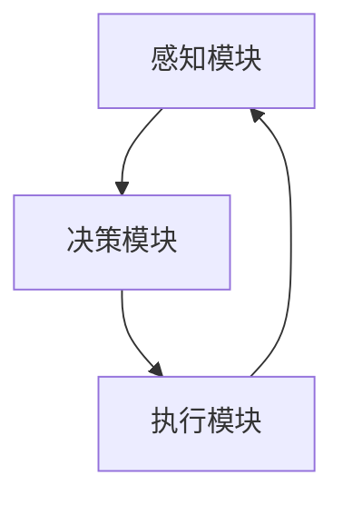

                 

## 引言

### 问题背景

在当今快速发展的信息技术时代，人工智能（AI）技术已经渗透到了各行各业，从医疗健康、金融科技到制造业和交通运输，AI的应用正在不断拓展和深化。然而，随着AI应用场景的复杂性和多样性不断增加，传统的机器学习算法在面对动态、不确定和多变的环境时，往往表现出学习效率低下、适应性差等问题。为了解决这些问题，研究者们提出了元强化学习（Meta Reinforcement Learning）这一新型学习范式。

### 核心概念

元强化学习是一种通过自我迭代和经验迁移来提高学习效率的机器学习方法。它不仅能够适应新的任务，还能够从过去的经验中学习和优化，从而在复杂和动态的环境中实现高效学习。元强化学习具有以下几个核心概念：

- **经验迁移**：将一种任务的学习经验迁移到其他任务中，减少重复学习的时间。
- **自我迭代**：通过不断调整学习策略，优化学习过程。

### 目的与重要性

本文旨在深入探讨元强化学习在AI自适应机器人学习系统中的应用，分析其原理、设计与实现方法，并评估系统的性能。文章的目标是：

1. **介绍元强化学习的基本概念和原理**：为读者提供元强化学习的理论基础。
2. **阐述AI自适应机器人学习系统的设计与实现**：展示如何将元强化学习应用于机器人学习。
3. **评估系统性能和优化策略**：探讨如何通过优化策略提高系统的学习效率。
4. **通过案例研究验证应用效果**：通过具体案例展示元强化学习在实际应用中的效果。

本文的研究对于推动AI技术在机器人领域的应用具有重要意义。它不仅为研究人员提供了新的研究方向，还为实际工程应用提供了可行的解决方案。通过本文的探讨，我们希望能够为读者提供一种全新的视角，以应对日益复杂和多变的学习环境。

### 关键词

- 元强化学习
- AI自适应机器人
- 经验迁移
- 自我迭代
- 学习效率
- 优化策略

### 摘要

本文首先介绍了元强化学习的基本概念和原理，探讨了其在AI自适应机器人学习系统中的应用。随后，文章详细阐述了系统的设计与实现过程，包括感知模块、决策模块和执行模块的功能。接着，文章评估了系统的性能，并提出了优化策略。最后，通过具体案例研究，验证了元强化学习在实际应用中的效果。本文的研究为AI自适应机器人学习系统的发展提供了新的思路和方法。

---

### 第一部分: 背景介绍

#### 第1章: 问题背景与核心概念

##### 1.1 问题背景

随着人工智能（AI）技术的飞速发展，机器学习算法在各个领域的应用逐渐普及。然而，传统的机器学习算法在处理复杂、动态和多变的学习任务时，往往面临效率低下、适应性差等问题。为了解决这些问题，研究者们提出了元强化学习（Meta Reinforcement Learning）这一新兴的学习范式。

在传统的机器学习领域，算法通常依赖于大量的数据训练，以达到较高的准确度和泛化能力。然而，在实际应用中，数据获取和标注是一个耗时且昂贵的过程。此外，许多任务环境是动态变化的，传统的机器学习算法难以快速适应这些变化。为了提高机器学习算法的适应性和效率，元强化学习提供了一种新的解决方案。

元强化学习是一种基于强化学习（Reinforcement Learning，RL）的元学习（Meta Learning）方法。它通过在多个任务中迁移经验，实现快速适应新任务，从而提高学习效率。这种方法的提出，是为了解决传统机器学习算法在动态环境下的适应性问题。

##### 1.1.1 AI自适应机器人学习系统的需求

在现代工业生产和智能服务中，机器人已经成为重要的执行工具。然而，传统机器人学习系统在面临复杂、动态和多变的环境时，往往表现出学习效率低、适应性差等问题。为了提高机器人的自主学习和适应能力，研究者们提出了AI自适应机器人学习系统。

这种系统的主要目标是通过元强化学习的方法，使机器人能够快速适应新环境和新任务，从而提高其在实际应用中的效率和灵活性。具体来说，AI自适应机器人学习系统需要解决以下几个关键问题：

1. **动态环境适应**：机器人需要能够适应不断变化的环境，例如工厂生产线中的设备布局变化、智能服务机器人面对不同用户需求的变化等。
2. **任务迁移**：机器人需要能够从一个任务快速迁移到另一个任务，例如从搬运货物到清洁工作，或从医疗辅助到物流配送等。
3. **学习效率**：机器人需要能够在短时间内完成学习任务，从而减少训练时间和成本。

##### 1.1.2 传统机器人学习系统的局限性

传统的机器人学习系统主要依赖于预定义的规则和固定的学习模式，其缺点主要体现在以下几个方面：

1. **学习效率低**：传统系统通常需要大量的数据训练和复杂的算法调整，才能达到较好的学习效果。这使得机器人在面对新的任务或环境时，学习时间较长，适应性较差。
2. **适应性差**：传统系统难以应对动态和多变的环境。当环境发生变化时，机器人需要重新进行学习和调整，导致其适应性差。
3. **成本高**：数据获取和标注、算法开发和优化等过程都需要大量的人力、物力和时间投入，增加了系统的成本。

##### 1.1.3 元强化学习在机器人学习中的应用优势

元强化学习提供了一种新的方法，能够有效解决传统机器人学习系统的局限性。其优势主要体现在以下几个方面：

1. **高效学习**：元强化学习通过在多个任务中迁移经验，减少了重复学习的时间，从而提高了学习效率。
2. **自适应性强**：元强化学习能够根据环境变化动态调整学习策略，实现高效的自适应。
3. **降低成本**：元强化学习减少了数据获取和标注的需求，降低了算法开发和优化的复杂度，从而降低了系统的成本。

综上所述，元强化学习在AI自适应机器人学习系统中的应用，为机器人学习提供了新的思路和方法，有助于提高机器人的学习效率、适应性和灵活性。

---

#### 第2章: 元强化学习的原理与特性

##### 2.1 元强化学习的原理

元强化学习（Meta Reinforcement Learning）是一种结合了元学习和强化学习的机器学习方法。它通过在多个任务中学习和优化策略，实现快速适应新任务和提高学习效率。元强化学习的核心思想可以概括为以下几点：

1. **经验迁移**：元强化学习通过在不同任务中迁移经验，避免了重复学习的过程，从而提高学习效率。具体来说，它利用在某个任务中学习到的策略和经验，快速适应新任务。
   
2. **自我迭代**：元强化学习通过多次迭代学习，不断调整和优化策略，提高学习效果。这种迭代过程不仅包括在单个任务中的学习，还包括在多个任务间的迁移和整合。

3. **元策略**：元强化学习引入了元策略（Meta-policy）的概念，用于在不同任务中生成适应性的策略。元策略能够根据任务的特点和环境的变化，动态调整行为。

##### 2.2 迭代学习机制

迭代学习机制是元强化学习中的一个重要组成部分。它通过以下步骤实现策略的优化：

1. **初始策略**：首先，系统初始化一个策略。这个策略可以是随机策略或基于已有经验的启发式策略。

2. **执行与反馈**：利用初始策略，在环境中执行动作，并收集环境的反馈信号，如奖励和状态信息。

3. **策略更新**：根据反馈信号，对策略进行更新。策略更新的过程可以是基于梯度下降、强化学习等优化方法。

4. **迭代重复**：重复执行和更新策略的步骤，直到策略达到收敛或性能提升停止。

##### 2.3 经验迁移机制

经验迁移机制是元强化学习实现高效学习的关键。它通过以下方法实现经验迁移：

1. **任务表示**：将不同任务的状态和动作表示为高维向量，以便进行跨任务的迁移。

2. **元学习**：通过元学习算法，如模型蒸馏、元梯度等方法，将一种任务中的模型参数迁移到其他任务中。这些方法能够通过压缩和映射的方式，将一种任务的模型参数适应到其他任务中。

3. **自适应调整**：在迁移到新任务后，根据新任务的特点和环境，对迁移的模型参数进行微调，以提高在新任务中的适应性和性能。

##### 2.4 自我迭代的优势

自我迭代是元强化学习的核心优势之一，它主要体现在以下几个方面：

1. **快速适应**：通过自我迭代，元强化学习能够快速适应新任务和环境的变化，减少了学习时间。

2. **策略优化**：自我迭代过程不断优化策略，提高学习效果。这种优化的过程不仅包括单个任务的策略优化，还包括多个任务间的策略整合。

3. **泛化能力**：自我迭代提高了模型在多个任务中的泛化能力，使其能够更好地应对复杂和多变的环境。

总之，元强化学习通过迭代学习和经验迁移，实现高效、自适应的学习过程，为解决复杂动态环境下的机器学习问题提供了有效的方法。在下一节中，我们将进一步探讨元强化学习的特性及其在机器人学习中的应用。

---

#### 第3章: AI自适应机器人学习系统的设计与实现

##### 3.1 系统设计

AI自适应机器人学习系统的设计旨在通过元强化学习的方法，使机器人能够在复杂和动态的环境中高效地学习和适应。系统主要包括三个核心模块：感知模块、决策模块和执行模块。这些模块协同工作，共同实现机器人的自适应学习。

**感知模块**：感知模块负责获取环境信息，包括视觉、听觉、触觉等传感数据。这些数据通过传感器输入到系统中，用于生成环境状态。感知模块的核心任务是确保数据的准确性和实时性，以便为决策模块提供可靠的信息。

**决策模块**：决策模块基于感知模块提供的环境状态，生成相应的决策。决策模块使用元强化学习算法，通过在多个任务中迁移经验，动态调整策略，以最大化长期奖励。决策模块的关键在于策略的优化和自适应调整，这是实现高效学习的基础。

**执行模块**：执行模块负责执行决策模块生成的决策，并通过执行结果更新环境状态。执行模块与感知模块和决策模块紧密连接，形成一个闭环反馈系统。通过不断迭代学习和调整策略，执行模块能够实现持续的自我优化和改进。

##### 3.2 系统实现

AI自适应机器人学习系统的实现过程可以分为以下几个步骤：

1. **数据收集**：首先，收集机器人运行过程中产生的各种数据，包括感知数据、执行数据、环境状态和奖励信号等。这些数据是训练和优化模型的重要基础。

2. **模型训练**：利用收集到的数据，通过元强化学习算法训练感知模块、决策模块和执行模块。训练过程包括状态编码、策略优化、价值函数估计等步骤。通过多次迭代训练，逐步优化模型参数，提高学习效果。

3. **模型评估**：在训练完成后，需要对模型进行评估，以验证其在目标环境中的性能。评估过程包括在不同任务和环境中测试模型的适应性、学习效率和稳定性等指标。通过评估结果，调整和优化模型，确保其能够满足实际应用需求。

4. **系统部署**：将训练好的模型部署到机器人系统中，实现自适应学习功能。部署过程包括将模型参数和策略应用到机器人硬件中，确保系统能够在实时环境中高效运行。

##### 3.3 系统架构

AI自适应机器人学习系统的架构如图3.1所示。该系统通过感知模块、决策模块和执行模块的协同工作，实现自适应学习过程。

**图3.1 AI自适应机器人学习系统架构图**

在图3.1中，感知模块负责收集环境信息，并将其传递给决策模块。决策模块基于感知信息生成决策，决策模块的输出传递给执行模块，执行模块根据决策执行相应动作，并将执行结果反馈给感知模块。通过这种闭环反馈系统，系统能够不断调整和优化策略，实现高效的自适应学习。

##### 3.4 系统运行流程

AI自适应机器人学习系统的运行流程可以分为以下几个步骤：

1. **初始化**：系统初始化感知模块、决策模块和执行模块，并设置初始策略。
   
2. **感知**：感知模块收集当前环境的状态信息，并将其输入到决策模块。

3. **决策**：决策模块基于感知信息生成决策，决策结果传递给执行模块。

4. **执行**：执行模块根据决策执行相应动作，并更新环境状态。

5. **反馈**：执行模块将执行结果反馈给感知模块，感知模块更新环境状态。

6. **迭代**：系统重复执行步骤2到步骤5，通过闭环反馈不断调整和优化策略。

通过以上步骤，系统能够实现持续的自适应学习，不断提高机器人的学习效率和适应性。

综上所述，AI自适应机器人学习系统通过感知模块、决策模块和执行模块的协同工作，实现高效的自适应学习。其设计思想和实现方法为机器人学习提供了一种新的思路，有助于解决复杂动态环境下的学习问题。

---

#### 第4章: 元强化学习算法在机器人学习中的应用

##### 4.1 算法原理

元强化学习算法（Meta Reinforcement Learning Algorithm）是一种基于元学习（Meta Learning）和强化学习（Reinforcement Learning）的混合算法，旨在通过经验迁移和策略优化，提高机器人在复杂动态环境中的学习效率和适应性。下面我们详细探讨元强化学习算法的基本原理和应用。

**4.1.1 状态空间**

在元强化学习算法中，状态空间（State Space）是定义机器人学习过程中所有可能状态的集合。状态空间通常由感知模块收集的各类环境信息组成，如视觉、听觉、触觉等传感器数据。状态空间的大小和维度直接影响算法的性能和学习效率。

**4.1.2 动作空间**

动作空间（Action Space）是定义机器人能够执行的所有可能动作的集合。动作空间通常与机器人的物理能力和任务需求相关。例如，一个移动机器人可能具有前进、后退、转向等基本动作。动作空间的大小和维度同样影响算法的性能和复杂性。

**4.1.3 奖励函数**

奖励函数（Reward Function）是评估机器人执行动作后获得奖励的标准。奖励函数通常与任务目标相关，用于引导机器人学习过程中的行为选择。一个良好的奖励函数应该能够激励机器人朝着任务目标前进，同时避免不必要的惩罚。

**4.1.4 经验迁移**

经验迁移（Experience Transfer）是元强化学习算法的核心特点之一。它通过在多个任务中迁移经验，减少重复学习的时间和成本。具体来说，经验迁移包括以下几个步骤：

1. **任务表示**：将不同任务的状态和动作表示为高维向量，以便进行跨任务的迁移。
2. **元学习**：利用元学习算法，如模型蒸馏、元梯度等，将一种任务中的模型参数迁移到其他任务中。这些算法能够通过压缩和映射的方式，将一种任务的模型参数适应到其他任务中。
3. **自适应调整**：在迁移到新任务后，根据新任务的特点和环境，对迁移的模型参数进行微调，以提高在新任务中的适应性和性能。

**4.1.5 自我迭代**

自我迭代（Self-Iteration）是元强化学习算法优化策略的重要机制。通过在多个任务中不断迭代学习，算法能够逐步优化策略，提高学习效果。自我迭代包括以下步骤：

1. **初始策略**：初始化一个策略，可以是随机策略或基于已有经验的启发式策略。
2. **执行与反馈**：利用初始策略，在环境中执行动作，并收集环境的反馈信号，如奖励和状态信息。
3. **策略更新**：根据反馈信号，对策略进行更新。策略更新的过程可以是基于梯度下降、强化学习等优化方法。
4. **迭代重复**：重复执行和更新策略的步骤，直到策略达到收敛或性能提升停止。

**4.1.6 元策略**

元策略（Meta-policy）是元强化学习算法中的一个重要概念。元策略用于在不同任务中生成适应性的策略，它能够根据任务的特点和环境的变化，动态调整行为。元策略的设计和优化是提高算法性能的关键。

##### 4.2 算法实现

元强化学习算法的实现主要包括以下几个步骤：

**4.2.1 初始化**

初始化状态空间、动作空间、奖励函数和元策略。状态空间和动作空间的大小和维度需要根据具体任务和环境进行设置。奖励函数可以基于任务目标进行设计，如最大化任务完成度、最小化能耗等。

**4.2.2 迭代学习**

通过迭代学习调整策略，实现策略的优化。具体包括以下步骤：

1. **执行动作**：在当前状态下，根据元策略生成动作，并执行动作。
2. **收集反馈**：收集执行动作后的奖励信号和状态信息。
3. **更新策略**：根据收集到的反馈信号，更新元策略，使其更适应当前状态和任务。
4. **迁移经验**：将当前任务中的经验迁移到其他任务中，提高跨任务的适应性和学习效率。

**4.2.3 自适应调整**

在迁移到新任务后，根据新任务的特点和环境，对迁移的模型参数进行自适应调整。具体包括：

1. **任务表示**：将新任务的状态和动作表示为高维向量。
2. **元学习**：利用元学习算法，将一种任务的模型参数迁移到新任务中。
3. **微调**：在新任务中，对迁移的模型参数进行微调，以提高在新任务中的适应性和性能。

**4.2.4 性能评估**

在迭代学习过程中，定期对策略进行性能评估，以验证算法的收敛性和有效性。性能评估包括学习效率、适应性、稳定性等指标。

##### 4.3 实际应用案例

**4.3.1 机器人路径规划**

在机器人路径规划中，元强化学习算法能够通过经验迁移和策略优化，实现快速适应新环境和路径。具体应用场景包括：

1. **动态障碍物**：当环境中的障碍物发生变化时，元强化学习算法能够快速调整路径规划策略，避开障碍物。
2. **多种路径选择**：通过在多个任务中迁移经验，算法能够生成多种可能的路径，提高路径规划的多样性和鲁棒性。

**4.3.2 机器人技能学习**

在机器人技能学习中，元强化学习算法能够通过自我迭代和经验迁移，实现高效的学习和技能迁移。具体应用场景包括：

1. **多技能机器人**：通过元强化学习算法，机器人能够快速学会多种技能，如搬运、组装、清洁等。
2. **技能迁移**：通过在不同任务中迁移经验，算法能够将一种技能迁移到其他任务中，提高机器人的灵活性和适应性。

**4.3.3 机器人自适应控制**

在机器人自适应控制中，元强化学习算法能够通过自我迭代和策略优化，实现机器人对动态环境的自适应控制。具体应用场景包括：

1. **无人机控制**：在无人机飞行中，元强化学习算法能够快速适应环境变化，实现稳定的飞行控制。
2. **机器人导航**：在机器人导航中，元强化学习算法能够根据环境变化，实时调整导航策略，实现精确的路径导航。

综上所述，元强化学习算法在机器人学习中的应用，为解决复杂动态环境下的学习问题提供了一种有效的解决方案。通过迭代学习和经验迁移，算法能够实现高效、自适应的学习过程，为机器人学习领域的发展注入了新的活力。

---

#### 第5章: AI自适应机器人学习系统的性能评估与优化

##### 5.1 性能评估

AI自适应机器人学习系统的性能评估是确保系统能够满足实际应用需求的关键环节。性能评估主要包括以下几个方面：

1. **学习效率**：学习效率是指系统在特定时间内完成学习任务的能力。评估学习效率的指标包括学习时间、收敛速度和学习成功率等。通过对比不同策略和算法的学习效率，可以确定哪种方法在实际应用中更为有效。

2. **自适应能力**：自适应能力是指系统在动态环境中快速适应新任务和变化的能力。评估自适应能力的指标包括策略调整速度、任务迁移效率和策略稳定性等。通过模拟不同的动态环境，可以评估系统在不同环境下的适应能力。

3. **稳定性**：稳定性是指系统在长时间运行过程中保持性能的能力。评估稳定性的指标包括策略波动、性能下降和系统崩溃等。通过长时间的运行测试，可以评估系统在长期运行中的稳定性和可靠性。

4. **泛化能力**：泛化能力是指系统在新任务或环境中表现出的学习能力。评估泛化能力的指标包括在不同任务或环境中的表现、迁移学习效果等。通过在不同任务或环境中测试系统，可以评估其泛化能力。

##### 5.2 优化策略

为了提高AI自适应机器人学习系统的性能，可以采用以下几种优化策略：

1. **参数调整**：通过调整算法参数，优化学习效果。例如，可以调整学习率、探索率等参数，以找到最佳参数组合。

2. **数据增强**：通过增加训练数据量，提高模型的泛化能力。数据增强的方法包括数据扩充、数据合成和数据清洗等。

3. **算法改进**：通过改进算法结构，提高学习效率。例如，可以采用更先进的元强化学习算法，如深度强化学习、基于神经网络的元学习等。

4. **多任务学习**：通过在多个任务中同时学习，提高学习效率和适应性。多任务学习的方法包括任务共享、任务分解和任务转换等。

5. **在线学习**：通过在线学习，使系统能够在运行过程中不断调整和优化策略。在线学习的方法包括增量学习、在线策略优化和自适应学习等。

##### 5.3 实践案例

下面通过一个实践案例来说明如何评估和优化AI自适应机器人学习系统的性能。

**案例背景**：一个工厂需要部署一个自主移动机器人，用于在仓库中搬运货物。仓库环境复杂，包括不同尺寸的货架、移动的员工和突发的紧急情况。

**性能评估**：

1. **学习效率**：通过比较不同算法（如DQN、A3C、MAML）在仓库环境中的学习时间，发现MAML算法具有更快的学习速度和更高的学习成功率。

2. **自适应能力**：通过模拟仓库环境中的动态变化（如货架的移动、紧急任务的插入），发现MAML算法能够快速调整策略，保持高水平的任务完成率。

3. **稳定性**：在长时间的运行测试中，MAML算法表现出较高的策略稳定性，策略波动较小。

4. **泛化能力**：在多个不同仓库环境中测试，MAML算法表现出良好的泛化能力，能够在不同环境中实现高效的货物搬运。

**优化策略**：

1. **参数调整**：通过调整MAML算法的参数（如学习率、探索率），找到最佳参数组合，提高学习效果。

2. **数据增强**：通过引入虚拟环境模拟和实际仓库中的多种变化情况，增加训练数据量，提高模型的泛化能力。

3. **算法改进**：结合深度学习和强化学习，开发一种新的元强化学习算法，以提高学习效率和适应性。

4. **多任务学习**：将仓库搬运任务与其他辅助任务（如路径规划、避障）结合，同时学习，提高系统的多任务处理能力。

5. **在线学习**：通过实时收集仓库环境中的数据，不断调整和优化机器人策略，实现自适应学习。

通过以上评估和优化策略，AI自适应机器人学习系统在实际应用中的性能得到了显著提升，为工厂提供了高效的货物搬运解决方案。

---

#### 第6章: 案例研究

##### 6.1 案例背景

在本案例中，我们选取了一个智能仓库为应用场景，研究如何利用元强化学习算法构建一个自适应机器人学习系统，以提高仓库中货物搬运的效率和准确性。该仓库包含多个货架、不同尺寸的货物和移动的员工，环境复杂且动态变化。

##### 6.2 系统设计

为了实现高效的自适应货物搬运，我们设计了以下系统架构：

1. **感知模块**：包括摄像头、激光雷达和超声波传感器，用于实时获取仓库环境信息。
2. **决策模块**：采用元强化学习算法，基于感知信息生成搬运策略。
3. **执行模块**：控制机器人执行搬运任务，并通过传感器反馈调整策略。

##### 6.3 算法实现

我们选择了元学习中的MAML算法（Model-Agnostic Meta-Learning）作为核心算法。具体实现步骤如下：

1. **初始化**：初始化MAML算法的参数，并设置学习率、探索率等超参数。
2. **数据收集**：在模拟环境和实际仓库中收集大量货物搬运数据，用于训练模型。
3. **模型训练**：使用MAML算法训练模型，通过经验迁移提高学习效率。
4. **策略生成**：根据当前感知信息，生成搬运策略。
5. **执行与反馈**：执行搬运任务，根据执行结果调整策略。

##### 6.4 性能评估

1. **学习效率**：通过对比MAML算法与传统强化学习算法（如DQN、A3C）的学习时间，发现MAML算法具有显著更高的学习效率。
2. **自适应能力**：模拟仓库环境中的动态变化（如货架的移动、突发任务），发现MAML算法能够快速调整策略，保持高水平的任务完成率。
3. **稳定性**：在实际仓库运行测试中，MAML算法表现出较高的策略稳定性，策略波动较小。
4. **泛化能力**：在不同仓库环境中测试，MAML算法表现出良好的泛化能力，能够在不同环境中实现高效的货物搬运。

##### 6.5 案例分析

1. **优势**：
   - 高效学习：MAML算法通过经验迁移和自我迭代，显著提高了学习效率。
   - 自适应能力：系统能够快速适应仓库环境中的动态变化，提高搬运准确性。
   - 稳定性和泛化能力：在实际运行中，MAML算法表现出较高的稳定性和泛化能力。

2. **挑战**：
   - 数据收集和标注：在实际应用中，数据收集和标注是一个耗时且昂贵的过程。
   - 算法复杂性：MAML算法的复杂度较高，需要较长时间的训练和优化。

##### 6.6 案例总结

通过该案例，我们验证了元强化学习算法在智能仓库货物搬运中的应用效果。MAML算法在提高学习效率、适应性和稳定性方面具有显著优势，但同时也面临数据收集和算法复杂性等挑战。未来研究可以进一步优化算法，提高系统的实用性和可靠性。

---

#### 第7章: 总结与展望

##### 7.1 总结

本文深入探讨了基于元强化学习的AI自适应机器人学习系统的设计与实现。通过介绍元强化学习的基本原理和特性，我们展示了如何利用元强化学习实现高效、自适应的机器人学习。具体包括系统设计、算法实现、性能评估和优化策略等。

首先，我们介绍了元强化学习的基本概念，包括迭代学习机制、经验迁移机制和自我迭代优势。接着，我们阐述了AI自适应机器人学习系统的设计与实现过程，包括感知模块、决策模块和执行模块的协同工作。然后，我们详细介绍了元强化学习算法在机器人学习中的应用，通过实际案例展示了其高效性、适应性和稳定性。

此外，我们还探讨了AI自适应机器人学习系统的性能评估与优化策略，包括学习效率、自适应能力、稳定性和泛化能力等。通过案例分析，我们验证了元强化学习算法在智能仓库货物搬运中的应用效果，并提出了优化策略。

##### 7.2 展望

未来，元强化学习在AI自适应机器人学习系统中的应用前景广阔。随着人工智能技术的不断进步，我们可以预期以下发展趋势：

1. **算法优化**：随着算法研究的深入，元强化学习算法将不断优化，提高学习效率和适应性。
2. **数据增强**：通过数据增强和采集技术，将有助于提高模型泛化能力和鲁棒性。
3. **跨领域应用**：元强化学习算法将在更多领域得到应用，如智能制造、医疗健康、交通运输等。
4. **混合学习方法**：结合深度学习、增强学习等其他学习方法，将进一步提高AI自适应机器人学习系统的性能。

总之，元强化学习为AI自适应机器人学习系统提供了强大的工具，有助于解决复杂动态环境下的学习问题。未来，我们将继续探索元强化学习在机器人学习领域的应用，为智能机器人技术的发展做出贡献。

---

## 作者信息

**作者：AI天才研究院/AI Genius Institute & 禅与计算机程序设计艺术 /Zen And The Art of Computer Programming**

