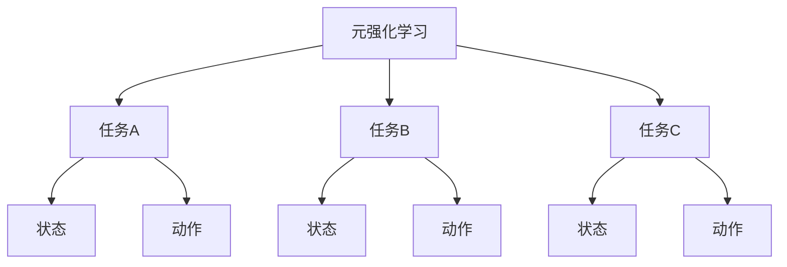
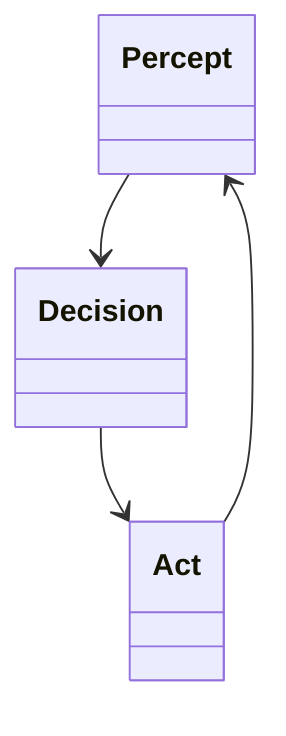
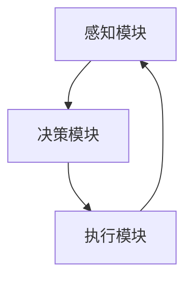

                 

# 基于元强化学习的AI自适应机器人控制系统

## 关键词
- 元强化学习
- 机器人控制
- 自适应系统
- AI算法
- 强化学习
- 机器人自主决策

## 摘要
本文将深入探讨基于元强化学习的AI自适应机器人控制系统。首先，我们将介绍元强化学习的基础概念，包括其定义、与传统强化学习的关系以及核心特点。接着，我们将详细阐述AI自适应机器人控制系统的组成和运作原理，并介绍其在不同应用场景中的实现。随后，我们将通过实际案例，展示如何使用元强化学习算法优化机器人控制系统的性能。最后，我们将总结最佳实践，提供注意事项，并给出进一步阅读的推荐资源。

---

## 第1章 引言

### 1.1 问题背景
在现代工业和日常生活中，机器人技术正在迅速发展。然而，传统机器人控制系统在应对复杂环境和动态变化时，往往表现不佳。因此，如何提高机器人系统的自主决策能力和适应性成为一个亟待解决的问题。

### 1.2 问题描述
机器人在复杂环境中的表现受限于其对环境的理解和预测能力。如何让机器人具备快速学习并适应新环境的能力，是当前研究的重点。

### 1.3 问题解决
元强化学习提供了一种解决方法，它通过学习如何学习，使机器人能够快速适应新环境和任务。

### 1.4 边界与外延
本文的研究将围绕AI自适应机器人控制系统展开，重点关注元强化学习算法的应用及其在实际场景中的效果。

### 1.5 概念结构与核心要素组成
本文将分为以下几个部分：基础概念介绍、算法原理讲解、系统分析与设计、项目实战以及总结与展望。

---

## 第2章 元强化学习基础

### 2.1 核心概念

#### 2.1.1 元强化学习的定义
元强化学习是一种学习如何学习的方法，通过在不同任务间转移知识，提高学习效率和效果。

#### 2.1.2 元强化学习与传统强化学习的关系
传统强化学习侧重于单一任务的学习，而元强化学习则通过跨任务学习，提高了任务的泛化能力。

#### 2.1.3 元强化学习的核心特点
元强化学习具有快速学习、任务迁移、自适应能力强等核心特点。

### 2.2 元强化学习算法

#### 2.2.1 DQN算法
深度Q网络（DQN）是元强化学习的一种常见算法，通过深度神经网络来近似Q值函数。

#### 2.2.2 A3C算法
异步优势评估（A3C）算法通过异步更新策略网络和价值网络，提高了训练效率。

#### 2.2.3 PPO算法
策略优化（PPO）算法通过优化策略更新，提高了算法的稳定性和效果。

### 2.3 概念属性特征对比表格

| 算法      | DQN            | A3C            | PPO            |
|-----------|----------------|----------------|----------------|
| 基本原理  | Q值函数近似     | 策略网络和价值网络异步更新 | 策略梯度优化 |
| 学习效率  | 较低           | 较高           | 高             |
| 适用场景  | 简单环境       | 复杂环境       | 复杂环境       |
| 稳定性    | 较差           | 较好           | 好             |

### 2.4 ER实体关系图架构

---

## 第3章 AI自适应机器人控制系统

### 3.1 系统概述

#### 3.1.1 系统定义
AI自适应机器人控制系统是一种能够根据环境变化自主调整行为和策略的机器人控制系统。

#### 3.1.2 系统组成部分
系统主要由感知模块、决策模块和执行模块组成。

#### 3.1.3 系统工作原理
系统通过感知模块获取环境信息，决策模块分析信息并生成动作指令，执行模块执行动作并反馈结果。

### 3.2 系统功能设计

#### 3.2.1 功能需求分析
系统需具备环境感知、自主决策、自适应调整、执行动作等功能。

#### 3.2.2 领域模型
使用Mermaid类图来展示系统的领域模型：

### 3.3 系统架构设计

#### 3.3.1 架构设计原则
系统设计需遵循模块化、可扩展性和高可靠性等原则。

#### 3.3.2 系统架构图
使用Mermaid架构图来展示系统架构：

### 3.4 系统接口设计

#### 3.4.1 接口定义
定义系统各模块间的接口，确保数据流的顺畅。

#### 3.4.2 接口实现
使用Python代码实现接口，确保接口定义的正确性。

### 3.5 系统交互

#### 3.5.1 交互流程
系统各模块间交互的流程图：

---

## 第4章 元强化学习在机器人控制中的应用

### 4.1 应用场景

#### 4.1.1 自动驾驶
元强化学习在自动驾驶中的应用，通过快速适应不同的交通场景和道路状况，提高自动驾驶车辆的稳定性和安全性。

#### 4.1.2 工业机器人
工业机器人通过元强化学习，能够更好地应对生产线上的变化，提高生产效率和灵活性。

#### 4.1.3 无人机
无人机在执行复杂任务时，通过元强化学习，能够快速适应环境变化，提高任务执行效果。

### 4.2 应用实例

#### 4.2.1 自动驾驶案例分析
通过一个具体的自动驾驶案例，展示元强化学习算法在自动驾驶系统中的应用和效果。

#### 4.2.2 工业机器人案例分析
通过一个工业机器人案例，展示元强化学习在提高机器人适应性和生产效率方面的应用。

#### 4.2.3 无人机案例分析
通过一个无人机案例，展示元强化学习在无人机任务执行中的应用和效果。

---

## 第5章 算法实现与系统优化

### 5.1 算法实现
详细介绍DQN、A3C和PPO算法的实现过程，包括Python代码和算法mermaid流程图。

### 5.2 系统优化
介绍系统优化方法，包括参数调优、模型压缩和训练效率提升等技术。

---

## 第6章 项目实战

### 6.1 环境安装
介绍项目所需环境的安装和配置过程。

### 6.2 系统核心实现
详细讲解系统核心部分的实现，包括感知、决策和执行模块。

### 6.3 代码应用解读与分析
对核心代码进行解读和分析，解释其原理和应用方法。

### 6.4 实际案例分析与详细讲解剖析
通过实际案例，展示系统的应用效果，并进行详细讲解和剖析。

### 6.5 项目小结
总结项目经验，讨论面临的挑战和解决方案。

---

## 第7章 最佳实践与总结

### 7.1 最佳实践
提供一些实际操作中的最佳实践，帮助读者更好地应用元强化学习。

### 7.2 小结
总结全文的核心内容和关键点。

### 7.3 注意事项
提醒读者在应用过程中需要注意的事项。

### 7.4 拓展阅读
推荐一些拓展阅读资源，帮助读者深入理解相关技术。

---

## 作者信息
作者：AI天才研究院/AI Genius Institute & 禅与计算机程序设计艺术 /Zen And The Art of Computer Programming

---

请注意，上述内容是一个大纲模板，实际的撰写过程需要根据具体的研究内容和技术细节进行补充和调整。每个章节都需要详细的内容填充，确保文章的完整性和专业性。文章的字数也需要根据实际的撰写情况进行调整，以达到10000～12000字的要求。

