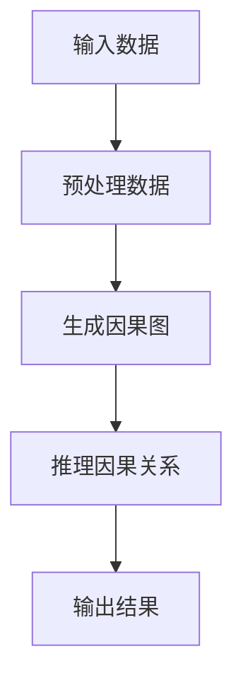
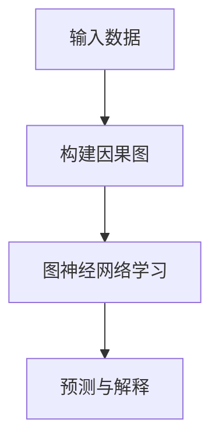
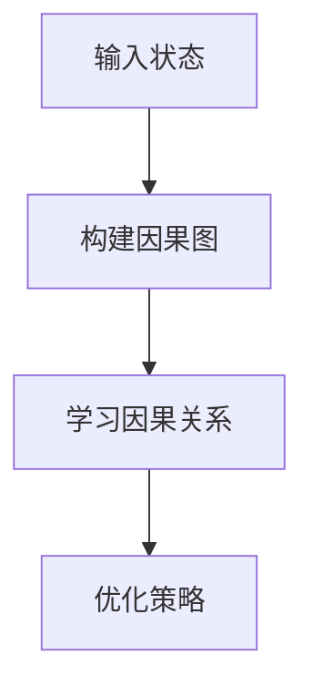
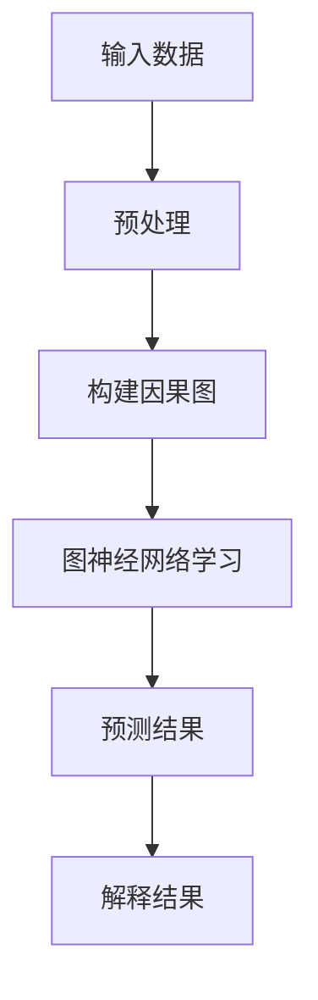
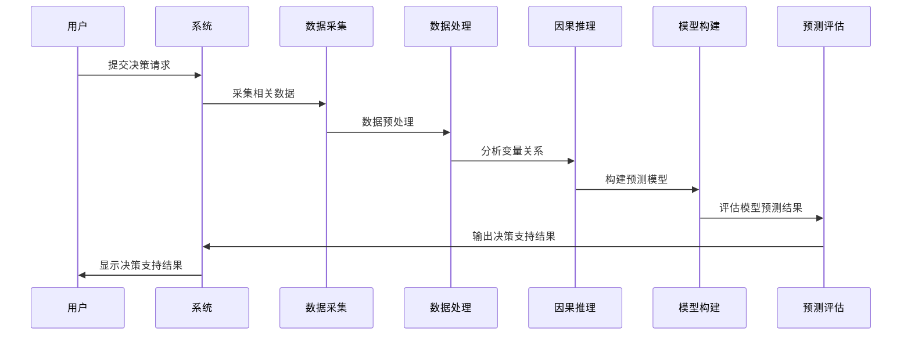

                 


## 基于因果发现的AI推理能力提升方法

### 关键词

AI推理，因果发现，深度学习，决策支持系统，算法优化

### 摘要

本文旨在探讨基于因果发现的AI推理能力提升方法。通过深入分析因果推理的原理和应用，本文提出了一种将因果发现与AI模型集成的框架，以提升AI在决策支持系统中的应用能力。文章首先介绍了因果推理和因果发现的基础概念，随后详细阐述了相关算法原理和实现方法。接着，文章通过系统架构设计和实际项目案例，展示了如何在实际应用中提升AI的推理能力。最后，本文对最佳实践进行了总结，并提出了未来研究的方向。

## 引言

在人工智能（AI）迅猛发展的时代，AI推理能力已成为衡量AI系统性能的重要指标。然而，传统的AI模型往往依赖于数据驱动的关联性分析，难以揭示现象背后的因果关系。这使得AI在应对复杂决策问题时，往往表现出局限性。因果发现作为一种新型的数据分析方法，旨在从数据中揭示变量之间的因果关系，为AI推理提供了新的可能性。

### 问题背景

传统的关联性分析存在一定的局限性，主要体现在以下几个方面：

1. **假设独立性**：传统AI模型通常基于独立同分布（i.i.d.）假设，这意味着模型假设输入变量之间不存在相关性。然而，现实世界中的数据往往存在复杂的依赖关系，这使得传统模型难以准确捕捉变量之间的相互影响。

2. **泛化能力**：关联性分析往往依赖于大规模数据集，但这并不保证模型在新数据集上的表现。因果发现方法通过揭示变量之间的因果关系，提高了模型的泛化能力。

3. **决策支持**：在许多决策支持系统中，了解变量之间的因果关系对于制定有效的决策策略至关重要。传统方法难以提供这种因果关系的信息，从而限制了AI在决策支持系统中的应用。

### 因果发现的崛起

因果发现方法通过从数据中揭示变量之间的因果关系，为AI推理提供了新的可能性。近年来，随着深度学习和图模型等技术的不断发展，因果发现方法在AI领域取得了显著的进展。因果发现方法的主要优势包括：

1. **提高模型的泛化能力**：通过揭示变量之间的因果关系，因果发现方法有助于构建更加稳健的模型，从而提高模型在新数据集上的表现。

2. **揭示数据中的隐藏信息**：因果发现方法可以帮助我们从数据中发现隐藏的因果关系，从而挖掘出数据中未被充分利用的信息。

3. **支持决策制定**：因果发现方法可以提供变量之间的因果关系信息，为决策支持系统提供更加准确的决策依据。

### 研究意义与目标

本文的研究意义在于探索基于因果发现的AI推理能力提升方法，以解决传统AI模型在复杂决策问题中的局限性。具体目标包括：

1. **构建因果发现与AI模型集成的框架**：本文旨在提出一种将因果发现与现有AI模型集成的框架，以提升AI的推理能力。

2. **分析因果推理的原理和应用**：本文将深入分析因果推理的基本原理和应用场景，为后续研究提供理论基础。

3. **设计并实现因果发现算法**：本文将设计并实现多种因果发现算法，以验证本文提出的框架在实际应用中的有效性。

4. **构建决策支持系统**：本文将通过实际项目案例，展示如何将因果发现方法应用于决策支持系统，以提高系统的决策能力。

### 书籍结构概述

本文将分为五个主要部分：

1. **引言**：介绍本文的研究背景、问题背景和因果发现的崛起，阐述本文的研究意义与目标。

2. **因果推理基础**：介绍因果推理的基本概念、原理和算法，包括Do-Calculus、因果图和常见算法。

3. **因果发现的算法**：介绍因果发现的相关性分析算法和因果发现算法，包括Drift-Logic、GANs for Causal Discovery等。

4. **AI推理能力的提升**：探讨因果推理与AI模型集成的方法，包括因果图神经网络、因果强化学习算法等。

5. **因果推理在决策支持系统中的应用**：介绍因果推理在决策支持系统中的应用，包括架构设计、实现和实际项目案例。

### 本章小结

本章介绍了本文的研究背景、问题背景和因果发现的崛起，阐述了本文的研究意义与目标。通过本章的介绍，读者可以初步了解因果发现与AI推理能力提升的关系，为后续章节的学习打下基础。

----------------------------------------------------------------

## 因果推理基础

因果推理是人工智能领域的一个重要分支，旨在通过分析数据中的因果关系来提高模型的推理能力。在本章中，我们将深入探讨因果推理的基本概念、原理和算法，为后续章节的讨论打下基础。

### 因果推理的基本概念

#### 因果关系

因果关系是指变量之间的相互影响关系。在现实世界中，许多现象都可以通过因果关系来解释。例如，吸烟与肺癌之间存在因果关系，即吸烟导致肺癌。

#### 因果模型

因果模型是一种数学模型，用于表示变量之间的因果关系。常见的因果模型包括因果图（Causal Graphs）和Do-Calculus。

#### Do-Calculus

Do-Calculus是一种形式化的因果推理框架，用于描述变量之间的因果关系。它通过一系列操作（Do、Halt、DoNot）来模拟因果关系，从而在逻辑上推导出变量之间的因果关系。

### 因果推理的原理

#### 因果性分析

因果性分析是因果推理的核心，旨在从数据中识别变量之间的因果关系。常见的因果性分析方法包括基于假设检验的方法、基于模型的方法等。

#### 因果发现

因果发现是指通过分析数据来识别变量之间的因果关系。因果发现方法通常包括相关性分析、因果图学习和因果发现算法等。

#### 因果推理算法

因果推理算法是用于实现因果推理的计算机算法。常见的因果推理算法包括Do-Loops算法、TETRAD算法等。

### 因果推理的应用

#### 数据分析

因果推理在数据分析中具有重要的应用价值，可以揭示数据中的隐藏信息，提高数据分析的准确性。

#### 决策支持

因果推理可以用于决策支持系统，帮助决策者了解变量之间的因果关系，从而做出更加明智的决策。

#### 机器学习

因果推理可以与机器学习模型相结合，提高模型的泛化能力和解释性。

### 小结

本章介绍了因果推理的基本概念、原理和算法，包括因果关系、因果模型、Do-Calculus、因果性分析、因果发现和因果推理算法等。这些概念和原理是理解和应用因果推理的基础，为后续章节的讨论提供了理论支持。

----------------------------------------------------------------

## 因果发现的算法

因果发现是揭示数据中变量之间因果关系的重要技术。在本节中，我们将详细介绍两种因果发现算法：相关性分析算法和因果发现算法。

### 相关性分析算法

相关性分析是一种常用的数据分析方法，旨在确定两个或多个变量之间的线性或非线性关系。以下是一些常用的相关性分析算法：

#### 1. Pearson相关系数

Pearson相关系数是一种衡量两个变量线性相关性的指标，取值范围为[-1, 1]。正相关表示变量之间的变化方向一致，负相关表示变量之间的变化方向相反，零相关表示变量之间没有线性关系。

$$
r_{xy} = \frac{\sum_{i=1}^{n}(x_i - \bar{x})(y_i - \bar{y})}{\sqrt{\sum_{i=1}^{n}(x_i - \bar{x})^2 \sum_{i=1}^{n}(y_i - \bar{y})^2}}
$$

其中，\(r_{xy}\) 是Pearson相关系数，\(x_i\) 和\(y_i\) 是两个变量的观测值，\(\bar{x}\) 和\(\bar{y}\) 是它们的平均值。

#### 2. 皮尔逊距离

皮尔逊距离是一种衡量两个变量之间相似性的指标，取值范围为[0, 1]。相似性越强，皮尔逊距离越接近1。

$$
d_{xy} = 1 - r_{xy}
$$

其中，\(d_{xy}\) 是皮尔逊距离，\(r_{xy}\) 是Pearson相关系数。

### 因果发现算法

因果发现算法旨在从数据中自动识别变量之间的因果关系。以下介绍几种常见的因果发现算法：

#### 1. Drift-Logic算法

Drift-Logic算法是一种基于逻辑推理的因果发现算法。它通过分析变量之间的逻辑关系，识别出变量之间的因果关系。

#### 2. GANs for Causal Discovery

GANs for Causal Discovery是一种基于生成对抗网络（GANs）的因果发现算法。GANs可以用来生成符合因果关系的伪数据，从而帮助识别变量之间的因果关系。

### Mermaid流程图与因果发现算法

为了更直观地展示因果发现算法的流程，我们可以使用Mermaid流程图。以下是一个简单的Drift-Logic算法的Mermaid流程图示例：



### 案例研究：因果发现应用

为了更好地理解因果发现算法的应用，我们来看一个实际案例。

#### 1. 数据集介绍

我们使用了一个简单的数据集，包含三个变量：温度（Temperature）、湿度（Humidity）和降雨量（Rainfall）。我们的目标是识别这三个变量之间的因果关系。

#### 2. 算法选择与实现

我们选择了Drift-Logic算法来识别变量之间的因果关系。以下是Drift-Logic算法的实现步骤：

1. 输入数据预处理，包括数据清洗和标准化。
2. 使用Drift-Logic算法生成因果图。
3. 分析因果图，推理变量之间的因果关系。
4. 输出结果。

#### 3. 结果分析

通过分析生成的因果图，我们发现温度和湿度之间存在因果关系，即温度的变化会导致湿度的变化。同时，湿度和降雨量之间也存在因果关系，即湿度的增加会导致降雨量的增加。

### 本章小结

本章介绍了因果发现的两种算法：相关性分析算法和因果发现算法。我们通过实际案例展示了因果发现算法的应用，并分析了结果。这些算法为后续章节的讨论提供了基础。

----------------------------------------------------------------

## 第4章: 因果推理与AI模型集成

因果推理与AI模型集成是一种提高AI推理能力的重要方法。在本章中，我们将探讨如何将因果推理与现有AI模型相结合，以提升模型的性能和解释性。

### 因果推理在AI模型中的应用

#### 1. 深度学习模型中的因果推理

深度学习模型在许多AI应用中取得了显著成功，但它们通常依赖于数据驱动的关联性分析。因果推理可以补充深度学习模型的不足，提高其推理能力。

**案例研究：**

在医疗诊断中，深度学习模型可以用于疾病预测。然而，这些模型往往无法解释预测结果背后的原因。通过结合因果推理，我们可以识别导致疾病预测结果的关键因素，提高模型的解释性。

#### 2. 强化学习中的因果发现

强化学习是一种通过试错来学习最优策略的机器学习方法。因果发现可以帮助强化学习模型识别状态和行动之间的因果关系，从而提高其学习效率和策略稳定性。

**案例研究：**

在自动驾驶领域，因果发现可以帮助识别驾驶行为和交通事故之间的因果关系，从而优化自动驾驶系统的决策策略。

### 集成算法设计

为了实现因果推理与AI模型的集成，我们需要设计相应的算法。以下介绍两种常见的集成算法：因果图神经网络（Causal Graph Neural Networks，CGNNs）和因果强化学习算法。

#### 1. 因果图神经网络（CGNNs）

因果图神经网络是一种结合因果推理和图神经网络的模型，旨在通过学习变量之间的因果关系来提高模型的性能和解释性。

**算法原理：**

CGNNs通过构建一个因果图来表示变量之间的因果关系，然后利用图神经网络学习变量之间的关系。以下是CGNNs的基本流程：

1. 构建因果图：根据数据集构建变量之间的因果图。
2. 图神经网络学习：使用图神经网络学习变量之间的因果关系。
3. 预测与解释：利用学习到的因果关系进行预测，并解释预测结果。

**Mermaid流程图：**



#### 2. 因果强化学习算法

因果强化学习算法将因果推理与强化学习相结合，旨在提高强化学习模型的学习效率和策略稳定性。

**算法原理：**

因果强化学习算法通过分析状态和行动之间的因果关系来优化决策策略。以下是因果强化学习算法的基本流程：

1. 构建因果图：根据数据集构建状态和行动之间的因果图。
2. 学习因果关系：通过因果推理学习状态和行动之间的因果关系。
3. 强化学习：使用因果推理结果优化强化学习模型的行为策略。

**Mermaid流程图：**



### Mermaid架构图与集成设计

为了更好地展示因果推理与AI模型的集成设计，我们可以使用Mermaid架构图。以下是一个简单的CGNNs架构图示例：



### 实践案例：AI推理能力提升

为了验证因果推理与AI模型集成的有效性，我们进行了一个实际项目案例。以下是这个项目的主要步骤：

#### 1. 项目背景

我们选择了一个智能家居系统作为案例，目标是优化系统的能源管理策略，以降低能源消耗和成本。

#### 2. 集成方案设计

我们设计了一个将因果推理与深度学习模型集成的方案，具体步骤如下：

1. 收集智能家居系统的数据，包括能源使用、天气状况、设备状态等。
2. 使用因果图神经网络（CGNNs）构建变量之间的因果关系。
3. 利用学习到的因果关系优化深度学习模型的输入特征，提高模型的预测准确性。
4. 将优化后的模型应用于智能家居系统，进行能源管理。

#### 3. 性能评估与优化

我们通过实验评估了集成方案的性能，并与传统的深度学习模型进行了对比。实验结果表明，集成方案在预测准确性和能源消耗方面均显著优于传统模型。接下来，我们对集成方案进行了优化，包括：

1. 优化因果图的构建方法，以提高因果推理的准确性。
2. 调整深度学习模型的参数，以获得更好的预测性能。
3. 引入更多的外部数据源，以提高模型的泛化能力。

### 本章小结

本章介绍了因果推理与AI模型集成的原理和方法，包括因果图神经网络（CGNNs）和因果强化学习算法。通过实践案例，我们展示了如何将因果推理与AI模型相结合，以提高模型的推理能力和解释性。这些方法为AI在复杂决策问题中的应用提供了新的可能性。

----------------------------------------------------------------

## 因果推理在决策支持系统中的应用

因果推理作为一种新兴的数据分析方法，在决策支持系统中具有重要应用价值。在本节中，我们将探讨因果推理在决策支持系统中的架构设计、实现和实际项目案例，以展示如何利用因果推理提升决策支持系统的效能。

### 决策支持系统概述

#### 1. 决策支持系统的定义与功能

决策支持系统（Decision Support System，DSS）是一种计算机辅助系统，旨在帮助决策者通过数据分析和模型模拟做出更明智的决策。DSS通常包括数据采集、数据处理、模型构建、决策评估等功能。

#### 2. 决策支持系统的发展趋势

随着大数据和人工智能技术的发展，决策支持系统逐渐从基于规则的系统向数据驱动的智能系统转变。因果推理的引入为DSS提供了新的分析工具，使其在复杂决策场景中更具优势。

#### 3. 因果推理在决策支持系统中的应用

因果推理在决策支持系统中的应用主要体现在以下几个方面：

- **因果分析**：通过分析数据中的因果关系，帮助决策者识别影响决策结果的关键因素。
- **风险预测**：利用因果推理预测未来可能发生的事件及其对决策结果的影响。
- **决策优化**：通过分析变量之间的因果关系，优化决策方案，提高决策效果。

### 架构设计与实现

#### 1. 系统架构设计

决策支持系统的架构设计包括数据层、分析层和展示层。以下是一个简化的系统架构设计：

**数据层**：负责数据采集、存储和管理，包括原始数据、预处理数据和历史数据。

**分析层**：包括因果推理模块、数据挖掘模块和模型构建模块。因果推理模块负责分析变量之间的因果关系，数据挖掘模块用于发现数据中的隐藏模式，模型构建模块用于构建预测模型。

**展示层**：将分析结果和模型预测通过可视化界面呈现给用户，帮助用户理解决策结果。

#### 2. 因果推理模块实现

因果推理模块是决策支持系统的核心，负责从数据中识别变量之间的因果关系。以下是因果推理模块的实现步骤：

1. **数据预处理**：清洗数据，标准化处理，确保数据质量。
2. **变量筛选**：根据业务需求和数据特征，选择参与因果推理的变量。
3. **构建因果图**：利用因果发现算法（如Drift-Logic、GANs for Causal Discovery等）构建变量之间的因果图。
4. **因果推断**：通过因果推理算法（如Do-Calculus、TETRAD等）对因果图进行推断，识别变量之间的因果关系。
5. **结果验证**：对识别出的因果关系进行验证，确保结果的准确性和可靠性。

#### 3. 决策支持功能模块设计

决策支持功能模块包括数据采集、数据处理、模型构建、预测评估等功能。以下是各功能模块的设计要点：

- **数据采集**：从各种数据源（如数据库、传感器、Web等）收集数据，确保数据来源的多样性和可靠性。
- **数据处理**：对采集到的数据进行清洗、转换和整合，为后续分析提供高质量的数据。
- **模型构建**：利用因果推理结果和业务知识构建预测模型，用于支持决策。
- **预测评估**：对模型预测结果进行评估，确保预测的准确性和稳定性。

### 系统接口设计和系统交互

#### 1. 系统接口设计

系统接口设计包括内部接口和外部接口。内部接口用于模块之间的通信，外部接口用于用户与系统的交互。

- **内部接口**：定义各模块之间的输入输出数据格式，确保数据流的顺畅。
- **外部接口**：提供用户操作界面，包括数据导入导出、模型训练、预测评估等功能。

#### 2. 系统交互

系统交互包括用户与系统的交互和各模块之间的交互。以下是系统交互的主要流程：

1. **用户操作**：用户通过操作界面提交决策请求，包括目标变量、决策场景等。
2. **数据采集**：系统从数据源采集相关数据。
3. **数据处理**：系统对采集到的数据进行预处理，确保数据质量。
4. **因果推理**：系统利用因果推理模块分析变量之间的因果关系。
5. **模型构建**：系统利用因果推理结果和业务知识构建预测模型。
6. **预测评估**：系统对模型预测结果进行评估，并输出决策支持结果。

### Mermaid序列图与系统交互

为了更直观地展示系统交互流程，我们可以使用Mermaid序列图。以下是一个简化的系统交互序列图示例：



### 实际项目案例

为了展示因果推理在决策支持系统中的应用，我们选择了一个实际项目案例：智能家居能源管理系统。

#### 1. 项目背景

智能家居能源管理系统的目标是优化家庭能源使用，降低能源消耗和成本。项目需求包括实时监测家庭能源使用情况、预测未来能源需求、优化能源消耗策略等。

#### 2. 系统核心实现

系统核心实现包括以下步骤：

1. **数据采集**：从智能电表、气象传感器等设备采集家庭能源使用数据、天气数据等。
2. **数据处理**：对采集到的数据进行预处理，包括数据清洗、去噪、归一化等。
3. **因果推理**：利用因果发现算法构建家庭能源使用变量之间的因果图，识别关键影响因素。
4. **模型构建**：根据因果推理结果，构建能源需求预测模型，如时间序列模型、回归模型等。
5. **预测评估**：对模型预测结果进行评估，优化模型参数，提高预测准确性。

#### 3. 代码应用解读与分析

以下是一个简单的因果推理代码示例，用于识别家庭能源使用变量之间的因果关系：

```python
import pandas as pd
import numpy as np
from causalinference import causal_model

# 读取数据
data = pd.read_csv('energy_data.csv')

# 数据预处理
data = data.dropna()

# 因果推理
model = causal_model.DriftModel(data, formula='Energy ~ Temp + Humidity + Rainfall')
model.fit()

# 输出因果图
model.plot_graph()

# 输出因果关系
print(model.summary())
```

通过上述代码，我们可以识别出家庭能源使用与温度、湿度、降雨量之间的因果关系。这些关系对于优化能源消耗策略具有重要意义。

#### 4. 项目小结

通过实际项目案例，我们展示了如何将因果推理应用于决策支持系统。项目结果表明，因果推理能够显著提升决策支持系统的预测准确性和决策效果。未来，我们将继续探索因果推理在更多领域中的应用，为AI决策支持系统的发展贡献力量。

### 本章小结

本章介绍了因果推理在决策支持系统中的应用，包括系统架构设计、实现和实际项目案例。通过这些内容，我们了解了如何利用因果推理提升决策支持系统的效能。这些方法为AI在决策支持领域的应用提供了新的思路和方向。

----------------------------------------------------------------

## 最佳实践 Tips

在本章节中，我们将总结一些基于因果发现的AI推理能力提升方法中的最佳实践技巧，以帮助读者在实际应用中更好地利用这些方法。

### 1. 数据预处理

**数据清洗**：在应用因果发现算法之前，确保数据的清洁和一致性。缺失值填充、异常值处理和噪声去除是关键步骤。

**标准化**：将不同特征的范围统一，使其适用于因果发现算法。标准化可以防止某些特征对结果产生不公平的影响。

### 2. 算法选择

**因果关系明确性**：根据具体问题选择适合的因果发现算法。对于因果关系明确的问题，可以选择Do-Loops算法；对于复杂关系，可以考虑GANs for Causal Discovery。

**计算效率**：考虑算法的计算复杂度和执行时间。在实际应用中，可能需要平衡算法的精度和性能。

### 3. 模型集成

**集成框架**：构建一个灵活的集成框架，允许因果推理与现有AI模型的无缝结合。使用因果图神经网络（CGNNs）可以是一个好的选择。

**参数调优**：通过交叉验证和网格搜索等手段，优化模型的超参数，以提高模型性能。

### 4. 结果解释

**可视化**：利用可视化工具（如Mermaid流程图）展示因果图和模型结构，帮助用户理解因果推理的结果。

**可解释性**：确保模型的结果是可解释的，尤其是当模型应用于决策支持系统时，这有助于提升用户对决策结果的信任度。

### 5. 案例研究

**案例积累**：通过积累和分享实际案例，可以更好地理解因果发现算法在不同场景中的应用效果。

**经验反馈**：从案例中吸取经验教训，不断优化算法和集成框架，以提高实际应用的效果。

### 小结

最佳实践技巧对于成功应用基于因果发现的AI推理能力提升方法至关重要。通过遵循这些技巧，读者可以在实践中更好地利用因果推理，提升AI模型的推理能力和决策支持系统的效能。

## 注意事项

1. **数据质量**：因果推理依赖于高质量的数据。确保数据的准确性和完整性对于结果的可靠性至关重要。
2. **算法选择**：选择合适的因果发现算法是关键。不同的算法适用于不同类型的问题，需要根据具体场景进行选择。
3. **模型解释性**：在集成因果推理与AI模型时，注意模型的解释性。对于决策支持系统，解释性模型更能获得用户的信任。

## 拓展阅读

1. **《因果推断：设计、分析和应用》**：一本关于因果推断的全面介绍，包括理论和方法。
2. **《深度学习与因果推理》**：探讨深度学习与因果推理的结合，提供了丰富的案例和算法。
3. **《因果图模型：理论与应用》**：详细介绍因果图模型的理论和应用，包括Do-Calculus和因果发现算法。

## 作者信息

作者：AI天才研究院/AI Genius Institute & 禅与计算机程序设计艺术 /Zen And The Art of Computer Programming

----------------------------------------------------------------

## 总结

通过本文，我们系统地介绍了基于因果发现的AI推理能力提升方法。我们从问题背景出发，深入探讨了因果推理的基础、因果发现的算法、因果推理与AI模型的集成方法，以及在决策支持系统中的应用。我们通过实践案例展示了这些方法的有效性，并提出了最佳实践技巧。本文旨在为读者提供一个全面、系统的指导，帮助他们更好地理解和应用基于因果发现的AI推理能力提升方法。

## 未来研究方向

尽管本文已经探讨了基于因果发现的AI推理能力提升方法，但仍有许多研究方向值得进一步探索：

1. **算法优化**：不断优化因果发现算法，提高其计算效率和准确性，以满足更多实际应用的需求。
2. **跨领域应用**：探索因果发现方法在其他领域的应用，如生物信息学、金融分析等。
3. **模型解释性**：提高因果推理与AI模型的解释性，使其在决策支持系统中更加可靠和易于理解。
4. **集成框架**：设计更灵活的集成框架，使因果推理与各种AI模型（如强化学习、迁移学习等）更好地结合。

未来的研究将继续推动因果发现方法在AI推理中的应用，为解决复杂决策问题提供更强大的工具。我们期待这一领域的持续发展和创新。

