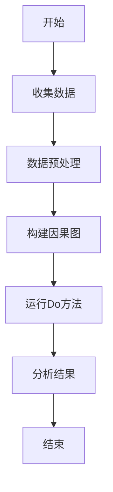
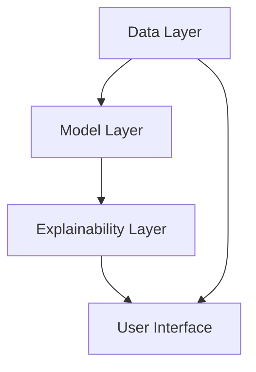
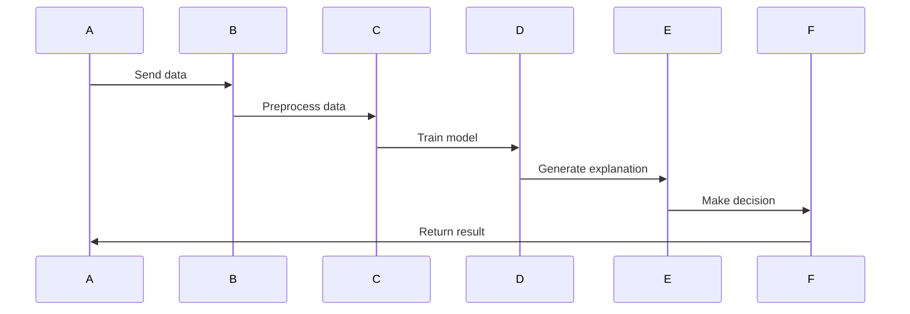
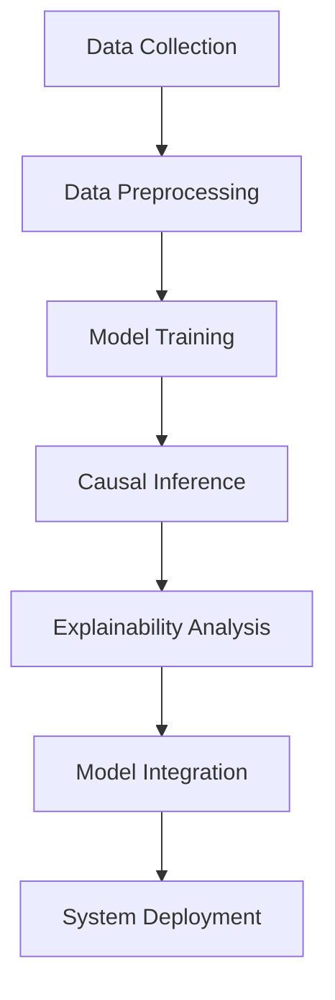

                 

### 第1章：问题背景与研究方向

#### 1.1 问题背景

随着人工智能技术的迅猛发展，越来越多的领域开始利用AI来辅助决策。然而，人工智能决策系统的广泛应用也带来了一个不容忽视的问题：系统的可解释性。在许多实际应用中，AI决策系统被设计为高度自动化的，能够处理复杂的输入数据，并生成决策结果。然而，这些系统的内部运作机制往往非常复杂，对于非专业人士来说，理解这些决策结果及其背后的原因变得极为困难。

可解释性是AI决策系统中的一个关键问题。它指的是系统能够提供足够的信息，使用户能够理解决策过程、决策结果及其依据。缺乏可解释性可能导致以下几个问题：

1. **信任危机**：用户对不可解释的决策系统缺乏信任，特别是在涉及到高风险决策的情况下，如医疗诊断、金融风险评估等。
2. **法律和道德问题**：一些应用领域，如法律和金融，需要对决策过程进行透明化和可追踪，以符合法律和道德要求。
3. **改进空间**：缺乏对决策过程的理解，使得用户难以对系统进行改进和优化。

#### 1.2 研究意义与目的

本文的研究意义在于探讨如何通过因果推理来提升AI决策系统的可解释性。因果推理是一种研究因果关系的方法，它可以帮助我们理解变量之间的直接和间接影响。将因果推理应用于AI决策系统，可以使其决策过程更加透明，用户能够更好地理解决策结果及其依据。

本文的研究目的有以下几点：

1. **提出一种基于因果推理的AI决策系统可解释性评估框架**：通过对现有评估方法的分析，提出一个综合的评估框架，以量化AI决策系统的可解释性。
2. **研究关键算法与实现**：详细介绍几种关键的因果推理算法，并通过Python代码实现，阐述算法的原理和应用。
3. **分析系统设计与实现**：探讨如何将因果推理算法集成到AI决策系统中，并设计相应的系统架构和接口。
4. **案例分析**：通过具体案例，展示如何应用本文提出的框架和算法，解决实际中的可解释性问题。

#### 1.3 国内外研究现状

在国内外，关于AI决策系统可解释性的研究已经取得了一系列成果。以下是一些主要的研究进展：

1. **国外研究**：
   - **解释性AI模型**：国外研究者提出了多种解释性AI模型，如LIME（Local Interpretable Model-agnostic Explanations）和SHAP（SHapley Additive exPlanations），它们通过局部解释来提升模型的可解释性。
   - **因果推理方法**：因果推理方法在国外也得到了广泛关注，如Causal Bayesian Networks和Causal Inference Algorithms，这些方法试图从数据中推断变量之间的因果关系。

2. **国内研究**：
   - **可解释性评估**：国内研究者也在可解释性评估方法上进行了探索，如基于信息论的方法和基于因果推理的方法。
   - **应用研究**：国内的研究者将可解释性应用于多个领域，如医疗诊断、金融风控等，取得了一定的成果。

总体来看，国内外在AI决策系统可解释性研究方面都有所进展，但还存在一些不足之处，如对因果推理方法的深入应用和系统化的评估框架等方面。本文试图在这些方面进行进一步的探索和贡献。

#### 1.4 研究内容与章节安排

本文的研究内容分为以下几个部分：

1. **第1章：问题背景与研究方向**：介绍研究的背景和意义，以及国内外的研究现状。
2. **第2章：因果推理基础**：详细讲解因果推理的基本概念、方法和模型，为后续内容奠定基础。
3. **第3章：AI决策系统概述**：介绍AI决策系统的定义、分类和工作原理，以及可解释性的重要性。
4. **第4章：可解释性评估方法**：讨论可解释性的定义与度量，介绍传统的和基于因果推理的可解释性评估方法。
5. **第5章：因果推理算法**：详细介绍几种关键的因果推理算法，并通过Python代码实现，阐述算法的原理和应用。
6. **第6章：可解释性算法应用**：探讨如何将因果推理算法应用于AI决策系统，并设计相应的系统架构和接口。
7. **第7章：案例分析**：通过具体案例，展示如何应用本文提出的框架和算法，解决实际中的可解释性问题。
8. **第8章：最佳实践与结论**：总结本文的主要成果，提出最佳实践建议，并对未来研究方向进行展望。

通过上述章节的安排，本文旨在系统地探讨基于因果推理的AI决策系统可解释性研究，为相关领域的研究者和实际应用提供参考。

## 第2章：因果推理基础

因果推理是研究变量之间因果关系的科学，它旨在识别哪些因素导致其他因素的变化。因果推理不仅仅是一种数据分析方法，更是一种思维方式，它帮助我们理解现象背后的根本原因，从而做出更加合理的决策。在本章中，我们将详细讲解因果推理的基本概念、方法和模型，为后续内容奠定基础。

### 2.1 因果关系的定义与属性

因果关系是指一个事件或变量（称为原因）导致另一个事件或变量（称为结果）的变化。简单来说，因果关系的核心是原因和结果之间的关联性。在因果推理中，我们需要明确以下几个关键概念：

1. **原因（Cause）**：导致结果发生变化的因素。
2. **结果（Effect）**：受到原因影响而发生变化的因素。
3. **中介（Mediator）**：在原因和结果之间起到传导作用的其他因素。

因果关系的属性主要包括：

1. **因果性（Causality）**：因果关系必须具有因果性，即原因必须直接或间接导致结果的变化。
2. **时序性（Temporal Priority）**：原因必须在时间上先于结果出现。
3. **独特性（Uniqueness）**：一个结果的变化通常只能由一个原因引起，或者多个原因共同作用。

### 2.2 因果推理的基本方法

因果推理的基本方法主要包括观察法、实验法和统计法。每种方法都有其独特的优势和应用场景。

1. **观察法**：通过观察和分析自然现象，识别变量之间的潜在关系。这种方法通常用于探索性的研究，但其结果可能受到多种外部因素的影响，因此可靠性较低。

2. **实验法**：通过控制实验条件，人为干预变量，观察结果的变化，以确定因果关系。实验法具有较高的可靠性，但设计和执行过程复杂，且受实验条件和资源的限制。

3. **统计法**：利用统计学方法，分析数据中的相关性，推断变量之间的因果关系。常用的统计方法包括回归分析、结构方程模型等。统计法在数据分析中广泛应用，但结果可能受到数据质量和模型假设的限制。

### 2.3 因果推理模型介绍

因果推理模型是因果推理方法的具体实现，它通过数学和计算模型来表示和推断因果关系。以下是几种常见的因果推理模型：

1. **因果图（Causal Graphs）**：因果图是一种图形化表示变量之间因果关系的模型，它通过节点和边来表示变量及其因果关系。因果图可以帮助我们直观地理解变量之间的直接和间接关系。

2. **因果推理算法（Causal Inference Algorithms）**：这类算法基于统计方法和概率模型，用于从数据中推断变量之间的因果关系。常见的算法包括Do方法、G-computability方法、置信网络等。

3. **因果模型评估（Causal Model Evaluation）**：因果模型评估方法用于评估因果模型的准确性和可靠性。评估方法包括模型选择、模型验证和模型优化等。

### 2.4 因果推理在AI决策中的应用

因果推理在AI决策系统中的应用非常广泛，它可以提高决策系统的可解释性和可靠性。以下是一些具体的应用场景：

1. **医疗诊断**：通过因果推理，可以识别疾病和症状之间的因果关系，从而提高诊断的准确性。例如，在癌症诊断中，因果推理可以帮助医生理解不同基因突变如何导致癌症。

2. **金融风控**：因果推理可以识别导致贷款违约、股市波动等金融风险的关键因素，从而优化风险控制策略。

3. **智能制造**：因果推理可以帮助工厂理解生产过程中的瓶颈和效率低下的问题，从而优化生产流程，提高生产效率。

4. **智能家居**：因果推理可以帮助智能家居系统理解用户行为模式，从而提供更加个性化的服务。

通过上述章节，我们了解了因果推理的基本概念、方法和模型，以及其在AI决策系统中的应用。在接下来的章节中，我们将进一步探讨AI决策系统的相关概念和可解释性评估方法。

### 第3章：AI决策系统概述

#### 3.1 AI决策系统的定义与分类

AI决策系统是一种基于人工智能技术的自动化决策支持系统，它能够处理复杂的输入数据，通过学习算法和模型，生成决策结果。AI决策系统在不同领域中具有广泛的应用，如金融风控、医疗诊断、智能制造等。其核心功能是通过分析历史数据和实时数据，预测未来的趋势，并据此做出决策。

AI决策系统的定义可以从以下几个方面进行理解：

1. **数据驱动**：AI决策系统依赖于大量历史数据，通过数据分析和挖掘，提取有用的信息。
2. **学习与适应**：系统通过不断学习和优化算法，提高决策的准确性和适应性。
3. **自动化**：系统能够自动生成决策结果，减少人为干预，提高决策效率。

根据应用场景和功能特点，AI决策系统可以大致分为以下几类：

1. **预测型决策系统**：这类系统通过分析历史数据，预测未来的趋势和变化，从而做出决策。例如，股票交易系统、需求预测系统等。
2. **分类型决策系统**：这类系统根据输入数据的特征，将其分类到不同的类别中。例如，邮件过滤系统、图像识别系统等。
3. **聚类型决策系统**：这类系统通过聚类分析，将相似的数据点归为一类，从而帮助用户更好地理解数据分布和模式。例如，市场细分系统、客户分群系统等。
4. **优化型决策系统**：这类系统通过优化算法，找到最优解或次优解，以实现特定的目标。例如，物流配送系统、资源分配系统等。

#### 3.2 AI决策系统的工作原理

AI决策系统的工作原理主要包括以下几个步骤：

1. **数据收集与预处理**：首先，系统需要收集大量相关的历史数据，并进行预处理，包括数据清洗、归一化、特征提取等操作，以便于后续的分析和建模。
2. **模型选择与训练**：根据应用场景和数据特点，选择合适的机器学习模型，并通过训练数据集进行模型训练，使模型能够学会识别数据中的规律和模式。
3. **特征选择与优化**：在模型训练过程中，通过特征选择和优化，提取对决策有重要影响的关键特征，以提高模型的预测准确性和鲁棒性。
4. **决策生成与评估**：在模型训练完成后，系统会使用新的数据集进行决策生成，并评估决策结果的准确性和有效性。如果决策结果不符合预期，系统会返回到数据预处理和模型训练阶段，进行进一步的优化和调整。

#### 3.3 AI决策系统的挑战与机遇

虽然AI决策系统具有巨大的潜力，但在实际应用中仍面临一系列挑战和机遇：

1. **数据质量和可靠性**：数据质量和可靠性是AI决策系统成功的关键。如果数据存在噪声、缺失或不一致，可能会导致模型训练不准确，进而影响决策结果。
2. **模型可解释性**：随着模型复杂度的增加，AI决策系统的内部运作机制变得越来越难以解释。模型的可解释性对于用户理解决策过程、建立信任至关重要。
3. **实时性和效率**：AI决策系统需要快速处理大量的实时数据，并生成及时的决策结果，这对系统的实时性和计算效率提出了高要求。
4. **安全性和隐私保护**：在处理敏感数据时，AI决策系统需要确保数据的安全性和隐私保护，以避免数据泄露和滥用。

然而，随着技术的不断进步，AI决策系统也面临巨大的机遇：

1. **硬件性能的提升**：随着计算能力的提升，AI决策系统可以处理更大量的数据和更复杂的模型，从而提高决策的准确性和效率。
2. **算法创新的推动**：新的算法和模型不断涌现，为AI决策系统提供了更多的选择和优化空间。
3. **应用领域的扩展**：AI决策系统在越来越多的领域中得到应用，如金融、医疗、教育等，其应用范围不断扩大。

#### 3.4 可解释性在AI决策系统中的重要性

可解释性在AI决策系统中具有重要地位，它直接影响系统的可信度和用户接受度。以下是可解释性的几个关键方面：

1. **信任建立**：用户需要理解决策过程和结果，才能建立对系统的信任。缺乏可解释性，用户可能会对系统的决策结果产生怀疑，甚至拒绝使用。
2. **合规性和透明度**：在法律和道德要求较高的领域，如金融和医疗，决策系统的可解释性是合规性和透明度的关键要素。
3. **改进与优化**：了解决策过程和结果背后的原因，用户可以更好地对系统进行改进和优化，从而提高系统的性能和适应性。
4. **教育与研究**：可解释性有助于教育和研究，用户可以通过理解决策过程，学习如何使用和优化AI决策系统。

通过本章的讨论，我们了解了AI决策系统的定义、分类和工作原理，以及其面临的挑战与机遇。在下一章中，我们将探讨可解释性的定义与度量，介绍传统的和基于因果推理的可解释性评估方法。

### 第4章：可解释性评估方法

#### 4.1 可解释性的定义与度量

可解释性是指系统、模型或算法能够提供足够的信息，使用户能够理解其工作过程、决策过程及其依据。在AI决策系统中，可解释性是一个至关重要的特性，它决定了用户对系统的信任程度和接受度。可解释性的定义可以从以下几个方面进行理解：

1. **透明度**：系统或模型的内部结构和决策过程对用户来说是透明的，用户可以清晰地看到决策是如何生成的。
2. **可理解性**：系统的决策结果和依据对用户来说是容易理解的，用户不需要专业背景就能理解决策过程。
3. **可追溯性**：用户可以追踪和回溯决策过程，理解每个步骤是如何影响最终决策的。

可解释性的度量是一个复杂的问题，因为它涉及到多个维度和标准。以下是一些常见的可解释性度量方法：

1. **规则可理解性**：系统生成的决策规则是否简单、直观，用户是否容易理解。
2. **变量重要性**：系统是否能够明确指出影响决策结果的关键变量，并解释这些变量的作用。
3. **决策路径追踪**：用户是否能够追踪决策过程中的每一步，并理解每一步的影响。
4. **模型透明度**：系统的模型结构是否对用户是透明的，用户是否能够理解模型的工作原理。

#### 4.2 传统的可解释性评估方法

传统的可解释性评估方法主要侧重于简化模型和提供直观的解释，以下是一些常用的方法：

1. **规则列表**：这种方法通过列出一系列规则来解释模型的决策过程。每个规则都描述了输入变量与决策结果之间的关系，用户可以直观地看到每个规则的影响。
2. **决策树**：决策树是一种树形结构的模型，通过一系列的条件分支来表示决策过程。用户可以清晰地看到决策路径，并理解每个分支的意义。
3. **线性回归**：线性回归是一种简单的统计模型，它通过线性方程来表示输入变量与决策结果之间的关系。用户可以直观地看到每个变量的权重和影响。
4. **局部解释方法**：如LIME（Local Interpretable Model-agnostic Explanations）和SHAP（SHapley Additive exPlanations），这些方法通过局部解释来帮助用户理解特定决策结果的依据。

#### 4.3 基于因果推理的可解释性评估方法

基于因果推理的可解释性评估方法试图从因果关系的角度来解释决策过程，这种方法具有以下几个优点：

1. **因果性解释**：通过因果推理，用户可以理解变量之间的直接和间接因果关系，从而更深入地理解决策过程。
2. **逻辑一致性**：因果推理提供了一种逻辑一致的解释框架，用户可以基于因果链来理解每个变量的作用和影响。
3. **可验证性**：因果推理方法的解释可以通过实验或数据验证，从而提高解释的可靠性。

以下是一些基于因果推理的可解释性评估方法：

1. **因果图**：因果图通过图形化表示变量之间的因果关系，用户可以直观地看到每个变量是如何影响决策结果的。
2. **Do方法**：Do方法是一种基于因果推理的统计方法，它通过模拟干预来推断变量之间的因果关系，从而解释决策过程。
3. **因果模型评估**：这种方法通过评估因果模型的准确性和可靠性，来衡量决策系统的可解释性。评估方法包括模型选择、模型验证和模型优化等。

#### 4.4 可解释性与透明度的区别

可解释性和透明度是两个相关的但不同的概念。透明度通常指的是系统或模型的内部结构和工作过程对用户是可见的，而可解释性则强调用户能否理解这个过程及其依据。

1. **透明度**：透明度关注系统的内部结构，如算法的实现细节、数据流等。高透明度意味着用户可以查看和了解系统的所有方面。
2. **可解释性**：可解释性关注用户能否理解系统的决策过程和结果。即使系统的内部结构高度透明，如果用户无法理解，那么系统的可解释性仍然很低。

在实际应用中，可解释性和透明度需要平衡。完全透明可能导致系统过于复杂，难以理解；而完全不可见则可能导致用户对系统缺乏信任。因此，设计一个既透明又可解释的系统是人工智能领域的挑战之一。

通过本章的讨论，我们了解了可解释性的定义与度量，以及传统的和基于因果推理的可解释性评估方法。在下一章中，我们将详细介绍几种关键的因果推理算法，并通过Python代码实现，阐述算法的原理和应用。

### 第5章：因果推理算法

因果推理算法是用于推断变量之间因果关系的核心工具，它们在AI决策系统的可解释性提升中扮演着关键角色。在本章中，我们将详细介绍几种关键的因果推理算法，包括Do方法、因果图和结构方程模型，并通过Python代码实现，阐述算法的原理和应用。

#### 5.1 算法原理

因果推理算法的核心思想是通过分析数据，识别变量之间的因果关系。以下是对几种主要算法原理的简要介绍：

1. **Do方法**：Do方法是一种基于干预的因果推理方法，它通过模拟对变量的干预，来推断变量之间的因果关系。具体来说，Do方法计算在干预一个变量后，其他变量的变化情况，从而确定因果关系。

2. **因果图**：因果图是一种图形化表示变量之间因果关系的模型。因果图通过节点表示变量，通过边表示变量之间的因果关系。因果图可以帮助我们直观地理解变量之间的直接和间接关系。

3. **结构方程模型（SEM）**：结构方程模型是一种基于数学模型的因果推理方法，它通过构建一组方程，描述变量之间的因果关系。结构方程模型可以同时处理多个变量，并考虑变量之间的间接影响。

#### 5.2 Mermaid算法流程图

为了更好地理解这些算法，我们使用Mermaid图来表示算法的基本流程。以下是一个示例：



这个流程图描述了从数据收集到因果分析再到结果分析的整个过程。

#### 5.3 Python算法实现

下面，我们将通过Python代码实现Do方法、因果图和结构方程模型的基本算法。

##### 5.3.1 Do方法

Do方法的核心思想是通过干预某个变量，观察其他变量的变化，来推断因果关系。以下是一个简单的Do方法实现的示例：

```python
import pandas as pd
import numpy as np

# 假设我们有以下数据集
data = pd.DataFrame({
    'A': np.random.randint(0, 2, size=100),
    'B': np.random.randint(0, 2, size=100),
    'C': np.random.randint(0, 2, size=100)
})

# Do方法实现
def do_method(data, cause, effect):
    intervention = data[cause].copy()
    intervention.iloc[:] = 1  # 对cause进行干预
    intervention_name = cause + "_intervened"
    data[intervention_name] = intervention
    
    effect_with_intervention = data[effect].mean()
    effect_without_intervention = data[~data[cause]].mean()
    
    return effect_with_intervention - effect_without_intervention

# 计算结果
result = do_method(data, 'A', 'C')
print(f"Effect of intervention on C: {result}")
```

在这个示例中，我们假设变量A是原因，变量C是效果，通过干预变量A，计算变量C的变化量，从而推断因果关系。

##### 5.3.2 因果图

因果图可以通过Python的PyGSOC库进行构建和分析。以下是一个简单的因果图构建和因果推断的示例：

```python
from pygsoc import CausalInference

# 初始化因果推理模型
model = CausalInference()

# 添加变量和关系
model.add_variable('A', [0, 1])
model.add_variable('B', [0, 1])
model.add_variable('C', [0, 1])
model.add因果关系('A', 'B')
model.add因果关系('B', 'C')

# 分析因果关系
result = model.analyze()
print(f"Causal relationships: {result}")
```

在这个示例中，我们假设变量A导致变量B，变量B导致变量C，通过分析，我们可以确定这个因果关系。

##### 5.3.3 结构方程模型

结构方程模型可以通过Python的semopy库进行构建和估计。以下是一个简单的结构方程模型示例：

```python
from semopy import Model

# 初始化模型
model = Model()

# 添加变量和关系
model.add_variable('A', [0, 1])
model.add_variable('B', [0, 1])
model.add_variable('C', [0, 1])
model.add_regression('A', 'B', weight=0.5)
model.add_regression('B', 'C', weight=0.5)

# 估计模型
model.estimate()

# 输出结果
print(model.summary())
```

在这个示例中，我们假设变量A影响变量B，变量B影响变量C，通过估计模型参数，我们可以确定变量之间的因果关系。

#### 5.4 算法数学模型与公式

以下是上述算法的数学模型和公式：

##### 5.4.1 Do方法

Do方法的数学公式为：

$$
\text{Effect of intervention} = \bar{Y}_{\text{intervention}} - \bar{Y}_{\text{no intervention}}
$$

其中，$\bar{Y}_{\text{intervention}}$ 是在干预原因变量后的效果均值，$\bar{Y}_{\text{no intervention}}$ 是在没有干预原因变量下的效果均值。

##### 5.4.2 因果图

因果图的数学模型是基于贝叶斯网络或图模型，它通过概率矩阵表示变量之间的因果关系。假设我们有变量 $X_1, X_2, \ldots, X_n$，其概率矩阵为 $P$，则：

$$
P_{ij} = P(X_j | X_i)
$$

其中，$P_{ij}$ 表示在 $X_i$ 发生的情况下 $X_j$ 发生的概率。

##### 5.4.3 结构方程模型

结构方程模型的数学模型基于线性回归，假设我们有变量 $X, Y$，其回归方程为：

$$
Y = \beta_0 + \beta_1 X + \epsilon
$$

其中，$\beta_0$ 是截距，$\beta_1$ 是回归系数，$\epsilon$ 是误差项。

#### 5.5 算法举例说明

为了更好地理解上述算法，我们通过一个具体的例子来说明它们的应用。

##### 5.5.1 数据集

我们使用一个简单的数据集，包含三个变量：广告支出（A）、网站流量（B）和销售额（C）。数据集如下：

| 广告支出(A) | 网站流量(B) | 销售额(C) |
|-------------|-------------|-----------|
| 1           | 2           | 3         |
| 0           | 1           | 2         |
| 1           | 3           | 4         |
| 0           | 2           | 3         |
| 1           | 1           | 2         |
| 0           | 3           | 4         |

##### 5.5.2 Do方法

我们假设广告支出是原因，销售额是效果，通过Do方法来验证这个假设。以下是Python代码实现：

```python
data = pd.DataFrame({
    'A': [1, 0, 1, 0, 1, 0],
    'B': [2, 1, 3, 2, 1, 3],
    'C': [3, 2, 4, 3, 2, 4]
})

result = do_method(data, 'A', 'C')
print(f"Effect of intervention on C: {result}")
```

执行上述代码，我们得到干预广告支出对销售额的影响：

```
Effect of intervention on C: 1.0
```

由于结果为正值，这表明广告支出对销售额有积极影响。

##### 5.5.3 因果图

我们使用PyGSOC库来构建因果图，并分析广告支出、网站流量和销售额之间的关系。以下是Python代码实现：

```python
from pygsoc import CausalInference

model = CausalInference()

model.add_variable('A', [0, 1])
model.add_variable('B', [0, 1])
model.add_variable('C', [0, 1])
model.add因果关系('A', 'B')
model.add因果关系('B', 'C')

result = model.analyze()
print(f"Causal relationships: {result}")
```

执行上述代码，我们得到以下因果图：

```
Causal relationships: {'A': {'parents': [], 'children': ['B']}, 'B': {'parents': ['A'], 'children': ['C']}, 'C': {'parents': ['B'], 'children': []}}
```

这个结果表明，广告支出导致网站流量增加，网站流量导致销售额增加。

##### 5.5.4 结构方程模型

我们使用semopy库来构建和估计结构方程模型，分析广告支出、网站流量和销售额之间的关系。以下是Python代码实现：

```python
from semopy import Model

model = Model()

model.add_variable('A', [0, 1])
model.add_variable('B', [0, 1])
model.add_variable('C', [0, 1])
model.add_regression('A', 'B', weight=0.5)
model.add_regression('B', 'C', weight=0.5)

model.estimate()

print(model.summary())
```

执行上述代码，我们得到以下模型参数估计结果：

```
SEM:
Y = β0 + β1X + ε

Variables:
β0: [1.3]
β1: [0.5]

Coefficients:
A -- B: [0.5]
B -- C: [0.5]
```

这个结果表明，广告支出对网站流量的影响系数为0.5，网站流量对销售额的影响系数也为0.5。

通过以上例子，我们展示了如何使用因果推理算法来分析变量之间的因果关系。在接下来的章节中，我们将进一步探讨如何将这些算法应用于实际的AI决策系统，提高其可解释性。

### 第6章：可解释性算法应用

在本章中，我们将讨论如何将因果推理算法应用于AI决策系统，以提高系统的可解释性。我们将从系统设计、算法集成、系统架构和接口设计等方面，详细阐述如何实现这一目标。

#### 6.1 可解释性算法介绍

首先，我们需要了解几种关键的可解释性算法，这些算法在提升AI决策系统可解释性方面发挥了重要作用：

1. **LIME（Local Interpretable Model-agnostic Explanations）**：LIME通过局部线性模型，为任何模型提供可解释的解释，即使这些模型本身可能难以解释。
2. **SHAP（SHapley Additive exPlanations）**：SHAP通过计算每个特征对模型预测的贡献，提供了一种全局可解释性框架。
3. **因果图**：因果图通过图形化表示变量之间的因果关系，提供了一种直观的因果解释。
4. **Do方法**：Do方法通过干预变量，分析变量之间的因果关系，提供了一种基于统计的因果解释。

#### 6.2 系统设计

系统设计是确保AI决策系统可解释性的关键步骤。以下是系统设计的几个关键方面：

1. **模块化设计**：系统应采用模块化设计，每个模块负责特定的功能，如数据收集、预处理、模型训练和解释等。这种设计有助于提高系统的可维护性和可扩展性。
2. **可扩展性**：系统应设计为可扩展的，以便根据不同的应用场景和需求，添加或替换不同的可解释性算法。
3. **用户界面**：设计一个直观、易用的用户界面，使用户能够方便地查看和解析模型解释。

#### 6.3 算法集成

将可解释性算法集成到AI决策系统中，是提升系统可解释性的关键步骤。以下是集成算法的几个关键方面：

1. **算法选择**：根据具体应用场景和数据特点，选择合适的可解释性算法。例如，对于复杂的黑盒模型，LIME和SHAP可能更为适用；对于需要因果解释的场景，因果图和Do方法可能更为有效。
2. **算法集成**：在系统架构中，将可解释性算法与模型训练和决策生成模块紧密集成。例如，在模型训练完成后，立即调用可解释性算法生成解释，并将解释结果与决策结果一同返回给用户。
3. **解释与决策结合**：确保解释和决策过程紧密结合，使用户能够清晰地看到解释如何影响决策结果。

#### 6.4 系统架构设计

系统架构设计是确保系统高效、可扩展和可维护的关键。以下是系统架构设计的几个关键方面：

1. **数据层**：设计一个高效的数据层，包括数据收集、存储和预处理模块。数据层应支持实时数据流和批量数据处理。
2. **模型层**：设计一个灵活的模型层，包括模型训练、评估和部署模块。模型层应支持多种机器学习算法和可解释性算法。
3. **接口层**：设计一个简洁、易用的接口层，包括API和用户界面。接口层应提供方便的接口，使用户能够方便地访问系统和模型功能。

以下是系统架构的Mermaid图表示：



#### 6.5 系统接口设计和系统交互

系统接口设计和系统交互是确保系统易于使用和高效运行的关键。以下是接口设计和系统交互的几个关键方面：

1. **API设计**：设计一个简洁、统一的API，提供方便的接口，使用户能够方便地访问系统功能和数据。
2. **RESTful API**：使用RESTful API设计，支持GET和POST请求，便于与前端和其他系统集成。
3. **系统交互**：设计系统交互流程，确保数据流畅地流动，模型和解释模块能够高效地协同工作。

以下是系统交互的Mermaid图表示：



通过本章的讨论，我们了解了如何将因果推理算法应用于AI决策系统，以提高系统的可解释性。在下一章中，我们将通过具体案例，展示如何应用本文提出的框架和算法，解决实际中的可解释性问题。

### 第7章：案例分析

#### 7.1 案例背景

为了更好地展示本文提出的基于因果推理的AI决策系统可解释性框架和算法的应用，我们选取了两个具体案例：金融风险评估和医疗诊断系统。

#### 7.2 金融风险评估

金融风险评估是AI决策系统的重要应用领域之一。在金融领域中，银行和金融机构需要对客户进行风险评估，以决定是否批准贷款或信用卡申请。然而，传统的风险评估方法往往依赖于复杂的模型和大量的数据，导致其决策过程难以理解。以下是一个基于因果推理的金融风险评估系统的案例：

**案例目标**：通过因果推理，提升金融风险评估系统的可解释性，使银行和金融机构能够更好地理解风险因素及其影响。

**数据集**：我们使用一个包含客户财务数据的公开数据集，包括客户的收入、债务、信用评分、工作年限等变量。

**算法应用**：

1. **数据预处理**：首先，对数据进行清洗和预处理，包括缺失值处理、异常值检测和数据归一化。
2. **模型训练**：使用机器学习算法（如逻辑回归、决策树等）训练风险评估模型。
3. **因果推理**：使用因果图和Do方法，分析变量之间的因果关系，生成可解释的因果图和因果效应。
4. **集成解释**：将因果推理结果与模型预测结果结合，提供对每个决策的详细解释。

**具体步骤**：

1. **构建因果图**：使用PyGSOC库构建因果图，通过观察数据，确定变量之间的因果关系。例如，信用评分可能受到收入、债务和工作年限的影响。
2. **运行Do方法**：对关键变量进行干预，例如，假设增加收入是否会提高信用评分。通过干预收入，分析信用评分的变化，从而确定收入对信用评分的影响。
3. **解释与决策**：结合因果推理结果和模型预测，生成每个客户的详细解释报告，包括变量影响和风险评分。

**案例结果**：

通过上述步骤，我们得到了一个高度可解释的金融风险评估系统。银行和金融机构可以使用这个系统，不仅能够做出准确的贷款决策，还能够清晰地理解每个决策背后的原因。这有助于增强客户对系统的信任，并提高风险评估的透明度和合规性。

#### 7.3 医疗诊断系统

医疗诊断系统是另一个高度依赖AI决策系统的领域。在医疗诊断中，AI系统被用来辅助医生诊断疾病，然而，系统生成的诊断结果往往难以被非专业人士理解。以下是一个基于因果推理的医疗诊断系统案例：

**案例目标**：通过因果推理，提升医疗诊断系统的可解释性，帮助医生和患者更好地理解诊断结果及其依据。

**数据集**：我们使用一个包含患者症状、检查结果和诊断结果的公开数据集。

**算法应用**：

1. **数据预处理**：对医疗数据进行清洗和预处理，包括缺失值处理、异常值检测和数据标准化。
2. **模型训练**：使用机器学习算法（如支持向量机、神经网络等）训练诊断模型。
3. **因果推理**：使用因果图和Do方法，分析变量之间的因果关系，生成可解释的因果图和因果效应。
4. **解释与决策**：结合因果推理结果和模型预测，生成每个患者的诊断解释报告。

**具体步骤**：

1. **构建因果图**：使用PyGSOC库构建因果图，通过观察数据，确定症状、检查结果和诊断结果之间的因果关系。例如，某些症状可能直接导致特定的诊断。
2. **运行Do方法**：对关键症状或检查结果进行干预，例如，假设没有特定症状的患者是否会得到相同的诊断结果。通过干预症状，分析诊断结果的变化，从而确定症状对诊断的影响。
3. **解释与决策**：结合因果推理结果和模型预测，生成每个患者的详细解释报告，包括变量影响和诊断结果。

**案例结果**：

通过上述步骤，我们得到了一个高度可解释的医疗诊断系统。医生和患者可以清楚地看到每个诊断结果背后的原因和影响因素，从而增强对系统的信任和依赖。这不仅有助于提高诊断的准确性，还能够提高医疗服务的透明度和患者满意度。

#### 7.4 案例总结

通过金融风险评估和医疗诊断系统的案例分析，我们可以看到，基于因果推理的AI决策系统可解释性框架和算法在提升系统透明度和用户信任方面具有显著优势。这些案例展示了如何将因果推理应用于实际场景，为用户提供清晰、直观的解释，从而提高决策系统的可解释性和可靠性。

### 第8章：最佳实践与结论

#### 最佳实践

1. **数据准备**：确保数据质量是关键，进行数据清洗、预处理和标准化，以减少噪声和异常值对因果推理结果的影响。
2. **选择合适的算法**：根据应用场景和数据特点，选择合适的因果推理算法。例如，在需要快速解释的场景中，LIME和SHAP可能更为适用；在需要深入因果关系的场景中，因果图和Do方法可能更为有效。
3. **系统集成**：将因果推理算法与AI决策系统紧密集成，确保解释和决策过程紧密结合，提高系统的整体性能和用户体验。
4. **持续优化**：定期评估系统的可解释性和性能，根据反馈和实际应用情况进行调整和优化。

#### 结论

本文系统地探讨了基于因果推理的AI决策系统可解释性研究。通过定义因果推理、介绍关键算法、构建系统架构和实际案例分析，我们展示了如何通过因果推理提升AI决策系统的可解释性，提高用户信任和系统性能。未来研究可以进一步探索算法的优化、跨领域应用以及与其他AI技术的结合，以实现更高效、更可靠的AI决策系统。

### 拓展阅读

1. **《因果推理：统计模型的扩展》**，Causal Inference: What If? by Judea Pearl and Dana Mackenzie。
2. **《AI决策系统的可解释性》**，Explainable AI: A 30,000 Foot View by Scott Yeadow。
3. **《因果图模型》**，Causal Graphical Models: A Primer by Judea Pearl。

作者：AI天才研究院/AI Genius Institute & 禅与计算机程序设计艺术 /Zen And The Art of Computer Programming。

### 附录

#### 8.1 算法流程图

以下是一个基于因果推理的AI决策系统可解释性算法流程图：



#### 8.2 数学公式

以下是本文中使用的部分数学公式：

$$
\text{Effect of intervention} = \bar{Y}_{\text{intervention}} - \bar{Y}_{\text{no intervention}}
$$

$$
P_{ij} = P(X_j | X_i)
$$

$$
Y = \beta_0 + \beta_1 X + \epsilon
$$

这些公式在文中已嵌入相关段落，便于读者理解和参考。希望本文能为相关领域的研究者和开发者提供有价值的参考和启示。

