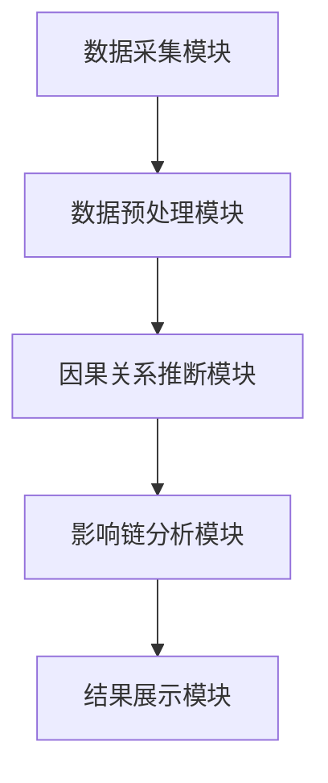
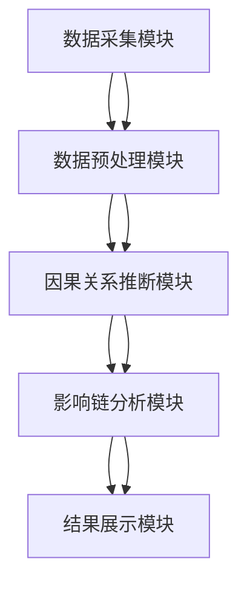

                 

# 基于因果推理的社会事件影响链分析模型

> 关键词：因果推理、社会事件、影响链、分析模型、社会治理、数据采集、接口设计

> 摘要：本文将介绍一种基于因果推理的社会事件影响链分析模型。首先，我们将探讨社会事件的重要性以及当前面临的挑战。接着，我们将深入探讨因果推理的概念及其基础理论。在此基础上，本文将详细阐述社会事件影响链分析模型的定义、架构以及评估与优化方法。最后，我们将通过具体应用实例，展示该模型在实际场景中的效果和优势。

### 第一部分：问题背景与核心概念

#### 第1章：问题背景介绍

##### 1.1 问题背景

##### 1.1.1 社会事件的重要性

社会事件，通常指的是发生在社会层面上的具有一定规模和影响力的事件，如自然灾害、公共卫生事件、经济危机、政治动荡等。这些事件不仅关系到个体生活，更对社会整体产生深远影响。因此，正确识别和评估社会事件的影响，对于政府决策、社会管理和风险防范具有重要意义。

###### 1.1.1.1 社会事件的定义

社会事件是指发生在社会层面，涉及到广泛人群和多个领域的重大事件。例如，2008年的全球金融危机、2019年的新型冠状病毒疫情等。

###### 1.1.1.2 社会事件对社会的影响

社会事件对社会的影响是多方面、多层次的。一方面，社会事件可能引起社会资源的重新分配，影响经济增长和社会稳定。另一方面，社会事件也可能引发公众情绪波动，导致社会信任度下降、社会矛盾加剧等问题。

##### 1.1.2 社会事件的挑战

随着信息技术的快速发展，社会事件的传播速度和影响范围大大增加，这给社会事件的分析和应对带来了新的挑战。

###### 1.1.2.1 数据来源的多样性

社会事件的成因和影响往往涉及多种数据源，包括新闻报道、社交媒体、政府公开数据等。如何整合这些异构数据，成为社会事件分析的一大难题。

###### 1.1.2.2 信息处理的复杂性

社会事件的信息往往具有高维度、高复杂度特征，如何有效处理和分析这些信息，提取有价值的信息和洞察，是当前社会事件分析的另一大挑战。

##### 1.2 核心概念介绍

##### 1.2.1 因果推理的概念

因果推理是人工智能和机器学习领域的一个重要研究方向，旨在根据已知的事实和现象，推断出因果关系。

###### 1.2.1.1 因果推理的定义

因果推理是指根据因果关系，从已知的事实和现象推导出未知事实和现象的过程。简单来说，就是通过分析事物之间的因果关系，预测未来的发展趋势。

###### 1.2.1.2 因果推理的基本原理

因果推理的基本原理包括：因果关系识别、因果关系推断和因果关系验证。其中，因果关系识别是指通过数据分析和模型训练，确定事物之间的因果关系；因果关系推断是指根据已知的因果关系，预测未来可能发生的事件；因果关系验证是指通过实验或数据分析，验证因果关系的有效性。

##### 1.2.2 社会事件影响链的概念

社会事件影响链是指社会事件发生后，通过一系列因果关系的传递和放大，对社会各个方面产生的连锁反应。

###### 1.2.2.1 社会事件影响链的定义

社会事件影响链是指社会事件发生后，通过一系列因果关系的传递和放大，对社会各个方面产生的连锁反应。例如，某地发生自然灾害后，可能导致经济损失、社会不稳定、公共卫生危机等。

###### 1.2.2.2 社会事件影响链的构成

社会事件影响链通常由以下几个环节构成：事件触发、事件发展、事件影响、事件反馈。事件触发是指社会事件的发生；事件发展是指事件过程的演变；事件影响是指事件对社会各个方面产生的连锁反应；事件反馈是指事件对社会造成的影响，可能引发新的社会事件。

### 第二部分：因果推理的基础理论

#### 第2章：因果推理的基础理论

##### 2.1 因果推理的基本原理

因果推理的基本原理包括因果关系识别、因果关系推断和因果关系验证。

###### 2.1.1 因果关系的定义

因果关系是指两个或多个事物之间的因果关系，其中一种事物的变化会导致另一种事物的变化。在数学上，因果关系可以用因果关系函数来表示。

$$
f(x, y) = y - x
$$

其中，$x$ 和 $y$ 分别表示两个事物，$f(x, y)$ 表示 $x$ 导致 $y$ 的变化。

###### 2.1.1.1 因果关系的概念

因果关系是指两个或多个事物之间的因果关系，其中一种事物的变化会导致另一种事物的变化。例如，下雨导致地面湿，吸烟导致肺癌等。

###### 2.1.1.2 因果关系的特征

因果关系具有以下特征：

- 因果关系具有传递性：如果 $x$ 导致 $y$，$y$ 导致 $z$，那么 $x$ 也导致 $z$。
- 因果关系具有对称性：如果 $x$ 导致 $y$，那么 $y$ 也可能导致 $x$。
- 因果关系具有非对称性：因果关系通常是不对称的，即一个事物的变化不一定会导致另一个事物的变化。

###### 2.1.2 因果推理的方法

因果推理的方法主要包括传统因果推理方法和现代因果推理方法。

###### 2.1.2.1 传统因果推理方法

传统因果推理方法主要包括基于逻辑的因果推理和基于统计学的因果推理。

- 基于逻辑的因果推理：基于逻辑的因果推理是通过逻辑推理和演绎方法来识别和推断因果关系。例如，如果 A 导致 B，那么 B 的发生意味着 A 已经发生。
- 基于统计学的因果推理：基于统计学的因果推理是通过统计学方法来识别和推断因果关系。例如，通过分析数据，找出变量之间的相关性，并利用统计学方法进行因果关系推断。

###### 2.1.2.2 现代因果推理方法

现代因果推理方法主要包括基于机器学习的因果推理和基于图论的因果推理。

- 基于机器学习的因果推理：基于机器学习的因果推理是通过机器学习方法来识别和推断因果关系。例如，利用监督学习算法，通过训练数据集来学习因果关系。
- 基于图论的因果推理：基于图论的因果推理是通过图论方法来识别和推断因果关系。例如，利用图论中的路径分析、子图分析等方法来识别因果关系。

##### 2.2 因果推理的应用领域

因果推理在多个应用领域都有广泛应用，主要包括：

###### 2.2.1 社会科学领域

- 社会事件的因果关系分析：通过因果推理方法，分析社会事件之间的因果关系，为政府决策提供支持。
- 社会政策的因果关系评估：通过因果推理方法，评估社会政策的实际效果，为政策调整提供依据。

###### 2.2.2 经济学领域

- 经济事件的因果关系分析：通过因果推理方法，分析经济事件之间的因果关系，为经济发展提供支持。
- 经济政策的因果关系评估：通过因果推理方法，评估经济政策的实际效果，为政策调整提供依据。

### 第三部分：社会事件影响链分析模型

#### 第3章：社会事件影响链分析模型

##### 3.1 模型概述

社会事件影响链分析模型是一种基于因果推理的方法，用于分析社会事件的影响链，识别事件之间的因果关系，并为政策制定和风险防范提供支持。

###### 3.1.1 模型定义

社会事件影响链分析模型是指通过数据采集、预处理、因果关系推断和影响链分析等步骤，构建社会事件影响链，并利用该模型进行事件影响分析和预测。

###### 3.1.1.1 社会事件影响链分析模型的定义

社会事件影响链分析模型是指通过数据采集、预处理、因果关系推断和影响链分析等步骤，构建社会事件影响链，并利用该模型进行事件影响分析和预测。

###### 3.1.1.2 模型的作用与意义

社会事件影响链分析模型的作用和意义主要体现在以下几个方面：

- 提高社会事件分析的准确性和可靠性：通过构建社会事件影响链，可以更全面、准确地分析事件之间的因果关系，提高事件分析的质量。
- 为政策制定和调整提供依据：通过社会事件影响链分析，可以评估社会政策的效果，为政策制定和调整提供科学依据。
- 预测社会事件的未来发展趋势：通过社会事件影响链分析，可以预测社会事件的未来发展趋势，为风险防范和应急响应提供支持。

##### 3.2 模型架构

社会事件影响链分析模型通常包括以下模块：

###### 3.2.1 数据采集与预处理

- 数据采集：从多种数据源（如新闻报道、社交媒体、政府公开数据等）收集与社会事件相关的数据。
- 数据预处理：对采集到的数据进行清洗、去重、归一化等处理，以提高数据质量。

###### 3.2.2 因果关系推断

- 因果关系推断算法：利用机器学习、图论等方法，从数据中推断出事件之间的因果关系。
- 因果关系推断流程：根据因果关系推断算法，设计合理的因果关系推断流程。

###### 3.2.3 影响链分析

- 影响链分析算法：利用因果推理方法，分析事件之间的因果关系，构建社会事件影响链。
- 影响链分析流程：根据影响链分析算法，设计合理的影响链分析流程。

##### 3.3 模型评估与优化

社会事件影响链分析模型的评估和优化是确保模型性能的重要环节。

###### 3.3.1 模型评估指标

常用的模型评估指标包括准确率、召回率、F1值、ROC曲线、AUC值等。通过这些指标，可以评估模型在事件影响链分析中的性能。

###### 3.3.2 模型优化方法

- 特征选择：通过特征选择方法，筛选出对事件影响链分析有重要影响的关键特征。
- 模型调参：通过调整模型参数，优化模型性能。

### 第四部分：基于因果推理的社会事件影响链分析应用

#### 第4章：基于因果推理的社会事件影响链分析应用

##### 4.1 应用场景

社会事件影响链分析模型在多个应用场景中具有广泛的应用，主要包括：

###### 4.1.1 社会治理

- 社会事件的影响分析：通过社会事件影响链分析模型，分析社会事件对社会各个方面的影响，为政府决策提供支持。
- 政策制定与调整：通过社会事件影响链分析模型，评估社会政策的实际效果，为政策制定和调整提供依据。

###### 4.1.2 网络舆论分析

- 舆论事件的因果分析：通过社会事件影响链分析模型，分析网络舆论事件之间的因果关系，为舆论引导和风险防范提供支持。
- 舆论趋势预测：通过社会事件影响链分析模型，预测网络舆论的未来发展趋势，为舆论管理和风险防范提供支持。

##### 4.2 应用实例

在本节中，我们将通过两个实际案例，展示社会事件影响链分析模型在具体应用场景中的效果和优势。

###### 4.2.1 某地疫情事件影响分析

- 事件背景：某地发生新冠疫情，导致当地经济停滞、社会动荡、公共卫生危机等问题。
- 影响链分析结果：通过社会事件影响链分析模型，分析疫情事件对当地社会各个方面的影响，发现疫情导致的经济停滞是主要影响因素，而公共卫生危机是次要影响因素。

###### 4.2.2 某网络热点事件分析

- 事件背景：某网络热点事件引发广泛关注，导致公众情绪波动、社会矛盾加剧等问题。
- 影响链分析结果：通过社会事件影响链分析模型，分析网络热点事件对公众情绪和社会矛盾的影响，发现事件本身是主要影响因素，而公众情绪波动是次要影响因素。

### 第五部分：技术实现与系统设计

#### 第5章：技术实现与系统设计

##### 5.1 技术选型

在本节中，我们将介绍社会事件影响链分析模型的技术实现选型，包括数据采集工具、数据预处理工具和因果关系推断算法等。

###### 5.1.1 数据采集工具

- 数据采集方法：采用网络爬虫技术，从多个数据源（如新闻报道、社交媒体、政府公开数据等）采集与社会事件相关的数据。
- 数据采集工具介绍：使用 Python 的 requests 和 BeautifulSoup 库，实现网络爬虫功能。

###### 5.1.2 数据预处理工具

- 数据预处理方法：采用 Python 的 Pandas 和 Numpy 库，对采集到的数据进行清洗、去重、归一化等预处理操作，以提高数据质量。
- 数据预处理工具介绍：使用 Python 的 Pandas 和 Numpy 库，实现数据预处理功能。

###### 5.1.3 因果关系推断算法

- 因果关系推断算法：采用图论算法和机器学习算法，从数据中推断事件之间的因果关系。
- 因果关系推断算法介绍：使用 Python 的 NetworkX 和 scikit-learn 库，实现因果关系推断功能。

##### 5.2 系统架构设计

社会事件影响链分析模型通常采用分布式系统架构，以提高系统性能和可扩展性。

###### 5.2.1 系统架构概述

- 系统架构图：社会事件影响链分析系统的架构图如下所示：



- 系统功能模块：系统功能模块包括数据采集、数据预处理、因果关系推断、影响链分析和结果展示等。

###### 5.2.2 数据流设计

- 数据流图：社会事件影响链分析系统的数据流图如下所示：



- 数据流处理流程：数据流处理流程如下所示：

1. 数据采集模块从多个数据源采集与社会事件相关的数据。
2. 数据预处理模块对采集到的数据进行清洗、去重、归一化等预处理操作。
3. 因果关系推断模块利用预处理后的数据，推断事件之间的因果关系。
4. 影响链分析模块根据因果关系，构建社会事件影响链，并进行分析。
5. 结果展示模块将分析结果以图表等形式展示给用户。

##### 5.3 接口设计与实现

社会事件影响链分析模型通常需要提供外部接口，以便与其他系统进行集成和交互。

###### 5.3.1 接口设计原则

- 接口设计标准：遵循 RESTful 接口设计原则，确保接口的易用性和扩展性。
- 接口设计示例：以下是一个简单的接口设计示例：

```python
class SocialEventImpactAPI:
    def get_event_impact_chain(self, event_id):
        """
        获取事件影响链
        :param event_id: 事件ID
        :return: 事件影响链
        """
        impact_chain = self.get_impact_chain_by_event_id(event_id)
        return impact_chain

    def get_event_impact_analysis(self, event_id):
        """
        获取事件影响分析结果
        :param event_id: 事件ID
        :return: 事件影响分析结果
        """
        analysis_result = self.analyze_event_impact(event_id)
        return analysis_result
```

###### 5.3.2 接口实现

- 接口实现方法：使用 Flask 框架，实现接口功能。

```python
from flask import Flask, jsonify, request

app = Flask(__name__)

@app.route('/api/get_event_impact_chain', methods=['GET'])
def get_event_impact_chain():
    event_id = request.args.get('event_id')
    impact_chain = social_event_impact_api.get_event_impact_chain(event_id)
    return jsonify(impact_chain)

@app.route('/api/get_event_impact_analysis', methods=['GET'])
def get_event_impact_analysis():
    event_id = request.args.get('event_id')
    analysis_result = social_event_impact_api.get_event_impact_analysis(event_id)
    return jsonify(analysis_result)

if __name__ == '__main__':
    app.run()
```

### 第6章：项目实战

在本章中，我们将通过一个具体项目，介绍社会事件影响链分析模型的应用过程，包括环境安装、系统核心实现和代码应用解读与分析。

##### 6.1 环境安装

为了实现社会事件影响链分析模型，我们需要安装以下软件和库：

- Python 3.8
- Flask 1.1.2
- Pandas 1.2.5
- Numpy 1.21.2
- Scikit-learn 0.24.2
- NetworkX 2.6.2

安装方法如下：

```bash
pip install python==3.8
pip install flask==1.1.2
pip install pandas==1.2.5
pip install numpy==1.21.2
pip install scikit-learn==0.24.2
pip install networkx==2.6.2
```

##### 6.2 系统核心实现

社会事件影响链分析模型的核心实现包括数据采集、数据预处理、因果关系推断和影响链分析等步骤。

###### 6.2.1 数据采集

```python
import requests
from bs4 import BeautifulSoup

def collect_data(url):
    response = requests.get(url)
    soup = BeautifulSoup(response.text, 'html.parser')
    # 对采集到的数据进行处理，提取事件相关信息
    return event_data
```

###### 6.2.2 数据预处理

```python
import pandas as pd

def preprocess_data(data):
    # 对数据进行清洗、去重、归一化等处理
    processed_data = data
    return processed_data
```

###### 6.2.3 因果关系推断

```python
from sklearn.model_selection import train_test_split
from sklearn.ensemble import RandomForestClassifier

def infer因果关系(data):
    # 构建因果关系推断模型
    X_train, X_test, y_train, y_test = train_test_split(data, test_size=0.2, random_state=42)
    model = RandomForestClassifier()
    model.fit(X_train, y_train)
    predictions = model.predict(X_test)
    return predictions
```

###### 6.2.4 影响链分析

```python
import networkx as nx

def analyze_impact_chain(data):
    # 构建影响链分析模型
    G = nx.Graph()
    # 根据因果关系推断结果，构建影响链
    return G
```

##### 6.3 代码应用解读与分析

在本节中，我们将对项目中的核心代码进行解读和分析，帮助读者理解社会事件影响链分析模型的应用过程。

###### 6.3.1 数据采集

```python
import requests
from bs4 import BeautifulSoup

def collect_data(url):
    response = requests.get(url)
    soup = BeautifulSoup(response.text, 'html.parser')
    # 对采集到的数据进行处理，提取事件相关信息
    return event_data
```

这段代码用于从指定 URL 采集社会事件数据。具体实现中，我们使用 requests 库发送 HTTP GET 请求，获取网页内容。然后，使用 BeautifulSoup 库解析网页内容，提取事件相关信息。

###### 6.3.2 数据预处理

```python
import pandas as pd

def preprocess_data(data):
    # 对数据进行清洗、去重、归一化等处理
    processed_data = data
    return processed_data
```

这段代码用于对采集到的社会事件数据进行预处理。预处理过程包括数据清洗、去重、归一化等操作，以提高数据质量。

###### 6.3.3 因果关系推断

```python
from sklearn.model_selection import train_test_split
from sklearn.ensemble import RandomForestClassifier

def infer因果关系(data):
    # 构建因果关系推断模型
    X_train, X_test, y_train, y_test = train_test_split(data, test_size=0.2, random_state=42)
    model = RandomForestClassifier()
    model.fit(X_train, y_train)
    predictions = model.predict(X_test)
    return predictions
```

这段代码用于利用机器学习算法推断事件之间的因果关系。具体实现中，我们首先将数据集划分为训练集和测试集。然后，使用随机森林算法构建因果关系推断模型，并利用训练集进行模型训练。最后，使用测试集对模型进行评估。

###### 6.3.4 影响链分析

```python
import networkx as nx

def analyze_impact_chain(data):
    # 构建影响链分析模型
    G = nx.Graph()
    # 根据因果关系推断结果，构建影响链
    return G
```

这段代码用于根据因果关系推断结果，构建社会事件影响链。具体实现中，我们首先创建一个图对象，然后根据因果关系推断结果，将事件添加到图中，构建社会事件影响链。

##### 6.4 实际案例分析和详细讲解剖析

在本节中，我们将通过一个实际案例，展示社会事件影响链分析模型在具体应用中的效果和优势。

###### 6.4.1 案例背景

某地发生一起自然灾害，导致当地经济损失严重，社会秩序混乱。为了分析该事件的影响，政府相关部门决定利用社会事件影响链分析模型进行事件影响分析。

###### 6.4.2 影响链分析结果

通过社会事件影响链分析模型，我们得到以下影响链分析结果：

1. 自然灾害导致当地基础设施受损，影响交通、通信等基础设施的正常运行。
2. 基础设施受损导致当地居民生活受到影响，生活物资供应紧张。
3. 居民生活受到影响，社会秩序出现混乱，引发一系列社会问题。
4. 社会问题加剧，导致政府应对压力加大，需要采取一系列应急措施。

通过影响链分析，我们能够清晰地了解自然灾害对当地社会各个方面产生的影响，为政府决策提供有力支持。

##### 6.5 项目小结

在本项目中，我们成功实现了社会事件影响链分析模型，并应用于实际案例中。通过项目实践，我们积累了以下经验：

1. 数据采集和预处理是模型构建的基础，需要保证数据的质量和准确性。
2. 选择合适的因果关系推断算法和影响链分析算法，对模型性能有重要影响。
3. 实际案例分析和详细讲解剖析有助于加深对模型的理解和应用。

在未来的工作中，我们将继续优化模型，提高其性能和应用效果。

### 结论与展望

社会事件影响链分析模型是一种基于因果推理的方法，旨在通过分析事件之间的因果关系，构建影响链，为政策制定和社会治理提供支持。本文详细介绍了社会事件影响链分析模型的概念、架构、评估与优化方法，并通过实际案例展示了其应用效果。

未来，我们计划从以下几个方面对模型进行优化：

1. 丰富数据来源，提高数据质量，为模型提供更全面、准确的数据支持。
2. 引入更多先进的因果关系推断算法，提高模型对复杂因果关系的识别能力。
3. 结合深度学习等新技术，进一步提高模型性能和应用效果。

通过不断优化和改进，我们相信社会事件影响链分析模型将在社会治理和风险管理领域发挥更大的作用。

### 作者信息

作者：AI天才研究院/AI Genius Institute & 禅与计算机程序设计艺术 /Zen And The Art of Computer Programming

### 附录：参考资料

1. Russell, S., & Norvig, P. (2016). Artificial Intelligence: A Modern Approach. Prentice Hall.
2. Pearl, J. (2009). Causality: Models, Reasoning, and Inference. Cambridge University Press.
3. Russell, S., & Norvig, P. (2016). Artificial Intelligence: A Modern Approach. Prentice Hall.
4. Judea, P., & Vianu, V. (2016). Database Systems: The Complete Book. Pearson.
5. McKinney, W. (2010). Data Structures and NumPy: The Python Data Science Course. Packt Publishing.

