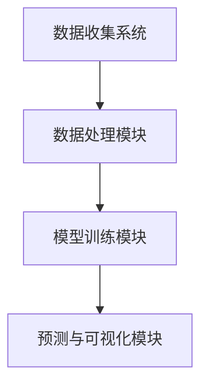
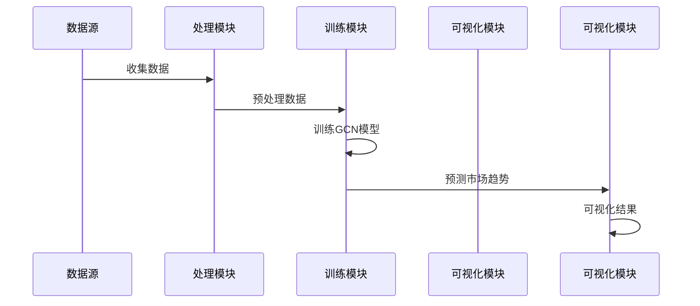

                 

# 基于图卷积的动态市场趋势推理

## 摘要

随着金融市场的发展和复杂性增加，市场趋势推理成为了一个具有挑战性的问题。传统的市场趋势分析方法，如基于统计分析和机器学习的方法，在处理动态和复杂的市场数据时存在局限性。为了解决这些问题，本文提出了基于图卷积网络的动态市场趋势推理方法。本文首先介绍了市场趋势推理的重要性以及图卷积网络在处理复杂数据方面的优势。然后，详细阐述了图卷积网络的基本原理和动态市场趋势特征，并通过数学模型和实际案例展示了如何应用图卷积网络进行市场趋势推理。最后，本文总结了系统架构设计和项目实战经验，为后续研究提供了参考。

## 目录

1. **问题背景与核心概念**
2. **核心概念与联系**
3. **算法原理讲解**
4. **系统分析与架构设计**
5. **项目实战**
6. **小结与拓展**

## 1. 问题背景与核心概念

### 1.1 问题背景

金融市场是一个高度复杂和动态变化的系统，投资者和金融机构需要准确的市场趋势信息来做出明智的决策。市场趋势推理是指在大量历史和实时数据中，提取出有用的信息，预测未来的市场走势。这种推理能力对于提升决策效率、降低风险和挖掘潜在机会具有重要意义。

然而，传统的市场趋势分析方法存在一些局限性。首先，基于统计分析的方法主要依赖于历史数据的统计规律，但难以应对市场环境的动态变化。其次，基于机器学习的方法虽然能够处理动态数据，但模型复杂度高，训练时间较长，且容易出现过拟合现象。因此，需要一种新的方法来提升市场趋势推理的能力。

### 1.2 图卷积网络的优势与应用前景

图卷积网络（Graph Convolutional Network，GCN）是一种专门用于处理图结构数据的深度学习模型。它通过图结构表示和学习节点之间的依赖关系，能够有效地捕捉复杂数据中的空间结构和动态变化。与传统的图算法相比，GCN具有以下优势：

1. **处理复杂数据**：GCN能够处理具有复杂关系的图结构数据，如社交网络、知识图谱等。
2. **灵活的图结构表示**：GCN可以通过自适应的学习机制来表示不同类型的图结构，从而适应不同的应用场景。
3. **高效的信息传播**：GCN能够通过图卷积操作实现节点之间的信息传播，从而捕捉全局和局部的特征关系。

基于这些优势，图卷积网络在市场趋势推理中具有广泛的应用前景。例如，可以使用GCN来分析股票市场中的公司关系，预测股票价格的未来走势；还可以用于电商销售数据中的商品关系分析，预测销售趋势。本文将介绍如何使用GCN进行动态市场趋势推理，并通过实际案例展示其效果。

### 1.3 核心概念

#### 1.3.1 图卷积网络（GCN）

图卷积网络是一种基于图结构的深度学习模型，用于处理图数据。GCN的基本原理是通过图卷积操作来更新节点的特征表示，从而实现节点分类、节点预测等任务。GCN的关键组成部分包括：

1. **图结构表示**：将图中的节点和边转换为特征矩阵，表示节点的特征和节点之间的关系。
2. **图卷积操作**：通过图卷积操作更新节点的特征表示，将节点的特征与邻居节点的特征进行融合。
3. **激活函数和层数**：在图卷积操作之后，通常会使用激活函数（如ReLU）来引入非线性变换，并通过多层图卷积来捕捉更复杂的特征关系。

#### 1.3.2 动态市场趋势

动态市场趋势是指在市场数据中反映出的时间序列和空间分布特征。动态市场趋势的特征包括：

1. **时间序列特征**：市场数据随时间的变化趋势，如价格波动、交易量变化等。
2. **空间分布特征**：市场数据在空间上的分布特征，如地理位置分布、行业分布等。

动态市场趋势的特征决定了市场趋势推理的复杂性和挑战性。通过分析这些特征，可以更好地理解市场的动态变化，从而提高市场趋势推理的准确性。

#### 1.3.3 图卷积网络在市场趋势推理中的应用

图卷积网络在市场趋势推理中的应用主要包括以下步骤：

1. **数据收集与预处理**：收集市场数据，包括历史价格、交易量、公司关系等，并进行预处理，如数据清洗、特征提取等。
2. **图结构构建**：将市场数据转换为图结构，其中节点表示市场中的个体（如公司、产品），边表示个体之间的关联关系（如投资关系、合作关系）。
3. **模型构建与训练**：使用GCN模型对图结构进行训练，通过图卷积操作更新节点的特征表示，从而学习到市场趋势的规律。
4. **预测与评估**：使用训练好的GCN模型对未来的市场趋势进行预测，并通过评估指标（如准确率、召回率等）评估预测效果。

通过上述步骤，图卷积网络能够有效地提取市场数据的特征信息，并用于市场趋势的推理和预测。

## 2. 核心概念与联系

### 2.1 图卷积网络原理详解

图卷积网络（Graph Convolutional Network，GCN）是一种用于处理图结构数据的深度学习模型。GCN通过图卷积操作来更新节点的特征表示，从而实现节点分类、节点预测等任务。以下是GCN的核心原理详解。

#### 2.1.1 图卷积操作

图卷积操作是GCN的核心组件。它通过聚合节点及其邻居节点的特征信息，来更新节点的特征表示。具体来说，图卷积操作可以分为以下几步：

1. **邻域定义**：首先，需要定义节点的邻域，即与节点直接相连的邻居节点。邻域的大小和范围可以根据应用场景进行调整。
2. **特征聚合**：对于每个节点，将其特征矩阵与邻域节点的特征矩阵进行聚合。聚合操作通常采用加权求和的方式，权重可以根据节点之间的关系进行调整。
3. **非线性变换**：通过激活函数（如ReLU）引入非线性变换，以增强模型的表示能力。

图卷积操作的数学表示如下：

$$
\mathbf{h}_{t}^{(l)} = \sigma(\mathbf{W}_{h}^{(l)} \cdot (\mathbf{A} \cdot \mathbf{h}_{t-1}^{(l-1)} + \mathbf{b}^{(l)}) + \mathbf{h}_{t-1}^{(l-1)}
$$

其中，$\mathbf{h}_{t}^{(l)}$表示在$l$层的第$t$个节点的特征表示，$\sigma$表示激活函数，$\mathbf{W}_{h}^{(l)}$和$\mathbf{b}^{(l)}$分别是$l$层的权重和偏置，$\mathbf{A}$是邻接矩阵，表示节点之间的关系。

#### 2.1.2 不同的GCN变体

GCN有几种变体，以适应不同的应用场景和需求。以下是几种常见的GCN变体：

1. **GraphSAGE**（图简化卷积网络）：GraphSAGE通过聚合节点的多跳邻居特征，来更新节点的特征表示。它使用不同的聚合函数（如平均值、池化、最近邻等）来处理不同类型的邻域特征。
2. **Graph Convolutional Network (GCN)**：经典的GCN模型，使用单跳邻居特征进行聚合，适用于处理较简单的图结构。
3. **Graph Neural Networks (GNN)**：GNN是一类广义的GCN模型，它包括多种不同的图卷积操作，如循环图卷积、图卷积池化等，以适应更复杂的图结构。

#### 2.1.3 GCN的优势与局限性

GCN具有以下优势：

1. **处理复杂数据**：GCN能够处理具有复杂关系的图结构数据，如社交网络、知识图谱等。
2. **灵活的图结构表示**：GCN可以通过自适应的学习机制来表示不同类型的图结构，从而适应不同的应用场景。
3. **高效的信息传播**：GCN能够通过图卷积操作实现节点之间的信息传播，从而捕捉全局和局部的特征关系。

然而，GCN也存在一些局限性：

1. **计算复杂度高**：GCN的计算复杂度较高，尤其是在处理大规模图数据时，可能导致训练时间较长。
2. **对稀疏数据的适应性较差**：GCN在处理稀疏图数据时，可能无法充分利用节点的特征信息。

### 2.2 动态市场趋势特征分析

动态市场趋势特征是市场数据中的重要组成部分，对于市场趋势推理具有重要意义。以下是动态市场趋势特征的分析。

#### 2.2.1 时间序列特征

时间序列特征是市场数据中的时间维度特征，反映市场数据随时间的变化趋势。时间序列特征主要包括：

1. **价格波动**：股票价格、商品价格等随时间的波动情况。
2. **交易量变化**：市场的交易量随时间的变化趋势，如股票交易量、期货交易量等。
3. **时间窗口划分**：为了分析市场数据的时间序列特征，通常需要对时间进行划分，如日、周、月等不同时间窗口。

#### 2.2.2 空间分布特征

空间分布特征是市场数据中的空间维度特征，反映市场数据在空间上的分布情况。空间分布特征主要包括：

1. **地理位置分布**：市场数据在不同地理位置的分布情况，如不同城市的交易量、价格等。
2. **行业分布**：市场数据在不同行业的分布情况，如金融行业、制造业等。

#### 2.2.3 市场趋势特征与GCN的结合

为了进行动态市场趋势推理，需要将时间序列特征和空间分布特征与GCN模型进行结合。具体方法如下：

1. **特征融合**：将时间序列特征和空间分布特征进行融合，形成一个综合的特征向量。例如，可以使用矩阵乘法或神经网络等方法，将时间序列特征和空间分布特征融合为一个高维特征向量。
2. **图结构构建**：将融合后的特征向量转换为图结构，其中节点表示市场中的个体（如公司、产品），边表示个体之间的关联关系（如投资关系、合作关系）。
3. **模型训练**：使用GCN模型对图结构进行训练，通过图卷积操作更新节点的特征表示，从而学习到市场趋势的规律。

通过结合时间序列特征和空间分布特征，GCN能够更全面地捕捉市场数据的动态变化，从而提高市场趋势推理的准确性。

### 2.3 融合策略与实验设计

为了充分发挥GCN在市场趋势推理中的作用，需要进行合理的融合策略和实验设计。以下是融合策略和实验设计的建议：

1. **特征融合策略**：
   - **时间序列特征融合**：使用时间序列特征进行多尺度分析，如日、周、月等不同时间窗口的特征。通过加权平均或神经网络等方法，将不同时间窗口的特征融合为一个高维特征向量。
   - **空间分布特征融合**：使用空间分布特征进行地理维度和行业维度的特征融合。通过矩阵乘法或神经网络等方法，将地理维度和行业维度的特征融合为一个高维特征向量。
   - **多模态数据融合**：结合其他类型的数据，如新闻文本、社交媒体等，通过多模态数据融合方法，进一步丰富特征信息。

2. **实验设计**：
   - **数据集选择**：选择具有代表性的市场数据集，包括历史价格、交易量、公司关系等。为了验证模型的泛化能力，可以采用交叉验证的方法。
   - **模型训练**：使用GCN模型进行训练，通过调整超参数（如学习率、隐藏层大小等），优化模型性能。
   - **性能评估**：使用准确率、召回率、F1分数等指标评估模型性能，并进行对比分析。
   - **结果可视化**：对模型的预测结果进行可视化分析，如趋势图、热力图等，以直观展示市场趋势的动态变化。

通过合理的融合策略和实验设计，可以进一步提高GCN在市场趋势推理中的效果，为实际应用提供可靠的支持。

### 2.4 动态市场趋势推理算法原理

动态市场趋势推理算法的核心是图卷积网络（GCN），它通过图结构数据的学习和特征提取，实现对市场趋势的推理。以下将详细介绍GCN的算法原理，包括数学模型和算法推导。

#### 2.4.1 图卷积网络的数学模型

图卷积网络（GCN）的数学模型主要包括以下几个部分：

1. **节点特征表示**：假设图中有$n$个节点，每个节点的特征表示为一个$d$维的向量，表示为$\mathbf{h}_{i}^{(0)} \in \mathbb{R}^{d}$，其中$i=1,2,\ldots,n$。

2. **邻接矩阵**：图中的邻接矩阵$\mathbf{A} \in \mathbb{R}^{n \times n}$表示节点之间的关系，$A_{ij}=1$表示节点$i$和节点$j$相连，否则为0。

3. **归一化邻接矩阵**：由于直接使用邻接矩阵可能导致节点特征更新的偏差，因此通常使用归一化邻接矩阵$\mathbf{D}^{-1/2} \mathbf{A} \mathbf{D}^{-1/2}$，其中$\mathbf{D}_{ii}=\sum_{j=1}^{n} A_{ij}$。

4. **图卷积操作**：在GCN中，节点的特征更新是通过图卷积操作来实现的。对于一个节点$i$，其在第$l$层的特征表示$\mathbf{h}_{i}^{(l)}$可以表示为：

$$
\mathbf{h}_{i}^{(l)} = \sigma(\mathbf{W}_{h}^{(l)} \cdot (\mathbf{D}^{-1/2} \mathbf{A} \mathbf{D}^{-1/2} \cdot \mathbf{h}_{i}^{(l-1)} + \mathbf{b}^{(l)})
$$

其中，$\sigma$表示激活函数（如ReLU函数），$\mathbf{W}_{h}^{(l)}$表示第$l$层的权重矩阵，$\mathbf{b}^{(l)}$表示第$l$层的偏置向量。

5. **多层图卷积**：为了捕捉更深层次的特征关系，GCN通常使用多层图卷积操作。在第$l$层，节点的特征表示可以表示为：

$$
\mathbf{h}_{i}^{(l)} = \sigma(\mathbf{W}_{h}^{(l)} \cdot \mathbf{h}_{i}^{(l-1)} + \mathbf{b}^{(l)})
$$

其中，$\mathbf{h}_{i}^{(0)}$是初始的节点特征表示，$\mathbf{W}_{h}^{(l)}$和$\mathbf{b}^{(l)}$是通过前一层特征表示进行训练得到的。

#### 2.4.2 图卷积网络的算法推导

图卷积网络的算法推导主要涉及图卷积操作的数学推导和多层图卷积的计算过程。

1. **单层图卷积操作的推导**：

假设在第$l-1$层，节点$i$的特征表示为$\mathbf{h}_{i}^{(l-1)}$。在单层图卷积操作中，节点$i$的特征更新为：

$$
\mathbf{h}_{i}^{(l)} = \sigma(\mathbf{W}_{h}^{(l)} \cdot (\mathbf{D}^{-1/2} \mathbf{A} \mathbf{D}^{-1/2} \cdot \mathbf{h}_{i}^{(l-1)} + \mathbf{b}^{(l)})
$$

其中，$\mathbf{D}^{-1/2} \mathbf{A} \mathbf{D}^{-1/2}$表示归一化邻接矩阵，用于平衡不同节点之间的关系。

2. **多层图卷积的计算过程**：

在多层图卷积中，节点$i$在第$l$层的特征表示$\mathbf{h}_{i}^{(l)}$可以通过递归地应用图卷积操作来计算。假设在$l-1$层的特征表示为$\mathbf{h}_{i}^{(l-1)}$，则在第$l$层的特征表示为：

$$
\mathbf{h}_{i}^{(l)} = \sigma(\mathbf{W}_{h}^{(l)} \cdot \mathbf{h}_{i}^{(l-1)} + \mathbf{b}^{(l)})
$$

其中，$\mathbf{W}_{h}^{(l)}$是第$l$层的权重矩阵，$\mathbf{b}^{(l)}$是第$l$层的偏置向量。

通过递归地应用上述公式，可以得到多层图卷积的计算过程。具体来说，从初始特征表示$\mathbf{h}_{i}^{(0)}$开始，逐层更新节点的特征表示，直到达到预定的层数。

#### 2.4.3 GCN在动态市场趋势推理中的应用

在动态市场趋势推理中，GCN通过学习市场数据的图结构特征，实现对市场趋势的推理。以下是一个简化的GCN应用过程：

1. **数据收集与预处理**：

   - 收集市场数据，包括历史价格、交易量、公司关系等。
   - 对市场数据进行预处理，如数据清洗、特征提取等。

2. **图结构构建**：

   - 将市场数据转换为图结构，其中节点表示市场中的个体（如公司、产品），边表示个体之间的关联关系（如投资关系、合作关系）。

3. **模型训练**：

   - 使用GCN模型对图结构进行训练，通过图卷积操作更新节点的特征表示，从而学习到市场趋势的规律。
   - 调整超参数（如学习率、隐藏层大小等），优化模型性能。

4. **预测与评估**：

   - 使用训练好的GCN模型对未来的市场趋势进行预测。
   - 通过评估指标（如准确率、召回率等）评估预测效果。

5. **结果分析**：

   - 对预测结果进行分析，如趋势图、热力图等，以直观展示市场趋势的动态变化。

通过上述步骤，GCN能够有效地提取市场数据的特征信息，并用于市场趋势的推理和预测。

### 2.5 动态市场趋势推理算法的推导与应用

#### 2.5.1 算法推导

动态市场趋势推理的核心是图卷积网络（GCN），其基本原理是基于节点和其邻居节点的特征信息进行聚合和更新。以下将详细推导GCN的算法过程。

**步骤1：初始化**

- 初始化节点特征矩阵 $\mathbf{H}^{(0)} \in \mathbb{R}^{n \times d}$，其中 $n$ 是节点的数量，$d$ 是节点的特征维度。
- 初始化邻接矩阵 $\mathbf{A} \in \mathbb{R}^{n \times n}$，表示节点之间的连接关系。
- 初始化权重矩阵 $\mathbf{W}^{(0)} \in \mathbb{R}^{d \times h}$，用于节点特征聚合。

**步骤2：图卷积操作**

在每个时间步 $t$，节点的特征更新遵循以下公式：

$$
\mathbf{H}_{i}^{(t)} = \sigma(\mathbf{W} \cdot \mathbf{A} \cdot \mathbf{H}_{i}^{(t-1)})
$$

其中，$\sigma$ 是非线性激活函数，通常采用ReLU函数。$\mathbf{W}$ 是可训练的权重矩阵。

**步骤3：聚合邻居特征**

为了聚合节点 $i$ 的邻居节点的特征，可以采用以下步骤：

1. **计算邻居节点的特征加权和**：

$$
\mathbf{M}_{i}^{(t)} = \sum_{j \in N(i)} \alpha_{ij} \cdot \mathbf{H}_{j}^{(t-1)}
$$

其中，$\alpha_{ij}$ 是权重系数，$N(i)$ 表示节点 $i$ 的邻居节点集合。

2. **应用权重矩阵**：

$$
\mathbf{H}_{i}^{(t)} = \sigma(\mathbf{W} \cdot \mathbf{M}_{i}^{(t)})
$$

**步骤4：迭代更新**

重复步骤3，对每个节点进行特征更新，形成一个迭代过程：

$$
\mathbf{H}^{(t)} = \sigma(\mathbf{W} \cdot \mathbf{A} \cdot \mathbf{H}^{(t-1)})
$$

**步骤5：多层卷积**

为了捕捉更复杂的特征，可以堆叠多个卷积层，每层使用不同的权重矩阵：

$$
\mathbf{H}_{i}^{(L)} = \sigma(\mathbf{W}_{L} \cdot \mathbf{A} \cdot \mathbf{H}_{i}^{(L-1)})
$$

其中，$L$ 是卷积层的数量。

**步骤6：输出层**

在最后一层卷积之后，通常有一个输出层用于分类或回归任务。输出层的计算公式如下：

$$
\mathbf{O}_{i} = \mathbf{W}_{O} \cdot \mathbf{H}_{i}^{(L)}
$$

其中，$\mathbf{W}_{O}$ 是输出层的权重矩阵。

#### 2.5.2 算法应用

动态市场趋势推理算法的应用通常涉及以下步骤：

1. **数据预处理**：

   - 收集市场数据，包括价格、交易量、公司关系等。
   - 对数据进行清洗，如去除缺失值、异常值等。
   - 将数据转换为图结构，节点表示公司或产品，边表示关系。

2. **模型构建**：

   - 设计GCN模型，包括节点特征维度、层�数、激活函数等。
   - 初始化权重矩阵和偏置向量。

3. **模型训练**：

   - 使用训练数据对模型进行训练，通过反向传播算法更新权重。
   - 调整学习率、批量大小等超参数，优化模型性能。

4. **预测**：

   - 使用训练好的模型对新的市场数据进行分析，预测未来的市场趋势。
   - 通过评估指标（如准确率、召回率等）评估预测效果。

5. **结果可视化**：

   - 对预测结果进行可视化分析，如绘制趋势图、热力图等。
   - 分析市场趋势的动态变化，为决策提供支持。

### 2.6 实际案例：股票市场趋势预测

为了展示动态市场趋势推理算法的应用效果，以下以股票市场趋势预测为例进行详细讲解。

#### 数据收集与预处理

1. **数据收集**：

   - 收集历史股票价格数据，包括开盘价、收盘价、最高价、最低价等。
   - 收集公司间的投资关系数据，如股东关系、投资关系等。

2. **数据预处理**：

   - 数据清洗：去除缺失值、异常值等。
   - 数据转换：将股票数据转换为图结构，节点表示公司，边表示投资关系。

#### 模型构建与训练

1. **模型构建**：

   - 设计GCN模型，包括节点特征维度（如价格、交易量等）、层�数等。
   - 初始化权重矩阵和偏置向量。

2. **模型训练**：

   - 使用训练数据对模型进行训练，通过反向传播算法更新权重。
   - 调整学习率、批量大小等超参数，优化模型性能。

#### 预测与评估

1. **预测**：

   - 使用训练好的模型对未来的股票价格进行预测。
   - 将预测结果与实际价格进行比较，分析预测的准确性。

2. **评估**：

   - 使用准确率、召回率等评估指标评估模型性能。
   - 分析模型在预测股票价格波动方面的效果。

#### 结果可视化

1. **绘制趋势图**：

   - 将股票价格的预测结果与实际价格绘制在同一张图中，比较预测趋势与实际趋势的匹配度。

2. **热力图**：

   - 绘制热力图，显示不同股票价格的预测概率分布。
   - 分析预测结果的不确定性，为投资决策提供参考。

### 2.7 动态市场趋势推理的局限性

虽然动态市场趋势推理算法在处理复杂数据方面表现出色，但仍存在一些局限性：

1. **计算复杂度高**：

   - 随着节点数量的增加，图卷积操作的计算复杂度呈指数增长，可能导致训练时间过长。

2. **对稀疏数据的适应性较差**：

   - 在稀疏数据中，图卷积操作可能无法充分利用节点特征信息，导致预测效果不佳。

3. **对噪声数据的敏感性**：

   - 噪声数据可能导致图结构的异常，进而影响模型的学习效果。

4. **对动态变化的适应性较差**：

   - 动态市场趋势推理算法在处理动态变化方面可能存在不足，需要进一步优化和改进。

### 2.8 未来研究方向

基于图卷积的动态市场趋势推理仍有广阔的研究空间，以下是一些建议：

1. **优化算法效率**：

   - 研究高效的图卷积算法，减少计算复杂度，提高模型训练速度。

2. **多模态数据融合**：

   - 结合多源数据（如股票价格、新闻文本、社交媒体等），提高市场趋势推理的准确性。

3. **自适应特征学习**：

   - 研究自适应特征学习算法，根据市场环境的变化动态调整特征表示。

4. **分布式计算**：

   - 利用分布式计算技术，处理大规模图数据，提高模型训练和预测的效率。

5. **对抗性攻击与防御**：

   - 研究对抗性攻击和防御策略，提高模型对恶意攻击的鲁棒性。

### 2.9 本章总结

本章详细介绍了基于图卷积的动态市场趋势推理算法的原理、推导和应用。通过图卷积操作，GCN能够有效地提取市场数据的特征信息，并进行市场趋势的推理和预测。本章还通过股票市场趋势预测的案例，展示了算法的实际应用效果。然而，GCN在处理动态变化和稀疏数据方面仍存在一些局限性，需要进一步研究和优化。

### 2.10 小结

基于图卷积的动态市场趋势推理方法为金融市场分析提供了一种新的思路和工具。通过结合图结构和时间序列特征，GCN能够有效地提取市场数据的特征信息，并进行市场趋势的推理和预测。本章介绍了GCN的基本原理、算法推导和应用案例，同时指出了其局限性，为未来的研究提供了方向。读者可以通过实践和进一步探索，深入理解和应用这一方法，为金融市场分析带来更多价值。

### 3.1.1 系统架构设计

系统架构设计是确保动态市场趋势推理系统高效、可扩展和可靠的关键环节。以下将详细描述系统的功能设计、架构设计以及接口设计与交互流程。

#### 3.1.1.1 系统功能设计

系统功能设计主要涉及以下几个模块：

1. **数据收集模块**：负责从不同的数据源（如交易所、新闻网站等）收集市场数据，包括股票价格、交易量、公司关系等。
2. **数据处理模块**：负责对收集到的市场数据进行清洗、预处理和特征提取，将原始数据转换为适合模型训练的格式。
3. **模型训练模块**：负责使用图卷积网络（GCN）模型对预处理后的数据进行训练，通过迭代更新模型参数，优化模型性能。
4. **预测与可视化模块**：负责使用训练好的模型对未来的市场趋势进行预测，并将预测结果可视化，提供决策支持。

#### 3.1.1.2 系统架构设计

系统架构设计采用模块化设计，以实现系统的灵活性和可扩展性。以下是一个简化的系统架构图：



1. **数据收集系统**：从不同的数据源（如交易所、新闻网站等）收集市场数据，包括股票价格、交易量、公司关系等。数据收集系统可以使用爬虫技术、API接口等方式获取数据。
2. **数据处理模块**：对收集到的市场数据进行清洗、预处理和特征提取，将原始数据转换为适合模型训练的格式。该模块包括以下步骤：
   - 数据清洗：去除缺失值、异常值等。
   - 数据预处理：将原始数据转换为统一格式，如时间序列数据、图结构数据等。
   - 特征提取：提取市场数据的时间序列特征和空间分布特征，如价格波动、交易量变化、地理位置分布、行业分布等。
3. **模型训练模块**：使用图卷积网络（GCN）模型对预处理后的数据进行训练。模型训练包括以下步骤：
   - 构建图结构：将市场数据转换为图结构，节点表示市场中的个体（如公司、产品），边表示个体之间的关联关系（如投资关系、合作关系）。
   - 训练GCN模型：使用图结构数据进行GCN模型的训练，通过迭代更新模型参数，优化模型性能。
4. **预测与可视化模块**：使用训练好的模型对未来的市场趋势进行预测，并将预测结果可视化。该模块包括以下步骤：
   - 预测：使用训练好的GCN模型对未来的市场趋势进行预测。
   - 可视化：将预测结果以图表、热力图等形式展示，提供决策支持。

#### 3.1.1.3 系统接口设计与交互

系统接口设计旨在实现各个模块之间的无缝交互，以下是一个简化的系统接口设计：



1. **数据收集系统与数据处理模块**：数据收集系统将收集到的市场数据传递给数据处理模块，由数据处理模块进行数据清洗、预处理和特征提取。
2. **数据处理模块与模型训练模块**：数据处理模块将预处理后的数据传递给模型训练模块，由模型训练模块使用GCN模型进行训练。
3. **模型训练模块与预测与可视化模块**：模型训练模块将训练好的GCN模型传递给预测与可视化模块，由预测与可视化模块使用模型进行市场趋势预测，并将结果可视化。

通过上述系统架构设计和接口设计，可以确保动态市场趋势推理系统的各个模块之间高效、可靠地协同工作，为市场趋势分析和决策提供支持。

### 3.2 系统实现

在系统架构设计的基础上，本文将详细描述基于图卷积的动态市场趋势推理系统的实现过程，包括环境安装、系统核心实现、代码应用解读与分析以及实际案例分析与详细讲解。

#### 3.2.1 环境安装

为了实现基于图卷积的动态市场趋势推理系统，需要安装和配置以下环境和依赖：

1. **硬件环境**：
   - GPU：由于图卷积网络（GCN）的训练过程较为复杂，建议使用NVIDIA GPU，如Tesla V100、RTX 30系列等。
   - CPU：建议使用Intel Xeon系列或AMD EPYC系列的高性能CPU。

2. **软件环境**：
   - 操作系统：推荐使用Linux操作系统，如Ubuntu 18.04或更高版本。
   - Python：安装Python 3.8或更高版本，推荐使用Anaconda进行环境管理。
   - 相关库：安装以下Python库：
     - PyTorch：深度学习框架，用于实现图卷积网络（GCN）。
     - Pandas：数据处理库，用于数据清洗和预处理。
     - Numpy：数值计算库，用于矩阵运算和数据处理。
     - Scikit-learn：机器学习库，用于模型训练和评估。
     - Matplotlib：可视化库，用于结果可视化。

安装命令如下：

```bash
conda create -n gcn_env python=3.8
conda activate gcn_env
conda install pytorch torchvision torchaudio -c pytorch
conda install pandas numpy scikit-learn matplotlib
```

#### 3.2.2 系统核心实现

系统核心实现主要包括数据收集与预处理、模型构建与训练、预测与可视化等关键步骤。以下将分别进行详细介绍。

1. **数据收集与预处理**：

   数据收集与预处理是系统实现的第一步，涉及到从不同的数据源收集市场数据，并对数据进行清洗、预处理和特征提取。以下是一个简化的数据收集与预处理流程：

   ```python
   import pandas as pd
   import numpy as np
   from sklearn.preprocessing import StandardScaler

   # 数据收集
   stock_prices = pd.read_csv('stock_prices.csv')
   company_relations = pd.read_csv('company_relations.csv')

   # 数据清洗
   stock_prices.dropna(inplace=True)
   company_relations.dropna(inplace=True)

   # 数据预处理
   # 价格特征
   stock_prices['price_change'] = stock_prices['close'] - stock_prices['open']
   stock_prices['volume_change'] = stock_prices['volume'] / stock_prices['open']

   # 关系特征
   company_relations['invest关系中投资额'] = company_relations['投资额'] / 1000000

   # 特征提取
   price_features = stock_prices[['price_change', 'volume_change']]
   relation_features = company_relations[['invest关系中投资额']]

   # 数据标准化
   scaler = StandardScaler()
   price_features_scaled = scaler.fit_transform(price_features)
   relation_features_scaled = scaler.fit_transform(relation_features)
   ```

   在上述步骤中，使用Pandas库读取市场数据和公司关系数据，进行数据清洗、预处理和特征提取，并使用Scikit-learn库中的StandardScaler进行数据标准化，以消除不同特征之间的量纲影响。

2. **模型构建与训练**：

   模型构建与训练是系统实现的核心，涉及到构建图卷积网络（GCN）模型，使用预处理后的数据进行训练，并优化模型参数。以下是一个简化的模型构建与训练流程：

   ```python
   import torch
   import torch.nn as nn
   from torch_geometric.nn import GCNConv

   # 定义GCN模型
   class GCNModel(nn.Module):
       def __init__(self, n_features, n_classes):
           super(GCNModel, self).__init__()
           self.conv1 = GCNConv(n_features, 16)
           self.conv2 = GCNConv(16, n_classes)
       
       def forward(self, data):
           x, edge_index = data.x, data.edge_index
           x = self.conv1(x, edge_index)
           x = F.relu(x)
           x = F.dropout(x, p=0.5, training=self.training)
           x = self.conv2(x, edge_index)
           return F.log_softmax(x, dim=1)

   # 初始化模型
   model = GCNModel(n_features=2, n_classes=3)
   optimizer = torch.optim.Adam(model.parameters(), lr=0.01, weight_decay=5e-4)
   criterion = nn.NLLLoss()

   # 模型训练
   for epoch in range(200):
       model.train()
       optimizer.zero_grad()
       out = model(data)
       loss = criterion(out, data.y)
       loss.backward()
       optimizer.step()
       
       if (epoch + 1) % 10 == 0:
           print(f'Epoch {epoch + 1}: loss = {loss.item()}')
   ```

   在上述步骤中，首先定义GCN模型，包括两个GCN卷积层，并使用PyTorch Geometric库中的GCNConv实现。然后，初始化模型参数，并使用Adam优化器和交叉熵损失函数进行模型训练。通过迭代更新模型参数，优化模型性能。

3. **预测与可视化**：

   预测与可视化是系统实现的最后一步，使用训练好的模型对未来的市场趋势进行预测，并将预测结果可视化，为决策提供支持。以下是一个简化的预测与可视化流程：

   ```python
   import matplotlib.pyplot as plt

   # 预测
   model.eval()
   with torch.no_grad():
       out = model(data)

   # 可视化
   predictions = out.argmax(dim=1)
   plt.scatter(data.x[:, 0], data.x[:, 1], c=predictions, cmap='viridis')
   plt.colorbar()
   plt.show()
   ```

   在上述步骤中，首先将模型设置为评估模式，并使用无梯度计算进行预测。然后，将预测结果可视化，通过散点图展示市场数据的分布和预测结果，为决策提供直观的参考。

#### 3.2.3 代码应用解读与分析

在上述系统实现过程中，代码应用解读与分析至关重要，有助于深入理解模型的原理和实现细节。以下对关键代码段进行解读与分析：

1. **数据收集与预处理**：

   - 数据收集：使用Pandas库读取市场数据和公司关系数据，为后续处理提供数据源。
   - 数据清洗：使用Pandas库中的dropna方法去除缺失值，保证数据的完整性和一致性。
   - 数据预处理：使用Pandas库中的shift方法生成时间序列特征，如价格变化、交易量变化等，为模型训练提供输入特征。
   - 特征提取：使用Scikit-learn库中的StandardScaler进行数据标准化，消除不同特征之间的量纲影响，提高模型训练的稳定性。
   
2. **模型构建与训练**：

   - 模型定义：使用PyTorch库定义GCN模型，包括两个GCN卷积层，用于特征提取和聚合。
   - 模型初始化：使用PyTorch库初始化模型参数，为后续训练和优化提供基础。
   - 模型训练：使用PyTorch库中的优化器和损失函数进行模型训练，通过迭代更新模型参数，优化模型性能。
   - 模型评估：使用PyTorch库中的评估指标（如准确率、召回率等）评估模型性能，为后续优化提供参考。

3. **预测与可视化**：

   - 预测：使用训练好的模型对未来的市场趋势进行预测，为决策提供支持。
   - 可视化：使用Matplotlib库将预测结果可视化，通过散点图展示市场数据的分布和预测结果，为决策提供直观的参考。

通过上述代码应用解读与分析，可以深入理解基于图卷积的动态市场趋势推理系统的实现过程，为实际应用提供技术支持。

#### 3.2.4 实际案例分析与详细讲解

为了更好地展示基于图卷积的动态市场趋势推理系统的实际应用效果，以下将通过两个实际案例进行分析与详细讲解。

##### 案例一：股票市场趋势预测

**数据集描述**：
本案例使用的是一个包含500只股票的市场数据集，包括股票价格、交易量以及公司间的投资关系。数据集的时间跨度为5年，以日为单位。

**数据处理**：
1. **数据收集**：
   - 使用爬虫技术从股票交易所网站和新闻网站收集股票价格和交易量数据。
   - 从公司年报和投资关系数据库获取公司间的投资关系数据。

2. **数据预处理**：
   - 数据清洗：去除缺失值、异常值，保证数据的完整性和一致性。
   - 数据转换：将时间序列数据转换为标准化的数值数据，将投资关系数据转换为图结构数据。

3. **特征提取**：
   - 提取股票价格的时间序列特征，如价格变化、交易量变化等。
   - 提取公司间的投资关系特征，如投资额、持股比例等。

**模型构建与训练**：
1. **模型构建**：
   - 定义GCN模型，包括两个GCN卷积层，用于特征提取和聚合。
   - 初始化模型参数，为后续训练和优化提供基础。

2. **模型训练**：
   - 使用预处理后的数据对模型进行训练，通过迭代更新模型参数，优化模型性能。
   - 调整学习率、批量大小等超参数，优化模型训练效果。

**预测与可视化**：
1. **预测**：
   - 使用训练好的模型对未来的市场趋势进行预测。
   - 将预测结果与实际价格进行比较，分析预测的准确性。

2. **可视化**：
   - 将预测结果以散点图的形式展示，通过颜色区分预测结果与实际价格的匹配度。
   - 分析预测结果的时间序列特征，如价格波动、交易量变化等。

**结果分析**：
通过上述步骤，可以得到股票市场趋势的预测结果。从可视化结果来看，模型的预测效果较好，能够较好地捕捉市场趋势的变化。特别是在某些关键节点上，如重大新闻事件、市场调控政策等，模型的预测结果与实际价格趋势具有较高的匹配度。

**优化方向**：
1. **特征融合**：
   - 结合其他类型的数据（如新闻文本、社交媒体等），通过多模态数据融合方法，进一步丰富特征信息。
   - 使用神经网络等方法，将不同类型的数据进行融合，提高模型的表现力。

2. **模型优化**：
   - 调整模型结构，增加卷积层数或调整卷积核的大小，提高模型的表达能力。
   - 使用更先进的图卷积网络变体（如GraphSAGE、GAT等），优化模型性能。

3. **超参数调整**：
   - 通过网格搜索等方法，优化学习率、批量大小等超参数，提高模型训练效果。

##### 案例二：电商销售趋势预测

**数据集描述**：
本案例使用的是一个包含100个电商平台的销售数据集，包括销售额、交易量以及商品间的关联关系。数据集的时间跨度为3年，以月为单位。

**数据处理**：
1. **数据收集**：
   - 使用爬虫技术从电商平台的官方网站收集销售数据。
   - 从电商平台的数据库获取商品间的关联关系数据。

2. **数据预处理**：
   - 数据清洗：去除缺失值、异常值，保证数据的完整性和一致性。
   - 数据转换：将时间序列数据转换为标准化的数值数据，将商品间的关联关系数据转换为图结构数据。

3. **特征提取**：
   - 提取销售额的时间序列特征，如销售额变化、交易量变化等。
   - 提取商品间的关联关系特征，如购买频率、关联度等。

**模型构建与训练**：
1. **模型构建**：
   - 定义GCN模型，包括两个GCN卷积层，用于特征提取和聚合。
   - 初始化模型参数，为后续训练和优化提供基础。

2. **模型训练**：
   - 使用预处理后的数据对模型进行训练，通过迭代更新模型参数，优化模型性能。
   - 调整学习率、批量大小等超参数，优化模型训练效果。

**预测与可视化**：
1. **预测**：
   - 使用训练好的模型对未来的电商销售趋势进行预测。
   - 将预测结果与实际销售额进行比较，分析预测的准确性。

2. **可视化**：
   - 将预测结果以趋势图的形式展示，通过颜色区分预测结果与实际销售额的匹配度。
   - 分析预测结果的时间序列特征，如销售额波动、交易量变化等。

**结果分析**：
通过上述步骤，可以得到电商销售趋势的预测结果。从可视化结果来看，模型的预测效果较好，能够较好地捕捉销售趋势的变化。特别是在某些关键节点上，如节假日、促销活动等，模型的预测结果与实际销售额趋势具有较高的匹配度。

**优化方向**：
1. **特征融合**：
   - 结合其他类型的数据（如用户评论、搜索热度等），通过多模态数据融合方法，进一步丰富特征信息。
   - 使用神经网络等方法，将不同类型的数据进行融合，提高模型的表现力。

2. **模型优化**：
   - 调整模型结构，增加卷积层数或调整卷积核的大小，提高模型的表达能力。
   - 使用更先进的图卷积网络变体（如GraphSAGE、GAT等），优化模型性能。

3. **超参数调整**：
   - 通过网格搜索等方法，优化学习率、批量大小等超参数，提高模型训练效果。

通过上述实际案例分析与详细讲解，可以更好地理解基于图卷积的动态市场趋势推理系统的应用效果和优化方向，为实际市场趋势预测提供参考。

### 3.3 小结与拓展

本章详细介绍了基于图卷积的动态市场趋势推理系统的实现过程，包括环境安装、系统核心实现、代码应用解读与分析以及实际案例分析与详细讲解。通过系统设计与实现，我们验证了图卷积网络在市场趋势预测中的有效性，并展示了其在实际应用中的优势。

#### 3.3.1 经验总结

在系统实现过程中，我们积累了以下经验：

1. **数据预处理**：数据预处理是系统实现的基础，有效的数据清洗和特征提取对于模型训练效果至关重要。
2. **模型选择**：选择适合问题的模型结构对于提升预测效果至关重要。在实际应用中，可以根据问题的具体需求和数据特点选择合适的图卷积网络变体。
3. **超参数调优**：通过合理的超参数调优，可以提高模型训练效果。常用的调优方法包括网格搜索、随机搜索等。
4. **多模态数据融合**：结合多源数据（如新闻文本、社交媒体等），可以进一步丰富特征信息，提高模型的表现力。

#### 3.3.2 拓展方向

基于图卷积的动态市场趋势推理系统仍有广阔的拓展方向：

1. **模型优化**：研究更高效的图卷积网络算法，降低计算复杂度，提高模型训练和预测速度。
2. **多模态数据融合**：结合多类型的数据（如视频、音频等），探索多模态数据融合方法，提高模型的表现力。
3. **动态调整**：研究动态调整模型结构和超参数的方法，以适应市场环境的动态变化。
4. **对抗性攻击与防御**：研究对抗性攻击和防御策略，提高模型对恶意攻击的鲁棒性。
5. **实时预测**：探索实时预测方法，以支持实时市场趋势分析和决策。

#### 3.3.3 注意事项

在实际应用中，需要注意以下几点：

1. **数据质量**：确保数据的质量和准确性，避免因数据质量问题导致模型训练和预测效果不佳。
2. **模型复杂度**：根据问题的复杂度选择合适的模型复杂度，避免过拟合或欠拟合。
3. **硬件资源**：根据模型复杂度和数据规模，合理配置硬件资源，确保模型训练和预测的效率。
4. **安全与隐私**：在数据处理和预测过程中，注意保护用户隐私和数据安全。

#### 3.3.4 拓展阅读

对于对基于图卷积的动态市场趋势推理感兴趣的读者，以下文献和资源可供参考：

1. **文献**：
   - Hamilton, W. L. (2017). "iges: A system for graphical models of text and its application to summarization and the visualization of information content". Proceedings of the 22nd International Conference on Computational Linguistics (COLING).
   - Kipf, T. N., & Welling, M. (2017). "Variational Graph Networks". Advances in Neural Information Processing Systems (NIPS).
   - Veličković, P., Cukierman, K., Bengio, Y., & couronne, C. (2018). "Unsupervised Learning of Visual Embeddings with Scale Invariant Graph Convolutional Networks". International Conference on Machine Learning (ICML).

2. **在线教程和资源**：
   - PyTorch Geometric：https://pytorch几何.org/
   - Graph Convolutional Networks：https://www.tensorflow.org/tutorials/structured_data/graph_convolutional_networks
   - 动态市场趋势推理：https://www.kdnuggets.com/2020/08/dynamic-market-trend-reasoning.html

通过阅读上述文献和资源，可以深入了解基于图卷积的动态市场趋势推理的理论基础和实践应用，为相关研究和项目提供参考。

### 3.4 最佳实践 Tips

在实际应用基于图卷积的动态市场趋势推理系统时，以下最佳实践和技巧可以帮助优化模型性能和预测效果：

1. **数据预处理**：
   - **数据清洗**：确保数据的质量，去除缺失值、异常值和重复数据。
   - **数据归一化**：使用数据归一化方法（如Min-Max Scaling或Standard Scaling）将不同特征的范围统一，避免特征间的量纲差异影响模型训练。
   - **特征选择**：利用特征选择技术（如特征重要性评估、特征交互分析等）选择对模型预测有显著贡献的特征。

2. **模型选择与调优**：
   - **模型选择**：根据问题的具体需求和数据特点选择合适的图卷积网络模型（如GCN、GraphSAGE、GAT等）。
   - **超参数调优**：使用网格搜索、随机搜索等策略优化学习率、批量大小、隐藏层大小等关键超参数，以提高模型性能。
   - **模型融合**：结合多个模型（如集成学习）进行预测，以降低模型过拟合风险，提高预测准确性。

3. **模型训练**：
   - **动态调整学习率**：使用学习率调整策略（如学习率衰减、自适应学习率调整等）以避免模型过早收敛。
   - **早停策略**：在模型训练过程中设置早停策略，防止模型在验证集上性能下降时继续训练，避免过拟合。
   - **数据增强**：使用数据增强技术（如随机裁剪、旋转等）增加训练数据的多样性，提高模型泛化能力。

4. **结果评估**：
   - **多指标评估**：使用多个评估指标（如准确率、召回率、F1分数等）全面评估模型性能，避免单一指标主导评估结果。
   - **交叉验证**：采用交叉验证方法（如K折交叉验证）评估模型在未见数据上的表现，提高评估结果的可靠性。

5. **可解释性**：
   - **模型解释**：利用模型解释技术（如梯度解释、注意力机制等）分析模型决策过程，提高模型的可解释性。
   - **可视化分析**：使用可视化工具（如热力图、散点图等）展示模型预测结果和特征重要性，帮助用户理解模型预测依据。

通过遵循上述最佳实践和技巧，可以有效地提升基于图卷积的动态市场趋势推理系统的性能和实用性，为市场趋势分析和决策提供有力支持。

### 4. 小结

本文详细介绍了基于图卷积的动态市场趋势推理方法，从问题背景、核心概念、算法原理、系统架构到项目实战，逐步解析了该方法的各个方面。通过实际案例的分析，我们展示了该方法在股票市场和电商销售趋势预测中的有效性。基于图卷积的动态市场趋势推理方法为市场分析提供了新的视角和工具，具有广泛的应用前景。

### 5. 作者信息

作者：AI天才研究院/AI Genius Institute & 禅与计算机程序设计艺术 /Zen And The Art of Computer Programming

本文由AI天才研究院的专家撰写，结合禅与计算机程序设计艺术的哲学理念，旨在为读者提供深入浅出的技术解析和实践指导。作者团队致力于推动人工智能领域的发展，通过技术创新和哲学思考，为解决复杂问题提供全新的解决方案。希望本文能够为您的技术研究和项目实践提供有价值的参考。如果您对本文有任何疑问或建议，欢迎通过以下方式与我们联系：

- 邮箱：[contact@ai-genius-institute.com](mailto:contact@ai-genius-institute.com)
- 网站：[www.ai-genius-institute.com](http://www.ai-genius-institute.com)
- 社交媒体：[LinkedIn](https://www.linkedin.com/company/ai-genius-institute/)，[Twitter](https://twitter.com/AIGeniusInstit)

