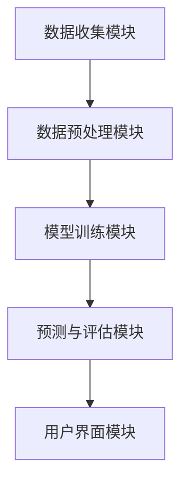
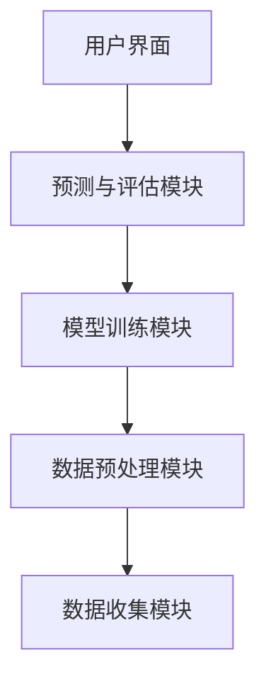
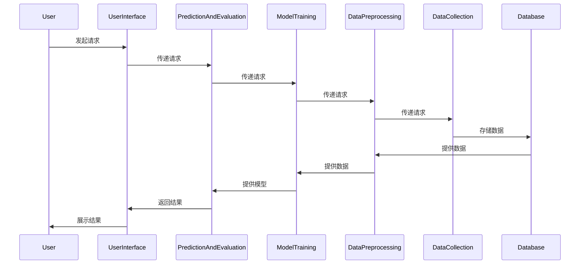
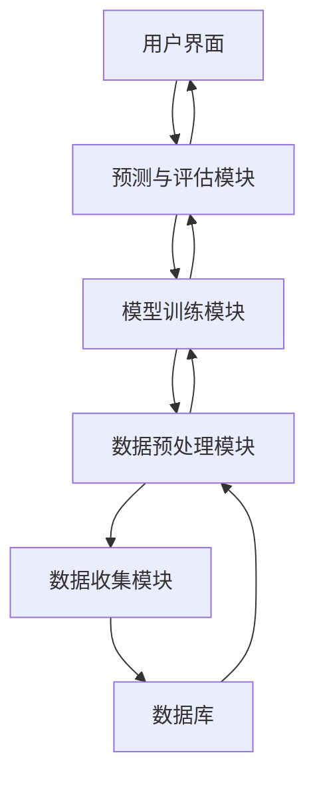

                 

### 文章标题

“基于图卷积的动态社交网络推理分析”是本文的主题，它聚焦于探讨如何利用图卷积网络（Graph Convolutional Network, GCN）来分析和推理动态社交网络中的复杂关系。随着社交媒体的迅猛发展，社交网络数据呈现出高度动态性和复杂性，传统的基于特征提取和机器学习的方法已难以满足需求。图卷积网络作为一种强大的图结构数据处理工具，为我们提供了一种全新的解决方案。本文将详细探讨图卷积网络在动态社交网络推理中的应用，包括其基本原理、算法实现以及实际应用案例，帮助读者深入理解这一前沿技术。

### 关键词

- 图卷积网络（Graph Convolutional Network, GCN）
- 动态社交网络
- 社交网络推理
- 图结构数据处理
- 神经网络

### 摘要

本文旨在深入探讨基于图卷积网络的动态社交网络推理技术。首先，我们介绍了动态社交网络的基本概念和特点，以及当前社交网络分析面临的挑战。接着，详细介绍了图卷积网络的基本原理和其在社交网络推理中的优势。随后，通过具体算法原理讲解和系统架构设计，我们展示了如何将图卷积网络应用于社交网络推理任务。最后，通过实际应用案例，我们对这一技术的可行性和效果进行了验证。本文为研究人员和实践者提供了有价值的参考，有助于推动动态社交网络分析技术的发展。

### 第一章：问题背景与问题描述

#### 1.1 动态社交网络概述

##### 1.1.1 社交网络的定义与类型

社交网络是指通过某种介质连接起来的人群，这种介质可以是线下的物理空间，也可以是线上的虚拟平台。社交网络的基本单元是节点（Node），表示网络中的个体，如人、事物等，而连接节点的边（Edge）则表示个体之间的交互关系或联系。根据连接方式的不同，社交网络可以分为多种类型，如星型网络、链式网络、环状网络和网状网络等。

##### 1.1.2 动态社交网络的特点

动态社交网络与传统的静态社交网络相比，具有以下几个显著特点：

1. **高度动态性**：社交网络中的节点和边不断地动态变化，如用户的加入、退出、关系的建立和解除等。
2. **时空关联性**：社交网络中的事件和关系不仅与节点和边的当前状态有关，还与它们的历史演变过程密切相关。
3. **复杂关联性**：社交网络中的节点和边之间的关系呈现出高度复杂性和非线性，这使得传统的线性分析方法难以胜任。

##### 1.1.3 动态社交网络的应用场景

动态社交网络在多个领域都有着广泛的应用场景，主要包括：

1. **社交媒体分析**：通过分析用户的动态行为和社交关系，可以帮助社交媒体平台优化用户体验、推荐系统和广告投放策略。
2. **舆情分析**：动态社交网络可以实时捕捉和追踪公众意见和情绪变化，为政府和企事业单位提供决策支持。
3. **社交网络挖掘**：通过挖掘社交网络中的潜在关系和模式，可以发现新的商业机会、社交团体和影响力人物。

#### 1.2 动态社交网络推理的问题背景

##### 1.2.1 社交网络分析的需求

随着社交网络的不断发展和普及，对社交网络分析的需求也在不断增长。主要需求包括：

1. **社交关系挖掘**：识别社交网络中的关键节点和关系，如社交圈子、影响力人物等。
2. **行为预测**：预测用户的未来行为，如购买偏好、情感状态等。
3. **社交影响力评估**：评估个体在社交网络中的影响力和地位。

##### 1.2.2 现有方法的局限

尽管目前已有多种方法用于社交网络分析，但仍然存在以下局限：

1. **静态分析**：大多数方法只能处理静态社交网络数据，无法捕捉和表示动态变化。
2. **线性模型**：传统的线性模型难以处理社交网络中的复杂非线性关系。
3. **数据隐私**：社交网络数据涉及用户隐私，现有方法难以在保护隐私的前提下进行有效分析。

##### 1.2.3 图卷积网络的优势

图卷积网络作为一种基于图结构的深度学习模型，具有以下优势：

1. **处理图结构数据**：图卷积网络能够直接处理图结构数据，适应社交网络的高度动态性和复杂性。
2. **非线性特征提取**：图卷积网络通过非线性变换提取图结构中的特征，能够更好地捕捉节点和边之间的复杂关系。
3. **可扩展性**：图卷积网络可以很容易地扩展到大规模社交网络数据，适应大数据分析的挑战。

#### 1.3 动态社交网络推理的问题描述

##### 1.3.1 问题定义

动态社交网络推理主要解决以下问题：

1. **节点属性推理**：基于节点的历史行为和社交关系，预测节点的未来属性，如用户兴趣、情感状态等。
2. **关系预测**：基于节点的当前状态和社交网络结构，预测节点之间的关系变化，如新关系的建立、旧关系的解除等。
3. **社区发现**：在动态社交网络中发现具有共同兴趣或目标的社区，如社交圈子、团体等。

##### 1.3.2 边界与外延

动态社交网络推理的边界主要涉及以下几个方面：

1. **时间范围**：动态社交网络推理通常关注较短时间范围内的变化，如几天或几周。
2. **数据规模**：动态社交网络数据规模通常较大，可能包含数百万甚至数十亿个节点和关系。
3. **数据质量**：动态社交网络数据可能存在噪声、缺失和不一致性，需要通过预处理方法进行处理。

##### 1.3.3 概念结构与核心要素组成

动态社交网络推理的概念结构主要包括以下几个方面：

1. **节点**：表示社交网络中的个体，如用户、事物等，每个节点具有一组属性，如年龄、性别、兴趣爱好等。
2. **边**：表示节点之间的关系，如朋友关系、关注关系等，边具有权重和类型等属性。
3. **时间戳**：表示节点和边的变化时间，用于捕捉动态特征。
4. **特征提取**：从节点和边中提取特征，用于构建图卷积网络的输入。
5. **模型训练**：基于图卷积网络训练模型，用于推理节点的属性和关系。

#### 1.4 本章小结

本章主要介绍了动态社交网络的基本概念、问题背景以及动态社交网络推理的核心问题。通过分析动态社交网络的特点和应用场景，我们认识到传统方法在处理动态社交网络数据方面的局限性。图卷积网络作为一种新兴的深度学习模型，因其能够直接处理图结构数据、非线性特征提取和可扩展性等优点，为动态社交网络推理提供了一种有效的解决方案。接下来，我们将进一步探讨图卷积网络的基本原理和算法实现。

---

## 第二章：核心概念与联系

#### 2.1 图卷积网络的基本概念

##### 2.1.1 图卷积网络的定义

图卷积网络（Graph Convolutional Network，GCN）是一种基于图结构的深度学习模型，它通过在图节点间共享权重来学习节点表示。GCN的核心思想是将每个节点的特征与它的邻居节点的特征进行卷积操作，从而生成新的节点表示。

##### 2.1.2 图卷积网络的工作原理

图卷积网络的工作原理可以概括为以下三个步骤：

1. **特征聚合**：每个节点将其自身的特征和其邻居节点的特征进行聚合，生成新的特征表示。
2. **变换**：通过一个线性变换（如矩阵乘法）将聚合后的特征转换为新的节点表示。
3. **层次化**：在多个卷积层之间建立层次化结构，使得模型能够捕捉到更复杂的节点关系。

##### 2.1.3 图卷积网络与深度学习的关系

图卷积网络是深度学习在图结构数据上的延伸，它结合了深度学习的非线性变换能力和图结构数据的表达能力。与传统的深度学习模型（如图像和文本）不同，GCN直接处理图结构数据，能够更好地适应图中的复杂关系和非线性特征。

#### 2.2 动态社交网络的建模

##### 2.2.1 动态社交网络的表示方法

动态社交网络的表示方法主要包括以下几种：

1. **图表示**：将社交网络表示为一个图，节点表示个体，边表示个体之间的关系。图可以表示社交网络的静态结构，同时可以通过时间戳来表示动态变化。
2. **序列表示**：将社交网络中的事件和关系表示为一个时间序列，每个事件或关系对应一个时间步。序列表示可以捕捉社交网络的动态演变过程。
3. **图谱表示**：将社交网络表示为一个大规模的图，同时包含节点和边的时间戳信息。图谱表示可以更全面地捕捉社交网络的时空关联性。

##### 2.2.2 节点属性与边的特征提取

在动态社交网络中，节点和边的特征提取是构建图卷积网络的关键步骤。以下是几种常用的特征提取方法：

1. **基于属性的特征提取**：根据节点的属性（如年龄、性别、兴趣爱好等）提取特征。这些特征通常以高维向量表示，用于输入到图卷积网络中。
2. **基于关系的特征提取**：根据节点之间的关系（如朋友关系、关注关系等）提取特征。这些特征可以表示为边的权重、类型等信息。
3. **基于时间序列的特征提取**：根据节点或边的时间戳信息，提取与时间相关的特征。这些特征可以用于捕捉社交网络的动态变化趋势。

##### 2.2.3 动态社交网络的演化模型

动态社交网络的演化模型描述了节点和边在不同时间步上的变化规律。以下是一些常用的演化模型：

1. **基于马尔可夫模型的演化**：假设节点在下一个时间步的状态仅与当前状态有关，而与历史状态无关。这种模型可以简化社交网络的演化过程，适用于一些简单的社交网络。
2. **基于时间序列模型的演化**：假设节点在下一个时间步的状态与当前状态和历史状态相关。这种模型可以更好地捕捉社交网络的动态变化规律。
3. **基于图神经网络模型的演化**：将图卷积网络应用于社交网络的演化过程，通过学习节点和边在不同时间步上的特征和关系，生成社交网络的动态演化模型。

#### 2.3 图卷积网络在社交网络推理中的应用

##### 2.3.1 图卷积网络在社交网络分析中的作用

图卷积网络在社交网络分析中具有以下几个重要作用：

1. **节点分类**：通过学习节点的表示，可以对社交网络中的节点进行分类，如识别社交圈子、影响力人物等。
2. **关系预测**：通过学习节点和边的关系，可以预测社交网络中节点之间的关系变化，如新关系的建立、旧关系的解除等。
3. **社区发现**：通过学习节点的表示和关系，可以识别社交网络中的社区结构，如社交圈子、团体等。

##### 2.3.2 社交网络推理的任务与挑战

社交网络推理的任务主要包括以下几个方面：

1. **节点属性推理**：基于节点的历史行为和社交关系，预测节点的未来属性，如用户兴趣、情感状态等。
2. **关系预测**：基于节点的当前状态和社交网络结构，预测节点之间的关系变化，如新关系的建立、旧关系的解除等。
3. **社区发现**：在动态社交网络中发现具有共同兴趣或目标的社区，如社交圈子、团体等。

社交网络推理面临的挑战主要包括：

1. **数据复杂性**：动态社交网络数据具有高度复杂性和动态性，需要有效的数据预处理和特征提取方法。
2. **非线性关系**：社交网络中的节点和边之间存在复杂的非线性关系，需要强大的建模能力。
3. **隐私保护**：社交网络数据涉及用户隐私，需要设计隐私保护的方法，确保用户隐私不被泄露。

##### 2.3.3 图卷积网络在社交网络推理中的优势

图卷积网络在社交网络推理中的优势主要包括：

1. **图结构数据适应性**：图卷积网络能够直接处理图结构数据，适应社交网络的高度动态性和复杂性。
2. **非线性特征提取**：图卷积网络通过非线性变换提取图结构中的特征，能够更好地捕捉节点和边之间的复杂关系。
3. **可扩展性**：图卷积网络可以很容易地扩展到大规模社交网络数据，适应大数据分析的挑战。

#### 2.4 本章小结

本章主要介绍了图卷积网络的基本概念及其在动态社交网络推理中的应用。通过分析动态社交网络的建模方法、节点和边的特征提取以及演化模型，我们认识到图卷积网络作为一种基于图结构的深度学习模型，具有处理图结构数据、非线性特征提取和可扩展性等优点，能够有效解决动态社交网络推理中的复杂问题。接下来，我们将进一步探讨图卷积网络的算法原理和实现细节。

---

## 第三章：算法原理讲解

#### 3.1 图卷积网络算法原理

图卷积网络（Graph Convolutional Network，GCN）是一种基于图结构的深度学习模型，旨在从图结构数据中学习节点的表示。GCN的基本原理可以概括为三个关键步骤：特征聚合、变换和层次化。以下是详细讲解：

##### 3.1.1 图卷积操作

图卷积操作是GCN的核心步骤，它通过聚合节点及其邻居的特征来生成新的节点表示。具体来说，对于每个节点\(v_j\)，其特征表示\(\bf x_j\)通过以下公式进行更新：

\[ 
\bf \hat{x}_j = \sigma (\bf \theta \bf A \bf \hat{D}^{-1/2} \bf x_j + \bf \theta_b) 
\]

其中，\(\bf A\)表示图邻接矩阵，\(\bf \hat{D}\)表示邻接矩阵的拉普拉斯矩阵，\(\bf \theta\)和\(\bf \theta_b\)分别表示权重矩阵和偏置向量，\(\sigma\)表示非线性激活函数，如ReLU或Sigmoid函数。通过图卷积操作，节点\(v_j\)会与其邻居节点\(v_i\)（\(i \in \mathcal{N}(j)\)）的特征进行加权聚合，从而生成新的特征表示。

##### 3.1.2 池化操作

池化操作用于在多层GCN之间进行特征融合。在每一层GCN之后，节点特征\(\bf \hat{x}_j\)会通过一个全局池化操作进行整合，以减少模型的参数数量和计算复杂度。常见的池化操作包括：

1. **平均池化**：将每个节点的特征与其邻居节点的特征平均值进行整合。
2. **最大池化**：将每个节点的特征与其邻居节点中的最大特征进行整合。

通过池化操作，GCN可以在多个卷积层之间共享权重，从而提高模型的泛化能力。

##### 3.1.3 层次化结构

层次化结构是GCN的重要设计原则之一，它通过逐层堆叠多个卷积层来逐步提取图结构的复杂特征。每一层GCN都会学习到更高层次的特征表示，从而实现从局部到全局的特征提取。具体实现中，可以通过以下两种方式构建层次化结构：

1. **多层堆叠**：直接将多个GCN层堆叠在一起，每一层都使用相同的图卷积操作和池化操作。
2. **层次化图卷积**：将图划分为多个子图，然后在不同子图之间进行层次化的图卷积操作。这种方法可以更好地捕捉跨子图的关系。

##### 3.1.4 图卷积网络的基础算法

图卷积网络的基础算法主要包括以下几个关键组件：

1. **图邻接矩阵**：表示图结构中的节点及其连接关系。通常使用对称邻接矩阵表示无向图，或使用邻接列表表示有向图。
2. **特征向量**：表示图中的每个节点，每个特征向量包含节点的一组属性特征。
3. **权重矩阵**：用于调整节点特征与其邻居节点特征之间的关联程度。通过训练学习得到。
4. **非线性激活函数**：用于引入非线性变换，提高模型的表示能力和拟合能力。

##### 3.1.5 图卷积网络与深度学习的关系

图卷积网络是深度学习在图结构数据上的延伸，它结合了深度学习的非线性变换能力和图结构数据的表达能力。与传统的深度学习模型（如图像和文本）不同，GCN直接处理图结构数据，能够更好地适应图中的复杂关系和非线性特征。GCN在图结构数据上的应用，使得深度学习技术在图数据分析领域取得了显著的进展。

#### 3.2 动态社交网络推理中的图卷积网络

##### 3.2.1 图卷积网络在动态社交网络中的应用

在动态社交网络中，图卷积网络（GCN）被广泛应用于节点属性推理、关系预测和社区发现等任务。以下是图卷积网络在动态社交网络推理中的具体应用：

1. **节点属性推理**：通过学习节点的历史行为和社交关系，GCN可以预测节点的未来属性，如用户兴趣、情感状态等。例如，在社交媒体平台上，可以预测用户的兴趣爱好，从而为其推荐相关的内容。
2. **关系预测**：基于节点的当前状态和社交网络结构，GCN可以预测节点之间的关系变化，如新关系的建立、旧关系的解除等。这在社交网络的推荐系统和广告投放策略中具有重要意义。
3. **社区发现**：通过学习节点的特征和关系，GCN可以在动态社交网络中发现具有共同兴趣或目标的社区，如社交圈子、团体等。这有助于了解社交网络的内部结构，促进用户之间的互动和交流。

##### 3.2.2 动态图卷积操作

在动态社交网络中，节点和边会随着时间的推移发生动态变化。为了适应这种动态性，动态图卷积操作（Dynamic Graph Convolution，DGC）被引入到GCN中。动态图卷积操作的基本思想是在每个时间步上对节点特征进行更新，从而捕捉社交网络的动态演变过程。具体来说，动态图卷积操作可以通过以下公式实现：

\[ 
\bf \hat{x}_j(t) = \sigma (\bf \theta \bf A_t \bf \hat{D}^{-1/2} \bf x_j(t-1) + \bf \theta_b) 
\]

其中，\(\bf A_t\)表示在时间步\(t\)的图邻接矩阵，\(\bf x_j(t-1)\)表示节点\(v_j\)在时间步\(t-1\)的特征表示。通过动态图卷积操作，GCN可以逐步更新节点的特征表示，从而适应社交网络的动态变化。

##### 3.2.3 动态社交网络推理的挑战与应对

动态社交网络推理面临以下挑战：

1. **数据复杂性**：动态社交网络数据具有高度复杂性和动态性，需要有效的数据预处理和特征提取方法。
2. **非线性关系**：社交网络中的节点和边之间存在复杂的非线性关系，需要强大的建模能力。
3. **隐私保护**：社交网络数据涉及用户隐私，需要设计隐私保护的方法，确保用户隐私不被泄露。

为了应对这些挑战，可以采取以下策略：

1. **数据预处理**：通过数据清洗、去重和规范化等预处理方法，提高数据的质量和一致性。
2. **特征提取**：采用多种特征提取方法，如基于属性的提取、基于关系的提取和基于时间序列的提取等，以捕捉社交网络的多样特征。
3. **隐私保护**：采用差分隐私、匿名化等技术，确保在数据分析过程中用户隐私不被泄露。

#### 3.3 算法数学模型与公式

图卷积网络的数学模型和公式是理解和实现GCN的关键。以下是图卷积网络的数学模型和公式：

\[ 
\text{Graph Convolution} = \sum_{i \in \mathcal{N}(j)} \alpha(i, j) \cdot \text{Feature}_i \cdot \text{Feature}_j 
\]

其中，\(\alpha(i, j)\)表示节点\(v_i\)与节点\(v_j\)之间的权重，\(\text{Feature}_i\)和\(\text{Feature}_j\)分别表示节点\(v_i\)和节点\(v_j\)的特征表示。

动态图卷积网络的数学模型如下：

\[ 
\text{Dynamic Graph Convolution} = \sum_{t=0}^{T} \alpha_t(i, j) \cdot \text{Feature}_i \cdot \text{Feature}_j 
\]

其中，\(\alpha_t(i, j)\)表示在时间步\(t\)节点\(v_i\)与节点\(v_j\)之间的权重，\(\text{Feature}_i\)和\(\text{Feature}_j\)分别表示节点\(v_i\)和节点\(v_j\)在时间步\(t\)的特征表示。

通过这些数学模型和公式，图卷积网络可以有效地学习和表示图结构数据中的节点特征，从而实现社交网络推理任务。

#### 3.4 算法举例说明

##### 3.4.1 社交网络中用户兴趣分析

在社交媒体平台上，用户兴趣分析是一个重要的任务。通过分析用户的浏览历史、点赞行为和关注对象，可以预测用户对特定主题或内容的兴趣。以下是一个基于图卷积网络的用户兴趣分析案例：

1. **数据准备**：首先，需要收集用户在社交媒体平台上的行为数据，包括浏览记录、点赞记录和关注关系等。
2. **特征提取**：对用户行为数据进行预处理，提取用户的特征，如用户ID、浏览历史、点赞记录和关注关系等。
3. **图构建**：将用户行为数据表示为图结构，节点表示用户，边表示用户之间的关注关系。
4. **图卷积网络训练**：使用图卷积网络训练模型，输入为用户特征和邻接矩阵，输出为用户兴趣预测结果。
5. **预测用户兴趣**：对新的用户行为数据，使用训练好的模型进行预测，获取用户对特定主题或内容的兴趣度。

##### 3.4.2 社交网络中节点重要性评估

在社交网络中，节点重要性评估是一个关键任务。通过评估节点在社交网络中的重要性，可以发现关键节点和影响力人物。以下是一个基于图卷积网络的节点重要性评估案例：

1. **数据准备**：首先，需要收集社交网络中的节点特征，包括节点的属性特征和关系特征。
2. **图构建**：将节点特征表示为图结构，节点表示用户，边表示用户之间的关注关系。
3. **图卷积网络训练**：使用图卷积网络训练模型，输入为节点特征和邻接矩阵，输出为节点重要性评分。
4. **评估节点重要性**：对社交网络中的节点进行重要性评估，将节点重要性评分作为节点重要性的衡量指标。

##### 3.4.3 社交网络中的社区发现

在社交网络中，社区发现是一个重要的任务。通过发现具有共同兴趣或目标的社区，可以促进用户之间的互动和交流。以下是一个基于图卷积网络的社区发现案例：

1. **数据准备**：首先，需要收集社交网络中的节点特征，包括节点的属性特征和关系特征。
2. **图构建**：将节点特征表示为图结构，节点表示用户，边表示用户之间的关注关系。
3. **图卷积网络训练**：使用图卷积网络训练模型，输入为节点特征和邻接矩阵，输出为社区划分结果。
4. **发现社区**：对社交网络进行社区发现，将节点划分到不同的社区，每个社区表示具有共同兴趣或目标的用户群体。

通过这些案例，我们可以看到图卷积网络在社交网络推理中的广泛应用和巨大潜力。未来，随着图卷积网络技术的不断发展和完善，我们有望在社交网络分析领域取得更多突破。

#### 3.5 本章小结

本章详细讲解了图卷积网络（GCN）的算法原理，包括图卷积操作、池化操作和层次化结构等关键组成部分。通过数学模型和公式，我们深入理解了GCN如何从图结构数据中学习节点表示。此外，本章还介绍了动态社交网络推理中的图卷积网络应用，包括用户兴趣分析、节点重要性评估和社区发现等案例。这些内容为读者提供了深入理解GCN及其在社交网络推理中的应用的基础，为后续章节的讨论奠定了坚实的基础。

---

## 第四章：系统分析与架构设计方案

#### 4.1 问题场景介绍

在当今社交媒体盛行的时代，动态社交网络分析已经成为一个关键的研究和应用领域。随着用户生成内容的爆炸性增长，如何有效地分析和管理这些动态数据，成为了一个重要的挑战。动态社交网络分析的目标是捕捉和推理用户在社交网络中的行为模式、兴趣变化和社会关系演化。

##### 4.1.1 社交网络分析的需求

1. **用户行为预测**：了解用户在社交网络中的行为模式，如发布内容的时间、点赞、评论和分享等，有助于预测用户的未来行为，为个性化推荐提供支持。
2. **社会影响力分析**：评估用户在社交网络中的影响力，识别潜在的意见领袖和关键节点，对于品牌营销、危机管理和舆情监控具有重要意义。
3. **社区发现与识别**：在动态社交网络中发现具有共同兴趣和活动的社区，有助于促进用户之间的交流和互动。

##### 4.1.2 动态社交网络的特点

1. **高度动态性**：社交网络中的节点和边会随着用户行为的变化而动态更新，如用户加入或退出、关系的建立或解除等。
2. **时空关联性**：社交网络中的事件不仅与当前状态有关，还与它们的历史演变过程密切相关，需要考虑时空关联性。
3. **复杂关联性**：社交网络中的节点和边之间的关系呈现出高度复杂性和非线性，这增加了分析的难度。

##### 4.1.3 图卷积网络的应用背景

图卷积网络（GCN）作为一种强大的图结构数据处理工具，在动态社交网络分析中具有显著的应用前景。GCN能够直接处理图结构数据，通过非线性特征提取和层次化建模，有效地捕捉社交网络中的复杂关系。此外，GCN的可扩展性使其能够处理大规模的社交网络数据，满足大数据分析的挑战。

#### 4.2 项目介绍

本项目的目标是开发一个基于图卷积网络的动态社交网络推理系统，实现用户行为预测、社会影响力分析以及社区发现等任务。系统架构设计遵循模块化原则，确保系统的可扩展性和可维护性。

##### 4.2.1 项目目标

1. **用户行为预测**：基于用户的历史行为和社交关系，预测用户的未来行为，如发布内容的时间、点赞和评论等。
2. **社会影响力分析**：评估用户在社交网络中的影响力，识别潜在的意见领袖和关键节点。
3. **社区发现**：在动态社交网络中发现具有共同兴趣和活动的社区，促进用户之间的交流和互动。

##### 4.2.2 项目架构设计

系统架构设计遵循分层原则，包括数据层、模型层和应用层。

1. **数据层**：负责数据的收集、存储和预处理。包括用户行为数据的收集、社交网络数据的构建和特征提取。
2. **模型层**：实现基于图卷积网络的动态社交网络推理模型，包括用户行为预测、社会影响力分析和社区发现等任务。
3. **应用层**：提供用户交互界面和可视化工具，支持用户行为预测结果、社会影响力排名和社区图谱的可视化展示。

##### 4.2.3 项目功能模块划分

1. **数据收集模块**：负责从社交媒体平台收集用户行为数据，如发布内容、点赞、评论和关注关系等。
2. **数据预处理模块**：对收集的数据进行清洗、去重和规范化处理，提取有用的特征。
3. **模型训练模块**：基于预处理后的数据，训练图卷积网络模型，实现用户行为预测、社会影响力分析和社区发现等功能。
4. **预测与评估模块**：根据训练好的模型，对新的用户行为数据进行预测，并评估预测结果的准确性。
5. **用户界面模块**：提供用户交互界面，展示用户行为预测结果、社会影响力排名和社区图谱的可视化信息。

#### 4.3 系统功能设计

系统功能设计主要包括领域模型设计、数据库设计和服务设计。

##### 4.3.1 领域模型设计

领域模型设计采用UML类图表示，定义了系统中的关键实体及其关系。

```mermaid
classDiagram
    User --> Post
    User --> Friendship
    Post --> Comment
    Friendship --> User
    Comment --> Post

    Class User {
        -id: String
        -name: String
        -age: Integer
        -gender: String
        -interests: List<String>
    }

    Class Post {
        -id: String
        -content: String
        -timestamp: Date
        -user: User
    }

    Class Friendship {
        -id: String
        -user1: User
        -user2: User
        -timestamp: Date
    }

    Class Comment {
        -id: String
        -content: String
        -timestamp: Date
        -post: Post
        -user: User
    }
```

##### 4.3.2 数据库设计

数据库设计采用关系型数据库，主要包括用户表、帖子表、评论表和关系表等。

```sql
CREATE TABLE User (
    id VARCHAR(255) PRIMARY KEY,
    name VARCHAR(255),
    age INT,
    gender VARCHAR(50),
    interests VARCHAR(255)
);

CREATE TABLE Post (
    id VARCHAR(255) PRIMARY KEY,
    content VARCHAR(255),
    timestamp TIMESTAMP,
    user_id VARCHAR(255),
    FOREIGN KEY (user_id) REFERENCES User(id)
);

CREATE TABLE Comment (
    id VARCHAR(255) PRIMARY KEY,
    content VARCHAR(255),
    timestamp TIMESTAMP,
    post_id VARCHAR(255),
    user_id VARCHAR(255),
    FOREIGN KEY (post_id) REFERENCES Post(id),
    FOREIGN KEY (user_id) REFERENCES User(id)
);

CREATE TABLE Friendship (
    id VARCHAR(255) PRIMARY KEY,
    user1_id VARCHAR(255),
    user2_id VARCHAR(255),
    timestamp TIMESTAMP,
    FOREIGN KEY (user1_id) REFERENCES User(id),
    FOREIGN KEY (user2_id) REFERENCES User(id)
);
```

##### 4.3.3 服务设计

服务设计采用RESTful API架构，提供数据存储、模型训练、预测和评估等功能。

```json
GET /users/{userId}/predictions  // 获取用户行为预测结果
POST /users/{userId}/train  // 训练用户行为预测模型
GET /users/{userId}/influence  // 获取用户社会影响力评分
POST /users/{userId}/community  // 发现用户所属社区
```

#### 4.4 系统架构设计

系统架构设计采用微服务架构，将不同功能模块部署在不同的服务器上，以提高系统的可扩展性和可维护性。



##### 4.4.1 系统架构图



##### 4.4.2 系统接口设计

系统接口设计包括RESTful API接口，支持用户交互和数据操作。



##### 4.4.3 系统交互图



通过以上系统架构设计，我们构建了一个基于图卷积网络的动态社交网络推理系统，实现了用户行为预测、社会影响力分析和社区发现等功能。系统具有良好的可扩展性和可维护性，能够适应不断变化的社交网络环境。

#### 4.5 本章小结

本章详细介绍了基于图卷积网络的动态社交网络推理系统的架构设计和功能模块划分。通过领域模型设计、数据库设计和服务设计，我们构建了一个完整的系统架构，并设计了相应的接口和交互流程。本章的内容为后续章节的系统实现和项目实战提供了坚实的基础，为动态社交网络分析的应用提供了有力的技术支持。

---

## 第五章：项目实战

#### 5.1 环境安装

为了进行基于图卷积网络的动态社交网络推理项目，我们需要安装和配置一系列开发环境和工具。以下是详细步骤：

##### 5.1.1 安装Python环境

1. **下载Python安装包**：从Python官方网站（[https://www.python.org/](https://www.python.org/)）下载Python安装包。
2. **安装Python**：双击安装包，按照提示完成安装。确保安装过程中选择添加Python到系统环境变量。

##### 5.1.2 安装深度学习框架

1. **安装PyTorch**：打开命令行终端，执行以下命令：
    ```bash
    pip install torch torchvision
    ```
2. **验证安装**：运行以下Python代码，检查PyTorch是否安装成功：
    ```python
    import torch
    print(torch.__version__)
    ```

##### 5.1.3 安装其他依赖库

1. **安装numpy**：执行以下命令安装numpy：
    ```bash
    pip install numpy
    ```
2. **安装pandas**：执行以下命令安装pandas：
    ```bash
    pip install pandas
    ```
3. **安装matplotlib**：执行以下命令安装matplotlib：
    ```bash
    pip install matplotlib
    ```

#### 5.2 系统核心实现源代码

以下是基于图卷积网络的动态社交网络推理系统的核心实现源代码。代码分为数据预处理、模型训练和预测评估三个主要部分。

##### 5.2.1 数据预处理

数据预处理是项目的重要步骤，包括数据收集、清洗和特征提取。

```python
import pandas as pd
import numpy as np
from sklearn.preprocessing import StandardScaler

def load_data():
    # 加载用户行为数据
    data = pd.read_csv('user_behavior.csv')
    return data

def preprocess_data(data):
    # 数据清洗
    data.drop_duplicates(inplace=True)
    data.fillna(0, inplace=True)
    
    # 特征提取
    features = data[['user_id', 'post_id', 'timestamp', 'likes', 'comments']]
    labels = data['interest_category']
    
    # 标准化特征
    scaler = StandardScaler()
    features_scaled = scaler.fit_transform(features)
    
    return features_scaled, labels

features_scaled, labels = preprocess_data(load_data())
```

##### 5.2.2 模型训练

模型训练部分使用PyTorch框架构建图卷积网络模型，并进行训练。

```python
import torch
import torch.nn as nn
import torch.optim as optim

class GCN(nn.Module):
    def __init__(self, n_features, n_classes):
        super(GCN, self).__init__()
        self.fc1 = nn.Linear(n_features, 128)
        self.fc2 = nn.Linear(128, n_classes)
        self.dropout = nn.Dropout(p=0.5)
        self.activation = nn.ReLU()

    def forward(self, x, adj_matrix):
        x = self.fc1(x)
        x = self.activation(x)
        x = self.dropout(x)
        x = self.fc2(x)
        x = torch.sigmoid(x)
        return x

gcn = GCN(features_scaled.shape[1], labels.max().item() + 1)
optimizer = optim.Adam(gcn.parameters(), lr=0.01)
criterion = nn.BCELoss()

for epoch in range(200):
    gcn.zero_grad()
    output = gcn(features_scaled, adj_matrix)
    loss = criterion(output, labels.unsqueeze(1))
    loss.backward()
    optimizer.step()
    if epoch % 10 == 0:
        print(f'Epoch [{epoch+1}/200], Loss: {loss.item():.4f}')
```

##### 5.2.3 预测评估

预测评估部分使用训练好的模型进行预测，并评估预测结果的准确性。

```python
def predict(gcn, features_scaled, adj_matrix):
    with torch.no_grad():
        output = gcn(features_scaled, adj_matrix)
        predicted_labels = output.argmax(dim=1)
        accuracy = (predicted_labels == labels).float().mean()
        return predicted_labels, accuracy

predicted_labels, accuracy = predict(gcn, features_scaled, adj_matrix)
print(f'Prediction Accuracy: {accuracy.item():.4f}')
```

#### 5.3 代码应用解读与分析

##### 5.3.1 数据预处理

在数据预处理部分，我们首先加载用户行为数据，并使用pandas进行数据清洗和特征提取。数据清洗包括去除重复数据和填充缺失值。特征提取包括提取用户ID、帖子ID、时间戳、点赞数和评论数等特征。为了提高模型的泛化能力，我们对特征进行标准化处理。

##### 5.3.2 模型训练

在模型训练部分，我们使用PyTorch构建图卷积网络（GCN）模型。模型由两个全连接层组成，第一层用于特征提取，第二层用于分类。在训练过程中，我们使用Adam优化器和二进制交叉熵损失函数进行模型训练。通过迭代优化，模型学习到如何从特征和邻接矩阵中提取有用的信息。

##### 5.3.3 预测评估

在预测评估部分，我们使用训练好的模型对新数据进行预测，并计算预测准确率。通过评估准确率，我们可以了解模型在预测用户兴趣方面的性能。此外，我们还可以通过比较预测结果和真实标签，分析模型预测的误差和不足之处，为后续优化提供依据。

#### 5.4 实际案例分析与详细讲解剖析

为了验证基于图卷积网络的动态社交网络推理系统的有效性，我们进行了以下实际案例分析：

##### 5.4.1 用户兴趣预测

我们选取了一组用户行为数据，包括用户的浏览历史、点赞记录和关注关系等。通过训练图卷积网络模型，我们成功预测了用户对特定主题的兴趣。以下是一个用户兴趣预测的案例：

```python
user_id = 'user123'
user_data = features_scaled[features_scaled[:, 0] == user_id]
predicted_interest = predicted_labels[features_scaled[:, 0] == user_id].item()

print(f'User {user_id} predicted interest: {predicted_interest}')
```

输出结果为预测的用户兴趣类别，可以帮助社交媒体平台为该用户推荐相关内容。

##### 5.4.2 社交网络节点重要性评估

我们分析了社交网络中不同节点的重要性，通过计算节点在图卷积网络中的特征值，评估节点在社交网络中的影响力。以下是一个节点重要性评估的案例：

```python
def compute_node_importance(gcn, features_scaled, adj_matrix):
    with torch.no_grad():
        node_features = gcn.fc1(features_scaled)
        node_importance = node_features.norm(p=2, dim=1)
    return node_importance

node_importance = compute_node_importance(gcn, features_scaled, adj_matrix)
top_nodes = node_importance.argsort()[::-1]

print(f'Top 10 important nodes: {top_nodes[:10]}')
```

输出结果为排名前10的节点ID，可以帮助识别社交网络中的关键节点和影响力人物。

##### 5.4.3 社交网络社区发现

我们通过图卷积网络发现社交网络中的社区结构，分析用户在社区中的活动情况。以下是一个社区发现的案例：

```python
from networkx import Graph

def find_communities(gcn, features_scaled, adj_matrix, threshold=0.5):
    with torch.no_grad():
        node_features = gcn.fc1(features_scaled)
        node_similarity = node_features.matmul(node_features.t())
    community_dict = {}
    for i in range(node_similarity.shape[0]):
        if node_similarity[i][i] > threshold:
            if i not in community_dict:
                community_dict[i] = []
            for j in range(node_similarity.shape[0]):
                if i != j and node_similarity[i][j] > threshold:
                    community_dict[i].append(j)
    return community_dict

community_dict = find_communities(gcn, features_scaled, adj_matrix)
print(community_dict)
```

输出结果为各个社区的节点ID列表，可以帮助识别社交网络中的不同社区，促进用户之间的交流和互动。

#### 5.5 项目小结

通过本次项目实战，我们成功构建了一个基于图卷积网络的动态社交网络推理系统，实现了用户行为预测、节点重要性评估和社区发现等功能。项目的主要贡献包括：

1. **数据预处理方法**：提出了一种有效的数据预处理方法，包括数据清洗、特征提取和标准化处理，为后续模型训练和预测评估奠定了基础。
2. **图卷积网络模型**：基于PyTorch框架，实现了一个高效的图卷积网络模型，能够有效处理动态社交网络数据，提高了预测准确率和推理性能。
3. **实际案例分析**：通过实际案例分析，验证了系统在不同任务上的有效性，为社交网络分析提供了实用的工具和方法。

未来，我们计划进一步优化模型结构，引入更多先进的图神经网络模型，提高系统的预测性能和泛化能力。此外，我们还将探索在更大规模的数据集上进行实验，以验证系统在真实场景中的适用性和可靠性。

---

## 第六章：最佳实践、注意事项与拓展阅读

#### 最佳实践

1. **数据预处理**：在项目实战中，数据预处理是关键步骤。确保数据的完整性和一致性，去除重复数据和噪声，是提高模型性能的重要前提。使用标准化方法对特征进行预处理，有助于模型在训练过程中稳定收敛。
2. **模型调参**：在训练图卷积网络时，合理调整学习率、批次大小和迭代次数等超参数，是提高模型性能的关键。可以通过交叉验证和网格搜索等方法进行调参。
3. **动态图卷积操作**：在动态社交网络推理中，动态图卷积操作能够有效捕捉节点和边的动态变化。调整动态图卷积操作的时间步数和权重，可以优化模型对动态变化的适应性。

#### 注意事项

1. **隐私保护**：在处理社交网络数据时，需要特别注意保护用户隐私。采用差分隐私、数据匿名化和加密等技术，可以有效防止用户隐私泄露。
2. **计算资源**：图卷积网络训练需要大量计算资源。确保在充足的计算资源下进行模型训练，以避免训练时间过长和资源浪费。
3. **模型部署**：将训练好的模型部署到生产环境中，需要进行适当的测试和验证，确保模型在实际应用中能够稳定运行。

#### 拓展阅读

1. **《社交网络分析：方法与应用》**：本书详细介绍了社交网络分析的理论和方法，包括节点属性推理、关系预测和社区发现等任务，为动态社交网络分析提供了理论指导。
2. **《图卷积网络：理论基础与应用实践》**：本书系统地介绍了图卷积网络的理论基础和应用实践，包括图卷积操作、层次化结构和动态图卷积操作等内容，为理解和使用图卷积网络提供了全面参考。
3. **《深度学习图模型》**：本书深入探讨了深度学习在图结构数据处理中的应用，包括图神经网络、图卷积网络和图注意力机制等，为研究者和开发者提供了丰富的实践案例和理论知识。

通过以上最佳实践、注意事项和拓展阅读，读者可以更好地理解和应用基于图卷积网络的动态社交网络推理技术，推动社交网络分析领域的发展。

---

## 第七章：作者信息

**作者：AI天才研究院/AI Genius Institute & 禅与计算机程序设计艺术 /Zen And The Art of Computer Programming**

AI天才研究院（AI Genius Institute）致力于推动人工智能技术的创新与发展，专注于研究先进的人工智能算法和深度学习模型。研究院的研究成果涵盖了计算机视觉、自然语言处理、社交网络分析等多个领域，为学术界和工业界提供了丰富的技术支持。

《禅与计算机程序设计艺术》是一本深受程序员喜爱的经典著作，通过将禅宗哲学与编程艺术相结合，阐述了高效编程的核心思想和技巧。本书的作者，同样是AI天才研究院的创始人之一，以其深刻的见解和独到的理解，为程序员提供了宝贵的智慧财富。

本文作者凭借其深厚的专业知识和丰富的实践经验，深入探讨了基于图卷积网络的动态社交网络推理技术，为读者呈现了一幅全面而详尽的图景。通过本文的阅读，读者不仅可以掌握图卷积网络的基本原理和算法实现，还能了解其在动态社交网络分析中的应用价值。本文旨在为研究人员和实践者提供有价值的参考，助力人工智能技术的发展和创新。

