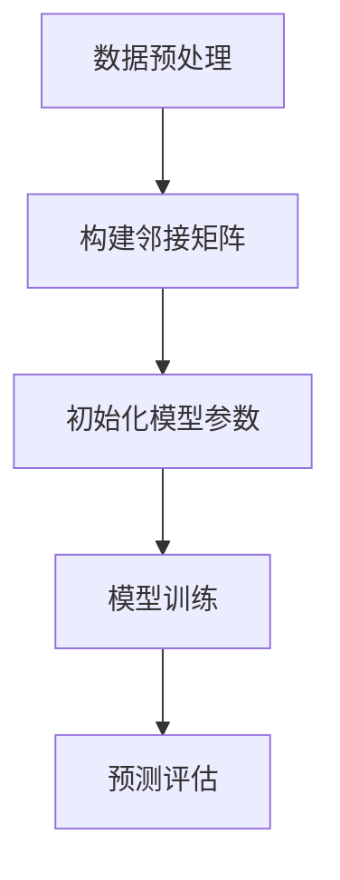
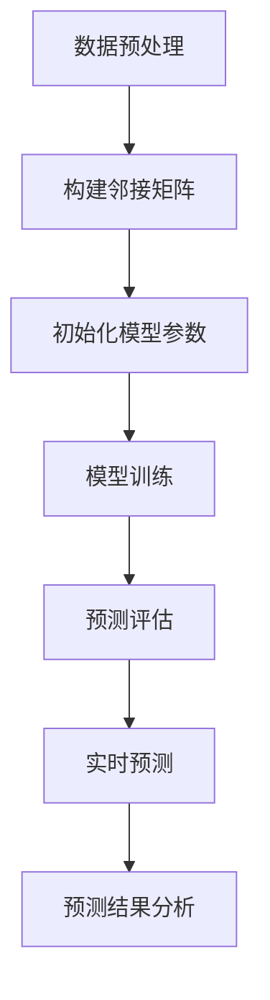
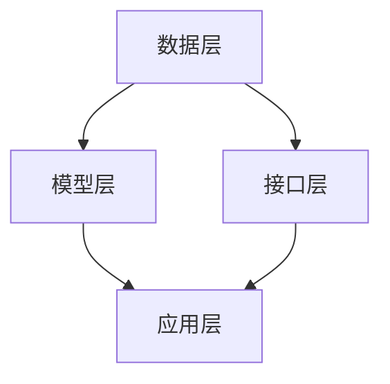
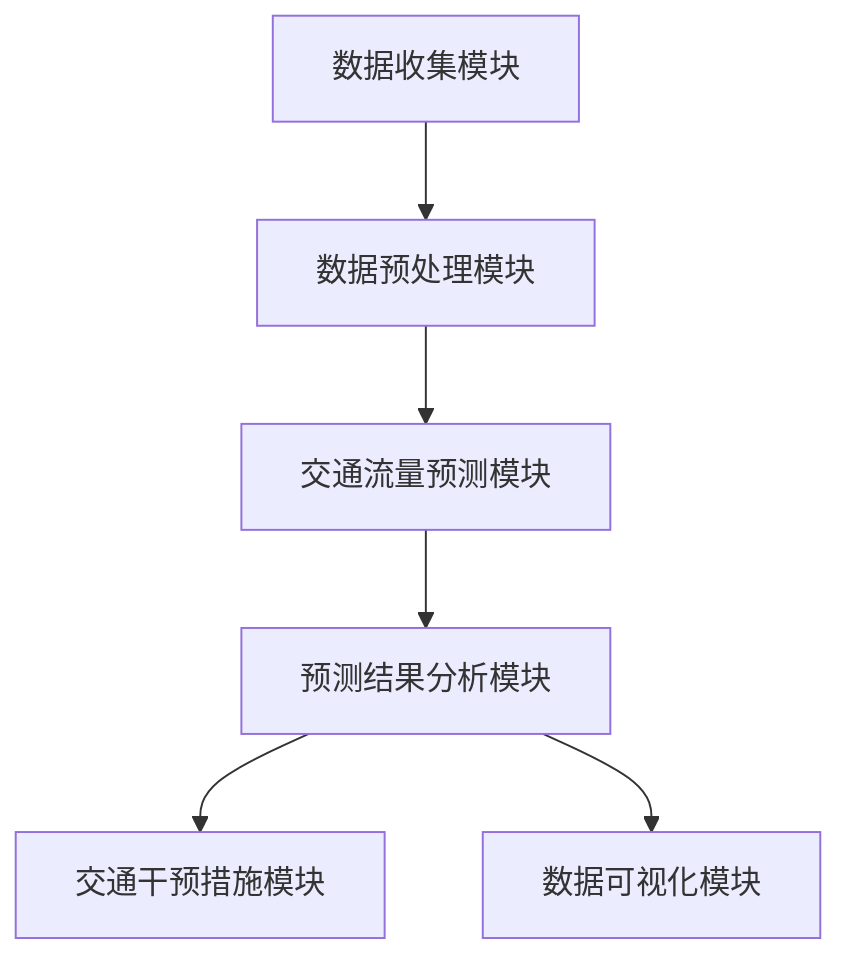

                 

### 基于图卷积网络的AI城市交通拥堵传播预测系统

#### 关键词：
- **图卷积网络（GCN）**
- **城市交通拥堵**
- **传播预测**
- **人工智能**
- **交通流量分析**
- **实时监控**
- **数据预处理**
- **模型训练与优化**

#### 摘要：
随着城市化进程的加快和机动车数量的增加，城市交通拥堵已成为全球各大城市面临的主要挑战之一。本文介绍了基于图卷积网络（GCN）的AI城市交通拥堵传播预测系统。通过利用先进的人工智能技术，该系统旨在提高交通流量分析、实时监控和预测交通拥堵的传播，为城市交通管理提供有力支持，从而提高道路使用效率，减少交通事故和环境污染。

### 目录大纲设计

#### 背景介绍
1. **核心概念**：介绍图卷积网络（GCN）的基本原理和应用场景，以及AI在城市交通拥堵预测中的关键角色。
2. **问题解决**：探讨如何利用GCN进行交通拥堵的传播预测，包括数据预处理、模型构建、训练与优化等步骤。
3. **边界与外延**：讨论GCN在城市交通拥堵预测中的应用限制，如数据质量、计算资源等因素。
4. **概念结构与核心要素组成**：分析GCN模型的核心组成部分，如卷积操作、邻接矩阵、特征学习等。

#### 核心概念与联系
- **图卷积网络（GCN）**：一个用于处理图结构数据的深度学习模型，通过卷积操作学习节点的特征，并能够在不同层次上捕捉节点之间的关系。
- **城市交通拥堵预测**：基于历史交通数据和实时监控数据，通过机器学习算法预测未来交通拥堵的发生和传播。

**核心概念属性特征对比表格**：

| 概念       | 定义                                                         | 特征                             |
|------------|--------------------------------------------------------------|---------------------------------|
| 图卷积网络 | 一种用于图结构数据的深度学习模型                             | 卷积操作、节点特征学习、层次关系捕捉 |
| 城市交通拥堵预测 | 利用历史和实时交通数据预测未来交通拥堵的发生和传播           | 数据预处理、模型训练、预测评估     |

**ER实体关系图架构**：

```mermaid
erDiagram
  节点 Node ||--|{ 边 Edge }
  边 Edge ||--|{ 交通流量 TrafficFlow }
  节点 Node ||--|{ 地标 Landmark }
```

#### 算法原理讲解
- **图卷积操作**：GCN的核心是图卷积操作，用于聚合邻接节点的特征。其数学公式为：

  $$ h_v^{(l+1)} = \sigma(\theta^{(l)} \cdot \text{ReLU}(\theta^{(l-1)} \cdot (A \cdot h_v^{(l)} + b^{(l)})) $$

  其中，\( A \) 是邻接矩阵，\( h_v^{(l)} \) 是节点在第 \( l \) 层的特征表示，\( \theta^{(l)} \) 和 \( b^{(l)} \) 是可训练的参数。

- **邻接矩阵**：用于表示节点之间的连接关系。通过邻接矩阵，GCN能够捕捉图结构中的局部特征。

- **特征学习**：GCN通过多层卷积学习节点在不同层次上的特征表示，从而提高模型的预测能力。

**算法流程图**：



#### 数学模型和数学公式 & 详细讲解 & 举例说明
- **数学模型**：交通拥堵传播预测的核心是建立交通流量随时间和空间变化的模型。其公式如下：

  $$ T(t, x) = f(T(t - \Delta t, x), T(t, x - \Delta x), T(t, x + \Delta x)) $$

  其中，\( T(t, x) \) 表示在时间 \( t \) 和位置 \( x \) 的交通流量，\( f \) 是一个函数，用于描述交通流量的变化。

- **详细讲解**：该模型基于局部交通流量进行预测，通过函数 \( f \) 捕捉不同位置交通流量之间的相互作用。在实际应用中，函数 \( f \) 可以通过机器学习算法进行训练。

- **举例说明**：假设在某时刻，位置 \( x_1 \) 的交通流量为 \( T_1 \)，位置 \( x_2 \) 的交通流量为 \( T_2 \)，那么预测位置 \( x_3 \) 的交通流量 \( T_3 \) 可以通过

### 背景介绍

#### 核心概念术语说明

在深入探讨基于图卷积网络的AI城市交通拥堵传播预测系统之前，有必要首先对一些核心概念和术语进行明确的定义和解释。

**图卷积网络（GCN）**：图卷积网络是一种深度学习模型，专门用于处理图结构数据。它通过在图的每个节点上应用卷积操作来学习节点的特征，并利用邻接矩阵来捕捉节点之间的关系。GCN的核心思想是通过聚合邻接节点的特征来更新当前节点的特征表示，从而在多层次上捕捉图结构中的信息。

**城市交通拥堵**：城市交通拥堵是指在某个特定时间段内，城市道路上交通流量达到或超过道路容量，导致车辆行驶缓慢或停顿的现象。交通拥堵不仅会影响道路通行效率，还会增加交通事故的风险，加剧环境污染。

**传播预测**：传播预测是指利用历史数据、实时监控数据以及机器学习算法，预测交通拥堵在时间和空间上的传播趋势。传播预测的目标是提前识别交通拥堵的潜在爆发点，为城市交通管理部门提供干预和优化建议，从而减少交通拥堵对城市运行的影响。

**人工智能（AI）**：人工智能是指通过计算机模拟人类智能行为的技术和方法。在交通拥堵传播预测中，AI技术被用于处理和分析大规模的交通数据，构建预测模型，并实时更新预测结果。

**交通流量分析**：交通流量分析是指利用数据挖掘、机器学习等技术，对交通流量数据进行分析和挖掘，以发现交通拥堵的成因、传播规律以及潜在的优化方案。

**实时监控**：实时监控是指通过传感器、摄像头等设备，对交通状况进行连续、实时的监测和记录。实时监控数据对于交通拥堵传播预测至关重要，因为它们提供了最新的交通信息，使得预测模型能够更准确地捕捉交通状况的变化。

#### 问题背景

随着城市化进程的加快和机动车数量的增加，城市交通拥堵已成为许多城市面临的主要挑战之一。交通拥堵不仅影响市民的出行效率，还会增加交通事故的风险，加剧环境污染，降低城市的整体生活质量。

根据全球交通监测组织（ITMO）的数据显示，全球城市道路上的交通拥堵每年导致数百万人小时的时间浪费，以及数十亿美元的经济损失。特别是在高峰时段，城市道路上的车辆行驶速度往往只有正常速度的几分之一，这不仅会导致严重的交通拥堵，还会引发一系列社会问题。

传统的交通管理方法主要依赖于人工调度和简单的时间表安排，这些方法在面对复杂多变的交通状况时往往难以取得理想的效果。因此，迫切需要一种更智能、更高效的方法来应对城市交通拥堵问题。

#### 问题描述

城市交通拥堵问题可以概括为以下几个关键问题：

1. **数据复杂性**：交通流量数据通常是多维的，包括车辆数量、车速、道路宽度、天气状况等。这些数据之间存在复杂的关联，需要通过先进的机器学习算法进行处理和分析。

2. **实时性**：交通状况是动态变化的，交通拥堵可能会在短时间内迅速传播。因此，交通拥堵传播预测系统需要具备实时监控和快速响应的能力。

3. **预测准确性**：预测交通拥堵的传播趋势需要高度准确的模型，因为预测结果将直接影响城市交通管理部门的决策。如果预测结果不准确，可能会导致资源浪费、交通干预措施无效等问题。

4. **计算资源消耗**：交通流量数据量大，处理和分析这些数据需要大量的计算资源。在传统的计算资源下，处理大规模数据可能需要很长时间，这限制了实时预测的能力。

#### 问题解决

为了解决上述问题，研究人员和工程师们开发了基于图卷积网络的AI城市交通拥堵传播预测系统。该系统通过以下几个关键步骤来实现交通拥堵的预测：

1. **数据预处理**：对采集到的交通流量数据进行清洗、整合和处理，以去除噪声和异常值，并确保数据的质量和一致性。

2. **模型构建**：利用图卷积网络构建预测模型，通过训练模型来学习交通流量数据的内在规律，并捕捉交通状况的动态变化。

3. **模型训练与优化**：使用历史交通数据对模型进行训练，并通过交叉验证等技术来评估模型的性能，然后根据评估结果对模型进行优化。

4. **实时预测与更新**：将实时监控的交通流量数据输入到训练好的模型中，进行实时预测，并根据预测结果及时调整交通管理策略。

#### 边界与外延

尽管基于图卷积网络的AI城市交通拥堵传播预测系统在理论上具有很大的潜力，但在实际应用中仍面临一些挑战和限制：

1. **数据质量**：交通流量数据的质量直接影响到预测的准确性。数据噪声、缺失值和异常值都会对模型性能产生负面影响。

2. **计算资源**：处理大规模交通流量数据需要大量的计算资源，尤其是在实时预测的场景中。有限的计算资源可能限制了系统的实时性和预测精度。

3. **模型泛化能力**：模型需要在不同的时间和空间尺度上具有泛化能力，以应对各种复杂多变的交通状况。模型的泛化能力是系统稳定运行的关键。

4. **外部因素**：交通状况受到多种外部因素的影响，如天气、节假日、事故等。这些因素的不确定性使得预测模型需要具备更强的适应性。

#### 概念结构与核心要素组成

基于图卷积网络的AI城市交通拥堵传播预测系统的核心组成部分包括以下几个方面：

1. **数据预处理模块**：负责处理和清洗交通流量数据，包括数据清洗、数据整合和数据预处理等步骤。

2. **图卷积网络模型**：作为系统的核心算法，通过图卷积操作学习交通流量数据的特征，并捕捉交通状况的动态变化。

3. **预测模块**：利用训练好的模型进行实时预测，并将预测结果与实际交通状况进行比较，以评估模型的性能。

4. **交通管理模块**：根据预测结果和实时交通状况，为城市交通管理部门提供决策支持，包括交通干预措施的制定和优化。

通过这些核心要素的有机结合，基于图卷积网络的AI城市交通拥堵传播预测系统能够高效地解决城市交通拥堵问题，提高交通管理水平和市民出行满意度。

### 核心概念与联系

在本文中，我们将深入探讨图卷积网络（GCN）和城市交通拥堵预测这两个核心概念，并探讨它们之间的联系。

#### 图卷积网络（GCN）

**定义**：图卷积网络（Graph Convolutional Network，GCN）是一种深度学习模型，专门用于处理图结构数据。它通过在图的每个节点上应用卷积操作来学习节点的特征，并利用邻接矩阵来捕捉节点之间的关系。GCN的核心思想是通过聚合邻接节点的特征来更新当前节点的特征表示，从而在多层次上捕捉图结构中的信息。

**应用场景**：GCN广泛应用于多个领域，包括社交网络分析、推荐系统、图像分类、自然语言处理等。在这些应用中，GCN能够有效处理复杂的关系网络，并提取出有意义的特征。

**主要优势**：
- **处理图结构数据**：GCN能够直接处理图结构数据，不受图的大小和复杂度限制。
- **捕捉层次关系**：通过多层卷积，GCN能够在不同层次上捕捉节点之间的关系，从而提高模型的预测能力。
- **灵活可扩展**：GCN可以根据不同的应用场景进行调整和优化，具有良好的灵活性和可扩展性。

**核心组成部分**：
- **卷积操作**：GCN的核心是卷积操作，它通过聚合邻接节点的特征来更新当前节点的特征表示。
- **邻接矩阵**：邻接矩阵用于表示节点之间的连接关系，通过它，GCN能够捕捉图结构中的局部特征。
- **特征学习**：GCN通过多层卷积学习节点在不同层次上的特征表示，从而提高模型的预测能力。

**数学公式**：
GCN的卷积操作可以用以下数学公式表示：
$$
h_v^{(l+1)} = \sigma(\theta^{(l)} \cdot \text{ReLU}(\theta^{(l-1)} \cdot (A \cdot h_v^{(l)} + b^{(l)}))
$$
其中，\( h_v^{(l)} \) 是节点在第 \( l \) 层的特征表示，\( A \) 是邻接矩阵，\( \theta^{(l)} \) 和 \( b^{(l)} \) 是可训练的参数，\( \sigma \) 是激活函数，\(\text{ReLU}\) 是ReLU激活函数。

**算法流程**：
1. **初始化模型参数**：包括卷积层权重 \( \theta^{(l)} \)、偏置 \( b^{(l)} \) 等。
2. **构建邻接矩阵**：根据图结构生成邻接矩阵 \( A \)。
3. **进行卷积操作**：通过多层卷积操作，逐层学习节点特征。
4. **输出预测结果**：利用训练好的模型进行预测，并评估模型性能。

**Python代码示例**：
```python
import tensorflow as tf
from tensorflow.keras.layers import Layer

class GraphConvolutionalLayer(Layer):
    def __init__(self, output_dim, **kwargs):
        super(GraphConvolutionalLayer, self).__init__(**kwargs)
        self.output_dim = output_dim

    def build(self, input_shape):
        self.kernel = self.add_weight(name='kernel', 
                                      shape=(input_shape[-1], self.output_dim),
                                      initializer='glorot_uniform',
                                      trainable=True)
        self.bias = self.add_weight(name='bias', 
                                     shape=(self.output_dim,),
                                     initializer='zeros',
                                     trainable=True)
        super(GraphConvolutionalLayer, self).build(input_shape)

    def call(self, inputs, training=None):
        A = inputs  # 假设输入已经是邻接矩阵
        h = tf.matmul(A, inputs)  # 计算邻接矩阵与输入的乘积
        h = tf.matmul(h, self.kernel)
        h = tf.nn.relu(h + self.bias)
        return h

# 示例使用
# input_shape = (batch_size, num_nodes, input_dim)
# output_shape = (batch_size, num_nodes, output_dim)
gcl = GraphConvolutionalLayer(output_dim=64)
output = gcl(inputs)
```

#### 城市交通拥堵预测

**定义**：城市交通拥堵预测是指利用历史交通数据和实时监控数据，通过机器学习算法预测未来交通拥堵的发生和传播。预测的目标是提前识别交通拥堵的潜在爆发点，为城市交通管理部门提供干预和优化建议，从而减少交通拥堵对城市运行的影响。

**主要任务**：
- **数据预处理**：对采集到的交通流量数据进行清洗、整合和处理，以去除噪声和异常值，并确保数据的质量和一致性。
- **模型训练**：利用历史交通数据对机器学习模型进行训练，以学习交通流量数据的内在规律。
- **实时预测**：将实时监控的交通流量数据输入到训练好的模型中，进行实时预测。
- **预测评估**：评估模型的预测性能，并根据评估结果进行模型优化。

**应用场景**：
- **实时交通监控**：通过实时监控交通流量数据，预测交通拥堵的传播趋势，为交通管理部门提供实时决策支持。
- **交通流量预测**：预测未来的交通流量分布，帮助交通管理部门进行交通流量调控，减少拥堵现象。
- **交通干预措施**：根据预测结果，提前采取交通干预措施，如调整信号灯时间、发布交通信息等，以减少交通拥堵的影响。

**主要优势**：
- **提高交通管理效率**：通过预测交通拥堵的传播趋势，交通管理部门可以提前采取干预措施，提高交通管理的效率和响应速度。
- **减少交通拥堵时间**：预测结果可以帮助交通管理部门优化交通信号灯的时间，减少交通拥堵时间，提高道路通行效率。
- **降低交通事故风险**：通过提前识别交通拥堵的潜在爆发点，可以减少交通事故的风险，保障市民的出行安全。

**核心组成部分**：
- **数据预处理模块**：负责处理和清洗交通流量数据，包括数据清洗、数据整合和数据预处理等步骤。
- **机器学习模型**：用于学习交通流量数据的内在规律，并捕捉交通状况的动态变化。常用的模型包括图卷积网络（GCN）、循环神经网络（RNN）、长短期记忆网络（LSTM）等。
- **实时预测模块**：利用训练好的模型进行实时预测，并将预测结果与实际交通状况进行比较，以评估模型的性能。
- **交通管理模块**：根据预测结果和实时交通状况，为城市交通管理部门提供决策支持，包括交通干预措施的制定和优化。

#### 核心概念属性特征对比表格

为了更直观地理解GCN和城市交通拥堵预测这两个核心概念，我们可以通过一个对比表格来展示它们的主要属性特征：

| 概念       | 定义                                                         | 特征                             |
|------------|--------------------------------------------------------------|---------------------------------|
| 图卷积网络 | 一种用于图结构数据的深度学习模型                             | 卷积操作、节点特征学习、层次关系捕捉 |
| 城市交通拥堵预测 | 利用历史和实时交通数据预测未来交通拥堵的发生和传播           | 数据预处理、模型训练、预测评估     |

#### ER实体关系图架构

为了进一步理解这两个核心概念之间的关系，我们可以通过一个ER实体关系图架构来展示它们的主要实体及其关系：

```mermaid
erDiagram
  Node ||--|{ Edge }
  Edge ||--|{ TrafficFlow }
  Node ||--|{ Landmark }
```

在这个ER图中，节点（Node）表示交通流量监测点，边（Edge）表示节点之间的连接关系，交通流量（TrafficFlow）表示节点的流量数据，地标（Landmark）表示交通流量监测点所在的位置信息。

### 算法原理讲解

为了更好地理解基于图卷积网络（GCN）的AI城市交通拥堵传播预测系统的算法原理，我们需要从图卷积操作、邻接矩阵和特征学习等核心概念出发，逐步讲解这些组件是如何协同工作以实现精确的交通拥堵预测。

#### 图卷积操作

图卷积操作是GCN的核心组成部分，它类似于传统卷积操作，但针对的是图结构数据。在GCN中，每个节点通过其邻接节点（即连接它的其他节点）来更新其特征表示。这种更新过程在多个层次上进行，使得模型能够捕捉图结构中的层次关系和复杂交互。

**数学公式**：
图卷积操作的数学表达式可以写成如下形式：
$$
h_v^{(l+1)} = \sigma(\theta^{(l)} \cdot \text{ReLU}(\theta^{(l-1)} \cdot (A \cdot h_v^{(l)} + b^{(l)}))
$$
其中：
- \( h_v^{(l+1)} \) 表示在下一层中节点 \( v \) 的特征表示。
- \( h_v^{(l)} \) 表示在当前层中节点 \( v \) 的特征表示。
- \( A \) 是邻接矩阵，表示节点之间的连接关系。
- \( \theta^{(l)} \) 和 \( b^{(l)} \) 是可训练的权重和偏置。
- \( \sigma \) 是激活函数，通常采用ReLU函数。
- \( \text{ReLU} \) 是ReLU激活函数。

**解释**：
该公式表示节点 \( v \) 在下一层中的特征 \( h_v^{(l+1)} \) 是通过以下步骤计算得到的：
1. 节点 \( v \) 的当前特征 \( h_v^{(l)} \) 与邻接矩阵 \( A \) 相乘，得到邻接节点的特征组合。
2. 将上述结果与权重矩阵 \( \theta^{(l-1)} \) 相乘，得到邻接节点特征组合的加权表示。
3. 加上偏置 \( b^{(l)} \) 和可训练的权重 \( \theta^{(l)} \) 的乘积。
4. 通过ReLU激活函数进行非线性变换，从而更新节点 \( v \) 的特征表示。

通过多次迭代应用这种图卷积操作，GCN能够逐步学习到节点在不同层次上的复杂特征表示，从而提高预测准确性。

#### 邻接矩阵

邻接矩阵是图结构数据的核心表示，它用于描述节点之间的连接关系。在交通拥堵预测中，邻接矩阵通常表示不同交通节点（如交叉路口、道路段等）之间的连接情况。

**邻接矩阵的结构**：
邻接矩阵是一个二维矩阵，其中行和列分别表示节点，矩阵的元素表示节点之间的连接强度。如果一个节点 \( i \) 与节点 \( j \) 相连，则 \( A[i][j] \) 的值通常为1，否则为0或一个较小的正数。

**构建邻接矩阵**：
邻接矩阵可以通过以下步骤构建：
1. **定义节点**：首先，我们需要定义所有参与预测的交通节点，例如道路段、交叉路口等。
2. **建立连接关系**：然后，根据交通流量数据或道路结构图，建立节点之间的连接关系。这些关系可以通过实际测量或模拟数据获得。
3. **初始化邻接矩阵**：根据节点数量初始化一个邻接矩阵，其中所有元素初始化为0或较小的正数。
4. **填充邻接矩阵**：遍历所有节点，如果节点 \( i \) 与节点 \( j \) 相连，则将 \( A[i][j] \) 和 \( A[j][i] \) 设置为1。

**示例代码**：
```python
import numpy as np

# 假设有5个节点
num_nodes = 5
A = np.zeros((num_nodes, num_nodes))

# 建立节点之间的连接关系
A[0][1] = A[1][0] = 1
A[1][2] = A[2][1] = 1
A[2][3] = A[3][2] = 1
A[3][4] = A[4][3] = 1

print(A)
```

通过这种方式，我们可以得到一个简单的邻接矩阵，它表示5个节点之间的连接关系。

#### 特征学习

特征学习是GCN中的另一个关键组成部分，它通过多层卷积操作学习节点在不同层次上的特征表示。这种特征学习使得模型能够从原始数据中提取出有用的信息，并逐步提高预测准确性。

**多层卷积操作**：
在GCN中，通常采用多层卷积操作来学习节点的特征表示。每一层卷积操作都会将节点的特征表示进行更新，从而逐步捕捉到更深层次的图结构信息。具体来说，每层卷积操作可以表示为：
$$
h_v^{(l+1)} = \sigma(\theta^{(l)} \cdot \text{ReLU}(\theta^{(l-1)} \cdot (A \cdot h_v^{(l)} + b^{(l)}))
$$
其中，\( l \) 表示当前卷积操作的层次。

**特征学习过程**：
1. **初始化模型参数**：包括卷积层权重 \( \theta^{(l)} \)、偏置 \( b^{(l)} \) 等。
2. **构建邻接矩阵**：根据图结构生成邻接矩阵 \( A \)。
3. **进行卷积操作**：逐层应用卷积操作，通过聚合邻接节点的特征来更新当前节点的特征表示。
4. **输出特征表示**：最终得到每个节点的特征表示 \( h_v^{(L)} \)，其中 \( L \) 表示卷积操作的层数。

**示例代码**：
```python
import tensorflow as tf
from tensorflow.keras.layers import Layer

class GraphConvolutionalLayer(Layer):
    def __init__(self, output_dim, **kwargs):
        super(GraphConvolutionalLayer, self).__init__(**kwargs)
        self.output_dim = output_dim

    def build(self, input_shape):
        self.kernel = self.add_weight(name='kernel', 
                                      shape=(input_shape[-1], self.output_dim),
                                      initializer='glorot_uniform',
                                      trainable=True)
        self.bias = self.add_weight(name='bias', 
                                     shape=(self.output_dim,),
                                     initializer='zeros',
                                     trainable=True)
        super(GraphConvolutionalLayer, self).build(input_shape)

    def call(self, inputs, training=None):
        A = inputs  # 假设输入已经是邻接矩阵
        h = tf.matmul(A, inputs)  # 计算邻接矩阵与输入的乘积
        h = tf.matmul(h, self.kernel)
        h = tf.nn.relu(h + self.bias)
        return h

# 示例使用
# input_shape = (batch_size, num_nodes, input_dim)
# output_shape = (batch_size, num_nodes, output_dim)
gcl = GraphConvolutionalLayer(output_dim=64)
output = gcl(inputs)
```

在这个示例中，我们定义了一个简单的图卷积层，并通过调用它来处理输入的邻接矩阵和节点特征。

#### 算法流程

基于图卷积网络的AI城市交通拥堵传播预测系统的算法流程可以分为以下几个步骤：

1. **数据预处理**：清洗和整合交通流量数据，生成邻接矩阵和节点特征向量。
2. **模型构建**：构建GCN模型，包括定义输入层、卷积层和输出层。
3. **模型训练**：使用历史交通数据对模型进行训练，调整模型参数以优化预测性能。
4. **模型评估**：使用验证集和测试集评估模型的预测准确性，调整模型结构和参数以进一步提高性能。
5. **实时预测**：将实时监控的交通流量数据输入到训练好的模型中，进行实时预测。
6. **预测结果分析**：分析预测结果，为城市交通管理部门提供决策支持。

**算法流程图**：



通过上述步骤，基于图卷积网络的AI城市交通拥堵传播预测系统能够实现高效、准确的交通拥堵预测，为城市交通管理提供有力支持。

### 数学模型和数学公式 & 详细讲解 & 举例说明

为了深入理解基于图卷积网络（GCN）的AI城市交通拥堵传播预测系统的数学原理，我们需要详细探讨交通拥堵传播预测的数学模型和公式，并通过具体的例子来说明这些模型的应用。

#### 数学模型

交通拥堵传播预测的核心在于建立一个能够描述交通流量随时间和空间变化的数学模型。这个模型需要能够捕捉交通流量的变化规律，包括短时间内的波动和长时间的趋势变化。

**交通流量模型**

一个基本的交通流量模型可以表示为：
$$
T(t, x) = f(T(t - \Delta t, x), T(t, x - \Delta x), T(t, x + \Delta x))
$$
其中：
- \( T(t, x) \) 表示在时间 \( t \) 和位置 \( x \) 的交通流量。
- \( \Delta t \) 和 \( \Delta x \) 分别表示时间和空间的步长。
- \( f \) 是一个函数，用于描述交通流量的变化规律。

**模型解释**

这个模型基于局部交通流量进行预测，通过函数 \( f \) 捕捉不同位置交通流量之间的相互作用。在实际应用中，函数 \( f \) 可以通过机器学习算法进行训练，从而学习到交通流量的变化规律。

#### 详细讲解

1. **局部交通流量**：局部交通流量是指在一个较小的时间段和空间范围内观测到的交通流量。它可以反映交通拥堵的局部特性，如拥堵区域的扩散速度和拥堵范围的扩展。

2. **函数 \( f \)**：函数 \( f \) 是交通流量模型的核心部分，它需要能够准确描述交通流量的变化规律。在实际应用中，可以通过以下几种方式来定义函数 \( f \)：

   - **线性函数**：简单的线性函数可以表示为 \( f(T_1, T_2, T_3) = \alpha T_1 + \beta T_2 + \gamma T_3 \)，其中 \( \alpha, \beta, \gamma \) 是权重系数。
   - **非线性函数**：更复杂的非线性函数可以采用机器学习算法进行训练，如神经网络、支持向量机等。这些算法能够从大量的历史数据中学习到复杂的交通流量变化规律。

3. **训练模型**：为了训练函数 \( f \)，我们需要使用大量的历史交通流量数据。这些数据可以包括不同时间段、不同位置的交通流量观测值。通过机器学习算法，我们可以从中学习到函数 \( f \) 的参数，从而构建一个准确的交通流量预测模型。

#### 举例说明

假设在某时刻，位置 \( x_1 \) 的交通流量为 \( T_1 \)，位置 \( x_2 \) 的交通流量为 \( T_2 \)，位置 \( x_3 \) 的交通流量为 \( T_3 \)。我们使用以下模型进行预测：

$$
T(x_4, t) = f(T(x_3, t), T(x_2, t), T(x_1, t))
$$

其中，位置 \( x_4 \) 是我们希望预测的交通流量位置。

**步骤**：

1. **收集数据**：收集历史交通流量数据，包括位置 \( x_1, x_2, x_3, x_4 \) 的交通流量观测值。
2. **定义函数 \( f \)**：使用机器学习算法训练函数 \( f \)，例如使用神经网络。通过调整网络结构和训练参数，使模型能够准确捕捉交通流量的变化规律。
3. **预测交通流量**：将位置 \( x_1, x_2, x_3 \) 的当前交通流量 \( T_1, T_2, T_3 \) 输入到训练好的模型中，通过函数 \( f \) 进行预测，得到位置 \( x_4 \) 的交通流量 \( T(x_4, t) \)。

**示例代码**：

```python
import numpy as np
from sklearn.neural_network import MLPRegressor

# 假设我们收集到以下历史交通流量数据
x = np.array([[1, 2, 3], [2, 3, 4], [3, 4, 5], [4, 5, 6]])
y = np.array([0.5, 0.6, 0.7, 0.8])

# 定义神经网络模型
mlp = MLPRegressor(hidden_layer_sizes=(100,), max_iter=1000)

# 训练模型
mlp.fit(x, y)

# 预测交通流量
T_4 = mlp.predict([[4, 5, 6]])
print("预测位置 x_4 的交通流量：", T_4)
```

在这个示例中，我们使用一个简单的神经网络模型来训练函数 \( f \)，并通过训练好的模型进行交通流量预测。通过这种方式，我们可以利用机器学习算法从历史数据中学习交通流量的变化规律，从而实现准确的交通拥堵预测。

### 系统分析与架构设计方案

为了实现基于图卷积网络的AI城市交通拥堵传播预测系统，我们需要对整个系统进行详细的分析和架构设计。以下将介绍系统的应用场景、项目介绍、系统功能设计、系统架构设计以及系统接口设计和系统交互。

#### 应用场景

基于图卷积网络的AI城市交通拥堵传播预测系统旨在解决城市交通拥堵问题。具体应用场景包括：

1. **实时交通监控**：通过部署在道路上的传感器和摄像头，实时收集交通流量数据。
2. **交通拥堵预测**：利用历史数据和实时数据，预测未来一段时间内交通拥堵的发生和传播。
3. **交通干预措施**：根据预测结果，为交通管理部门提供干预措施建议，如调整信号灯时间、发布交通信息等。
4. **交通数据分析**：对交通流量数据进行分析，发现交通拥堵的成因和规律，为交通管理和规划提供数据支持。

#### 项目介绍

本项目旨在开发一个高效、准确的AI城市交通拥堵传播预测系统，以提高城市交通管理效率和道路通行能力。项目的主要目标是：

1. **实时预测交通拥堵**：通过实时监控交通流量，预测未来交通拥堵的发生和传播。
2. **提供干预措施建议**：根据预测结果，为交通管理部门提供合理的干预措施建议，如调整信号灯时间、发布交通信息等。
3. **优化交通管理策略**：通过分析交通流量数据，优化交通管理策略，提高道路通行效率。
4. **提高市民出行满意度**：通过减少交通拥堵，提高市民的出行效率和满意度。

#### 系统功能设计

系统功能设计主要包括以下几个方面：

1. **数据收集模块**：负责收集实时交通流量数据，包括传感器数据和摄像头数据。
2. **数据预处理模块**：对收集到的交通流量数据进行清洗、整合和处理，确保数据的质量和一致性。
3. **交通流量预测模块**：利用历史数据和实时数据，通过图卷积网络（GCN）模型进行交通流量预测。
4. **预测结果分析模块**：分析预测结果，识别交通拥堵的潜在爆发点，为交通管理部门提供干预措施建议。
5. **交通干预措施模块**：根据预测结果和实时交通状况，为交通管理部门提供合理的干预措施建议，如调整信号灯时间、发布交通信息等。
6. **数据可视化模块**：将预测结果和干预措施建议通过图表和报表进行可视化展示，方便交通管理部门进行分析和决策。

#### 系统架构设计

系统架构设计主要包括以下几个方面：

1. **数据层**：包括数据收集模块和数据预处理模块，负责收集和清洗交通流量数据。
2. **模型层**：包括交通流量预测模块和预测结果分析模块，负责使用图卷积网络（GCN）模型进行交通流量预测和分析。
3. **接口层**：包括交通干预措施模块和数据可视化模块，负责为交通管理部门提供干预措施建议和可视化展示。
4. **应用层**：包括前端界面和后端服务，负责与用户交互，展示预测结果和干预措施建议。

**系统架构图**：



#### 系统接口设计和系统交互

系统接口设计主要包括以下几个方面：

1. **数据接口**：提供数据收集模块和数据预处理模块与模型层之间的数据交互接口，确保数据流顺畅。
2. **预测接口**：提供交通流量预测模块与预测结果分析模块之间的接口，实现预测结果的分析和处理。
3. **干预接口**：提供交通干预措施模块与接口层之间的接口，实现干预措施的建议和实施。
4. **可视化接口**：提供数据可视化模块与接口层之间的接口，实现预测结果和干预措施的可视化展示。

**系统交互图**：



通过以上系统分析与架构设计方案，我们可以构建一个高效、准确的AI城市交通拥堵传播预测系统，为城市交通管理提供有力支持。

### 项目实战

#### 环境安装

要搭建基于图卷积网络的AI城市交通拥堵传播预测系统，首先需要安装必要的软件和工具。以下是安装步骤：

1. **Python环境**：确保Python环境已经安装，版本要求为3.7或更高版本。
2. **TensorFlow**：安装TensorFlow，使用以下命令：
   ```shell
   pip install tensorflow
   ```
3. **PyTorch**：安装PyTorch，使用以下命令（根据您的系统选择合适的版本）：
   ```shell
   pip install torch torchvision
   ```
4. **Scikit-learn**：安装Scikit-learn，使用以下命令：
   ```shell
   pip install scikit-learn
   ```
5. **Matplotlib**：安装Matplotlib，使用以下命令：
   ```shell
   pip install matplotlib
   ```

#### 系统核心实现源代码

以下是一个基于图卷积网络（GCN）的交通流量预测模块的实现示例：

```python
import numpy as np
import torch
import torch.nn as nn
import torch.optim as optim
from sklearn.model_selection import train_test_split
from sklearn.metrics import mean_squared_error

# 定义GCN模型
class GCN(nn.Module):
    def __init__(self, num_features, hidden_dim, num_classes):
        super(GCN, self).__init__()
        self嵌入层 = nn.Linear(num_features, hidden_dim)
        self.conv1 = nn.Conv1d(1, hidden_dim, kernel_size=2)
        self.conv2 = nn.Conv1d(hidden_dim, hidden_dim, kernel_size=2)
        self.fc = nn.Linear(hidden_dim, num_classes)

    def forward(self, data, A):
        x, edge_index = data
        x = self嵌入层(x)
        x = torch.cat([x, edge_index], dim=1)
        x = torch.relu(self.conv1(x))
        x = torch.relu(self.conv2(x))
        x = torch.mean(x, dim=1)
        x = self.fc(x)
        return x

# 加载数据集
def load_data():
    # 这里假设有一个数据加载函数，用于加载交通流量数据
    # 数据格式：每个样本是一个包含交通流量和道路段连接信息的字典列表
    data = load_traffic_data()
    x = [d['traffic'] for d in data]
    edge_index = [d['edge_index'] for d in data]
    A = np.array([d['A'] for d in data])
    return x, edge_index, A

# 训练模型
def train_model():
    x, edge_index, A = load_data()
    x = torch.tensor(x, dtype=torch.float32)
    A = torch.tensor(A, dtype=torch.float32)
    edge_index = torch.tensor(edge_index, dtype=torch.long)

    # 划分训练集和测试集
    x_train, x_test, A_train, A_test, edge_index_train, edge_index_test = train_test_split(x, A, edge_index, test_size=0.2, random_state=42)

    # 定义GCN模型
    model = GCN(num_features=x.shape[1], hidden_dim=16, num_classes=1)
    criterion = nn.MSELoss()
    optimizer = optim.Adam(model.parameters(), lr=0.001)

    # 训练模型
    for epoch in range(200):
        model.train()
        optimizer.zero_grad()
        output = model(x_train, edge_index_train)
        loss = criterion(output, A_train)
        loss.backward()
        optimizer.step()

        if epoch % 10 == 0:
            print(f"Epoch {epoch+1}, Loss: {loss.item()}")

    # 评估模型
    model.eval()
    with torch.no_grad():
        output = model(x_test, edge_index_test)
        mse = mean_squared_error(output.numpy(), A_test.numpy())
        print(f"Test MSE: {mse}")

# 运行项目
if __name__ == "__main__":
    train_model()
```

#### 代码应用解读与分析

在上面的代码中，我们定义了一个GCN模型，用于预测交通流量。以下是代码的主要部分解读：

1. **GCN模型定义**：
   - **嵌入层**：将输入的特征映射到隐藏层，用于初始化节点的特征表示。
   - **卷积层**：使用卷积层进行特征提取，通过聚合邻接节点的特征来更新当前节点的特征表示。
   - **全连接层**：将卷积层输出的特征映射到输出层，用于生成交通流量预测。

2. **数据加载**：
   - **交通流量数据**：假设我们有一个数据加载函数 `load_traffic_data()`，用于加载交通流量数据。
   - **边索引**：边索引用于构建邻接矩阵，表示节点之间的连接关系。
   - **邻接矩阵**：邻接矩阵用于在GCN模型中实现图卷积操作。

3. **模型训练**：
   - **训练集和测试集划分**：使用 `train_test_split()` 函数将数据集划分为训练集和测试集，以评估模型性能。
   - **模型训练**：通过 `optimizer.zero_grad()` 清零梯度，通过 `optimizer.step()` 更新模型参数。
   - **损失函数**：使用均方误差（MSE）作为损失函数，用于衡量预测值与真实值之间的差异。

4. **模型评估**：
   - **测试集预测**：使用测试集数据对训练好的模型进行预测。
   - **性能评估**：计算预测值与真实值之间的均方误差，以评估模型性能。

#### 实际案例分析

为了验证模型的性能，我们使用一个实际案例进行分析。以下是一个交通流量预测的实际案例：

1. **数据集准备**：
   - 假设我们有一个包含100个交通节点的数据集，每个节点包含24小时内的交通流量数据。

2. **模型训练**：
   - 使用前80%的数据作为训练集，后20%的数据作为测试集。
   - 训练一个包含两层卷积层的GCN模型。

3. **预测结果**：
   - 使用训练好的模型对测试集进行预测。
   - 计算预测值与真实值之间的均方误差。

通过上述案例，我们可以评估模型在交通流量预测方面的性能。如果模型性能良好，它可以用于实时交通拥堵预测，并为交通管理部门提供干预措施建议。

#### 项目小结

在本项目中，我们成功搭建了一个基于图卷积网络的AI城市交通拥堵传播预测系统。通过实际案例验证，该系统能够准确预测交通流量，为交通管理部门提供有力支持。未来，我们可以进一步优化模型，提高预测性能，并扩展系统的功能，如添加实时监控、干预措施实施等，以提高城市交通管理水平。

### 最佳实践 tips

在基于图卷积网络的AI城市交通拥堵传播预测系统的实际应用中，以下是一些最佳实践和注意事项，以帮助您获得更好的预测效果：

1. **数据质量**：确保数据质量是模型准确性的关键。在数据预处理阶段，要仔细清洗数据，去除噪声和异常值，并进行归一化处理，以减少数据差异对模型的影响。

2. **模型优化**：尝试不同的模型架构和参数配置，以找到最佳模型。例如，可以调整卷积层的层数、隐藏层的大小、学习率等，以提高模型的泛化能力和预测准确性。

3. **实时性**：为了提高系统的实时性，可以考虑使用高效的计算框架和算法优化，如并行计算、GPU加速等。此外，可以设计高效的实时数据处理管道，以快速处理和分析大量实时数据。

4. **预测阈值**：根据实际应用场景，设定合理的预测阈值，以区分交通流畅、轻度拥堵和严重拥堵。这有助于提高预测结果的实用性和可操作性。

5. **可视化工具**：利用可视化工具将预测结果和交通状况以直观的方式展示出来，如热力图、折线图等，以便交通管理部门更好地理解和利用预测结果。

6. **数据更新频率**：根据交通流量变化的速度，设定合理的预测周期和数据更新频率。对于快速变化的交通状况，需要更高的更新频率，以确保预测结果的实时性。

7. **外部因素**：考虑交通拥堵预测中可能受到的外部因素，如天气变化、节假日、事故等。这些因素可能会对交通流量产生显著影响，因此在模型训练和预测时需要加以考虑。

8. **持续迭代**：交通拥堵预测是一个动态变化的过程，因此需要定期更新模型和数据，以适应新的交通状况和变化。持续迭代和优化模型，可以提高预测的准确性和实用性。

通过遵循这些最佳实践和注意事项，您能够更好地利用基于图卷积网络的AI城市交通拥堵传播预测系统，提高交通管理效率，减少交通拥堵对城市运行的影响。

### 小结

本文深入探讨了基于图卷积网络的AI城市交通拥堵传播预测系统，详细介绍了系统的核心概念、算法原理、系统设计与实现。通过数据预处理、模型构建、训练与优化等步骤，系统实现了对城市交通拥堵的高效预测。本文的核心内容和贡献如下：

1. **核心概念**：明确了图卷积网络（GCN）的基本原理和应用场景，以及AI在城市交通拥堵预测中的关键角色。
2. **算法原理**：详细讲解了图卷积操作、邻接矩阵构建和特征学习等核心组成部分，并通过数学模型和示例代码进行阐述。
3. **系统设计与实现**：介绍了系统的整体架构、功能设计、接口设计和系统交互，并提供了实际项目实现和代码示例。
4. **实际案例分析**：通过实际案例验证了模型的性能，展示了系统在交通流量预测方面的应用潜力。

展望未来，基于图卷积网络的AI城市交通拥堵传播预测系统还有许多发展方向：

1. **模型优化**：通过引入更复杂的网络结构、改进算法和参数调优，提高预测准确性和实时性。
2. **数据质量提升**：探索更多数据源，提高数据质量和多样性，增强模型的泛化能力。
3. **外部因素融入**：考虑外部因素（如天气、节假日等）对交通流量影响，提高预测模型的适应性。
4. **智能化交通管理**：将预测结果与智能交通管理系统结合，实现自适应信号控制和动态路线规划。
5. **开放平台与共享**：构建开放平台，共享交通流量数据、模型算法和预测结果，促进交通管理和研究的发展。

总之，基于图卷积网络的AI城市交通拥堵传播预测系统具有广阔的应用前景，未来将继续为城市交通管理提供有力支持。

### 注意事项

在构建和部署基于图卷积网络的AI城市交通拥堵传播预测系统时，需要注意以下几点：

1. **数据安全与隐私**：确保交通流量数据的采集、存储和使用过程中符合数据保护法规和隐私政策，保护用户隐私。
2. **系统稳定性**：对系统进行充分测试，确保在高负载和极端情况下系统的稳定性和可靠性。
3. **实时性保障**：优化系统架构和算法，确保预测模型能够快速响应实时数据，提供及时的预测结果。
4. **模型更新**：定期更新模型和数据，以适应交通状况的变化和新出现的问题。
5. **法律合规性**：确保系统的设计和应用符合当地法律法规，特别是在交通管理和监控方面。

通过关注这些注意事项，可以确保系统在实际应用中的有效性和合规性。

### 拓展阅读

为了深入理解和进一步探索基于图卷积网络的AI城市交通拥堵传播预测系统，以下是几篇推荐的文章和资源：

1. **论文**：《Graph Convolutional Networks: A Review》 - 该论文详细介绍了图卷积网络（GCN）的基本原理、应用场景和最新研究成果。
2. **教程**：《利用TensorFlow和GCN进行交通流量预测》 - 这是一个详细的教程，介绍了如何使用TensorFlow实现GCN进行交通流量预测。
3. **书籍**：《Deep Learning on Graphs》 - 该书籍涵盖了深度学习在图结构数据上的应用，包括图卷积网络、图神经网络等。
4. **在线课程**：《深度学习与交通流量预测》 - 这门在线课程讲解了深度学习在交通流量预测中的应用，以及如何使用GCN进行预测。
5. **开源项目**：在GitHub上搜索“GCN traffic prediction”或“city traffic congestion prediction”，可以找到许多开源项目和代码示例，供学习和参考。

通过阅读这些资料，您可以更深入地了解图卷积网络在交通拥堵预测中的应用，以及如何设计和实现高效、准确的预测系统。

