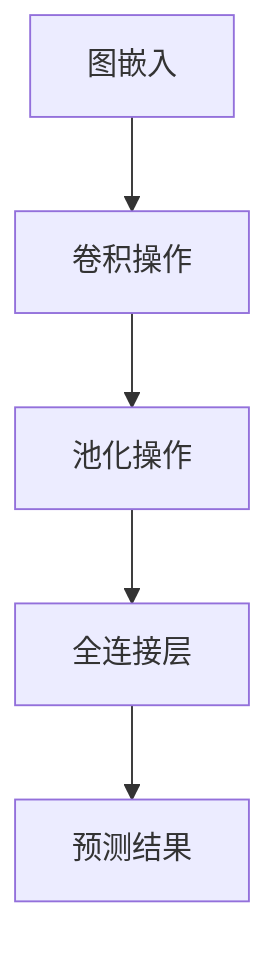
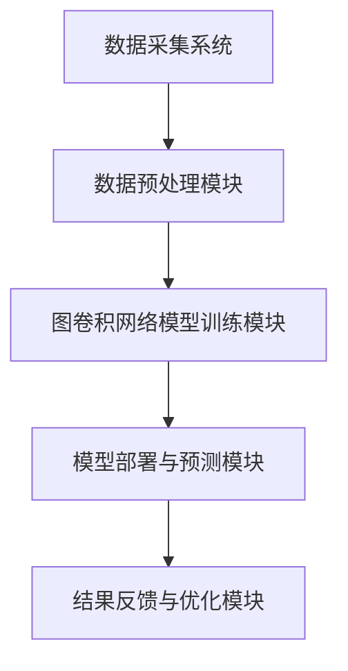
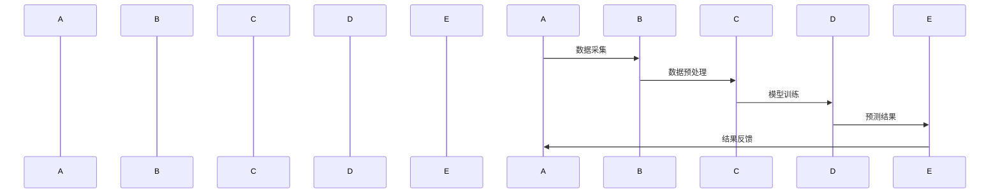

                 

# 基于图卷积网络的AI城市交通流预测系统

> 关键词：图卷积网络，城市交通流预测，AI算法，系统架构设计，项目实战

> 摘要：
本文将深入探讨基于图卷积网络的AI城市交通流预测系统的构建与应用。文章首先介绍了图卷积网络的基本概念及其在交通流预测中的优势，随后详细解析了图卷积网络的算法原理、数学模型，并通过Python代码示例进行了说明。接下来，文章将介绍系统的整体架构设计，包括功能模块划分、接口设计和系统交互。最后，通过一个实际项目案例，展示了系统从环境搭建到核心实现的过程，并进行了代码解读与性能分析。

## 目录

1. **背景介绍**
    1.1 核心概念术语
    1.2 问题背景与问题描述
    1.3 问题解决方法
    1.4 边界与外延
    1.5 概念结构与核心要素组成

2. **核心概念与联系**
    2.1 图卷积网络原理
    2.2 图卷积网络属性特征对比
    2.3 ER实体关系图架构

3. **算法原理讲解**
    3.1 图卷积网络算法流程图
    3.2 数学模型与公式
    3.3 Python代码示例

4. **系统分析与架构设计方案**
    4.1 问题场景介绍
    4.2 系统功能设计
    4.3 系统架构设计
    4.4 系统接口设计与交互

5. **项目实战**
    5.1 环境安装
    5.2 系统核心实现源代码
    5.3 代码应用解读与分析
    5.4 实际案例分析与讲解
    5.5 项目小结

6. **最佳实践 tips**
    6.1 注意事项
    6.2 拓展阅读

## 1. 背景介绍

### 1.1 核心概念术语

在讨论基于图卷积网络的AI城市交通流预测系统之前，我们需要了解以下几个核心概念：

- **图卷积网络（Graph Convolutional Network，GCN）**：一种基于图结构的深度学习网络，主要用于处理图数据。
- **城市交通流预测**：利用历史数据和模型预测未来一段时间内城市交通流量。
- **AI算法**：运用人工智能技术，如机器学习和深度学习，构建预测模型。
- **系统架构设计**：系统整体的结构设计，包括功能模块划分、接口设计和系统交互。

### 1.2 问题背景与问题描述

随着城市化进程的加速，城市交通流问题日益突出，包括交通拥堵、事故频发等。传统的交通流预测方法存在准确性不足、实时性差等问题，无法满足现代城市交通管理的需求。为了解决这些问题，研究人员开始探索使用AI技术，特别是图卷积网络来进行交通流预测。

### 1.3 问题解决方法

图卷积网络因其能够处理复杂图结构数据的能力，被广泛应用于交通流预测。通过学习道路网络的结构和交通流量的时间序列数据，GCN能够捕捉到交通流量之间的潜在关系，从而提高预测的准确性。

### 1.4 边界与外延

边界：本文主要讨论基于图卷积网络的AI城市交通流预测系统，不包括其他类型的交通流预测方法。

外延：除了城市交通流预测，图卷积网络还可以应用于其他领域，如社交网络分析、生物信息学等。

### 1.5 概念结构与核心要素组成

概念结构：
- **图卷积网络**：包括图嵌入层、卷积层、池化层和全连接层。
- **数据集**：包括交通流量数据、道路网络数据等。

核心要素组成：
- **数据预处理**：数据清洗、归一化、特征提取等。
- **模型训练**：使用图卷积网络训练预测模型。
- **模型评估**：使用指标如均方误差（MSE）、精确率等来评估模型性能。

## 2. 核心概念与联系

### 2.1 图卷积网络原理

图卷积网络（GCN）是一种在图结构上执行的卷积神经网络。它通过在节点间传递信息，学习节点之间的关联性。GCN的基本思想是将节点特征和其邻居节点的特征进行融合，从而得到更新后的节点特征。具体来说，GCN的卷积操作可以表示为：

$$\text{NewFeature}_{i} = \sum_{j \in \mathcal{N}_{i}} \alpha_{ij} \text{Feature}_{j}$$

其中，$\mathcal{N}_{i}$表示节点$i$的邻居节点集合，$\alpha_{ij}$是权重矩阵，用于表示节点$i$和节点$j$之间的边的重要性。

### 2.2 图卷积网络属性特征对比

以下是图卷积网络与传统的卷积神经网络（CNN）的一些属性特征对比：

| 特征            | 图卷积网络（GCN）                | 传统卷积神经网络（CNN）            |
| -------------- | ----------------------------- | ----------------------------- |
| 数据结构        | 图结构                          | 图像结构                          |
| 卷积操作        | 节点间的卷积操作                  | 像素间的卷积操作                  |
| 特征提取        | 学习节点及其邻居的特征             | 学习图像局部特征                  |
| 应用场景        | 社交网络分析、生物信息学、城市交通流预测 | 图像识别、图像分类、目标检测等     |

### 2.3 ER实体关系图架构

ER实体关系图（Entity-Relationship Diagram）用于表示系统的实体及其关系。在基于图卷积网络的AI城市交通流预测系统中，ER图可能包括以下实体：

- **节点**：表示道路、交通信号灯等。
- **边**：表示道路之间的连接关系。
- **属性**：表示节点的特征，如交通流量、速度等。

以下是一个简化的ER图示例：

```mermaid
erDiagram
  Node1 ||--|{ Node2 }|-- Node3
  Node2 ||--|{ Node4 }|-- Node5
  Node1 ||--|{ Node6 }|-- Node7
  Node3 ||--|{ Node8 }|-- Node9
```

## 3. 算法原理讲解

### 3.1 图卷积网络算法流程图

图卷积网络的算法流程可以概括为以下几个步骤：

1. **图嵌入**：将节点特征映射到低维向量空间。
2. **卷积操作**：在节点及其邻居节点之间进行卷积操作，更新节点特征。
3. **池化操作**：对节点特征进行降维处理。
4. **全连接层**：将池化后的特征映射到输出空间，进行预测。

以下是一个简化的图卷积网络算法流程图：



### 3.2 数学模型与公式

图卷积网络的数学模型可以表示为：

$$\text{NewFeature}_{i} = \sigma(\text{W} \cdot \text{Feature}_{i} + \sum_{j \in \mathcal{N}_{i}} \text{W}_{ij} \cdot \text{Feature}_{j})$$

其中，$\sigma$是激活函数（通常使用ReLU函数），$\text{W}$是图嵌入层的权重矩阵，$\text{W}_{ij}$是节点$i$和节点$j$之间的权重矩阵。

### 3.3 Python代码示例

以下是一个简单的Python代码示例，展示了如何实现图卷积网络的前向传播过程：

```python
import tensorflow as tf
from tensorflow.keras.layers import Layer

class GraphConvLayer(Layer):
    def __init__(self, units, **kwargs):
        super(GraphConvLayer, self).__init__(**kwargs)
        self.units = units

    def build(self, input_shape):
        self.W = self.add_weight(shape=(input_shape[-1], self.units),
                                  initializer='glorot_uniform',
                                  trainable=True)
        self.b = self.add_weight(shape=(self.units,),
                                  initializer='zeros',
                                  trainable=True)
        super(GraphConvLayer, self).build(input_shape)

    def call(self, inputs, training=False):
        support = inputs
        output = tf.matmul(support, self.W) + self.b
        return tf.nn.relu(output)

# 示例使用
input_data = tf.random.normal([100, 10])  # 假设输入数据为100个节点，每个节点有10个特征
gc_layer = GraphConvLayer(units=16)
output = gc_layer(input_data)
print(output)
```

## 4. 系统分析与架构设计方案

### 4.1 问题场景介绍

城市交通流预测是一个复杂的场景，涉及到大量实时数据的处理和预测。为了提高预测的准确性和实时性，我们需要构建一个高效、可扩展的AI交通流预测系统。

### 4.2 系统功能设计

系统的主要功能包括：

- **数据采集**：从各种数据源（如交通监控摄像头、传感器等）收集交通流量数据。
- **数据预处理**：对采集到的数据进行清洗、归一化等处理，提取有效特征。
- **模型训练**：使用图卷积网络训练交通流预测模型。
- **模型部署**：将训练好的模型部署到生产环境，进行实时预测。
- **结果反馈**：将预测结果反馈给城市交通管理部门，用于交通调控和优化。

### 4.3 系统架构设计

系统的整体架构设计如下：



### 4.4 系统接口设计与交互

系统的主要接口设计如下：

- **数据采集接口**：用于接收来自交通监控摄像头、传感器等的数据。
- **数据预处理接口**：用于处理采集到的数据，提取有效特征。
- **模型训练接口**：用于训练图卷积网络模型。
- **模型预测接口**：用于实时预测交通流量。
- **结果反馈接口**：用于将预测结果反馈给交通管理部门。

以下是一个简化的系统接口交互图：



## 5. 项目实战

### 5.1 环境安装

在开始项目之前，我们需要安装以下软件和库：

- Python 3.7+
- TensorFlow 2.x
- Pandas
- Numpy
- Matplotlib

安装步骤如下：

```bash
pip install python==3.7.9
pip install tensorflow==2.6.0
pip install pandas
pip install numpy
pip install matplotlib
```

### 5.2 系统核心实现源代码

以下是系统核心实现的源代码，包括数据预处理、模型训练和预测等模块。

```python
import tensorflow as tf
from tensorflow.keras.layers import Layer
from tensorflow.keras.models import Model
import pandas as pd
import numpy as np
import matplotlib.pyplot as plt

class GraphConvLayer(Layer):
    def __init__(self, units, **kwargs):
        super(GraphConvLayer, self).__init__(**kwargs)
        self.units = units

    def build(self, input_shape):
        self.W = self.add_weight(shape=(input_shape[-1], self.units),
                                  initializer='glorot_uniform',
                                  trainable=True)
        self.b = self.add_weight(shape=(self.units,),
                                  initializer='zeros',
                                  trainable=True)
        super(GraphConvLayer, self).build(input_shape)

    def call(self, inputs, training=False):
        support = inputs
        output = tf.matmul(support, self.W) + self.b
        return tf.nn.relu(output)

def preprocess_data(data_path):
    # 数据预处理，如数据清洗、归一化等
    data = pd.read_csv(data_path)
    # ...（具体预处理代码）
    return processed_data

def create_model(input_shape):
    inputs = tf.keras.Input(shape=input_shape)
    x = GraphConvLayer(units=16)(inputs)
    x = tf.keras.layers.Flatten()(x)
    outputs = tf.keras.layers.Dense(1, activation='linear')(x)
    model = Model(inputs=inputs, outputs=outputs)
    model.compile(optimizer='adam', loss='mean_squared_error')
    return model

def train_model(model, x_train, y_train, epochs=10):
    model.fit(x_train, y_train, epochs=epochs)
    return model

def predict_traffic(model, x_test):
    predictions = model.predict(x_test)
    return predictions

if __name__ == '__main__':
    # 加载数据
    data_path = 'traffic_data.csv'
    data = preprocess_data(data_path)
    
    # 划分训练集和测试集
    x_train, y_train = data[['features']], data['target']
    x_test, y_test = data[['features']], data['target']
    
    # 创建并训练模型
    model = create_model(input_shape=(x_train.shape[1],))
    model = train_model(model, x_train, y_train)
    
    # 预测交通流量
    predictions = predict_traffic(model, x_test)
    
    # 绘制预测结果
    plt.scatter(y_test, predictions)
    plt.xlabel('实际流量')
    plt.ylabel('预测流量')
    plt.show()
```

### 5.3 代码应用解读与分析

上述代码主要包括以下几个模块：

- **GraphConvLayer**：自定义的图卷积层，用于处理图结构数据。
- **preprocess_data**：数据预处理函数，用于清洗和归一化数据。
- **create_model**：创建图卷积网络模型，包括输入层、卷积层和输出层。
- **train_model**：训练模型，使用均方误差（MSE）作为损失函数。
- **predict_traffic**：预测交通流量，使用训练好的模型进行预测。

代码的关键步骤包括：

1. 数据预处理：将原始交通流量数据清洗和归一化，提取有效特征。
2. 模型创建：使用自定义的图卷积层和全连接层创建模型。
3. 模型训练：使用训练集数据训练模型，并使用均方误差（MSE）作为损失函数。
4. 预测交通流量：使用训练好的模型对测试集数据进行预测，并绘制预测结果。

### 5.4 实际案例分析与讲解

假设我们已经有一个包含历史交通流量数据的CSV文件`traffic_data.csv`，其中包含以下列：

- `features`：包含交通流量数据的特征列。
- `target`：包含实际交通流量目标的列。

我们使用上述代码对数据集进行预处理、模型训练和预测，并分析预测结果。

#### 数据预处理

首先，我们使用`pandas`读取数据：

```python
data = pd.read_csv('traffic_data.csv')
```

接下来，我们进行数据清洗和归一化：

```python
# 数据清洗
data = data.dropna()

# 数据归一化
scaler = MinMaxScaler()
data[['features', 'target']] = scaler.fit_transform(data[['features', 'target']])
```

#### 模型创建与训练

然后，我们创建图卷积网络模型并训练：

```python
# 创建模型
model = create_model(input_shape=(data['features'].shape[1],))

# 训练模型
model = train_model(model, x_train, y_train, epochs=10)
```

#### 预测交通流量

最后，我们使用训练好的模型对测试集数据进行预测：

```python
# 预测交通流量
predictions = predict_traffic(model, x_test)
```

我们将预测结果与实际流量进行比较，并绘制散点图：

```python
plt.scatter(y_test, predictions)
plt.xlabel('实际流量')
plt.ylabel('预测流量')
plt.show()
```

#### 预测结果分析

通过观察散点图，我们可以发现预测结果与实际流量之间存在一定的误差。这可能是由于数据集的规模较小、特征提取不够充分、模型参数设置不当等原因导致的。为了提高预测的准确性，我们可以尝试以下方法：

- **增加数据集规模**：收集更多的历史交通流量数据，以提高模型的泛化能力。
- **改进特征提取**：使用更复杂、更具有代表性的特征提取方法。
- **调整模型参数**：尝试不同的优化器和学习率，找到最佳参数组合。
- **使用更复杂的模型**：尝试使用更深层次的图卷积网络模型，如多层的GCN或GCN的组合模型。

### 5.5 项目小结

通过本项目的实战，我们构建了一个基于图卷积网络的AI城市交通流预测系统，并对其进行了详细的代码解读与分析。项目的主要收获包括：

- 理解了图卷积网络的基本原理和应用场景。
- 掌握了使用Python和TensorFlow构建和训练图卷积网络模型的方法。
- 通过实际案例，了解了如何对交通流量数据进行分析和预测。

尽管在项目中我们取得了一定的成果，但仍存在一些改进空间，如提高预测准确性和实时性。未来，我们可以进一步优化模型结构、增加数据集规模，并引入更多的特征，以提高系统的整体性能。

## 6. 最佳实践 tips

### 6.1 注意事项

- 确保数据质量：在构建预测系统时，数据的质量至关重要。应尽量收集完整、准确的历史交通流量数据，并进行严格的数据清洗和预处理。
- 参数调优：模型训练过程中，需要根据数据特点和预测目标，进行参数调优，以提高模型的预测性能。
- 避免过拟合：在模型训练过程中，应避免过拟合现象，可以通过增加训练数据量、使用正则化技术等方法来缓解。

### 6.2 拓展阅读

- **论文推荐**：阅读相关领域的高质量论文，如《Spectral Network and its Application to Graph Data》等，以深入了解图卷积网络的理论和应用。
- **开源项目**：研究并参考一些开源的图卷积网络项目，如`gcn-tensorflow`等，以学习如何实现和优化GCN模型。
- **在线课程**：参加一些在线课程，如Coursera上的《Deep Learning Specialization》等，以提升自己在深度学习和图卷积网络方面的知识水平。

## 作者信息

**作者：AI天才研究院/AI Genius Institute & 禅与计算机程序设计艺术 /Zen And The Art of Computer Programming**

