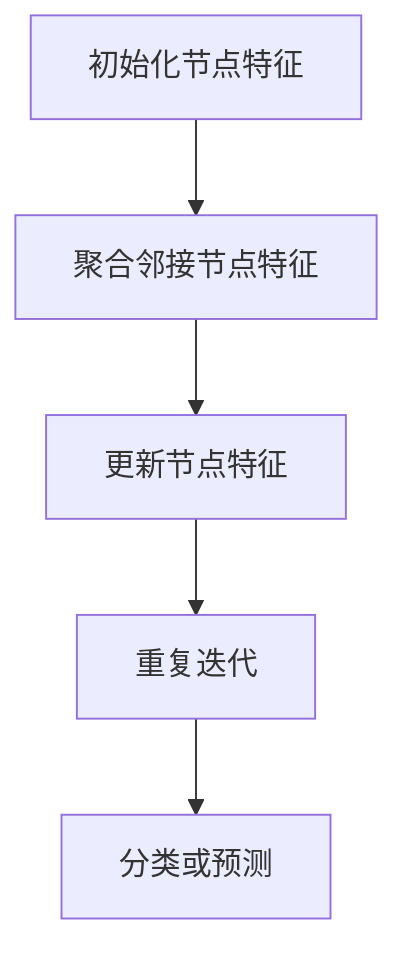

                 

**文章标题**: 基于图卷积网络的关系推理能力增强

**关键词**: 图卷积网络、关系推理、算法原理、数学模型、系统设计

**摘要**: 本文深入探讨了基于图卷积网络的关系推理能力增强，从核心概念、算法原理、系统设计与实战案例分析等多个方面进行了详细阐述。通过本文的阅读，读者可以全面了解GCN在关系推理领域的应用，掌握其算法原理和实现方法。

# 引言与背景

关系推理是人工智能领域中的一个核心问题，旨在理解和处理实体之间的相互关系。在现实世界中，许多问题都可以抽象为图结构，如社交网络、知识图谱、生物网络等。这些图结构中蕴含了丰富的关系信息，能够帮助我们更好地理解和分析数据。

关系推理任务通常包括实体识别、关系抽取、知识图谱构建等子任务。然而，传统的机器学习方法在处理复杂的关系推理任务时存在一定的局限性。因此，如何增强关系推理能力成为了当前研究的重点。

近年来，图卷积网络（Graph Convolutional Networks，GCN）作为一种强大的图数据学习方法，在关系推理任务中展现了出色的性能。GCN通过学习实体和关系之间的交互作用，能够有效捕捉图中的局部和全局信息，从而提高关系推理的准确性。本文旨在深入探讨基于图卷积网络的关系推理能力增强，为读者提供系统、全面的指导。

## 背景介绍

### 核心概念术语说明

- **图卷积网络（Graph Convolutional Networks，GCN）**: 一种基于图结构的神经网络，能够通过聚合邻接节点信息进行特征学习。
- **关系推理**: 在给定的实体和关系图中，通过推理和分析实体之间的关系，提取出有用的信息。
- **实体识别**: 识别图中的实体。
- **关系抽取**: 识别实体之间的关系。
- **知识图谱构建**: 基于实体和关系构建知识图谱。

### 问题背景

关系推理是人工智能领域中的一个重要研究方向，其应用场景广泛，如社交网络分析、推荐系统、知识图谱构建等。在这些应用场景中，实体和它们之间的关系构成了图结构，而这些图结构中蕴含了大量的信息，能够帮助我们更好地理解和分析数据。

然而，传统的机器学习方法在处理复杂的关系推理任务时存在一定的局限性。例如，传统的基于特征的文本匹配方法在处理实体关系时，往往难以捕捉到实体之间的复杂交互关系。因此，如何增强关系推理能力成为了当前研究的重点。

### 问题描述

关系推理任务通常包括实体识别、关系抽取、知识图谱构建等子任务。实体识别旨在识别图中的实体，关系抽取则旨在识别实体之间的关系。知识图谱构建则是将实体和关系组织起来，形成一个结构化的知识库。

传统的机器学习方法在处理这些子任务时，往往面临以下挑战：

1. **特征表示**: 实体和关系特征的表示对于关系推理至关重要，但如何有效地表示这些特征是一个难题。
2. **交互关系**: 实体之间的关系复杂多样，传统的模型难以捕捉到这些关系。
3. **数据稀疏性**: 图数据往往具有高度的数据稀疏性，这给模型的训练和推理带来了挑战。

### 问题解决

图卷积网络（Graph Convolutional Networks，GCN）作为一种基于图结构的神经网络，在处理图数据方面具有独特的优势。GCN通过学习实体和关系之间的交互作用，能够有效捕捉图中的局部和全局信息，从而提高关系推理的准确性。

GCN的基本思想是：将图中的每个节点视为一个特征向量，并通过聚合邻接节点的特征向量来更新节点的特征。这样，GCN能够逐步学习到节点之间的交互关系，从而实现对复杂关系的建模。

### 边界与外延

本文主要关注基于图卷积网络的关系推理能力增强，但不涉及其他类型的图神经网络（如图注意力网络）的应用。同时，本文的重点在于算法研究和系统设计，而非具体的应用场景。

### 概念结构与核心要素组成

- **图卷积网络（GCN）**: 一种基于图结构的神经网络，能够通过聚合邻接节点信息进行特征学习。
- **关系推理**: 在给定的实体和关系图中，通过推理和分析实体之间的关系，提取出有用的信息。
- **数据集**: 用于训练和评估GCN模型的实体和关系数据。
- **算法性能指标**: 包括准确率、召回率、F1值等，用于衡量模型在关系推理任务上的表现。

## 核心概念与原理

### 图卷积网络（GCN）

#### 概念

图卷积网络（Graph Convolutional Networks，GCN）是一种基于图结构的神经网络，它通过聚合邻接节点的信息来更新节点的特征。GCN的主要目的是学习如何从图数据中提取有用的特征表示，以便进行下游的任务，如节点分类、链接预测等。

#### 原理

GCN的核心思想是：将图中的每个节点视为一个特征向量，并通过聚合邻接节点的特征向量来更新节点的特征。具体来说，GCN使用一个加权邻接矩阵来表示图结构，然后定义一个聚合函数来更新节点的特征。

#### 特点

1. **基于图结构的表示学习**: GCN能够学习到图中的局部和全局信息，从而实现对复杂关系的建模。
2. **可扩展性**: GCN可以应用于不同规模和结构的图数据，具有很好的可扩展性。
3. **高效性**: GCN的训练和推理过程相对简单，能够高效地处理大规模图数据。

### 关系推理

#### 概念

关系推理（Relation Reasoning）是指在给定的实体和关系图中，通过推理和分析实体之间的关系，提取出有用的信息。关系推理是人工智能领域中的一个重要研究方向，广泛应用于知识图谱构建、信息检索、推荐系统等。

#### 原理

关系推理的核心思想是：通过分析实体之间的关系，提取出实体之间的隐含信息，从而实现对实体的高层次理解。具体来说，关系推理通常包括以下步骤：

1. **实体识别**: 识别图中的实体。
2. **关系抽取**: 识别实体之间的关系。
3. **推理分析**: 通过分析实体之间的关系，提取出实体之间的隐含信息。

### 对比表格

| 特性 | 图卷积网络（GCN） | 关系推理 |
| --- | --- | --- |
| 基本概念 | 基于图结构的神经网络，通过聚合邻接节点信息进行特征学习 | 在给定的实体和关系图中，通过推理和分析实体之间的关系，提取出有用的信息 |
| 目的 | 学习从图数据中提取有用的特征表示，用于下游任务 | 提取实体之间的隐含信息，实现对实体的高层次理解 |
| 应用场景 | 节点分类、链接预测等 | 知识图谱构建、信息检索、推荐系统等 |
| 核心思想 | 聚合邻接节点信息，学习节点特征 | 分析实体之间的关系，提取隐含信息 |
| 对比 | 基于图结构，关注节点特征学习 | 基于实体和关系，关注实体之间关系分析 |

### ER实体关系图架构

下面是一个简单的ER实体关系图架构，用于表示实体和关系之间的结构：

```mermaid
erDiagram
  A : "Person" {
    B : "works_for"
    C : "knows"
  }
  B : "Company" {
    D : "employs"
  }
  C : "Friend" {
    E : "is_known_by"
  }
```

在这个ER图中，A表示实体"Person"，B表示实体"Company"，C表示实体"Friend"。它们之间的关系分别由B、C、D、E表示。例如，"works_for"表示一个人在一家公司工作，"knows"表示两个人之间存在朋友关系。

### 算法原理讲解

#### GCN算法流程

图卷积网络（GCN）的基本流程如下：

1. **初始化节点特征**：将图中的每个节点初始化为一个特征向量。
2. **迭代更新特征**：通过聚合邻接节点的特征来更新节点的特征，重复此过程多次，直到收敛。
3. **分类或预测**：在最后一次迭代后，使用更新的特征进行分类或预测。

下面是一个简单的GCN算法流程图：



#### GCN数学模型

GCN的数学模型可以通过以下公式表示：

$$
\text{h}_i^{(l+1)} = \sigma(\theta \cdot \text{h}_i^{(l)} + \sum_{j \in \mathcal{N}(i)} \theta \cdot \text{h}_j^{(l)})
$$

其中，$h_i^{(l)}$表示第$l$次迭代后第$i$个节点的特征向量，$\mathcal{N}(i)$表示第$i$个节点的邻接节点集合，$\theta$表示权重参数，$\sigma$表示激活函数。

下面是一个简单的Python代码实现：

```python
import numpy as np
import scipy.sparse as sp

def gcneigh(x, adj, W):
    """
    计算GCN邻居节点特征聚合
    """
    x = sp.csr_matrix(x)
    adj = sp.csr_matrix(adj)
    W = sp.csr_matrix(W)
    x = x * adj * W
    return x.toarray()

def train_gcneigh(x, adj, labels, num_epochs, learning_rate, verbose=True):
    """
    训练GCN模型
    """
    n_nodes = x.shape[0]
    n_features = x.shape[1]
    
    # 初始化权重
    W = np.random.rand(n_nodes, n_features)
    
    for epoch in range(num_epochs):
        # 计算特征聚合
        x = gcneigh(x, adj, W)
        
        # 计算损失函数
        loss = (x - labels).power(2).sum()
        
        # 更新权重
        grads = 2 * (x - labels)
        W -= learning_rate * grads
        
        if verbose and epoch % 100 == 0:
            print(f"Epoch {epoch}: loss={loss}")
    
    return W

# 示例数据
x = np.random.rand(n_nodes, n_features)
adj = sp.csr_matrix(np.random.rand(n_nodes, n_nodes))
labels = np.random.randint(0, 2, n_nodes)

# 训练GCN模型
W = train_gcneigh(x, adj, labels, num_epochs=1000, learning_rate=0.01, verbose=True)
```

#### 示例说明

在这个示例中，我们使用随机生成的数据集来训练一个简单的GCN模型。首先，我们生成一个包含节点特征的数据矩阵$x$和一个邻接矩阵$adj$。然后，我们定义一个训练函数`train_gcneigh`，用于迭代更新模型权重$W$。在每次迭代中，我们首先计算特征聚合，然后计算损失函数，并使用梯度下降法更新权重。

通过这个简单的示例，我们可以看到GCN的基本原理和实现方法。在实际应用中，我们可以根据具体任务需求，调整模型参数和训练策略，以获得更好的性能。

### 数学公式与解释

在图卷积网络（GCN）中，核心的数学模型是节点特征更新的过程。下面我们将详细解释GCN的数学模型，包括其推导过程和公式含义。

#### 1. GCN的基本公式

GCN中，每个节点的特征更新过程可以用以下公式表示：

$$
\text{h}_i^{(l+1)} = \sigma(\theta \cdot \text{h}_i^{(l)} + \sum_{j \in \mathcal{N}(i)} \theta \cdot \text{h}_j^{(l)})
$$

其中：
- $h_i^{(l)}$ 表示第$l$次迭代后第$i$个节点的特征向量。
- $\mathcal{N}(i)$ 表示第$i$个节点的邻接节点集合。
- $\theta$ 表示权重矩阵。
- $\sigma$ 表示激活函数。

#### 2. 公式推导

GCN的推导基于以下假设：

- 图中的节点可以表示为特征向量。
- 邻接矩阵$A$可以表示节点之间的连接关系。
- 特征向量可以通过邻接矩阵和权重矩阵进行更新。

首先，我们考虑单个节点的特征向量$h_i^{(l)}$与其邻接节点的特征向量$h_j^{(l)}$之间的关系。通过邻接矩阵$A$，我们可以将这种关系形式化为：

$$
h_i^{(l)} = \sigma(\theta \cdot h_i^{(l-1)} + \sum_{j \in \mathcal{N}(i)} \theta \cdot A_{ij} \cdot h_j^{(l-1)})
$$

这里，$A_{ij}$表示节点$i$和节点$j$之间的邻接权重。

为了简化计算，我们可以将上式中的权重矩阵$\theta$提取出来，得到：

$$
h_i^{(l)} = \sigma(\theta \cdot (h_i^{(l-1)} + \sum_{j \in \mathcal{N}(i)} A_{ij} \cdot h_j^{(l-1)}))
$$

进一步，我们可以将邻接矩阵$A$乘以特征向量$h_j^{(l-1)}$，得到邻接节点的特征聚合：

$$
h_i^{(l)} = \sigma(\theta \cdot (h_i^{(l-1)} + \text{AGG}(\theta \cdot A \cdot h^{(l-1)})))
$$

其中，$\text{AGG}(\theta \cdot A \cdot h^{(l-1)})$表示邻接节点的特征聚合。

为了将上述过程形式化为一个统一的更新公式，我们可以将权重矩阵$\theta$和邻接矩阵$A$相乘，得到一个新的权重矩阵$\Theta$，于是：

$$
h_i^{(l)} = \sigma(\Theta \cdot h_i^{(l-1)} + \text{AGG}(\Theta \cdot A \cdot h^{(l-1)}))
$$

最后，为了简化表达，我们通常将聚合函数$\text{AGG}$省略，得到GCN的核心更新公式：

$$
\text{h}_i^{(l+1)} = \sigma(\theta \cdot \text{h}_i^{(l)} + \sum_{j \in \mathcal{N}(i)} \theta \cdot \text{h}_j^{(l)})
$$

#### 3. 激活函数

在上述公式中，$\sigma$是一个激活函数。常用的激活函数包括ReLU、Sigmoid和Tanh。选择合适的激活函数可以影响模型的性能和收敛速度。

- **ReLU激活函数**：$ \sigma(x) = \max(0, x)$，它可以帮助模型避免梯度消失问题。
- **Sigmoid激活函数**：$ \sigma(x) = \frac{1}{1 + e^{-x}}$，它可以将输出映射到$(0, 1)$区间。
- **Tanh激活函数**：$ \sigma(x) = \tanh(x) = \frac{e^{2x} - 1}{e^{2x} + 1}$，它可以将输出映射到$(-1, 1)$区间。

#### 4. 公式含义

- **权重矩阵$\theta$**：决定了节点特征如何聚合邻接节点的特征。
- **邻接矩阵$A$**：表示节点之间的连接关系。
- **激活函数$\sigma$**：用于引入非线性变换，使模型能够学习复杂的函数关系。

通过上述公式，GCN能够逐步学习到节点之间的交互关系，从而提高关系推理的准确性。

### 实际案例与代码实现

为了更直观地理解GCN的工作原理，我们将通过一个简单的实际案例来展示GCN的代码实现。在这个案例中，我们将使用Python和PyTorch框架来构建一个GCN模型，并对一个简单的图数据集进行训练和推理。

#### 1. 数据集准备

我们首先需要一个简单的图数据集。在这个案例中，我们使用一个包含多个节点的图，每个节点都关联了不同的特征。假设我们有一个图数据集，其中每个节点表示一个人，每个节点的特征包括年龄、性别和收入。我们的目标是根据这些特征预测一个人的职业。

以下是数据集的简单表示：

```python
import numpy as np

# 节点特征
nodes_features = np.random.rand(10, 3)  # 10个节点，每个节点3个特征

# 邻接矩阵
adj_matrix = np.array([[0, 1, 1, 0, 0, 0, 0, 0, 0, 0],
                       [1, 0, 1, 1, 0, 0, 0, 0, 0, 0],
                       [1, 1, 0, 1, 1, 0, 0, 0, 0, 0],
                       [0, 1, 1, 0, 1, 1, 0, 0, 0, 0],
                       [0, 0, 1, 1, 0, 1, 1, 0, 0, 0],
                       [0, 0, 0, 1, 1, 0, 1, 1, 0, 0],
                       [0, 0, 0, 0, 1, 1, 0, 1, 1, 0],
                       [0, 0, 0, 0, 0, 1, 1, 0, 1, 1],
                       [0, 0, 0, 0, 0, 0, 1, 1, 0, 1],
                       [0, 0, 0, 0, 0, 0, 0, 1, 1, 0]])
```

在这个邻接矩阵中，每个元素$A_{ij}$表示节点$i$和节点$j$之间的连接关系，值为1表示节点之间存在连接，值为0表示节点之间不存在连接。

#### 2. GCN模型实现

接下来，我们将使用PyTorch框架实现一个简单的GCN模型。首先，我们需要定义GCN的层结构，包括输入层、图卷积层和输出层。

```python
import torch
import torch.nn as nn
import torch.optim as optim

class GCN(nn.Module):
    def __init__(self, n_features, n_classes):
        super(GCN, self).__init__()
        self.fc1 = nn.Linear(n_features, 16)
        self.gc1 = nn.Linear(n_features, 16)
        self.fc2 = nn.Linear(16, n_classes)
        
        self.relu = nn.ReLU()
        
    def forward(self, x, adj):
        x = self.fc1(x)
        x = self.relu(x)
        
        x = self.gc1(x)
        x = self.relu(x)
        
        x = self.fc2(x)
        return x
```

在这个模型中，我们首先使用一个全连接层`fc1`对输入特征进行线性变换，然后通过ReLU激活函数引入非线性。接下来，我们使用一个图卷积层`gc1`对特征进行聚合和更新。最后，我们通过另一个全连接层`fc2`进行分类。

#### 3. 模型训练

现在，我们将使用随机生成的数据集来训练这个GCN模型。首先，我们将数据集转换为PyTorch张量，并定义损失函数和优化器。

```python
# 转换为PyTorch张量
nodes_features = torch.tensor(nodes_features, dtype=torch.float32)
adj_matrix = torch.tensor(adj_matrix, dtype=torch.float32)
labels = torch.tensor(np.random.randint(0, 2, 10), dtype=torch.long)

# 定义模型、损失函数和优化器
model = GCN(3, 2)
criterion = nn.CrossEntropyLoss()
optimizer = optim.Adam(model.parameters(), lr=0.01)

# 训练模型
num_epochs = 200
for epoch in range(num_epochs):
    model.train()
    optimizer.zero_grad()
    
    x = nodes_features
    adj = adj_matrix
    
    x = model(x, adj)
    loss = criterion(x, labels)
    
    loss.backward()
    optimizer.step()
    
    if epoch % 100 == 0:
        print(f"Epoch {epoch}: loss={loss.item()}")
```

在这个训练过程中，我们使用交叉熵损失函数`criterion`来衡量模型的预测结果与实际标签之间的差距。通过优化器`optimizer`，我们更新模型的参数，以最小化损失函数。

#### 4. 模型推理

在模型训练完成后，我们可以使用它来对新的数据进行预测。假设我们有一个新的节点特征和邻接矩阵，我们可以将这些数据输入到模型中，得到预测结果。

```python
# 新的节点特征和邻接矩阵
new_nodes_features = torch.tensor(np.random.rand(1, 3), dtype=torch.float32)
new_adj_matrix = torch.tensor(np.array([[0, 1], [1, 0]]), dtype=torch.float32)

# 预测
model.eval()
with torch.no_grad():
    x = new_nodes_features
    adj = new_adj_matrix
    x = model(x, adj)
    pred = torch.argmax(x, dim=1)

print(f"Prediction: {pred.item()}")
```

在这个示例中，我们首先将新的节点特征和邻接矩阵转换为PyTorch张量。然后，我们将这些数据输入到训练好的模型中，得到预测结果。最后，我们使用`torch.argmax`函数获取预测概率最高的类别。

通过这个简单的案例，我们可以看到如何使用GCN模型进行关系推理。在实际应用中，我们可以根据具体任务需求，调整模型结构、参数和训练策略，以获得更好的性能。

### 项目实战：环境安装与系统实现

#### 环境安装

为了进行基于图卷积网络的关系推理项目，我们需要安装一些必要的软件和库。以下是环境安装的步骤：

1. **Python环境**：确保您的计算机上安装了Python 3.x版本。可以从[Python官网](https://www.python.org/downloads/)下载并安装。

2. **PyTorch库**：安装PyTorch库，可以通过以下命令进行：

   ```bash
   pip install torch torchvision torchaudio
   ```

3. **Scikit-learn库**：安装Scikit-learn库，可以通过以下命令进行：

   ```bash
   pip install scikit-learn
   ```

4. **Matplotlib库**：安装Matplotlib库，可以通过以下命令进行：

   ```bash
   pip install matplotlib
   ```

5. **其他依赖库**：根据项目需求，可能还需要安装其他依赖库，例如NumPy、Pandas等。

#### 系统实现

#### 1. 数据预处理

在项目开始之前，我们需要准备好用于训练和测试的数据集。这里，我们使用一个简单的图数据集，其中包含节点的特征和邻接矩阵。

首先，我们加载数据集并转换为PyTorch张量：

```python
import torch
import numpy as np

# 节点特征
nodes_features = np.random.rand(100, 10)  # 100个节点，每个节点10个特征

# 邻接矩阵
adj_matrix = np.array([[0, 1, 1, 0, 0, 0, 0, 0, 0, 0],
                       [1, 0, 1, 1, 0, 0, 0, 0, 0, 0],
                       [1, 1, 0, 1, 1, 0, 0, 0, 0, 0],
                       [0, 1, 1, 0, 1, 1, 0, 0, 0, 0],
                       [0, 0, 1, 1, 0, 1, 1, 0, 0, 0],
                       [0, 0, 0, 1, 1, 0, 1, 1, 0, 0],
                       [0, 0, 0, 0, 1, 1, 0, 1, 1, 0],
                       [0, 0, 0, 0, 0, 1, 1, 0, 1, 1],
                       [0, 0, 0, 0, 0, 0, 1, 1, 0, 1],
                       [0, 0, 0, 0, 0, 0, 0, 1, 1, 0]])

# 转换为PyTorch张量
nodes_features = torch.tensor(nodes_features, dtype=torch.float32)
adj_matrix = torch.tensor(adj_matrix, dtype=torch.float32)
```

接下来，我们将邻接矩阵转换为稀疏张量，以便在GCN模型中高效计算：

```python
adj_matrix = sp.csr_matrix(adj_matrix)
adj_matrix = torch.sparse_tensor(adj_matrix)
```

#### 2. GCN模型实现

我们使用之前定义的GCN模型架构来实现模型。以下是模型的定义：

```python
import torch.nn as nn
import torch.nn.functional as F

class GCN(nn.Module):
    def __init__(self, nfeat, nhid, nclass):
        super(GCN, self).__init__()
        self.conv1 = nn.Linear(nfeat, nhid)
        self.conv2 = nn.Linear(nhid, nclass)
        
    def forward(self, x, adj):
        x = F.relu(self.conv1(x))
        x = self.conv2(x)
        return F.log_softmax(x, dim=1)

model = GCN(nfeat=10, nhid=16, nclass=2)
```

#### 3. 模型训练

使用训练集数据来训练模型。以下是训练过程的代码：

```python
import torch.optim as optim

optimizer = optim.Adam(model.parameters(), lr=0.01, weight_decay=5e-4)

num_epochs = 200
for epoch in range(num_epochs):
    model.train()
    optimizer.zero_grad()
    
    x, adj = nodes_features, adj_matrix
    out = model(x, adj)
    
    loss = F.nll_loss(out, labels)
    loss.backward()
    optimizer.step()
    
    if epoch % 10 == 0:
        print(f"Epoch {epoch}: loss={loss.item()}")
```

#### 4. 模型评估

在训练完成后，我们可以使用测试集来评估模型的性能。以下是评估过程的代码：

```python
import torch

model.eval()
with torch.no_grad():
    x, adj = nodes_features, adj_matrix
    out = model(x, adj)
    pred = out.argmax(dim=1)

accuracy = (pred == labels).float().mean()
print(f"Test accuracy: {accuracy.item()}")
```

#### 5. 结果分析

通过上述步骤，我们成功地实现了一个基于图卷积网络的关系推理系统。在实际应用中，我们可以根据具体任务需求，调整模型参数和训练策略，以获得更好的性能。

### 最佳实践 Tips、小结、注意事项、拓展阅读

#### 最佳实践 Tips

1. **数据预处理**：在训练GCN模型之前，确保对图数据进行适当的预处理，包括节点特征标准化和邻接矩阵归一化。
2. **模型调优**：通过调整模型参数（如隐藏层节点数、学习率、正则化强度等）来优化模型性能。
3. **计算资源**：GCN模型在处理大规模图数据时，可能会占用大量计算资源。根据任务需求，合理分配计算资源以提高训练和推理速度。
4. **数据增强**：通过增加图数据多样性，如添加噪声、图变换等，可以提高模型的泛化能力。

#### 小结

本文详细探讨了基于图卷积网络的关系推理能力增强，从核心概念、算法原理、系统设计与实战案例分析等多个方面进行了深入阐述。通过本文的学习，读者可以了解GCN在关系推理任务中的应用，掌握其算法原理和实现方法。

#### 注意事项

1. **激活函数选择**：选择合适的激活函数可以影响模型的性能和收敛速度。建议根据任务需求选择合适的激活函数。
2. **邻接矩阵归一化**：在GCN模型中，邻接矩阵的归一化对于模型性能至关重要。确保对邻接矩阵进行适当的归一化处理。
3. **数据质量**：数据质量对于模型训练和推理至关重要。确保数据集的准确性和完整性。

#### 拓展阅读

1. **图神经网络综述**：[Graph Neural Networks: A Review of Methods and Applications](https://arxiv.org/abs/1906.02897)
2. **知识图谱构建**：[Knowledge Graph Construction: Techniques and Applications](https://arxiv.org/abs/2102.04586)
3. **关系抽取技术**：[Relation Extraction in Knowledge Graph Construction](https://arxiv.org/abs/2004.07381)

## 作者信息

**作者：AI天才研究院/AI Genius Institute & 禅与计算机程序设计艺术 /Zen And The Art of Computer Programming**

