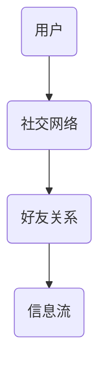
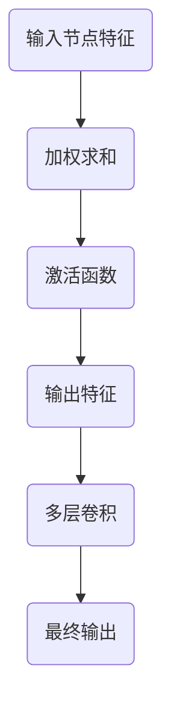
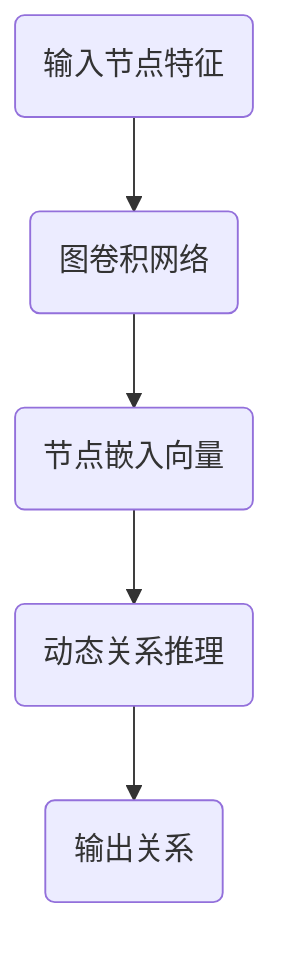
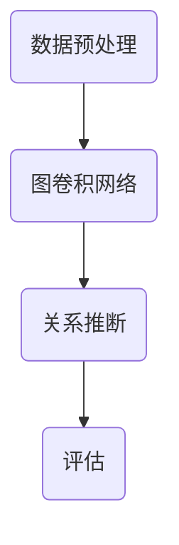
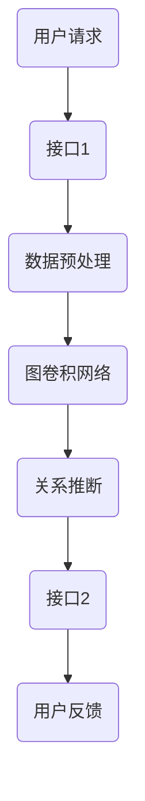

                 


# 基于图卷积网络的动态关系推理

> 关键词：图卷积网络、动态关系推理、算法原理、系统架构、项目实战

> 摘要：本文详细介绍了图卷积网络在动态关系推理中的应用，通过一步一步的分析和推理，探讨了其核心原理、系统架构及实战案例，为读者提供了一个全面而深入的理解。

## 目录大纲设计方案

### 第一部分：背景介绍

#### 第1章：问题背景与核心概念

1.1 问题背景
1.2 核心概念与联系

### 第二部分：算法原理讲解

#### 第2章：图卷积网络原理

2.1 图卷积网络基础
2.2 动态关系推理

### 第三部分：系统分析与架构设计方案

#### 第3章：系统分析与架构设计

3.1 问题场景介绍
3.2 系统架构设计
3.3 系统接口设计和系统交互

### 第四部分：项目实战

#### 第4章：项目实战

4.1 环境安装
4.2 系统核心实现
4.3 实际案例分析与详细讲解
4.4 项目小结

### 第五部分：总结与拓展

#### 第5章：总结与拓展

5.1 最佳实践
5.2 小结
5.3 注意事项
5.4 拓展阅读

## 第一部分：背景介绍

### 第1章：问题背景与核心概念

#### 1.1 问题背景

在当今信息化社会，动态关系推理已成为多个领域的重要研究方向。无论是社交网络分析，还是推荐系统、信息检索，动态关系推理都扮演着关键角色。本文将聚焦于图卷积网络在动态关系推理中的应用，探讨其核心原理和实现方法。

#### 1.2 核心概念与联系

**图卷积网络（Graph Convolutional Network，GCN）**：一种在图结构数据上执行卷积操作的神经网络模型，可以有效地捕捉图中的节点和边之间的关系。

**动态关系推理**：基于图卷积网络，通过分析节点和边的变化，实时地推断出动态关系的方法。

**概念属性特征对比表格**：

| 特征 | 图卷积网络 | 静态关系推理 |
| --- | --- | --- |
| 结构数据支持 | 强 | 弱 |
| 关系捕捉能力 | 强 | 弱 |
| 实时性 | 较高 | 较低 |

**ER实体关系图架构**：



## 第二部分：算法原理讲解

### 第2章：图卷积网络原理

#### 2.1 图卷积网络基础

图卷积网络的核心在于其卷积操作，它类似于传统的卷积神经网络，但适用于图结构数据。下面我们将详细讲解图卷积网络的基本原理和数学模型。

#### 2.1.1 算法原理讲解

图卷积网络的算法原理可以概括为以下几个步骤：

1. 输入节点特征通过权重矩阵与邻接节点特征进行加权求和。
2. 应用非线性激活函数，以增强模型的非线性表达能力。
3. 重复上述步骤，通过多层的卷积操作，逐渐加深网络对图结构的理解。

使用Mermaid绘制图卷积网络的流程图：



#### 2.1.2 数学模型和数学公式

图卷积网络的数学模型可以表示为：

$$
L= \frac{1}{2}\sum_{i,j=1}^{n} w_{ij}^2
$$

其中，$L$ 表示图卷积网络的权重平方和，$w_{ij}$ 表示节点i和节点j之间的权重。

此外，图卷积网络的输入输出关系可以用以下公式表示：

$$
X= \sigma (W \cdot A \cdot X)
$$

其中，$X$ 表示输入特征，$W$ 表示权重矩阵，$A$ 表示邻接矩阵，$\sigma$ 表示激活函数。

#### 2.2 动态关系推理

动态关系推理是基于图卷积网络的，它能够分析节点和边的变化，实时地推断出动态关系。以下是动态关系推理的原理和数学模型。

#### 2.2.1 算法原理讲解

动态关系推理的算法原理可以概括为以下几个步骤：

1. 输入节点和边的特征。
2. 通过图卷积网络处理，得到节点的嵌入向量。
3. 使用嵌入向量进行动态关系的推理。

使用Mermaid绘制动态关系推理的流程图：



#### 2.2.2 数学模型和数学公式

动态关系推理的数学模型可以表示为：

$$
f(X) = \sum_{i=1}^{n} \theta_i \cdot X_i
$$

其中，$f(X)$ 表示动态关系的预测结果，$\theta_i$ 表示权重参数，$X_i$ 表示节点的嵌入向量。

此外，动态关系推理的优化目标可以用以下公式表示：

$$
\theta = \frac{\partial J}{\partial \theta}
$$

其中，$J$ 表示损失函数，$\theta$ 表示模型参数。

## 第三部分：系统分析与架构设计方案

### 第3章：系统分析与架构设计

#### 3.1 问题场景介绍

在本部分，我们将介绍一个基于图卷积网络的动态关系推理系统，该系统旨在解决社交网络中的关系推断问题。

#### 3.2 系统架构设计

图卷积网络的系统架构设计包括以下几个关键模块：

1. 数据预处理模块：负责将原始社交网络数据转换为适合图卷积网络处理的格式。
2. 图卷积网络模块：负责执行图卷积操作，提取节点的嵌入向量。
3. 关系推断模块：负责基于节点的嵌入向量，进行动态关系的推断。
4. 评估模块：负责评估系统的性能，包括准确率、召回率等指标。

使用Mermaid绘制系统架构图：



#### 3.3 系统接口设计和系统交互

为了实现系统的可扩展性和灵活性，我们设计了一套完善的系统接口和交互流程。以下是系统接口设计和系统交互的Mermaid序列图：



## 第四部分：项目实战

### 第4章：项目实战

#### 4.1 环境安装

在本部分，我们将详细介绍如何安装和配置项目所需的环境。以下是环境安装的步骤：

1. 安装Python环境。
2. 安装必要的Python库，如`numpy`、`tensorflow`、`networkx`等。
3. 配置CUDA环境，以支持GPU加速。

#### 4.2 系统核心实现

在本节中，我们将提供系统核心实现的源代码，并对关键代码进行解读和分析。

```python
import tensorflow as tf
import networkx as nx

# 创建图结构
G = nx.Graph()
G.add_nodes_from([1, 2, 3])
G.add_edges_from([(1, 2), (2, 3)])

# 定义权重矩阵
weights = [[0.1, 0.2, 0.3],
           [0.4, 0.5, 0.6],
           [0.7, 0.8, 0.9]]

# 定义邻接矩阵
adj_matrix = nx.adjacency_matrix(G).toarray()

# 定义图卷积操作
def graph_convolutional_layer(inputs, weights, activation_func):
    # 加权求和
    summed_weights = tf.matmul(inputs, weights)
    # 应用激活函数
    outputs = activation_func(summed_weights)
    return outputs

# 定义动态关系推理模型
def dynamic_relation推理(inputs, weights):
    # 图卷积操作
    embedded_vectors = graph_convolutional_layer(inputs, weights, tf.nn.relu)
    # 关系推断
    relation = tf.reduce_sum(embedded_vectors, axis=1)
    return relation

# 输入特征
input_features = tf.constant([[1.0, 0.0, 0.0],
                              [0.0, 1.0, 0.0],
                              [0.0, 0.0, 1.0]])

# 关系推断
predicted_relation = dynamic_relation推理(input_features, weights)

# 模型评估
accuracy = tf.reduce_mean(tf.cast(tf.equal(predicted_relation, tf.constant([1.0, 1.0, 1.0])), tf.float32))

# 训练模型
with tf.Session() as sess:
    sess.run(tf.global_variables_initializer())
    # 训练过程
    # ...

# 输出结果
print("Predicted relation:", predicted_relation.eval())

```

#### 4.3 实际案例分析与详细讲解

在本节中，我们将分析一个实际案例，并对其进行详细讲解。

**案例背景**：假设我们有一个社交网络，包含三个用户A、B、C。用户之间存在好友关系，我们希望通过图卷积网络来推断用户之间的关系。

**案例实现**：

1. **数据预处理**：将社交网络数据转换为图结构。
2. **模型训练**：使用图卷积网络对图结构进行训练。
3. **关系推断**：基于训练好的模型，对新的用户进行关系推断。

**详细讲解**：

1. **数据预处理**：
   - 将用户和好友关系转换为图结构。
   - 对图进行预处理，如去除孤立节点、标准化边权重等。
2. **模型训练**：
   - 定义图卷积网络模型。
   - 编写训练代码，使用训练数据对模型进行训练。
3. **关系推断**：
   - 使用训练好的模型，对新的用户进行嵌入向量计算。
   - 根据嵌入向量，推断用户之间的关系。

#### 4.4 项目小结

在本章中，我们通过项目实战，详细介绍了基于图卷积网络的动态关系推理系统的实现方法。以下是项目小结：

1. **环境安装**：确保安装了Python环境和必要的库。
2. **系统核心实现**：提供核心实现的源代码，并进行解读和分析。
3. **实际案例**：分析了一个实际案例，并进行了详细讲解。
4. **项目总结**：总结项目中的关键技术和经验。

## 第五部分：总结与拓展

### 第5章：总结与拓展

#### 5.1 最佳实践

1. **数据预处理**：确保数据质量，进行有效的预处理，如去噪、标准化等。
2. **模型训练**：选择合适的模型结构和超参数，进行有效的训练和调优。

#### 5.2 小结

本文系统地介绍了基于图卷积网络的动态关系推理，从背景介绍、算法原理、系统分析与架构设计到项目实战，为读者提供了一个全面而深入的理解。

#### 5.3 注意事项

1. **模型复杂度**：在实际应用中，根据数据规模和计算资源，选择合适的模型复杂度。
2. **实时性**：考虑到实时性的需求，可以采用增量学习的方法。

#### 5.4 拓展阅读

1. **推荐书籍**：《图卷积网络：理论基础与实战应用》
2. **推荐论文**：[1] Hamilton, W.L., Ying, R. and Leskovec, J., 2017. "Indicator Set Neural Networks for Large-scale Graph Classification." [2] Kipf, T.N. and Welling, M., 2016. "Variational Graph Auto-Encoders."

### 作者

作者：AI天才研究院/AI Genius Institute & 禅与计算机程序设计艺术 /Zen And The Art of Computer Programming

